cola Report for GDS4516
==================

**Date**: 2019-12-25 21:38:25 CET, **cola version**: 1.3.2

----------------------------------------------------------------

<style type='text/css'>

body, td, th {
   font-family: Arial,Helvetica,sans-serif;
   background-color: white;
   font-size: 13px;
  max-width: 800px;
  margin: auto;
  margin-left:210px;
  padding: 0px 10px 0px 10px;
  border-left: 1px solid #EEEEEE;
  line-height: 150%;
}

tt, code, pre {
   font-family: 'DejaVu Sans Mono', 'Droid Sans Mono', 'Lucida Console', Consolas, Monaco, 

monospace;
}

h1 {
   font-size:2.2em;
}

h2 {
   font-size:1.8em;
}

h3 {
   font-size:1.4em;
}

h4 {
   font-size:1.0em;
}

h5 {
   font-size:0.9em;
}

h6 {
   font-size:0.8em;
}

a {
  text-decoration: none;
  color: #0366d6;
}

a:hover {
  text-decoration: underline;
}

a:visited {
   color: #0366d6;
}

pre, img {
  max-width: 100%;
}
pre {
  overflow-x: auto;
}
pre code {
   display: block; padding: 0.5em;
}

code {
  font-size: 92%;
  border: 1px solid #ccc;
}

code[class] {
  background-color: #F8F8F8;
}

table, td, th {
  border: 1px solid #ccc;
}

blockquote {
   color:#666666;
   margin:0;
   padding-left: 1em;
   border-left: 0.5em #EEE solid;
}

hr {
   height: 0px;
   border-bottom: none;
   border-top-width: thin;
   border-top-style: dotted;
   border-top-color: #999999;
}

@media print {
   * {
      background: transparent !important;
      color: black !important;
      filter:none !important;
      -ms-filter: none !important;
   }

   body {
      font-size:12pt;
      max-width:100%;
   }

   a, a:visited {
      text-decoration: underline;
   }

   hr {
      visibility: hidden;
      page-break-before: always;
   }

   pre, blockquote {
      padding-right: 1em;
      page-break-inside: avoid;
   }

   tr, img {
      page-break-inside: avoid;
   }

   img {
      max-width: 100% !important;
   }

   @page :left {
      margin: 15mm 20mm 15mm 10mm;
   }

   @page :right {
      margin: 15mm 10mm 15mm 20mm;
   }

   p, h2, h3 {
      orphans: 3; widows: 3;
   }

   h2, h3 {
      page-break-after: avoid;
   }
}
</style>


## Summary


All available functions which can be applied to this `res_list` object:


```r
res_list
```

```
#> A 'ConsensusPartitionList' object with 24 methods.
#>   On a matrix with 51941 rows and 104 columns.
#>   Top rows are extracted by 'SD, CV, MAD, ATC' methods.
#>   Subgroups are detected by 'hclust, kmeans, skmeans, pam, mclust, NMF' method.
#>   Number of partitions are tried for k = 2, 3, 4, 5, 6.
#>   Performed in total 30000 partitions by row resampling.
#> 
#> Following methods can be applied to this 'ConsensusPartitionList' object:
#>  [1] "cola_report"           "collect_classes"       "collect_plots"         "collect_stats"        
#>  [5] "colnames"              "functional_enrichment" "get_anno_col"          "get_anno"             
#>  [9] "get_classes"           "get_matrix"            "get_membership"        "get_stats"            
#> [13] "is_best_k"             "is_stable_k"           "ncol"                  "nrow"                 
#> [17] "rownames"              "show"                  "suggest_best_k"        "test_to_known_factors"
#> [21] "top_rows_heatmap"      "top_rows_overlap"     
#> 
#> You can get result for a single method by, e.g. object["SD", "hclust"] or object["SD:hclust"]
#> or a subset of methods by object[c("SD", "CV")], c("hclust", "kmeans")]
```

The call of `run_all_consensus_partition_methods()` was:


```
#> run_all_consensus_partition_methods(data = mat, mc.cores = 4, anno = anno)
```

Dimension of the input matrix:


```r
mat = get_matrix(res_list)
dim(mat)
```

```
#> [1] 51941   104
```

### Density distribution

The density distribution for each sample is visualized as in one column in the
following heatmap. The clustering is based on the distance which is the
Kolmogorov-Smirnov statistic between two distributions.


```r
library(ComplexHeatmap)
densityHeatmap(mat, top_annotation = HeatmapAnnotation(df = get_anno(res_list), 
    col = get_anno_col(res_list)), ylab = "value", cluster_columns = TRUE, show_column_names = FALSE,
    mc.cores = 4)
```


### Suggest the best k


Folowing table shows the best `k` (number of partitions) for each combination
of top-value methods and partition methods. Clicking on the method name in
the table goes to the section for a single combination of methods.

[The cola vignette](http://bioconductor.org/packages/devel/bioc/vignettes/cola/inst/doc/cola.html#toc_13)
explains the definition of the metrics used for determining the best
number of partitions.


```r
suggest_best_k(res_list)
```


|                            | The best k| 1-PAC| Mean silhouette| Concordance|   |
|:---------------------------|----------:|-----:|---------------:|-----------:|:--|
|[ATC:kmeans](#ATC-kmeans)   |          2| 1.000|           0.998|       0.999|** |
|[ATC:skmeans](#ATC-skmeans) |          2| 1.000|           0.994|       0.997|** |
|[SD:NMF](#SD-NMF)           |          2| 0.918|           0.920|       0.967|*  |
|[SD:mclust](#SD-mclust)     |          2| 0.900|           0.907|       0.966|*  |
|[CV:NMF](#CV-NMF)           |          2| 0.900|           0.931|       0.971|*  |
|[MAD:skmeans](#MAD-skmeans) |          2| 0.882|           0.915|       0.965|   |
|[CV:skmeans](#CV-skmeans)   |          2| 0.864|           0.901|       0.962|   |
|[MAD:NMF](#MAD-NMF)         |          2| 0.861|           0.906|       0.961|   |
|[SD:skmeans](#SD-skmeans)   |          2| 0.845|           0.934|       0.969|   |
|[SD:kmeans](#SD-kmeans)     |          2| 0.827|           0.884|       0.954|   |
|[CV:kmeans](#CV-kmeans)     |          2| 0.824|           0.902|       0.958|   |
|[MAD:kmeans](#MAD-kmeans)   |          2| 0.824|           0.911|       0.961|   |
|[ATC:pam](#ATC-pam)         |          2| 0.812|           0.920|       0.960|   |
|[SD:pam](#SD-pam)           |          2| 0.788|           0.900|       0.953|   |
|[ATC:NMF](#ATC-NMF)         |          2| 0.756|           0.875|       0.947|   |
|[MAD:pam](#MAD-pam)         |          2| 0.733|           0.876|       0.945|   |
|[CV:pam](#CV-pam)           |          2| 0.716|           0.866|       0.940|   |
|[ATC:hclust](#ATC-hclust)   |          2| 0.641|           0.901|       0.941|   |
|[ATC:mclust](#ATC-mclust)   |          3| 0.530|           0.707|       0.805|   |
|[MAD:mclust](#MAD-mclust)   |          3| 0.275|           0.535|       0.745|   |
|[CV:mclust](#CV-mclust)     |          3| 0.262|           0.393|       0.733|   |
|[CV:hclust](#CV-hclust)     |          4| 0.199|           0.355|       0.620|   |
|[SD:hclust](#SD-hclust)     |          3| 0.155|           0.497|       0.652|   |
|[MAD:hclust](#MAD-hclust)   |          3| 0.148|           0.521|       0.707|   |

\*\*: 1-PAC > 0.95, \*: 1-PAC > 0.9


### CDF of consensus matrices

Cumulative distribution function curves of consensus matrix for all methods.


```r
collect_plots(res_list, fun = plot_ecdf)
```


### Consensus heatmap

Consensus heatmaps for all methods. ([What is a consensus heatmap?](http://bioconductor.org/packages/devel/bioc/vignettes/cola/inst/doc/cola.html#toc_9))


<style type='text/css'>


.ui-helper-hidden {
	display: none;
}
.ui-helper-hidden-accessible {
	border: 0;
	clip: rect(0 0 0 0);
	height: 1px;
	margin: -1px;
	overflow: hidden;
	padding: 0;
	position: absolute;
	width: 1px;
}
.ui-helper-reset {
	margin: 0;
	padding: 0;
	border: 0;
	outline: 0;
	line-height: 1.3;
	text-decoration: none;
	font-size: 100%;
	list-style: none;
}
.ui-helper-clearfix:before,
.ui-helper-clearfix:after {
	content: "";
	display: table;
	border-collapse: collapse;
}
.ui-helper-clearfix:after {
	clear: both;
}
.ui-helper-zfix {
	width: 100%;
	height: 100%;
	top: 0;
	left: 0;
	position: absolute;
	opacity: 0;
	filter:Alpha(Opacity=0); 
}

.ui-front {
	z-index: 100;
}


.ui-state-disabled {
	cursor: default !important;
	pointer-events: none;
}


.ui-icon {
	display: inline-block;
	vertical-align: middle;
	margin-top: -.25em;
	position: relative;
	text-indent: -99999px;
	overflow: hidden;
	background-repeat: no-repeat;
}

.ui-widget-icon-block {
	left: 50%;
	margin-left: -8px;
	display: block;
}


.ui-widget-overlay {
	position: fixed;
	top: 0;
	left: 0;
	width: 100%;
	height: 100%;
}
.ui-accordion .ui-accordion-header {
	display: block;
	cursor: pointer;
	position: relative;
	margin: 2px 0 0 0;
	padding: .5em .5em .5em .7em;
	font-size: 100%;
}
.ui-accordion .ui-accordion-content {
	padding: 1em 2.2em;
	border-top: 0;
	overflow: auto;
}
.ui-autocomplete {
	position: absolute;
	top: 0;
	left: 0;
	cursor: default;
}
.ui-menu {
	list-style: none;
	padding: 0;
	margin: 0;
	display: block;
	outline: 0;
}
.ui-menu .ui-menu {
	position: absolute;
}
.ui-menu .ui-menu-item {
	margin: 0;
	cursor: pointer;
	
	list-style-image: url("data:image/gif;base64,R0lGODlhAQABAIAAAAAAAP///yH5BAEAAAAALAAAAAABAAEAAAIBRAA7");
}
.ui-menu .ui-menu-item-wrapper {
	position: relative;
	padding: 3px 1em 3px .4em;
}
.ui-menu .ui-menu-divider {
	margin: 5px 0;
	height: 0;
	font-size: 0;
	line-height: 0;
	border-width: 1px 0 0 0;
}
.ui-menu .ui-state-focus,
.ui-menu .ui-state-active {
	margin: -1px;
}


.ui-menu-icons {
	position: relative;
}
.ui-menu-icons .ui-menu-item-wrapper {
	padding-left: 2em;
}


.ui-menu .ui-icon {
	position: absolute;
	top: 0;
	bottom: 0;
	left: .2em;
	margin: auto 0;
}


.ui-menu .ui-menu-icon {
	left: auto;
	right: 0;
}
.ui-button {
	padding: .4em 1em;
	display: inline-block;
	position: relative;
	line-height: normal;
	margin-right: .1em;
	cursor: pointer;
	vertical-align: middle;
	text-align: center;
	-webkit-user-select: none;
	-moz-user-select: none;
	-ms-user-select: none;
	user-select: none;

	
	overflow: visible;
}

.ui-button,
.ui-button:link,
.ui-button:visited,
.ui-button:hover,
.ui-button:active {
	text-decoration: none;
}


.ui-button-icon-only {
	width: 2em;
	box-sizing: border-box;
	text-indent: -9999px;
	white-space: nowrap;
}


input.ui-button.ui-button-icon-only {
	text-indent: 0;
}


.ui-button-icon-only .ui-icon {
	position: absolute;
	top: 50%;
	left: 50%;
	margin-top: -8px;
	margin-left: -8px;
}

.ui-button.ui-icon-notext .ui-icon {
	padding: 0;
	width: 2.1em;
	height: 2.1em;
	text-indent: -9999px;
	white-space: nowrap;

}

input.ui-button.ui-icon-notext .ui-icon {
	width: auto;
	height: auto;
	text-indent: 0;
	white-space: normal;
	padding: .4em 1em;
}


input.ui-button::-moz-focus-inner,
button.ui-button::-moz-focus-inner {
	border: 0;
	padding: 0;
}
.ui-controlgroup {
	vertical-align: middle;
	display: inline-block;
}
.ui-controlgroup > .ui-controlgroup-item {
	float: left;
	margin-left: 0;
	margin-right: 0;
}
.ui-controlgroup > .ui-controlgroup-item:focus,
.ui-controlgroup > .ui-controlgroup-item.ui-visual-focus {
	z-index: 9999;
}
.ui-controlgroup-vertical > .ui-controlgroup-item {
	display: block;
	float: none;
	width: 100%;
	margin-top: 0;
	margin-bottom: 0;
	text-align: left;
}
.ui-controlgroup-vertical .ui-controlgroup-item {
	box-sizing: border-box;
}
.ui-controlgroup .ui-controlgroup-label {
	padding: .4em 1em;
}
.ui-controlgroup .ui-controlgroup-label span {
	font-size: 80%;
}
.ui-controlgroup-horizontal .ui-controlgroup-label + .ui-controlgroup-item {
	border-left: none;
}
.ui-controlgroup-vertical .ui-controlgroup-label + .ui-controlgroup-item {
	border-top: none;
}
.ui-controlgroup-horizontal .ui-controlgroup-label.ui-widget-content {
	border-right: none;
}
.ui-controlgroup-vertical .ui-controlgroup-label.ui-widget-content {
	border-bottom: none;
}


.ui-controlgroup-vertical .ui-spinner-input {

	
	width: 75%;
	width: calc( 100% - 2.4em );
}
.ui-controlgroup-vertical .ui-spinner .ui-spinner-up {
	border-top-style: solid;
}

.ui-checkboxradio-label .ui-icon-background {
	box-shadow: inset 1px 1px 1px #ccc;
	border-radius: .12em;
	border: none;
}
.ui-checkboxradio-radio-label .ui-icon-background {
	width: 16px;
	height: 16px;
	border-radius: 1em;
	overflow: visible;
	border: none;
}
.ui-checkboxradio-radio-label.ui-checkboxradio-checked .ui-icon,
.ui-checkboxradio-radio-label.ui-checkboxradio-checked:hover .ui-icon {
	background-image: none;
	width: 8px;
	height: 8px;
	border-width: 4px;
	border-style: solid;
}
.ui-checkboxradio-disabled {
	pointer-events: none;
}
.ui-datepicker {
	width: 17em;
	padding: .2em .2em 0;
	display: none;
}
.ui-datepicker .ui-datepicker-header {
	position: relative;
	padding: .2em 0;
}
.ui-datepicker .ui-datepicker-prev,
.ui-datepicker .ui-datepicker-next {
	position: absolute;
	top: 2px;
	width: 1.8em;
	height: 1.8em;
}
.ui-datepicker .ui-datepicker-prev-hover,
.ui-datepicker .ui-datepicker-next-hover {
	top: 1px;
}
.ui-datepicker .ui-datepicker-prev {
	left: 2px;
}
.ui-datepicker .ui-datepicker-next {
	right: 2px;
}
.ui-datepicker .ui-datepicker-prev-hover {
	left: 1px;
}
.ui-datepicker .ui-datepicker-next-hover {
	right: 1px;
}
.ui-datepicker .ui-datepicker-prev span,
.ui-datepicker .ui-datepicker-next span {
	display: block;
	position: absolute;
	left: 50%;
	margin-left: -8px;
	top: 50%;
	margin-top: -8px;
}
.ui-datepicker .ui-datepicker-title {
	margin: 0 2.3em;
	line-height: 1.8em;
	text-align: center;
}
.ui-datepicker .ui-datepicker-title select {
	font-size: 1em;
	margin: 1px 0;
}
.ui-datepicker select.ui-datepicker-month,
.ui-datepicker select.ui-datepicker-year {
	width: 45%;
}
.ui-datepicker table {
	width: 100%;
	font-size: .9em;
	border-collapse: collapse;
	margin: 0 0 .4em;
}
.ui-datepicker th {
	padding: .7em .3em;
	text-align: center;
	font-weight: bold;
	border: 0;
}
.ui-datepicker td {
	border: 0;
	padding: 1px;
}
.ui-datepicker td span,
.ui-datepicker td a {
	display: block;
	padding: .2em;
	text-align: right;
	text-decoration: none;
}
.ui-datepicker .ui-datepicker-buttonpane {
	background-image: none;
	margin: .7em 0 0 0;
	padding: 0 .2em;
	border-left: 0;
	border-right: 0;
	border-bottom: 0;
}
.ui-datepicker .ui-datepicker-buttonpane button {
	float: right;
	margin: .5em .2em .4em;
	cursor: pointer;
	padding: .2em .6em .3em .6em;
	width: auto;
	overflow: visible;
}
.ui-datepicker .ui-datepicker-buttonpane button.ui-datepicker-current {
	float: left;
}


.ui-datepicker.ui-datepicker-multi {
	width: auto;
}
.ui-datepicker-multi .ui-datepicker-group {
	float: left;
}
.ui-datepicker-multi .ui-datepicker-group table {
	width: 95%;
	margin: 0 auto .4em;
}
.ui-datepicker-multi-2 .ui-datepicker-group {
	width: 50%;
}
.ui-datepicker-multi-3 .ui-datepicker-group {
	width: 33.3%;
}
.ui-datepicker-multi-4 .ui-datepicker-group {
	width: 25%;
}
.ui-datepicker-multi .ui-datepicker-group-last .ui-datepicker-header,
.ui-datepicker-multi .ui-datepicker-group-middle .ui-datepicker-header {
	border-left-width: 0;
}
.ui-datepicker-multi .ui-datepicker-buttonpane {
	clear: left;
}
.ui-datepicker-row-break {
	clear: both;
	width: 100%;
	font-size: 0;
}


.ui-datepicker-rtl {
	direction: rtl;
}
.ui-datepicker-rtl .ui-datepicker-prev {
	right: 2px;
	left: auto;
}
.ui-datepicker-rtl .ui-datepicker-next {
	left: 2px;
	right: auto;
}
.ui-datepicker-rtl .ui-datepicker-prev:hover {
	right: 1px;
	left: auto;
}
.ui-datepicker-rtl .ui-datepicker-next:hover {
	left: 1px;
	right: auto;
}
.ui-datepicker-rtl .ui-datepicker-buttonpane {
	clear: right;
}
.ui-datepicker-rtl .ui-datepicker-buttonpane button {
	float: left;
}
.ui-datepicker-rtl .ui-datepicker-buttonpane button.ui-datepicker-current,
.ui-datepicker-rtl .ui-datepicker-group {
	float: right;
}
.ui-datepicker-rtl .ui-datepicker-group-last .ui-datepicker-header,
.ui-datepicker-rtl .ui-datepicker-group-middle .ui-datepicker-header {
	border-right-width: 0;
	border-left-width: 1px;
}


.ui-datepicker .ui-icon {
	display: block;
	text-indent: -99999px;
	overflow: hidden;
	background-repeat: no-repeat;
	left: .5em;
	top: .3em;
}
.ui-dialog {
	position: absolute;
	top: 0;
	left: 0;
	padding: .2em;
	outline: 0;
}
.ui-dialog .ui-dialog-titlebar {
	padding: .4em 1em;
	position: relative;
}
.ui-dialog .ui-dialog-title {
	float: left;
	margin: .1em 0;
	white-space: nowrap;
	width: 90%;
	overflow: hidden;
	text-overflow: ellipsis;
}
.ui-dialog .ui-dialog-titlebar-close {
	position: absolute;
	right: .3em;
	top: 50%;
	width: 20px;
	margin: -10px 0 0 0;
	padding: 1px;
	height: 20px;
}
.ui-dialog .ui-dialog-content {
	position: relative;
	border: 0;
	padding: .5em 1em;
	background: none;
	overflow: auto;
}
.ui-dialog .ui-dialog-buttonpane {
	text-align: left;
	border-width: 1px 0 0 0;
	background-image: none;
	margin-top: .5em;
	padding: .3em 1em .5em .4em;
}
.ui-dialog .ui-dialog-buttonpane .ui-dialog-buttonset {
	float: right;
}
.ui-dialog .ui-dialog-buttonpane button {
	margin: .5em .4em .5em 0;
	cursor: pointer;
}
.ui-dialog .ui-resizable-n {
	height: 2px;
	top: 0;
}
.ui-dialog .ui-resizable-e {
	width: 2px;
	right: 0;
}
.ui-dialog .ui-resizable-s {
	height: 2px;
	bottom: 0;
}
.ui-dialog .ui-resizable-w {
	width: 2px;
	left: 0;
}
.ui-dialog .ui-resizable-se,
.ui-dialog .ui-resizable-sw,
.ui-dialog .ui-resizable-ne,
.ui-dialog .ui-resizable-nw {
	width: 7px;
	height: 7px;
}
.ui-dialog .ui-resizable-se {
	right: 0;
	bottom: 0;
}
.ui-dialog .ui-resizable-sw {
	left: 0;
	bottom: 0;
}
.ui-dialog .ui-resizable-ne {
	right: 0;
	top: 0;
}
.ui-dialog .ui-resizable-nw {
	left: 0;
	top: 0;
}
.ui-draggable .ui-dialog-titlebar {
	cursor: move;
}
.ui-draggable-handle {
	-ms-touch-action: none;
	touch-action: none;
}
.ui-resizable {
	position: relative;
}
.ui-resizable-handle {
	position: absolute;
	font-size: 0.1px;
	display: block;
	-ms-touch-action: none;
	touch-action: none;
}
.ui-resizable-disabled .ui-resizable-handle,
.ui-resizable-autohide .ui-resizable-handle {
	display: none;
}
.ui-resizable-n {
	cursor: n-resize;
	height: 7px;
	width: 100%;
	top: -5px;
	left: 0;
}
.ui-resizable-s {
	cursor: s-resize;
	height: 7px;
	width: 100%;
	bottom: -5px;
	left: 0;
}
.ui-resizable-e {
	cursor: e-resize;
	width: 7px;
	right: -5px;
	top: 0;
	height: 100%;
}
.ui-resizable-w {
	cursor: w-resize;
	width: 7px;
	left: -5px;
	top: 0;
	height: 100%;
}
.ui-resizable-se {
	cursor: se-resize;
	width: 12px;
	height: 12px;
	right: 1px;
	bottom: 1px;
}
.ui-resizable-sw {
	cursor: sw-resize;
	width: 9px;
	height: 9px;
	left: -5px;
	bottom: -5px;
}
.ui-resizable-nw {
	cursor: nw-resize;
	width: 9px;
	height: 9px;
	left: -5px;
	top: -5px;
}
.ui-resizable-ne {
	cursor: ne-resize;
	width: 9px;
	height: 9px;
	right: -5px;
	top: -5px;
}
.ui-progressbar {
	height: 2em;
	text-align: left;
	overflow: hidden;
}
.ui-progressbar .ui-progressbar-value {
	margin: -1px;
	height: 100%;
}
.ui-progressbar .ui-progressbar-overlay {
	background: url("data:image/gif;base64,R0lGODlhKAAoAIABAAAAAP///yH/C05FVFNDQVBFMi4wAwEAAAAh+QQJAQABACwAAAAAKAAoAAACkYwNqXrdC52DS06a7MFZI+4FHBCKoDeWKXqymPqGqxvJrXZbMx7Ttc+w9XgU2FB3lOyQRWET2IFGiU9m1frDVpxZZc6bfHwv4c1YXP6k1Vdy292Fb6UkuvFtXpvWSzA+HycXJHUXiGYIiMg2R6W459gnWGfHNdjIqDWVqemH2ekpObkpOlppWUqZiqr6edqqWQAAIfkECQEAAQAsAAAAACgAKAAAApSMgZnGfaqcg1E2uuzDmmHUBR8Qil95hiPKqWn3aqtLsS18y7G1SzNeowWBENtQd+T1JktP05nzPTdJZlR6vUxNWWjV+vUWhWNkWFwxl9VpZRedYcflIOLafaa28XdsH/ynlcc1uPVDZxQIR0K25+cICCmoqCe5mGhZOfeYSUh5yJcJyrkZWWpaR8doJ2o4NYq62lAAACH5BAkBAAEALAAAAAAoACgAAAKVDI4Yy22ZnINRNqosw0Bv7i1gyHUkFj7oSaWlu3ovC8GxNso5fluz3qLVhBVeT/Lz7ZTHyxL5dDalQWPVOsQWtRnuwXaFTj9jVVh8pma9JjZ4zYSj5ZOyma7uuolffh+IR5aW97cHuBUXKGKXlKjn+DiHWMcYJah4N0lYCMlJOXipGRr5qdgoSTrqWSq6WFl2ypoaUAAAIfkECQEAAQAsAAAAACgAKAAAApaEb6HLgd/iO7FNWtcFWe+ufODGjRfoiJ2akShbueb0wtI50zm02pbvwfWEMWBQ1zKGlLIhskiEPm9R6vRXxV4ZzWT2yHOGpWMyorblKlNp8HmHEb/lCXjcW7bmtXP8Xt229OVWR1fod2eWqNfHuMjXCPkIGNileOiImVmCOEmoSfn3yXlJWmoHGhqp6ilYuWYpmTqKUgAAIfkECQEAAQAsAAAAACgAKAAAApiEH6kb58biQ3FNWtMFWW3eNVcojuFGfqnZqSebuS06w5V80/X02pKe8zFwP6EFWOT1lDFk8rGERh1TTNOocQ61Hm4Xm2VexUHpzjymViHrFbiELsefVrn6XKfnt2Q9G/+Xdie499XHd2g4h7ioOGhXGJboGAnXSBnoBwKYyfioubZJ2Hn0RuRZaflZOil56Zp6iioKSXpUAAAh+QQJAQABACwAAAAAKAAoAAACkoQRqRvnxuI7kU1a1UU5bd5tnSeOZXhmn5lWK3qNTWvRdQxP8qvaC+/yaYQzXO7BMvaUEmJRd3TsiMAgswmNYrSgZdYrTX6tSHGZO73ezuAw2uxuQ+BbeZfMxsexY35+/Qe4J1inV0g4x3WHuMhIl2jXOKT2Q+VU5fgoSUI52VfZyfkJGkha6jmY+aaYdirq+lQAACH5BAkBAAEALAAAAAAoACgAAAKWBIKpYe0L3YNKToqswUlvznigd4wiR4KhZrKt9Upqip61i9E3vMvxRdHlbEFiEXfk9YARYxOZZD6VQ2pUunBmtRXo1Lf8hMVVcNl8JafV38aM2/Fu5V16Bn63r6xt97j09+MXSFi4BniGFae3hzbH9+hYBzkpuUh5aZmHuanZOZgIuvbGiNeomCnaxxap2upaCZsq+1kAACH5BAkBAAEALAAAAAAoACgAAAKXjI8By5zf4kOxTVrXNVlv1X0d8IGZGKLnNpYtm8Lr9cqVeuOSvfOW79D9aDHizNhDJidFZhNydEahOaDH6nomtJjp1tutKoNWkvA6JqfRVLHU/QUfau9l2x7G54d1fl995xcIGAdXqMfBNadoYrhH+Mg2KBlpVpbluCiXmMnZ2Sh4GBqJ+ckIOqqJ6LmKSllZmsoq6wpQAAAh+QQJAQABACwAAAAAKAAoAAAClYx/oLvoxuJDkU1a1YUZbJ59nSd2ZXhWqbRa2/gF8Gu2DY3iqs7yrq+xBYEkYvFSM8aSSObE+ZgRl1BHFZNr7pRCavZ5BW2142hY3AN/zWtsmf12p9XxxFl2lpLn1rseztfXZjdIWIf2s5dItwjYKBgo9yg5pHgzJXTEeGlZuenpyPmpGQoKOWkYmSpaSnqKileI2FAAACH5BAkBAAEALAAAAAAoACgAAAKVjB+gu+jG4kORTVrVhRlsnn2dJ3ZleFaptFrb+CXmO9OozeL5VfP99HvAWhpiUdcwkpBH3825AwYdU8xTqlLGhtCosArKMpvfa1mMRae9VvWZfeB2XfPkeLmm18lUcBj+p5dnN8jXZ3YIGEhYuOUn45aoCDkp16hl5IjYJvjWKcnoGQpqyPlpOhr3aElaqrq56Bq7VAAAOw==");
	height: 100%;
	filter: alpha(opacity=25); 
	opacity: 0.25;
}
.ui-progressbar-indeterminate .ui-progressbar-value {
	background-image: none;
}
.ui-selectable {
	-ms-touch-action: none;
	touch-action: none;
}
.ui-selectable-helper {
	position: absolute;
	z-index: 100;
	border: 1px dotted black;
}
.ui-selectmenu-menu {
	padding: 0;
	margin: 0;
	position: absolute;
	top: 0;
	left: 0;
	display: none;
}
.ui-selectmenu-menu .ui-menu {
	overflow: auto;
	overflow-x: hidden;
	padding-bottom: 1px;
}
.ui-selectmenu-menu .ui-menu .ui-selectmenu-optgroup {
	font-size: 1em;
	font-weight: bold;
	line-height: 1.5;
	padding: 2px 0.4em;
	margin: 0.5em 0 0 0;
	height: auto;
	border: 0;
}
.ui-selectmenu-open {
	display: block;
}
.ui-selectmenu-text {
	display: block;
	margin-right: 20px;
	overflow: hidden;
	text-overflow: ellipsis;
}
.ui-selectmenu-button.ui-button {
	text-align: left;
	white-space: nowrap;
	width: 14em;
}
.ui-selectmenu-icon.ui-icon {
	float: right;
	margin-top: 0;
}
.ui-slider {
	position: relative;
	text-align: left;
}
.ui-slider .ui-slider-handle {
	position: absolute;
	z-index: 2;
	width: 1.2em;
	height: 1.2em;
	cursor: default;
	-ms-touch-action: none;
	touch-action: none;
}
.ui-slider .ui-slider-range {
	position: absolute;
	z-index: 1;
	font-size: .7em;
	display: block;
	border: 0;
	background-position: 0 0;
}


.ui-slider.ui-state-disabled .ui-slider-handle,
.ui-slider.ui-state-disabled .ui-slider-range {
	filter: inherit;
}

.ui-slider-horizontal {
	height: .8em;
}
.ui-slider-horizontal .ui-slider-handle {
	top: -.3em;
	margin-left: -.6em;
}
.ui-slider-horizontal .ui-slider-range {
	top: 0;
	height: 100%;
}
.ui-slider-horizontal .ui-slider-range-min {
	left: 0;
}
.ui-slider-horizontal .ui-slider-range-max {
	right: 0;
}

.ui-slider-vertical {
	width: .8em;
	height: 100px;
}
.ui-slider-vertical .ui-slider-handle {
	left: -.3em;
	margin-left: 0;
	margin-bottom: -.6em;
}
.ui-slider-vertical .ui-slider-range {
	left: 0;
	width: 100%;
}
.ui-slider-vertical .ui-slider-range-min {
	bottom: 0;
}
.ui-slider-vertical .ui-slider-range-max {
	top: 0;
}
.ui-sortable-handle {
	-ms-touch-action: none;
	touch-action: none;
}
.ui-spinner {
	position: relative;
	display: inline-block;
	overflow: hidden;
	padding: 0;
	vertical-align: middle;
}
.ui-spinner-input {
	border: none;
	background: none;
	color: inherit;
	padding: .222em 0;
	margin: .2em 0;
	vertical-align: middle;
	margin-left: .4em;
	margin-right: 2em;
}
.ui-spinner-button {
	width: 1.6em;
	height: 50%;
	font-size: .5em;
	padding: 0;
	margin: 0;
	text-align: center;
	position: absolute;
	cursor: default;
	display: block;
	overflow: hidden;
	right: 0;
}

.ui-spinner a.ui-spinner-button {
	border-top-style: none;
	border-bottom-style: none;
	border-right-style: none;
}
.ui-spinner-up {
	top: 0;
}
.ui-spinner-down {
	bottom: 0;
}
.ui-tabs {
	position: relative;
	padding: .2em;
}
.ui-tabs .ui-tabs-nav {
	margin: 0;
	padding: .2em .2em 0;
}
.ui-tabs .ui-tabs-nav li {
	list-style: none;
	float: left;
	position: relative;
	top: 0;
	margin: 1px .2em 0 0;
	border-bottom-width: 0;
	padding: 0;
	white-space: nowrap;
}
.ui-tabs .ui-tabs-nav .ui-tabs-anchor {
	float: left;
	padding: .5em 1em;
	text-decoration: none;
}
.ui-tabs .ui-tabs-nav li.ui-tabs-active {
	margin-bottom: -1px;
	padding-bottom: 1px;
}
.ui-tabs .ui-tabs-nav li.ui-tabs-active .ui-tabs-anchor,
.ui-tabs .ui-tabs-nav li.ui-state-disabled .ui-tabs-anchor,
.ui-tabs .ui-tabs-nav li.ui-tabs-loading .ui-tabs-anchor {
	cursor: text;
}
.ui-tabs-collapsible .ui-tabs-nav li.ui-tabs-active .ui-tabs-anchor {
	cursor: pointer;
}
.ui-tabs .ui-tabs-panel {
	display: block;
	border-width: 0;
	padding: 1em 1.4em;
	background: none;
}
.ui-tooltip {
	padding: 8px;
	position: absolute;
	z-index: 9999;
	max-width: 300px;
}
body .ui-tooltip {
	border-width: 2px;
}

.ui-widget {
	font-family: Arial,Helvetica,sans-serif;
	font-size: 1em;
}
.ui-widget .ui-widget {
	font-size: 1em;
}
.ui-widget input,
.ui-widget select,
.ui-widget textarea,
.ui-widget button {
	font-family: Arial,Helvetica,sans-serif;
	font-size: 1em;
}
.ui-widget.ui-widget-content {
	border: 1px solid #c5c5c5;
}
.ui-widget-content {
	border: 1px solid #dddddd;
	background: #ffffff;
	color: #333333;
}
.ui-widget-content a {
	color: #333333;
}
.ui-widget-header {
	border: 1px solid #dddddd;
	background: #e9e9e9;
	color: #333333;
	font-weight: bold;
}
.ui-widget-header a {
	color: #333333;
}


.ui-state-default,
.ui-widget-content .ui-state-default,
.ui-widget-header .ui-state-default,
.ui-button,


html .ui-button.ui-state-disabled:hover,
html .ui-button.ui-state-disabled:active {
	border: 1px solid #c5c5c5;
	background: #f6f6f6;
	font-weight: normal;
	color: #454545;
}
.ui-state-default a,
.ui-state-default a:link,
.ui-state-default a:visited,
a.ui-button,
a:link.ui-button,
a:visited.ui-button,
.ui-button {
	color: #454545;
	text-decoration: none;
}
.ui-state-hover,
.ui-widget-content .ui-state-hover,
.ui-widget-header .ui-state-hover,
.ui-state-focus,
.ui-widget-content .ui-state-focus,
.ui-widget-header .ui-state-focus,
.ui-button:hover,
.ui-button:focus {
	border: 1px solid #cccccc;
	background: #ededed;
	font-weight: normal;
	color: #2b2b2b;
}
.ui-state-hover a,
.ui-state-hover a:hover,
.ui-state-hover a:link,
.ui-state-hover a:visited,
.ui-state-focus a,
.ui-state-focus a:hover,
.ui-state-focus a:link,
.ui-state-focus a:visited,
a.ui-button:hover,
a.ui-button:focus {
	color: #2b2b2b;
	text-decoration: none;
}

.ui-visual-focus {
	box-shadow: 0 0 3px 1px rgb(94, 158, 214);
}
.ui-state-active,
.ui-widget-content .ui-state-active,
.ui-widget-header .ui-state-active,
a.ui-button:active,
.ui-button:active,
.ui-button.ui-state-active:hover {
	border: 1px solid #003eff;
	background: #007fff;
	font-weight: normal;
	color: #ffffff;
}
.ui-icon-background,
.ui-state-active .ui-icon-background {
	border: #003eff;
	background-color: #ffffff;
}
.ui-state-active a,
.ui-state-active a:link,
.ui-state-active a:visited {
	color: #ffffff;
	text-decoration: none;
}


.ui-state-highlight,
.ui-widget-content .ui-state-highlight,
.ui-widget-header .ui-state-highlight {
	border: 1px solid #dad55e;
	background: #fffa90;
	color: #777620;
}
.ui-state-checked {
	border: 1px solid #dad55e;
	background: #fffa90;
}
.ui-state-highlight a,
.ui-widget-content .ui-state-highlight a,
.ui-widget-header .ui-state-highlight a {
	color: #777620;
}
.ui-state-error,
.ui-widget-content .ui-state-error,
.ui-widget-header .ui-state-error {
	border: 1px solid #f1a899;
	background: #fddfdf;
	color: #5f3f3f;
}
.ui-state-error a,
.ui-widget-content .ui-state-error a,
.ui-widget-header .ui-state-error a {
	color: #5f3f3f;
}
.ui-state-error-text,
.ui-widget-content .ui-state-error-text,
.ui-widget-header .ui-state-error-text {
	color: #5f3f3f;
}
.ui-priority-primary,
.ui-widget-content .ui-priority-primary,
.ui-widget-header .ui-priority-primary {
	font-weight: bold;
}
.ui-priority-secondary,
.ui-widget-content .ui-priority-secondary,
.ui-widget-header .ui-priority-secondary {
	opacity: .7;
	filter:Alpha(Opacity=70); 
	font-weight: normal;
}
.ui-state-disabled,
.ui-widget-content .ui-state-disabled,
.ui-widget-header .ui-state-disabled {
	opacity: .35;
	filter:Alpha(Opacity=35); 
	background-image: none;
}
.ui-state-disabled .ui-icon {
	filter:Alpha(Opacity=35); 
}


.ui-icon {
	width: 16px;
	height: 16px;
}
.ui-icon,
.ui-widget-content .ui-icon {
	background-image: url("images/ui-icons_444444_256x240.png");
}
.ui-widget-header .ui-icon {
	background-image: url("images/ui-icons_444444_256x240.png");
}
.ui-state-hover .ui-icon,
.ui-state-focus .ui-icon,
.ui-button:hover .ui-icon,
.ui-button:focus .ui-icon {
	background-image: url("images/ui-icons_555555_256x240.png");
}
.ui-state-active .ui-icon,
.ui-button:active .ui-icon {
	background-image: url("images/ui-icons_ffffff_256x240.png");
}
.ui-state-highlight .ui-icon,
.ui-button .ui-state-highlight.ui-icon {
	background-image: url("images/ui-icons_777620_256x240.png");
}
.ui-state-error .ui-icon,
.ui-state-error-text .ui-icon {
	background-image: url("images/ui-icons_cc0000_256x240.png");
}
.ui-button .ui-icon {
	background-image: url("images/ui-icons_777777_256x240.png");
}


.ui-icon-blank { background-position: 16px 16px; }
.ui-icon-caret-1-n { background-position: 0 0; }
.ui-icon-caret-1-ne { background-position: -16px 0; }
.ui-icon-caret-1-e { background-position: -32px 0; }
.ui-icon-caret-1-se { background-position: -48px 0; }
.ui-icon-caret-1-s { background-position: -65px 0; }
.ui-icon-caret-1-sw { background-position: -80px 0; }
.ui-icon-caret-1-w { background-position: -96px 0; }
.ui-icon-caret-1-nw { background-position: -112px 0; }
.ui-icon-caret-2-n-s { background-position: -128px 0; }
.ui-icon-caret-2-e-w { background-position: -144px 0; }
.ui-icon-triangle-1-n { background-position: 0 -16px; }
.ui-icon-triangle-1-ne { background-position: -16px -16px; }
.ui-icon-triangle-1-e { background-position: -32px -16px; }
.ui-icon-triangle-1-se { background-position: -48px -16px; }
.ui-icon-triangle-1-s { background-position: -65px -16px; }
.ui-icon-triangle-1-sw { background-position: -80px -16px; }
.ui-icon-triangle-1-w { background-position: -96px -16px; }
.ui-icon-triangle-1-nw { background-position: -112px -16px; }
.ui-icon-triangle-2-n-s { background-position: -128px -16px; }
.ui-icon-triangle-2-e-w { background-position: -144px -16px; }
.ui-icon-arrow-1-n { background-position: 0 -32px; }
.ui-icon-arrow-1-ne { background-position: -16px -32px; }
.ui-icon-arrow-1-e { background-position: -32px -32px; }
.ui-icon-arrow-1-se { background-position: -48px -32px; }
.ui-icon-arrow-1-s { background-position: -65px -32px; }
.ui-icon-arrow-1-sw { background-position: -80px -32px; }
.ui-icon-arrow-1-w { background-position: -96px -32px; }
.ui-icon-arrow-1-nw { background-position: -112px -32px; }
.ui-icon-arrow-2-n-s { background-position: -128px -32px; }
.ui-icon-arrow-2-ne-sw { background-position: -144px -32px; }
.ui-icon-arrow-2-e-w { background-position: -160px -32px; }
.ui-icon-arrow-2-se-nw { background-position: -176px -32px; }
.ui-icon-arrowstop-1-n { background-position: -192px -32px; }
.ui-icon-arrowstop-1-e { background-position: -208px -32px; }
.ui-icon-arrowstop-1-s { background-position: -224px -32px; }
.ui-icon-arrowstop-1-w { background-position: -240px -32px; }
.ui-icon-arrowthick-1-n { background-position: 1px -48px; }
.ui-icon-arrowthick-1-ne { background-position: -16px -48px; }
.ui-icon-arrowthick-1-e { background-position: -32px -48px; }
.ui-icon-arrowthick-1-se { background-position: -48px -48px; }
.ui-icon-arrowthick-1-s { background-position: -64px -48px; }
.ui-icon-arrowthick-1-sw { background-position: -80px -48px; }
.ui-icon-arrowthick-1-w { background-position: -96px -48px; }
.ui-icon-arrowthick-1-nw { background-position: -112px -48px; }
.ui-icon-arrowthick-2-n-s { background-position: -128px -48px; }
.ui-icon-arrowthick-2-ne-sw { background-position: -144px -48px; }
.ui-icon-arrowthick-2-e-w { background-position: -160px -48px; }
.ui-icon-arrowthick-2-se-nw { background-position: -176px -48px; }
.ui-icon-arrowthickstop-1-n { background-position: -192px -48px; }
.ui-icon-arrowthickstop-1-e { background-position: -208px -48px; }
.ui-icon-arrowthickstop-1-s { background-position: -224px -48px; }
.ui-icon-arrowthickstop-1-w { background-position: -240px -48px; }
.ui-icon-arrowreturnthick-1-w { background-position: 0 -64px; }
.ui-icon-arrowreturnthick-1-n { background-position: -16px -64px; }
.ui-icon-arrowreturnthick-1-e { background-position: -32px -64px; }
.ui-icon-arrowreturnthick-1-s { background-position: -48px -64px; }
.ui-icon-arrowreturn-1-w { background-position: -64px -64px; }
.ui-icon-arrowreturn-1-n { background-position: -80px -64px; }
.ui-icon-arrowreturn-1-e { background-position: -96px -64px; }
.ui-icon-arrowreturn-1-s { background-position: -112px -64px; }
.ui-icon-arrowrefresh-1-w { background-position: -128px -64px; }
.ui-icon-arrowrefresh-1-n { background-position: -144px -64px; }
.ui-icon-arrowrefresh-1-e { background-position: -160px -64px; }
.ui-icon-arrowrefresh-1-s { background-position: -176px -64px; }
.ui-icon-arrow-4 { background-position: 0 -80px; }
.ui-icon-arrow-4-diag { background-position: -16px -80px; }
.ui-icon-extlink { background-position: -32px -80px; }
.ui-icon-newwin { background-position: -48px -80px; }
.ui-icon-refresh { background-position: -64px -80px; }
.ui-icon-shuffle { background-position: -80px -80px; }
.ui-icon-transfer-e-w { background-position: -96px -80px; }
.ui-icon-transferthick-e-w { background-position: -112px -80px; }
.ui-icon-folder-collapsed { background-position: 0 -96px; }
.ui-icon-folder-open { background-position: -16px -96px; }
.ui-icon-document { background-position: -32px -96px; }
.ui-icon-document-b { background-position: -48px -96px; }
.ui-icon-note { background-position: -64px -96px; }
.ui-icon-mail-closed { background-position: -80px -96px; }
.ui-icon-mail-open { background-position: -96px -96px; }
.ui-icon-suitcase { background-position: -112px -96px; }
.ui-icon-comment { background-position: -128px -96px; }
.ui-icon-person { background-position: -144px -96px; }
.ui-icon-print { background-position: -160px -96px; }
.ui-icon-trash { background-position: -176px -96px; }
.ui-icon-locked { background-position: -192px -96px; }
.ui-icon-unlocked { background-position: -208px -96px; }
.ui-icon-bookmark { background-position: -224px -96px; }
.ui-icon-tag { background-position: -240px -96px; }
.ui-icon-home { background-position: 0 -112px; }
.ui-icon-flag { background-position: -16px -112px; }
.ui-icon-calendar { background-position: -32px -112px; }
.ui-icon-cart { background-position: -48px -112px; }
.ui-icon-pencil { background-position: -64px -112px; }
.ui-icon-clock { background-position: -80px -112px; }
.ui-icon-disk { background-position: -96px -112px; }
.ui-icon-calculator { background-position: -112px -112px; }
.ui-icon-zoomin { background-position: -128px -112px; }
.ui-icon-zoomout { background-position: -144px -112px; }
.ui-icon-search { background-position: -160px -112px; }
.ui-icon-wrench { background-position: -176px -112px; }
.ui-icon-gear { background-position: -192px -112px; }
.ui-icon-heart { background-position: -208px -112px; }
.ui-icon-star { background-position: -224px -112px; }
.ui-icon-link { background-position: -240px -112px; }
.ui-icon-cancel { background-position: 0 -128px; }
.ui-icon-plus { background-position: -16px -128px; }
.ui-icon-plusthick { background-position: -32px -128px; }
.ui-icon-minus { background-position: -48px -128px; }
.ui-icon-minusthick { background-position: -64px -128px; }
.ui-icon-close { background-position: -80px -128px; }
.ui-icon-closethick { background-position: -96px -128px; }
.ui-icon-key { background-position: -112px -128px; }
.ui-icon-lightbulb { background-position: -128px -128px; }
.ui-icon-scissors { background-position: -144px -128px; }
.ui-icon-clipboard { background-position: -160px -128px; }
.ui-icon-copy { background-position: -176px -128px; }
.ui-icon-contact { background-position: -192px -128px; }
.ui-icon-image { background-position: -208px -128px; }
.ui-icon-video { background-position: -224px -128px; }
.ui-icon-script { background-position: -240px -128px; }
.ui-icon-alert { background-position: 0 -144px; }
.ui-icon-info { background-position: -16px -144px; }
.ui-icon-notice { background-position: -32px -144px; }
.ui-icon-help { background-position: -48px -144px; }
.ui-icon-check { background-position: -64px -144px; }
.ui-icon-bullet { background-position: -80px -144px; }
.ui-icon-radio-on { background-position: -96px -144px; }
.ui-icon-radio-off { background-position: -112px -144px; }
.ui-icon-pin-w { background-position: -128px -144px; }
.ui-icon-pin-s { background-position: -144px -144px; }
.ui-icon-play { background-position: 0 -160px; }
.ui-icon-pause { background-position: -16px -160px; }
.ui-icon-seek-next { background-position: -32px -160px; }
.ui-icon-seek-prev { background-position: -48px -160px; }
.ui-icon-seek-end { background-position: -64px -160px; }
.ui-icon-seek-start { background-position: -80px -160px; }

.ui-icon-seek-first { background-position: -80px -160px; }
.ui-icon-stop { background-position: -96px -160px; }
.ui-icon-eject { background-position: -112px -160px; }
.ui-icon-volume-off { background-position: -128px -160px; }
.ui-icon-volume-on { background-position: -144px -160px; }
.ui-icon-power { background-position: 0 -176px; }
.ui-icon-signal-diag { background-position: -16px -176px; }
.ui-icon-signal { background-position: -32px -176px; }
.ui-icon-battery-0 { background-position: -48px -176px; }
.ui-icon-battery-1 { background-position: -64px -176px; }
.ui-icon-battery-2 { background-position: -80px -176px; }
.ui-icon-battery-3 { background-position: -96px -176px; }
.ui-icon-circle-plus { background-position: 0 -192px; }
.ui-icon-circle-minus { background-position: -16px -192px; }
.ui-icon-circle-close { background-position: -32px -192px; }
.ui-icon-circle-triangle-e { background-position: -48px -192px; }
.ui-icon-circle-triangle-s { background-position: -64px -192px; }
.ui-icon-circle-triangle-w { background-position: -80px -192px; }
.ui-icon-circle-triangle-n { background-position: -96px -192px; }
.ui-icon-circle-arrow-e { background-position: -112px -192px; }
.ui-icon-circle-arrow-s { background-position: -128px -192px; }
.ui-icon-circle-arrow-w { background-position: -144px -192px; }
.ui-icon-circle-arrow-n { background-position: -160px -192px; }
.ui-icon-circle-zoomin { background-position: -176px -192px; }
.ui-icon-circle-zoomout { background-position: -192px -192px; }
.ui-icon-circle-check { background-position: -208px -192px; }
.ui-icon-circlesmall-plus { background-position: 0 -208px; }
.ui-icon-circlesmall-minus { background-position: -16px -208px; }
.ui-icon-circlesmall-close { background-position: -32px -208px; }
.ui-icon-squaresmall-plus { background-position: -48px -208px; }
.ui-icon-squaresmall-minus { background-position: -64px -208px; }
.ui-icon-squaresmall-close { background-position: -80px -208px; }
.ui-icon-grip-dotted-vertical { background-position: 0 -224px; }
.ui-icon-grip-dotted-horizontal { background-position: -16px -224px; }
.ui-icon-grip-solid-vertical { background-position: -32px -224px; }
.ui-icon-grip-solid-horizontal { background-position: -48px -224px; }
.ui-icon-gripsmall-diagonal-se { background-position: -64px -224px; }
.ui-icon-grip-diagonal-se { background-position: -80px -224px; }


.ui-corner-all,
.ui-corner-top,
.ui-corner-left,
.ui-corner-tl {
	border-top-left-radius: 3px;
}
.ui-corner-all,
.ui-corner-top,
.ui-corner-right,
.ui-corner-tr {
	border-top-right-radius: 3px;
}
.ui-corner-all,
.ui-corner-bottom,
.ui-corner-left,
.ui-corner-bl {
	border-bottom-left-radius: 3px;
}
.ui-corner-all,
.ui-corner-bottom,
.ui-corner-right,
.ui-corner-br {
	border-bottom-right-radius: 3px;
}


.ui-widget-overlay {
	background: #aaaaaa;
	opacity: .3;
	filter: Alpha(Opacity=30); 
}
.ui-widget-shadow {
	-webkit-box-shadow: 0px 0px 5px #666666;
	box-shadow: 0px 0px 5px #666666;
} 
</style>
<script src='js/jquery-1.12.4.js'></script>
<script src='js/jquery-ui.js'></script>

<script>
$( function() {
	$( '#tabs-collect-consensus-heatmap' ).tabs();
} );
</script>
<div id='tabs-collect-consensus-heatmap'>
<ul>
<li><a href='#tab-collect-consensus-heatmap-1'>k = 2</a></li>
<li><a href='#tab-collect-consensus-heatmap-2'>k = 3</a></li>
<li><a href='#tab-collect-consensus-heatmap-3'>k = 4</a></li>
<li><a href='#tab-collect-consensus-heatmap-4'>k = 5</a></li>
<li><a href='#tab-collect-consensus-heatmap-5'>k = 6</a></li>
</ul>
<div id='tab-collect-consensus-heatmap-1'>
<pre><code class="r">collect_plots(res_list, k = 2, fun = consensus_heatmap, mc.cores = 4)
</code></pre>

<p></p>

</div>
<div id='tab-collect-consensus-heatmap-2'>
<pre><code class="r">collect_plots(res_list, k = 3, fun = consensus_heatmap, mc.cores = 4)
</code></pre>

<p></p>

</div>
<div id='tab-collect-consensus-heatmap-3'>
<pre><code class="r">collect_plots(res_list, k = 4, fun = consensus_heatmap, mc.cores = 4)
</code></pre>

<p>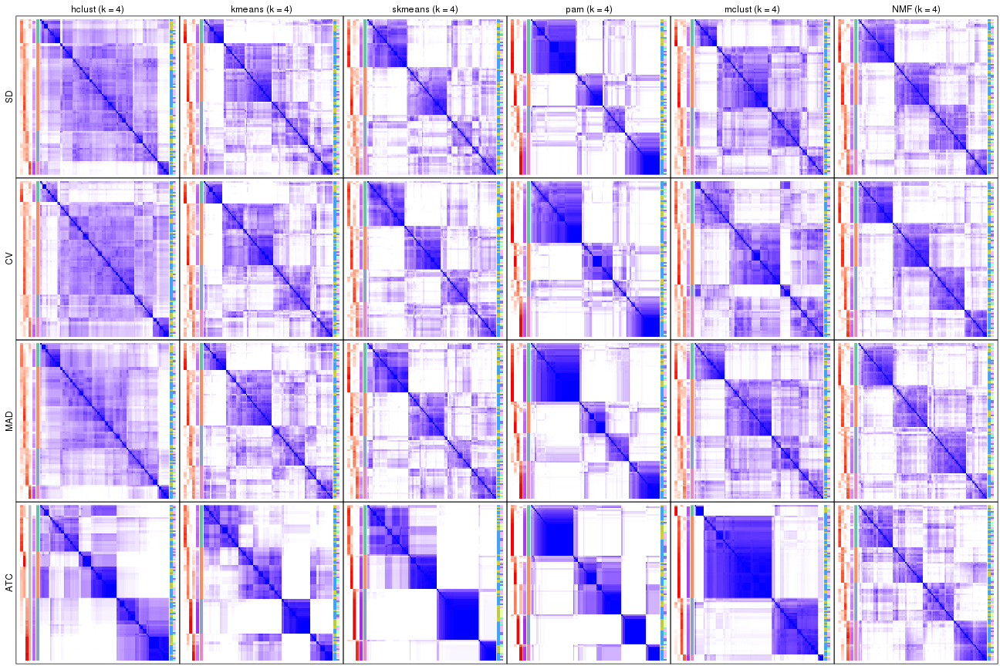</p>

</div>
<div id='tab-collect-consensus-heatmap-4'>
<pre><code class="r">collect_plots(res_list, k = 5, fun = consensus_heatmap, mc.cores = 4)
</code></pre>

<p></p>

</div>
<div id='tab-collect-consensus-heatmap-5'>
<pre><code class="r">collect_plots(res_list, k = 6, fun = consensus_heatmap, mc.cores = 4)
</code></pre>

<p></p>

</div>
</div>


### Membership heatmap

Membership heatmaps for all methods. ([What is a membership heatmap?](http://bioconductor.org/packages/devel/bioc/vignettes/cola/inst/doc/cola.html#toc_12))


<script>
$( function() {
	$( '#tabs-collect-membership-heatmap' ).tabs();
} );
</script>
<div id='tabs-collect-membership-heatmap'>
<ul>
<li><a href='#tab-collect-membership-heatmap-1'>k = 2</a></li>
<li><a href='#tab-collect-membership-heatmap-2'>k = 3</a></li>
<li><a href='#tab-collect-membership-heatmap-3'>k = 4</a></li>
<li><a href='#tab-collect-membership-heatmap-4'>k = 5</a></li>
<li><a href='#tab-collect-membership-heatmap-5'>k = 6</a></li>
</ul>
<div id='tab-collect-membership-heatmap-1'>
<pre><code class="r">collect_plots(res_list, k = 2, fun = membership_heatmap, mc.cores = 4)
</code></pre>

<p></p>

</div>
<div id='tab-collect-membership-heatmap-2'>
<pre><code class="r">collect_plots(res_list, k = 3, fun = membership_heatmap, mc.cores = 4)
</code></pre>

<p></p>

</div>
<div id='tab-collect-membership-heatmap-3'>
<pre><code class="r">collect_plots(res_list, k = 4, fun = membership_heatmap, mc.cores = 4)
</code></pre>

<p></p>

</div>
<div id='tab-collect-membership-heatmap-4'>
<pre><code class="r">collect_plots(res_list, k = 5, fun = membership_heatmap, mc.cores = 4)
</code></pre>

<p></p>

</div>
<div id='tab-collect-membership-heatmap-5'>
<pre><code class="r">collect_plots(res_list, k = 6, fun = membership_heatmap, mc.cores = 4)
</code></pre>

<p></p>

</div>
</div>


### Signature heatmap

Signature heatmaps for all methods. ([What is a signature heatmap?](http://bioconductor.org/packages/devel/bioc/vignettes/cola/inst/doc/cola.html#toc_22))


Note in following heatmaps, rows are scaled.


<script>
$( function() {
	$( '#tabs-collect-get-signatures' ).tabs();
} );
</script>
<div id='tabs-collect-get-signatures'>
<ul>
<li><a href='#tab-collect-get-signatures-1'>k = 2</a></li>
<li><a href='#tab-collect-get-signatures-2'>k = 3</a></li>
<li><a href='#tab-collect-get-signatures-3'>k = 4</a></li>
<li><a href='#tab-collect-get-signatures-4'>k = 5</a></li>
<li><a href='#tab-collect-get-signatures-5'>k = 6</a></li>
</ul>
<div id='tab-collect-get-signatures-1'>
<pre><code class="r">collect_plots(res_list, k = 2, fun = get_signatures, mc.cores = 4)
</code></pre>

<p></p>

</div>
<div id='tab-collect-get-signatures-2'>
<pre><code class="r">collect_plots(res_list, k = 3, fun = get_signatures, mc.cores = 4)
</code></pre>

<p>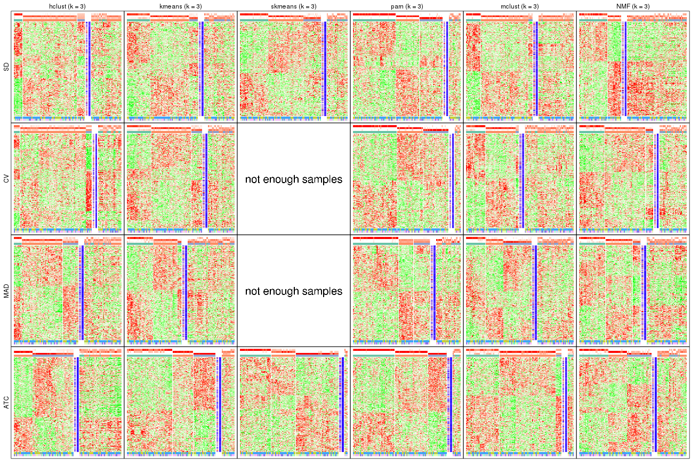</p>

</div>
<div id='tab-collect-get-signatures-3'>
<pre><code class="r">collect_plots(res_list, k = 4, fun = get_signatures, mc.cores = 4)
</code></pre>

<p></p>

</div>
<div id='tab-collect-get-signatures-4'>
<pre><code class="r">collect_plots(res_list, k = 5, fun = get_signatures, mc.cores = 4)
</code></pre>

<p></p>

</div>
<div id='tab-collect-get-signatures-5'>
<pre><code class="r">collect_plots(res_list, k = 6, fun = get_signatures, mc.cores = 4)
</code></pre>

<p></p>

</div>
</div>


### Statistics table

The statistics used for measuring the stability of consensus partitioning.
([How are they
defined?](http://bioconductor.org/packages/devel/bioc/vignettes/cola/inst/doc/cola.html#toc_13))


<script>
$( function() {
	$( '#tabs-get-stats-from-consensus-partition-list' ).tabs();
} );
</script>
<div id='tabs-get-stats-from-consensus-partition-list'>
<ul>
<li><a href='#tab-get-stats-from-consensus-partition-list-1'>k = 2</a></li>
<li><a href='#tab-get-stats-from-consensus-partition-list-2'>k = 3</a></li>
<li><a href='#tab-get-stats-from-consensus-partition-list-3'>k = 4</a></li>
<li><a href='#tab-get-stats-from-consensus-partition-list-4'>k = 5</a></li>
<li><a href='#tab-get-stats-from-consensus-partition-list-5'>k = 6</a></li>
</ul>
<div id='tab-get-stats-from-consensus-partition-list-1'>
<pre><code class="r">get_stats(res_list, k = 2)
</code></pre>

<pre><code>#&gt;             k 1-PAC mean_silhouette concordance area_increased  Rand Jaccard
#&gt; SD:NMF      2 0.918           0.920       0.967          0.477 0.522   0.522
#&gt; CV:NMF      2 0.900           0.931       0.971          0.480 0.522   0.522
#&gt; MAD:NMF     2 0.861           0.906       0.961          0.480 0.522   0.522
#&gt; ATC:NMF     2 0.756           0.875       0.947          0.485 0.507   0.507
#&gt; SD:skmeans  2 0.845           0.934       0.969          0.503 0.497   0.497
#&gt; CV:skmeans  2 0.864           0.901       0.962          0.502 0.498   0.498
#&gt; MAD:skmeans 2 0.882           0.915       0.965          0.503 0.498   0.498
#&gt; ATC:skmeans 2 1.000           0.994       0.997          0.501 0.500   0.500
#&gt; SD:mclust   2 0.900           0.907       0.966          0.285 0.724   0.724
#&gt; CV:mclust   2 0.896           0.923       0.962          0.316 0.675   0.675
#&gt; MAD:mclust  2 0.844           0.892       0.954          0.330 0.652   0.652
#&gt; ATC:mclust  2 0.355           0.394       0.806          0.321 0.779   0.779
#&gt; SD:kmeans   2 0.827           0.884       0.954          0.476 0.522   0.522
#&gt; CV:kmeans   2 0.824           0.902       0.958          0.483 0.518   0.518
#&gt; MAD:kmeans  2 0.824           0.911       0.961          0.486 0.510   0.510
#&gt; ATC:kmeans  2 1.000           0.998       0.999          0.496 0.504   0.504
#&gt; SD:pam      2 0.788           0.900       0.953          0.503 0.497   0.497
#&gt; CV:pam      2 0.716           0.866       0.940          0.498 0.498   0.498
#&gt; MAD:pam     2 0.733           0.876       0.945          0.499 0.498   0.498
#&gt; ATC:pam     2 0.812           0.920       0.960          0.463 0.518   0.518
#&gt; SD:hclust   2 0.402           0.772       0.879          0.304 0.751   0.751
#&gt; CV:hclust   2 0.323           0.774       0.868          0.325 0.751   0.751
#&gt; MAD:hclust  2 0.364           0.716       0.860          0.312 0.751   0.751
#&gt; ATC:hclust  2 0.641           0.901       0.941          0.479 0.514   0.514
</code></pre>

</div>
<div id='tab-get-stats-from-consensus-partition-list-2'>
<pre><code class="r">get_stats(res_list, k = 3)
</code></pre>

<pre><code>#&gt;             k 1-PAC mean_silhouette concordance area_increased  Rand Jaccard
#&gt; SD:NMF      3 0.357           0.416       0.691          0.373 0.778   0.587
#&gt; CV:NMF      3 0.377           0.567       0.772          0.346 0.809   0.647
#&gt; MAD:NMF     3 0.369           0.519       0.729          0.361 0.713   0.496
#&gt; ATC:NMF     3 0.476           0.532       0.790          0.352 0.662   0.423
#&gt; SD:skmeans  3 0.471           0.607       0.779          0.326 0.743   0.529
#&gt; CV:skmeans  3 0.424           0.335       0.626          0.328 0.730   0.508
#&gt; MAD:skmeans 3 0.417           0.379       0.680          0.327 0.808   0.631
#&gt; ATC:skmeans 3 0.735           0.856       0.873          0.290 0.814   0.638
#&gt; SD:mclust   3 0.335           0.480       0.730          0.875 0.895   0.857
#&gt; CV:mclust   3 0.262           0.393       0.733          0.719 0.795   0.708
#&gt; MAD:mclust  3 0.275           0.535       0.745          0.763 0.647   0.480
#&gt; ATC:mclust  3 0.530           0.707       0.805          0.761 0.586   0.496
#&gt; SD:kmeans   3 0.372           0.578       0.774          0.345 0.765   0.579
#&gt; CV:kmeans   3 0.382           0.568       0.759          0.331 0.769   0.584
#&gt; MAD:kmeans  3 0.357           0.488       0.688          0.345 0.719   0.500
#&gt; ATC:kmeans  3 0.631           0.740       0.856          0.292 0.751   0.550
#&gt; SD:pam      3 0.712           0.807       0.908          0.291 0.782   0.590
#&gt; CV:pam      3 0.750           0.833       0.927          0.307 0.780   0.587
#&gt; MAD:pam     3 0.696           0.616       0.842          0.283 0.825   0.666
#&gt; ATC:pam     3 0.883           0.893       0.956          0.372 0.728   0.529
#&gt; SD:hclust   3 0.155           0.497       0.652          0.771 0.879   0.839
#&gt; CV:hclust   3 0.109           0.528       0.617          0.656 0.827   0.774
#&gt; MAD:hclust  3 0.148           0.521       0.707          0.778 0.673   0.580
#&gt; ATC:hclust  3 0.502           0.491       0.782          0.290 0.911   0.827
</code></pre>

</div>
<div id='tab-get-stats-from-consensus-partition-list-3'>
<pre><code class="r">get_stats(res_list, k = 4)
</code></pre>

<pre><code>#&gt;             k 1-PAC mean_silhouette concordance area_increased  Rand Jaccard
#&gt; SD:NMF      4 0.462           0.586       0.759         0.1355 0.771   0.438
#&gt; CV:NMF      4 0.500           0.647       0.776         0.1504 0.790   0.494
#&gt; MAD:NMF     4 0.428           0.502       0.717         0.1327 0.788   0.467
#&gt; ATC:NMF     4 0.446           0.491       0.722         0.1314 0.739   0.373
#&gt; SD:skmeans  4 0.471           0.418       0.674         0.1239 0.851   0.597
#&gt; CV:skmeans  4 0.479           0.519       0.709         0.1253 0.753   0.400
#&gt; MAD:skmeans 4 0.485           0.455       0.674         0.1245 0.767   0.444
#&gt; ATC:skmeans 4 0.817           0.839       0.899         0.1267 0.892   0.698
#&gt; SD:mclust   4 0.295           0.425       0.621         0.2732 0.581   0.370
#&gt; CV:mclust   4 0.316           0.334       0.650         0.2412 0.659   0.411
#&gt; MAD:mclust  4 0.285           0.446       0.645         0.1771 0.742   0.407
#&gt; ATC:mclust  4 0.642           0.807       0.891         0.0719 0.940   0.871
#&gt; SD:kmeans   4 0.410           0.429       0.626         0.1450 0.814   0.545
#&gt; CV:kmeans   4 0.424           0.463       0.651         0.1365 0.848   0.618
#&gt; MAD:kmeans  4 0.406           0.372       0.650         0.1264 0.812   0.519
#&gt; ATC:kmeans  4 0.595           0.641       0.753         0.1443 0.839   0.582
#&gt; SD:pam      4 0.633           0.668       0.848         0.1367 0.852   0.608
#&gt; CV:pam      4 0.604           0.616       0.818         0.1168 0.924   0.786
#&gt; MAD:pam     4 0.675           0.713       0.862         0.1429 0.753   0.443
#&gt; ATC:pam     4 0.785           0.738       0.871         0.1375 0.872   0.673
#&gt; SD:hclust   4 0.194           0.423       0.623         0.1703 0.726   0.574
#&gt; CV:hclust   4 0.199           0.355       0.620         0.1827 0.771   0.632
#&gt; MAD:hclust  4 0.184           0.496       0.597         0.1957 0.841   0.680
#&gt; ATC:hclust  4 0.522           0.556       0.639         0.1395 0.825   0.626
</code></pre>

</div>
<div id='tab-get-stats-from-consensus-partition-list-4'>
<pre><code class="r">get_stats(res_list, k = 5)
</code></pre>

<pre><code>#&gt;             k 1-PAC mean_silhouette concordance area_increased  Rand Jaccard
#&gt; SD:NMF      5 0.539           0.532       0.725         0.0703 0.869   0.547
#&gt; CV:NMF      5 0.555           0.574       0.739         0.0715 0.867   0.542
#&gt; MAD:NMF     5 0.523           0.520       0.731         0.0678 0.860   0.528
#&gt; ATC:NMF     5 0.545           0.479       0.699         0.0668 0.868   0.544
#&gt; SD:skmeans  5 0.539           0.397       0.642         0.0685 0.878   0.574
#&gt; CV:skmeans  5 0.547           0.425       0.646         0.0675 0.832   0.450
#&gt; MAD:skmeans 5 0.540           0.430       0.667         0.0671 0.900   0.637
#&gt; ATC:skmeans 5 0.798           0.824       0.894         0.0583 0.952   0.825
#&gt; SD:mclust   5 0.471           0.472       0.680         0.1113 0.802   0.420
#&gt; CV:mclust   5 0.427           0.369       0.628         0.1089 0.851   0.554
#&gt; MAD:mclust  5 0.442           0.430       0.681         0.1075 0.868   0.558
#&gt; ATC:mclust  5 0.682           0.623       0.764         0.1411 0.827   0.607
#&gt; SD:kmeans   5 0.517           0.459       0.685         0.0743 0.857   0.544
#&gt; CV:kmeans   5 0.517           0.442       0.654         0.0776 0.843   0.511
#&gt; MAD:kmeans  5 0.497           0.430       0.623         0.0727 0.845   0.502
#&gt; ATC:kmeans  5 0.718           0.733       0.847         0.0742 0.856   0.529
#&gt; SD:pam      5 0.651           0.626       0.830         0.0467 0.966   0.871
#&gt; CV:pam      5 0.621           0.592       0.796         0.0511 0.906   0.696
#&gt; MAD:pam     5 0.668           0.631       0.813         0.0580 0.961   0.855
#&gt; ATC:pam     5 0.793           0.865       0.906         0.0747 0.893   0.654
#&gt; SD:hclust   5 0.222           0.408       0.616         0.0696 0.971   0.926
#&gt; CV:hclust   5 0.194           0.385       0.616         0.0796 0.886   0.737
#&gt; MAD:hclust  5 0.263           0.407       0.589         0.0807 0.879   0.680
#&gt; ATC:hclust  5 0.637           0.735       0.804         0.0854 0.815   0.492
</code></pre>

</div>
<div id='tab-get-stats-from-consensus-partition-list-5'>
<pre><code class="r">get_stats(res_list, k = 6)
</code></pre>

<pre><code>#&gt;             k 1-PAC mean_silhouette concordance area_increased  Rand Jaccard
#&gt; SD:NMF      6 0.554           0.416       0.650         0.0414 0.889   0.537
#&gt; CV:NMF      6 0.577           0.477       0.669         0.0434 0.891   0.541
#&gt; MAD:NMF     6 0.536           0.348       0.604         0.0472 0.864   0.474
#&gt; ATC:NMF     6 0.570           0.373       0.632         0.0402 0.904   0.593
#&gt; SD:skmeans  6 0.590           0.464       0.676         0.0421 0.904   0.578
#&gt; CV:skmeans  6 0.592           0.479       0.666         0.0410 0.893   0.537
#&gt; MAD:skmeans 6 0.592           0.428       0.659         0.0412 0.900   0.567
#&gt; ATC:skmeans 6 0.776           0.636       0.835         0.0377 0.972   0.883
#&gt; SD:mclust   6 0.564           0.497       0.699         0.0537 0.891   0.557
#&gt; CV:mclust   6 0.519           0.445       0.659         0.0530 0.912   0.649
#&gt; MAD:mclust  6 0.517           0.434       0.662         0.0399 0.924   0.665
#&gt; ATC:mclust  6 0.636           0.423       0.713         0.1115 0.834   0.512
#&gt; SD:kmeans   6 0.593           0.508       0.672         0.0454 0.909   0.608
#&gt; CV:kmeans   6 0.572           0.502       0.668         0.0458 0.902   0.579
#&gt; MAD:kmeans  6 0.580           0.453       0.652         0.0466 0.902   0.583
#&gt; ATC:kmeans  6 0.742           0.694       0.813         0.0453 0.902   0.587
#&gt; SD:pam      6 0.661           0.514       0.759         0.0466 0.916   0.667
#&gt; CV:pam      6 0.684           0.663       0.824         0.0549 0.912   0.662
#&gt; MAD:pam     6 0.676           0.507       0.744         0.0452 0.941   0.760
#&gt; ATC:pam     6 0.886           0.862       0.939         0.0480 0.958   0.812
#&gt; SD:hclust   6 0.280           0.363       0.560         0.0670 0.934   0.824
#&gt; CV:hclust   6 0.271           0.419       0.602         0.0646 0.892   0.706
#&gt; MAD:hclust  6 0.329           0.347       0.579         0.0533 0.970   0.897
#&gt; ATC:hclust  6 0.680           0.722       0.815         0.0354 0.980   0.903
</code></pre>

</div>
</div>

Following heatmap plots the partition for each combination of methods and the
lightness correspond to the silhouette scores for samples in each method. On
top the consensus subgroup is inferred from all methods by taking the mean
silhouette scores as weight.


<script>
$( function() {
	$( '#tabs-collect-stats-from-consensus-partition-list' ).tabs();
} );
</script>
<div id='tabs-collect-stats-from-consensus-partition-list'>
<ul>
<li><a href='#tab-collect-stats-from-consensus-partition-list-1'>k = 2</a></li>
<li><a href='#tab-collect-stats-from-consensus-partition-list-2'>k = 3</a></li>
<li><a href='#tab-collect-stats-from-consensus-partition-list-3'>k = 4</a></li>
<li><a href='#tab-collect-stats-from-consensus-partition-list-4'>k = 5</a></li>
<li><a href='#tab-collect-stats-from-consensus-partition-list-5'>k = 6</a></li>
</ul>
<div id='tab-collect-stats-from-consensus-partition-list-1'>
<pre><code class="r">collect_stats(res_list, k = 2)
</code></pre>

<p></p>

</div>
<div id='tab-collect-stats-from-consensus-partition-list-2'>
<pre><code class="r">collect_stats(res_list, k = 3)
</code></pre>

<p></p>

</div>
<div id='tab-collect-stats-from-consensus-partition-list-3'>
<pre><code class="r">collect_stats(res_list, k = 4)
</code></pre>

<p>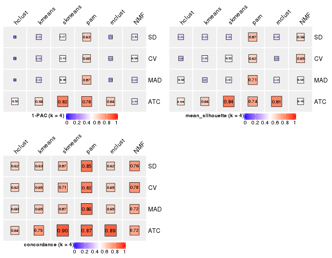</p>

</div>
<div id='tab-collect-stats-from-consensus-partition-list-4'>
<pre><code class="r">collect_stats(res_list, k = 5)
</code></pre>

<p></p>

</div>
<div id='tab-collect-stats-from-consensus-partition-list-5'>
<pre><code class="r">collect_stats(res_list, k = 6)
</code></pre>

<p></p>

</div>
</div>

### Partition from all methods


Collect partitions from all methods:


<script>
$( function() {
	$( '#tabs-collect-classes-from-consensus-partition-list' ).tabs();
} );
</script>
<div id='tabs-collect-classes-from-consensus-partition-list'>
<ul>
<li><a href='#tab-collect-classes-from-consensus-partition-list-1'>k = 2</a></li>
<li><a href='#tab-collect-classes-from-consensus-partition-list-2'>k = 3</a></li>
<li><a href='#tab-collect-classes-from-consensus-partition-list-3'>k = 4</a></li>
<li><a href='#tab-collect-classes-from-consensus-partition-list-4'>k = 5</a></li>
<li><a href='#tab-collect-classes-from-consensus-partition-list-5'>k = 6</a></li>
</ul>
<div id='tab-collect-classes-from-consensus-partition-list-1'>
<pre><code class="r">collect_classes(res_list, k = 2)
</code></pre>

<p></p>

</div>
<div id='tab-collect-classes-from-consensus-partition-list-2'>
<pre><code class="r">collect_classes(res_list, k = 3)
</code></pre>

<p>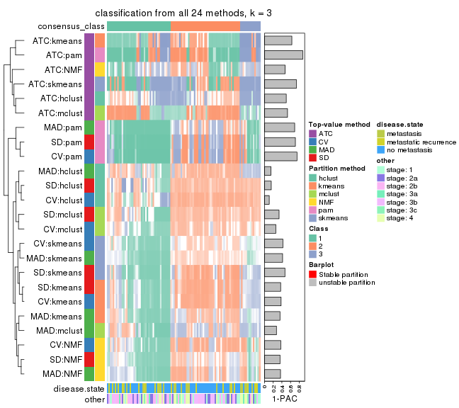</p>

</div>
<div id='tab-collect-classes-from-consensus-partition-list-3'>
<pre><code class="r">collect_classes(res_list, k = 4)
</code></pre>

<p></p>

</div>
<div id='tab-collect-classes-from-consensus-partition-list-4'>
<pre><code class="r">collect_classes(res_list, k = 5)
</code></pre>

<p></p>

</div>
<div id='tab-collect-classes-from-consensus-partition-list-5'>
<pre><code class="r">collect_classes(res_list, k = 6)
</code></pre>

<p></p>

</div>
</div>


### Top rows overlap


Overlap of top rows from different top-row methods:


<script>
$( function() {
	$( '#tabs-top-rows-overlap-by-euler' ).tabs();
} );
</script>
<div id='tabs-top-rows-overlap-by-euler'>
<ul>
<li><a href='#tab-top-rows-overlap-by-euler-1'>top_n = 1000</a></li>
<li><a href='#tab-top-rows-overlap-by-euler-2'>top_n = 2000</a></li>
<li><a href='#tab-top-rows-overlap-by-euler-3'>top_n = 3000</a></li>
<li><a href='#tab-top-rows-overlap-by-euler-4'>top_n = 4000</a></li>
<li><a href='#tab-top-rows-overlap-by-euler-5'>top_n = 5000</a></li>
</ul>
<div id='tab-top-rows-overlap-by-euler-1'>
<pre><code class="r">top_rows_overlap(res_list, top_n = 1000, method = &quot;euler&quot;)
</code></pre>

<p></p>

</div>
<div id='tab-top-rows-overlap-by-euler-2'>
<pre><code class="r">top_rows_overlap(res_list, top_n = 2000, method = &quot;euler&quot;)
</code></pre>

<p></p>

</div>
<div id='tab-top-rows-overlap-by-euler-3'>
<pre><code class="r">top_rows_overlap(res_list, top_n = 3000, method = &quot;euler&quot;)
</code></pre>

<p></p>

</div>
<div id='tab-top-rows-overlap-by-euler-4'>
<pre><code class="r">top_rows_overlap(res_list, top_n = 4000, method = &quot;euler&quot;)
</code></pre>

<p></p>

</div>
<div id='tab-top-rows-overlap-by-euler-5'>
<pre><code class="r">top_rows_overlap(res_list, top_n = 5000, method = &quot;euler&quot;)
</code></pre>

<p></p>

</div>
</div>

Also visualize the correspondance of rankings between different top-row methods:


<script>
$( function() {
	$( '#tabs-top-rows-overlap-by-correspondance' ).tabs();
} );
</script>
<div id='tabs-top-rows-overlap-by-correspondance'>
<ul>
<li><a href='#tab-top-rows-overlap-by-correspondance-1'>top_n = 1000</a></li>
<li><a href='#tab-top-rows-overlap-by-correspondance-2'>top_n = 2000</a></li>
<li><a href='#tab-top-rows-overlap-by-correspondance-3'>top_n = 3000</a></li>
<li><a href='#tab-top-rows-overlap-by-correspondance-4'>top_n = 4000</a></li>
<li><a href='#tab-top-rows-overlap-by-correspondance-5'>top_n = 5000</a></li>
</ul>
<div id='tab-top-rows-overlap-by-correspondance-1'>
<pre><code class="r">top_rows_overlap(res_list, top_n = 1000, method = &quot;correspondance&quot;)
</code></pre>

<p></p>

</div>
<div id='tab-top-rows-overlap-by-correspondance-2'>
<pre><code class="r">top_rows_overlap(res_list, top_n = 2000, method = &quot;correspondance&quot;)
</code></pre>

<p></p>

</div>
<div id='tab-top-rows-overlap-by-correspondance-3'>
<pre><code class="r">top_rows_overlap(res_list, top_n = 3000, method = &quot;correspondance&quot;)
</code></pre>

<p>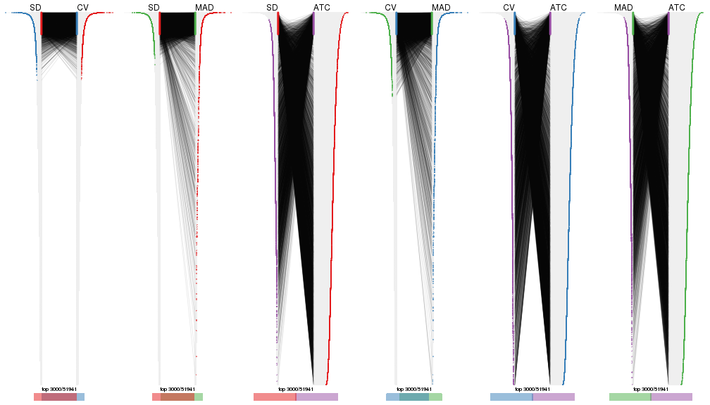</p>

</div>
<div id='tab-top-rows-overlap-by-correspondance-4'>
<pre><code class="r">top_rows_overlap(res_list, top_n = 4000, method = &quot;correspondance&quot;)
</code></pre>

<p></p>

</div>
<div id='tab-top-rows-overlap-by-correspondance-5'>
<pre><code class="r">top_rows_overlap(res_list, top_n = 5000, method = &quot;correspondance&quot;)
</code></pre>

<p></p>

</div>
</div>


Heatmaps of the top rows:


<script>
$( function() {
	$( '#tabs-top-rows-heatmap' ).tabs();
} );
</script>
<div id='tabs-top-rows-heatmap'>
<ul>
<li><a href='#tab-top-rows-heatmap-1'>top_n = 1000</a></li>
<li><a href='#tab-top-rows-heatmap-2'>top_n = 2000</a></li>
<li><a href='#tab-top-rows-heatmap-3'>top_n = 3000</a></li>
<li><a href='#tab-top-rows-heatmap-4'>top_n = 4000</a></li>
<li><a href='#tab-top-rows-heatmap-5'>top_n = 5000</a></li>
</ul>
<div id='tab-top-rows-heatmap-1'>
<pre><code class="r">top_rows_heatmap(res_list, top_n = 1000)
</code></pre>

<p></p>

</div>
<div id='tab-top-rows-heatmap-2'>
<pre><code class="r">top_rows_heatmap(res_list, top_n = 2000)
</code></pre>

<p></p>

</div>
<div id='tab-top-rows-heatmap-3'>
<pre><code class="r">top_rows_heatmap(res_list, top_n = 3000)
</code></pre>

<p></p>

</div>
<div id='tab-top-rows-heatmap-4'>
<pre><code class="r">top_rows_heatmap(res_list, top_n = 4000)
</code></pre>

<p></p>

</div>
<div id='tab-top-rows-heatmap-5'>
<pre><code class="r">top_rows_heatmap(res_list, top_n = 5000)
</code></pre>

<p>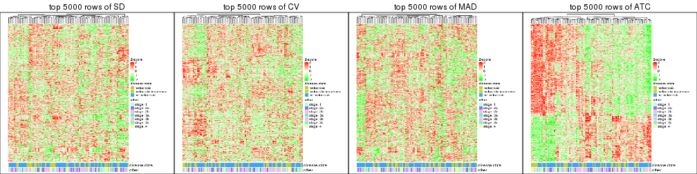</p>

</div>
</div>


### Test to known annotations


Test correlation between subgroups and known annotations. If the known
annotation is numeric, one-way ANOVA test is applied, and if the known
annotation is discrete, chi-squared contingency table test is applied.


<script>
$( function() {
	$( '#tabs-test-to-known-factors-from-consensus-partition-list' ).tabs();
} );
</script>
<div id='tabs-test-to-known-factors-from-consensus-partition-list'>
<ul>
<li><a href='#tab-test-to-known-factors-from-consensus-partition-list-1'>k = 2</a></li>
<li><a href='#tab-test-to-known-factors-from-consensus-partition-list-2'>k = 3</a></li>
<li><a href='#tab-test-to-known-factors-from-consensus-partition-list-3'>k = 4</a></li>
<li><a href='#tab-test-to-known-factors-from-consensus-partition-list-4'>k = 5</a></li>
<li><a href='#tab-test-to-known-factors-from-consensus-partition-list-5'>k = 6</a></li>
</ul>
<div id='tab-test-to-known-factors-from-consensus-partition-list-1'>
<pre><code class="r">test_to_known_factors(res_list, k = 2)
</code></pre>

<pre><code>#&gt;               n disease.state(p) other(p) k
#&gt; SD:NMF      100          0.22984    0.553 2
#&gt; CV:NMF      101          0.30028    0.560 2
#&gt; MAD:NMF      98          0.34772    0.263 2
#&gt; ATC:NMF      97          0.27444    0.500 2
#&gt; SD:skmeans  104          0.17952    0.527 2
#&gt; CV:skmeans   96          0.20222    0.353 2
#&gt; MAD:skmeans 101          0.23958    0.455 2
#&gt; ATC:skmeans 104          0.32248    0.276 2
#&gt; SD:mclust    97          0.84688    0.662 2
#&gt; CV:mclust   100          0.75366    0.439 2
#&gt; MAD:mclust   96          0.61459    0.667 2
#&gt; ATC:mclust   56               NA       NA 2
#&gt; SD:kmeans    97          0.37906    0.589 2
#&gt; CV:kmeans   101          0.30028    0.627 2
#&gt; MAD:kmeans  101          0.36135    0.586 2
#&gt; ATC:kmeans  104          0.24351    0.228 2
#&gt; SD:pam      100          0.04819    0.386 2
#&gt; CV:pam      100          0.03850    0.477 2
#&gt; MAD:pam      99          0.00945    0.421 2
#&gt; ATC:pam     102          0.08152    0.120 2
#&gt; SD:hclust    90          0.82082    0.819 2
#&gt; CV:hclust    93          0.85601    0.767 2
#&gt; MAD:hclust   89          0.33023    0.766 2
#&gt; ATC:hclust  103          0.34706    0.374 2
</code></pre>

</div>
<div id='tab-test-to-known-factors-from-consensus-partition-list-2'>
<pre><code class="r">test_to_known_factors(res_list, k = 3)
</code></pre>

<pre><code>#&gt;               n disease.state(p) other(p) k
#&gt; SD:NMF       43            0.155    0.233 3
#&gt; CV:NMF       76            0.380    0.735 3
#&gt; MAD:NMF      63            0.714    0.928 3
#&gt; ATC:NMF      74            0.660    0.570 3
#&gt; SD:skmeans   83            0.542    0.548 3
#&gt; CV:skmeans   30               NA       NA 3
#&gt; MAD:skmeans  30               NA       NA 3
#&gt; ATC:skmeans 101            0.158    0.117 3
#&gt; SD:mclust    68            0.611    0.841 3
#&gt; CV:mclust    54            0.901    0.871 3
#&gt; MAD:mclust   67            0.847    0.327 3
#&gt; ATC:mclust   98            0.422    0.709 3
#&gt; SD:kmeans    73            0.434    0.252 3
#&gt; CV:kmeans    77            0.572    0.263 3
#&gt; MAD:kmeans   56            0.263    0.047 3
#&gt; ATC:kmeans   91            0.648    0.748 3
#&gt; SD:pam       92            0.457    0.623 3
#&gt; CV:pam       98            0.254    0.524 3
#&gt; MAD:pam      79            0.402    0.922 3
#&gt; ATC:pam      96            0.719    0.629 3
#&gt; SD:hclust    73            0.392    0.881 3
#&gt; CV:hclust    80            0.717    0.826 3
#&gt; MAD:hclust   66            0.593    0.405 3
#&gt; ATC:hclust   61            0.603    0.295 3
</code></pre>

</div>
<div id='tab-test-to-known-factors-from-consensus-partition-list-3'>
<pre><code class="r">test_to_known_factors(res_list, k = 4)
</code></pre>

<pre><code>#&gt;              n disease.state(p) other(p) k
#&gt; SD:NMF      75           0.3532   0.4984 4
#&gt; CV:NMF      84           0.6901   0.6992 4
#&gt; MAD:NMF     67           0.4507   0.6200 4
#&gt; ATC:NMF     68           0.0170   0.0502 4
#&gt; SD:skmeans  43           0.7404   0.3300 4
#&gt; CV:skmeans  71           0.4913   0.0899 4
#&gt; MAD:skmeans 56           0.0782   0.2920 4
#&gt; ATC:skmeans 98           0.3051   0.1427 4
#&gt; SD:mclust   53           0.9742   0.6602 4
#&gt; CV:mclust   22           0.7831   0.6321 4
#&gt; MAD:mclust  55           0.5474   0.7058 4
#&gt; ATC:mclust  98           0.5127   0.8167 4
#&gt; SD:kmeans   43           0.4172   0.3477 4
#&gt; CV:kmeans   57           0.7676   0.8199 4
#&gt; MAD:kmeans  37           0.0387   0.0577 4
#&gt; ATC:kmeans  78           0.0956   0.7951 4
#&gt; SD:pam      87           0.7596   0.8466 4
#&gt; CV:pam      79           0.1188   0.5930 4
#&gt; MAD:pam     88           0.4494   0.9093 4
#&gt; ATC:pam     90           0.3490   0.7773 4
#&gt; SD:hclust   31           0.1353   0.9739 4
#&gt; CV:hclust   17           0.3742   0.8282 4
#&gt; MAD:hclust  58           0.3618   0.9347 4
#&gt; ATC:hclust  83           0.6378   0.5164 4
</code></pre>

</div>
<div id='tab-test-to-known-factors-from-consensus-partition-list-4'>
<pre><code class="r">test_to_known_factors(res_list, k = 5)
</code></pre>

<pre><code>#&gt;               n disease.state(p) other(p) k
#&gt; SD:NMF       67           0.4671   0.3882 5
#&gt; CV:NMF       76           0.5020   0.4410 5
#&gt; MAD:NMF      64           0.3727   0.6092 5
#&gt; ATC:NMF      61           0.0257   0.0623 5
#&gt; SD:skmeans   43           0.5107   0.2346 5
#&gt; CV:skmeans   43           0.9920   0.0427 5
#&gt; MAD:skmeans  48           0.3557   0.3589 5
#&gt; ATC:skmeans 101           0.4461   0.1315 5
#&gt; SD:mclust    63           0.7315   0.8363 5
#&gt; CV:mclust    49           0.2198   0.4777 5
#&gt; MAD:mclust   51           0.5896   0.7474 5
#&gt; ATC:mclust   77           0.4734   0.5117 5
#&gt; SD:kmeans    54           0.2734   0.2605 5
#&gt; CV:kmeans    54           0.9086   0.7493 5
#&gt; MAD:kmeans   50           0.5521   0.1921 5
#&gt; ATC:kmeans   85           0.5267   0.5044 5
#&gt; SD:pam       80           0.5766   0.6386 5
#&gt; CV:pam       73           0.3134   0.2086 5
#&gt; MAD:pam      83           0.6467   0.9218 5
#&gt; ATC:pam     101           0.6185   0.7858 5
#&gt; SD:hclust    30           0.2188   0.6712 5
#&gt; CV:hclust    37           0.6299   0.4068 5
#&gt; MAD:hclust   41           0.0896   0.6925 5
#&gt; ATC:hclust   98           0.3182   0.8291 5
</code></pre>

</div>
<div id='tab-test-to-known-factors-from-consensus-partition-list-5'>
<pre><code class="r">test_to_known_factors(res_list, k = 6)
</code></pre>

<pre><code>#&gt;              n disease.state(p) other(p) k
#&gt; SD:NMF      42          0.64133   0.7302 6
#&gt; CV:NMF      53          0.52021   0.4091 6
#&gt; MAD:NMF     31          0.70736   0.7015 6
#&gt; ATC:NMF     40          0.00311   0.0251 6
#&gt; SD:skmeans  55          0.12424   0.1310 6
#&gt; CV:skmeans  56          0.45148   0.2795 6
#&gt; MAD:skmeans 44          0.52418   0.3711 6
#&gt; ATC:skmeans 79          0.47249   0.0557 6
#&gt; SD:mclust   60          0.20350   0.8550 6
#&gt; CV:mclust   54          0.13245   0.5913 6
#&gt; MAD:mclust  59          0.03929   0.5136 6
#&gt; ATC:mclust  59          0.68492   0.7928 6
#&gt; SD:kmeans   70          0.04354   0.3979 6
#&gt; CV:kmeans   64          0.14249   0.7636 6
#&gt; MAD:kmeans  49          0.17870   0.3921 6
#&gt; ATC:kmeans  87          0.44104   0.5551 6
#&gt; SD:pam      60          0.53419   0.1186 6
#&gt; CV:pam      85          0.04701   0.1906 6
#&gt; MAD:pam     59          0.20032   0.4665 6
#&gt; ATC:pam     99          0.49690   0.6463 6
#&gt; SD:hclust   23          0.55301   0.0129 6
#&gt; CV:hclust   44          0.00963   0.0519 6
#&gt; MAD:hclust  29          0.09400   0.3898 6
#&gt; ATC:hclust  94          0.34652   0.8786 6
</code></pre>

</div>
</div>


 
## Results for each method


---------------------------------------------------


### SD:hclust


The object with results only for a single top-value method and a single partition method 
can be extracted as:

```r
res = res_list["SD", "hclust"]
# you can also extract it by
# res = res_list["SD:hclust"]
```

A summary of `res` and all the functions that can be applied to it:

```r
res
```

```
#> A 'ConsensusPartition' object with k = 2, 3, 4, 5, 6.
#>   On a matrix with 51941 rows and 104 columns.
#>   Top rows (1000, 2000, 3000, 4000, 5000) are extracted by 'SD' method.
#>   Subgroups are detected by 'hclust' method.
#>   Performed in total 1250 partitions by row resampling.
#>   Best k for subgroups seems to be 3.
#> 
#> Following methods can be applied to this 'ConsensusPartition' object:
#>  [1] "cola_report"             "collect_classes"         "collect_plots"          
#>  [4] "collect_stats"           "colnames"                "compare_signatures"     
#>  [7] "consensus_heatmap"       "dimension_reduction"     "functional_enrichment"  
#> [10] "get_anno_col"            "get_anno"                "get_classes"            
#> [13] "get_consensus"           "get_matrix"              "get_membership"         
#> [16] "get_param"               "get_signatures"          "get_stats"              
#> [19] "is_best_k"               "is_stable_k"             "membership_heatmap"     
#> [22] "ncol"                    "nrow"                    "plot_ecdf"              
#> [25] "rownames"                "select_partition_number" "show"                   
#> [28] "suggest_best_k"          "test_to_known_factors"
```

`collect_plots()` function collects all the plots made from `res` for all `k` (number of partitions)
into one single page to provide an easy and fast comparison between different `k`.

```r
collect_plots(res)
```


The plots are:

- The first row: a plot of the ECDF (empirical cumulative distribution
  function) curves of the consensus matrix for each `k` and the heatmap of
  predicted classes for each `k`.
- The second row: heatmaps of the consensus matrix for each `k`.
- The third row: heatmaps of the membership matrix for each `k`.
- The fouth row: heatmaps of the signatures for each `k`.

All the plots in panels can be made by individual functions and they are
plotted later in this section.

`select_partition_number()` produces several plots showing different
statistics for choosing "optimized" `k`. There are following statistics:

- ECDF curves of the consensus matrix for each `k`;
- 1-PAC. [The PAC
  score](https://en.wikipedia.org/wiki/Consensus_clustering#Over-interpretation_potential_of_consensus_clustering)
  measures the proportion of the ambiguous subgrouping.
- Mean silhouette score.
- Concordance. The mean probability of fiting the consensus class ids in all
  partitions.
- Area increased. Denote $A_k$ as the area under the ECDF curve for current
  `k`, the area increased is defined as $A_k - A_{k-1}$.
- Rand index. The percent of pairs of samples that are both in a same cluster
  or both are not in a same cluster in the partition of k and k-1.
- Jaccard index. The ratio of pairs of samples are both in a same cluster in
  the partition of k and k-1 and the pairs of samples are both in a same
  cluster in the partition k or k-1.

The detailed explanations of these statistics can be found in [the _cola_
vignette](http://bioconductor.org/packages/devel/bioc/vignettes/cola/inst/doc/cola.html#toc_13).

Generally speaking, lower PAC score, higher mean silhouette score or higher
concordance corresponds to better partition. Rand index and Jaccard index
measure how similar the current partition is compared to partition with `k-1`.
If they are too similar, we won't accept `k` is better than `k-1`.

```r
select_partition_number(res)
```


The numeric values for all these statistics can be obtained by `get_stats()`.

```r
get_stats(res)
```

```
#>   k 1-PAC mean_silhouette concordance area_increased  Rand Jaccard
#> 2 2 0.402           0.772       0.879         0.3037 0.751   0.751
#> 3 3 0.155           0.497       0.652         0.7713 0.879   0.839
#> 4 4 0.194           0.423       0.623         0.1703 0.726   0.574
#> 5 5 0.222           0.408       0.616         0.0696 0.971   0.926
#> 6 6 0.280           0.363       0.560         0.0670 0.934   0.824
```

`suggest_best_k()` suggests the best $k$ based on these statistics. The rules are as follows:

- All $k$ with Jaccard index larger than 0.95 are removed because increasing
  $k$ does not provide enough extra information. If all $k$ are removed, it is
  marked as no subgroup is detected.
- For all $k$ with 1-PAC score larger than 0.9, the maximal $k$ is taken as
  the best $k$, and other $k$ are marked as optional $k$.
- If it does not fit the second rule. The $k$ with the maximal vote of the
  highest 1-PAC score, highest mean silhouette, and highest concordance is
  taken as the best $k$.

```r
suggest_best_k(res)
```

```
#> [1] 3
```


Following shows the table of the partitions (You need to click the **show/hide
code output** link to see it). The membership matrix (columns with name `p*`)
is inferred by
[`clue::cl_consensus()`](https://www.rdocumentation.org/link/cl_consensus?package=clue)
function with the `SE` method. Basically the value in the membership matrix
represents the probability to belong to a certain group. The finall class
label for an item is determined with the group with highest probability it
belongs to.

In `get_classes()` function, the entropy is calculated from the membership
matrix and the silhouette score is calculated from the consensus matrix.


<script>
$( function() {
	$( '#tabs-SD-hclust-get-classes' ).tabs();
} );
</script>
<div id='tabs-SD-hclust-get-classes'>
<ul>
<li><a href='#tab-SD-hclust-get-classes-1'>k = 2</a></li>
<li><a href='#tab-SD-hclust-get-classes-2'>k = 3</a></li>
<li><a href='#tab-SD-hclust-get-classes-3'>k = 4</a></li>
<li><a href='#tab-SD-hclust-get-classes-4'>k = 5</a></li>
<li><a href='#tab-SD-hclust-get-classes-5'>k = 6</a></li>
</ul>

<div id='tab-SD-hclust-get-classes-1'>
<p><a id='tab-SD-hclust-get-classes-1-a' style='color:#0366d6' href='#'>show/hide code output</a></p>
<pre><code class="r">cbind(get_classes(res, k = 2), get_membership(res, k = 2))
</code></pre>

<pre><code>#&gt;           class entropy silhouette    p1    p2
#&gt; GSM537341     2  0.9754      0.319 0.408 0.592
#&gt; GSM537345     1  0.1414      0.771 0.980 0.020
#&gt; GSM537355     2  0.2043      0.879 0.032 0.968
#&gt; GSM537366     2  0.8327      0.658 0.264 0.736
#&gt; GSM537370     2  0.9393      0.453 0.356 0.644
#&gt; GSM537380     2  0.0938      0.874 0.012 0.988
#&gt; GSM537392     2  0.0938      0.874 0.012 0.988
#&gt; GSM537415     2  0.0938      0.874 0.012 0.988
#&gt; GSM537417     2  0.4298      0.864 0.088 0.912
#&gt; GSM537422     2  0.6148      0.816 0.152 0.848
#&gt; GSM537423     2  0.0938      0.874 0.012 0.988
#&gt; GSM537427     2  0.1414      0.878 0.020 0.980
#&gt; GSM537430     2  0.3114      0.877 0.056 0.944
#&gt; GSM537336     1  0.2603      0.780 0.956 0.044
#&gt; GSM537337     2  0.2603      0.877 0.044 0.956
#&gt; GSM537348     2  0.9754      0.319 0.408 0.592
#&gt; GSM537349     2  0.0938      0.874 0.012 0.988
#&gt; GSM537356     2  0.9552      0.423 0.376 0.624
#&gt; GSM537361     2  0.7139      0.771 0.196 0.804
#&gt; GSM537374     2  0.4298      0.860 0.088 0.912
#&gt; GSM537377     1  0.1414      0.771 0.980 0.020
#&gt; GSM537378     2  0.0938      0.874 0.012 0.988
#&gt; GSM537379     2  0.4690      0.859 0.100 0.900
#&gt; GSM537383     2  0.0938      0.874 0.012 0.988
#&gt; GSM537388     2  0.1633      0.878 0.024 0.976
#&gt; GSM537395     2  0.2603      0.877 0.044 0.956
#&gt; GSM537400     2  0.6048      0.828 0.148 0.852
#&gt; GSM537404     2  0.6343      0.815 0.160 0.840
#&gt; GSM537409     2  0.1414      0.867 0.020 0.980
#&gt; GSM537418     2  0.9427      0.456 0.360 0.640
#&gt; GSM537425     2  0.7219      0.767 0.200 0.800
#&gt; GSM537333     2  0.4161      0.864 0.084 0.916
#&gt; GSM537342     2  0.1633      0.878 0.024 0.976
#&gt; GSM537347     2  0.5519      0.841 0.128 0.872
#&gt; GSM537350     2  0.6623      0.771 0.172 0.828
#&gt; GSM537362     1  0.9661      0.452 0.608 0.392
#&gt; GSM537363     2  0.4161      0.865 0.084 0.916
#&gt; GSM537368     1  0.2423      0.780 0.960 0.040
#&gt; GSM537376     2  0.3114      0.877 0.056 0.944
#&gt; GSM537381     2  0.9129      0.535 0.328 0.672
#&gt; GSM537386     2  0.0938      0.875 0.012 0.988
#&gt; GSM537398     2  0.9795      0.288 0.416 0.584
#&gt; GSM537402     2  0.1184      0.878 0.016 0.984
#&gt; GSM537405     1  0.4431      0.769 0.908 0.092
#&gt; GSM537371     1  0.2423      0.780 0.960 0.040
#&gt; GSM537421     2  0.2778      0.872 0.048 0.952
#&gt; GSM537424     2  0.5519      0.841 0.128 0.872
#&gt; GSM537432     2  0.3733      0.874 0.072 0.928
#&gt; GSM537331     2  0.2423      0.876 0.040 0.960
#&gt; GSM537332     2  0.1184      0.878 0.016 0.984
#&gt; GSM537334     2  0.5059      0.843 0.112 0.888
#&gt; GSM537338     2  0.3584      0.871 0.068 0.932
#&gt; GSM537353     2  0.3274      0.879 0.060 0.940
#&gt; GSM537357     1  0.2603      0.780 0.956 0.044
#&gt; GSM537358     2  0.0938      0.873 0.012 0.988
#&gt; GSM537375     2  0.3584      0.869 0.068 0.932
#&gt; GSM537389     2  0.0938      0.874 0.012 0.988
#&gt; GSM537390     2  0.0938      0.873 0.012 0.988
#&gt; GSM537393     2  0.4022      0.867 0.080 0.920
#&gt; GSM537399     2  0.6247      0.791 0.156 0.844
#&gt; GSM537407     2  0.6148      0.813 0.152 0.848
#&gt; GSM537408     2  0.2423      0.879 0.040 0.960
#&gt; GSM537428     2  0.3431      0.874 0.064 0.936
#&gt; GSM537354     2  0.2603      0.877 0.044 0.956
#&gt; GSM537410     2  0.1633      0.878 0.024 0.976
#&gt; GSM537413     2  0.1414      0.867 0.020 0.980
#&gt; GSM537396     2  0.1414      0.879 0.020 0.980
#&gt; GSM537397     2  0.9661      0.360 0.392 0.608
#&gt; GSM537330     2  0.2043      0.879 0.032 0.968
#&gt; GSM537369     1  0.9087      0.604 0.676 0.324
#&gt; GSM537373     2  0.1843      0.880 0.028 0.972
#&gt; GSM537401     2  0.9754      0.319 0.408 0.592
#&gt; GSM537343     2  0.5408      0.843 0.124 0.876
#&gt; GSM537367     2  0.5519      0.835 0.128 0.872
#&gt; GSM537382     2  0.3114      0.877 0.056 0.944
#&gt; GSM537385     2  0.1843      0.877 0.028 0.972
#&gt; GSM537391     1  0.9922      0.267 0.552 0.448
#&gt; GSM537419     2  0.1184      0.878 0.016 0.984
#&gt; GSM537420     1  0.9087      0.604 0.676 0.324
#&gt; GSM537429     2  0.1843      0.879 0.028 0.972
#&gt; GSM537431     2  0.3733      0.858 0.072 0.928
#&gt; GSM537387     1  0.9922      0.267 0.552 0.448
#&gt; GSM537414     2  0.6048      0.819 0.148 0.852
#&gt; GSM537433     2  0.6531      0.797 0.168 0.832
#&gt; GSM537335     2  0.5059      0.843 0.112 0.888
#&gt; GSM537339     2  0.9754      0.319 0.408 0.592
#&gt; GSM537340     2  0.4431      0.863 0.092 0.908
#&gt; GSM537344     1  0.9087      0.604 0.676 0.324
#&gt; GSM537346     2  0.3114      0.877 0.056 0.944
#&gt; GSM537351     1  0.7883      0.697 0.764 0.236
#&gt; GSM537352     2  0.3114      0.876 0.056 0.944
#&gt; GSM537359     2  0.0672      0.871 0.008 0.992
#&gt; GSM537360     2  0.1414      0.878 0.020 0.980
#&gt; GSM537364     1  0.2778      0.780 0.952 0.048
#&gt; GSM537365     2  0.4022      0.871 0.080 0.920
#&gt; GSM537372     2  0.9686      0.349 0.396 0.604
#&gt; GSM537384     2  0.9710      0.349 0.400 0.600
#&gt; GSM537394     2  0.1414      0.877 0.020 0.980
#&gt; GSM537403     2  0.2423      0.878 0.040 0.960
#&gt; GSM537406     2  0.0938      0.877 0.012 0.988
#&gt; GSM537411     2  0.3733      0.872 0.072 0.928
#&gt; GSM537412     2  0.1414      0.867 0.020 0.980
#&gt; GSM537416     2  0.1843      0.869 0.028 0.972
#&gt; GSM537426     2  0.1414      0.867 0.020 0.980
</code></pre>

<script>
$('#tab-SD-hclust-get-classes-1-a').parent().next().next().hide();
$('#tab-SD-hclust-get-classes-1-a').click(function(){
  $('#tab-SD-hclust-get-classes-1-a').parent().next().next().toggle();
  return(false);
});
</script>
</div>

<div id='tab-SD-hclust-get-classes-2'>
<p><a id='tab-SD-hclust-get-classes-2-a' style='color:#0366d6' href='#'>show/hide code output</a></p>
<pre><code class="r">cbind(get_classes(res, k = 3), get_membership(res, k = 3))
</code></pre>

<pre><code>#&gt;           class entropy silhouette    p1    p2    p3
#&gt; GSM537341     3  0.9942     0.9381 0.288 0.332 0.380
#&gt; GSM537345     1  0.1289     0.6882 0.968 0.000 0.032
#&gt; GSM537355     2  0.6018     0.3063 0.008 0.684 0.308
#&gt; GSM537366     2  0.9284     0.2713 0.192 0.512 0.296
#&gt; GSM537370     2  0.9833    -0.8418 0.248 0.396 0.356
#&gt; GSM537380     2  0.4399     0.5975 0.000 0.812 0.188
#&gt; GSM537392     2  0.4399     0.5975 0.000 0.812 0.188
#&gt; GSM537415     2  0.4002     0.6357 0.000 0.840 0.160
#&gt; GSM537417     2  0.7564     0.5620 0.068 0.636 0.296
#&gt; GSM537422     2  0.8548     0.4933 0.120 0.568 0.312
#&gt; GSM537423     2  0.3816     0.6178 0.000 0.852 0.148
#&gt; GSM537427     2  0.4465     0.5673 0.004 0.820 0.176
#&gt; GSM537430     2  0.5681     0.4697 0.016 0.748 0.236
#&gt; GSM537336     1  0.0892     0.6857 0.980 0.000 0.020
#&gt; GSM537337     2  0.5036     0.5879 0.020 0.808 0.172
#&gt; GSM537348     3  0.9942     0.9381 0.288 0.332 0.380
#&gt; GSM537349     2  0.4346     0.5629 0.000 0.816 0.184
#&gt; GSM537356     2  0.9884    -0.7805 0.260 0.376 0.364
#&gt; GSM537361     2  0.8727     0.4575 0.148 0.572 0.280
#&gt; GSM537374     2  0.6452     0.4400 0.036 0.712 0.252
#&gt; GSM537377     1  0.1289     0.6882 0.968 0.000 0.032
#&gt; GSM537378     2  0.4002     0.6357 0.000 0.840 0.160
#&gt; GSM537379     2  0.6662     0.5102 0.052 0.716 0.232
#&gt; GSM537383     2  0.4291     0.6003 0.000 0.820 0.180
#&gt; GSM537388     2  0.5785     0.3113 0.004 0.696 0.300
#&gt; GSM537395     2  0.5253     0.6003 0.020 0.792 0.188
#&gt; GSM537400     2  0.7844     0.5323 0.108 0.652 0.240
#&gt; GSM537404     2  0.7677     0.5149 0.096 0.660 0.244
#&gt; GSM537409     2  0.6192     0.4986 0.000 0.580 0.420
#&gt; GSM537418     2  0.9677     0.1152 0.312 0.452 0.236
#&gt; GSM537425     2  0.8645     0.4436 0.148 0.584 0.268
#&gt; GSM537333     2  0.7246     0.5709 0.052 0.648 0.300
#&gt; GSM537342     2  0.4700     0.6339 0.008 0.812 0.180
#&gt; GSM537347     2  0.6796     0.5001 0.056 0.708 0.236
#&gt; GSM537350     2  0.7398     0.4708 0.120 0.700 0.180
#&gt; GSM537362     1  0.8966    -0.0338 0.560 0.256 0.184
#&gt; GSM537363     2  0.7597     0.5286 0.048 0.568 0.384
#&gt; GSM537368     1  0.1315     0.6916 0.972 0.008 0.020
#&gt; GSM537376     2  0.5455     0.6014 0.020 0.776 0.204
#&gt; GSM537381     2  0.9601     0.1802 0.252 0.476 0.272
#&gt; GSM537386     2  0.3941     0.6282 0.000 0.844 0.156
#&gt; GSM537398     3  0.9951     0.9048 0.296 0.324 0.380
#&gt; GSM537402     2  0.5216     0.5190 0.000 0.740 0.260
#&gt; GSM537405     1  0.2903     0.6669 0.924 0.028 0.048
#&gt; GSM537371     1  0.1315     0.6916 0.972 0.008 0.020
#&gt; GSM537421     2  0.6910     0.5198 0.020 0.584 0.396
#&gt; GSM537424     2  0.6796     0.5001 0.056 0.708 0.236
#&gt; GSM537432     2  0.5986     0.5969 0.024 0.736 0.240
#&gt; GSM537331     2  0.6008     0.2224 0.004 0.664 0.332
#&gt; GSM537332     2  0.5216     0.6323 0.000 0.740 0.260
#&gt; GSM537334     2  0.7424     0.0126 0.044 0.592 0.364
#&gt; GSM537338     2  0.5756     0.5282 0.028 0.764 0.208
#&gt; GSM537353     2  0.5585     0.6043 0.024 0.772 0.204
#&gt; GSM537357     1  0.0892     0.6857 0.980 0.000 0.020
#&gt; GSM537358     2  0.3482     0.6303 0.000 0.872 0.128
#&gt; GSM537375     2  0.5849     0.5158 0.028 0.756 0.216
#&gt; GSM537389     2  0.4346     0.5629 0.000 0.816 0.184
#&gt; GSM537390     2  0.4178     0.6365 0.000 0.828 0.172
#&gt; GSM537393     2  0.5921     0.5222 0.032 0.756 0.212
#&gt; GSM537399     2  0.6936     0.5024 0.108 0.732 0.160
#&gt; GSM537407     2  0.7596     0.5148 0.100 0.672 0.228
#&gt; GSM537408     2  0.4589     0.6307 0.008 0.820 0.172
#&gt; GSM537428     2  0.6105     0.4139 0.024 0.724 0.252
#&gt; GSM537354     2  0.5253     0.6003 0.020 0.792 0.188
#&gt; GSM537410     2  0.4700     0.6329 0.008 0.812 0.180
#&gt; GSM537413     2  0.5968     0.4996 0.000 0.636 0.364
#&gt; GSM537396     2  0.4473     0.6285 0.008 0.828 0.164
#&gt; GSM537397     3  0.9930     0.9031 0.276 0.356 0.368
#&gt; GSM537330     2  0.6129     0.2986 0.008 0.668 0.324
#&gt; GSM537369     1  0.8346     0.2442 0.548 0.092 0.360
#&gt; GSM537373     2  0.4782     0.6344 0.016 0.820 0.164
#&gt; GSM537401     3  0.9942     0.9381 0.288 0.332 0.380
#&gt; GSM537343     2  0.7607     0.5421 0.076 0.644 0.280
#&gt; GSM537367     2  0.7622     0.5437 0.080 0.648 0.272
#&gt; GSM537382     2  0.6067     0.5983 0.028 0.736 0.236
#&gt; GSM537385     2  0.5845     0.2946 0.004 0.688 0.308
#&gt; GSM537391     1  0.9589    -0.4506 0.424 0.200 0.376
#&gt; GSM537419     2  0.3879     0.6174 0.000 0.848 0.152
#&gt; GSM537420     1  0.8346     0.2442 0.548 0.092 0.360
#&gt; GSM537429     2  0.6155     0.3020 0.008 0.664 0.328
#&gt; GSM537431     2  0.7555     0.4333 0.040 0.520 0.440
#&gt; GSM537387     1  0.9589    -0.4506 0.424 0.200 0.376
#&gt; GSM537414     2  0.8079     0.5295 0.112 0.628 0.260
#&gt; GSM537433     2  0.8350     0.4775 0.120 0.600 0.280
#&gt; GSM537335     2  0.7424     0.0126 0.044 0.592 0.364
#&gt; GSM537339     3  0.9942     0.9381 0.288 0.332 0.380
#&gt; GSM537340     2  0.7705     0.5323 0.060 0.592 0.348
#&gt; GSM537344     1  0.8346     0.2442 0.548 0.092 0.360
#&gt; GSM537346     2  0.5053     0.6223 0.024 0.812 0.164
#&gt; GSM537351     1  0.6234     0.5291 0.776 0.096 0.128
#&gt; GSM537352     2  0.5849     0.6053 0.028 0.756 0.216
#&gt; GSM537359     2  0.5529     0.5480 0.000 0.704 0.296
#&gt; GSM537360     2  0.4346     0.6423 0.000 0.816 0.184
#&gt; GSM537364     1  0.1129     0.6856 0.976 0.004 0.020
#&gt; GSM537365     2  0.6302     0.6136 0.048 0.744 0.208
#&gt; GSM537372     3  0.9936     0.9110 0.280 0.348 0.372
#&gt; GSM537384     3  0.9962     0.7920 0.292 0.344 0.364
#&gt; GSM537394     2  0.3752     0.6363 0.000 0.856 0.144
#&gt; GSM537403     2  0.6016     0.6117 0.020 0.724 0.256
#&gt; GSM537406     2  0.4110     0.6306 0.004 0.844 0.152
#&gt; GSM537411     2  0.6295     0.5099 0.036 0.728 0.236
#&gt; GSM537412     2  0.6154     0.5040 0.000 0.592 0.408
#&gt; GSM537416     2  0.6451     0.4838 0.004 0.560 0.436
#&gt; GSM537426     2  0.6126     0.5088 0.000 0.600 0.400
</code></pre>

<script>
$('#tab-SD-hclust-get-classes-2-a').parent().next().next().hide();
$('#tab-SD-hclust-get-classes-2-a').click(function(){
  $('#tab-SD-hclust-get-classes-2-a').parent().next().next().toggle();
  return(false);
});
</script>
</div>

<div id='tab-SD-hclust-get-classes-3'>
<p><a id='tab-SD-hclust-get-classes-3-a' style='color:#0366d6' href='#'>show/hide code output</a></p>
<pre><code class="r">cbind(get_classes(res, k = 4), get_membership(res, k = 4))
</code></pre>

<pre><code>#&gt;           class entropy silhouette    p1    p2    p3    p4
#&gt; GSM537341     1   0.527     0.7063 0.724 0.228 0.004 0.044
#&gt; GSM537345     4   0.363     0.8496 0.184 0.000 0.004 0.812
#&gt; GSM537355     2   0.606     0.3849 0.336 0.604 0.060 0.000
#&gt; GSM537366     3   0.908     0.3972 0.256 0.272 0.400 0.072
#&gt; GSM537370     1   0.598     0.6108 0.652 0.296 0.024 0.028
#&gt; GSM537380     2   0.385     0.4535 0.088 0.852 0.056 0.004
#&gt; GSM537392     2   0.385     0.4535 0.088 0.852 0.056 0.004
#&gt; GSM537415     2   0.435     0.3711 0.024 0.780 0.196 0.000
#&gt; GSM537417     3   0.695     0.4875 0.064 0.340 0.568 0.028
#&gt; GSM537422     3   0.768     0.5507 0.088 0.276 0.572 0.064
#&gt; GSM537423     2   0.267     0.4828 0.044 0.908 0.048 0.000
#&gt; GSM537427     2   0.429     0.5324 0.136 0.812 0.052 0.000
#&gt; GSM537430     2   0.595     0.5125 0.288 0.644 0.068 0.000
#&gt; GSM537336     4   0.238     0.8752 0.068 0.000 0.016 0.916
#&gt; GSM537337     2   0.636     0.4808 0.180 0.656 0.164 0.000
#&gt; GSM537348     1   0.527     0.7063 0.724 0.228 0.004 0.044
#&gt; GSM537349     2   0.355     0.5231 0.128 0.848 0.024 0.000
#&gt; GSM537356     1   0.732     0.5626 0.604 0.264 0.072 0.060
#&gt; GSM537361     3   0.895     0.4778 0.132 0.324 0.432 0.112
#&gt; GSM537374     2   0.623     0.4795 0.320 0.612 0.064 0.004
#&gt; GSM537377     4   0.363     0.8496 0.184 0.000 0.004 0.812
#&gt; GSM537378     2   0.435     0.3711 0.024 0.780 0.196 0.000
#&gt; GSM537379     2   0.748     0.4051 0.272 0.548 0.168 0.012
#&gt; GSM537383     2   0.331     0.4702 0.076 0.880 0.040 0.004
#&gt; GSM537388     2   0.568     0.3960 0.332 0.628 0.040 0.000
#&gt; GSM537395     2   0.648     0.4351 0.152 0.640 0.208 0.000
#&gt; GSM537400     2   0.866    -0.3323 0.156 0.392 0.388 0.064
#&gt; GSM537404     2   0.870    -0.2300 0.192 0.428 0.324 0.056
#&gt; GSM537409     3   0.569     0.5219 0.024 0.280 0.676 0.020
#&gt; GSM537418     3   0.994     0.3892 0.236 0.264 0.292 0.208
#&gt; GSM537425     3   0.913     0.4460 0.184 0.340 0.384 0.092
#&gt; GSM537333     3   0.755     0.4599 0.120 0.328 0.528 0.024
#&gt; GSM537342     2   0.610     0.2261 0.068 0.616 0.316 0.000
#&gt; GSM537347     2   0.791     0.2678 0.276 0.508 0.196 0.020
#&gt; GSM537350     2   0.706     0.2211 0.228 0.628 0.116 0.028
#&gt; GSM537362     1   0.883     0.0456 0.392 0.124 0.100 0.384
#&gt; GSM537363     3   0.708     0.5409 0.088 0.288 0.596 0.028
#&gt; GSM537368     4   0.343     0.8763 0.144 0.000 0.012 0.844
#&gt; GSM537376     2   0.666     0.4011 0.160 0.620 0.220 0.000
#&gt; GSM537381     3   0.967     0.4318 0.276 0.232 0.348 0.144
#&gt; GSM537386     2   0.535     0.4657 0.108 0.756 0.132 0.004
#&gt; GSM537398     1   0.571     0.6917 0.696 0.236 0.004 0.064
#&gt; GSM537402     2   0.588     0.5139 0.248 0.672 0.080 0.000
#&gt; GSM537405     4   0.400     0.8509 0.088 0.016 0.044 0.852
#&gt; GSM537371     4   0.343     0.8763 0.144 0.000 0.012 0.844
#&gt; GSM537421     3   0.602     0.5211 0.028 0.304 0.644 0.024
#&gt; GSM537424     2   0.791     0.2678 0.276 0.508 0.196 0.020
#&gt; GSM537432     2   0.731     0.3544 0.208 0.556 0.232 0.004
#&gt; GSM537331     2   0.573     0.3418 0.364 0.600 0.036 0.000
#&gt; GSM537332     2   0.668    -0.1539 0.076 0.516 0.404 0.004
#&gt; GSM537334     2   0.644     0.1802 0.460 0.480 0.056 0.004
#&gt; GSM537338     2   0.652     0.4898 0.256 0.620 0.124 0.000
#&gt; GSM537353     2   0.676     0.4364 0.188 0.628 0.180 0.004
#&gt; GSM537357     4   0.238     0.8752 0.068 0.000 0.016 0.916
#&gt; GSM537358     2   0.307     0.4891 0.044 0.888 0.068 0.000
#&gt; GSM537375     2   0.664     0.4766 0.268 0.604 0.128 0.000
#&gt; GSM537389     2   0.355     0.5231 0.128 0.848 0.024 0.000
#&gt; GSM537390     2   0.443     0.3113 0.016 0.756 0.228 0.000
#&gt; GSM537393     2   0.657     0.4758 0.256 0.616 0.128 0.000
#&gt; GSM537399     2   0.764     0.1912 0.240 0.556 0.184 0.020
#&gt; GSM537407     2   0.862    -0.2470 0.180 0.444 0.320 0.056
#&gt; GSM537408     2   0.500     0.3933 0.100 0.772 0.128 0.000
#&gt; GSM537428     2   0.641     0.4765 0.320 0.592 0.088 0.000
#&gt; GSM537354     2   0.648     0.4351 0.152 0.640 0.208 0.000
#&gt; GSM537410     2   0.614     0.2307 0.072 0.616 0.312 0.000
#&gt; GSM537413     2   0.730    -0.0315 0.100 0.532 0.348 0.020
#&gt; GSM537396     2   0.514     0.3793 0.096 0.760 0.144 0.000
#&gt; GSM537397     1   0.581     0.6738 0.684 0.260 0.016 0.040
#&gt; GSM537330     2   0.631     0.3811 0.336 0.588 0.076 0.000
#&gt; GSM537369     1   0.603     0.2689 0.604 0.032 0.012 0.352
#&gt; GSM537373     2   0.619     0.2648 0.084 0.628 0.288 0.000
#&gt; GSM537401     1   0.527     0.7063 0.724 0.228 0.004 0.044
#&gt; GSM537343     2   0.841    -0.2162 0.156 0.464 0.328 0.052
#&gt; GSM537367     3   0.804     0.4230 0.104 0.392 0.452 0.052
#&gt; GSM537382     2   0.699     0.2153 0.136 0.540 0.324 0.000
#&gt; GSM537385     2   0.560     0.4074 0.332 0.632 0.036 0.000
#&gt; GSM537391     1   0.587     0.6328 0.712 0.116 0.004 0.168
#&gt; GSM537419     2   0.324     0.4958 0.056 0.880 0.064 0.000
#&gt; GSM537420     1   0.603     0.2689 0.604 0.032 0.012 0.352
#&gt; GSM537429     2   0.641     0.3802 0.332 0.592 0.072 0.004
#&gt; GSM537431     3   0.752     0.2706 0.100 0.296 0.564 0.040
#&gt; GSM537387     1   0.587     0.6328 0.712 0.116 0.004 0.168
#&gt; GSM537414     3   0.855     0.4550 0.120 0.332 0.464 0.084
#&gt; GSM537433     3   0.860     0.4406 0.152 0.348 0.436 0.064
#&gt; GSM537335     2   0.644     0.1802 0.460 0.480 0.056 0.004
#&gt; GSM537339     1   0.527     0.7063 0.724 0.228 0.004 0.044
#&gt; GSM537340     3   0.685     0.5257 0.040 0.360 0.560 0.040
#&gt; GSM537344     1   0.603     0.2689 0.604 0.032 0.012 0.352
#&gt; GSM537346     2   0.677     0.3548 0.148 0.644 0.196 0.012
#&gt; GSM537351     4   0.615     0.6870 0.088 0.012 0.212 0.688
#&gt; GSM537352     2   0.695     0.2857 0.144 0.560 0.296 0.000
#&gt; GSM537359     2   0.671     0.1646 0.128 0.644 0.216 0.012
#&gt; GSM537360     2   0.597     0.2454 0.064 0.632 0.304 0.000
#&gt; GSM537364     4   0.284     0.8708 0.076 0.000 0.028 0.896
#&gt; GSM537365     2   0.770    -0.1454 0.108 0.492 0.368 0.032
#&gt; GSM537372     1   0.583     0.6772 0.688 0.252 0.016 0.044
#&gt; GSM537384     1   0.730     0.5977 0.624 0.232 0.072 0.072
#&gt; GSM537394     2   0.525     0.4306 0.088 0.748 0.164 0.000
#&gt; GSM537403     3   0.593     0.2147 0.036 0.464 0.500 0.000
#&gt; GSM537406     2   0.482     0.3969 0.076 0.780 0.144 0.000
#&gt; GSM537411     2   0.672     0.4779 0.252 0.604 0.144 0.000
#&gt; GSM537412     3   0.614     0.4916 0.036 0.312 0.632 0.020
#&gt; GSM537416     3   0.626     0.4853 0.044 0.304 0.632 0.020
#&gt; GSM537426     3   0.624     0.4949 0.040 0.316 0.624 0.020
</code></pre>

<script>
$('#tab-SD-hclust-get-classes-3-a').parent().next().next().hide();
$('#tab-SD-hclust-get-classes-3-a').click(function(){
  $('#tab-SD-hclust-get-classes-3-a').parent().next().next().toggle();
  return(false);
});
</script>
</div>

<div id='tab-SD-hclust-get-classes-4'>
<p><a id='tab-SD-hclust-get-classes-4-a' style='color:#0366d6' href='#'>show/hide code output</a></p>
<pre><code class="r">cbind(get_classes(res, k = 5), get_membership(res, k = 5))
</code></pre>

<pre><code>#&gt;           class entropy silhouette    p1    p2    p3    p4    p5
#&gt; GSM537341     5   0.382     0.6899 0.004 0.208 0.000 0.016 0.772
#&gt; GSM537345     1   0.532     0.7635 0.716 0.000 0.068 0.040 0.176
#&gt; GSM537355     2   0.525     0.3839 0.000 0.620 0.004 0.056 0.320
#&gt; GSM537366     4   0.784     0.3715 0.036 0.248 0.024 0.444 0.248
#&gt; GSM537370     5   0.463     0.5996 0.004 0.276 0.000 0.032 0.688
#&gt; GSM537380     2   0.435     0.4205 0.000 0.800 0.108 0.036 0.056
#&gt; GSM537392     2   0.427     0.4233 0.000 0.804 0.108 0.032 0.056
#&gt; GSM537415     2   0.452     0.4104 0.000 0.740 0.032 0.212 0.016
#&gt; GSM537417     4   0.579     0.4406 0.020 0.300 0.020 0.624 0.036
#&gt; GSM537422     4   0.620     0.5193 0.040 0.228 0.028 0.652 0.052
#&gt; GSM537423     2   0.306     0.4931 0.000 0.880 0.044 0.052 0.024
#&gt; GSM537427     2   0.371     0.5437 0.000 0.820 0.004 0.052 0.124
#&gt; GSM537430     2   0.541     0.5065 0.000 0.640 0.004 0.084 0.272
#&gt; GSM537336     1   0.235     0.8022 0.912 0.000 0.016 0.016 0.056
#&gt; GSM537337     2   0.574     0.4936 0.000 0.648 0.008 0.184 0.160
#&gt; GSM537348     5   0.382     0.6899 0.004 0.208 0.000 0.016 0.772
#&gt; GSM537349     2   0.338     0.5348 0.000 0.848 0.012 0.032 0.108
#&gt; GSM537356     5   0.574     0.5609 0.016 0.240 0.004 0.088 0.652
#&gt; GSM537361     4   0.789     0.4444 0.056 0.272 0.076 0.508 0.088
#&gt; GSM537374     2   0.605     0.4594 0.000 0.592 0.024 0.088 0.296
#&gt; GSM537377     1   0.532     0.7635 0.716 0.000 0.068 0.040 0.176
#&gt; GSM537378     2   0.452     0.4104 0.000 0.740 0.032 0.212 0.016
#&gt; GSM537379     2   0.688     0.4088 0.008 0.532 0.016 0.204 0.240
#&gt; GSM537383     2   0.357     0.4781 0.000 0.852 0.072 0.036 0.040
#&gt; GSM537388     2   0.482     0.3963 0.000 0.644 0.000 0.040 0.316
#&gt; GSM537395     2   0.583     0.4476 0.000 0.624 0.008 0.240 0.128
#&gt; GSM537400     4   0.839     0.3279 0.044 0.312 0.104 0.424 0.116
#&gt; GSM537404     2   0.785    -0.1993 0.028 0.388 0.040 0.376 0.168
#&gt; GSM537409     4   0.579     0.2367 0.000 0.164 0.172 0.652 0.012
#&gt; GSM537418     4   0.937     0.3955 0.152 0.216 0.080 0.352 0.200
#&gt; GSM537425     4   0.849     0.4144 0.060 0.308 0.084 0.420 0.128
#&gt; GSM537333     4   0.739     0.4570 0.012 0.272 0.120 0.524 0.072
#&gt; GSM537342     2   0.589     0.2508 0.000 0.564 0.040 0.356 0.040
#&gt; GSM537347     2   0.744     0.2842 0.016 0.484 0.028 0.216 0.256
#&gt; GSM537350     2   0.652     0.2379 0.000 0.584 0.032 0.152 0.232
#&gt; GSM537362     5   0.914    -0.0637 0.288 0.088 0.108 0.156 0.360
#&gt; GSM537363     4   0.713     0.3750 0.032 0.180 0.148 0.596 0.044
#&gt; GSM537368     1   0.430     0.8056 0.800 0.004 0.028 0.040 0.128
#&gt; GSM537376     2   0.620     0.4068 0.000 0.580 0.012 0.268 0.140
#&gt; GSM537381     4   0.875     0.4132 0.072 0.196 0.064 0.388 0.280
#&gt; GSM537386     2   0.561     0.4799 0.000 0.716 0.088 0.120 0.076
#&gt; GSM537398     5   0.477     0.6593 0.044 0.216 0.000 0.016 0.724
#&gt; GSM537402     2   0.549     0.5181 0.000 0.664 0.008 0.108 0.220
#&gt; GSM537405     1   0.369     0.7753 0.856 0.016 0.024 0.040 0.064
#&gt; GSM537371     1   0.430     0.8056 0.800 0.004 0.028 0.040 0.128
#&gt; GSM537421     4   0.623     0.2357 0.008 0.180 0.192 0.612 0.008
#&gt; GSM537424     2   0.744     0.2842 0.016 0.484 0.028 0.216 0.256
#&gt; GSM537432     2   0.716     0.3569 0.004 0.512 0.040 0.268 0.176
#&gt; GSM537331     2   0.488     0.3470 0.000 0.616 0.000 0.036 0.348
#&gt; GSM537332     2   0.629    -0.0921 0.004 0.476 0.040 0.432 0.048
#&gt; GSM537334     2   0.589     0.1864 0.000 0.484 0.016 0.060 0.440
#&gt; GSM537338     2   0.574     0.5006 0.000 0.624 0.004 0.128 0.244
#&gt; GSM537353     2   0.674     0.4403 0.004 0.572 0.032 0.228 0.164
#&gt; GSM537357     1   0.235     0.8022 0.912 0.000 0.016 0.016 0.056
#&gt; GSM537358     2   0.341     0.4963 0.000 0.856 0.040 0.084 0.020
#&gt; GSM537375     2   0.594     0.4833 0.000 0.608 0.008 0.132 0.252
#&gt; GSM537389     2   0.338     0.5348 0.000 0.848 0.012 0.032 0.108
#&gt; GSM537390     2   0.460     0.3555 0.000 0.700 0.028 0.264 0.008
#&gt; GSM537393     2   0.620     0.4822 0.000 0.596 0.016 0.144 0.244
#&gt; GSM537399     2   0.702     0.1855 0.000 0.508 0.032 0.220 0.240
#&gt; GSM537407     2   0.785    -0.1884 0.024 0.400 0.048 0.368 0.160
#&gt; GSM537408     2   0.546     0.4041 0.000 0.720 0.064 0.148 0.068
#&gt; GSM537428     2   0.565     0.4794 0.000 0.608 0.004 0.096 0.292
#&gt; GSM537354     2   0.583     0.4476 0.000 0.624 0.008 0.240 0.128
#&gt; GSM537410     2   0.594     0.2527 0.000 0.564 0.040 0.352 0.044
#&gt; GSM537413     3   0.627     0.5942 0.000 0.380 0.492 0.120 0.008
#&gt; GSM537396     2   0.525     0.3939 0.000 0.720 0.032 0.172 0.076
#&gt; GSM537397     5   0.427     0.6613 0.004 0.232 0.000 0.028 0.736
#&gt; GSM537330     2   0.546     0.3811 0.000 0.612 0.008 0.064 0.316
#&gt; GSM537369     5   0.640     0.3384 0.176 0.032 0.140 0.012 0.640
#&gt; GSM537373     2   0.619     0.2782 0.000 0.568 0.036 0.324 0.072
#&gt; GSM537401     5   0.382     0.6899 0.004 0.208 0.000 0.016 0.772
#&gt; GSM537343     2   0.815    -0.1771 0.020 0.396 0.092 0.348 0.144
#&gt; GSM537367     4   0.701     0.3517 0.020 0.344 0.036 0.508 0.092
#&gt; GSM537382     2   0.636     0.2054 0.000 0.496 0.012 0.372 0.120
#&gt; GSM537385     2   0.483     0.3999 0.000 0.648 0.004 0.032 0.316
#&gt; GSM537391     5   0.391     0.6300 0.044 0.096 0.032 0.000 0.828
#&gt; GSM537419     2   0.342     0.4987 0.000 0.860 0.044 0.068 0.028
#&gt; GSM537420     5   0.640     0.3384 0.176 0.032 0.140 0.012 0.640
#&gt; GSM537429     2   0.546     0.3720 0.000 0.612 0.008 0.064 0.316
#&gt; GSM537431     3   0.690     0.5528 0.016 0.164 0.568 0.228 0.024
#&gt; GSM537387     5   0.391     0.6300 0.044 0.096 0.032 0.000 0.828
#&gt; GSM537414     4   0.738     0.4406 0.040 0.276 0.068 0.544 0.072
#&gt; GSM537433     4   0.762     0.3885 0.032 0.304 0.044 0.488 0.132
#&gt; GSM537335     2   0.589     0.1864 0.000 0.484 0.016 0.060 0.440
#&gt; GSM537339     5   0.382     0.6899 0.004 0.208 0.000 0.016 0.772
#&gt; GSM537340     4   0.700     0.3928 0.036 0.224 0.164 0.564 0.012
#&gt; GSM537344     5   0.640     0.3384 0.176 0.032 0.140 0.012 0.640
#&gt; GSM537346     2   0.635     0.3605 0.004 0.608 0.036 0.252 0.100
#&gt; GSM537351     1   0.584     0.6035 0.692 0.004 0.120 0.144 0.040
#&gt; GSM537352     2   0.606     0.3055 0.000 0.540 0.004 0.336 0.120
#&gt; GSM537359     2   0.584    -0.5162 0.000 0.488 0.444 0.036 0.032
#&gt; GSM537360     2   0.587     0.2826 0.000 0.588 0.040 0.328 0.044
#&gt; GSM537364     1   0.245     0.7963 0.912 0.000 0.024 0.032 0.032
#&gt; GSM537365     2   0.722    -0.0822 0.020 0.452 0.060 0.396 0.072
#&gt; GSM537372     5   0.433     0.6647 0.008 0.224 0.000 0.028 0.740
#&gt; GSM537384     5   0.645     0.5723 0.028 0.208 0.028 0.096 0.640
#&gt; GSM537394     2   0.550     0.4434 0.000 0.700 0.048 0.188 0.064
#&gt; GSM537403     4   0.520     0.1767 0.000 0.408 0.016 0.556 0.020
#&gt; GSM537406     2   0.485     0.4187 0.000 0.748 0.032 0.168 0.052
#&gt; GSM537411     2   0.644     0.4742 0.004 0.584 0.016 0.160 0.236
#&gt; GSM537412     4   0.629     0.1123 0.000 0.184 0.220 0.584 0.012
#&gt; GSM537416     4   0.651     0.0577 0.000 0.188 0.256 0.544 0.012
#&gt; GSM537426     4   0.627     0.1272 0.000 0.188 0.212 0.588 0.012
</code></pre>

<script>
$('#tab-SD-hclust-get-classes-4-a').parent().next().next().hide();
$('#tab-SD-hclust-get-classes-4-a').click(function(){
  $('#tab-SD-hclust-get-classes-4-a').parent().next().next().toggle();
  return(false);
});
</script>
</div>

<div id='tab-SD-hclust-get-classes-5'>
<p><a id='tab-SD-hclust-get-classes-5-a' style='color:#0366d6' href='#'>show/hide code output</a></p>
<pre><code class="r">cbind(get_classes(res, k = 6), get_membership(res, k = 6))
</code></pre>

<pre><code>#&gt;           class entropy silhouette    p1    p2    p3    p4    p5    p6
#&gt; GSM537341     5   0.256    0.60594 0.000 0.156 0.000 0.004 0.840 0.000
#&gt; GSM537345     1   0.580    0.49152 0.572 0.000 0.268 0.008 0.140 0.012
#&gt; GSM537355     2   0.517    0.28693 0.000 0.564 0.004 0.088 0.344 0.000
#&gt; GSM537366     4   0.755    0.34000 0.040 0.188 0.036 0.424 0.296 0.016
#&gt; GSM537370     5   0.422    0.55020 0.004 0.232 0.008 0.036 0.720 0.000
#&gt; GSM537380     2   0.429    0.40186 0.000 0.784 0.016 0.028 0.056 0.116
#&gt; GSM537392     2   0.431    0.40564 0.000 0.784 0.020 0.024 0.060 0.112
#&gt; GSM537415     2   0.462    0.44713 0.000 0.728 0.012 0.192 0.024 0.044
#&gt; GSM537417     4   0.568    0.39658 0.032 0.204 0.028 0.672 0.044 0.020
#&gt; GSM537422     4   0.597    0.43422 0.044 0.140 0.052 0.688 0.048 0.028
#&gt; GSM537423     2   0.308    0.50821 0.000 0.868 0.008 0.032 0.036 0.056
#&gt; GSM537427     2   0.382    0.54809 0.000 0.792 0.000 0.048 0.140 0.020
#&gt; GSM537430     2   0.543    0.46216 0.000 0.584 0.008 0.128 0.280 0.000
#&gt; GSM537336     1   0.232    0.69548 0.896 0.000 0.072 0.008 0.024 0.000
#&gt; GSM537337     2   0.587    0.49903 0.000 0.576 0.016 0.216 0.188 0.004
#&gt; GSM537348     5   0.256    0.60594 0.000 0.156 0.000 0.004 0.840 0.000
#&gt; GSM537349     2   0.302    0.53861 0.000 0.840 0.000 0.016 0.128 0.016
#&gt; GSM537356     5   0.488    0.49457 0.008 0.188 0.016 0.084 0.704 0.000
#&gt; GSM537361     4   0.806    0.38412 0.072 0.172 0.092 0.504 0.116 0.044
#&gt; GSM537374     2   0.597    0.39535 0.000 0.548 0.032 0.112 0.304 0.004
#&gt; GSM537377     1   0.580    0.49152 0.572 0.000 0.268 0.008 0.140 0.012
#&gt; GSM537378     2   0.462    0.44713 0.000 0.728 0.012 0.192 0.024 0.044
#&gt; GSM537379     2   0.690    0.36747 0.008 0.444 0.036 0.260 0.248 0.004
#&gt; GSM537383     2   0.342    0.46600 0.000 0.840 0.008 0.016 0.052 0.084
#&gt; GSM537388     2   0.480    0.30020 0.000 0.592 0.000 0.068 0.340 0.000
#&gt; GSM537395     2   0.587    0.45674 0.000 0.560 0.016 0.268 0.152 0.004
#&gt; GSM537400     4   0.849    0.28916 0.040 0.220 0.080 0.432 0.120 0.108
#&gt; GSM537404     4   0.792    0.21403 0.024 0.328 0.060 0.364 0.192 0.032
#&gt; GSM537409     4   0.618    0.18664 0.000 0.100 0.068 0.568 0.004 0.260
#&gt; GSM537418     4   0.901    0.11767 0.104 0.140 0.132 0.364 0.216 0.044
#&gt; GSM537425     4   0.879    0.41798 0.060 0.224 0.072 0.388 0.168 0.088
#&gt; GSM537333     4   0.752    0.32746 0.012 0.184 0.088 0.528 0.060 0.128
#&gt; GSM537342     2   0.590    0.27668 0.000 0.544 0.036 0.348 0.040 0.032
#&gt; GSM537347     2   0.723    0.24831 0.012 0.420 0.028 0.252 0.268 0.020
#&gt; GSM537350     2   0.646    0.23073 0.000 0.556 0.052 0.156 0.224 0.012
#&gt; GSM537362     3   0.860    0.00000 0.132 0.048 0.332 0.144 0.308 0.036
#&gt; GSM537363     4   0.810    0.29176 0.028 0.144 0.124 0.476 0.052 0.176
#&gt; GSM537368     1   0.482    0.62905 0.708 0.000 0.164 0.008 0.112 0.008
#&gt; GSM537376     2   0.617    0.41968 0.000 0.560 0.020 0.248 0.156 0.016
#&gt; GSM537381     4   0.848    0.29199 0.064 0.148 0.088 0.372 0.292 0.036
#&gt; GSM537386     2   0.570    0.48159 0.000 0.684 0.020 0.112 0.080 0.104
#&gt; GSM537398     5   0.412    0.55985 0.036 0.156 0.012 0.020 0.776 0.000
#&gt; GSM537402     2   0.513    0.50009 0.000 0.660 0.004 0.092 0.228 0.016
#&gt; GSM537405     1   0.251    0.65707 0.904 0.012 0.012 0.036 0.032 0.004
#&gt; GSM537371     1   0.482    0.62905 0.708 0.000 0.164 0.008 0.112 0.008
#&gt; GSM537421     4   0.694    0.12969 0.004 0.116 0.088 0.496 0.012 0.284
#&gt; GSM537424     2   0.723    0.24831 0.012 0.420 0.028 0.252 0.268 0.020
#&gt; GSM537432     2   0.724    0.35315 0.000 0.472 0.040 0.248 0.188 0.052
#&gt; GSM537331     2   0.484    0.24051 0.000 0.564 0.000 0.064 0.372 0.000
#&gt; GSM537332     2   0.653    0.00402 0.000 0.436 0.044 0.416 0.060 0.044
#&gt; GSM537334     5   0.585   -0.10793 0.000 0.424 0.028 0.096 0.452 0.000
#&gt; GSM537338     2   0.578    0.48025 0.000 0.552 0.012 0.172 0.264 0.000
#&gt; GSM537353     2   0.675    0.42978 0.000 0.516 0.032 0.248 0.172 0.032
#&gt; GSM537357     1   0.232    0.69548 0.896 0.000 0.072 0.008 0.024 0.000
#&gt; GSM537358     2   0.363    0.51992 0.000 0.832 0.008 0.080 0.032 0.048
#&gt; GSM537375     2   0.609    0.44330 0.000 0.528 0.008 0.180 0.272 0.012
#&gt; GSM537389     2   0.302    0.53861 0.000 0.840 0.000 0.016 0.128 0.016
#&gt; GSM537390     2   0.471    0.39891 0.000 0.696 0.012 0.232 0.012 0.048
#&gt; GSM537393     2   0.638    0.46219 0.000 0.540 0.024 0.160 0.256 0.020
#&gt; GSM537399     2   0.705    0.12783 0.000 0.464 0.044 0.228 0.240 0.024
#&gt; GSM537407     4   0.807    0.20082 0.028 0.340 0.068 0.356 0.168 0.040
#&gt; GSM537408     2   0.546    0.41934 0.000 0.700 0.060 0.152 0.052 0.036
#&gt; GSM537428     2   0.539    0.39827 0.000 0.564 0.004 0.124 0.308 0.000
#&gt; GSM537354     2   0.587    0.45674 0.000 0.560 0.016 0.268 0.152 0.004
#&gt; GSM537410     2   0.595    0.27606 0.000 0.544 0.036 0.344 0.044 0.032
#&gt; GSM537413     6   0.501    0.60230 0.000 0.280 0.020 0.064 0.000 0.636
#&gt; GSM537396     2   0.511    0.42067 0.000 0.716 0.040 0.164 0.056 0.024
#&gt; GSM537397     5   0.366    0.58728 0.004 0.184 0.008 0.024 0.780 0.000
#&gt; GSM537330     2   0.558    0.28234 0.000 0.540 0.004 0.108 0.340 0.008
#&gt; GSM537369     5   0.518    0.02708 0.052 0.016 0.424 0.000 0.508 0.000
#&gt; GSM537373     2   0.613    0.30255 0.000 0.552 0.032 0.316 0.064 0.036
#&gt; GSM537401     5   0.256    0.60594 0.000 0.156 0.000 0.004 0.840 0.000
#&gt; GSM537343     2   0.834   -0.20833 0.028 0.352 0.060 0.328 0.144 0.088
#&gt; GSM537367     4   0.736    0.34749 0.020 0.284 0.056 0.492 0.104 0.044
#&gt; GSM537382     2   0.622    0.22977 0.000 0.444 0.016 0.396 0.132 0.012
#&gt; GSM537385     2   0.500    0.31978 0.000 0.596 0.000 0.068 0.328 0.008
#&gt; GSM537391     5   0.350    0.41635 0.016 0.068 0.072 0.008 0.836 0.000
#&gt; GSM537419     2   0.342    0.51969 0.000 0.844 0.004 0.068 0.032 0.052
#&gt; GSM537420     5   0.518    0.02708 0.052 0.016 0.424 0.000 0.508 0.000
#&gt; GSM537429     2   0.567    0.27220 0.000 0.540 0.008 0.108 0.336 0.008
#&gt; GSM537431     6   0.561    0.37840 0.024 0.072 0.084 0.128 0.000 0.692
#&gt; GSM537387     5   0.350    0.41635 0.016 0.068 0.072 0.008 0.836 0.000
#&gt; GSM537414     4   0.724    0.33506 0.048 0.188 0.092 0.572 0.060 0.040
#&gt; GSM537433     4   0.761    0.38567 0.036 0.244 0.056 0.484 0.152 0.028
#&gt; GSM537335     5   0.585   -0.10793 0.000 0.424 0.028 0.096 0.452 0.000
#&gt; GSM537339     5   0.256    0.60594 0.000 0.156 0.000 0.004 0.840 0.000
#&gt; GSM537340     4   0.731    0.25099 0.028 0.148 0.076 0.512 0.012 0.224
#&gt; GSM537344     5   0.518    0.02708 0.052 0.016 0.424 0.000 0.508 0.000
#&gt; GSM537346     2   0.686    0.28568 0.000 0.516 0.060 0.264 0.132 0.028
#&gt; GSM537351     1   0.522    0.51130 0.716 0.000 0.104 0.084 0.008 0.088
#&gt; GSM537352     2   0.594    0.32670 0.000 0.480 0.008 0.372 0.132 0.008
#&gt; GSM537359     6   0.568    0.48144 0.000 0.400 0.036 0.024 0.028 0.512
#&gt; GSM537360     2   0.599    0.32752 0.000 0.556 0.028 0.324 0.040 0.052
#&gt; GSM537364     1   0.115    0.68972 0.960 0.000 0.016 0.020 0.000 0.004
#&gt; GSM537365     2   0.753   -0.01762 0.028 0.412 0.056 0.372 0.084 0.048
#&gt; GSM537372     5   0.359    0.58911 0.004 0.176 0.008 0.024 0.788 0.000
#&gt; GSM537384     5   0.548    0.44120 0.012 0.168 0.036 0.088 0.688 0.008
#&gt; GSM537394     2   0.571    0.43981 0.000 0.668 0.048 0.184 0.064 0.036
#&gt; GSM537403     4   0.532    0.08659 0.000 0.352 0.024 0.576 0.024 0.024
#&gt; GSM537406     2   0.465    0.44317 0.000 0.748 0.040 0.156 0.036 0.020
#&gt; GSM537411     2   0.659    0.45800 0.000 0.512 0.028 0.184 0.256 0.020
#&gt; GSM537412     4   0.656    0.06309 0.000 0.108 0.072 0.468 0.004 0.348
#&gt; GSM537416     4   0.659    0.01388 0.000 0.108 0.072 0.440 0.004 0.376
#&gt; GSM537426     4   0.667    0.07026 0.000 0.112 0.072 0.468 0.008 0.340
</code></pre>

<script>
$('#tab-SD-hclust-get-classes-5-a').parent().next().next().hide();
$('#tab-SD-hclust-get-classes-5-a').click(function(){
  $('#tab-SD-hclust-get-classes-5-a').parent().next().next().toggle();
  return(false);
});
</script>
</div>
</div>

Heatmaps for the consensus matrix. It visualizes the probability of two
samples to be in a same group.


<script>
$( function() {
	$( '#tabs-SD-hclust-consensus-heatmap' ).tabs();
} );
</script>
<div id='tabs-SD-hclust-consensus-heatmap'>
<ul>
<li><a href='#tab-SD-hclust-consensus-heatmap-1'>k = 2</a></li>
<li><a href='#tab-SD-hclust-consensus-heatmap-2'>k = 3</a></li>
<li><a href='#tab-SD-hclust-consensus-heatmap-3'>k = 4</a></li>
<li><a href='#tab-SD-hclust-consensus-heatmap-4'>k = 5</a></li>
<li><a href='#tab-SD-hclust-consensus-heatmap-5'>k = 6</a></li>
</ul>
<div id='tab-SD-hclust-consensus-heatmap-1'>
<pre><code class="r">consensus_heatmap(res, k = 2)
</code></pre>

<p></p>

</div>
<div id='tab-SD-hclust-consensus-heatmap-2'>
<pre><code class="r">consensus_heatmap(res, k = 3)
</code></pre>

<p></p>

</div>
<div id='tab-SD-hclust-consensus-heatmap-3'>
<pre><code class="r">consensus_heatmap(res, k = 4)
</code></pre>

<p></p>

</div>
<div id='tab-SD-hclust-consensus-heatmap-4'>
<pre><code class="r">consensus_heatmap(res, k = 5)
</code></pre>

<p>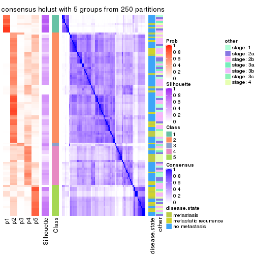</p>

</div>
<div id='tab-SD-hclust-consensus-heatmap-5'>
<pre><code class="r">consensus_heatmap(res, k = 6)
</code></pre>

<p></p>

</div>
</div>

Heatmaps for the membership of samples in all partitions to see how consistent they are:


<script>
$( function() {
	$( '#tabs-SD-hclust-membership-heatmap' ).tabs();
} );
</script>
<div id='tabs-SD-hclust-membership-heatmap'>
<ul>
<li><a href='#tab-SD-hclust-membership-heatmap-1'>k = 2</a></li>
<li><a href='#tab-SD-hclust-membership-heatmap-2'>k = 3</a></li>
<li><a href='#tab-SD-hclust-membership-heatmap-3'>k = 4</a></li>
<li><a href='#tab-SD-hclust-membership-heatmap-4'>k = 5</a></li>
<li><a href='#tab-SD-hclust-membership-heatmap-5'>k = 6</a></li>
</ul>
<div id='tab-SD-hclust-membership-heatmap-1'>
<pre><code class="r">membership_heatmap(res, k = 2)
</code></pre>

<p></p>

</div>
<div id='tab-SD-hclust-membership-heatmap-2'>
<pre><code class="r">membership_heatmap(res, k = 3)
</code></pre>

<p></p>

</div>
<div id='tab-SD-hclust-membership-heatmap-3'>
<pre><code class="r">membership_heatmap(res, k = 4)
</code></pre>

<p></p>

</div>
<div id='tab-SD-hclust-membership-heatmap-4'>
<pre><code class="r">membership_heatmap(res, k = 5)
</code></pre>

<p></p>

</div>
<div id='tab-SD-hclust-membership-heatmap-5'>
<pre><code class="r">membership_heatmap(res, k = 6)
</code></pre>

<p></p>

</div>
</div>

As soon as we have had the classes for columns, we can look for signatures
which are significantly different between classes which can be candidate marks
for certain classes. Following are the heatmaps for signatures.


Signature heatmaps where rows are scaled:


<script>
$( function() {
	$( '#tabs-SD-hclust-get-signatures' ).tabs();
} );
</script>
<div id='tabs-SD-hclust-get-signatures'>
<ul>
<li><a href='#tab-SD-hclust-get-signatures-1'>k = 2</a></li>
<li><a href='#tab-SD-hclust-get-signatures-2'>k = 3</a></li>
<li><a href='#tab-SD-hclust-get-signatures-3'>k = 4</a></li>
<li><a href='#tab-SD-hclust-get-signatures-4'>k = 5</a></li>
<li><a href='#tab-SD-hclust-get-signatures-5'>k = 6</a></li>
</ul>
<div id='tab-SD-hclust-get-signatures-1'>
<pre><code class="r">get_signatures(res, k = 2)
</code></pre>

<p></p>

</div>
<div id='tab-SD-hclust-get-signatures-2'>
<pre><code class="r">get_signatures(res, k = 3)
</code></pre>

<p></p>

</div>
<div id='tab-SD-hclust-get-signatures-3'>
<pre><code class="r">get_signatures(res, k = 4)
</code></pre>

<p></p>

</div>
<div id='tab-SD-hclust-get-signatures-4'>
<pre><code class="r">get_signatures(res, k = 5)
</code></pre>

<p></p>

</div>
<div id='tab-SD-hclust-get-signatures-5'>
<pre><code class="r">get_signatures(res, k = 6)
</code></pre>

<p>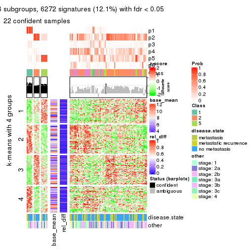</p>

</div>
</div>


Signature heatmaps where rows are not scaled:


<script>
$( function() {
	$( '#tabs-SD-hclust-get-signatures-no-scale' ).tabs();
} );
</script>
<div id='tabs-SD-hclust-get-signatures-no-scale'>
<ul>
<li><a href='#tab-SD-hclust-get-signatures-no-scale-1'>k = 2</a></li>
<li><a href='#tab-SD-hclust-get-signatures-no-scale-2'>k = 3</a></li>
<li><a href='#tab-SD-hclust-get-signatures-no-scale-3'>k = 4</a></li>
<li><a href='#tab-SD-hclust-get-signatures-no-scale-4'>k = 5</a></li>
<li><a href='#tab-SD-hclust-get-signatures-no-scale-5'>k = 6</a></li>
</ul>
<div id='tab-SD-hclust-get-signatures-no-scale-1'>
<pre><code class="r">get_signatures(res, k = 2, scale_rows = FALSE)
</code></pre>

<p></p>

</div>
<div id='tab-SD-hclust-get-signatures-no-scale-2'>
<pre><code class="r">get_signatures(res, k = 3, scale_rows = FALSE)
</code></pre>

<p></p>

</div>
<div id='tab-SD-hclust-get-signatures-no-scale-3'>
<pre><code class="r">get_signatures(res, k = 4, scale_rows = FALSE)
</code></pre>

<p></p>

</div>
<div id='tab-SD-hclust-get-signatures-no-scale-4'>
<pre><code class="r">get_signatures(res, k = 5, scale_rows = FALSE)
</code></pre>

<p></p>

</div>
<div id='tab-SD-hclust-get-signatures-no-scale-5'>
<pre><code class="r">get_signatures(res, k = 6, scale_rows = FALSE)
</code></pre>

<p>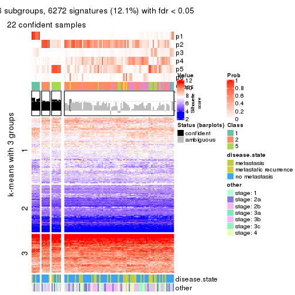</p>

</div>
</div>


Compare the overlap of signatures from different k:

```r
compare_signatures(res)
```


`get_signature()` returns a data frame invisibly. TO get the list of signatures, the function
call should be assigned to a variable explicitly. In following code, if `plot` argument is set
to `FALSE`, no heatmap is plotted while only the differential analysis is performed.

```r
# code only for demonstration
tb = get_signature(res, k = ..., plot = FALSE)
```

An example of the output of `tb` is:

```
#>   which_row         fdr    mean_1    mean_2 scaled_mean_1 scaled_mean_2 km
#> 1        38 0.042760348  8.373488  9.131774    -0.5533452     0.5164555  1
#> 2        40 0.018707592  7.106213  8.469186    -0.6173731     0.5762149  1
#> 3        55 0.019134737 10.221463 11.207825    -0.6159697     0.5749050  1
#> 4        59 0.006059896  5.921854  7.869574    -0.6899429     0.6439467  1
#> 5        60 0.018055526  8.928898 10.211722    -0.6204761     0.5791110  1
#> 6        98 0.009384629 15.714769 14.887706     0.6635654    -0.6193277  2
...
```

The columns in `tb` are:

1. `which_row`: row indices corresponding to the input matrix.
2. `fdr`: FDR for the differential test. 
3. `mean_x`: The mean value in group x.
4. `scaled_mean_x`: The mean value in group x after rows are scaled.
5. `km`: Row groups if k-means clustering is applied to rows.


UMAP plot which shows how samples are separated.


<script>
$( function() {
	$( '#tabs-SD-hclust-dimension-reduction' ).tabs();
} );
</script>
<div id='tabs-SD-hclust-dimension-reduction'>
<ul>
<li><a href='#tab-SD-hclust-dimension-reduction-1'>k = 2</a></li>
<li><a href='#tab-SD-hclust-dimension-reduction-2'>k = 3</a></li>
<li><a href='#tab-SD-hclust-dimension-reduction-3'>k = 4</a></li>
<li><a href='#tab-SD-hclust-dimension-reduction-4'>k = 5</a></li>
<li><a href='#tab-SD-hclust-dimension-reduction-5'>k = 6</a></li>
</ul>
<div id='tab-SD-hclust-dimension-reduction-1'>
<pre><code class="r">dimension_reduction(res, k = 2, method = &quot;UMAP&quot;)
</code></pre>

<p></p>

</div>
<div id='tab-SD-hclust-dimension-reduction-2'>
<pre><code class="r">dimension_reduction(res, k = 3, method = &quot;UMAP&quot;)
</code></pre>

<p></p>

</div>
<div id='tab-SD-hclust-dimension-reduction-3'>
<pre><code class="r">dimension_reduction(res, k = 4, method = &quot;UMAP&quot;)
</code></pre>

<p></p>

</div>
<div id='tab-SD-hclust-dimension-reduction-4'>
<pre><code class="r">dimension_reduction(res, k = 5, method = &quot;UMAP&quot;)
</code></pre>

<p></p>

</div>
<div id='tab-SD-hclust-dimension-reduction-5'>
<pre><code class="r">dimension_reduction(res, k = 6, method = &quot;UMAP&quot;)
</code></pre>

<p></p>

</div>
</div>


Following heatmap shows how subgroups are split when increasing `k`:

```r
collect_classes(res)
```


Test correlation between subgroups and known annotations. If the known
annotation is numeric, one-way ANOVA test is applied, and if the known
annotation is discrete, chi-squared contingency table test is applied.

```r
test_to_known_factors(res)
```

```
#>            n disease.state(p) other(p) k
#> SD:hclust 90            0.821   0.8192 2
#> SD:hclust 73            0.392   0.8807 3
#> SD:hclust 31            0.135   0.9739 4
#> SD:hclust 30            0.219   0.6712 5
#> SD:hclust 23            0.553   0.0129 6
```


If matrix rows can be associated to genes, consider to use `functional_enrichment(res,
...)` to perform function enrichment for the signature genes. See [this vignette](http://bioconductor.org/packages/devel/bioc/vignettes/cola/inst/doc/functional_enrichment.html) for more detailed explanations.


 

---------------------------------------------------


### SD:kmeans


The object with results only for a single top-value method and a single partition method 
can be extracted as:

```r
res = res_list["SD", "kmeans"]
# you can also extract it by
# res = res_list["SD:kmeans"]
```

A summary of `res` and all the functions that can be applied to it:

```r
res
```

```
#> A 'ConsensusPartition' object with k = 2, 3, 4, 5, 6.
#>   On a matrix with 51941 rows and 104 columns.
#>   Top rows (1000, 2000, 3000, 4000, 5000) are extracted by 'SD' method.
#>   Subgroups are detected by 'kmeans' method.
#>   Performed in total 1250 partitions by row resampling.
#>   Best k for subgroups seems to be 2.
#> 
#> Following methods can be applied to this 'ConsensusPartition' object:
#>  [1] "cola_report"             "collect_classes"         "collect_plots"          
#>  [4] "collect_stats"           "colnames"                "compare_signatures"     
#>  [7] "consensus_heatmap"       "dimension_reduction"     "functional_enrichment"  
#> [10] "get_anno_col"            "get_anno"                "get_classes"            
#> [13] "get_consensus"           "get_matrix"              "get_membership"         
#> [16] "get_param"               "get_signatures"          "get_stats"              
#> [19] "is_best_k"               "is_stable_k"             "membership_heatmap"     
#> [22] "ncol"                    "nrow"                    "plot_ecdf"              
#> [25] "rownames"                "select_partition_number" "show"                   
#> [28] "suggest_best_k"          "test_to_known_factors"
```

`collect_plots()` function collects all the plots made from `res` for all `k` (number of partitions)
into one single page to provide an easy and fast comparison between different `k`.

```r
collect_plots(res)
```


The plots are:

- The first row: a plot of the ECDF (empirical cumulative distribution
  function) curves of the consensus matrix for each `k` and the heatmap of
  predicted classes for each `k`.
- The second row: heatmaps of the consensus matrix for each `k`.
- The third row: heatmaps of the membership matrix for each `k`.
- The fouth row: heatmaps of the signatures for each `k`.

All the plots in panels can be made by individual functions and they are
plotted later in this section.

`select_partition_number()` produces several plots showing different
statistics for choosing "optimized" `k`. There are following statistics:

- ECDF curves of the consensus matrix for each `k`;
- 1-PAC. [The PAC
  score](https://en.wikipedia.org/wiki/Consensus_clustering#Over-interpretation_potential_of_consensus_clustering)
  measures the proportion of the ambiguous subgrouping.
- Mean silhouette score.
- Concordance. The mean probability of fiting the consensus class ids in all
  partitions.
- Area increased. Denote $A_k$ as the area under the ECDF curve for current
  `k`, the area increased is defined as $A_k - A_{k-1}$.
- Rand index. The percent of pairs of samples that are both in a same cluster
  or both are not in a same cluster in the partition of k and k-1.
- Jaccard index. The ratio of pairs of samples are both in a same cluster in
  the partition of k and k-1 and the pairs of samples are both in a same
  cluster in the partition k or k-1.

The detailed explanations of these statistics can be found in [the _cola_
vignette](http://bioconductor.org/packages/devel/bioc/vignettes/cola/inst/doc/cola.html#toc_13).

Generally speaking, lower PAC score, higher mean silhouette score or higher
concordance corresponds to better partition. Rand index and Jaccard index
measure how similar the current partition is compared to partition with `k-1`.
If they are too similar, we won't accept `k` is better than `k-1`.

```r
select_partition_number(res)
```


The numeric values for all these statistics can be obtained by `get_stats()`.

```r
get_stats(res)
```

```
#>   k 1-PAC mean_silhouette concordance area_increased  Rand Jaccard
#> 2 2 0.827           0.884       0.954         0.4757 0.522   0.522
#> 3 3 0.372           0.578       0.774         0.3449 0.765   0.579
#> 4 4 0.410           0.429       0.626         0.1450 0.814   0.545
#> 5 5 0.517           0.459       0.685         0.0743 0.857   0.544
#> 6 6 0.593           0.508       0.672         0.0454 0.909   0.608
```

`suggest_best_k()` suggests the best $k$ based on these statistics. The rules are as follows:

- All $k$ with Jaccard index larger than 0.95 are removed because increasing
  $k$ does not provide enough extra information. If all $k$ are removed, it is
  marked as no subgroup is detected.
- For all $k$ with 1-PAC score larger than 0.9, the maximal $k$ is taken as
  the best $k$, and other $k$ are marked as optional $k$.
- If it does not fit the second rule. The $k$ with the maximal vote of the
  highest 1-PAC score, highest mean silhouette, and highest concordance is
  taken as the best $k$.

```r
suggest_best_k(res)
```

```
#> [1] 2
```


Following shows the table of the partitions (You need to click the **show/hide
code output** link to see it). The membership matrix (columns with name `p*`)
is inferred by
[`clue::cl_consensus()`](https://www.rdocumentation.org/link/cl_consensus?package=clue)
function with the `SE` method. Basically the value in the membership matrix
represents the probability to belong to a certain group. The finall class
label for an item is determined with the group with highest probability it
belongs to.

In `get_classes()` function, the entropy is calculated from the membership
matrix and the silhouette score is calculated from the consensus matrix.


<script>
$( function() {
	$( '#tabs-SD-kmeans-get-classes' ).tabs();
} );
</script>
<div id='tabs-SD-kmeans-get-classes'>
<ul>
<li><a href='#tab-SD-kmeans-get-classes-1'>k = 2</a></li>
<li><a href='#tab-SD-kmeans-get-classes-2'>k = 3</a></li>
<li><a href='#tab-SD-kmeans-get-classes-3'>k = 4</a></li>
<li><a href='#tab-SD-kmeans-get-classes-4'>k = 5</a></li>
<li><a href='#tab-SD-kmeans-get-classes-5'>k = 6</a></li>
</ul>

<div id='tab-SD-kmeans-get-classes-1'>
<p><a id='tab-SD-kmeans-get-classes-1-a' style='color:#0366d6' href='#'>show/hide code output</a></p>
<pre><code class="r">cbind(get_classes(res, k = 2), get_membership(res, k = 2))
</code></pre>

<pre><code>#&gt;           class entropy silhouette    p1    p2
#&gt; GSM537341     2  0.8713     0.5750 0.292 0.708
#&gt; GSM537345     1  0.0000     0.9334 1.000 0.000
#&gt; GSM537355     2  0.0000     0.9595 0.000 1.000
#&gt; GSM537366     1  0.0000     0.9334 1.000 0.000
#&gt; GSM537370     2  0.0672     0.9538 0.008 0.992
#&gt; GSM537380     2  0.0000     0.9595 0.000 1.000
#&gt; GSM537392     2  0.0000     0.9595 0.000 1.000
#&gt; GSM537415     2  0.0000     0.9595 0.000 1.000
#&gt; GSM537417     2  0.0376     0.9566 0.004 0.996
#&gt; GSM537422     1  0.5629     0.8261 0.868 0.132
#&gt; GSM537423     2  0.0000     0.9595 0.000 1.000
#&gt; GSM537427     2  0.0000     0.9595 0.000 1.000
#&gt; GSM537430     2  0.0000     0.9595 0.000 1.000
#&gt; GSM537336     1  0.0000     0.9334 1.000 0.000
#&gt; GSM537337     2  0.0000     0.9595 0.000 1.000
#&gt; GSM537348     1  0.0000     0.9334 1.000 0.000
#&gt; GSM537349     2  0.0000     0.9595 0.000 1.000
#&gt; GSM537356     1  0.0000     0.9334 1.000 0.000
#&gt; GSM537361     1  0.0000     0.9334 1.000 0.000
#&gt; GSM537374     2  0.0000     0.9595 0.000 1.000
#&gt; GSM537377     1  0.0000     0.9334 1.000 0.000
#&gt; GSM537378     2  0.0000     0.9595 0.000 1.000
#&gt; GSM537379     2  0.0000     0.9595 0.000 1.000
#&gt; GSM537383     2  0.0000     0.9595 0.000 1.000
#&gt; GSM537388     2  0.0000     0.9595 0.000 1.000
#&gt; GSM537395     2  0.0000     0.9595 0.000 1.000
#&gt; GSM537400     1  0.9732     0.3686 0.596 0.404
#&gt; GSM537404     2  0.9850     0.1966 0.428 0.572
#&gt; GSM537409     2  0.0000     0.9595 0.000 1.000
#&gt; GSM537418     1  0.0000     0.9334 1.000 0.000
#&gt; GSM537425     1  0.0000     0.9334 1.000 0.000
#&gt; GSM537333     2  0.9954     0.0640 0.460 0.540
#&gt; GSM537342     2  0.0000     0.9595 0.000 1.000
#&gt; GSM537347     2  0.1843     0.9374 0.028 0.972
#&gt; GSM537350     1  0.0000     0.9334 1.000 0.000
#&gt; GSM537362     1  0.0938     0.9257 0.988 0.012
#&gt; GSM537363     1  0.7674     0.7189 0.776 0.224
#&gt; GSM537368     1  0.0000     0.9334 1.000 0.000
#&gt; GSM537376     2  0.0000     0.9595 0.000 1.000
#&gt; GSM537381     1  0.0000     0.9334 1.000 0.000
#&gt; GSM537386     2  0.0000     0.9595 0.000 1.000
#&gt; GSM537398     1  0.0000     0.9334 1.000 0.000
#&gt; GSM537402     2  0.0000     0.9595 0.000 1.000
#&gt; GSM537405     1  0.0000     0.9334 1.000 0.000
#&gt; GSM537371     1  0.0000     0.9334 1.000 0.000
#&gt; GSM537421     2  0.0938     0.9506 0.012 0.988
#&gt; GSM537424     1  0.0000     0.9334 1.000 0.000
#&gt; GSM537432     2  0.9850     0.1797 0.428 0.572
#&gt; GSM537331     2  0.0000     0.9595 0.000 1.000
#&gt; GSM537332     2  0.0000     0.9595 0.000 1.000
#&gt; GSM537334     2  0.0000     0.9595 0.000 1.000
#&gt; GSM537338     2  0.0000     0.9595 0.000 1.000
#&gt; GSM537353     2  0.0000     0.9595 0.000 1.000
#&gt; GSM537357     1  0.0000     0.9334 1.000 0.000
#&gt; GSM537358     2  0.0000     0.9595 0.000 1.000
#&gt; GSM537375     2  0.0000     0.9595 0.000 1.000
#&gt; GSM537389     2  0.0000     0.9595 0.000 1.000
#&gt; GSM537390     2  0.0000     0.9595 0.000 1.000
#&gt; GSM537393     2  0.0000     0.9595 0.000 1.000
#&gt; GSM537399     1  0.7056     0.7484 0.808 0.192
#&gt; GSM537407     1  0.0000     0.9334 1.000 0.000
#&gt; GSM537408     2  0.0000     0.9595 0.000 1.000
#&gt; GSM537428     2  0.0000     0.9595 0.000 1.000
#&gt; GSM537354     2  0.0000     0.9595 0.000 1.000
#&gt; GSM537410     2  0.0000     0.9595 0.000 1.000
#&gt; GSM537413     2  0.0000     0.9595 0.000 1.000
#&gt; GSM537396     2  0.2603     0.9217 0.044 0.956
#&gt; GSM537397     1  0.4690     0.8547 0.900 0.100
#&gt; GSM537330     2  0.0000     0.9595 0.000 1.000
#&gt; GSM537369     1  0.0000     0.9334 1.000 0.000
#&gt; GSM537373     2  0.2043     0.9332 0.032 0.968
#&gt; GSM537401     2  0.4298     0.8775 0.088 0.912
#&gt; GSM537343     1  0.0000     0.9334 1.000 0.000
#&gt; GSM537367     1  0.7745     0.7125 0.772 0.228
#&gt; GSM537382     2  0.0000     0.9595 0.000 1.000
#&gt; GSM537385     2  0.0000     0.9595 0.000 1.000
#&gt; GSM537391     1  0.0000     0.9334 1.000 0.000
#&gt; GSM537419     2  0.0000     0.9595 0.000 1.000
#&gt; GSM537420     1  0.0000     0.9334 1.000 0.000
#&gt; GSM537429     2  0.4690     0.8655 0.100 0.900
#&gt; GSM537431     1  0.9933     0.2332 0.548 0.452
#&gt; GSM537387     1  0.0000     0.9334 1.000 0.000
#&gt; GSM537414     1  0.7219     0.7498 0.800 0.200
#&gt; GSM537433     1  0.0000     0.9334 1.000 0.000
#&gt; GSM537335     2  0.1843     0.9379 0.028 0.972
#&gt; GSM537339     1  0.0376     0.9308 0.996 0.004
#&gt; GSM537340     2  0.9491     0.3812 0.368 0.632
#&gt; GSM537344     1  0.0000     0.9334 1.000 0.000
#&gt; GSM537346     2  0.0000     0.9595 0.000 1.000
#&gt; GSM537351     1  0.0000     0.9334 1.000 0.000
#&gt; GSM537352     2  0.0000     0.9595 0.000 1.000
#&gt; GSM537359     2  0.0000     0.9595 0.000 1.000
#&gt; GSM537360     2  0.0000     0.9595 0.000 1.000
#&gt; GSM537364     1  0.0000     0.9334 1.000 0.000
#&gt; GSM537365     1  0.9998     0.0927 0.508 0.492
#&gt; GSM537372     1  0.0000     0.9334 1.000 0.000
#&gt; GSM537384     1  0.0000     0.9334 1.000 0.000
#&gt; GSM537394     2  0.0000     0.9595 0.000 1.000
#&gt; GSM537403     2  0.0000     0.9595 0.000 1.000
#&gt; GSM537406     2  0.0000     0.9595 0.000 1.000
#&gt; GSM537411     2  0.0000     0.9595 0.000 1.000
#&gt; GSM537412     2  0.0000     0.9595 0.000 1.000
#&gt; GSM537416     2  0.0938     0.9506 0.012 0.988
#&gt; GSM537426     2  0.0000     0.9595 0.000 1.000
</code></pre>

<script>
$('#tab-SD-kmeans-get-classes-1-a').parent().next().next().hide();
$('#tab-SD-kmeans-get-classes-1-a').click(function(){
  $('#tab-SD-kmeans-get-classes-1-a').parent().next().next().toggle();
  return(false);
});
</script>
</div>

<div id='tab-SD-kmeans-get-classes-2'>
<p><a id='tab-SD-kmeans-get-classes-2-a' style='color:#0366d6' href='#'>show/hide code output</a></p>
<pre><code class="r">cbind(get_classes(res, k = 3), get_membership(res, k = 3))
</code></pre>

<pre><code>#&gt;           class entropy silhouette    p1    p2    p3
#&gt; GSM537341     2  0.9876    0.00501 0.288 0.412 0.300
#&gt; GSM537345     1  0.2165    0.77465 0.936 0.000 0.064
#&gt; GSM537355     2  0.4605    0.70705 0.000 0.796 0.204
#&gt; GSM537366     3  0.7188   -0.24114 0.488 0.024 0.488
#&gt; GSM537370     2  0.7889    0.42497 0.088 0.624 0.288
#&gt; GSM537380     2  0.2066    0.75466 0.000 0.940 0.060
#&gt; GSM537392     2  0.1643    0.76065 0.000 0.956 0.044
#&gt; GSM537415     2  0.4178    0.67828 0.000 0.828 0.172
#&gt; GSM537417     3  0.6566    0.42197 0.016 0.348 0.636
#&gt; GSM537422     3  0.5295    0.54693 0.156 0.036 0.808
#&gt; GSM537423     2  0.0747    0.76221 0.000 0.984 0.016
#&gt; GSM537427     2  0.2711    0.75841 0.000 0.912 0.088
#&gt; GSM537430     2  0.0892    0.76545 0.000 0.980 0.020
#&gt; GSM537336     1  0.2796    0.77080 0.908 0.000 0.092
#&gt; GSM537337     2  0.3482    0.75205 0.000 0.872 0.128
#&gt; GSM537348     1  0.6224    0.68000 0.688 0.016 0.296
#&gt; GSM537349     2  0.0892    0.76250 0.000 0.980 0.020
#&gt; GSM537356     1  0.6105    0.70350 0.724 0.024 0.252
#&gt; GSM537361     3  0.5497    0.32085 0.292 0.000 0.708
#&gt; GSM537374     2  0.4979    0.70432 0.020 0.812 0.168
#&gt; GSM537377     1  0.2165    0.77465 0.936 0.000 0.064
#&gt; GSM537378     2  0.0747    0.76221 0.000 0.984 0.016
#&gt; GSM537379     3  0.6192    0.18930 0.000 0.420 0.580
#&gt; GSM537383     2  0.0747    0.76441 0.000 0.984 0.016
#&gt; GSM537388     2  0.2448    0.76224 0.000 0.924 0.076
#&gt; GSM537395     2  0.2711    0.75801 0.000 0.912 0.088
#&gt; GSM537400     3  0.4281    0.60184 0.056 0.072 0.872
#&gt; GSM537404     3  0.6594    0.59347 0.116 0.128 0.756
#&gt; GSM537409     3  0.6225    0.24332 0.000 0.432 0.568
#&gt; GSM537418     1  0.5835    0.59465 0.660 0.000 0.340
#&gt; GSM537425     3  0.6172    0.31292 0.308 0.012 0.680
#&gt; GSM537333     3  0.4443    0.60758 0.052 0.084 0.864
#&gt; GSM537342     2  0.6140    0.34211 0.000 0.596 0.404
#&gt; GSM537347     3  0.6931    0.32388 0.032 0.328 0.640
#&gt; GSM537350     1  0.4915    0.75462 0.804 0.012 0.184
#&gt; GSM537362     1  0.6096    0.69643 0.704 0.016 0.280
#&gt; GSM537363     3  0.7959    0.38621 0.288 0.092 0.620
#&gt; GSM537368     1  0.2796    0.77080 0.908 0.000 0.092
#&gt; GSM537376     2  0.4555    0.70358 0.000 0.800 0.200
#&gt; GSM537381     1  0.4178    0.75913 0.828 0.000 0.172
#&gt; GSM537386     2  0.3816    0.71464 0.000 0.852 0.148
#&gt; GSM537398     1  0.6313    0.66497 0.676 0.016 0.308
#&gt; GSM537402     2  0.3192    0.74929 0.000 0.888 0.112
#&gt; GSM537405     1  0.2625    0.77858 0.916 0.000 0.084
#&gt; GSM537371     1  0.2796    0.77080 0.908 0.000 0.092
#&gt; GSM537421     3  0.6386    0.23184 0.004 0.412 0.584
#&gt; GSM537424     1  0.4796    0.73377 0.780 0.000 0.220
#&gt; GSM537432     3  0.5136    0.61301 0.044 0.132 0.824
#&gt; GSM537331     2  0.5147    0.69087 0.020 0.800 0.180
#&gt; GSM537332     3  0.6045    0.41167 0.000 0.380 0.620
#&gt; GSM537334     2  0.5731    0.65687 0.020 0.752 0.228
#&gt; GSM537338     2  0.5200    0.70577 0.020 0.796 0.184
#&gt; GSM537353     2  0.3879    0.70462 0.000 0.848 0.152
#&gt; GSM537357     1  0.2796    0.77080 0.908 0.000 0.092
#&gt; GSM537358     2  0.0424    0.76368 0.000 0.992 0.008
#&gt; GSM537375     2  0.5560    0.61818 0.000 0.700 0.300
#&gt; GSM537389     2  0.0892    0.76250 0.000 0.980 0.020
#&gt; GSM537390     2  0.3412    0.71671 0.000 0.876 0.124
#&gt; GSM537393     2  0.5138    0.66000 0.000 0.748 0.252
#&gt; GSM537399     3  0.9018    0.19957 0.276 0.176 0.548
#&gt; GSM537407     3  0.6715    0.32740 0.312 0.028 0.660
#&gt; GSM537408     2  0.1860    0.75544 0.000 0.948 0.052
#&gt; GSM537428     2  0.4293    0.72100 0.004 0.832 0.164
#&gt; GSM537354     2  0.3686    0.74806 0.000 0.860 0.140
#&gt; GSM537410     2  0.6111    0.29520 0.000 0.604 0.396
#&gt; GSM537413     2  0.3340    0.72998 0.000 0.880 0.120
#&gt; GSM537396     2  0.5285    0.66710 0.064 0.824 0.112
#&gt; GSM537397     1  0.9070    0.43894 0.536 0.172 0.292
#&gt; GSM537330     3  0.6302    0.09573 0.000 0.480 0.520
#&gt; GSM537369     1  0.1529    0.78829 0.960 0.000 0.040
#&gt; GSM537373     2  0.7622    0.38623 0.060 0.608 0.332
#&gt; GSM537401     2  0.8732    0.32128 0.132 0.552 0.316
#&gt; GSM537343     3  0.6476    0.02219 0.448 0.004 0.548
#&gt; GSM537367     3  0.6034    0.57142 0.152 0.068 0.780
#&gt; GSM537382     2  0.5254    0.65615 0.000 0.736 0.264
#&gt; GSM537385     2  0.0892    0.76488 0.000 0.980 0.020
#&gt; GSM537391     1  0.3910    0.75138 0.876 0.020 0.104
#&gt; GSM537419     2  0.0592    0.76221 0.000 0.988 0.012
#&gt; GSM537420     1  0.1529    0.78829 0.960 0.000 0.040
#&gt; GSM537429     2  0.7583    0.13540 0.040 0.492 0.468
#&gt; GSM537431     3  0.4966    0.61430 0.060 0.100 0.840
#&gt; GSM537387     1  0.2959    0.76702 0.900 0.000 0.100
#&gt; GSM537414     3  0.5454    0.55511 0.152 0.044 0.804
#&gt; GSM537433     3  0.6880    0.34130 0.304 0.036 0.660
#&gt; GSM537335     2  0.8181    0.38189 0.092 0.584 0.324
#&gt; GSM537339     1  0.7801    0.59030 0.616 0.076 0.308
#&gt; GSM537340     3  0.8019    0.38685 0.076 0.348 0.576
#&gt; GSM537344     1  0.1529    0.78829 0.960 0.000 0.040
#&gt; GSM537346     2  0.6305   -0.05863 0.000 0.516 0.484
#&gt; GSM537351     1  0.5926    0.38864 0.644 0.000 0.356
#&gt; GSM537352     2  0.3340    0.75544 0.000 0.880 0.120
#&gt; GSM537359     2  0.2356    0.75323 0.000 0.928 0.072
#&gt; GSM537360     2  0.4605    0.64761 0.000 0.796 0.204
#&gt; GSM537364     1  0.2796    0.77080 0.908 0.000 0.092
#&gt; GSM537365     3  0.6511    0.57677 0.104 0.136 0.760
#&gt; GSM537372     1  0.5992    0.69922 0.716 0.016 0.268
#&gt; GSM537384     1  0.5070    0.72842 0.772 0.004 0.224
#&gt; GSM537394     2  0.5706    0.38613 0.000 0.680 0.320
#&gt; GSM537403     3  0.6225    0.23817 0.000 0.432 0.568
#&gt; GSM537406     2  0.2711    0.74528 0.000 0.912 0.088
#&gt; GSM537411     2  0.4002    0.74822 0.000 0.840 0.160
#&gt; GSM537412     3  0.6267    0.21864 0.000 0.452 0.548
#&gt; GSM537416     3  0.6126    0.38510 0.004 0.352 0.644
#&gt; GSM537426     2  0.5621    0.51924 0.000 0.692 0.308
</code></pre>

<script>
$('#tab-SD-kmeans-get-classes-2-a').parent().next().next().hide();
$('#tab-SD-kmeans-get-classes-2-a').click(function(){
  $('#tab-SD-kmeans-get-classes-2-a').parent().next().next().toggle();
  return(false);
});
</script>
</div>

<div id='tab-SD-kmeans-get-classes-3'>
<p><a id='tab-SD-kmeans-get-classes-3-a' style='color:#0366d6' href='#'>show/hide code output</a></p>
<pre><code class="r">cbind(get_classes(res, k = 4), get_membership(res, k = 4))
</code></pre>

<pre><code>#&gt;           class entropy silhouette    p1    p2    p3    p4
#&gt; GSM537341     4  0.5744    0.43349 0.108 0.184 0.000 0.708
#&gt; GSM537345     1  0.1452    0.75498 0.956 0.000 0.008 0.036
#&gt; GSM537355     2  0.7188    0.49441 0.000 0.552 0.204 0.244
#&gt; GSM537366     4  0.7709    0.27689 0.280 0.004 0.232 0.484
#&gt; GSM537370     4  0.4936    0.17834 0.000 0.340 0.008 0.652
#&gt; GSM537380     2  0.2179    0.65692 0.000 0.924 0.012 0.064
#&gt; GSM537392     2  0.1938    0.66148 0.000 0.936 0.012 0.052
#&gt; GSM537415     2  0.4737    0.47553 0.000 0.728 0.252 0.020
#&gt; GSM537417     3  0.5940    0.51713 0.000 0.120 0.692 0.188
#&gt; GSM537422     3  0.6246    0.48910 0.132 0.012 0.696 0.160
#&gt; GSM537423     2  0.0469    0.66658 0.000 0.988 0.012 0.000
#&gt; GSM537427     2  0.5327    0.61646 0.000 0.720 0.060 0.220
#&gt; GSM537430     2  0.2450    0.67160 0.000 0.912 0.016 0.072
#&gt; GSM537336     1  0.0000    0.76429 1.000 0.000 0.000 0.000
#&gt; GSM537337     2  0.7120    0.52294 0.000 0.564 0.212 0.224
#&gt; GSM537348     4  0.4382    0.36283 0.296 0.000 0.000 0.704
#&gt; GSM537349     2  0.1936    0.65856 0.000 0.940 0.032 0.028
#&gt; GSM537356     4  0.6461    0.26368 0.364 0.004 0.068 0.564
#&gt; GSM537361     3  0.7452    0.17924 0.156 0.004 0.476 0.364
#&gt; GSM537374     2  0.6263    0.51940 0.000 0.576 0.068 0.356
#&gt; GSM537377     1  0.1452    0.75498 0.956 0.000 0.008 0.036
#&gt; GSM537378     2  0.0592    0.66583 0.000 0.984 0.016 0.000
#&gt; GSM537379     3  0.7058    0.43213 0.000 0.168 0.560 0.272
#&gt; GSM537383     2  0.1151    0.66834 0.000 0.968 0.008 0.024
#&gt; GSM537388     2  0.5628    0.60817 0.000 0.704 0.080 0.216
#&gt; GSM537395     2  0.6033    0.57872 0.000 0.680 0.204 0.116
#&gt; GSM537400     3  0.5449    0.49299 0.040 0.012 0.720 0.228
#&gt; GSM537404     3  0.7147    0.34112 0.056 0.040 0.540 0.364
#&gt; GSM537409     3  0.4635    0.43845 0.000 0.216 0.756 0.028
#&gt; GSM537418     4  0.7486    0.19033 0.348 0.000 0.188 0.464
#&gt; GSM537425     3  0.7872   -0.05280 0.196 0.008 0.404 0.392
#&gt; GSM537333     3  0.5741    0.49090 0.036 0.020 0.696 0.248
#&gt; GSM537342     3  0.6423    0.29066 0.004 0.252 0.640 0.104
#&gt; GSM537347     3  0.7342    0.27010 0.000 0.156 0.432 0.412
#&gt; GSM537350     1  0.6857   -0.03414 0.484 0.040 0.032 0.444
#&gt; GSM537362     4  0.7588    0.10773 0.408 0.020 0.116 0.456
#&gt; GSM537363     3  0.7122    0.31065 0.200 0.028 0.632 0.140
#&gt; GSM537368     1  0.0524    0.76452 0.988 0.000 0.004 0.008
#&gt; GSM537376     2  0.7040    0.26454 0.000 0.460 0.420 0.120
#&gt; GSM537381     1  0.7076   -0.09404 0.460 0.000 0.124 0.416
#&gt; GSM537386     2  0.4274    0.62026 0.000 0.820 0.072 0.108
#&gt; GSM537398     4  0.5033    0.38533 0.268 0.004 0.020 0.708
#&gt; GSM537402     2  0.6334    0.42912 0.000 0.592 0.328 0.080
#&gt; GSM537405     1  0.1411    0.76250 0.960 0.000 0.020 0.020
#&gt; GSM537371     1  0.0376    0.76370 0.992 0.000 0.004 0.004
#&gt; GSM537421     3  0.5515    0.39855 0.016 0.204 0.732 0.048
#&gt; GSM537424     4  0.6168    0.22438 0.388 0.000 0.056 0.556
#&gt; GSM537432     3  0.5046    0.51280 0.004 0.032 0.732 0.232
#&gt; GSM537331     2  0.6677    0.48660 0.000 0.540 0.096 0.364
#&gt; GSM537332     3  0.7058    0.49875 0.000 0.228 0.572 0.200
#&gt; GSM537334     2  0.7451    0.36061 0.000 0.416 0.172 0.412
#&gt; GSM537338     2  0.7098    0.45528 0.000 0.492 0.132 0.376
#&gt; GSM537353     2  0.4831    0.58107 0.000 0.752 0.208 0.040
#&gt; GSM537357     1  0.0000    0.76429 1.000 0.000 0.000 0.000
#&gt; GSM537358     2  0.1284    0.66203 0.000 0.964 0.024 0.012
#&gt; GSM537375     2  0.7629    0.34972 0.000 0.452 0.328 0.220
#&gt; GSM537389     2  0.1610    0.65503 0.000 0.952 0.032 0.016
#&gt; GSM537390     2  0.3308    0.62068 0.000 0.872 0.092 0.036
#&gt; GSM537393     2  0.7268    0.40979 0.000 0.516 0.312 0.172
#&gt; GSM537399     4  0.6444    0.38409 0.080 0.036 0.192 0.692
#&gt; GSM537407     4  0.7673    0.00778 0.136 0.016 0.400 0.448
#&gt; GSM537408     2  0.2413    0.64626 0.000 0.916 0.020 0.064
#&gt; GSM537428     2  0.6748    0.51403 0.000 0.560 0.112 0.328
#&gt; GSM537354     2  0.7065    0.52332 0.000 0.572 0.216 0.212
#&gt; GSM537410     3  0.6007    0.19512 0.004 0.372 0.584 0.040
#&gt; GSM537413     2  0.4540    0.52602 0.000 0.772 0.196 0.032
#&gt; GSM537396     2  0.6653    0.22185 0.000 0.548 0.096 0.356
#&gt; GSM537397     4  0.5783    0.41624 0.220 0.088 0.000 0.692
#&gt; GSM537330     3  0.7677    0.39442 0.000 0.272 0.460 0.268
#&gt; GSM537369     1  0.3757    0.68917 0.828 0.000 0.020 0.152
#&gt; GSM537373     3  0.8019    0.07903 0.004 0.352 0.372 0.272
#&gt; GSM537401     4  0.5327    0.42880 0.056 0.208 0.004 0.732
#&gt; GSM537343     4  0.7970    0.09778 0.184 0.016 0.352 0.448
#&gt; GSM537367     3  0.4526    0.48485 0.076 0.004 0.812 0.108
#&gt; GSM537382     3  0.7191   -0.12451 0.000 0.352 0.500 0.148
#&gt; GSM537385     2  0.3427    0.66807 0.000 0.860 0.028 0.112
#&gt; GSM537391     1  0.5774    0.07150 0.508 0.028 0.000 0.464
#&gt; GSM537419     2  0.0895    0.66540 0.000 0.976 0.020 0.004
#&gt; GSM537420     1  0.3757    0.68917 0.828 0.000 0.020 0.152
#&gt; GSM537429     4  0.7534   -0.05544 0.000 0.240 0.268 0.492
#&gt; GSM537431     3  0.4673    0.51101 0.024 0.012 0.780 0.184
#&gt; GSM537387     1  0.3649    0.63663 0.796 0.000 0.000 0.204
#&gt; GSM537414     3  0.6985    0.41923 0.108 0.024 0.624 0.244
#&gt; GSM537433     4  0.7965    0.00364 0.176 0.016 0.404 0.404
#&gt; GSM537335     4  0.7115    0.08244 0.012 0.248 0.144 0.596
#&gt; GSM537339     4  0.5520    0.40848 0.244 0.060 0.000 0.696
#&gt; GSM537340     3  0.6319    0.40998 0.068 0.232 0.676 0.024
#&gt; GSM537344     1  0.3447    0.70508 0.852 0.000 0.020 0.128
#&gt; GSM537346     3  0.7868    0.27568 0.000 0.352 0.372 0.276
#&gt; GSM537351     1  0.4953    0.50009 0.776 0.000 0.120 0.104
#&gt; GSM537352     2  0.6917    0.54444 0.000 0.592 0.208 0.200
#&gt; GSM537359     2  0.2578    0.65305 0.000 0.912 0.036 0.052
#&gt; GSM537360     2  0.5228    0.42465 0.000 0.664 0.312 0.024
#&gt; GSM537364     1  0.0779    0.75923 0.980 0.000 0.016 0.004
#&gt; GSM537365     3  0.7233    0.23710 0.036 0.060 0.492 0.412
#&gt; GSM537372     4  0.5194    0.32242 0.332 0.004 0.012 0.652
#&gt; GSM537384     4  0.5231    0.23715 0.384 0.000 0.012 0.604
#&gt; GSM537394     2  0.6798    0.13110 0.000 0.604 0.224 0.172
#&gt; GSM537403     3  0.4872    0.43983 0.004 0.212 0.752 0.032
#&gt; GSM537406     2  0.4831    0.49711 0.000 0.752 0.208 0.040
#&gt; GSM537411     2  0.7004    0.53925 0.000 0.580 0.200 0.220
#&gt; GSM537412     3  0.5525    0.29251 0.004 0.336 0.636 0.024
#&gt; GSM537416     3  0.2876    0.53918 0.008 0.092 0.892 0.008
#&gt; GSM537426     3  0.5917   -0.04183 0.000 0.444 0.520 0.036
</code></pre>

<script>
$('#tab-SD-kmeans-get-classes-3-a').parent().next().next().hide();
$('#tab-SD-kmeans-get-classes-3-a').click(function(){
  $('#tab-SD-kmeans-get-classes-3-a').parent().next().next().toggle();
  return(false);
});
</script>
</div>

<div id='tab-SD-kmeans-get-classes-4'>
<p><a id='tab-SD-kmeans-get-classes-4-a' style='color:#0366d6' href='#'>show/hide code output</a></p>
<pre><code class="r">cbind(get_classes(res, k = 5), get_membership(res, k = 5))
</code></pre>

<pre><code>#&gt;           class entropy silhouette    p1    p2    p3    p4    p5
#&gt; GSM537341     5  0.2749     0.6346 0.028 0.060 0.012 0.004 0.896
#&gt; GSM537345     1  0.1282     0.8597 0.952 0.000 0.000 0.004 0.044
#&gt; GSM537355     2  0.8501     0.2624 0.004 0.344 0.284 0.168 0.200
#&gt; GSM537366     5  0.7384    -0.2042 0.112 0.004 0.396 0.072 0.416
#&gt; GSM537370     5  0.4361     0.5059 0.000 0.204 0.032 0.012 0.752
#&gt; GSM537380     2  0.1911     0.5950 0.000 0.932 0.028 0.004 0.036
#&gt; GSM537392     2  0.1750     0.5963 0.000 0.936 0.028 0.000 0.036
#&gt; GSM537415     2  0.4671     0.2242 0.004 0.640 0.008 0.340 0.008
#&gt; GSM537417     3  0.5298     0.3800 0.004 0.052 0.696 0.224 0.024
#&gt; GSM537422     3  0.5586     0.2788 0.064 0.004 0.536 0.396 0.000
#&gt; GSM537423     2  0.0963     0.5945 0.000 0.964 0.000 0.036 0.000
#&gt; GSM537427     2  0.6540     0.4888 0.000 0.584 0.160 0.032 0.224
#&gt; GSM537430     2  0.3933     0.5838 0.000 0.824 0.100 0.024 0.052
#&gt; GSM537336     1  0.1173     0.8652 0.964 0.000 0.004 0.020 0.012
#&gt; GSM537337     2  0.8208     0.2972 0.000 0.408 0.216 0.216 0.160
#&gt; GSM537348     5  0.3573     0.6477 0.124 0.012 0.032 0.000 0.832
#&gt; GSM537349     2  0.1809     0.5819 0.000 0.928 0.000 0.060 0.012
#&gt; GSM537356     5  0.5595     0.4674 0.140 0.004 0.184 0.004 0.668
#&gt; GSM537361     3  0.4846     0.5921 0.060 0.000 0.772 0.064 0.104
#&gt; GSM537374     2  0.7315     0.3210 0.000 0.436 0.152 0.056 0.356
#&gt; GSM537377     1  0.1569     0.8593 0.944 0.000 0.008 0.004 0.044
#&gt; GSM537378     2  0.1043     0.5952 0.000 0.960 0.000 0.040 0.000
#&gt; GSM537379     3  0.6220     0.2350 0.004 0.072 0.640 0.224 0.060
#&gt; GSM537383     2  0.1186     0.6030 0.000 0.964 0.020 0.008 0.008
#&gt; GSM537388     2  0.7223     0.4616 0.000 0.536 0.200 0.072 0.192
#&gt; GSM537395     2  0.7364     0.3874 0.000 0.524 0.188 0.204 0.084
#&gt; GSM537400     3  0.5726     0.2366 0.020 0.004 0.532 0.408 0.036
#&gt; GSM537404     3  0.5179     0.5919 0.016 0.020 0.752 0.096 0.116
#&gt; GSM537409     4  0.4185     0.6055 0.004 0.080 0.104 0.804 0.008
#&gt; GSM537418     3  0.6668     0.0443 0.132 0.000 0.424 0.020 0.424
#&gt; GSM537425     3  0.6838     0.5100 0.092 0.004 0.596 0.092 0.216
#&gt; GSM537333     3  0.5389     0.2983 0.012 0.004 0.584 0.368 0.032
#&gt; GSM537342     4  0.4329     0.6214 0.000 0.076 0.048 0.808 0.068
#&gt; GSM537347     3  0.4171     0.5190 0.004 0.060 0.816 0.024 0.096
#&gt; GSM537350     5  0.7391     0.3822 0.196 0.056 0.144 0.032 0.572
#&gt; GSM537362     5  0.7866     0.2904 0.264 0.008 0.208 0.072 0.448
#&gt; GSM537363     4  0.6766     0.3070 0.100 0.012 0.204 0.616 0.068
#&gt; GSM537368     1  0.0693     0.8652 0.980 0.000 0.008 0.000 0.012
#&gt; GSM537376     4  0.6644     0.4090 0.000 0.224 0.064 0.596 0.116
#&gt; GSM537381     3  0.7065     0.1126 0.212 0.000 0.428 0.020 0.340
#&gt; GSM537386     2  0.3835     0.5587 0.000 0.836 0.076 0.032 0.056
#&gt; GSM537398     5  0.3913     0.6481 0.116 0.008 0.040 0.012 0.824
#&gt; GSM537402     4  0.6536     0.1261 0.000 0.404 0.028 0.468 0.100
#&gt; GSM537405     1  0.1750     0.8615 0.936 0.000 0.036 0.000 0.028
#&gt; GSM537371     1  0.0798     0.8651 0.976 0.000 0.008 0.000 0.016
#&gt; GSM537421     4  0.3946     0.6111 0.020 0.056 0.068 0.840 0.016
#&gt; GSM537424     5  0.4852     0.5818 0.184 0.000 0.100 0.000 0.716
#&gt; GSM537432     4  0.6050     0.0227 0.008 0.016 0.404 0.516 0.056
#&gt; GSM537331     2  0.7240     0.3375 0.000 0.420 0.224 0.028 0.328
#&gt; GSM537332     3  0.5657     0.4721 0.000 0.124 0.676 0.180 0.020
#&gt; GSM537334     5  0.7859    -0.2211 0.004 0.292 0.272 0.056 0.376
#&gt; GSM537338     2  0.7732     0.2952 0.000 0.360 0.236 0.060 0.344
#&gt; GSM537353     2  0.5696     0.2892 0.000 0.604 0.044 0.320 0.032
#&gt; GSM537357     1  0.1278     0.8660 0.960 0.000 0.004 0.020 0.016
#&gt; GSM537358     2  0.1299     0.5988 0.000 0.960 0.012 0.020 0.008
#&gt; GSM537375     4  0.8391    -0.1648 0.000 0.292 0.244 0.316 0.148
#&gt; GSM537389     2  0.1809     0.5829 0.000 0.928 0.000 0.060 0.012
#&gt; GSM537390     2  0.2861     0.5604 0.000 0.884 0.024 0.076 0.016
#&gt; GSM537393     2  0.8154     0.1705 0.000 0.356 0.248 0.288 0.108
#&gt; GSM537399     3  0.5539     0.1606 0.032 0.012 0.492 0.004 0.460
#&gt; GSM537407     3  0.5560     0.5063 0.036 0.008 0.668 0.036 0.252
#&gt; GSM537408     2  0.3255     0.5659 0.000 0.868 0.056 0.020 0.056
#&gt; GSM537428     2  0.7597     0.3682 0.000 0.412 0.244 0.052 0.292
#&gt; GSM537354     2  0.8291     0.2565 0.000 0.380 0.216 0.248 0.156
#&gt; GSM537410     4  0.4643     0.6244 0.000 0.132 0.044 0.776 0.048
#&gt; GSM537413     2  0.4751     0.3552 0.004 0.712 0.020 0.244 0.020
#&gt; GSM537396     5  0.6656     0.0493 0.000 0.388 0.008 0.172 0.432
#&gt; GSM537397     5  0.2916     0.6497 0.072 0.032 0.008 0.004 0.884
#&gt; GSM537330     3  0.5174     0.4661 0.000 0.128 0.744 0.076 0.052
#&gt; GSM537369     1  0.5234     0.6903 0.708 0.000 0.064 0.028 0.200
#&gt; GSM537373     4  0.7247     0.3358 0.000 0.188 0.044 0.472 0.296
#&gt; GSM537401     5  0.2401     0.6139 0.008 0.076 0.008 0.004 0.904
#&gt; GSM537343     3  0.5919     0.4689 0.048 0.008 0.628 0.036 0.280
#&gt; GSM537367     4  0.5916     0.0749 0.044 0.004 0.364 0.560 0.028
#&gt; GSM537382     4  0.6858     0.4650 0.000 0.184 0.096 0.596 0.124
#&gt; GSM537385     2  0.4522     0.5754 0.000 0.792 0.040 0.072 0.096
#&gt; GSM537391     5  0.4934     0.3719 0.304 0.012 0.008 0.016 0.660
#&gt; GSM537419     2  0.1408     0.5901 0.000 0.948 0.000 0.044 0.008
#&gt; GSM537420     1  0.5205     0.6916 0.708 0.000 0.060 0.028 0.204
#&gt; GSM537429     3  0.7696     0.1415 0.004 0.080 0.420 0.148 0.348
#&gt; GSM537431     3  0.5509     0.2188 0.016 0.012 0.524 0.432 0.016
#&gt; GSM537387     1  0.4236     0.6790 0.728 0.000 0.008 0.016 0.248
#&gt; GSM537414     3  0.3762     0.5593 0.036 0.004 0.828 0.120 0.012
#&gt; GSM537433     3  0.6831     0.4852 0.064 0.008 0.584 0.096 0.248
#&gt; GSM537335     5  0.6637     0.2821 0.004 0.128 0.252 0.036 0.580
#&gt; GSM537339     5  0.3339     0.6515 0.084 0.024 0.032 0.000 0.860
#&gt; GSM537340     4  0.4963     0.5981 0.040 0.080 0.084 0.780 0.016
#&gt; GSM537344     1  0.5202     0.6964 0.712 0.000 0.064 0.028 0.196
#&gt; GSM537346     3  0.4480     0.4551 0.000 0.220 0.732 0.004 0.044
#&gt; GSM537351     1  0.2899     0.7584 0.872 0.000 0.096 0.028 0.004
#&gt; GSM537352     2  0.8080     0.3086 0.000 0.428 0.164 0.244 0.164
#&gt; GSM537359     2  0.2855     0.5819 0.000 0.892 0.040 0.028 0.040
#&gt; GSM537360     4  0.6025     0.1530 0.004 0.432 0.060 0.488 0.016
#&gt; GSM537364     1  0.0955     0.8464 0.968 0.000 0.028 0.004 0.000
#&gt; GSM537365     3  0.5599     0.5665 0.012 0.028 0.704 0.072 0.184
#&gt; GSM537372     5  0.3834     0.6346 0.140 0.012 0.036 0.000 0.812
#&gt; GSM537384     5  0.4003     0.6058 0.180 0.004 0.036 0.000 0.780
#&gt; GSM537394     2  0.5251     0.1748 0.000 0.584 0.372 0.012 0.032
#&gt; GSM537403     4  0.4629     0.6100 0.000 0.076 0.112 0.780 0.032
#&gt; GSM537406     2  0.5385     0.2017 0.000 0.616 0.004 0.312 0.068
#&gt; GSM537411     2  0.7533     0.3175 0.000 0.488 0.080 0.236 0.196
#&gt; GSM537412     4  0.4717     0.6045 0.008 0.140 0.072 0.768 0.012
#&gt; GSM537416     4  0.3482     0.5537 0.016 0.008 0.132 0.836 0.008
#&gt; GSM537426     4  0.4481     0.5982 0.004 0.188 0.032 0.760 0.016
</code></pre>

<script>
$('#tab-SD-kmeans-get-classes-4-a').parent().next().next().hide();
$('#tab-SD-kmeans-get-classes-4-a').click(function(){
  $('#tab-SD-kmeans-get-classes-4-a').parent().next().next().toggle();
  return(false);
});
</script>
</div>

<div id='tab-SD-kmeans-get-classes-5'>
<p><a id='tab-SD-kmeans-get-classes-5-a' style='color:#0366d6' href='#'>show/hide code output</a></p>
<pre><code class="r">cbind(get_classes(res, k = 6), get_membership(res, k = 6))
</code></pre>

<pre><code>#&gt;           class entropy silhouette    p1    p2    p3    p4    p5    p6
#&gt; GSM537341     5  0.1498     0.7152 0.000 0.028 0.000 0.000 0.940 0.032
#&gt; GSM537345     1  0.1225     0.8248 0.952 0.000 0.000 0.000 0.036 0.012
#&gt; GSM537355     6  0.6299     0.6015 0.000 0.244 0.016 0.068 0.092 0.580
#&gt; GSM537366     5  0.6271    -0.0645 0.028 0.004 0.420 0.060 0.456 0.032
#&gt; GSM537370     5  0.4602     0.5612 0.000 0.156 0.036 0.000 0.736 0.072
#&gt; GSM537380     2  0.1938     0.7042 0.000 0.920 0.020 0.000 0.008 0.052
#&gt; GSM537392     2  0.1760     0.7043 0.000 0.928 0.020 0.000 0.004 0.048
#&gt; GSM537415     2  0.4841     0.2369 0.004 0.544 0.008 0.412 0.000 0.032
#&gt; GSM537417     3  0.5622     0.4690 0.000 0.012 0.528 0.116 0.000 0.344
#&gt; GSM537422     3  0.6220     0.4146 0.036 0.000 0.552 0.232 0.004 0.176
#&gt; GSM537423     2  0.2052     0.7103 0.004 0.912 0.000 0.028 0.000 0.056
#&gt; GSM537427     6  0.5323     0.4409 0.000 0.432 0.004 0.004 0.076 0.484
#&gt; GSM537430     2  0.4141     0.0431 0.000 0.596 0.000 0.016 0.000 0.388
#&gt; GSM537336     1  0.1546     0.8260 0.944 0.000 0.020 0.000 0.020 0.016
#&gt; GSM537337     6  0.5493     0.6259 0.000 0.224 0.000 0.080 0.056 0.640
#&gt; GSM537348     5  0.1570     0.7227 0.028 0.004 0.008 0.000 0.944 0.016
#&gt; GSM537349     2  0.2400     0.7128 0.004 0.900 0.004 0.060 0.004 0.028
#&gt; GSM537356     5  0.3688     0.6197 0.024 0.000 0.144 0.008 0.804 0.020
#&gt; GSM537361     3  0.4862     0.6207 0.024 0.000 0.748 0.032 0.088 0.108
#&gt; GSM537374     6  0.6561     0.5069 0.000 0.288 0.016 0.012 0.232 0.452
#&gt; GSM537377     1  0.1679     0.8227 0.936 0.000 0.012 0.000 0.036 0.016
#&gt; GSM537378     2  0.2322     0.7070 0.004 0.896 0.000 0.036 0.000 0.064
#&gt; GSM537379     6  0.5606     0.1344 0.000 0.024 0.284 0.096 0.004 0.592
#&gt; GSM537383     2  0.1701     0.7007 0.000 0.920 0.000 0.008 0.000 0.072
#&gt; GSM537388     6  0.6373     0.5194 0.004 0.320 0.004 0.056 0.100 0.516
#&gt; GSM537395     6  0.5004     0.4793 0.000 0.388 0.004 0.064 0.000 0.544
#&gt; GSM537400     3  0.6718     0.1696 0.024 0.000 0.416 0.276 0.008 0.276
#&gt; GSM537404     3  0.5617     0.6165 0.004 0.036 0.696 0.052 0.064 0.148
#&gt; GSM537409     4  0.3870     0.6135 0.004 0.060 0.068 0.816 0.000 0.052
#&gt; GSM537418     5  0.5650     0.0721 0.032 0.004 0.424 0.008 0.492 0.040
#&gt; GSM537425     3  0.6112     0.5350 0.028 0.008 0.644 0.068 0.188 0.064
#&gt; GSM537333     3  0.6526     0.2329 0.012 0.000 0.412 0.256 0.008 0.312
#&gt; GSM537342     4  0.4924     0.6240 0.000 0.024 0.040 0.732 0.048 0.156
#&gt; GSM537347     3  0.5106     0.5183 0.000 0.016 0.600 0.008 0.044 0.332
#&gt; GSM537350     5  0.6795     0.4935 0.072 0.032 0.156 0.032 0.616 0.092
#&gt; GSM537362     5  0.7927     0.0133 0.172 0.000 0.156 0.028 0.348 0.296
#&gt; GSM537363     4  0.6242     0.4617 0.056 0.000 0.168 0.636 0.056 0.084
#&gt; GSM537368     1  0.1180     0.8281 0.960 0.000 0.004 0.004 0.024 0.008
#&gt; GSM537376     4  0.6622     0.2236 0.000 0.132 0.024 0.436 0.028 0.380
#&gt; GSM537381     3  0.6010     0.0542 0.068 0.000 0.484 0.008 0.396 0.044
#&gt; GSM537386     2  0.4340     0.6478 0.000 0.776 0.124 0.028 0.012 0.060
#&gt; GSM537398     5  0.2164     0.7112 0.028 0.000 0.008 0.000 0.908 0.056
#&gt; GSM537402     4  0.7031     0.1712 0.004 0.304 0.016 0.420 0.032 0.224
#&gt; GSM537405     1  0.2439     0.8167 0.904 0.000 0.040 0.008 0.028 0.020
#&gt; GSM537371     1  0.0951     0.8266 0.968 0.000 0.004 0.000 0.020 0.008
#&gt; GSM537421     4  0.5195     0.5655 0.008 0.024 0.068 0.676 0.004 0.220
#&gt; GSM537424     5  0.3611     0.6492 0.028 0.000 0.124 0.004 0.816 0.028
#&gt; GSM537432     6  0.6781    -0.2860 0.012 0.012 0.268 0.332 0.004 0.372
#&gt; GSM537331     6  0.5909     0.5905 0.000 0.264 0.004 0.004 0.204 0.524
#&gt; GSM537332     3  0.5818     0.5065 0.000 0.064 0.636 0.184 0.004 0.112
#&gt; GSM537334     6  0.5492     0.6107 0.000 0.140 0.012 0.000 0.252 0.596
#&gt; GSM537338     6  0.5587     0.6299 0.000 0.172 0.004 0.008 0.216 0.600
#&gt; GSM537353     2  0.6199    -0.0161 0.000 0.468 0.020 0.184 0.000 0.328
#&gt; GSM537357     1  0.1546     0.8260 0.944 0.000 0.020 0.000 0.020 0.016
#&gt; GSM537358     2  0.1820     0.7116 0.000 0.928 0.016 0.012 0.000 0.044
#&gt; GSM537375     6  0.5537     0.5312 0.000 0.128 0.016 0.160 0.028 0.668
#&gt; GSM537389     2  0.2679     0.7083 0.004 0.884 0.004 0.064 0.004 0.040
#&gt; GSM537390     2  0.3022     0.6985 0.000 0.848 0.020 0.112 0.000 0.020
#&gt; GSM537393     6  0.6233     0.5269 0.000 0.176 0.040 0.176 0.016 0.592
#&gt; GSM537399     3  0.5184     0.1704 0.008 0.016 0.520 0.000 0.420 0.036
#&gt; GSM537407     3  0.4381     0.5469 0.016 0.032 0.760 0.004 0.168 0.020
#&gt; GSM537408     2  0.3012     0.6773 0.000 0.852 0.104 0.000 0.020 0.024
#&gt; GSM537428     6  0.5385     0.6238 0.000 0.256 0.004 0.004 0.132 0.604
#&gt; GSM537354     6  0.5788     0.6182 0.000 0.220 0.008 0.092 0.052 0.628
#&gt; GSM537410     4  0.4882     0.6317 0.000 0.088 0.044 0.752 0.024 0.092
#&gt; GSM537413     2  0.4511     0.5443 0.000 0.688 0.044 0.252 0.000 0.016
#&gt; GSM537396     5  0.7447     0.0407 0.004 0.272 0.028 0.232 0.412 0.052
#&gt; GSM537397     5  0.1592     0.7229 0.012 0.024 0.004 0.000 0.944 0.016
#&gt; GSM537330     3  0.6099     0.4513 0.000 0.056 0.544 0.060 0.016 0.324
#&gt; GSM537369     1  0.7006     0.5073 0.512 0.000 0.152 0.024 0.236 0.076
#&gt; GSM537373     4  0.7386     0.3837 0.004 0.100 0.048 0.496 0.252 0.100
#&gt; GSM537401     5  0.1720     0.7076 0.000 0.032 0.000 0.000 0.928 0.040
#&gt; GSM537343     3  0.5210     0.5032 0.020 0.028 0.696 0.004 0.196 0.056
#&gt; GSM537367     4  0.5489     0.0617 0.020 0.000 0.424 0.500 0.016 0.040
#&gt; GSM537382     4  0.6721     0.3045 0.000 0.104 0.036 0.476 0.040 0.344
#&gt; GSM537385     2  0.5892     0.3014 0.004 0.604 0.004 0.088 0.048 0.252
#&gt; GSM537391     5  0.4645     0.5062 0.184 0.012 0.036 0.000 0.732 0.036
#&gt; GSM537419     2  0.1629     0.7202 0.004 0.940 0.000 0.028 0.004 0.024
#&gt; GSM537420     1  0.6995     0.5056 0.512 0.000 0.148 0.024 0.240 0.076
#&gt; GSM537429     6  0.7596     0.2436 0.000 0.060 0.156 0.084 0.232 0.468
#&gt; GSM537431     3  0.6621     0.1815 0.016 0.008 0.452 0.320 0.008 0.196
#&gt; GSM537387     1  0.4800     0.5035 0.604 0.000 0.020 0.000 0.344 0.032
#&gt; GSM537414     3  0.4542     0.6006 0.004 0.000 0.720 0.068 0.012 0.196
#&gt; GSM537433     3  0.5788     0.5029 0.024 0.020 0.668 0.068 0.192 0.028
#&gt; GSM537335     6  0.5000     0.3281 0.000 0.044 0.012 0.000 0.432 0.512
#&gt; GSM537339     5  0.1515     0.7224 0.020 0.008 0.000 0.000 0.944 0.028
#&gt; GSM537340     4  0.5790     0.5450 0.012 0.044 0.076 0.632 0.004 0.232
#&gt; GSM537344     1  0.7006     0.5073 0.512 0.000 0.152 0.024 0.236 0.076
#&gt; GSM537346     3  0.5561     0.4610 0.000 0.176 0.568 0.000 0.004 0.252
#&gt; GSM537351     1  0.2214     0.7831 0.912 0.000 0.044 0.012 0.004 0.028
#&gt; GSM537352     6  0.6425     0.5920 0.000 0.248 0.016 0.108 0.064 0.564
#&gt; GSM537359     2  0.2601     0.6971 0.000 0.888 0.068 0.004 0.016 0.024
#&gt; GSM537360     4  0.5800     0.1704 0.004 0.360 0.016 0.512 0.000 0.108
#&gt; GSM537364     1  0.0893     0.8211 0.972 0.000 0.004 0.004 0.004 0.016
#&gt; GSM537365     3  0.4741     0.5820 0.004 0.056 0.752 0.016 0.140 0.032
#&gt; GSM537372     5  0.1457     0.7205 0.028 0.004 0.016 0.004 0.948 0.000
#&gt; GSM537384     5  0.1706     0.7181 0.032 0.000 0.024 0.004 0.936 0.004
#&gt; GSM537394     2  0.4786     0.3279 0.000 0.604 0.344 0.000 0.016 0.036
#&gt; GSM537403     4  0.5240     0.6151 0.000 0.024 0.096 0.684 0.012 0.184
#&gt; GSM537406     2  0.6042     0.1927 0.004 0.524 0.028 0.364 0.028 0.052
#&gt; GSM537411     6  0.7690     0.4254 0.000 0.300 0.024 0.164 0.128 0.384
#&gt; GSM537412     4  0.3964     0.6091 0.004 0.100 0.052 0.804 0.000 0.040
#&gt; GSM537416     4  0.4269     0.5608 0.008 0.004 0.120 0.768 0.004 0.096
#&gt; GSM537426     4  0.3921     0.6111 0.004 0.120 0.032 0.800 0.000 0.044
</code></pre>

<script>
$('#tab-SD-kmeans-get-classes-5-a').parent().next().next().hide();
$('#tab-SD-kmeans-get-classes-5-a').click(function(){
  $('#tab-SD-kmeans-get-classes-5-a').parent().next().next().toggle();
  return(false);
});
</script>
</div>
</div>

Heatmaps for the consensus matrix. It visualizes the probability of two
samples to be in a same group.


<script>
$( function() {
	$( '#tabs-SD-kmeans-consensus-heatmap' ).tabs();
} );
</script>
<div id='tabs-SD-kmeans-consensus-heatmap'>
<ul>
<li><a href='#tab-SD-kmeans-consensus-heatmap-1'>k = 2</a></li>
<li><a href='#tab-SD-kmeans-consensus-heatmap-2'>k = 3</a></li>
<li><a href='#tab-SD-kmeans-consensus-heatmap-3'>k = 4</a></li>
<li><a href='#tab-SD-kmeans-consensus-heatmap-4'>k = 5</a></li>
<li><a href='#tab-SD-kmeans-consensus-heatmap-5'>k = 6</a></li>
</ul>
<div id='tab-SD-kmeans-consensus-heatmap-1'>
<pre><code class="r">consensus_heatmap(res, k = 2)
</code></pre>

<p></p>

</div>
<div id='tab-SD-kmeans-consensus-heatmap-2'>
<pre><code class="r">consensus_heatmap(res, k = 3)
</code></pre>

<p></p>

</div>
<div id='tab-SD-kmeans-consensus-heatmap-3'>
<pre><code class="r">consensus_heatmap(res, k = 4)
</code></pre>

<p></p>

</div>
<div id='tab-SD-kmeans-consensus-heatmap-4'>
<pre><code class="r">consensus_heatmap(res, k = 5)
</code></pre>

<p></p>

</div>
<div id='tab-SD-kmeans-consensus-heatmap-5'>
<pre><code class="r">consensus_heatmap(res, k = 6)
</code></pre>

<p></p>

</div>
</div>

Heatmaps for the membership of samples in all partitions to see how consistent they are:


<script>
$( function() {
	$( '#tabs-SD-kmeans-membership-heatmap' ).tabs();
} );
</script>
<div id='tabs-SD-kmeans-membership-heatmap'>
<ul>
<li><a href='#tab-SD-kmeans-membership-heatmap-1'>k = 2</a></li>
<li><a href='#tab-SD-kmeans-membership-heatmap-2'>k = 3</a></li>
<li><a href='#tab-SD-kmeans-membership-heatmap-3'>k = 4</a></li>
<li><a href='#tab-SD-kmeans-membership-heatmap-4'>k = 5</a></li>
<li><a href='#tab-SD-kmeans-membership-heatmap-5'>k = 6</a></li>
</ul>
<div id='tab-SD-kmeans-membership-heatmap-1'>
<pre><code class="r">membership_heatmap(res, k = 2)
</code></pre>

<p></p>

</div>
<div id='tab-SD-kmeans-membership-heatmap-2'>
<pre><code class="r">membership_heatmap(res, k = 3)
</code></pre>

<p></p>

</div>
<div id='tab-SD-kmeans-membership-heatmap-3'>
<pre><code class="r">membership_heatmap(res, k = 4)
</code></pre>

<p></p>

</div>
<div id='tab-SD-kmeans-membership-heatmap-4'>
<pre><code class="r">membership_heatmap(res, k = 5)
</code></pre>

<p></p>

</div>
<div id='tab-SD-kmeans-membership-heatmap-5'>
<pre><code class="r">membership_heatmap(res, k = 6)
</code></pre>

<p></p>

</div>
</div>

As soon as we have had the classes for columns, we can look for signatures
which are significantly different between classes which can be candidate marks
for certain classes. Following are the heatmaps for signatures.


Signature heatmaps where rows are scaled:


<script>
$( function() {
	$( '#tabs-SD-kmeans-get-signatures' ).tabs();
} );
</script>
<div id='tabs-SD-kmeans-get-signatures'>
<ul>
<li><a href='#tab-SD-kmeans-get-signatures-1'>k = 2</a></li>
<li><a href='#tab-SD-kmeans-get-signatures-2'>k = 3</a></li>
<li><a href='#tab-SD-kmeans-get-signatures-3'>k = 4</a></li>
<li><a href='#tab-SD-kmeans-get-signatures-4'>k = 5</a></li>
<li><a href='#tab-SD-kmeans-get-signatures-5'>k = 6</a></li>
</ul>
<div id='tab-SD-kmeans-get-signatures-1'>
<pre><code class="r">get_signatures(res, k = 2)
</code></pre>

<p></p>

</div>
<div id='tab-SD-kmeans-get-signatures-2'>
<pre><code class="r">get_signatures(res, k = 3)
</code></pre>

<p></p>

</div>
<div id='tab-SD-kmeans-get-signatures-3'>
<pre><code class="r">get_signatures(res, k = 4)
</code></pre>

<p></p>

</div>
<div id='tab-SD-kmeans-get-signatures-4'>
<pre><code class="r">get_signatures(res, k = 5)
</code></pre>

<p></p>

</div>
<div id='tab-SD-kmeans-get-signatures-5'>
<pre><code class="r">get_signatures(res, k = 6)
</code></pre>

<p></p>

</div>
</div>


Signature heatmaps where rows are not scaled:


<script>
$( function() {
	$( '#tabs-SD-kmeans-get-signatures-no-scale' ).tabs();
} );
</script>
<div id='tabs-SD-kmeans-get-signatures-no-scale'>
<ul>
<li><a href='#tab-SD-kmeans-get-signatures-no-scale-1'>k = 2</a></li>
<li><a href='#tab-SD-kmeans-get-signatures-no-scale-2'>k = 3</a></li>
<li><a href='#tab-SD-kmeans-get-signatures-no-scale-3'>k = 4</a></li>
<li><a href='#tab-SD-kmeans-get-signatures-no-scale-4'>k = 5</a></li>
<li><a href='#tab-SD-kmeans-get-signatures-no-scale-5'>k = 6</a></li>
</ul>
<div id='tab-SD-kmeans-get-signatures-no-scale-1'>
<pre><code class="r">get_signatures(res, k = 2, scale_rows = FALSE)
</code></pre>

<p></p>

</div>
<div id='tab-SD-kmeans-get-signatures-no-scale-2'>
<pre><code class="r">get_signatures(res, k = 3, scale_rows = FALSE)
</code></pre>

<p></p>

</div>
<div id='tab-SD-kmeans-get-signatures-no-scale-3'>
<pre><code class="r">get_signatures(res, k = 4, scale_rows = FALSE)
</code></pre>

<p></p>

</div>
<div id='tab-SD-kmeans-get-signatures-no-scale-4'>
<pre><code class="r">get_signatures(res, k = 5, scale_rows = FALSE)
</code></pre>

<p></p>

</div>
<div id='tab-SD-kmeans-get-signatures-no-scale-5'>
<pre><code class="r">get_signatures(res, k = 6, scale_rows = FALSE)
</code></pre>

<p></p>

</div>
</div>


Compare the overlap of signatures from different k:

```r
compare_signatures(res)
```


`get_signature()` returns a data frame invisibly. TO get the list of signatures, the function
call should be assigned to a variable explicitly. In following code, if `plot` argument is set
to `FALSE`, no heatmap is plotted while only the differential analysis is performed.

```r
# code only for demonstration
tb = get_signature(res, k = ..., plot = FALSE)
```

An example of the output of `tb` is:

```
#>   which_row         fdr    mean_1    mean_2 scaled_mean_1 scaled_mean_2 km
#> 1        38 0.042760348  8.373488  9.131774    -0.5533452     0.5164555  1
#> 2        40 0.018707592  7.106213  8.469186    -0.6173731     0.5762149  1
#> 3        55 0.019134737 10.221463 11.207825    -0.6159697     0.5749050  1
#> 4        59 0.006059896  5.921854  7.869574    -0.6899429     0.6439467  1
#> 5        60 0.018055526  8.928898 10.211722    -0.6204761     0.5791110  1
#> 6        98 0.009384629 15.714769 14.887706     0.6635654    -0.6193277  2
...
```

The columns in `tb` are:

1. `which_row`: row indices corresponding to the input matrix.
2. `fdr`: FDR for the differential test. 
3. `mean_x`: The mean value in group x.
4. `scaled_mean_x`: The mean value in group x after rows are scaled.
5. `km`: Row groups if k-means clustering is applied to rows.


UMAP plot which shows how samples are separated.


<script>
$( function() {
	$( '#tabs-SD-kmeans-dimension-reduction' ).tabs();
} );
</script>
<div id='tabs-SD-kmeans-dimension-reduction'>
<ul>
<li><a href='#tab-SD-kmeans-dimension-reduction-1'>k = 2</a></li>
<li><a href='#tab-SD-kmeans-dimension-reduction-2'>k = 3</a></li>
<li><a href='#tab-SD-kmeans-dimension-reduction-3'>k = 4</a></li>
<li><a href='#tab-SD-kmeans-dimension-reduction-4'>k = 5</a></li>
<li><a href='#tab-SD-kmeans-dimension-reduction-5'>k = 6</a></li>
</ul>
<div id='tab-SD-kmeans-dimension-reduction-1'>
<pre><code class="r">dimension_reduction(res, k = 2, method = &quot;UMAP&quot;)
</code></pre>

<p></p>

</div>
<div id='tab-SD-kmeans-dimension-reduction-2'>
<pre><code class="r">dimension_reduction(res, k = 3, method = &quot;UMAP&quot;)
</code></pre>

<p></p>

</div>
<div id='tab-SD-kmeans-dimension-reduction-3'>
<pre><code class="r">dimension_reduction(res, k = 4, method = &quot;UMAP&quot;)
</code></pre>

<p></p>

</div>
<div id='tab-SD-kmeans-dimension-reduction-4'>
<pre><code class="r">dimension_reduction(res, k = 5, method = &quot;UMAP&quot;)
</code></pre>

<p></p>

</div>
<div id='tab-SD-kmeans-dimension-reduction-5'>
<pre><code class="r">dimension_reduction(res, k = 6, method = &quot;UMAP&quot;)
</code></pre>

<p></p>

</div>
</div>


Following heatmap shows how subgroups are split when increasing `k`:

```r
collect_classes(res)
```


Test correlation between subgroups and known annotations. If the known
annotation is numeric, one-way ANOVA test is applied, and if the known
annotation is discrete, chi-squared contingency table test is applied.

```r
test_to_known_factors(res)
```

```
#>            n disease.state(p) other(p) k
#> SD:kmeans 97           0.3791    0.589 2
#> SD:kmeans 73           0.4343    0.252 3
#> SD:kmeans 43           0.4172    0.348 4
#> SD:kmeans 54           0.2734    0.261 5
#> SD:kmeans 70           0.0435    0.398 6
```


If matrix rows can be associated to genes, consider to use `functional_enrichment(res,
...)` to perform function enrichment for the signature genes. See [this vignette](http://bioconductor.org/packages/devel/bioc/vignettes/cola/inst/doc/functional_enrichment.html) for more detailed explanations.


 

---------------------------------------------------


### SD:skmeans


The object with results only for a single top-value method and a single partition method 
can be extracted as:

```r
res = res_list["SD", "skmeans"]
# you can also extract it by
# res = res_list["SD:skmeans"]
```

A summary of `res` and all the functions that can be applied to it:

```r
res
```

```
#> A 'ConsensusPartition' object with k = 2, 3, 4, 5, 6.
#>   On a matrix with 51941 rows and 104 columns.
#>   Top rows (1000, 2000, 3000, 4000, 5000) are extracted by 'SD' method.
#>   Subgroups are detected by 'skmeans' method.
#>   Performed in total 1250 partitions by row resampling.
#>   Best k for subgroups seems to be 2.
#> 
#> Following methods can be applied to this 'ConsensusPartition' object:
#>  [1] "cola_report"             "collect_classes"         "collect_plots"          
#>  [4] "collect_stats"           "colnames"                "compare_signatures"     
#>  [7] "consensus_heatmap"       "dimension_reduction"     "functional_enrichment"  
#> [10] "get_anno_col"            "get_anno"                "get_classes"            
#> [13] "get_consensus"           "get_matrix"              "get_membership"         
#> [16] "get_param"               "get_signatures"          "get_stats"              
#> [19] "is_best_k"               "is_stable_k"             "membership_heatmap"     
#> [22] "ncol"                    "nrow"                    "plot_ecdf"              
#> [25] "rownames"                "select_partition_number" "show"                   
#> [28] "suggest_best_k"          "test_to_known_factors"
```

`collect_plots()` function collects all the plots made from `res` for all `k` (number of partitions)
into one single page to provide an easy and fast comparison between different `k`.

```r
collect_plots(res)
```


The plots are:

- The first row: a plot of the ECDF (empirical cumulative distribution
  function) curves of the consensus matrix for each `k` and the heatmap of
  predicted classes for each `k`.
- The second row: heatmaps of the consensus matrix for each `k`.
- The third row: heatmaps of the membership matrix for each `k`.
- The fouth row: heatmaps of the signatures for each `k`.

All the plots in panels can be made by individual functions and they are
plotted later in this section.

`select_partition_number()` produces several plots showing different
statistics for choosing "optimized" `k`. There are following statistics:

- ECDF curves of the consensus matrix for each `k`;
- 1-PAC. [The PAC
  score](https://en.wikipedia.org/wiki/Consensus_clustering#Over-interpretation_potential_of_consensus_clustering)
  measures the proportion of the ambiguous subgrouping.
- Mean silhouette score.
- Concordance. The mean probability of fiting the consensus class ids in all
  partitions.
- Area increased. Denote $A_k$ as the area under the ECDF curve for current
  `k`, the area increased is defined as $A_k - A_{k-1}$.
- Rand index. The percent of pairs of samples that are both in a same cluster
  or both are not in a same cluster in the partition of k and k-1.
- Jaccard index. The ratio of pairs of samples are both in a same cluster in
  the partition of k and k-1 and the pairs of samples are both in a same
  cluster in the partition k or k-1.

The detailed explanations of these statistics can be found in [the _cola_
vignette](http://bioconductor.org/packages/devel/bioc/vignettes/cola/inst/doc/cola.html#toc_13).

Generally speaking, lower PAC score, higher mean silhouette score or higher
concordance corresponds to better partition. Rand index and Jaccard index
measure how similar the current partition is compared to partition with `k-1`.
If they are too similar, we won't accept `k` is better than `k-1`.

```r
select_partition_number(res)
```


The numeric values for all these statistics can be obtained by `get_stats()`.

```r
get_stats(res)
```

```
#>   k 1-PAC mean_silhouette concordance area_increased  Rand Jaccard
#> 2 2 0.845           0.934       0.969         0.5028 0.497   0.497
#> 3 3 0.471           0.607       0.779         0.3262 0.743   0.529
#> 4 4 0.471           0.418       0.674         0.1239 0.851   0.597
#> 5 5 0.539           0.397       0.642         0.0685 0.878   0.574
#> 6 6 0.590           0.464       0.676         0.0421 0.904   0.578
```

`suggest_best_k()` suggests the best $k$ based on these statistics. The rules are as follows:

- All $k$ with Jaccard index larger than 0.95 are removed because increasing
  $k$ does not provide enough extra information. If all $k$ are removed, it is
  marked as no subgroup is detected.
- For all $k$ with 1-PAC score larger than 0.9, the maximal $k$ is taken as
  the best $k$, and other $k$ are marked as optional $k$.
- If it does not fit the second rule. The $k$ with the maximal vote of the
  highest 1-PAC score, highest mean silhouette, and highest concordance is
  taken as the best $k$.

```r
suggest_best_k(res)
```

```
#> [1] 2
```


Following shows the table of the partitions (You need to click the **show/hide
code output** link to see it). The membership matrix (columns with name `p*`)
is inferred by
[`clue::cl_consensus()`](https://www.rdocumentation.org/link/cl_consensus?package=clue)
function with the `SE` method. Basically the value in the membership matrix
represents the probability to belong to a certain group. The finall class
label for an item is determined with the group with highest probability it
belongs to.

In `get_classes()` function, the entropy is calculated from the membership
matrix and the silhouette score is calculated from the consensus matrix.


<script>
$( function() {
	$( '#tabs-SD-skmeans-get-classes' ).tabs();
} );
</script>
<div id='tabs-SD-skmeans-get-classes'>
<ul>
<li><a href='#tab-SD-skmeans-get-classes-1'>k = 2</a></li>
<li><a href='#tab-SD-skmeans-get-classes-2'>k = 3</a></li>
<li><a href='#tab-SD-skmeans-get-classes-3'>k = 4</a></li>
<li><a href='#tab-SD-skmeans-get-classes-4'>k = 5</a></li>
<li><a href='#tab-SD-skmeans-get-classes-5'>k = 6</a></li>
</ul>

<div id='tab-SD-skmeans-get-classes-1'>
<p><a id='tab-SD-skmeans-get-classes-1-a' style='color:#0366d6' href='#'>show/hide code output</a></p>
<pre><code class="r">cbind(get_classes(res, k = 2), get_membership(res, k = 2))
</code></pre>

<pre><code>#&gt;           class entropy silhouette    p1    p2
#&gt; GSM537341     1  0.6438      0.806 0.836 0.164
#&gt; GSM537345     1  0.0000      0.960 1.000 0.000
#&gt; GSM537355     2  0.0000      0.974 0.000 1.000
#&gt; GSM537366     1  0.0000      0.960 1.000 0.000
#&gt; GSM537370     1  0.8267      0.678 0.740 0.260
#&gt; GSM537380     2  0.0000      0.974 0.000 1.000
#&gt; GSM537392     2  0.0000      0.974 0.000 1.000
#&gt; GSM537415     2  0.0000      0.974 0.000 1.000
#&gt; GSM537417     2  0.6247      0.809 0.156 0.844
#&gt; GSM537422     1  0.0000      0.960 1.000 0.000
#&gt; GSM537423     2  0.0000      0.974 0.000 1.000
#&gt; GSM537427     2  0.0000      0.974 0.000 1.000
#&gt; GSM537430     2  0.0000      0.974 0.000 1.000
#&gt; GSM537336     1  0.0000      0.960 1.000 0.000
#&gt; GSM537337     2  0.0000      0.974 0.000 1.000
#&gt; GSM537348     1  0.0000      0.960 1.000 0.000
#&gt; GSM537349     2  0.0000      0.974 0.000 1.000
#&gt; GSM537356     1  0.0000      0.960 1.000 0.000
#&gt; GSM537361     1  0.0000      0.960 1.000 0.000
#&gt; GSM537374     2  0.0000      0.974 0.000 1.000
#&gt; GSM537377     1  0.0000      0.960 1.000 0.000
#&gt; GSM537378     2  0.0000      0.974 0.000 1.000
#&gt; GSM537379     2  0.0000      0.974 0.000 1.000
#&gt; GSM537383     2  0.0000      0.974 0.000 1.000
#&gt; GSM537388     2  0.0000      0.974 0.000 1.000
#&gt; GSM537395     2  0.0000      0.974 0.000 1.000
#&gt; GSM537400     1  0.0000      0.960 1.000 0.000
#&gt; GSM537404     1  0.6247      0.819 0.844 0.156
#&gt; GSM537409     2  0.0000      0.974 0.000 1.000
#&gt; GSM537418     1  0.0000      0.960 1.000 0.000
#&gt; GSM537425     1  0.0000      0.960 1.000 0.000
#&gt; GSM537333     1  0.5629      0.846 0.868 0.132
#&gt; GSM537342     2  0.2423      0.939 0.040 0.960
#&gt; GSM537347     1  0.6712      0.798 0.824 0.176
#&gt; GSM537350     1  0.0000      0.960 1.000 0.000
#&gt; GSM537362     1  0.0000      0.960 1.000 0.000
#&gt; GSM537363     1  0.0938      0.952 0.988 0.012
#&gt; GSM537368     1  0.0000      0.960 1.000 0.000
#&gt; GSM537376     2  0.0000      0.974 0.000 1.000
#&gt; GSM537381     1  0.0000      0.960 1.000 0.000
#&gt; GSM537386     2  0.0000      0.974 0.000 1.000
#&gt; GSM537398     1  0.0000      0.960 1.000 0.000
#&gt; GSM537402     2  0.0000      0.974 0.000 1.000
#&gt; GSM537405     1  0.0000      0.960 1.000 0.000
#&gt; GSM537371     1  0.0000      0.960 1.000 0.000
#&gt; GSM537421     2  0.6801      0.779 0.180 0.820
#&gt; GSM537424     1  0.0000      0.960 1.000 0.000
#&gt; GSM537432     1  0.2778      0.926 0.952 0.048
#&gt; GSM537331     2  0.0000      0.974 0.000 1.000
#&gt; GSM537332     2  0.0000      0.974 0.000 1.000
#&gt; GSM537334     2  0.0000      0.974 0.000 1.000
#&gt; GSM537338     2  0.0000      0.974 0.000 1.000
#&gt; GSM537353     2  0.0000      0.974 0.000 1.000
#&gt; GSM537357     1  0.0000      0.960 1.000 0.000
#&gt; GSM537358     2  0.0000      0.974 0.000 1.000
#&gt; GSM537375     2  0.0000      0.974 0.000 1.000
#&gt; GSM537389     2  0.0000      0.974 0.000 1.000
#&gt; GSM537390     2  0.0000      0.974 0.000 1.000
#&gt; GSM537393     2  0.0000      0.974 0.000 1.000
#&gt; GSM537399     1  0.0000      0.960 1.000 0.000
#&gt; GSM537407     1  0.0000      0.960 1.000 0.000
#&gt; GSM537408     2  0.0000      0.974 0.000 1.000
#&gt; GSM537428     2  0.0000      0.974 0.000 1.000
#&gt; GSM537354     2  0.0000      0.974 0.000 1.000
#&gt; GSM537410     2  0.0000      0.974 0.000 1.000
#&gt; GSM537413     2  0.0000      0.974 0.000 1.000
#&gt; GSM537396     2  0.6247      0.808 0.156 0.844
#&gt; GSM537397     1  0.0938      0.952 0.988 0.012
#&gt; GSM537330     2  0.0000      0.974 0.000 1.000
#&gt; GSM537369     1  0.0000      0.960 1.000 0.000
#&gt; GSM537373     2  0.8608      0.607 0.284 0.716
#&gt; GSM537401     1  0.6973      0.778 0.812 0.188
#&gt; GSM537343     1  0.0000      0.960 1.000 0.000
#&gt; GSM537367     1  0.0000      0.960 1.000 0.000
#&gt; GSM537382     2  0.0376      0.971 0.004 0.996
#&gt; GSM537385     2  0.0000      0.974 0.000 1.000
#&gt; GSM537391     1  0.0000      0.960 1.000 0.000
#&gt; GSM537419     2  0.0000      0.974 0.000 1.000
#&gt; GSM537420     1  0.0000      0.960 1.000 0.000
#&gt; GSM537429     1  0.9248      0.521 0.660 0.340
#&gt; GSM537431     1  0.2778      0.926 0.952 0.048
#&gt; GSM537387     1  0.0000      0.960 1.000 0.000
#&gt; GSM537414     1  0.1843      0.941 0.972 0.028
#&gt; GSM537433     1  0.0000      0.960 1.000 0.000
#&gt; GSM537335     1  0.8909      0.602 0.692 0.308
#&gt; GSM537339     1  0.0000      0.960 1.000 0.000
#&gt; GSM537340     2  0.9087      0.528 0.324 0.676
#&gt; GSM537344     1  0.0000      0.960 1.000 0.000
#&gt; GSM537346     2  0.0000      0.974 0.000 1.000
#&gt; GSM537351     1  0.0000      0.960 1.000 0.000
#&gt; GSM537352     2  0.0000      0.974 0.000 1.000
#&gt; GSM537359     2  0.0000      0.974 0.000 1.000
#&gt; GSM537360     2  0.0000      0.974 0.000 1.000
#&gt; GSM537364     1  0.0000      0.960 1.000 0.000
#&gt; GSM537365     1  0.0000      0.960 1.000 0.000
#&gt; GSM537372     1  0.0000      0.960 1.000 0.000
#&gt; GSM537384     1  0.0000      0.960 1.000 0.000
#&gt; GSM537394     2  0.0000      0.974 0.000 1.000
#&gt; GSM537403     2  0.0000      0.974 0.000 1.000
#&gt; GSM537406     2  0.0000      0.974 0.000 1.000
#&gt; GSM537411     2  0.0000      0.974 0.000 1.000
#&gt; GSM537412     2  0.0000      0.974 0.000 1.000
#&gt; GSM537416     2  0.6623      0.791 0.172 0.828
#&gt; GSM537426     2  0.0000      0.974 0.000 1.000
</code></pre>

<script>
$('#tab-SD-skmeans-get-classes-1-a').parent().next().next().hide();
$('#tab-SD-skmeans-get-classes-1-a').click(function(){
  $('#tab-SD-skmeans-get-classes-1-a').parent().next().next().toggle();
  return(false);
});
</script>
</div>

<div id='tab-SD-skmeans-get-classes-2'>
<p><a id='tab-SD-skmeans-get-classes-2-a' style='color:#0366d6' href='#'>show/hide code output</a></p>
<pre><code class="r">cbind(get_classes(res, k = 3), get_membership(res, k = 3))
</code></pre>

<pre><code>#&gt;           class entropy silhouette    p1    p2    p3
#&gt; GSM537341     1  0.5263     0.7053 0.828 0.084 0.088
#&gt; GSM537345     1  0.0424     0.8088 0.992 0.000 0.008
#&gt; GSM537355     2  0.6313     0.5698 0.016 0.676 0.308
#&gt; GSM537366     1  0.2261     0.7978 0.932 0.000 0.068
#&gt; GSM537370     2  0.8246     0.3367 0.312 0.588 0.100
#&gt; GSM537380     2  0.1031     0.7871 0.000 0.976 0.024
#&gt; GSM537392     2  0.0592     0.7882 0.000 0.988 0.012
#&gt; GSM537415     2  0.4555     0.6721 0.000 0.800 0.200
#&gt; GSM537417     3  0.4095     0.6764 0.064 0.056 0.880
#&gt; GSM537422     3  0.3619     0.6561 0.136 0.000 0.864
#&gt; GSM537423     2  0.0892     0.7879 0.000 0.980 0.020
#&gt; GSM537427     2  0.4921     0.7262 0.020 0.816 0.164
#&gt; GSM537430     2  0.1031     0.7882 0.000 0.976 0.024
#&gt; GSM537336     1  0.1529     0.8056 0.960 0.000 0.040
#&gt; GSM537337     2  0.6200     0.6246 0.012 0.676 0.312
#&gt; GSM537348     1  0.2537     0.7807 0.920 0.000 0.080
#&gt; GSM537349     2  0.0892     0.7860 0.000 0.980 0.020
#&gt; GSM537356     1  0.1163     0.8092 0.972 0.000 0.028
#&gt; GSM537361     3  0.6307    -0.0534 0.488 0.000 0.512
#&gt; GSM537374     2  0.4995     0.7268 0.032 0.824 0.144
#&gt; GSM537377     1  0.0747     0.8079 0.984 0.000 0.016
#&gt; GSM537378     2  0.1163     0.7874 0.000 0.972 0.028
#&gt; GSM537379     3  0.3983     0.6164 0.004 0.144 0.852
#&gt; GSM537383     2  0.0747     0.7880 0.000 0.984 0.016
#&gt; GSM537388     2  0.4062     0.7258 0.000 0.836 0.164
#&gt; GSM537395     2  0.5016     0.6868 0.000 0.760 0.240
#&gt; GSM537400     3  0.3192     0.6591 0.112 0.000 0.888
#&gt; GSM537404     3  0.6673     0.5743 0.224 0.056 0.720
#&gt; GSM537409     3  0.4002     0.6282 0.000 0.160 0.840
#&gt; GSM537418     1  0.1411     0.8074 0.964 0.000 0.036
#&gt; GSM537425     1  0.6252     0.1989 0.556 0.000 0.444
#&gt; GSM537333     3  0.2682     0.6799 0.076 0.004 0.920
#&gt; GSM537342     3  0.8363     0.2178 0.084 0.412 0.504
#&gt; GSM537347     3  0.7065     0.5148 0.072 0.228 0.700
#&gt; GSM537350     1  0.1289     0.8088 0.968 0.000 0.032
#&gt; GSM537362     1  0.2165     0.7969 0.936 0.000 0.064
#&gt; GSM537363     1  0.9065    -0.1080 0.448 0.136 0.416
#&gt; GSM537368     1  0.1411     0.8071 0.964 0.000 0.036
#&gt; GSM537376     2  0.5431     0.6183 0.000 0.716 0.284
#&gt; GSM537381     1  0.1411     0.8076 0.964 0.000 0.036
#&gt; GSM537386     2  0.2356     0.7788 0.000 0.928 0.072
#&gt; GSM537398     1  0.2796     0.7750 0.908 0.000 0.092
#&gt; GSM537402     2  0.3879     0.7354 0.000 0.848 0.152
#&gt; GSM537405     1  0.1411     0.8071 0.964 0.000 0.036
#&gt; GSM537371     1  0.1411     0.8071 0.964 0.000 0.036
#&gt; GSM537421     3  0.6820     0.5604 0.052 0.248 0.700
#&gt; GSM537424     1  0.0892     0.8061 0.980 0.000 0.020
#&gt; GSM537432     3  0.3587     0.6738 0.088 0.020 0.892
#&gt; GSM537331     2  0.6143     0.6469 0.024 0.720 0.256
#&gt; GSM537332     3  0.5621     0.5496 0.000 0.308 0.692
#&gt; GSM537334     2  0.6589     0.6175 0.032 0.688 0.280
#&gt; GSM537338     2  0.6420     0.6274 0.024 0.688 0.288
#&gt; GSM537353     2  0.4796     0.6493 0.000 0.780 0.220
#&gt; GSM537357     1  0.1411     0.8071 0.964 0.000 0.036
#&gt; GSM537358     2  0.0592     0.7889 0.000 0.988 0.012
#&gt; GSM537375     3  0.7063    -0.2693 0.020 0.464 0.516
#&gt; GSM537389     2  0.0892     0.7860 0.000 0.980 0.020
#&gt; GSM537390     2  0.3038     0.7566 0.000 0.896 0.104
#&gt; GSM537393     2  0.6274     0.3884 0.000 0.544 0.456
#&gt; GSM537399     1  0.7147     0.5999 0.696 0.076 0.228
#&gt; GSM537407     1  0.6225     0.2359 0.568 0.000 0.432
#&gt; GSM537408     2  0.0424     0.7882 0.000 0.992 0.008
#&gt; GSM537428     2  0.6143     0.6469 0.024 0.720 0.256
#&gt; GSM537354     2  0.6470     0.5707 0.012 0.632 0.356
#&gt; GSM537410     3  0.6500     0.1815 0.004 0.464 0.532
#&gt; GSM537413     2  0.2356     0.7729 0.000 0.928 0.072
#&gt; GSM537396     2  0.4636     0.7043 0.104 0.852 0.044
#&gt; GSM537397     1  0.4232     0.7474 0.872 0.044 0.084
#&gt; GSM537330     3  0.5465     0.5198 0.000 0.288 0.712
#&gt; GSM537369     1  0.1031     0.8090 0.976 0.000 0.024
#&gt; GSM537373     1  0.9577    -0.1088 0.404 0.400 0.196
#&gt; GSM537401     1  0.7107     0.5589 0.712 0.196 0.092
#&gt; GSM537343     1  0.5678     0.4813 0.684 0.000 0.316
#&gt; GSM537367     3  0.6079     0.5759 0.216 0.036 0.748
#&gt; GSM537382     3  0.6664    -0.1877 0.008 0.464 0.528
#&gt; GSM537385     2  0.1289     0.7905 0.000 0.968 0.032
#&gt; GSM537391     1  0.2682     0.7796 0.920 0.004 0.076
#&gt; GSM537419     2  0.0747     0.7867 0.000 0.984 0.016
#&gt; GSM537420     1  0.1031     0.8090 0.976 0.000 0.024
#&gt; GSM537429     3  0.9569     0.0641 0.384 0.196 0.420
#&gt; GSM537431     3  0.4209     0.6675 0.120 0.020 0.860
#&gt; GSM537387     1  0.2261     0.7850 0.932 0.000 0.068
#&gt; GSM537414     3  0.5061     0.5903 0.208 0.008 0.784
#&gt; GSM537433     1  0.6302     0.1193 0.520 0.000 0.480
#&gt; GSM537335     1  0.9901    -0.0418 0.392 0.336 0.272
#&gt; GSM537339     1  0.3359     0.7685 0.900 0.016 0.084
#&gt; GSM537340     3  0.7533     0.5808 0.088 0.244 0.668
#&gt; GSM537344     1  0.1031     0.8090 0.976 0.000 0.024
#&gt; GSM537346     3  0.6204     0.3056 0.000 0.424 0.576
#&gt; GSM537351     1  0.6204     0.2523 0.576 0.000 0.424
#&gt; GSM537352     2  0.5578     0.7019 0.012 0.748 0.240
#&gt; GSM537359     2  0.1529     0.7861 0.000 0.960 0.040
#&gt; GSM537360     2  0.5138     0.6047 0.000 0.748 0.252
#&gt; GSM537364     1  0.2066     0.7952 0.940 0.000 0.060
#&gt; GSM537365     3  0.7710     0.2744 0.368 0.056 0.576
#&gt; GSM537372     1  0.2066     0.7906 0.940 0.000 0.060
#&gt; GSM537384     1  0.1031     0.8035 0.976 0.000 0.024
#&gt; GSM537394     2  0.5497     0.4303 0.000 0.708 0.292
#&gt; GSM537403     3  0.3879     0.6304 0.000 0.152 0.848
#&gt; GSM537406     2  0.2959     0.7597 0.000 0.900 0.100
#&gt; GSM537411     2  0.3983     0.7614 0.004 0.852 0.144
#&gt; GSM537412     3  0.5835     0.4749 0.000 0.340 0.660
#&gt; GSM537416     3  0.4007     0.6699 0.036 0.084 0.880
#&gt; GSM537426     2  0.6008     0.4165 0.000 0.628 0.372
</code></pre>

<script>
$('#tab-SD-skmeans-get-classes-2-a').parent().next().next().hide();
$('#tab-SD-skmeans-get-classes-2-a').click(function(){
  $('#tab-SD-skmeans-get-classes-2-a').parent().next().next().toggle();
  return(false);
});
</script>
</div>

<div id='tab-SD-skmeans-get-classes-3'>
<p><a id='tab-SD-skmeans-get-classes-3-a' style='color:#0366d6' href='#'>show/hide code output</a></p>
<pre><code class="r">cbind(get_classes(res, k = 4), get_membership(res, k = 4))
</code></pre>

<pre><code>#&gt;           class entropy silhouette    p1    p2    p3    p4
#&gt; GSM537341     1  0.7763     0.5521 0.588 0.068 0.236 0.108
#&gt; GSM537345     1  0.2124     0.7566 0.924 0.000 0.068 0.008
#&gt; GSM537355     2  0.7905     0.0226 0.000 0.364 0.304 0.332
#&gt; GSM537366     1  0.5257     0.6555 0.756 0.004 0.160 0.080
#&gt; GSM537370     2  0.9060     0.2022 0.176 0.472 0.228 0.124
#&gt; GSM537380     2  0.0524     0.6340 0.000 0.988 0.008 0.004
#&gt; GSM537392     2  0.0376     0.6337 0.000 0.992 0.004 0.004
#&gt; GSM537415     2  0.4454     0.4121 0.000 0.692 0.000 0.308
#&gt; GSM537417     3  0.5723     0.2304 0.012 0.024 0.640 0.324
#&gt; GSM537422     3  0.7429     0.3054 0.192 0.000 0.492 0.316
#&gt; GSM537423     2  0.1557     0.6312 0.000 0.944 0.000 0.056
#&gt; GSM537427     2  0.6798     0.3466 0.000 0.604 0.172 0.224
#&gt; GSM537430     2  0.3764     0.5775 0.000 0.852 0.076 0.072
#&gt; GSM537336     1  0.2021     0.7379 0.932 0.000 0.056 0.012
#&gt; GSM537337     4  0.7597     0.1033 0.000 0.308 0.224 0.468
#&gt; GSM537348     1  0.5564     0.6696 0.712 0.008 0.228 0.052
#&gt; GSM537349     2  0.2011     0.6247 0.000 0.920 0.000 0.080
#&gt; GSM537356     1  0.3389     0.7417 0.868 0.004 0.104 0.024
#&gt; GSM537361     3  0.5984     0.3134 0.372 0.000 0.580 0.048
#&gt; GSM537374     2  0.7811     0.2257 0.008 0.468 0.320 0.204
#&gt; GSM537377     1  0.2271     0.7559 0.916 0.000 0.076 0.008
#&gt; GSM537378     2  0.2053     0.6261 0.000 0.924 0.004 0.072
#&gt; GSM537379     3  0.5746     0.1553 0.000 0.040 0.612 0.348
#&gt; GSM537383     2  0.0804     0.6337 0.000 0.980 0.008 0.012
#&gt; GSM537388     2  0.7348     0.3009 0.000 0.528 0.232 0.240
#&gt; GSM537395     2  0.7293     0.1094 0.000 0.496 0.164 0.340
#&gt; GSM537400     3  0.6607     0.2621 0.088 0.000 0.536 0.376
#&gt; GSM537404     3  0.7388     0.4096 0.168 0.056 0.636 0.140
#&gt; GSM537409     4  0.5763     0.4719 0.000 0.132 0.156 0.712
#&gt; GSM537418     1  0.1824     0.7470 0.936 0.000 0.060 0.004
#&gt; GSM537425     1  0.6655    -0.0734 0.476 0.000 0.440 0.084
#&gt; GSM537333     3  0.5937     0.3042 0.052 0.000 0.608 0.340
#&gt; GSM537342     4  0.4577     0.5270 0.016 0.148 0.032 0.804
#&gt; GSM537347     3  0.5007     0.3633 0.024 0.076 0.800 0.100
#&gt; GSM537350     1  0.2505     0.7503 0.920 0.008 0.052 0.020
#&gt; GSM537362     1  0.5050     0.6931 0.764 0.000 0.152 0.084
#&gt; GSM537363     1  0.7857    -0.0765 0.432 0.024 0.136 0.408
#&gt; GSM537368     1  0.1584     0.7477 0.952 0.000 0.036 0.012
#&gt; GSM537376     4  0.4635     0.4026 0.000 0.268 0.012 0.720
#&gt; GSM537381     1  0.2530     0.7184 0.896 0.000 0.100 0.004
#&gt; GSM537386     2  0.3732     0.5909 0.000 0.852 0.092 0.056
#&gt; GSM537398     1  0.6064     0.6369 0.680 0.012 0.240 0.068
#&gt; GSM537402     2  0.5602     0.0485 0.000 0.508 0.020 0.472
#&gt; GSM537405     1  0.1677     0.7461 0.948 0.000 0.040 0.012
#&gt; GSM537371     1  0.1488     0.7491 0.956 0.000 0.032 0.012
#&gt; GSM537421     4  0.5042     0.4965 0.036 0.084 0.076 0.804
#&gt; GSM537424     1  0.2647     0.7469 0.880 0.000 0.120 0.000
#&gt; GSM537432     4  0.6798    -0.1784 0.072 0.008 0.456 0.464
#&gt; GSM537331     2  0.7711     0.1709 0.000 0.428 0.340 0.232
#&gt; GSM537332     3  0.7490     0.1513 0.000 0.284 0.496 0.220
#&gt; GSM537334     3  0.7997    -0.0525 0.008 0.276 0.444 0.272
#&gt; GSM537338     3  0.7923    -0.1638 0.000 0.332 0.344 0.324
#&gt; GSM537353     2  0.4978     0.2801 0.000 0.612 0.004 0.384
#&gt; GSM537357     1  0.1488     0.7491 0.956 0.000 0.032 0.012
#&gt; GSM537358     2  0.1209     0.6346 0.000 0.964 0.004 0.032
#&gt; GSM537375     4  0.6984     0.2777 0.000 0.184 0.236 0.580
#&gt; GSM537389     2  0.2149     0.6206 0.000 0.912 0.000 0.088
#&gt; GSM537390     2  0.4417     0.5544 0.000 0.796 0.044 0.160
#&gt; GSM537393     4  0.7587     0.2524 0.000 0.276 0.244 0.480
#&gt; GSM537399     3  0.6166    -0.0732 0.384 0.020 0.572 0.024
#&gt; GSM537407     3  0.6102     0.1690 0.420 0.008 0.540 0.032
#&gt; GSM537408     2  0.2002     0.6281 0.000 0.936 0.044 0.020
#&gt; GSM537428     2  0.7677     0.1855 0.000 0.456 0.296 0.248
#&gt; GSM537354     4  0.7463     0.1640 0.000 0.272 0.224 0.504
#&gt; GSM537410     4  0.5512     0.4012 0.000 0.300 0.040 0.660
#&gt; GSM537413     2  0.4008     0.4984 0.000 0.756 0.000 0.244
#&gt; GSM537396     2  0.6207     0.4811 0.056 0.712 0.048 0.184
#&gt; GSM537397     1  0.6747     0.6234 0.656 0.036 0.228 0.080
#&gt; GSM537330     3  0.6506     0.2392 0.000 0.240 0.628 0.132
#&gt; GSM537369     1  0.0779     0.7580 0.980 0.000 0.016 0.004
#&gt; GSM537373     4  0.8096     0.1548 0.120 0.360 0.048 0.472
#&gt; GSM537401     1  0.8875     0.4013 0.488 0.136 0.248 0.128
#&gt; GSM537343     1  0.6069     0.2484 0.600 0.008 0.352 0.040
#&gt; GSM537367     4  0.7569    -0.2084 0.196 0.000 0.368 0.436
#&gt; GSM537382     4  0.4233     0.4853 0.008 0.140 0.032 0.820
#&gt; GSM537385     2  0.4452     0.5832 0.000 0.796 0.048 0.156
#&gt; GSM537391     1  0.5683     0.6663 0.728 0.012 0.188 0.072
#&gt; GSM537419     2  0.1637     0.6302 0.000 0.940 0.000 0.060
#&gt; GSM537420     1  0.0188     0.7578 0.996 0.000 0.000 0.004
#&gt; GSM537429     3  0.9441     0.1448 0.176 0.148 0.404 0.272
#&gt; GSM537431     3  0.6881     0.2912 0.120 0.000 0.540 0.340
#&gt; GSM537387     1  0.3806     0.7214 0.824 0.000 0.156 0.020
#&gt; GSM537414     3  0.6205     0.4343 0.196 0.000 0.668 0.136
#&gt; GSM537433     3  0.7339     0.1244 0.420 0.020 0.468 0.092
#&gt; GSM537335     3  0.9021     0.0713 0.120 0.176 0.476 0.228
#&gt; GSM537339     1  0.6600     0.6255 0.656 0.024 0.236 0.084
#&gt; GSM537340     4  0.6260     0.4616 0.060 0.100 0.108 0.732
#&gt; GSM537344     1  0.0376     0.7572 0.992 0.000 0.004 0.004
#&gt; GSM537346     3  0.6101     0.2728 0.004 0.284 0.644 0.068
#&gt; GSM537351     1  0.6058     0.2079 0.604 0.000 0.336 0.060
#&gt; GSM537352     4  0.7030    -0.0454 0.000 0.408 0.120 0.472
#&gt; GSM537359     2  0.0927     0.6352 0.000 0.976 0.008 0.016
#&gt; GSM537360     2  0.5883     0.1890 0.000 0.572 0.040 0.388
#&gt; GSM537364     1  0.2563     0.7217 0.908 0.000 0.072 0.020
#&gt; GSM537365     3  0.7821     0.4211 0.240 0.084 0.584 0.092
#&gt; GSM537372     1  0.4973     0.6961 0.752 0.004 0.204 0.040
#&gt; GSM537384     1  0.3972     0.7265 0.816 0.004 0.164 0.016
#&gt; GSM537394     2  0.4868     0.3717 0.000 0.684 0.304 0.012
#&gt; GSM537403     4  0.5159     0.4683 0.000 0.088 0.156 0.756
#&gt; GSM537406     2  0.4134     0.4834 0.000 0.740 0.000 0.260
#&gt; GSM537411     2  0.7129     0.1694 0.000 0.504 0.140 0.356
#&gt; GSM537412     4  0.6113     0.4349 0.000 0.284 0.080 0.636
#&gt; GSM537416     4  0.5185     0.3716 0.008 0.032 0.232 0.728
#&gt; GSM537426     4  0.5619     0.3913 0.000 0.320 0.040 0.640
</code></pre>

<script>
$('#tab-SD-skmeans-get-classes-3-a').parent().next().next().hide();
$('#tab-SD-skmeans-get-classes-3-a').click(function(){
  $('#tab-SD-skmeans-get-classes-3-a').parent().next().next().toggle();
  return(false);
});
</script>
</div>

<div id='tab-SD-skmeans-get-classes-4'>
<p><a id='tab-SD-skmeans-get-classes-4-a' style='color:#0366d6' href='#'>show/hide code output</a></p>
<pre><code class="r">cbind(get_classes(res, k = 5), get_membership(res, k = 5))
</code></pre>

<pre><code>#&gt;           class entropy silhouette    p1    p2    p3    p4    p5
#&gt; GSM537341     5  0.4460    0.23998 0.252 0.012 0.000 0.020 0.716
#&gt; GSM537345     1  0.2130    0.72179 0.908 0.000 0.012 0.000 0.080
#&gt; GSM537355     3  0.8497   -0.11754 0.000 0.224 0.316 0.188 0.272
#&gt; GSM537366     1  0.6925    0.38608 0.492 0.000 0.172 0.028 0.308
#&gt; GSM537370     5  0.6168    0.24826 0.064 0.292 0.040 0.004 0.600
#&gt; GSM537380     2  0.1059    0.72400 0.000 0.968 0.020 0.004 0.008
#&gt; GSM537392     2  0.0992    0.72399 0.000 0.968 0.024 0.000 0.008
#&gt; GSM537415     2  0.4325    0.49062 0.000 0.684 0.012 0.300 0.004
#&gt; GSM537417     3  0.4822    0.34537 0.012 0.008 0.748 0.176 0.056
#&gt; GSM537422     3  0.7031    0.33390 0.328 0.000 0.372 0.292 0.008
#&gt; GSM537423     2  0.1299    0.72468 0.000 0.960 0.012 0.020 0.008
#&gt; GSM537427     2  0.6724    0.34543 0.000 0.576 0.124 0.056 0.244
#&gt; GSM537430     2  0.4330    0.64173 0.000 0.800 0.068 0.028 0.104
#&gt; GSM537336     1  0.0740    0.74263 0.980 0.000 0.008 0.008 0.004
#&gt; GSM537337     5  0.8364   -0.15143 0.000 0.136 0.276 0.284 0.304
#&gt; GSM537348     5  0.3932    0.14649 0.328 0.000 0.000 0.000 0.672
#&gt; GSM537349     2  0.1484    0.71830 0.000 0.944 0.000 0.048 0.008
#&gt; GSM537356     1  0.5092    0.29795 0.524 0.000 0.036 0.000 0.440
#&gt; GSM537361     3  0.5078    0.43072 0.336 0.000 0.624 0.020 0.020
#&gt; GSM537374     5  0.7119    0.07017 0.000 0.324 0.156 0.044 0.476
#&gt; GSM537377     1  0.2228    0.72350 0.908 0.000 0.012 0.004 0.076
#&gt; GSM537378     2  0.1682    0.72456 0.000 0.940 0.004 0.044 0.012
#&gt; GSM537379     3  0.6199    0.14409 0.000 0.028 0.628 0.176 0.168
#&gt; GSM537383     2  0.0798    0.72486 0.000 0.976 0.008 0.000 0.016
#&gt; GSM537388     2  0.8105    0.16463 0.000 0.412 0.232 0.128 0.228
#&gt; GSM537395     2  0.8200    0.07859 0.000 0.412 0.180 0.228 0.180
#&gt; GSM537400     3  0.7270    0.20460 0.160 0.000 0.428 0.364 0.048
#&gt; GSM537404     3  0.6352    0.51408 0.176 0.040 0.668 0.084 0.032
#&gt; GSM537409     4  0.3967    0.53256 0.000 0.088 0.100 0.808 0.004
#&gt; GSM537418     1  0.3392    0.72675 0.848 0.000 0.064 0.004 0.084
#&gt; GSM537425     3  0.7109    0.15963 0.404 0.000 0.412 0.044 0.140
#&gt; GSM537333     3  0.6522    0.25007 0.088 0.000 0.540 0.328 0.044
#&gt; GSM537342     4  0.2718    0.53477 0.008 0.012 0.024 0.900 0.056
#&gt; GSM537347     3  0.4385    0.45158 0.004 0.052 0.796 0.024 0.124
#&gt; GSM537350     1  0.5477    0.45534 0.600 0.004 0.036 0.016 0.344
#&gt; GSM537362     1  0.4719    0.57843 0.736 0.000 0.056 0.012 0.196
#&gt; GSM537363     4  0.6164    0.09505 0.372 0.000 0.060 0.532 0.036
#&gt; GSM537368     1  0.0613    0.74485 0.984 0.000 0.004 0.004 0.008
#&gt; GSM537376     4  0.5578    0.52212 0.000 0.092 0.064 0.716 0.128
#&gt; GSM537381     1  0.3648    0.70677 0.824 0.000 0.084 0.000 0.092
#&gt; GSM537386     2  0.3452    0.68977 0.000 0.852 0.092 0.024 0.032
#&gt; GSM537398     5  0.4497    0.11897 0.352 0.000 0.016 0.000 0.632
#&gt; GSM537402     4  0.5966    0.19033 0.000 0.368 0.020 0.544 0.068
#&gt; GSM537405     1  0.0932    0.74111 0.972 0.000 0.020 0.004 0.004
#&gt; GSM537371     1  0.0613    0.74335 0.984 0.000 0.008 0.004 0.004
#&gt; GSM537421     4  0.4456    0.52793 0.016 0.040 0.100 0.808 0.036
#&gt; GSM537424     1  0.3961    0.62110 0.736 0.000 0.016 0.000 0.248
#&gt; GSM537432     4  0.7901    0.01644 0.104 0.020 0.336 0.440 0.100
#&gt; GSM537331     5  0.7459    0.14661 0.000 0.292 0.252 0.040 0.416
#&gt; GSM537332     3  0.6057    0.36039 0.000 0.164 0.604 0.224 0.008
#&gt; GSM537334     5  0.6999    0.18686 0.000 0.092 0.348 0.072 0.488
#&gt; GSM537338     5  0.7712    0.12560 0.000 0.124 0.296 0.128 0.452
#&gt; GSM537353     2  0.6605    0.30733 0.000 0.548 0.048 0.308 0.096
#&gt; GSM537357     1  0.0854    0.74398 0.976 0.000 0.008 0.004 0.012
#&gt; GSM537358     2  0.1356    0.72468 0.000 0.956 0.028 0.004 0.012
#&gt; GSM537375     4  0.7883    0.21039 0.000 0.072 0.300 0.368 0.260
#&gt; GSM537389     2  0.1628    0.71583 0.000 0.936 0.000 0.056 0.008
#&gt; GSM537390     2  0.2321    0.71507 0.000 0.912 0.024 0.056 0.008
#&gt; GSM537393     4  0.8426    0.21744 0.000 0.160 0.284 0.320 0.236
#&gt; GSM537399     3  0.6001    0.28404 0.072 0.016 0.508 0.000 0.404
#&gt; GSM537407     3  0.6797    0.35757 0.308 0.012 0.536 0.024 0.120
#&gt; GSM537408     2  0.2452    0.70418 0.000 0.896 0.084 0.004 0.016
#&gt; GSM537428     5  0.7633    0.04859 0.000 0.320 0.260 0.048 0.372
#&gt; GSM537354     4  0.8316    0.10263 0.000 0.128 0.264 0.312 0.296
#&gt; GSM537410     4  0.3751    0.53397 0.004 0.096 0.028 0.840 0.032
#&gt; GSM537413     2  0.3197    0.65569 0.000 0.832 0.004 0.152 0.012
#&gt; GSM537396     2  0.7223    0.14125 0.008 0.412 0.012 0.232 0.336
#&gt; GSM537397     5  0.4474    0.13371 0.332 0.004 0.000 0.012 0.652
#&gt; GSM537330     3  0.5958    0.37717 0.000 0.112 0.688 0.120 0.080
#&gt; GSM537369     1  0.2536    0.71614 0.868 0.000 0.004 0.000 0.128
#&gt; GSM537373     4  0.7602    0.30911 0.056 0.208 0.016 0.512 0.208
#&gt; GSM537401     5  0.4160    0.31950 0.168 0.044 0.000 0.008 0.780
#&gt; GSM537343     1  0.6312    0.00727 0.516 0.008 0.380 0.016 0.080
#&gt; GSM537367     4  0.6793   -0.14161 0.200 0.000 0.316 0.472 0.012
#&gt; GSM537382     4  0.4815    0.52548 0.004 0.044 0.060 0.776 0.116
#&gt; GSM537385     2  0.5340    0.60442 0.000 0.732 0.048 0.104 0.116
#&gt; GSM537391     1  0.4451    0.18147 0.504 0.000 0.000 0.004 0.492
#&gt; GSM537419     2  0.1116    0.72478 0.000 0.964 0.004 0.028 0.004
#&gt; GSM537420     1  0.2329    0.72222 0.876 0.000 0.000 0.000 0.124
#&gt; GSM537429     5  0.8954   -0.11791 0.108 0.064 0.316 0.160 0.352
#&gt; GSM537431     3  0.6713    0.31335 0.156 0.004 0.492 0.336 0.012
#&gt; GSM537387     1  0.4108    0.48767 0.684 0.000 0.008 0.000 0.308
#&gt; GSM537414     3  0.4587    0.52939 0.204 0.000 0.728 0.068 0.000
#&gt; GSM537433     3  0.7535    0.29443 0.300 0.004 0.452 0.052 0.192
#&gt; GSM537335     5  0.5871    0.27677 0.020 0.048 0.260 0.024 0.648
#&gt; GSM537339     5  0.3816    0.18814 0.304 0.000 0.000 0.000 0.696
#&gt; GSM537340     4  0.5560    0.49603 0.052 0.060 0.104 0.748 0.036
#&gt; GSM537344     1  0.2074    0.72808 0.896 0.000 0.000 0.000 0.104
#&gt; GSM537346     3  0.4187    0.41263 0.004 0.236 0.740 0.004 0.016
#&gt; GSM537351     1  0.4495    0.33813 0.712 0.000 0.244 0.044 0.000
#&gt; GSM537352     4  0.8394    0.14451 0.000 0.220 0.160 0.332 0.288
#&gt; GSM537359     2  0.1364    0.72066 0.000 0.952 0.036 0.000 0.012
#&gt; GSM537360     2  0.6501    0.03553 0.000 0.448 0.088 0.432 0.032
#&gt; GSM537364     1  0.1557    0.71515 0.940 0.000 0.052 0.008 0.000
#&gt; GSM537365     3  0.7561    0.51323 0.140 0.084 0.600 0.080 0.096
#&gt; GSM537372     5  0.4321   -0.02078 0.396 0.000 0.004 0.000 0.600
#&gt; GSM537384     5  0.4451   -0.26712 0.492 0.000 0.004 0.000 0.504
#&gt; GSM537394     2  0.4521    0.43991 0.000 0.664 0.316 0.012 0.008
#&gt; GSM537403     4  0.2866    0.52900 0.000 0.020 0.076 0.884 0.020
#&gt; GSM537406     2  0.4871    0.44976 0.000 0.648 0.008 0.316 0.028
#&gt; GSM537411     2  0.7967    0.05849 0.000 0.400 0.092 0.256 0.252
#&gt; GSM537412     4  0.5043    0.48809 0.004 0.216 0.072 0.704 0.004
#&gt; GSM537416     4  0.3451    0.50730 0.016 0.012 0.120 0.844 0.008
#&gt; GSM537426     4  0.4837    0.51485 0.000 0.188 0.068 0.732 0.012
</code></pre>

<script>
$('#tab-SD-skmeans-get-classes-4-a').parent().next().next().hide();
$('#tab-SD-skmeans-get-classes-4-a').click(function(){
  $('#tab-SD-skmeans-get-classes-4-a').parent().next().next().toggle();
  return(false);
});
</script>
</div>

<div id='tab-SD-skmeans-get-classes-5'>
<p><a id='tab-SD-skmeans-get-classes-5-a' style='color:#0366d6' href='#'>show/hide code output</a></p>
<pre><code class="r">cbind(get_classes(res, k = 6), get_membership(res, k = 6))
</code></pre>

<pre><code>#&gt;           class entropy silhouette    p1    p2    p3    p4    p5    p6
#&gt; GSM537341     5  0.2582     0.6058 0.052 0.016 0.000 0.020 0.896 0.016
#&gt; GSM537345     1  0.1007     0.7875 0.956 0.000 0.000 0.000 0.044 0.000
#&gt; GSM537355     6  0.7886     0.4679 0.000 0.136 0.084 0.188 0.128 0.464
#&gt; GSM537366     5  0.6870     0.0558 0.368 0.000 0.196 0.044 0.384 0.008
#&gt; GSM537370     5  0.5947     0.3387 0.008 0.212 0.084 0.008 0.632 0.056
#&gt; GSM537380     2  0.2330     0.7191 0.000 0.908 0.040 0.004 0.024 0.024
#&gt; GSM537392     2  0.1755     0.7193 0.000 0.932 0.032 0.000 0.008 0.028
#&gt; GSM537415     2  0.5142     0.4147 0.000 0.624 0.012 0.292 0.008 0.064
#&gt; GSM537417     6  0.5719    -0.1552 0.012 0.004 0.448 0.084 0.004 0.448
#&gt; GSM537422     3  0.7355     0.3071 0.344 0.000 0.360 0.200 0.012 0.084
#&gt; GSM537423     2  0.1565     0.7265 0.000 0.940 0.000 0.028 0.004 0.028
#&gt; GSM537427     2  0.5815    -0.1289 0.000 0.480 0.008 0.008 0.112 0.392
#&gt; GSM537430     2  0.4540     0.5234 0.000 0.712 0.020 0.008 0.036 0.224
#&gt; GSM537336     1  0.0291     0.7930 0.992 0.000 0.004 0.000 0.004 0.000
#&gt; GSM537337     6  0.4654     0.5388 0.000 0.060 0.012 0.128 0.044 0.756
#&gt; GSM537348     5  0.2980     0.6151 0.192 0.000 0.000 0.000 0.800 0.008
#&gt; GSM537349     2  0.1285     0.7252 0.000 0.944 0.004 0.052 0.000 0.000
#&gt; GSM537356     5  0.4445     0.4831 0.296 0.000 0.044 0.004 0.656 0.000
#&gt; GSM537361     3  0.4472     0.5634 0.168 0.000 0.748 0.008 0.048 0.028
#&gt; GSM537374     6  0.6426     0.4787 0.000 0.224 0.032 0.008 0.212 0.524
#&gt; GSM537377     1  0.1219     0.7861 0.948 0.000 0.004 0.000 0.048 0.000
#&gt; GSM537378     2  0.2830     0.7150 0.000 0.872 0.008 0.044 0.004 0.072
#&gt; GSM537379     6  0.4865     0.2842 0.000 0.008 0.264 0.068 0.004 0.656
#&gt; GSM537383     2  0.1003     0.7232 0.000 0.964 0.000 0.004 0.004 0.028
#&gt; GSM537388     6  0.7739     0.4493 0.000 0.240 0.036 0.144 0.148 0.432
#&gt; GSM537395     6  0.5795     0.3019 0.000 0.348 0.012 0.120 0.004 0.516
#&gt; GSM537400     3  0.7847     0.1625 0.140 0.000 0.384 0.264 0.028 0.184
#&gt; GSM537404     3  0.5803     0.4952 0.048 0.024 0.700 0.096 0.024 0.108
#&gt; GSM537409     4  0.5259     0.5364 0.000 0.068 0.108 0.704 0.004 0.116
#&gt; GSM537418     1  0.4160     0.7072 0.784 0.000 0.084 0.012 0.108 0.012
#&gt; GSM537425     3  0.7158     0.2740 0.340 0.000 0.428 0.052 0.144 0.036
#&gt; GSM537333     3  0.7297     0.2136 0.064 0.000 0.444 0.272 0.028 0.192
#&gt; GSM537342     4  0.4079     0.5524 0.012 0.012 0.028 0.816 0.064 0.068
#&gt; GSM537347     3  0.5865     0.2242 0.004 0.012 0.548 0.032 0.060 0.344
#&gt; GSM537350     1  0.6605    -0.0727 0.440 0.036 0.104 0.020 0.396 0.004
#&gt; GSM537362     1  0.5680     0.5117 0.668 0.000 0.048 0.016 0.152 0.116
#&gt; GSM537363     4  0.6437     0.1891 0.316 0.000 0.112 0.508 0.056 0.008
#&gt; GSM537368     1  0.0146     0.7953 0.996 0.000 0.000 0.000 0.004 0.000
#&gt; GSM537376     4  0.6002     0.3272 0.000 0.060 0.028 0.524 0.028 0.360
#&gt; GSM537381     1  0.4912     0.5851 0.680 0.000 0.164 0.000 0.148 0.008
#&gt; GSM537386     2  0.4752     0.6401 0.000 0.740 0.152 0.016 0.064 0.028
#&gt; GSM537398     5  0.4132     0.5946 0.180 0.000 0.008 0.000 0.748 0.064
#&gt; GSM537402     4  0.6034     0.3577 0.000 0.296 0.016 0.568 0.044 0.076
#&gt; GSM537405     1  0.0717     0.7955 0.976 0.000 0.008 0.000 0.016 0.000
#&gt; GSM537371     1  0.0260     0.7955 0.992 0.000 0.000 0.000 0.008 0.000
#&gt; GSM537421     4  0.5872     0.4874 0.032 0.020 0.076 0.616 0.004 0.252
#&gt; GSM537424     1  0.4180     0.5329 0.692 0.000 0.020 0.004 0.276 0.008
#&gt; GSM537432     4  0.8037     0.0608 0.076 0.008 0.284 0.316 0.040 0.276
#&gt; GSM537331     6  0.6805     0.5350 0.000 0.196 0.036 0.024 0.244 0.500
#&gt; GSM537332     3  0.5669     0.4094 0.000 0.096 0.664 0.180 0.028 0.032
#&gt; GSM537334     6  0.5282     0.5602 0.000 0.036 0.060 0.004 0.260 0.640
#&gt; GSM537338     6  0.3946     0.5923 0.000 0.032 0.004 0.020 0.168 0.776
#&gt; GSM537353     2  0.6763     0.2552 0.000 0.480 0.036 0.196 0.016 0.272
#&gt; GSM537357     1  0.0260     0.7955 0.992 0.000 0.000 0.000 0.008 0.000
#&gt; GSM537358     2  0.2171     0.7262 0.000 0.912 0.040 0.000 0.016 0.032
#&gt; GSM537375     6  0.3924     0.4919 0.000 0.036 0.036 0.092 0.020 0.816
#&gt; GSM537389     2  0.1728     0.7251 0.000 0.924 0.004 0.064 0.008 0.000
#&gt; GSM537390     2  0.3822     0.6926 0.000 0.824 0.044 0.080 0.016 0.036
#&gt; GSM537393     6  0.5478     0.3837 0.000 0.100 0.080 0.132 0.004 0.684
#&gt; GSM537399     3  0.4844     0.2339 0.008 0.012 0.536 0.000 0.424 0.020
#&gt; GSM537407     3  0.4930     0.5444 0.116 0.008 0.728 0.016 0.124 0.008
#&gt; GSM537408     2  0.3633     0.6677 0.000 0.792 0.148 0.004 0.056 0.000
#&gt; GSM537428     6  0.6203     0.5796 0.000 0.184 0.044 0.016 0.156 0.600
#&gt; GSM537354     6  0.4451     0.5212 0.000 0.068 0.012 0.124 0.028 0.768
#&gt; GSM537410     4  0.4328     0.5586 0.008 0.072 0.040 0.804 0.052 0.024
#&gt; GSM537413     2  0.3929     0.6348 0.000 0.772 0.032 0.176 0.004 0.016
#&gt; GSM537396     5  0.6719    -0.0663 0.004 0.304 0.020 0.268 0.400 0.004
#&gt; GSM537397     5  0.3092     0.6286 0.168 0.004 0.004 0.004 0.816 0.004
#&gt; GSM537330     3  0.7290     0.2132 0.000 0.064 0.480 0.136 0.052 0.268
#&gt; GSM537369     1  0.2869     0.7179 0.832 0.000 0.020 0.000 0.148 0.000
#&gt; GSM537373     4  0.6531     0.4320 0.028 0.120 0.052 0.600 0.192 0.008
#&gt; GSM537401     5  0.2278     0.5954 0.044 0.012 0.004 0.004 0.912 0.024
#&gt; GSM537343     3  0.6009     0.2741 0.356 0.008 0.504 0.012 0.116 0.004
#&gt; GSM537367     4  0.6367    -0.0425 0.112 0.000 0.412 0.432 0.024 0.020
#&gt; GSM537382     4  0.5940     0.4176 0.000 0.024 0.052 0.628 0.076 0.220
#&gt; GSM537385     2  0.6685     0.3672 0.000 0.580 0.020 0.152 0.116 0.132
#&gt; GSM537391     5  0.4255     0.0681 0.476 0.000 0.004 0.004 0.512 0.004
#&gt; GSM537419     2  0.1647     0.7304 0.000 0.940 0.016 0.032 0.004 0.008
#&gt; GSM537420     1  0.2581     0.7400 0.860 0.000 0.020 0.000 0.120 0.000
#&gt; GSM537429     5  0.9126    -0.2102 0.060 0.052 0.176 0.192 0.312 0.208
#&gt; GSM537431     3  0.6501     0.2701 0.072 0.000 0.524 0.308 0.020 0.076
#&gt; GSM537387     1  0.3464     0.4433 0.688 0.000 0.000 0.000 0.312 0.000
#&gt; GSM537414     3  0.5704     0.5244 0.140 0.000 0.648 0.052 0.004 0.156
#&gt; GSM537433     3  0.6614     0.4754 0.200 0.008 0.576 0.048 0.148 0.020
#&gt; GSM537335     6  0.5482     0.2955 0.004 0.028 0.048 0.000 0.456 0.464
#&gt; GSM537339     5  0.2765     0.6347 0.132 0.004 0.000 0.000 0.848 0.016
#&gt; GSM537340     4  0.7142     0.3985 0.112 0.024 0.080 0.496 0.008 0.280
#&gt; GSM537344     1  0.2480     0.7495 0.872 0.000 0.024 0.000 0.104 0.000
#&gt; GSM537346     3  0.5412     0.4024 0.000 0.148 0.648 0.000 0.028 0.176
#&gt; GSM537351     1  0.3143     0.6617 0.840 0.000 0.124 0.016 0.012 0.008
#&gt; GSM537352     6  0.6959     0.3685 0.000 0.144 0.024 0.260 0.068 0.504
#&gt; GSM537359     2  0.2729     0.7116 0.000 0.876 0.080 0.004 0.032 0.008
#&gt; GSM537360     4  0.7120     0.1317 0.000 0.348 0.056 0.352 0.008 0.236
#&gt; GSM537364     1  0.0972     0.7838 0.964 0.000 0.028 0.000 0.008 0.000
#&gt; GSM537365     3  0.4389     0.5315 0.024 0.052 0.792 0.024 0.100 0.008
#&gt; GSM537372     5  0.3463     0.5722 0.240 0.000 0.008 0.000 0.748 0.004
#&gt; GSM537384     5  0.3930     0.2724 0.420 0.000 0.004 0.000 0.576 0.000
#&gt; GSM537394     2  0.4819     0.3956 0.000 0.592 0.360 0.004 0.032 0.012
#&gt; GSM537403     4  0.4603     0.5511 0.000 0.024 0.100 0.760 0.016 0.100
#&gt; GSM537406     2  0.5707     0.1205 0.000 0.488 0.028 0.416 0.060 0.008
#&gt; GSM537411     2  0.8087     0.0261 0.000 0.392 0.072 0.152 0.120 0.264
#&gt; GSM537412     4  0.5688     0.5327 0.000 0.160 0.076 0.664 0.008 0.092
#&gt; GSM537416     4  0.4381     0.5255 0.004 0.004 0.116 0.752 0.004 0.120
#&gt; GSM537426     4  0.5655     0.5049 0.000 0.184 0.044 0.644 0.004 0.124
</code></pre>

<script>
$('#tab-SD-skmeans-get-classes-5-a').parent().next().next().hide();
$('#tab-SD-skmeans-get-classes-5-a').click(function(){
  $('#tab-SD-skmeans-get-classes-5-a').parent().next().next().toggle();
  return(false);
});
</script>
</div>
</div>

Heatmaps for the consensus matrix. It visualizes the probability of two
samples to be in a same group.


<script>
$( function() {
	$( '#tabs-SD-skmeans-consensus-heatmap' ).tabs();
} );
</script>
<div id='tabs-SD-skmeans-consensus-heatmap'>
<ul>
<li><a href='#tab-SD-skmeans-consensus-heatmap-1'>k = 2</a></li>
<li><a href='#tab-SD-skmeans-consensus-heatmap-2'>k = 3</a></li>
<li><a href='#tab-SD-skmeans-consensus-heatmap-3'>k = 4</a></li>
<li><a href='#tab-SD-skmeans-consensus-heatmap-4'>k = 5</a></li>
<li><a href='#tab-SD-skmeans-consensus-heatmap-5'>k = 6</a></li>
</ul>
<div id='tab-SD-skmeans-consensus-heatmap-1'>
<pre><code class="r">consensus_heatmap(res, k = 2)
</code></pre>

<p></p>

</div>
<div id='tab-SD-skmeans-consensus-heatmap-2'>
<pre><code class="r">consensus_heatmap(res, k = 3)
</code></pre>

<p></p>

</div>
<div id='tab-SD-skmeans-consensus-heatmap-3'>
<pre><code class="r">consensus_heatmap(res, k = 4)
</code></pre>

<p></p>

</div>
<div id='tab-SD-skmeans-consensus-heatmap-4'>
<pre><code class="r">consensus_heatmap(res, k = 5)
</code></pre>

<p></p>

</div>
<div id='tab-SD-skmeans-consensus-heatmap-5'>
<pre><code class="r">consensus_heatmap(res, k = 6)
</code></pre>

<p></p>

</div>
</div>

Heatmaps for the membership of samples in all partitions to see how consistent they are:


<script>
$( function() {
	$( '#tabs-SD-skmeans-membership-heatmap' ).tabs();
} );
</script>
<div id='tabs-SD-skmeans-membership-heatmap'>
<ul>
<li><a href='#tab-SD-skmeans-membership-heatmap-1'>k = 2</a></li>
<li><a href='#tab-SD-skmeans-membership-heatmap-2'>k = 3</a></li>
<li><a href='#tab-SD-skmeans-membership-heatmap-3'>k = 4</a></li>
<li><a href='#tab-SD-skmeans-membership-heatmap-4'>k = 5</a></li>
<li><a href='#tab-SD-skmeans-membership-heatmap-5'>k = 6</a></li>
</ul>
<div id='tab-SD-skmeans-membership-heatmap-1'>
<pre><code class="r">membership_heatmap(res, k = 2)
</code></pre>

<p></p>

</div>
<div id='tab-SD-skmeans-membership-heatmap-2'>
<pre><code class="r">membership_heatmap(res, k = 3)
</code></pre>

<p></p>

</div>
<div id='tab-SD-skmeans-membership-heatmap-3'>
<pre><code class="r">membership_heatmap(res, k = 4)
</code></pre>

<p></p>

</div>
<div id='tab-SD-skmeans-membership-heatmap-4'>
<pre><code class="r">membership_heatmap(res, k = 5)
</code></pre>

<p></p>

</div>
<div id='tab-SD-skmeans-membership-heatmap-5'>
<pre><code class="r">membership_heatmap(res, k = 6)
</code></pre>

<p></p>

</div>
</div>

As soon as we have had the classes for columns, we can look for signatures
which are significantly different between classes which can be candidate marks
for certain classes. Following are the heatmaps for signatures.


Signature heatmaps where rows are scaled:


<script>
$( function() {
	$( '#tabs-SD-skmeans-get-signatures' ).tabs();
} );
</script>
<div id='tabs-SD-skmeans-get-signatures'>
<ul>
<li><a href='#tab-SD-skmeans-get-signatures-1'>k = 2</a></li>
<li><a href='#tab-SD-skmeans-get-signatures-2'>k = 3</a></li>
<li><a href='#tab-SD-skmeans-get-signatures-3'>k = 4</a></li>
<li><a href='#tab-SD-skmeans-get-signatures-4'>k = 5</a></li>
<li><a href='#tab-SD-skmeans-get-signatures-5'>k = 6</a></li>
</ul>
<div id='tab-SD-skmeans-get-signatures-1'>
<pre><code class="r">get_signatures(res, k = 2)
</code></pre>

<p></p>

</div>
<div id='tab-SD-skmeans-get-signatures-2'>
<pre><code class="r">get_signatures(res, k = 3)
</code></pre>

<p></p>

</div>
<div id='tab-SD-skmeans-get-signatures-3'>
<pre><code class="r">get_signatures(res, k = 4)
</code></pre>

<p></p>

</div>
<div id='tab-SD-skmeans-get-signatures-4'>
<pre><code class="r">get_signatures(res, k = 5)
</code></pre>

<p></p>

</div>
<div id='tab-SD-skmeans-get-signatures-5'>
<pre><code class="r">get_signatures(res, k = 6)
</code></pre>

<p></p>

</div>
</div>


Signature heatmaps where rows are not scaled:


<script>
$( function() {
	$( '#tabs-SD-skmeans-get-signatures-no-scale' ).tabs();
} );
</script>
<div id='tabs-SD-skmeans-get-signatures-no-scale'>
<ul>
<li><a href='#tab-SD-skmeans-get-signatures-no-scale-1'>k = 2</a></li>
<li><a href='#tab-SD-skmeans-get-signatures-no-scale-2'>k = 3</a></li>
<li><a href='#tab-SD-skmeans-get-signatures-no-scale-3'>k = 4</a></li>
<li><a href='#tab-SD-skmeans-get-signatures-no-scale-4'>k = 5</a></li>
<li><a href='#tab-SD-skmeans-get-signatures-no-scale-5'>k = 6</a></li>
</ul>
<div id='tab-SD-skmeans-get-signatures-no-scale-1'>
<pre><code class="r">get_signatures(res, k = 2, scale_rows = FALSE)
</code></pre>

<p></p>

</div>
<div id='tab-SD-skmeans-get-signatures-no-scale-2'>
<pre><code class="r">get_signatures(res, k = 3, scale_rows = FALSE)
</code></pre>

<p></p>

</div>
<div id='tab-SD-skmeans-get-signatures-no-scale-3'>
<pre><code class="r">get_signatures(res, k = 4, scale_rows = FALSE)
</code></pre>

<p></p>

</div>
<div id='tab-SD-skmeans-get-signatures-no-scale-4'>
<pre><code class="r">get_signatures(res, k = 5, scale_rows = FALSE)
</code></pre>

<p></p>

</div>
<div id='tab-SD-skmeans-get-signatures-no-scale-5'>
<pre><code class="r">get_signatures(res, k = 6, scale_rows = FALSE)
</code></pre>

<p></p>

</div>
</div>


Compare the overlap of signatures from different k:

```r
compare_signatures(res)
```


`get_signature()` returns a data frame invisibly. TO get the list of signatures, the function
call should be assigned to a variable explicitly. In following code, if `plot` argument is set
to `FALSE`, no heatmap is plotted while only the differential analysis is performed.

```r
# code only for demonstration
tb = get_signature(res, k = ..., plot = FALSE)
```

An example of the output of `tb` is:

```
#>   which_row         fdr    mean_1    mean_2 scaled_mean_1 scaled_mean_2 km
#> 1        38 0.042760348  8.373488  9.131774    -0.5533452     0.5164555  1
#> 2        40 0.018707592  7.106213  8.469186    -0.6173731     0.5762149  1
#> 3        55 0.019134737 10.221463 11.207825    -0.6159697     0.5749050  1
#> 4        59 0.006059896  5.921854  7.869574    -0.6899429     0.6439467  1
#> 5        60 0.018055526  8.928898 10.211722    -0.6204761     0.5791110  1
#> 6        98 0.009384629 15.714769 14.887706     0.6635654    -0.6193277  2
...
```

The columns in `tb` are:

1. `which_row`: row indices corresponding to the input matrix.
2. `fdr`: FDR for the differential test. 
3. `mean_x`: The mean value in group x.
4. `scaled_mean_x`: The mean value in group x after rows are scaled.
5. `km`: Row groups if k-means clustering is applied to rows.


UMAP plot which shows how samples are separated.


<script>
$( function() {
	$( '#tabs-SD-skmeans-dimension-reduction' ).tabs();
} );
</script>
<div id='tabs-SD-skmeans-dimension-reduction'>
<ul>
<li><a href='#tab-SD-skmeans-dimension-reduction-1'>k = 2</a></li>
<li><a href='#tab-SD-skmeans-dimension-reduction-2'>k = 3</a></li>
<li><a href='#tab-SD-skmeans-dimension-reduction-3'>k = 4</a></li>
<li><a href='#tab-SD-skmeans-dimension-reduction-4'>k = 5</a></li>
<li><a href='#tab-SD-skmeans-dimension-reduction-5'>k = 6</a></li>
</ul>
<div id='tab-SD-skmeans-dimension-reduction-1'>
<pre><code class="r">dimension_reduction(res, k = 2, method = &quot;UMAP&quot;)
</code></pre>

<p></p>

</div>
<div id='tab-SD-skmeans-dimension-reduction-2'>
<pre><code class="r">dimension_reduction(res, k = 3, method = &quot;UMAP&quot;)
</code></pre>

<p></p>

</div>
<div id='tab-SD-skmeans-dimension-reduction-3'>
<pre><code class="r">dimension_reduction(res, k = 4, method = &quot;UMAP&quot;)
</code></pre>

<p></p>

</div>
<div id='tab-SD-skmeans-dimension-reduction-4'>
<pre><code class="r">dimension_reduction(res, k = 5, method = &quot;UMAP&quot;)
</code></pre>

<p></p>

</div>
<div id='tab-SD-skmeans-dimension-reduction-5'>
<pre><code class="r">dimension_reduction(res, k = 6, method = &quot;UMAP&quot;)
</code></pre>

<p></p>

</div>
</div>


Following heatmap shows how subgroups are split when increasing `k`:

```r
collect_classes(res)
```


Test correlation between subgroups and known annotations. If the known
annotation is numeric, one-way ANOVA test is applied, and if the known
annotation is discrete, chi-squared contingency table test is applied.

```r
test_to_known_factors(res)
```

```
#>              n disease.state(p) other(p) k
#> SD:skmeans 104            0.180    0.527 2
#> SD:skmeans  83            0.542    0.548 3
#> SD:skmeans  43            0.740    0.330 4
#> SD:skmeans  43            0.511    0.235 5
#> SD:skmeans  55            0.124    0.131 6
```


If matrix rows can be associated to genes, consider to use `functional_enrichment(res,
...)` to perform function enrichment for the signature genes. See [this vignette](http://bioconductor.org/packages/devel/bioc/vignettes/cola/inst/doc/functional_enrichment.html) for more detailed explanations.


 

---------------------------------------------------


### SD:pam


The object with results only for a single top-value method and a single partition method 
can be extracted as:

```r
res = res_list["SD", "pam"]
# you can also extract it by
# res = res_list["SD:pam"]
```

A summary of `res` and all the functions that can be applied to it:

```r
res
```

```
#> A 'ConsensusPartition' object with k = 2, 3, 4, 5, 6.
#>   On a matrix with 51941 rows and 104 columns.
#>   Top rows (1000, 2000, 3000, 4000, 5000) are extracted by 'SD' method.
#>   Subgroups are detected by 'pam' method.
#>   Performed in total 1250 partitions by row resampling.
#>   Best k for subgroups seems to be 2.
#> 
#> Following methods can be applied to this 'ConsensusPartition' object:
#>  [1] "cola_report"             "collect_classes"         "collect_plots"          
#>  [4] "collect_stats"           "colnames"                "compare_signatures"     
#>  [7] "consensus_heatmap"       "dimension_reduction"     "functional_enrichment"  
#> [10] "get_anno_col"            "get_anno"                "get_classes"            
#> [13] "get_consensus"           "get_matrix"              "get_membership"         
#> [16] "get_param"               "get_signatures"          "get_stats"              
#> [19] "is_best_k"               "is_stable_k"             "membership_heatmap"     
#> [22] "ncol"                    "nrow"                    "plot_ecdf"              
#> [25] "rownames"                "select_partition_number" "show"                   
#> [28] "suggest_best_k"          "test_to_known_factors"
```

`collect_plots()` function collects all the plots made from `res` for all `k` (number of partitions)
into one single page to provide an easy and fast comparison between different `k`.

```r
collect_plots(res)
```


The plots are:

- The first row: a plot of the ECDF (empirical cumulative distribution
  function) curves of the consensus matrix for each `k` and the heatmap of
  predicted classes for each `k`.
- The second row: heatmaps of the consensus matrix for each `k`.
- The third row: heatmaps of the membership matrix for each `k`.
- The fouth row: heatmaps of the signatures for each `k`.

All the plots in panels can be made by individual functions and they are
plotted later in this section.

`select_partition_number()` produces several plots showing different
statistics for choosing "optimized" `k`. There are following statistics:

- ECDF curves of the consensus matrix for each `k`;
- 1-PAC. [The PAC
  score](https://en.wikipedia.org/wiki/Consensus_clustering#Over-interpretation_potential_of_consensus_clustering)
  measures the proportion of the ambiguous subgrouping.
- Mean silhouette score.
- Concordance. The mean probability of fiting the consensus class ids in all
  partitions.
- Area increased. Denote $A_k$ as the area under the ECDF curve for current
  `k`, the area increased is defined as $A_k - A_{k-1}$.
- Rand index. The percent of pairs of samples that are both in a same cluster
  or both are not in a same cluster in the partition of k and k-1.
- Jaccard index. The ratio of pairs of samples are both in a same cluster in
  the partition of k and k-1 and the pairs of samples are both in a same
  cluster in the partition k or k-1.

The detailed explanations of these statistics can be found in [the _cola_
vignette](http://bioconductor.org/packages/devel/bioc/vignettes/cola/inst/doc/cola.html#toc_13).

Generally speaking, lower PAC score, higher mean silhouette score or higher
concordance corresponds to better partition. Rand index and Jaccard index
measure how similar the current partition is compared to partition with `k-1`.
If they are too similar, we won't accept `k` is better than `k-1`.

```r
select_partition_number(res)
```


The numeric values for all these statistics can be obtained by `get_stats()`.

```r
get_stats(res)
```

```
#>   k 1-PAC mean_silhouette concordance area_increased  Rand Jaccard
#> 2 2 0.788           0.900       0.953         0.5032 0.497   0.497
#> 3 3 0.712           0.807       0.908         0.2910 0.782   0.590
#> 4 4 0.633           0.668       0.848         0.1367 0.852   0.608
#> 5 5 0.651           0.626       0.830         0.0467 0.966   0.871
#> 6 6 0.661           0.514       0.759         0.0466 0.916   0.667
```

`suggest_best_k()` suggests the best $k$ based on these statistics. The rules are as follows:

- All $k$ with Jaccard index larger than 0.95 are removed because increasing
  $k$ does not provide enough extra information. If all $k$ are removed, it is
  marked as no subgroup is detected.
- For all $k$ with 1-PAC score larger than 0.9, the maximal $k$ is taken as
  the best $k$, and other $k$ are marked as optional $k$.
- If it does not fit the second rule. The $k$ with the maximal vote of the
  highest 1-PAC score, highest mean silhouette, and highest concordance is
  taken as the best $k$.

```r
suggest_best_k(res)
```

```
#> [1] 2
```


Following shows the table of the partitions (You need to click the **show/hide
code output** link to see it). The membership matrix (columns with name `p*`)
is inferred by
[`clue::cl_consensus()`](https://www.rdocumentation.org/link/cl_consensus?package=clue)
function with the `SE` method. Basically the value in the membership matrix
represents the probability to belong to a certain group. The finall class
label for an item is determined with the group with highest probability it
belongs to.

In `get_classes()` function, the entropy is calculated from the membership
matrix and the silhouette score is calculated from the consensus matrix.


<script>
$( function() {
	$( '#tabs-SD-pam-get-classes' ).tabs();
} );
</script>
<div id='tabs-SD-pam-get-classes'>
<ul>
<li><a href='#tab-SD-pam-get-classes-1'>k = 2</a></li>
<li><a href='#tab-SD-pam-get-classes-2'>k = 3</a></li>
<li><a href='#tab-SD-pam-get-classes-3'>k = 4</a></li>
<li><a href='#tab-SD-pam-get-classes-4'>k = 5</a></li>
<li><a href='#tab-SD-pam-get-classes-5'>k = 6</a></li>
</ul>

<div id='tab-SD-pam-get-classes-1'>
<p><a id='tab-SD-pam-get-classes-1-a' style='color:#0366d6' href='#'>show/hide code output</a></p>
<pre><code class="r">cbind(get_classes(res, k = 2), get_membership(res, k = 2))
</code></pre>

<pre><code>#&gt;           class entropy silhouette    p1    p2
#&gt; GSM537341     1  0.0938      0.926 0.988 0.012
#&gt; GSM537345     1  0.0376      0.929 0.996 0.004
#&gt; GSM537355     1  0.3431      0.897 0.936 0.064
#&gt; GSM537366     1  0.0000      0.929 1.000 0.000
#&gt; GSM537370     1  0.0938      0.926 0.988 0.012
#&gt; GSM537380     2  0.0376      0.970 0.004 0.996
#&gt; GSM537392     2  0.0000      0.972 0.000 1.000
#&gt; GSM537415     2  0.0376      0.970 0.004 0.996
#&gt; GSM537417     2  0.8144      0.643 0.252 0.748
#&gt; GSM537422     1  0.0376      0.929 0.996 0.004
#&gt; GSM537423     2  0.0000      0.972 0.000 1.000
#&gt; GSM537427     2  0.0000      0.972 0.000 1.000
#&gt; GSM537430     2  0.0000      0.972 0.000 1.000
#&gt; GSM537336     1  0.0000      0.929 1.000 0.000
#&gt; GSM537337     2  0.0000      0.972 0.000 1.000
#&gt; GSM537348     1  0.0000      0.929 1.000 0.000
#&gt; GSM537349     2  0.0376      0.970 0.004 0.996
#&gt; GSM537356     1  0.0000      0.929 1.000 0.000
#&gt; GSM537361     1  0.0376      0.929 0.996 0.004
#&gt; GSM537374     2  0.9209      0.429 0.336 0.664
#&gt; GSM537377     1  0.0376      0.929 0.996 0.004
#&gt; GSM537378     2  0.0000      0.972 0.000 1.000
#&gt; GSM537379     2  0.7674      0.693 0.224 0.776
#&gt; GSM537383     2  0.0000      0.972 0.000 1.000
#&gt; GSM537388     2  0.0000      0.972 0.000 1.000
#&gt; GSM537395     2  0.0000      0.972 0.000 1.000
#&gt; GSM537400     1  0.4562      0.875 0.904 0.096
#&gt; GSM537404     1  0.8909      0.613 0.692 0.308
#&gt; GSM537409     2  0.0000      0.972 0.000 1.000
#&gt; GSM537418     1  0.0000      0.929 1.000 0.000
#&gt; GSM537425     1  0.0376      0.929 0.996 0.004
#&gt; GSM537333     1  0.0376      0.929 0.996 0.004
#&gt; GSM537342     2  0.0000      0.972 0.000 1.000
#&gt; GSM537347     1  0.0376      0.929 0.996 0.004
#&gt; GSM537350     1  0.0000      0.929 1.000 0.000
#&gt; GSM537362     1  0.0000      0.929 1.000 0.000
#&gt; GSM537363     1  0.9323      0.523 0.652 0.348
#&gt; GSM537368     1  0.0000      0.929 1.000 0.000
#&gt; GSM537376     2  0.0000      0.972 0.000 1.000
#&gt; GSM537381     1  0.0000      0.929 1.000 0.000
#&gt; GSM537386     2  0.0376      0.970 0.004 0.996
#&gt; GSM537398     1  0.0000      0.929 1.000 0.000
#&gt; GSM537402     2  0.0376      0.970 0.004 0.996
#&gt; GSM537405     1  0.0000      0.929 1.000 0.000
#&gt; GSM537371     1  0.0000      0.929 1.000 0.000
#&gt; GSM537421     2  0.0938      0.964 0.012 0.988
#&gt; GSM537424     1  0.0376      0.929 0.996 0.004
#&gt; GSM537432     1  0.1184      0.925 0.984 0.016
#&gt; GSM537331     2  0.6148      0.811 0.152 0.848
#&gt; GSM537332     2  0.0938      0.964 0.012 0.988
#&gt; GSM537334     1  0.4815      0.869 0.896 0.104
#&gt; GSM537338     2  0.0000      0.972 0.000 1.000
#&gt; GSM537353     2  0.0000      0.972 0.000 1.000
#&gt; GSM537357     1  0.0000      0.929 1.000 0.000
#&gt; GSM537358     2  0.0000      0.972 0.000 1.000
#&gt; GSM537375     2  0.1633      0.954 0.024 0.976
#&gt; GSM537389     2  0.0376      0.970 0.004 0.996
#&gt; GSM537390     2  0.0000      0.972 0.000 1.000
#&gt; GSM537393     2  0.1414      0.958 0.020 0.980
#&gt; GSM537399     1  0.0000      0.929 1.000 0.000
#&gt; GSM537407     1  0.6801      0.787 0.820 0.180
#&gt; GSM537408     2  0.0000      0.972 0.000 1.000
#&gt; GSM537428     1  0.6148      0.827 0.848 0.152
#&gt; GSM537354     2  0.0000      0.972 0.000 1.000
#&gt; GSM537410     2  0.0376      0.970 0.004 0.996
#&gt; GSM537413     2  0.0000      0.972 0.000 1.000
#&gt; GSM537396     1  0.9795      0.366 0.584 0.416
#&gt; GSM537397     1  0.8081      0.686 0.752 0.248
#&gt; GSM537330     1  0.7376      0.744 0.792 0.208
#&gt; GSM537369     1  0.0000      0.929 1.000 0.000
#&gt; GSM537373     1  0.9661      0.431 0.608 0.392
#&gt; GSM537401     1  0.5737      0.842 0.864 0.136
#&gt; GSM537343     1  0.1843      0.917 0.972 0.028
#&gt; GSM537367     1  0.9552      0.471 0.624 0.376
#&gt; GSM537382     2  0.0000      0.972 0.000 1.000
#&gt; GSM537385     2  0.0000      0.972 0.000 1.000
#&gt; GSM537391     1  0.0000      0.929 1.000 0.000
#&gt; GSM537419     2  0.0376      0.970 0.004 0.996
#&gt; GSM537420     1  0.0000      0.929 1.000 0.000
#&gt; GSM537429     1  0.0000      0.929 1.000 0.000
#&gt; GSM537431     1  0.7950      0.720 0.760 0.240
#&gt; GSM537387     1  0.0000      0.929 1.000 0.000
#&gt; GSM537414     1  0.2603      0.909 0.956 0.044
#&gt; GSM537433     1  0.1843      0.917 0.972 0.028
#&gt; GSM537335     1  0.0376      0.929 0.996 0.004
#&gt; GSM537339     1  0.0000      0.929 1.000 0.000
#&gt; GSM537340     2  0.0376      0.970 0.004 0.996
#&gt; GSM537344     1  0.0000      0.929 1.000 0.000
#&gt; GSM537346     2  0.0000      0.972 0.000 1.000
#&gt; GSM537351     1  0.0376      0.929 0.996 0.004
#&gt; GSM537352     2  0.0000      0.972 0.000 1.000
#&gt; GSM537359     2  0.0376      0.970 0.004 0.996
#&gt; GSM537360     2  0.0000      0.972 0.000 1.000
#&gt; GSM537364     1  0.0000      0.929 1.000 0.000
#&gt; GSM537365     1  0.7453      0.735 0.788 0.212
#&gt; GSM537372     1  0.0000      0.929 1.000 0.000
#&gt; GSM537384     1  0.0000      0.929 1.000 0.000
#&gt; GSM537394     2  0.3274      0.921 0.060 0.940
#&gt; GSM537403     2  0.0000      0.972 0.000 1.000
#&gt; GSM537406     2  0.0376      0.970 0.004 0.996
#&gt; GSM537411     2  0.0000      0.972 0.000 1.000
#&gt; GSM537412     2  0.0000      0.972 0.000 1.000
#&gt; GSM537416     2  0.3584      0.909 0.068 0.932
#&gt; GSM537426     2  0.0000      0.972 0.000 1.000
</code></pre>

<script>
$('#tab-SD-pam-get-classes-1-a').parent().next().next().hide();
$('#tab-SD-pam-get-classes-1-a').click(function(){
  $('#tab-SD-pam-get-classes-1-a').parent().next().next().toggle();
  return(false);
});
</script>
</div>

<div id='tab-SD-pam-get-classes-2'>
<p><a id='tab-SD-pam-get-classes-2-a' style='color:#0366d6' href='#'>show/hide code output</a></p>
<pre><code class="r">cbind(get_classes(res, k = 3), get_membership(res, k = 3))
</code></pre>

<pre><code>#&gt;           class entropy silhouette    p1    p2    p3
#&gt; GSM537341     1  0.2998      0.896 0.916 0.016 0.068
#&gt; GSM537345     1  0.0000      0.941 1.000 0.000 0.000
#&gt; GSM537355     3  0.5016      0.664 0.240 0.000 0.760
#&gt; GSM537366     1  0.1170      0.935 0.976 0.008 0.016
#&gt; GSM537370     1  0.3846      0.842 0.876 0.016 0.108
#&gt; GSM537380     2  0.0237      0.893 0.000 0.996 0.004
#&gt; GSM537392     2  0.1163      0.890 0.000 0.972 0.028
#&gt; GSM537415     2  0.0592      0.892 0.000 0.988 0.012
#&gt; GSM537417     3  0.8780      0.487 0.184 0.232 0.584
#&gt; GSM537422     1  0.0237      0.940 0.996 0.000 0.004
#&gt; GSM537423     2  0.0424      0.893 0.000 0.992 0.008
#&gt; GSM537427     3  0.0747      0.829 0.000 0.016 0.984
#&gt; GSM537430     3  0.5016      0.638 0.000 0.240 0.760
#&gt; GSM537336     1  0.0000      0.941 1.000 0.000 0.000
#&gt; GSM537337     3  0.0747      0.829 0.000 0.016 0.984
#&gt; GSM537348     1  0.1170      0.935 0.976 0.008 0.016
#&gt; GSM537349     2  0.0000      0.891 0.000 1.000 0.000
#&gt; GSM537356     1  0.0237      0.941 0.996 0.004 0.000
#&gt; GSM537361     1  0.0237      0.940 0.996 0.000 0.004
#&gt; GSM537374     3  0.2959      0.783 0.000 0.100 0.900
#&gt; GSM537377     1  0.0000      0.941 1.000 0.000 0.000
#&gt; GSM537378     2  0.0892      0.893 0.000 0.980 0.020
#&gt; GSM537379     3  0.0747      0.829 0.000 0.016 0.984
#&gt; GSM537383     2  0.0424      0.893 0.000 0.992 0.008
#&gt; GSM537388     2  0.5058      0.688 0.000 0.756 0.244
#&gt; GSM537395     3  0.1289      0.824 0.000 0.032 0.968
#&gt; GSM537400     3  0.0592      0.826 0.012 0.000 0.988
#&gt; GSM537404     1  0.7962      0.307 0.576 0.072 0.352
#&gt; GSM537409     2  0.4452      0.752 0.000 0.808 0.192
#&gt; GSM537418     1  0.0237      0.941 0.996 0.004 0.000
#&gt; GSM537425     1  0.0424      0.939 0.992 0.000 0.008
#&gt; GSM537333     1  0.0424      0.939 0.992 0.000 0.008
#&gt; GSM537342     3  0.0000      0.825 0.000 0.000 1.000
#&gt; GSM537347     1  0.0237      0.940 0.996 0.000 0.004
#&gt; GSM537350     1  0.0424      0.940 0.992 0.008 0.000
#&gt; GSM537362     1  0.0237      0.941 0.996 0.004 0.000
#&gt; GSM537363     1  0.7508      0.645 0.696 0.148 0.156
#&gt; GSM537368     1  0.0000      0.941 1.000 0.000 0.000
#&gt; GSM537376     3  0.0237      0.827 0.000 0.004 0.996
#&gt; GSM537381     1  0.0237      0.941 0.996 0.004 0.000
#&gt; GSM537386     2  0.0892      0.884 0.000 0.980 0.020
#&gt; GSM537398     1  0.0237      0.941 0.996 0.004 0.000
#&gt; GSM537402     3  0.0237      0.827 0.000 0.004 0.996
#&gt; GSM537405     1  0.0000      0.941 1.000 0.000 0.000
#&gt; GSM537371     1  0.0000      0.941 1.000 0.000 0.000
#&gt; GSM537421     3  0.3412      0.777 0.000 0.124 0.876
#&gt; GSM537424     1  0.0237      0.940 0.996 0.000 0.004
#&gt; GSM537432     1  0.0747      0.935 0.984 0.000 0.016
#&gt; GSM537331     3  0.7918      0.410 0.076 0.328 0.596
#&gt; GSM537332     2  0.0747      0.893 0.000 0.984 0.016
#&gt; GSM537334     3  0.5760      0.519 0.328 0.000 0.672
#&gt; GSM537338     3  0.0747      0.829 0.000 0.016 0.984
#&gt; GSM537353     2  0.1753      0.883 0.000 0.952 0.048
#&gt; GSM537357     1  0.0000      0.941 1.000 0.000 0.000
#&gt; GSM537358     2  0.2878      0.853 0.000 0.904 0.096
#&gt; GSM537375     3  0.5760      0.508 0.000 0.328 0.672
#&gt; GSM537389     2  0.0592      0.886 0.000 0.988 0.012
#&gt; GSM537390     2  0.0424      0.893 0.000 0.992 0.008
#&gt; GSM537393     3  0.0747      0.829 0.000 0.016 0.984
#&gt; GSM537399     1  0.0848      0.938 0.984 0.008 0.008
#&gt; GSM537407     1  0.4897      0.789 0.812 0.172 0.016
#&gt; GSM537408     2  0.2165      0.871 0.000 0.936 0.064
#&gt; GSM537428     3  0.0829      0.826 0.012 0.004 0.984
#&gt; GSM537354     3  0.0747      0.829 0.000 0.016 0.984
#&gt; GSM537410     3  0.2959      0.783 0.000 0.100 0.900
#&gt; GSM537413     2  0.3941      0.783 0.000 0.844 0.156
#&gt; GSM537396     2  0.7328      0.312 0.364 0.596 0.040
#&gt; GSM537397     3  0.6527      0.317 0.404 0.008 0.588
#&gt; GSM537330     1  0.3193      0.872 0.896 0.100 0.004
#&gt; GSM537369     1  0.0000      0.941 1.000 0.000 0.000
#&gt; GSM537373     1  0.8179      0.375 0.564 0.352 0.084
#&gt; GSM537401     3  0.7121      0.232 0.428 0.024 0.548
#&gt; GSM537343     1  0.2031      0.923 0.952 0.032 0.016
#&gt; GSM537367     1  0.8675      0.476 0.596 0.220 0.184
#&gt; GSM537382     3  0.0000      0.825 0.000 0.000 1.000
#&gt; GSM537385     2  0.4062      0.792 0.000 0.836 0.164
#&gt; GSM537391     1  0.1170      0.935 0.976 0.008 0.016
#&gt; GSM537419     2  0.0592      0.893 0.000 0.988 0.012
#&gt; GSM537420     1  0.0000      0.941 1.000 0.000 0.000
#&gt; GSM537429     1  0.1170      0.935 0.976 0.008 0.016
#&gt; GSM537431     3  0.4748      0.726 0.144 0.024 0.832
#&gt; GSM537387     1  0.0983      0.936 0.980 0.004 0.016
#&gt; GSM537414     1  0.3879      0.801 0.848 0.000 0.152
#&gt; GSM537433     1  0.1529      0.923 0.960 0.040 0.000
#&gt; GSM537335     1  0.0592      0.938 0.988 0.000 0.012
#&gt; GSM537339     1  0.1170      0.935 0.976 0.008 0.016
#&gt; GSM537340     3  0.0747      0.829 0.000 0.016 0.984
#&gt; GSM537344     1  0.0000      0.941 1.000 0.000 0.000
#&gt; GSM537346     3  0.6126      0.339 0.000 0.400 0.600
#&gt; GSM537351     1  0.0000      0.941 1.000 0.000 0.000
#&gt; GSM537352     3  0.0747      0.829 0.000 0.016 0.984
#&gt; GSM537359     2  0.0747      0.890 0.000 0.984 0.016
#&gt; GSM537360     2  0.1289      0.888 0.000 0.968 0.032
#&gt; GSM537364     1  0.0000      0.941 1.000 0.000 0.000
#&gt; GSM537365     1  0.4139      0.840 0.860 0.124 0.016
#&gt; GSM537372     1  0.1170      0.935 0.976 0.008 0.016
#&gt; GSM537384     1  0.0237      0.941 0.996 0.004 0.000
#&gt; GSM537394     2  0.1711      0.875 0.032 0.960 0.008
#&gt; GSM537403     2  0.6291      0.175 0.000 0.532 0.468
#&gt; GSM537406     2  0.0000      0.891 0.000 1.000 0.000
#&gt; GSM537411     2  0.6008      0.370 0.000 0.628 0.372
#&gt; GSM537412     2  0.0892      0.893 0.000 0.980 0.020
#&gt; GSM537416     3  0.1289      0.824 0.000 0.032 0.968
#&gt; GSM537426     3  0.6045      0.325 0.000 0.380 0.620
</code></pre>

<script>
$('#tab-SD-pam-get-classes-2-a').parent().next().next().hide();
$('#tab-SD-pam-get-classes-2-a').click(function(){
  $('#tab-SD-pam-get-classes-2-a').parent().next().next().toggle();
  return(false);
});
</script>
</div>

<div id='tab-SD-pam-get-classes-3'>
<p><a id='tab-SD-pam-get-classes-3-a' style='color:#0366d6' href='#'>show/hide code output</a></p>
<pre><code class="r">cbind(get_classes(res, k = 4), get_membership(res, k = 4))
</code></pre>

<pre><code>#&gt;           class entropy silhouette    p1    p2    p3    p4
#&gt; GSM537341     1  0.4669     0.7521 0.780 0.000 0.168 0.052
#&gt; GSM537345     1  0.0707     0.8816 0.980 0.000 0.020 0.000
#&gt; GSM537355     4  0.3942     0.6400 0.236 0.000 0.000 0.764
#&gt; GSM537366     1  0.3123     0.8000 0.844 0.000 0.156 0.000
#&gt; GSM537370     3  0.3032     0.7042 0.124 0.000 0.868 0.008
#&gt; GSM537380     3  0.4905     0.4122 0.000 0.364 0.632 0.004
#&gt; GSM537392     2  0.4983     0.5157 0.000 0.704 0.024 0.272
#&gt; GSM537415     2  0.0000     0.7361 0.000 1.000 0.000 0.000
#&gt; GSM537417     4  0.5339     0.5545 0.272 0.040 0.000 0.688
#&gt; GSM537422     1  0.0188     0.8837 0.996 0.000 0.000 0.004
#&gt; GSM537423     2  0.0336     0.7354 0.000 0.992 0.008 0.000
#&gt; GSM537427     4  0.0000     0.8321 0.000 0.000 0.000 1.000
#&gt; GSM537430     4  0.1302     0.8119 0.000 0.044 0.000 0.956
#&gt; GSM537336     1  0.0707     0.8816 0.980 0.000 0.020 0.000
#&gt; GSM537337     4  0.0000     0.8321 0.000 0.000 0.000 1.000
#&gt; GSM537348     1  0.3024     0.8061 0.852 0.000 0.148 0.000
#&gt; GSM537349     2  0.0000     0.7361 0.000 1.000 0.000 0.000
#&gt; GSM537356     3  0.3569     0.6891 0.196 0.000 0.804 0.000
#&gt; GSM537361     1  0.3257     0.7646 0.844 0.000 0.152 0.004
#&gt; GSM537374     4  0.2469     0.7618 0.000 0.108 0.000 0.892
#&gt; GSM537377     1  0.0000     0.8840 1.000 0.000 0.000 0.000
#&gt; GSM537378     2  0.0000     0.7361 0.000 1.000 0.000 0.000
#&gt; GSM537379     4  0.0000     0.8321 0.000 0.000 0.000 1.000
#&gt; GSM537383     2  0.0336     0.7354 0.000 0.992 0.008 0.000
#&gt; GSM537388     2  0.5345     0.2221 0.000 0.560 0.012 0.428
#&gt; GSM537395     4  0.0592     0.8257 0.000 0.016 0.000 0.984
#&gt; GSM537400     4  0.0000     0.8321 0.000 0.000 0.000 1.000
#&gt; GSM537404     3  0.4542     0.6271 0.020 0.028 0.808 0.144
#&gt; GSM537409     2  0.3610     0.6271 0.000 0.800 0.000 0.200
#&gt; GSM537418     1  0.0188     0.8839 0.996 0.000 0.004 0.000
#&gt; GSM537425     1  0.0336     0.8831 0.992 0.000 0.000 0.008
#&gt; GSM537333     1  0.0336     0.8831 0.992 0.000 0.000 0.008
#&gt; GSM537342     4  0.0817     0.8213 0.000 0.000 0.024 0.976
#&gt; GSM537347     1  0.0188     0.8837 0.996 0.000 0.000 0.004
#&gt; GSM537350     3  0.4643     0.5925 0.344 0.000 0.656 0.000
#&gt; GSM537362     1  0.0188     0.8839 0.996 0.000 0.004 0.000
#&gt; GSM537363     1  0.5923     0.6120 0.652 0.012 0.296 0.040
#&gt; GSM537368     1  0.0000     0.8840 1.000 0.000 0.000 0.000
#&gt; GSM537376     4  0.0000     0.8321 0.000 0.000 0.000 1.000
#&gt; GSM537381     1  0.0188     0.8839 0.996 0.000 0.004 0.000
#&gt; GSM537386     3  0.3444     0.5978 0.000 0.184 0.816 0.000
#&gt; GSM537398     1  0.0336     0.8840 0.992 0.000 0.008 0.000
#&gt; GSM537402     4  0.0000     0.8321 0.000 0.000 0.000 1.000
#&gt; GSM537405     1  0.0000     0.8840 1.000 0.000 0.000 0.000
#&gt; GSM537371     1  0.0707     0.8816 0.980 0.000 0.020 0.000
#&gt; GSM537421     4  0.5055     0.3830 0.000 0.368 0.008 0.624
#&gt; GSM537424     1  0.0188     0.8837 0.996 0.000 0.000 0.004
#&gt; GSM537432     3  0.4121     0.6861 0.184 0.000 0.796 0.020
#&gt; GSM537331     4  0.6299     0.3655 0.080 0.320 0.000 0.600
#&gt; GSM537332     2  0.3498     0.6255 0.000 0.832 0.160 0.008
#&gt; GSM537334     4  0.4477     0.5257 0.312 0.000 0.000 0.688
#&gt; GSM537338     4  0.0000     0.8321 0.000 0.000 0.000 1.000
#&gt; GSM537353     3  0.4507     0.5725 0.000 0.224 0.756 0.020
#&gt; GSM537357     1  0.0707     0.8816 0.980 0.000 0.020 0.000
#&gt; GSM537358     2  0.6028     0.2663 0.000 0.584 0.364 0.052
#&gt; GSM537375     4  0.3074     0.7291 0.000 0.152 0.000 0.848
#&gt; GSM537389     2  0.4008     0.5010 0.000 0.756 0.244 0.000
#&gt; GSM537390     2  0.0188     0.7360 0.000 0.996 0.004 0.000
#&gt; GSM537393     4  0.0000     0.8321 0.000 0.000 0.000 1.000
#&gt; GSM537399     3  0.2921     0.7113 0.140 0.000 0.860 0.000
#&gt; GSM537407     1  0.5371     0.5440 0.616 0.020 0.364 0.000
#&gt; GSM537408     2  0.5310     0.1861 0.000 0.576 0.412 0.012
#&gt; GSM537428     4  0.0000     0.8321 0.000 0.000 0.000 1.000
#&gt; GSM537354     4  0.0000     0.8321 0.000 0.000 0.000 1.000
#&gt; GSM537410     4  0.7139     0.1952 0.000 0.360 0.140 0.500
#&gt; GSM537413     2  0.2011     0.7096 0.000 0.920 0.000 0.080
#&gt; GSM537396     3  0.5548     0.1149 0.012 0.448 0.536 0.004
#&gt; GSM537397     3  0.4171     0.6807 0.116 0.000 0.824 0.060
#&gt; GSM537330     1  0.2578     0.8534 0.912 0.036 0.052 0.000
#&gt; GSM537369     1  0.0000     0.8840 1.000 0.000 0.000 0.000
#&gt; GSM537373     2  0.7909     0.0533 0.348 0.460 0.176 0.016
#&gt; GSM537401     3  0.4285     0.6205 0.028 0.004 0.804 0.164
#&gt; GSM537343     3  0.4999    -0.3022 0.492 0.000 0.508 0.000
#&gt; GSM537367     1  0.7013     0.4118 0.540 0.032 0.372 0.056
#&gt; GSM537382     4  0.0000     0.8321 0.000 0.000 0.000 1.000
#&gt; GSM537385     2  0.4967     0.1700 0.000 0.548 0.000 0.452
#&gt; GSM537391     1  0.3486     0.7860 0.812 0.000 0.188 0.000
#&gt; GSM537419     2  0.0672     0.7364 0.000 0.984 0.008 0.008
#&gt; GSM537420     1  0.0817     0.8816 0.976 0.000 0.024 0.000
#&gt; GSM537429     1  0.3266     0.7921 0.832 0.000 0.168 0.000
#&gt; GSM537431     4  0.6397     0.5280 0.144 0.000 0.208 0.648
#&gt; GSM537387     3  0.4193     0.5841 0.268 0.000 0.732 0.000
#&gt; GSM537414     1  0.3219     0.7521 0.836 0.000 0.000 0.164
#&gt; GSM537433     1  0.3142     0.7767 0.860 0.132 0.008 0.000
#&gt; GSM537335     1  0.5217     0.1042 0.608 0.000 0.380 0.012
#&gt; GSM537339     1  0.3266     0.7905 0.832 0.000 0.168 0.000
#&gt; GSM537340     4  0.0000     0.8321 0.000 0.000 0.000 1.000
#&gt; GSM537344     1  0.0707     0.8816 0.980 0.000 0.020 0.000
#&gt; GSM537346     4  0.3852     0.6790 0.000 0.180 0.012 0.808
#&gt; GSM537351     1  0.3123     0.7774 0.844 0.000 0.156 0.000
#&gt; GSM537352     4  0.0000     0.8321 0.000 0.000 0.000 1.000
#&gt; GSM537359     2  0.4907     0.2152 0.000 0.580 0.420 0.000
#&gt; GSM537360     2  0.0921     0.7320 0.000 0.972 0.000 0.028
#&gt; GSM537364     1  0.0707     0.8816 0.980 0.000 0.020 0.000
#&gt; GSM537365     3  0.1389     0.6930 0.048 0.000 0.952 0.000
#&gt; GSM537372     3  0.3975     0.6696 0.240 0.000 0.760 0.000
#&gt; GSM537384     1  0.0188     0.8839 0.996 0.000 0.004 0.000
#&gt; GSM537394     3  0.4643     0.3869 0.000 0.344 0.656 0.000
#&gt; GSM537403     4  0.5376     0.1994 0.000 0.396 0.016 0.588
#&gt; GSM537406     2  0.0817     0.7279 0.000 0.976 0.024 0.000
#&gt; GSM537411     3  0.3625     0.6244 0.000 0.160 0.828 0.012
#&gt; GSM537412     2  0.0000     0.7361 0.000 1.000 0.000 0.000
#&gt; GSM537416     4  0.4164     0.5582 0.000 0.264 0.000 0.736
#&gt; GSM537426     2  0.4967     0.1363 0.000 0.548 0.000 0.452
</code></pre>

<script>
$('#tab-SD-pam-get-classes-3-a').parent().next().next().hide();
$('#tab-SD-pam-get-classes-3-a').click(function(){
  $('#tab-SD-pam-get-classes-3-a').parent().next().next().toggle();
  return(false);
});
</script>
</div>

<div id='tab-SD-pam-get-classes-4'>
<p><a id='tab-SD-pam-get-classes-4-a' style='color:#0366d6' href='#'>show/hide code output</a></p>
<pre><code class="r">cbind(get_classes(res, k = 5), get_membership(res, k = 5))
</code></pre>

<pre><code>#&gt;           class entropy silhouette    p1    p2    p3    p4    p5
#&gt; GSM537341     1  0.4677     0.7010 0.748 0.000 0.020 0.048 0.184
#&gt; GSM537345     3  0.1341     0.7715 0.056 0.000 0.944 0.000 0.000
#&gt; GSM537355     4  0.3424     0.6301 0.240 0.000 0.000 0.760 0.000
#&gt; GSM537366     1  0.2852     0.7530 0.828 0.000 0.000 0.000 0.172
#&gt; GSM537370     5  0.2722     0.6982 0.120 0.000 0.004 0.008 0.868
#&gt; GSM537380     5  0.4671     0.4596 0.000 0.332 0.028 0.000 0.640
#&gt; GSM537392     2  0.4818     0.5349 0.000 0.700 0.028 0.252 0.020
#&gt; GSM537415     2  0.0000     0.7311 0.000 1.000 0.000 0.000 0.000
#&gt; GSM537417     4  0.4599     0.5317 0.272 0.040 0.000 0.688 0.000
#&gt; GSM537422     1  0.0000     0.8233 1.000 0.000 0.000 0.000 0.000
#&gt; GSM537423     2  0.0579     0.7310 0.000 0.984 0.008 0.000 0.008
#&gt; GSM537427     4  0.0000     0.8309 0.000 0.000 0.000 1.000 0.000
#&gt; GSM537430     4  0.1121     0.8106 0.000 0.044 0.000 0.956 0.000
#&gt; GSM537336     3  0.1341     0.7715 0.056 0.000 0.944 0.000 0.000
#&gt; GSM537337     4  0.0000     0.8309 0.000 0.000 0.000 1.000 0.000
#&gt; GSM537348     1  0.2773     0.7581 0.836 0.000 0.000 0.000 0.164
#&gt; GSM537349     2  0.0794     0.7292 0.000 0.972 0.028 0.000 0.000
#&gt; GSM537356     5  0.3074     0.6689 0.196 0.000 0.000 0.000 0.804
#&gt; GSM537361     1  0.2563     0.7369 0.872 0.000 0.008 0.000 0.120
#&gt; GSM537374     4  0.2127     0.7606 0.000 0.108 0.000 0.892 0.000
#&gt; GSM537377     1  0.0000     0.8233 1.000 0.000 0.000 0.000 0.000
#&gt; GSM537378     2  0.0000     0.7311 0.000 1.000 0.000 0.000 0.000
#&gt; GSM537379     4  0.0000     0.8309 0.000 0.000 0.000 1.000 0.000
#&gt; GSM537383     2  0.1082     0.7277 0.000 0.964 0.028 0.000 0.008
#&gt; GSM537388     2  0.4622     0.1885 0.000 0.548 0.000 0.440 0.012
#&gt; GSM537395     4  0.0510     0.8245 0.000 0.016 0.000 0.984 0.000
#&gt; GSM537400     4  0.0000     0.8309 0.000 0.000 0.000 1.000 0.000
#&gt; GSM537404     5  0.4026     0.6445 0.020 0.028 0.004 0.140 0.808
#&gt; GSM537409     2  0.3109     0.6204 0.000 0.800 0.000 0.200 0.000
#&gt; GSM537418     1  0.0000     0.8233 1.000 0.000 0.000 0.000 0.000
#&gt; GSM537425     1  0.0162     0.8217 0.996 0.000 0.000 0.004 0.000
#&gt; GSM537333     1  0.0162     0.8218 0.996 0.000 0.000 0.004 0.000
#&gt; GSM537342     4  0.0703     0.8203 0.000 0.000 0.000 0.976 0.024
#&gt; GSM537347     1  0.0000     0.8233 1.000 0.000 0.000 0.000 0.000
#&gt; GSM537350     5  0.3857     0.5904 0.312 0.000 0.000 0.000 0.688
#&gt; GSM537362     1  0.0000     0.8233 1.000 0.000 0.000 0.000 0.000
#&gt; GSM537363     1  0.5177     0.6146 0.656 0.008 0.004 0.044 0.288
#&gt; GSM537368     1  0.0000     0.8233 1.000 0.000 0.000 0.000 0.000
#&gt; GSM537376     4  0.0000     0.8309 0.000 0.000 0.000 1.000 0.000
#&gt; GSM537381     1  0.0000     0.8233 1.000 0.000 0.000 0.000 0.000
#&gt; GSM537386     5  0.3389     0.6501 0.000 0.116 0.048 0.000 0.836
#&gt; GSM537398     1  0.0162     0.8225 0.996 0.000 0.000 0.000 0.004
#&gt; GSM537402     4  0.0000     0.8309 0.000 0.000 0.000 1.000 0.000
#&gt; GSM537405     1  0.0000     0.8233 1.000 0.000 0.000 0.000 0.000
#&gt; GSM537371     3  0.1341     0.7715 0.056 0.000 0.944 0.000 0.000
#&gt; GSM537421     4  0.4276     0.3691 0.000 0.380 0.000 0.616 0.004
#&gt; GSM537424     1  0.0000     0.8233 1.000 0.000 0.000 0.000 0.000
#&gt; GSM537432     5  0.3734     0.6685 0.184 0.000 0.008 0.016 0.792
#&gt; GSM537331     4  0.6114     0.3233 0.080 0.316 0.028 0.576 0.000
#&gt; GSM537332     2  0.2942     0.6541 0.000 0.856 0.008 0.008 0.128
#&gt; GSM537334     4  0.4562     0.4992 0.292 0.000 0.032 0.676 0.000
#&gt; GSM537338     4  0.0000     0.8309 0.000 0.000 0.000 1.000 0.000
#&gt; GSM537353     5  0.3759     0.6049 0.000 0.220 0.000 0.016 0.764
#&gt; GSM537357     3  0.1341     0.7715 0.056 0.000 0.944 0.000 0.000
#&gt; GSM537358     2  0.5253     0.2299 0.000 0.572 0.008 0.036 0.384
#&gt; GSM537375     4  0.2605     0.7323 0.000 0.148 0.000 0.852 0.000
#&gt; GSM537389     2  0.4054     0.4928 0.000 0.732 0.020 0.000 0.248
#&gt; GSM537390     2  0.0162     0.7312 0.000 0.996 0.000 0.000 0.004
#&gt; GSM537393     4  0.0000     0.8309 0.000 0.000 0.000 1.000 0.000
#&gt; GSM537399     5  0.2280     0.7003 0.120 0.000 0.000 0.000 0.880
#&gt; GSM537407     1  0.4565     0.5800 0.632 0.008 0.008 0.000 0.352
#&gt; GSM537408     2  0.4522     0.1125 0.000 0.552 0.000 0.008 0.440
#&gt; GSM537428     4  0.0000     0.8309 0.000 0.000 0.000 1.000 0.000
#&gt; GSM537354     4  0.0000     0.8309 0.000 0.000 0.000 1.000 0.000
#&gt; GSM537410     4  0.6309     0.1524 0.000 0.368 0.000 0.472 0.160
#&gt; GSM537413     2  0.2388     0.7125 0.000 0.900 0.028 0.072 0.000
#&gt; GSM537396     5  0.4970     0.2355 0.008 0.392 0.020 0.000 0.580
#&gt; GSM537397     5  0.3100     0.6726 0.064 0.000 0.020 0.040 0.876
#&gt; GSM537330     1  0.2998     0.7866 0.884 0.036 0.028 0.000 0.052
#&gt; GSM537369     1  0.0000     0.8233 1.000 0.000 0.000 0.000 0.000
#&gt; GSM537373     2  0.7306    -0.0418 0.336 0.440 0.020 0.012 0.192
#&gt; GSM537401     5  0.3333     0.6524 0.028 0.000 0.020 0.096 0.856
#&gt; GSM537343     5  0.4658    -0.3513 0.484 0.000 0.012 0.000 0.504
#&gt; GSM537367     1  0.6322     0.4471 0.540 0.032 0.012 0.052 0.364
#&gt; GSM537382     4  0.0000     0.8309 0.000 0.000 0.000 1.000 0.000
#&gt; GSM537385     2  0.4937     0.2158 0.000 0.544 0.028 0.428 0.000
#&gt; GSM537391     1  0.4031     0.7197 0.772 0.000 0.044 0.000 0.184
#&gt; GSM537419     2  0.1369     0.7301 0.000 0.956 0.028 0.008 0.008
#&gt; GSM537420     3  0.4283     0.2239 0.456 0.000 0.544 0.000 0.000
#&gt; GSM537429     1  0.3550     0.7357 0.796 0.000 0.020 0.000 0.184
#&gt; GSM537431     4  0.6082     0.4686 0.144 0.000 0.016 0.616 0.224
#&gt; GSM537387     5  0.5589     0.3500 0.080 0.000 0.372 0.000 0.548
#&gt; GSM537414     1  0.2773     0.6858 0.836 0.000 0.000 0.164 0.000
#&gt; GSM537433     1  0.2629     0.7098 0.860 0.136 0.000 0.000 0.004
#&gt; GSM537335     1  0.4380     0.0994 0.616 0.000 0.000 0.008 0.376
#&gt; GSM537339     1  0.3550     0.7342 0.796 0.000 0.020 0.000 0.184
#&gt; GSM537340     4  0.0000     0.8309 0.000 0.000 0.000 1.000 0.000
#&gt; GSM537344     1  0.2929     0.6905 0.820 0.000 0.180 0.000 0.000
#&gt; GSM537346     4  0.3597     0.6716 0.000 0.180 0.008 0.800 0.012
#&gt; GSM537351     3  0.5043     0.4271 0.356 0.000 0.600 0.000 0.044
#&gt; GSM537352     4  0.0000     0.8309 0.000 0.000 0.000 1.000 0.000
#&gt; GSM537359     2  0.5261     0.1538 0.000 0.528 0.048 0.000 0.424
#&gt; GSM537360     2  0.0794     0.7287 0.000 0.972 0.000 0.028 0.000
#&gt; GSM537364     1  0.4262     0.0254 0.560 0.000 0.440 0.000 0.000
#&gt; GSM537365     5  0.1251     0.6923 0.036 0.000 0.008 0.000 0.956
#&gt; GSM537372     5  0.3196     0.6579 0.192 0.000 0.004 0.000 0.804
#&gt; GSM537384     1  0.0000     0.8233 1.000 0.000 0.000 0.000 0.000
#&gt; GSM537394     5  0.4774     0.3456 0.000 0.360 0.028 0.000 0.612
#&gt; GSM537403     4  0.4769     0.2059 0.000 0.392 0.004 0.588 0.016
#&gt; GSM537406     2  0.0794     0.7227 0.000 0.972 0.000 0.000 0.028
#&gt; GSM537411     5  0.3170     0.6539 0.000 0.160 0.004 0.008 0.828
#&gt; GSM537412     2  0.0000     0.7311 0.000 1.000 0.000 0.000 0.000
#&gt; GSM537416     4  0.3636     0.5516 0.000 0.272 0.000 0.728 0.000
#&gt; GSM537426     2  0.4273     0.1335 0.000 0.552 0.000 0.448 0.000
</code></pre>

<script>
$('#tab-SD-pam-get-classes-4-a').parent().next().next().hide();
$('#tab-SD-pam-get-classes-4-a').click(function(){
  $('#tab-SD-pam-get-classes-4-a').parent().next().next().toggle();
  return(false);
});
</script>
</div>

<div id='tab-SD-pam-get-classes-5'>
<p><a id='tab-SD-pam-get-classes-5-a' style='color:#0366d6' href='#'>show/hide code output</a></p>
<pre><code class="r">cbind(get_classes(res, k = 6), get_membership(res, k = 6))
</code></pre>

<pre><code>#&gt;           class entropy silhouette    p1    p2    p3    p4    p5    p6
#&gt; GSM537341     5  0.4439   -0.17069 0.000 0.000 0.000 0.432 0.540 0.028
#&gt; GSM537345     1  0.0000    0.73618 1.000 0.000 0.000 0.000 0.000 0.000
#&gt; GSM537355     6  0.3076    0.59454 0.000 0.000 0.000 0.240 0.000 0.760
#&gt; GSM537366     4  0.3198    0.64164 0.000 0.000 0.000 0.740 0.260 0.000
#&gt; GSM537370     3  0.3490    0.36361 0.000 0.000 0.724 0.008 0.268 0.000
#&gt; GSM537380     2  0.5777    0.13994 0.000 0.548 0.204 0.000 0.240 0.008
#&gt; GSM537392     2  0.2848    0.59958 0.000 0.848 0.024 0.000 0.004 0.124
#&gt; GSM537415     2  0.2854    0.68199 0.000 0.792 0.000 0.000 0.208 0.000
#&gt; GSM537417     6  0.4655    0.55233 0.000 0.112 0.000 0.208 0.000 0.680
#&gt; GSM537422     4  0.0000    0.79789 0.000 0.000 0.000 1.000 0.000 0.000
#&gt; GSM537423     2  0.2118    0.69858 0.000 0.888 0.008 0.000 0.104 0.000
#&gt; GSM537427     6  0.0146    0.81702 0.000 0.000 0.000 0.000 0.004 0.996
#&gt; GSM537430     6  0.2003    0.76051 0.000 0.116 0.000 0.000 0.000 0.884
#&gt; GSM537336     1  0.0000    0.73618 1.000 0.000 0.000 0.000 0.000 0.000
#&gt; GSM537337     6  0.0000    0.81801 0.000 0.000 0.000 0.000 0.000 1.000
#&gt; GSM537348     4  0.2730    0.68665 0.000 0.000 0.000 0.808 0.192 0.000
#&gt; GSM537349     2  0.0146    0.67684 0.000 0.996 0.000 0.000 0.004 0.000
#&gt; GSM537356     3  0.4663    0.38516 0.000 0.000 0.660 0.088 0.252 0.000
#&gt; GSM537361     3  0.3797    0.15334 0.000 0.000 0.580 0.420 0.000 0.000
#&gt; GSM537374     6  0.1663    0.77262 0.000 0.088 0.000 0.000 0.000 0.912
#&gt; GSM537377     4  0.0000    0.79789 0.000 0.000 0.000 1.000 0.000 0.000
#&gt; GSM537378     2  0.2854    0.68199 0.000 0.792 0.000 0.000 0.208 0.000
#&gt; GSM537379     6  0.0000    0.81801 0.000 0.000 0.000 0.000 0.000 1.000
#&gt; GSM537383     2  0.0405    0.67498 0.000 0.988 0.008 0.000 0.004 0.000
#&gt; GSM537388     2  0.4594    0.00356 0.000 0.484 0.000 0.000 0.036 0.480
#&gt; GSM537395     6  0.0146    0.81726 0.000 0.004 0.000 0.000 0.000 0.996
#&gt; GSM537400     6  0.0000    0.81801 0.000 0.000 0.000 0.000 0.000 1.000
#&gt; GSM537404     3  0.2965    0.43463 0.000 0.008 0.856 0.012 0.108 0.016
#&gt; GSM537409     2  0.5351    0.54358 0.000 0.592 0.000 0.000 0.208 0.200
#&gt; GSM537418     4  0.0000    0.79789 0.000 0.000 0.000 1.000 0.000 0.000
#&gt; GSM537425     4  0.0508    0.79324 0.000 0.000 0.000 0.984 0.012 0.004
#&gt; GSM537333     4  0.0291    0.79600 0.000 0.000 0.004 0.992 0.000 0.004
#&gt; GSM537342     6  0.2491    0.75139 0.000 0.000 0.020 0.000 0.112 0.868
#&gt; GSM537347     4  0.0000    0.79789 0.000 0.000 0.000 1.000 0.000 0.000
#&gt; GSM537350     3  0.5993    0.12963 0.000 0.000 0.392 0.376 0.232 0.000
#&gt; GSM537362     4  0.0000    0.79789 0.000 0.000 0.000 1.000 0.000 0.000
#&gt; GSM537363     4  0.5887    0.16371 0.000 0.000 0.356 0.484 0.148 0.012
#&gt; GSM537368     4  0.0790    0.78391 0.000 0.000 0.000 0.968 0.032 0.000
#&gt; GSM537376     6  0.0000    0.81801 0.000 0.000 0.000 0.000 0.000 1.000
#&gt; GSM537381     4  0.0000    0.79789 0.000 0.000 0.000 1.000 0.000 0.000
#&gt; GSM537386     5  0.4734    0.23302 0.000 0.208 0.120 0.000 0.672 0.000
#&gt; GSM537398     4  0.0632    0.78917 0.000 0.000 0.000 0.976 0.024 0.000
#&gt; GSM537402     6  0.0000    0.81801 0.000 0.000 0.000 0.000 0.000 1.000
#&gt; GSM537405     4  0.0000    0.79789 0.000 0.000 0.000 1.000 0.000 0.000
#&gt; GSM537371     1  0.0000    0.73618 1.000 0.000 0.000 0.000 0.000 0.000
#&gt; GSM537421     6  0.5790    0.34234 0.000 0.220 0.012 0.000 0.208 0.560
#&gt; GSM537424     4  0.0000    0.79789 0.000 0.000 0.000 1.000 0.000 0.000
#&gt; GSM537432     3  0.0865    0.44564 0.000 0.000 0.964 0.036 0.000 0.000
#&gt; GSM537331     6  0.5464    0.08047 0.000 0.452 0.000 0.076 0.016 0.456
#&gt; GSM537332     3  0.5469    0.19386 0.000 0.224 0.600 0.000 0.168 0.008
#&gt; GSM537334     6  0.6070    0.39563 0.000 0.212 0.000 0.180 0.040 0.568
#&gt; GSM537338     6  0.0000    0.81801 0.000 0.000 0.000 0.000 0.000 1.000
#&gt; GSM537353     3  0.5288    0.35235 0.000 0.164 0.596 0.000 0.240 0.000
#&gt; GSM537357     1  0.0000    0.73618 1.000 0.000 0.000 0.000 0.000 0.000
#&gt; GSM537358     2  0.6214    0.14116 0.000 0.488 0.344 0.000 0.124 0.044
#&gt; GSM537375     6  0.2854    0.68621 0.000 0.208 0.000 0.000 0.000 0.792
#&gt; GSM537389     2  0.2178    0.63825 0.000 0.868 0.000 0.000 0.132 0.000
#&gt; GSM537390     2  0.2994    0.68248 0.000 0.788 0.004 0.000 0.208 0.000
#&gt; GSM537393     6  0.0291    0.81600 0.000 0.000 0.004 0.000 0.004 0.992
#&gt; GSM537399     3  0.5409    0.22859 0.000 0.000 0.540 0.136 0.324 0.000
#&gt; GSM537407     3  0.5287    0.24563 0.000 0.000 0.584 0.272 0.144 0.000
#&gt; GSM537408     3  0.5498    0.00539 0.000 0.408 0.464 0.000 0.128 0.000
#&gt; GSM537428     6  0.0000    0.81801 0.000 0.000 0.000 0.000 0.000 1.000
#&gt; GSM537354     6  0.0000    0.81801 0.000 0.000 0.000 0.000 0.000 1.000
#&gt; GSM537410     5  0.6155   -0.08512 0.000 0.216 0.008 0.000 0.412 0.364
#&gt; GSM537413     2  0.2013    0.66169 0.000 0.908 0.008 0.000 0.008 0.076
#&gt; GSM537396     5  0.3835    0.30577 0.000 0.112 0.112 0.000 0.776 0.000
#&gt; GSM537397     5  0.4735    0.06131 0.000 0.000 0.392 0.008 0.564 0.036
#&gt; GSM537330     4  0.4354    0.51554 0.000 0.240 0.000 0.692 0.068 0.000
#&gt; GSM537369     4  0.0000    0.79789 0.000 0.000 0.000 1.000 0.000 0.000
#&gt; GSM537373     5  0.3961    0.29178 0.000 0.124 0.000 0.112 0.764 0.000
#&gt; GSM537401     5  0.4464    0.19961 0.000 0.000 0.284 0.012 0.668 0.036
#&gt; GSM537343     3  0.5279    0.27243 0.000 0.000 0.604 0.200 0.196 0.000
#&gt; GSM537367     3  0.5380    0.26509 0.004 0.000 0.600 0.164 0.232 0.000
#&gt; GSM537382     6  0.0000    0.81801 0.000 0.000 0.000 0.000 0.000 1.000
#&gt; GSM537385     2  0.4063    0.43649 0.000 0.692 0.008 0.000 0.020 0.280
#&gt; GSM537391     4  0.3823    0.33442 0.000 0.000 0.000 0.564 0.436 0.000
#&gt; GSM537419     2  0.1701    0.69640 0.000 0.920 0.008 0.000 0.072 0.000
#&gt; GSM537420     1  0.3810    0.23107 0.572 0.000 0.000 0.428 0.000 0.000
#&gt; GSM537429     4  0.3804    0.35623 0.000 0.000 0.000 0.576 0.424 0.000
#&gt; GSM537431     5  0.7089    0.19588 0.000 0.000 0.140 0.128 0.404 0.328
#&gt; GSM537387     5  0.6915    0.04045 0.260 0.000 0.272 0.060 0.408 0.000
#&gt; GSM537414     4  0.2491    0.65705 0.000 0.000 0.000 0.836 0.000 0.164
#&gt; GSM537433     4  0.3610    0.62777 0.000 0.052 0.004 0.792 0.152 0.000
#&gt; GSM537335     4  0.5045    0.29259 0.000 0.000 0.232 0.648 0.112 0.008
#&gt; GSM537339     4  0.3828    0.32562 0.000 0.000 0.000 0.560 0.440 0.000
#&gt; GSM537340     6  0.0363    0.81365 0.000 0.000 0.012 0.000 0.000 0.988
#&gt; GSM537344     4  0.2631    0.66222 0.180 0.000 0.000 0.820 0.000 0.000
#&gt; GSM537346     6  0.3665    0.62037 0.000 0.252 0.020 0.000 0.000 0.728
#&gt; GSM537351     1  0.5386    0.34725 0.524 0.000 0.124 0.352 0.000 0.000
#&gt; GSM537352     6  0.0000    0.81801 0.000 0.000 0.000 0.000 0.000 1.000
#&gt; GSM537359     2  0.5265    0.02253 0.000 0.500 0.100 0.000 0.400 0.000
#&gt; GSM537360     2  0.3374    0.67714 0.000 0.772 0.000 0.000 0.208 0.020
#&gt; GSM537364     4  0.4523   -0.01170 0.452 0.000 0.000 0.516 0.032 0.000
#&gt; GSM537365     3  0.0291    0.44216 0.000 0.000 0.992 0.004 0.004 0.000
#&gt; GSM537372     3  0.6060    0.06808 0.000 0.000 0.392 0.264 0.344 0.000
#&gt; GSM537384     4  0.0000    0.79789 0.000 0.000 0.000 1.000 0.000 0.000
#&gt; GSM537394     3  0.3795    0.26338 0.000 0.364 0.632 0.000 0.004 0.000
#&gt; GSM537403     6  0.5728    0.37232 0.000 0.272 0.052 0.000 0.084 0.592
#&gt; GSM537406     2  0.3563    0.58683 0.000 0.664 0.000 0.000 0.336 0.000
#&gt; GSM537411     3  0.4757    0.30104 0.000 0.084 0.636 0.000 0.280 0.000
#&gt; GSM537412     2  0.2854    0.68199 0.000 0.792 0.000 0.000 0.208 0.000
#&gt; GSM537416     6  0.5117    0.50538 0.000 0.116 0.016 0.000 0.208 0.660
#&gt; GSM537426     6  0.5711    0.16452 0.000 0.276 0.000 0.000 0.208 0.516
</code></pre>

<script>
$('#tab-SD-pam-get-classes-5-a').parent().next().next().hide();
$('#tab-SD-pam-get-classes-5-a').click(function(){
  $('#tab-SD-pam-get-classes-5-a').parent().next().next().toggle();
  return(false);
});
</script>
</div>
</div>

Heatmaps for the consensus matrix. It visualizes the probability of two
samples to be in a same group.


<script>
$( function() {
	$( '#tabs-SD-pam-consensus-heatmap' ).tabs();
} );
</script>
<div id='tabs-SD-pam-consensus-heatmap'>
<ul>
<li><a href='#tab-SD-pam-consensus-heatmap-1'>k = 2</a></li>
<li><a href='#tab-SD-pam-consensus-heatmap-2'>k = 3</a></li>
<li><a href='#tab-SD-pam-consensus-heatmap-3'>k = 4</a></li>
<li><a href='#tab-SD-pam-consensus-heatmap-4'>k = 5</a></li>
<li><a href='#tab-SD-pam-consensus-heatmap-5'>k = 6</a></li>
</ul>
<div id='tab-SD-pam-consensus-heatmap-1'>
<pre><code class="r">consensus_heatmap(res, k = 2)
</code></pre>

<p></p>

</div>
<div id='tab-SD-pam-consensus-heatmap-2'>
<pre><code class="r">consensus_heatmap(res, k = 3)
</code></pre>

<p></p>

</div>
<div id='tab-SD-pam-consensus-heatmap-3'>
<pre><code class="r">consensus_heatmap(res, k = 4)
</code></pre>

<p></p>

</div>
<div id='tab-SD-pam-consensus-heatmap-4'>
<pre><code class="r">consensus_heatmap(res, k = 5)
</code></pre>

<p></p>

</div>
<div id='tab-SD-pam-consensus-heatmap-5'>
<pre><code class="r">consensus_heatmap(res, k = 6)
</code></pre>

<p></p>

</div>
</div>

Heatmaps for the membership of samples in all partitions to see how consistent they are:


<script>
$( function() {
	$( '#tabs-SD-pam-membership-heatmap' ).tabs();
} );
</script>
<div id='tabs-SD-pam-membership-heatmap'>
<ul>
<li><a href='#tab-SD-pam-membership-heatmap-1'>k = 2</a></li>
<li><a href='#tab-SD-pam-membership-heatmap-2'>k = 3</a></li>
<li><a href='#tab-SD-pam-membership-heatmap-3'>k = 4</a></li>
<li><a href='#tab-SD-pam-membership-heatmap-4'>k = 5</a></li>
<li><a href='#tab-SD-pam-membership-heatmap-5'>k = 6</a></li>
</ul>
<div id='tab-SD-pam-membership-heatmap-1'>
<pre><code class="r">membership_heatmap(res, k = 2)
</code></pre>

<p></p>

</div>
<div id='tab-SD-pam-membership-heatmap-2'>
<pre><code class="r">membership_heatmap(res, k = 3)
</code></pre>

<p></p>

</div>
<div id='tab-SD-pam-membership-heatmap-3'>
<pre><code class="r">membership_heatmap(res, k = 4)
</code></pre>

<p></p>

</div>
<div id='tab-SD-pam-membership-heatmap-4'>
<pre><code class="r">membership_heatmap(res, k = 5)
</code></pre>

<p></p>

</div>
<div id='tab-SD-pam-membership-heatmap-5'>
<pre><code class="r">membership_heatmap(res, k = 6)
</code></pre>

<p></p>

</div>
</div>

As soon as we have had the classes for columns, we can look for signatures
which are significantly different between classes which can be candidate marks
for certain classes. Following are the heatmaps for signatures.


Signature heatmaps where rows are scaled:


<script>
$( function() {
	$( '#tabs-SD-pam-get-signatures' ).tabs();
} );
</script>
<div id='tabs-SD-pam-get-signatures'>
<ul>
<li><a href='#tab-SD-pam-get-signatures-1'>k = 2</a></li>
<li><a href='#tab-SD-pam-get-signatures-2'>k = 3</a></li>
<li><a href='#tab-SD-pam-get-signatures-3'>k = 4</a></li>
<li><a href='#tab-SD-pam-get-signatures-4'>k = 5</a></li>
<li><a href='#tab-SD-pam-get-signatures-5'>k = 6</a></li>
</ul>
<div id='tab-SD-pam-get-signatures-1'>
<pre><code class="r">get_signatures(res, k = 2)
</code></pre>

<p></p>

</div>
<div id='tab-SD-pam-get-signatures-2'>
<pre><code class="r">get_signatures(res, k = 3)
</code></pre>

<p></p>

</div>
<div id='tab-SD-pam-get-signatures-3'>
<pre><code class="r">get_signatures(res, k = 4)
</code></pre>

<p></p>

</div>
<div id='tab-SD-pam-get-signatures-4'>
<pre><code class="r">get_signatures(res, k = 5)
</code></pre>

<p></p>

</div>
<div id='tab-SD-pam-get-signatures-5'>
<pre><code class="r">get_signatures(res, k = 6)
</code></pre>

<p></p>

</div>
</div>


Signature heatmaps where rows are not scaled:


<script>
$( function() {
	$( '#tabs-SD-pam-get-signatures-no-scale' ).tabs();
} );
</script>
<div id='tabs-SD-pam-get-signatures-no-scale'>
<ul>
<li><a href='#tab-SD-pam-get-signatures-no-scale-1'>k = 2</a></li>
<li><a href='#tab-SD-pam-get-signatures-no-scale-2'>k = 3</a></li>
<li><a href='#tab-SD-pam-get-signatures-no-scale-3'>k = 4</a></li>
<li><a href='#tab-SD-pam-get-signatures-no-scale-4'>k = 5</a></li>
<li><a href='#tab-SD-pam-get-signatures-no-scale-5'>k = 6</a></li>
</ul>
<div id='tab-SD-pam-get-signatures-no-scale-1'>
<pre><code class="r">get_signatures(res, k = 2, scale_rows = FALSE)
</code></pre>

<p></p>

</div>
<div id='tab-SD-pam-get-signatures-no-scale-2'>
<pre><code class="r">get_signatures(res, k = 3, scale_rows = FALSE)
</code></pre>

<p></p>

</div>
<div id='tab-SD-pam-get-signatures-no-scale-3'>
<pre><code class="r">get_signatures(res, k = 4, scale_rows = FALSE)
</code></pre>

<p></p>

</div>
<div id='tab-SD-pam-get-signatures-no-scale-4'>
<pre><code class="r">get_signatures(res, k = 5, scale_rows = FALSE)
</code></pre>

<p></p>

</div>
<div id='tab-SD-pam-get-signatures-no-scale-5'>
<pre><code class="r">get_signatures(res, k = 6, scale_rows = FALSE)
</code></pre>

<p></p>

</div>
</div>


Compare the overlap of signatures from different k:

```r
compare_signatures(res)
```


`get_signature()` returns a data frame invisibly. TO get the list of signatures, the function
call should be assigned to a variable explicitly. In following code, if `plot` argument is set
to `FALSE`, no heatmap is plotted while only the differential analysis is performed.

```r
# code only for demonstration
tb = get_signature(res, k = ..., plot = FALSE)
```

An example of the output of `tb` is:

```
#>   which_row         fdr    mean_1    mean_2 scaled_mean_1 scaled_mean_2 km
#> 1        38 0.042760348  8.373488  9.131774    -0.5533452     0.5164555  1
#> 2        40 0.018707592  7.106213  8.469186    -0.6173731     0.5762149  1
#> 3        55 0.019134737 10.221463 11.207825    -0.6159697     0.5749050  1
#> 4        59 0.006059896  5.921854  7.869574    -0.6899429     0.6439467  1
#> 5        60 0.018055526  8.928898 10.211722    -0.6204761     0.5791110  1
#> 6        98 0.009384629 15.714769 14.887706     0.6635654    -0.6193277  2
...
```

The columns in `tb` are:

1. `which_row`: row indices corresponding to the input matrix.
2. `fdr`: FDR for the differential test. 
3. `mean_x`: The mean value in group x.
4. `scaled_mean_x`: The mean value in group x after rows are scaled.
5. `km`: Row groups if k-means clustering is applied to rows.


UMAP plot which shows how samples are separated.


<script>
$( function() {
	$( '#tabs-SD-pam-dimension-reduction' ).tabs();
} );
</script>
<div id='tabs-SD-pam-dimension-reduction'>
<ul>
<li><a href='#tab-SD-pam-dimension-reduction-1'>k = 2</a></li>
<li><a href='#tab-SD-pam-dimension-reduction-2'>k = 3</a></li>
<li><a href='#tab-SD-pam-dimension-reduction-3'>k = 4</a></li>
<li><a href='#tab-SD-pam-dimension-reduction-4'>k = 5</a></li>
<li><a href='#tab-SD-pam-dimension-reduction-5'>k = 6</a></li>
</ul>
<div id='tab-SD-pam-dimension-reduction-1'>
<pre><code class="r">dimension_reduction(res, k = 2, method = &quot;UMAP&quot;)
</code></pre>

<p></p>

</div>
<div id='tab-SD-pam-dimension-reduction-2'>
<pre><code class="r">dimension_reduction(res, k = 3, method = &quot;UMAP&quot;)
</code></pre>

<p></p>

</div>
<div id='tab-SD-pam-dimension-reduction-3'>
<pre><code class="r">dimension_reduction(res, k = 4, method = &quot;UMAP&quot;)
</code></pre>

<p></p>

</div>
<div id='tab-SD-pam-dimension-reduction-4'>
<pre><code class="r">dimension_reduction(res, k = 5, method = &quot;UMAP&quot;)
</code></pre>

<p></p>

</div>
<div id='tab-SD-pam-dimension-reduction-5'>
<pre><code class="r">dimension_reduction(res, k = 6, method = &quot;UMAP&quot;)
</code></pre>

<p></p>

</div>
</div>


Following heatmap shows how subgroups are split when increasing `k`:

```r
collect_classes(res)
```


Test correlation between subgroups and known annotations. If the known
annotation is numeric, one-way ANOVA test is applied, and if the known
annotation is discrete, chi-squared contingency table test is applied.

```r
test_to_known_factors(res)
```

```
#>          n disease.state(p) other(p) k
#> SD:pam 100           0.0482    0.386 2
#> SD:pam  92           0.4567    0.623 3
#> SD:pam  87           0.7596    0.847 4
#> SD:pam  80           0.5766    0.639 5
#> SD:pam  60           0.5342    0.119 6
```


If matrix rows can be associated to genes, consider to use `functional_enrichment(res,
...)` to perform function enrichment for the signature genes. See [this vignette](http://bioconductor.org/packages/devel/bioc/vignettes/cola/inst/doc/functional_enrichment.html) for more detailed explanations.


 

---------------------------------------------------


### SD:mclust*


The object with results only for a single top-value method and a single partition method 
can be extracted as:

```r
res = res_list["SD", "mclust"]
# you can also extract it by
# res = res_list["SD:mclust"]
```

A summary of `res` and all the functions that can be applied to it:

```r
res
```

```
#> A 'ConsensusPartition' object with k = 2, 3, 4, 5, 6.
#>   On a matrix with 51941 rows and 104 columns.
#>   Top rows (1000, 2000, 3000, 4000, 5000) are extracted by 'SD' method.
#>   Subgroups are detected by 'mclust' method.
#>   Performed in total 1250 partitions by row resampling.
#>   Best k for subgroups seems to be 2.
#> 
#> Following methods can be applied to this 'ConsensusPartition' object:
#>  [1] "cola_report"             "collect_classes"         "collect_plots"          
#>  [4] "collect_stats"           "colnames"                "compare_signatures"     
#>  [7] "consensus_heatmap"       "dimension_reduction"     "functional_enrichment"  
#> [10] "get_anno_col"            "get_anno"                "get_classes"            
#> [13] "get_consensus"           "get_matrix"              "get_membership"         
#> [16] "get_param"               "get_signatures"          "get_stats"              
#> [19] "is_best_k"               "is_stable_k"             "membership_heatmap"     
#> [22] "ncol"                    "nrow"                    "plot_ecdf"              
#> [25] "rownames"                "select_partition_number" "show"                   
#> [28] "suggest_best_k"          "test_to_known_factors"
```

`collect_plots()` function collects all the plots made from `res` for all `k` (number of partitions)
into one single page to provide an easy and fast comparison between different `k`.

```r
collect_plots(res)
```


The plots are:

- The first row: a plot of the ECDF (empirical cumulative distribution
  function) curves of the consensus matrix for each `k` and the heatmap of
  predicted classes for each `k`.
- The second row: heatmaps of the consensus matrix for each `k`.
- The third row: heatmaps of the membership matrix for each `k`.
- The fouth row: heatmaps of the signatures for each `k`.

All the plots in panels can be made by individual functions and they are
plotted later in this section.

`select_partition_number()` produces several plots showing different
statistics for choosing "optimized" `k`. There are following statistics:

- ECDF curves of the consensus matrix for each `k`;
- 1-PAC. [The PAC
  score](https://en.wikipedia.org/wiki/Consensus_clustering#Over-interpretation_potential_of_consensus_clustering)
  measures the proportion of the ambiguous subgrouping.
- Mean silhouette score.
- Concordance. The mean probability of fiting the consensus class ids in all
  partitions.
- Area increased. Denote $A_k$ as the area under the ECDF curve for current
  `k`, the area increased is defined as $A_k - A_{k-1}$.
- Rand index. The percent of pairs of samples that are both in a same cluster
  or both are not in a same cluster in the partition of k and k-1.
- Jaccard index. The ratio of pairs of samples are both in a same cluster in
  the partition of k and k-1 and the pairs of samples are both in a same
  cluster in the partition k or k-1.

The detailed explanations of these statistics can be found in [the _cola_
vignette](http://bioconductor.org/packages/devel/bioc/vignettes/cola/inst/doc/cola.html#toc_13).

Generally speaking, lower PAC score, higher mean silhouette score or higher
concordance corresponds to better partition. Rand index and Jaccard index
measure how similar the current partition is compared to partition with `k-1`.
If they are too similar, we won't accept `k` is better than `k-1`.

```r
select_partition_number(res)
```


The numeric values for all these statistics can be obtained by `get_stats()`.

```r
get_stats(res)
```

```
#>   k 1-PAC mean_silhouette concordance area_increased  Rand Jaccard
#> 2 2 0.900           0.907       0.966         0.2849 0.724   0.724
#> 3 3 0.335           0.480       0.730         0.8748 0.895   0.857
#> 4 4 0.295           0.425       0.621         0.2732 0.581   0.370
#> 5 5 0.471           0.472       0.680         0.1113 0.802   0.420
#> 6 6 0.564           0.497       0.699         0.0537 0.891   0.557
```

`suggest_best_k()` suggests the best $k$ based on these statistics. The rules are as follows:

- All $k$ with Jaccard index larger than 0.95 are removed because increasing
  $k$ does not provide enough extra information. If all $k$ are removed, it is
  marked as no subgroup is detected.
- For all $k$ with 1-PAC score larger than 0.9, the maximal $k$ is taken as
  the best $k$, and other $k$ are marked as optional $k$.
- If it does not fit the second rule. The $k$ with the maximal vote of the
  highest 1-PAC score, highest mean silhouette, and highest concordance is
  taken as the best $k$.

```r
suggest_best_k(res)
```

```
#> [1] 2
```


Following shows the table of the partitions (You need to click the **show/hide
code output** link to see it). The membership matrix (columns with name `p*`)
is inferred by
[`clue::cl_consensus()`](https://www.rdocumentation.org/link/cl_consensus?package=clue)
function with the `SE` method. Basically the value in the membership matrix
represents the probability to belong to a certain group. The finall class
label for an item is determined with the group with highest probability it
belongs to.

In `get_classes()` function, the entropy is calculated from the membership
matrix and the silhouette score is calculated from the consensus matrix.


<script>
$( function() {
	$( '#tabs-SD-mclust-get-classes' ).tabs();
} );
</script>
<div id='tabs-SD-mclust-get-classes'>
<ul>
<li><a href='#tab-SD-mclust-get-classes-1'>k = 2</a></li>
<li><a href='#tab-SD-mclust-get-classes-2'>k = 3</a></li>
<li><a href='#tab-SD-mclust-get-classes-3'>k = 4</a></li>
<li><a href='#tab-SD-mclust-get-classes-4'>k = 5</a></li>
<li><a href='#tab-SD-mclust-get-classes-5'>k = 6</a></li>
</ul>

<div id='tab-SD-mclust-get-classes-1'>
<p><a id='tab-SD-mclust-get-classes-1-a' style='color:#0366d6' href='#'>show/hide code output</a></p>
<pre><code class="r">cbind(get_classes(res, k = 2), get_membership(res, k = 2))
</code></pre>

<pre><code>#&gt;           class entropy silhouette    p1    p2
#&gt; GSM537341     2  0.0000     0.9721 0.000 1.000
#&gt; GSM537345     1  0.0000     0.9066 1.000 0.000
#&gt; GSM537355     2  0.0000     0.9721 0.000 1.000
#&gt; GSM537366     2  0.0000     0.9721 0.000 1.000
#&gt; GSM537370     2  0.0000     0.9721 0.000 1.000
#&gt; GSM537380     2  0.0000     0.9721 0.000 1.000
#&gt; GSM537392     2  0.0000     0.9721 0.000 1.000
#&gt; GSM537415     2  0.0000     0.9721 0.000 1.000
#&gt; GSM537417     2  0.0000     0.9721 0.000 1.000
#&gt; GSM537422     2  0.4939     0.8545 0.108 0.892
#&gt; GSM537423     2  0.0000     0.9721 0.000 1.000
#&gt; GSM537427     2  0.0000     0.9721 0.000 1.000
#&gt; GSM537430     2  0.0000     0.9721 0.000 1.000
#&gt; GSM537336     1  0.0000     0.9066 1.000 0.000
#&gt; GSM537337     2  0.0000     0.9721 0.000 1.000
#&gt; GSM537348     2  0.7883     0.6544 0.236 0.764
#&gt; GSM537349     2  0.0000     0.9721 0.000 1.000
#&gt; GSM537356     2  0.0000     0.9721 0.000 1.000
#&gt; GSM537361     1  0.9977     0.1707 0.528 0.472
#&gt; GSM537374     2  0.0000     0.9721 0.000 1.000
#&gt; GSM537377     1  0.0000     0.9066 1.000 0.000
#&gt; GSM537378     2  0.0000     0.9721 0.000 1.000
#&gt; GSM537379     2  0.0000     0.9721 0.000 1.000
#&gt; GSM537383     2  0.0000     0.9721 0.000 1.000
#&gt; GSM537388     2  0.0000     0.9721 0.000 1.000
#&gt; GSM537395     2  0.0000     0.9721 0.000 1.000
#&gt; GSM537400     2  0.0000     0.9721 0.000 1.000
#&gt; GSM537404     2  0.0000     0.9721 0.000 1.000
#&gt; GSM537409     2  0.0000     0.9721 0.000 1.000
#&gt; GSM537418     2  0.1414     0.9535 0.020 0.980
#&gt; GSM537425     2  0.1184     0.9571 0.016 0.984
#&gt; GSM537333     2  0.0000     0.9721 0.000 1.000
#&gt; GSM537342     2  0.0000     0.9721 0.000 1.000
#&gt; GSM537347     2  0.0000     0.9721 0.000 1.000
#&gt; GSM537350     2  0.5059     0.8499 0.112 0.888
#&gt; GSM537362     2  0.0000     0.9721 0.000 1.000
#&gt; GSM537363     2  0.9635     0.2973 0.388 0.612
#&gt; GSM537368     1  0.0000     0.9066 1.000 0.000
#&gt; GSM537376     2  0.0000     0.9721 0.000 1.000
#&gt; GSM537381     1  0.0376     0.9048 0.996 0.004
#&gt; GSM537386     2  0.0000     0.9721 0.000 1.000
#&gt; GSM537398     2  0.9983    -0.0342 0.476 0.524
#&gt; GSM537402     2  0.0000     0.9721 0.000 1.000
#&gt; GSM537405     1  0.5059     0.8197 0.888 0.112
#&gt; GSM537371     1  0.0000     0.9066 1.000 0.000
#&gt; GSM537421     2  0.0000     0.9721 0.000 1.000
#&gt; GSM537424     2  0.9815     0.1866 0.420 0.580
#&gt; GSM537432     2  0.0000     0.9721 0.000 1.000
#&gt; GSM537331     2  0.0000     0.9721 0.000 1.000
#&gt; GSM537332     2  0.0000     0.9721 0.000 1.000
#&gt; GSM537334     2  0.0000     0.9721 0.000 1.000
#&gt; GSM537338     2  0.0000     0.9721 0.000 1.000
#&gt; GSM537353     2  0.0000     0.9721 0.000 1.000
#&gt; GSM537357     1  0.0000     0.9066 1.000 0.000
#&gt; GSM537358     2  0.0000     0.9721 0.000 1.000
#&gt; GSM537375     2  0.0000     0.9721 0.000 1.000
#&gt; GSM537389     2  0.0000     0.9721 0.000 1.000
#&gt; GSM537390     2  0.0000     0.9721 0.000 1.000
#&gt; GSM537393     2  0.0000     0.9721 0.000 1.000
#&gt; GSM537399     2  0.0000     0.9721 0.000 1.000
#&gt; GSM537407     2  0.0000     0.9721 0.000 1.000
#&gt; GSM537408     2  0.0000     0.9721 0.000 1.000
#&gt; GSM537428     2  0.0000     0.9721 0.000 1.000
#&gt; GSM537354     2  0.0000     0.9721 0.000 1.000
#&gt; GSM537410     2  0.0000     0.9721 0.000 1.000
#&gt; GSM537413     2  0.0000     0.9721 0.000 1.000
#&gt; GSM537396     2  0.0000     0.9721 0.000 1.000
#&gt; GSM537397     2  0.0000     0.9721 0.000 1.000
#&gt; GSM537330     2  0.0000     0.9721 0.000 1.000
#&gt; GSM537369     1  0.0000     0.9066 1.000 0.000
#&gt; GSM537373     2  0.0000     0.9721 0.000 1.000
#&gt; GSM537401     2  0.0000     0.9721 0.000 1.000
#&gt; GSM537343     2  0.2043     0.9412 0.032 0.968
#&gt; GSM537367     2  0.0000     0.9721 0.000 1.000
#&gt; GSM537382     2  0.0000     0.9721 0.000 1.000
#&gt; GSM537385     2  0.0000     0.9721 0.000 1.000
#&gt; GSM537391     1  0.9970     0.1827 0.532 0.468
#&gt; GSM537419     2  0.0000     0.9721 0.000 1.000
#&gt; GSM537420     1  0.0000     0.9066 1.000 0.000
#&gt; GSM537429     2  0.0000     0.9721 0.000 1.000
#&gt; GSM537431     2  0.0000     0.9721 0.000 1.000
#&gt; GSM537387     1  0.0376     0.9048 0.996 0.004
#&gt; GSM537414     2  0.0000     0.9721 0.000 1.000
#&gt; GSM537433     2  0.0000     0.9721 0.000 1.000
#&gt; GSM537335     2  0.0000     0.9721 0.000 1.000
#&gt; GSM537339     2  0.0000     0.9721 0.000 1.000
#&gt; GSM537340     2  0.0000     0.9721 0.000 1.000
#&gt; GSM537344     1  0.0000     0.9066 1.000 0.000
#&gt; GSM537346     2  0.0000     0.9721 0.000 1.000
#&gt; GSM537351     1  0.0000     0.9066 1.000 0.000
#&gt; GSM537352     2  0.0000     0.9721 0.000 1.000
#&gt; GSM537359     2  0.0000     0.9721 0.000 1.000
#&gt; GSM537360     2  0.0000     0.9721 0.000 1.000
#&gt; GSM537364     1  0.0000     0.9066 1.000 0.000
#&gt; GSM537365     2  0.0000     0.9721 0.000 1.000
#&gt; GSM537372     2  0.9286     0.4148 0.344 0.656
#&gt; GSM537384     1  0.9522     0.4427 0.628 0.372
#&gt; GSM537394     2  0.0000     0.9721 0.000 1.000
#&gt; GSM537403     2  0.0000     0.9721 0.000 1.000
#&gt; GSM537406     2  0.0000     0.9721 0.000 1.000
#&gt; GSM537411     2  0.0000     0.9721 0.000 1.000
#&gt; GSM537412     2  0.0000     0.9721 0.000 1.000
#&gt; GSM537416     2  0.0000     0.9721 0.000 1.000
#&gt; GSM537426     2  0.0000     0.9721 0.000 1.000
</code></pre>

<script>
$('#tab-SD-mclust-get-classes-1-a').parent().next().next().hide();
$('#tab-SD-mclust-get-classes-1-a').click(function(){
  $('#tab-SD-mclust-get-classes-1-a').parent().next().next().toggle();
  return(false);
});
</script>
</div>

<div id='tab-SD-mclust-get-classes-2'>
<p><a id='tab-SD-mclust-get-classes-2-a' style='color:#0366d6' href='#'>show/hide code output</a></p>
<pre><code class="r">cbind(get_classes(res, k = 3), get_membership(res, k = 3))
</code></pre>

<pre><code>#&gt;           class entropy silhouette    p1    p2    p3
#&gt; GSM537341     2  0.7759   -0.61030 0.048 0.480 0.472
#&gt; GSM537345     1  0.0747    0.82271 0.984 0.000 0.016
#&gt; GSM537355     2  0.2448    0.59821 0.000 0.924 0.076
#&gt; GSM537366     2  0.8382    0.27735 0.084 0.492 0.424
#&gt; GSM537370     2  0.6287    0.25040 0.024 0.704 0.272
#&gt; GSM537380     2  0.5178    0.34128 0.000 0.744 0.256
#&gt; GSM537392     2  0.5327    0.30528 0.000 0.728 0.272
#&gt; GSM537415     2  0.5291    0.59022 0.000 0.732 0.268
#&gt; GSM537417     2  0.6416    0.54253 0.008 0.616 0.376
#&gt; GSM537422     2  0.8775    0.42806 0.116 0.500 0.384
#&gt; GSM537423     2  0.0892    0.60372 0.000 0.980 0.020
#&gt; GSM537427     2  0.5254    0.33834 0.000 0.736 0.264
#&gt; GSM537430     2  0.4062    0.47986 0.000 0.836 0.164
#&gt; GSM537336     1  0.0237    0.82391 0.996 0.000 0.004
#&gt; GSM537337     2  0.4702    0.45450 0.000 0.788 0.212
#&gt; GSM537348     3  0.9734    0.62443 0.292 0.260 0.448
#&gt; GSM537349     2  0.4605    0.43389 0.000 0.796 0.204
#&gt; GSM537356     2  0.8703   -0.30754 0.144 0.572 0.284
#&gt; GSM537361     1  0.9271    0.12789 0.528 0.244 0.228
#&gt; GSM537374     2  0.5529    0.31879 0.000 0.704 0.296
#&gt; GSM537377     1  0.0892    0.82164 0.980 0.000 0.020
#&gt; GSM537378     2  0.0424    0.61133 0.000 0.992 0.008
#&gt; GSM537379     2  0.5797    0.59881 0.008 0.712 0.280
#&gt; GSM537383     2  0.4504    0.43543 0.000 0.804 0.196
#&gt; GSM537388     2  0.5254    0.34884 0.000 0.736 0.264
#&gt; GSM537395     2  0.1964    0.62038 0.000 0.944 0.056
#&gt; GSM537400     2  0.6099    0.60282 0.032 0.740 0.228
#&gt; GSM537404     2  0.5216    0.60078 0.000 0.740 0.260
#&gt; GSM537409     2  0.5948    0.54791 0.000 0.640 0.360
#&gt; GSM537418     2  0.7668   -0.10897 0.460 0.496 0.044
#&gt; GSM537425     2  0.8395    0.47887 0.096 0.548 0.356
#&gt; GSM537333     2  0.6715    0.57199 0.028 0.660 0.312
#&gt; GSM537342     2  0.3619    0.62838 0.000 0.864 0.136
#&gt; GSM537347     2  0.2590    0.59854 0.004 0.924 0.072
#&gt; GSM537350     2  0.9357   -0.52940 0.236 0.516 0.248
#&gt; GSM537362     2  0.6208    0.50613 0.076 0.772 0.152
#&gt; GSM537363     2  0.8915    0.16244 0.404 0.472 0.124
#&gt; GSM537368     1  0.0237    0.82391 0.996 0.000 0.004
#&gt; GSM537376     2  0.2165    0.62691 0.000 0.936 0.064
#&gt; GSM537381     1  0.0747    0.82169 0.984 0.000 0.016
#&gt; GSM537386     2  0.4702    0.45655 0.000 0.788 0.212
#&gt; GSM537398     1  0.9730   -0.44522 0.420 0.228 0.352
#&gt; GSM537402     2  0.2165    0.59015 0.000 0.936 0.064
#&gt; GSM537405     1  0.1289    0.82059 0.968 0.000 0.032
#&gt; GSM537371     1  0.0237    0.82391 0.996 0.000 0.004
#&gt; GSM537421     2  0.5760    0.56120 0.000 0.672 0.328
#&gt; GSM537424     1  0.9086   -0.00291 0.552 0.220 0.228
#&gt; GSM537432     2  0.4551    0.62513 0.020 0.840 0.140
#&gt; GSM537331     2  0.6200    0.19078 0.012 0.676 0.312
#&gt; GSM537332     2  0.5678    0.57572 0.000 0.684 0.316
#&gt; GSM537334     2  0.6448    0.19568 0.016 0.656 0.328
#&gt; GSM537338     2  0.5754    0.27734 0.004 0.700 0.296
#&gt; GSM537353     2  0.3192    0.62996 0.000 0.888 0.112
#&gt; GSM537357     1  0.0000    0.82422 1.000 0.000 0.000
#&gt; GSM537358     2  0.1163    0.59995 0.000 0.972 0.028
#&gt; GSM537375     2  0.3192    0.60883 0.000 0.888 0.112
#&gt; GSM537389     2  0.4002    0.49219 0.000 0.840 0.160
#&gt; GSM537390     2  0.5363    0.59527 0.000 0.724 0.276
#&gt; GSM537393     2  0.3482    0.63015 0.000 0.872 0.128
#&gt; GSM537399     2  0.7271   -0.14372 0.040 0.608 0.352
#&gt; GSM537407     2  0.6662    0.59263 0.052 0.716 0.232
#&gt; GSM537408     2  0.1585    0.60389 0.008 0.964 0.028
#&gt; GSM537428     2  0.5291    0.33683 0.000 0.732 0.268
#&gt; GSM537354     2  0.2959    0.58139 0.000 0.900 0.100
#&gt; GSM537410     2  0.5678    0.56888 0.000 0.684 0.316
#&gt; GSM537413     2  0.3192    0.63051 0.000 0.888 0.112
#&gt; GSM537396     2  0.6601    0.08800 0.028 0.676 0.296
#&gt; GSM537397     3  0.8100    0.67767 0.068 0.420 0.512
#&gt; GSM537330     2  0.2711    0.62395 0.000 0.912 0.088
#&gt; GSM537369     1  0.1411    0.81962 0.964 0.000 0.036
#&gt; GSM537373     2  0.2096    0.62719 0.004 0.944 0.052
#&gt; GSM537401     2  0.6994   -0.13081 0.028 0.612 0.360
#&gt; GSM537343     2  0.8808    0.36605 0.132 0.536 0.332
#&gt; GSM537367     2  0.7513    0.52335 0.052 0.604 0.344
#&gt; GSM537382     2  0.1163    0.62065 0.000 0.972 0.028
#&gt; GSM537385     2  0.5254    0.32404 0.000 0.736 0.264
#&gt; GSM537391     3  0.9914    0.56596 0.348 0.272 0.380
#&gt; GSM537419     2  0.1411    0.59556 0.000 0.964 0.036
#&gt; GSM537420     1  0.1643    0.81634 0.956 0.000 0.044
#&gt; GSM537429     2  0.3502    0.55873 0.020 0.896 0.084
#&gt; GSM537431     2  0.6818    0.54803 0.024 0.628 0.348
#&gt; GSM537387     1  0.2772    0.79399 0.916 0.004 0.080
#&gt; GSM537414     2  0.7410    0.51425 0.040 0.576 0.384
#&gt; GSM537433     2  0.6962    0.55731 0.036 0.648 0.316
#&gt; GSM537335     2  0.6934    0.08874 0.028 0.624 0.348
#&gt; GSM537339     3  0.8228    0.69456 0.076 0.412 0.512
#&gt; GSM537340     2  0.7001    0.53896 0.032 0.628 0.340
#&gt; GSM537344     1  0.0892    0.82331 0.980 0.000 0.020
#&gt; GSM537346     2  0.2796    0.62388 0.000 0.908 0.092
#&gt; GSM537351     1  0.0592    0.82313 0.988 0.000 0.012
#&gt; GSM537352     2  0.4291    0.49432 0.000 0.820 0.180
#&gt; GSM537359     2  0.4452    0.45165 0.000 0.808 0.192
#&gt; GSM537360     2  0.5621    0.57298 0.000 0.692 0.308
#&gt; GSM537364     1  0.0424    0.82362 0.992 0.000 0.008
#&gt; GSM537365     2  0.4575    0.62290 0.004 0.812 0.184
#&gt; GSM537372     1  0.9515   -0.22023 0.480 0.216 0.304
#&gt; GSM537384     1  0.6341    0.59574 0.716 0.032 0.252
#&gt; GSM537394     2  0.1529    0.61701 0.000 0.960 0.040
#&gt; GSM537403     2  0.5859    0.55278 0.000 0.656 0.344
#&gt; GSM537406     2  0.3896    0.62941 0.008 0.864 0.128
#&gt; GSM537411     2  0.3941    0.52566 0.000 0.844 0.156
#&gt; GSM537412     2  0.5835    0.55281 0.000 0.660 0.340
#&gt; GSM537416     2  0.5882    0.55093 0.000 0.652 0.348
#&gt; GSM537426     2  0.5431    0.58638 0.000 0.716 0.284
</code></pre>

<script>
$('#tab-SD-mclust-get-classes-2-a').parent().next().next().hide();
$('#tab-SD-mclust-get-classes-2-a').click(function(){
  $('#tab-SD-mclust-get-classes-2-a').parent().next().next().toggle();
  return(false);
});
</script>
</div>

<div id='tab-SD-mclust-get-classes-3'>
<p><a id='tab-SD-mclust-get-classes-3-a' style='color:#0366d6' href='#'>show/hide code output</a></p>
<pre><code class="r">cbind(get_classes(res, k = 4), get_membership(res, k = 4))
</code></pre>

<pre><code>#&gt;           class entropy silhouette    p1    p2    p3    p4
#&gt; GSM537341     4  0.6984    0.43337 0.144 0.268 0.004 0.584
#&gt; GSM537345     1  0.1970    0.64969 0.932 0.000 0.008 0.060
#&gt; GSM537355     3  0.7666   -0.34388 0.000 0.388 0.400 0.212
#&gt; GSM537366     4  0.8994    0.04303 0.220 0.072 0.292 0.416
#&gt; GSM537370     2  0.7423   -0.01379 0.136 0.484 0.008 0.372
#&gt; GSM537380     2  0.1022    0.65086 0.000 0.968 0.000 0.032
#&gt; GSM537392     2  0.1022    0.65057 0.000 0.968 0.000 0.032
#&gt; GSM537415     2  0.4607    0.37822 0.004 0.716 0.276 0.004
#&gt; GSM537417     3  0.3926    0.62077 0.016 0.160 0.820 0.004
#&gt; GSM537422     3  0.6839    0.52330 0.208 0.076 0.664 0.052
#&gt; GSM537423     2  0.1059    0.65021 0.000 0.972 0.016 0.012
#&gt; GSM537427     2  0.7991    0.36448 0.012 0.464 0.292 0.232
#&gt; GSM537430     2  0.4244    0.62495 0.000 0.800 0.032 0.168
#&gt; GSM537336     1  0.0000    0.67667 1.000 0.000 0.000 0.000
#&gt; GSM537337     2  0.7740    0.33907 0.000 0.416 0.348 0.236
#&gt; GSM537348     4  0.4098    0.32597 0.204 0.012 0.000 0.784
#&gt; GSM537349     2  0.0592    0.64873 0.000 0.984 0.000 0.016
#&gt; GSM537356     4  0.7339    0.18576 0.348 0.112 0.016 0.524
#&gt; GSM537361     1  0.7900    0.21463 0.452 0.024 0.380 0.144
#&gt; GSM537374     4  0.7904   -0.00901 0.004 0.244 0.328 0.424
#&gt; GSM537377     1  0.1970    0.64969 0.932 0.000 0.008 0.060
#&gt; GSM537378     2  0.2530    0.64187 0.008 0.912 0.072 0.008
#&gt; GSM537379     3  0.5071    0.59226 0.016 0.184 0.764 0.036
#&gt; GSM537383     2  0.1022    0.65233 0.000 0.968 0.000 0.032
#&gt; GSM537388     2  0.5783    0.51594 0.000 0.708 0.172 0.120
#&gt; GSM537395     2  0.6142    0.53722 0.000 0.676 0.184 0.140
#&gt; GSM537400     3  0.7137    0.57966 0.164 0.116 0.660 0.060
#&gt; GSM537404     3  0.6767    0.61406 0.044 0.288 0.620 0.048
#&gt; GSM537409     3  0.5038    0.54268 0.012 0.336 0.652 0.000
#&gt; GSM537418     1  0.8747    0.20381 0.464 0.068 0.196 0.272
#&gt; GSM537425     3  0.9084    0.45449 0.180 0.168 0.484 0.168
#&gt; GSM537333     3  0.6136    0.63040 0.136 0.136 0.712 0.016
#&gt; GSM537342     2  0.6271    0.01981 0.048 0.528 0.420 0.004
#&gt; GSM537347     3  0.7720   -0.08858 0.012 0.284 0.512 0.192
#&gt; GSM537350     4  0.7845    0.19984 0.320 0.280 0.000 0.400
#&gt; GSM537362     4  0.9643    0.21103 0.240 0.144 0.252 0.364
#&gt; GSM537363     1  0.9424   -0.03837 0.416 0.228 0.220 0.136
#&gt; GSM537368     1  0.2149    0.68082 0.912 0.000 0.000 0.088
#&gt; GSM537376     2  0.6681    0.38736 0.000 0.588 0.292 0.120
#&gt; GSM537381     1  0.3161    0.67276 0.864 0.000 0.012 0.124
#&gt; GSM537386     2  0.0188    0.64855 0.000 0.996 0.000 0.004
#&gt; GSM537398     4  0.5530    0.14466 0.360 0.020 0.004 0.616
#&gt; GSM537402     2  0.5994    0.56291 0.004 0.704 0.148 0.144
#&gt; GSM537405     1  0.4252    0.57081 0.744 0.000 0.004 0.252
#&gt; GSM537371     1  0.0000    0.67667 1.000 0.000 0.000 0.000
#&gt; GSM537421     3  0.5772    0.62879 0.068 0.260 0.672 0.000
#&gt; GSM537424     4  0.5244   -0.05245 0.436 0.008 0.000 0.556
#&gt; GSM537432     3  0.7236    0.64196 0.084 0.208 0.640 0.068
#&gt; GSM537331     2  0.9192    0.05506 0.080 0.380 0.244 0.296
#&gt; GSM537332     2  0.5811   -0.30410 0.012 0.508 0.468 0.012
#&gt; GSM537334     4  0.9157    0.13298 0.080 0.220 0.336 0.364
#&gt; GSM537338     4  0.8343   -0.09377 0.016 0.284 0.324 0.376
#&gt; GSM537353     2  0.5323    0.24437 0.008 0.592 0.396 0.004
#&gt; GSM537357     1  0.0376    0.67322 0.992 0.000 0.004 0.004
#&gt; GSM537358     2  0.0524    0.64874 0.000 0.988 0.008 0.004
#&gt; GSM537375     3  0.7315    0.04053 0.004 0.232 0.556 0.208
#&gt; GSM537389     2  0.0592    0.64873 0.000 0.984 0.000 0.016
#&gt; GSM537390     2  0.3819    0.54212 0.004 0.816 0.172 0.008
#&gt; GSM537393     3  0.7186    0.26316 0.012 0.384 0.504 0.100
#&gt; GSM537399     4  0.7028    0.38284 0.148 0.304 0.000 0.548
#&gt; GSM537407     3  0.9716    0.35602 0.196 0.272 0.356 0.176
#&gt; GSM537408     2  0.3026    0.62331 0.056 0.900 0.032 0.012
#&gt; GSM537428     2  0.7974    0.29403 0.004 0.404 0.328 0.264
#&gt; GSM537354     2  0.7649    0.34690 0.000 0.456 0.312 0.232
#&gt; GSM537410     3  0.5500    0.32041 0.016 0.464 0.520 0.000
#&gt; GSM537413     2  0.2983    0.61169 0.004 0.880 0.108 0.008
#&gt; GSM537396     2  0.4184    0.56885 0.100 0.836 0.008 0.056
#&gt; GSM537397     4  0.5767    0.43795 0.152 0.136 0.000 0.712
#&gt; GSM537330     2  0.5217    0.42934 0.000 0.608 0.380 0.012
#&gt; GSM537369     1  0.3356    0.65026 0.824 0.000 0.000 0.176
#&gt; GSM537373     2  0.6498    0.47406 0.056 0.712 0.132 0.100
#&gt; GSM537401     4  0.8561    0.20359 0.140 0.352 0.068 0.440
#&gt; GSM537343     1  0.9641    0.03390 0.324 0.128 0.292 0.256
#&gt; GSM537367     3  0.8174    0.59014 0.088 0.208 0.568 0.136
#&gt; GSM537382     2  0.7053    0.42882 0.008 0.588 0.264 0.140
#&gt; GSM537385     2  0.2149    0.64460 0.000 0.912 0.000 0.088
#&gt; GSM537391     4  0.5289    0.17721 0.344 0.020 0.000 0.636
#&gt; GSM537419     2  0.0336    0.65013 0.000 0.992 0.008 0.000
#&gt; GSM537420     1  0.3610    0.62942 0.800 0.000 0.000 0.200
#&gt; GSM537429     2  0.8835    0.31030 0.104 0.492 0.236 0.168
#&gt; GSM537431     3  0.7157    0.63740 0.096 0.160 0.664 0.080
#&gt; GSM537387     1  0.5050    0.34264 0.588 0.004 0.000 0.408
#&gt; GSM537414     3  0.6698    0.58846 0.156 0.100 0.692 0.052
#&gt; GSM537433     3  0.9417    0.47082 0.144 0.252 0.416 0.188
#&gt; GSM537335     4  0.8934    0.29616 0.096 0.148 0.336 0.420
#&gt; GSM537339     4  0.4541    0.41481 0.144 0.060 0.000 0.796
#&gt; GSM537340     3  0.5593    0.64859 0.080 0.212 0.708 0.000
#&gt; GSM537344     1  0.3266    0.65540 0.832 0.000 0.000 0.168
#&gt; GSM537346     2  0.5502    0.52222 0.012 0.652 0.320 0.016
#&gt; GSM537351     1  0.1929    0.67966 0.940 0.000 0.024 0.036
#&gt; GSM537352     2  0.7366    0.43646 0.000 0.524 0.252 0.224
#&gt; GSM537359     2  0.0188    0.64855 0.000 0.996 0.000 0.004
#&gt; GSM537360     3  0.5337    0.39712 0.012 0.424 0.564 0.000
#&gt; GSM537364     1  0.0000    0.67667 1.000 0.000 0.000 0.000
#&gt; GSM537365     3  0.8513    0.52603 0.064 0.324 0.464 0.148
#&gt; GSM537372     4  0.4748    0.25654 0.268 0.016 0.000 0.716
#&gt; GSM537384     4  0.4720    0.16202 0.324 0.004 0.000 0.672
#&gt; GSM537394     2  0.2744    0.63530 0.024 0.912 0.052 0.012
#&gt; GSM537403     3  0.4744    0.56293 0.012 0.284 0.704 0.000
#&gt; GSM537406     2  0.3374    0.61338 0.028 0.880 0.080 0.012
#&gt; GSM537411     2  0.6011    0.55373 0.000 0.688 0.132 0.180
#&gt; GSM537412     3  0.5231    0.48965 0.012 0.384 0.604 0.000
#&gt; GSM537416     3  0.4675    0.61465 0.020 0.244 0.736 0.000
#&gt; GSM537426     2  0.5055    0.22844 0.008 0.624 0.368 0.000
</code></pre>

<script>
$('#tab-SD-mclust-get-classes-3-a').parent().next().next().hide();
$('#tab-SD-mclust-get-classes-3-a').click(function(){
  $('#tab-SD-mclust-get-classes-3-a').parent().next().next().toggle();
  return(false);
});
</script>
</div>

<div id='tab-SD-mclust-get-classes-4'>
<p><a id='tab-SD-mclust-get-classes-4-a' style='color:#0366d6' href='#'>show/hide code output</a></p>
<pre><code class="r">cbind(get_classes(res, k = 5), get_membership(res, k = 5))
</code></pre>

<pre><code>#&gt;           class entropy silhouette    p1    p2    p3    p4    p5
#&gt; GSM537341     5  0.3775     0.6152 0.000 0.060 0.016 0.092 0.832
#&gt; GSM537345     1  0.2922     0.6930 0.880 0.000 0.016 0.024 0.080
#&gt; GSM537355     4  0.4398     0.6597 0.000 0.240 0.040 0.720 0.000
#&gt; GSM537366     5  0.6951     0.2279 0.088 0.012 0.356 0.044 0.500
#&gt; GSM537370     5  0.6841     0.2361 0.000 0.284 0.040 0.144 0.532
#&gt; GSM537380     2  0.0794     0.6892 0.000 0.972 0.000 0.028 0.000
#&gt; GSM537392     2  0.0703     0.6886 0.000 0.976 0.000 0.024 0.000
#&gt; GSM537415     2  0.4887     0.5287 0.000 0.720 0.148 0.132 0.000
#&gt; GSM537417     3  0.5352    -0.1258 0.000 0.052 0.480 0.468 0.000
#&gt; GSM537422     3  0.3349     0.5709 0.008 0.012 0.848 0.120 0.012
#&gt; GSM537423     2  0.0609     0.6899 0.000 0.980 0.000 0.020 0.000
#&gt; GSM537427     4  0.4949     0.6126 0.000 0.288 0.000 0.656 0.056
#&gt; GSM537430     2  0.4173     0.3456 0.000 0.688 0.012 0.300 0.000
#&gt; GSM537336     1  0.0324     0.7536 0.992 0.000 0.004 0.000 0.004
#&gt; GSM537337     4  0.4997     0.6518 0.000 0.248 0.016 0.692 0.044
#&gt; GSM537348     5  0.0290     0.6569 0.008 0.000 0.000 0.000 0.992
#&gt; GSM537349     2  0.0609     0.6886 0.000 0.980 0.000 0.020 0.000
#&gt; GSM537356     5  0.5186     0.5183 0.124 0.004 0.156 0.004 0.712
#&gt; GSM537361     3  0.6340     0.2892 0.140 0.004 0.620 0.028 0.208
#&gt; GSM537374     4  0.4532     0.6253 0.000 0.096 0.008 0.768 0.128
#&gt; GSM537377     1  0.3452     0.6793 0.852 0.000 0.032 0.024 0.092
#&gt; GSM537378     2  0.1704     0.6731 0.000 0.928 0.004 0.068 0.000
#&gt; GSM537379     4  0.5646     0.3332 0.000 0.076 0.356 0.564 0.004
#&gt; GSM537383     2  0.0794     0.6881 0.000 0.972 0.000 0.028 0.000
#&gt; GSM537388     2  0.3508     0.4757 0.000 0.748 0.000 0.252 0.000
#&gt; GSM537395     2  0.5454    -0.0968 0.000 0.532 0.064 0.404 0.000
#&gt; GSM537400     3  0.4254     0.5507 0.004 0.048 0.792 0.144 0.012
#&gt; GSM537404     3  0.6891     0.4864 0.000 0.088 0.584 0.208 0.120
#&gt; GSM537409     3  0.6748    -0.0227 0.000 0.368 0.372 0.260 0.000
#&gt; GSM537418     5  0.7103     0.1722 0.116 0.020 0.384 0.024 0.456
#&gt; GSM537425     3  0.5885     0.3473 0.060 0.040 0.624 0.000 0.276
#&gt; GSM537333     3  0.4231     0.5308 0.000 0.060 0.776 0.160 0.004
#&gt; GSM537342     4  0.7244     0.3405 0.000 0.260 0.300 0.416 0.024
#&gt; GSM537347     4  0.5263     0.6280 0.000 0.128 0.152 0.708 0.012
#&gt; GSM537350     5  0.6501     0.5205 0.132 0.056 0.108 0.032 0.672
#&gt; GSM537362     3  0.6649     0.3986 0.008 0.040 0.612 0.164 0.176
#&gt; GSM537363     3  0.7864     0.1777 0.240 0.052 0.476 0.024 0.208
#&gt; GSM537368     1  0.3963     0.7153 0.808 0.000 0.084 0.004 0.104
#&gt; GSM537376     4  0.6244     0.5045 0.000 0.336 0.160 0.504 0.000
#&gt; GSM537381     1  0.5152     0.6150 0.696 0.000 0.104 0.004 0.196
#&gt; GSM537386     2  0.0404     0.6905 0.000 0.988 0.000 0.012 0.000
#&gt; GSM537398     5  0.4007     0.6104 0.076 0.000 0.028 0.072 0.824
#&gt; GSM537402     2  0.5728    -0.2848 0.000 0.484 0.084 0.432 0.000
#&gt; GSM537405     5  0.5862     0.1650 0.336 0.000 0.100 0.004 0.560
#&gt; GSM537371     1  0.0324     0.7536 0.992 0.000 0.004 0.000 0.004
#&gt; GSM537421     3  0.6011     0.1566 0.000 0.108 0.528 0.360 0.004
#&gt; GSM537424     5  0.3361     0.6259 0.080 0.000 0.036 0.024 0.860
#&gt; GSM537432     3  0.4829     0.5064 0.000 0.068 0.724 0.200 0.008
#&gt; GSM537331     4  0.5285     0.5741 0.000 0.288 0.000 0.632 0.080
#&gt; GSM537332     2  0.5421     0.4549 0.000 0.628 0.276 0.096 0.000
#&gt; GSM537334     4  0.4543     0.5935 0.000 0.064 0.016 0.768 0.152
#&gt; GSM537338     4  0.4776     0.6517 0.000 0.168 0.012 0.744 0.076
#&gt; GSM537353     4  0.6418     0.3477 0.000 0.412 0.172 0.416 0.000
#&gt; GSM537357     1  0.0486     0.7518 0.988 0.000 0.004 0.004 0.004
#&gt; GSM537358     2  0.1364     0.6906 0.000 0.952 0.036 0.012 0.000
#&gt; GSM537375     4  0.4700     0.5712 0.000 0.088 0.184 0.728 0.000
#&gt; GSM537389     2  0.0510     0.6897 0.000 0.984 0.000 0.016 0.000
#&gt; GSM537390     2  0.2331     0.6812 0.000 0.900 0.080 0.020 0.000
#&gt; GSM537393     4  0.5599     0.5014 0.000 0.120 0.260 0.620 0.000
#&gt; GSM537399     5  0.7185     0.4349 0.028 0.232 0.132 0.040 0.568
#&gt; GSM537407     3  0.6541     0.2999 0.076 0.052 0.592 0.008 0.272
#&gt; GSM537408     2  0.2994     0.6694 0.016 0.888 0.056 0.032 0.008
#&gt; GSM537428     4  0.4972     0.6312 0.000 0.260 0.000 0.672 0.068
#&gt; GSM537354     4  0.5043     0.6698 0.000 0.208 0.100 0.692 0.000
#&gt; GSM537410     2  0.6807     0.0205 0.000 0.364 0.336 0.300 0.000
#&gt; GSM537413     2  0.3003     0.6693 0.000 0.864 0.092 0.044 0.000
#&gt; GSM537396     2  0.6322     0.4962 0.016 0.680 0.072 0.112 0.120
#&gt; GSM537397     5  0.0992     0.6604 0.000 0.024 0.000 0.008 0.968
#&gt; GSM537330     4  0.5802     0.4698 0.000 0.388 0.096 0.516 0.000
#&gt; GSM537369     1  0.5641     0.4737 0.596 0.000 0.088 0.004 0.312
#&gt; GSM537373     2  0.8623    -0.0248 0.016 0.400 0.184 0.196 0.204
#&gt; GSM537401     5  0.6201     0.1009 0.000 0.140 0.008 0.292 0.560
#&gt; GSM537343     3  0.7031     0.0350 0.156 0.008 0.492 0.024 0.320
#&gt; GSM537367     3  0.6420     0.4354 0.060 0.036 0.664 0.056 0.184
#&gt; GSM537382     4  0.6486     0.5133 0.000 0.308 0.212 0.480 0.000
#&gt; GSM537385     2  0.0794     0.6880 0.000 0.972 0.000 0.028 0.000
#&gt; GSM537391     5  0.2831     0.6076 0.116 0.008 0.004 0.004 0.868
#&gt; GSM537419     2  0.1992     0.6826 0.000 0.924 0.044 0.032 0.000
#&gt; GSM537420     1  0.5843     0.2731 0.508 0.000 0.084 0.004 0.404
#&gt; GSM537429     4  0.7860     0.5431 0.000 0.264 0.192 0.440 0.104
#&gt; GSM537431     3  0.4271     0.5969 0.000 0.036 0.808 0.092 0.064
#&gt; GSM537387     5  0.4045     0.1631 0.356 0.000 0.000 0.000 0.644
#&gt; GSM537414     3  0.3653     0.5689 0.000 0.036 0.828 0.124 0.012
#&gt; GSM537433     3  0.7595     0.2372 0.076 0.060 0.512 0.052 0.300
#&gt; GSM537335     4  0.4427     0.5603 0.000 0.040 0.020 0.768 0.172
#&gt; GSM537339     5  0.0451     0.6606 0.000 0.008 0.004 0.000 0.988
#&gt; GSM537340     3  0.4612     0.5070 0.000 0.052 0.736 0.204 0.008
#&gt; GSM537344     1  0.5190     0.5959 0.680 0.000 0.088 0.004 0.228
#&gt; GSM537346     2  0.5204     0.0451 0.000 0.560 0.048 0.392 0.000
#&gt; GSM537351     1  0.3299     0.7403 0.848 0.000 0.108 0.004 0.040
#&gt; GSM537352     4  0.5426     0.6102 0.000 0.312 0.020 0.624 0.044
#&gt; GSM537359     2  0.1478     0.6855 0.000 0.936 0.064 0.000 0.000
#&gt; GSM537360     2  0.6714     0.1335 0.000 0.424 0.296 0.280 0.000
#&gt; GSM537364     1  0.1430     0.7563 0.944 0.000 0.052 0.000 0.004
#&gt; GSM537365     3  0.6292     0.4556 0.008 0.116 0.648 0.040 0.188
#&gt; GSM537372     5  0.1211     0.6583 0.016 0.000 0.024 0.000 0.960
#&gt; GSM537384     5  0.0703     0.6560 0.024 0.000 0.000 0.000 0.976
#&gt; GSM537394     2  0.2989     0.6588 0.000 0.868 0.060 0.072 0.000
#&gt; GSM537403     4  0.6202     0.1479 0.000 0.144 0.372 0.484 0.000
#&gt; GSM537406     2  0.3043     0.6527 0.016 0.884 0.028 0.064 0.008
#&gt; GSM537411     2  0.5491    -0.2554 0.000 0.492 0.052 0.452 0.004
#&gt; GSM537412     2  0.6581     0.1443 0.000 0.452 0.324 0.224 0.000
#&gt; GSM537416     3  0.5606     0.2315 0.000 0.088 0.568 0.344 0.000
#&gt; GSM537426     2  0.5752     0.4331 0.000 0.620 0.172 0.208 0.000
</code></pre>

<script>
$('#tab-SD-mclust-get-classes-4-a').parent().next().next().hide();
$('#tab-SD-mclust-get-classes-4-a').click(function(){
  $('#tab-SD-mclust-get-classes-4-a').parent().next().next().toggle();
  return(false);
});
</script>
</div>

<div id='tab-SD-mclust-get-classes-5'>
<p><a id='tab-SD-mclust-get-classes-5-a' style='color:#0366d6' href='#'>show/hide code output</a></p>
<pre><code class="r">cbind(get_classes(res, k = 6), get_membership(res, k = 6))
</code></pre>

<pre><code>#&gt;           class entropy silhouette    p1    p2    p3    p4    p5    p6
#&gt; GSM537341     5  0.3172    0.57392 0.000 0.012 0.152 0.000 0.820 0.016
#&gt; GSM537345     1  0.2376    0.69862 0.888 0.000 0.044 0.000 0.068 0.000
#&gt; GSM537355     6  0.3133    0.74439 0.000 0.212 0.000 0.008 0.000 0.780
#&gt; GSM537366     3  0.4755    0.46000 0.008 0.000 0.632 0.056 0.304 0.000
#&gt; GSM537370     5  0.5685    0.35214 0.000 0.188 0.164 0.004 0.620 0.024
#&gt; GSM537380     2  0.0777    0.74790 0.000 0.972 0.004 0.000 0.000 0.024
#&gt; GSM537392     2  0.0777    0.74790 0.000 0.972 0.004 0.000 0.000 0.024
#&gt; GSM537415     2  0.4927    0.41869 0.000 0.648 0.104 0.244 0.000 0.004
#&gt; GSM537417     4  0.4614    0.24240 0.000 0.004 0.032 0.548 0.000 0.416
#&gt; GSM537422     4  0.1949    0.41625 0.000 0.000 0.088 0.904 0.004 0.004
#&gt; GSM537423     2  0.1167    0.75068 0.000 0.960 0.008 0.012 0.000 0.020
#&gt; GSM537427     6  0.3429    0.73782 0.004 0.252 0.004 0.000 0.000 0.740
#&gt; GSM537430     6  0.4098    0.35829 0.000 0.496 0.000 0.008 0.000 0.496
#&gt; GSM537336     1  0.0603    0.75878 0.980 0.000 0.016 0.000 0.004 0.000
#&gt; GSM537337     6  0.3231    0.74320 0.000 0.200 0.000 0.016 0.000 0.784
#&gt; GSM537348     5  0.0146    0.65619 0.004 0.000 0.000 0.000 0.996 0.000
#&gt; GSM537349     2  0.0632    0.74840 0.000 0.976 0.000 0.000 0.000 0.024
#&gt; GSM537356     5  0.4685    0.19085 0.040 0.000 0.388 0.004 0.568 0.000
#&gt; GSM537361     4  0.7114   -0.36565 0.068 0.008 0.356 0.444 0.096 0.028
#&gt; GSM537374     6  0.1637    0.65066 0.004 0.056 0.004 0.000 0.004 0.932
#&gt; GSM537377     1  0.2951    0.67720 0.856 0.000 0.044 0.008 0.092 0.000
#&gt; GSM537378     2  0.1858    0.73686 0.000 0.924 0.012 0.012 0.000 0.052
#&gt; GSM537379     6  0.5011    0.15181 0.000 0.064 0.004 0.392 0.000 0.540
#&gt; GSM537383     2  0.0891    0.74814 0.000 0.968 0.008 0.000 0.000 0.024
#&gt; GSM537388     2  0.3747    0.04923 0.000 0.604 0.000 0.000 0.000 0.396
#&gt; GSM537395     6  0.4245    0.71345 0.000 0.280 0.016 0.020 0.000 0.684
#&gt; GSM537400     4  0.3676    0.45161 0.000 0.060 0.028 0.824 0.004 0.084
#&gt; GSM537404     3  0.6451    0.26662 0.000 0.032 0.504 0.340 0.036 0.088
#&gt; GSM537409     4  0.6201    0.26857 0.000 0.308 0.180 0.488 0.000 0.024
#&gt; GSM537418     3  0.7224    0.32306 0.060 0.004 0.392 0.144 0.376 0.024
#&gt; GSM537425     3  0.5917    0.61165 0.004 0.000 0.520 0.272 0.200 0.004
#&gt; GSM537333     4  0.3066    0.45881 0.000 0.060 0.024 0.860 0.000 0.056
#&gt; GSM537342     4  0.7929    0.36550 0.000 0.140 0.280 0.336 0.024 0.220
#&gt; GSM537347     6  0.3886    0.64470 0.000 0.080 0.004 0.140 0.000 0.776
#&gt; GSM537350     5  0.5776    0.06525 0.104 0.008 0.432 0.000 0.448 0.008
#&gt; GSM537362     4  0.6242    0.16096 0.012 0.060 0.024 0.544 0.032 0.328
#&gt; GSM537363     3  0.5300    0.55666 0.136 0.004 0.716 0.072 0.056 0.016
#&gt; GSM537368     1  0.4147    0.70111 0.716 0.000 0.224 0.000 0.060 0.000
#&gt; GSM537376     6  0.6426    0.58552 0.000 0.284 0.140 0.064 0.000 0.512
#&gt; GSM537381     1  0.4827    0.63074 0.632 0.000 0.296 0.008 0.064 0.000
#&gt; GSM537386     2  0.0976    0.75025 0.000 0.968 0.008 0.008 0.000 0.016
#&gt; GSM537398     5  0.3614    0.59937 0.040 0.000 0.012 0.012 0.820 0.116
#&gt; GSM537402     6  0.6093    0.49429 0.000 0.376 0.116 0.036 0.000 0.472
#&gt; GSM537405     5  0.6064    0.00968 0.292 0.000 0.224 0.008 0.476 0.000
#&gt; GSM537371     1  0.0603    0.75878 0.980 0.000 0.016 0.000 0.004 0.000
#&gt; GSM537421     4  0.6730    0.45638 0.000 0.100 0.168 0.512 0.000 0.220
#&gt; GSM537424     5  0.2645    0.62105 0.044 0.000 0.000 0.056 0.884 0.016
#&gt; GSM537432     4  0.5464    0.42717 0.000 0.060 0.120 0.668 0.000 0.152
#&gt; GSM537331     6  0.3194    0.71538 0.004 0.172 0.012 0.000 0.004 0.808
#&gt; GSM537332     2  0.6279    0.43303 0.000 0.580 0.132 0.192 0.000 0.096
#&gt; GSM537334     6  0.1419    0.59466 0.004 0.012 0.016 0.000 0.016 0.952
#&gt; GSM537338     6  0.2828    0.72371 0.004 0.140 0.004 0.004 0.004 0.844
#&gt; GSM537353     2  0.6592   -0.21904 0.000 0.424 0.036 0.220 0.000 0.320
#&gt; GSM537357     1  0.0603    0.75878 0.980 0.000 0.016 0.000 0.004 0.000
#&gt; GSM537358     2  0.1726    0.73961 0.000 0.932 0.012 0.012 0.000 0.044
#&gt; GSM537375     6  0.3663    0.62882 0.000 0.068 0.000 0.148 0.000 0.784
#&gt; GSM537389     2  0.0858    0.74758 0.000 0.968 0.004 0.000 0.000 0.028
#&gt; GSM537390     2  0.3488    0.68459 0.000 0.820 0.060 0.108 0.000 0.012
#&gt; GSM537393     6  0.4395    0.61252 0.000 0.080 0.016 0.164 0.000 0.740
#&gt; GSM537399     5  0.7530   -0.07851 0.020 0.240 0.308 0.020 0.376 0.036
#&gt; GSM537407     3  0.5362    0.66202 0.008 0.008 0.664 0.188 0.124 0.008
#&gt; GSM537408     2  0.2951    0.69498 0.000 0.844 0.128 0.020 0.004 0.004
#&gt; GSM537428     6  0.3221    0.74393 0.000 0.220 0.000 0.004 0.004 0.772
#&gt; GSM537354     6  0.3835    0.73049 0.000 0.164 0.004 0.060 0.000 0.772
#&gt; GSM537410     2  0.6963   -0.22924 0.000 0.348 0.244 0.348 0.000 0.060
#&gt; GSM537413     2  0.3423    0.70460 0.000 0.828 0.084 0.076 0.000 0.012
#&gt; GSM537396     2  0.5732    0.21861 0.000 0.528 0.372 0.012 0.060 0.028
#&gt; GSM537397     5  0.1411    0.64387 0.000 0.004 0.060 0.000 0.936 0.000
#&gt; GSM537330     6  0.5182    0.38590 0.000 0.428 0.016 0.052 0.000 0.504
#&gt; GSM537369     1  0.5702    0.42865 0.512 0.000 0.196 0.000 0.292 0.000
#&gt; GSM537373     3  0.6558   -0.06206 0.000 0.420 0.428 0.032 0.056 0.064
#&gt; GSM537401     5  0.5157    0.47765 0.000 0.080 0.148 0.000 0.700 0.072
#&gt; GSM537343     3  0.5861    0.61118 0.044 0.000 0.620 0.148 0.184 0.004
#&gt; GSM537367     3  0.3787    0.59976 0.004 0.000 0.784 0.156 0.052 0.004
#&gt; GSM537382     6  0.6666    0.57607 0.000 0.256 0.152 0.088 0.000 0.504
#&gt; GSM537385     2  0.0937    0.74387 0.000 0.960 0.000 0.000 0.000 0.040
#&gt; GSM537391     5  0.1124    0.64926 0.036 0.000 0.008 0.000 0.956 0.000
#&gt; GSM537419     2  0.1949    0.73900 0.000 0.924 0.020 0.020 0.000 0.036
#&gt; GSM537420     5  0.5896   -0.19844 0.376 0.000 0.204 0.000 0.420 0.000
#&gt; GSM537429     6  0.6421    0.65882 0.004 0.228 0.020 0.064 0.096 0.588
#&gt; GSM537431     4  0.4352    0.34803 0.000 0.008 0.260 0.696 0.008 0.028
#&gt; GSM537387     5  0.3541    0.37264 0.260 0.000 0.012 0.000 0.728 0.000
#&gt; GSM537414     4  0.2586    0.41935 0.000 0.008 0.080 0.880 0.000 0.032
#&gt; GSM537433     3  0.4925    0.58152 0.008 0.004 0.672 0.092 0.224 0.000
#&gt; GSM537335     6  0.2779    0.48676 0.004 0.004 0.016 0.000 0.120 0.856
#&gt; GSM537339     5  0.1700    0.63504 0.000 0.000 0.080 0.000 0.916 0.004
#&gt; GSM537340     4  0.4974    0.46245 0.000 0.008 0.220 0.660 0.000 0.112
#&gt; GSM537344     1  0.5008    0.65301 0.640 0.000 0.212 0.000 0.148 0.000
#&gt; GSM537346     2  0.5503   -0.07585 0.000 0.504 0.044 0.044 0.000 0.408
#&gt; GSM537351     1  0.3984    0.60873 0.648 0.000 0.336 0.000 0.016 0.000
#&gt; GSM537352     6  0.3323    0.74080 0.000 0.240 0.000 0.008 0.000 0.752
#&gt; GSM537359     2  0.1850    0.74230 0.000 0.924 0.052 0.016 0.000 0.008
#&gt; GSM537360     4  0.6645    0.14366 0.000 0.372 0.128 0.424 0.000 0.076
#&gt; GSM537364     1  0.2234    0.75543 0.872 0.000 0.124 0.000 0.004 0.000
#&gt; GSM537365     3  0.6170    0.58228 0.000 0.040 0.620 0.212 0.068 0.060
#&gt; GSM537372     5  0.0405    0.65631 0.004 0.000 0.008 0.000 0.988 0.000
#&gt; GSM537384     5  0.0260    0.65655 0.008 0.000 0.000 0.000 0.992 0.000
#&gt; GSM537394     2  0.3729    0.69186 0.000 0.820 0.052 0.032 0.004 0.092
#&gt; GSM537403     4  0.6466    0.32732 0.000 0.056 0.140 0.468 0.000 0.336
#&gt; GSM537406     2  0.3870    0.61376 0.000 0.764 0.192 0.032 0.008 0.004
#&gt; GSM537411     6  0.5033    0.47663 0.000 0.424 0.036 0.020 0.000 0.520
#&gt; GSM537412     4  0.6111    0.12532 0.000 0.372 0.184 0.432 0.000 0.012
#&gt; GSM537416     4  0.6214    0.47281 0.000 0.036 0.204 0.536 0.000 0.224
#&gt; GSM537426     2  0.5759    0.18253 0.000 0.520 0.124 0.340 0.000 0.016
</code></pre>

<script>
$('#tab-SD-mclust-get-classes-5-a').parent().next().next().hide();
$('#tab-SD-mclust-get-classes-5-a').click(function(){
  $('#tab-SD-mclust-get-classes-5-a').parent().next().next().toggle();
  return(false);
});
</script>
</div>
</div>

Heatmaps for the consensus matrix. It visualizes the probability of two
samples to be in a same group.


<script>
$( function() {
	$( '#tabs-SD-mclust-consensus-heatmap' ).tabs();
} );
</script>
<div id='tabs-SD-mclust-consensus-heatmap'>
<ul>
<li><a href='#tab-SD-mclust-consensus-heatmap-1'>k = 2</a></li>
<li><a href='#tab-SD-mclust-consensus-heatmap-2'>k = 3</a></li>
<li><a href='#tab-SD-mclust-consensus-heatmap-3'>k = 4</a></li>
<li><a href='#tab-SD-mclust-consensus-heatmap-4'>k = 5</a></li>
<li><a href='#tab-SD-mclust-consensus-heatmap-5'>k = 6</a></li>
</ul>
<div id='tab-SD-mclust-consensus-heatmap-1'>
<pre><code class="r">consensus_heatmap(res, k = 2)
</code></pre>

<p></p>

</div>
<div id='tab-SD-mclust-consensus-heatmap-2'>
<pre><code class="r">consensus_heatmap(res, k = 3)
</code></pre>

<p></p>

</div>
<div id='tab-SD-mclust-consensus-heatmap-3'>
<pre><code class="r">consensus_heatmap(res, k = 4)
</code></pre>

<p></p>

</div>
<div id='tab-SD-mclust-consensus-heatmap-4'>
<pre><code class="r">consensus_heatmap(res, k = 5)
</code></pre>

<p></p>

</div>
<div id='tab-SD-mclust-consensus-heatmap-5'>
<pre><code class="r">consensus_heatmap(res, k = 6)
</code></pre>

<p></p>

</div>
</div>

Heatmaps for the membership of samples in all partitions to see how consistent they are:


<script>
$( function() {
	$( '#tabs-SD-mclust-membership-heatmap' ).tabs();
} );
</script>
<div id='tabs-SD-mclust-membership-heatmap'>
<ul>
<li><a href='#tab-SD-mclust-membership-heatmap-1'>k = 2</a></li>
<li><a href='#tab-SD-mclust-membership-heatmap-2'>k = 3</a></li>
<li><a href='#tab-SD-mclust-membership-heatmap-3'>k = 4</a></li>
<li><a href='#tab-SD-mclust-membership-heatmap-4'>k = 5</a></li>
<li><a href='#tab-SD-mclust-membership-heatmap-5'>k = 6</a></li>
</ul>
<div id='tab-SD-mclust-membership-heatmap-1'>
<pre><code class="r">membership_heatmap(res, k = 2)
</code></pre>

<p></p>

</div>
<div id='tab-SD-mclust-membership-heatmap-2'>
<pre><code class="r">membership_heatmap(res, k = 3)
</code></pre>

<p></p>

</div>
<div id='tab-SD-mclust-membership-heatmap-3'>
<pre><code class="r">membership_heatmap(res, k = 4)
</code></pre>

<p></p>

</div>
<div id='tab-SD-mclust-membership-heatmap-4'>
<pre><code class="r">membership_heatmap(res, k = 5)
</code></pre>

<p>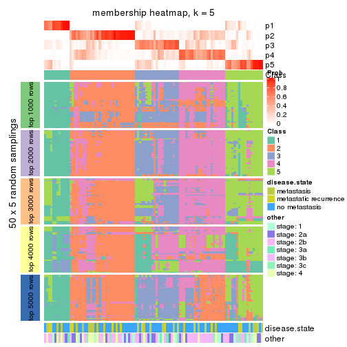</p>

</div>
<div id='tab-SD-mclust-membership-heatmap-5'>
<pre><code class="r">membership_heatmap(res, k = 6)
</code></pre>

<p></p>

</div>
</div>

As soon as we have had the classes for columns, we can look for signatures
which are significantly different between classes which can be candidate marks
for certain classes. Following are the heatmaps for signatures.


Signature heatmaps where rows are scaled:


<script>
$( function() {
	$( '#tabs-SD-mclust-get-signatures' ).tabs();
} );
</script>
<div id='tabs-SD-mclust-get-signatures'>
<ul>
<li><a href='#tab-SD-mclust-get-signatures-1'>k = 2</a></li>
<li><a href='#tab-SD-mclust-get-signatures-2'>k = 3</a></li>
<li><a href='#tab-SD-mclust-get-signatures-3'>k = 4</a></li>
<li><a href='#tab-SD-mclust-get-signatures-4'>k = 5</a></li>
<li><a href='#tab-SD-mclust-get-signatures-5'>k = 6</a></li>
</ul>
<div id='tab-SD-mclust-get-signatures-1'>
<pre><code class="r">get_signatures(res, k = 2)
</code></pre>

<p></p>

</div>
<div id='tab-SD-mclust-get-signatures-2'>
<pre><code class="r">get_signatures(res, k = 3)
</code></pre>

<p></p>

</div>
<div id='tab-SD-mclust-get-signatures-3'>
<pre><code class="r">get_signatures(res, k = 4)
</code></pre>

<p></p>

</div>
<div id='tab-SD-mclust-get-signatures-4'>
<pre><code class="r">get_signatures(res, k = 5)
</code></pre>

<p></p>

</div>
<div id='tab-SD-mclust-get-signatures-5'>
<pre><code class="r">get_signatures(res, k = 6)
</code></pre>

<p></p>

</div>
</div>


Signature heatmaps where rows are not scaled:


<script>
$( function() {
	$( '#tabs-SD-mclust-get-signatures-no-scale' ).tabs();
} );
</script>
<div id='tabs-SD-mclust-get-signatures-no-scale'>
<ul>
<li><a href='#tab-SD-mclust-get-signatures-no-scale-1'>k = 2</a></li>
<li><a href='#tab-SD-mclust-get-signatures-no-scale-2'>k = 3</a></li>
<li><a href='#tab-SD-mclust-get-signatures-no-scale-3'>k = 4</a></li>
<li><a href='#tab-SD-mclust-get-signatures-no-scale-4'>k = 5</a></li>
<li><a href='#tab-SD-mclust-get-signatures-no-scale-5'>k = 6</a></li>
</ul>
<div id='tab-SD-mclust-get-signatures-no-scale-1'>
<pre><code class="r">get_signatures(res, k = 2, scale_rows = FALSE)
</code></pre>

<p></p>

</div>
<div id='tab-SD-mclust-get-signatures-no-scale-2'>
<pre><code class="r">get_signatures(res, k = 3, scale_rows = FALSE)
</code></pre>

<p></p>

</div>
<div id='tab-SD-mclust-get-signatures-no-scale-3'>
<pre><code class="r">get_signatures(res, k = 4, scale_rows = FALSE)
</code></pre>

<p></p>

</div>
<div id='tab-SD-mclust-get-signatures-no-scale-4'>
<pre><code class="r">get_signatures(res, k = 5, scale_rows = FALSE)
</code></pre>

<p></p>

</div>
<div id='tab-SD-mclust-get-signatures-no-scale-5'>
<pre><code class="r">get_signatures(res, k = 6, scale_rows = FALSE)
</code></pre>

<p></p>

</div>
</div>


Compare the overlap of signatures from different k:

```r
compare_signatures(res)
```


`get_signature()` returns a data frame invisibly. TO get the list of signatures, the function
call should be assigned to a variable explicitly. In following code, if `plot` argument is set
to `FALSE`, no heatmap is plotted while only the differential analysis is performed.

```r
# code only for demonstration
tb = get_signature(res, k = ..., plot = FALSE)
```

An example of the output of `tb` is:

```
#>   which_row         fdr    mean_1    mean_2 scaled_mean_1 scaled_mean_2 km
#> 1        38 0.042760348  8.373488  9.131774    -0.5533452     0.5164555  1
#> 2        40 0.018707592  7.106213  8.469186    -0.6173731     0.5762149  1
#> 3        55 0.019134737 10.221463 11.207825    -0.6159697     0.5749050  1
#> 4        59 0.006059896  5.921854  7.869574    -0.6899429     0.6439467  1
#> 5        60 0.018055526  8.928898 10.211722    -0.6204761     0.5791110  1
#> 6        98 0.009384629 15.714769 14.887706     0.6635654    -0.6193277  2
...
```

The columns in `tb` are:

1. `which_row`: row indices corresponding to the input matrix.
2. `fdr`: FDR for the differential test. 
3. `mean_x`: The mean value in group x.
4. `scaled_mean_x`: The mean value in group x after rows are scaled.
5. `km`: Row groups if k-means clustering is applied to rows.


UMAP plot which shows how samples are separated.


<script>
$( function() {
	$( '#tabs-SD-mclust-dimension-reduction' ).tabs();
} );
</script>
<div id='tabs-SD-mclust-dimension-reduction'>
<ul>
<li><a href='#tab-SD-mclust-dimension-reduction-1'>k = 2</a></li>
<li><a href='#tab-SD-mclust-dimension-reduction-2'>k = 3</a></li>
<li><a href='#tab-SD-mclust-dimension-reduction-3'>k = 4</a></li>
<li><a href='#tab-SD-mclust-dimension-reduction-4'>k = 5</a></li>
<li><a href='#tab-SD-mclust-dimension-reduction-5'>k = 6</a></li>
</ul>
<div id='tab-SD-mclust-dimension-reduction-1'>
<pre><code class="r">dimension_reduction(res, k = 2, method = &quot;UMAP&quot;)
</code></pre>

<p></p>

</div>
<div id='tab-SD-mclust-dimension-reduction-2'>
<pre><code class="r">dimension_reduction(res, k = 3, method = &quot;UMAP&quot;)
</code></pre>

<p></p>

</div>
<div id='tab-SD-mclust-dimension-reduction-3'>
<pre><code class="r">dimension_reduction(res, k = 4, method = &quot;UMAP&quot;)
</code></pre>

<p></p>

</div>
<div id='tab-SD-mclust-dimension-reduction-4'>
<pre><code class="r">dimension_reduction(res, k = 5, method = &quot;UMAP&quot;)
</code></pre>

<p></p>

</div>
<div id='tab-SD-mclust-dimension-reduction-5'>
<pre><code class="r">dimension_reduction(res, k = 6, method = &quot;UMAP&quot;)
</code></pre>

<p></p>

</div>
</div>


Following heatmap shows how subgroups are split when increasing `k`:

```r
collect_classes(res)
```


Test correlation between subgroups and known annotations. If the known
annotation is numeric, one-way ANOVA test is applied, and if the known
annotation is discrete, chi-squared contingency table test is applied.

```r
test_to_known_factors(res)
```

```
#>            n disease.state(p) other(p) k
#> SD:mclust 97            0.847    0.662 2
#> SD:mclust 68            0.611    0.841 3
#> SD:mclust 53            0.974    0.660 4
#> SD:mclust 63            0.732    0.836 5
#> SD:mclust 60            0.204    0.855 6
```


If matrix rows can be associated to genes, consider to use `functional_enrichment(res,
...)` to perform function enrichment for the signature genes. See [this vignette](http://bioconductor.org/packages/devel/bioc/vignettes/cola/inst/doc/functional_enrichment.html) for more detailed explanations.


 

---------------------------------------------------


### SD:NMF*


The object with results only for a single top-value method and a single partition method 
can be extracted as:

```r
res = res_list["SD", "NMF"]
# you can also extract it by
# res = res_list["SD:NMF"]
```

A summary of `res` and all the functions that can be applied to it:

```r
res
```

```
#> A 'ConsensusPartition' object with k = 2, 3, 4, 5, 6.
#>   On a matrix with 51941 rows and 104 columns.
#>   Top rows (1000, 2000, 3000, 4000, 5000) are extracted by 'SD' method.
#>   Subgroups are detected by 'NMF' method.
#>   Performed in total 1250 partitions by row resampling.
#>   Best k for subgroups seems to be 2.
#> 
#> Following methods can be applied to this 'ConsensusPartition' object:
#>  [1] "cola_report"             "collect_classes"         "collect_plots"          
#>  [4] "collect_stats"           "colnames"                "compare_signatures"     
#>  [7] "consensus_heatmap"       "dimension_reduction"     "functional_enrichment"  
#> [10] "get_anno_col"            "get_anno"                "get_classes"            
#> [13] "get_consensus"           "get_matrix"              "get_membership"         
#> [16] "get_param"               "get_signatures"          "get_stats"              
#> [19] "is_best_k"               "is_stable_k"             "membership_heatmap"     
#> [22] "ncol"                    "nrow"                    "plot_ecdf"              
#> [25] "rownames"                "select_partition_number" "show"                   
#> [28] "suggest_best_k"          "test_to_known_factors"
```

`collect_plots()` function collects all the plots made from `res` for all `k` (number of partitions)
into one single page to provide an easy and fast comparison between different `k`.

```r
collect_plots(res)
```


The plots are:

- The first row: a plot of the ECDF (empirical cumulative distribution
  function) curves of the consensus matrix for each `k` and the heatmap of
  predicted classes for each `k`.
- The second row: heatmaps of the consensus matrix for each `k`.
- The third row: heatmaps of the membership matrix for each `k`.
- The fouth row: heatmaps of the signatures for each `k`.

All the plots in panels can be made by individual functions and they are
plotted later in this section.

`select_partition_number()` produces several plots showing different
statistics for choosing "optimized" `k`. There are following statistics:

- ECDF curves of the consensus matrix for each `k`;
- 1-PAC. [The PAC
  score](https://en.wikipedia.org/wiki/Consensus_clustering#Over-interpretation_potential_of_consensus_clustering)
  measures the proportion of the ambiguous subgrouping.
- Mean silhouette score.
- Concordance. The mean probability of fiting the consensus class ids in all
  partitions.
- Area increased. Denote $A_k$ as the area under the ECDF curve for current
  `k`, the area increased is defined as $A_k - A_{k-1}$.
- Rand index. The percent of pairs of samples that are both in a same cluster
  or both are not in a same cluster in the partition of k and k-1.
- Jaccard index. The ratio of pairs of samples are both in a same cluster in
  the partition of k and k-1 and the pairs of samples are both in a same
  cluster in the partition k or k-1.

The detailed explanations of these statistics can be found in [the _cola_
vignette](http://bioconductor.org/packages/devel/bioc/vignettes/cola/inst/doc/cola.html#toc_13).

Generally speaking, lower PAC score, higher mean silhouette score or higher
concordance corresponds to better partition. Rand index and Jaccard index
measure how similar the current partition is compared to partition with `k-1`.
If they are too similar, we won't accept `k` is better than `k-1`.

```r
select_partition_number(res)
```


The numeric values for all these statistics can be obtained by `get_stats()`.

```r
get_stats(res)
```

```
#>   k 1-PAC mean_silhouette concordance area_increased  Rand Jaccard
#> 2 2 0.918           0.920       0.967         0.4768 0.522   0.522
#> 3 3 0.357           0.416       0.691         0.3734 0.778   0.587
#> 4 4 0.462           0.586       0.759         0.1355 0.771   0.438
#> 5 5 0.539           0.532       0.725         0.0703 0.869   0.547
#> 6 6 0.554           0.416       0.650         0.0414 0.889   0.537
```

`suggest_best_k()` suggests the best $k$ based on these statistics. The rules are as follows:

- All $k$ with Jaccard index larger than 0.95 are removed because increasing
  $k$ does not provide enough extra information. If all $k$ are removed, it is
  marked as no subgroup is detected.
- For all $k$ with 1-PAC score larger than 0.9, the maximal $k$ is taken as
  the best $k$, and other $k$ are marked as optional $k$.
- If it does not fit the second rule. The $k$ with the maximal vote of the
  highest 1-PAC score, highest mean silhouette, and highest concordance is
  taken as the best $k$.

```r
suggest_best_k(res)
```

```
#> [1] 2
```


Following shows the table of the partitions (You need to click the **show/hide
code output** link to see it). The membership matrix (columns with name `p*`)
is inferred by
[`clue::cl_consensus()`](https://www.rdocumentation.org/link/cl_consensus?package=clue)
function with the `SE` method. Basically the value in the membership matrix
represents the probability to belong to a certain group. The finall class
label for an item is determined with the group with highest probability it
belongs to.

In `get_classes()` function, the entropy is calculated from the membership
matrix and the silhouette score is calculated from the consensus matrix.


<script>
$( function() {
	$( '#tabs-SD-NMF-get-classes' ).tabs();
} );
</script>
<div id='tabs-SD-NMF-get-classes'>
<ul>
<li><a href='#tab-SD-NMF-get-classes-1'>k = 2</a></li>
<li><a href='#tab-SD-NMF-get-classes-2'>k = 3</a></li>
<li><a href='#tab-SD-NMF-get-classes-3'>k = 4</a></li>
<li><a href='#tab-SD-NMF-get-classes-4'>k = 5</a></li>
<li><a href='#tab-SD-NMF-get-classes-5'>k = 6</a></li>
</ul>

<div id='tab-SD-NMF-get-classes-1'>
<p><a id='tab-SD-NMF-get-classes-1-a' style='color:#0366d6' href='#'>show/hide code output</a></p>
<pre><code class="r">cbind(get_classes(res, k = 2), get_membership(res, k = 2))
</code></pre>

<pre><code>#&gt;           class entropy silhouette    p1    p2
#&gt; GSM537341     2  0.6343      0.798 0.160 0.840
#&gt; GSM537345     1  0.0000      0.952 1.000 0.000
#&gt; GSM537355     2  0.0000      0.973 0.000 1.000
#&gt; GSM537366     1  0.2043      0.932 0.968 0.032
#&gt; GSM537370     2  0.0000      0.973 0.000 1.000
#&gt; GSM537380     2  0.0000      0.973 0.000 1.000
#&gt; GSM537392     2  0.0000      0.973 0.000 1.000
#&gt; GSM537415     2  0.0000      0.973 0.000 1.000
#&gt; GSM537417     2  0.0000      0.973 0.000 1.000
#&gt; GSM537422     1  0.0000      0.952 1.000 0.000
#&gt; GSM537423     2  0.0000      0.973 0.000 1.000
#&gt; GSM537427     2  0.0000      0.973 0.000 1.000
#&gt; GSM537430     2  0.0000      0.973 0.000 1.000
#&gt; GSM537336     1  0.0000      0.952 1.000 0.000
#&gt; GSM537337     2  0.0000      0.973 0.000 1.000
#&gt; GSM537348     1  0.0000      0.952 1.000 0.000
#&gt; GSM537349     2  0.0000      0.973 0.000 1.000
#&gt; GSM537356     1  0.0672      0.948 0.992 0.008
#&gt; GSM537361     1  0.0000      0.952 1.000 0.000
#&gt; GSM537374     2  0.0000      0.973 0.000 1.000
#&gt; GSM537377     1  0.0000      0.952 1.000 0.000
#&gt; GSM537378     2  0.0000      0.973 0.000 1.000
#&gt; GSM537379     2  0.0000      0.973 0.000 1.000
#&gt; GSM537383     2  0.0000      0.973 0.000 1.000
#&gt; GSM537388     2  0.0000      0.973 0.000 1.000
#&gt; GSM537395     2  0.0000      0.973 0.000 1.000
#&gt; GSM537400     1  0.0000      0.952 1.000 0.000
#&gt; GSM537404     2  0.0672      0.966 0.008 0.992
#&gt; GSM537409     2  0.0000      0.973 0.000 1.000
#&gt; GSM537418     1  0.0000      0.952 1.000 0.000
#&gt; GSM537425     1  0.0938      0.946 0.988 0.012
#&gt; GSM537333     1  0.9866      0.282 0.568 0.432
#&gt; GSM537342     2  0.0000      0.973 0.000 1.000
#&gt; GSM537347     2  0.0000      0.973 0.000 1.000
#&gt; GSM537350     1  0.0000      0.952 1.000 0.000
#&gt; GSM537362     1  0.0000      0.952 1.000 0.000
#&gt; GSM537363     1  0.7674      0.723 0.776 0.224
#&gt; GSM537368     1  0.0000      0.952 1.000 0.000
#&gt; GSM537376     2  0.0000      0.973 0.000 1.000
#&gt; GSM537381     1  0.0000      0.952 1.000 0.000
#&gt; GSM537386     2  0.0000      0.973 0.000 1.000
#&gt; GSM537398     1  0.0000      0.952 1.000 0.000
#&gt; GSM537402     2  0.0000      0.973 0.000 1.000
#&gt; GSM537405     1  0.0000      0.952 1.000 0.000
#&gt; GSM537371     1  0.0000      0.952 1.000 0.000
#&gt; GSM537421     2  0.1633      0.951 0.024 0.976
#&gt; GSM537424     1  0.0000      0.952 1.000 0.000
#&gt; GSM537432     2  0.9922      0.144 0.448 0.552
#&gt; GSM537331     2  0.0000      0.973 0.000 1.000
#&gt; GSM537332     2  0.0000      0.973 0.000 1.000
#&gt; GSM537334     2  0.0000      0.973 0.000 1.000
#&gt; GSM537338     2  0.0000      0.973 0.000 1.000
#&gt; GSM537353     2  0.0000      0.973 0.000 1.000
#&gt; GSM537357     1  0.0000      0.952 1.000 0.000
#&gt; GSM537358     2  0.0000      0.973 0.000 1.000
#&gt; GSM537375     2  0.0000      0.973 0.000 1.000
#&gt; GSM537389     2  0.0000      0.973 0.000 1.000
#&gt; GSM537390     2  0.0000      0.973 0.000 1.000
#&gt; GSM537393     2  0.0000      0.973 0.000 1.000
#&gt; GSM537399     1  0.9710      0.337 0.600 0.400
#&gt; GSM537407     1  0.0672      0.949 0.992 0.008
#&gt; GSM537408     2  0.0000      0.973 0.000 1.000
#&gt; GSM537428     2  0.0000      0.973 0.000 1.000
#&gt; GSM537354     2  0.0000      0.973 0.000 1.000
#&gt; GSM537410     2  0.0000      0.973 0.000 1.000
#&gt; GSM537413     2  0.0000      0.973 0.000 1.000
#&gt; GSM537396     2  0.0000      0.973 0.000 1.000
#&gt; GSM537397     1  0.0938      0.946 0.988 0.012
#&gt; GSM537330     2  0.0000      0.973 0.000 1.000
#&gt; GSM537369     1  0.0000      0.952 1.000 0.000
#&gt; GSM537373     2  0.0376      0.969 0.004 0.996
#&gt; GSM537401     2  0.0672      0.966 0.008 0.992
#&gt; GSM537343     1  0.0000      0.952 1.000 0.000
#&gt; GSM537367     1  0.4298      0.885 0.912 0.088
#&gt; GSM537382     2  0.0000      0.973 0.000 1.000
#&gt; GSM537385     2  0.0000      0.973 0.000 1.000
#&gt; GSM537391     1  0.0000      0.952 1.000 0.000
#&gt; GSM537419     2  0.0000      0.973 0.000 1.000
#&gt; GSM537420     1  0.0000      0.952 1.000 0.000
#&gt; GSM537429     2  0.7453      0.724 0.212 0.788
#&gt; GSM537431     1  0.8443      0.636 0.728 0.272
#&gt; GSM537387     1  0.0000      0.952 1.000 0.000
#&gt; GSM537414     1  0.3733      0.900 0.928 0.072
#&gt; GSM537433     1  0.7528      0.732 0.784 0.216
#&gt; GSM537335     2  0.8713      0.576 0.292 0.708
#&gt; GSM537339     1  0.1184      0.944 0.984 0.016
#&gt; GSM537340     2  0.9608      0.336 0.384 0.616
#&gt; GSM537344     1  0.0000      0.952 1.000 0.000
#&gt; GSM537346     2  0.0000      0.973 0.000 1.000
#&gt; GSM537351     1  0.0000      0.952 1.000 0.000
#&gt; GSM537352     2  0.0000      0.973 0.000 1.000
#&gt; GSM537359     2  0.0000      0.973 0.000 1.000
#&gt; GSM537360     2  0.0000      0.973 0.000 1.000
#&gt; GSM537364     1  0.0000      0.952 1.000 0.000
#&gt; GSM537365     2  0.4022      0.895 0.080 0.920
#&gt; GSM537372     1  0.0000      0.952 1.000 0.000
#&gt; GSM537384     1  0.0000      0.952 1.000 0.000
#&gt; GSM537394     2  0.0000      0.973 0.000 1.000
#&gt; GSM537403     2  0.0000      0.973 0.000 1.000
#&gt; GSM537406     2  0.0000      0.973 0.000 1.000
#&gt; GSM537411     2  0.0000      0.973 0.000 1.000
#&gt; GSM537412     2  0.0000      0.973 0.000 1.000
#&gt; GSM537416     2  0.0000      0.973 0.000 1.000
#&gt; GSM537426     2  0.0000      0.973 0.000 1.000
</code></pre>

<script>
$('#tab-SD-NMF-get-classes-1-a').parent().next().next().hide();
$('#tab-SD-NMF-get-classes-1-a').click(function(){
  $('#tab-SD-NMF-get-classes-1-a').parent().next().next().toggle();
  return(false);
});
</script>
</div>

<div id='tab-SD-NMF-get-classes-2'>
<p><a id='tab-SD-NMF-get-classes-2-a' style='color:#0366d6' href='#'>show/hide code output</a></p>
<pre><code class="r">cbind(get_classes(res, k = 3), get_membership(res, k = 3))
</code></pre>

<pre><code>#&gt;           class entropy silhouette    p1    p2    p3
#&gt; GSM537341     3  0.6181    0.41328 0.104 0.116 0.780
#&gt; GSM537345     1  0.4121    0.72567 0.832 0.000 0.168
#&gt; GSM537355     2  0.1753    0.52793 0.000 0.952 0.048
#&gt; GSM537366     1  0.5551    0.66292 0.768 0.020 0.212
#&gt; GSM537370     3  0.3816    0.42455 0.000 0.148 0.852
#&gt; GSM537380     3  0.5098    0.39559 0.000 0.248 0.752
#&gt; GSM537392     3  0.5363    0.37657 0.000 0.276 0.724
#&gt; GSM537415     2  0.5760    0.40487 0.000 0.672 0.328
#&gt; GSM537417     2  0.1647    0.52253 0.004 0.960 0.036
#&gt; GSM537422     1  0.7665    0.31472 0.500 0.456 0.044
#&gt; GSM537423     2  0.6079    0.29261 0.000 0.612 0.388
#&gt; GSM537427     2  0.6267   -0.18242 0.000 0.548 0.452
#&gt; GSM537430     2  0.6274   -0.10177 0.000 0.544 0.456
#&gt; GSM537336     1  0.0000    0.76888 1.000 0.000 0.000
#&gt; GSM537337     2  0.5098    0.34701 0.000 0.752 0.248
#&gt; GSM537348     1  0.6079    0.52675 0.612 0.000 0.388
#&gt; GSM537349     2  0.6309    0.03405 0.000 0.504 0.496
#&gt; GSM537356     1  0.3340    0.74007 0.880 0.000 0.120
#&gt; GSM537361     1  0.4045    0.72946 0.872 0.104 0.024
#&gt; GSM537374     3  0.5733    0.32252 0.000 0.324 0.676
#&gt; GSM537377     1  0.5894    0.68115 0.752 0.028 0.220
#&gt; GSM537378     2  0.5178    0.48150 0.000 0.744 0.256
#&gt; GSM537379     2  0.3918    0.45191 0.004 0.856 0.140
#&gt; GSM537383     3  0.6140    0.23339 0.000 0.404 0.596
#&gt; GSM537388     2  0.5621    0.14164 0.000 0.692 0.308
#&gt; GSM537395     2  0.3879    0.44285 0.000 0.848 0.152
#&gt; GSM537400     1  0.8533    0.41590 0.536 0.360 0.104
#&gt; GSM537404     3  0.7487    0.26916 0.040 0.408 0.552
#&gt; GSM537409     2  0.1031    0.55518 0.000 0.976 0.024
#&gt; GSM537418     1  0.0424    0.76897 0.992 0.000 0.008
#&gt; GSM537425     1  0.1620    0.76797 0.964 0.024 0.012
#&gt; GSM537333     2  0.9187    0.02931 0.196 0.532 0.272
#&gt; GSM537342     2  0.5244    0.49537 0.004 0.756 0.240
#&gt; GSM537347     3  0.6299    0.22512 0.000 0.476 0.524
#&gt; GSM537350     1  0.4931    0.66253 0.768 0.000 0.232
#&gt; GSM537362     1  0.7395    0.35973 0.492 0.032 0.476
#&gt; GSM537363     1  0.7451    0.52228 0.636 0.060 0.304
#&gt; GSM537368     1  0.0424    0.76909 0.992 0.000 0.008
#&gt; GSM537376     2  0.5621    0.44425 0.000 0.692 0.308
#&gt; GSM537381     1  0.0424    0.76892 0.992 0.000 0.008
#&gt; GSM537386     3  0.5327    0.37400 0.000 0.272 0.728
#&gt; GSM537398     1  0.7585    0.35362 0.484 0.040 0.476
#&gt; GSM537402     2  0.6309    0.07924 0.000 0.504 0.496
#&gt; GSM537405     1  0.0237    0.76907 0.996 0.000 0.004
#&gt; GSM537371     1  0.1163    0.76791 0.972 0.000 0.028
#&gt; GSM537421     2  0.4233    0.55371 0.004 0.836 0.160
#&gt; GSM537424     1  0.5253    0.70893 0.792 0.020 0.188
#&gt; GSM537432     2  0.9768   -0.07683 0.264 0.440 0.296
#&gt; GSM537331     3  0.6111    0.29259 0.000 0.396 0.604
#&gt; GSM537332     2  0.2860    0.56578 0.004 0.912 0.084
#&gt; GSM537334     3  0.6228    0.25866 0.004 0.372 0.624
#&gt; GSM537338     3  0.5968    0.29255 0.000 0.364 0.636
#&gt; GSM537353     2  0.4702    0.52693 0.000 0.788 0.212
#&gt; GSM537357     1  0.1031    0.76828 0.976 0.000 0.024
#&gt; GSM537358     3  0.6305    0.00922 0.000 0.484 0.516
#&gt; GSM537375     3  0.6299    0.12989 0.000 0.476 0.524
#&gt; GSM537389     3  0.6309   -0.11582 0.000 0.496 0.504
#&gt; GSM537390     2  0.5058    0.50446 0.000 0.756 0.244
#&gt; GSM537393     2  0.2959    0.49675 0.000 0.900 0.100
#&gt; GSM537399     1  0.7919    0.12136 0.480 0.056 0.464
#&gt; GSM537407     1  0.5928    0.58709 0.696 0.008 0.296
#&gt; GSM537408     3  0.6192    0.07423 0.000 0.420 0.580
#&gt; GSM537428     3  0.6225    0.27054 0.000 0.432 0.568
#&gt; GSM537354     2  0.5733    0.21965 0.000 0.676 0.324
#&gt; GSM537410     2  0.5690    0.44434 0.004 0.708 0.288
#&gt; GSM537413     2  0.5621    0.42824 0.000 0.692 0.308
#&gt; GSM537396     3  0.6427    0.23912 0.012 0.348 0.640
#&gt; GSM537397     3  0.5948   -0.04518 0.360 0.000 0.640
#&gt; GSM537330     2  0.4796    0.30448 0.000 0.780 0.220
#&gt; GSM537369     1  0.0892    0.76759 0.980 0.000 0.020
#&gt; GSM537373     2  0.6398    0.27233 0.004 0.580 0.416
#&gt; GSM537401     3  0.2774    0.41886 0.008 0.072 0.920
#&gt; GSM537343     1  0.4605    0.68562 0.796 0.000 0.204
#&gt; GSM537367     1  0.9806    0.14384 0.420 0.328 0.252
#&gt; GSM537382     2  0.2261    0.56474 0.000 0.932 0.068
#&gt; GSM537385     3  0.6267    0.13263 0.000 0.452 0.548
#&gt; GSM537391     1  0.6111    0.52198 0.604 0.000 0.396
#&gt; GSM537419     3  0.6267    0.01213 0.000 0.452 0.548
#&gt; GSM537420     1  0.1163    0.76623 0.972 0.000 0.028
#&gt; GSM537429     2  0.6180    0.24013 0.024 0.716 0.260
#&gt; GSM537431     1  0.7528    0.53838 0.648 0.280 0.072
#&gt; GSM537387     1  0.3412    0.74275 0.876 0.000 0.124
#&gt; GSM537414     1  0.7534    0.35027 0.532 0.428 0.040
#&gt; GSM537433     1  0.9724    0.22452 0.452 0.268 0.280
#&gt; GSM537335     3  0.6794    0.28867 0.028 0.324 0.648
#&gt; GSM537339     3  0.6470   -0.01809 0.356 0.012 0.632
#&gt; GSM537340     2  0.8576    0.35261 0.160 0.600 0.240
#&gt; GSM537344     1  0.0592    0.76856 0.988 0.000 0.012
#&gt; GSM537346     2  0.5905    0.03565 0.000 0.648 0.352
#&gt; GSM537351     1  0.0237    0.76867 0.996 0.000 0.004
#&gt; GSM537352     2  0.1163    0.53931 0.000 0.972 0.028
#&gt; GSM537359     3  0.5465    0.35154 0.000 0.288 0.712
#&gt; GSM537360     2  0.4931    0.51235 0.000 0.768 0.232
#&gt; GSM537364     1  0.0592    0.76904 0.988 0.000 0.012
#&gt; GSM537365     3  0.8504    0.29329 0.216 0.172 0.612
#&gt; GSM537372     1  0.4555    0.71380 0.800 0.000 0.200
#&gt; GSM537384     1  0.2537    0.75777 0.920 0.000 0.080
#&gt; GSM537394     3  0.5497    0.35276 0.000 0.292 0.708
#&gt; GSM537403     2  0.0424    0.54819 0.000 0.992 0.008
#&gt; GSM537406     2  0.6180    0.28322 0.000 0.584 0.416
#&gt; GSM537411     3  0.5733    0.33161 0.000 0.324 0.676
#&gt; GSM537412     2  0.4931    0.50245 0.000 0.768 0.232
#&gt; GSM537416     2  0.2301    0.56464 0.004 0.936 0.060
#&gt; GSM537426     2  0.3267    0.56136 0.000 0.884 0.116
</code></pre>

<script>
$('#tab-SD-NMF-get-classes-2-a').parent().next().next().hide();
$('#tab-SD-NMF-get-classes-2-a').click(function(){
  $('#tab-SD-NMF-get-classes-2-a').parent().next().next().toggle();
  return(false);
});
</script>
</div>

<div id='tab-SD-NMF-get-classes-3'>
<p><a id='tab-SD-NMF-get-classes-3-a' style='color:#0366d6' href='#'>show/hide code output</a></p>
<pre><code class="r">cbind(get_classes(res, k = 4), get_membership(res, k = 4))
</code></pre>

<pre><code>#&gt;           class entropy silhouette    p1    p2    p3    p4
#&gt; GSM537341     2  0.5725     0.6037 0.160 0.748 0.044 0.048
#&gt; GSM537345     1  0.5838     0.2134 0.524 0.000 0.032 0.444
#&gt; GSM537355     3  0.5573     0.6059 0.000 0.052 0.676 0.272
#&gt; GSM537366     1  0.3031     0.7733 0.896 0.072 0.016 0.016
#&gt; GSM537370     2  0.3171     0.7100 0.016 0.876 0.004 0.104
#&gt; GSM537380     2  0.1557     0.7441 0.000 0.944 0.000 0.056
#&gt; GSM537392     2  0.1474     0.7471 0.000 0.948 0.000 0.052
#&gt; GSM537415     3  0.4967     0.2534 0.000 0.452 0.548 0.000
#&gt; GSM537417     3  0.4748     0.6113 0.000 0.016 0.716 0.268
#&gt; GSM537422     3  0.5724     0.5777 0.144 0.000 0.716 0.140
#&gt; GSM537423     2  0.4307     0.6243 0.000 0.784 0.192 0.024
#&gt; GSM537427     4  0.5873     0.2322 0.000 0.416 0.036 0.548
#&gt; GSM537430     2  0.5833     0.5543 0.000 0.692 0.096 0.212
#&gt; GSM537336     1  0.2227     0.7823 0.928 0.000 0.036 0.036
#&gt; GSM537337     4  0.5906     0.2875 0.000 0.064 0.292 0.644
#&gt; GSM537348     4  0.5323     0.3628 0.352 0.020 0.000 0.628
#&gt; GSM537349     2  0.3108     0.7382 0.000 0.872 0.112 0.016
#&gt; GSM537356     1  0.3266     0.7623 0.868 0.108 0.000 0.024
#&gt; GSM537361     1  0.5841     0.5561 0.692 0.004 0.076 0.228
#&gt; GSM537374     4  0.3831     0.6359 0.000 0.204 0.004 0.792
#&gt; GSM537377     4  0.5228     0.3503 0.312 0.000 0.024 0.664
#&gt; GSM537378     2  0.5925    -0.0396 0.000 0.512 0.452 0.036
#&gt; GSM537379     3  0.5695     0.5289 0.000 0.040 0.624 0.336
#&gt; GSM537383     2  0.2699     0.7423 0.000 0.904 0.028 0.068
#&gt; GSM537388     2  0.7554     0.1823 0.000 0.488 0.268 0.244
#&gt; GSM537395     3  0.7592     0.4547 0.000 0.268 0.480 0.252
#&gt; GSM537400     3  0.7393     0.4565 0.116 0.044 0.612 0.228
#&gt; GSM537404     2  0.7854     0.5078 0.148 0.612 0.100 0.140
#&gt; GSM537409     3  0.2586     0.7030 0.000 0.048 0.912 0.040
#&gt; GSM537418     1  0.1721     0.7895 0.952 0.008 0.012 0.028
#&gt; GSM537425     1  0.3198     0.7699 0.884 0.004 0.080 0.032
#&gt; GSM537333     3  0.5156     0.5496 0.012 0.012 0.696 0.280
#&gt; GSM537342     3  0.3016     0.6852 0.004 0.120 0.872 0.004
#&gt; GSM537347     4  0.6230     0.5067 0.004 0.256 0.088 0.652
#&gt; GSM537350     1  0.4920     0.4581 0.628 0.368 0.000 0.004
#&gt; GSM537362     4  0.4461     0.5902 0.156 0.012 0.028 0.804
#&gt; GSM537363     1  0.5241     0.6864 0.760 0.068 0.164 0.008
#&gt; GSM537368     1  0.2335     0.7792 0.920 0.000 0.020 0.060
#&gt; GSM537376     3  0.6136     0.4675 0.000 0.356 0.584 0.060
#&gt; GSM537381     1  0.0524     0.7875 0.988 0.008 0.000 0.004
#&gt; GSM537386     2  0.2669     0.7479 0.004 0.912 0.052 0.032
#&gt; GSM537398     4  0.3264     0.6610 0.096 0.024 0.004 0.876
#&gt; GSM537402     2  0.6039     0.4021 0.000 0.596 0.348 0.056
#&gt; GSM537405     1  0.2256     0.7803 0.924 0.000 0.020 0.056
#&gt; GSM537371     1  0.3485     0.7500 0.856 0.000 0.028 0.116
#&gt; GSM537421     3  0.3093     0.6988 0.004 0.092 0.884 0.020
#&gt; GSM537424     1  0.5320     0.2890 0.572 0.000 0.012 0.416
#&gt; GSM537432     3  0.6955     0.4773 0.072 0.044 0.632 0.252
#&gt; GSM537331     4  0.4776     0.5590 0.000 0.272 0.016 0.712
#&gt; GSM537332     3  0.6242     0.6180 0.020 0.168 0.704 0.108
#&gt; GSM537334     4  0.3168     0.6634 0.000 0.056 0.060 0.884
#&gt; GSM537338     4  0.2988     0.6782 0.000 0.112 0.012 0.876
#&gt; GSM537353     3  0.5496     0.4544 0.000 0.372 0.604 0.024
#&gt; GSM537357     1  0.3056     0.7697 0.888 0.000 0.040 0.072
#&gt; GSM537358     2  0.2002     0.7518 0.000 0.936 0.020 0.044
#&gt; GSM537375     4  0.3383     0.6350 0.000 0.052 0.076 0.872
#&gt; GSM537389     2  0.2675     0.7307 0.000 0.892 0.100 0.008
#&gt; GSM537390     2  0.5807     0.3367 0.000 0.596 0.364 0.040
#&gt; GSM537393     3  0.5744     0.6168 0.000 0.068 0.676 0.256
#&gt; GSM537399     1  0.7062     0.0929 0.468 0.448 0.032 0.052
#&gt; GSM537407     1  0.5726     0.6744 0.728 0.196 0.052 0.024
#&gt; GSM537408     2  0.1543     0.7441 0.032 0.956 0.008 0.004
#&gt; GSM537428     4  0.4882     0.5599 0.000 0.272 0.020 0.708
#&gt; GSM537354     4  0.5298     0.4154 0.000 0.048 0.244 0.708
#&gt; GSM537410     3  0.3539     0.6632 0.000 0.176 0.820 0.004
#&gt; GSM537413     3  0.4889     0.4265 0.000 0.360 0.636 0.004
#&gt; GSM537396     2  0.3160     0.7263 0.060 0.892 0.040 0.008
#&gt; GSM537397     2  0.6756     0.3545 0.188 0.612 0.000 0.200
#&gt; GSM537330     3  0.7394     0.4096 0.000 0.244 0.520 0.236
#&gt; GSM537369     1  0.0469     0.7871 0.988 0.012 0.000 0.000
#&gt; GSM537373     2  0.6071     0.5484 0.084 0.684 0.224 0.008
#&gt; GSM537401     2  0.5451     0.6296 0.044 0.748 0.024 0.184
#&gt; GSM537343     1  0.3508     0.7498 0.848 0.136 0.004 0.012
#&gt; GSM537367     1  0.5998     0.6082 0.684 0.056 0.244 0.016
#&gt; GSM537382     3  0.3813     0.6904 0.000 0.148 0.828 0.024
#&gt; GSM537385     2  0.2759     0.7513 0.000 0.904 0.044 0.052
#&gt; GSM537391     4  0.5879     0.3077 0.368 0.028 0.008 0.596
#&gt; GSM537419     2  0.1820     0.7534 0.000 0.944 0.036 0.020
#&gt; GSM537420     1  0.0992     0.7867 0.976 0.012 0.004 0.008
#&gt; GSM537429     3  0.7363     0.4770 0.012 0.192 0.576 0.220
#&gt; GSM537431     3  0.5798     0.5055 0.220 0.040 0.712 0.028
#&gt; GSM537387     1  0.4587     0.6824 0.776 0.004 0.028 0.192
#&gt; GSM537414     3  0.7200     0.4515 0.196 0.004 0.572 0.228
#&gt; GSM537433     1  0.4686     0.7124 0.780 0.184 0.020 0.016
#&gt; GSM537335     4  0.2862     0.6794 0.012 0.076 0.012 0.900
#&gt; GSM537339     4  0.7412     0.2903 0.152 0.360 0.004 0.484
#&gt; GSM537340     3  0.5424     0.6635 0.028 0.180 0.752 0.040
#&gt; GSM537344     1  0.0000     0.7872 1.000 0.000 0.000 0.000
#&gt; GSM537346     2  0.7767     0.3154 0.020 0.536 0.192 0.252
#&gt; GSM537351     1  0.1833     0.7855 0.944 0.000 0.032 0.024
#&gt; GSM537352     3  0.6504     0.6448 0.000 0.148 0.636 0.216
#&gt; GSM537359     2  0.0469     0.7497 0.000 0.988 0.000 0.012
#&gt; GSM537360     3  0.5671     0.3938 0.000 0.400 0.572 0.028
#&gt; GSM537364     1  0.2722     0.7750 0.904 0.000 0.032 0.064
#&gt; GSM537365     1  0.7312     0.2002 0.476 0.420 0.076 0.028
#&gt; GSM537372     1  0.3812     0.7414 0.832 0.140 0.000 0.028
#&gt; GSM537384     1  0.2216     0.7745 0.908 0.000 0.000 0.092
#&gt; GSM537394     2  0.2443     0.7425 0.008 0.924 0.044 0.024
#&gt; GSM537403     3  0.3820     0.6994 0.000 0.064 0.848 0.088
#&gt; GSM537406     2  0.3791     0.6223 0.000 0.796 0.200 0.004
#&gt; GSM537411     2  0.5288     0.5763 0.000 0.720 0.056 0.224
#&gt; GSM537412     3  0.2469     0.6904 0.000 0.108 0.892 0.000
#&gt; GSM537416     3  0.1975     0.6994 0.000 0.048 0.936 0.016
#&gt; GSM537426     3  0.2918     0.6907 0.000 0.116 0.876 0.008
</code></pre>

<script>
$('#tab-SD-NMF-get-classes-3-a').parent().next().next().hide();
$('#tab-SD-NMF-get-classes-3-a').click(function(){
  $('#tab-SD-NMF-get-classes-3-a').parent().next().next().toggle();
  return(false);
});
</script>
</div>

<div id='tab-SD-NMF-get-classes-4'>
<p><a id='tab-SD-NMF-get-classes-4-a' style='color:#0366d6' href='#'>show/hide code output</a></p>
<pre><code class="r">cbind(get_classes(res, k = 5), get_membership(res, k = 5))
</code></pre>

<pre><code>#&gt;           class entropy silhouette    p1    p2    p3    p4    p5
#&gt; GSM537341     2  0.6001     0.6095 0.172 0.684 0.008 0.076 0.060
#&gt; GSM537345     5  0.5104     0.3457 0.308 0.000 0.000 0.060 0.632
#&gt; GSM537355     3  0.4996     0.3628 0.000 0.020 0.688 0.256 0.036
#&gt; GSM537366     1  0.3551     0.7813 0.868 0.036 0.040 0.028 0.028
#&gt; GSM537370     2  0.2733     0.7330 0.016 0.888 0.016 0.000 0.080
#&gt; GSM537380     2  0.1921     0.7362 0.000 0.932 0.012 0.012 0.044
#&gt; GSM537392     2  0.2251     0.7331 0.000 0.916 0.024 0.008 0.052
#&gt; GSM537415     4  0.5380     0.4078 0.000 0.360 0.036 0.588 0.016
#&gt; GSM537417     3  0.2171     0.6136 0.000 0.000 0.912 0.064 0.024
#&gt; GSM537422     4  0.7684     0.0442 0.176 0.000 0.360 0.388 0.076
#&gt; GSM537423     2  0.3960     0.6880 0.000 0.824 0.032 0.100 0.044
#&gt; GSM537427     5  0.6732     0.2778 0.000 0.320 0.228 0.004 0.448
#&gt; GSM537430     3  0.6194     0.1752 0.000 0.420 0.480 0.020 0.080
#&gt; GSM537336     1  0.3416     0.7777 0.840 0.000 0.000 0.072 0.088
#&gt; GSM537337     5  0.7508     0.3212 0.000 0.056 0.224 0.268 0.452
#&gt; GSM537348     5  0.4827     0.5204 0.292 0.008 0.024 0.004 0.672
#&gt; GSM537349     2  0.3556     0.6995 0.004 0.824 0.004 0.144 0.024
#&gt; GSM537356     1  0.3518     0.7831 0.856 0.064 0.044 0.000 0.036
#&gt; GSM537361     3  0.4608     0.2873 0.336 0.000 0.640 0.000 0.024
#&gt; GSM537374     5  0.4592     0.6029 0.000 0.140 0.100 0.004 0.756
#&gt; GSM537377     5  0.3691     0.5960 0.164 0.000 0.004 0.028 0.804
#&gt; GSM537378     2  0.7324    -0.0455 0.000 0.436 0.224 0.304 0.036
#&gt; GSM537379     3  0.1399     0.6160 0.000 0.000 0.952 0.020 0.028
#&gt; GSM537383     2  0.3572     0.6799 0.000 0.832 0.120 0.008 0.040
#&gt; GSM537388     3  0.6902    -0.0380 0.000 0.420 0.424 0.112 0.044
#&gt; GSM537395     3  0.7471     0.1536 0.000 0.204 0.476 0.256 0.064
#&gt; GSM537400     3  0.6402     0.4182 0.064 0.004 0.644 0.180 0.108
#&gt; GSM537404     3  0.6872     0.3930 0.200 0.196 0.564 0.004 0.036
#&gt; GSM537409     4  0.4275     0.4971 0.000 0.020 0.284 0.696 0.000
#&gt; GSM537418     1  0.2555     0.8135 0.908 0.004 0.016 0.024 0.048
#&gt; GSM537425     1  0.5138     0.7504 0.768 0.028 0.112 0.060 0.032
#&gt; GSM537333     3  0.3492     0.5134 0.000 0.000 0.796 0.188 0.016
#&gt; GSM537342     4  0.2304     0.6465 0.000 0.068 0.020 0.908 0.004
#&gt; GSM537347     3  0.1960     0.6066 0.004 0.020 0.928 0.000 0.048
#&gt; GSM537350     2  0.5372     0.1413 0.460 0.500 0.004 0.008 0.028
#&gt; GSM537362     5  0.3110     0.6270 0.112 0.000 0.028 0.004 0.856
#&gt; GSM537363     4  0.6036    -0.1634 0.460 0.032 0.008 0.468 0.032
#&gt; GSM537368     1  0.2450     0.7984 0.896 0.000 0.000 0.028 0.076
#&gt; GSM537376     4  0.4832     0.5926 0.000 0.200 0.000 0.712 0.088
#&gt; GSM537381     1  0.1787     0.8041 0.936 0.004 0.044 0.000 0.016
#&gt; GSM537386     2  0.3798     0.7199 0.004 0.840 0.088 0.040 0.028
#&gt; GSM537398     5  0.4226     0.6266 0.060 0.000 0.176 0.000 0.764
#&gt; GSM537402     4  0.5178     0.1987 0.000 0.404 0.012 0.560 0.024
#&gt; GSM537405     1  0.2811     0.7986 0.876 0.000 0.012 0.012 0.100
#&gt; GSM537371     1  0.3037     0.7872 0.860 0.000 0.000 0.040 0.100
#&gt; GSM537421     4  0.2390     0.6300 0.000 0.032 0.044 0.912 0.012
#&gt; GSM537424     1  0.5689     0.5272 0.616 0.000 0.248 0.000 0.136
#&gt; GSM537432     4  0.7289    -0.0136 0.028 0.036 0.408 0.432 0.096
#&gt; GSM537331     5  0.5797     0.4990 0.000 0.132 0.276 0.000 0.592
#&gt; GSM537332     3  0.1924     0.6262 0.000 0.008 0.924 0.064 0.004
#&gt; GSM537334     5  0.4674     0.3829 0.000 0.016 0.416 0.000 0.568
#&gt; GSM537338     5  0.3929     0.6115 0.000 0.028 0.208 0.000 0.764
#&gt; GSM537353     4  0.7278     0.3450 0.000 0.336 0.188 0.436 0.040
#&gt; GSM537357     1  0.3704     0.7687 0.820 0.000 0.000 0.088 0.092
#&gt; GSM537358     2  0.3120     0.7122 0.000 0.864 0.084 0.004 0.048
#&gt; GSM537375     5  0.5891     0.5813 0.000 0.052 0.132 0.132 0.684
#&gt; GSM537389     2  0.3002     0.7075 0.000 0.856 0.000 0.116 0.028
#&gt; GSM537390     3  0.6472     0.1883 0.000 0.396 0.488 0.076 0.040
#&gt; GSM537393     3  0.6322     0.4249 0.000 0.068 0.636 0.200 0.096
#&gt; GSM537399     1  0.6711     0.0390 0.448 0.104 0.412 0.000 0.036
#&gt; GSM537407     1  0.5544     0.6923 0.728 0.084 0.136 0.012 0.040
#&gt; GSM537408     2  0.1565     0.7393 0.016 0.952 0.004 0.008 0.020
#&gt; GSM537428     3  0.6312    -0.1421 0.000 0.156 0.452 0.000 0.392
#&gt; GSM537354     5  0.6868     0.4023 0.000 0.068 0.108 0.272 0.552
#&gt; GSM537410     4  0.3405     0.6346 0.004 0.136 0.008 0.836 0.016
#&gt; GSM537413     4  0.4883     0.3459 0.000 0.372 0.024 0.600 0.004
#&gt; GSM537396     2  0.4979     0.6642 0.100 0.768 0.008 0.092 0.032
#&gt; GSM537397     2  0.6070     0.4295 0.256 0.592 0.008 0.000 0.144
#&gt; GSM537330     3  0.1644     0.6278 0.000 0.008 0.940 0.048 0.004
#&gt; GSM537369     1  0.0324     0.8062 0.992 0.004 0.000 0.000 0.004
#&gt; GSM537373     2  0.6344     0.4772 0.092 0.608 0.008 0.260 0.032
#&gt; GSM537401     2  0.6638     0.5386 0.092 0.608 0.008 0.060 0.232
#&gt; GSM537343     1  0.3763     0.7494 0.812 0.152 0.004 0.008 0.024
#&gt; GSM537367     1  0.6498     0.2596 0.512 0.040 0.020 0.388 0.040
#&gt; GSM537382     4  0.3724     0.6439 0.000 0.068 0.052 0.844 0.036
#&gt; GSM537385     2  0.3952     0.7059 0.000 0.812 0.024 0.132 0.032
#&gt; GSM537391     5  0.4620     0.5769 0.236 0.028 0.000 0.016 0.720
#&gt; GSM537419     2  0.1997     0.7356 0.000 0.924 0.000 0.040 0.036
#&gt; GSM537420     1  0.1334     0.8057 0.960 0.020 0.004 0.012 0.004
#&gt; GSM537429     3  0.2845     0.6133 0.000 0.020 0.876 0.096 0.008
#&gt; GSM537431     4  0.6729    -0.0277 0.056 0.008 0.420 0.460 0.056
#&gt; GSM537387     1  0.5099     0.4672 0.612 0.000 0.000 0.052 0.336
#&gt; GSM537414     3  0.1686     0.6181 0.028 0.000 0.944 0.020 0.008
#&gt; GSM537433     1  0.4671     0.7429 0.784 0.100 0.088 0.008 0.020
#&gt; GSM537335     5  0.4324     0.6016 0.012 0.020 0.232 0.000 0.736
#&gt; GSM537339     5  0.7210     0.4477 0.188 0.204 0.052 0.008 0.548
#&gt; GSM537340     4  0.4714     0.6080 0.004 0.140 0.028 0.772 0.056
#&gt; GSM537344     1  0.0324     0.8063 0.992 0.004 0.000 0.004 0.000
#&gt; GSM537346     3  0.2193     0.6057 0.000 0.060 0.912 0.000 0.028
#&gt; GSM537351     1  0.3727     0.7820 0.832 0.000 0.012 0.060 0.096
#&gt; GSM537352     4  0.7333     0.3943 0.000 0.152 0.228 0.528 0.092
#&gt; GSM537359     2  0.0912     0.7400 0.000 0.972 0.000 0.016 0.012
#&gt; GSM537360     4  0.6614     0.4531 0.000 0.316 0.100 0.540 0.044
#&gt; GSM537364     1  0.3533     0.7817 0.836 0.000 0.004 0.056 0.104
#&gt; GSM537365     3  0.7184     0.2327 0.328 0.120 0.500 0.024 0.028
#&gt; GSM537372     1  0.2582     0.7910 0.892 0.080 0.004 0.000 0.024
#&gt; GSM537384     1  0.1270     0.8029 0.948 0.000 0.000 0.000 0.052
#&gt; GSM537394     2  0.4164     0.5568 0.008 0.748 0.228 0.008 0.008
#&gt; GSM537403     4  0.3730     0.6004 0.000 0.028 0.168 0.800 0.004
#&gt; GSM537406     2  0.4095     0.6229 0.004 0.764 0.008 0.208 0.016
#&gt; GSM537411     2  0.6746     0.4088 0.000 0.584 0.116 0.068 0.232
#&gt; GSM537412     4  0.2588     0.6436 0.000 0.060 0.048 0.892 0.000
#&gt; GSM537416     4  0.2873     0.6021 0.000 0.000 0.120 0.860 0.020
#&gt; GSM537426     4  0.3317     0.6379 0.000 0.056 0.088 0.852 0.004
</code></pre>

<script>
$('#tab-SD-NMF-get-classes-4-a').parent().next().next().hide();
$('#tab-SD-NMF-get-classes-4-a').click(function(){
  $('#tab-SD-NMF-get-classes-4-a').parent().next().next().toggle();
  return(false);
});
</script>
</div>

<div id='tab-SD-NMF-get-classes-5'>
<p><a id='tab-SD-NMF-get-classes-5-a' style='color:#0366d6' href='#'>show/hide code output</a></p>
<pre><code class="r">cbind(get_classes(res, k = 6), get_membership(res, k = 6))
</code></pre>

<pre><code>#&gt;           class entropy silhouette    p1    p2    p3    p4    p5    p6
#&gt; GSM537341     4  0.7504    0.15808 0.348 0.192 0.008 0.372 0.052 0.028
#&gt; GSM537345     5  0.6165    0.01474 0.248 0.000 0.004 0.004 0.460 0.284
#&gt; GSM537355     3  0.5100    0.36950 0.000 0.008 0.576 0.364 0.024 0.028
#&gt; GSM537366     1  0.4731    0.51714 0.704 0.004 0.032 0.228 0.020 0.012
#&gt; GSM537370     2  0.1592    0.67472 0.004 0.944 0.000 0.012 0.024 0.016
#&gt; GSM537380     2  0.1148    0.67308 0.000 0.960 0.000 0.004 0.020 0.016
#&gt; GSM537392     2  0.0725    0.67360 0.000 0.976 0.000 0.000 0.012 0.012
#&gt; GSM537415     4  0.4926    0.38783 0.000 0.188 0.016 0.700 0.008 0.088
#&gt; GSM537417     3  0.3823    0.64130 0.004 0.016 0.820 0.092 0.012 0.056
#&gt; GSM537422     6  0.7976    0.24537 0.120 0.000 0.272 0.124 0.076 0.408
#&gt; GSM537423     2  0.3155    0.62587 0.000 0.828 0.004 0.140 0.004 0.024
#&gt; GSM537427     2  0.5156    0.40943 0.000 0.616 0.064 0.016 0.300 0.004
#&gt; GSM537430     2  0.5996    0.30454 0.000 0.512 0.372 0.060 0.040 0.016
#&gt; GSM537336     1  0.4970    0.56955 0.652 0.000 0.004 0.008 0.080 0.256
#&gt; GSM537337     5  0.8147    0.17505 0.000 0.112 0.132 0.116 0.420 0.220
#&gt; GSM537348     5  0.5981    0.08087 0.436 0.000 0.036 0.052 0.456 0.020
#&gt; GSM537349     4  0.4300    0.18925 0.000 0.456 0.000 0.528 0.004 0.012
#&gt; GSM537356     1  0.3194    0.64914 0.868 0.012 0.048 0.048 0.008 0.016
#&gt; GSM537361     3  0.3124    0.58719 0.164 0.000 0.816 0.004 0.004 0.012
#&gt; GSM537374     5  0.4807    0.43747 0.000 0.228 0.076 0.016 0.680 0.000
#&gt; GSM537377     5  0.4266    0.37426 0.088 0.000 0.004 0.000 0.736 0.172
#&gt; GSM537378     2  0.6752    0.13928 0.000 0.420 0.116 0.384 0.008 0.072
#&gt; GSM537379     3  0.2980    0.66783 0.000 0.028 0.876 0.020 0.020 0.056
#&gt; GSM537383     2  0.2201    0.67370 0.000 0.912 0.024 0.048 0.012 0.004
#&gt; GSM537388     4  0.6702    0.32979 0.000 0.196 0.236 0.512 0.036 0.020
#&gt; GSM537395     2  0.7101    0.37775 0.000 0.508 0.200 0.180 0.020 0.092
#&gt; GSM537400     6  0.5386    0.31767 0.036 0.012 0.288 0.000 0.044 0.620
#&gt; GSM537404     3  0.7093    0.12446 0.396 0.088 0.420 0.044 0.020 0.032
#&gt; GSM537409     4  0.5192    0.23652 0.000 0.004 0.132 0.640 0.004 0.220
#&gt; GSM537418     1  0.4716    0.66790 0.768 0.000 0.040 0.072 0.032 0.088
#&gt; GSM537425     1  0.5830    0.59408 0.668 0.024 0.100 0.016 0.024 0.168
#&gt; GSM537333     3  0.5002    0.32704 0.000 0.004 0.640 0.076 0.008 0.272
#&gt; GSM537342     4  0.3543    0.29939 0.000 0.004 0.004 0.720 0.000 0.272
#&gt; GSM537347     3  0.1912    0.66467 0.008 0.012 0.928 0.004 0.044 0.004
#&gt; GSM537350     1  0.5497    0.18133 0.528 0.396 0.008 0.044 0.016 0.008
#&gt; GSM537362     5  0.3618    0.50825 0.044 0.000 0.088 0.000 0.824 0.044
#&gt; GSM537363     4  0.6113    0.18538 0.328 0.004 0.004 0.508 0.016 0.140
#&gt; GSM537368     1  0.4464    0.62379 0.728 0.000 0.004 0.004 0.096 0.168
#&gt; GSM537376     6  0.6444    0.22922 0.000 0.316 0.004 0.164 0.036 0.480
#&gt; GSM537381     1  0.2001    0.67675 0.920 0.000 0.044 0.016 0.000 0.020
#&gt; GSM537386     2  0.5611    0.50731 0.020 0.700 0.088 0.140 0.020 0.032
#&gt; GSM537398     5  0.3460    0.50143 0.020 0.000 0.220 0.000 0.760 0.000
#&gt; GSM537402     4  0.4596    0.44183 0.000 0.128 0.000 0.728 0.016 0.128
#&gt; GSM537405     1  0.5278    0.58767 0.664 0.000 0.028 0.004 0.096 0.208
#&gt; GSM537371     1  0.4719    0.59182 0.680 0.000 0.004 0.000 0.100 0.216
#&gt; GSM537421     6  0.4545    0.12001 0.000 0.016 0.008 0.404 0.004 0.568
#&gt; GSM537424     1  0.5585    0.16928 0.484 0.000 0.404 0.000 0.100 0.012
#&gt; GSM537432     6  0.4933    0.42231 0.012 0.040 0.220 0.016 0.012 0.700
#&gt; GSM537331     5  0.4593    0.49894 0.000 0.084 0.208 0.000 0.700 0.008
#&gt; GSM537332     3  0.2437    0.68285 0.000 0.008 0.896 0.068 0.008 0.020
#&gt; GSM537334     5  0.4063    0.28670 0.000 0.004 0.420 0.000 0.572 0.004
#&gt; GSM537338     5  0.3551    0.53033 0.000 0.060 0.148 0.000 0.792 0.000
#&gt; GSM537353     2  0.6347    0.39761 0.000 0.580 0.064 0.192 0.008 0.156
#&gt; GSM537357     1  0.5107    0.53784 0.616 0.000 0.004 0.004 0.088 0.288
#&gt; GSM537358     2  0.1611    0.67858 0.000 0.944 0.024 0.012 0.012 0.008
#&gt; GSM537375     5  0.6798    0.33338 0.000 0.112 0.100 0.028 0.564 0.196
#&gt; GSM537389     2  0.4418    0.07590 0.000 0.548 0.004 0.432 0.008 0.008
#&gt; GSM537390     2  0.6574    0.31872 0.000 0.476 0.316 0.160 0.008 0.040
#&gt; GSM537393     3  0.7705    0.23727 0.000 0.184 0.480 0.120 0.064 0.152
#&gt; GSM537399     1  0.6168    0.15407 0.516 0.060 0.364 0.032 0.008 0.020
#&gt; GSM537407     1  0.6570    0.50791 0.624 0.064 0.104 0.020 0.028 0.160
#&gt; GSM537408     2  0.1592    0.66617 0.004 0.944 0.000 0.016 0.012 0.024
#&gt; GSM537428     5  0.5785    0.13268 0.000 0.152 0.416 0.000 0.428 0.004
#&gt; GSM537354     5  0.7763    0.05013 0.000 0.176 0.036 0.112 0.404 0.272
#&gt; GSM537410     4  0.2417    0.43160 0.000 0.012 0.004 0.888 0.008 0.088
#&gt; GSM537413     4  0.6742    0.15810 0.000 0.348 0.016 0.384 0.016 0.236
#&gt; GSM537396     4  0.6940    0.18642 0.232 0.336 0.008 0.392 0.016 0.016
#&gt; GSM537397     2  0.6558   -0.01256 0.396 0.428 0.004 0.024 0.132 0.016
#&gt; GSM537330     3  0.3454    0.64606 0.000 0.008 0.804 0.160 0.004 0.024
#&gt; GSM537369     1  0.0798    0.67722 0.976 0.000 0.004 0.004 0.012 0.004
#&gt; GSM537373     4  0.5245    0.43272 0.144 0.140 0.004 0.688 0.012 0.012
#&gt; GSM537401     5  0.7972    0.13317 0.176 0.216 0.008 0.196 0.388 0.016
#&gt; GSM537343     1  0.3869    0.66555 0.828 0.072 0.008 0.012 0.032 0.048
#&gt; GSM537367     1  0.5556    0.40852 0.608 0.004 0.012 0.292 0.024 0.060
#&gt; GSM537382     6  0.4649    0.34599 0.000 0.036 0.008 0.256 0.016 0.684
#&gt; GSM537385     4  0.4317    0.38783 0.016 0.336 0.000 0.636 0.000 0.012
#&gt; GSM537391     5  0.4419    0.46719 0.172 0.004 0.004 0.016 0.748 0.056
#&gt; GSM537419     2  0.2420    0.65962 0.012 0.900 0.000 0.060 0.008 0.020
#&gt; GSM537420     1  0.2689    0.67231 0.888 0.000 0.008 0.056 0.016 0.032
#&gt; GSM537429     3  0.3980    0.63694 0.004 0.008 0.788 0.148 0.012 0.040
#&gt; GSM537431     6  0.5982    0.44412 0.036 0.056 0.168 0.048 0.020 0.672
#&gt; GSM537387     1  0.6336    0.37703 0.452 0.000 0.008 0.008 0.228 0.304
#&gt; GSM537414     3  0.1261    0.67998 0.024 0.000 0.952 0.000 0.000 0.024
#&gt; GSM537433     1  0.3776    0.66483 0.832 0.020 0.088 0.012 0.020 0.028
#&gt; GSM537335     5  0.3820    0.41164 0.000 0.004 0.332 0.000 0.660 0.004
#&gt; GSM537339     5  0.6999    0.21516 0.364 0.036 0.052 0.072 0.460 0.016
#&gt; GSM537340     6  0.5655    0.40623 0.000 0.140 0.008 0.176 0.032 0.644
#&gt; GSM537344     1  0.1204    0.67955 0.960 0.000 0.004 0.004 0.016 0.016
#&gt; GSM537346     3  0.2849    0.66527 0.008 0.072 0.880 0.008 0.020 0.012
#&gt; GSM537351     1  0.5464    0.43212 0.524 0.000 0.012 0.000 0.092 0.372
#&gt; GSM537352     6  0.7426    0.10626 0.000 0.336 0.052 0.176 0.044 0.392
#&gt; GSM537359     2  0.3389    0.61110 0.004 0.844 0.008 0.020 0.028 0.096
#&gt; GSM537360     4  0.6317    0.21017 0.000 0.284 0.036 0.536 0.012 0.132
#&gt; GSM537364     1  0.5516    0.47845 0.556 0.000 0.016 0.000 0.100 0.328
#&gt; GSM537365     3  0.7238    0.34415 0.188 0.152 0.524 0.004 0.028 0.104
#&gt; GSM537372     1  0.2542    0.66482 0.900 0.044 0.004 0.024 0.004 0.024
#&gt; GSM537384     1  0.3711    0.63781 0.832 0.000 0.032 0.032 0.080 0.024
#&gt; GSM537394     2  0.2350    0.67154 0.000 0.900 0.068 0.008 0.008 0.016
#&gt; GSM537403     4  0.5649   -0.03184 0.000 0.008 0.104 0.492 0.004 0.392
#&gt; GSM537406     4  0.4860    0.40686 0.036 0.288 0.004 0.652 0.012 0.008
#&gt; GSM537411     2  0.5056    0.58609 0.000 0.728 0.064 0.028 0.144 0.036
#&gt; GSM537412     4  0.3441    0.39480 0.000 0.012 0.024 0.812 0.004 0.148
#&gt; GSM537416     4  0.5117   -0.00769 0.000 0.004 0.068 0.480 0.000 0.448
#&gt; GSM537426     4  0.4346    0.31937 0.000 0.016 0.024 0.712 0.008 0.240
</code></pre>

<script>
$('#tab-SD-NMF-get-classes-5-a').parent().next().next().hide();
$('#tab-SD-NMF-get-classes-5-a').click(function(){
  $('#tab-SD-NMF-get-classes-5-a').parent().next().next().toggle();
  return(false);
});
</script>
</div>
</div>

Heatmaps for the consensus matrix. It visualizes the probability of two
samples to be in a same group.


<script>
$( function() {
	$( '#tabs-SD-NMF-consensus-heatmap' ).tabs();
} );
</script>
<div id='tabs-SD-NMF-consensus-heatmap'>
<ul>
<li><a href='#tab-SD-NMF-consensus-heatmap-1'>k = 2</a></li>
<li><a href='#tab-SD-NMF-consensus-heatmap-2'>k = 3</a></li>
<li><a href='#tab-SD-NMF-consensus-heatmap-3'>k = 4</a></li>
<li><a href='#tab-SD-NMF-consensus-heatmap-4'>k = 5</a></li>
<li><a href='#tab-SD-NMF-consensus-heatmap-5'>k = 6</a></li>
</ul>
<div id='tab-SD-NMF-consensus-heatmap-1'>
<pre><code class="r">consensus_heatmap(res, k = 2)
</code></pre>

<p></p>

</div>
<div id='tab-SD-NMF-consensus-heatmap-2'>
<pre><code class="r">consensus_heatmap(res, k = 3)
</code></pre>

<p></p>

</div>
<div id='tab-SD-NMF-consensus-heatmap-3'>
<pre><code class="r">consensus_heatmap(res, k = 4)
</code></pre>

<p></p>

</div>
<div id='tab-SD-NMF-consensus-heatmap-4'>
<pre><code class="r">consensus_heatmap(res, k = 5)
</code></pre>

<p></p>

</div>
<div id='tab-SD-NMF-consensus-heatmap-5'>
<pre><code class="r">consensus_heatmap(res, k = 6)
</code></pre>

<p></p>

</div>
</div>

Heatmaps for the membership of samples in all partitions to see how consistent they are:


<script>
$( function() {
	$( '#tabs-SD-NMF-membership-heatmap' ).tabs();
} );
</script>
<div id='tabs-SD-NMF-membership-heatmap'>
<ul>
<li><a href='#tab-SD-NMF-membership-heatmap-1'>k = 2</a></li>
<li><a href='#tab-SD-NMF-membership-heatmap-2'>k = 3</a></li>
<li><a href='#tab-SD-NMF-membership-heatmap-3'>k = 4</a></li>
<li><a href='#tab-SD-NMF-membership-heatmap-4'>k = 5</a></li>
<li><a href='#tab-SD-NMF-membership-heatmap-5'>k = 6</a></li>
</ul>
<div id='tab-SD-NMF-membership-heatmap-1'>
<pre><code class="r">membership_heatmap(res, k = 2)
</code></pre>

<p></p>

</div>
<div id='tab-SD-NMF-membership-heatmap-2'>
<pre><code class="r">membership_heatmap(res, k = 3)
</code></pre>

<p></p>

</div>
<div id='tab-SD-NMF-membership-heatmap-3'>
<pre><code class="r">membership_heatmap(res, k = 4)
</code></pre>

<p></p>

</div>
<div id='tab-SD-NMF-membership-heatmap-4'>
<pre><code class="r">membership_heatmap(res, k = 5)
</code></pre>

<p></p>

</div>
<div id='tab-SD-NMF-membership-heatmap-5'>
<pre><code class="r">membership_heatmap(res, k = 6)
</code></pre>

<p></p>

</div>
</div>

As soon as we have had the classes for columns, we can look for signatures
which are significantly different between classes which can be candidate marks
for certain classes. Following are the heatmaps for signatures.


Signature heatmaps where rows are scaled:


<script>
$( function() {
	$( '#tabs-SD-NMF-get-signatures' ).tabs();
} );
</script>
<div id='tabs-SD-NMF-get-signatures'>
<ul>
<li><a href='#tab-SD-NMF-get-signatures-1'>k = 2</a></li>
<li><a href='#tab-SD-NMF-get-signatures-2'>k = 3</a></li>
<li><a href='#tab-SD-NMF-get-signatures-3'>k = 4</a></li>
<li><a href='#tab-SD-NMF-get-signatures-4'>k = 5</a></li>
<li><a href='#tab-SD-NMF-get-signatures-5'>k = 6</a></li>
</ul>
<div id='tab-SD-NMF-get-signatures-1'>
<pre><code class="r">get_signatures(res, k = 2)
</code></pre>

<p></p>

</div>
<div id='tab-SD-NMF-get-signatures-2'>
<pre><code class="r">get_signatures(res, k = 3)
</code></pre>

<p></p>

</div>
<div id='tab-SD-NMF-get-signatures-3'>
<pre><code class="r">get_signatures(res, k = 4)
</code></pre>

<p></p>

</div>
<div id='tab-SD-NMF-get-signatures-4'>
<pre><code class="r">get_signatures(res, k = 5)
</code></pre>

<p></p>

</div>
<div id='tab-SD-NMF-get-signatures-5'>
<pre><code class="r">get_signatures(res, k = 6)
</code></pre>

<p></p>

</div>
</div>


Signature heatmaps where rows are not scaled:


<script>
$( function() {
	$( '#tabs-SD-NMF-get-signatures-no-scale' ).tabs();
} );
</script>
<div id='tabs-SD-NMF-get-signatures-no-scale'>
<ul>
<li><a href='#tab-SD-NMF-get-signatures-no-scale-1'>k = 2</a></li>
<li><a href='#tab-SD-NMF-get-signatures-no-scale-2'>k = 3</a></li>
<li><a href='#tab-SD-NMF-get-signatures-no-scale-3'>k = 4</a></li>
<li><a href='#tab-SD-NMF-get-signatures-no-scale-4'>k = 5</a></li>
<li><a href='#tab-SD-NMF-get-signatures-no-scale-5'>k = 6</a></li>
</ul>
<div id='tab-SD-NMF-get-signatures-no-scale-1'>
<pre><code class="r">get_signatures(res, k = 2, scale_rows = FALSE)
</code></pre>

<p></p>

</div>
<div id='tab-SD-NMF-get-signatures-no-scale-2'>
<pre><code class="r">get_signatures(res, k = 3, scale_rows = FALSE)
</code></pre>

<p></p>

</div>
<div id='tab-SD-NMF-get-signatures-no-scale-3'>
<pre><code class="r">get_signatures(res, k = 4, scale_rows = FALSE)
</code></pre>

<p></p>

</div>
<div id='tab-SD-NMF-get-signatures-no-scale-4'>
<pre><code class="r">get_signatures(res, k = 5, scale_rows = FALSE)
</code></pre>

<p></p>

</div>
<div id='tab-SD-NMF-get-signatures-no-scale-5'>
<pre><code class="r">get_signatures(res, k = 6, scale_rows = FALSE)
</code></pre>

<p></p>

</div>
</div>


Compare the overlap of signatures from different k:

```r
compare_signatures(res)
```


`get_signature()` returns a data frame invisibly. TO get the list of signatures, the function
call should be assigned to a variable explicitly. In following code, if `plot` argument is set
to `FALSE`, no heatmap is plotted while only the differential analysis is performed.

```r
# code only for demonstration
tb = get_signature(res, k = ..., plot = FALSE)
```

An example of the output of `tb` is:

```
#>   which_row         fdr    mean_1    mean_2 scaled_mean_1 scaled_mean_2 km
#> 1        38 0.042760348  8.373488  9.131774    -0.5533452     0.5164555  1
#> 2        40 0.018707592  7.106213  8.469186    -0.6173731     0.5762149  1
#> 3        55 0.019134737 10.221463 11.207825    -0.6159697     0.5749050  1
#> 4        59 0.006059896  5.921854  7.869574    -0.6899429     0.6439467  1
#> 5        60 0.018055526  8.928898 10.211722    -0.6204761     0.5791110  1
#> 6        98 0.009384629 15.714769 14.887706     0.6635654    -0.6193277  2
...
```

The columns in `tb` are:

1. `which_row`: row indices corresponding to the input matrix.
2. `fdr`: FDR for the differential test. 
3. `mean_x`: The mean value in group x.
4. `scaled_mean_x`: The mean value in group x after rows are scaled.
5. `km`: Row groups if k-means clustering is applied to rows.


UMAP plot which shows how samples are separated.


<script>
$( function() {
	$( '#tabs-SD-NMF-dimension-reduction' ).tabs();
} );
</script>
<div id='tabs-SD-NMF-dimension-reduction'>
<ul>
<li><a href='#tab-SD-NMF-dimension-reduction-1'>k = 2</a></li>
<li><a href='#tab-SD-NMF-dimension-reduction-2'>k = 3</a></li>
<li><a href='#tab-SD-NMF-dimension-reduction-3'>k = 4</a></li>
<li><a href='#tab-SD-NMF-dimension-reduction-4'>k = 5</a></li>
<li><a href='#tab-SD-NMF-dimension-reduction-5'>k = 6</a></li>
</ul>
<div id='tab-SD-NMF-dimension-reduction-1'>
<pre><code class="r">dimension_reduction(res, k = 2, method = &quot;UMAP&quot;)
</code></pre>

<p></p>

</div>
<div id='tab-SD-NMF-dimension-reduction-2'>
<pre><code class="r">dimension_reduction(res, k = 3, method = &quot;UMAP&quot;)
</code></pre>

<p></p>

</div>
<div id='tab-SD-NMF-dimension-reduction-3'>
<pre><code class="r">dimension_reduction(res, k = 4, method = &quot;UMAP&quot;)
</code></pre>

<p></p>

</div>
<div id='tab-SD-NMF-dimension-reduction-4'>
<pre><code class="r">dimension_reduction(res, k = 5, method = &quot;UMAP&quot;)
</code></pre>

<p></p>

</div>
<div id='tab-SD-NMF-dimension-reduction-5'>
<pre><code class="r">dimension_reduction(res, k = 6, method = &quot;UMAP&quot;)
</code></pre>

<p></p>

</div>
</div>


Following heatmap shows how subgroups are split when increasing `k`:

```r
collect_classes(res)
```


Test correlation between subgroups and known annotations. If the known
annotation is numeric, one-way ANOVA test is applied, and if the known
annotation is discrete, chi-squared contingency table test is applied.

```r
test_to_known_factors(res)
```

```
#>          n disease.state(p) other(p) k
#> SD:NMF 100            0.230    0.553 2
#> SD:NMF  43            0.155    0.233 3
#> SD:NMF  75            0.353    0.498 4
#> SD:NMF  67            0.467    0.388 5
#> SD:NMF  42            0.641    0.730 6
```


If matrix rows can be associated to genes, consider to use `functional_enrichment(res,
...)` to perform function enrichment for the signature genes. See [this vignette](http://bioconductor.org/packages/devel/bioc/vignettes/cola/inst/doc/functional_enrichment.html) for more detailed explanations.


 

---------------------------------------------------


### CV:hclust


The object with results only for a single top-value method and a single partition method 
can be extracted as:

```r
res = res_list["CV", "hclust"]
# you can also extract it by
# res = res_list["CV:hclust"]
```

A summary of `res` and all the functions that can be applied to it:

```r
res
```

```
#> A 'ConsensusPartition' object with k = 2, 3, 4, 5, 6.
#>   On a matrix with 51941 rows and 104 columns.
#>   Top rows (1000, 2000, 3000, 4000, 5000) are extracted by 'CV' method.
#>   Subgroups are detected by 'hclust' method.
#>   Performed in total 1250 partitions by row resampling.
#>   Best k for subgroups seems to be 4.
#> 
#> Following methods can be applied to this 'ConsensusPartition' object:
#>  [1] "cola_report"             "collect_classes"         "collect_plots"          
#>  [4] "collect_stats"           "colnames"                "compare_signatures"     
#>  [7] "consensus_heatmap"       "dimension_reduction"     "functional_enrichment"  
#> [10] "get_anno_col"            "get_anno"                "get_classes"            
#> [13] "get_consensus"           "get_matrix"              "get_membership"         
#> [16] "get_param"               "get_signatures"          "get_stats"              
#> [19] "is_best_k"               "is_stable_k"             "membership_heatmap"     
#> [22] "ncol"                    "nrow"                    "plot_ecdf"              
#> [25] "rownames"                "select_partition_number" "show"                   
#> [28] "suggest_best_k"          "test_to_known_factors"
```

`collect_plots()` function collects all the plots made from `res` for all `k` (number of partitions)
into one single page to provide an easy and fast comparison between different `k`.

```r
collect_plots(res)
```


The plots are:

- The first row: a plot of the ECDF (empirical cumulative distribution
  function) curves of the consensus matrix for each `k` and the heatmap of
  predicted classes for each `k`.
- The second row: heatmaps of the consensus matrix for each `k`.
- The third row: heatmaps of the membership matrix for each `k`.
- The fouth row: heatmaps of the signatures for each `k`.

All the plots in panels can be made by individual functions and they are
plotted later in this section.

`select_partition_number()` produces several plots showing different
statistics for choosing "optimized" `k`. There are following statistics:

- ECDF curves of the consensus matrix for each `k`;
- 1-PAC. [The PAC
  score](https://en.wikipedia.org/wiki/Consensus_clustering#Over-interpretation_potential_of_consensus_clustering)
  measures the proportion of the ambiguous subgrouping.
- Mean silhouette score.
- Concordance. The mean probability of fiting the consensus class ids in all
  partitions.
- Area increased. Denote $A_k$ as the area under the ECDF curve for current
  `k`, the area increased is defined as $A_k - A_{k-1}$.
- Rand index. The percent of pairs of samples that are both in a same cluster
  or both are not in a same cluster in the partition of k and k-1.
- Jaccard index. The ratio of pairs of samples are both in a same cluster in
  the partition of k and k-1 and the pairs of samples are both in a same
  cluster in the partition k or k-1.

The detailed explanations of these statistics can be found in [the _cola_
vignette](http://bioconductor.org/packages/devel/bioc/vignettes/cola/inst/doc/cola.html#toc_13).

Generally speaking, lower PAC score, higher mean silhouette score or higher
concordance corresponds to better partition. Rand index and Jaccard index
measure how similar the current partition is compared to partition with `k-1`.
If they are too similar, we won't accept `k` is better than `k-1`.

```r
select_partition_number(res)
```


The numeric values for all these statistics can be obtained by `get_stats()`.

```r
get_stats(res)
```

```
#>   k 1-PAC mean_silhouette concordance area_increased  Rand Jaccard
#> 2 2 0.323           0.774       0.868         0.3249 0.751   0.751
#> 3 3 0.109           0.528       0.617         0.6558 0.827   0.774
#> 4 4 0.199           0.355       0.620         0.1827 0.771   0.632
#> 5 5 0.194           0.385       0.616         0.0796 0.886   0.737
#> 6 6 0.271           0.419       0.602         0.0646 0.892   0.706
```

`suggest_best_k()` suggests the best $k$ based on these statistics. The rules are as follows:

- All $k$ with Jaccard index larger than 0.95 are removed because increasing
  $k$ does not provide enough extra information. If all $k$ are removed, it is
  marked as no subgroup is detected.
- For all $k$ with 1-PAC score larger than 0.9, the maximal $k$ is taken as
  the best $k$, and other $k$ are marked as optional $k$.
- If it does not fit the second rule. The $k$ with the maximal vote of the
  highest 1-PAC score, highest mean silhouette, and highest concordance is
  taken as the best $k$.

```r
suggest_best_k(res)
```

```
#> [1] 4
```


Following shows the table of the partitions (You need to click the **show/hide
code output** link to see it). The membership matrix (columns with name `p*`)
is inferred by
[`clue::cl_consensus()`](https://www.rdocumentation.org/link/cl_consensus?package=clue)
function with the `SE` method. Basically the value in the membership matrix
represents the probability to belong to a certain group. The finall class
label for an item is determined with the group with highest probability it
belongs to.

In `get_classes()` function, the entropy is calculated from the membership
matrix and the silhouette score is calculated from the consensus matrix.


<script>
$( function() {
	$( '#tabs-CV-hclust-get-classes' ).tabs();
} );
</script>
<div id='tabs-CV-hclust-get-classes'>
<ul>
<li><a href='#tab-CV-hclust-get-classes-1'>k = 2</a></li>
<li><a href='#tab-CV-hclust-get-classes-2'>k = 3</a></li>
<li><a href='#tab-CV-hclust-get-classes-3'>k = 4</a></li>
<li><a href='#tab-CV-hclust-get-classes-4'>k = 5</a></li>
<li><a href='#tab-CV-hclust-get-classes-5'>k = 6</a></li>
</ul>

<div id='tab-CV-hclust-get-classes-1'>
<p><a id='tab-CV-hclust-get-classes-1-a' style='color:#0366d6' href='#'>show/hide code output</a></p>
<pre><code class="r">cbind(get_classes(res, k = 2), get_membership(res, k = 2))
</code></pre>

<pre><code>#&gt;           class entropy silhouette    p1    p2
#&gt; GSM537341     2   0.969      0.428 0.396 0.604
#&gt; GSM537345     1   0.141      0.801 0.980 0.020
#&gt; GSM537355     2   0.278      0.865 0.048 0.952
#&gt; GSM537366     2   0.921      0.548 0.336 0.664
#&gt; GSM537370     2   0.706      0.794 0.192 0.808
#&gt; GSM537380     2   0.184      0.862 0.028 0.972
#&gt; GSM537392     2   0.184      0.862 0.028 0.972
#&gt; GSM537415     2   0.118      0.861 0.016 0.984
#&gt; GSM537417     2   0.767      0.736 0.224 0.776
#&gt; GSM537422     2   0.788      0.713 0.236 0.764
#&gt; GSM537423     2   0.141      0.861 0.020 0.980
#&gt; GSM537427     2   0.184      0.865 0.028 0.972
#&gt; GSM537430     2   0.163      0.864 0.024 0.976
#&gt; GSM537336     1   0.343      0.820 0.936 0.064
#&gt; GSM537337     2   0.358      0.860 0.068 0.932
#&gt; GSM537348     2   0.971      0.416 0.400 0.600
#&gt; GSM537349     2   0.141      0.862 0.020 0.980
#&gt; GSM537356     2   0.946      0.516 0.364 0.636
#&gt; GSM537361     2   0.866      0.645 0.288 0.712
#&gt; GSM537374     2   0.518      0.846 0.116 0.884
#&gt; GSM537377     1   0.141      0.801 0.980 0.020
#&gt; GSM537378     2   0.118      0.861 0.016 0.984
#&gt; GSM537379     2   0.541      0.844 0.124 0.876
#&gt; GSM537383     2   0.141      0.861 0.020 0.980
#&gt; GSM537388     2   0.311      0.865 0.056 0.944
#&gt; GSM537395     2   0.343      0.861 0.064 0.936
#&gt; GSM537400     2   0.634      0.821 0.160 0.840
#&gt; GSM537404     2   0.808      0.694 0.248 0.752
#&gt; GSM537409     2   0.141      0.854 0.020 0.980
#&gt; GSM537418     2   0.973      0.352 0.404 0.596
#&gt; GSM537425     2   0.781      0.710 0.232 0.768
#&gt; GSM537333     2   0.574      0.839 0.136 0.864
#&gt; GSM537342     2   0.242      0.864 0.040 0.960
#&gt; GSM537347     2   0.506      0.850 0.112 0.888
#&gt; GSM537350     2   0.625      0.813 0.156 0.844
#&gt; GSM537362     1   0.932      0.491 0.652 0.348
#&gt; GSM537363     2   0.563      0.828 0.132 0.868
#&gt; GSM537368     1   0.373      0.821 0.928 0.072
#&gt; GSM537376     2   0.416      0.859 0.084 0.916
#&gt; GSM537381     2   0.980      0.288 0.416 0.584
#&gt; GSM537386     2   0.141      0.860 0.020 0.980
#&gt; GSM537398     2   0.996      0.212 0.464 0.536
#&gt; GSM537402     2   0.224      0.868 0.036 0.964
#&gt; GSM537405     1   0.827      0.702 0.740 0.260
#&gt; GSM537371     1   0.358      0.821 0.932 0.068
#&gt; GSM537421     2   0.327      0.852 0.060 0.940
#&gt; GSM537424     2   0.506      0.850 0.112 0.888
#&gt; GSM537432     2   0.242      0.864 0.040 0.960
#&gt; GSM537331     2   0.443      0.854 0.092 0.908
#&gt; GSM537332     2   0.118      0.863 0.016 0.984
#&gt; GSM537334     2   0.767      0.755 0.224 0.776
#&gt; GSM537338     2   0.388      0.857 0.076 0.924
#&gt; GSM537353     2   0.224      0.864 0.036 0.964
#&gt; GSM537357     1   0.343      0.820 0.936 0.064
#&gt; GSM537358     2   0.163      0.864 0.024 0.976
#&gt; GSM537375     2   0.278      0.866 0.048 0.952
#&gt; GSM537389     2   0.141      0.862 0.020 0.980
#&gt; GSM537390     2   0.141      0.860 0.020 0.980
#&gt; GSM537393     2   0.260      0.865 0.044 0.956
#&gt; GSM537399     2   0.634      0.811 0.160 0.840
#&gt; GSM537407     2   0.745      0.746 0.212 0.788
#&gt; GSM537408     2   0.204      0.866 0.032 0.968
#&gt; GSM537428     2   0.373      0.863 0.072 0.928
#&gt; GSM537354     2   0.343      0.861 0.064 0.936
#&gt; GSM537410     2   0.242      0.864 0.040 0.960
#&gt; GSM537413     2   0.141      0.854 0.020 0.980
#&gt; GSM537396     2   0.242      0.866 0.040 0.960
#&gt; GSM537397     2   0.767      0.761 0.224 0.776
#&gt; GSM537330     2   0.358      0.865 0.068 0.932
#&gt; GSM537369     1   0.697      0.791 0.812 0.188
#&gt; GSM537373     2   0.295      0.865 0.052 0.948
#&gt; GSM537401     2   0.969      0.429 0.396 0.604
#&gt; GSM537343     2   0.644      0.799 0.164 0.836
#&gt; GSM537367     2   0.745      0.747 0.212 0.788
#&gt; GSM537382     2   0.506      0.850 0.112 0.888
#&gt; GSM537385     2   0.295      0.866 0.052 0.948
#&gt; GSM537391     1   0.971      0.362 0.600 0.400
#&gt; GSM537419     2   0.118      0.861 0.016 0.984
#&gt; GSM537420     1   0.697      0.791 0.812 0.188
#&gt; GSM537429     2   0.402      0.865 0.080 0.920
#&gt; GSM537431     2   0.469      0.849 0.100 0.900
#&gt; GSM537387     1   0.971      0.362 0.600 0.400
#&gt; GSM537414     2   0.760      0.742 0.220 0.780
#&gt; GSM537433     2   0.844      0.653 0.272 0.728
#&gt; GSM537335     2   0.767      0.755 0.224 0.776
#&gt; GSM537339     2   0.971      0.419 0.400 0.600
#&gt; GSM537340     2   0.358      0.861 0.068 0.932
#&gt; GSM537344     1   0.697      0.791 0.812 0.188
#&gt; GSM537346     2   0.494      0.849 0.108 0.892
#&gt; GSM537351     1   0.671      0.794 0.824 0.176
#&gt; GSM537352     2   0.373      0.862 0.072 0.928
#&gt; GSM537359     2   0.141      0.854 0.020 0.980
#&gt; GSM537360     2   0.163      0.865 0.024 0.976
#&gt; GSM537364     1   0.343      0.820 0.936 0.064
#&gt; GSM537365     2   0.430      0.861 0.088 0.912
#&gt; GSM537372     2   0.936      0.543 0.352 0.648
#&gt; GSM537384     2   0.969      0.432 0.396 0.604
#&gt; GSM537394     2   0.141      0.863 0.020 0.980
#&gt; GSM537403     2   0.430      0.854 0.088 0.912
#&gt; GSM537406     2   0.184      0.864 0.028 0.972
#&gt; GSM537411     2   0.260      0.865 0.044 0.956
#&gt; GSM537412     2   0.141      0.854 0.020 0.980
#&gt; GSM537416     2   0.204      0.859 0.032 0.968
#&gt; GSM537426     2   0.141      0.854 0.020 0.980
</code></pre>

<script>
$('#tab-CV-hclust-get-classes-1-a').parent().next().next().hide();
$('#tab-CV-hclust-get-classes-1-a').click(function(){
  $('#tab-CV-hclust-get-classes-1-a').parent().next().next().toggle();
  return(false);
});
</script>
</div>

<div id='tab-CV-hclust-get-classes-2'>
<p><a id='tab-CV-hclust-get-classes-2-a' style='color:#0366d6' href='#'>show/hide code output</a></p>
<pre><code class="r">cbind(get_classes(res, k = 3), get_membership(res, k = 3))
</code></pre>

<pre><code>#&gt;           class entropy silhouette    p1    p2    p3
#&gt; GSM537341     1   0.552     0.5664 0.728 0.268 0.004
#&gt; GSM537345     1   0.651    -0.7721 0.520 0.004 0.476
#&gt; GSM537355     2   0.667     0.5096 0.276 0.688 0.036
#&gt; GSM537366     2   0.947     0.3092 0.276 0.496 0.228
#&gt; GSM537370     2   0.820     0.2087 0.400 0.524 0.076
#&gt; GSM537380     2   0.492     0.6889 0.072 0.844 0.084
#&gt; GSM537392     2   0.492     0.6902 0.072 0.844 0.084
#&gt; GSM537415     2   0.331     0.7054 0.028 0.908 0.064
#&gt; GSM537417     2   0.825     0.5325 0.100 0.588 0.312
#&gt; GSM537422     2   0.855     0.5009 0.116 0.560 0.324
#&gt; GSM537423     2   0.292     0.7034 0.032 0.924 0.044
#&gt; GSM537427     2   0.400     0.7044 0.060 0.884 0.056
#&gt; GSM537430     2   0.446     0.7106 0.080 0.864 0.056
#&gt; GSM537336     3   0.623     0.8545 0.436 0.000 0.564
#&gt; GSM537337     2   0.711     0.5378 0.260 0.680 0.060
#&gt; GSM537348     1   0.569     0.5692 0.724 0.268 0.008
#&gt; GSM537349     2   0.380     0.6976 0.052 0.892 0.056
#&gt; GSM537356     1   0.691     0.4943 0.656 0.308 0.036
#&gt; GSM537361     2   0.905     0.4295 0.164 0.532 0.304
#&gt; GSM537374     2   0.722     0.5031 0.296 0.652 0.052
#&gt; GSM537377     1   0.651    -0.7721 0.520 0.004 0.476
#&gt; GSM537378     2   0.331     0.7054 0.028 0.908 0.064
#&gt; GSM537379     2   0.734     0.6713 0.140 0.708 0.152
#&gt; GSM537383     2   0.400     0.6953 0.060 0.884 0.056
#&gt; GSM537388     2   0.691     0.4485 0.308 0.656 0.036
#&gt; GSM537395     2   0.738     0.5552 0.252 0.672 0.076
#&gt; GSM537400     2   0.839     0.6023 0.156 0.620 0.224
#&gt; GSM537404     2   0.870     0.4872 0.144 0.572 0.284
#&gt; GSM537409     2   0.544     0.6382 0.004 0.736 0.260
#&gt; GSM537418     2   0.976     0.1503 0.312 0.436 0.252
#&gt; GSM537425     2   0.846     0.5298 0.132 0.596 0.272
#&gt; GSM537333     2   0.797     0.6316 0.116 0.644 0.240
#&gt; GSM537342     2   0.471     0.7118 0.044 0.848 0.108
#&gt; GSM537347     2   0.681     0.6311 0.220 0.716 0.064
#&gt; GSM537350     2   0.619     0.6546 0.176 0.764 0.060
#&gt; GSM537362     1   0.903    -0.0116 0.556 0.200 0.244
#&gt; GSM537363     2   0.753     0.6439 0.084 0.664 0.252
#&gt; GSM537368     3   0.676     0.8520 0.436 0.012 0.552
#&gt; GSM537376     2   0.721     0.6778 0.128 0.716 0.156
#&gt; GSM537381     2   0.978     0.1234 0.324 0.428 0.248
#&gt; GSM537386     2   0.507     0.7105 0.052 0.832 0.116
#&gt; GSM537398     1   0.654     0.5400 0.732 0.212 0.056
#&gt; GSM537402     2   0.602     0.6851 0.140 0.784 0.076
#&gt; GSM537405     3   0.939     0.4887 0.392 0.172 0.436
#&gt; GSM537371     3   0.663     0.8532 0.440 0.008 0.552
#&gt; GSM537421     2   0.663     0.6241 0.036 0.692 0.272
#&gt; GSM537424     2   0.681     0.6311 0.220 0.716 0.064
#&gt; GSM537432     2   0.557     0.7039 0.108 0.812 0.080
#&gt; GSM537331     2   0.737     0.2424 0.400 0.564 0.036
#&gt; GSM537332     2   0.511     0.7076 0.036 0.820 0.144
#&gt; GSM537334     1   0.748     0.0605 0.504 0.460 0.036
#&gt; GSM537338     2   0.704     0.5508 0.252 0.688 0.060
#&gt; GSM537353     2   0.573     0.7039 0.108 0.804 0.088
#&gt; GSM537357     3   0.623     0.8545 0.436 0.000 0.564
#&gt; GSM537358     2   0.419     0.7048 0.056 0.876 0.068
#&gt; GSM537375     2   0.673     0.6981 0.132 0.748 0.120
#&gt; GSM537389     2   0.369     0.6987 0.048 0.896 0.056
#&gt; GSM537390     2   0.336     0.7088 0.016 0.900 0.084
#&gt; GSM537393     2   0.552     0.6948 0.120 0.812 0.068
#&gt; GSM537399     2   0.684     0.6557 0.180 0.732 0.088
#&gt; GSM537407     2   0.823     0.5589 0.144 0.632 0.224
#&gt; GSM537408     2   0.438     0.7084 0.064 0.868 0.068
#&gt; GSM537428     2   0.629     0.6130 0.236 0.728 0.036
#&gt; GSM537354     2   0.738     0.5552 0.252 0.672 0.076
#&gt; GSM537410     2   0.471     0.7118 0.044 0.848 0.108
#&gt; GSM537413     2   0.584     0.5772 0.004 0.688 0.308
#&gt; GSM537396     2   0.437     0.7106 0.076 0.868 0.056
#&gt; GSM537397     2   0.791     0.0622 0.448 0.496 0.056
#&gt; GSM537330     2   0.742     0.5053 0.288 0.648 0.064
#&gt; GSM537369     1   0.634    -0.4024 0.672 0.016 0.312
#&gt; GSM537373     2   0.509     0.7110 0.072 0.836 0.092
#&gt; GSM537401     1   0.573     0.5642 0.720 0.272 0.008
#&gt; GSM537343     2   0.780     0.6076 0.112 0.660 0.228
#&gt; GSM537367     2   0.823     0.5710 0.136 0.628 0.236
#&gt; GSM537382     2   0.772     0.6517 0.164 0.680 0.156
#&gt; GSM537385     2   0.706     0.5039 0.276 0.672 0.052
#&gt; GSM537391     1   0.558     0.3444 0.812 0.104 0.084
#&gt; GSM537419     2   0.397     0.7093 0.044 0.884 0.072
#&gt; GSM537420     1   0.634    -0.4024 0.672 0.016 0.312
#&gt; GSM537429     2   0.764     0.4770 0.296 0.632 0.072
#&gt; GSM537431     2   0.723     0.5267 0.036 0.600 0.364
#&gt; GSM537387     1   0.558     0.3444 0.812 0.104 0.084
#&gt; GSM537414     2   0.849     0.5297 0.128 0.588 0.284
#&gt; GSM537433     2   0.885     0.4575 0.156 0.560 0.284
#&gt; GSM537335     1   0.748     0.0605 0.504 0.460 0.036
#&gt; GSM537339     1   0.548     0.5702 0.732 0.264 0.004
#&gt; GSM537340     2   0.659     0.6715 0.056 0.728 0.216
#&gt; GSM537344     1   0.634    -0.4024 0.672 0.016 0.312
#&gt; GSM537346     2   0.589     0.7050 0.096 0.796 0.108
#&gt; GSM537351     3   0.823     0.7193 0.384 0.080 0.536
#&gt; GSM537352     2   0.730     0.5696 0.252 0.676 0.072
#&gt; GSM537359     2   0.598     0.6422 0.028 0.744 0.228
#&gt; GSM537360     2   0.489     0.7177 0.060 0.844 0.096
#&gt; GSM537364     3   0.639     0.8517 0.412 0.004 0.584
#&gt; GSM537365     2   0.653     0.7001 0.124 0.760 0.116
#&gt; GSM537372     1   0.674     0.4800 0.656 0.316 0.028
#&gt; GSM537384     1   0.663     0.5559 0.692 0.272 0.036
#&gt; GSM537394     2   0.457     0.7169 0.068 0.860 0.072
#&gt; GSM537403     2   0.645     0.6840 0.056 0.740 0.204
#&gt; GSM537406     2   0.428     0.7097 0.056 0.872 0.072
#&gt; GSM537411     2   0.603     0.7034 0.116 0.788 0.096
#&gt; GSM537412     2   0.546     0.6034 0.000 0.712 0.288
#&gt; GSM537416     2   0.613     0.5990 0.016 0.700 0.284
#&gt; GSM537426     2   0.546     0.6034 0.000 0.712 0.288
</code></pre>

<script>
$('#tab-CV-hclust-get-classes-2-a').parent().next().next().hide();
$('#tab-CV-hclust-get-classes-2-a').click(function(){
  $('#tab-CV-hclust-get-classes-2-a').parent().next().next().toggle();
  return(false);
});
</script>
</div>

<div id='tab-CV-hclust-get-classes-3'>
<p><a id='tab-CV-hclust-get-classes-3-a' style='color:#0366d6' href='#'>show/hide code output</a></p>
<pre><code class="r">cbind(get_classes(res, k = 4), get_membership(res, k = 4))
</code></pre>

<pre><code>#&gt;           class entropy silhouette    p1    p2    p3    p4
#&gt; GSM537341     4   0.519     0.7766 0.036 0.208 0.012 0.744
#&gt; GSM537345     1   0.468     0.6589 0.768 0.000 0.040 0.192
#&gt; GSM537355     2   0.561     0.3077 0.000 0.652 0.044 0.304
#&gt; GSM537366     2   0.986    -0.2161 0.184 0.320 0.236 0.260
#&gt; GSM537370     2   0.764    -0.1620 0.056 0.448 0.064 0.432
#&gt; GSM537380     2   0.455     0.4458 0.000 0.804 0.092 0.104
#&gt; GSM537392     2   0.455     0.4436 0.000 0.804 0.092 0.104
#&gt; GSM537415     2   0.346     0.4390 0.000 0.864 0.096 0.040
#&gt; GSM537417     3   0.886     0.4259 0.168 0.348 0.408 0.076
#&gt; GSM537422     3   0.897     0.4444 0.184 0.320 0.416 0.080
#&gt; GSM537423     2   0.316     0.4709 0.000 0.884 0.064 0.052
#&gt; GSM537427     2   0.373     0.4873 0.004 0.860 0.076 0.060
#&gt; GSM537430     2   0.436     0.4791 0.000 0.816 0.084 0.100
#&gt; GSM537336     1   0.272     0.7091 0.904 0.000 0.032 0.064
#&gt; GSM537337     2   0.667     0.3711 0.004 0.604 0.108 0.284
#&gt; GSM537348     4   0.524     0.7768 0.040 0.204 0.012 0.744
#&gt; GSM537349     2   0.309     0.4614 0.000 0.888 0.056 0.056
#&gt; GSM537356     4   0.650     0.7313 0.052 0.236 0.044 0.668
#&gt; GSM537361     3   0.955     0.3869 0.208 0.304 0.356 0.132
#&gt; GSM537374     2   0.687     0.2787 0.004 0.552 0.104 0.340
#&gt; GSM537377     1   0.468     0.6589 0.768 0.000 0.040 0.192
#&gt; GSM537378     2   0.346     0.4390 0.000 0.864 0.096 0.040
#&gt; GSM537379     2   0.808     0.0977 0.048 0.536 0.260 0.156
#&gt; GSM537383     2   0.355     0.4692 0.000 0.864 0.068 0.068
#&gt; GSM537388     2   0.563     0.2139 0.000 0.624 0.036 0.340
#&gt; GSM537395     2   0.684     0.3882 0.004 0.592 0.124 0.280
#&gt; GSM537400     3   0.885     0.3488 0.072 0.356 0.400 0.172
#&gt; GSM537404     2   0.926    -0.3528 0.204 0.368 0.332 0.096
#&gt; GSM537409     3   0.615     0.3794 0.000 0.464 0.488 0.048
#&gt; GSM537418     1   0.994    -0.3583 0.304 0.244 0.240 0.212
#&gt; GSM537425     2   0.897    -0.3745 0.176 0.388 0.356 0.080
#&gt; GSM537333     3   0.819     0.4074 0.052 0.356 0.468 0.124
#&gt; GSM537342     2   0.561     0.2929 0.004 0.692 0.252 0.052
#&gt; GSM537347     2   0.702     0.4177 0.024 0.632 0.128 0.216
#&gt; GSM537350     2   0.688     0.3875 0.056 0.672 0.088 0.184
#&gt; GSM537362     1   0.859     0.1649 0.400 0.084 0.116 0.400
#&gt; GSM537363     3   0.807     0.4490 0.088 0.344 0.496 0.072
#&gt; GSM537368     1   0.209     0.7123 0.928 0.004 0.004 0.064
#&gt; GSM537376     2   0.781     0.1100 0.024 0.528 0.280 0.168
#&gt; GSM537381     3   0.999     0.2900 0.248 0.244 0.268 0.240
#&gt; GSM537386     2   0.533     0.3977 0.000 0.740 0.172 0.088
#&gt; GSM537398     4   0.598     0.7117 0.108 0.164 0.012 0.716
#&gt; GSM537402     2   0.576     0.4795 0.004 0.720 0.108 0.168
#&gt; GSM537405     1   0.635     0.5162 0.728 0.108 0.092 0.072
#&gt; GSM537371     1   0.190     0.7121 0.932 0.000 0.004 0.064
#&gt; GSM537421     3   0.695     0.4351 0.020 0.404 0.512 0.064
#&gt; GSM537424     2   0.702     0.4177 0.024 0.632 0.128 0.216
#&gt; GSM537432     2   0.635     0.3498 0.004 0.668 0.192 0.136
#&gt; GSM537331     2   0.590    -0.0756 0.000 0.532 0.036 0.432
#&gt; GSM537332     2   0.613     0.1394 0.008 0.644 0.288 0.060
#&gt; GSM537334     4   0.679     0.4351 0.012 0.396 0.068 0.524
#&gt; GSM537338     2   0.662     0.3904 0.004 0.612 0.108 0.276
#&gt; GSM537353     2   0.635     0.3340 0.000 0.652 0.208 0.140
#&gt; GSM537357     1   0.272     0.7091 0.904 0.000 0.032 0.064
#&gt; GSM537358     2   0.411     0.4624 0.000 0.832 0.084 0.084
#&gt; GSM537375     2   0.691     0.3182 0.000 0.584 0.252 0.164
#&gt; GSM537389     2   0.301     0.4611 0.000 0.892 0.056 0.052
#&gt; GSM537390     2   0.390     0.4121 0.000 0.832 0.132 0.036
#&gt; GSM537393     2   0.634     0.4080 0.004 0.672 0.172 0.152
#&gt; GSM537399     2   0.766     0.3254 0.060 0.608 0.136 0.196
#&gt; GSM537407     2   0.897    -0.1789 0.148 0.468 0.264 0.120
#&gt; GSM537408     2   0.455     0.4444 0.000 0.804 0.104 0.092
#&gt; GSM537428     2   0.594     0.4496 0.000 0.664 0.080 0.256
#&gt; GSM537354     2   0.684     0.3882 0.004 0.592 0.124 0.280
#&gt; GSM537410     2   0.561     0.2929 0.004 0.692 0.252 0.052
#&gt; GSM537413     2   0.673    -0.1450 0.000 0.496 0.412 0.092
#&gt; GSM537396     2   0.466     0.4427 0.000 0.796 0.112 0.092
#&gt; GSM537397     4   0.733     0.2571 0.048 0.424 0.052 0.476
#&gt; GSM537330     2   0.634     0.3029 0.000 0.608 0.088 0.304
#&gt; GSM537369     1   0.675     0.4807 0.512 0.016 0.056 0.416
#&gt; GSM537373     2   0.596     0.3271 0.004 0.688 0.220 0.088
#&gt; GSM537401     4   0.531     0.7761 0.040 0.212 0.012 0.736
#&gt; GSM537343     2   0.880    -0.1142 0.120 0.488 0.264 0.128
#&gt; GSM537367     2   0.889    -0.3459 0.140 0.412 0.352 0.096
#&gt; GSM537382     2   0.821     0.0426 0.036 0.492 0.288 0.184
#&gt; GSM537385     2   0.561     0.2981 0.000 0.652 0.044 0.304
#&gt; GSM537391     4   0.633     0.3941 0.196 0.076 0.032 0.696
#&gt; GSM537419     2   0.360     0.4688 0.000 0.860 0.084 0.056
#&gt; GSM537420     1   0.675     0.4807 0.512 0.016 0.056 0.416
#&gt; GSM537429     2   0.691     0.2280 0.008 0.564 0.100 0.328
#&gt; GSM537431     3   0.706     0.3579 0.040 0.272 0.612 0.076
#&gt; GSM537387     4   0.633     0.3941 0.196 0.076 0.032 0.696
#&gt; GSM537414     3   0.931     0.3985 0.164 0.344 0.368 0.124
#&gt; GSM537433     2   0.933    -0.3253 0.216 0.368 0.316 0.100
#&gt; GSM537335     4   0.679     0.4351 0.012 0.396 0.068 0.524
#&gt; GSM537339     4   0.527     0.7767 0.040 0.208 0.012 0.740
#&gt; GSM537340     3   0.750     0.3933 0.040 0.436 0.452 0.072
#&gt; GSM537344     1   0.675     0.4807 0.512 0.016 0.056 0.416
#&gt; GSM537346     2   0.657     0.3672 0.044 0.700 0.144 0.112
#&gt; GSM537351     1   0.437     0.6282 0.800 0.008 0.168 0.024
#&gt; GSM537352     2   0.737     0.3683 0.012 0.560 0.156 0.272
#&gt; GSM537359     2   0.675     0.0476 0.000 0.560 0.328 0.112
#&gt; GSM537360     2   0.553     0.3690 0.000 0.712 0.212 0.076
#&gt; GSM537364     1   0.194     0.7049 0.936 0.000 0.052 0.012
#&gt; GSM537365     2   0.740     0.2223 0.044 0.616 0.216 0.124
#&gt; GSM537372     4   0.630     0.7274 0.044 0.240 0.040 0.676
#&gt; GSM537384     4   0.615     0.7679 0.064 0.208 0.028 0.700
#&gt; GSM537394     2   0.478     0.4314 0.000 0.788 0.116 0.096
#&gt; GSM537403     2   0.741    -0.1800 0.060 0.504 0.388 0.048
#&gt; GSM537406     2   0.443     0.4390 0.000 0.808 0.124 0.068
#&gt; GSM537411     2   0.633     0.3660 0.004 0.672 0.176 0.148
#&gt; GSM537412     3   0.616     0.4212 0.000 0.416 0.532 0.052
#&gt; GSM537416     3   0.641     0.4384 0.008 0.392 0.548 0.052
#&gt; GSM537426     3   0.616     0.4212 0.000 0.416 0.532 0.052
</code></pre>

<script>
$('#tab-CV-hclust-get-classes-3-a').parent().next().next().hide();
$('#tab-CV-hclust-get-classes-3-a').click(function(){
  $('#tab-CV-hclust-get-classes-3-a').parent().next().next().toggle();
  return(false);
});
</script>
</div>

<div id='tab-CV-hclust-get-classes-4'>
<p><a id='tab-CV-hclust-get-classes-4-a' style='color:#0366d6' href='#'>show/hide code output</a></p>
<pre><code class="r">cbind(get_classes(res, k = 5), get_membership(res, k = 5))
</code></pre>

<pre><code>#&gt;           class entropy silhouette    p1    p2    p3    p4    p5
#&gt; GSM537341     5   0.349     0.6003 0.000 0.188 0.000 0.016 0.796
#&gt; GSM537345     1   0.481     0.6850 0.740 0.000 0.056 0.020 0.184
#&gt; GSM537355     2   0.562     0.4085 0.000 0.612 0.012 0.072 0.304
#&gt; GSM537366     4   0.871     0.3372 0.112 0.256 0.024 0.344 0.264
#&gt; GSM537370     2   0.700     0.0712 0.016 0.428 0.020 0.120 0.416
#&gt; GSM537380     2   0.439     0.5230 0.000 0.804 0.052 0.060 0.084
#&gt; GSM537392     2   0.432     0.5219 0.000 0.808 0.048 0.060 0.084
#&gt; GSM537415     2   0.344     0.5252 0.000 0.856 0.040 0.080 0.024
#&gt; GSM537417     4   0.679     0.5015 0.100 0.220 0.040 0.612 0.028
#&gt; GSM537422     4   0.683     0.4872 0.112 0.196 0.040 0.620 0.032
#&gt; GSM537423     2   0.315     0.5511 0.000 0.876 0.028 0.056 0.040
#&gt; GSM537427     2   0.352     0.5665 0.000 0.844 0.008 0.084 0.064
#&gt; GSM537430     2   0.459     0.5566 0.000 0.768 0.012 0.128 0.092
#&gt; GSM537336     1   0.378     0.7619 0.840 0.000 0.040 0.044 0.076
#&gt; GSM537337     2   0.643     0.4491 0.000 0.548 0.012 0.164 0.276
#&gt; GSM537348     5   0.361     0.6019 0.004 0.184 0.000 0.016 0.796
#&gt; GSM537349     2   0.218     0.5438 0.000 0.924 0.020 0.024 0.032
#&gt; GSM537356     5   0.506     0.5344 0.012 0.212 0.004 0.060 0.712
#&gt; GSM537361     4   0.782     0.4791 0.128 0.200 0.040 0.544 0.088
#&gt; GSM537374     2   0.691     0.3789 0.004 0.512 0.036 0.128 0.320
#&gt; GSM537377     1   0.481     0.6850 0.740 0.000 0.056 0.020 0.184
#&gt; GSM537378     2   0.344     0.5252 0.000 0.856 0.040 0.080 0.024
#&gt; GSM537379     2   0.736     0.0847 0.028 0.440 0.032 0.388 0.112
#&gt; GSM537383     2   0.300     0.5473 0.000 0.884 0.028 0.036 0.052
#&gt; GSM537388     2   0.554     0.3484 0.000 0.592 0.012 0.056 0.340
#&gt; GSM537395     2   0.668     0.4452 0.000 0.532 0.020 0.180 0.268
#&gt; GSM537400     4   0.797     0.3991 0.032 0.228 0.100 0.512 0.128
#&gt; GSM537404     4   0.773     0.4652 0.136 0.272 0.024 0.500 0.068
#&gt; GSM537409     4   0.664     0.2228 0.000 0.332 0.236 0.432 0.000
#&gt; GSM537418     4   0.925     0.3524 0.248 0.164 0.052 0.328 0.208
#&gt; GSM537425     4   0.812     0.4754 0.100 0.260 0.076 0.496 0.068
#&gt; GSM537333     4   0.754     0.4059 0.020 0.208 0.132 0.552 0.088
#&gt; GSM537342     2   0.538     0.3631 0.000 0.656 0.048 0.272 0.024
#&gt; GSM537347     2   0.655     0.4341 0.012 0.576 0.008 0.188 0.216
#&gt; GSM537350     2   0.642     0.4394 0.028 0.652 0.024 0.140 0.156
#&gt; GSM537362     5   0.831    -0.1773 0.364 0.052 0.072 0.124 0.388
#&gt; GSM537363     4   0.766     0.3629 0.060 0.228 0.124 0.544 0.044
#&gt; GSM537368     1   0.296     0.7938 0.884 0.004 0.008 0.044 0.060
#&gt; GSM537376     2   0.766     0.1407 0.008 0.432 0.072 0.348 0.140
#&gt; GSM537381     4   0.920     0.3726 0.148 0.160 0.076 0.380 0.236
#&gt; GSM537386     2   0.552     0.4760 0.000 0.720 0.128 0.092 0.060
#&gt; GSM537398     5   0.538     0.5946 0.060 0.144 0.016 0.040 0.740
#&gt; GSM537402     2   0.548     0.5463 0.000 0.712 0.036 0.112 0.140
#&gt; GSM537405     1   0.606     0.5258 0.676 0.080 0.016 0.188 0.040
#&gt; GSM537371     1   0.280     0.7940 0.888 0.000 0.008 0.044 0.060
#&gt; GSM537421     4   0.729     0.0668 0.004 0.260 0.228 0.476 0.032
#&gt; GSM537424     2   0.655     0.4341 0.012 0.576 0.008 0.188 0.216
#&gt; GSM537432     2   0.643     0.4212 0.000 0.608 0.048 0.228 0.116
#&gt; GSM537331     2   0.550     0.1602 0.000 0.520 0.012 0.040 0.428
#&gt; GSM537332     2   0.605     0.1389 0.000 0.536 0.056 0.376 0.032
#&gt; GSM537334     5   0.655     0.2069 0.004 0.368 0.036 0.080 0.512
#&gt; GSM537338     2   0.639     0.4591 0.000 0.556 0.012 0.164 0.268
#&gt; GSM537353     2   0.656     0.4093 0.000 0.592 0.052 0.240 0.116
#&gt; GSM537357     1   0.378     0.7619 0.840 0.000 0.040 0.044 0.076
#&gt; GSM537358     2   0.412     0.5415 0.000 0.816 0.032 0.096 0.056
#&gt; GSM537375     2   0.727     0.3606 0.000 0.512 0.072 0.264 0.152
#&gt; GSM537389     2   0.210     0.5436 0.000 0.928 0.020 0.024 0.028
#&gt; GSM537390     2   0.393     0.5043 0.000 0.816 0.048 0.120 0.016
#&gt; GSM537393     2   0.631     0.4791 0.000 0.604 0.028 0.232 0.136
#&gt; GSM537399     2   0.724     0.3419 0.028 0.560 0.032 0.196 0.184
#&gt; GSM537407     2   0.827    -0.2643 0.092 0.388 0.048 0.372 0.100
#&gt; GSM537408     2   0.448     0.5202 0.000 0.788 0.040 0.124 0.048
#&gt; GSM537428     2   0.549     0.5186 0.000 0.644 0.004 0.100 0.252
#&gt; GSM537354     2   0.668     0.4452 0.000 0.532 0.020 0.180 0.268
#&gt; GSM537410     2   0.538     0.3631 0.000 0.656 0.048 0.272 0.024
#&gt; GSM537413     3   0.573     0.4892 0.000 0.364 0.560 0.064 0.012
#&gt; GSM537396     2   0.446     0.5101 0.000 0.792 0.040 0.116 0.052
#&gt; GSM537397     5   0.662     0.0275 0.012 0.404 0.016 0.096 0.472
#&gt; GSM537330     2   0.636     0.4104 0.000 0.564 0.020 0.128 0.288
#&gt; GSM537369     5   0.774    -0.1892 0.340 0.012 0.188 0.048 0.412
#&gt; GSM537373     2   0.584     0.3853 0.000 0.648 0.048 0.244 0.060
#&gt; GSM537401     5   0.362     0.5987 0.000 0.192 0.000 0.020 0.788
#&gt; GSM537343     2   0.839    -0.1550 0.076 0.432 0.088 0.316 0.088
#&gt; GSM537367     4   0.725     0.4434 0.088 0.300 0.020 0.528 0.064
#&gt; GSM537382     2   0.774     0.0523 0.012 0.400 0.060 0.372 0.156
#&gt; GSM537385     2   0.531     0.4258 0.000 0.648 0.020 0.044 0.288
#&gt; GSM537391     5   0.526     0.4597 0.096 0.056 0.064 0.020 0.764
#&gt; GSM537419     2   0.378     0.5516 0.000 0.828 0.020 0.112 0.040
#&gt; GSM537420     5   0.774    -0.1892 0.340 0.012 0.188 0.048 0.412
#&gt; GSM537429     2   0.684     0.3351 0.000 0.512 0.036 0.140 0.312
#&gt; GSM537431     3   0.667     0.4236 0.020 0.108 0.532 0.328 0.012
#&gt; GSM537387     5   0.526     0.4597 0.096 0.056 0.064 0.020 0.764
#&gt; GSM537414     4   0.775     0.4789 0.112 0.236 0.044 0.536 0.072
#&gt; GSM537433     4   0.803     0.4493 0.144 0.272 0.032 0.476 0.076
#&gt; GSM537335     5   0.655     0.2069 0.004 0.368 0.036 0.080 0.512
#&gt; GSM537339     5   0.365     0.6011 0.004 0.188 0.000 0.016 0.792
#&gt; GSM537340     4   0.735     0.2798 0.012 0.280 0.176 0.496 0.036
#&gt; GSM537344     5   0.774    -0.1892 0.340 0.012 0.188 0.048 0.412
#&gt; GSM537346     2   0.610     0.4140 0.012 0.628 0.016 0.248 0.096
#&gt; GSM537351     1   0.480     0.6598 0.720 0.000 0.060 0.212 0.008
#&gt; GSM537352     2   0.693     0.4125 0.004 0.504 0.016 0.216 0.260
#&gt; GSM537359     2   0.681    -0.4320 0.000 0.452 0.408 0.076 0.064
#&gt; GSM537360     2   0.597     0.4536 0.000 0.640 0.044 0.240 0.076
#&gt; GSM537364     1   0.276     0.7695 0.880 0.000 0.024 0.092 0.004
#&gt; GSM537365     2   0.669     0.2966 0.028 0.568 0.016 0.288 0.100
#&gt; GSM537372     5   0.521     0.5261 0.008 0.224 0.012 0.056 0.700
#&gt; GSM537384     5   0.473     0.5861 0.024 0.196 0.004 0.032 0.744
#&gt; GSM537394     2   0.453     0.5143 0.000 0.784 0.032 0.124 0.060
#&gt; GSM537403     4   0.626     0.1645 0.032 0.400 0.028 0.516 0.024
#&gt; GSM537406     2   0.406     0.5108 0.000 0.808 0.040 0.128 0.024
#&gt; GSM537411     2   0.626     0.4329 0.000 0.616 0.036 0.232 0.116
#&gt; GSM537412     4   0.676    -0.0776 0.000 0.272 0.336 0.392 0.000
#&gt; GSM537416     4   0.695    -0.1090 0.004 0.248 0.320 0.424 0.004
#&gt; GSM537426     4   0.676    -0.0776 0.000 0.272 0.336 0.392 0.000
</code></pre>

<script>
$('#tab-CV-hclust-get-classes-4-a').parent().next().next().hide();
$('#tab-CV-hclust-get-classes-4-a').click(function(){
  $('#tab-CV-hclust-get-classes-4-a').parent().next().next().toggle();
  return(false);
});
</script>
</div>

<div id='tab-CV-hclust-get-classes-5'>
<p><a id='tab-CV-hclust-get-classes-5-a' style='color:#0366d6' href='#'>show/hide code output</a></p>
<pre><code class="r">cbind(get_classes(res, k = 6), get_membership(res, k = 6))
</code></pre>

<pre><code>#&gt;           class entropy silhouette    p1    p2    p3    p4    p5    p6
#&gt; GSM537341     5   0.310     0.6737 0.004 0.140 0.016 0.000 0.832 0.008
#&gt; GSM537345     1   0.493     0.5579 0.688 0.000 0.004 0.008 0.176 0.124
#&gt; GSM537355     2   0.556     0.2428 0.000 0.552 0.076 0.016 0.348 0.008
#&gt; GSM537366     3   0.839     0.3672 0.120 0.176 0.348 0.020 0.292 0.044
#&gt; GSM537370     5   0.693     0.1136 0.012 0.372 0.136 0.016 0.428 0.036
#&gt; GSM537380     2   0.395     0.5375 0.000 0.812 0.012 0.048 0.092 0.036
#&gt; GSM537392     2   0.383     0.5387 0.000 0.820 0.012 0.048 0.088 0.032
#&gt; GSM537415     2   0.298     0.5473 0.000 0.864 0.056 0.060 0.020 0.000
#&gt; GSM537417     3   0.604     0.4692 0.108 0.108 0.676 0.056 0.044 0.008
#&gt; GSM537422     3   0.588     0.4534 0.116 0.088 0.692 0.056 0.036 0.012
#&gt; GSM537423     2   0.234     0.5674 0.000 0.904 0.036 0.024 0.036 0.000
#&gt; GSM537427     2   0.352     0.5748 0.000 0.824 0.088 0.008 0.076 0.004
#&gt; GSM537430     2   0.477     0.5526 0.000 0.724 0.136 0.020 0.116 0.004
#&gt; GSM537336     1   0.330     0.6736 0.824 0.000 0.028 0.008 0.004 0.136
#&gt; GSM537337     2   0.631     0.3079 0.000 0.468 0.196 0.012 0.316 0.008
#&gt; GSM537348     5   0.317     0.6722 0.008 0.136 0.016 0.000 0.832 0.008
#&gt; GSM537349     2   0.190     0.5585 0.000 0.928 0.004 0.032 0.028 0.008
#&gt; GSM537356     5   0.484     0.6560 0.016 0.144 0.068 0.012 0.744 0.016
#&gt; GSM537361     3   0.640     0.5088 0.148 0.100 0.628 0.008 0.096 0.020
#&gt; GSM537374     2   0.655     0.2501 0.008 0.476 0.148 0.004 0.332 0.032
#&gt; GSM537377     1   0.493     0.5579 0.688 0.000 0.004 0.008 0.176 0.124
#&gt; GSM537378     2   0.298     0.5473 0.000 0.864 0.056 0.060 0.020 0.000
#&gt; GSM537379     3   0.715     0.0750 0.036 0.340 0.444 0.040 0.132 0.008
#&gt; GSM537383     2   0.257     0.5612 0.000 0.896 0.012 0.032 0.048 0.012
#&gt; GSM537388     2   0.532     0.1615 0.000 0.540 0.056 0.012 0.384 0.008
#&gt; GSM537395     2   0.646     0.3204 0.000 0.456 0.220 0.016 0.300 0.008
#&gt; GSM537400     3   0.731     0.4128 0.044 0.120 0.572 0.092 0.144 0.028
#&gt; GSM537404     3   0.733     0.5051 0.140 0.188 0.544 0.024 0.068 0.036
#&gt; GSM537409     4   0.612     0.2174 0.000 0.232 0.368 0.396 0.004 0.000
#&gt; GSM537418     3   0.811     0.4123 0.264 0.108 0.372 0.008 0.208 0.040
#&gt; GSM537425     3   0.821     0.4226 0.108 0.172 0.492 0.100 0.080 0.048
#&gt; GSM537333     3   0.714     0.3920 0.032 0.092 0.600 0.116 0.108 0.052
#&gt; GSM537342     2   0.623     0.3243 0.000 0.564 0.272 0.108 0.032 0.024
#&gt; GSM537347     2   0.665     0.3697 0.020 0.500 0.216 0.012 0.244 0.008
#&gt; GSM537350     2   0.695     0.3963 0.024 0.584 0.132 0.032 0.172 0.056
#&gt; GSM537362     5   0.774    -0.2380 0.324 0.020 0.148 0.008 0.380 0.120
#&gt; GSM537363     3   0.783    -0.0114 0.052 0.092 0.500 0.232 0.060 0.064
#&gt; GSM537368     1   0.252     0.7330 0.892 0.000 0.032 0.000 0.056 0.020
#&gt; GSM537376     3   0.721     0.0753 0.008 0.332 0.428 0.060 0.156 0.016
#&gt; GSM537381     3   0.860     0.4376 0.144 0.112 0.396 0.012 0.192 0.144
#&gt; GSM537386     2   0.566     0.4906 0.000 0.700 0.080 0.108 0.064 0.048
#&gt; GSM537398     5   0.430     0.6197 0.072 0.112 0.024 0.000 0.780 0.012
#&gt; GSM537402     2   0.587     0.5296 0.000 0.644 0.144 0.052 0.148 0.012
#&gt; GSM537405     1   0.506     0.5132 0.700 0.040 0.200 0.008 0.048 0.004
#&gt; GSM537371     1   0.245     0.7330 0.896 0.000 0.028 0.000 0.056 0.020
#&gt; GSM537421     4   0.751     0.4108 0.004 0.152 0.328 0.412 0.060 0.044
#&gt; GSM537424     2   0.665     0.3697 0.020 0.500 0.216 0.012 0.244 0.008
#&gt; GSM537432     2   0.646     0.3569 0.000 0.528 0.284 0.048 0.128 0.012
#&gt; GSM537331     5   0.519     0.0445 0.000 0.468 0.040 0.012 0.472 0.008
#&gt; GSM537332     2   0.634    -0.0223 0.000 0.432 0.428 0.072 0.052 0.016
#&gt; GSM537334     5   0.603     0.3842 0.012 0.316 0.076 0.004 0.556 0.036
#&gt; GSM537338     2   0.620     0.3325 0.000 0.480 0.196 0.008 0.308 0.008
#&gt; GSM537353     2   0.656     0.3440 0.000 0.512 0.300 0.048 0.124 0.016
#&gt; GSM537357     1   0.330     0.6736 0.824 0.000 0.028 0.008 0.004 0.136
#&gt; GSM537358     2   0.396     0.5602 0.000 0.816 0.060 0.028 0.076 0.020
#&gt; GSM537375     2   0.738     0.2699 0.000 0.424 0.288 0.100 0.172 0.016
#&gt; GSM537389     2   0.182     0.5584 0.000 0.932 0.004 0.032 0.024 0.008
#&gt; GSM537390     2   0.359     0.5249 0.000 0.820 0.092 0.068 0.020 0.000
#&gt; GSM537393     2   0.625     0.4277 0.000 0.540 0.256 0.028 0.168 0.008
#&gt; GSM537399     2   0.730     0.2709 0.024 0.496 0.204 0.016 0.208 0.052
#&gt; GSM537407     3   0.810     0.3574 0.092 0.304 0.400 0.020 0.128 0.056
#&gt; GSM537408     2   0.481     0.5335 0.000 0.764 0.092 0.040 0.056 0.048
#&gt; GSM537428     2   0.555     0.4110 0.000 0.592 0.104 0.008 0.284 0.012
#&gt; GSM537354     2   0.646     0.3204 0.000 0.456 0.220 0.016 0.300 0.008
#&gt; GSM537410     2   0.623     0.3243 0.000 0.564 0.272 0.108 0.032 0.024
#&gt; GSM537413     4   0.605     0.3453 0.000 0.264 0.012 0.580 0.040 0.104
#&gt; GSM537396     2   0.507     0.5048 0.000 0.744 0.096 0.056 0.068 0.036
#&gt; GSM537397     5   0.649     0.2891 0.012 0.348 0.092 0.016 0.500 0.032
#&gt; GSM537330     2   0.616     0.2637 0.000 0.500 0.152 0.012 0.324 0.012
#&gt; GSM537369     6   0.516     1.0000 0.136 0.004 0.012 0.000 0.180 0.668
#&gt; GSM537373     2   0.652     0.3359 0.000 0.572 0.236 0.096 0.068 0.028
#&gt; GSM537401     5   0.322     0.6755 0.004 0.144 0.020 0.000 0.824 0.008
#&gt; GSM537343     2   0.858    -0.2589 0.084 0.368 0.308 0.056 0.104 0.080
#&gt; GSM537367     3   0.716     0.4956 0.092 0.192 0.568 0.064 0.068 0.016
#&gt; GSM537382     3   0.710     0.1938 0.008 0.284 0.464 0.056 0.176 0.012
#&gt; GSM537385     2   0.531     0.2864 0.000 0.604 0.032 0.036 0.316 0.012
#&gt; GSM537391     5   0.518     0.2157 0.072 0.044 0.000 0.000 0.668 0.216
#&gt; GSM537419     2   0.414     0.5648 0.000 0.792 0.108 0.032 0.060 0.008
#&gt; GSM537420     6   0.516     1.0000 0.136 0.004 0.012 0.000 0.180 0.668
#&gt; GSM537429     2   0.662     0.1399 0.004 0.456 0.148 0.016 0.352 0.024
#&gt; GSM537431     4   0.663     0.2205 0.004 0.016 0.232 0.552 0.052 0.144
#&gt; GSM537387     5   0.518     0.2157 0.072 0.044 0.000 0.000 0.668 0.216
#&gt; GSM537414     3   0.642     0.5085 0.124 0.116 0.640 0.012 0.080 0.028
#&gt; GSM537433     3   0.789     0.4885 0.144 0.180 0.500 0.028 0.096 0.052
#&gt; GSM537335     5   0.603     0.3842 0.012 0.316 0.076 0.004 0.556 0.036
#&gt; GSM537339     5   0.321     0.6734 0.008 0.140 0.016 0.000 0.828 0.008
#&gt; GSM537340     3   0.750    -0.2292 0.016 0.136 0.440 0.316 0.056 0.036
#&gt; GSM537344     6   0.516     1.0000 0.136 0.004 0.012 0.000 0.180 0.668
#&gt; GSM537346     2   0.601     0.3622 0.012 0.564 0.272 0.004 0.136 0.012
#&gt; GSM537351     1   0.479     0.6143 0.732 0.000 0.160 0.060 0.008 0.040
#&gt; GSM537352     2   0.679     0.2501 0.000 0.388 0.280 0.032 0.296 0.004
#&gt; GSM537359     4   0.727     0.2488 0.000 0.356 0.016 0.392 0.100 0.136
#&gt; GSM537360     2   0.604     0.4333 0.000 0.588 0.256 0.060 0.088 0.008
#&gt; GSM537364     1   0.246     0.7145 0.896 0.000 0.064 0.016 0.004 0.020
#&gt; GSM537365     2   0.658     0.1871 0.036 0.484 0.352 0.008 0.104 0.016
#&gt; GSM537372     5   0.483     0.6536 0.012 0.156 0.060 0.012 0.740 0.020
#&gt; GSM537384     5   0.427     0.6733 0.032 0.140 0.032 0.004 0.780 0.012
#&gt; GSM537394     2   0.492     0.5013 0.000 0.720 0.168 0.016 0.072 0.024
#&gt; GSM537403     3   0.617     0.3445 0.024 0.268 0.580 0.080 0.048 0.000
#&gt; GSM537406     2   0.458     0.5239 0.000 0.776 0.096 0.060 0.032 0.036
#&gt; GSM537411     2   0.628     0.3610 0.000 0.520 0.308 0.024 0.132 0.016
#&gt; GSM537412     4   0.544     0.5318 0.000 0.184 0.244 0.572 0.000 0.000
#&gt; GSM537416     4   0.636     0.5165 0.000 0.168 0.276 0.520 0.020 0.016
#&gt; GSM537426     4   0.544     0.5318 0.000 0.184 0.244 0.572 0.000 0.000
</code></pre>

<script>
$('#tab-CV-hclust-get-classes-5-a').parent().next().next().hide();
$('#tab-CV-hclust-get-classes-5-a').click(function(){
  $('#tab-CV-hclust-get-classes-5-a').parent().next().next().toggle();
  return(false);
});
</script>
</div>
</div>

Heatmaps for the consensus matrix. It visualizes the probability of two
samples to be in a same group.


<script>
$( function() {
	$( '#tabs-CV-hclust-consensus-heatmap' ).tabs();
} );
</script>
<div id='tabs-CV-hclust-consensus-heatmap'>
<ul>
<li><a href='#tab-CV-hclust-consensus-heatmap-1'>k = 2</a></li>
<li><a href='#tab-CV-hclust-consensus-heatmap-2'>k = 3</a></li>
<li><a href='#tab-CV-hclust-consensus-heatmap-3'>k = 4</a></li>
<li><a href='#tab-CV-hclust-consensus-heatmap-4'>k = 5</a></li>
<li><a href='#tab-CV-hclust-consensus-heatmap-5'>k = 6</a></li>
</ul>
<div id='tab-CV-hclust-consensus-heatmap-1'>
<pre><code class="r">consensus_heatmap(res, k = 2)
</code></pre>

<p></p>

</div>
<div id='tab-CV-hclust-consensus-heatmap-2'>
<pre><code class="r">consensus_heatmap(res, k = 3)
</code></pre>

<p></p>

</div>
<div id='tab-CV-hclust-consensus-heatmap-3'>
<pre><code class="r">consensus_heatmap(res, k = 4)
</code></pre>

<p></p>

</div>
<div id='tab-CV-hclust-consensus-heatmap-4'>
<pre><code class="r">consensus_heatmap(res, k = 5)
</code></pre>

<p></p>

</div>
<div id='tab-CV-hclust-consensus-heatmap-5'>
<pre><code class="r">consensus_heatmap(res, k = 6)
</code></pre>

<p></p>

</div>
</div>

Heatmaps for the membership of samples in all partitions to see how consistent they are:


<script>
$( function() {
	$( '#tabs-CV-hclust-membership-heatmap' ).tabs();
} );
</script>
<div id='tabs-CV-hclust-membership-heatmap'>
<ul>
<li><a href='#tab-CV-hclust-membership-heatmap-1'>k = 2</a></li>
<li><a href='#tab-CV-hclust-membership-heatmap-2'>k = 3</a></li>
<li><a href='#tab-CV-hclust-membership-heatmap-3'>k = 4</a></li>
<li><a href='#tab-CV-hclust-membership-heatmap-4'>k = 5</a></li>
<li><a href='#tab-CV-hclust-membership-heatmap-5'>k = 6</a></li>
</ul>
<div id='tab-CV-hclust-membership-heatmap-1'>
<pre><code class="r">membership_heatmap(res, k = 2)
</code></pre>

<p></p>

</div>
<div id='tab-CV-hclust-membership-heatmap-2'>
<pre><code class="r">membership_heatmap(res, k = 3)
</code></pre>

<p></p>

</div>
<div id='tab-CV-hclust-membership-heatmap-3'>
<pre><code class="r">membership_heatmap(res, k = 4)
</code></pre>

<p></p>

</div>
<div id='tab-CV-hclust-membership-heatmap-4'>
<pre><code class="r">membership_heatmap(res, k = 5)
</code></pre>

<p></p>

</div>
<div id='tab-CV-hclust-membership-heatmap-5'>
<pre><code class="r">membership_heatmap(res, k = 6)
</code></pre>

<p></p>

</div>
</div>

As soon as we have had the classes for columns, we can look for signatures
which are significantly different between classes which can be candidate marks
for certain classes. Following are the heatmaps for signatures.


Signature heatmaps where rows are scaled:


<script>
$( function() {
	$( '#tabs-CV-hclust-get-signatures' ).tabs();
} );
</script>
<div id='tabs-CV-hclust-get-signatures'>
<ul>
<li><a href='#tab-CV-hclust-get-signatures-1'>k = 2</a></li>
<li><a href='#tab-CV-hclust-get-signatures-2'>k = 3</a></li>
<li><a href='#tab-CV-hclust-get-signatures-3'>k = 4</a></li>
<li><a href='#tab-CV-hclust-get-signatures-4'>k = 5</a></li>
<li><a href='#tab-CV-hclust-get-signatures-5'>k = 6</a></li>
</ul>
<div id='tab-CV-hclust-get-signatures-1'>
<pre><code class="r">get_signatures(res, k = 2)
</code></pre>

<p></p>

</div>
<div id='tab-CV-hclust-get-signatures-2'>
<pre><code class="r">get_signatures(res, k = 3)
</code></pre>

<p></p>

</div>
<div id='tab-CV-hclust-get-signatures-3'>
<pre><code class="r">get_signatures(res, k = 4)
</code></pre>

<p></p>

</div>
<div id='tab-CV-hclust-get-signatures-4'>
<pre><code class="r">get_signatures(res, k = 5)
</code></pre>

<p></p>

</div>
<div id='tab-CV-hclust-get-signatures-5'>
<pre><code class="r">get_signatures(res, k = 6)
</code></pre>

<p></p>

</div>
</div>


Signature heatmaps where rows are not scaled:


<script>
$( function() {
	$( '#tabs-CV-hclust-get-signatures-no-scale' ).tabs();
} );
</script>
<div id='tabs-CV-hclust-get-signatures-no-scale'>
<ul>
<li><a href='#tab-CV-hclust-get-signatures-no-scale-1'>k = 2</a></li>
<li><a href='#tab-CV-hclust-get-signatures-no-scale-2'>k = 3</a></li>
<li><a href='#tab-CV-hclust-get-signatures-no-scale-3'>k = 4</a></li>
<li><a href='#tab-CV-hclust-get-signatures-no-scale-4'>k = 5</a></li>
<li><a href='#tab-CV-hclust-get-signatures-no-scale-5'>k = 6</a></li>
</ul>
<div id='tab-CV-hclust-get-signatures-no-scale-1'>
<pre><code class="r">get_signatures(res, k = 2, scale_rows = FALSE)
</code></pre>

<p></p>

</div>
<div id='tab-CV-hclust-get-signatures-no-scale-2'>
<pre><code class="r">get_signatures(res, k = 3, scale_rows = FALSE)
</code></pre>

<p></p>

</div>
<div id='tab-CV-hclust-get-signatures-no-scale-3'>
<pre><code class="r">get_signatures(res, k = 4, scale_rows = FALSE)
</code></pre>

<p></p>

</div>
<div id='tab-CV-hclust-get-signatures-no-scale-4'>
<pre><code class="r">get_signatures(res, k = 5, scale_rows = FALSE)
</code></pre>

<p>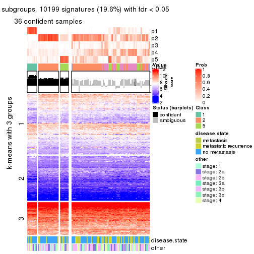</p>

</div>
<div id='tab-CV-hclust-get-signatures-no-scale-5'>
<pre><code class="r">get_signatures(res, k = 6, scale_rows = FALSE)
</code></pre>

<p></p>

</div>
</div>


Compare the overlap of signatures from different k:

```r
compare_signatures(res)
```


`get_signature()` returns a data frame invisibly. TO get the list of signatures, the function
call should be assigned to a variable explicitly. In following code, if `plot` argument is set
to `FALSE`, no heatmap is plotted while only the differential analysis is performed.

```r
# code only for demonstration
tb = get_signature(res, k = ..., plot = FALSE)
```

An example of the output of `tb` is:

```
#>   which_row         fdr    mean_1    mean_2 scaled_mean_1 scaled_mean_2 km
#> 1        38 0.042760348  8.373488  9.131774    -0.5533452     0.5164555  1
#> 2        40 0.018707592  7.106213  8.469186    -0.6173731     0.5762149  1
#> 3        55 0.019134737 10.221463 11.207825    -0.6159697     0.5749050  1
#> 4        59 0.006059896  5.921854  7.869574    -0.6899429     0.6439467  1
#> 5        60 0.018055526  8.928898 10.211722    -0.6204761     0.5791110  1
#> 6        98 0.009384629 15.714769 14.887706     0.6635654    -0.6193277  2
...
```

The columns in `tb` are:

1. `which_row`: row indices corresponding to the input matrix.
2. `fdr`: FDR for the differential test. 
3. `mean_x`: The mean value in group x.
4. `scaled_mean_x`: The mean value in group x after rows are scaled.
5. `km`: Row groups if k-means clustering is applied to rows.


UMAP plot which shows how samples are separated.


<script>
$( function() {
	$( '#tabs-CV-hclust-dimension-reduction' ).tabs();
} );
</script>
<div id='tabs-CV-hclust-dimension-reduction'>
<ul>
<li><a href='#tab-CV-hclust-dimension-reduction-1'>k = 2</a></li>
<li><a href='#tab-CV-hclust-dimension-reduction-2'>k = 3</a></li>
<li><a href='#tab-CV-hclust-dimension-reduction-3'>k = 4</a></li>
<li><a href='#tab-CV-hclust-dimension-reduction-4'>k = 5</a></li>
<li><a href='#tab-CV-hclust-dimension-reduction-5'>k = 6</a></li>
</ul>
<div id='tab-CV-hclust-dimension-reduction-1'>
<pre><code class="r">dimension_reduction(res, k = 2, method = &quot;UMAP&quot;)
</code></pre>

<p></p>

</div>
<div id='tab-CV-hclust-dimension-reduction-2'>
<pre><code class="r">dimension_reduction(res, k = 3, method = &quot;UMAP&quot;)
</code></pre>

<p></p>

</div>
<div id='tab-CV-hclust-dimension-reduction-3'>
<pre><code class="r">dimension_reduction(res, k = 4, method = &quot;UMAP&quot;)
</code></pre>

<p></p>

</div>
<div id='tab-CV-hclust-dimension-reduction-4'>
<pre><code class="r">dimension_reduction(res, k = 5, method = &quot;UMAP&quot;)
</code></pre>

<p></p>

</div>
<div id='tab-CV-hclust-dimension-reduction-5'>
<pre><code class="r">dimension_reduction(res, k = 6, method = &quot;UMAP&quot;)
</code></pre>

<p></p>

</div>
</div>


Following heatmap shows how subgroups are split when increasing `k`:

```r
collect_classes(res)
```


Test correlation between subgroups and known annotations. If the known
annotation is numeric, one-way ANOVA test is applied, and if the known
annotation is discrete, chi-squared contingency table test is applied.

```r
test_to_known_factors(res)
```

```
#>            n disease.state(p) other(p) k
#> CV:hclust 93          0.85601   0.7674 2
#> CV:hclust 80          0.71699   0.8256 3
#> CV:hclust 17          0.37416   0.8282 4
#> CV:hclust 37          0.62987   0.4068 5
#> CV:hclust 44          0.00963   0.0519 6
```


If matrix rows can be associated to genes, consider to use `functional_enrichment(res,
...)` to perform function enrichment for the signature genes. See [this vignette](http://bioconductor.org/packages/devel/bioc/vignettes/cola/inst/doc/functional_enrichment.html) for more detailed explanations.


 

---------------------------------------------------


### CV:kmeans


The object with results only for a single top-value method and a single partition method 
can be extracted as:

```r
res = res_list["CV", "kmeans"]
# you can also extract it by
# res = res_list["CV:kmeans"]
```

A summary of `res` and all the functions that can be applied to it:

```r
res
```

```
#> A 'ConsensusPartition' object with k = 2, 3, 4, 5, 6.
#>   On a matrix with 51941 rows and 104 columns.
#>   Top rows (1000, 2000, 3000, 4000, 5000) are extracted by 'CV' method.
#>   Subgroups are detected by 'kmeans' method.
#>   Performed in total 1250 partitions by row resampling.
#>   Best k for subgroups seems to be 2.
#> 
#> Following methods can be applied to this 'ConsensusPartition' object:
#>  [1] "cola_report"             "collect_classes"         "collect_plots"          
#>  [4] "collect_stats"           "colnames"                "compare_signatures"     
#>  [7] "consensus_heatmap"       "dimension_reduction"     "functional_enrichment"  
#> [10] "get_anno_col"            "get_anno"                "get_classes"            
#> [13] "get_consensus"           "get_matrix"              "get_membership"         
#> [16] "get_param"               "get_signatures"          "get_stats"              
#> [19] "is_best_k"               "is_stable_k"             "membership_heatmap"     
#> [22] "ncol"                    "nrow"                    "plot_ecdf"              
#> [25] "rownames"                "select_partition_number" "show"                   
#> [28] "suggest_best_k"          "test_to_known_factors"
```

`collect_plots()` function collects all the plots made from `res` for all `k` (number of partitions)
into one single page to provide an easy and fast comparison between different `k`.

```r
collect_plots(res)
```


The plots are:

- The first row: a plot of the ECDF (empirical cumulative distribution
  function) curves of the consensus matrix for each `k` and the heatmap of
  predicted classes for each `k`.
- The second row: heatmaps of the consensus matrix for each `k`.
- The third row: heatmaps of the membership matrix for each `k`.
- The fouth row: heatmaps of the signatures for each `k`.

All the plots in panels can be made by individual functions and they are
plotted later in this section.

`select_partition_number()` produces several plots showing different
statistics for choosing "optimized" `k`. There are following statistics:

- ECDF curves of the consensus matrix for each `k`;
- 1-PAC. [The PAC
  score](https://en.wikipedia.org/wiki/Consensus_clustering#Over-interpretation_potential_of_consensus_clustering)
  measures the proportion of the ambiguous subgrouping.
- Mean silhouette score.
- Concordance. The mean probability of fiting the consensus class ids in all
  partitions.
- Area increased. Denote $A_k$ as the area under the ECDF curve for current
  `k`, the area increased is defined as $A_k - A_{k-1}$.
- Rand index. The percent of pairs of samples that are both in a same cluster
  or both are not in a same cluster in the partition of k and k-1.
- Jaccard index. The ratio of pairs of samples are both in a same cluster in
  the partition of k and k-1 and the pairs of samples are both in a same
  cluster in the partition k or k-1.

The detailed explanations of these statistics can be found in [the _cola_
vignette](http://bioconductor.org/packages/devel/bioc/vignettes/cola/inst/doc/cola.html#toc_13).

Generally speaking, lower PAC score, higher mean silhouette score or higher
concordance corresponds to better partition. Rand index and Jaccard index
measure how similar the current partition is compared to partition with `k-1`.
If they are too similar, we won't accept `k` is better than `k-1`.

```r
select_partition_number(res)
```


The numeric values for all these statistics can be obtained by `get_stats()`.

```r
get_stats(res)
```

```
#>   k 1-PAC mean_silhouette concordance area_increased  Rand Jaccard
#> 2 2 0.824           0.902       0.958         0.4826 0.518   0.518
#> 3 3 0.382           0.568       0.759         0.3308 0.769   0.584
#> 4 4 0.424           0.463       0.651         0.1365 0.848   0.618
#> 5 5 0.517           0.442       0.654         0.0776 0.843   0.511
#> 6 6 0.572           0.502       0.668         0.0458 0.902   0.579
```

`suggest_best_k()` suggests the best $k$ based on these statistics. The rules are as follows:

- All $k$ with Jaccard index larger than 0.95 are removed because increasing
  $k$ does not provide enough extra information. If all $k$ are removed, it is
  marked as no subgroup is detected.
- For all $k$ with 1-PAC score larger than 0.9, the maximal $k$ is taken as
  the best $k$, and other $k$ are marked as optional $k$.
- If it does not fit the second rule. The $k$ with the maximal vote of the
  highest 1-PAC score, highest mean silhouette, and highest concordance is
  taken as the best $k$.

```r
suggest_best_k(res)
```

```
#> [1] 2
```


Following shows the table of the partitions (You need to click the **show/hide
code output** link to see it). The membership matrix (columns with name `p*`)
is inferred by
[`clue::cl_consensus()`](https://www.rdocumentation.org/link/cl_consensus?package=clue)
function with the `SE` method. Basically the value in the membership matrix
represents the probability to belong to a certain group. The finall class
label for an item is determined with the group with highest probability it
belongs to.

In `get_classes()` function, the entropy is calculated from the membership
matrix and the silhouette score is calculated from the consensus matrix.


<script>
$( function() {
	$( '#tabs-CV-kmeans-get-classes' ).tabs();
} );
</script>
<div id='tabs-CV-kmeans-get-classes'>
<ul>
<li><a href='#tab-CV-kmeans-get-classes-1'>k = 2</a></li>
<li><a href='#tab-CV-kmeans-get-classes-2'>k = 3</a></li>
<li><a href='#tab-CV-kmeans-get-classes-3'>k = 4</a></li>
<li><a href='#tab-CV-kmeans-get-classes-4'>k = 5</a></li>
<li><a href='#tab-CV-kmeans-get-classes-5'>k = 6</a></li>
</ul>

<div id='tab-CV-kmeans-get-classes-1'>
<p><a id='tab-CV-kmeans-get-classes-1-a' style='color:#0366d6' href='#'>show/hide code output</a></p>
<pre><code class="r">cbind(get_classes(res, k = 2), get_membership(res, k = 2))
</code></pre>

<pre><code>#&gt;           class entropy silhouette    p1    p2
#&gt; GSM537341     2  0.9044     0.5331 0.320 0.680
#&gt; GSM537345     1  0.0000     0.9487 1.000 0.000
#&gt; GSM537355     2  0.0000     0.9580 0.000 1.000
#&gt; GSM537366     1  0.0376     0.9473 0.996 0.004
#&gt; GSM537370     2  0.0000     0.9580 0.000 1.000
#&gt; GSM537380     2  0.0000     0.9580 0.000 1.000
#&gt; GSM537392     2  0.0000     0.9580 0.000 1.000
#&gt; GSM537415     2  0.0000     0.9580 0.000 1.000
#&gt; GSM537417     2  0.8081     0.6605 0.248 0.752
#&gt; GSM537422     1  0.2778     0.9213 0.952 0.048
#&gt; GSM537423     2  0.0000     0.9580 0.000 1.000
#&gt; GSM537427     2  0.0000     0.9580 0.000 1.000
#&gt; GSM537430     2  0.0000     0.9580 0.000 1.000
#&gt; GSM537336     1  0.0000     0.9487 1.000 0.000
#&gt; GSM537337     2  0.0000     0.9580 0.000 1.000
#&gt; GSM537348     1  0.0000     0.9487 1.000 0.000
#&gt; GSM537349     2  0.0000     0.9580 0.000 1.000
#&gt; GSM537356     1  0.0376     0.9473 0.996 0.004
#&gt; GSM537361     1  0.0000     0.9487 1.000 0.000
#&gt; GSM537374     2  0.0000     0.9580 0.000 1.000
#&gt; GSM537377     1  0.0000     0.9487 1.000 0.000
#&gt; GSM537378     2  0.0000     0.9580 0.000 1.000
#&gt; GSM537379     2  0.0000     0.9580 0.000 1.000
#&gt; GSM537383     2  0.0000     0.9580 0.000 1.000
#&gt; GSM537388     2  0.0000     0.9580 0.000 1.000
#&gt; GSM537395     2  0.0000     0.9580 0.000 1.000
#&gt; GSM537400     1  0.7453     0.7489 0.788 0.212
#&gt; GSM537404     2  1.0000    -0.0176 0.496 0.504
#&gt; GSM537409     2  0.0000     0.9580 0.000 1.000
#&gt; GSM537418     1  0.0000     0.9487 1.000 0.000
#&gt; GSM537425     1  0.0938     0.9435 0.988 0.012
#&gt; GSM537333     1  0.9209     0.5211 0.664 0.336
#&gt; GSM537342     2  0.0000     0.9580 0.000 1.000
#&gt; GSM537347     2  0.7883     0.6803 0.236 0.764
#&gt; GSM537350     1  0.0000     0.9487 1.000 0.000
#&gt; GSM537362     1  0.0000     0.9487 1.000 0.000
#&gt; GSM537363     1  0.2948     0.9185 0.948 0.052
#&gt; GSM537368     1  0.0000     0.9487 1.000 0.000
#&gt; GSM537376     2  0.0000     0.9580 0.000 1.000
#&gt; GSM537381     1  0.0000     0.9487 1.000 0.000
#&gt; GSM537386     2  0.0000     0.9580 0.000 1.000
#&gt; GSM537398     1  0.0000     0.9487 1.000 0.000
#&gt; GSM537402     2  0.0000     0.9580 0.000 1.000
#&gt; GSM537405     1  0.0000     0.9487 1.000 0.000
#&gt; GSM537371     1  0.0000     0.9487 1.000 0.000
#&gt; GSM537421     2  0.1633     0.9392 0.024 0.976
#&gt; GSM537424     1  0.0000     0.9487 1.000 0.000
#&gt; GSM537432     2  0.8861     0.5585 0.304 0.696
#&gt; GSM537331     2  0.0000     0.9580 0.000 1.000
#&gt; GSM537332     2  0.0000     0.9580 0.000 1.000
#&gt; GSM537334     2  0.0000     0.9580 0.000 1.000
#&gt; GSM537338     2  0.0000     0.9580 0.000 1.000
#&gt; GSM537353     2  0.0000     0.9580 0.000 1.000
#&gt; GSM537357     1  0.0000     0.9487 1.000 0.000
#&gt; GSM537358     2  0.0000     0.9580 0.000 1.000
#&gt; GSM537375     2  0.0000     0.9580 0.000 1.000
#&gt; GSM537389     2  0.0000     0.9580 0.000 1.000
#&gt; GSM537390     2  0.0000     0.9580 0.000 1.000
#&gt; GSM537393     2  0.0000     0.9580 0.000 1.000
#&gt; GSM537399     1  0.6148     0.8203 0.848 0.152
#&gt; GSM537407     1  0.0376     0.9473 0.996 0.004
#&gt; GSM537408     2  0.0000     0.9580 0.000 1.000
#&gt; GSM537428     2  0.0000     0.9580 0.000 1.000
#&gt; GSM537354     2  0.0000     0.9580 0.000 1.000
#&gt; GSM537410     2  0.0000     0.9580 0.000 1.000
#&gt; GSM537413     2  0.0000     0.9580 0.000 1.000
#&gt; GSM537396     2  0.2778     0.9192 0.048 0.952
#&gt; GSM537397     1  0.6973     0.7725 0.812 0.188
#&gt; GSM537330     2  0.0000     0.9580 0.000 1.000
#&gt; GSM537369     1  0.0000     0.9487 1.000 0.000
#&gt; GSM537373     2  0.3733     0.8970 0.072 0.928
#&gt; GSM537401     2  0.4815     0.8647 0.104 0.896
#&gt; GSM537343     1  0.0000     0.9487 1.000 0.000
#&gt; GSM537367     1  0.3431     0.9091 0.936 0.064
#&gt; GSM537382     2  0.0000     0.9580 0.000 1.000
#&gt; GSM537385     2  0.0000     0.9580 0.000 1.000
#&gt; GSM537391     1  0.0000     0.9487 1.000 0.000
#&gt; GSM537419     2  0.0000     0.9580 0.000 1.000
#&gt; GSM537420     1  0.0000     0.9487 1.000 0.000
#&gt; GSM537429     2  0.6048     0.8089 0.148 0.852
#&gt; GSM537431     1  0.7815     0.7192 0.768 0.232
#&gt; GSM537387     1  0.0000     0.9487 1.000 0.000
#&gt; GSM537414     1  0.4815     0.8736 0.896 0.104
#&gt; GSM537433     1  0.1843     0.9348 0.972 0.028
#&gt; GSM537335     2  0.1843     0.9366 0.028 0.972
#&gt; GSM537339     1  0.3733     0.9002 0.928 0.072
#&gt; GSM537340     2  0.9686     0.3350 0.396 0.604
#&gt; GSM537344     1  0.0000     0.9487 1.000 0.000
#&gt; GSM537346     2  0.0000     0.9580 0.000 1.000
#&gt; GSM537351     1  0.0000     0.9487 1.000 0.000
#&gt; GSM537352     2  0.0000     0.9580 0.000 1.000
#&gt; GSM537359     2  0.0000     0.9580 0.000 1.000
#&gt; GSM537360     2  0.0000     0.9580 0.000 1.000
#&gt; GSM537364     1  0.0000     0.9487 1.000 0.000
#&gt; GSM537365     1  0.9866     0.2618 0.568 0.432
#&gt; GSM537372     1  0.0000     0.9487 1.000 0.000
#&gt; GSM537384     1  0.0000     0.9487 1.000 0.000
#&gt; GSM537394     2  0.0000     0.9580 0.000 1.000
#&gt; GSM537403     2  0.0000     0.9580 0.000 1.000
#&gt; GSM537406     2  0.0000     0.9580 0.000 1.000
#&gt; GSM537411     2  0.0000     0.9580 0.000 1.000
#&gt; GSM537412     2  0.0000     0.9580 0.000 1.000
#&gt; GSM537416     2  0.0672     0.9520 0.008 0.992
#&gt; GSM537426     2  0.0000     0.9580 0.000 1.000
</code></pre>

<script>
$('#tab-CV-kmeans-get-classes-1-a').parent().next().next().hide();
$('#tab-CV-kmeans-get-classes-1-a').click(function(){
  $('#tab-CV-kmeans-get-classes-1-a').parent().next().next().toggle();
  return(false);
});
</script>
</div>

<div id='tab-CV-kmeans-get-classes-2'>
<p><a id='tab-CV-kmeans-get-classes-2-a' style='color:#0366d6' href='#'>show/hide code output</a></p>
<pre><code class="r">cbind(get_classes(res, k = 3), get_membership(res, k = 3))
</code></pre>

<pre><code>#&gt;           class entropy silhouette    p1    p2    p3
#&gt; GSM537341     2  0.9969     0.0155 0.320 0.372 0.308
#&gt; GSM537345     1  0.2165     0.7784 0.936 0.000 0.064
#&gt; GSM537355     2  0.5216     0.6713 0.000 0.740 0.260
#&gt; GSM537366     3  0.7292    -0.1373 0.472 0.028 0.500
#&gt; GSM537370     2  0.7987     0.4685 0.092 0.616 0.292
#&gt; GSM537380     2  0.1860     0.7448 0.000 0.948 0.052
#&gt; GSM537392     2  0.1031     0.7550 0.000 0.976 0.024
#&gt; GSM537415     2  0.2878     0.7340 0.000 0.904 0.096
#&gt; GSM537417     3  0.7906     0.5919 0.124 0.220 0.656
#&gt; GSM537422     3  0.6276     0.5388 0.224 0.040 0.736
#&gt; GSM537423     2  0.0892     0.7558 0.000 0.980 0.020
#&gt; GSM537427     2  0.4121     0.7202 0.000 0.832 0.168
#&gt; GSM537430     2  0.0592     0.7586 0.000 0.988 0.012
#&gt; GSM537336     1  0.3340     0.7713 0.880 0.000 0.120
#&gt; GSM537337     2  0.5115     0.6931 0.004 0.768 0.228
#&gt; GSM537348     1  0.6475     0.6687 0.692 0.028 0.280
#&gt; GSM537349     2  0.1163     0.7540 0.000 0.972 0.028
#&gt; GSM537356     1  0.5945     0.7081 0.740 0.024 0.236
#&gt; GSM537361     3  0.5848     0.4507 0.268 0.012 0.720
#&gt; GSM537374     2  0.5932     0.6744 0.056 0.780 0.164
#&gt; GSM537377     1  0.2261     0.7780 0.932 0.000 0.068
#&gt; GSM537378     2  0.0892     0.7558 0.000 0.980 0.020
#&gt; GSM537379     3  0.6345     0.2141 0.004 0.400 0.596
#&gt; GSM537383     2  0.0592     0.7567 0.000 0.988 0.012
#&gt; GSM537388     2  0.3038     0.7515 0.000 0.896 0.104
#&gt; GSM537395     2  0.3340     0.7321 0.000 0.880 0.120
#&gt; GSM537400     3  0.5357     0.5878 0.116 0.064 0.820
#&gt; GSM537404     3  0.6634     0.6076 0.144 0.104 0.752
#&gt; GSM537409     3  0.6307     0.0579 0.000 0.488 0.512
#&gt; GSM537418     1  0.6148     0.5498 0.640 0.004 0.356
#&gt; GSM537425     3  0.5831     0.4422 0.284 0.008 0.708
#&gt; GSM537333     3  0.5153     0.5931 0.100 0.068 0.832
#&gt; GSM537342     3  0.6299    -0.0179 0.000 0.476 0.524
#&gt; GSM537347     3  0.6303     0.4602 0.032 0.248 0.720
#&gt; GSM537350     1  0.5366     0.7371 0.776 0.016 0.208
#&gt; GSM537362     1  0.5315     0.7526 0.772 0.012 0.216
#&gt; GSM537363     3  0.7363     0.4388 0.280 0.064 0.656
#&gt; GSM537368     1  0.3340     0.7714 0.880 0.000 0.120
#&gt; GSM537376     2  0.4750     0.7126 0.000 0.784 0.216
#&gt; GSM537381     1  0.4002     0.7606 0.840 0.000 0.160
#&gt; GSM537386     2  0.2356     0.7410 0.000 0.928 0.072
#&gt; GSM537398     1  0.6126     0.6800 0.712 0.020 0.268
#&gt; GSM537402     2  0.3267     0.7529 0.000 0.884 0.116
#&gt; GSM537405     1  0.3619     0.7704 0.864 0.000 0.136
#&gt; GSM537371     1  0.3192     0.7741 0.888 0.000 0.112
#&gt; GSM537421     3  0.7130     0.0990 0.024 0.432 0.544
#&gt; GSM537424     1  0.4235     0.7560 0.824 0.000 0.176
#&gt; GSM537432     3  0.5122     0.5473 0.012 0.200 0.788
#&gt; GSM537331     2  0.6673     0.6403 0.056 0.720 0.224
#&gt; GSM537332     3  0.6215     0.2762 0.000 0.428 0.572
#&gt; GSM537334     2  0.7157     0.6027 0.056 0.668 0.276
#&gt; GSM537338     2  0.6986     0.6278 0.056 0.688 0.256
#&gt; GSM537353     2  0.3267     0.7336 0.000 0.884 0.116
#&gt; GSM537357     1  0.3116     0.7754 0.892 0.000 0.108
#&gt; GSM537358     2  0.1163     0.7557 0.000 0.972 0.028
#&gt; GSM537375     2  0.6603     0.6121 0.020 0.648 0.332
#&gt; GSM537389     2  0.1529     0.7524 0.000 0.960 0.040
#&gt; GSM537390     2  0.2165     0.7472 0.000 0.936 0.064
#&gt; GSM537393     2  0.5016     0.6920 0.000 0.760 0.240
#&gt; GSM537399     3  0.9065    -0.0677 0.364 0.144 0.492
#&gt; GSM537407     3  0.6501     0.3714 0.316 0.020 0.664
#&gt; GSM537408     2  0.2261     0.7457 0.000 0.932 0.068
#&gt; GSM537428     2  0.5656     0.6582 0.008 0.728 0.264
#&gt; GSM537354     2  0.5201     0.6933 0.004 0.760 0.236
#&gt; GSM537410     2  0.6244     0.0775 0.000 0.560 0.440
#&gt; GSM537413     2  0.2448     0.7469 0.000 0.924 0.076
#&gt; GSM537396     2  0.5823     0.6279 0.064 0.792 0.144
#&gt; GSM537397     1  0.7742     0.5994 0.632 0.080 0.288
#&gt; GSM537330     2  0.6267     0.1292 0.000 0.548 0.452
#&gt; GSM537369     1  0.2165     0.7884 0.936 0.000 0.064
#&gt; GSM537373     2  0.7571     0.2861 0.052 0.592 0.356
#&gt; GSM537401     2  0.9374     0.2902 0.192 0.492 0.316
#&gt; GSM537343     3  0.6931    -0.0218 0.456 0.016 0.528
#&gt; GSM537367     3  0.5506     0.5309 0.220 0.016 0.764
#&gt; GSM537382     2  0.6095     0.5140 0.000 0.608 0.392
#&gt; GSM537385     2  0.1964     0.7558 0.000 0.944 0.056
#&gt; GSM537391     1  0.5178     0.6985 0.808 0.028 0.164
#&gt; GSM537419     2  0.1163     0.7560 0.000 0.972 0.028
#&gt; GSM537420     1  0.2261     0.7880 0.932 0.000 0.068
#&gt; GSM537429     3  0.7075    -0.2516 0.020 0.488 0.492
#&gt; GSM537431     3  0.5730     0.5942 0.144 0.060 0.796
#&gt; GSM537387     1  0.3816     0.7282 0.852 0.000 0.148
#&gt; GSM537414     3  0.6488     0.5676 0.192 0.064 0.744
#&gt; GSM537433     3  0.6684     0.4161 0.292 0.032 0.676
#&gt; GSM537335     2  0.8825     0.3872 0.132 0.532 0.336
#&gt; GSM537339     1  0.7683     0.6089 0.640 0.080 0.280
#&gt; GSM537340     3  0.8637     0.5054 0.128 0.308 0.564
#&gt; GSM537344     1  0.2261     0.7880 0.932 0.000 0.068
#&gt; GSM537346     2  0.6291    -0.0323 0.000 0.532 0.468
#&gt; GSM537351     1  0.6079     0.3121 0.612 0.000 0.388
#&gt; GSM537352     2  0.4931     0.6973 0.000 0.768 0.232
#&gt; GSM537359     2  0.2356     0.7408 0.000 0.928 0.072
#&gt; GSM537360     2  0.3038     0.7336 0.000 0.896 0.104
#&gt; GSM537364     1  0.3752     0.7558 0.856 0.000 0.144
#&gt; GSM537365     3  0.6546     0.5851 0.148 0.096 0.756
#&gt; GSM537372     1  0.5414     0.7281 0.772 0.016 0.212
#&gt; GSM537384     1  0.4968     0.7429 0.800 0.012 0.188
#&gt; GSM537394     2  0.3340     0.7290 0.000 0.880 0.120
#&gt; GSM537403     3  0.6180     0.2775 0.000 0.416 0.584
#&gt; GSM537406     2  0.3267     0.7302 0.000 0.884 0.116
#&gt; GSM537411     2  0.4235     0.7354 0.000 0.824 0.176
#&gt; GSM537412     2  0.6267     0.0296 0.000 0.548 0.452
#&gt; GSM537416     3  0.5882     0.3810 0.000 0.348 0.652
#&gt; GSM537426     2  0.4399     0.6912 0.000 0.812 0.188
</code></pre>

<script>
$('#tab-CV-kmeans-get-classes-2-a').parent().next().next().hide();
$('#tab-CV-kmeans-get-classes-2-a').click(function(){
  $('#tab-CV-kmeans-get-classes-2-a').parent().next().next().toggle();
  return(false);
});
</script>
</div>

<div id='tab-CV-kmeans-get-classes-3'>
<p><a id='tab-CV-kmeans-get-classes-3-a' style='color:#0366d6' href='#'>show/hide code output</a></p>
<pre><code class="r">cbind(get_classes(res, k = 4), get_membership(res, k = 4))
</code></pre>

<pre><code>#&gt;           class entropy silhouette    p1    p2    p3    p4
#&gt; GSM537341     4  0.5948     0.5047 0.092 0.196 0.008 0.704
#&gt; GSM537345     1  0.1970     0.7661 0.932 0.000 0.008 0.060
#&gt; GSM537355     2  0.7717     0.3704 0.000 0.444 0.304 0.252
#&gt; GSM537366     3  0.7785     0.1315 0.212 0.004 0.440 0.344
#&gt; GSM537370     4  0.5334     0.1913 0.004 0.364 0.012 0.620
#&gt; GSM537380     2  0.1584     0.6692 0.000 0.952 0.012 0.036
#&gt; GSM537392     2  0.1584     0.6692 0.000 0.952 0.012 0.036
#&gt; GSM537415     2  0.4491     0.6013 0.000 0.800 0.060 0.140
#&gt; GSM537417     3  0.3448     0.6102 0.028 0.060 0.884 0.028
#&gt; GSM537422     3  0.3573     0.6072 0.132 0.004 0.848 0.016
#&gt; GSM537423     2  0.0000     0.6771 0.000 1.000 0.000 0.000
#&gt; GSM537427     2  0.6172     0.5156 0.000 0.632 0.084 0.284
#&gt; GSM537430     2  0.2271     0.6689 0.000 0.916 0.008 0.076
#&gt; GSM537336     1  0.0524     0.7917 0.988 0.000 0.008 0.004
#&gt; GSM537337     2  0.7285     0.4614 0.000 0.516 0.176 0.308
#&gt; GSM537348     4  0.5391     0.3811 0.320 0.012 0.012 0.656
#&gt; GSM537349     2  0.1488     0.6734 0.000 0.956 0.012 0.032
#&gt; GSM537356     4  0.7763     0.1086 0.332 0.000 0.248 0.420
#&gt; GSM537361     3  0.5056     0.5593 0.164 0.000 0.760 0.076
#&gt; GSM537374     2  0.5923     0.3881 0.000 0.580 0.044 0.376
#&gt; GSM537377     1  0.1970     0.7661 0.932 0.000 0.008 0.060
#&gt; GSM537378     2  0.0469     0.6786 0.000 0.988 0.000 0.012
#&gt; GSM537379     3  0.5151     0.5377 0.000 0.140 0.760 0.100
#&gt; GSM537383     2  0.1022     0.6728 0.000 0.968 0.000 0.032
#&gt; GSM537388     2  0.6116     0.5629 0.000 0.668 0.112 0.220
#&gt; GSM537395     2  0.5972     0.6149 0.000 0.692 0.176 0.132
#&gt; GSM537400     3  0.4389     0.6081 0.060 0.012 0.828 0.100
#&gt; GSM537404     3  0.5580     0.5972 0.068 0.048 0.772 0.112
#&gt; GSM537409     3  0.7505     0.1648 0.000 0.324 0.476 0.200
#&gt; GSM537418     3  0.7904    -0.0814 0.340 0.000 0.360 0.300
#&gt; GSM537425     3  0.6163     0.5015 0.160 0.000 0.676 0.164
#&gt; GSM537333     3  0.3915     0.6083 0.052 0.008 0.852 0.088
#&gt; GSM537342     3  0.7668     0.1902 0.000 0.252 0.460 0.288
#&gt; GSM537347     3  0.5575     0.5057 0.004 0.104 0.736 0.156
#&gt; GSM537350     4  0.7872     0.0673 0.416 0.028 0.128 0.428
#&gt; GSM537362     1  0.7386    -0.0262 0.464 0.000 0.168 0.368
#&gt; GSM537363     3  0.7562     0.4625 0.156 0.012 0.516 0.316
#&gt; GSM537368     1  0.0657     0.7920 0.984 0.000 0.012 0.004
#&gt; GSM537376     2  0.7741     0.3779 0.000 0.440 0.264 0.296
#&gt; GSM537381     1  0.7715     0.1095 0.436 0.000 0.324 0.240
#&gt; GSM537386     2  0.2399     0.6667 0.000 0.920 0.032 0.048
#&gt; GSM537398     4  0.5640     0.3878 0.308 0.012 0.024 0.656
#&gt; GSM537402     2  0.6508     0.5814 0.000 0.640 0.168 0.192
#&gt; GSM537405     1  0.1256     0.7845 0.964 0.000 0.028 0.008
#&gt; GSM537371     1  0.0592     0.7913 0.984 0.000 0.016 0.000
#&gt; GSM537421     3  0.7837     0.1939 0.004 0.244 0.452 0.300
#&gt; GSM537424     4  0.6121     0.2321 0.396 0.000 0.052 0.552
#&gt; GSM537432     3  0.5809     0.5405 0.004 0.076 0.696 0.224
#&gt; GSM537331     2  0.7037     0.2709 0.000 0.464 0.120 0.416
#&gt; GSM537332     3  0.4669     0.5739 0.000 0.200 0.764 0.036
#&gt; GSM537334     4  0.7492    -0.2181 0.000 0.388 0.180 0.432
#&gt; GSM537338     2  0.7304     0.2983 0.000 0.448 0.152 0.400
#&gt; GSM537353     2  0.5257     0.6428 0.000 0.752 0.104 0.144
#&gt; GSM537357     1  0.0524     0.7909 0.988 0.000 0.004 0.008
#&gt; GSM537358     2  0.0895     0.6780 0.000 0.976 0.020 0.004
#&gt; GSM537375     2  0.7806     0.3848 0.000 0.408 0.260 0.332
#&gt; GSM537389     2  0.1488     0.6734 0.000 0.956 0.012 0.032
#&gt; GSM537390     2  0.3301     0.6488 0.000 0.876 0.048 0.076
#&gt; GSM537393     2  0.7319     0.5036 0.000 0.532 0.248 0.220
#&gt; GSM537399     4  0.7738     0.0190 0.116 0.028 0.388 0.468
#&gt; GSM537407     3  0.6506     0.4725 0.144 0.004 0.652 0.200
#&gt; GSM537408     2  0.2996     0.6489 0.000 0.892 0.064 0.044
#&gt; GSM537428     2  0.7146     0.4072 0.000 0.516 0.148 0.336
#&gt; GSM537354     2  0.7329     0.4701 0.000 0.516 0.188 0.296
#&gt; GSM537410     2  0.7591     0.0286 0.000 0.432 0.368 0.200
#&gt; GSM537413     2  0.4227     0.6206 0.000 0.820 0.060 0.120
#&gt; GSM537396     2  0.5728     0.1615 0.004 0.544 0.020 0.432
#&gt; GSM537397     4  0.6327     0.4868 0.196 0.120 0.008 0.676
#&gt; GSM537330     3  0.5599     0.4478 0.000 0.276 0.672 0.052
#&gt; GSM537369     1  0.3529     0.7076 0.836 0.000 0.012 0.152
#&gt; GSM537373     4  0.7737    -0.1160 0.004 0.372 0.196 0.428
#&gt; GSM537401     4  0.4986     0.4740 0.044 0.216 0.000 0.740
#&gt; GSM537343     3  0.7367     0.3464 0.212 0.004 0.548 0.236
#&gt; GSM537367     3  0.5772     0.5679 0.100 0.004 0.716 0.180
#&gt; GSM537382     3  0.7846    -0.0772 0.000 0.272 0.392 0.336
#&gt; GSM537385     2  0.3790     0.6307 0.000 0.820 0.016 0.164
#&gt; GSM537391     4  0.5653     0.1460 0.448 0.016 0.004 0.532
#&gt; GSM537419     2  0.0804     0.6756 0.000 0.980 0.012 0.008
#&gt; GSM537420     1  0.3479     0.7122 0.840 0.000 0.012 0.148
#&gt; GSM537429     4  0.7900    -0.0951 0.000 0.300 0.332 0.368
#&gt; GSM537431     3  0.4026     0.6148 0.048 0.012 0.848 0.092
#&gt; GSM537387     1  0.3172     0.6824 0.840 0.000 0.000 0.160
#&gt; GSM537414     3  0.3625     0.6025 0.120 0.004 0.852 0.024
#&gt; GSM537433     3  0.6598     0.4798 0.140 0.008 0.652 0.200
#&gt; GSM537335     4  0.7271     0.2239 0.012 0.248 0.160 0.580
#&gt; GSM537339     4  0.6226     0.4842 0.200 0.120 0.004 0.676
#&gt; GSM537340     3  0.8411     0.2891 0.040 0.240 0.480 0.240
#&gt; GSM537344     1  0.3479     0.7122 0.840 0.000 0.012 0.148
#&gt; GSM537346     3  0.6037     0.4212 0.000 0.304 0.628 0.068
#&gt; GSM537351     1  0.4175     0.5884 0.776 0.000 0.212 0.012
#&gt; GSM537352     2  0.7278     0.4833 0.000 0.528 0.188 0.284
#&gt; GSM537359     2  0.1913     0.6679 0.000 0.940 0.020 0.040
#&gt; GSM537360     2  0.5110     0.5883 0.000 0.764 0.104 0.132
#&gt; GSM537364     1  0.1545     0.7770 0.952 0.000 0.040 0.008
#&gt; GSM537365     3  0.6178     0.5569 0.068 0.044 0.720 0.168
#&gt; GSM537372     4  0.5732     0.3094 0.364 0.004 0.028 0.604
#&gt; GSM537384     4  0.5548     0.2696 0.388 0.000 0.024 0.588
#&gt; GSM537394     2  0.4633     0.5506 0.000 0.780 0.172 0.048
#&gt; GSM537403     3  0.6537     0.4561 0.000 0.164 0.636 0.200
#&gt; GSM537406     2  0.4605     0.5945 0.000 0.796 0.072 0.132
#&gt; GSM537411     2  0.6514     0.5844 0.000 0.636 0.152 0.212
#&gt; GSM537412     2  0.7527     0.0625 0.000 0.452 0.356 0.192
#&gt; GSM537416     3  0.5598     0.5462 0.000 0.076 0.704 0.220
#&gt; GSM537426     2  0.6917     0.4309 0.000 0.592 0.208 0.200
</code></pre>

<script>
$('#tab-CV-kmeans-get-classes-3-a').parent().next().next().hide();
$('#tab-CV-kmeans-get-classes-3-a').click(function(){
  $('#tab-CV-kmeans-get-classes-3-a').parent().next().next().toggle();
  return(false);
});
</script>
</div>

<div id='tab-CV-kmeans-get-classes-4'>
<p><a id='tab-CV-kmeans-get-classes-4-a' style='color:#0366d6' href='#'>show/hide code output</a></p>
<pre><code class="r">cbind(get_classes(res, k = 5), get_membership(res, k = 5))
</code></pre>

<pre><code>#&gt;           class entropy silhouette    p1    p2    p3    p4    p5
#&gt; GSM537341     5  0.2386    0.57139 0.016 0.048 0.008 0.012 0.916
#&gt; GSM537345     1  0.1605    0.84530 0.944 0.000 0.012 0.004 0.040
#&gt; GSM537355     2  0.8393    0.00656 0.000 0.328 0.168 0.300 0.204
#&gt; GSM537366     3  0.6715    0.28449 0.076 0.008 0.488 0.040 0.388
#&gt; GSM537370     5  0.4722    0.48909 0.000 0.148 0.032 0.056 0.764
#&gt; GSM537380     2  0.1281    0.64548 0.000 0.956 0.012 0.000 0.032
#&gt; GSM537392     2  0.0865    0.64632 0.000 0.972 0.004 0.000 0.024
#&gt; GSM537415     2  0.4548    0.41735 0.004 0.712 0.012 0.256 0.016
#&gt; GSM537417     3  0.4003    0.59808 0.012 0.036 0.796 0.156 0.000
#&gt; GSM537422     3  0.4522    0.60656 0.060 0.000 0.744 0.192 0.004
#&gt; GSM537423     2  0.0609    0.64568 0.000 0.980 0.000 0.020 0.000
#&gt; GSM537427     2  0.7548    0.21291 0.000 0.460 0.068 0.196 0.276
#&gt; GSM537430     2  0.4131    0.56377 0.000 0.804 0.016 0.120 0.060
#&gt; GSM537336     1  0.0671    0.86226 0.980 0.000 0.016 0.004 0.000
#&gt; GSM537337     2  0.8259    0.01497 0.000 0.340 0.124 0.292 0.244
#&gt; GSM537348     5  0.2984    0.52813 0.124 0.004 0.016 0.000 0.856
#&gt; GSM537349     2  0.1978    0.63855 0.000 0.928 0.004 0.044 0.024
#&gt; GSM537356     5  0.6613    0.10851 0.120 0.004 0.316 0.024 0.536
#&gt; GSM537361     3  0.3241    0.66864 0.040 0.000 0.872 0.052 0.036
#&gt; GSM537374     5  0.7375   -0.07092 0.004 0.380 0.052 0.144 0.420
#&gt; GSM537377     1  0.1787    0.84426 0.936 0.000 0.016 0.004 0.044
#&gt; GSM537378     2  0.0609    0.64571 0.000 0.980 0.000 0.020 0.000
#&gt; GSM537379     3  0.5982    0.33054 0.000 0.080 0.636 0.244 0.040
#&gt; GSM537383     2  0.0609    0.64651 0.000 0.980 0.000 0.000 0.020
#&gt; GSM537388     2  0.7653    0.28743 0.000 0.496 0.112 0.192 0.200
#&gt; GSM537395     2  0.6852    0.19665 0.000 0.528 0.116 0.304 0.052
#&gt; GSM537400     3  0.5229    0.37456 0.028 0.000 0.568 0.392 0.012
#&gt; GSM537404     3  0.4013    0.66826 0.016 0.008 0.828 0.080 0.068
#&gt; GSM537409     4  0.5474    0.51260 0.004 0.184 0.092 0.700 0.020
#&gt; GSM537418     3  0.6701    0.19612 0.144 0.000 0.476 0.020 0.360
#&gt; GSM537425     3  0.5126    0.64463 0.052 0.000 0.744 0.064 0.140
#&gt; GSM537333     3  0.5001    0.38516 0.016 0.004 0.592 0.380 0.008
#&gt; GSM537342     4  0.4506    0.54498 0.000 0.076 0.096 0.792 0.036
#&gt; GSM537347     3  0.3937    0.62038 0.000 0.040 0.832 0.064 0.064
#&gt; GSM537350     5  0.7385    0.21983 0.200 0.024 0.228 0.028 0.520
#&gt; GSM537362     5  0.7701    0.18673 0.328 0.000 0.140 0.104 0.428
#&gt; GSM537363     4  0.6878   -0.05360 0.056 0.000 0.332 0.508 0.104
#&gt; GSM537368     1  0.1026    0.86299 0.968 0.000 0.024 0.004 0.004
#&gt; GSM537376     4  0.5177    0.48684 0.000 0.188 0.040 0.720 0.052
#&gt; GSM537381     3  0.6536    0.31166 0.192 0.000 0.520 0.008 0.280
#&gt; GSM537386     2  0.3126    0.62348 0.000 0.876 0.024 0.040 0.060
#&gt; GSM537398     5  0.3264    0.52629 0.132 0.000 0.024 0.004 0.840
#&gt; GSM537402     4  0.5903    0.23849 0.000 0.364 0.032 0.556 0.048
#&gt; GSM537405     1  0.1502    0.85555 0.940 0.000 0.056 0.000 0.004
#&gt; GSM537371     1  0.1026    0.86133 0.968 0.000 0.024 0.004 0.004
#&gt; GSM537421     4  0.3455    0.53005 0.004 0.068 0.084 0.844 0.000
#&gt; GSM537424     5  0.5440    0.41695 0.184 0.000 0.156 0.000 0.660
#&gt; GSM537432     4  0.5322    0.17685 0.000 0.028 0.336 0.612 0.024
#&gt; GSM537331     5  0.7752    0.01202 0.000 0.332 0.116 0.132 0.420
#&gt; GSM537332     3  0.5652    0.53344 0.004 0.124 0.684 0.172 0.016
#&gt; GSM537334     5  0.8036    0.08370 0.004 0.268 0.132 0.156 0.440
#&gt; GSM537338     5  0.8252    0.01748 0.004 0.284 0.132 0.188 0.392
#&gt; GSM537353     2  0.5194    0.13285 0.000 0.552 0.024 0.412 0.012
#&gt; GSM537357     1  0.0833    0.86227 0.976 0.000 0.016 0.004 0.004
#&gt; GSM537358     2  0.1701    0.63930 0.000 0.944 0.016 0.028 0.012
#&gt; GSM537375     4  0.8013    0.13484 0.000 0.232 0.116 0.424 0.228
#&gt; GSM537389     2  0.2067    0.63765 0.000 0.924 0.004 0.044 0.028
#&gt; GSM537390     2  0.2523    0.62308 0.004 0.908 0.024 0.052 0.012
#&gt; GSM537393     4  0.8021    0.01715 0.000 0.340 0.128 0.372 0.160
#&gt; GSM537399     5  0.5434   -0.22381 0.020 0.008 0.476 0.012 0.484
#&gt; GSM537407     3  0.4312    0.63181 0.040 0.000 0.780 0.020 0.160
#&gt; GSM537408     2  0.2822    0.61576 0.000 0.888 0.064 0.012 0.036
#&gt; GSM537428     2  0.8222    0.04961 0.000 0.336 0.136 0.196 0.332
#&gt; GSM537354     2  0.8231   -0.02750 0.000 0.328 0.124 0.324 0.224
#&gt; GSM537410     4  0.5618    0.52734 0.004 0.172 0.092 0.700 0.032
#&gt; GSM537413     2  0.4809    0.39546 0.004 0.708 0.012 0.244 0.032
#&gt; GSM537396     5  0.7243    0.03055 0.008 0.368 0.028 0.164 0.432
#&gt; GSM537397     5  0.2797    0.56979 0.048 0.020 0.012 0.020 0.900
#&gt; GSM537330     3  0.5858    0.48557 0.000 0.160 0.680 0.116 0.044
#&gt; GSM537369     1  0.5579    0.64295 0.672 0.000 0.108 0.016 0.204
#&gt; GSM537373     4  0.8143    0.20710 0.008 0.256 0.076 0.368 0.292
#&gt; GSM537401     5  0.2260    0.57153 0.016 0.048 0.004 0.012 0.920
#&gt; GSM537343     3  0.5241    0.55055 0.072 0.000 0.692 0.016 0.220
#&gt; GSM537367     3  0.5401    0.50503 0.032 0.000 0.636 0.300 0.032
#&gt; GSM537382     4  0.5860    0.51270 0.000 0.112 0.116 0.696 0.076
#&gt; GSM537385     2  0.5244    0.52533 0.000 0.716 0.016 0.132 0.136
#&gt; GSM537391     5  0.4017    0.39552 0.248 0.000 0.012 0.004 0.736
#&gt; GSM537419     2  0.1483    0.64322 0.000 0.952 0.012 0.028 0.008
#&gt; GSM537420     1  0.5579    0.64295 0.672 0.000 0.108 0.016 0.204
#&gt; GSM537429     5  0.8192   -0.02868 0.000 0.112 0.296 0.248 0.344
#&gt; GSM537431     3  0.5160    0.36314 0.016 0.004 0.564 0.404 0.012
#&gt; GSM537387     1  0.3205    0.76187 0.816 0.000 0.004 0.004 0.176
#&gt; GSM537414     3  0.3063    0.64873 0.036 0.000 0.864 0.096 0.004
#&gt; GSM537433     3  0.4566    0.63300 0.032 0.000 0.768 0.040 0.160
#&gt; GSM537335     5  0.6532    0.38137 0.004 0.108 0.132 0.108 0.648
#&gt; GSM537339     5  0.2584    0.56924 0.052 0.032 0.008 0.004 0.904
#&gt; GSM537340     4  0.4481    0.50238 0.016 0.056 0.132 0.788 0.008
#&gt; GSM537344     1  0.5594    0.64590 0.672 0.000 0.112 0.016 0.200
#&gt; GSM537346     3  0.5233    0.49315 0.000 0.204 0.708 0.052 0.036
#&gt; GSM537351     1  0.2771    0.78081 0.860 0.000 0.128 0.012 0.000
#&gt; GSM537352     4  0.7996    0.00156 0.000 0.324 0.096 0.368 0.212
#&gt; GSM537359     2  0.2599    0.63231 0.000 0.904 0.028 0.024 0.044
#&gt; GSM537360     2  0.5458    0.23433 0.004 0.588 0.032 0.360 0.016
#&gt; GSM537364     1  0.1205    0.85218 0.956 0.000 0.040 0.004 0.000
#&gt; GSM537365     3  0.4634    0.66068 0.008 0.012 0.780 0.096 0.104
#&gt; GSM537372     5  0.4488    0.46793 0.164 0.004 0.064 0.004 0.764
#&gt; GSM537384     5  0.4798    0.44163 0.192 0.004 0.068 0.004 0.732
#&gt; GSM537394     2  0.4332    0.51055 0.000 0.780 0.160 0.028 0.032
#&gt; GSM537403     4  0.5007    0.41731 0.000 0.052 0.244 0.692 0.012
#&gt; GSM537406     2  0.5421    0.36264 0.004 0.664 0.024 0.264 0.044
#&gt; GSM537411     4  0.6899    0.10236 0.000 0.392 0.036 0.444 0.128
#&gt; GSM537412     4  0.5931    0.37527 0.004 0.296 0.056 0.612 0.032
#&gt; GSM537416     4  0.4488    0.38630 0.004 0.020 0.208 0.748 0.020
#&gt; GSM537426     4  0.5358    0.36025 0.004 0.308 0.024 0.636 0.028
</code></pre>

<script>
$('#tab-CV-kmeans-get-classes-4-a').parent().next().next().hide();
$('#tab-CV-kmeans-get-classes-4-a').click(function(){
  $('#tab-CV-kmeans-get-classes-4-a').parent().next().next().toggle();
  return(false);
});
</script>
</div>

<div id='tab-CV-kmeans-get-classes-5'>
<p><a id='tab-CV-kmeans-get-classes-5-a' style='color:#0366d6' href='#'>show/hide code output</a></p>
<pre><code class="r">cbind(get_classes(res, k = 6), get_membership(res, k = 6))
</code></pre>

<pre><code>#&gt;           class entropy silhouette    p1    p2    p3    p4    p5    p6
#&gt; GSM537341     5   0.202     0.6685 0.000 0.028 0.000 0.016 0.920 0.036
#&gt; GSM537345     1   0.154     0.8369 0.936 0.000 0.008 0.004 0.052 0.000
#&gt; GSM537355     6   0.774     0.3889 0.000 0.180 0.076 0.156 0.108 0.480
#&gt; GSM537366     3   0.552     0.2941 0.040 0.004 0.512 0.040 0.404 0.000
#&gt; GSM537370     5   0.571     0.4501 0.004 0.156 0.032 0.016 0.664 0.128
#&gt; GSM537380     2   0.154     0.7489 0.000 0.940 0.016 0.000 0.004 0.040
#&gt; GSM537392     2   0.158     0.7464 0.000 0.936 0.012 0.000 0.004 0.048
#&gt; GSM537415     2   0.452     0.4469 0.000 0.632 0.004 0.328 0.004 0.032
#&gt; GSM537417     3   0.464     0.5471 0.000 0.008 0.648 0.040 0.004 0.300
#&gt; GSM537422     3   0.529     0.5881 0.056 0.000 0.700 0.092 0.008 0.144
#&gt; GSM537423     2   0.172     0.7593 0.000 0.932 0.004 0.036 0.000 0.028
#&gt; GSM537427     6   0.585     0.5244 0.000 0.332 0.000 0.008 0.164 0.496
#&gt; GSM537430     2   0.446     0.2531 0.000 0.628 0.000 0.036 0.004 0.332
#&gt; GSM537336     1   0.196     0.8398 0.928 0.000 0.012 0.016 0.032 0.012
#&gt; GSM537337     6   0.595     0.6004 0.000 0.196 0.000 0.048 0.160 0.596
#&gt; GSM537348     5   0.215     0.6862 0.040 0.004 0.004 0.004 0.916 0.032
#&gt; GSM537349     2   0.196     0.7489 0.000 0.912 0.000 0.072 0.008 0.008
#&gt; GSM537356     5   0.524     0.2149 0.060 0.000 0.312 0.028 0.600 0.000
#&gt; GSM537361     3   0.438     0.6390 0.036 0.000 0.784 0.028 0.040 0.112
#&gt; GSM537374     6   0.613     0.4492 0.000 0.252 0.000 0.004 0.324 0.420
#&gt; GSM537377     1   0.205     0.8344 0.912 0.000 0.028 0.004 0.056 0.000
#&gt; GSM537378     2   0.221     0.7554 0.000 0.904 0.004 0.048 0.000 0.044
#&gt; GSM537379     6   0.509    -0.2005 0.000 0.020 0.440 0.024 0.008 0.508
#&gt; GSM537383     2   0.119     0.7574 0.000 0.956 0.004 0.008 0.000 0.032
#&gt; GSM537388     6   0.740     0.3157 0.000 0.328 0.016 0.164 0.100 0.392
#&gt; GSM537395     6   0.482     0.4399 0.000 0.364 0.000 0.064 0.000 0.572
#&gt; GSM537400     3   0.671     0.1783 0.024 0.000 0.400 0.236 0.008 0.332
#&gt; GSM537404     3   0.385     0.6438 0.000 0.004 0.816 0.044 0.060 0.076
#&gt; GSM537409     4   0.448     0.5862 0.004 0.092 0.036 0.764 0.000 0.104
#&gt; GSM537418     3   0.579     0.2674 0.072 0.000 0.528 0.024 0.364 0.012
#&gt; GSM537425     3   0.504     0.6352 0.032 0.000 0.740 0.068 0.116 0.044
#&gt; GSM537333     3   0.659     0.2294 0.020 0.000 0.400 0.212 0.008 0.360
#&gt; GSM537342     4   0.594     0.5822 0.008 0.044 0.080 0.668 0.036 0.164
#&gt; GSM537347     3   0.432     0.5541 0.000 0.004 0.668 0.004 0.028 0.296
#&gt; GSM537350     5   0.713     0.2843 0.068 0.044 0.260 0.044 0.540 0.044
#&gt; GSM537362     5   0.794     0.1572 0.224 0.000 0.148 0.028 0.372 0.228
#&gt; GSM537363     4   0.707     0.3221 0.032 0.008 0.252 0.528 0.088 0.092
#&gt; GSM537368     1   0.193     0.8416 0.920 0.000 0.032 0.004 0.044 0.000
#&gt; GSM537376     6   0.638    -0.2052 0.000 0.124 0.024 0.400 0.016 0.436
#&gt; GSM537381     3   0.644     0.3712 0.124 0.000 0.544 0.028 0.272 0.032
#&gt; GSM537386     2   0.274     0.7455 0.000 0.888 0.028 0.028 0.008 0.048
#&gt; GSM537398     5   0.296     0.6762 0.044 0.000 0.024 0.004 0.872 0.056
#&gt; GSM537402     4   0.663     0.3206 0.000 0.256 0.020 0.496 0.024 0.204
#&gt; GSM537405     1   0.286     0.8143 0.868 0.000 0.092 0.012 0.020 0.008
#&gt; GSM537371     1   0.133     0.8405 0.948 0.000 0.020 0.000 0.032 0.000
#&gt; GSM537421     4   0.564     0.4462 0.012 0.028 0.040 0.564 0.008 0.348
#&gt; GSM537424     5   0.515     0.5476 0.108 0.000 0.156 0.012 0.700 0.024
#&gt; GSM537432     6   0.662    -0.3120 0.012 0.008 0.172 0.340 0.016 0.452
#&gt; GSM537331     6   0.627     0.4311 0.000 0.164 0.020 0.004 0.356 0.456
#&gt; GSM537332     3   0.628     0.3950 0.000 0.068 0.568 0.236 0.004 0.124
#&gt; GSM537334     6   0.557     0.4424 0.000 0.100 0.016 0.000 0.348 0.536
#&gt; GSM537338     6   0.585     0.5310 0.000 0.116 0.012 0.016 0.288 0.568
#&gt; GSM537353     2   0.629    -0.1101 0.004 0.432 0.012 0.168 0.004 0.380
#&gt; GSM537357     1   0.194     0.8391 0.928 0.000 0.008 0.016 0.036 0.012
#&gt; GSM537358     2   0.227     0.7440 0.000 0.904 0.020 0.008 0.004 0.064
#&gt; GSM537375     6   0.576     0.5386 0.004 0.100 0.000 0.092 0.148 0.656
#&gt; GSM537389     2   0.201     0.7484 0.000 0.908 0.000 0.076 0.008 0.008
#&gt; GSM537390     2   0.317     0.7215 0.000 0.836 0.012 0.120 0.000 0.032
#&gt; GSM537393     6   0.601     0.5201 0.000 0.176 0.012 0.112 0.068 0.632
#&gt; GSM537399     3   0.562     0.2290 0.008 0.024 0.500 0.004 0.416 0.048
#&gt; GSM537407     3   0.345     0.6179 0.008 0.000 0.816 0.008 0.140 0.028
#&gt; GSM537408     2   0.284     0.7191 0.000 0.860 0.100 0.000 0.008 0.032
#&gt; GSM537428     6   0.580     0.5897 0.000 0.192 0.016 0.000 0.224 0.568
#&gt; GSM537354     6   0.595     0.5961 0.000 0.188 0.000 0.056 0.152 0.604
#&gt; GSM537410     4   0.564     0.5972 0.004 0.100 0.068 0.700 0.024 0.104
#&gt; GSM537413     2   0.440     0.5332 0.004 0.688 0.020 0.268 0.000 0.020
#&gt; GSM537396     5   0.713    -0.0898 0.000 0.264 0.032 0.288 0.392 0.024
#&gt; GSM537397     5   0.261     0.6835 0.024 0.016 0.016 0.004 0.900 0.040
#&gt; GSM537330     3   0.704     0.3934 0.000 0.076 0.500 0.148 0.024 0.252
#&gt; GSM537369     1   0.634     0.6490 0.612 0.000 0.104 0.052 0.192 0.040
#&gt; GSM537373     4   0.753     0.3700 0.004 0.128 0.092 0.480 0.248 0.048
#&gt; GSM537401     5   0.219     0.6609 0.000 0.032 0.004 0.008 0.912 0.044
#&gt; GSM537343     3   0.382     0.5767 0.016 0.000 0.772 0.008 0.188 0.016
#&gt; GSM537367     3   0.465     0.4507 0.016 0.000 0.668 0.276 0.036 0.004
#&gt; GSM537382     4   0.653     0.3540 0.000 0.084 0.040 0.500 0.036 0.340
#&gt; GSM537385     2   0.652     0.2687 0.000 0.544 0.004 0.180 0.068 0.204
#&gt; GSM537391     5   0.469     0.5289 0.184 0.000 0.024 0.028 0.732 0.032
#&gt; GSM537419     2   0.177     0.7595 0.000 0.924 0.004 0.060 0.000 0.012
#&gt; GSM537420     1   0.634     0.6490 0.612 0.000 0.104 0.052 0.192 0.040
#&gt; GSM537429     6   0.827     0.1720 0.000 0.088 0.144 0.180 0.188 0.400
#&gt; GSM537431     3   0.664     0.1792 0.020 0.000 0.416 0.308 0.008 0.248
#&gt; GSM537387     1   0.437     0.6996 0.720 0.000 0.012 0.024 0.228 0.016
#&gt; GSM537414     3   0.462     0.6036 0.036 0.000 0.716 0.036 0.004 0.208
#&gt; GSM537433     3   0.352     0.6131 0.012 0.000 0.808 0.028 0.148 0.004
#&gt; GSM537335     5   0.500    -0.2391 0.000 0.032 0.020 0.000 0.476 0.472
#&gt; GSM537339     5   0.214     0.6792 0.016 0.020 0.000 0.004 0.916 0.044
#&gt; GSM537340     4   0.635     0.4026 0.016 0.036 0.068 0.492 0.012 0.376
#&gt; GSM537344     1   0.634     0.6490 0.612 0.000 0.104 0.052 0.192 0.040
#&gt; GSM537346     3   0.573     0.4572 0.000 0.156 0.568 0.000 0.016 0.260
#&gt; GSM537351     1   0.376     0.7497 0.820 0.000 0.096 0.016 0.016 0.052
#&gt; GSM537352     6   0.643     0.5377 0.000 0.172 0.008 0.124 0.108 0.588
#&gt; GSM537359     2   0.238     0.7431 0.000 0.900 0.056 0.004 0.008 0.032
#&gt; GSM537360     4   0.589     0.0237 0.000 0.404 0.004 0.420 0.000 0.172
#&gt; GSM537364     1   0.196     0.8226 0.928 0.000 0.032 0.012 0.012 0.016
#&gt; GSM537365     3   0.364     0.6412 0.000 0.012 0.832 0.040 0.084 0.032
#&gt; GSM537372     5   0.281     0.6582 0.092 0.000 0.036 0.008 0.864 0.000
#&gt; GSM537384     5   0.303     0.6554 0.092 0.000 0.040 0.008 0.856 0.004
#&gt; GSM537394     2   0.412     0.6341 0.000 0.760 0.168 0.004 0.008 0.060
#&gt; GSM537403     4   0.591     0.5468 0.004 0.024 0.112 0.616 0.016 0.228
#&gt; GSM537406     2   0.564     0.2483 0.000 0.540 0.036 0.372 0.028 0.024
#&gt; GSM537411     6   0.752     0.2729 0.000 0.276 0.024 0.232 0.076 0.392
#&gt; GSM537412     4   0.453     0.5652 0.004 0.156 0.032 0.752 0.004 0.052
#&gt; GSM537416     4   0.515     0.5212 0.012 0.012 0.116 0.696 0.004 0.160
#&gt; GSM537426     4   0.458     0.5522 0.004 0.168 0.020 0.740 0.004 0.064
</code></pre>

<script>
$('#tab-CV-kmeans-get-classes-5-a').parent().next().next().hide();
$('#tab-CV-kmeans-get-classes-5-a').click(function(){
  $('#tab-CV-kmeans-get-classes-5-a').parent().next().next().toggle();
  return(false);
});
</script>
</div>
</div>

Heatmaps for the consensus matrix. It visualizes the probability of two
samples to be in a same group.


<script>
$( function() {
	$( '#tabs-CV-kmeans-consensus-heatmap' ).tabs();
} );
</script>
<div id='tabs-CV-kmeans-consensus-heatmap'>
<ul>
<li><a href='#tab-CV-kmeans-consensus-heatmap-1'>k = 2</a></li>
<li><a href='#tab-CV-kmeans-consensus-heatmap-2'>k = 3</a></li>
<li><a href='#tab-CV-kmeans-consensus-heatmap-3'>k = 4</a></li>
<li><a href='#tab-CV-kmeans-consensus-heatmap-4'>k = 5</a></li>
<li><a href='#tab-CV-kmeans-consensus-heatmap-5'>k = 6</a></li>
</ul>
<div id='tab-CV-kmeans-consensus-heatmap-1'>
<pre><code class="r">consensus_heatmap(res, k = 2)
</code></pre>

<p></p>

</div>
<div id='tab-CV-kmeans-consensus-heatmap-2'>
<pre><code class="r">consensus_heatmap(res, k = 3)
</code></pre>

<p></p>

</div>
<div id='tab-CV-kmeans-consensus-heatmap-3'>
<pre><code class="r">consensus_heatmap(res, k = 4)
</code></pre>

<p></p>

</div>
<div id='tab-CV-kmeans-consensus-heatmap-4'>
<pre><code class="r">consensus_heatmap(res, k = 5)
</code></pre>

<p></p>

</div>
<div id='tab-CV-kmeans-consensus-heatmap-5'>
<pre><code class="r">consensus_heatmap(res, k = 6)
</code></pre>

<p></p>

</div>
</div>

Heatmaps for the membership of samples in all partitions to see how consistent they are:


<script>
$( function() {
	$( '#tabs-CV-kmeans-membership-heatmap' ).tabs();
} );
</script>
<div id='tabs-CV-kmeans-membership-heatmap'>
<ul>
<li><a href='#tab-CV-kmeans-membership-heatmap-1'>k = 2</a></li>
<li><a href='#tab-CV-kmeans-membership-heatmap-2'>k = 3</a></li>
<li><a href='#tab-CV-kmeans-membership-heatmap-3'>k = 4</a></li>
<li><a href='#tab-CV-kmeans-membership-heatmap-4'>k = 5</a></li>
<li><a href='#tab-CV-kmeans-membership-heatmap-5'>k = 6</a></li>
</ul>
<div id='tab-CV-kmeans-membership-heatmap-1'>
<pre><code class="r">membership_heatmap(res, k = 2)
</code></pre>

<p></p>

</div>
<div id='tab-CV-kmeans-membership-heatmap-2'>
<pre><code class="r">membership_heatmap(res, k = 3)
</code></pre>

<p></p>

</div>
<div id='tab-CV-kmeans-membership-heatmap-3'>
<pre><code class="r">membership_heatmap(res, k = 4)
</code></pre>

<p></p>

</div>
<div id='tab-CV-kmeans-membership-heatmap-4'>
<pre><code class="r">membership_heatmap(res, k = 5)
</code></pre>

<p></p>

</div>
<div id='tab-CV-kmeans-membership-heatmap-5'>
<pre><code class="r">membership_heatmap(res, k = 6)
</code></pre>

<p></p>

</div>
</div>

As soon as we have had the classes for columns, we can look for signatures
which are significantly different between classes which can be candidate marks
for certain classes. Following are the heatmaps for signatures.


Signature heatmaps where rows are scaled:


<script>
$( function() {
	$( '#tabs-CV-kmeans-get-signatures' ).tabs();
} );
</script>
<div id='tabs-CV-kmeans-get-signatures'>
<ul>
<li><a href='#tab-CV-kmeans-get-signatures-1'>k = 2</a></li>
<li><a href='#tab-CV-kmeans-get-signatures-2'>k = 3</a></li>
<li><a href='#tab-CV-kmeans-get-signatures-3'>k = 4</a></li>
<li><a href='#tab-CV-kmeans-get-signatures-4'>k = 5</a></li>
<li><a href='#tab-CV-kmeans-get-signatures-5'>k = 6</a></li>
</ul>
<div id='tab-CV-kmeans-get-signatures-1'>
<pre><code class="r">get_signatures(res, k = 2)
</code></pre>

<p></p>

</div>
<div id='tab-CV-kmeans-get-signatures-2'>
<pre><code class="r">get_signatures(res, k = 3)
</code></pre>

<p></p>

</div>
<div id='tab-CV-kmeans-get-signatures-3'>
<pre><code class="r">get_signatures(res, k = 4)
</code></pre>

<p></p>

</div>
<div id='tab-CV-kmeans-get-signatures-4'>
<pre><code class="r">get_signatures(res, k = 5)
</code></pre>

<p></p>

</div>
<div id='tab-CV-kmeans-get-signatures-5'>
<pre><code class="r">get_signatures(res, k = 6)
</code></pre>

<p></p>

</div>
</div>


Signature heatmaps where rows are not scaled:


<script>
$( function() {
	$( '#tabs-CV-kmeans-get-signatures-no-scale' ).tabs();
} );
</script>
<div id='tabs-CV-kmeans-get-signatures-no-scale'>
<ul>
<li><a href='#tab-CV-kmeans-get-signatures-no-scale-1'>k = 2</a></li>
<li><a href='#tab-CV-kmeans-get-signatures-no-scale-2'>k = 3</a></li>
<li><a href='#tab-CV-kmeans-get-signatures-no-scale-3'>k = 4</a></li>
<li><a href='#tab-CV-kmeans-get-signatures-no-scale-4'>k = 5</a></li>
<li><a href='#tab-CV-kmeans-get-signatures-no-scale-5'>k = 6</a></li>
</ul>
<div id='tab-CV-kmeans-get-signatures-no-scale-1'>
<pre><code class="r">get_signatures(res, k = 2, scale_rows = FALSE)
</code></pre>

<p></p>

</div>
<div id='tab-CV-kmeans-get-signatures-no-scale-2'>
<pre><code class="r">get_signatures(res, k = 3, scale_rows = FALSE)
</code></pre>

<p></p>

</div>
<div id='tab-CV-kmeans-get-signatures-no-scale-3'>
<pre><code class="r">get_signatures(res, k = 4, scale_rows = FALSE)
</code></pre>

<p></p>

</div>
<div id='tab-CV-kmeans-get-signatures-no-scale-4'>
<pre><code class="r">get_signatures(res, k = 5, scale_rows = FALSE)
</code></pre>

<p></p>

</div>
<div id='tab-CV-kmeans-get-signatures-no-scale-5'>
<pre><code class="r">get_signatures(res, k = 6, scale_rows = FALSE)
</code></pre>

<p></p>

</div>
</div>


Compare the overlap of signatures from different k:

```r
compare_signatures(res)
```


`get_signature()` returns a data frame invisibly. TO get the list of signatures, the function
call should be assigned to a variable explicitly. In following code, if `plot` argument is set
to `FALSE`, no heatmap is plotted while only the differential analysis is performed.

```r
# code only for demonstration
tb = get_signature(res, k = ..., plot = FALSE)
```

An example of the output of `tb` is:

```
#>   which_row         fdr    mean_1    mean_2 scaled_mean_1 scaled_mean_2 km
#> 1        38 0.042760348  8.373488  9.131774    -0.5533452     0.5164555  1
#> 2        40 0.018707592  7.106213  8.469186    -0.6173731     0.5762149  1
#> 3        55 0.019134737 10.221463 11.207825    -0.6159697     0.5749050  1
#> 4        59 0.006059896  5.921854  7.869574    -0.6899429     0.6439467  1
#> 5        60 0.018055526  8.928898 10.211722    -0.6204761     0.5791110  1
#> 6        98 0.009384629 15.714769 14.887706     0.6635654    -0.6193277  2
...
```

The columns in `tb` are:

1. `which_row`: row indices corresponding to the input matrix.
2. `fdr`: FDR for the differential test. 
3. `mean_x`: The mean value in group x.
4. `scaled_mean_x`: The mean value in group x after rows are scaled.
5. `km`: Row groups if k-means clustering is applied to rows.


UMAP plot which shows how samples are separated.


<script>
$( function() {
	$( '#tabs-CV-kmeans-dimension-reduction' ).tabs();
} );
</script>
<div id='tabs-CV-kmeans-dimension-reduction'>
<ul>
<li><a href='#tab-CV-kmeans-dimension-reduction-1'>k = 2</a></li>
<li><a href='#tab-CV-kmeans-dimension-reduction-2'>k = 3</a></li>
<li><a href='#tab-CV-kmeans-dimension-reduction-3'>k = 4</a></li>
<li><a href='#tab-CV-kmeans-dimension-reduction-4'>k = 5</a></li>
<li><a href='#tab-CV-kmeans-dimension-reduction-5'>k = 6</a></li>
</ul>
<div id='tab-CV-kmeans-dimension-reduction-1'>
<pre><code class="r">dimension_reduction(res, k = 2, method = &quot;UMAP&quot;)
</code></pre>

<p></p>

</div>
<div id='tab-CV-kmeans-dimension-reduction-2'>
<pre><code class="r">dimension_reduction(res, k = 3, method = &quot;UMAP&quot;)
</code></pre>

<p>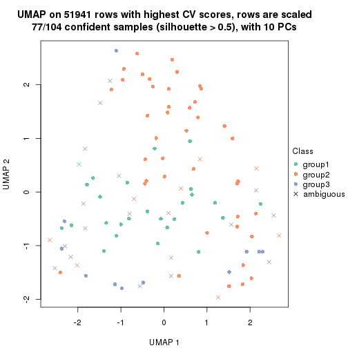</p>

</div>
<div id='tab-CV-kmeans-dimension-reduction-3'>
<pre><code class="r">dimension_reduction(res, k = 4, method = &quot;UMAP&quot;)
</code></pre>

<p></p>

</div>
<div id='tab-CV-kmeans-dimension-reduction-4'>
<pre><code class="r">dimension_reduction(res, k = 5, method = &quot;UMAP&quot;)
</code></pre>

<p></p>

</div>
<div id='tab-CV-kmeans-dimension-reduction-5'>
<pre><code class="r">dimension_reduction(res, k = 6, method = &quot;UMAP&quot;)
</code></pre>

<p></p>

</div>
</div>


Following heatmap shows how subgroups are split when increasing `k`:

```r
collect_classes(res)
```


Test correlation between subgroups and known annotations. If the known
annotation is numeric, one-way ANOVA test is applied, and if the known
annotation is discrete, chi-squared contingency table test is applied.

```r
test_to_known_factors(res)
```

```
#>             n disease.state(p) other(p) k
#> CV:kmeans 101            0.300    0.627 2
#> CV:kmeans  77            0.572    0.263 3
#> CV:kmeans  57            0.768    0.820 4
#> CV:kmeans  54            0.909    0.749 5
#> CV:kmeans  64            0.142    0.764 6
```


If matrix rows can be associated to genes, consider to use `functional_enrichment(res,
...)` to perform function enrichment for the signature genes. See [this vignette](http://bioconductor.org/packages/devel/bioc/vignettes/cola/inst/doc/functional_enrichment.html) for more detailed explanations.


 

---------------------------------------------------


### CV:skmeans


The object with results only for a single top-value method and a single partition method 
can be extracted as:

```r
res = res_list["CV", "skmeans"]
# you can also extract it by
# res = res_list["CV:skmeans"]
```

A summary of `res` and all the functions that can be applied to it:

```r
res
```

```
#> A 'ConsensusPartition' object with k = 2, 3, 4, 5, 6.
#>   On a matrix with 51941 rows and 104 columns.
#>   Top rows (1000, 2000, 3000, 4000, 5000) are extracted by 'CV' method.
#>   Subgroups are detected by 'skmeans' method.
#>   Performed in total 1250 partitions by row resampling.
#>   Best k for subgroups seems to be 2.
#> 
#> Following methods can be applied to this 'ConsensusPartition' object:
#>  [1] "cola_report"             "collect_classes"         "collect_plots"          
#>  [4] "collect_stats"           "colnames"                "compare_signatures"     
#>  [7] "consensus_heatmap"       "dimension_reduction"     "functional_enrichment"  
#> [10] "get_anno_col"            "get_anno"                "get_classes"            
#> [13] "get_consensus"           "get_matrix"              "get_membership"         
#> [16] "get_param"               "get_signatures"          "get_stats"              
#> [19] "is_best_k"               "is_stable_k"             "membership_heatmap"     
#> [22] "ncol"                    "nrow"                    "plot_ecdf"              
#> [25] "rownames"                "select_partition_number" "show"                   
#> [28] "suggest_best_k"          "test_to_known_factors"
```

`collect_plots()` function collects all the plots made from `res` for all `k` (number of partitions)
into one single page to provide an easy and fast comparison between different `k`.

```r
collect_plots(res)
```


The plots are:

- The first row: a plot of the ECDF (empirical cumulative distribution
  function) curves of the consensus matrix for each `k` and the heatmap of
  predicted classes for each `k`.
- The second row: heatmaps of the consensus matrix for each `k`.
- The third row: heatmaps of the membership matrix for each `k`.
- The fouth row: heatmaps of the signatures for each `k`.

All the plots in panels can be made by individual functions and they are
plotted later in this section.

`select_partition_number()` produces several plots showing different
statistics for choosing "optimized" `k`. There are following statistics:

- ECDF curves of the consensus matrix for each `k`;
- 1-PAC. [The PAC
  score](https://en.wikipedia.org/wiki/Consensus_clustering#Over-interpretation_potential_of_consensus_clustering)
  measures the proportion of the ambiguous subgrouping.
- Mean silhouette score.
- Concordance. The mean probability of fiting the consensus class ids in all
  partitions.
- Area increased. Denote $A_k$ as the area under the ECDF curve for current
  `k`, the area increased is defined as $A_k - A_{k-1}$.
- Rand index. The percent of pairs of samples that are both in a same cluster
  or both are not in a same cluster in the partition of k and k-1.
- Jaccard index. The ratio of pairs of samples are both in a same cluster in
  the partition of k and k-1 and the pairs of samples are both in a same
  cluster in the partition k or k-1.

The detailed explanations of these statistics can be found in [the _cola_
vignette](http://bioconductor.org/packages/devel/bioc/vignettes/cola/inst/doc/cola.html#toc_13).

Generally speaking, lower PAC score, higher mean silhouette score or higher
concordance corresponds to better partition. Rand index and Jaccard index
measure how similar the current partition is compared to partition with `k-1`.
If they are too similar, we won't accept `k` is better than `k-1`.

```r
select_partition_number(res)
```


The numeric values for all these statistics can be obtained by `get_stats()`.

```r
get_stats(res)
```

```
#>   k 1-PAC mean_silhouette concordance area_increased  Rand Jaccard
#> 2 2 0.864           0.901       0.962         0.5020 0.498   0.498
#> 3 3 0.424           0.335       0.626         0.3275 0.730   0.508
#> 4 4 0.479           0.519       0.709         0.1253 0.753   0.400
#> 5 5 0.547           0.425       0.646         0.0675 0.832   0.450
#> 6 6 0.592           0.479       0.666         0.0410 0.893   0.537
```

`suggest_best_k()` suggests the best $k$ based on these statistics. The rules are as follows:

- All $k$ with Jaccard index larger than 0.95 are removed because increasing
  $k$ does not provide enough extra information. If all $k$ are removed, it is
  marked as no subgroup is detected.
- For all $k$ with 1-PAC score larger than 0.9, the maximal $k$ is taken as
  the best $k$, and other $k$ are marked as optional $k$.
- If it does not fit the second rule. The $k$ with the maximal vote of the
  highest 1-PAC score, highest mean silhouette, and highest concordance is
  taken as the best $k$.

```r
suggest_best_k(res)
```

```
#> [1] 2
```


Following shows the table of the partitions (You need to click the **show/hide
code output** link to see it). The membership matrix (columns with name `p*`)
is inferred by
[`clue::cl_consensus()`](https://www.rdocumentation.org/link/cl_consensus?package=clue)
function with the `SE` method. Basically the value in the membership matrix
represents the probability to belong to a certain group. The finall class
label for an item is determined with the group with highest probability it
belongs to.

In `get_classes()` function, the entropy is calculated from the membership
matrix and the silhouette score is calculated from the consensus matrix.


<script>
$( function() {
	$( '#tabs-CV-skmeans-get-classes' ).tabs();
} );
</script>
<div id='tabs-CV-skmeans-get-classes'>
<ul>
<li><a href='#tab-CV-skmeans-get-classes-1'>k = 2</a></li>
<li><a href='#tab-CV-skmeans-get-classes-2'>k = 3</a></li>
<li><a href='#tab-CV-skmeans-get-classes-3'>k = 4</a></li>
<li><a href='#tab-CV-skmeans-get-classes-4'>k = 5</a></li>
<li><a href='#tab-CV-skmeans-get-classes-5'>k = 6</a></li>
</ul>

<div id='tab-CV-skmeans-get-classes-1'>
<p><a id='tab-CV-skmeans-get-classes-1-a' style='color:#0366d6' href='#'>show/hide code output</a></p>
<pre><code class="r">cbind(get_classes(res, k = 2), get_membership(res, k = 2))
</code></pre>

<pre><code>#&gt;           class entropy silhouette    p1    p2
#&gt; GSM537341     1  0.9732      0.328 0.596 0.404
#&gt; GSM537345     1  0.0000      0.956 1.000 0.000
#&gt; GSM537355     2  0.0000      0.961 0.000 1.000
#&gt; GSM537366     1  0.0000      0.956 1.000 0.000
#&gt; GSM537370     2  0.9635      0.336 0.388 0.612
#&gt; GSM537380     2  0.0000      0.961 0.000 1.000
#&gt; GSM537392     2  0.0000      0.961 0.000 1.000
#&gt; GSM537415     2  0.0000      0.961 0.000 1.000
#&gt; GSM537417     2  0.9732      0.314 0.404 0.596
#&gt; GSM537422     1  0.0000      0.956 1.000 0.000
#&gt; GSM537423     2  0.0000      0.961 0.000 1.000
#&gt; GSM537427     2  0.0000      0.961 0.000 1.000
#&gt; GSM537430     2  0.0000      0.961 0.000 1.000
#&gt; GSM537336     1  0.0000      0.956 1.000 0.000
#&gt; GSM537337     2  0.0000      0.961 0.000 1.000
#&gt; GSM537348     1  0.0000      0.956 1.000 0.000
#&gt; GSM537349     2  0.0000      0.961 0.000 1.000
#&gt; GSM537356     1  0.0000      0.956 1.000 0.000
#&gt; GSM537361     1  0.0000      0.956 1.000 0.000
#&gt; GSM537374     2  0.0000      0.961 0.000 1.000
#&gt; GSM537377     1  0.0000      0.956 1.000 0.000
#&gt; GSM537378     2  0.0000      0.961 0.000 1.000
#&gt; GSM537379     2  0.0000      0.961 0.000 1.000
#&gt; GSM537383     2  0.0000      0.961 0.000 1.000
#&gt; GSM537388     2  0.0000      0.961 0.000 1.000
#&gt; GSM537395     2  0.0000      0.961 0.000 1.000
#&gt; GSM537400     1  0.0000      0.956 1.000 0.000
#&gt; GSM537404     1  0.5946      0.806 0.856 0.144
#&gt; GSM537409     2  0.0000      0.961 0.000 1.000
#&gt; GSM537418     1  0.0000      0.956 1.000 0.000
#&gt; GSM537425     1  0.0000      0.956 1.000 0.000
#&gt; GSM537333     1  0.0672      0.950 0.992 0.008
#&gt; GSM537342     2  0.0376      0.957 0.004 0.996
#&gt; GSM537347     1  0.4690      0.858 0.900 0.100
#&gt; GSM537350     1  0.0000      0.956 1.000 0.000
#&gt; GSM537362     1  0.0000      0.956 1.000 0.000
#&gt; GSM537363     1  0.0000      0.956 1.000 0.000
#&gt; GSM537368     1  0.0000      0.956 1.000 0.000
#&gt; GSM537376     2  0.0000      0.961 0.000 1.000
#&gt; GSM537381     1  0.0000      0.956 1.000 0.000
#&gt; GSM537386     2  0.0000      0.961 0.000 1.000
#&gt; GSM537398     1  0.0000      0.956 1.000 0.000
#&gt; GSM537402     2  0.0000      0.961 0.000 1.000
#&gt; GSM537405     1  0.0000      0.956 1.000 0.000
#&gt; GSM537371     1  0.0000      0.956 1.000 0.000
#&gt; GSM537421     2  0.6801      0.758 0.180 0.820
#&gt; GSM537424     1  0.0000      0.956 1.000 0.000
#&gt; GSM537432     1  0.0672      0.950 0.992 0.008
#&gt; GSM537331     2  0.0000      0.961 0.000 1.000
#&gt; GSM537332     2  0.0000      0.961 0.000 1.000
#&gt; GSM537334     2  0.0000      0.961 0.000 1.000
#&gt; GSM537338     2  0.0000      0.961 0.000 1.000
#&gt; GSM537353     2  0.0000      0.961 0.000 1.000
#&gt; GSM537357     1  0.0000      0.956 1.000 0.000
#&gt; GSM537358     2  0.0000      0.961 0.000 1.000
#&gt; GSM537375     2  0.0000      0.961 0.000 1.000
#&gt; GSM537389     2  0.0000      0.961 0.000 1.000
#&gt; GSM537390     2  0.0000      0.961 0.000 1.000
#&gt; GSM537393     2  0.0000      0.961 0.000 1.000
#&gt; GSM537399     1  0.0000      0.956 1.000 0.000
#&gt; GSM537407     1  0.0000      0.956 1.000 0.000
#&gt; GSM537408     2  0.0000      0.961 0.000 1.000
#&gt; GSM537428     2  0.0000      0.961 0.000 1.000
#&gt; GSM537354     2  0.0000      0.961 0.000 1.000
#&gt; GSM537410     2  0.0000      0.961 0.000 1.000
#&gt; GSM537413     2  0.0000      0.961 0.000 1.000
#&gt; GSM537396     2  0.6712      0.765 0.176 0.824
#&gt; GSM537397     1  0.0672      0.949 0.992 0.008
#&gt; GSM537330     2  0.0000      0.961 0.000 1.000
#&gt; GSM537369     1  0.0000      0.956 1.000 0.000
#&gt; GSM537373     2  0.9686      0.322 0.396 0.604
#&gt; GSM537401     1  0.9732      0.328 0.596 0.404
#&gt; GSM537343     1  0.0000      0.956 1.000 0.000
#&gt; GSM537367     1  0.0000      0.956 1.000 0.000
#&gt; GSM537382     2  0.0000      0.961 0.000 1.000
#&gt; GSM537385     2  0.0000      0.961 0.000 1.000
#&gt; GSM537391     1  0.0000      0.956 1.000 0.000
#&gt; GSM537419     2  0.0000      0.961 0.000 1.000
#&gt; GSM537420     1  0.0000      0.956 1.000 0.000
#&gt; GSM537429     1  0.9815      0.284 0.580 0.420
#&gt; GSM537431     1  0.0672      0.950 0.992 0.008
#&gt; GSM537387     1  0.0000      0.956 1.000 0.000
#&gt; GSM537414     1  0.0000      0.956 1.000 0.000
#&gt; GSM537433     1  0.0000      0.956 1.000 0.000
#&gt; GSM537335     1  0.9881      0.241 0.564 0.436
#&gt; GSM537339     1  0.0000      0.956 1.000 0.000
#&gt; GSM537340     2  0.9732      0.314 0.404 0.596
#&gt; GSM537344     1  0.0000      0.956 1.000 0.000
#&gt; GSM537346     2  0.0000      0.961 0.000 1.000
#&gt; GSM537351     1  0.0000      0.956 1.000 0.000
#&gt; GSM537352     2  0.0000      0.961 0.000 1.000
#&gt; GSM537359     2  0.0000      0.961 0.000 1.000
#&gt; GSM537360     2  0.0000      0.961 0.000 1.000
#&gt; GSM537364     1  0.0000      0.956 1.000 0.000
#&gt; GSM537365     1  0.0000      0.956 1.000 0.000
#&gt; GSM537372     1  0.0000      0.956 1.000 0.000
#&gt; GSM537384     1  0.0000      0.956 1.000 0.000
#&gt; GSM537394     2  0.0000      0.961 0.000 1.000
#&gt; GSM537403     2  0.0000      0.961 0.000 1.000
#&gt; GSM537406     2  0.0000      0.961 0.000 1.000
#&gt; GSM537411     2  0.0000      0.961 0.000 1.000
#&gt; GSM537412     2  0.0000      0.961 0.000 1.000
#&gt; GSM537416     2  0.2778      0.916 0.048 0.952
#&gt; GSM537426     2  0.0000      0.961 0.000 1.000
</code></pre>

<script>
$('#tab-CV-skmeans-get-classes-1-a').parent().next().next().hide();
$('#tab-CV-skmeans-get-classes-1-a').click(function(){
  $('#tab-CV-skmeans-get-classes-1-a').parent().next().next().toggle();
  return(false);
});
</script>
</div>

<div id='tab-CV-skmeans-get-classes-2'>
<p><a id='tab-CV-skmeans-get-classes-2-a' style='color:#0366d6' href='#'>show/hide code output</a></p>
<pre><code class="r">cbind(get_classes(res, k = 3), get_membership(res, k = 3))
</code></pre>

<pre><code>#&gt;           class entropy silhouette    p1    p2    p3
#&gt; GSM537341     1  0.6033    0.59766 0.660 0.336 0.004
#&gt; GSM537345     1  0.2711    0.74753 0.912 0.088 0.000
#&gt; GSM537355     2  0.6286    0.16565 0.000 0.536 0.464
#&gt; GSM537366     1  0.1453    0.75890 0.968 0.008 0.024
#&gt; GSM537370     2  0.8008    0.31878 0.192 0.656 0.152
#&gt; GSM537380     2  0.6309    0.41263 0.000 0.504 0.496
#&gt; GSM537392     2  0.6309    0.41263 0.000 0.504 0.496
#&gt; GSM537415     3  0.6302   -0.42312 0.000 0.480 0.520
#&gt; GSM537417     3  0.9267    0.12258 0.316 0.180 0.504
#&gt; GSM537422     3  0.9254    0.09666 0.332 0.172 0.496
#&gt; GSM537423     2  0.6309    0.41263 0.000 0.504 0.496
#&gt; GSM537427     2  0.3116    0.49757 0.000 0.892 0.108
#&gt; GSM537430     2  0.6308    0.41376 0.000 0.508 0.492
#&gt; GSM537336     1  0.0892    0.75855 0.980 0.000 0.020
#&gt; GSM537337     2  0.1411    0.47471 0.000 0.964 0.036
#&gt; GSM537348     1  0.5706    0.61483 0.680 0.320 0.000
#&gt; GSM537349     3  0.6309   -0.44333 0.000 0.500 0.500
#&gt; GSM537356     1  0.1182    0.76152 0.976 0.012 0.012
#&gt; GSM537361     1  0.7838    0.20253 0.488 0.052 0.460
#&gt; GSM537374     2  0.4353    0.47667 0.008 0.836 0.156
#&gt; GSM537377     1  0.3375    0.74631 0.892 0.100 0.008
#&gt; GSM537378     2  0.6309    0.41263 0.000 0.504 0.496
#&gt; GSM537379     3  0.7232    0.21702 0.028 0.428 0.544
#&gt; GSM537383     2  0.6309    0.41263 0.000 0.504 0.496
#&gt; GSM537388     2  0.5678    0.40952 0.000 0.684 0.316
#&gt; GSM537395     2  0.5760    0.40707 0.000 0.672 0.328
#&gt; GSM537400     3  0.9405    0.18169 0.204 0.300 0.496
#&gt; GSM537404     3  0.8408    0.08457 0.344 0.100 0.556
#&gt; GSM537409     3  0.4842    0.25510 0.000 0.224 0.776
#&gt; GSM537418     1  0.0237    0.76190 0.996 0.000 0.004
#&gt; GSM537425     1  0.6235    0.34045 0.564 0.000 0.436
#&gt; GSM537333     3  0.9405    0.12543 0.300 0.204 0.496
#&gt; GSM537342     3  0.6402    0.16076 0.040 0.236 0.724
#&gt; GSM537347     3  0.9790    0.11337 0.260 0.308 0.432
#&gt; GSM537350     1  0.0424    0.76167 0.992 0.008 0.000
#&gt; GSM537362     1  0.4413    0.72073 0.832 0.160 0.008
#&gt; GSM537363     1  0.6209    0.42574 0.628 0.004 0.368
#&gt; GSM537368     1  0.0747    0.75972 0.984 0.000 0.016
#&gt; GSM537376     2  0.5859    0.45502 0.000 0.656 0.344
#&gt; GSM537381     1  0.0592    0.76082 0.988 0.000 0.012
#&gt; GSM537386     2  0.6309    0.40796 0.000 0.500 0.500
#&gt; GSM537398     1  0.5706    0.61483 0.680 0.320 0.000
#&gt; GSM537402     3  0.6307   -0.42110 0.000 0.488 0.512
#&gt; GSM537405     1  0.0747    0.75989 0.984 0.000 0.016
#&gt; GSM537371     1  0.0747    0.75989 0.984 0.000 0.016
#&gt; GSM537421     3  0.8836   -0.00128 0.120 0.388 0.492
#&gt; GSM537424     1  0.3116    0.74251 0.892 0.108 0.000
#&gt; GSM537432     3  0.9206    0.12583 0.188 0.288 0.524
#&gt; GSM537331     2  0.0747    0.46806 0.000 0.984 0.016
#&gt; GSM537332     3  0.3686    0.28783 0.000 0.140 0.860
#&gt; GSM537334     2  0.1170    0.45227 0.008 0.976 0.016
#&gt; GSM537338     2  0.0829    0.46047 0.004 0.984 0.012
#&gt; GSM537353     3  0.6308   -0.42414 0.000 0.492 0.508
#&gt; GSM537357     1  0.0592    0.76054 0.988 0.000 0.012
#&gt; GSM537358     2  0.6309    0.41263 0.000 0.504 0.496
#&gt; GSM537375     2  0.3682    0.38521 0.008 0.876 0.116
#&gt; GSM537389     3  0.6309   -0.44333 0.000 0.500 0.500
#&gt; GSM537390     3  0.6307   -0.43101 0.000 0.488 0.512
#&gt; GSM537393     2  0.3816    0.45799 0.000 0.852 0.148
#&gt; GSM537399     1  0.4505    0.74145 0.860 0.092 0.048
#&gt; GSM537407     1  0.6180    0.37052 0.584 0.000 0.416
#&gt; GSM537408     2  0.6309    0.41263 0.000 0.504 0.496
#&gt; GSM537428     2  0.0592    0.46620 0.000 0.988 0.012
#&gt; GSM537354     2  0.1753    0.47332 0.000 0.952 0.048
#&gt; GSM537410     3  0.3454    0.16381 0.008 0.104 0.888
#&gt; GSM537413     3  0.6307   -0.43046 0.000 0.488 0.512
#&gt; GSM537396     3  0.9616   -0.24653 0.236 0.296 0.468
#&gt; GSM537397     1  0.5733    0.61159 0.676 0.324 0.000
#&gt; GSM537330     3  0.4750    0.27824 0.000 0.216 0.784
#&gt; GSM537369     1  0.0000    0.76202 1.000 0.000 0.000
#&gt; GSM537373     3  0.7181   -0.00425 0.468 0.024 0.508
#&gt; GSM537401     1  0.6318    0.57285 0.636 0.356 0.008
#&gt; GSM537343     1  0.3941    0.67197 0.844 0.000 0.156
#&gt; GSM537367     1  0.6518    0.24987 0.512 0.004 0.484
#&gt; GSM537382     2  0.6140    0.01448 0.000 0.596 0.404
#&gt; GSM537385     2  0.6291    0.41638 0.000 0.532 0.468
#&gt; GSM537391     1  0.5650    0.61881 0.688 0.312 0.000
#&gt; GSM537419     2  0.6309    0.40759 0.000 0.500 0.500
#&gt; GSM537420     1  0.0000    0.76202 1.000 0.000 0.000
#&gt; GSM537429     2  0.9858   -0.10730 0.256 0.396 0.348
#&gt; GSM537431     3  0.8973    0.03707 0.364 0.136 0.500
#&gt; GSM537387     1  0.5650    0.61881 0.688 0.312 0.000
#&gt; GSM537414     3  0.9281    0.08259 0.340 0.172 0.488
#&gt; GSM537433     1  0.6252    0.32830 0.556 0.000 0.444
#&gt; GSM537335     2  0.6318   -0.10545 0.356 0.636 0.008
#&gt; GSM537339     1  0.5810    0.60106 0.664 0.336 0.000
#&gt; GSM537340     3  0.8455    0.25139 0.296 0.120 0.584
#&gt; GSM537344     1  0.0000    0.76202 1.000 0.000 0.000
#&gt; GSM537346     3  0.6018    0.19837 0.008 0.308 0.684
#&gt; GSM537351     1  0.5882    0.46478 0.652 0.000 0.348
#&gt; GSM537352     2  0.2261    0.48655 0.000 0.932 0.068
#&gt; GSM537359     2  0.6309    0.41263 0.000 0.504 0.496
#&gt; GSM537360     3  0.6295   -0.41601 0.000 0.472 0.528
#&gt; GSM537364     1  0.1860    0.74518 0.948 0.000 0.052
#&gt; GSM537365     1  0.6521    0.24213 0.504 0.004 0.492
#&gt; GSM537372     1  0.3551    0.73354 0.868 0.132 0.000
#&gt; GSM537384     1  0.3340    0.73809 0.880 0.120 0.000
#&gt; GSM537394     3  0.6180   -0.34851 0.000 0.416 0.584
#&gt; GSM537403     3  0.4473    0.30703 0.008 0.164 0.828
#&gt; GSM537406     3  0.6302   -0.42204 0.000 0.480 0.520
#&gt; GSM537411     2  0.5291    0.47717 0.000 0.732 0.268
#&gt; GSM537412     3  0.2796    0.17062 0.000 0.092 0.908
#&gt; GSM537416     3  0.6974    0.33851 0.104 0.168 0.728
#&gt; GSM537426     3  0.6252   -0.38070 0.000 0.444 0.556
</code></pre>

<script>
$('#tab-CV-skmeans-get-classes-2-a').parent().next().next().hide();
$('#tab-CV-skmeans-get-classes-2-a').click(function(){
  $('#tab-CV-skmeans-get-classes-2-a').parent().next().next().toggle();
  return(false);
});
</script>
</div>

<div id='tab-CV-skmeans-get-classes-3'>
<p><a id='tab-CV-skmeans-get-classes-3-a' style='color:#0366d6' href='#'>show/hide code output</a></p>
<pre><code class="r">cbind(get_classes(res, k = 4), get_membership(res, k = 4))
</code></pre>

<pre><code>#&gt;           class entropy silhouette    p1    p2    p3    p4
#&gt; GSM537341     1  0.3854    0.62836 0.844 0.016 0.016 0.124
#&gt; GSM537345     1  0.4284    0.73285 0.764 0.000 0.224 0.012
#&gt; GSM537355     4  0.7024    0.34836 0.020 0.344 0.080 0.556
#&gt; GSM537366     1  0.4877    0.57159 0.664 0.000 0.328 0.008
#&gt; GSM537370     1  0.8145   -0.35792 0.388 0.300 0.008 0.304
#&gt; GSM537380     2  0.2408    0.70983 0.000 0.896 0.000 0.104
#&gt; GSM537392     2  0.2469    0.70656 0.000 0.892 0.000 0.108
#&gt; GSM537415     2  0.2281    0.70719 0.000 0.904 0.000 0.096
#&gt; GSM537417     3  0.4331    0.51677 0.000 0.000 0.712 0.288
#&gt; GSM537422     3  0.2376    0.65129 0.016 0.000 0.916 0.068
#&gt; GSM537423     2  0.2011    0.72416 0.000 0.920 0.000 0.080
#&gt; GSM537427     4  0.6123    0.41243 0.056 0.372 0.000 0.572
#&gt; GSM537430     2  0.3801    0.58110 0.000 0.780 0.000 0.220
#&gt; GSM537336     1  0.4819    0.67089 0.652 0.000 0.344 0.004
#&gt; GSM537337     4  0.3903    0.60134 0.012 0.156 0.008 0.824
#&gt; GSM537348     1  0.2271    0.67938 0.916 0.000 0.008 0.076
#&gt; GSM537349     2  0.0707    0.73541 0.000 0.980 0.000 0.020
#&gt; GSM537356     1  0.3498    0.71765 0.832 0.000 0.160 0.008
#&gt; GSM537361     3  0.2521    0.62023 0.064 0.000 0.912 0.024
#&gt; GSM537374     4  0.7444    0.41558 0.148 0.336 0.008 0.508
#&gt; GSM537377     1  0.4502    0.72857 0.748 0.000 0.236 0.016
#&gt; GSM537378     2  0.1940    0.72711 0.000 0.924 0.000 0.076
#&gt; GSM537379     4  0.5472   -0.07038 0.000 0.016 0.440 0.544
#&gt; GSM537383     2  0.2345    0.71204 0.000 0.900 0.000 0.100
#&gt; GSM537388     2  0.5876   -0.04793 0.020 0.528 0.008 0.444
#&gt; GSM537395     4  0.4917    0.47154 0.000 0.336 0.008 0.656
#&gt; GSM537400     3  0.4567    0.51349 0.008 0.000 0.716 0.276
#&gt; GSM537404     3  0.4578    0.63954 0.044 0.056 0.832 0.068
#&gt; GSM537409     2  0.7641    0.02605 0.000 0.416 0.208 0.376
#&gt; GSM537418     1  0.4699    0.69707 0.676 0.000 0.320 0.004
#&gt; GSM537425     3  0.3448    0.56095 0.168 0.000 0.828 0.004
#&gt; GSM537333     3  0.4343    0.53376 0.004 0.000 0.732 0.264
#&gt; GSM537342     4  0.8561    0.20207 0.072 0.284 0.156 0.488
#&gt; GSM537347     3  0.7209    0.39960 0.116 0.024 0.596 0.264
#&gt; GSM537350     1  0.3306    0.72340 0.840 0.004 0.156 0.000
#&gt; GSM537362     1  0.5327    0.70401 0.720 0.000 0.220 0.060
#&gt; GSM537363     3  0.7976   -0.03049 0.400 0.040 0.444 0.116
#&gt; GSM537368     1  0.4655    0.69758 0.684 0.000 0.312 0.004
#&gt; GSM537376     4  0.5966    0.32834 0.000 0.316 0.060 0.624
#&gt; GSM537381     1  0.5080    0.55441 0.576 0.000 0.420 0.004
#&gt; GSM537386     2  0.1674    0.73398 0.004 0.952 0.012 0.032
#&gt; GSM537398     1  0.3149    0.68684 0.880 0.000 0.032 0.088
#&gt; GSM537402     2  0.5344    0.49789 0.000 0.668 0.032 0.300
#&gt; GSM537405     1  0.4837    0.66864 0.648 0.000 0.348 0.004
#&gt; GSM537371     1  0.4677    0.69533 0.680 0.000 0.316 0.004
#&gt; GSM537421     4  0.7320    0.33244 0.008 0.252 0.176 0.564
#&gt; GSM537424     1  0.3790    0.73836 0.820 0.000 0.164 0.016
#&gt; GSM537432     3  0.6863    0.00525 0.040 0.032 0.468 0.460
#&gt; GSM537331     4  0.6879    0.52882 0.132 0.232 0.012 0.624
#&gt; GSM537332     3  0.7082    0.21376 0.000 0.368 0.500 0.132
#&gt; GSM537334     4  0.6435    0.57744 0.136 0.144 0.024 0.696
#&gt; GSM537338     4  0.5912    0.58309 0.116 0.148 0.012 0.724
#&gt; GSM537353     2  0.5731    0.10375 0.000 0.544 0.028 0.428
#&gt; GSM537357     1  0.4632    0.70094 0.688 0.000 0.308 0.004
#&gt; GSM537358     2  0.2197    0.72216 0.000 0.916 0.004 0.080
#&gt; GSM537375     4  0.4601    0.60249 0.020 0.104 0.056 0.820
#&gt; GSM537389     2  0.0895    0.73582 0.000 0.976 0.004 0.020
#&gt; GSM537390     2  0.1209    0.73735 0.000 0.964 0.004 0.032
#&gt; GSM537393     4  0.5358    0.56680 0.004 0.220 0.052 0.724
#&gt; GSM537399     1  0.5810    0.27406 0.624 0.020 0.340 0.016
#&gt; GSM537407     3  0.2760    0.58417 0.128 0.000 0.872 0.000
#&gt; GSM537408     2  0.2376    0.73151 0.000 0.916 0.016 0.068
#&gt; GSM537428     4  0.6246    0.55933 0.092 0.216 0.012 0.680
#&gt; GSM537354     4  0.3854    0.60391 0.008 0.152 0.012 0.828
#&gt; GSM537410     2  0.7403    0.33187 0.016 0.556 0.140 0.288
#&gt; GSM537413     2  0.2489    0.71049 0.000 0.912 0.020 0.068
#&gt; GSM537396     2  0.6177    0.53677 0.172 0.704 0.016 0.108
#&gt; GSM537397     1  0.2402    0.67825 0.912 0.000 0.012 0.076
#&gt; GSM537330     3  0.8014    0.03977 0.008 0.380 0.384 0.228
#&gt; GSM537369     1  0.4122    0.72939 0.760 0.000 0.236 0.004
#&gt; GSM537373     2  0.8188    0.38231 0.196 0.568 0.084 0.152
#&gt; GSM537401     1  0.4987    0.54554 0.772 0.036 0.016 0.176
#&gt; GSM537343     3  0.4543    0.21280 0.324 0.000 0.676 0.000
#&gt; GSM537367     3  0.3801    0.62622 0.064 0.004 0.856 0.076
#&gt; GSM537382     4  0.5277    0.46013 0.008 0.116 0.108 0.768
#&gt; GSM537385     2  0.4128    0.62276 0.020 0.808 0.004 0.168
#&gt; GSM537391     1  0.3471    0.70551 0.868 0.000 0.060 0.072
#&gt; GSM537419     2  0.1389    0.73825 0.000 0.952 0.000 0.048
#&gt; GSM537420     1  0.4220    0.72539 0.748 0.000 0.248 0.004
#&gt; GSM537429     4  0.9777    0.19786 0.240 0.216 0.188 0.356
#&gt; GSM537431     3  0.3196    0.61714 0.008 0.000 0.856 0.136
#&gt; GSM537387     1  0.3581    0.72456 0.852 0.000 0.116 0.032
#&gt; GSM537414     3  0.3074    0.61578 0.000 0.000 0.848 0.152
#&gt; GSM537433     3  0.3632    0.56728 0.156 0.004 0.832 0.008
#&gt; GSM537335     4  0.6942    0.41021 0.344 0.068 0.024 0.564
#&gt; GSM537339     1  0.3171    0.65345 0.876 0.004 0.016 0.104
#&gt; GSM537340     4  0.8229    0.22352 0.032 0.200 0.284 0.484
#&gt; GSM537344     1  0.4313    0.72082 0.736 0.000 0.260 0.004
#&gt; GSM537346     3  0.7557    0.18431 0.000 0.284 0.484 0.232
#&gt; GSM537351     3  0.4313    0.30872 0.260 0.000 0.736 0.004
#&gt; GSM537352     4  0.4049    0.59382 0.008 0.180 0.008 0.804
#&gt; GSM537359     2  0.2048    0.73189 0.000 0.928 0.008 0.064
#&gt; GSM537360     2  0.4204    0.65831 0.000 0.788 0.020 0.192
#&gt; GSM537364     1  0.5147    0.49565 0.536 0.000 0.460 0.004
#&gt; GSM537365     3  0.3396    0.64351 0.068 0.024 0.884 0.024
#&gt; GSM537372     1  0.1284    0.71187 0.964 0.000 0.024 0.012
#&gt; GSM537384     1  0.1767    0.72091 0.944 0.000 0.044 0.012
#&gt; GSM537394     2  0.4485    0.63661 0.000 0.796 0.152 0.052
#&gt; GSM537403     4  0.7473   -0.10985 0.008 0.140 0.380 0.472
#&gt; GSM537406     2  0.2799    0.69432 0.000 0.884 0.008 0.108
#&gt; GSM537411     4  0.6283    0.18939 0.020 0.444 0.024 0.512
#&gt; GSM537412     2  0.6390    0.46705 0.000 0.644 0.132 0.224
#&gt; GSM537416     3  0.7281    0.09344 0.004 0.128 0.448 0.420
#&gt; GSM537426     2  0.5365    0.52849 0.000 0.692 0.044 0.264
</code></pre>

<script>
$('#tab-CV-skmeans-get-classes-3-a').parent().next().next().hide();
$('#tab-CV-skmeans-get-classes-3-a').click(function(){
  $('#tab-CV-skmeans-get-classes-3-a').parent().next().next().toggle();
  return(false);
});
</script>
</div>

<div id='tab-CV-skmeans-get-classes-4'>
<p><a id='tab-CV-skmeans-get-classes-4-a' style='color:#0366d6' href='#'>show/hide code output</a></p>
<pre><code class="r">cbind(get_classes(res, k = 5), get_membership(res, k = 5))
</code></pre>

<pre><code>#&gt;           class entropy silhouette    p1    p2    p3    p4    p5
#&gt; GSM537341     5  0.4551     0.2967 0.216 0.020 0.004 0.020 0.740
#&gt; GSM537345     1  0.1788     0.7485 0.932 0.000 0.008 0.004 0.056
#&gt; GSM537355     3  0.8467    -0.1589 0.000 0.168 0.304 0.240 0.288
#&gt; GSM537366     1  0.6711     0.4872 0.532 0.004 0.168 0.016 0.280
#&gt; GSM537370     5  0.6289     0.2834 0.056 0.276 0.016 0.040 0.612
#&gt; GSM537380     2  0.1442     0.7340 0.000 0.952 0.004 0.012 0.032
#&gt; GSM537392     2  0.1498     0.7323 0.000 0.952 0.008 0.016 0.024
#&gt; GSM537415     2  0.3544     0.5982 0.000 0.788 0.008 0.200 0.004
#&gt; GSM537417     3  0.3743     0.5227 0.052 0.000 0.840 0.080 0.028
#&gt; GSM537422     3  0.5656     0.5572 0.284 0.000 0.612 0.100 0.004
#&gt; GSM537423     2  0.0693     0.7349 0.000 0.980 0.000 0.012 0.008
#&gt; GSM537427     2  0.7514     0.0313 0.000 0.428 0.124 0.092 0.356
#&gt; GSM537430     2  0.5105     0.5768 0.000 0.744 0.052 0.060 0.144
#&gt; GSM537336     1  0.0865     0.7533 0.972 0.000 0.024 0.004 0.000
#&gt; GSM537337     5  0.8024     0.0750 0.000 0.096 0.256 0.260 0.388
#&gt; GSM537348     5  0.4135     0.0904 0.340 0.000 0.004 0.000 0.656
#&gt; GSM537349     2  0.1885     0.7300 0.000 0.932 0.004 0.044 0.020
#&gt; GSM537356     1  0.5205     0.5017 0.592 0.000 0.044 0.004 0.360
#&gt; GSM537361     3  0.4598     0.5124 0.312 0.000 0.664 0.008 0.016
#&gt; GSM537374     5  0.7126     0.2390 0.004 0.244 0.128 0.072 0.552
#&gt; GSM537377     1  0.2206     0.7435 0.912 0.000 0.016 0.004 0.068
#&gt; GSM537378     2  0.1588     0.7336 0.000 0.948 0.008 0.028 0.016
#&gt; GSM537379     3  0.5358     0.2653 0.000 0.008 0.692 0.156 0.144
#&gt; GSM537383     2  0.1195     0.7354 0.000 0.960 0.000 0.012 0.028
#&gt; GSM537388     2  0.8198     0.0688 0.000 0.380 0.188 0.144 0.288
#&gt; GSM537395     2  0.8189    -0.0478 0.000 0.396 0.192 0.264 0.148
#&gt; GSM537400     3  0.6716     0.3726 0.148 0.000 0.508 0.320 0.024
#&gt; GSM537404     3  0.5757     0.5767 0.128 0.032 0.712 0.112 0.016
#&gt; GSM537409     4  0.5873     0.4708 0.000 0.204 0.136 0.644 0.016
#&gt; GSM537418     1  0.3085     0.7451 0.868 0.000 0.068 0.004 0.060
#&gt; GSM537425     3  0.6168     0.3149 0.396 0.000 0.512 0.044 0.048
#&gt; GSM537333     3  0.5963     0.4470 0.084 0.000 0.636 0.244 0.036
#&gt; GSM537342     4  0.3792     0.4857 0.016 0.032 0.060 0.852 0.040
#&gt; GSM537347     3  0.3950     0.4952 0.016 0.024 0.824 0.016 0.120
#&gt; GSM537350     1  0.5142     0.5777 0.660 0.004 0.036 0.012 0.288
#&gt; GSM537362     1  0.4483     0.6455 0.768 0.000 0.064 0.012 0.156
#&gt; GSM537363     4  0.7007     0.0409 0.348 0.000 0.108 0.484 0.060
#&gt; GSM537368     1  0.0854     0.7597 0.976 0.000 0.012 0.004 0.008
#&gt; GSM537376     4  0.5831     0.4971 0.004 0.088 0.084 0.708 0.116
#&gt; GSM537381     1  0.4049     0.6984 0.792 0.000 0.124 0.000 0.084
#&gt; GSM537386     2  0.2807     0.7206 0.000 0.892 0.032 0.020 0.056
#&gt; GSM537398     5  0.4576     0.0868 0.376 0.000 0.016 0.000 0.608
#&gt; GSM537402     4  0.5262     0.1526 0.000 0.408 0.012 0.552 0.028
#&gt; GSM537405     1  0.1205     0.7456 0.956 0.000 0.040 0.004 0.000
#&gt; GSM537371     1  0.0771     0.7542 0.976 0.000 0.020 0.004 0.000
#&gt; GSM537421     4  0.4303     0.5074 0.020 0.048 0.072 0.824 0.036
#&gt; GSM537424     1  0.3427     0.6878 0.796 0.000 0.012 0.000 0.192
#&gt; GSM537432     4  0.7465     0.1996 0.068 0.012 0.260 0.520 0.140
#&gt; GSM537331     5  0.7174     0.2915 0.000 0.196 0.224 0.056 0.524
#&gt; GSM537332     3  0.6476     0.3045 0.000 0.232 0.564 0.188 0.016
#&gt; GSM537334     5  0.6376     0.3148 0.000 0.056 0.260 0.084 0.600
#&gt; GSM537338     5  0.7086     0.2495 0.000 0.060 0.264 0.148 0.528
#&gt; GSM537353     2  0.6573     0.1305 0.000 0.528 0.048 0.340 0.084
#&gt; GSM537357     1  0.0324     0.7584 0.992 0.000 0.004 0.004 0.000
#&gt; GSM537358     2  0.1095     0.7353 0.000 0.968 0.012 0.008 0.012
#&gt; GSM537375     4  0.7552     0.0157 0.000 0.040 0.288 0.376 0.296
#&gt; GSM537389     2  0.1549     0.7306 0.000 0.944 0.000 0.040 0.016
#&gt; GSM537390     2  0.1364     0.7297 0.000 0.952 0.012 0.036 0.000
#&gt; GSM537393     4  0.8447     0.0780 0.000 0.160 0.272 0.312 0.256
#&gt; GSM537399     5  0.7108    -0.1869 0.168 0.024 0.400 0.004 0.404
#&gt; GSM537407     3  0.6132     0.4868 0.260 0.004 0.620 0.032 0.084
#&gt; GSM537408     2  0.2342     0.7189 0.000 0.916 0.040 0.020 0.024
#&gt; GSM537428     5  0.7711     0.2443 0.000 0.184 0.236 0.104 0.476
#&gt; GSM537354     5  0.8015     0.0260 0.000 0.088 0.256 0.292 0.364
#&gt; GSM537410     4  0.4765     0.4957 0.008 0.144 0.080 0.760 0.008
#&gt; GSM537413     2  0.2629     0.6898 0.000 0.880 0.012 0.104 0.004
#&gt; GSM537396     2  0.7024     0.0844 0.004 0.420 0.008 0.232 0.336
#&gt; GSM537397     5  0.4623     0.0849 0.340 0.012 0.000 0.008 0.640
#&gt; GSM537330     3  0.6972     0.2639 0.000 0.156 0.588 0.156 0.100
#&gt; GSM537369     1  0.2074     0.7432 0.896 0.000 0.000 0.000 0.104
#&gt; GSM537373     4  0.8139     0.2144 0.036 0.284 0.044 0.420 0.216
#&gt; GSM537401     5  0.4159     0.3596 0.160 0.020 0.000 0.032 0.788
#&gt; GSM537343     1  0.6388    -0.0789 0.460 0.004 0.428 0.016 0.092
#&gt; GSM537367     3  0.6392     0.3146 0.120 0.000 0.472 0.396 0.012
#&gt; GSM537382     4  0.5254     0.4836 0.004 0.048 0.100 0.748 0.100
#&gt; GSM537385     2  0.5891     0.5572 0.000 0.684 0.052 0.132 0.132
#&gt; GSM537391     5  0.4650    -0.1773 0.468 0.000 0.000 0.012 0.520
#&gt; GSM537419     2  0.1430     0.7314 0.000 0.944 0.000 0.052 0.004
#&gt; GSM537420     1  0.2074     0.7435 0.896 0.000 0.000 0.000 0.104
#&gt; GSM537429     5  0.8603     0.0842 0.040 0.088 0.264 0.204 0.404
#&gt; GSM537431     3  0.6194     0.4354 0.112 0.004 0.556 0.320 0.008
#&gt; GSM537387     1  0.3661     0.5660 0.724 0.000 0.000 0.000 0.276
#&gt; GSM537414     3  0.3934     0.5926 0.160 0.000 0.796 0.036 0.008
#&gt; GSM537433     3  0.6572     0.4728 0.276 0.016 0.588 0.032 0.088
#&gt; GSM537335     5  0.5373     0.3729 0.012 0.028 0.220 0.040 0.700
#&gt; GSM537339     5  0.3790     0.2673 0.248 0.000 0.004 0.004 0.744
#&gt; GSM537340     4  0.6161     0.4474 0.056 0.072 0.136 0.700 0.036
#&gt; GSM537344     1  0.1908     0.7476 0.908 0.000 0.000 0.000 0.092
#&gt; GSM537346     3  0.5036     0.4026 0.000 0.216 0.708 0.016 0.060
#&gt; GSM537351     1  0.4227     0.3311 0.692 0.000 0.292 0.016 0.000
#&gt; GSM537352     4  0.8147     0.0572 0.000 0.144 0.168 0.368 0.320
#&gt; GSM537359     2  0.2362     0.7279 0.000 0.916 0.024 0.028 0.032
#&gt; GSM537360     2  0.6177     0.1811 0.000 0.552 0.056 0.348 0.044
#&gt; GSM537364     1  0.2286     0.6836 0.888 0.000 0.108 0.004 0.000
#&gt; GSM537365     3  0.6774     0.5695 0.144 0.052 0.656 0.092 0.056
#&gt; GSM537372     1  0.4294     0.3507 0.532 0.000 0.000 0.000 0.468
#&gt; GSM537384     1  0.4192     0.4667 0.596 0.000 0.000 0.000 0.404
#&gt; GSM537394     2  0.3770     0.6534 0.000 0.824 0.124 0.032 0.020
#&gt; GSM537403     4  0.4989     0.3724 0.004 0.048 0.244 0.696 0.008
#&gt; GSM537406     2  0.4561     0.4721 0.000 0.688 0.012 0.284 0.016
#&gt; GSM537411     4  0.7761     0.1676 0.000 0.348 0.068 0.368 0.216
#&gt; GSM537412     4  0.5790     0.3732 0.004 0.312 0.088 0.592 0.004
#&gt; GSM537416     4  0.4506     0.4277 0.008 0.036 0.192 0.756 0.008
#&gt; GSM537426     4  0.5291     0.3149 0.000 0.348 0.052 0.596 0.004
</code></pre>

<script>
$('#tab-CV-skmeans-get-classes-4-a').parent().next().next().hide();
$('#tab-CV-skmeans-get-classes-4-a').click(function(){
  $('#tab-CV-skmeans-get-classes-4-a').parent().next().next().toggle();
  return(false);
});
</script>
</div>

<div id='tab-CV-skmeans-get-classes-5'>
<p><a id='tab-CV-skmeans-get-classes-5-a' style='color:#0366d6' href='#'>show/hide code output</a></p>
<pre><code class="r">cbind(get_classes(res, k = 6), get_membership(res, k = 6))
</code></pre>

<pre><code>#&gt;           class entropy silhouette    p1    p2    p3    p4    p5    p6
#&gt; GSM537341     5  0.3210     0.5928 0.096 0.000 0.000 0.020 0.844 0.040
#&gt; GSM537345     1  0.1843     0.7314 0.912 0.000 0.004 0.000 0.080 0.004
#&gt; GSM537355     6  0.8194     0.2900 0.004 0.108 0.136 0.208 0.112 0.432
#&gt; GSM537366     5  0.6931     0.0197 0.356 0.000 0.232 0.040 0.364 0.008
#&gt; GSM537370     5  0.7003     0.2408 0.020 0.248 0.072 0.044 0.552 0.064
#&gt; GSM537380     2  0.1862     0.7716 0.000 0.932 0.024 0.004 0.020 0.020
#&gt; GSM537392     2  0.2368     0.7669 0.000 0.908 0.028 0.008 0.020 0.036
#&gt; GSM537415     2  0.3968     0.6309 0.000 0.752 0.012 0.208 0.020 0.008
#&gt; GSM537417     3  0.5396     0.5199 0.048 0.004 0.656 0.056 0.004 0.232
#&gt; GSM537422     3  0.6274     0.5003 0.292 0.000 0.536 0.120 0.008 0.044
#&gt; GSM537423     2  0.1719     0.7791 0.000 0.932 0.000 0.032 0.004 0.032
#&gt; GSM537427     6  0.5688     0.4250 0.000 0.332 0.012 0.004 0.112 0.540
#&gt; GSM537430     2  0.4375     0.5381 0.000 0.700 0.020 0.000 0.032 0.248
#&gt; GSM537336     1  0.1511     0.7518 0.940 0.000 0.044 0.012 0.004 0.000
#&gt; GSM537337     6  0.3398     0.5849 0.000 0.032 0.008 0.044 0.068 0.848
#&gt; GSM537348     5  0.3572     0.5788 0.204 0.000 0.000 0.000 0.764 0.032
#&gt; GSM537349     2  0.2815     0.7615 0.000 0.884 0.016 0.056 0.024 0.020
#&gt; GSM537356     5  0.5405     0.2345 0.412 0.000 0.076 0.008 0.500 0.004
#&gt; GSM537361     3  0.4203     0.6000 0.204 0.000 0.744 0.012 0.016 0.024
#&gt; GSM537374     6  0.5984     0.5211 0.000 0.176 0.012 0.012 0.232 0.568
#&gt; GSM537377     1  0.2463     0.7306 0.888 0.000 0.024 0.004 0.080 0.004
#&gt; GSM537378     2  0.2518     0.7721 0.000 0.892 0.008 0.036 0.004 0.060
#&gt; GSM537379     6  0.5076    -0.0305 0.000 0.004 0.412 0.056 0.004 0.524
#&gt; GSM537383     2  0.1483     0.7740 0.000 0.944 0.008 0.000 0.012 0.036
#&gt; GSM537388     6  0.7671     0.3944 0.000 0.212 0.044 0.120 0.164 0.460
#&gt; GSM537395     6  0.5280     0.3594 0.000 0.352 0.004 0.084 0.004 0.556
#&gt; GSM537400     4  0.7789    -0.0277 0.132 0.000 0.304 0.384 0.036 0.144
#&gt; GSM537404     3  0.4939     0.5873 0.088 0.012 0.764 0.056 0.024 0.056
#&gt; GSM537409     4  0.5929     0.5086 0.000 0.160 0.116 0.644 0.012 0.068
#&gt; GSM537418     1  0.4572     0.6788 0.756 0.000 0.080 0.024 0.128 0.012
#&gt; GSM537425     3  0.6019     0.4555 0.300 0.000 0.572 0.060 0.040 0.028
#&gt; GSM537333     3  0.7475     0.1922 0.116 0.000 0.416 0.320 0.032 0.116
#&gt; GSM537342     4  0.4023     0.5396 0.000 0.012 0.008 0.792 0.096 0.092
#&gt; GSM537347     3  0.5269     0.4823 0.012 0.016 0.692 0.028 0.048 0.204
#&gt; GSM537350     1  0.6874    -0.1378 0.428 0.028 0.116 0.040 0.384 0.004
#&gt; GSM537362     1  0.5403     0.5399 0.688 0.000 0.040 0.012 0.144 0.116
#&gt; GSM537363     4  0.6770     0.1506 0.288 0.008 0.100 0.508 0.092 0.004
#&gt; GSM537368     1  0.0767     0.7628 0.976 0.000 0.012 0.004 0.008 0.000
#&gt; GSM537376     4  0.5597     0.2655 0.004 0.040 0.012 0.508 0.024 0.412
#&gt; GSM537381     1  0.4833     0.6012 0.692 0.000 0.168 0.004 0.132 0.004
#&gt; GSM537386     2  0.3634     0.7500 0.000 0.836 0.036 0.036 0.076 0.016
#&gt; GSM537398     5  0.5339     0.4982 0.280 0.000 0.020 0.000 0.608 0.092
#&gt; GSM537402     4  0.6876     0.3244 0.000 0.292 0.028 0.500 0.064 0.116
#&gt; GSM537405     1  0.1692     0.7580 0.932 0.000 0.048 0.008 0.012 0.000
#&gt; GSM537371     1  0.1078     0.7630 0.964 0.000 0.012 0.008 0.016 0.000
#&gt; GSM537421     4  0.5304     0.4660 0.012 0.040 0.036 0.668 0.008 0.236
#&gt; GSM537424     1  0.4670     0.5199 0.680 0.000 0.044 0.004 0.256 0.016
#&gt; GSM537432     4  0.7488     0.3151 0.044 0.008 0.152 0.464 0.060 0.272
#&gt; GSM537331     6  0.6488     0.5382 0.000 0.108 0.056 0.020 0.268 0.548
#&gt; GSM537332     3  0.6712     0.3257 0.000 0.156 0.560 0.200 0.040 0.044
#&gt; GSM537334     6  0.4852     0.5737 0.000 0.012 0.060 0.008 0.244 0.676
#&gt; GSM537338     6  0.3145     0.6009 0.000 0.012 0.012 0.004 0.144 0.828
#&gt; GSM537353     2  0.6814     0.1168 0.000 0.464 0.032 0.192 0.020 0.292
#&gt; GSM537357     1  0.1036     0.7622 0.964 0.000 0.004 0.008 0.024 0.000
#&gt; GSM537358     2  0.2647     0.7623 0.000 0.892 0.040 0.012 0.012 0.044
#&gt; GSM537375     6  0.4286     0.4748 0.000 0.016 0.036 0.140 0.032 0.776
#&gt; GSM537389     2  0.2641     0.7610 0.000 0.888 0.008 0.064 0.028 0.012
#&gt; GSM537390     2  0.1950     0.7796 0.000 0.924 0.028 0.032 0.000 0.016
#&gt; GSM537393     6  0.5428     0.4801 0.000 0.108 0.048 0.116 0.024 0.704
#&gt; GSM537399     3  0.6051     0.0988 0.052 0.032 0.456 0.020 0.436 0.004
#&gt; GSM537407     3  0.4511     0.5876 0.136 0.008 0.760 0.020 0.072 0.004
#&gt; GSM537408     2  0.3464     0.7067 0.000 0.812 0.140 0.016 0.032 0.000
#&gt; GSM537428     6  0.5716     0.6001 0.004 0.068 0.084 0.016 0.148 0.680
#&gt; GSM537354     6  0.3512     0.5701 0.000 0.032 0.012 0.056 0.056 0.844
#&gt; GSM537410     4  0.5216     0.5377 0.000 0.124 0.036 0.720 0.092 0.028
#&gt; GSM537413     2  0.3398     0.7288 0.000 0.824 0.040 0.120 0.016 0.000
#&gt; GSM537396     5  0.6770    -0.0202 0.008 0.256 0.016 0.232 0.472 0.016
#&gt; GSM537397     5  0.3988     0.5863 0.192 0.008 0.012 0.004 0.764 0.020
#&gt; GSM537330     3  0.7656     0.3063 0.000 0.092 0.492 0.140 0.088 0.188
#&gt; GSM537369     1  0.2973     0.6923 0.836 0.000 0.024 0.000 0.136 0.004
#&gt; GSM537373     4  0.6988     0.2838 0.024 0.136 0.028 0.456 0.340 0.016
#&gt; GSM537401     5  0.3675     0.5489 0.064 0.000 0.004 0.020 0.820 0.092
#&gt; GSM537343     3  0.5716     0.1805 0.416 0.008 0.496 0.016 0.052 0.012
#&gt; GSM537367     3  0.6033     0.3383 0.108 0.004 0.520 0.340 0.024 0.004
#&gt; GSM537382     4  0.5740     0.3775 0.012 0.012 0.012 0.608 0.088 0.268
#&gt; GSM537385     2  0.7466     0.2126 0.000 0.480 0.032 0.124 0.156 0.208
#&gt; GSM537391     5  0.4638     0.3925 0.368 0.000 0.000 0.004 0.588 0.040
#&gt; GSM537419     2  0.2587     0.7776 0.000 0.896 0.028 0.048 0.012 0.016
#&gt; GSM537420     1  0.3067     0.7047 0.840 0.000 0.028 0.004 0.124 0.004
#&gt; GSM537429     5  0.8660    -0.2432 0.032 0.028 0.176 0.228 0.312 0.224
#&gt; GSM537431     3  0.6817     0.1456 0.084 0.004 0.448 0.380 0.032 0.052
#&gt; GSM537387     1  0.3766     0.4307 0.684 0.000 0.000 0.000 0.304 0.012
#&gt; GSM537414     3  0.5101     0.5849 0.160 0.000 0.704 0.032 0.008 0.096
#&gt; GSM537433     3  0.4865     0.5868 0.156 0.008 0.736 0.032 0.060 0.008
#&gt; GSM537335     6  0.5164     0.4179 0.004 0.000 0.060 0.008 0.376 0.552
#&gt; GSM537339     5  0.3894     0.5927 0.152 0.000 0.000 0.004 0.772 0.072
#&gt; GSM537340     4  0.6805     0.4137 0.072 0.040 0.064 0.560 0.012 0.252
#&gt; GSM537344     1  0.2604     0.7225 0.872 0.000 0.028 0.000 0.096 0.004
#&gt; GSM537346     3  0.5796     0.4003 0.004 0.176 0.620 0.004 0.024 0.172
#&gt; GSM537351     1  0.3568     0.5906 0.788 0.000 0.172 0.032 0.008 0.000
#&gt; GSM537352     6  0.5693     0.4585 0.000 0.072 0.016 0.188 0.064 0.660
#&gt; GSM537359     2  0.3058     0.7467 0.000 0.848 0.108 0.024 0.020 0.000
#&gt; GSM537360     2  0.6616     0.2265 0.000 0.504 0.048 0.288 0.012 0.148
#&gt; GSM537364     1  0.2294     0.7260 0.896 0.000 0.076 0.020 0.008 0.000
#&gt; GSM537365     3  0.5297     0.5489 0.056 0.056 0.732 0.076 0.080 0.000
#&gt; GSM537372     5  0.3782     0.4011 0.360 0.000 0.004 0.000 0.636 0.000
#&gt; GSM537384     5  0.3996     0.1033 0.484 0.000 0.004 0.000 0.512 0.000
#&gt; GSM537394     2  0.4562     0.6104 0.000 0.712 0.220 0.032 0.032 0.004
#&gt; GSM537403     4  0.5511     0.4941 0.000 0.032 0.108 0.700 0.044 0.116
#&gt; GSM537406     2  0.5192     0.4491 0.000 0.620 0.012 0.292 0.068 0.008
#&gt; GSM537411     6  0.7381     0.0524 0.000 0.312 0.020 0.244 0.060 0.364
#&gt; GSM537412     4  0.6073     0.3843 0.000 0.284 0.100 0.568 0.024 0.024
#&gt; GSM537416     4  0.4395     0.4918 0.004 0.016 0.156 0.756 0.004 0.064
#&gt; GSM537426     4  0.6326     0.3075 0.000 0.324 0.076 0.528 0.024 0.048
</code></pre>

<script>
$('#tab-CV-skmeans-get-classes-5-a').parent().next().next().hide();
$('#tab-CV-skmeans-get-classes-5-a').click(function(){
  $('#tab-CV-skmeans-get-classes-5-a').parent().next().next().toggle();
  return(false);
});
</script>
</div>
</div>

Heatmaps for the consensus matrix. It visualizes the probability of two
samples to be in a same group.


<script>
$( function() {
	$( '#tabs-CV-skmeans-consensus-heatmap' ).tabs();
} );
</script>
<div id='tabs-CV-skmeans-consensus-heatmap'>
<ul>
<li><a href='#tab-CV-skmeans-consensus-heatmap-1'>k = 2</a></li>
<li><a href='#tab-CV-skmeans-consensus-heatmap-2'>k = 3</a></li>
<li><a href='#tab-CV-skmeans-consensus-heatmap-3'>k = 4</a></li>
<li><a href='#tab-CV-skmeans-consensus-heatmap-4'>k = 5</a></li>
<li><a href='#tab-CV-skmeans-consensus-heatmap-5'>k = 6</a></li>
</ul>
<div id='tab-CV-skmeans-consensus-heatmap-1'>
<pre><code class="r">consensus_heatmap(res, k = 2)
</code></pre>

<p></p>

</div>
<div id='tab-CV-skmeans-consensus-heatmap-2'>
<pre><code class="r">consensus_heatmap(res, k = 3)
</code></pre>

<p></p>

</div>
<div id='tab-CV-skmeans-consensus-heatmap-3'>
<pre><code class="r">consensus_heatmap(res, k = 4)
</code></pre>

<p></p>

</div>
<div id='tab-CV-skmeans-consensus-heatmap-4'>
<pre><code class="r">consensus_heatmap(res, k = 5)
</code></pre>

<p></p>

</div>
<div id='tab-CV-skmeans-consensus-heatmap-5'>
<pre><code class="r">consensus_heatmap(res, k = 6)
</code></pre>

<p></p>

</div>
</div>

Heatmaps for the membership of samples in all partitions to see how consistent they are:


<script>
$( function() {
	$( '#tabs-CV-skmeans-membership-heatmap' ).tabs();
} );
</script>
<div id='tabs-CV-skmeans-membership-heatmap'>
<ul>
<li><a href='#tab-CV-skmeans-membership-heatmap-1'>k = 2</a></li>
<li><a href='#tab-CV-skmeans-membership-heatmap-2'>k = 3</a></li>
<li><a href='#tab-CV-skmeans-membership-heatmap-3'>k = 4</a></li>
<li><a href='#tab-CV-skmeans-membership-heatmap-4'>k = 5</a></li>
<li><a href='#tab-CV-skmeans-membership-heatmap-5'>k = 6</a></li>
</ul>
<div id='tab-CV-skmeans-membership-heatmap-1'>
<pre><code class="r">membership_heatmap(res, k = 2)
</code></pre>

<p></p>

</div>
<div id='tab-CV-skmeans-membership-heatmap-2'>
<pre><code class="r">membership_heatmap(res, k = 3)
</code></pre>

<p></p>

</div>
<div id='tab-CV-skmeans-membership-heatmap-3'>
<pre><code class="r">membership_heatmap(res, k = 4)
</code></pre>

<p></p>

</div>
<div id='tab-CV-skmeans-membership-heatmap-4'>
<pre><code class="r">membership_heatmap(res, k = 5)
</code></pre>

<p></p>

</div>
<div id='tab-CV-skmeans-membership-heatmap-5'>
<pre><code class="r">membership_heatmap(res, k = 6)
</code></pre>

<p></p>

</div>
</div>

As soon as we have had the classes for columns, we can look for signatures
which are significantly different between classes which can be candidate marks
for certain classes. Following are the heatmaps for signatures.


Signature heatmaps where rows are scaled:


<script>
$( function() {
	$( '#tabs-CV-skmeans-get-signatures' ).tabs();
} );
</script>
<div id='tabs-CV-skmeans-get-signatures'>
<ul>
<li><a href='#tab-CV-skmeans-get-signatures-1'>k = 2</a></li>
<li><a href='#tab-CV-skmeans-get-signatures-2'>k = 3</a></li>
<li><a href='#tab-CV-skmeans-get-signatures-3'>k = 4</a></li>
<li><a href='#tab-CV-skmeans-get-signatures-4'>k = 5</a></li>
<li><a href='#tab-CV-skmeans-get-signatures-5'>k = 6</a></li>
</ul>
<div id='tab-CV-skmeans-get-signatures-1'>
<pre><code class="r">get_signatures(res, k = 2)
</code></pre>

<p></p>

</div>
<div id='tab-CV-skmeans-get-signatures-2'>
<pre><code class="r">get_signatures(res, k = 3)
</code></pre>

<p></p>

</div>
<div id='tab-CV-skmeans-get-signatures-3'>
<pre><code class="r">get_signatures(res, k = 4)
</code></pre>

<p></p>

</div>
<div id='tab-CV-skmeans-get-signatures-4'>
<pre><code class="r">get_signatures(res, k = 5)
</code></pre>

<p></p>

</div>
<div id='tab-CV-skmeans-get-signatures-5'>
<pre><code class="r">get_signatures(res, k = 6)
</code></pre>

<p></p>

</div>
</div>


Signature heatmaps where rows are not scaled:


<script>
$( function() {
	$( '#tabs-CV-skmeans-get-signatures-no-scale' ).tabs();
} );
</script>
<div id='tabs-CV-skmeans-get-signatures-no-scale'>
<ul>
<li><a href='#tab-CV-skmeans-get-signatures-no-scale-1'>k = 2</a></li>
<li><a href='#tab-CV-skmeans-get-signatures-no-scale-2'>k = 3</a></li>
<li><a href='#tab-CV-skmeans-get-signatures-no-scale-3'>k = 4</a></li>
<li><a href='#tab-CV-skmeans-get-signatures-no-scale-4'>k = 5</a></li>
<li><a href='#tab-CV-skmeans-get-signatures-no-scale-5'>k = 6</a></li>
</ul>
<div id='tab-CV-skmeans-get-signatures-no-scale-1'>
<pre><code class="r">get_signatures(res, k = 2, scale_rows = FALSE)
</code></pre>

<p></p>

</div>
<div id='tab-CV-skmeans-get-signatures-no-scale-2'>
<pre><code class="r">get_signatures(res, k = 3, scale_rows = FALSE)
</code></pre>

<p></p>

</div>
<div id='tab-CV-skmeans-get-signatures-no-scale-3'>
<pre><code class="r">get_signatures(res, k = 4, scale_rows = FALSE)
</code></pre>

<p></p>

</div>
<div id='tab-CV-skmeans-get-signatures-no-scale-4'>
<pre><code class="r">get_signatures(res, k = 5, scale_rows = FALSE)
</code></pre>

<p></p>

</div>
<div id='tab-CV-skmeans-get-signatures-no-scale-5'>
<pre><code class="r">get_signatures(res, k = 6, scale_rows = FALSE)
</code></pre>

<p></p>

</div>
</div>


Compare the overlap of signatures from different k:

```r
compare_signatures(res)
```


`get_signature()` returns a data frame invisibly. TO get the list of signatures, the function
call should be assigned to a variable explicitly. In following code, if `plot` argument is set
to `FALSE`, no heatmap is plotted while only the differential analysis is performed.

```r
# code only for demonstration
tb = get_signature(res, k = ..., plot = FALSE)
```

An example of the output of `tb` is:

```
#>   which_row         fdr    mean_1    mean_2 scaled_mean_1 scaled_mean_2 km
#> 1        38 0.042760348  8.373488  9.131774    -0.5533452     0.5164555  1
#> 2        40 0.018707592  7.106213  8.469186    -0.6173731     0.5762149  1
#> 3        55 0.019134737 10.221463 11.207825    -0.6159697     0.5749050  1
#> 4        59 0.006059896  5.921854  7.869574    -0.6899429     0.6439467  1
#> 5        60 0.018055526  8.928898 10.211722    -0.6204761     0.5791110  1
#> 6        98 0.009384629 15.714769 14.887706     0.6635654    -0.6193277  2
...
```

The columns in `tb` are:

1. `which_row`: row indices corresponding to the input matrix.
2. `fdr`: FDR for the differential test. 
3. `mean_x`: The mean value in group x.
4. `scaled_mean_x`: The mean value in group x after rows are scaled.
5. `km`: Row groups if k-means clustering is applied to rows.


UMAP plot which shows how samples are separated.


<script>
$( function() {
	$( '#tabs-CV-skmeans-dimension-reduction' ).tabs();
} );
</script>
<div id='tabs-CV-skmeans-dimension-reduction'>
<ul>
<li><a href='#tab-CV-skmeans-dimension-reduction-1'>k = 2</a></li>
<li><a href='#tab-CV-skmeans-dimension-reduction-2'>k = 3</a></li>
<li><a href='#tab-CV-skmeans-dimension-reduction-3'>k = 4</a></li>
<li><a href='#tab-CV-skmeans-dimension-reduction-4'>k = 5</a></li>
<li><a href='#tab-CV-skmeans-dimension-reduction-5'>k = 6</a></li>
</ul>
<div id='tab-CV-skmeans-dimension-reduction-1'>
<pre><code class="r">dimension_reduction(res, k = 2, method = &quot;UMAP&quot;)
</code></pre>

<p></p>

</div>
<div id='tab-CV-skmeans-dimension-reduction-2'>
<pre><code class="r">dimension_reduction(res, k = 3, method = &quot;UMAP&quot;)
</code></pre>

<p></p>

</div>
<div id='tab-CV-skmeans-dimension-reduction-3'>
<pre><code class="r">dimension_reduction(res, k = 4, method = &quot;UMAP&quot;)
</code></pre>

<p></p>

</div>
<div id='tab-CV-skmeans-dimension-reduction-4'>
<pre><code class="r">dimension_reduction(res, k = 5, method = &quot;UMAP&quot;)
</code></pre>

<p></p>

</div>
<div id='tab-CV-skmeans-dimension-reduction-5'>
<pre><code class="r">dimension_reduction(res, k = 6, method = &quot;UMAP&quot;)
</code></pre>

<p></p>

</div>
</div>


Following heatmap shows how subgroups are split when increasing `k`:

```r
collect_classes(res)
```


Test correlation between subgroups and known annotations. If the known
annotation is numeric, one-way ANOVA test is applied, and if the known
annotation is discrete, chi-squared contingency table test is applied.

```r
test_to_known_factors(res)
```

```
#>             n disease.state(p) other(p) k
#> CV:skmeans 96            0.202   0.3529 2
#> CV:skmeans 30               NA       NA 3
#> CV:skmeans 71            0.491   0.0899 4
#> CV:skmeans 43            0.992   0.0427 5
#> CV:skmeans 56            0.451   0.2795 6
```


If matrix rows can be associated to genes, consider to use `functional_enrichment(res,
...)` to perform function enrichment for the signature genes. See [this vignette](http://bioconductor.org/packages/devel/bioc/vignettes/cola/inst/doc/functional_enrichment.html) for more detailed explanations.


 

---------------------------------------------------


### CV:pam


The object with results only for a single top-value method and a single partition method 
can be extracted as:

```r
res = res_list["CV", "pam"]
# you can also extract it by
# res = res_list["CV:pam"]
```

A summary of `res` and all the functions that can be applied to it:

```r
res
```

```
#> A 'ConsensusPartition' object with k = 2, 3, 4, 5, 6.
#>   On a matrix with 51941 rows and 104 columns.
#>   Top rows (1000, 2000, 3000, 4000, 5000) are extracted by 'CV' method.
#>   Subgroups are detected by 'pam' method.
#>   Performed in total 1250 partitions by row resampling.
#>   Best k for subgroups seems to be 2.
#> 
#> Following methods can be applied to this 'ConsensusPartition' object:
#>  [1] "cola_report"             "collect_classes"         "collect_plots"          
#>  [4] "collect_stats"           "colnames"                "compare_signatures"     
#>  [7] "consensus_heatmap"       "dimension_reduction"     "functional_enrichment"  
#> [10] "get_anno_col"            "get_anno"                "get_classes"            
#> [13] "get_consensus"           "get_matrix"              "get_membership"         
#> [16] "get_param"               "get_signatures"          "get_stats"              
#> [19] "is_best_k"               "is_stable_k"             "membership_heatmap"     
#> [22] "ncol"                    "nrow"                    "plot_ecdf"              
#> [25] "rownames"                "select_partition_number" "show"                   
#> [28] "suggest_best_k"          "test_to_known_factors"
```

`collect_plots()` function collects all the plots made from `res` for all `k` (number of partitions)
into one single page to provide an easy and fast comparison between different `k`.

```r
collect_plots(res)
```


The plots are:

- The first row: a plot of the ECDF (empirical cumulative distribution
  function) curves of the consensus matrix for each `k` and the heatmap of
  predicted classes for each `k`.
- The second row: heatmaps of the consensus matrix for each `k`.
- The third row: heatmaps of the membership matrix for each `k`.
- The fouth row: heatmaps of the signatures for each `k`.

All the plots in panels can be made by individual functions and they are
plotted later in this section.

`select_partition_number()` produces several plots showing different
statistics for choosing "optimized" `k`. There are following statistics:

- ECDF curves of the consensus matrix for each `k`;
- 1-PAC. [The PAC
  score](https://en.wikipedia.org/wiki/Consensus_clustering#Over-interpretation_potential_of_consensus_clustering)
  measures the proportion of the ambiguous subgrouping.
- Mean silhouette score.
- Concordance. The mean probability of fiting the consensus class ids in all
  partitions.
- Area increased. Denote $A_k$ as the area under the ECDF curve for current
  `k`, the area increased is defined as $A_k - A_{k-1}$.
- Rand index. The percent of pairs of samples that are both in a same cluster
  or both are not in a same cluster in the partition of k and k-1.
- Jaccard index. The ratio of pairs of samples are both in a same cluster in
  the partition of k and k-1 and the pairs of samples are both in a same
  cluster in the partition k or k-1.

The detailed explanations of these statistics can be found in [the _cola_
vignette](http://bioconductor.org/packages/devel/bioc/vignettes/cola/inst/doc/cola.html#toc_13).

Generally speaking, lower PAC score, higher mean silhouette score or higher
concordance corresponds to better partition. Rand index and Jaccard index
measure how similar the current partition is compared to partition with `k-1`.
If they are too similar, we won't accept `k` is better than `k-1`.

```r
select_partition_number(res)
```


The numeric values for all these statistics can be obtained by `get_stats()`.

```r
get_stats(res)
```

```
#>   k 1-PAC mean_silhouette concordance area_increased  Rand Jaccard
#> 2 2 0.716           0.866       0.940         0.4981 0.498   0.498
#> 3 3 0.750           0.833       0.927         0.3075 0.780   0.587
#> 4 4 0.604           0.616       0.818         0.1168 0.924   0.786
#> 5 5 0.621           0.592       0.796         0.0511 0.906   0.696
#> 6 6 0.684           0.663       0.824         0.0549 0.912   0.662
```

`suggest_best_k()` suggests the best $k$ based on these statistics. The rules are as follows:

- All $k$ with Jaccard index larger than 0.95 are removed because increasing
  $k$ does not provide enough extra information. If all $k$ are removed, it is
  marked as no subgroup is detected.
- For all $k$ with 1-PAC score larger than 0.9, the maximal $k$ is taken as
  the best $k$, and other $k$ are marked as optional $k$.
- If it does not fit the second rule. The $k$ with the maximal vote of the
  highest 1-PAC score, highest mean silhouette, and highest concordance is
  taken as the best $k$.

```r
suggest_best_k(res)
```

```
#> [1] 2
```


Following shows the table of the partitions (You need to click the **show/hide
code output** link to see it). The membership matrix (columns with name `p*`)
is inferred by
[`clue::cl_consensus()`](https://www.rdocumentation.org/link/cl_consensus?package=clue)
function with the `SE` method. Basically the value in the membership matrix
represents the probability to belong to a certain group. The finall class
label for an item is determined with the group with highest probability it
belongs to.

In `get_classes()` function, the entropy is calculated from the membership
matrix and the silhouette score is calculated from the consensus matrix.


<script>
$( function() {
	$( '#tabs-CV-pam-get-classes' ).tabs();
} );
</script>
<div id='tabs-CV-pam-get-classes'>
<ul>
<li><a href='#tab-CV-pam-get-classes-1'>k = 2</a></li>
<li><a href='#tab-CV-pam-get-classes-2'>k = 3</a></li>
<li><a href='#tab-CV-pam-get-classes-3'>k = 4</a></li>
<li><a href='#tab-CV-pam-get-classes-4'>k = 5</a></li>
<li><a href='#tab-CV-pam-get-classes-5'>k = 6</a></li>
</ul>

<div id='tab-CV-pam-get-classes-1'>
<p><a id='tab-CV-pam-get-classes-1-a' style='color:#0366d6' href='#'>show/hide code output</a></p>
<pre><code class="r">cbind(get_classes(res, k = 2), get_membership(res, k = 2))
</code></pre>

<pre><code>#&gt;           class entropy silhouette    p1    p2
#&gt; GSM537341     1  0.0000     0.9293 1.000 0.000
#&gt; GSM537345     1  0.0000     0.9293 1.000 0.000
#&gt; GSM537355     1  0.3274     0.8976 0.940 0.060
#&gt; GSM537366     1  0.0000     0.9293 1.000 0.000
#&gt; GSM537370     1  0.3584     0.8932 0.932 0.068
#&gt; GSM537380     2  0.0000     0.9381 0.000 1.000
#&gt; GSM537392     2  0.0000     0.9381 0.000 1.000
#&gt; GSM537415     2  0.0000     0.9381 0.000 1.000
#&gt; GSM537417     1  0.8661     0.6093 0.712 0.288
#&gt; GSM537422     1  0.0000     0.9293 1.000 0.000
#&gt; GSM537423     2  0.0000     0.9381 0.000 1.000
#&gt; GSM537427     2  0.0000     0.9381 0.000 1.000
#&gt; GSM537430     2  0.0672     0.9336 0.008 0.992
#&gt; GSM537336     1  0.0000     0.9293 1.000 0.000
#&gt; GSM537337     2  0.0000     0.9381 0.000 1.000
#&gt; GSM537348     1  0.0000     0.9293 1.000 0.000
#&gt; GSM537349     2  0.0000     0.9381 0.000 1.000
#&gt; GSM537356     1  0.0000     0.9293 1.000 0.000
#&gt; GSM537361     1  0.0000     0.9293 1.000 0.000
#&gt; GSM537374     2  0.8207     0.6627 0.256 0.744
#&gt; GSM537377     1  0.0000     0.9293 1.000 0.000
#&gt; GSM537378     2  0.0000     0.9381 0.000 1.000
#&gt; GSM537379     1  0.9286     0.5076 0.656 0.344
#&gt; GSM537383     2  0.0000     0.9381 0.000 1.000
#&gt; GSM537388     2  0.0000     0.9381 0.000 1.000
#&gt; GSM537395     2  0.0000     0.9381 0.000 1.000
#&gt; GSM537400     1  0.3274     0.8976 0.940 0.060
#&gt; GSM537404     1  0.9358     0.4782 0.648 0.352
#&gt; GSM537409     2  0.0000     0.9381 0.000 1.000
#&gt; GSM537418     1  0.0000     0.9293 1.000 0.000
#&gt; GSM537425     1  0.0000     0.9293 1.000 0.000
#&gt; GSM537333     1  0.0000     0.9293 1.000 0.000
#&gt; GSM537342     2  0.1843     0.9211 0.028 0.972
#&gt; GSM537347     1  0.0000     0.9293 1.000 0.000
#&gt; GSM537350     1  0.0000     0.9293 1.000 0.000
#&gt; GSM537362     1  0.0000     0.9293 1.000 0.000
#&gt; GSM537363     1  0.8909     0.5765 0.692 0.308
#&gt; GSM537368     1  0.0000     0.9293 1.000 0.000
#&gt; GSM537376     2  0.0000     0.9381 0.000 1.000
#&gt; GSM537381     1  0.0000     0.9293 1.000 0.000
#&gt; GSM537386     2  0.0000     0.9381 0.000 1.000
#&gt; GSM537398     1  0.0000     0.9293 1.000 0.000
#&gt; GSM537402     2  0.2948     0.9028 0.052 0.948
#&gt; GSM537405     1  0.0000     0.9293 1.000 0.000
#&gt; GSM537371     1  0.0000     0.9293 1.000 0.000
#&gt; GSM537421     2  0.5946     0.8126 0.144 0.856
#&gt; GSM537424     1  0.0000     0.9293 1.000 0.000
#&gt; GSM537432     1  0.2603     0.9079 0.956 0.044
#&gt; GSM537331     2  0.8861     0.5477 0.304 0.696
#&gt; GSM537332     2  0.0938     0.9306 0.012 0.988
#&gt; GSM537334     1  0.4690     0.8669 0.900 0.100
#&gt; GSM537338     2  0.8016     0.6806 0.244 0.756
#&gt; GSM537353     2  0.0000     0.9381 0.000 1.000
#&gt; GSM537357     1  0.0000     0.9293 1.000 0.000
#&gt; GSM537358     2  0.0000     0.9381 0.000 1.000
#&gt; GSM537375     2  0.9358     0.4517 0.352 0.648
#&gt; GSM537389     2  0.0000     0.9381 0.000 1.000
#&gt; GSM537390     2  0.0000     0.9381 0.000 1.000
#&gt; GSM537393     2  0.8443     0.6296 0.272 0.728
#&gt; GSM537399     1  0.0000     0.9293 1.000 0.000
#&gt; GSM537407     1  0.8909     0.5627 0.692 0.308
#&gt; GSM537408     2  0.0000     0.9381 0.000 1.000
#&gt; GSM537428     1  0.5629     0.8372 0.868 0.132
#&gt; GSM537354     2  0.0000     0.9381 0.000 1.000
#&gt; GSM537410     2  0.0000     0.9381 0.000 1.000
#&gt; GSM537413     2  0.0000     0.9381 0.000 1.000
#&gt; GSM537396     2  0.9754     0.3097 0.408 0.592
#&gt; GSM537397     1  0.0938     0.9246 0.988 0.012
#&gt; GSM537330     1  0.2423     0.9085 0.960 0.040
#&gt; GSM537369     1  0.0000     0.9293 1.000 0.000
#&gt; GSM537373     1  1.0000     0.0135 0.504 0.496
#&gt; GSM537401     1  0.8327     0.6621 0.736 0.264
#&gt; GSM537343     1  0.2236     0.9124 0.964 0.036
#&gt; GSM537367     1  0.6531     0.7912 0.832 0.168
#&gt; GSM537382     2  0.6973     0.7611 0.188 0.812
#&gt; GSM537385     2  0.0000     0.9381 0.000 1.000
#&gt; GSM537391     1  0.0376     0.9277 0.996 0.004
#&gt; GSM537419     2  0.0000     0.9381 0.000 1.000
#&gt; GSM537420     1  0.0000     0.9293 1.000 0.000
#&gt; GSM537429     1  0.0000     0.9293 1.000 0.000
#&gt; GSM537431     1  0.8661     0.6229 0.712 0.288
#&gt; GSM537387     1  0.0000     0.9293 1.000 0.000
#&gt; GSM537414     1  0.1843     0.9166 0.972 0.028
#&gt; GSM537433     1  0.2778     0.9047 0.952 0.048
#&gt; GSM537335     1  0.0000     0.9293 1.000 0.000
#&gt; GSM537339     1  0.0000     0.9293 1.000 0.000
#&gt; GSM537340     2  0.8081     0.6708 0.248 0.752
#&gt; GSM537344     1  0.0000     0.9293 1.000 0.000
#&gt; GSM537346     2  0.0000     0.9381 0.000 1.000
#&gt; GSM537351     1  0.0000     0.9293 1.000 0.000
#&gt; GSM537352     2  0.0000     0.9381 0.000 1.000
#&gt; GSM537359     2  0.0000     0.9381 0.000 1.000
#&gt; GSM537360     2  0.0000     0.9381 0.000 1.000
#&gt; GSM537364     1  0.0000     0.9293 1.000 0.000
#&gt; GSM537365     1  0.5629     0.8275 0.868 0.132
#&gt; GSM537372     1  0.0000     0.9293 1.000 0.000
#&gt; GSM537384     1  0.0000     0.9293 1.000 0.000
#&gt; GSM537394     2  0.1843     0.9190 0.028 0.972
#&gt; GSM537403     2  0.0000     0.9381 0.000 1.000
#&gt; GSM537406     2  0.0000     0.9381 0.000 1.000
#&gt; GSM537411     2  0.0000     0.9381 0.000 1.000
#&gt; GSM537412     2  0.0000     0.9381 0.000 1.000
#&gt; GSM537416     2  0.3584     0.8887 0.068 0.932
#&gt; GSM537426     2  0.0000     0.9381 0.000 1.000
</code></pre>

<script>
$('#tab-CV-pam-get-classes-1-a').parent().next().next().hide();
$('#tab-CV-pam-get-classes-1-a').click(function(){
  $('#tab-CV-pam-get-classes-1-a').parent().next().next().toggle();
  return(false);
});
</script>
</div>

<div id='tab-CV-pam-get-classes-2'>
<p><a id='tab-CV-pam-get-classes-2-a' style='color:#0366d6' href='#'>show/hide code output</a></p>
<pre><code class="r">cbind(get_classes(res, k = 3), get_membership(res, k = 3))
</code></pre>

<pre><code>#&gt;           class entropy silhouette    p1    p2    p3
#&gt; GSM537341     1  0.0892     0.9323 0.980 0.000 0.020
#&gt; GSM537345     1  0.0000     0.9451 1.000 0.000 0.000
#&gt; GSM537355     3  0.5760     0.5064 0.328 0.000 0.672
#&gt; GSM537366     1  0.0000     0.9451 1.000 0.000 0.000
#&gt; GSM537370     3  0.5992     0.6119 0.268 0.016 0.716
#&gt; GSM537380     2  0.0000     0.8921 0.000 1.000 0.000
#&gt; GSM537392     2  0.0424     0.8900 0.000 0.992 0.008
#&gt; GSM537415     2  0.0747     0.8868 0.000 0.984 0.016
#&gt; GSM537417     1  0.5873     0.5508 0.684 0.004 0.312
#&gt; GSM537422     1  0.0000     0.9451 1.000 0.000 0.000
#&gt; GSM537423     2  0.0000     0.8921 0.000 1.000 0.000
#&gt; GSM537427     3  0.0000     0.8856 0.000 0.000 1.000
#&gt; GSM537430     3  0.1163     0.8735 0.000 0.028 0.972
#&gt; GSM537336     1  0.0000     0.9451 1.000 0.000 0.000
#&gt; GSM537337     3  0.0000     0.8856 0.000 0.000 1.000
#&gt; GSM537348     1  0.0000     0.9451 1.000 0.000 0.000
#&gt; GSM537349     2  0.0000     0.8921 0.000 1.000 0.000
#&gt; GSM537356     1  0.0000     0.9451 1.000 0.000 0.000
#&gt; GSM537361     1  0.0000     0.9451 1.000 0.000 0.000
#&gt; GSM537374     3  0.4346     0.7251 0.000 0.184 0.816
#&gt; GSM537377     1  0.0000     0.9451 1.000 0.000 0.000
#&gt; GSM537378     2  0.0747     0.8868 0.000 0.984 0.016
#&gt; GSM537379     3  0.0000     0.8856 0.000 0.000 1.000
#&gt; GSM537383     2  0.0000     0.8921 0.000 1.000 0.000
#&gt; GSM537388     2  0.3340     0.8185 0.000 0.880 0.120
#&gt; GSM537395     3  0.4062     0.7496 0.000 0.164 0.836
#&gt; GSM537400     3  0.0000     0.8856 0.000 0.000 1.000
#&gt; GSM537404     1  0.7665     0.3981 0.600 0.060 0.340
#&gt; GSM537409     2  0.4555     0.7201 0.000 0.800 0.200
#&gt; GSM537418     1  0.0000     0.9451 1.000 0.000 0.000
#&gt; GSM537425     1  0.0000     0.9451 1.000 0.000 0.000
#&gt; GSM537333     1  0.0000     0.9451 1.000 0.000 0.000
#&gt; GSM537342     3  0.0000     0.8856 0.000 0.000 1.000
#&gt; GSM537347     1  0.0000     0.9451 1.000 0.000 0.000
#&gt; GSM537350     1  0.0000     0.9451 1.000 0.000 0.000
#&gt; GSM537362     1  0.0000     0.9451 1.000 0.000 0.000
#&gt; GSM537363     1  0.5178     0.7678 0.808 0.028 0.164
#&gt; GSM537368     1  0.0000     0.9451 1.000 0.000 0.000
#&gt; GSM537376     3  0.0000     0.8856 0.000 0.000 1.000
#&gt; GSM537381     1  0.0000     0.9451 1.000 0.000 0.000
#&gt; GSM537386     2  0.0000     0.8921 0.000 1.000 0.000
#&gt; GSM537398     1  0.0000     0.9451 1.000 0.000 0.000
#&gt; GSM537402     3  0.0000     0.8856 0.000 0.000 1.000
#&gt; GSM537405     1  0.0000     0.9451 1.000 0.000 0.000
#&gt; GSM537371     1  0.0000     0.9451 1.000 0.000 0.000
#&gt; GSM537421     3  0.1411     0.8719 0.000 0.036 0.964
#&gt; GSM537424     1  0.0000     0.9451 1.000 0.000 0.000
#&gt; GSM537432     1  0.4062     0.7914 0.836 0.000 0.164
#&gt; GSM537331     3  0.6523     0.6594 0.048 0.228 0.724
#&gt; GSM537332     2  0.0000     0.8921 0.000 1.000 0.000
#&gt; GSM537334     3  0.2959     0.8171 0.100 0.000 0.900
#&gt; GSM537338     3  0.0000     0.8856 0.000 0.000 1.000
#&gt; GSM537353     2  0.0892     0.8843 0.000 0.980 0.020
#&gt; GSM537357     1  0.0000     0.9451 1.000 0.000 0.000
#&gt; GSM537358     2  0.0424     0.8900 0.000 0.992 0.008
#&gt; GSM537375     3  0.3826     0.7952 0.008 0.124 0.868
#&gt; GSM537389     2  0.0237     0.8914 0.000 0.996 0.004
#&gt; GSM537390     2  0.0000     0.8921 0.000 1.000 0.000
#&gt; GSM537393     3  0.0000     0.8856 0.000 0.000 1.000
#&gt; GSM537399     1  0.0000     0.9451 1.000 0.000 0.000
#&gt; GSM537407     1  0.5706     0.5382 0.680 0.320 0.000
#&gt; GSM537408     2  0.0237     0.8914 0.000 0.996 0.004
#&gt; GSM537428     3  0.0000     0.8856 0.000 0.000 1.000
#&gt; GSM537354     3  0.0000     0.8856 0.000 0.000 1.000
#&gt; GSM537410     3  0.0592     0.8814 0.000 0.012 0.988
#&gt; GSM537413     2  0.5621     0.5741 0.000 0.692 0.308
#&gt; GSM537396     2  0.5363     0.5798 0.276 0.724 0.000
#&gt; GSM537397     1  0.6079     0.3336 0.612 0.000 0.388
#&gt; GSM537330     1  0.0237     0.9428 0.996 0.004 0.000
#&gt; GSM537369     1  0.0000     0.9451 1.000 0.000 0.000
#&gt; GSM537373     2  0.6859     0.2210 0.420 0.564 0.016
#&gt; GSM537401     3  0.8866     0.4998 0.248 0.180 0.572
#&gt; GSM537343     1  0.1411     0.9215 0.964 0.036 0.000
#&gt; GSM537367     1  0.5514     0.7704 0.800 0.156 0.044
#&gt; GSM537382     3  0.0000     0.8856 0.000 0.000 1.000
#&gt; GSM537385     2  0.3816     0.7923 0.000 0.852 0.148
#&gt; GSM537391     1  0.0424     0.9404 0.992 0.000 0.008
#&gt; GSM537419     2  0.0000     0.8921 0.000 1.000 0.000
#&gt; GSM537420     1  0.0000     0.9451 1.000 0.000 0.000
#&gt; GSM537429     1  0.0000     0.9451 1.000 0.000 0.000
#&gt; GSM537431     3  0.4521     0.7378 0.180 0.004 0.816
#&gt; GSM537387     1  0.0000     0.9451 1.000 0.000 0.000
#&gt; GSM537414     1  0.4452     0.7535 0.808 0.000 0.192
#&gt; GSM537433     1  0.1964     0.9058 0.944 0.056 0.000
#&gt; GSM537335     1  0.1031     0.9294 0.976 0.000 0.024
#&gt; GSM537339     1  0.0000     0.9451 1.000 0.000 0.000
#&gt; GSM537340     3  0.0000     0.8856 0.000 0.000 1.000
#&gt; GSM537344     1  0.0000     0.9451 1.000 0.000 0.000
#&gt; GSM537346     3  0.6274     0.1016 0.000 0.456 0.544
#&gt; GSM537351     1  0.0000     0.9451 1.000 0.000 0.000
#&gt; GSM537352     3  0.0000     0.8856 0.000 0.000 1.000
#&gt; GSM537359     2  0.0000     0.8921 0.000 1.000 0.000
#&gt; GSM537360     2  0.0000     0.8921 0.000 1.000 0.000
#&gt; GSM537364     1  0.0000     0.9451 1.000 0.000 0.000
#&gt; GSM537365     1  0.1964     0.9049 0.944 0.056 0.000
#&gt; GSM537372     1  0.0000     0.9451 1.000 0.000 0.000
#&gt; GSM537384     1  0.0000     0.9451 1.000 0.000 0.000
#&gt; GSM537394     2  0.0237     0.8905 0.004 0.996 0.000
#&gt; GSM537403     2  0.5397     0.6124 0.000 0.720 0.280
#&gt; GSM537406     2  0.0000     0.8921 0.000 1.000 0.000
#&gt; GSM537411     2  0.6280     0.0969 0.000 0.540 0.460
#&gt; GSM537412     2  0.0747     0.8868 0.000 0.984 0.016
#&gt; GSM537416     3  0.1860     0.8579 0.000 0.052 0.948
#&gt; GSM537426     2  0.5178     0.6572 0.000 0.744 0.256
</code></pre>

<script>
$('#tab-CV-pam-get-classes-2-a').parent().next().next().hide();
$('#tab-CV-pam-get-classes-2-a').click(function(){
  $('#tab-CV-pam-get-classes-2-a').parent().next().next().toggle();
  return(false);
});
</script>
</div>

<div id='tab-CV-pam-get-classes-3'>
<p><a id='tab-CV-pam-get-classes-3-a' style='color:#0366d6' href='#'>show/hide code output</a></p>
<pre><code class="r">cbind(get_classes(res, k = 4), get_membership(res, k = 4))
</code></pre>

<pre><code>#&gt;           class entropy silhouette    p1    p2    p3    p4
#&gt; GSM537341     1  0.4973    0.55227 0.644 0.000 0.348 0.008
#&gt; GSM537345     1  0.2011    0.80955 0.920 0.000 0.080 0.000
#&gt; GSM537355     4  0.4564    0.40015 0.328 0.000 0.000 0.672
#&gt; GSM537366     1  0.3837    0.72705 0.776 0.000 0.224 0.000
#&gt; GSM537370     3  0.4914    0.44555 0.044 0.000 0.748 0.208
#&gt; GSM537380     2  0.3726    0.64545 0.000 0.788 0.212 0.000
#&gt; GSM537392     2  0.5184    0.61653 0.000 0.732 0.212 0.056
#&gt; GSM537415     2  0.0000    0.69221 0.000 1.000 0.000 0.000
#&gt; GSM537417     1  0.4655    0.48474 0.684 0.000 0.004 0.312
#&gt; GSM537422     1  0.0000    0.82941 1.000 0.000 0.000 0.000
#&gt; GSM537423     2  0.3569    0.65585 0.000 0.804 0.196 0.000
#&gt; GSM537427     4  0.0000    0.82654 0.000 0.000 0.000 1.000
#&gt; GSM537430     4  0.0817    0.81482 0.000 0.024 0.000 0.976
#&gt; GSM537336     1  0.2081    0.80981 0.916 0.000 0.084 0.000
#&gt; GSM537337     4  0.0000    0.82654 0.000 0.000 0.000 1.000
#&gt; GSM537348     1  0.3569    0.71768 0.804 0.000 0.196 0.000
#&gt; GSM537349     2  0.0000    0.69221 0.000 1.000 0.000 0.000
#&gt; GSM537356     1  0.4500    0.52045 0.684 0.000 0.316 0.000
#&gt; GSM537361     1  0.4948    0.19491 0.560 0.000 0.440 0.000
#&gt; GSM537374     4  0.3444    0.66556 0.000 0.184 0.000 0.816
#&gt; GSM537377     1  0.0000    0.82941 1.000 0.000 0.000 0.000
#&gt; GSM537378     2  0.0000    0.69221 0.000 1.000 0.000 0.000
#&gt; GSM537379     4  0.0000    0.82654 0.000 0.000 0.000 1.000
#&gt; GSM537383     2  0.3400    0.66388 0.000 0.820 0.180 0.000
#&gt; GSM537388     2  0.4697    0.45716 0.000 0.644 0.000 0.356
#&gt; GSM537395     4  0.2334    0.76994 0.000 0.088 0.004 0.908
#&gt; GSM537400     4  0.0000    0.82654 0.000 0.000 0.000 1.000
#&gt; GSM537404     3  0.7417    0.41388 0.140 0.028 0.592 0.240
#&gt; GSM537409     2  0.3610    0.55586 0.000 0.800 0.000 0.200
#&gt; GSM537418     1  0.0188    0.82896 0.996 0.000 0.004 0.000
#&gt; GSM537425     1  0.2149    0.79622 0.912 0.000 0.088 0.000
#&gt; GSM537333     1  0.0000    0.82941 1.000 0.000 0.000 0.000
#&gt; GSM537342     4  0.0188    0.82501 0.000 0.000 0.004 0.996
#&gt; GSM537347     1  0.0000    0.82941 1.000 0.000 0.000 0.000
#&gt; GSM537350     1  0.3219    0.76624 0.836 0.000 0.164 0.000
#&gt; GSM537362     1  0.0000    0.82941 1.000 0.000 0.000 0.000
#&gt; GSM537363     1  0.7174    0.43435 0.576 0.012 0.280 0.132
#&gt; GSM537368     1  0.0336    0.82878 0.992 0.000 0.008 0.000
#&gt; GSM537376     4  0.0000    0.82654 0.000 0.000 0.000 1.000
#&gt; GSM537381     1  0.0000    0.82941 1.000 0.000 0.000 0.000
#&gt; GSM537386     2  0.4866    0.41110 0.000 0.596 0.404 0.000
#&gt; GSM537398     1  0.0000    0.82941 1.000 0.000 0.000 0.000
#&gt; GSM537402     4  0.0000    0.82654 0.000 0.000 0.000 1.000
#&gt; GSM537405     1  0.0000    0.82941 1.000 0.000 0.000 0.000
#&gt; GSM537371     1  0.3219    0.77729 0.836 0.000 0.164 0.000
#&gt; GSM537421     4  0.5284    0.59039 0.000 0.264 0.040 0.696
#&gt; GSM537424     1  0.0000    0.82941 1.000 0.000 0.000 0.000
#&gt; GSM537432     1  0.7301   -0.03700 0.484 0.000 0.356 0.160
#&gt; GSM537331     4  0.5022    0.63936 0.048 0.192 0.004 0.756
#&gt; GSM537332     3  0.4941    0.04120 0.000 0.436 0.564 0.000
#&gt; GSM537334     4  0.2973    0.73833 0.096 0.000 0.020 0.884
#&gt; GSM537338     4  0.0000    0.82654 0.000 0.000 0.000 1.000
#&gt; GSM537353     3  0.5602   -0.11412 0.000 0.472 0.508 0.020
#&gt; GSM537357     1  0.2011    0.80955 0.920 0.000 0.080 0.000
#&gt; GSM537358     2  0.5056    0.61415 0.000 0.732 0.224 0.044
#&gt; GSM537375     4  0.2976    0.73798 0.008 0.120 0.000 0.872
#&gt; GSM537389     2  0.0188    0.69086 0.000 0.996 0.004 0.000
#&gt; GSM537390     2  0.3074    0.67388 0.000 0.848 0.152 0.000
#&gt; GSM537393     4  0.0000    0.82654 0.000 0.000 0.000 1.000
#&gt; GSM537399     1  0.2589    0.76970 0.884 0.000 0.116 0.000
#&gt; GSM537407     3  0.5657    0.31388 0.312 0.044 0.644 0.000
#&gt; GSM537408     2  0.4193    0.58848 0.000 0.732 0.268 0.000
#&gt; GSM537428     4  0.0000    0.82654 0.000 0.000 0.000 1.000
#&gt; GSM537354     4  0.0000    0.82654 0.000 0.000 0.000 1.000
#&gt; GSM537410     4  0.6890    0.45562 0.000 0.268 0.152 0.580
#&gt; GSM537413     2  0.3907    0.52838 0.000 0.768 0.000 0.232
#&gt; GSM537396     2  0.6912    0.13910 0.152 0.576 0.272 0.000
#&gt; GSM537397     3  0.7853    0.01566 0.364 0.000 0.368 0.268
#&gt; GSM537330     1  0.1389    0.82145 0.952 0.000 0.048 0.000
#&gt; GSM537369     1  0.2081    0.79719 0.916 0.000 0.084 0.000
#&gt; GSM537373     2  0.7309    0.03395 0.200 0.528 0.272 0.000
#&gt; GSM537401     4  0.8828    0.03813 0.232 0.060 0.272 0.436
#&gt; GSM537343     3  0.4804    0.15764 0.384 0.000 0.616 0.000
#&gt; GSM537367     3  0.5136    0.48265 0.188 0.056 0.752 0.004
#&gt; GSM537382     4  0.0469    0.82148 0.000 0.000 0.012 0.988
#&gt; GSM537385     2  0.4776    0.43072 0.000 0.624 0.000 0.376
#&gt; GSM537391     1  0.4585    0.59841 0.668 0.000 0.332 0.000
#&gt; GSM537419     2  0.3649    0.65112 0.000 0.796 0.204 0.000
#&gt; GSM537420     1  0.1792    0.81481 0.932 0.000 0.068 0.000
#&gt; GSM537429     1  0.3688    0.70307 0.792 0.000 0.208 0.000
#&gt; GSM537431     4  0.7590    0.08682 0.180 0.004 0.344 0.472
#&gt; GSM537387     1  0.4790    0.55858 0.620 0.000 0.380 0.000
#&gt; GSM537414     1  0.3528    0.67280 0.808 0.000 0.000 0.192
#&gt; GSM537433     1  0.3324    0.73953 0.852 0.136 0.012 0.000
#&gt; GSM537335     1  0.0817    0.82532 0.976 0.000 0.000 0.024
#&gt; GSM537339     1  0.4193    0.63114 0.732 0.000 0.268 0.000
#&gt; GSM537340     4  0.0000    0.82654 0.000 0.000 0.000 1.000
#&gt; GSM537344     1  0.1389    0.82180 0.952 0.000 0.048 0.000
#&gt; GSM537346     4  0.7439    0.00791 0.000 0.296 0.204 0.500
#&gt; GSM537351     1  0.3569    0.72677 0.804 0.000 0.196 0.000
#&gt; GSM537352     4  0.0000    0.82654 0.000 0.000 0.000 1.000
#&gt; GSM537359     2  0.4500    0.56685 0.000 0.684 0.316 0.000
#&gt; GSM537360     2  0.0000    0.69221 0.000 1.000 0.000 0.000
#&gt; GSM537364     1  0.1389    0.82387 0.952 0.000 0.048 0.000
#&gt; GSM537365     3  0.2921    0.51090 0.140 0.000 0.860 0.000
#&gt; GSM537372     1  0.2814    0.78606 0.868 0.000 0.132 0.000
#&gt; GSM537384     1  0.0000    0.82941 1.000 0.000 0.000 0.000
#&gt; GSM537394     3  0.4941    0.03835 0.000 0.436 0.564 0.000
#&gt; GSM537403     2  0.7706    0.28607 0.000 0.436 0.328 0.236
#&gt; GSM537406     2  0.0000    0.69221 0.000 1.000 0.000 0.000
#&gt; GSM537411     3  0.5203    0.34396 0.000 0.232 0.720 0.048
#&gt; GSM537412     2  0.0000    0.69221 0.000 1.000 0.000 0.000
#&gt; GSM537416     4  0.4406    0.56892 0.000 0.300 0.000 0.700
#&gt; GSM537426     2  0.4072    0.51754 0.000 0.748 0.000 0.252
</code></pre>

<script>
$('#tab-CV-pam-get-classes-3-a').parent().next().next().hide();
$('#tab-CV-pam-get-classes-3-a').click(function(){
  $('#tab-CV-pam-get-classes-3-a').parent().next().next().toggle();
  return(false);
});
</script>
</div>

<div id='tab-CV-pam-get-classes-4'>
<p><a id='tab-CV-pam-get-classes-4-a' style='color:#0366d6' href='#'>show/hide code output</a></p>
<pre><code class="r">cbind(get_classes(res, k = 5), get_membership(res, k = 5))
</code></pre>

<pre><code>#&gt;           class entropy silhouette    p1    p2    p3    p4    p5
#&gt; GSM537341     1  0.5268     0.4492 0.588 0.000 0.368 0.020 0.024
#&gt; GSM537345     5  0.1197     0.7943 0.048 0.000 0.000 0.000 0.952
#&gt; GSM537355     4  0.3932     0.4002 0.328 0.000 0.000 0.672 0.000
#&gt; GSM537366     1  0.4086     0.6246 0.704 0.000 0.284 0.000 0.012
#&gt; GSM537370     3  0.6571     0.3838 0.032 0.200 0.584 0.184 0.000
#&gt; GSM537380     2  0.0794     0.6716 0.000 0.972 0.028 0.000 0.000
#&gt; GSM537392     2  0.1981     0.6595 0.000 0.924 0.028 0.048 0.000
#&gt; GSM537415     2  0.3513     0.6716 0.000 0.800 0.180 0.000 0.020
#&gt; GSM537417     1  0.4502     0.4033 0.668 0.000 0.008 0.312 0.012
#&gt; GSM537422     1  0.0162     0.7968 0.996 0.000 0.000 0.000 0.004
#&gt; GSM537423     2  0.0566     0.6807 0.000 0.984 0.012 0.000 0.004
#&gt; GSM537427     4  0.0000     0.8446 0.000 0.000 0.000 1.000 0.000
#&gt; GSM537430     4  0.0992     0.8311 0.000 0.024 0.000 0.968 0.008
#&gt; GSM537336     5  0.1282     0.7923 0.044 0.000 0.004 0.000 0.952
#&gt; GSM537337     4  0.0000     0.8446 0.000 0.000 0.000 1.000 0.000
#&gt; GSM537348     1  0.3388     0.6819 0.792 0.000 0.200 0.000 0.008
#&gt; GSM537349     2  0.3513     0.6716 0.000 0.800 0.180 0.000 0.020
#&gt; GSM537356     1  0.4457     0.2621 0.620 0.000 0.368 0.000 0.012
#&gt; GSM537361     3  0.4747     0.1229 0.488 0.000 0.496 0.000 0.016
#&gt; GSM537374     4  0.2966     0.6840 0.000 0.184 0.000 0.816 0.000
#&gt; GSM537377     1  0.0000     0.7976 1.000 0.000 0.000 0.000 0.000
#&gt; GSM537378     2  0.3513     0.6716 0.000 0.800 0.180 0.000 0.020
#&gt; GSM537379     4  0.0162     0.8436 0.000 0.000 0.000 0.996 0.004
#&gt; GSM537383     2  0.0798     0.6839 0.000 0.976 0.016 0.000 0.008
#&gt; GSM537388     2  0.4211     0.4774 0.000 0.636 0.000 0.360 0.004
#&gt; GSM537395     4  0.1908     0.7845 0.000 0.092 0.000 0.908 0.000
#&gt; GSM537400     4  0.0000     0.8446 0.000 0.000 0.000 1.000 0.000
#&gt; GSM537404     3  0.7891     0.3763 0.108 0.208 0.472 0.208 0.004
#&gt; GSM537409     2  0.6308     0.5442 0.000 0.600 0.180 0.200 0.020
#&gt; GSM537418     1  0.0162     0.7971 0.996 0.000 0.004 0.000 0.000
#&gt; GSM537425     1  0.2189     0.7505 0.904 0.000 0.084 0.000 0.012
#&gt; GSM537333     1  0.0000     0.7976 1.000 0.000 0.000 0.000 0.000
#&gt; GSM537342     4  0.0290     0.8424 0.000 0.000 0.008 0.992 0.000
#&gt; GSM537347     1  0.0000     0.7976 1.000 0.000 0.000 0.000 0.000
#&gt; GSM537350     1  0.3318     0.7158 0.808 0.000 0.180 0.000 0.012
#&gt; GSM537362     1  0.0000     0.7976 1.000 0.000 0.000 0.000 0.000
#&gt; GSM537363     1  0.6934     0.1771 0.504 0.012 0.344 0.108 0.032
#&gt; GSM537368     1  0.0693     0.7933 0.980 0.000 0.012 0.000 0.008
#&gt; GSM537376     4  0.0000     0.8446 0.000 0.000 0.000 1.000 0.000
#&gt; GSM537381     1  0.0000     0.7976 1.000 0.000 0.000 0.000 0.000
#&gt; GSM537386     2  0.4467     0.3846 0.000 0.640 0.344 0.000 0.016
#&gt; GSM537398     1  0.0000     0.7976 1.000 0.000 0.000 0.000 0.000
#&gt; GSM537402     4  0.0000     0.8446 0.000 0.000 0.000 1.000 0.000
#&gt; GSM537405     1  0.0000     0.7976 1.000 0.000 0.000 0.000 0.000
#&gt; GSM537371     5  0.1082     0.7750 0.028 0.000 0.008 0.000 0.964
#&gt; GSM537421     4  0.5532     0.5629 0.000 0.092 0.224 0.668 0.016
#&gt; GSM537424     1  0.0000     0.7976 1.000 0.000 0.000 0.000 0.000
#&gt; GSM537432     3  0.6441     0.2670 0.420 0.000 0.424 0.152 0.004
#&gt; GSM537331     4  0.4325     0.6553 0.048 0.192 0.004 0.756 0.000
#&gt; GSM537332     2  0.4273     0.0678 0.000 0.552 0.448 0.000 0.000
#&gt; GSM537334     4  0.2464     0.7585 0.096 0.000 0.016 0.888 0.000
#&gt; GSM537338     4  0.0000     0.8446 0.000 0.000 0.000 1.000 0.000
#&gt; GSM537353     2  0.4686     0.1966 0.000 0.596 0.384 0.020 0.000
#&gt; GSM537357     5  0.1197     0.7943 0.048 0.000 0.000 0.000 0.952
#&gt; GSM537358     2  0.1992     0.6593 0.000 0.924 0.032 0.044 0.000
#&gt; GSM537375     4  0.2833     0.7519 0.004 0.120 0.000 0.864 0.012
#&gt; GSM537389     2  0.3621     0.6670 0.000 0.788 0.192 0.000 0.020
#&gt; GSM537390     2  0.1205     0.6863 0.000 0.956 0.040 0.000 0.004
#&gt; GSM537393     4  0.0162     0.8436 0.000 0.000 0.000 0.996 0.004
#&gt; GSM537399     1  0.2424     0.6954 0.868 0.000 0.132 0.000 0.000
#&gt; GSM537407     3  0.3766     0.4228 0.268 0.004 0.728 0.000 0.000
#&gt; GSM537408     2  0.1671     0.6448 0.000 0.924 0.076 0.000 0.000
#&gt; GSM537428     4  0.0000     0.8446 0.000 0.000 0.000 1.000 0.000
#&gt; GSM537354     4  0.0000     0.8446 0.000 0.000 0.000 1.000 0.000
#&gt; GSM537410     4  0.6064     0.4502 0.000 0.076 0.316 0.580 0.028
#&gt; GSM537413     2  0.6398     0.5248 0.000 0.576 0.180 0.228 0.016
#&gt; GSM537396     3  0.6861    -0.0253 0.160 0.344 0.472 0.000 0.024
#&gt; GSM537397     3  0.7328     0.1046 0.328 0.000 0.368 0.280 0.024
#&gt; GSM537330     1  0.1124     0.7920 0.960 0.000 0.036 0.000 0.004
#&gt; GSM537369     1  0.2006     0.7553 0.916 0.000 0.072 0.000 0.012
#&gt; GSM537373     3  0.6898     0.0647 0.192 0.308 0.480 0.000 0.020
#&gt; GSM537401     4  0.7062     0.0962 0.216 0.008 0.292 0.472 0.012
#&gt; GSM537343     3  0.4147     0.3800 0.316 0.008 0.676 0.000 0.000
#&gt; GSM537367     3  0.4013     0.4505 0.140 0.032 0.808 0.004 0.016
#&gt; GSM537382     4  0.0324     0.8421 0.000 0.000 0.004 0.992 0.004
#&gt; GSM537385     2  0.4380     0.4420 0.000 0.616 0.000 0.376 0.008
#&gt; GSM537391     1  0.4161     0.5799 0.704 0.000 0.280 0.000 0.016
#&gt; GSM537419     2  0.0794     0.6749 0.000 0.972 0.028 0.000 0.000
#&gt; GSM537420     1  0.4227     0.2177 0.580 0.000 0.000 0.000 0.420
#&gt; GSM537429     1  0.3388     0.6823 0.792 0.000 0.200 0.000 0.008
#&gt; GSM537431     4  0.6957     0.0552 0.180 0.004 0.336 0.464 0.016
#&gt; GSM537387     5  0.4547     0.6077 0.192 0.000 0.072 0.000 0.736
#&gt; GSM537414     1  0.3196     0.6171 0.804 0.000 0.000 0.192 0.004
#&gt; GSM537433     1  0.3567     0.6912 0.836 0.068 0.092 0.000 0.004
#&gt; GSM537335     1  0.0703     0.7893 0.976 0.000 0.000 0.024 0.000
#&gt; GSM537339     1  0.4086     0.5791 0.704 0.000 0.284 0.000 0.012
#&gt; GSM537340     4  0.0000     0.8446 0.000 0.000 0.000 1.000 0.000
#&gt; GSM537344     1  0.2471     0.7387 0.864 0.000 0.000 0.000 0.136
#&gt; GSM537346     2  0.5051     0.0420 0.000 0.488 0.024 0.484 0.004
#&gt; GSM537351     5  0.4627     0.1500 0.444 0.000 0.012 0.000 0.544
#&gt; GSM537352     4  0.0000     0.8446 0.000 0.000 0.000 1.000 0.000
#&gt; GSM537359     2  0.2305     0.6355 0.000 0.896 0.092 0.000 0.012
#&gt; GSM537360     2  0.3318     0.6726 0.000 0.808 0.180 0.000 0.012
#&gt; GSM537364     1  0.4327     0.3128 0.632 0.000 0.008 0.000 0.360
#&gt; GSM537365     3  0.5104     0.4283 0.100 0.196 0.700 0.000 0.004
#&gt; GSM537372     1  0.2864     0.7413 0.852 0.000 0.136 0.000 0.012
#&gt; GSM537384     1  0.0000     0.7976 1.000 0.000 0.000 0.000 0.000
#&gt; GSM537394     2  0.4268     0.0809 0.000 0.556 0.444 0.000 0.000
#&gt; GSM537403     2  0.5979     0.3588 0.000 0.588 0.192 0.220 0.000
#&gt; GSM537406     2  0.3318     0.6709 0.000 0.800 0.192 0.000 0.008
#&gt; GSM537411     3  0.5170     0.1437 0.000 0.412 0.552 0.028 0.008
#&gt; GSM537412     2  0.3513     0.6716 0.000 0.800 0.180 0.000 0.020
#&gt; GSM537416     4  0.5304     0.5678 0.000 0.112 0.176 0.700 0.012
#&gt; GSM537426     2  0.6490     0.5066 0.000 0.544 0.180 0.264 0.012
</code></pre>

<script>
$('#tab-CV-pam-get-classes-4-a').parent().next().next().hide();
$('#tab-CV-pam-get-classes-4-a').click(function(){
  $('#tab-CV-pam-get-classes-4-a').parent().next().next().toggle();
  return(false);
});
</script>
</div>

<div id='tab-CV-pam-get-classes-5'>
<p><a id='tab-CV-pam-get-classes-5-a' style='color:#0366d6' href='#'>show/hide code output</a></p>
<pre><code class="r">cbind(get_classes(res, k = 6), get_membership(res, k = 6))
</code></pre>

<pre><code>#&gt;           class entropy silhouette    p1    p2    p3    p4    p5    p6
#&gt; GSM537341     5  0.1493     0.6828 0.056 0.000 0.004 0.000 0.936 0.004
#&gt; GSM537345     4  0.0000     0.7591 0.000 0.000 0.000 1.000 0.000 0.000
#&gt; GSM537355     6  0.3531     0.4613 0.328 0.000 0.000 0.000 0.000 0.672
#&gt; GSM537366     1  0.4938     0.4289 0.568 0.000 0.076 0.000 0.356 0.000
#&gt; GSM537370     3  0.3885     0.4002 0.004 0.000 0.684 0.000 0.300 0.012
#&gt; GSM537380     2  0.3686     0.7366 0.000 0.748 0.220 0.000 0.032 0.000
#&gt; GSM537392     2  0.3529     0.7552 0.000 0.788 0.176 0.000 0.028 0.008
#&gt; GSM537415     2  0.0146     0.7768 0.000 0.996 0.000 0.000 0.004 0.000
#&gt; GSM537417     1  0.5313     0.4214 0.608 0.016 0.036 0.000 0.028 0.312
#&gt; GSM537422     1  0.1334     0.8022 0.948 0.000 0.032 0.000 0.020 0.000
#&gt; GSM537423     2  0.2981     0.7670 0.000 0.820 0.160 0.000 0.020 0.000
#&gt; GSM537427     6  0.0000     0.8618 0.000 0.000 0.000 0.000 0.000 1.000
#&gt; GSM537430     6  0.0937     0.8521 0.000 0.040 0.000 0.000 0.000 0.960
#&gt; GSM537336     4  0.0000     0.7591 0.000 0.000 0.000 1.000 0.000 0.000
#&gt; GSM537337     6  0.0000     0.8618 0.000 0.000 0.000 0.000 0.000 1.000
#&gt; GSM537348     1  0.3706     0.2977 0.620 0.000 0.000 0.000 0.380 0.000
#&gt; GSM537349     2  0.0547     0.7790 0.000 0.980 0.000 0.000 0.020 0.000
#&gt; GSM537356     3  0.5328     0.4083 0.308 0.000 0.560 0.000 0.132 0.000
#&gt; GSM537361     3  0.3985     0.5982 0.100 0.000 0.760 0.000 0.140 0.000
#&gt; GSM537374     6  0.2664     0.7198 0.000 0.184 0.000 0.000 0.000 0.816
#&gt; GSM537377     1  0.0000     0.8205 1.000 0.000 0.000 0.000 0.000 0.000
#&gt; GSM537378     2  0.0146     0.7768 0.000 0.996 0.000 0.000 0.004 0.000
#&gt; GSM537379     6  0.1334     0.8437 0.000 0.000 0.032 0.000 0.020 0.948
#&gt; GSM537383     2  0.2790     0.7717 0.000 0.840 0.140 0.000 0.020 0.000
#&gt; GSM537388     2  0.3409     0.6150 0.000 0.700 0.000 0.000 0.000 0.300
#&gt; GSM537395     6  0.1858     0.8129 0.000 0.092 0.004 0.000 0.000 0.904
#&gt; GSM537400     6  0.0000     0.8618 0.000 0.000 0.000 0.000 0.000 1.000
#&gt; GSM537404     3  0.4148     0.6058 0.072 0.008 0.796 0.000 0.036 0.088
#&gt; GSM537409     2  0.3074     0.6479 0.000 0.792 0.004 0.000 0.004 0.200
#&gt; GSM537418     1  0.0291     0.8194 0.992 0.000 0.004 0.000 0.004 0.000
#&gt; GSM537425     1  0.3616     0.6889 0.792 0.000 0.076 0.000 0.132 0.000
#&gt; GSM537333     1  0.0000     0.8205 1.000 0.000 0.000 0.000 0.000 0.000
#&gt; GSM537342     6  0.1297     0.8472 0.000 0.000 0.012 0.000 0.040 0.948
#&gt; GSM537347     1  0.0000     0.8205 1.000 0.000 0.000 0.000 0.000 0.000
#&gt; GSM537350     1  0.4122     0.6406 0.724 0.000 0.064 0.000 0.212 0.000
#&gt; GSM537362     1  0.0000     0.8205 1.000 0.000 0.000 0.000 0.000 0.000
#&gt; GSM537363     3  0.6266     0.2762 0.328 0.004 0.488 0.008 0.160 0.012
#&gt; GSM537368     1  0.1010     0.8103 0.960 0.000 0.004 0.000 0.036 0.000
#&gt; GSM537376     6  0.0000     0.8618 0.000 0.000 0.000 0.000 0.000 1.000
#&gt; GSM537381     1  0.0000     0.8205 1.000 0.000 0.000 0.000 0.000 0.000
#&gt; GSM537386     5  0.3103     0.6346 0.000 0.064 0.100 0.000 0.836 0.000
#&gt; GSM537398     1  0.0000     0.8205 1.000 0.000 0.000 0.000 0.000 0.000
#&gt; GSM537402     6  0.0000     0.8618 0.000 0.000 0.000 0.000 0.000 1.000
#&gt; GSM537405     1  0.0000     0.8205 1.000 0.000 0.000 0.000 0.000 0.000
#&gt; GSM537371     4  0.0000     0.7591 0.000 0.000 0.000 1.000 0.000 0.000
#&gt; GSM537421     6  0.4546     0.6750 0.000 0.192 0.032 0.000 0.052 0.724
#&gt; GSM537424     1  0.0000     0.8205 1.000 0.000 0.000 0.000 0.000 0.000
#&gt; GSM537432     3  0.3834     0.5540 0.244 0.000 0.728 0.000 0.024 0.004
#&gt; GSM537331     6  0.4209     0.6769 0.048 0.196 0.000 0.000 0.016 0.740
#&gt; GSM537332     3  0.2762     0.5422 0.000 0.196 0.804 0.000 0.000 0.000
#&gt; GSM537334     6  0.3777     0.6811 0.056 0.004 0.000 0.000 0.164 0.776
#&gt; GSM537338     6  0.0000     0.8618 0.000 0.000 0.000 0.000 0.000 1.000
#&gt; GSM537353     3  0.3903     0.3163 0.000 0.304 0.680 0.000 0.004 0.012
#&gt; GSM537357     4  0.0000     0.7591 0.000 0.000 0.000 1.000 0.000 0.000
#&gt; GSM537358     2  0.3562     0.7542 0.000 0.784 0.180 0.000 0.028 0.008
#&gt; GSM537375     6  0.3650     0.7594 0.004 0.136 0.032 0.000 0.020 0.808
#&gt; GSM537389     2  0.0790     0.7762 0.000 0.968 0.000 0.000 0.032 0.000
#&gt; GSM537390     2  0.2442     0.7750 0.000 0.852 0.144 0.000 0.004 0.000
#&gt; GSM537393     6  0.1334     0.8437 0.000 0.000 0.032 0.000 0.020 0.948
#&gt; GSM537399     1  0.2743     0.7034 0.828 0.000 0.164 0.000 0.008 0.000
#&gt; GSM537407     3  0.4956     0.5211 0.116 0.004 0.652 0.000 0.228 0.000
#&gt; GSM537408     2  0.3161     0.7396 0.000 0.776 0.216 0.000 0.008 0.000
#&gt; GSM537428     6  0.0000     0.8618 0.000 0.000 0.000 0.000 0.000 1.000
#&gt; GSM537354     6  0.0000     0.8618 0.000 0.000 0.000 0.000 0.000 1.000
#&gt; GSM537410     6  0.6161     0.4687 0.000 0.112 0.080 0.000 0.232 0.576
#&gt; GSM537413     2  0.3965     0.6085 0.000 0.720 0.008 0.000 0.024 0.248
#&gt; GSM537396     5  0.2981     0.6610 0.020 0.160 0.000 0.000 0.820 0.000
#&gt; GSM537397     5  0.3176     0.6676 0.056 0.000 0.048 0.000 0.856 0.040
#&gt; GSM537330     1  0.2894     0.7589 0.852 0.004 0.036 0.000 0.108 0.000
#&gt; GSM537369     1  0.3361     0.7097 0.816 0.000 0.076 0.000 0.108 0.000
#&gt; GSM537373     5  0.3020     0.6577 0.012 0.156 0.008 0.000 0.824 0.000
#&gt; GSM537401     5  0.3514     0.6761 0.088 0.000 0.000 0.000 0.804 0.108
#&gt; GSM537343     3  0.4613     0.5356 0.260 0.000 0.660 0.000 0.080 0.000
#&gt; GSM537367     3  0.3230     0.5874 0.012 0.000 0.776 0.000 0.212 0.000
#&gt; GSM537382     6  0.0458     0.8582 0.000 0.000 0.000 0.000 0.016 0.984
#&gt; GSM537385     2  0.4122     0.6077 0.000 0.680 0.008 0.000 0.020 0.292
#&gt; GSM537391     5  0.2912     0.6761 0.216 0.000 0.000 0.000 0.784 0.000
#&gt; GSM537419     2  0.2597     0.7638 0.000 0.824 0.176 0.000 0.000 0.000
#&gt; GSM537420     1  0.4178     0.2302 0.560 0.000 0.004 0.428 0.008 0.000
#&gt; GSM537429     5  0.3810     0.3388 0.428 0.000 0.000 0.000 0.572 0.000
#&gt; GSM537431     5  0.7052     0.3223 0.144 0.000 0.128 0.000 0.436 0.292
#&gt; GSM537387     4  0.5175     0.0639 0.088 0.000 0.000 0.492 0.420 0.000
#&gt; GSM537414     1  0.3393     0.6455 0.784 0.000 0.020 0.000 0.004 0.192
#&gt; GSM537433     1  0.3907     0.7237 0.800 0.108 0.056 0.000 0.036 0.000
#&gt; GSM537335     1  0.0632     0.8133 0.976 0.000 0.000 0.000 0.000 0.024
#&gt; GSM537339     5  0.2912     0.6761 0.216 0.000 0.000 0.000 0.784 0.000
#&gt; GSM537340     6  0.0260     0.8602 0.000 0.000 0.008 0.000 0.000 0.992
#&gt; GSM537344     1  0.2320     0.7533 0.864 0.000 0.004 0.132 0.000 0.000
#&gt; GSM537346     6  0.6036     0.0879 0.000 0.284 0.204 0.000 0.012 0.500
#&gt; GSM537351     4  0.4361     0.0785 0.424 0.000 0.024 0.552 0.000 0.000
#&gt; GSM537352     6  0.0000     0.8618 0.000 0.000 0.000 0.000 0.000 1.000
#&gt; GSM537359     2  0.5682     0.4349 0.000 0.504 0.180 0.000 0.316 0.000
#&gt; GSM537360     2  0.0777     0.7788 0.000 0.972 0.024 0.000 0.004 0.000
#&gt; GSM537364     1  0.4026     0.3384 0.612 0.000 0.000 0.376 0.012 0.000
#&gt; GSM537365     3  0.0632     0.6296 0.000 0.000 0.976 0.000 0.024 0.000
#&gt; GSM537372     1  0.4425     0.6406 0.712 0.000 0.112 0.000 0.176 0.000
#&gt; GSM537384     1  0.0000     0.8205 1.000 0.000 0.000 0.000 0.000 0.000
#&gt; GSM537394     3  0.3198     0.4557 0.000 0.260 0.740 0.000 0.000 0.000
#&gt; GSM537403     2  0.6289     0.2850 0.000 0.404 0.372 0.000 0.016 0.208
#&gt; GSM537406     2  0.0717     0.7781 0.000 0.976 0.008 0.000 0.016 0.000
#&gt; GSM537411     3  0.4012     0.5466 0.000 0.076 0.748 0.000 0.176 0.000
#&gt; GSM537412     2  0.0260     0.7763 0.000 0.992 0.000 0.000 0.008 0.000
#&gt; GSM537416     6  0.3329     0.6883 0.000 0.236 0.004 0.000 0.004 0.756
#&gt; GSM537426     2  0.3337     0.5975 0.000 0.736 0.000 0.000 0.004 0.260
</code></pre>

<script>
$('#tab-CV-pam-get-classes-5-a').parent().next().next().hide();
$('#tab-CV-pam-get-classes-5-a').click(function(){
  $('#tab-CV-pam-get-classes-5-a').parent().next().next().toggle();
  return(false);
});
</script>
</div>
</div>

Heatmaps for the consensus matrix. It visualizes the probability of two
samples to be in a same group.


<script>
$( function() {
	$( '#tabs-CV-pam-consensus-heatmap' ).tabs();
} );
</script>
<div id='tabs-CV-pam-consensus-heatmap'>
<ul>
<li><a href='#tab-CV-pam-consensus-heatmap-1'>k = 2</a></li>
<li><a href='#tab-CV-pam-consensus-heatmap-2'>k = 3</a></li>
<li><a href='#tab-CV-pam-consensus-heatmap-3'>k = 4</a></li>
<li><a href='#tab-CV-pam-consensus-heatmap-4'>k = 5</a></li>
<li><a href='#tab-CV-pam-consensus-heatmap-5'>k = 6</a></li>
</ul>
<div id='tab-CV-pam-consensus-heatmap-1'>
<pre><code class="r">consensus_heatmap(res, k = 2)
</code></pre>

<p></p>

</div>
<div id='tab-CV-pam-consensus-heatmap-2'>
<pre><code class="r">consensus_heatmap(res, k = 3)
</code></pre>

<p></p>

</div>
<div id='tab-CV-pam-consensus-heatmap-3'>
<pre><code class="r">consensus_heatmap(res, k = 4)
</code></pre>

<p></p>

</div>
<div id='tab-CV-pam-consensus-heatmap-4'>
<pre><code class="r">consensus_heatmap(res, k = 5)
</code></pre>

<p></p>

</div>
<div id='tab-CV-pam-consensus-heatmap-5'>
<pre><code class="r">consensus_heatmap(res, k = 6)
</code></pre>

<p></p>

</div>
</div>

Heatmaps for the membership of samples in all partitions to see how consistent they are:


<script>
$( function() {
	$( '#tabs-CV-pam-membership-heatmap' ).tabs();
} );
</script>
<div id='tabs-CV-pam-membership-heatmap'>
<ul>
<li><a href='#tab-CV-pam-membership-heatmap-1'>k = 2</a></li>
<li><a href='#tab-CV-pam-membership-heatmap-2'>k = 3</a></li>
<li><a href='#tab-CV-pam-membership-heatmap-3'>k = 4</a></li>
<li><a href='#tab-CV-pam-membership-heatmap-4'>k = 5</a></li>
<li><a href='#tab-CV-pam-membership-heatmap-5'>k = 6</a></li>
</ul>
<div id='tab-CV-pam-membership-heatmap-1'>
<pre><code class="r">membership_heatmap(res, k = 2)
</code></pre>

<p></p>

</div>
<div id='tab-CV-pam-membership-heatmap-2'>
<pre><code class="r">membership_heatmap(res, k = 3)
</code></pre>

<p></p>

</div>
<div id='tab-CV-pam-membership-heatmap-3'>
<pre><code class="r">membership_heatmap(res, k = 4)
</code></pre>

<p></p>

</div>
<div id='tab-CV-pam-membership-heatmap-4'>
<pre><code class="r">membership_heatmap(res, k = 5)
</code></pre>

<p></p>

</div>
<div id='tab-CV-pam-membership-heatmap-5'>
<pre><code class="r">membership_heatmap(res, k = 6)
</code></pre>

<p></p>

</div>
</div>

As soon as we have had the classes for columns, we can look for signatures
which are significantly different between classes which can be candidate marks
for certain classes. Following are the heatmaps for signatures.


Signature heatmaps where rows are scaled:


<script>
$( function() {
	$( '#tabs-CV-pam-get-signatures' ).tabs();
} );
</script>
<div id='tabs-CV-pam-get-signatures'>
<ul>
<li><a href='#tab-CV-pam-get-signatures-1'>k = 2</a></li>
<li><a href='#tab-CV-pam-get-signatures-2'>k = 3</a></li>
<li><a href='#tab-CV-pam-get-signatures-3'>k = 4</a></li>
<li><a href='#tab-CV-pam-get-signatures-4'>k = 5</a></li>
<li><a href='#tab-CV-pam-get-signatures-5'>k = 6</a></li>
</ul>
<div id='tab-CV-pam-get-signatures-1'>
<pre><code class="r">get_signatures(res, k = 2)
</code></pre>

<p></p>

</div>
<div id='tab-CV-pam-get-signatures-2'>
<pre><code class="r">get_signatures(res, k = 3)
</code></pre>

<p>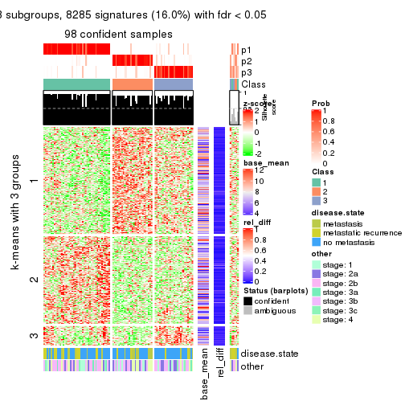</p>

</div>
<div id='tab-CV-pam-get-signatures-3'>
<pre><code class="r">get_signatures(res, k = 4)
</code></pre>

<p>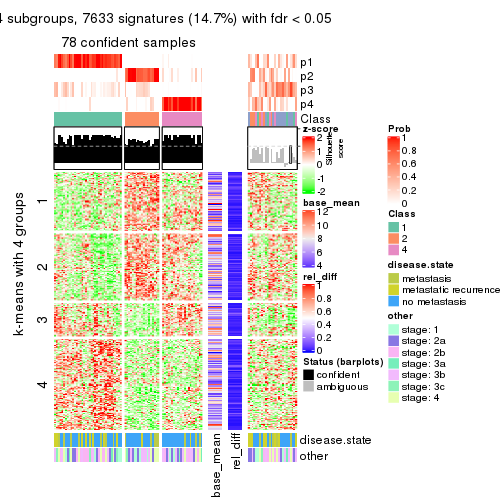</p>

</div>
<div id='tab-CV-pam-get-signatures-4'>
<pre><code class="r">get_signatures(res, k = 5)
</code></pre>

<p></p>

</div>
<div id='tab-CV-pam-get-signatures-5'>
<pre><code class="r">get_signatures(res, k = 6)
</code></pre>

<p></p>

</div>
</div>


Signature heatmaps where rows are not scaled:


<script>
$( function() {
	$( '#tabs-CV-pam-get-signatures-no-scale' ).tabs();
} );
</script>
<div id='tabs-CV-pam-get-signatures-no-scale'>
<ul>
<li><a href='#tab-CV-pam-get-signatures-no-scale-1'>k = 2</a></li>
<li><a href='#tab-CV-pam-get-signatures-no-scale-2'>k = 3</a></li>
<li><a href='#tab-CV-pam-get-signatures-no-scale-3'>k = 4</a></li>
<li><a href='#tab-CV-pam-get-signatures-no-scale-4'>k = 5</a></li>
<li><a href='#tab-CV-pam-get-signatures-no-scale-5'>k = 6</a></li>
</ul>
<div id='tab-CV-pam-get-signatures-no-scale-1'>
<pre><code class="r">get_signatures(res, k = 2, scale_rows = FALSE)
</code></pre>

<p></p>

</div>
<div id='tab-CV-pam-get-signatures-no-scale-2'>
<pre><code class="r">get_signatures(res, k = 3, scale_rows = FALSE)
</code></pre>

<p></p>

</div>
<div id='tab-CV-pam-get-signatures-no-scale-3'>
<pre><code class="r">get_signatures(res, k = 4, scale_rows = FALSE)
</code></pre>

<p></p>

</div>
<div id='tab-CV-pam-get-signatures-no-scale-4'>
<pre><code class="r">get_signatures(res, k = 5, scale_rows = FALSE)
</code></pre>

<p></p>

</div>
<div id='tab-CV-pam-get-signatures-no-scale-5'>
<pre><code class="r">get_signatures(res, k = 6, scale_rows = FALSE)
</code></pre>

<p></p>

</div>
</div>


Compare the overlap of signatures from different k:

```r
compare_signatures(res)
```


`get_signature()` returns a data frame invisibly. TO get the list of signatures, the function
call should be assigned to a variable explicitly. In following code, if `plot` argument is set
to `FALSE`, no heatmap is plotted while only the differential analysis is performed.

```r
# code only for demonstration
tb = get_signature(res, k = ..., plot = FALSE)
```

An example of the output of `tb` is:

```
#>   which_row         fdr    mean_1    mean_2 scaled_mean_1 scaled_mean_2 km
#> 1        38 0.042760348  8.373488  9.131774    -0.5533452     0.5164555  1
#> 2        40 0.018707592  7.106213  8.469186    -0.6173731     0.5762149  1
#> 3        55 0.019134737 10.221463 11.207825    -0.6159697     0.5749050  1
#> 4        59 0.006059896  5.921854  7.869574    -0.6899429     0.6439467  1
#> 5        60 0.018055526  8.928898 10.211722    -0.6204761     0.5791110  1
#> 6        98 0.009384629 15.714769 14.887706     0.6635654    -0.6193277  2
...
```

The columns in `tb` are:

1. `which_row`: row indices corresponding to the input matrix.
2. `fdr`: FDR for the differential test. 
3. `mean_x`: The mean value in group x.
4. `scaled_mean_x`: The mean value in group x after rows are scaled.
5. `km`: Row groups if k-means clustering is applied to rows.


UMAP plot which shows how samples are separated.


<script>
$( function() {
	$( '#tabs-CV-pam-dimension-reduction' ).tabs();
} );
</script>
<div id='tabs-CV-pam-dimension-reduction'>
<ul>
<li><a href='#tab-CV-pam-dimension-reduction-1'>k = 2</a></li>
<li><a href='#tab-CV-pam-dimension-reduction-2'>k = 3</a></li>
<li><a href='#tab-CV-pam-dimension-reduction-3'>k = 4</a></li>
<li><a href='#tab-CV-pam-dimension-reduction-4'>k = 5</a></li>
<li><a href='#tab-CV-pam-dimension-reduction-5'>k = 6</a></li>
</ul>
<div id='tab-CV-pam-dimension-reduction-1'>
<pre><code class="r">dimension_reduction(res, k = 2, method = &quot;UMAP&quot;)
</code></pre>

<p></p>

</div>
<div id='tab-CV-pam-dimension-reduction-2'>
<pre><code class="r">dimension_reduction(res, k = 3, method = &quot;UMAP&quot;)
</code></pre>

<p></p>

</div>
<div id='tab-CV-pam-dimension-reduction-3'>
<pre><code class="r">dimension_reduction(res, k = 4, method = &quot;UMAP&quot;)
</code></pre>

<p>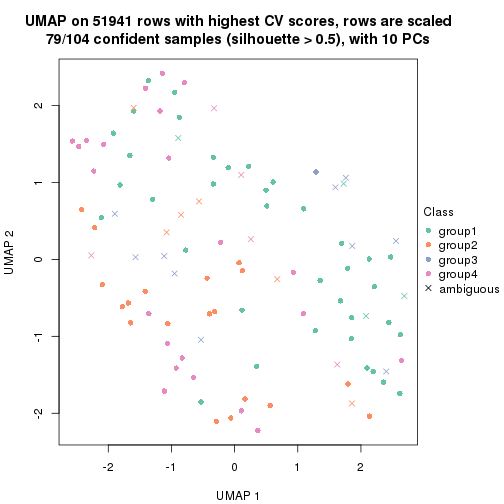</p>

</div>
<div id='tab-CV-pam-dimension-reduction-4'>
<pre><code class="r">dimension_reduction(res, k = 5, method = &quot;UMAP&quot;)
</code></pre>

<p></p>

</div>
<div id='tab-CV-pam-dimension-reduction-5'>
<pre><code class="r">dimension_reduction(res, k = 6, method = &quot;UMAP&quot;)
</code></pre>

<p></p>

</div>
</div>


Following heatmap shows how subgroups are split when increasing `k`:

```r
collect_classes(res)
```


Test correlation between subgroups and known annotations. If the known
annotation is numeric, one-way ANOVA test is applied, and if the known
annotation is discrete, chi-squared contingency table test is applied.

```r
test_to_known_factors(res)
```

```
#>          n disease.state(p) other(p) k
#> CV:pam 100           0.0385    0.477 2
#> CV:pam  98           0.2537    0.524 3
#> CV:pam  79           0.1188    0.593 4
#> CV:pam  73           0.3134    0.209 5
#> CV:pam  85           0.0470    0.191 6
```


If matrix rows can be associated to genes, consider to use `functional_enrichment(res,
...)` to perform function enrichment for the signature genes. See [this vignette](http://bioconductor.org/packages/devel/bioc/vignettes/cola/inst/doc/functional_enrichment.html) for more detailed explanations.


 

---------------------------------------------------


### CV:mclust


The object with results only for a single top-value method and a single partition method 
can be extracted as:

```r
res = res_list["CV", "mclust"]
# you can also extract it by
# res = res_list["CV:mclust"]
```

A summary of `res` and all the functions that can be applied to it:

```r
res
```

```
#> A 'ConsensusPartition' object with k = 2, 3, 4, 5, 6.
#>   On a matrix with 51941 rows and 104 columns.
#>   Top rows (1000, 2000, 3000, 4000, 5000) are extracted by 'CV' method.
#>   Subgroups are detected by 'mclust' method.
#>   Performed in total 1250 partitions by row resampling.
#>   Best k for subgroups seems to be 3.
#> 
#> Following methods can be applied to this 'ConsensusPartition' object:
#>  [1] "cola_report"             "collect_classes"         "collect_plots"          
#>  [4] "collect_stats"           "colnames"                "compare_signatures"     
#>  [7] "consensus_heatmap"       "dimension_reduction"     "functional_enrichment"  
#> [10] "get_anno_col"            "get_anno"                "get_classes"            
#> [13] "get_consensus"           "get_matrix"              "get_membership"         
#> [16] "get_param"               "get_signatures"          "get_stats"              
#> [19] "is_best_k"               "is_stable_k"             "membership_heatmap"     
#> [22] "ncol"                    "nrow"                    "plot_ecdf"              
#> [25] "rownames"                "select_partition_number" "show"                   
#> [28] "suggest_best_k"          "test_to_known_factors"
```

`collect_plots()` function collects all the plots made from `res` for all `k` (number of partitions)
into one single page to provide an easy and fast comparison between different `k`.

```r
collect_plots(res)
```


The plots are:

- The first row: a plot of the ECDF (empirical cumulative distribution
  function) curves of the consensus matrix for each `k` and the heatmap of
  predicted classes for each `k`.
- The second row: heatmaps of the consensus matrix for each `k`.
- The third row: heatmaps of the membership matrix for each `k`.
- The fouth row: heatmaps of the signatures for each `k`.

All the plots in panels can be made by individual functions and they are
plotted later in this section.

`select_partition_number()` produces several plots showing different
statistics for choosing "optimized" `k`. There are following statistics:

- ECDF curves of the consensus matrix for each `k`;
- 1-PAC. [The PAC
  score](https://en.wikipedia.org/wiki/Consensus_clustering#Over-interpretation_potential_of_consensus_clustering)
  measures the proportion of the ambiguous subgrouping.
- Mean silhouette score.
- Concordance. The mean probability of fiting the consensus class ids in all
  partitions.
- Area increased. Denote $A_k$ as the area under the ECDF curve for current
  `k`, the area increased is defined as $A_k - A_{k-1}$.
- Rand index. The percent of pairs of samples that are both in a same cluster
  or both are not in a same cluster in the partition of k and k-1.
- Jaccard index. The ratio of pairs of samples are both in a same cluster in
  the partition of k and k-1 and the pairs of samples are both in a same
  cluster in the partition k or k-1.

The detailed explanations of these statistics can be found in [the _cola_
vignette](http://bioconductor.org/packages/devel/bioc/vignettes/cola/inst/doc/cola.html#toc_13).

Generally speaking, lower PAC score, higher mean silhouette score or higher
concordance corresponds to better partition. Rand index and Jaccard index
measure how similar the current partition is compared to partition with `k-1`.
If they are too similar, we won't accept `k` is better than `k-1`.

```r
select_partition_number(res)
```


The numeric values for all these statistics can be obtained by `get_stats()`.

```r
get_stats(res)
```

```
#>   k 1-PAC mean_silhouette concordance area_increased  Rand Jaccard
#> 2 2 0.896           0.923       0.962          0.316 0.675   0.675
#> 3 3 0.262           0.393       0.733          0.719 0.795   0.708
#> 4 4 0.316           0.334       0.650          0.241 0.659   0.411
#> 5 5 0.427           0.369       0.628          0.109 0.851   0.554
#> 6 6 0.519           0.445       0.659          0.053 0.912   0.649
```

`suggest_best_k()` suggests the best $k$ based on these statistics. The rules are as follows:

- All $k$ with Jaccard index larger than 0.95 are removed because increasing
  $k$ does not provide enough extra information. If all $k$ are removed, it is
  marked as no subgroup is detected.
- For all $k$ with 1-PAC score larger than 0.9, the maximal $k$ is taken as
  the best $k$, and other $k$ are marked as optional $k$.
- If it does not fit the second rule. The $k$ with the maximal vote of the
  highest 1-PAC score, highest mean silhouette, and highest concordance is
  taken as the best $k$.

```r
suggest_best_k(res)
```

```
#> [1] 3
```


Following shows the table of the partitions (You need to click the **show/hide
code output** link to see it). The membership matrix (columns with name `p*`)
is inferred by
[`clue::cl_consensus()`](https://www.rdocumentation.org/link/cl_consensus?package=clue)
function with the `SE` method. Basically the value in the membership matrix
represents the probability to belong to a certain group. The finall class
label for an item is determined with the group with highest probability it
belongs to.

In `get_classes()` function, the entropy is calculated from the membership
matrix and the silhouette score is calculated from the consensus matrix.


<script>
$( function() {
	$( '#tabs-CV-mclust-get-classes' ).tabs();
} );
</script>
<div id='tabs-CV-mclust-get-classes'>
<ul>
<li><a href='#tab-CV-mclust-get-classes-1'>k = 2</a></li>
<li><a href='#tab-CV-mclust-get-classes-2'>k = 3</a></li>
<li><a href='#tab-CV-mclust-get-classes-3'>k = 4</a></li>
<li><a href='#tab-CV-mclust-get-classes-4'>k = 5</a></li>
<li><a href='#tab-CV-mclust-get-classes-5'>k = 6</a></li>
</ul>

<div id='tab-CV-mclust-get-classes-1'>
<p><a id='tab-CV-mclust-get-classes-1-a' style='color:#0366d6' href='#'>show/hide code output</a></p>
<pre><code class="r">cbind(get_classes(res, k = 2), get_membership(res, k = 2))
</code></pre>

<pre><code>#&gt;           class entropy silhouette    p1    p2
#&gt; GSM537341     2  0.0000      0.977 0.000 1.000
#&gt; GSM537345     1  0.1633      0.904 0.976 0.024
#&gt; GSM537355     2  0.0376      0.974 0.004 0.996
#&gt; GSM537366     2  0.0672      0.970 0.008 0.992
#&gt; GSM537370     2  0.0000      0.977 0.000 1.000
#&gt; GSM537380     2  0.1414      0.960 0.020 0.980
#&gt; GSM537392     2  0.1414      0.960 0.020 0.980
#&gt; GSM537415     2  0.0000      0.977 0.000 1.000
#&gt; GSM537417     2  0.0000      0.977 0.000 1.000
#&gt; GSM537422     2  0.9522      0.312 0.372 0.628
#&gt; GSM537423     2  0.0000      0.977 0.000 1.000
#&gt; GSM537427     2  0.0000      0.977 0.000 1.000
#&gt; GSM537430     2  0.0000      0.977 0.000 1.000
#&gt; GSM537336     1  0.1633      0.904 0.976 0.024
#&gt; GSM537337     2  0.0000      0.977 0.000 1.000
#&gt; GSM537348     1  0.9732      0.475 0.596 0.404
#&gt; GSM537349     2  0.1414      0.960 0.020 0.980
#&gt; GSM537356     2  0.2043      0.946 0.032 0.968
#&gt; GSM537361     1  0.8555      0.706 0.720 0.280
#&gt; GSM537374     2  0.0000      0.977 0.000 1.000
#&gt; GSM537377     1  0.1633      0.904 0.976 0.024
#&gt; GSM537378     2  0.0000      0.977 0.000 1.000
#&gt; GSM537379     2  0.0000      0.977 0.000 1.000
#&gt; GSM537383     2  0.0000      0.977 0.000 1.000
#&gt; GSM537388     2  0.1414      0.960 0.020 0.980
#&gt; GSM537395     2  0.0000      0.977 0.000 1.000
#&gt; GSM537400     2  0.0000      0.977 0.000 1.000
#&gt; GSM537404     2  0.0000      0.977 0.000 1.000
#&gt; GSM537409     2  0.0000      0.977 0.000 1.000
#&gt; GSM537418     2  0.7745      0.656 0.228 0.772
#&gt; GSM537425     2  0.9491      0.325 0.368 0.632
#&gt; GSM537333     2  0.0000      0.977 0.000 1.000
#&gt; GSM537342     2  0.0000      0.977 0.000 1.000
#&gt; GSM537347     2  0.0000      0.977 0.000 1.000
#&gt; GSM537350     2  0.4298      0.878 0.088 0.912
#&gt; GSM537362     2  0.0376      0.974 0.004 0.996
#&gt; GSM537363     2  0.9608      0.274 0.384 0.616
#&gt; GSM537368     1  0.1633      0.904 0.976 0.024
#&gt; GSM537376     2  0.0000      0.977 0.000 1.000
#&gt; GSM537381     1  0.1633      0.904 0.976 0.024
#&gt; GSM537386     2  0.1414      0.960 0.020 0.980
#&gt; GSM537398     1  0.8016      0.760 0.756 0.244
#&gt; GSM537402     2  0.0000      0.977 0.000 1.000
#&gt; GSM537405     1  0.3431      0.888 0.936 0.064
#&gt; GSM537371     1  0.1633      0.904 0.976 0.024
#&gt; GSM537421     2  0.0000      0.977 0.000 1.000
#&gt; GSM537424     1  0.9393      0.581 0.644 0.356
#&gt; GSM537432     2  0.0000      0.977 0.000 1.000
#&gt; GSM537331     2  0.0000      0.977 0.000 1.000
#&gt; GSM537332     2  0.0000      0.977 0.000 1.000
#&gt; GSM537334     2  0.0000      0.977 0.000 1.000
#&gt; GSM537338     2  0.0376      0.974 0.004 0.996
#&gt; GSM537353     2  0.0000      0.977 0.000 1.000
#&gt; GSM537357     1  0.1633      0.904 0.976 0.024
#&gt; GSM537358     2  0.0000      0.977 0.000 1.000
#&gt; GSM537375     2  0.0000      0.977 0.000 1.000
#&gt; GSM537389     2  0.1414      0.960 0.020 0.980
#&gt; GSM537390     2  0.0000      0.977 0.000 1.000
#&gt; GSM537393     2  0.0000      0.977 0.000 1.000
#&gt; GSM537399     2  0.0000      0.977 0.000 1.000
#&gt; GSM537407     2  0.0000      0.977 0.000 1.000
#&gt; GSM537408     2  0.0000      0.977 0.000 1.000
#&gt; GSM537428     2  0.0376      0.974 0.004 0.996
#&gt; GSM537354     2  0.0000      0.977 0.000 1.000
#&gt; GSM537410     2  0.0000      0.977 0.000 1.000
#&gt; GSM537413     2  0.0000      0.977 0.000 1.000
#&gt; GSM537396     2  0.0000      0.977 0.000 1.000
#&gt; GSM537397     2  0.0000      0.977 0.000 1.000
#&gt; GSM537330     2  0.0000      0.977 0.000 1.000
#&gt; GSM537369     1  0.1633      0.904 0.976 0.024
#&gt; GSM537373     2  0.0000      0.977 0.000 1.000
#&gt; GSM537401     2  0.0000      0.977 0.000 1.000
#&gt; GSM537343     2  0.0672      0.970 0.008 0.992
#&gt; GSM537367     2  0.0000      0.977 0.000 1.000
#&gt; GSM537382     2  0.0000      0.977 0.000 1.000
#&gt; GSM537385     2  0.1414      0.960 0.020 0.980
#&gt; GSM537391     1  0.7139      0.792 0.804 0.196
#&gt; GSM537419     2  0.0000      0.977 0.000 1.000
#&gt; GSM537420     1  0.1633      0.904 0.976 0.024
#&gt; GSM537429     2  0.0000      0.977 0.000 1.000
#&gt; GSM537431     2  0.0000      0.977 0.000 1.000
#&gt; GSM537387     1  0.1633      0.904 0.976 0.024
#&gt; GSM537414     2  0.0000      0.977 0.000 1.000
#&gt; GSM537433     2  0.0000      0.977 0.000 1.000
#&gt; GSM537335     2  0.0000      0.977 0.000 1.000
#&gt; GSM537339     2  0.0000      0.977 0.000 1.000
#&gt; GSM537340     2  0.0000      0.977 0.000 1.000
#&gt; GSM537344     1  0.1633      0.904 0.976 0.024
#&gt; GSM537346     2  0.0376      0.974 0.004 0.996
#&gt; GSM537351     1  0.1633      0.904 0.976 0.024
#&gt; GSM537352     2  0.0000      0.977 0.000 1.000
#&gt; GSM537359     2  0.0000      0.977 0.000 1.000
#&gt; GSM537360     2  0.0000      0.977 0.000 1.000
#&gt; GSM537364     1  0.1633      0.904 0.976 0.024
#&gt; GSM537365     2  0.0000      0.977 0.000 1.000
#&gt; GSM537372     1  0.8081      0.754 0.752 0.248
#&gt; GSM537384     1  0.7299      0.796 0.796 0.204
#&gt; GSM537394     2  0.0000      0.977 0.000 1.000
#&gt; GSM537403     2  0.0000      0.977 0.000 1.000
#&gt; GSM537406     2  0.0000      0.977 0.000 1.000
#&gt; GSM537411     2  0.0000      0.977 0.000 1.000
#&gt; GSM537412     2  0.0000      0.977 0.000 1.000
#&gt; GSM537416     2  0.0000      0.977 0.000 1.000
#&gt; GSM537426     2  0.0000      0.977 0.000 1.000
</code></pre>

<script>
$('#tab-CV-mclust-get-classes-1-a').parent().next().next().hide();
$('#tab-CV-mclust-get-classes-1-a').click(function(){
  $('#tab-CV-mclust-get-classes-1-a').parent().next().next().toggle();
  return(false);
});
</script>
</div>

<div id='tab-CV-mclust-get-classes-2'>
<p><a id='tab-CV-mclust-get-classes-2-a' style='color:#0366d6' href='#'>show/hide code output</a></p>
<pre><code class="r">cbind(get_classes(res, k = 3), get_membership(res, k = 3))
</code></pre>

<pre><code>#&gt;           class entropy silhouette    p1    p2    p3
#&gt; GSM537341     3  0.9964   0.557151 0.336 0.296 0.368
#&gt; GSM537345     1  0.3459   0.708038 0.892 0.012 0.096
#&gt; GSM537355     2  0.5623   0.424161 0.004 0.716 0.280
#&gt; GSM537366     2  0.8665  -0.096967 0.412 0.484 0.104
#&gt; GSM537370     2  0.9591  -0.355895 0.232 0.472 0.296
#&gt; GSM537380     2  0.6235   0.058984 0.000 0.564 0.436
#&gt; GSM537392     2  0.6274  -0.002736 0.000 0.544 0.456
#&gt; GSM537415     2  0.0424   0.596398 0.000 0.992 0.008
#&gt; GSM537417     2  0.7228   0.361764 0.188 0.708 0.104
#&gt; GSM537422     1  0.8779  -0.004820 0.472 0.416 0.112
#&gt; GSM537423     2  0.3551   0.537618 0.000 0.868 0.132
#&gt; GSM537427     2  0.6647   0.062271 0.012 0.592 0.396
#&gt; GSM537430     2  0.4629   0.467394 0.004 0.808 0.188
#&gt; GSM537336     1  0.0661   0.728517 0.988 0.008 0.004
#&gt; GSM537337     2  0.6836   0.086653 0.016 0.572 0.412
#&gt; GSM537348     1  0.7234   0.551336 0.640 0.048 0.312
#&gt; GSM537349     2  0.6079   0.192796 0.000 0.612 0.388
#&gt; GSM537356     1  0.8068   0.073561 0.596 0.316 0.088
#&gt; GSM537361     1  0.7945   0.414874 0.652 0.224 0.124
#&gt; GSM537374     2  0.8202  -0.174476 0.080 0.544 0.376
#&gt; GSM537377     1  0.3539   0.708798 0.888 0.012 0.100
#&gt; GSM537378     2  0.3116   0.554338 0.000 0.892 0.108
#&gt; GSM537379     2  0.5816   0.447674 0.156 0.788 0.056
#&gt; GSM537383     2  0.5216   0.370790 0.000 0.740 0.260
#&gt; GSM537388     2  0.6682  -0.097735 0.008 0.504 0.488
#&gt; GSM537395     2  0.3349   0.570103 0.004 0.888 0.108
#&gt; GSM537400     2  0.7918   0.222917 0.256 0.640 0.104
#&gt; GSM537404     2  0.2846   0.580649 0.020 0.924 0.056
#&gt; GSM537409     2  0.2486   0.581722 0.008 0.932 0.060
#&gt; GSM537418     1  0.6067   0.424512 0.736 0.236 0.028
#&gt; GSM537425     1  0.8515  -0.010727 0.476 0.432 0.092
#&gt; GSM537333     2  0.7814   0.249218 0.244 0.652 0.104
#&gt; GSM537342     2  0.1525   0.594913 0.032 0.964 0.004
#&gt; GSM537347     2  0.6388   0.472734 0.064 0.752 0.184
#&gt; GSM537350     1  0.7665   0.264357 0.648 0.268 0.084
#&gt; GSM537362     2  0.8543  -0.206260 0.408 0.496 0.096
#&gt; GSM537363     1  0.8126   0.170802 0.564 0.356 0.080
#&gt; GSM537368     1  0.0829   0.729698 0.984 0.012 0.004
#&gt; GSM537376     2  0.0983   0.595243 0.004 0.980 0.016
#&gt; GSM537381     1  0.0829   0.729698 0.984 0.012 0.004
#&gt; GSM537386     2  0.5926   0.262557 0.000 0.644 0.356
#&gt; GSM537398     1  0.6062   0.638061 0.708 0.016 0.276
#&gt; GSM537402     2  0.3267   0.547678 0.000 0.884 0.116
#&gt; GSM537405     1  0.2187   0.725024 0.948 0.024 0.028
#&gt; GSM537371     1  0.0661   0.728517 0.988 0.008 0.004
#&gt; GSM537421     2  0.2810   0.583701 0.036 0.928 0.036
#&gt; GSM537424     1  0.6093   0.664529 0.776 0.068 0.156
#&gt; GSM537432     2  0.5627   0.415063 0.188 0.780 0.032
#&gt; GSM537331     3  0.9028   0.438990 0.132 0.432 0.436
#&gt; GSM537332     2  0.1163   0.591562 0.000 0.972 0.028
#&gt; GSM537334     3  0.9203   0.537528 0.156 0.368 0.476
#&gt; GSM537338     3  0.8602   0.420407 0.100 0.408 0.492
#&gt; GSM537353     2  0.0237   0.595895 0.000 0.996 0.004
#&gt; GSM537357     1  0.0424   0.729010 0.992 0.008 0.000
#&gt; GSM537358     2  0.2878   0.564139 0.000 0.904 0.096
#&gt; GSM537375     2  0.6490   0.431489 0.036 0.708 0.256
#&gt; GSM537389     2  0.6079   0.192796 0.000 0.612 0.388
#&gt; GSM537390     2  0.0424   0.594654 0.000 0.992 0.008
#&gt; GSM537393     2  0.2550   0.593680 0.012 0.932 0.056
#&gt; GSM537399     2  0.9267  -0.159617 0.316 0.504 0.180
#&gt; GSM537407     2  0.8318   0.000942 0.392 0.524 0.084
#&gt; GSM537408     2  0.4316   0.566981 0.044 0.868 0.088
#&gt; GSM537428     2  0.7029  -0.011161 0.020 0.540 0.440
#&gt; GSM537354     2  0.6387   0.373172 0.020 0.680 0.300
#&gt; GSM537410     2  0.1765   0.586612 0.004 0.956 0.040
#&gt; GSM537413     2  0.1163   0.593694 0.000 0.972 0.028
#&gt; GSM537396     2  0.9606  -0.285667 0.288 0.472 0.240
#&gt; GSM537397     1  0.9811  -0.539359 0.380 0.240 0.380
#&gt; GSM537330     2  0.3349   0.569352 0.004 0.888 0.108
#&gt; GSM537369     1  0.1877   0.730466 0.956 0.012 0.032
#&gt; GSM537373     2  0.5519   0.502822 0.120 0.812 0.068
#&gt; GSM537401     2  0.9941  -0.517976 0.292 0.384 0.324
#&gt; GSM537343     2  0.8460  -0.086569 0.440 0.472 0.088
#&gt; GSM537367     2  0.8347  -0.015783 0.404 0.512 0.084
#&gt; GSM537382     2  0.2063   0.594582 0.008 0.948 0.044
#&gt; GSM537385     2  0.6244   0.046227 0.000 0.560 0.440
#&gt; GSM537391     1  0.6195   0.610857 0.704 0.020 0.276
#&gt; GSM537419     2  0.3340   0.546031 0.000 0.880 0.120
#&gt; GSM537420     1  0.1751   0.730537 0.960 0.012 0.028
#&gt; GSM537429     2  0.7975   0.312266 0.160 0.660 0.180
#&gt; GSM537431     2  0.7557   0.255813 0.264 0.656 0.080
#&gt; GSM537387     1  0.4692   0.688043 0.820 0.012 0.168
#&gt; GSM537414     2  0.8229   0.197770 0.256 0.620 0.124
#&gt; GSM537433     2  0.8175   0.097740 0.336 0.576 0.088
#&gt; GSM537335     3  0.9833   0.590224 0.300 0.276 0.424
#&gt; GSM537339     3  0.8852   0.074571 0.396 0.120 0.484
#&gt; GSM537340     2  0.5961   0.466781 0.136 0.788 0.076
#&gt; GSM537344     1  0.1015   0.730902 0.980 0.012 0.008
#&gt; GSM537346     2  0.4002   0.523230 0.000 0.840 0.160
#&gt; GSM537351     1  0.2116   0.719748 0.948 0.012 0.040
#&gt; GSM537352     2  0.6051   0.372840 0.012 0.696 0.292
#&gt; GSM537359     2  0.5891   0.452056 0.036 0.764 0.200
#&gt; GSM537360     2  0.0000   0.595530 0.000 1.000 0.000
#&gt; GSM537364     1  0.0661   0.728517 0.988 0.008 0.004
#&gt; GSM537365     2  0.5295   0.460128 0.156 0.808 0.036
#&gt; GSM537372     1  0.5852   0.680552 0.776 0.044 0.180
#&gt; GSM537384     1  0.5574   0.684780 0.784 0.032 0.184
#&gt; GSM537394     2  0.1289   0.594362 0.000 0.968 0.032
#&gt; GSM537403     2  0.2680   0.577226 0.008 0.924 0.068
#&gt; GSM537406     2  0.3589   0.576561 0.048 0.900 0.052
#&gt; GSM537411     2  0.3851   0.526558 0.004 0.860 0.136
#&gt; GSM537412     2  0.1878   0.584870 0.004 0.952 0.044
#&gt; GSM537416     2  0.2902   0.577763 0.016 0.920 0.064
#&gt; GSM537426     2  0.0000   0.595530 0.000 1.000 0.000
</code></pre>

<script>
$('#tab-CV-mclust-get-classes-2-a').parent().next().next().hide();
$('#tab-CV-mclust-get-classes-2-a').click(function(){
  $('#tab-CV-mclust-get-classes-2-a').parent().next().next().toggle();
  return(false);
});
</script>
</div>

<div id='tab-CV-mclust-get-classes-3'>
<p><a id='tab-CV-mclust-get-classes-3-a' style='color:#0366d6' href='#'>show/hide code output</a></p>
<pre><code class="r">cbind(get_classes(res, k = 4), get_membership(res, k = 4))
</code></pre>

<pre><code>#&gt;           class entropy silhouette    p1    p2    p3    p4
#&gt; GSM537341     1  0.7005     0.4155 0.680 0.136 0.104 0.080
#&gt; GSM537345     3  0.5203     0.6595 0.348 0.000 0.636 0.016
#&gt; GSM537355     4  0.5404     0.2815 0.000 0.476 0.012 0.512
#&gt; GSM537366     1  0.4340     0.4809 0.836 0.044 0.024 0.096
#&gt; GSM537370     2  0.8236     0.0396 0.368 0.456 0.056 0.120
#&gt; GSM537380     2  0.4604     0.4978 0.004 0.784 0.176 0.036
#&gt; GSM537392     2  0.4604     0.4978 0.004 0.784 0.176 0.036
#&gt; GSM537415     2  0.1909     0.5757 0.004 0.940 0.008 0.048
#&gt; GSM537417     4  0.6923     0.4792 0.052 0.340 0.036 0.572
#&gt; GSM537422     4  0.7646     0.2148 0.308 0.100 0.044 0.548
#&gt; GSM537423     2  0.0895     0.5857 0.000 0.976 0.020 0.004
#&gt; GSM537427     4  0.6021     0.1803 0.016 0.476 0.016 0.492
#&gt; GSM537430     2  0.3450     0.4808 0.000 0.836 0.008 0.156
#&gt; GSM537336     3  0.4992     0.7879 0.476 0.000 0.524 0.000
#&gt; GSM537337     4  0.6044     0.3172 0.000 0.428 0.044 0.528
#&gt; GSM537348     1  0.4868     0.4177 0.748 0.000 0.212 0.040
#&gt; GSM537349     2  0.4561     0.4999 0.004 0.788 0.172 0.036
#&gt; GSM537356     1  0.2418     0.4431 0.928 0.032 0.024 0.016
#&gt; GSM537361     1  0.6656     0.2891 0.612 0.020 0.068 0.300
#&gt; GSM537374     4  0.7171     0.3681 0.040 0.252 0.092 0.616
#&gt; GSM537377     3  0.5453     0.6197 0.388 0.000 0.592 0.020
#&gt; GSM537378     2  0.0804     0.5844 0.000 0.980 0.008 0.012
#&gt; GSM537379     4  0.6388     0.4416 0.044 0.392 0.012 0.552
#&gt; GSM537383     2  0.2635     0.5660 0.000 0.904 0.076 0.020
#&gt; GSM537388     2  0.5452     0.4551 0.000 0.736 0.156 0.108
#&gt; GSM537395     2  0.5039    -0.1147 0.000 0.592 0.004 0.404
#&gt; GSM537400     4  0.7845     0.4407 0.180 0.212 0.040 0.568
#&gt; GSM537404     4  0.6417     0.3640 0.072 0.388 0.000 0.540
#&gt; GSM537409     2  0.4741     0.1536 0.004 0.668 0.000 0.328
#&gt; GSM537418     1  0.3981     0.4243 0.860 0.036 0.036 0.068
#&gt; GSM537425     1  0.6100     0.3749 0.640 0.048 0.012 0.300
#&gt; GSM537333     4  0.6948     0.4839 0.084 0.236 0.040 0.640
#&gt; GSM537342     2  0.6007    -0.1365 0.044 0.548 0.000 0.408
#&gt; GSM537347     4  0.5685     0.3404 0.024 0.460 0.000 0.516
#&gt; GSM537350     1  0.2553     0.4474 0.916 0.060 0.016 0.008
#&gt; GSM537362     4  0.8370     0.0449 0.344 0.088 0.096 0.472
#&gt; GSM537363     1  0.5715     0.3991 0.732 0.084 0.012 0.172
#&gt; GSM537368     1  0.4866    -0.5752 0.596 0.000 0.404 0.000
#&gt; GSM537376     2  0.4955    -0.1650 0.000 0.556 0.000 0.444
#&gt; GSM537381     1  0.4730    -0.4867 0.636 0.000 0.364 0.000
#&gt; GSM537386     2  0.4334     0.5124 0.008 0.808 0.156 0.028
#&gt; GSM537398     1  0.6058     0.2799 0.624 0.000 0.308 0.068
#&gt; GSM537402     2  0.3401     0.4813 0.008 0.840 0.000 0.152
#&gt; GSM537405     1  0.4008     0.1717 0.820 0.000 0.148 0.032
#&gt; GSM537371     3  0.5158     0.7891 0.472 0.000 0.524 0.004
#&gt; GSM537421     4  0.6054     0.3570 0.028 0.444 0.008 0.520
#&gt; GSM537424     1  0.4887     0.3802 0.756 0.004 0.204 0.036
#&gt; GSM537432     4  0.6995     0.4475 0.120 0.324 0.004 0.552
#&gt; GSM537331     4  0.8111     0.1628 0.076 0.396 0.080 0.448
#&gt; GSM537332     2  0.2589     0.5307 0.000 0.884 0.000 0.116
#&gt; GSM537334     4  0.7705     0.3851 0.092 0.208 0.092 0.608
#&gt; GSM537338     4  0.7371     0.3695 0.060 0.236 0.088 0.616
#&gt; GSM537353     2  0.4872     0.0107 0.004 0.640 0.000 0.356
#&gt; GSM537357     3  0.4992     0.7879 0.476 0.000 0.524 0.000
#&gt; GSM537358     2  0.0188     0.5857 0.000 0.996 0.004 0.000
#&gt; GSM537375     4  0.5984     0.3867 0.008 0.404 0.028 0.560
#&gt; GSM537389     2  0.4604     0.4978 0.004 0.784 0.176 0.036
#&gt; GSM537390     2  0.1474     0.5706 0.000 0.948 0.000 0.052
#&gt; GSM537393     4  0.5508     0.2944 0.016 0.476 0.000 0.508
#&gt; GSM537399     1  0.5009     0.3864 0.700 0.280 0.016 0.004
#&gt; GSM537407     1  0.6127     0.4287 0.692 0.148 0.004 0.156
#&gt; GSM537408     2  0.2732     0.5568 0.076 0.904 0.008 0.012
#&gt; GSM537428     2  0.5696    -0.2795 0.000 0.496 0.024 0.480
#&gt; GSM537354     4  0.6333     0.3546 0.004 0.416 0.052 0.528
#&gt; GSM537410     2  0.4136     0.4494 0.016 0.788 0.000 0.196
#&gt; GSM537413     2  0.0376     0.5859 0.004 0.992 0.000 0.004
#&gt; GSM537396     2  0.5097     0.1654 0.428 0.568 0.000 0.004
#&gt; GSM537397     1  0.5971     0.4474 0.740 0.088 0.136 0.036
#&gt; GSM537330     2  0.4564     0.1397 0.000 0.672 0.000 0.328
#&gt; GSM537369     1  0.4905    -0.5150 0.632 0.000 0.364 0.004
#&gt; GSM537373     2  0.6506     0.0246 0.456 0.472 0.000 0.072
#&gt; GSM537401     1  0.7526     0.3888 0.636 0.164 0.112 0.088
#&gt; GSM537343     1  0.5754     0.4536 0.760 0.104 0.040 0.096
#&gt; GSM537367     1  0.7049     0.3411 0.548 0.152 0.000 0.300
#&gt; GSM537382     2  0.5288    -0.2645 0.008 0.520 0.000 0.472
#&gt; GSM537385     2  0.4604     0.4978 0.004 0.784 0.176 0.036
#&gt; GSM537391     1  0.5546     0.3479 0.664 0.000 0.292 0.044
#&gt; GSM537419     2  0.0657     0.5863 0.004 0.984 0.012 0.000
#&gt; GSM537420     1  0.4428    -0.2543 0.720 0.000 0.276 0.004
#&gt; GSM537429     2  0.6658    -0.3383 0.084 0.472 0.000 0.444
#&gt; GSM537431     4  0.7994     0.3241 0.284 0.264 0.008 0.444
#&gt; GSM537387     3  0.5512     0.3122 0.492 0.000 0.492 0.016
#&gt; GSM537414     4  0.7611     0.4772 0.128 0.252 0.040 0.580
#&gt; GSM537433     1  0.6846     0.3791 0.600 0.184 0.000 0.216
#&gt; GSM537335     4  0.8204     0.3814 0.156 0.112 0.152 0.580
#&gt; GSM537339     1  0.5542     0.4123 0.716 0.004 0.216 0.064
#&gt; GSM537340     4  0.7145     0.4450 0.100 0.332 0.016 0.552
#&gt; GSM537344     1  0.4964    -0.5326 0.616 0.000 0.380 0.004
#&gt; GSM537346     2  0.4331     0.2787 0.000 0.712 0.000 0.288
#&gt; GSM537351     3  0.5861     0.7257 0.480 0.000 0.488 0.032
#&gt; GSM537352     4  0.5938     0.2682 0.000 0.476 0.036 0.488
#&gt; GSM537359     2  0.2990     0.5687 0.044 0.904 0.016 0.036
#&gt; GSM537360     2  0.3982     0.3651 0.004 0.776 0.000 0.220
#&gt; GSM537364     3  0.5158     0.7891 0.472 0.000 0.524 0.004
#&gt; GSM537365     2  0.7849    -0.1529 0.352 0.380 0.000 0.268
#&gt; GSM537372     1  0.3232     0.4217 0.872 0.004 0.108 0.016
#&gt; GSM537384     1  0.3836     0.4049 0.816 0.000 0.168 0.016
#&gt; GSM537394     2  0.0779     0.5852 0.004 0.980 0.000 0.016
#&gt; GSM537403     4  0.5165     0.3184 0.004 0.484 0.000 0.512
#&gt; GSM537406     2  0.2684     0.5686 0.060 0.912 0.016 0.012
#&gt; GSM537411     2  0.4040     0.3122 0.000 0.752 0.000 0.248
#&gt; GSM537412     2  0.3768     0.4442 0.008 0.808 0.000 0.184
#&gt; GSM537416     4  0.5648     0.3752 0.012 0.428 0.008 0.552
#&gt; GSM537426     2  0.1716     0.5637 0.000 0.936 0.000 0.064
</code></pre>

<script>
$('#tab-CV-mclust-get-classes-3-a').parent().next().next().hide();
$('#tab-CV-mclust-get-classes-3-a').click(function(){
  $('#tab-CV-mclust-get-classes-3-a').parent().next().next().toggle();
  return(false);
});
</script>
</div>

<div id='tab-CV-mclust-get-classes-4'>
<p><a id='tab-CV-mclust-get-classes-4-a' style='color:#0366d6' href='#'>show/hide code output</a></p>
<pre><code class="r">cbind(get_classes(res, k = 5), get_membership(res, k = 5))
</code></pre>

<pre><code>#&gt;           class entropy silhouette    p1    p2    p3    p4    p5
#&gt; GSM537341     5  0.5720     0.5790 0.060 0.144 0.032 0.040 0.724
#&gt; GSM537345     1  0.6280    -0.0140 0.532 0.000 0.056 0.048 0.364
#&gt; GSM537355     4  0.5752     0.6110 0.000 0.240 0.148 0.612 0.000
#&gt; GSM537366     1  0.7014     0.1480 0.404 0.020 0.192 0.000 0.384
#&gt; GSM537370     5  0.8354     0.2385 0.048 0.300 0.076 0.144 0.432
#&gt; GSM537380     2  0.2780     0.5862 0.000 0.896 0.032 0.040 0.032
#&gt; GSM537392     2  0.2780     0.5862 0.000 0.896 0.032 0.040 0.032
#&gt; GSM537415     2  0.3840     0.5456 0.000 0.772 0.208 0.012 0.008
#&gt; GSM537417     3  0.6383     0.0246 0.012 0.116 0.532 0.336 0.004
#&gt; GSM537422     3  0.4817     0.4138 0.044 0.084 0.780 0.088 0.004
#&gt; GSM537423     2  0.0671     0.6081 0.000 0.980 0.000 0.016 0.004
#&gt; GSM537427     4  0.4152     0.5802 0.000 0.296 0.000 0.692 0.012
#&gt; GSM537430     2  0.3607     0.4431 0.000 0.752 0.004 0.244 0.000
#&gt; GSM537336     1  0.0162     0.6162 0.996 0.000 0.004 0.000 0.000
#&gt; GSM537337     4  0.4343     0.6752 0.000 0.176 0.044 0.768 0.012
#&gt; GSM537348     5  0.2011     0.6534 0.088 0.000 0.000 0.004 0.908
#&gt; GSM537349     2  0.2617     0.5877 0.000 0.904 0.028 0.036 0.032
#&gt; GSM537356     5  0.6587    -0.1952 0.412 0.012 0.144 0.000 0.432
#&gt; GSM537361     3  0.6387    -0.1906 0.380 0.000 0.492 0.016 0.112
#&gt; GSM537374     4  0.3641     0.6431 0.000 0.120 0.000 0.820 0.060
#&gt; GSM537377     1  0.6344    -0.0243 0.524 0.000 0.060 0.048 0.368
#&gt; GSM537378     2  0.1282     0.6024 0.000 0.952 0.000 0.044 0.004
#&gt; GSM537379     4  0.6922     0.4058 0.004 0.280 0.268 0.444 0.004
#&gt; GSM537383     2  0.1869     0.5983 0.000 0.936 0.016 0.036 0.012
#&gt; GSM537388     2  0.4443     0.4286 0.000 0.724 0.028 0.240 0.008
#&gt; GSM537395     2  0.5114    -0.2311 0.000 0.492 0.036 0.472 0.000
#&gt; GSM537400     3  0.5183     0.3856 0.016 0.156 0.728 0.096 0.004
#&gt; GSM537404     3  0.6826     0.3493 0.008 0.132 0.608 0.188 0.064
#&gt; GSM537409     2  0.6041     0.2559 0.000 0.516 0.356 0.128 0.000
#&gt; GSM537418     1  0.6887     0.2719 0.432 0.008 0.320 0.000 0.240
#&gt; GSM537425     3  0.7470    -0.1957 0.360 0.052 0.400 0.000 0.188
#&gt; GSM537333     3  0.5649     0.3306 0.016 0.212 0.672 0.096 0.004
#&gt; GSM537342     3  0.8087     0.0307 0.036 0.284 0.372 0.280 0.028
#&gt; GSM537347     4  0.6688     0.4538 0.008 0.268 0.228 0.496 0.000
#&gt; GSM537350     1  0.5847     0.1421 0.488 0.012 0.064 0.000 0.436
#&gt; GSM537362     3  0.8442     0.2290 0.088 0.232 0.472 0.148 0.060
#&gt; GSM537363     1  0.7570     0.2523 0.416 0.044 0.324 0.004 0.212
#&gt; GSM537368     1  0.1628     0.6225 0.936 0.000 0.008 0.000 0.056
#&gt; GSM537376     2  0.6968    -0.2967 0.000 0.380 0.252 0.360 0.008
#&gt; GSM537381     1  0.2561     0.6161 0.884 0.000 0.020 0.000 0.096
#&gt; GSM537386     2  0.1788     0.6115 0.000 0.932 0.056 0.004 0.008
#&gt; GSM537398     5  0.3757     0.5936 0.156 0.000 0.024 0.012 0.808
#&gt; GSM537402     2  0.4157     0.3609 0.000 0.716 0.020 0.264 0.000
#&gt; GSM537405     1  0.6062     0.3859 0.564 0.000 0.168 0.000 0.268
#&gt; GSM537371     1  0.0162     0.6162 0.996 0.000 0.004 0.000 0.000
#&gt; GSM537421     3  0.7167    -0.1432 0.008 0.296 0.372 0.320 0.004
#&gt; GSM537424     5  0.2956     0.6411 0.140 0.004 0.000 0.008 0.848
#&gt; GSM537432     3  0.6875     0.1919 0.024 0.284 0.504 0.188 0.000
#&gt; GSM537331     4  0.3897     0.5232 0.012 0.104 0.000 0.820 0.064
#&gt; GSM537332     2  0.5594     0.4353 0.000 0.608 0.284 0.108 0.000
#&gt; GSM537334     4  0.2275     0.5706 0.012 0.012 0.000 0.912 0.064
#&gt; GSM537338     4  0.2037     0.5739 0.004 0.012 0.000 0.920 0.064
#&gt; GSM537353     2  0.6605     0.0512 0.000 0.492 0.184 0.316 0.008
#&gt; GSM537357     1  0.0324     0.6139 0.992 0.000 0.004 0.004 0.000
#&gt; GSM537358     2  0.1915     0.6115 0.000 0.928 0.040 0.032 0.000
#&gt; GSM537375     4  0.5236     0.6607 0.004 0.184 0.120 0.692 0.000
#&gt; GSM537389     2  0.2701     0.5867 0.000 0.900 0.032 0.036 0.032
#&gt; GSM537390     2  0.2848     0.5796 0.000 0.840 0.156 0.004 0.000
#&gt; GSM537393     4  0.5941     0.5831 0.000 0.256 0.160 0.584 0.000
#&gt; GSM537399     5  0.8329     0.1820 0.208 0.216 0.132 0.012 0.432
#&gt; GSM537407     3  0.7583    -0.2333 0.364 0.052 0.368 0.000 0.216
#&gt; GSM537408     2  0.5423     0.4658 0.136 0.728 0.092 0.040 0.004
#&gt; GSM537428     4  0.4286     0.5392 0.000 0.340 0.004 0.652 0.004
#&gt; GSM537354     4  0.4852     0.6677 0.000 0.184 0.100 0.716 0.000
#&gt; GSM537410     2  0.6524     0.2751 0.012 0.488 0.356 0.144 0.000
#&gt; GSM537413     2  0.2020     0.6068 0.000 0.900 0.100 0.000 0.000
#&gt; GSM537396     2  0.8892     0.0162 0.184 0.428 0.152 0.056 0.180
#&gt; GSM537397     5  0.4169     0.6448 0.072 0.060 0.020 0.020 0.828
#&gt; GSM537330     2  0.6180    -0.1886 0.000 0.456 0.104 0.432 0.008
#&gt; GSM537369     1  0.2563     0.6045 0.872 0.000 0.008 0.000 0.120
#&gt; GSM537373     2  0.9337    -0.1574 0.156 0.328 0.240 0.064 0.212
#&gt; GSM537401     5  0.6506     0.5403 0.048 0.132 0.032 0.120 0.668
#&gt; GSM537343     1  0.7004     0.2895 0.456 0.016 0.272 0.000 0.256
#&gt; GSM537367     3  0.7422    -0.0970 0.328 0.064 0.448 0.000 0.160
#&gt; GSM537382     2  0.6714    -0.1961 0.004 0.448 0.220 0.328 0.000
#&gt; GSM537385     2  0.2780     0.5862 0.000 0.896 0.032 0.040 0.032
#&gt; GSM537391     5  0.2930     0.6164 0.164 0.000 0.000 0.004 0.832
#&gt; GSM537419     2  0.2853     0.5992 0.000 0.876 0.052 0.072 0.000
#&gt; GSM537420     1  0.3487     0.5428 0.780 0.000 0.008 0.000 0.212
#&gt; GSM537429     2  0.7884    -0.0762 0.024 0.484 0.100 0.284 0.108
#&gt; GSM537431     3  0.5332     0.4594 0.080 0.080 0.764 0.036 0.040
#&gt; GSM537387     5  0.4219     0.1980 0.416 0.000 0.000 0.000 0.584
#&gt; GSM537414     3  0.4764     0.3944 0.016 0.104 0.768 0.108 0.004
#&gt; GSM537433     3  0.7863    -0.1766 0.340 0.076 0.360 0.000 0.224
#&gt; GSM537335     4  0.3731     0.4788 0.032 0.012 0.004 0.828 0.124
#&gt; GSM537339     5  0.2917     0.6558 0.076 0.004 0.012 0.024 0.884
#&gt; GSM537340     3  0.6401     0.2513 0.020 0.172 0.584 0.224 0.000
#&gt; GSM537344     1  0.2358     0.6121 0.888 0.000 0.008 0.000 0.104
#&gt; GSM537346     2  0.6550     0.0358 0.000 0.456 0.156 0.380 0.008
#&gt; GSM537351     1  0.0451     0.6182 0.988 0.000 0.008 0.000 0.004
#&gt; GSM537352     4  0.4922     0.6497 0.000 0.256 0.056 0.684 0.004
#&gt; GSM537359     2  0.2805     0.6048 0.004 0.864 0.124 0.004 0.004
#&gt; GSM537360     2  0.5783     0.3424 0.000 0.612 0.228 0.160 0.000
#&gt; GSM537364     1  0.0162     0.6162 0.996 0.000 0.004 0.000 0.000
#&gt; GSM537365     3  0.7791     0.3138 0.096 0.164 0.536 0.024 0.180
#&gt; GSM537372     5  0.3132     0.5893 0.172 0.000 0.008 0.000 0.820
#&gt; GSM537384     5  0.2286     0.6508 0.108 0.000 0.004 0.000 0.888
#&gt; GSM537394     2  0.4624     0.5697 0.000 0.744 0.144 0.112 0.000
#&gt; GSM537403     4  0.6646     0.0850 0.000 0.224 0.380 0.396 0.000
#&gt; GSM537406     2  0.4802     0.4880 0.100 0.760 0.124 0.004 0.012
#&gt; GSM537411     2  0.4401     0.2730 0.000 0.656 0.016 0.328 0.000
#&gt; GSM537412     2  0.4820     0.3763 0.000 0.632 0.332 0.036 0.000
#&gt; GSM537416     3  0.6658     0.0340 0.004 0.208 0.460 0.328 0.000
#&gt; GSM537426     2  0.3280     0.5762 0.000 0.812 0.176 0.012 0.000
</code></pre>

<script>
$('#tab-CV-mclust-get-classes-4-a').parent().next().next().hide();
$('#tab-CV-mclust-get-classes-4-a').click(function(){
  $('#tab-CV-mclust-get-classes-4-a').parent().next().next().toggle();
  return(false);
});
</script>
</div>

<div id='tab-CV-mclust-get-classes-5'>
<p><a id='tab-CV-mclust-get-classes-5-a' style='color:#0366d6' href='#'>show/hide code output</a></p>
<pre><code class="r">cbind(get_classes(res, k = 6), get_membership(res, k = 6))
</code></pre>

<pre><code>#&gt;           class entropy silhouette    p1    p2    p3    p4    p5    p6
#&gt; GSM537341     5  0.3807     0.6963 0.000 0.028 0.228 0.000 0.740 0.004
#&gt; GSM537345     1  0.4979     0.1663 0.596 0.000 0.032 0.012 0.348 0.012
#&gt; GSM537355     6  0.5704     0.5804 0.000 0.300 0.008 0.124 0.008 0.560
#&gt; GSM537366     3  0.4816     0.4966 0.048 0.040 0.708 0.004 0.200 0.000
#&gt; GSM537370     5  0.6958     0.2622 0.000 0.188 0.264 0.016 0.476 0.056
#&gt; GSM537380     2  0.2528     0.5494 0.040 0.900 0.032 0.016 0.012 0.000
#&gt; GSM537392     2  0.2671     0.5502 0.040 0.896 0.032 0.016 0.012 0.004
#&gt; GSM537415     2  0.4409     0.4510 0.004 0.672 0.016 0.292 0.012 0.004
#&gt; GSM537417     4  0.4688     0.2991 0.000 0.036 0.012 0.612 0.000 0.340
#&gt; GSM537422     4  0.2732     0.4405 0.024 0.000 0.060 0.884 0.004 0.028
#&gt; GSM537423     2  0.0405     0.5813 0.000 0.988 0.000 0.008 0.000 0.004
#&gt; GSM537427     6  0.3500     0.6805 0.004 0.220 0.004 0.004 0.004 0.764
#&gt; GSM537430     2  0.4438     0.2248 0.000 0.636 0.012 0.016 0.004 0.332
#&gt; GSM537336     1  0.3534     0.7799 0.740 0.000 0.244 0.000 0.016 0.000
#&gt; GSM537337     6  0.3953     0.6857 0.000 0.180 0.008 0.036 0.008 0.768
#&gt; GSM537348     5  0.1411     0.7961 0.004 0.000 0.060 0.000 0.936 0.000
#&gt; GSM537349     2  0.2239     0.5555 0.040 0.912 0.028 0.016 0.004 0.000
#&gt; GSM537356     3  0.4867     0.4178 0.068 0.016 0.660 0.000 0.256 0.000
#&gt; GSM537361     4  0.5890    -0.3258 0.128 0.000 0.416 0.440 0.016 0.000
#&gt; GSM537374     6  0.3073     0.6583 0.020 0.140 0.004 0.000 0.004 0.832
#&gt; GSM537377     1  0.5597     0.1145 0.556 0.000 0.032 0.048 0.352 0.012
#&gt; GSM537378     2  0.1880     0.5809 0.004 0.932 0.004 0.020 0.008 0.032
#&gt; GSM537379     6  0.6141     0.3152 0.000 0.268 0.008 0.264 0.000 0.460
#&gt; GSM537383     2  0.2207     0.5671 0.020 0.908 0.004 0.008 0.000 0.060
#&gt; GSM537388     2  0.4130     0.4017 0.024 0.736 0.012 0.008 0.000 0.220
#&gt; GSM537395     6  0.5328     0.5269 0.000 0.352 0.016 0.064 0.004 0.564
#&gt; GSM537400     4  0.4653     0.4500 0.008 0.136 0.040 0.756 0.004 0.056
#&gt; GSM537404     3  0.6949    -0.2497 0.000 0.116 0.436 0.332 0.004 0.112
#&gt; GSM537409     4  0.6405    -0.0482 0.008 0.372 0.040 0.484 0.012 0.084
#&gt; GSM537418     3  0.4531     0.5115 0.060 0.056 0.752 0.000 0.132 0.000
#&gt; GSM537425     3  0.3705     0.5812 0.056 0.040 0.836 0.048 0.020 0.000
#&gt; GSM537333     4  0.5051     0.3969 0.000 0.140 0.044 0.704 0.000 0.112
#&gt; GSM537342     4  0.7932     0.3031 0.004 0.184 0.284 0.308 0.008 0.212
#&gt; GSM537347     6  0.6230     0.2971 0.000 0.288 0.004 0.236 0.008 0.464
#&gt; GSM537350     3  0.5990     0.1234 0.224 0.008 0.500 0.000 0.268 0.000
#&gt; GSM537362     4  0.8380     0.1308 0.052 0.168 0.076 0.436 0.056 0.212
#&gt; GSM537363     3  0.2288     0.5650 0.072 0.028 0.896 0.000 0.004 0.000
#&gt; GSM537368     1  0.4146     0.7753 0.676 0.000 0.288 0.000 0.036 0.000
#&gt; GSM537376     2  0.7643    -0.1699 0.000 0.328 0.132 0.224 0.008 0.308
#&gt; GSM537381     1  0.4466     0.7538 0.620 0.000 0.336 0.000 0.044 0.000
#&gt; GSM537386     2  0.2924     0.5705 0.024 0.864 0.028 0.084 0.000 0.000
#&gt; GSM537398     5  0.3614     0.7477 0.080 0.000 0.052 0.008 0.832 0.028
#&gt; GSM537402     2  0.6091     0.2960 0.000 0.604 0.088 0.068 0.012 0.228
#&gt; GSM537405     3  0.6890    -0.1285 0.224 0.000 0.476 0.092 0.208 0.000
#&gt; GSM537371     1  0.3673     0.7797 0.736 0.000 0.244 0.004 0.016 0.000
#&gt; GSM537421     4  0.7695     0.2267 0.004 0.220 0.152 0.368 0.004 0.252
#&gt; GSM537424     5  0.3542     0.7625 0.068 0.016 0.068 0.012 0.836 0.000
#&gt; GSM537432     4  0.7762     0.3367 0.004 0.260 0.236 0.356 0.008 0.136
#&gt; GSM537331     6  0.3142     0.5181 0.092 0.028 0.004 0.004 0.016 0.856
#&gt; GSM537332     2  0.6602     0.2452 0.004 0.460 0.036 0.360 0.012 0.128
#&gt; GSM537334     6  0.2306     0.5227 0.092 0.000 0.004 0.000 0.016 0.888
#&gt; GSM537338     6  0.2062     0.5282 0.088 0.000 0.004 0.000 0.008 0.900
#&gt; GSM537353     2  0.6904     0.1823 0.004 0.480 0.044 0.200 0.012 0.260
#&gt; GSM537357     1  0.3301     0.7554 0.788 0.000 0.188 0.000 0.024 0.000
#&gt; GSM537358     2  0.2793     0.5764 0.000 0.872 0.024 0.080 0.000 0.024
#&gt; GSM537375     6  0.4750     0.6716 0.000 0.236 0.012 0.056 0.008 0.688
#&gt; GSM537389     2  0.2222     0.5545 0.040 0.912 0.032 0.012 0.004 0.000
#&gt; GSM537390     2  0.4453     0.4544 0.004 0.672 0.024 0.288 0.008 0.004
#&gt; GSM537393     6  0.5452     0.6012 0.000 0.268 0.024 0.088 0.004 0.616
#&gt; GSM537399     3  0.5856     0.3354 0.008 0.200 0.528 0.000 0.264 0.000
#&gt; GSM537407     3  0.2681     0.5912 0.048 0.044 0.888 0.008 0.012 0.000
#&gt; GSM537408     2  0.4395     0.3709 0.004 0.664 0.300 0.016 0.000 0.016
#&gt; GSM537428     6  0.4008     0.6509 0.000 0.308 0.000 0.016 0.004 0.672
#&gt; GSM537354     6  0.4300     0.6877 0.000 0.192 0.016 0.040 0.008 0.744
#&gt; GSM537410     2  0.7498     0.1060 0.004 0.404 0.184 0.296 0.012 0.100
#&gt; GSM537413     2  0.3562     0.5411 0.004 0.784 0.036 0.176 0.000 0.000
#&gt; GSM537396     3  0.6068     0.4113 0.008 0.308 0.544 0.016 0.116 0.008
#&gt; GSM537397     5  0.2768     0.7672 0.000 0.012 0.156 0.000 0.832 0.000
#&gt; GSM537330     2  0.6294    -0.0426 0.004 0.448 0.008 0.152 0.012 0.376
#&gt; GSM537369     1  0.4814     0.7471 0.616 0.000 0.304 0.000 0.080 0.000
#&gt; GSM537373     3  0.4786     0.4308 0.004 0.276 0.668 0.016 0.020 0.016
#&gt; GSM537401     5  0.4370     0.6703 0.000 0.028 0.236 0.004 0.712 0.020
#&gt; GSM537343     3  0.3728     0.5088 0.116 0.024 0.812 0.004 0.044 0.000
#&gt; GSM537367     3  0.3049     0.5883 0.052 0.044 0.868 0.032 0.004 0.000
#&gt; GSM537382     2  0.7514    -0.0658 0.000 0.388 0.144 0.172 0.008 0.288
#&gt; GSM537385     2  0.2671     0.5502 0.040 0.896 0.032 0.016 0.012 0.004
#&gt; GSM537391     5  0.2563     0.7731 0.072 0.000 0.052 0.000 0.876 0.000
#&gt; GSM537419     2  0.3547     0.5605 0.000 0.828 0.036 0.088 0.000 0.048
#&gt; GSM537420     1  0.5379     0.6770 0.536 0.000 0.336 0.000 0.128 0.000
#&gt; GSM537429     2  0.7564    -0.1038 0.000 0.428 0.044 0.100 0.128 0.300
#&gt; GSM537431     3  0.5678    -0.1107 0.004 0.072 0.464 0.440 0.004 0.016
#&gt; GSM537387     5  0.4668     0.3539 0.316 0.000 0.064 0.000 0.620 0.000
#&gt; GSM537414     4  0.2403     0.4748 0.000 0.020 0.040 0.900 0.000 0.040
#&gt; GSM537433     3  0.3230     0.5989 0.040 0.064 0.860 0.016 0.020 0.000
#&gt; GSM537335     6  0.3532     0.4612 0.092 0.000 0.016 0.004 0.060 0.828
#&gt; GSM537339     5  0.2092     0.7897 0.000 0.000 0.124 0.000 0.876 0.000
#&gt; GSM537340     4  0.5988     0.4694 0.000 0.052 0.164 0.596 0.000 0.188
#&gt; GSM537344     1  0.4467     0.7603 0.632 0.000 0.320 0.000 0.048 0.000
#&gt; GSM537346     2  0.6884     0.0270 0.004 0.376 0.024 0.220 0.012 0.364
#&gt; GSM537351     1  0.3983     0.6982 0.640 0.000 0.348 0.004 0.008 0.000
#&gt; GSM537352     6  0.4488     0.6846 0.000 0.204 0.020 0.048 0.004 0.724
#&gt; GSM537359     2  0.3728     0.5308 0.004 0.788 0.140 0.068 0.000 0.000
#&gt; GSM537360     2  0.6538     0.1837 0.004 0.484 0.044 0.348 0.012 0.108
#&gt; GSM537364     1  0.3673     0.7797 0.736 0.000 0.244 0.004 0.016 0.000
#&gt; GSM537365     3  0.4881     0.3878 0.008 0.152 0.696 0.140 0.004 0.000
#&gt; GSM537372     5  0.1863     0.8015 0.000 0.000 0.104 0.000 0.896 0.000
#&gt; GSM537384     5  0.2361     0.7963 0.028 0.000 0.088 0.000 0.884 0.000
#&gt; GSM537394     2  0.5184     0.5237 0.004 0.708 0.084 0.136 0.000 0.068
#&gt; GSM537403     4  0.6672     0.2563 0.004 0.120 0.048 0.476 0.012 0.340
#&gt; GSM537406     2  0.3875     0.3712 0.004 0.700 0.280 0.016 0.000 0.000
#&gt; GSM537411     2  0.5693    -0.0243 0.000 0.520 0.040 0.056 0.004 0.380
#&gt; GSM537412     2  0.5214     0.1848 0.004 0.496 0.040 0.444 0.012 0.004
#&gt; GSM537416     4  0.6814     0.4119 0.000 0.092 0.156 0.504 0.004 0.244
#&gt; GSM537426     2  0.4637     0.4722 0.004 0.680 0.036 0.264 0.012 0.004
</code></pre>

<script>
$('#tab-CV-mclust-get-classes-5-a').parent().next().next().hide();
$('#tab-CV-mclust-get-classes-5-a').click(function(){
  $('#tab-CV-mclust-get-classes-5-a').parent().next().next().toggle();
  return(false);
});
</script>
</div>
</div>

Heatmaps for the consensus matrix. It visualizes the probability of two
samples to be in a same group.


<script>
$( function() {
	$( '#tabs-CV-mclust-consensus-heatmap' ).tabs();
} );
</script>
<div id='tabs-CV-mclust-consensus-heatmap'>
<ul>
<li><a href='#tab-CV-mclust-consensus-heatmap-1'>k = 2</a></li>
<li><a href='#tab-CV-mclust-consensus-heatmap-2'>k = 3</a></li>
<li><a href='#tab-CV-mclust-consensus-heatmap-3'>k = 4</a></li>
<li><a href='#tab-CV-mclust-consensus-heatmap-4'>k = 5</a></li>
<li><a href='#tab-CV-mclust-consensus-heatmap-5'>k = 6</a></li>
</ul>
<div id='tab-CV-mclust-consensus-heatmap-1'>
<pre><code class="r">consensus_heatmap(res, k = 2)
</code></pre>

<p></p>

</div>
<div id='tab-CV-mclust-consensus-heatmap-2'>
<pre><code class="r">consensus_heatmap(res, k = 3)
</code></pre>

<p>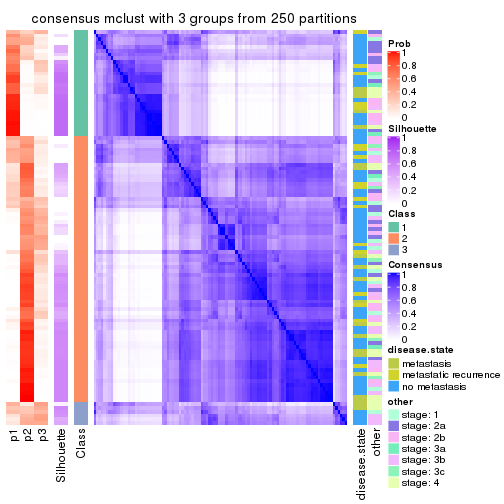</p>

</div>
<div id='tab-CV-mclust-consensus-heatmap-3'>
<pre><code class="r">consensus_heatmap(res, k = 4)
</code></pre>

<p></p>

</div>
<div id='tab-CV-mclust-consensus-heatmap-4'>
<pre><code class="r">consensus_heatmap(res, k = 5)
</code></pre>

<p></p>

</div>
<div id='tab-CV-mclust-consensus-heatmap-5'>
<pre><code class="r">consensus_heatmap(res, k = 6)
</code></pre>

<p></p>

</div>
</div>

Heatmaps for the membership of samples in all partitions to see how consistent they are:


<script>
$( function() {
	$( '#tabs-CV-mclust-membership-heatmap' ).tabs();
} );
</script>
<div id='tabs-CV-mclust-membership-heatmap'>
<ul>
<li><a href='#tab-CV-mclust-membership-heatmap-1'>k = 2</a></li>
<li><a href='#tab-CV-mclust-membership-heatmap-2'>k = 3</a></li>
<li><a href='#tab-CV-mclust-membership-heatmap-3'>k = 4</a></li>
<li><a href='#tab-CV-mclust-membership-heatmap-4'>k = 5</a></li>
<li><a href='#tab-CV-mclust-membership-heatmap-5'>k = 6</a></li>
</ul>
<div id='tab-CV-mclust-membership-heatmap-1'>
<pre><code class="r">membership_heatmap(res, k = 2)
</code></pre>

<p></p>

</div>
<div id='tab-CV-mclust-membership-heatmap-2'>
<pre><code class="r">membership_heatmap(res, k = 3)
</code></pre>

<p></p>

</div>
<div id='tab-CV-mclust-membership-heatmap-3'>
<pre><code class="r">membership_heatmap(res, k = 4)
</code></pre>

<p></p>

</div>
<div id='tab-CV-mclust-membership-heatmap-4'>
<pre><code class="r">membership_heatmap(res, k = 5)
</code></pre>

<p></p>

</div>
<div id='tab-CV-mclust-membership-heatmap-5'>
<pre><code class="r">membership_heatmap(res, k = 6)
</code></pre>

<p></p>

</div>
</div>

As soon as we have had the classes for columns, we can look for signatures
which are significantly different between classes which can be candidate marks
for certain classes. Following are the heatmaps for signatures.


Signature heatmaps where rows are scaled:


<script>
$( function() {
	$( '#tabs-CV-mclust-get-signatures' ).tabs();
} );
</script>
<div id='tabs-CV-mclust-get-signatures'>
<ul>
<li><a href='#tab-CV-mclust-get-signatures-1'>k = 2</a></li>
<li><a href='#tab-CV-mclust-get-signatures-2'>k = 3</a></li>
<li><a href='#tab-CV-mclust-get-signatures-3'>k = 4</a></li>
<li><a href='#tab-CV-mclust-get-signatures-4'>k = 5</a></li>
<li><a href='#tab-CV-mclust-get-signatures-5'>k = 6</a></li>
</ul>
<div id='tab-CV-mclust-get-signatures-1'>
<pre><code class="r">get_signatures(res, k = 2)
</code></pre>

<p></p>

</div>
<div id='tab-CV-mclust-get-signatures-2'>
<pre><code class="r">get_signatures(res, k = 3)
</code></pre>

<p></p>

</div>
<div id='tab-CV-mclust-get-signatures-3'>
<pre><code class="r">get_signatures(res, k = 4)
</code></pre>

<p></p>

</div>
<div id='tab-CV-mclust-get-signatures-4'>
<pre><code class="r">get_signatures(res, k = 5)
</code></pre>

<p></p>

</div>
<div id='tab-CV-mclust-get-signatures-5'>
<pre><code class="r">get_signatures(res, k = 6)
</code></pre>

<p></p>

</div>
</div>


Signature heatmaps where rows are not scaled:


<script>
$( function() {
	$( '#tabs-CV-mclust-get-signatures-no-scale' ).tabs();
} );
</script>
<div id='tabs-CV-mclust-get-signatures-no-scale'>
<ul>
<li><a href='#tab-CV-mclust-get-signatures-no-scale-1'>k = 2</a></li>
<li><a href='#tab-CV-mclust-get-signatures-no-scale-2'>k = 3</a></li>
<li><a href='#tab-CV-mclust-get-signatures-no-scale-3'>k = 4</a></li>
<li><a href='#tab-CV-mclust-get-signatures-no-scale-4'>k = 5</a></li>
<li><a href='#tab-CV-mclust-get-signatures-no-scale-5'>k = 6</a></li>
</ul>
<div id='tab-CV-mclust-get-signatures-no-scale-1'>
<pre><code class="r">get_signatures(res, k = 2, scale_rows = FALSE)
</code></pre>

<p></p>

</div>
<div id='tab-CV-mclust-get-signatures-no-scale-2'>
<pre><code class="r">get_signatures(res, k = 3, scale_rows = FALSE)
</code></pre>

<p></p>

</div>
<div id='tab-CV-mclust-get-signatures-no-scale-3'>
<pre><code class="r">get_signatures(res, k = 4, scale_rows = FALSE)
</code></pre>

<p></p>

</div>
<div id='tab-CV-mclust-get-signatures-no-scale-4'>
<pre><code class="r">get_signatures(res, k = 5, scale_rows = FALSE)
</code></pre>

<p></p>

</div>
<div id='tab-CV-mclust-get-signatures-no-scale-5'>
<pre><code class="r">get_signatures(res, k = 6, scale_rows = FALSE)
</code></pre>

<p></p>

</div>
</div>


Compare the overlap of signatures from different k:

```r
compare_signatures(res)
```


`get_signature()` returns a data frame invisibly. TO get the list of signatures, the function
call should be assigned to a variable explicitly. In following code, if `plot` argument is set
to `FALSE`, no heatmap is plotted while only the differential analysis is performed.

```r
# code only for demonstration
tb = get_signature(res, k = ..., plot = FALSE)
```

An example of the output of `tb` is:

```
#>   which_row         fdr    mean_1    mean_2 scaled_mean_1 scaled_mean_2 km
#> 1        38 0.042760348  8.373488  9.131774    -0.5533452     0.5164555  1
#> 2        40 0.018707592  7.106213  8.469186    -0.6173731     0.5762149  1
#> 3        55 0.019134737 10.221463 11.207825    -0.6159697     0.5749050  1
#> 4        59 0.006059896  5.921854  7.869574    -0.6899429     0.6439467  1
#> 5        60 0.018055526  8.928898 10.211722    -0.6204761     0.5791110  1
#> 6        98 0.009384629 15.714769 14.887706     0.6635654    -0.6193277  2
...
```

The columns in `tb` are:

1. `which_row`: row indices corresponding to the input matrix.
2. `fdr`: FDR for the differential test. 
3. `mean_x`: The mean value in group x.
4. `scaled_mean_x`: The mean value in group x after rows are scaled.
5. `km`: Row groups if k-means clustering is applied to rows.


UMAP plot which shows how samples are separated.


<script>
$( function() {
	$( '#tabs-CV-mclust-dimension-reduction' ).tabs();
} );
</script>
<div id='tabs-CV-mclust-dimension-reduction'>
<ul>
<li><a href='#tab-CV-mclust-dimension-reduction-1'>k = 2</a></li>
<li><a href='#tab-CV-mclust-dimension-reduction-2'>k = 3</a></li>
<li><a href='#tab-CV-mclust-dimension-reduction-3'>k = 4</a></li>
<li><a href='#tab-CV-mclust-dimension-reduction-4'>k = 5</a></li>
<li><a href='#tab-CV-mclust-dimension-reduction-5'>k = 6</a></li>
</ul>
<div id='tab-CV-mclust-dimension-reduction-1'>
<pre><code class="r">dimension_reduction(res, k = 2, method = &quot;UMAP&quot;)
</code></pre>

<p></p>

</div>
<div id='tab-CV-mclust-dimension-reduction-2'>
<pre><code class="r">dimension_reduction(res, k = 3, method = &quot;UMAP&quot;)
</code></pre>

<p>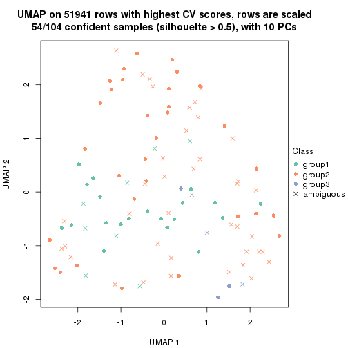</p>

</div>
<div id='tab-CV-mclust-dimension-reduction-3'>
<pre><code class="r">dimension_reduction(res, k = 4, method = &quot;UMAP&quot;)
</code></pre>

<p></p>

</div>
<div id='tab-CV-mclust-dimension-reduction-4'>
<pre><code class="r">dimension_reduction(res, k = 5, method = &quot;UMAP&quot;)
</code></pre>

<p></p>

</div>
<div id='tab-CV-mclust-dimension-reduction-5'>
<pre><code class="r">dimension_reduction(res, k = 6, method = &quot;UMAP&quot;)
</code></pre>

<p></p>

</div>
</div>


Following heatmap shows how subgroups are split when increasing `k`:

```r
collect_classes(res)
```


Test correlation between subgroups and known annotations. If the known
annotation is numeric, one-way ANOVA test is applied, and if the known
annotation is discrete, chi-squared contingency table test is applied.

```r
test_to_known_factors(res)
```

```
#>             n disease.state(p) other(p) k
#> CV:mclust 100            0.754    0.439 2
#> CV:mclust  54            0.901    0.871 3
#> CV:mclust  22            0.783    0.632 4
#> CV:mclust  49            0.220    0.478 5
#> CV:mclust  54            0.132    0.591 6
```


If matrix rows can be associated to genes, consider to use `functional_enrichment(res,
...)` to perform function enrichment for the signature genes. See [this vignette](http://bioconductor.org/packages/devel/bioc/vignettes/cola/inst/doc/functional_enrichment.html) for more detailed explanations.


 

---------------------------------------------------


### CV:NMF*


The object with results only for a single top-value method and a single partition method 
can be extracted as:

```r
res = res_list["CV", "NMF"]
# you can also extract it by
# res = res_list["CV:NMF"]
```

A summary of `res` and all the functions that can be applied to it:

```r
res
```

```
#> A 'ConsensusPartition' object with k = 2, 3, 4, 5, 6.
#>   On a matrix with 51941 rows and 104 columns.
#>   Top rows (1000, 2000, 3000, 4000, 5000) are extracted by 'CV' method.
#>   Subgroups are detected by 'NMF' method.
#>   Performed in total 1250 partitions by row resampling.
#>   Best k for subgroups seems to be 2.
#> 
#> Following methods can be applied to this 'ConsensusPartition' object:
#>  [1] "cola_report"             "collect_classes"         "collect_plots"          
#>  [4] "collect_stats"           "colnames"                "compare_signatures"     
#>  [7] "consensus_heatmap"       "dimension_reduction"     "functional_enrichment"  
#> [10] "get_anno_col"            "get_anno"                "get_classes"            
#> [13] "get_consensus"           "get_matrix"              "get_membership"         
#> [16] "get_param"               "get_signatures"          "get_stats"              
#> [19] "is_best_k"               "is_stable_k"             "membership_heatmap"     
#> [22] "ncol"                    "nrow"                    "plot_ecdf"              
#> [25] "rownames"                "select_partition_number" "show"                   
#> [28] "suggest_best_k"          "test_to_known_factors"
```

`collect_plots()` function collects all the plots made from `res` for all `k` (number of partitions)
into one single page to provide an easy and fast comparison between different `k`.

```r
collect_plots(res)
```


The plots are:

- The first row: a plot of the ECDF (empirical cumulative distribution
  function) curves of the consensus matrix for each `k` and the heatmap of
  predicted classes for each `k`.
- The second row: heatmaps of the consensus matrix for each `k`.
- The third row: heatmaps of the membership matrix for each `k`.
- The fouth row: heatmaps of the signatures for each `k`.

All the plots in panels can be made by individual functions and they are
plotted later in this section.

`select_partition_number()` produces several plots showing different
statistics for choosing "optimized" `k`. There are following statistics:

- ECDF curves of the consensus matrix for each `k`;
- 1-PAC. [The PAC
  score](https://en.wikipedia.org/wiki/Consensus_clustering#Over-interpretation_potential_of_consensus_clustering)
  measures the proportion of the ambiguous subgrouping.
- Mean silhouette score.
- Concordance. The mean probability of fiting the consensus class ids in all
  partitions.
- Area increased. Denote $A_k$ as the area under the ECDF curve for current
  `k`, the area increased is defined as $A_k - A_{k-1}$.
- Rand index. The percent of pairs of samples that are both in a same cluster
  or both are not in a same cluster in the partition of k and k-1.
- Jaccard index. The ratio of pairs of samples are both in a same cluster in
  the partition of k and k-1 and the pairs of samples are both in a same
  cluster in the partition k or k-1.

The detailed explanations of these statistics can be found in [the _cola_
vignette](http://bioconductor.org/packages/devel/bioc/vignettes/cola/inst/doc/cola.html#toc_13).

Generally speaking, lower PAC score, higher mean silhouette score or higher
concordance corresponds to better partition. Rand index and Jaccard index
measure how similar the current partition is compared to partition with `k-1`.
If they are too similar, we won't accept `k` is better than `k-1`.

```r
select_partition_number(res)
```


The numeric values for all these statistics can be obtained by `get_stats()`.

```r
get_stats(res)
```

```
#>   k 1-PAC mean_silhouette concordance area_increased  Rand Jaccard
#> 2 2 0.900           0.931       0.971         0.4803 0.522   0.522
#> 3 3 0.377           0.567       0.772         0.3461 0.809   0.647
#> 4 4 0.500           0.647       0.776         0.1504 0.790   0.494
#> 5 5 0.555           0.574       0.739         0.0715 0.867   0.542
#> 6 6 0.577           0.477       0.669         0.0434 0.891   0.541
```

`suggest_best_k()` suggests the best $k$ based on these statistics. The rules are as follows:

- All $k$ with Jaccard index larger than 0.95 are removed because increasing
  $k$ does not provide enough extra information. If all $k$ are removed, it is
  marked as no subgroup is detected.
- For all $k$ with 1-PAC score larger than 0.9, the maximal $k$ is taken as
  the best $k$, and other $k$ are marked as optional $k$.
- If it does not fit the second rule. The $k$ with the maximal vote of the
  highest 1-PAC score, highest mean silhouette, and highest concordance is
  taken as the best $k$.

```r
suggest_best_k(res)
```

```
#> [1] 2
```


Following shows the table of the partitions (You need to click the **show/hide
code output** link to see it). The membership matrix (columns with name `p*`)
is inferred by
[`clue::cl_consensus()`](https://www.rdocumentation.org/link/cl_consensus?package=clue)
function with the `SE` method. Basically the value in the membership matrix
represents the probability to belong to a certain group. The finall class
label for an item is determined with the group with highest probability it
belongs to.

In `get_classes()` function, the entropy is calculated from the membership
matrix and the silhouette score is calculated from the consensus matrix.


<script>
$( function() {
	$( '#tabs-CV-NMF-get-classes' ).tabs();
} );
</script>
<div id='tabs-CV-NMF-get-classes'>
<ul>
<li><a href='#tab-CV-NMF-get-classes-1'>k = 2</a></li>
<li><a href='#tab-CV-NMF-get-classes-2'>k = 3</a></li>
<li><a href='#tab-CV-NMF-get-classes-3'>k = 4</a></li>
<li><a href='#tab-CV-NMF-get-classes-4'>k = 5</a></li>
<li><a href='#tab-CV-NMF-get-classes-5'>k = 6</a></li>
</ul>

<div id='tab-CV-NMF-get-classes-1'>
<p><a id='tab-CV-NMF-get-classes-1-a' style='color:#0366d6' href='#'>show/hide code output</a></p>
<pre><code class="r">cbind(get_classes(res, k = 2), get_membership(res, k = 2))
</code></pre>

<pre><code>#&gt;           class entropy silhouette    p1    p2
#&gt; GSM537341     2  0.6343     0.8050 0.160 0.840
#&gt; GSM537345     1  0.0000     0.9683 1.000 0.000
#&gt; GSM537355     2  0.0000     0.9696 0.000 1.000
#&gt; GSM537366     1  0.2603     0.9377 0.956 0.044
#&gt; GSM537370     2  0.0000     0.9696 0.000 1.000
#&gt; GSM537380     2  0.0000     0.9696 0.000 1.000
#&gt; GSM537392     2  0.0000     0.9696 0.000 1.000
#&gt; GSM537415     2  0.0000     0.9696 0.000 1.000
#&gt; GSM537417     2  0.0000     0.9696 0.000 1.000
#&gt; GSM537422     1  0.0000     0.9683 1.000 0.000
#&gt; GSM537423     2  0.0000     0.9696 0.000 1.000
#&gt; GSM537427     2  0.0000     0.9696 0.000 1.000
#&gt; GSM537430     2  0.0000     0.9696 0.000 1.000
#&gt; GSM537336     1  0.0000     0.9683 1.000 0.000
#&gt; GSM537337     2  0.0000     0.9696 0.000 1.000
#&gt; GSM537348     1  0.0000     0.9683 1.000 0.000
#&gt; GSM537349     2  0.0000     0.9696 0.000 1.000
#&gt; GSM537356     1  0.0376     0.9664 0.996 0.004
#&gt; GSM537361     1  0.0000     0.9683 1.000 0.000
#&gt; GSM537374     2  0.0000     0.9696 0.000 1.000
#&gt; GSM537377     1  0.0000     0.9683 1.000 0.000
#&gt; GSM537378     2  0.0000     0.9696 0.000 1.000
#&gt; GSM537379     2  0.0000     0.9696 0.000 1.000
#&gt; GSM537383     2  0.0000     0.9696 0.000 1.000
#&gt; GSM537388     2  0.0000     0.9696 0.000 1.000
#&gt; GSM537395     2  0.0000     0.9696 0.000 1.000
#&gt; GSM537400     1  0.0376     0.9664 0.996 0.004
#&gt; GSM537404     2  0.1184     0.9573 0.016 0.984
#&gt; GSM537409     2  0.0000     0.9696 0.000 1.000
#&gt; GSM537418     1  0.0000     0.9683 1.000 0.000
#&gt; GSM537425     1  0.0938     0.9618 0.988 0.012
#&gt; GSM537333     1  0.8081     0.6905 0.752 0.248
#&gt; GSM537342     2  0.0000     0.9696 0.000 1.000
#&gt; GSM537347     2  0.0672     0.9636 0.008 0.992
#&gt; GSM537350     1  0.0000     0.9683 1.000 0.000
#&gt; GSM537362     1  0.0000     0.9683 1.000 0.000
#&gt; GSM537363     1  0.6148     0.8284 0.848 0.152
#&gt; GSM537368     1  0.0000     0.9683 1.000 0.000
#&gt; GSM537376     2  0.0000     0.9696 0.000 1.000
#&gt; GSM537381     1  0.0000     0.9683 1.000 0.000
#&gt; GSM537386     2  0.0000     0.9696 0.000 1.000
#&gt; GSM537398     1  0.0000     0.9683 1.000 0.000
#&gt; GSM537402     2  0.0000     0.9696 0.000 1.000
#&gt; GSM537405     1  0.0000     0.9683 1.000 0.000
#&gt; GSM537371     1  0.0000     0.9683 1.000 0.000
#&gt; GSM537421     2  0.1633     0.9500 0.024 0.976
#&gt; GSM537424     1  0.0000     0.9683 1.000 0.000
#&gt; GSM537432     2  0.9608     0.3749 0.384 0.616
#&gt; GSM537331     2  0.0000     0.9696 0.000 1.000
#&gt; GSM537332     2  0.0000     0.9696 0.000 1.000
#&gt; GSM537334     2  0.0000     0.9696 0.000 1.000
#&gt; GSM537338     2  0.0000     0.9696 0.000 1.000
#&gt; GSM537353     2  0.0000     0.9696 0.000 1.000
#&gt; GSM537357     1  0.0000     0.9683 1.000 0.000
#&gt; GSM537358     2  0.0000     0.9696 0.000 1.000
#&gt; GSM537375     2  0.0000     0.9696 0.000 1.000
#&gt; GSM537389     2  0.0000     0.9696 0.000 1.000
#&gt; GSM537390     2  0.0000     0.9696 0.000 1.000
#&gt; GSM537393     2  0.0000     0.9696 0.000 1.000
#&gt; GSM537399     1  0.7602     0.7241 0.780 0.220
#&gt; GSM537407     1  0.1184     0.9587 0.984 0.016
#&gt; GSM537408     2  0.0000     0.9696 0.000 1.000
#&gt; GSM537428     2  0.0000     0.9696 0.000 1.000
#&gt; GSM537354     2  0.0000     0.9696 0.000 1.000
#&gt; GSM537410     2  0.0000     0.9696 0.000 1.000
#&gt; GSM537413     2  0.0000     0.9696 0.000 1.000
#&gt; GSM537396     2  0.0376     0.9667 0.004 0.996
#&gt; GSM537397     1  0.0000     0.9683 1.000 0.000
#&gt; GSM537330     2  0.0000     0.9696 0.000 1.000
#&gt; GSM537369     1  0.0000     0.9683 1.000 0.000
#&gt; GSM537373     2  0.0672     0.9637 0.008 0.992
#&gt; GSM537401     2  0.2778     0.9286 0.048 0.952
#&gt; GSM537343     1  0.0000     0.9683 1.000 0.000
#&gt; GSM537367     1  0.0672     0.9644 0.992 0.008
#&gt; GSM537382     2  0.0000     0.9696 0.000 1.000
#&gt; GSM537385     2  0.0000     0.9696 0.000 1.000
#&gt; GSM537391     1  0.0000     0.9683 1.000 0.000
#&gt; GSM537419     2  0.0000     0.9696 0.000 1.000
#&gt; GSM537420     1  0.0000     0.9683 1.000 0.000
#&gt; GSM537429     2  0.6438     0.7989 0.164 0.836
#&gt; GSM537431     1  0.5737     0.8434 0.864 0.136
#&gt; GSM537387     1  0.0000     0.9683 1.000 0.000
#&gt; GSM537414     1  0.3733     0.9142 0.928 0.072
#&gt; GSM537433     1  0.8327     0.6535 0.736 0.264
#&gt; GSM537335     2  0.9993     0.0507 0.484 0.516
#&gt; GSM537339     1  0.0938     0.9619 0.988 0.012
#&gt; GSM537340     2  0.9608     0.3635 0.384 0.616
#&gt; GSM537344     1  0.0000     0.9683 1.000 0.000
#&gt; GSM537346     2  0.0000     0.9696 0.000 1.000
#&gt; GSM537351     1  0.0000     0.9683 1.000 0.000
#&gt; GSM537352     2  0.0000     0.9696 0.000 1.000
#&gt; GSM537359     2  0.0000     0.9696 0.000 1.000
#&gt; GSM537360     2  0.0000     0.9696 0.000 1.000
#&gt; GSM537364     1  0.0000     0.9683 1.000 0.000
#&gt; GSM537365     2  0.6247     0.8085 0.156 0.844
#&gt; GSM537372     1  0.0000     0.9683 1.000 0.000
#&gt; GSM537384     1  0.0000     0.9683 1.000 0.000
#&gt; GSM537394     2  0.0000     0.9696 0.000 1.000
#&gt; GSM537403     2  0.0000     0.9696 0.000 1.000
#&gt; GSM537406     2  0.0000     0.9696 0.000 1.000
#&gt; GSM537411     2  0.0000     0.9696 0.000 1.000
#&gt; GSM537412     2  0.0000     0.9696 0.000 1.000
#&gt; GSM537416     2  0.0000     0.9696 0.000 1.000
#&gt; GSM537426     2  0.0000     0.9696 0.000 1.000
</code></pre>

<script>
$('#tab-CV-NMF-get-classes-1-a').parent().next().next().hide();
$('#tab-CV-NMF-get-classes-1-a').click(function(){
  $('#tab-CV-NMF-get-classes-1-a').parent().next().next().toggle();
  return(false);
});
</script>
</div>

<div id='tab-CV-NMF-get-classes-2'>
<p><a id='tab-CV-NMF-get-classes-2-a' style='color:#0366d6' href='#'>show/hide code output</a></p>
<pre><code class="r">cbind(get_classes(res, k = 3), get_membership(res, k = 3))
</code></pre>

<pre><code>#&gt;           class entropy silhouette    p1    p2    p3
#&gt; GSM537341     2  0.8872     0.2247 0.132 0.520 0.348
#&gt; GSM537345     1  0.5905     0.3823 0.648 0.000 0.352
#&gt; GSM537355     2  0.6008     0.5108 0.000 0.628 0.372
#&gt; GSM537366     1  0.5847     0.6839 0.780 0.172 0.048
#&gt; GSM537370     2  0.6298     0.3781 0.004 0.608 0.388
#&gt; GSM537380     2  0.4452     0.6815 0.000 0.808 0.192
#&gt; GSM537392     2  0.4235     0.6914 0.000 0.824 0.176
#&gt; GSM537415     2  0.0237     0.7284 0.000 0.996 0.004
#&gt; GSM537417     2  0.6111     0.4811 0.000 0.604 0.396
#&gt; GSM537422     1  0.7940     0.3872 0.592 0.076 0.332
#&gt; GSM537423     2  0.3116     0.7384 0.000 0.892 0.108
#&gt; GSM537427     3  0.6260    -0.2621 0.000 0.448 0.552
#&gt; GSM537430     2  0.5591     0.6585 0.000 0.696 0.304
#&gt; GSM537336     1  0.0747     0.7828 0.984 0.000 0.016
#&gt; GSM537337     3  0.4121     0.5006 0.000 0.168 0.832
#&gt; GSM537348     3  0.6308     0.0598 0.492 0.000 0.508
#&gt; GSM537349     2  0.2959     0.7356 0.000 0.900 0.100
#&gt; GSM537356     1  0.3692     0.7624 0.896 0.056 0.048
#&gt; GSM537361     1  0.4504     0.6543 0.804 0.000 0.196
#&gt; GSM537374     3  0.4002     0.5503 0.000 0.160 0.840
#&gt; GSM537377     3  0.6309    -0.0389 0.496 0.000 0.504
#&gt; GSM537378     2  0.3619     0.7387 0.000 0.864 0.136
#&gt; GSM537379     3  0.6111    -0.0421 0.000 0.396 0.604
#&gt; GSM537383     2  0.4235     0.7206 0.000 0.824 0.176
#&gt; GSM537388     2  0.6192     0.5321 0.000 0.580 0.420
#&gt; GSM537395     2  0.6260     0.4907 0.000 0.552 0.448
#&gt; GSM537400     1  0.7932     0.2971 0.552 0.064 0.384
#&gt; GSM537404     2  0.6349     0.6867 0.092 0.768 0.140
#&gt; GSM537409     2  0.5138     0.6443 0.000 0.748 0.252
#&gt; GSM537418     1  0.0661     0.7852 0.988 0.004 0.008
#&gt; GSM537425     1  0.2297     0.7813 0.944 0.020 0.036
#&gt; GSM537333     3  0.9730     0.0739 0.352 0.228 0.420
#&gt; GSM537342     2  0.1529     0.7239 0.000 0.960 0.040
#&gt; GSM537347     3  0.5815     0.1514 0.004 0.304 0.692
#&gt; GSM537350     1  0.4519     0.7309 0.852 0.032 0.116
#&gt; GSM537362     3  0.6045     0.2807 0.380 0.000 0.620
#&gt; GSM537363     1  0.6685     0.6070 0.708 0.244 0.048
#&gt; GSM537368     1  0.0747     0.7828 0.984 0.000 0.016
#&gt; GSM537376     2  0.5621     0.6421 0.000 0.692 0.308
#&gt; GSM537381     1  0.0592     0.7848 0.988 0.000 0.012
#&gt; GSM537386     2  0.3482     0.7180 0.000 0.872 0.128
#&gt; GSM537398     3  0.6008     0.2832 0.372 0.000 0.628
#&gt; GSM537402     2  0.3482     0.7210 0.000 0.872 0.128
#&gt; GSM537405     1  0.0892     0.7823 0.980 0.000 0.020
#&gt; GSM537371     1  0.1860     0.7715 0.948 0.000 0.052
#&gt; GSM537421     2  0.3573     0.7261 0.004 0.876 0.120
#&gt; GSM537424     1  0.5905     0.4025 0.648 0.000 0.352
#&gt; GSM537432     2  0.8948     0.3855 0.224 0.568 0.208
#&gt; GSM537331     3  0.3941     0.5335 0.000 0.156 0.844
#&gt; GSM537332     2  0.4796     0.6714 0.000 0.780 0.220
#&gt; GSM537334     3  0.2261     0.5889 0.000 0.068 0.932
#&gt; GSM537338     3  0.2711     0.5870 0.000 0.088 0.912
#&gt; GSM537353     2  0.3686     0.7313 0.000 0.860 0.140
#&gt; GSM537357     1  0.1031     0.7810 0.976 0.000 0.024
#&gt; GSM537358     2  0.4178     0.7306 0.000 0.828 0.172
#&gt; GSM537375     3  0.2878     0.5824 0.000 0.096 0.904
#&gt; GSM537389     2  0.2796     0.7246 0.000 0.908 0.092
#&gt; GSM537390     2  0.2356     0.7356 0.000 0.928 0.072
#&gt; GSM537393     2  0.6299     0.3720 0.000 0.524 0.476
#&gt; GSM537399     1  0.7672     0.4533 0.684 0.160 0.156
#&gt; GSM537407     1  0.5956     0.6789 0.768 0.188 0.044
#&gt; GSM537408     2  0.3989     0.7022 0.012 0.864 0.124
#&gt; GSM537428     3  0.4842     0.4192 0.000 0.224 0.776
#&gt; GSM537354     3  0.2878     0.5808 0.000 0.096 0.904
#&gt; GSM537410     2  0.1529     0.7185 0.000 0.960 0.040
#&gt; GSM537413     2  0.1163     0.7257 0.000 0.972 0.028
#&gt; GSM537396     2  0.6264     0.6404 0.068 0.764 0.168
#&gt; GSM537397     3  0.7328     0.2615 0.364 0.040 0.596
#&gt; GSM537330     2  0.5621     0.6102 0.000 0.692 0.308
#&gt; GSM537369     1  0.0592     0.7839 0.988 0.000 0.012
#&gt; GSM537373     2  0.4475     0.6690 0.064 0.864 0.072
#&gt; GSM537401     3  0.7207     0.2250 0.032 0.384 0.584
#&gt; GSM537343     1  0.4964     0.7283 0.836 0.116 0.048
#&gt; GSM537367     1  0.6937     0.6011 0.680 0.272 0.048
#&gt; GSM537382     2  0.5016     0.6554 0.000 0.760 0.240
#&gt; GSM537385     2  0.4291     0.7148 0.000 0.820 0.180
#&gt; GSM537391     3  0.6302     0.0823 0.480 0.000 0.520
#&gt; GSM537419     2  0.3116     0.7206 0.000 0.892 0.108
#&gt; GSM537420     1  0.1163     0.7821 0.972 0.000 0.028
#&gt; GSM537429     2  0.6566     0.5207 0.012 0.612 0.376
#&gt; GSM537431     1  0.6007     0.6529 0.764 0.192 0.044
#&gt; GSM537387     1  0.4750     0.6015 0.784 0.000 0.216
#&gt; GSM537414     1  0.8836     0.2026 0.492 0.120 0.388
#&gt; GSM537433     1  0.7190     0.5363 0.636 0.320 0.044
#&gt; GSM537335     3  0.2636     0.5954 0.020 0.048 0.932
#&gt; GSM537339     3  0.6912     0.3339 0.344 0.028 0.628
#&gt; GSM537340     2  0.9457     0.1222 0.312 0.484 0.204
#&gt; GSM537344     1  0.0424     0.7840 0.992 0.000 0.008
#&gt; GSM537346     2  0.5810     0.5822 0.000 0.664 0.336
#&gt; GSM537351     1  0.0747     0.7842 0.984 0.000 0.016
#&gt; GSM537352     2  0.6308     0.3475 0.000 0.508 0.492
#&gt; GSM537359     2  0.4172     0.6980 0.004 0.840 0.156
#&gt; GSM537360     2  0.3192     0.7432 0.000 0.888 0.112
#&gt; GSM537364     1  0.1163     0.7802 0.972 0.000 0.028
#&gt; GSM537365     2  0.8211     0.1020 0.404 0.520 0.076
#&gt; GSM537372     1  0.2804     0.7748 0.924 0.016 0.060
#&gt; GSM537384     1  0.2448     0.7532 0.924 0.000 0.076
#&gt; GSM537394     2  0.3425     0.7227 0.004 0.884 0.112
#&gt; GSM537403     2  0.5465     0.6086 0.000 0.712 0.288
#&gt; GSM537406     2  0.2860     0.7094 0.004 0.912 0.084
#&gt; GSM537411     2  0.5397     0.6379 0.000 0.720 0.280
#&gt; GSM537412     2  0.1529     0.7238 0.000 0.960 0.040
#&gt; GSM537416     2  0.4796     0.6663 0.000 0.780 0.220
#&gt; GSM537426     2  0.3551     0.7172 0.000 0.868 0.132
</code></pre>

<script>
$('#tab-CV-NMF-get-classes-2-a').parent().next().next().hide();
$('#tab-CV-NMF-get-classes-2-a').click(function(){
  $('#tab-CV-NMF-get-classes-2-a').parent().next().next().toggle();
  return(false);
});
</script>
</div>

<div id='tab-CV-NMF-get-classes-3'>
<p><a id='tab-CV-NMF-get-classes-3-a' style='color:#0366d6' href='#'>show/hide code output</a></p>
<pre><code class="r">cbind(get_classes(res, k = 4), get_membership(res, k = 4))
</code></pre>

<pre><code>#&gt;           class entropy silhouette    p1    p2    p3    p4
#&gt; GSM537341     2  0.3464     0.7024 0.124 0.856 0.004 0.016
#&gt; GSM537345     4  0.5288     0.0744 0.472 0.000 0.008 0.520
#&gt; GSM537355     3  0.4553     0.7165 0.000 0.040 0.780 0.180
#&gt; GSM537366     1  0.3377     0.7907 0.848 0.140 0.000 0.012
#&gt; GSM537370     2  0.3662     0.7479 0.012 0.860 0.024 0.104
#&gt; GSM537380     2  0.1820     0.7787 0.000 0.944 0.020 0.036
#&gt; GSM537392     2  0.2197     0.7784 0.000 0.928 0.024 0.048
#&gt; GSM537415     2  0.4907     0.1213 0.000 0.580 0.420 0.000
#&gt; GSM537417     3  0.3668     0.7076 0.000 0.004 0.808 0.188
#&gt; GSM537422     3  0.5647     0.6217 0.164 0.000 0.720 0.116
#&gt; GSM537423     2  0.3570     0.7417 0.000 0.860 0.092 0.048
#&gt; GSM537427     4  0.6162     0.4143 0.000 0.304 0.076 0.620
#&gt; GSM537430     2  0.6295     0.4572 0.000 0.616 0.296 0.088
#&gt; GSM537336     1  0.1820     0.8200 0.944 0.000 0.020 0.036
#&gt; GSM537337     4  0.4578     0.6497 0.000 0.052 0.160 0.788
#&gt; GSM537348     4  0.4290     0.6629 0.212 0.016 0.000 0.772
#&gt; GSM537349     2  0.1913     0.7750 0.000 0.940 0.040 0.020
#&gt; GSM537356     1  0.3143     0.8113 0.888 0.080 0.008 0.024
#&gt; GSM537361     1  0.5277     0.6748 0.752 0.000 0.116 0.132
#&gt; GSM537374     4  0.3401     0.7072 0.000 0.152 0.008 0.840
#&gt; GSM537377     4  0.4253     0.6474 0.208 0.000 0.016 0.776
#&gt; GSM537378     2  0.5950     0.1135 0.000 0.544 0.416 0.040
#&gt; GSM537379     3  0.5256     0.6534 0.000 0.040 0.700 0.260
#&gt; GSM537383     2  0.3497     0.7515 0.000 0.860 0.104 0.036
#&gt; GSM537388     2  0.6915     0.4487 0.000 0.592 0.212 0.196
#&gt; GSM537395     3  0.7486     0.4302 0.000 0.272 0.500 0.228
#&gt; GSM537400     3  0.4354     0.6970 0.088 0.004 0.824 0.084
#&gt; GSM537404     2  0.7390     0.5551 0.208 0.624 0.116 0.052
#&gt; GSM537409     3  0.2319     0.7534 0.000 0.040 0.924 0.036
#&gt; GSM537418     1  0.1854     0.8220 0.940 0.000 0.048 0.012
#&gt; GSM537425     1  0.4569     0.7184 0.760 0.008 0.220 0.012
#&gt; GSM537333     3  0.3100     0.7264 0.028 0.004 0.888 0.080
#&gt; GSM537342     3  0.4160     0.6923 0.012 0.192 0.792 0.004
#&gt; GSM537347     4  0.7198     0.1734 0.000 0.160 0.320 0.520
#&gt; GSM537350     1  0.5060     0.3937 0.584 0.412 0.000 0.004
#&gt; GSM537362     4  0.3529     0.7011 0.152 0.000 0.012 0.836
#&gt; GSM537363     1  0.5346     0.7483 0.768 0.104 0.116 0.012
#&gt; GSM537368     1  0.1635     0.8200 0.948 0.000 0.008 0.044
#&gt; GSM537376     3  0.7830     0.2495 0.000 0.268 0.400 0.332
#&gt; GSM537381     1  0.0712     0.8250 0.984 0.004 0.008 0.004
#&gt; GSM537386     2  0.1305     0.7779 0.000 0.960 0.036 0.004
#&gt; GSM537398     4  0.2799     0.7394 0.108 0.000 0.008 0.884
#&gt; GSM537402     2  0.4232     0.7149 0.004 0.816 0.144 0.036
#&gt; GSM537405     1  0.2089     0.8179 0.932 0.000 0.020 0.048
#&gt; GSM537371     1  0.2101     0.8148 0.928 0.000 0.012 0.060
#&gt; GSM537421     3  0.2342     0.7369 0.000 0.080 0.912 0.008
#&gt; GSM537424     1  0.5460     0.4507 0.632 0.000 0.028 0.340
#&gt; GSM537432     3  0.2636     0.7303 0.020 0.012 0.916 0.052
#&gt; GSM537331     4  0.4713     0.6716 0.000 0.172 0.052 0.776
#&gt; GSM537332     3  0.5272     0.6854 0.000 0.172 0.744 0.084
#&gt; GSM537334     4  0.1970     0.7381 0.000 0.008 0.060 0.932
#&gt; GSM537338     4  0.2131     0.7471 0.000 0.032 0.036 0.932
#&gt; GSM537353     3  0.5923     0.3899 0.000 0.376 0.580 0.044
#&gt; GSM537357     1  0.2002     0.8180 0.936 0.000 0.020 0.044
#&gt; GSM537358     2  0.3266     0.7634 0.000 0.876 0.084 0.040
#&gt; GSM537375     4  0.3081     0.7359 0.000 0.048 0.064 0.888
#&gt; GSM537389     2  0.1489     0.7735 0.000 0.952 0.044 0.004
#&gt; GSM537390     2  0.5699     0.2937 0.000 0.588 0.380 0.032
#&gt; GSM537393     3  0.4595     0.7109 0.000 0.040 0.776 0.184
#&gt; GSM537399     1  0.6724     0.2978 0.532 0.400 0.036 0.032
#&gt; GSM537407     1  0.4890     0.7728 0.792 0.136 0.060 0.012
#&gt; GSM537408     2  0.1362     0.7727 0.012 0.964 0.020 0.004
#&gt; GSM537428     4  0.4746     0.6660 0.000 0.168 0.056 0.776
#&gt; GSM537354     4  0.4100     0.7163 0.000 0.076 0.092 0.832
#&gt; GSM537410     3  0.5223     0.4143 0.004 0.408 0.584 0.004
#&gt; GSM537413     3  0.5473     0.3198 0.004 0.408 0.576 0.012
#&gt; GSM537396     2  0.2433     0.7498 0.060 0.920 0.008 0.012
#&gt; GSM537397     2  0.7619     0.2671 0.248 0.524 0.008 0.220
#&gt; GSM537330     3  0.6346     0.5709 0.000 0.244 0.640 0.116
#&gt; GSM537369     1  0.0804     0.8230 0.980 0.012 0.000 0.008
#&gt; GSM537373     2  0.3071     0.7432 0.068 0.888 0.044 0.000
#&gt; GSM537401     2  0.4914     0.6074 0.044 0.748 0.000 0.208
#&gt; GSM537343     1  0.3982     0.7791 0.824 0.152 0.012 0.012
#&gt; GSM537367     1  0.5167     0.7585 0.780 0.092 0.116 0.012
#&gt; GSM537382     3  0.4485     0.7330 0.000 0.152 0.796 0.052
#&gt; GSM537385     2  0.2227     0.7752 0.000 0.928 0.036 0.036
#&gt; GSM537391     4  0.4539     0.5851 0.272 0.008 0.000 0.720
#&gt; GSM537419     2  0.1767     0.7771 0.000 0.944 0.044 0.012
#&gt; GSM537420     1  0.1042     0.8231 0.972 0.020 0.000 0.008
#&gt; GSM537429     3  0.6001     0.6491 0.004 0.176 0.700 0.120
#&gt; GSM537431     3  0.3718     0.6383 0.168 0.000 0.820 0.012
#&gt; GSM537387     1  0.3539     0.7244 0.820 0.000 0.004 0.176
#&gt; GSM537414     3  0.4583     0.7006 0.076 0.004 0.808 0.112
#&gt; GSM537433     1  0.4810     0.7627 0.788 0.160 0.036 0.016
#&gt; GSM537335     4  0.1639     0.7449 0.004 0.008 0.036 0.952
#&gt; GSM537339     4  0.5167     0.7091 0.108 0.132 0.000 0.760
#&gt; GSM537340     3  0.3855     0.7315 0.040 0.092 0.856 0.012
#&gt; GSM537344     1  0.0779     0.8231 0.980 0.016 0.000 0.004
#&gt; GSM537346     2  0.7475    -0.0800 0.000 0.420 0.404 0.176
#&gt; GSM537351     1  0.2411     0.8157 0.920 0.000 0.040 0.040
#&gt; GSM537352     3  0.6627     0.5548 0.000 0.112 0.588 0.300
#&gt; GSM537359     2  0.1706     0.7665 0.000 0.948 0.036 0.016
#&gt; GSM537360     3  0.5815     0.2486 0.000 0.428 0.540 0.032
#&gt; GSM537364     1  0.2399     0.8136 0.920 0.000 0.032 0.048
#&gt; GSM537365     1  0.7825     0.3046 0.480 0.356 0.140 0.024
#&gt; GSM537372     1  0.2924     0.8046 0.884 0.100 0.000 0.016
#&gt; GSM537384     1  0.1807     0.8169 0.940 0.008 0.000 0.052
#&gt; GSM537394     2  0.1576     0.7740 0.000 0.948 0.048 0.004
#&gt; GSM537403     3  0.3601     0.7486 0.000 0.056 0.860 0.084
#&gt; GSM537406     2  0.0921     0.7730 0.000 0.972 0.028 0.000
#&gt; GSM537411     2  0.6583     0.5840 0.000 0.632 0.176 0.192
#&gt; GSM537412     3  0.3584     0.7119 0.004 0.152 0.836 0.008
#&gt; GSM537416     3  0.1396     0.7462 0.004 0.032 0.960 0.004
#&gt; GSM537426     3  0.2918     0.7367 0.000 0.116 0.876 0.008
</code></pre>

<script>
$('#tab-CV-NMF-get-classes-3-a').parent().next().next().hide();
$('#tab-CV-NMF-get-classes-3-a').click(function(){
  $('#tab-CV-NMF-get-classes-3-a').parent().next().next().toggle();
  return(false);
});
</script>
</div>

<div id='tab-CV-NMF-get-classes-4'>
<p><a id='tab-CV-NMF-get-classes-4-a' style='color:#0366d6' href='#'>show/hide code output</a></p>
<pre><code class="r">cbind(get_classes(res, k = 5), get_membership(res, k = 5))
</code></pre>

<pre><code>#&gt;           class entropy silhouette    p1    p2    p3    p4    p5
#&gt; GSM537341     2  0.5940     0.5191 0.244 0.636 0.000 0.088 0.032
#&gt; GSM537345     5  0.4771     0.4983 0.208 0.000 0.008 0.060 0.724
#&gt; GSM537355     3  0.4382     0.5038 0.000 0.012 0.736 0.228 0.024
#&gt; GSM537366     1  0.2928     0.7886 0.888 0.060 0.008 0.036 0.008
#&gt; GSM537370     2  0.2886     0.7013 0.012 0.884 0.036 0.000 0.068
#&gt; GSM537380     2  0.1753     0.7097 0.000 0.936 0.032 0.000 0.032
#&gt; GSM537392     2  0.2054     0.7087 0.000 0.920 0.052 0.000 0.028
#&gt; GSM537415     4  0.4875     0.4113 0.000 0.400 0.020 0.576 0.004
#&gt; GSM537417     3  0.1790     0.6454 0.004 0.004 0.940 0.036 0.016
#&gt; GSM537422     3  0.8098     0.0939 0.256 0.000 0.364 0.280 0.100
#&gt; GSM537423     2  0.2654     0.6908 0.000 0.888 0.064 0.048 0.000
#&gt; GSM537427     5  0.6897     0.2331 0.000 0.304 0.292 0.004 0.400
#&gt; GSM537430     3  0.5315     0.1350 0.000 0.432 0.528 0.016 0.024
#&gt; GSM537336     1  0.4053     0.7930 0.816 0.000 0.024 0.056 0.104
#&gt; GSM537337     5  0.6311     0.6095 0.000 0.044 0.256 0.096 0.604
#&gt; GSM537348     5  0.4241     0.6293 0.264 0.008 0.012 0.000 0.716
#&gt; GSM537349     2  0.3166     0.6741 0.000 0.856 0.020 0.112 0.012
#&gt; GSM537356     1  0.2896     0.7926 0.888 0.068 0.016 0.004 0.024
#&gt; GSM537361     3  0.4518     0.3192 0.320 0.000 0.660 0.004 0.016
#&gt; GSM537374     5  0.4325     0.6568 0.000 0.192 0.048 0.004 0.756
#&gt; GSM537377     5  0.3207     0.6702 0.056 0.000 0.024 0.048 0.872
#&gt; GSM537378     2  0.6669     0.1613 0.000 0.460 0.324 0.212 0.004
#&gt; GSM537379     3  0.1869     0.6357 0.000 0.012 0.936 0.016 0.036
#&gt; GSM537383     2  0.3488     0.6370 0.000 0.804 0.180 0.008 0.008
#&gt; GSM537388     2  0.6765     0.2162 0.000 0.476 0.380 0.100 0.044
#&gt; GSM537395     3  0.6370     0.4441 0.000 0.224 0.620 0.096 0.060
#&gt; GSM537400     3  0.6236     0.3653 0.032 0.000 0.600 0.264 0.104
#&gt; GSM537404     3  0.6461     0.4637 0.240 0.160 0.580 0.004 0.016
#&gt; GSM537409     4  0.4415     0.5656 0.000 0.028 0.236 0.728 0.008
#&gt; GSM537418     1  0.3742     0.8048 0.840 0.004 0.016 0.088 0.052
#&gt; GSM537425     1  0.6202     0.6905 0.676 0.016 0.136 0.132 0.040
#&gt; GSM537333     3  0.4314     0.4567 0.004 0.000 0.700 0.280 0.016
#&gt; GSM537342     4  0.2804     0.7057 0.000 0.092 0.012 0.880 0.016
#&gt; GSM537347     3  0.1682     0.6285 0.004 0.012 0.940 0.000 0.044
#&gt; GSM537350     2  0.4595     0.1103 0.488 0.504 0.000 0.004 0.004
#&gt; GSM537362     5  0.2095     0.6830 0.060 0.000 0.008 0.012 0.920
#&gt; GSM537363     4  0.5340     0.3254 0.336 0.044 0.000 0.608 0.012
#&gt; GSM537368     1  0.3364     0.7999 0.848 0.000 0.020 0.020 0.112
#&gt; GSM537376     4  0.5416     0.5977 0.000 0.248 0.004 0.652 0.096
#&gt; GSM537381     1  0.1124     0.8156 0.960 0.000 0.036 0.004 0.000
#&gt; GSM537386     2  0.2696     0.7093 0.000 0.892 0.072 0.024 0.012
#&gt; GSM537398     5  0.3574     0.7072 0.028 0.000 0.168 0.000 0.804
#&gt; GSM537402     4  0.4744     0.4371 0.004 0.364 0.004 0.616 0.012
#&gt; GSM537405     1  0.3802     0.7984 0.824 0.000 0.036 0.020 0.120
#&gt; GSM537371     1  0.4191     0.7805 0.792 0.000 0.020 0.040 0.148
#&gt; GSM537421     4  0.2355     0.6819 0.000 0.036 0.024 0.916 0.024
#&gt; GSM537424     1  0.5404     0.5255 0.620 0.000 0.292 0.000 0.088
#&gt; GSM537432     4  0.6248     0.2376 0.008 0.016 0.352 0.544 0.080
#&gt; GSM537331     5  0.5644     0.5681 0.000 0.100 0.316 0.000 0.584
#&gt; GSM537332     3  0.2275     0.6560 0.000 0.012 0.912 0.064 0.012
#&gt; GSM537334     5  0.4714     0.5301 0.000 0.016 0.372 0.004 0.608
#&gt; GSM537338     5  0.4254     0.6932 0.000 0.040 0.220 0.000 0.740
#&gt; GSM537353     2  0.6687    -0.1367 0.000 0.420 0.248 0.332 0.000
#&gt; GSM537357     1  0.4628     0.7747 0.772 0.000 0.020 0.084 0.124
#&gt; GSM537358     2  0.3522     0.6083 0.000 0.780 0.212 0.004 0.004
#&gt; GSM537375     5  0.4998     0.7116 0.000 0.052 0.160 0.044 0.744
#&gt; GSM537389     2  0.2575     0.6764 0.000 0.884 0.012 0.100 0.004
#&gt; GSM537390     3  0.5119     0.2501 0.000 0.388 0.576 0.028 0.008
#&gt; GSM537393     3  0.5030     0.5854 0.000 0.044 0.748 0.144 0.064
#&gt; GSM537399     1  0.6097     0.3207 0.576 0.104 0.304 0.000 0.016
#&gt; GSM537407     1  0.4844     0.7621 0.796 0.052 0.076 0.040 0.036
#&gt; GSM537408     2  0.1828     0.7103 0.004 0.936 0.032 0.000 0.028
#&gt; GSM537428     3  0.5718    -0.2478 0.000 0.084 0.496 0.000 0.420
#&gt; GSM537354     5  0.5774     0.6781 0.000 0.088 0.120 0.088 0.704
#&gt; GSM537410     4  0.4363     0.6177 0.008 0.244 0.004 0.728 0.016
#&gt; GSM537413     4  0.4851     0.5693 0.000 0.276 0.032 0.680 0.012
#&gt; GSM537396     2  0.4509     0.6224 0.152 0.772 0.000 0.056 0.020
#&gt; GSM537397     2  0.6292     0.3818 0.308 0.548 0.012 0.000 0.132
#&gt; GSM537330     3  0.2589     0.6482 0.000 0.008 0.888 0.092 0.012
#&gt; GSM537369     1  0.0566     0.8107 0.984 0.012 0.004 0.000 0.000
#&gt; GSM537373     2  0.5737     0.4793 0.112 0.652 0.000 0.220 0.016
#&gt; GSM537401     2  0.6003     0.5587 0.120 0.660 0.000 0.040 0.180
#&gt; GSM537343     1  0.2635     0.7969 0.888 0.088 0.008 0.000 0.016
#&gt; GSM537367     1  0.5654     0.4832 0.620 0.040 0.004 0.308 0.028
#&gt; GSM537382     4  0.3905     0.6975 0.000 0.080 0.036 0.832 0.052
#&gt; GSM537385     2  0.4034     0.6477 0.012 0.812 0.024 0.136 0.016
#&gt; GSM537391     5  0.3935     0.6361 0.220 0.012 0.000 0.008 0.760
#&gt; GSM537419     2  0.1306     0.7071 0.000 0.960 0.016 0.016 0.008
#&gt; GSM537420     1  0.1469     0.8070 0.948 0.036 0.000 0.016 0.000
#&gt; GSM537429     3  0.3067     0.6199 0.004 0.000 0.844 0.140 0.012
#&gt; GSM537431     4  0.5621     0.3039 0.044 0.000 0.320 0.608 0.028
#&gt; GSM537387     1  0.5274     0.5737 0.612 0.000 0.012 0.040 0.336
#&gt; GSM537414     3  0.2575     0.6388 0.036 0.000 0.904 0.044 0.016
#&gt; GSM537433     1  0.4341     0.7695 0.816 0.056 0.084 0.012 0.032
#&gt; GSM537335     5  0.3628     0.6958 0.000 0.012 0.216 0.000 0.772
#&gt; GSM537339     5  0.5825     0.6214 0.172 0.132 0.020 0.004 0.672
#&gt; GSM537340     4  0.5292     0.6628 0.004 0.132 0.044 0.740 0.080
#&gt; GSM537344     1  0.1016     0.8140 0.972 0.008 0.012 0.004 0.004
#&gt; GSM537346     3  0.2388     0.6314 0.004 0.076 0.904 0.004 0.012
#&gt; GSM537351     1  0.5105     0.7667 0.744 0.000 0.052 0.060 0.144
#&gt; GSM537352     4  0.7477     0.3450 0.000 0.144 0.264 0.496 0.096
#&gt; GSM537359     2  0.1533     0.7047 0.004 0.952 0.004 0.016 0.024
#&gt; GSM537360     4  0.6050     0.3632 0.000 0.404 0.104 0.488 0.004
#&gt; GSM537364     1  0.4874     0.7695 0.756 0.000 0.040 0.056 0.148
#&gt; GSM537365     3  0.7253     0.0744 0.400 0.116 0.432 0.020 0.032
#&gt; GSM537372     1  0.2692     0.7870 0.884 0.092 0.008 0.000 0.016
#&gt; GSM537384     1  0.1404     0.8119 0.956 0.008 0.004 0.004 0.028
#&gt; GSM537394     2  0.3174     0.6862 0.004 0.844 0.132 0.000 0.020
#&gt; GSM537403     4  0.4426     0.6154 0.000 0.028 0.188 0.760 0.024
#&gt; GSM537406     2  0.3463     0.6474 0.020 0.836 0.000 0.128 0.016
#&gt; GSM537411     2  0.7204     0.4017 0.000 0.556 0.124 0.116 0.204
#&gt; GSM537412     4  0.2938     0.7009 0.000 0.084 0.032 0.876 0.008
#&gt; GSM537416     4  0.2312     0.6620 0.000 0.012 0.060 0.912 0.016
#&gt; GSM537426     4  0.3133     0.6977 0.000 0.080 0.052 0.864 0.004
</code></pre>

<script>
$('#tab-CV-NMF-get-classes-4-a').parent().next().next().hide();
$('#tab-CV-NMF-get-classes-4-a').click(function(){
  $('#tab-CV-NMF-get-classes-4-a').parent().next().next().toggle();
  return(false);
});
</script>
</div>

<div id='tab-CV-NMF-get-classes-5'>
<p><a id='tab-CV-NMF-get-classes-5-a' style='color:#0366d6' href='#'>show/hide code output</a></p>
<pre><code class="r">cbind(get_classes(res, k = 6), get_membership(res, k = 6))
</code></pre>

<pre><code>#&gt;           class entropy silhouette    p1    p2    p3    p4    p5    p6
#&gt; GSM537341     4  0.6523     0.3351 0.332 0.132 0.004 0.488 0.032 0.012
#&gt; GSM537345     5  0.5543     0.2137 0.204 0.000 0.000 0.000 0.556 0.240
#&gt; GSM537355     3  0.4682     0.3371 0.000 0.004 0.600 0.360 0.012 0.024
#&gt; GSM537366     1  0.4310     0.4275 0.688 0.008 0.028 0.272 0.000 0.004
#&gt; GSM537370     2  0.1748     0.7040 0.008 0.940 0.004 0.008 0.024 0.016
#&gt; GSM537380     2  0.1419     0.7103 0.000 0.952 0.004 0.012 0.016 0.016
#&gt; GSM537392     2  0.0912     0.7111 0.000 0.972 0.012 0.004 0.008 0.004
#&gt; GSM537415     4  0.4941     0.4219 0.000 0.188 0.016 0.684 0.000 0.112
#&gt; GSM537417     3  0.3416     0.6157 0.008 0.028 0.860 0.036 0.020 0.048
#&gt; GSM537422     3  0.7567     0.0294 0.124 0.000 0.400 0.036 0.112 0.328
#&gt; GSM537423     2  0.3217     0.6889 0.000 0.848 0.020 0.100 0.008 0.024
#&gt; GSM537427     2  0.5980     0.4844 0.000 0.608 0.092 0.040 0.240 0.020
#&gt; GSM537430     2  0.6073     0.4765 0.000 0.572 0.292 0.072 0.036 0.028
#&gt; GSM537336     1  0.5419     0.5742 0.608 0.000 0.008 0.004 0.124 0.256
#&gt; GSM537337     5  0.7335     0.4100 0.000 0.072 0.164 0.060 0.512 0.192
#&gt; GSM537348     5  0.4979     0.4335 0.336 0.004 0.024 0.024 0.608 0.004
#&gt; GSM537349     4  0.3714     0.4158 0.000 0.340 0.004 0.656 0.000 0.000
#&gt; GSM537356     1  0.2917     0.6757 0.888 0.016 0.036 0.028 0.020 0.012
#&gt; GSM537361     3  0.3678     0.5768 0.180 0.000 0.780 0.000 0.020 0.020
#&gt; GSM537374     5  0.3947     0.5340 0.000 0.212 0.008 0.036 0.744 0.000
#&gt; GSM537377     5  0.3792     0.4981 0.048 0.000 0.012 0.000 0.784 0.156
#&gt; GSM537378     2  0.6725     0.3165 0.000 0.476 0.124 0.320 0.008 0.072
#&gt; GSM537379     3  0.2698     0.6253 0.004 0.032 0.896 0.012 0.024 0.032
#&gt; GSM537383     2  0.2577     0.7101 0.000 0.892 0.040 0.052 0.008 0.008
#&gt; GSM537388     4  0.6457     0.4092 0.000 0.160 0.212 0.564 0.048 0.016
#&gt; GSM537395     2  0.7191     0.4566 0.000 0.512 0.244 0.116 0.068 0.060
#&gt; GSM537400     6  0.5655     0.3002 0.028 0.004 0.288 0.004 0.080 0.596
#&gt; GSM537404     3  0.7437     0.3071 0.332 0.108 0.448 0.028 0.040 0.044
#&gt; GSM537409     4  0.5412     0.1589 0.000 0.000 0.192 0.600 0.004 0.204
#&gt; GSM537418     1  0.5220     0.6570 0.724 0.012 0.052 0.048 0.016 0.148
#&gt; GSM537425     1  0.6374     0.5372 0.588 0.020 0.124 0.024 0.016 0.228
#&gt; GSM537333     3  0.4447     0.4023 0.004 0.000 0.680 0.044 0.004 0.268
#&gt; GSM537342     4  0.4012     0.2304 0.004 0.004 0.008 0.708 0.008 0.268
#&gt; GSM537347     3  0.1912     0.6296 0.012 0.004 0.928 0.004 0.044 0.008
#&gt; GSM537350     1  0.5133     0.2249 0.552 0.380 0.000 0.048 0.020 0.000
#&gt; GSM537362     5  0.3114     0.5759 0.040 0.000 0.048 0.000 0.860 0.052
#&gt; GSM537363     4  0.5767     0.2104 0.300 0.004 0.000 0.516 0.000 0.180
#&gt; GSM537368     1  0.4750     0.6359 0.700 0.000 0.004 0.004 0.120 0.172
#&gt; GSM537376     6  0.6146     0.4219 0.000 0.208 0.000 0.196 0.040 0.556
#&gt; GSM537381     1  0.1900     0.6877 0.916 0.000 0.068 0.008 0.000 0.008
#&gt; GSM537386     2  0.5285     0.5010 0.012 0.684 0.092 0.188 0.004 0.020
#&gt; GSM537398     5  0.3139     0.6019 0.028 0.000 0.160 0.000 0.812 0.000
#&gt; GSM537402     4  0.3627     0.4726 0.000 0.080 0.000 0.792 0.000 0.128
#&gt; GSM537405     1  0.5172     0.6289 0.672 0.000 0.024 0.000 0.132 0.172
#&gt; GSM537371     1  0.5034     0.6176 0.664 0.000 0.008 0.000 0.148 0.180
#&gt; GSM537421     6  0.4331     0.4968 0.004 0.016 0.012 0.276 0.004 0.688
#&gt; GSM537424     3  0.5726     0.0760 0.416 0.000 0.456 0.000 0.116 0.012
#&gt; GSM537432     6  0.4657     0.5413 0.008 0.048 0.124 0.032 0.020 0.768
#&gt; GSM537331     5  0.4551     0.5444 0.000 0.064 0.260 0.004 0.672 0.000
#&gt; GSM537332     3  0.2620     0.6256 0.008 0.012 0.884 0.084 0.004 0.008
#&gt; GSM537334     5  0.4307     0.4187 0.000 0.008 0.376 0.008 0.604 0.004
#&gt; GSM537338     5  0.3908     0.6050 0.000 0.048 0.152 0.008 0.784 0.008
#&gt; GSM537353     2  0.5454     0.5887 0.000 0.688 0.060 0.132 0.008 0.112
#&gt; GSM537357     1  0.5474     0.5522 0.584 0.000 0.004 0.004 0.132 0.276
#&gt; GSM537358     2  0.2330     0.7104 0.000 0.908 0.040 0.024 0.004 0.024
#&gt; GSM537375     5  0.6843     0.4255 0.000 0.076 0.116 0.032 0.544 0.232
#&gt; GSM537389     2  0.3979     0.0433 0.000 0.540 0.000 0.456 0.000 0.004
#&gt; GSM537390     2  0.6349     0.4152 0.000 0.508 0.308 0.136 0.004 0.044
#&gt; GSM537393     3  0.7152     0.3249 0.000 0.140 0.548 0.060 0.084 0.168
#&gt; GSM537399     1  0.5500     0.2617 0.580 0.036 0.340 0.008 0.016 0.020
#&gt; GSM537407     1  0.5959     0.5893 0.684 0.064 0.100 0.020 0.020 0.112
#&gt; GSM537408     2  0.1481     0.7043 0.008 0.952 0.004 0.008 0.012 0.016
#&gt; GSM537428     5  0.5716     0.2987 0.000 0.112 0.392 0.008 0.484 0.004
#&gt; GSM537354     5  0.7392     0.2815 0.000 0.116 0.052 0.096 0.488 0.248
#&gt; GSM537410     4  0.2454     0.4468 0.004 0.016 0.000 0.876 0.000 0.104
#&gt; GSM537413     4  0.6611     0.1901 0.000 0.332 0.024 0.404 0.004 0.236
#&gt; GSM537396     4  0.6257     0.3470 0.216 0.292 0.000 0.476 0.008 0.008
#&gt; GSM537397     2  0.6507     0.1097 0.368 0.460 0.004 0.024 0.128 0.016
#&gt; GSM537330     3  0.3484     0.5716 0.000 0.000 0.784 0.188 0.016 0.012
#&gt; GSM537369     1  0.0551     0.6939 0.984 0.004 0.000 0.008 0.000 0.004
#&gt; GSM537373     4  0.4380     0.5063 0.136 0.108 0.000 0.744 0.000 0.012
#&gt; GSM537401     5  0.7789     0.1503 0.208 0.188 0.004 0.208 0.384 0.008
#&gt; GSM537343     1  0.3211     0.6860 0.856 0.088 0.004 0.012 0.012 0.028
#&gt; GSM537367     1  0.4992     0.5653 0.712 0.008 0.004 0.168 0.020 0.088
#&gt; GSM537382     6  0.5021     0.4963 0.000 0.020 0.008 0.320 0.036 0.616
#&gt; GSM537385     4  0.3763     0.5285 0.008 0.184 0.012 0.780 0.008 0.008
#&gt; GSM537391     5  0.4176     0.5708 0.176 0.008 0.000 0.008 0.756 0.052
#&gt; GSM537419     2  0.1812     0.6998 0.000 0.924 0.004 0.060 0.004 0.008
#&gt; GSM537420     1  0.1860     0.6945 0.928 0.004 0.000 0.036 0.004 0.028
#&gt; GSM537429     3  0.3678     0.5397 0.000 0.000 0.752 0.220 0.004 0.024
#&gt; GSM537431     6  0.5109     0.4505 0.024 0.012 0.204 0.048 0.012 0.700
#&gt; GSM537387     1  0.6233     0.3930 0.432 0.000 0.004 0.004 0.252 0.308
#&gt; GSM537414     3  0.1864     0.6386 0.040 0.000 0.924 0.004 0.000 0.032
#&gt; GSM537433     1  0.4771     0.6242 0.760 0.032 0.132 0.020 0.012 0.044
#&gt; GSM537335     5  0.3463     0.5658 0.000 0.008 0.240 0.004 0.748 0.000
#&gt; GSM537339     5  0.5323     0.4947 0.292 0.008 0.036 0.036 0.624 0.004
#&gt; GSM537340     6  0.5025     0.5457 0.000 0.096 0.004 0.128 0.052 0.720
#&gt; GSM537344     1  0.0865     0.6997 0.964 0.000 0.000 0.000 0.000 0.036
#&gt; GSM537346     3  0.2658     0.6282 0.012 0.044 0.896 0.008 0.032 0.008
#&gt; GSM537351     1  0.6261     0.4354 0.476 0.004 0.036 0.000 0.124 0.360
#&gt; GSM537352     6  0.7775     0.3115 0.000 0.232 0.064 0.188 0.080 0.436
#&gt; GSM537359     2  0.2583     0.6666 0.008 0.896 0.000 0.044 0.020 0.032
#&gt; GSM537360     4  0.6819     0.0633 0.000 0.348 0.048 0.420 0.008 0.176
#&gt; GSM537364     1  0.5770     0.5027 0.532 0.000 0.016 0.000 0.132 0.320
#&gt; GSM537365     3  0.7404     0.2632 0.220 0.272 0.412 0.000 0.020 0.076
#&gt; GSM537372     1  0.2014     0.6893 0.920 0.052 0.000 0.008 0.012 0.008
#&gt; GSM537384     1  0.2821     0.6813 0.880 0.000 0.028 0.008 0.064 0.020
#&gt; GSM537394     2  0.1583     0.7095 0.004 0.948 0.012 0.012 0.008 0.016
#&gt; GSM537403     6  0.5800     0.3322 0.000 0.004 0.100 0.412 0.016 0.468
#&gt; GSM537406     4  0.4268     0.5043 0.040 0.272 0.000 0.684 0.004 0.000
#&gt; GSM537411     2  0.4814     0.6484 0.000 0.764 0.032 0.056 0.076 0.072
#&gt; GSM537412     4  0.3837     0.3564 0.000 0.000 0.052 0.752 0.000 0.196
#&gt; GSM537416     6  0.5203     0.3383 0.000 0.004 0.068 0.352 0.008 0.568
#&gt; GSM537426     4  0.4788     0.1892 0.000 0.004 0.072 0.636 0.000 0.288
</code></pre>

<script>
$('#tab-CV-NMF-get-classes-5-a').parent().next().next().hide();
$('#tab-CV-NMF-get-classes-5-a').click(function(){
  $('#tab-CV-NMF-get-classes-5-a').parent().next().next().toggle();
  return(false);
});
</script>
</div>
</div>

Heatmaps for the consensus matrix. It visualizes the probability of two
samples to be in a same group.


<script>
$( function() {
	$( '#tabs-CV-NMF-consensus-heatmap' ).tabs();
} );
</script>
<div id='tabs-CV-NMF-consensus-heatmap'>
<ul>
<li><a href='#tab-CV-NMF-consensus-heatmap-1'>k = 2</a></li>
<li><a href='#tab-CV-NMF-consensus-heatmap-2'>k = 3</a></li>
<li><a href='#tab-CV-NMF-consensus-heatmap-3'>k = 4</a></li>
<li><a href='#tab-CV-NMF-consensus-heatmap-4'>k = 5</a></li>
<li><a href='#tab-CV-NMF-consensus-heatmap-5'>k = 6</a></li>
</ul>
<div id='tab-CV-NMF-consensus-heatmap-1'>
<pre><code class="r">consensus_heatmap(res, k = 2)
</code></pre>

<p></p>

</div>
<div id='tab-CV-NMF-consensus-heatmap-2'>
<pre><code class="r">consensus_heatmap(res, k = 3)
</code></pre>

<p></p>

</div>
<div id='tab-CV-NMF-consensus-heatmap-3'>
<pre><code class="r">consensus_heatmap(res, k = 4)
</code></pre>

<p>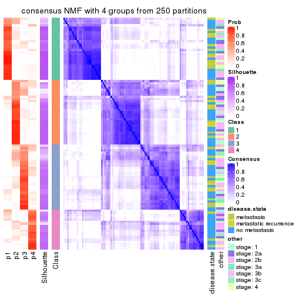</p>

</div>
<div id='tab-CV-NMF-consensus-heatmap-4'>
<pre><code class="r">consensus_heatmap(res, k = 5)
</code></pre>

<p></p>

</div>
<div id='tab-CV-NMF-consensus-heatmap-5'>
<pre><code class="r">consensus_heatmap(res, k = 6)
</code></pre>

<p></p>

</div>
</div>

Heatmaps for the membership of samples in all partitions to see how consistent they are:


<script>
$( function() {
	$( '#tabs-CV-NMF-membership-heatmap' ).tabs();
} );
</script>
<div id='tabs-CV-NMF-membership-heatmap'>
<ul>
<li><a href='#tab-CV-NMF-membership-heatmap-1'>k = 2</a></li>
<li><a href='#tab-CV-NMF-membership-heatmap-2'>k = 3</a></li>
<li><a href='#tab-CV-NMF-membership-heatmap-3'>k = 4</a></li>
<li><a href='#tab-CV-NMF-membership-heatmap-4'>k = 5</a></li>
<li><a href='#tab-CV-NMF-membership-heatmap-5'>k = 6</a></li>
</ul>
<div id='tab-CV-NMF-membership-heatmap-1'>
<pre><code class="r">membership_heatmap(res, k = 2)
</code></pre>

<p></p>

</div>
<div id='tab-CV-NMF-membership-heatmap-2'>
<pre><code class="r">membership_heatmap(res, k = 3)
</code></pre>

<p></p>

</div>
<div id='tab-CV-NMF-membership-heatmap-3'>
<pre><code class="r">membership_heatmap(res, k = 4)
</code></pre>

<p></p>

</div>
<div id='tab-CV-NMF-membership-heatmap-4'>
<pre><code class="r">membership_heatmap(res, k = 5)
</code></pre>

<p></p>

</div>
<div id='tab-CV-NMF-membership-heatmap-5'>
<pre><code class="r">membership_heatmap(res, k = 6)
</code></pre>

<p></p>

</div>
</div>

As soon as we have had the classes for columns, we can look for signatures
which are significantly different between classes which can be candidate marks
for certain classes. Following are the heatmaps for signatures.


Signature heatmaps where rows are scaled:


<script>
$( function() {
	$( '#tabs-CV-NMF-get-signatures' ).tabs();
} );
</script>
<div id='tabs-CV-NMF-get-signatures'>
<ul>
<li><a href='#tab-CV-NMF-get-signatures-1'>k = 2</a></li>
<li><a href='#tab-CV-NMF-get-signatures-2'>k = 3</a></li>
<li><a href='#tab-CV-NMF-get-signatures-3'>k = 4</a></li>
<li><a href='#tab-CV-NMF-get-signatures-4'>k = 5</a></li>
<li><a href='#tab-CV-NMF-get-signatures-5'>k = 6</a></li>
</ul>
<div id='tab-CV-NMF-get-signatures-1'>
<pre><code class="r">get_signatures(res, k = 2)
</code></pre>

<p></p>

</div>
<div id='tab-CV-NMF-get-signatures-2'>
<pre><code class="r">get_signatures(res, k = 3)
</code></pre>

<p></p>

</div>
<div id='tab-CV-NMF-get-signatures-3'>
<pre><code class="r">get_signatures(res, k = 4)
</code></pre>

<p></p>

</div>
<div id='tab-CV-NMF-get-signatures-4'>
<pre><code class="r">get_signatures(res, k = 5)
</code></pre>

<p></p>

</div>
<div id='tab-CV-NMF-get-signatures-5'>
<pre><code class="r">get_signatures(res, k = 6)
</code></pre>

<p></p>

</div>
</div>


Signature heatmaps where rows are not scaled:


<script>
$( function() {
	$( '#tabs-CV-NMF-get-signatures-no-scale' ).tabs();
} );
</script>
<div id='tabs-CV-NMF-get-signatures-no-scale'>
<ul>
<li><a href='#tab-CV-NMF-get-signatures-no-scale-1'>k = 2</a></li>
<li><a href='#tab-CV-NMF-get-signatures-no-scale-2'>k = 3</a></li>
<li><a href='#tab-CV-NMF-get-signatures-no-scale-3'>k = 4</a></li>
<li><a href='#tab-CV-NMF-get-signatures-no-scale-4'>k = 5</a></li>
<li><a href='#tab-CV-NMF-get-signatures-no-scale-5'>k = 6</a></li>
</ul>
<div id='tab-CV-NMF-get-signatures-no-scale-1'>
<pre><code class="r">get_signatures(res, k = 2, scale_rows = FALSE)
</code></pre>

<p></p>

</div>
<div id='tab-CV-NMF-get-signatures-no-scale-2'>
<pre><code class="r">get_signatures(res, k = 3, scale_rows = FALSE)
</code></pre>

<p></p>

</div>
<div id='tab-CV-NMF-get-signatures-no-scale-3'>
<pre><code class="r">get_signatures(res, k = 4, scale_rows = FALSE)
</code></pre>

<p></p>

</div>
<div id='tab-CV-NMF-get-signatures-no-scale-4'>
<pre><code class="r">get_signatures(res, k = 5, scale_rows = FALSE)
</code></pre>

<p></p>

</div>
<div id='tab-CV-NMF-get-signatures-no-scale-5'>
<pre><code class="r">get_signatures(res, k = 6, scale_rows = FALSE)
</code></pre>

<p></p>

</div>
</div>


Compare the overlap of signatures from different k:

```r
compare_signatures(res)
```


`get_signature()` returns a data frame invisibly. TO get the list of signatures, the function
call should be assigned to a variable explicitly. In following code, if `plot` argument is set
to `FALSE`, no heatmap is plotted while only the differential analysis is performed.

```r
# code only for demonstration
tb = get_signature(res, k = ..., plot = FALSE)
```

An example of the output of `tb` is:

```
#>   which_row         fdr    mean_1    mean_2 scaled_mean_1 scaled_mean_2 km
#> 1        38 0.042760348  8.373488  9.131774    -0.5533452     0.5164555  1
#> 2        40 0.018707592  7.106213  8.469186    -0.6173731     0.5762149  1
#> 3        55 0.019134737 10.221463 11.207825    -0.6159697     0.5749050  1
#> 4        59 0.006059896  5.921854  7.869574    -0.6899429     0.6439467  1
#> 5        60 0.018055526  8.928898 10.211722    -0.6204761     0.5791110  1
#> 6        98 0.009384629 15.714769 14.887706     0.6635654    -0.6193277  2
...
```

The columns in `tb` are:

1. `which_row`: row indices corresponding to the input matrix.
2. `fdr`: FDR for the differential test. 
3. `mean_x`: The mean value in group x.
4. `scaled_mean_x`: The mean value in group x after rows are scaled.
5. `km`: Row groups if k-means clustering is applied to rows.


UMAP plot which shows how samples are separated.


<script>
$( function() {
	$( '#tabs-CV-NMF-dimension-reduction' ).tabs();
} );
</script>
<div id='tabs-CV-NMF-dimension-reduction'>
<ul>
<li><a href='#tab-CV-NMF-dimension-reduction-1'>k = 2</a></li>
<li><a href='#tab-CV-NMF-dimension-reduction-2'>k = 3</a></li>
<li><a href='#tab-CV-NMF-dimension-reduction-3'>k = 4</a></li>
<li><a href='#tab-CV-NMF-dimension-reduction-4'>k = 5</a></li>
<li><a href='#tab-CV-NMF-dimension-reduction-5'>k = 6</a></li>
</ul>
<div id='tab-CV-NMF-dimension-reduction-1'>
<pre><code class="r">dimension_reduction(res, k = 2, method = &quot;UMAP&quot;)
</code></pre>

<p></p>

</div>
<div id='tab-CV-NMF-dimension-reduction-2'>
<pre><code class="r">dimension_reduction(res, k = 3, method = &quot;UMAP&quot;)
</code></pre>

<p></p>

</div>
<div id='tab-CV-NMF-dimension-reduction-3'>
<pre><code class="r">dimension_reduction(res, k = 4, method = &quot;UMAP&quot;)
</code></pre>

<p></p>

</div>
<div id='tab-CV-NMF-dimension-reduction-4'>
<pre><code class="r">dimension_reduction(res, k = 5, method = &quot;UMAP&quot;)
</code></pre>

<p></p>

</div>
<div id='tab-CV-NMF-dimension-reduction-5'>
<pre><code class="r">dimension_reduction(res, k = 6, method = &quot;UMAP&quot;)
</code></pre>

<p></p>

</div>
</div>


Following heatmap shows how subgroups are split when increasing `k`:

```r
collect_classes(res)
```


Test correlation between subgroups and known annotations. If the known
annotation is numeric, one-way ANOVA test is applied, and if the known
annotation is discrete, chi-squared contingency table test is applied.

```r
test_to_known_factors(res)
```

```
#>          n disease.state(p) other(p) k
#> CV:NMF 101            0.300    0.560 2
#> CV:NMF  76            0.380    0.735 3
#> CV:NMF  84            0.690    0.699 4
#> CV:NMF  76            0.502    0.441 5
#> CV:NMF  53            0.520    0.409 6
```


If matrix rows can be associated to genes, consider to use `functional_enrichment(res,
...)` to perform function enrichment for the signature genes. See [this vignette](http://bioconductor.org/packages/devel/bioc/vignettes/cola/inst/doc/functional_enrichment.html) for more detailed explanations.


 

---------------------------------------------------


### MAD:hclust


The object with results only for a single top-value method and a single partition method 
can be extracted as:

```r
res = res_list["MAD", "hclust"]
# you can also extract it by
# res = res_list["MAD:hclust"]
```

A summary of `res` and all the functions that can be applied to it:

```r
res
```

```
#> A 'ConsensusPartition' object with k = 2, 3, 4, 5, 6.
#>   On a matrix with 51941 rows and 104 columns.
#>   Top rows (1000, 2000, 3000, 4000, 5000) are extracted by 'MAD' method.
#>   Subgroups are detected by 'hclust' method.
#>   Performed in total 1250 partitions by row resampling.
#>   Best k for subgroups seems to be 3.
#> 
#> Following methods can be applied to this 'ConsensusPartition' object:
#>  [1] "cola_report"             "collect_classes"         "collect_plots"          
#>  [4] "collect_stats"           "colnames"                "compare_signatures"     
#>  [7] "consensus_heatmap"       "dimension_reduction"     "functional_enrichment"  
#> [10] "get_anno_col"            "get_anno"                "get_classes"            
#> [13] "get_consensus"           "get_matrix"              "get_membership"         
#> [16] "get_param"               "get_signatures"          "get_stats"              
#> [19] "is_best_k"               "is_stable_k"             "membership_heatmap"     
#> [22] "ncol"                    "nrow"                    "plot_ecdf"              
#> [25] "rownames"                "select_partition_number" "show"                   
#> [28] "suggest_best_k"          "test_to_known_factors"
```

`collect_plots()` function collects all the plots made from `res` for all `k` (number of partitions)
into one single page to provide an easy and fast comparison between different `k`.

```r
collect_plots(res)
```


The plots are:

- The first row: a plot of the ECDF (empirical cumulative distribution
  function) curves of the consensus matrix for each `k` and the heatmap of
  predicted classes for each `k`.
- The second row: heatmaps of the consensus matrix for each `k`.
- The third row: heatmaps of the membership matrix for each `k`.
- The fouth row: heatmaps of the signatures for each `k`.

All the plots in panels can be made by individual functions and they are
plotted later in this section.

`select_partition_number()` produces several plots showing different
statistics for choosing "optimized" `k`. There are following statistics:

- ECDF curves of the consensus matrix for each `k`;
- 1-PAC. [The PAC
  score](https://en.wikipedia.org/wiki/Consensus_clustering#Over-interpretation_potential_of_consensus_clustering)
  measures the proportion of the ambiguous subgrouping.
- Mean silhouette score.
- Concordance. The mean probability of fiting the consensus class ids in all
  partitions.
- Area increased. Denote $A_k$ as the area under the ECDF curve for current
  `k`, the area increased is defined as $A_k - A_{k-1}$.
- Rand index. The percent of pairs of samples that are both in a same cluster
  or both are not in a same cluster in the partition of k and k-1.
- Jaccard index. The ratio of pairs of samples are both in a same cluster in
  the partition of k and k-1 and the pairs of samples are both in a same
  cluster in the partition k or k-1.

The detailed explanations of these statistics can be found in [the _cola_
vignette](http://bioconductor.org/packages/devel/bioc/vignettes/cola/inst/doc/cola.html#toc_13).

Generally speaking, lower PAC score, higher mean silhouette score or higher
concordance corresponds to better partition. Rand index and Jaccard index
measure how similar the current partition is compared to partition with `k-1`.
If they are too similar, we won't accept `k` is better than `k-1`.

```r
select_partition_number(res)
```


The numeric values for all these statistics can be obtained by `get_stats()`.

```r
get_stats(res)
```

```
#>   k 1-PAC mean_silhouette concordance area_increased  Rand Jaccard
#> 2 2 0.364           0.716       0.860         0.3115 0.751   0.751
#> 3 3 0.148           0.521       0.707         0.7784 0.673   0.580
#> 4 4 0.184           0.496       0.597         0.1957 0.841   0.680
#> 5 5 0.263           0.407       0.589         0.0807 0.879   0.680
#> 6 6 0.329           0.347       0.579         0.0533 0.970   0.897
```

`suggest_best_k()` suggests the best $k$ based on these statistics. The rules are as follows:

- All $k$ with Jaccard index larger than 0.95 are removed because increasing
  $k$ does not provide enough extra information. If all $k$ are removed, it is
  marked as no subgroup is detected.
- For all $k$ with 1-PAC score larger than 0.9, the maximal $k$ is taken as
  the best $k$, and other $k$ are marked as optional $k$.
- If it does not fit the second rule. The $k$ with the maximal vote of the
  highest 1-PAC score, highest mean silhouette, and highest concordance is
  taken as the best $k$.

```r
suggest_best_k(res)
```

```
#> [1] 3
```


Following shows the table of the partitions (You need to click the **show/hide
code output** link to see it). The membership matrix (columns with name `p*`)
is inferred by
[`clue::cl_consensus()`](https://www.rdocumentation.org/link/cl_consensus?package=clue)
function with the `SE` method. Basically the value in the membership matrix
represents the probability to belong to a certain group. The finall class
label for an item is determined with the group with highest probability it
belongs to.

In `get_classes()` function, the entropy is calculated from the membership
matrix and the silhouette score is calculated from the consensus matrix.


<script>
$( function() {
	$( '#tabs-MAD-hclust-get-classes' ).tabs();
} );
</script>
<div id='tabs-MAD-hclust-get-classes'>
<ul>
<li><a href='#tab-MAD-hclust-get-classes-1'>k = 2</a></li>
<li><a href='#tab-MAD-hclust-get-classes-2'>k = 3</a></li>
<li><a href='#tab-MAD-hclust-get-classes-3'>k = 4</a></li>
<li><a href='#tab-MAD-hclust-get-classes-4'>k = 5</a></li>
<li><a href='#tab-MAD-hclust-get-classes-5'>k = 6</a></li>
</ul>

<div id='tab-MAD-hclust-get-classes-1'>
<p><a id='tab-MAD-hclust-get-classes-1-a' style='color:#0366d6' href='#'>show/hide code output</a></p>
<pre><code class="r">cbind(get_classes(res, k = 2), get_membership(res, k = 2))
</code></pre>

<pre><code>#&gt;           class entropy silhouette    p1    p2
#&gt; GSM537341     2  0.9170     0.5436 0.332 0.668
#&gt; GSM537345     1  0.0376     0.7233 0.996 0.004
#&gt; GSM537355     2  0.0672     0.8407 0.008 0.992
#&gt; GSM537366     2  0.9393     0.4852 0.356 0.644
#&gt; GSM537370     2  0.9170     0.5437 0.332 0.668
#&gt; GSM537380     2  0.0376     0.8421 0.004 0.996
#&gt; GSM537392     2  0.0376     0.8421 0.004 0.996
#&gt; GSM537415     2  0.0000     0.8404 0.000 1.000
#&gt; GSM537417     2  0.7602     0.7246 0.220 0.780
#&gt; GSM537422     2  0.8443     0.6487 0.272 0.728
#&gt; GSM537423     2  0.0000     0.8404 0.000 1.000
#&gt; GSM537427     2  0.0938     0.8425 0.012 0.988
#&gt; GSM537430     2  0.2948     0.8407 0.052 0.948
#&gt; GSM537336     1  0.0938     0.7258 0.988 0.012
#&gt; GSM537337     2  0.2603     0.8474 0.044 0.956
#&gt; GSM537348     2  0.9170     0.5436 0.332 0.668
#&gt; GSM537349     2  0.0376     0.8406 0.004 0.996
#&gt; GSM537356     2  0.9393     0.4933 0.356 0.644
#&gt; GSM537361     2  0.9209     0.5364 0.336 0.664
#&gt; GSM537374     2  0.4022     0.8355 0.080 0.920
#&gt; GSM537377     1  0.0376     0.7233 0.996 0.004
#&gt; GSM537378     2  0.0000     0.8404 0.000 1.000
#&gt; GSM537379     2  0.5946     0.8098 0.144 0.856
#&gt; GSM537383     2  0.0376     0.8421 0.004 0.996
#&gt; GSM537388     2  0.0376     0.8406 0.004 0.996
#&gt; GSM537395     2  0.2423     0.8470 0.040 0.960
#&gt; GSM537400     2  0.6531     0.7917 0.168 0.832
#&gt; GSM537404     2  0.9427     0.4879 0.360 0.640
#&gt; GSM537409     2  0.0672     0.8405 0.008 0.992
#&gt; GSM537418     2  0.9922     0.2134 0.448 0.552
#&gt; GSM537425     2  0.9732     0.3667 0.404 0.596
#&gt; GSM537333     2  0.5059     0.8274 0.112 0.888
#&gt; GSM537342     2  0.2778     0.8461 0.048 0.952
#&gt; GSM537347     2  0.8016     0.7090 0.244 0.756
#&gt; GSM537350     2  0.5737     0.8038 0.136 0.864
#&gt; GSM537362     1  0.9954     0.1559 0.540 0.460
#&gt; GSM537363     2  0.6048     0.7898 0.148 0.852
#&gt; GSM537368     1  0.0938     0.7258 0.988 0.012
#&gt; GSM537376     2  0.4815     0.8333 0.104 0.896
#&gt; GSM537381     2  0.9977     0.0955 0.472 0.528
#&gt; GSM537386     2  0.0672     0.8429 0.008 0.992
#&gt; GSM537398     2  0.9580     0.4197 0.380 0.620
#&gt; GSM537402     2  0.1843     0.8472 0.028 0.972
#&gt; GSM537405     1  0.2043     0.7232 0.968 0.032
#&gt; GSM537371     1  0.0938     0.7258 0.988 0.012
#&gt; GSM537421     2  0.5059     0.8103 0.112 0.888
#&gt; GSM537424     2  0.8016     0.7090 0.244 0.756
#&gt; GSM537432     2  0.5294     0.8227 0.120 0.880
#&gt; GSM537331     2  0.0672     0.8407 0.008 0.992
#&gt; GSM537332     2  0.1633     0.8446 0.024 0.976
#&gt; GSM537334     2  0.3879     0.8389 0.076 0.924
#&gt; GSM537338     2  0.4298     0.8361 0.088 0.912
#&gt; GSM537353     2  0.2043     0.8472 0.032 0.968
#&gt; GSM537357     1  0.0938     0.7258 0.988 0.012
#&gt; GSM537358     2  0.0672     0.8424 0.008 0.992
#&gt; GSM537375     2  0.4431     0.8343 0.092 0.908
#&gt; GSM537389     2  0.0376     0.8406 0.004 0.996
#&gt; GSM537390     2  0.0000     0.8404 0.000 1.000
#&gt; GSM537393     2  0.2778     0.8464 0.048 0.952
#&gt; GSM537399     2  0.4690     0.8210 0.100 0.900
#&gt; GSM537407     2  0.8955     0.5865 0.312 0.688
#&gt; GSM537408     2  0.3584     0.8421 0.068 0.932
#&gt; GSM537428     2  0.2603     0.8457 0.044 0.956
#&gt; GSM537354     2  0.2423     0.8470 0.040 0.960
#&gt; GSM537410     2  0.2778     0.8461 0.048 0.952
#&gt; GSM537413     2  0.0376     0.8396 0.004 0.996
#&gt; GSM537396     2  0.2603     0.8460 0.044 0.956
#&gt; GSM537397     2  0.9209     0.5352 0.336 0.664
#&gt; GSM537330     2  0.3733     0.8429 0.072 0.928
#&gt; GSM537369     1  0.9358     0.4751 0.648 0.352
#&gt; GSM537373     2  0.2948     0.8456 0.052 0.948
#&gt; GSM537401     2  0.9170     0.5436 0.332 0.668
#&gt; GSM537343     2  0.8386     0.6640 0.268 0.732
#&gt; GSM537367     2  0.8386     0.6471 0.268 0.732
#&gt; GSM537382     2  0.4562     0.8366 0.096 0.904
#&gt; GSM537385     2  0.0938     0.8426 0.012 0.988
#&gt; GSM537391     1  1.0000     0.0353 0.504 0.496
#&gt; GSM537419     2  0.0376     0.8420 0.004 0.996
#&gt; GSM537420     1  0.9358     0.4751 0.648 0.352
#&gt; GSM537429     2  0.2603     0.8462 0.044 0.956
#&gt; GSM537431     2  0.6438     0.7976 0.164 0.836
#&gt; GSM537387     1  1.0000     0.0353 0.504 0.496
#&gt; GSM537414     2  0.7815     0.7075 0.232 0.768
#&gt; GSM537433     2  0.9358     0.4909 0.352 0.648
#&gt; GSM537335     2  0.3879     0.8389 0.076 0.924
#&gt; GSM537339     2  0.9170     0.5436 0.332 0.668
#&gt; GSM537340     2  0.5059     0.8129 0.112 0.888
#&gt; GSM537344     1  0.9358     0.4751 0.648 0.352
#&gt; GSM537346     2  0.0938     0.8447 0.012 0.988
#&gt; GSM537351     1  0.9866     0.2792 0.568 0.432
#&gt; GSM537352     2  0.2423     0.8469 0.040 0.960
#&gt; GSM537359     2  0.0376     0.8421 0.004 0.996
#&gt; GSM537360     2  0.0938     0.8442 0.012 0.988
#&gt; GSM537364     1  0.1633     0.7251 0.976 0.024
#&gt; GSM537365     2  0.7139     0.7541 0.196 0.804
#&gt; GSM537372     2  0.9323     0.5078 0.348 0.652
#&gt; GSM537384     2  0.9170     0.5453 0.332 0.668
#&gt; GSM537394     2  0.1184     0.8458 0.016 0.984
#&gt; GSM537403     2  0.2948     0.8443 0.052 0.948
#&gt; GSM537406     2  0.2603     0.8460 0.044 0.956
#&gt; GSM537411     2  0.4939     0.8265 0.108 0.892
#&gt; GSM537412     2  0.0672     0.8405 0.008 0.992
#&gt; GSM537416     2  0.1633     0.8462 0.024 0.976
#&gt; GSM537426     2  0.0672     0.8405 0.008 0.992
</code></pre>

<script>
$('#tab-MAD-hclust-get-classes-1-a').parent().next().next().hide();
$('#tab-MAD-hclust-get-classes-1-a').click(function(){
  $('#tab-MAD-hclust-get-classes-1-a').parent().next().next().toggle();
  return(false);
});
</script>
</div>

<div id='tab-MAD-hclust-get-classes-2'>
<p><a id='tab-MAD-hclust-get-classes-2-a' style='color:#0366d6' href='#'>show/hide code output</a></p>
<pre><code class="r">cbind(get_classes(res, k = 3), get_membership(res, k = 3))
</code></pre>

<pre><code>#&gt;           class entropy silhouette    p1    p2    p3
#&gt; GSM537341     2  0.8261     0.4478 0.260 0.616 0.124
#&gt; GSM537345     1  0.0983     0.7210 0.980 0.004 0.016
#&gt; GSM537355     2  0.3375     0.6638 0.008 0.892 0.100
#&gt; GSM537366     3  0.9760     0.5315 0.280 0.276 0.444
#&gt; GSM537370     2  0.8203     0.4480 0.268 0.616 0.116
#&gt; GSM537380     2  0.2261     0.6591 0.000 0.932 0.068
#&gt; GSM537392     2  0.2165     0.6584 0.000 0.936 0.064
#&gt; GSM537415     2  0.5465     0.4211 0.000 0.712 0.288
#&gt; GSM537417     3  0.7633     0.6333 0.132 0.184 0.684
#&gt; GSM537422     3  0.7510     0.5707 0.184 0.124 0.692
#&gt; GSM537423     2  0.3482     0.6399 0.000 0.872 0.128
#&gt; GSM537427     2  0.3213     0.6697 0.008 0.900 0.092
#&gt; GSM537430     2  0.4469     0.6660 0.028 0.852 0.120
#&gt; GSM537336     1  0.1753     0.7287 0.952 0.000 0.048
#&gt; GSM537337     2  0.5122     0.6106 0.012 0.788 0.200
#&gt; GSM537348     2  0.8202     0.4501 0.260 0.620 0.120
#&gt; GSM537349     2  0.2496     0.6591 0.004 0.928 0.068
#&gt; GSM537356     2  0.8572     0.3923 0.288 0.580 0.132
#&gt; GSM537361     3  0.9487     0.5701 0.244 0.260 0.496
#&gt; GSM537374     2  0.5136     0.6564 0.044 0.824 0.132
#&gt; GSM537377     1  0.0983     0.7210 0.980 0.004 0.016
#&gt; GSM537378     2  0.5465     0.4211 0.000 0.712 0.288
#&gt; GSM537379     2  0.7376     0.5468 0.076 0.672 0.252
#&gt; GSM537383     2  0.2261     0.6577 0.000 0.932 0.068
#&gt; GSM537388     2  0.2400     0.6623 0.004 0.932 0.064
#&gt; GSM537395     2  0.4963     0.6045 0.008 0.792 0.200
#&gt; GSM537400     2  0.8527     0.1352 0.096 0.504 0.400
#&gt; GSM537404     3  0.9488     0.5637 0.256 0.248 0.496
#&gt; GSM537409     3  0.5098     0.5649 0.000 0.248 0.752
#&gt; GSM537418     3  0.9752     0.4275 0.352 0.232 0.416
#&gt; GSM537425     3  0.9399     0.5304 0.292 0.208 0.500
#&gt; GSM537333     3  0.7363     0.4338 0.040 0.372 0.588
#&gt; GSM537342     2  0.5815     0.4767 0.004 0.692 0.304
#&gt; GSM537347     2  0.9125     0.1242 0.164 0.516 0.320
#&gt; GSM537350     2  0.7106     0.5386 0.076 0.700 0.224
#&gt; GSM537362     1  0.9608    -0.0985 0.468 0.300 0.232
#&gt; GSM537363     3  0.7880     0.5965 0.096 0.268 0.636
#&gt; GSM537368     1  0.1860     0.7286 0.948 0.000 0.052
#&gt; GSM537376     2  0.7364     0.4647 0.056 0.640 0.304
#&gt; GSM537381     3  0.9550     0.3934 0.368 0.196 0.436
#&gt; GSM537386     2  0.4002     0.6406 0.000 0.840 0.160
#&gt; GSM537398     2  0.8415     0.3847 0.320 0.572 0.108
#&gt; GSM537402     2  0.3528     0.6742 0.016 0.892 0.092
#&gt; GSM537405     1  0.2446     0.7248 0.936 0.012 0.052
#&gt; GSM537371     1  0.1753     0.7280 0.952 0.000 0.048
#&gt; GSM537421     3  0.7022     0.6001 0.068 0.232 0.700
#&gt; GSM537424     2  0.9174     0.0582 0.164 0.504 0.332
#&gt; GSM537432     2  0.7536     0.4695 0.068 0.640 0.292
#&gt; GSM537331     2  0.2486     0.6611 0.008 0.932 0.060
#&gt; GSM537332     2  0.6386     0.1133 0.004 0.584 0.412
#&gt; GSM537334     2  0.4423     0.6503 0.048 0.864 0.088
#&gt; GSM537338     2  0.5637     0.6366 0.040 0.788 0.172
#&gt; GSM537353     2  0.5681     0.5554 0.016 0.748 0.236
#&gt; GSM537357     1  0.1753     0.7287 0.952 0.000 0.048
#&gt; GSM537358     2  0.3272     0.6600 0.004 0.892 0.104
#&gt; GSM537375     2  0.6057     0.6206 0.044 0.760 0.196
#&gt; GSM537389     2  0.2496     0.6591 0.004 0.928 0.068
#&gt; GSM537390     2  0.5621     0.3929 0.000 0.692 0.308
#&gt; GSM537393     2  0.6161     0.5133 0.020 0.708 0.272
#&gt; GSM537399     2  0.6887     0.5744 0.076 0.720 0.204
#&gt; GSM537407     3  0.9570     0.4701 0.204 0.348 0.448
#&gt; GSM537408     2  0.5506     0.5948 0.016 0.764 0.220
#&gt; GSM537428     2  0.4342     0.6651 0.024 0.856 0.120
#&gt; GSM537354     2  0.4963     0.6045 0.008 0.792 0.200
#&gt; GSM537410     2  0.5815     0.4767 0.004 0.692 0.304
#&gt; GSM537413     2  0.4235     0.6148 0.000 0.824 0.176
#&gt; GSM537396     2  0.4883     0.6000 0.004 0.788 0.208
#&gt; GSM537397     2  0.8263     0.4435 0.268 0.612 0.120
#&gt; GSM537330     2  0.5746     0.6286 0.040 0.780 0.180
#&gt; GSM537369     1  0.8727     0.3409 0.572 0.280 0.148
#&gt; GSM537373     2  0.5659     0.5448 0.012 0.740 0.248
#&gt; GSM537401     2  0.8261     0.4478 0.260 0.616 0.124
#&gt; GSM537343     3  0.9260     0.4451 0.160 0.376 0.464
#&gt; GSM537367     3  0.8171     0.6070 0.184 0.172 0.644
#&gt; GSM537382     2  0.7260     0.4412 0.048 0.636 0.316
#&gt; GSM537385     2  0.2774     0.6657 0.008 0.920 0.072
#&gt; GSM537391     2  0.8793     0.0561 0.436 0.452 0.112
#&gt; GSM537419     2  0.2261     0.6627 0.000 0.932 0.068
#&gt; GSM537420     1  0.8727     0.3409 0.572 0.280 0.148
#&gt; GSM537429     2  0.4094     0.6606 0.028 0.872 0.100
#&gt; GSM537431     3  0.7481     0.4944 0.064 0.296 0.640
#&gt; GSM537387     2  0.8793     0.0561 0.436 0.452 0.112
#&gt; GSM537414     3  0.8920     0.5313 0.144 0.324 0.532
#&gt; GSM537433     3  0.9283     0.5663 0.260 0.216 0.524
#&gt; GSM537335     2  0.4423     0.6503 0.048 0.864 0.088
#&gt; GSM537339     2  0.8261     0.4478 0.260 0.616 0.124
#&gt; GSM537340     3  0.6976     0.5986 0.064 0.236 0.700
#&gt; GSM537344     1  0.8727     0.3409 0.572 0.280 0.148
#&gt; GSM537346     2  0.4233     0.6409 0.004 0.836 0.160
#&gt; GSM537351     3  0.6678    -0.0346 0.480 0.008 0.512
#&gt; GSM537352     2  0.5220     0.5965 0.012 0.780 0.208
#&gt; GSM537359     2  0.2959     0.6550 0.000 0.900 0.100
#&gt; GSM537360     2  0.6527     0.1149 0.008 0.588 0.404
#&gt; GSM537364     1  0.1964     0.7247 0.944 0.000 0.056
#&gt; GSM537365     3  0.9071     0.3117 0.136 0.432 0.432
#&gt; GSM537372     2  0.8380     0.4299 0.276 0.600 0.124
#&gt; GSM537384     2  0.8430     0.4353 0.260 0.604 0.136
#&gt; GSM537394     2  0.4228     0.6478 0.008 0.844 0.148
#&gt; GSM537403     3  0.6667     0.4806 0.016 0.368 0.616
#&gt; GSM537406     2  0.4883     0.6000 0.004 0.788 0.208
#&gt; GSM537411     2  0.6796     0.5803 0.056 0.708 0.236
#&gt; GSM537412     3  0.5178     0.5625 0.000 0.256 0.744
#&gt; GSM537416     3  0.5058     0.5761 0.000 0.244 0.756
#&gt; GSM537426     3  0.5178     0.5625 0.000 0.256 0.744
</code></pre>

<script>
$('#tab-MAD-hclust-get-classes-2-a').parent().next().next().hide();
$('#tab-MAD-hclust-get-classes-2-a').click(function(){
  $('#tab-MAD-hclust-get-classes-2-a').parent().next().next().toggle();
  return(false);
});
</script>
</div>

<div id='tab-MAD-hclust-get-classes-3'>
<p><a id='tab-MAD-hclust-get-classes-3-a' style='color:#0366d6' href='#'>show/hide code output</a></p>
<pre><code class="r">cbind(get_classes(res, k = 4), get_membership(res, k = 4))
</code></pre>

<pre><code>#&gt;           class entropy silhouette    p1    p2    p3    p4
#&gt; GSM537341     1   0.557     0.6852 0.684 0.272 0.008 0.036
#&gt; GSM537345     4   0.380     0.7494 0.220 0.000 0.000 0.780
#&gt; GSM537355     2   0.607     0.4741 0.268 0.648 0.084 0.000
#&gt; GSM537366     3   0.962     0.5066 0.248 0.160 0.384 0.208
#&gt; GSM537370     1   0.570     0.6662 0.664 0.288 0.004 0.044
#&gt; GSM537380     2   0.239     0.5786 0.036 0.928 0.024 0.012
#&gt; GSM537392     2   0.207     0.5810 0.028 0.940 0.024 0.008
#&gt; GSM537415     2   0.442     0.4511 0.008 0.736 0.256 0.000
#&gt; GSM537417     3   0.688     0.6211 0.092 0.080 0.688 0.140
#&gt; GSM537422     3   0.643     0.5742 0.076 0.040 0.696 0.188
#&gt; GSM537423     2   0.227     0.5774 0.004 0.912 0.084 0.000
#&gt; GSM537427     2   0.538     0.5915 0.160 0.748 0.088 0.004
#&gt; GSM537430     2   0.624     0.4875 0.276 0.632 0.092 0.000
#&gt; GSM537336     4   0.172     0.8602 0.048 0.000 0.008 0.944
#&gt; GSM537337     2   0.709     0.5447 0.212 0.588 0.196 0.004
#&gt; GSM537348     1   0.586     0.6801 0.672 0.272 0.012 0.044
#&gt; GSM537349     2   0.259     0.5872 0.080 0.904 0.016 0.000
#&gt; GSM537356     1   0.677     0.6515 0.640 0.244 0.024 0.092
#&gt; GSM537361     3   0.911     0.5774 0.220 0.096 0.440 0.244
#&gt; GSM537374     2   0.632     0.4526 0.300 0.612 0.088 0.000
#&gt; GSM537377     4   0.380     0.7494 0.220 0.000 0.000 0.780
#&gt; GSM537378     2   0.442     0.4511 0.008 0.736 0.256 0.000
#&gt; GSM537379     2   0.804     0.3505 0.336 0.448 0.200 0.016
#&gt; GSM537383     2   0.136     0.5848 0.020 0.964 0.012 0.004
#&gt; GSM537388     2   0.534     0.4717 0.260 0.696 0.044 0.000
#&gt; GSM537395     2   0.706     0.5502 0.200 0.592 0.204 0.004
#&gt; GSM537400     3   0.893     0.0365 0.332 0.260 0.356 0.052
#&gt; GSM537404     3   0.939     0.5720 0.212 0.136 0.424 0.228
#&gt; GSM537409     3   0.340     0.5409 0.004 0.164 0.832 0.000
#&gt; GSM537418     3   0.931     0.4670 0.304 0.084 0.344 0.268
#&gt; GSM537425     3   0.941     0.5224 0.208 0.120 0.392 0.280
#&gt; GSM537333     3   0.750     0.4991 0.208 0.172 0.592 0.028
#&gt; GSM537342     2   0.668     0.3215 0.124 0.592 0.284 0.000
#&gt; GSM537347     2   0.943    -0.0276 0.304 0.340 0.256 0.100
#&gt; GSM537350     2   0.688     0.3763 0.232 0.624 0.132 0.012
#&gt; GSM537362     1   0.918     0.1656 0.440 0.120 0.176 0.264
#&gt; GSM537363     3   0.717     0.5679 0.092 0.140 0.668 0.100
#&gt; GSM537368     4   0.205     0.8588 0.064 0.000 0.008 0.928
#&gt; GSM537376     2   0.842     0.3585 0.284 0.416 0.276 0.024
#&gt; GSM537381     3   0.926     0.4258 0.240 0.084 0.340 0.336
#&gt; GSM537386     2   0.551     0.5905 0.128 0.744 0.124 0.004
#&gt; GSM537398     1   0.685     0.6630 0.620 0.232 0.008 0.140
#&gt; GSM537402     2   0.558     0.5537 0.220 0.712 0.064 0.004
#&gt; GSM537405     4   0.220     0.8568 0.080 0.000 0.004 0.916
#&gt; GSM537371     4   0.197     0.8595 0.060 0.000 0.008 0.932
#&gt; GSM537421     3   0.562     0.5736 0.040 0.112 0.768 0.080
#&gt; GSM537424     2   0.946    -0.0763 0.304 0.328 0.268 0.100
#&gt; GSM537432     2   0.834     0.3162 0.340 0.396 0.244 0.020
#&gt; GSM537331     2   0.554     0.4026 0.320 0.644 0.036 0.000
#&gt; GSM537332     2   0.724     0.0884 0.112 0.476 0.404 0.008
#&gt; GSM537334     2   0.607     0.1530 0.452 0.504 0.044 0.000
#&gt; GSM537338     2   0.702     0.4373 0.320 0.540 0.140 0.000
#&gt; GSM537353     2   0.733     0.5372 0.160 0.584 0.240 0.016
#&gt; GSM537357     4   0.172     0.8602 0.048 0.000 0.008 0.944
#&gt; GSM537358     2   0.367     0.6055 0.044 0.860 0.092 0.004
#&gt; GSM537375     2   0.731     0.4307 0.304 0.532 0.160 0.004
#&gt; GSM537389     2   0.280     0.5858 0.092 0.892 0.016 0.000
#&gt; GSM537390     2   0.498     0.4149 0.016 0.680 0.304 0.000
#&gt; GSM537393     2   0.726     0.4981 0.176 0.556 0.264 0.004
#&gt; GSM537399     2   0.696     0.4825 0.220 0.620 0.148 0.012
#&gt; GSM537407     3   0.978     0.5007 0.232 0.228 0.356 0.184
#&gt; GSM537408     2   0.592     0.4522 0.176 0.696 0.128 0.000
#&gt; GSM537428     2   0.635     0.5284 0.252 0.636 0.112 0.000
#&gt; GSM537354     2   0.706     0.5502 0.200 0.592 0.204 0.004
#&gt; GSM537410     2   0.668     0.3215 0.124 0.592 0.284 0.000
#&gt; GSM537413     2   0.573     0.4254 0.088 0.732 0.168 0.012
#&gt; GSM537396     2   0.557     0.4714 0.152 0.728 0.120 0.000
#&gt; GSM537397     1   0.545     0.6840 0.680 0.276 0.000 0.044
#&gt; GSM537330     2   0.729     0.3814 0.336 0.524 0.132 0.008
#&gt; GSM537369     1   0.601     0.1745 0.616 0.024 0.020 0.340
#&gt; GSM537373     2   0.661     0.4177 0.132 0.648 0.212 0.008
#&gt; GSM537401     1   0.557     0.6852 0.684 0.272 0.008 0.036
#&gt; GSM537343     3   0.962     0.4551 0.232 0.264 0.364 0.140
#&gt; GSM537367     3   0.767     0.6079 0.080 0.124 0.620 0.176
#&gt; GSM537382     2   0.835     0.3303 0.268 0.412 0.300 0.020
#&gt; GSM537385     2   0.439     0.5103 0.236 0.752 0.012 0.000
#&gt; GSM537391     1   0.639     0.6520 0.652 0.156 0.000 0.192
#&gt; GSM537419     2   0.230     0.5901 0.044 0.928 0.024 0.004
#&gt; GSM537420     1   0.601     0.1745 0.616 0.024 0.020 0.340
#&gt; GSM537429     2   0.597     0.4143 0.332 0.612 0.056 0.000
#&gt; GSM537431     3   0.783     0.4950 0.172 0.160 0.600 0.068
#&gt; GSM537387     1   0.639     0.6520 0.652 0.156 0.000 0.192
#&gt; GSM537414     3   0.887     0.5569 0.204 0.160 0.504 0.132
#&gt; GSM537433     3   0.917     0.5674 0.172 0.132 0.456 0.240
#&gt; GSM537335     2   0.607     0.1530 0.452 0.504 0.044 0.000
#&gt; GSM537339     1   0.557     0.6852 0.684 0.272 0.008 0.036
#&gt; GSM537340     3   0.566     0.5731 0.048 0.108 0.768 0.076
#&gt; GSM537344     1   0.601     0.1745 0.616 0.024 0.020 0.340
#&gt; GSM537346     2   0.523     0.5749 0.128 0.756 0.116 0.000
#&gt; GSM537351     4   0.718    -0.0475 0.136 0.000 0.404 0.460
#&gt; GSM537352     2   0.710     0.5560 0.180 0.584 0.232 0.004
#&gt; GSM537359     2   0.507     0.5048 0.124 0.788 0.072 0.016
#&gt; GSM537360     2   0.619     0.2051 0.044 0.540 0.412 0.004
#&gt; GSM537364     4   0.213     0.8558 0.076 0.000 0.004 0.920
#&gt; GSM537365     3   0.947     0.3571 0.212 0.260 0.396 0.132
#&gt; GSM537372     1   0.554     0.6921 0.688 0.264 0.004 0.044
#&gt; GSM537384     1   0.626     0.6667 0.656 0.272 0.028 0.044
#&gt; GSM537394     2   0.543     0.5829 0.132 0.740 0.128 0.000
#&gt; GSM537403     3   0.575     0.4373 0.036 0.264 0.684 0.016
#&gt; GSM537406     2   0.552     0.4746 0.152 0.732 0.116 0.000
#&gt; GSM537411     2   0.779     0.3282 0.352 0.452 0.188 0.008
#&gt; GSM537412     3   0.322     0.5396 0.000 0.164 0.836 0.000
#&gt; GSM537416     3   0.365     0.5539 0.016 0.152 0.832 0.000
#&gt; GSM537426     3   0.322     0.5396 0.000 0.164 0.836 0.000
</code></pre>

<script>
$('#tab-MAD-hclust-get-classes-3-a').parent().next().next().hide();
$('#tab-MAD-hclust-get-classes-3-a').click(function(){
  $('#tab-MAD-hclust-get-classes-3-a').parent().next().next().toggle();
  return(false);
});
</script>
</div>

<div id='tab-MAD-hclust-get-classes-4'>
<p><a id='tab-MAD-hclust-get-classes-4-a' style='color:#0366d6' href='#'>show/hide code output</a></p>
<pre><code class="r">cbind(get_classes(res, k = 5), get_membership(res, k = 5))
</code></pre>

<pre><code>#&gt;           class entropy silhouette    p1    p2    p3    p4    p5
#&gt; GSM537341     5   0.358     0.6065 0.008 0.168 0.016 0.000 0.808
#&gt; GSM537345     1   0.402     0.6796 0.792 0.000 0.004 0.052 0.152
#&gt; GSM537355     2   0.610     0.3505 0.000 0.588 0.084 0.028 0.300
#&gt; GSM537366     3   0.790     0.4558 0.060 0.120 0.540 0.072 0.208
#&gt; GSM537370     5   0.425     0.5924 0.012 0.192 0.024 0.004 0.768
#&gt; GSM537380     2   0.261     0.5619 0.000 0.896 0.004 0.044 0.056
#&gt; GSM537392     2   0.216     0.5631 0.000 0.920 0.004 0.040 0.036
#&gt; GSM537415     2   0.503     0.4662 0.000 0.716 0.184 0.092 0.008
#&gt; GSM537417     3   0.629    -0.0181 0.036 0.056 0.628 0.256 0.024
#&gt; GSM537422     3   0.647    -0.0842 0.072 0.024 0.600 0.276 0.028
#&gt; GSM537423     2   0.309     0.5722 0.000 0.876 0.068 0.036 0.020
#&gt; GSM537427     2   0.545     0.5423 0.000 0.708 0.088 0.036 0.168
#&gt; GSM537430     2   0.640     0.3390 0.000 0.544 0.112 0.024 0.320
#&gt; GSM537336     1   0.437     0.8160 0.772 0.000 0.164 0.012 0.052
#&gt; GSM537337     2   0.749     0.4145 0.004 0.504 0.192 0.068 0.232
#&gt; GSM537348     5   0.385     0.6044 0.008 0.168 0.028 0.000 0.796
#&gt; GSM537349     2   0.281     0.5603 0.000 0.876 0.012 0.012 0.100
#&gt; GSM537356     5   0.505     0.5758 0.012 0.148 0.112 0.000 0.728
#&gt; GSM537361     3   0.502     0.4357 0.072 0.044 0.784 0.028 0.072
#&gt; GSM537374     2   0.652     0.2911 0.000 0.524 0.120 0.024 0.332
#&gt; GSM537377     1   0.402     0.6796 0.792 0.000 0.004 0.052 0.152
#&gt; GSM537378     2   0.503     0.4662 0.000 0.716 0.184 0.092 0.008
#&gt; GSM537379     2   0.800     0.1329 0.016 0.356 0.264 0.044 0.320
#&gt; GSM537383     2   0.165     0.5688 0.000 0.944 0.004 0.020 0.032
#&gt; GSM537388     2   0.537     0.3660 0.000 0.632 0.048 0.016 0.304
#&gt; GSM537395     2   0.748     0.4246 0.004 0.512 0.192 0.072 0.220
#&gt; GSM537400     3   0.875     0.0808 0.036 0.128 0.360 0.160 0.316
#&gt; GSM537404     3   0.677     0.5088 0.064 0.104 0.652 0.036 0.144
#&gt; GSM537409     4   0.605     0.6509 0.004 0.112 0.360 0.524 0.000
#&gt; GSM537418     3   0.721     0.4498 0.132 0.048 0.592 0.036 0.192
#&gt; GSM537425     3   0.750     0.4615 0.116 0.080 0.604 0.068 0.132
#&gt; GSM537333     3   0.752     0.0268 0.024 0.108 0.540 0.248 0.080
#&gt; GSM537342     2   0.723     0.3041 0.016 0.556 0.244 0.124 0.060
#&gt; GSM537347     3   0.777     0.2325 0.016 0.288 0.404 0.032 0.260
#&gt; GSM537350     2   0.694     0.3403 0.016 0.604 0.152 0.052 0.176
#&gt; GSM537362     5   0.870    -0.0286 0.216 0.044 0.276 0.084 0.380
#&gt; GSM537363     4   0.793     0.5121 0.076 0.084 0.296 0.488 0.056
#&gt; GSM537368     1   0.376     0.8168 0.800 0.000 0.156 0.000 0.044
#&gt; GSM537376     5   0.855    -0.1369 0.012 0.308 0.248 0.116 0.316
#&gt; GSM537381     3   0.708     0.4437 0.148 0.052 0.592 0.020 0.188
#&gt; GSM537386     2   0.576     0.5400 0.000 0.688 0.164 0.044 0.104
#&gt; GSM537398     5   0.545     0.5783 0.128 0.128 0.024 0.004 0.716
#&gt; GSM537402     2   0.613     0.4820 0.008 0.640 0.080 0.036 0.236
#&gt; GSM537405     1   0.400     0.8167 0.800 0.000 0.152 0.024 0.024
#&gt; GSM537371     1   0.361     0.8191 0.808 0.000 0.156 0.000 0.036
#&gt; GSM537421     4   0.684     0.6086 0.056 0.064 0.300 0.560 0.020
#&gt; GSM537424     3   0.759     0.2746 0.016 0.272 0.432 0.024 0.256
#&gt; GSM537432     5   0.831    -0.0803 0.008 0.308 0.244 0.096 0.344
#&gt; GSM537331     2   0.545     0.2539 0.000 0.572 0.044 0.012 0.372
#&gt; GSM537332     2   0.728     0.0221 0.004 0.408 0.400 0.144 0.044
#&gt; GSM537334     5   0.600     0.0861 0.000 0.404 0.072 0.016 0.508
#&gt; GSM537338     2   0.731     0.2536 0.004 0.452 0.168 0.040 0.336
#&gt; GSM537353     2   0.761     0.4721 0.004 0.508 0.228 0.096 0.164
#&gt; GSM537357     1   0.437     0.8160 0.772 0.000 0.164 0.012 0.052
#&gt; GSM537358     2   0.404     0.5909 0.000 0.824 0.084 0.040 0.052
#&gt; GSM537375     2   0.746     0.2387 0.004 0.440 0.188 0.044 0.324
#&gt; GSM537389     2   0.297     0.5560 0.000 0.864 0.012 0.012 0.112
#&gt; GSM537390     2   0.546     0.4329 0.000 0.668 0.216 0.108 0.008
#&gt; GSM537393     2   0.774     0.4301 0.004 0.492 0.232 0.104 0.168
#&gt; GSM537399     2   0.695     0.3850 0.004 0.556 0.224 0.040 0.176
#&gt; GSM537407     3   0.651     0.5005 0.044 0.176 0.644 0.016 0.120
#&gt; GSM537408     2   0.630     0.4252 0.012 0.668 0.144 0.052 0.124
#&gt; GSM537428     2   0.648     0.3858 0.000 0.548 0.128 0.024 0.300
#&gt; GSM537354     2   0.751     0.4248 0.004 0.508 0.196 0.072 0.220
#&gt; GSM537410     2   0.723     0.3041 0.016 0.556 0.244 0.124 0.060
#&gt; GSM537413     2   0.591     0.3282 0.016 0.656 0.032 0.244 0.052
#&gt; GSM537396     2   0.600     0.4574 0.016 0.704 0.124 0.060 0.096
#&gt; GSM537397     5   0.400     0.6019 0.016 0.180 0.020 0.000 0.784
#&gt; GSM537330     2   0.718     0.2046 0.000 0.448 0.200 0.032 0.320
#&gt; GSM537369     5   0.630     0.1752 0.244 0.008 0.096 0.032 0.620
#&gt; GSM537373     2   0.685     0.3889 0.024 0.616 0.212 0.076 0.072
#&gt; GSM537401     5   0.358     0.6065 0.008 0.168 0.016 0.000 0.808
#&gt; GSM537343     3   0.687     0.4676 0.044 0.216 0.596 0.016 0.128
#&gt; GSM537367     3   0.727     0.1790 0.036 0.100 0.580 0.224 0.060
#&gt; GSM537382     5   0.859    -0.1347 0.008 0.292 0.268 0.136 0.296
#&gt; GSM537385     2   0.487     0.4374 0.000 0.688 0.044 0.008 0.260
#&gt; GSM537391     5   0.446     0.5379 0.116 0.068 0.020 0.004 0.792
#&gt; GSM537419     2   0.286     0.5732 0.000 0.892 0.036 0.032 0.040
#&gt; GSM537420     5   0.630     0.1752 0.244 0.008 0.096 0.032 0.620
#&gt; GSM537429     2   0.613     0.2771 0.000 0.544 0.104 0.012 0.340
#&gt; GSM537431     4   0.747     0.2276 0.036 0.084 0.292 0.524 0.064
#&gt; GSM537387     5   0.446     0.5379 0.116 0.068 0.020 0.004 0.792
#&gt; GSM537414     3   0.688     0.2952 0.032 0.096 0.644 0.140 0.088
#&gt; GSM537433     3   0.708     0.4560 0.072 0.100 0.644 0.076 0.108
#&gt; GSM537335     5   0.600     0.0861 0.000 0.404 0.072 0.016 0.508
#&gt; GSM537339     5   0.358     0.6065 0.008 0.168 0.016 0.000 0.808
#&gt; GSM537340     4   0.689     0.6035 0.052 0.056 0.340 0.528 0.024
#&gt; GSM537344     5   0.630     0.1752 0.244 0.008 0.096 0.032 0.620
#&gt; GSM537346     2   0.550     0.5302 0.000 0.696 0.180 0.028 0.096
#&gt; GSM537351     1   0.754     0.1575 0.332 0.000 0.316 0.316 0.036
#&gt; GSM537352     2   0.771     0.4245 0.004 0.496 0.192 0.096 0.212
#&gt; GSM537359     2   0.578     0.4438 0.016 0.700 0.028 0.168 0.088
#&gt; GSM537360     2   0.704     0.2445 0.004 0.512 0.292 0.156 0.036
#&gt; GSM537364     1   0.390     0.8146 0.804 0.000 0.152 0.028 0.016
#&gt; GSM537365     3   0.724     0.3850 0.048 0.224 0.584 0.048 0.096
#&gt; GSM537372     5   0.398     0.6063 0.016 0.168 0.024 0.000 0.792
#&gt; GSM537384     5   0.434     0.5974 0.008 0.172 0.052 0.000 0.768
#&gt; GSM537394     2   0.564     0.5381 0.004 0.700 0.172 0.036 0.088
#&gt; GSM537403     3   0.727    -0.2896 0.004 0.224 0.396 0.356 0.020
#&gt; GSM537406     2   0.588     0.4633 0.016 0.712 0.124 0.052 0.096
#&gt; GSM537411     5   0.780    -0.0874 0.004 0.352 0.212 0.060 0.372
#&gt; GSM537412     4   0.601     0.6704 0.004 0.112 0.344 0.540 0.000
#&gt; GSM537416     4   0.614     0.6583 0.004 0.104 0.368 0.520 0.004
#&gt; GSM537426     4   0.601     0.6704 0.004 0.112 0.344 0.540 0.000
</code></pre>

<script>
$('#tab-MAD-hclust-get-classes-4-a').parent().next().next().hide();
$('#tab-MAD-hclust-get-classes-4-a').click(function(){
  $('#tab-MAD-hclust-get-classes-4-a').parent().next().next().toggle();
  return(false);
});
</script>
</div>

<div id='tab-MAD-hclust-get-classes-5'>
<p><a id='tab-MAD-hclust-get-classes-5-a' style='color:#0366d6' href='#'>show/hide code output</a></p>
<pre><code class="r">cbind(get_classes(res, k = 6), get_membership(res, k = 6))
</code></pre>

<pre><code>#&gt;           class entropy silhouette    p1    p2    p3    p4    p5    p6
#&gt; GSM537341     5   0.207    0.63334 0.000 0.100 0.008 0.000 0.892 0.000
#&gt; GSM537345     1   0.583    0.54154 0.640 0.000 0.124 0.000 0.096 0.140
#&gt; GSM537355     2   0.646    0.31464 0.000 0.524 0.088 0.064 0.308 0.016
#&gt; GSM537366     4   0.895   -0.33773 0.176 0.092 0.236 0.260 0.224 0.012
#&gt; GSM537370     5   0.279    0.61959 0.000 0.124 0.016 0.000 0.852 0.008
#&gt; GSM537380     2   0.304    0.53468 0.000 0.868 0.012 0.012 0.052 0.056
#&gt; GSM537392     2   0.256    0.53274 0.000 0.896 0.012 0.012 0.028 0.052
#&gt; GSM537415     2   0.475    0.45212 0.000 0.688 0.048 0.240 0.012 0.012
#&gt; GSM537417     4   0.734    0.25653 0.100 0.048 0.276 0.504 0.032 0.040
#&gt; GSM537422     4   0.691    0.28583 0.132 0.012 0.260 0.528 0.036 0.032
#&gt; GSM537423     2   0.306    0.53650 0.000 0.864 0.028 0.080 0.016 0.012
#&gt; GSM537427     2   0.535    0.51112 0.000 0.680 0.072 0.064 0.180 0.004
#&gt; GSM537430     2   0.637    0.30172 0.000 0.500 0.136 0.036 0.320 0.008
#&gt; GSM537336     1   0.212    0.75699 0.920 0.000 0.016 0.008 0.036 0.020
#&gt; GSM537337     2   0.715    0.37192 0.000 0.460 0.180 0.116 0.240 0.004
#&gt; GSM537348     5   0.242    0.63116 0.008 0.100 0.012 0.000 0.880 0.000
#&gt; GSM537349     2   0.286    0.53785 0.000 0.856 0.008 0.012 0.116 0.008
#&gt; GSM537356     5   0.403    0.57177 0.060 0.084 0.040 0.004 0.808 0.004
#&gt; GSM537361     3   0.688    0.35533 0.188 0.016 0.564 0.160 0.048 0.024
#&gt; GSM537374     2   0.637    0.26131 0.000 0.496 0.140 0.028 0.324 0.012
#&gt; GSM537377     1   0.583    0.54154 0.640 0.000 0.124 0.000 0.096 0.140
#&gt; GSM537378     2   0.475    0.45212 0.000 0.688 0.048 0.240 0.012 0.012
#&gt; GSM537379     2   0.786    0.12432 0.008 0.336 0.224 0.096 0.316 0.020
#&gt; GSM537383     2   0.176    0.54509 0.000 0.936 0.004 0.012 0.028 0.020
#&gt; GSM537388     2   0.554    0.31294 0.000 0.568 0.044 0.048 0.336 0.004
#&gt; GSM537395     2   0.711    0.38804 0.000 0.472 0.180 0.120 0.224 0.004
#&gt; GSM537400     3   0.843   -0.02574 0.008 0.096 0.352 0.144 0.292 0.108
#&gt; GSM537404     3   0.861    0.37977 0.180 0.092 0.376 0.208 0.132 0.012
#&gt; GSM537409     4   0.229    0.42176 0.000 0.072 0.028 0.896 0.000 0.004
#&gt; GSM537418     3   0.847    0.38584 0.156 0.032 0.440 0.136 0.164 0.072
#&gt; GSM537425     3   0.899    0.34945 0.224 0.072 0.348 0.184 0.120 0.052
#&gt; GSM537333     3   0.712   -0.09057 0.008 0.048 0.484 0.312 0.048 0.100
#&gt; GSM537342     2   0.719    0.27058 0.000 0.492 0.184 0.228 0.048 0.048
#&gt; GSM537347     3   0.874    0.31438 0.076 0.252 0.304 0.096 0.248 0.024
#&gt; GSM537350     2   0.700    0.30449 0.000 0.552 0.168 0.056 0.164 0.060
#&gt; GSM537362     3   0.740    0.01221 0.024 0.020 0.416 0.032 0.312 0.196
#&gt; GSM537363     4   0.725    0.01239 0.040 0.044 0.184 0.552 0.032 0.148
#&gt; GSM537368     1   0.144    0.76373 0.948 0.000 0.012 0.004 0.032 0.004
#&gt; GSM537376     5   0.814   -0.11497 0.004 0.276 0.236 0.172 0.292 0.020
#&gt; GSM537381     3   0.803    0.37264 0.260 0.024 0.392 0.148 0.164 0.012
#&gt; GSM537386     2   0.592    0.47677 0.000 0.624 0.224 0.040 0.088 0.024
#&gt; GSM537398     5   0.438    0.58027 0.116 0.076 0.028 0.000 0.772 0.008
#&gt; GSM537402     2   0.628    0.44460 0.000 0.584 0.092 0.048 0.248 0.028
#&gt; GSM537405     1   0.135    0.75993 0.952 0.000 0.020 0.000 0.008 0.020
#&gt; GSM537371     1   0.128    0.76650 0.956 0.000 0.012 0.004 0.024 0.004
#&gt; GSM537421     4   0.609    0.12382 0.024 0.044 0.152 0.648 0.008 0.124
#&gt; GSM537424     3   0.867    0.34907 0.076 0.240 0.316 0.096 0.252 0.020
#&gt; GSM537432     5   0.825   -0.04293 0.004 0.264 0.232 0.128 0.328 0.044
#&gt; GSM537331     2   0.579    0.19888 0.000 0.508 0.052 0.036 0.392 0.012
#&gt; GSM537332     2   0.742    0.00726 0.004 0.336 0.308 0.288 0.036 0.028
#&gt; GSM537334     5   0.605    0.14104 0.000 0.340 0.088 0.028 0.528 0.016
#&gt; GSM537338     2   0.706    0.22980 0.000 0.420 0.176 0.064 0.328 0.012
#&gt; GSM537353     2   0.741    0.44120 0.000 0.488 0.196 0.140 0.148 0.028
#&gt; GSM537357     1   0.212    0.75699 0.920 0.000 0.016 0.008 0.036 0.020
#&gt; GSM537358     2   0.395    0.55456 0.000 0.816 0.072 0.056 0.044 0.012
#&gt; GSM537375     2   0.732    0.20970 0.000 0.412 0.172 0.080 0.316 0.020
#&gt; GSM537389     2   0.308    0.53001 0.000 0.836 0.008 0.012 0.136 0.008
#&gt; GSM537390     2   0.497    0.42432 0.000 0.640 0.072 0.276 0.004 0.008
#&gt; GSM537393     2   0.734    0.40579 0.000 0.480 0.168 0.184 0.152 0.016
#&gt; GSM537399     2   0.700    0.30387 0.000 0.488 0.260 0.056 0.172 0.024
#&gt; GSM537407     3   0.821    0.40640 0.144 0.132 0.456 0.148 0.112 0.008
#&gt; GSM537408     2   0.647    0.38459 0.000 0.616 0.168 0.056 0.100 0.060
#&gt; GSM537428     2   0.641    0.32769 0.000 0.492 0.124 0.064 0.320 0.000
#&gt; GSM537354     2   0.714    0.38666 0.000 0.468 0.184 0.120 0.224 0.004
#&gt; GSM537410     2   0.719    0.27058 0.000 0.492 0.184 0.228 0.048 0.048
#&gt; GSM537413     2   0.591    0.11101 0.000 0.592 0.028 0.132 0.008 0.240
#&gt; GSM537396     2   0.625    0.41159 0.000 0.648 0.136 0.076 0.076 0.064
#&gt; GSM537397     5   0.231    0.62954 0.000 0.108 0.004 0.000 0.880 0.008
#&gt; GSM537330     2   0.727    0.18002 0.000 0.380 0.208 0.072 0.328 0.012
#&gt; GSM537369     5   0.671    0.20269 0.100 0.004 0.136 0.004 0.548 0.208
#&gt; GSM537373     2   0.719    0.33923 0.008 0.548 0.172 0.156 0.072 0.044
#&gt; GSM537401     5   0.207    0.63334 0.000 0.100 0.008 0.000 0.892 0.000
#&gt; GSM537343     3   0.819    0.37635 0.108 0.168 0.428 0.164 0.132 0.000
#&gt; GSM537367     4   0.761    0.14240 0.144 0.076 0.200 0.504 0.068 0.008
#&gt; GSM537382     5   0.816   -0.10803 0.004 0.256 0.240 0.208 0.276 0.016
#&gt; GSM537385     2   0.517    0.40326 0.000 0.628 0.060 0.012 0.288 0.012
#&gt; GSM537391     5   0.345    0.53190 0.060 0.016 0.024 0.000 0.848 0.052
#&gt; GSM537419     2   0.285    0.55402 0.000 0.884 0.040 0.016 0.040 0.020
#&gt; GSM537420     5   0.671    0.20269 0.100 0.004 0.136 0.004 0.548 0.208
#&gt; GSM537429     2   0.616    0.22535 0.000 0.476 0.116 0.032 0.372 0.004
#&gt; GSM537431     6   0.722    0.00000 0.016 0.024 0.228 0.228 0.032 0.472
#&gt; GSM537387     5   0.345    0.53190 0.060 0.016 0.024 0.000 0.848 0.052
#&gt; GSM537414     3   0.711    0.20537 0.088 0.040 0.560 0.224 0.056 0.032
#&gt; GSM537433     4   0.870   -0.30660 0.184 0.088 0.296 0.304 0.112 0.016
#&gt; GSM537335     5   0.605    0.14104 0.000 0.340 0.088 0.028 0.528 0.016
#&gt; GSM537339     5   0.207    0.63334 0.000 0.100 0.008 0.000 0.892 0.000
#&gt; GSM537340     4   0.601    0.16979 0.020 0.036 0.180 0.648 0.012 0.104
#&gt; GSM537344     5   0.671    0.20269 0.100 0.004 0.136 0.004 0.548 0.208
#&gt; GSM537346     2   0.591    0.46037 0.000 0.628 0.224 0.048 0.076 0.024
#&gt; GSM537351     1   0.753   -0.21172 0.376 0.000 0.176 0.124 0.012 0.312
#&gt; GSM537352     2   0.729    0.38006 0.000 0.448 0.184 0.148 0.216 0.004
#&gt; GSM537359     2   0.533    0.23375 0.000 0.628 0.036 0.016 0.036 0.284
#&gt; GSM537360     2   0.624    0.23022 0.000 0.472 0.108 0.380 0.024 0.016
#&gt; GSM537364     1   0.118    0.75700 0.956 0.000 0.020 0.000 0.000 0.024
#&gt; GSM537365     3   0.817    0.33545 0.108 0.176 0.444 0.188 0.072 0.012
#&gt; GSM537372     5   0.232    0.63285 0.000 0.100 0.008 0.000 0.884 0.008
#&gt; GSM537384     5   0.310    0.61964 0.008 0.104 0.028 0.004 0.852 0.004
#&gt; GSM537394     2   0.570    0.47155 0.000 0.648 0.220 0.044 0.060 0.028
#&gt; GSM537403     4   0.597    0.32785 0.004 0.172 0.172 0.616 0.016 0.020
#&gt; GSM537406     2   0.615    0.41753 0.000 0.656 0.136 0.068 0.076 0.064
#&gt; GSM537411     5   0.764   -0.03238 0.000 0.300 0.216 0.100 0.364 0.020
#&gt; GSM537412     4   0.198    0.41962 0.000 0.068 0.016 0.912 0.000 0.004
#&gt; GSM537416     4   0.248    0.41077 0.000 0.060 0.024 0.896 0.004 0.016
#&gt; GSM537426     4   0.198    0.41962 0.000 0.068 0.016 0.912 0.000 0.004
</code></pre>

<script>
$('#tab-MAD-hclust-get-classes-5-a').parent().next().next().hide();
$('#tab-MAD-hclust-get-classes-5-a').click(function(){
  $('#tab-MAD-hclust-get-classes-5-a').parent().next().next().toggle();
  return(false);
});
</script>
</div>
</div>

Heatmaps for the consensus matrix. It visualizes the probability of two
samples to be in a same group.


<script>
$( function() {
	$( '#tabs-MAD-hclust-consensus-heatmap' ).tabs();
} );
</script>
<div id='tabs-MAD-hclust-consensus-heatmap'>
<ul>
<li><a href='#tab-MAD-hclust-consensus-heatmap-1'>k = 2</a></li>
<li><a href='#tab-MAD-hclust-consensus-heatmap-2'>k = 3</a></li>
<li><a href='#tab-MAD-hclust-consensus-heatmap-3'>k = 4</a></li>
<li><a href='#tab-MAD-hclust-consensus-heatmap-4'>k = 5</a></li>
<li><a href='#tab-MAD-hclust-consensus-heatmap-5'>k = 6</a></li>
</ul>
<div id='tab-MAD-hclust-consensus-heatmap-1'>
<pre><code class="r">consensus_heatmap(res, k = 2)
</code></pre>

<p></p>

</div>
<div id='tab-MAD-hclust-consensus-heatmap-2'>
<pre><code class="r">consensus_heatmap(res, k = 3)
</code></pre>

<p></p>

</div>
<div id='tab-MAD-hclust-consensus-heatmap-3'>
<pre><code class="r">consensus_heatmap(res, k = 4)
</code></pre>

<p></p>

</div>
<div id='tab-MAD-hclust-consensus-heatmap-4'>
<pre><code class="r">consensus_heatmap(res, k = 5)
</code></pre>

<p></p>

</div>
<div id='tab-MAD-hclust-consensus-heatmap-5'>
<pre><code class="r">consensus_heatmap(res, k = 6)
</code></pre>

<p></p>

</div>
</div>

Heatmaps for the membership of samples in all partitions to see how consistent they are:


<script>
$( function() {
	$( '#tabs-MAD-hclust-membership-heatmap' ).tabs();
} );
</script>
<div id='tabs-MAD-hclust-membership-heatmap'>
<ul>
<li><a href='#tab-MAD-hclust-membership-heatmap-1'>k = 2</a></li>
<li><a href='#tab-MAD-hclust-membership-heatmap-2'>k = 3</a></li>
<li><a href='#tab-MAD-hclust-membership-heatmap-3'>k = 4</a></li>
<li><a href='#tab-MAD-hclust-membership-heatmap-4'>k = 5</a></li>
<li><a href='#tab-MAD-hclust-membership-heatmap-5'>k = 6</a></li>
</ul>
<div id='tab-MAD-hclust-membership-heatmap-1'>
<pre><code class="r">membership_heatmap(res, k = 2)
</code></pre>

<p></p>

</div>
<div id='tab-MAD-hclust-membership-heatmap-2'>
<pre><code class="r">membership_heatmap(res, k = 3)
</code></pre>

<p></p>

</div>
<div id='tab-MAD-hclust-membership-heatmap-3'>
<pre><code class="r">membership_heatmap(res, k = 4)
</code></pre>

<p></p>

</div>
<div id='tab-MAD-hclust-membership-heatmap-4'>
<pre><code class="r">membership_heatmap(res, k = 5)
</code></pre>

<p></p>

</div>
<div id='tab-MAD-hclust-membership-heatmap-5'>
<pre><code class="r">membership_heatmap(res, k = 6)
</code></pre>

<p></p>

</div>
</div>

As soon as we have had the classes for columns, we can look for signatures
which are significantly different between classes which can be candidate marks
for certain classes. Following are the heatmaps for signatures.


Signature heatmaps where rows are scaled:


<script>
$( function() {
	$( '#tabs-MAD-hclust-get-signatures' ).tabs();
} );
</script>
<div id='tabs-MAD-hclust-get-signatures'>
<ul>
<li><a href='#tab-MAD-hclust-get-signatures-1'>k = 2</a></li>
<li><a href='#tab-MAD-hclust-get-signatures-2'>k = 3</a></li>
<li><a href='#tab-MAD-hclust-get-signatures-3'>k = 4</a></li>
<li><a href='#tab-MAD-hclust-get-signatures-4'>k = 5</a></li>
<li><a href='#tab-MAD-hclust-get-signatures-5'>k = 6</a></li>
</ul>
<div id='tab-MAD-hclust-get-signatures-1'>
<pre><code class="r">get_signatures(res, k = 2)
</code></pre>

<p></p>

</div>
<div id='tab-MAD-hclust-get-signatures-2'>
<pre><code class="r">get_signatures(res, k = 3)
</code></pre>

<p></p>

</div>
<div id='tab-MAD-hclust-get-signatures-3'>
<pre><code class="r">get_signatures(res, k = 4)
</code></pre>

<p></p>

</div>
<div id='tab-MAD-hclust-get-signatures-4'>
<pre><code class="r">get_signatures(res, k = 5)
</code></pre>

<p></p>

</div>
<div id='tab-MAD-hclust-get-signatures-5'>
<pre><code class="r">get_signatures(res, k = 6)
</code></pre>

<p></p>

</div>
</div>


Signature heatmaps where rows are not scaled:


<script>
$( function() {
	$( '#tabs-MAD-hclust-get-signatures-no-scale' ).tabs();
} );
</script>
<div id='tabs-MAD-hclust-get-signatures-no-scale'>
<ul>
<li><a href='#tab-MAD-hclust-get-signatures-no-scale-1'>k = 2</a></li>
<li><a href='#tab-MAD-hclust-get-signatures-no-scale-2'>k = 3</a></li>
<li><a href='#tab-MAD-hclust-get-signatures-no-scale-3'>k = 4</a></li>
<li><a href='#tab-MAD-hclust-get-signatures-no-scale-4'>k = 5</a></li>
<li><a href='#tab-MAD-hclust-get-signatures-no-scale-5'>k = 6</a></li>
</ul>
<div id='tab-MAD-hclust-get-signatures-no-scale-1'>
<pre><code class="r">get_signatures(res, k = 2, scale_rows = FALSE)
</code></pre>

<p></p>

</div>
<div id='tab-MAD-hclust-get-signatures-no-scale-2'>
<pre><code class="r">get_signatures(res, k = 3, scale_rows = FALSE)
</code></pre>

<p></p>

</div>
<div id='tab-MAD-hclust-get-signatures-no-scale-3'>
<pre><code class="r">get_signatures(res, k = 4, scale_rows = FALSE)
</code></pre>

<p></p>

</div>
<div id='tab-MAD-hclust-get-signatures-no-scale-4'>
<pre><code class="r">get_signatures(res, k = 5, scale_rows = FALSE)
</code></pre>

<p></p>

</div>
<div id='tab-MAD-hclust-get-signatures-no-scale-5'>
<pre><code class="r">get_signatures(res, k = 6, scale_rows = FALSE)
</code></pre>

<p></p>

</div>
</div>


Compare the overlap of signatures from different k:

```r
compare_signatures(res)
```


`get_signature()` returns a data frame invisibly. TO get the list of signatures, the function
call should be assigned to a variable explicitly. In following code, if `plot` argument is set
to `FALSE`, no heatmap is plotted while only the differential analysis is performed.

```r
# code only for demonstration
tb = get_signature(res, k = ..., plot = FALSE)
```

An example of the output of `tb` is:

```
#>   which_row         fdr    mean_1    mean_2 scaled_mean_1 scaled_mean_2 km
#> 1        38 0.042760348  8.373488  9.131774    -0.5533452     0.5164555  1
#> 2        40 0.018707592  7.106213  8.469186    -0.6173731     0.5762149  1
#> 3        55 0.019134737 10.221463 11.207825    -0.6159697     0.5749050  1
#> 4        59 0.006059896  5.921854  7.869574    -0.6899429     0.6439467  1
#> 5        60 0.018055526  8.928898 10.211722    -0.6204761     0.5791110  1
#> 6        98 0.009384629 15.714769 14.887706     0.6635654    -0.6193277  2
...
```

The columns in `tb` are:

1. `which_row`: row indices corresponding to the input matrix.
2. `fdr`: FDR for the differential test. 
3. `mean_x`: The mean value in group x.
4. `scaled_mean_x`: The mean value in group x after rows are scaled.
5. `km`: Row groups if k-means clustering is applied to rows.


UMAP plot which shows how samples are separated.


<script>
$( function() {
	$( '#tabs-MAD-hclust-dimension-reduction' ).tabs();
} );
</script>
<div id='tabs-MAD-hclust-dimension-reduction'>
<ul>
<li><a href='#tab-MAD-hclust-dimension-reduction-1'>k = 2</a></li>
<li><a href='#tab-MAD-hclust-dimension-reduction-2'>k = 3</a></li>
<li><a href='#tab-MAD-hclust-dimension-reduction-3'>k = 4</a></li>
<li><a href='#tab-MAD-hclust-dimension-reduction-4'>k = 5</a></li>
<li><a href='#tab-MAD-hclust-dimension-reduction-5'>k = 6</a></li>
</ul>
<div id='tab-MAD-hclust-dimension-reduction-1'>
<pre><code class="r">dimension_reduction(res, k = 2, method = &quot;UMAP&quot;)
</code></pre>

<p></p>

</div>
<div id='tab-MAD-hclust-dimension-reduction-2'>
<pre><code class="r">dimension_reduction(res, k = 3, method = &quot;UMAP&quot;)
</code></pre>

<p></p>

</div>
<div id='tab-MAD-hclust-dimension-reduction-3'>
<pre><code class="r">dimension_reduction(res, k = 4, method = &quot;UMAP&quot;)
</code></pre>

<p></p>

</div>
<div id='tab-MAD-hclust-dimension-reduction-4'>
<pre><code class="r">dimension_reduction(res, k = 5, method = &quot;UMAP&quot;)
</code></pre>

<p></p>

</div>
<div id='tab-MAD-hclust-dimension-reduction-5'>
<pre><code class="r">dimension_reduction(res, k = 6, method = &quot;UMAP&quot;)
</code></pre>

<p></p>

</div>
</div>


Following heatmap shows how subgroups are split when increasing `k`:

```r
collect_classes(res)
```


Test correlation between subgroups and known annotations. If the known
annotation is numeric, one-way ANOVA test is applied, and if the known
annotation is discrete, chi-squared contingency table test is applied.

```r
test_to_known_factors(res)
```

```
#>             n disease.state(p) other(p) k
#> MAD:hclust 89           0.3302    0.766 2
#> MAD:hclust 66           0.5933    0.405 3
#> MAD:hclust 58           0.3618    0.935 4
#> MAD:hclust 41           0.0896    0.693 5
#> MAD:hclust 29           0.0940    0.390 6
```


If matrix rows can be associated to genes, consider to use `functional_enrichment(res,
...)` to perform function enrichment for the signature genes. See [this vignette](http://bioconductor.org/packages/devel/bioc/vignettes/cola/inst/doc/functional_enrichment.html) for more detailed explanations.


 

---------------------------------------------------


### MAD:kmeans


The object with results only for a single top-value method and a single partition method 
can be extracted as:

```r
res = res_list["MAD", "kmeans"]
# you can also extract it by
# res = res_list["MAD:kmeans"]
```

A summary of `res` and all the functions that can be applied to it:

```r
res
```

```
#> A 'ConsensusPartition' object with k = 2, 3, 4, 5, 6.
#>   On a matrix with 51941 rows and 104 columns.
#>   Top rows (1000, 2000, 3000, 4000, 5000) are extracted by 'MAD' method.
#>   Subgroups are detected by 'kmeans' method.
#>   Performed in total 1250 partitions by row resampling.
#>   Best k for subgroups seems to be 2.
#> 
#> Following methods can be applied to this 'ConsensusPartition' object:
#>  [1] "cola_report"             "collect_classes"         "collect_plots"          
#>  [4] "collect_stats"           "colnames"                "compare_signatures"     
#>  [7] "consensus_heatmap"       "dimension_reduction"     "functional_enrichment"  
#> [10] "get_anno_col"            "get_anno"                "get_classes"            
#> [13] "get_consensus"           "get_matrix"              "get_membership"         
#> [16] "get_param"               "get_signatures"          "get_stats"              
#> [19] "is_best_k"               "is_stable_k"             "membership_heatmap"     
#> [22] "ncol"                    "nrow"                    "plot_ecdf"              
#> [25] "rownames"                "select_partition_number" "show"                   
#> [28] "suggest_best_k"          "test_to_known_factors"
```

`collect_plots()` function collects all the plots made from `res` for all `k` (number of partitions)
into one single page to provide an easy and fast comparison between different `k`.

```r
collect_plots(res)
```


The plots are:

- The first row: a plot of the ECDF (empirical cumulative distribution
  function) curves of the consensus matrix for each `k` and the heatmap of
  predicted classes for each `k`.
- The second row: heatmaps of the consensus matrix for each `k`.
- The third row: heatmaps of the membership matrix for each `k`.
- The fouth row: heatmaps of the signatures for each `k`.

All the plots in panels can be made by individual functions and they are
plotted later in this section.

`select_partition_number()` produces several plots showing different
statistics for choosing "optimized" `k`. There are following statistics:

- ECDF curves of the consensus matrix for each `k`;
- 1-PAC. [The PAC
  score](https://en.wikipedia.org/wiki/Consensus_clustering#Over-interpretation_potential_of_consensus_clustering)
  measures the proportion of the ambiguous subgrouping.
- Mean silhouette score.
- Concordance. The mean probability of fiting the consensus class ids in all
  partitions.
- Area increased. Denote $A_k$ as the area under the ECDF curve for current
  `k`, the area increased is defined as $A_k - A_{k-1}$.
- Rand index. The percent of pairs of samples that are both in a same cluster
  or both are not in a same cluster in the partition of k and k-1.
- Jaccard index. The ratio of pairs of samples are both in a same cluster in
  the partition of k and k-1 and the pairs of samples are both in a same
  cluster in the partition k or k-1.

The detailed explanations of these statistics can be found in [the _cola_
vignette](http://bioconductor.org/packages/devel/bioc/vignettes/cola/inst/doc/cola.html#toc_13).

Generally speaking, lower PAC score, higher mean silhouette score or higher
concordance corresponds to better partition. Rand index and Jaccard index
measure how similar the current partition is compared to partition with `k-1`.
If they are too similar, we won't accept `k` is better than `k-1`.

```r
select_partition_number(res)
```


The numeric values for all these statistics can be obtained by `get_stats()`.

```r
get_stats(res)
```

```
#>   k 1-PAC mean_silhouette concordance area_increased  Rand Jaccard
#> 2 2 0.824           0.911       0.961         0.4859 0.510   0.510
#> 3 3 0.357           0.488       0.688         0.3451 0.719   0.500
#> 4 4 0.406           0.372       0.650         0.1264 0.812   0.519
#> 5 5 0.497           0.430       0.623         0.0727 0.845   0.502
#> 6 6 0.580           0.453       0.652         0.0466 0.902   0.583
```

`suggest_best_k()` suggests the best $k$ based on these statistics. The rules are as follows:

- All $k$ with Jaccard index larger than 0.95 are removed because increasing
  $k$ does not provide enough extra information. If all $k$ are removed, it is
  marked as no subgroup is detected.
- For all $k$ with 1-PAC score larger than 0.9, the maximal $k$ is taken as
  the best $k$, and other $k$ are marked as optional $k$.
- If it does not fit the second rule. The $k$ with the maximal vote of the
  highest 1-PAC score, highest mean silhouette, and highest concordance is
  taken as the best $k$.

```r
suggest_best_k(res)
```

```
#> [1] 2
```


Following shows the table of the partitions (You need to click the **show/hide
code output** link to see it). The membership matrix (columns with name `p*`)
is inferred by
[`clue::cl_consensus()`](https://www.rdocumentation.org/link/cl_consensus?package=clue)
function with the `SE` method. Basically the value in the membership matrix
represents the probability to belong to a certain group. The finall class
label for an item is determined with the group with highest probability it
belongs to.

In `get_classes()` function, the entropy is calculated from the membership
matrix and the silhouette score is calculated from the consensus matrix.


<script>
$( function() {
	$( '#tabs-MAD-kmeans-get-classes' ).tabs();
} );
</script>
<div id='tabs-MAD-kmeans-get-classes'>
<ul>
<li><a href='#tab-MAD-kmeans-get-classes-1'>k = 2</a></li>
<li><a href='#tab-MAD-kmeans-get-classes-2'>k = 3</a></li>
<li><a href='#tab-MAD-kmeans-get-classes-3'>k = 4</a></li>
<li><a href='#tab-MAD-kmeans-get-classes-4'>k = 5</a></li>
<li><a href='#tab-MAD-kmeans-get-classes-5'>k = 6</a></li>
</ul>

<div id='tab-MAD-kmeans-get-classes-1'>
<p><a id='tab-MAD-kmeans-get-classes-1-a' style='color:#0366d6' href='#'>show/hide code output</a></p>
<pre><code class="r">cbind(get_classes(res, k = 2), get_membership(res, k = 2))
</code></pre>

<pre><code>#&gt;           class entropy silhouette    p1    p2
#&gt; GSM537341     2  0.8144      0.660 0.252 0.748
#&gt; GSM537345     1  0.0000      0.941 1.000 0.000
#&gt; GSM537355     2  0.0000      0.969 0.000 1.000
#&gt; GSM537366     1  0.0000      0.941 1.000 0.000
#&gt; GSM537370     2  0.6973      0.764 0.188 0.812
#&gt; GSM537380     2  0.0000      0.969 0.000 1.000
#&gt; GSM537392     2  0.0000      0.969 0.000 1.000
#&gt; GSM537415     2  0.0000      0.969 0.000 1.000
#&gt; GSM537417     2  0.0672      0.963 0.008 0.992
#&gt; GSM537422     1  0.0376      0.939 0.996 0.004
#&gt; GSM537423     2  0.0000      0.969 0.000 1.000
#&gt; GSM537427     2  0.0000      0.969 0.000 1.000
#&gt; GSM537430     2  0.0000      0.969 0.000 1.000
#&gt; GSM537336     1  0.0000      0.941 1.000 0.000
#&gt; GSM537337     2  0.0000      0.969 0.000 1.000
#&gt; GSM537348     1  0.0000      0.941 1.000 0.000
#&gt; GSM537349     2  0.0000      0.969 0.000 1.000
#&gt; GSM537356     1  0.0000      0.941 1.000 0.000
#&gt; GSM537361     1  0.0000      0.941 1.000 0.000
#&gt; GSM537374     2  0.0000      0.969 0.000 1.000
#&gt; GSM537377     1  0.0000      0.941 1.000 0.000
#&gt; GSM537378     2  0.0000      0.969 0.000 1.000
#&gt; GSM537379     2  0.0000      0.969 0.000 1.000
#&gt; GSM537383     2  0.0000      0.969 0.000 1.000
#&gt; GSM537388     2  0.0000      0.969 0.000 1.000
#&gt; GSM537395     2  0.0000      0.969 0.000 1.000
#&gt; GSM537400     1  0.7376      0.749 0.792 0.208
#&gt; GSM537404     1  0.7815      0.709 0.768 0.232
#&gt; GSM537409     2  0.0000      0.969 0.000 1.000
#&gt; GSM537418     1  0.0000      0.941 1.000 0.000
#&gt; GSM537425     1  0.0000      0.941 1.000 0.000
#&gt; GSM537333     2  0.9922      0.118 0.448 0.552
#&gt; GSM537342     2  0.1184      0.956 0.016 0.984
#&gt; GSM537347     2  0.7376      0.733 0.208 0.792
#&gt; GSM537350     1  0.0000      0.941 1.000 0.000
#&gt; GSM537362     1  0.0376      0.939 0.996 0.004
#&gt; GSM537363     1  0.4562      0.868 0.904 0.096
#&gt; GSM537368     1  0.0000      0.941 1.000 0.000
#&gt; GSM537376     2  0.0000      0.969 0.000 1.000
#&gt; GSM537381     1  0.0000      0.941 1.000 0.000
#&gt; GSM537386     2  0.0000      0.969 0.000 1.000
#&gt; GSM537398     1  0.0000      0.941 1.000 0.000
#&gt; GSM537402     2  0.0000      0.969 0.000 1.000
#&gt; GSM537405     1  0.0000      0.941 1.000 0.000
#&gt; GSM537371     1  0.0000      0.941 1.000 0.000
#&gt; GSM537421     2  0.5294      0.849 0.120 0.880
#&gt; GSM537424     1  0.0000      0.941 1.000 0.000
#&gt; GSM537432     1  0.9358      0.493 0.648 0.352
#&gt; GSM537331     2  0.0000      0.969 0.000 1.000
#&gt; GSM537332     2  0.0000      0.969 0.000 1.000
#&gt; GSM537334     2  0.0000      0.969 0.000 1.000
#&gt; GSM537338     2  0.0000      0.969 0.000 1.000
#&gt; GSM537353     2  0.0000      0.969 0.000 1.000
#&gt; GSM537357     1  0.0000      0.941 1.000 0.000
#&gt; GSM537358     2  0.0000      0.969 0.000 1.000
#&gt; GSM537375     2  0.0000      0.969 0.000 1.000
#&gt; GSM537389     2  0.0000      0.969 0.000 1.000
#&gt; GSM537390     2  0.0000      0.969 0.000 1.000
#&gt; GSM537393     2  0.0000      0.969 0.000 1.000
#&gt; GSM537399     1  0.7950      0.707 0.760 0.240
#&gt; GSM537407     1  0.0000      0.941 1.000 0.000
#&gt; GSM537408     2  0.0000      0.969 0.000 1.000
#&gt; GSM537428     2  0.0000      0.969 0.000 1.000
#&gt; GSM537354     2  0.0000      0.969 0.000 1.000
#&gt; GSM537410     2  0.0000      0.969 0.000 1.000
#&gt; GSM537413     2  0.0000      0.969 0.000 1.000
#&gt; GSM537396     2  0.0000      0.969 0.000 1.000
#&gt; GSM537397     1  0.7453      0.747 0.788 0.212
#&gt; GSM537330     2  0.0000      0.969 0.000 1.000
#&gt; GSM537369     1  0.0000      0.941 1.000 0.000
#&gt; GSM537373     2  0.0000      0.969 0.000 1.000
#&gt; GSM537401     2  0.6531      0.792 0.168 0.832
#&gt; GSM537343     1  0.0000      0.941 1.000 0.000
#&gt; GSM537367     1  0.0376      0.939 0.996 0.004
#&gt; GSM537382     2  0.0000      0.969 0.000 1.000
#&gt; GSM537385     2  0.0000      0.969 0.000 1.000
#&gt; GSM537391     1  0.3114      0.902 0.944 0.056
#&gt; GSM537419     2  0.0000      0.969 0.000 1.000
#&gt; GSM537420     1  0.0000      0.941 1.000 0.000
#&gt; GSM537429     2  0.6247      0.808 0.156 0.844
#&gt; GSM537431     1  0.8499      0.648 0.724 0.276
#&gt; GSM537387     1  0.0000      0.941 1.000 0.000
#&gt; GSM537414     1  0.0376      0.939 0.996 0.004
#&gt; GSM537433     1  0.0000      0.941 1.000 0.000
#&gt; GSM537335     2  0.3879      0.900 0.076 0.924
#&gt; GSM537339     1  0.0376      0.939 0.996 0.004
#&gt; GSM537340     1  0.9896      0.254 0.560 0.440
#&gt; GSM537344     1  0.0000      0.941 1.000 0.000
#&gt; GSM537346     2  0.0000      0.969 0.000 1.000
#&gt; GSM537351     1  0.0000      0.941 1.000 0.000
#&gt; GSM537352     2  0.0000      0.969 0.000 1.000
#&gt; GSM537359     2  0.0000      0.969 0.000 1.000
#&gt; GSM537360     2  0.0000      0.969 0.000 1.000
#&gt; GSM537364     1  0.0000      0.941 1.000 0.000
#&gt; GSM537365     1  0.7528      0.739 0.784 0.216
#&gt; GSM537372     1  0.0000      0.941 1.000 0.000
#&gt; GSM537384     1  0.0000      0.941 1.000 0.000
#&gt; GSM537394     2  0.0000      0.969 0.000 1.000
#&gt; GSM537403     2  0.0000      0.969 0.000 1.000
#&gt; GSM537406     2  0.0000      0.969 0.000 1.000
#&gt; GSM537411     2  0.0000      0.969 0.000 1.000
#&gt; GSM537412     2  0.0000      0.969 0.000 1.000
#&gt; GSM537416     2  0.3584      0.907 0.068 0.932
#&gt; GSM537426     2  0.0000      0.969 0.000 1.000
</code></pre>

<script>
$('#tab-MAD-kmeans-get-classes-1-a').parent().next().next().hide();
$('#tab-MAD-kmeans-get-classes-1-a').click(function(){
  $('#tab-MAD-kmeans-get-classes-1-a').parent().next().next().toggle();
  return(false);
});
</script>
</div>

<div id='tab-MAD-kmeans-get-classes-2'>
<p><a id='tab-MAD-kmeans-get-classes-2-a' style='color:#0366d6' href='#'>show/hide code output</a></p>
<pre><code class="r">cbind(get_classes(res, k = 3), get_membership(res, k = 3))
</code></pre>

<pre><code>#&gt;           class entropy silhouette    p1    p2    p3
#&gt; GSM537341     2  0.6521     0.3300 0.248 0.712 0.040
#&gt; GSM537345     1  0.2446     0.7829 0.936 0.012 0.052
#&gt; GSM537355     2  0.5560     0.5818 0.000 0.700 0.300
#&gt; GSM537366     1  0.6529     0.7403 0.760 0.116 0.124
#&gt; GSM537370     2  0.5334     0.4463 0.120 0.820 0.060
#&gt; GSM537380     2  0.3619     0.6099 0.000 0.864 0.136
#&gt; GSM537392     2  0.4931     0.6127 0.000 0.768 0.232
#&gt; GSM537415     3  0.6079     0.2536 0.000 0.388 0.612
#&gt; GSM537417     3  0.4413     0.5060 0.024 0.124 0.852
#&gt; GSM537422     3  0.6427     0.0750 0.348 0.012 0.640
#&gt; GSM537423     2  0.5859     0.5190 0.000 0.656 0.344
#&gt; GSM537427     2  0.4796     0.6189 0.000 0.780 0.220
#&gt; GSM537430     2  0.5016     0.6119 0.000 0.760 0.240
#&gt; GSM537336     1  0.2066     0.7804 0.940 0.000 0.060
#&gt; GSM537337     2  0.5968     0.4803 0.000 0.636 0.364
#&gt; GSM537348     1  0.6556     0.6796 0.692 0.276 0.032
#&gt; GSM537349     2  0.5465     0.5818 0.000 0.712 0.288
#&gt; GSM537356     1  0.4662     0.7643 0.844 0.124 0.032
#&gt; GSM537361     1  0.7067     0.5304 0.596 0.028 0.376
#&gt; GSM537374     2  0.3375     0.5760 0.008 0.892 0.100
#&gt; GSM537377     1  0.2599     0.7831 0.932 0.016 0.052
#&gt; GSM537378     2  0.5926     0.4980 0.000 0.644 0.356
#&gt; GSM537379     3  0.4796     0.4420 0.000 0.220 0.780
#&gt; GSM537383     2  0.5363     0.5912 0.000 0.724 0.276
#&gt; GSM537388     2  0.4974     0.6113 0.000 0.764 0.236
#&gt; GSM537395     2  0.6267     0.3441 0.000 0.548 0.452
#&gt; GSM537400     3  0.8576     0.2883 0.160 0.240 0.600
#&gt; GSM537404     3  0.8028     0.1628 0.288 0.096 0.616
#&gt; GSM537409     3  0.4399     0.4996 0.000 0.188 0.812
#&gt; GSM537418     1  0.3134     0.7853 0.916 0.032 0.052
#&gt; GSM537425     1  0.7853     0.4962 0.556 0.060 0.384
#&gt; GSM537333     3  0.8021     0.3644 0.124 0.232 0.644
#&gt; GSM537342     3  0.5465     0.4181 0.000 0.288 0.712
#&gt; GSM537347     2  0.6835     0.2766 0.040 0.676 0.284
#&gt; GSM537350     1  0.3832     0.7726 0.880 0.100 0.020
#&gt; GSM537362     1  0.8122     0.6393 0.648 0.184 0.168
#&gt; GSM537363     1  0.8280     0.3933 0.516 0.080 0.404
#&gt; GSM537368     1  0.1860     0.7822 0.948 0.000 0.052
#&gt; GSM537376     3  0.6302    -0.1636 0.000 0.480 0.520
#&gt; GSM537381     1  0.1711     0.7893 0.960 0.008 0.032
#&gt; GSM537386     2  0.4047     0.5806 0.004 0.848 0.148
#&gt; GSM537398     1  0.7124     0.6547 0.672 0.272 0.056
#&gt; GSM537402     2  0.6126     0.4649 0.000 0.600 0.400
#&gt; GSM537405     1  0.1964     0.7817 0.944 0.000 0.056
#&gt; GSM537371     1  0.1964     0.7812 0.944 0.000 0.056
#&gt; GSM537421     3  0.5524     0.5113 0.040 0.164 0.796
#&gt; GSM537424     1  0.4045     0.7734 0.872 0.104 0.024
#&gt; GSM537432     3  0.8367     0.3181 0.136 0.252 0.612
#&gt; GSM537331     2  0.2356     0.5927 0.000 0.928 0.072
#&gt; GSM537332     3  0.4062     0.4958 0.000 0.164 0.836
#&gt; GSM537334     2  0.4164     0.5483 0.008 0.848 0.144
#&gt; GSM537338     2  0.3619     0.5815 0.000 0.864 0.136
#&gt; GSM537353     3  0.5968     0.3154 0.000 0.364 0.636
#&gt; GSM537357     1  0.1964     0.7812 0.944 0.000 0.056
#&gt; GSM537358     2  0.5560     0.5732 0.000 0.700 0.300
#&gt; GSM537375     3  0.5859     0.3513 0.000 0.344 0.656
#&gt; GSM537389     2  0.5465     0.5791 0.000 0.712 0.288
#&gt; GSM537390     3  0.6244     0.1078 0.000 0.440 0.560
#&gt; GSM537393     3  0.5859     0.2986 0.000 0.344 0.656
#&gt; GSM537399     2  0.9021     0.0384 0.264 0.552 0.184
#&gt; GSM537407     1  0.9062     0.3640 0.452 0.136 0.412
#&gt; GSM537408     2  0.5216     0.5923 0.000 0.740 0.260
#&gt; GSM537428     2  0.4291     0.6179 0.000 0.820 0.180
#&gt; GSM537354     3  0.6308    -0.1401 0.000 0.492 0.508
#&gt; GSM537410     3  0.5254     0.4477 0.000 0.264 0.736
#&gt; GSM537413     2  0.5948     0.5193 0.000 0.640 0.360
#&gt; GSM537396     2  0.6606     0.5871 0.048 0.716 0.236
#&gt; GSM537397     2  0.7360    -0.2523 0.440 0.528 0.032
#&gt; GSM537330     2  0.6307     0.3076 0.000 0.512 0.488
#&gt; GSM537369     1  0.0237     0.7873 0.996 0.004 0.000
#&gt; GSM537373     3  0.6855     0.3739 0.032 0.316 0.652
#&gt; GSM537401     2  0.5823     0.4281 0.144 0.792 0.064
#&gt; GSM537343     1  0.7491     0.5551 0.620 0.056 0.324
#&gt; GSM537367     3  0.6373     0.2298 0.268 0.028 0.704
#&gt; GSM537382     2  0.6309     0.1784 0.000 0.500 0.500
#&gt; GSM537385     2  0.4931     0.6103 0.000 0.768 0.232
#&gt; GSM537391     1  0.6369     0.6192 0.668 0.316 0.016
#&gt; GSM537419     2  0.5529     0.5741 0.000 0.704 0.296
#&gt; GSM537420     1  0.0237     0.7873 0.996 0.004 0.000
#&gt; GSM537429     2  0.5746     0.5008 0.040 0.780 0.180
#&gt; GSM537431     3  0.8392     0.3107 0.148 0.236 0.616
#&gt; GSM537387     1  0.4531     0.7313 0.824 0.168 0.008
#&gt; GSM537414     3  0.7107     0.0408 0.340 0.036 0.624
#&gt; GSM537433     1  0.8440     0.3887 0.492 0.088 0.420
#&gt; GSM537335     2  0.5787     0.4881 0.068 0.796 0.136
#&gt; GSM537339     1  0.7729     0.4359 0.516 0.436 0.048
#&gt; GSM537340     3  0.7205     0.4762 0.192 0.100 0.708
#&gt; GSM537344     1  0.0237     0.7873 0.996 0.004 0.000
#&gt; GSM537346     2  0.6192     0.3664 0.000 0.580 0.420
#&gt; GSM537351     1  0.5706     0.5826 0.680 0.000 0.320
#&gt; GSM537352     2  0.6008     0.4663 0.000 0.628 0.372
#&gt; GSM537359     2  0.3816     0.6056 0.000 0.852 0.148
#&gt; GSM537360     3  0.5882     0.3397 0.000 0.348 0.652
#&gt; GSM537364     1  0.2066     0.7804 0.940 0.000 0.060
#&gt; GSM537365     3  0.9119     0.1264 0.224 0.228 0.548
#&gt; GSM537372     1  0.6452     0.6891 0.704 0.264 0.032
#&gt; GSM537384     1  0.4683     0.7625 0.836 0.140 0.024
#&gt; GSM537394     2  0.5845     0.4345 0.004 0.688 0.308
#&gt; GSM537403     3  0.4235     0.5025 0.000 0.176 0.824
#&gt; GSM537406     3  0.6309    -0.1310 0.000 0.496 0.504
#&gt; GSM537411     2  0.5517     0.5140 0.004 0.728 0.268
#&gt; GSM537412     3  0.4796     0.4862 0.000 0.220 0.780
#&gt; GSM537416     3  0.3234     0.5199 0.020 0.072 0.908
#&gt; GSM537426     3  0.5706     0.3777 0.000 0.320 0.680
</code></pre>

<script>
$('#tab-MAD-kmeans-get-classes-2-a').parent().next().next().hide();
$('#tab-MAD-kmeans-get-classes-2-a').click(function(){
  $('#tab-MAD-kmeans-get-classes-2-a').parent().next().next().toggle();
  return(false);
});
</script>
</div>

<div id='tab-MAD-kmeans-get-classes-3'>
<p><a id='tab-MAD-kmeans-get-classes-3-a' style='color:#0366d6' href='#'>show/hide code output</a></p>
<pre><code class="r">cbind(get_classes(res, k = 4), get_membership(res, k = 4))
</code></pre>

<pre><code>#&gt;           class entropy silhouette    p1    p2    p3    p4
#&gt; GSM537341     4  0.6456     0.3507 0.088 0.236 0.016 0.660
#&gt; GSM537345     1  0.1302     0.6902 0.956 0.000 0.000 0.044
#&gt; GSM537355     2  0.6025     0.5700 0.000 0.688 0.172 0.140
#&gt; GSM537366     1  0.7714     0.1291 0.432 0.004 0.192 0.372
#&gt; GSM537370     4  0.5326     0.2618 0.012 0.308 0.012 0.668
#&gt; GSM537380     2  0.2256     0.6500 0.000 0.924 0.020 0.056
#&gt; GSM537392     2  0.1488     0.6520 0.000 0.956 0.012 0.032
#&gt; GSM537415     3  0.5294     0.1099 0.000 0.484 0.508 0.008
#&gt; GSM537417     3  0.5824     0.4473 0.016 0.076 0.724 0.184
#&gt; GSM537422     3  0.6480     0.3562 0.192 0.004 0.656 0.148
#&gt; GSM537423     2  0.2402     0.6205 0.000 0.912 0.076 0.012
#&gt; GSM537427     2  0.4462     0.6232 0.000 0.804 0.064 0.132
#&gt; GSM537430     2  0.2586     0.6552 0.000 0.912 0.040 0.048
#&gt; GSM537336     1  0.0672     0.6958 0.984 0.000 0.008 0.008
#&gt; GSM537337     2  0.6855     0.3860 0.000 0.572 0.292 0.136
#&gt; GSM537348     4  0.4957     0.1701 0.320 0.012 0.000 0.668
#&gt; GSM537349     2  0.1305     0.6453 0.000 0.960 0.036 0.004
#&gt; GSM537356     1  0.5696     0.2073 0.492 0.000 0.024 0.484
#&gt; GSM537361     4  0.7845     0.1637 0.304 0.000 0.292 0.404
#&gt; GSM537374     2  0.6510     0.4319 0.000 0.540 0.080 0.380
#&gt; GSM537377     1  0.1302     0.6902 0.956 0.000 0.000 0.044
#&gt; GSM537378     2  0.3047     0.5978 0.000 0.872 0.116 0.012
#&gt; GSM537379     3  0.6958     0.4153 0.004 0.156 0.596 0.244
#&gt; GSM537383     2  0.0779     0.6531 0.000 0.980 0.004 0.016
#&gt; GSM537388     2  0.4071     0.6392 0.000 0.832 0.064 0.104
#&gt; GSM537395     2  0.5035     0.5479 0.000 0.748 0.196 0.056
#&gt; GSM537400     3  0.7429     0.1221 0.112 0.016 0.484 0.388
#&gt; GSM537404     4  0.7133     0.0824 0.100 0.008 0.436 0.456
#&gt; GSM537409     3  0.4137     0.5137 0.000 0.208 0.780 0.012
#&gt; GSM537418     1  0.6727     0.2729 0.520 0.000 0.096 0.384
#&gt; GSM537425     4  0.7908     0.0815 0.336 0.000 0.304 0.360
#&gt; GSM537333     3  0.7280     0.1567 0.084 0.024 0.508 0.384
#&gt; GSM537342     3  0.5325     0.4770 0.000 0.204 0.728 0.068
#&gt; GSM537347     4  0.7506     0.1104 0.004 0.204 0.272 0.520
#&gt; GSM537350     1  0.7269     0.2661 0.492 0.068 0.032 0.408
#&gt; GSM537362     4  0.7062     0.1427 0.360 0.008 0.104 0.528
#&gt; GSM537363     3  0.7524    -0.0708 0.388 0.012 0.468 0.132
#&gt; GSM537368     1  0.0707     0.7011 0.980 0.000 0.000 0.020
#&gt; GSM537376     3  0.6678     0.0650 0.000 0.412 0.500 0.088
#&gt; GSM537381     1  0.6677     0.3374 0.552 0.000 0.100 0.348
#&gt; GSM537386     2  0.4937     0.5841 0.000 0.764 0.064 0.172
#&gt; GSM537398     4  0.5369     0.2237 0.296 0.016 0.012 0.676
#&gt; GSM537402     2  0.5569     0.4171 0.000 0.660 0.296 0.044
#&gt; GSM537405     1  0.0707     0.7002 0.980 0.000 0.000 0.020
#&gt; GSM537371     1  0.0188     0.6990 0.996 0.000 0.000 0.004
#&gt; GSM537421     3  0.5298     0.5354 0.052 0.132 0.780 0.036
#&gt; GSM537424     4  0.5693    -0.1984 0.472 0.000 0.024 0.504
#&gt; GSM537432     3  0.6813     0.1811 0.072 0.012 0.536 0.380
#&gt; GSM537331     2  0.5631     0.5667 0.000 0.696 0.072 0.232
#&gt; GSM537332     3  0.7394     0.3545 0.000 0.244 0.520 0.236
#&gt; GSM537334     2  0.6758     0.3870 0.000 0.504 0.096 0.400
#&gt; GSM537338     2  0.6587     0.4823 0.000 0.576 0.100 0.324
#&gt; GSM537353     2  0.5776    -0.0564 0.000 0.504 0.468 0.028
#&gt; GSM537357     1  0.0376     0.6994 0.992 0.000 0.004 0.004
#&gt; GSM537358     2  0.2036     0.6432 0.000 0.936 0.032 0.032
#&gt; GSM537375     3  0.6867     0.1996 0.000 0.324 0.552 0.124
#&gt; GSM537389     2  0.1635     0.6438 0.000 0.948 0.044 0.008
#&gt; GSM537390     2  0.5249     0.3936 0.000 0.708 0.248 0.044
#&gt; GSM537393     3  0.6969    -0.0452 0.000 0.436 0.452 0.112
#&gt; GSM537399     4  0.6093     0.3590 0.064 0.068 0.128 0.740
#&gt; GSM537407     4  0.7454     0.2839 0.144 0.012 0.316 0.528
#&gt; GSM537408     2  0.3601     0.6150 0.000 0.860 0.056 0.084
#&gt; GSM537428     2  0.5421     0.5901 0.000 0.724 0.076 0.200
#&gt; GSM537354     2  0.6784     0.2381 0.000 0.528 0.368 0.104
#&gt; GSM537410     3  0.5085     0.4541 0.000 0.260 0.708 0.032
#&gt; GSM537413     2  0.3659     0.5690 0.000 0.840 0.136 0.024
#&gt; GSM537396     2  0.6648     0.3598 0.000 0.612 0.140 0.248
#&gt; GSM537397     4  0.6674     0.3062 0.200 0.136 0.012 0.652
#&gt; GSM537330     2  0.7866    -0.0387 0.000 0.384 0.336 0.280
#&gt; GSM537369     1  0.4245     0.6372 0.784 0.000 0.020 0.196
#&gt; GSM537373     3  0.6933     0.3340 0.000 0.300 0.560 0.140
#&gt; GSM537401     4  0.5880     0.3386 0.048 0.264 0.012 0.676
#&gt; GSM537343     4  0.7919     0.2167 0.216 0.012 0.296 0.476
#&gt; GSM537367     3  0.4752     0.4267 0.068 0.008 0.800 0.124
#&gt; GSM537382     3  0.7058     0.1457 0.000 0.344 0.520 0.136
#&gt; GSM537385     2  0.3051     0.6509 0.000 0.884 0.028 0.088
#&gt; GSM537391     4  0.7034     0.1496 0.344 0.088 0.016 0.552
#&gt; GSM537419     2  0.1767     0.6445 0.000 0.944 0.044 0.012
#&gt; GSM537420     1  0.4284     0.6347 0.780 0.000 0.020 0.200
#&gt; GSM537429     2  0.7837     0.1786 0.020 0.424 0.144 0.412
#&gt; GSM537431     3  0.7243     0.1533 0.084 0.024 0.524 0.368
#&gt; GSM537387     1  0.4770     0.4715 0.700 0.000 0.012 0.288
#&gt; GSM537414     3  0.7807     0.0491 0.216 0.008 0.480 0.296
#&gt; GSM537433     4  0.8054     0.1658 0.240 0.008 0.368 0.384
#&gt; GSM537335     4  0.6886    -0.0764 0.008 0.368 0.088 0.536
#&gt; GSM537339     4  0.5813     0.2617 0.260 0.060 0.004 0.676
#&gt; GSM537340     3  0.5724     0.5419 0.096 0.108 0.760 0.036
#&gt; GSM537344     1  0.4204     0.6398 0.788 0.000 0.020 0.192
#&gt; GSM537346     2  0.7738     0.0731 0.000 0.440 0.260 0.300
#&gt; GSM537351     1  0.5257     0.4262 0.752 0.000 0.104 0.144
#&gt; GSM537352     2  0.6726     0.3960 0.000 0.584 0.292 0.124
#&gt; GSM537359     2  0.2660     0.6414 0.000 0.908 0.036 0.056
#&gt; GSM537360     3  0.5366     0.2046 0.000 0.440 0.548 0.012
#&gt; GSM537364     1  0.1042     0.6800 0.972 0.000 0.008 0.020
#&gt; GSM537365     4  0.6934     0.2347 0.064 0.024 0.360 0.552
#&gt; GSM537372     4  0.4889     0.0814 0.360 0.000 0.004 0.636
#&gt; GSM537384     4  0.5112    -0.1107 0.436 0.000 0.004 0.560
#&gt; GSM537394     2  0.7058     0.2644 0.000 0.560 0.168 0.272
#&gt; GSM537403     3  0.3972     0.5088 0.000 0.204 0.788 0.008
#&gt; GSM537406     2  0.5911     0.1683 0.000 0.584 0.372 0.044
#&gt; GSM537411     2  0.7399     0.3961 0.000 0.512 0.208 0.280
#&gt; GSM537412     3  0.4485     0.4919 0.000 0.248 0.740 0.012
#&gt; GSM537416     3  0.3607     0.5518 0.012 0.088 0.868 0.032
#&gt; GSM537426     3  0.5189     0.3239 0.000 0.372 0.616 0.012
</code></pre>

<script>
$('#tab-MAD-kmeans-get-classes-3-a').parent().next().next().hide();
$('#tab-MAD-kmeans-get-classes-3-a').click(function(){
  $('#tab-MAD-kmeans-get-classes-3-a').parent().next().next().toggle();
  return(false);
});
</script>
</div>

<div id='tab-MAD-kmeans-get-classes-4'>
<p><a id='tab-MAD-kmeans-get-classes-4-a' style='color:#0366d6' href='#'>show/hide code output</a></p>
<pre><code class="r">cbind(get_classes(res, k = 5), get_membership(res, k = 5))
</code></pre>

<pre><code>#&gt;           class entropy silhouette    p1    p2    p3    p4    p5
#&gt; GSM537341     5  0.2804    0.57958 0.012 0.096 0.004 0.008 0.880
#&gt; GSM537345     1  0.1331    0.79476 0.952 0.000 0.008 0.000 0.040
#&gt; GSM537355     2  0.7344    0.43194 0.000 0.536 0.100 0.160 0.204
#&gt; GSM537366     5  0.8146    0.00227 0.232 0.004 0.284 0.096 0.384
#&gt; GSM537370     5  0.3739    0.54267 0.000 0.116 0.052 0.008 0.824
#&gt; GSM537380     2  0.2353    0.61052 0.000 0.908 0.028 0.004 0.060
#&gt; GSM537392     2  0.1830    0.61354 0.000 0.932 0.028 0.000 0.040
#&gt; GSM537415     4  0.4810    0.32302 0.000 0.400 0.012 0.580 0.008
#&gt; GSM537417     3  0.5994    0.13384 0.004 0.060 0.516 0.404 0.016
#&gt; GSM537422     4  0.6068   -0.12057 0.104 0.000 0.424 0.468 0.004
#&gt; GSM537423     2  0.2124    0.58631 0.000 0.900 0.000 0.096 0.004
#&gt; GSM537427     2  0.5738    0.54493 0.000 0.696 0.064 0.080 0.160
#&gt; GSM537430     2  0.4022    0.59821 0.000 0.828 0.052 0.064 0.056
#&gt; GSM537336     1  0.0324    0.80440 0.992 0.000 0.004 0.004 0.000
#&gt; GSM537337     2  0.7290    0.24796 0.000 0.476 0.076 0.324 0.124
#&gt; GSM537348     5  0.3730    0.56208 0.136 0.016 0.028 0.000 0.820
#&gt; GSM537349     2  0.2166    0.59835 0.000 0.912 0.004 0.072 0.012
#&gt; GSM537356     5  0.6131    0.35518 0.248 0.004 0.152 0.004 0.592
#&gt; GSM537361     3  0.4178    0.58202 0.088 0.000 0.808 0.020 0.084
#&gt; GSM537374     2  0.7507    0.18786 0.000 0.412 0.144 0.076 0.368
#&gt; GSM537377     1  0.1444    0.79469 0.948 0.000 0.012 0.000 0.040
#&gt; GSM537378     2  0.2733    0.57255 0.000 0.872 0.004 0.112 0.012
#&gt; GSM537379     3  0.6717    0.05809 0.000 0.124 0.472 0.376 0.028
#&gt; GSM537383     2  0.1377    0.61608 0.000 0.956 0.004 0.020 0.020
#&gt; GSM537388     2  0.6358    0.52728 0.000 0.632 0.072 0.092 0.204
#&gt; GSM537395     2  0.5470    0.47222 0.000 0.680 0.068 0.224 0.028
#&gt; GSM537400     3  0.5610    0.44892 0.012 0.012 0.648 0.272 0.056
#&gt; GSM537404     3  0.5873    0.58177 0.028 0.012 0.692 0.120 0.148
#&gt; GSM537409     4  0.3449    0.58981 0.000 0.088 0.064 0.844 0.004
#&gt; GSM537418     5  0.7255    0.13900 0.280 0.000 0.324 0.020 0.376
#&gt; GSM537425     3  0.7002    0.47381 0.180 0.000 0.580 0.092 0.148
#&gt; GSM537333     3  0.5590    0.44205 0.012 0.012 0.644 0.280 0.052
#&gt; GSM537342     4  0.4777    0.57158 0.000 0.060 0.048 0.772 0.120
#&gt; GSM537347     3  0.5335    0.48988 0.000 0.088 0.700 0.020 0.192
#&gt; GSM537350     5  0.7536    0.21529 0.240 0.036 0.144 0.044 0.536
#&gt; GSM537362     5  0.7964    0.30935 0.240 0.004 0.236 0.088 0.432
#&gt; GSM537363     4  0.7789    0.12294 0.232 0.004 0.204 0.472 0.088
#&gt; GSM537368     1  0.0912    0.80537 0.972 0.000 0.012 0.000 0.016
#&gt; GSM537376     4  0.6379    0.35968 0.000 0.252 0.044 0.600 0.104
#&gt; GSM537381     3  0.6961    0.03305 0.312 0.000 0.412 0.008 0.268
#&gt; GSM537386     2  0.6149    0.45241 0.000 0.648 0.196 0.052 0.104
#&gt; GSM537398     5  0.4549    0.56258 0.132 0.016 0.068 0.004 0.780
#&gt; GSM537402     2  0.6439    0.05085 0.000 0.456 0.024 0.424 0.096
#&gt; GSM537405     1  0.1990    0.79709 0.928 0.000 0.040 0.004 0.028
#&gt; GSM537371     1  0.0324    0.80440 0.992 0.000 0.004 0.000 0.004
#&gt; GSM537421     4  0.4065    0.54530 0.024 0.048 0.116 0.812 0.000
#&gt; GSM537424     5  0.5512    0.38909 0.276 0.000 0.104 0.000 0.620
#&gt; GSM537432     3  0.5756    0.39730 0.008 0.012 0.608 0.312 0.060
#&gt; GSM537331     2  0.6626    0.43851 0.000 0.564 0.068 0.080 0.288
#&gt; GSM537332     3  0.6355    0.38656 0.000 0.140 0.588 0.248 0.024
#&gt; GSM537334     5  0.7675   -0.18743 0.000 0.368 0.152 0.088 0.392
#&gt; GSM537338     2  0.7468    0.32955 0.000 0.452 0.088 0.128 0.332
#&gt; GSM537353     4  0.5451    0.21337 0.000 0.424 0.032 0.528 0.016
#&gt; GSM537357     1  0.0486    0.80549 0.988 0.000 0.004 0.004 0.004
#&gt; GSM537358     2  0.2684    0.60345 0.000 0.900 0.032 0.044 0.024
#&gt; GSM537375     4  0.7238    0.28928 0.000 0.236 0.172 0.524 0.068
#&gt; GSM537389     2  0.2511    0.59215 0.000 0.892 0.004 0.088 0.016
#&gt; GSM537390     2  0.4753    0.40506 0.000 0.708 0.032 0.244 0.016
#&gt; GSM537393     4  0.7230    0.09042 0.000 0.352 0.156 0.444 0.048
#&gt; GSM537399     3  0.5389    0.21949 0.020 0.024 0.532 0.000 0.424
#&gt; GSM537407     3  0.5201    0.54624 0.036 0.016 0.740 0.040 0.168
#&gt; GSM537408     2  0.4673    0.52538 0.000 0.776 0.096 0.028 0.100
#&gt; GSM537428     2  0.6608    0.49128 0.000 0.592 0.072 0.092 0.244
#&gt; GSM537354     4  0.7147   -0.07729 0.000 0.396 0.076 0.432 0.096
#&gt; GSM537410     4  0.4608    0.59062 0.000 0.104 0.036 0.784 0.076
#&gt; GSM537413     2  0.4271    0.49569 0.000 0.772 0.040 0.176 0.012
#&gt; GSM537396     5  0.7384   -0.12852 0.000 0.372 0.040 0.204 0.384
#&gt; GSM537397     5  0.3722    0.58664 0.056 0.060 0.016 0.016 0.852
#&gt; GSM537330     3  0.7047    0.38714 0.000 0.240 0.556 0.096 0.108
#&gt; GSM537369     1  0.5708    0.55176 0.640 0.000 0.092 0.016 0.252
#&gt; GSM537373     4  0.6225    0.51962 0.000 0.132 0.044 0.640 0.184
#&gt; GSM537401     5  0.2964    0.56841 0.008 0.108 0.004 0.012 0.868
#&gt; GSM537343     3  0.5852    0.51772 0.060 0.012 0.688 0.048 0.192
#&gt; GSM537367     4  0.6083    0.19732 0.044 0.004 0.312 0.592 0.048
#&gt; GSM537382     4  0.6746    0.36197 0.000 0.228 0.056 0.580 0.136
#&gt; GSM537385     2  0.4814    0.58484 0.000 0.764 0.032 0.076 0.128
#&gt; GSM537391     5  0.5310    0.41060 0.240 0.020 0.024 0.024 0.692
#&gt; GSM537419     2  0.2291    0.59865 0.000 0.908 0.008 0.072 0.012
#&gt; GSM537420     1  0.5708    0.55176 0.640 0.000 0.092 0.016 0.252
#&gt; GSM537429     5  0.7813    0.12016 0.000 0.200 0.272 0.092 0.436
#&gt; GSM537431     3  0.4957    0.48146 0.012 0.004 0.700 0.244 0.040
#&gt; GSM537387     1  0.4856    0.33358 0.584 0.000 0.004 0.020 0.392
#&gt; GSM537414     3  0.4170    0.58524 0.056 0.004 0.812 0.108 0.020
#&gt; GSM537433     3  0.7730    0.46785 0.104 0.012 0.524 0.172 0.188
#&gt; GSM537335     5  0.7141    0.21847 0.000 0.236 0.152 0.072 0.540
#&gt; GSM537339     5  0.3697    0.58290 0.092 0.028 0.032 0.004 0.844
#&gt; GSM537340     4  0.4657    0.50831 0.048 0.040 0.140 0.772 0.000
#&gt; GSM537344     1  0.5708    0.55176 0.640 0.000 0.092 0.016 0.252
#&gt; GSM537346     3  0.5569    0.39662 0.000 0.292 0.624 0.012 0.072
#&gt; GSM537351     1  0.3940    0.57367 0.756 0.000 0.220 0.024 0.000
#&gt; GSM537352     2  0.7358    0.24446 0.000 0.472 0.080 0.320 0.128
#&gt; GSM537359     2  0.4419    0.54534 0.000 0.800 0.084 0.040 0.076
#&gt; GSM537360     4  0.4972    0.41236 0.000 0.352 0.032 0.612 0.004
#&gt; GSM537364     1  0.0794    0.79395 0.972 0.000 0.028 0.000 0.000
#&gt; GSM537365     3  0.4463    0.58005 0.024 0.012 0.792 0.036 0.136
#&gt; GSM537372     5  0.4066    0.51407 0.188 0.000 0.044 0.000 0.768
#&gt; GSM537384     5  0.4425    0.45588 0.244 0.000 0.040 0.000 0.716
#&gt; GSM537394     2  0.5990   -0.09899 0.000 0.468 0.448 0.016 0.068
#&gt; GSM537403     4  0.4074    0.58842 0.000 0.064 0.068 0.824 0.044
#&gt; GSM537406     2  0.6322   -0.09040 0.000 0.468 0.020 0.420 0.092
#&gt; GSM537411     2  0.8105    0.24263 0.000 0.396 0.116 0.256 0.232
#&gt; GSM537412     4  0.3634    0.59314 0.000 0.136 0.040 0.820 0.004
#&gt; GSM537416     4  0.4052    0.47543 0.004 0.028 0.204 0.764 0.000
#&gt; GSM537426     4  0.3399    0.59479 0.000 0.172 0.012 0.812 0.004
</code></pre>

<script>
$('#tab-MAD-kmeans-get-classes-4-a').parent().next().next().hide();
$('#tab-MAD-kmeans-get-classes-4-a').click(function(){
  $('#tab-MAD-kmeans-get-classes-4-a').parent().next().next().toggle();
  return(false);
});
</script>
</div>

<div id='tab-MAD-kmeans-get-classes-5'>
<p><a id='tab-MAD-kmeans-get-classes-5-a' style='color:#0366d6' href='#'>show/hide code output</a></p>
<pre><code class="r">cbind(get_classes(res, k = 6), get_membership(res, k = 6))
</code></pre>

<pre><code>#&gt;           class entropy silhouette    p1    p2    p3    p4    p5    p6
#&gt; GSM537341     5  0.2189    0.69231 0.000 0.032 0.000 0.004 0.904 0.060
#&gt; GSM537345     1  0.2344    0.78462 0.892 0.000 0.004 0.000 0.076 0.028
#&gt; GSM537355     6  0.7083    0.16103 0.000 0.372 0.028 0.108 0.076 0.416
#&gt; GSM537366     3  0.7550    0.19537 0.092 0.000 0.384 0.144 0.344 0.036
#&gt; GSM537370     5  0.3714    0.65892 0.004 0.052 0.060 0.004 0.832 0.048
#&gt; GSM537380     2  0.2214    0.64155 0.000 0.912 0.028 0.004 0.012 0.044
#&gt; GSM537392     2  0.1991    0.64072 0.000 0.920 0.024 0.000 0.012 0.044
#&gt; GSM537415     4  0.5183    0.41471 0.000 0.328 0.012 0.584 0.000 0.076
#&gt; GSM537417     3  0.6208    0.25513 0.004 0.008 0.444 0.204 0.000 0.340
#&gt; GSM537422     3  0.6871    0.27656 0.088 0.000 0.460 0.308 0.004 0.140
#&gt; GSM537423     2  0.1716    0.64164 0.000 0.932 0.004 0.036 0.000 0.028
#&gt; GSM537427     2  0.4891    0.19096 0.000 0.576 0.000 0.004 0.060 0.360
#&gt; GSM537430     2  0.4346    0.29865 0.000 0.632 0.004 0.000 0.028 0.336
#&gt; GSM537336     1  0.1448    0.80140 0.948 0.000 0.012 0.000 0.024 0.016
#&gt; GSM537337     6  0.6009    0.39689 0.000 0.288 0.000 0.132 0.036 0.544
#&gt; GSM537348     5  0.1693    0.70261 0.044 0.000 0.004 0.000 0.932 0.020
#&gt; GSM537349     2  0.2076    0.64085 0.000 0.912 0.000 0.060 0.016 0.012
#&gt; GSM537356     5  0.4556    0.58716 0.096 0.000 0.120 0.000 0.748 0.036
#&gt; GSM537361     3  0.3594    0.63459 0.072 0.000 0.836 0.008 0.044 0.040
#&gt; GSM537374     6  0.6869    0.42740 0.000 0.212 0.060 0.004 0.268 0.456
#&gt; GSM537377     1  0.2344    0.78462 0.892 0.000 0.004 0.000 0.076 0.028
#&gt; GSM537378     2  0.3047    0.59908 0.000 0.848 0.004 0.064 0.000 0.084
#&gt; GSM537379     6  0.6008    0.21575 0.004 0.024 0.272 0.148 0.000 0.552
#&gt; GSM537383     2  0.1555    0.64132 0.000 0.940 0.000 0.012 0.008 0.040
#&gt; GSM537388     2  0.6250    0.13143 0.000 0.504 0.004 0.076 0.072 0.344
#&gt; GSM537395     2  0.5223   -0.03883 0.000 0.508 0.004 0.068 0.004 0.416
#&gt; GSM537400     3  0.6550    0.41253 0.032 0.000 0.520 0.184 0.016 0.248
#&gt; GSM537404     3  0.4938    0.61877 0.024 0.008 0.760 0.048 0.068 0.092
#&gt; GSM537409     4  0.3774    0.60039 0.000 0.072 0.024 0.808 0.000 0.096
#&gt; GSM537418     5  0.6626    0.08335 0.104 0.000 0.352 0.012 0.468 0.064
#&gt; GSM537425     3  0.6617    0.56793 0.120 0.000 0.620 0.076 0.092 0.092
#&gt; GSM537333     3  0.6434    0.42883 0.028 0.000 0.536 0.184 0.016 0.236
#&gt; GSM537342     4  0.4237    0.57481 0.000 0.024 0.020 0.788 0.052 0.116
#&gt; GSM537347     3  0.5211    0.49543 0.004 0.028 0.668 0.004 0.068 0.228
#&gt; GSM537350     5  0.7970    0.41121 0.088 0.064 0.116 0.064 0.528 0.140
#&gt; GSM537362     6  0.7375    0.01036 0.100 0.000 0.172 0.012 0.352 0.364
#&gt; GSM537363     4  0.6390    0.36879 0.144 0.000 0.116 0.624 0.036 0.080
#&gt; GSM537368     1  0.1194    0.80150 0.956 0.000 0.008 0.000 0.032 0.004
#&gt; GSM537376     4  0.6884    0.01294 0.004 0.148 0.016 0.396 0.040 0.396
#&gt; GSM537381     3  0.6277    0.32550 0.144 0.000 0.528 0.004 0.284 0.040
#&gt; GSM537386     2  0.5770    0.47637 0.000 0.664 0.184 0.040 0.048 0.064
#&gt; GSM537398     5  0.3035    0.68556 0.040 0.000 0.024 0.000 0.860 0.076
#&gt; GSM537402     4  0.6919    0.05544 0.004 0.344 0.004 0.408 0.048 0.192
#&gt; GSM537405     1  0.2039    0.79839 0.916 0.000 0.020 0.000 0.052 0.012
#&gt; GSM537371     1  0.1464    0.80318 0.944 0.000 0.004 0.000 0.036 0.016
#&gt; GSM537421     4  0.5132    0.45479 0.008 0.008 0.064 0.636 0.004 0.280
#&gt; GSM537424     5  0.4581    0.59883 0.088 0.000 0.132 0.000 0.744 0.036
#&gt; GSM537432     3  0.6711    0.29478 0.024 0.000 0.436 0.176 0.020 0.344
#&gt; GSM537331     2  0.6089   -0.10581 0.000 0.448 0.008 0.004 0.172 0.368
#&gt; GSM537332     3  0.5400    0.41433 0.000 0.092 0.628 0.248 0.000 0.032
#&gt; GSM537334     6  0.6869    0.43680 0.000 0.180 0.072 0.004 0.276 0.468
#&gt; GSM537338     6  0.6205    0.45347 0.000 0.224 0.008 0.028 0.184 0.556
#&gt; GSM537353     6  0.6890   -0.00201 0.004 0.332 0.016 0.296 0.012 0.340
#&gt; GSM537357     1  0.1464    0.80318 0.944 0.000 0.004 0.000 0.036 0.016
#&gt; GSM537358     2  0.2345    0.64021 0.000 0.904 0.028 0.012 0.004 0.052
#&gt; GSM537375     6  0.5466    0.42111 0.000 0.112 0.036 0.212 0.000 0.640
#&gt; GSM537389     2  0.3294    0.61742 0.000 0.848 0.000 0.064 0.040 0.048
#&gt; GSM537390     2  0.4727    0.46230 0.000 0.700 0.040 0.216 0.000 0.044
#&gt; GSM537393     6  0.5851    0.45658 0.004 0.140 0.056 0.168 0.000 0.632
#&gt; GSM537399     3  0.4978    0.37734 0.012 0.012 0.612 0.000 0.328 0.036
#&gt; GSM537407     3  0.3558    0.60504 0.020 0.008 0.832 0.004 0.104 0.032
#&gt; GSM537408     2  0.3442    0.58506 0.000 0.824 0.124 0.004 0.016 0.032
#&gt; GSM537428     2  0.5677   -0.13912 0.000 0.440 0.004 0.004 0.116 0.436
#&gt; GSM537354     6  0.5806    0.45533 0.000 0.232 0.000 0.200 0.012 0.556
#&gt; GSM537410     4  0.2995    0.60501 0.000 0.048 0.012 0.864 0.004 0.072
#&gt; GSM537413     2  0.3451    0.57386 0.000 0.804 0.012 0.156 0.000 0.028
#&gt; GSM537396     5  0.7684   -0.04209 0.004 0.264 0.024 0.280 0.356 0.072
#&gt; GSM537397     5  0.2189    0.70313 0.016 0.016 0.004 0.000 0.912 0.052
#&gt; GSM537330     3  0.6388    0.37498 0.000 0.088 0.568 0.076 0.016 0.252
#&gt; GSM537369     1  0.6286    0.34830 0.504 0.000 0.092 0.000 0.328 0.076
#&gt; GSM537373     4  0.5216    0.55735 0.004 0.072 0.016 0.728 0.064 0.116
#&gt; GSM537401     5  0.2189    0.68134 0.000 0.032 0.000 0.004 0.904 0.060
#&gt; GSM537343     3  0.5236    0.56559 0.044 0.012 0.724 0.012 0.136 0.072
#&gt; GSM537367     4  0.5302    0.24164 0.040 0.000 0.300 0.612 0.004 0.044
#&gt; GSM537382     4  0.6819    0.12318 0.000 0.144 0.016 0.460 0.052 0.328
#&gt; GSM537385     2  0.5590    0.42323 0.000 0.648 0.004 0.076 0.064 0.208
#&gt; GSM537391     5  0.4394    0.58954 0.144 0.008 0.020 0.000 0.760 0.068
#&gt; GSM537419     2  0.1526    0.64848 0.000 0.944 0.008 0.036 0.004 0.008
#&gt; GSM537420     1  0.6324    0.34239 0.500 0.000 0.096 0.000 0.328 0.076
#&gt; GSM537429     6  0.8340    0.19999 0.000 0.108 0.220 0.080 0.272 0.320
#&gt; GSM537431     3  0.6229    0.45205 0.032 0.000 0.572 0.184 0.012 0.200
#&gt; GSM537387     5  0.4395    0.14906 0.396 0.000 0.008 0.000 0.580 0.016
#&gt; GSM537414     3  0.4359    0.61277 0.052 0.000 0.776 0.044 0.008 0.120
#&gt; GSM537433     3  0.6692    0.54003 0.076 0.008 0.620 0.136 0.104 0.056
#&gt; GSM537335     5  0.6358   -0.26348 0.000 0.104 0.064 0.000 0.444 0.388
#&gt; GSM537339     5  0.1697    0.70605 0.020 0.004 0.004 0.000 0.936 0.036
#&gt; GSM537340     4  0.5672    0.44340 0.036 0.012 0.056 0.608 0.004 0.284
#&gt; GSM537344     1  0.6314    0.35031 0.504 0.000 0.096 0.000 0.324 0.076
#&gt; GSM537346     3  0.4768    0.46370 0.000 0.236 0.676 0.000 0.012 0.076
#&gt; GSM537351     1  0.4174    0.58349 0.772 0.000 0.148 0.024 0.004 0.052
#&gt; GSM537352     6  0.6395    0.35431 0.000 0.304 0.004 0.144 0.044 0.504
#&gt; GSM537359     2  0.3512    0.61033 0.000 0.836 0.088 0.008 0.024 0.044
#&gt; GSM537360     4  0.5683    0.46013 0.000 0.212 0.020 0.596 0.000 0.172
#&gt; GSM537364     1  0.0984    0.79048 0.968 0.000 0.008 0.000 0.012 0.012
#&gt; GSM537365     3  0.2805    0.62378 0.012 0.012 0.884 0.004 0.064 0.024
#&gt; GSM537372     5  0.1738    0.69649 0.052 0.000 0.016 0.000 0.928 0.004
#&gt; GSM537384     5  0.2308    0.67878 0.076 0.000 0.016 0.000 0.896 0.012
#&gt; GSM537394     2  0.5252    0.10468 0.000 0.512 0.420 0.004 0.016 0.048
#&gt; GSM537403     4  0.2519    0.61005 0.000 0.020 0.020 0.888 0.000 0.072
#&gt; GSM537406     4  0.5807    0.35149 0.000 0.332 0.016 0.552 0.020 0.080
#&gt; GSM537411     6  0.8296    0.41547 0.004 0.208 0.072 0.132 0.188 0.396
#&gt; GSM537412     4  0.3782    0.59950 0.000 0.088 0.024 0.808 0.000 0.080
#&gt; GSM537416     4  0.4382    0.53278 0.004 0.000 0.104 0.740 0.004 0.148
#&gt; GSM537426     4  0.3815    0.59754 0.000 0.088 0.016 0.800 0.000 0.096
</code></pre>

<script>
$('#tab-MAD-kmeans-get-classes-5-a').parent().next().next().hide();
$('#tab-MAD-kmeans-get-classes-5-a').click(function(){
  $('#tab-MAD-kmeans-get-classes-5-a').parent().next().next().toggle();
  return(false);
});
</script>
</div>
</div>

Heatmaps for the consensus matrix. It visualizes the probability of two
samples to be in a same group.


<script>
$( function() {
	$( '#tabs-MAD-kmeans-consensus-heatmap' ).tabs();
} );
</script>
<div id='tabs-MAD-kmeans-consensus-heatmap'>
<ul>
<li><a href='#tab-MAD-kmeans-consensus-heatmap-1'>k = 2</a></li>
<li><a href='#tab-MAD-kmeans-consensus-heatmap-2'>k = 3</a></li>
<li><a href='#tab-MAD-kmeans-consensus-heatmap-3'>k = 4</a></li>
<li><a href='#tab-MAD-kmeans-consensus-heatmap-4'>k = 5</a></li>
<li><a href='#tab-MAD-kmeans-consensus-heatmap-5'>k = 6</a></li>
</ul>
<div id='tab-MAD-kmeans-consensus-heatmap-1'>
<pre><code class="r">consensus_heatmap(res, k = 2)
</code></pre>

<p></p>

</div>
<div id='tab-MAD-kmeans-consensus-heatmap-2'>
<pre><code class="r">consensus_heatmap(res, k = 3)
</code></pre>

<p></p>

</div>
<div id='tab-MAD-kmeans-consensus-heatmap-3'>
<pre><code class="r">consensus_heatmap(res, k = 4)
</code></pre>

<p></p>

</div>
<div id='tab-MAD-kmeans-consensus-heatmap-4'>
<pre><code class="r">consensus_heatmap(res, k = 5)
</code></pre>

<p></p>

</div>
<div id='tab-MAD-kmeans-consensus-heatmap-5'>
<pre><code class="r">consensus_heatmap(res, k = 6)
</code></pre>

<p></p>

</div>
</div>

Heatmaps for the membership of samples in all partitions to see how consistent they are:


<script>
$( function() {
	$( '#tabs-MAD-kmeans-membership-heatmap' ).tabs();
} );
</script>
<div id='tabs-MAD-kmeans-membership-heatmap'>
<ul>
<li><a href='#tab-MAD-kmeans-membership-heatmap-1'>k = 2</a></li>
<li><a href='#tab-MAD-kmeans-membership-heatmap-2'>k = 3</a></li>
<li><a href='#tab-MAD-kmeans-membership-heatmap-3'>k = 4</a></li>
<li><a href='#tab-MAD-kmeans-membership-heatmap-4'>k = 5</a></li>
<li><a href='#tab-MAD-kmeans-membership-heatmap-5'>k = 6</a></li>
</ul>
<div id='tab-MAD-kmeans-membership-heatmap-1'>
<pre><code class="r">membership_heatmap(res, k = 2)
</code></pre>

<p></p>

</div>
<div id='tab-MAD-kmeans-membership-heatmap-2'>
<pre><code class="r">membership_heatmap(res, k = 3)
</code></pre>

<p></p>

</div>
<div id='tab-MAD-kmeans-membership-heatmap-3'>
<pre><code class="r">membership_heatmap(res, k = 4)
</code></pre>

<p></p>

</div>
<div id='tab-MAD-kmeans-membership-heatmap-4'>
<pre><code class="r">membership_heatmap(res, k = 5)
</code></pre>

<p></p>

</div>
<div id='tab-MAD-kmeans-membership-heatmap-5'>
<pre><code class="r">membership_heatmap(res, k = 6)
</code></pre>

<p></p>

</div>
</div>

As soon as we have had the classes for columns, we can look for signatures
which are significantly different between classes which can be candidate marks
for certain classes. Following are the heatmaps for signatures.


Signature heatmaps where rows are scaled:


<script>
$( function() {
	$( '#tabs-MAD-kmeans-get-signatures' ).tabs();
} );
</script>
<div id='tabs-MAD-kmeans-get-signatures'>
<ul>
<li><a href='#tab-MAD-kmeans-get-signatures-1'>k = 2</a></li>
<li><a href='#tab-MAD-kmeans-get-signatures-2'>k = 3</a></li>
<li><a href='#tab-MAD-kmeans-get-signatures-3'>k = 4</a></li>
<li><a href='#tab-MAD-kmeans-get-signatures-4'>k = 5</a></li>
<li><a href='#tab-MAD-kmeans-get-signatures-5'>k = 6</a></li>
</ul>
<div id='tab-MAD-kmeans-get-signatures-1'>
<pre><code class="r">get_signatures(res, k = 2)
</code></pre>

<p></p>

</div>
<div id='tab-MAD-kmeans-get-signatures-2'>
<pre><code class="r">get_signatures(res, k = 3)
</code></pre>

<p></p>

</div>
<div id='tab-MAD-kmeans-get-signatures-3'>
<pre><code class="r">get_signatures(res, k = 4)
</code></pre>

<p></p>

</div>
<div id='tab-MAD-kmeans-get-signatures-4'>
<pre><code class="r">get_signatures(res, k = 5)
</code></pre>

<p></p>

</div>
<div id='tab-MAD-kmeans-get-signatures-5'>
<pre><code class="r">get_signatures(res, k = 6)
</code></pre>

<p></p>

</div>
</div>


Signature heatmaps where rows are not scaled:


<script>
$( function() {
	$( '#tabs-MAD-kmeans-get-signatures-no-scale' ).tabs();
} );
</script>
<div id='tabs-MAD-kmeans-get-signatures-no-scale'>
<ul>
<li><a href='#tab-MAD-kmeans-get-signatures-no-scale-1'>k = 2</a></li>
<li><a href='#tab-MAD-kmeans-get-signatures-no-scale-2'>k = 3</a></li>
<li><a href='#tab-MAD-kmeans-get-signatures-no-scale-3'>k = 4</a></li>
<li><a href='#tab-MAD-kmeans-get-signatures-no-scale-4'>k = 5</a></li>
<li><a href='#tab-MAD-kmeans-get-signatures-no-scale-5'>k = 6</a></li>
</ul>
<div id='tab-MAD-kmeans-get-signatures-no-scale-1'>
<pre><code class="r">get_signatures(res, k = 2, scale_rows = FALSE)
</code></pre>

<p></p>

</div>
<div id='tab-MAD-kmeans-get-signatures-no-scale-2'>
<pre><code class="r">get_signatures(res, k = 3, scale_rows = FALSE)
</code></pre>

<p></p>

</div>
<div id='tab-MAD-kmeans-get-signatures-no-scale-3'>
<pre><code class="r">get_signatures(res, k = 4, scale_rows = FALSE)
</code></pre>

<p></p>

</div>
<div id='tab-MAD-kmeans-get-signatures-no-scale-4'>
<pre><code class="r">get_signatures(res, k = 5, scale_rows = FALSE)
</code></pre>

<p></p>

</div>
<div id='tab-MAD-kmeans-get-signatures-no-scale-5'>
<pre><code class="r">get_signatures(res, k = 6, scale_rows = FALSE)
</code></pre>

<p></p>

</div>
</div>


Compare the overlap of signatures from different k:

```r
compare_signatures(res)
```


`get_signature()` returns a data frame invisibly. TO get the list of signatures, the function
call should be assigned to a variable explicitly. In following code, if `plot` argument is set
to `FALSE`, no heatmap is plotted while only the differential analysis is performed.

```r
# code only for demonstration
tb = get_signature(res, k = ..., plot = FALSE)
```

An example of the output of `tb` is:

```
#>   which_row         fdr    mean_1    mean_2 scaled_mean_1 scaled_mean_2 km
#> 1        38 0.042760348  8.373488  9.131774    -0.5533452     0.5164555  1
#> 2        40 0.018707592  7.106213  8.469186    -0.6173731     0.5762149  1
#> 3        55 0.019134737 10.221463 11.207825    -0.6159697     0.5749050  1
#> 4        59 0.006059896  5.921854  7.869574    -0.6899429     0.6439467  1
#> 5        60 0.018055526  8.928898 10.211722    -0.6204761     0.5791110  1
#> 6        98 0.009384629 15.714769 14.887706     0.6635654    -0.6193277  2
...
```

The columns in `tb` are:

1. `which_row`: row indices corresponding to the input matrix.
2. `fdr`: FDR for the differential test. 
3. `mean_x`: The mean value in group x.
4. `scaled_mean_x`: The mean value in group x after rows are scaled.
5. `km`: Row groups if k-means clustering is applied to rows.


UMAP plot which shows how samples are separated.


<script>
$( function() {
	$( '#tabs-MAD-kmeans-dimension-reduction' ).tabs();
} );
</script>
<div id='tabs-MAD-kmeans-dimension-reduction'>
<ul>
<li><a href='#tab-MAD-kmeans-dimension-reduction-1'>k = 2</a></li>
<li><a href='#tab-MAD-kmeans-dimension-reduction-2'>k = 3</a></li>
<li><a href='#tab-MAD-kmeans-dimension-reduction-3'>k = 4</a></li>
<li><a href='#tab-MAD-kmeans-dimension-reduction-4'>k = 5</a></li>
<li><a href='#tab-MAD-kmeans-dimension-reduction-5'>k = 6</a></li>
</ul>
<div id='tab-MAD-kmeans-dimension-reduction-1'>
<pre><code class="r">dimension_reduction(res, k = 2, method = &quot;UMAP&quot;)
</code></pre>

<p></p>

</div>
<div id='tab-MAD-kmeans-dimension-reduction-2'>
<pre><code class="r">dimension_reduction(res, k = 3, method = &quot;UMAP&quot;)
</code></pre>

<p>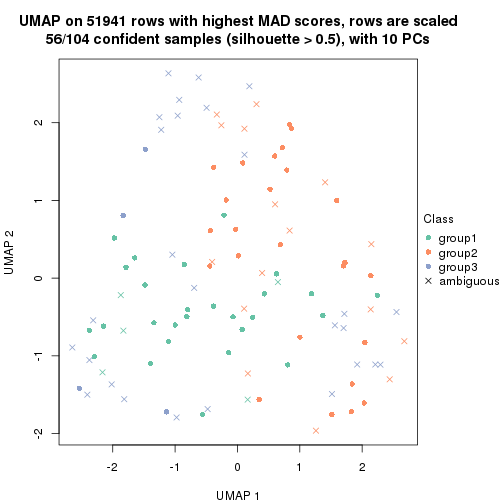</p>

</div>
<div id='tab-MAD-kmeans-dimension-reduction-3'>
<pre><code class="r">dimension_reduction(res, k = 4, method = &quot;UMAP&quot;)
</code></pre>

<p></p>

</div>
<div id='tab-MAD-kmeans-dimension-reduction-4'>
<pre><code class="r">dimension_reduction(res, k = 5, method = &quot;UMAP&quot;)
</code></pre>

<p></p>

</div>
<div id='tab-MAD-kmeans-dimension-reduction-5'>
<pre><code class="r">dimension_reduction(res, k = 6, method = &quot;UMAP&quot;)
</code></pre>

<p></p>

</div>
</div>


Following heatmap shows how subgroups are split when increasing `k`:

```r
collect_classes(res)
```


Test correlation between subgroups and known annotations. If the known
annotation is numeric, one-way ANOVA test is applied, and if the known
annotation is discrete, chi-squared contingency table test is applied.

```r
test_to_known_factors(res)
```

```
#>              n disease.state(p) other(p) k
#> MAD:kmeans 101           0.3614   0.5860 2
#> MAD:kmeans  56           0.2626   0.0470 3
#> MAD:kmeans  37           0.0387   0.0577 4
#> MAD:kmeans  50           0.5521   0.1921 5
#> MAD:kmeans  49           0.1787   0.3921 6
```


If matrix rows can be associated to genes, consider to use `functional_enrichment(res,
...)` to perform function enrichment for the signature genes. See [this vignette](http://bioconductor.org/packages/devel/bioc/vignettes/cola/inst/doc/functional_enrichment.html) for more detailed explanations.


 

---------------------------------------------------


### MAD:skmeans


The object with results only for a single top-value method and a single partition method 
can be extracted as:

```r
res = res_list["MAD", "skmeans"]
# you can also extract it by
# res = res_list["MAD:skmeans"]
```

A summary of `res` and all the functions that can be applied to it:

```r
res
```

```
#> A 'ConsensusPartition' object with k = 2, 3, 4, 5, 6.
#>   On a matrix with 51941 rows and 104 columns.
#>   Top rows (1000, 2000, 3000, 4000, 5000) are extracted by 'MAD' method.
#>   Subgroups are detected by 'skmeans' method.
#>   Performed in total 1250 partitions by row resampling.
#>   Best k for subgroups seems to be 2.
#> 
#> Following methods can be applied to this 'ConsensusPartition' object:
#>  [1] "cola_report"             "collect_classes"         "collect_plots"          
#>  [4] "collect_stats"           "colnames"                "compare_signatures"     
#>  [7] "consensus_heatmap"       "dimension_reduction"     "functional_enrichment"  
#> [10] "get_anno_col"            "get_anno"                "get_classes"            
#> [13] "get_consensus"           "get_matrix"              "get_membership"         
#> [16] "get_param"               "get_signatures"          "get_stats"              
#> [19] "is_best_k"               "is_stable_k"             "membership_heatmap"     
#> [22] "ncol"                    "nrow"                    "plot_ecdf"              
#> [25] "rownames"                "select_partition_number" "show"                   
#> [28] "suggest_best_k"          "test_to_known_factors"
```

`collect_plots()` function collects all the plots made from `res` for all `k` (number of partitions)
into one single page to provide an easy and fast comparison between different `k`.

```r
collect_plots(res)
```


The plots are:

- The first row: a plot of the ECDF (empirical cumulative distribution
  function) curves of the consensus matrix for each `k` and the heatmap of
  predicted classes for each `k`.
- The second row: heatmaps of the consensus matrix for each `k`.
- The third row: heatmaps of the membership matrix for each `k`.
- The fouth row: heatmaps of the signatures for each `k`.

All the plots in panels can be made by individual functions and they are
plotted later in this section.

`select_partition_number()` produces several plots showing different
statistics for choosing "optimized" `k`. There are following statistics:

- ECDF curves of the consensus matrix for each `k`;
- 1-PAC. [The PAC
  score](https://en.wikipedia.org/wiki/Consensus_clustering#Over-interpretation_potential_of_consensus_clustering)
  measures the proportion of the ambiguous subgrouping.
- Mean silhouette score.
- Concordance. The mean probability of fiting the consensus class ids in all
  partitions.
- Area increased. Denote $A_k$ as the area under the ECDF curve for current
  `k`, the area increased is defined as $A_k - A_{k-1}$.
- Rand index. The percent of pairs of samples that are both in a same cluster
  or both are not in a same cluster in the partition of k and k-1.
- Jaccard index. The ratio of pairs of samples are both in a same cluster in
  the partition of k and k-1 and the pairs of samples are both in a same
  cluster in the partition k or k-1.

The detailed explanations of these statistics can be found in [the _cola_
vignette](http://bioconductor.org/packages/devel/bioc/vignettes/cola/inst/doc/cola.html#toc_13).

Generally speaking, lower PAC score, higher mean silhouette score or higher
concordance corresponds to better partition. Rand index and Jaccard index
measure how similar the current partition is compared to partition with `k-1`.
If they are too similar, we won't accept `k` is better than `k-1`.

```r
select_partition_number(res)
```


The numeric values for all these statistics can be obtained by `get_stats()`.

```r
get_stats(res)
```

```
#>   k 1-PAC mean_silhouette concordance area_increased  Rand Jaccard
#> 2 2 0.882           0.915       0.965         0.5030 0.498   0.498
#> 3 3 0.417           0.379       0.680         0.3268 0.808   0.631
#> 4 4 0.485           0.455       0.674         0.1245 0.767   0.444
#> 5 5 0.540           0.430       0.667         0.0671 0.900   0.637
#> 6 6 0.592           0.428       0.659         0.0412 0.900   0.567
```

`suggest_best_k()` suggests the best $k$ based on these statistics. The rules are as follows:

- All $k$ with Jaccard index larger than 0.95 are removed because increasing
  $k$ does not provide enough extra information. If all $k$ are removed, it is
  marked as no subgroup is detected.
- For all $k$ with 1-PAC score larger than 0.9, the maximal $k$ is taken as
  the best $k$, and other $k$ are marked as optional $k$.
- If it does not fit the second rule. The $k$ with the maximal vote of the
  highest 1-PAC score, highest mean silhouette, and highest concordance is
  taken as the best $k$.

```r
suggest_best_k(res)
```

```
#> [1] 2
```


Following shows the table of the partitions (You need to click the **show/hide
code output** link to see it). The membership matrix (columns with name `p*`)
is inferred by
[`clue::cl_consensus()`](https://www.rdocumentation.org/link/cl_consensus?package=clue)
function with the `SE` method. Basically the value in the membership matrix
represents the probability to belong to a certain group. The finall class
label for an item is determined with the group with highest probability it
belongs to.

In `get_classes()` function, the entropy is calculated from the membership
matrix and the silhouette score is calculated from the consensus matrix.


<script>
$( function() {
	$( '#tabs-MAD-skmeans-get-classes' ).tabs();
} );
</script>
<div id='tabs-MAD-skmeans-get-classes'>
<ul>
<li><a href='#tab-MAD-skmeans-get-classes-1'>k = 2</a></li>
<li><a href='#tab-MAD-skmeans-get-classes-2'>k = 3</a></li>
<li><a href='#tab-MAD-skmeans-get-classes-3'>k = 4</a></li>
<li><a href='#tab-MAD-skmeans-get-classes-4'>k = 5</a></li>
<li><a href='#tab-MAD-skmeans-get-classes-5'>k = 6</a></li>
</ul>

<div id='tab-MAD-skmeans-get-classes-1'>
<p><a id='tab-MAD-skmeans-get-classes-1-a' style='color:#0366d6' href='#'>show/hide code output</a></p>
<pre><code class="r">cbind(get_classes(res, k = 2), get_membership(res, k = 2))
</code></pre>

<pre><code>#&gt;           class entropy silhouette    p1    p2
#&gt; GSM537341     1  0.8386     0.6410 0.732 0.268
#&gt; GSM537345     1  0.0000     0.9656 1.000 0.000
#&gt; GSM537355     2  0.0000     0.9594 0.000 1.000
#&gt; GSM537366     1  0.0000     0.9656 1.000 0.000
#&gt; GSM537370     1  0.8861     0.5802 0.696 0.304
#&gt; GSM537380     2  0.0000     0.9594 0.000 1.000
#&gt; GSM537392     2  0.0000     0.9594 0.000 1.000
#&gt; GSM537415     2  0.0000     0.9594 0.000 1.000
#&gt; GSM537417     2  0.7745     0.7001 0.228 0.772
#&gt; GSM537422     1  0.0000     0.9656 1.000 0.000
#&gt; GSM537423     2  0.0000     0.9594 0.000 1.000
#&gt; GSM537427     2  0.0000     0.9594 0.000 1.000
#&gt; GSM537430     2  0.0000     0.9594 0.000 1.000
#&gt; GSM537336     1  0.0000     0.9656 1.000 0.000
#&gt; GSM537337     2  0.0000     0.9594 0.000 1.000
#&gt; GSM537348     1  0.0000     0.9656 1.000 0.000
#&gt; GSM537349     2  0.0000     0.9594 0.000 1.000
#&gt; GSM537356     1  0.0000     0.9656 1.000 0.000
#&gt; GSM537361     1  0.0000     0.9656 1.000 0.000
#&gt; GSM537374     2  0.0000     0.9594 0.000 1.000
#&gt; GSM537377     1  0.0000     0.9656 1.000 0.000
#&gt; GSM537378     2  0.0000     0.9594 0.000 1.000
#&gt; GSM537379     2  0.0000     0.9594 0.000 1.000
#&gt; GSM537383     2  0.0000     0.9594 0.000 1.000
#&gt; GSM537388     2  0.0000     0.9594 0.000 1.000
#&gt; GSM537395     2  0.0000     0.9594 0.000 1.000
#&gt; GSM537400     1  0.0000     0.9656 1.000 0.000
#&gt; GSM537404     1  0.0000     0.9656 1.000 0.000
#&gt; GSM537409     2  0.0000     0.9594 0.000 1.000
#&gt; GSM537418     1  0.0000     0.9656 1.000 0.000
#&gt; GSM537425     1  0.0000     0.9656 1.000 0.000
#&gt; GSM537333     1  0.2603     0.9272 0.956 0.044
#&gt; GSM537342     2  0.5519     0.8391 0.128 0.872
#&gt; GSM537347     1  0.5519     0.8412 0.872 0.128
#&gt; GSM537350     1  0.0000     0.9656 1.000 0.000
#&gt; GSM537362     1  0.0000     0.9656 1.000 0.000
#&gt; GSM537363     1  0.0938     0.9561 0.988 0.012
#&gt; GSM537368     1  0.0000     0.9656 1.000 0.000
#&gt; GSM537376     2  0.0000     0.9594 0.000 1.000
#&gt; GSM537381     1  0.0000     0.9656 1.000 0.000
#&gt; GSM537386     2  0.0000     0.9594 0.000 1.000
#&gt; GSM537398     1  0.0000     0.9656 1.000 0.000
#&gt; GSM537402     2  0.0000     0.9594 0.000 1.000
#&gt; GSM537405     1  0.0000     0.9656 1.000 0.000
#&gt; GSM537371     1  0.0000     0.9656 1.000 0.000
#&gt; GSM537421     2  0.9044     0.5502 0.320 0.680
#&gt; GSM537424     1  0.0000     0.9656 1.000 0.000
#&gt; GSM537432     1  0.0000     0.9656 1.000 0.000
#&gt; GSM537331     2  0.0000     0.9594 0.000 1.000
#&gt; GSM537332     2  0.0000     0.9594 0.000 1.000
#&gt; GSM537334     2  0.0000     0.9594 0.000 1.000
#&gt; GSM537338     2  0.0000     0.9594 0.000 1.000
#&gt; GSM537353     2  0.0000     0.9594 0.000 1.000
#&gt; GSM537357     1  0.0000     0.9656 1.000 0.000
#&gt; GSM537358     2  0.0000     0.9594 0.000 1.000
#&gt; GSM537375     2  0.0000     0.9594 0.000 1.000
#&gt; GSM537389     2  0.0000     0.9594 0.000 1.000
#&gt; GSM537390     2  0.0000     0.9594 0.000 1.000
#&gt; GSM537393     2  0.0000     0.9594 0.000 1.000
#&gt; GSM537399     1  0.0672     0.9595 0.992 0.008
#&gt; GSM537407     1  0.0000     0.9656 1.000 0.000
#&gt; GSM537408     2  0.0000     0.9594 0.000 1.000
#&gt; GSM537428     2  0.0000     0.9594 0.000 1.000
#&gt; GSM537354     2  0.0000     0.9594 0.000 1.000
#&gt; GSM537410     2  0.4161     0.8845 0.084 0.916
#&gt; GSM537413     2  0.0000     0.9594 0.000 1.000
#&gt; GSM537396     2  0.0000     0.9594 0.000 1.000
#&gt; GSM537397     1  0.3584     0.9051 0.932 0.068
#&gt; GSM537330     2  0.0000     0.9594 0.000 1.000
#&gt; GSM537369     1  0.0000     0.9656 1.000 0.000
#&gt; GSM537373     2  0.5408     0.8439 0.124 0.876
#&gt; GSM537401     1  0.8955     0.5640 0.688 0.312
#&gt; GSM537343     1  0.0000     0.9656 1.000 0.000
#&gt; GSM537367     1  0.0000     0.9656 1.000 0.000
#&gt; GSM537382     2  0.0376     0.9563 0.004 0.996
#&gt; GSM537385     2  0.0000     0.9594 0.000 1.000
#&gt; GSM537391     1  0.0000     0.9656 1.000 0.000
#&gt; GSM537419     2  0.0000     0.9594 0.000 1.000
#&gt; GSM537420     1  0.0000     0.9656 1.000 0.000
#&gt; GSM537429     2  0.9988     0.0105 0.480 0.520
#&gt; GSM537431     1  0.0000     0.9656 1.000 0.000
#&gt; GSM537387     1  0.0000     0.9656 1.000 0.000
#&gt; GSM537414     1  0.0000     0.9656 1.000 0.000
#&gt; GSM537433     1  0.0000     0.9656 1.000 0.000
#&gt; GSM537335     1  0.9608     0.4080 0.616 0.384
#&gt; GSM537339     1  0.0000     0.9656 1.000 0.000
#&gt; GSM537340     2  0.9881     0.2722 0.436 0.564
#&gt; GSM537344     1  0.0000     0.9656 1.000 0.000
#&gt; GSM537346     2  0.0376     0.9563 0.004 0.996
#&gt; GSM537351     1  0.0000     0.9656 1.000 0.000
#&gt; GSM537352     2  0.0000     0.9594 0.000 1.000
#&gt; GSM537359     2  0.0000     0.9594 0.000 1.000
#&gt; GSM537360     2  0.0000     0.9594 0.000 1.000
#&gt; GSM537364     1  0.0000     0.9656 1.000 0.000
#&gt; GSM537365     1  0.0000     0.9656 1.000 0.000
#&gt; GSM537372     1  0.0000     0.9656 1.000 0.000
#&gt; GSM537384     1  0.0000     0.9656 1.000 0.000
#&gt; GSM537394     2  0.0000     0.9594 0.000 1.000
#&gt; GSM537403     2  0.0000     0.9594 0.000 1.000
#&gt; GSM537406     2  0.0000     0.9594 0.000 1.000
#&gt; GSM537411     2  0.0000     0.9594 0.000 1.000
#&gt; GSM537412     2  0.0000     0.9594 0.000 1.000
#&gt; GSM537416     2  0.8861     0.5802 0.304 0.696
#&gt; GSM537426     2  0.0000     0.9594 0.000 1.000
</code></pre>

<script>
$('#tab-MAD-skmeans-get-classes-1-a').parent().next().next().hide();
$('#tab-MAD-skmeans-get-classes-1-a').click(function(){
  $('#tab-MAD-skmeans-get-classes-1-a').parent().next().next().toggle();
  return(false);
});
</script>
</div>

<div id='tab-MAD-skmeans-get-classes-2'>
<p><a id='tab-MAD-skmeans-get-classes-2-a' style='color:#0366d6' href='#'>show/hide code output</a></p>
<pre><code class="r">cbind(get_classes(res, k = 3), get_membership(res, k = 3))
</code></pre>

<pre><code>#&gt;           class entropy silhouette    p1    p2    p3
#&gt; GSM537341     1  0.7063     0.1204 0.516 0.020 0.464
#&gt; GSM537345     1  0.0592     0.7861 0.988 0.000 0.012
#&gt; GSM537355     2  0.6295     0.2722 0.000 0.528 0.472
#&gt; GSM537366     1  0.1453     0.7841 0.968 0.008 0.024
#&gt; GSM537370     3  0.8869     0.1832 0.380 0.124 0.496
#&gt; GSM537380     2  0.6235     0.1891 0.000 0.564 0.436
#&gt; GSM537392     2  0.6045     0.2876 0.000 0.620 0.380
#&gt; GSM537415     2  0.3038     0.4415 0.000 0.896 0.104
#&gt; GSM537417     3  0.8743    -0.0461 0.108 0.440 0.452
#&gt; GSM537422     3  0.9641     0.0904 0.296 0.240 0.464
#&gt; GSM537423     2  0.4291     0.4290 0.000 0.820 0.180
#&gt; GSM537427     2  0.6260     0.2158 0.000 0.552 0.448
#&gt; GSM537430     2  0.6008     0.2990 0.000 0.628 0.372
#&gt; GSM537336     1  0.0892     0.7855 0.980 0.000 0.020
#&gt; GSM537337     2  0.4121     0.4328 0.000 0.832 0.168
#&gt; GSM537348     1  0.3941     0.7068 0.844 0.000 0.156
#&gt; GSM537349     2  0.5948     0.3182 0.000 0.640 0.360
#&gt; GSM537356     1  0.0424     0.7878 0.992 0.000 0.008
#&gt; GSM537361     1  0.5397     0.6051 0.720 0.000 0.280
#&gt; GSM537374     3  0.6299    -0.0901 0.000 0.476 0.524
#&gt; GSM537377     1  0.0747     0.7853 0.984 0.000 0.016
#&gt; GSM537378     2  0.4002     0.4364 0.000 0.840 0.160
#&gt; GSM537379     2  0.6274     0.1492 0.000 0.544 0.456
#&gt; GSM537383     2  0.6026     0.2904 0.000 0.624 0.376
#&gt; GSM537388     2  0.6140     0.2868 0.000 0.596 0.404
#&gt; GSM537395     2  0.4178     0.4447 0.000 0.828 0.172
#&gt; GSM537400     3  0.8153     0.1497 0.240 0.128 0.632
#&gt; GSM537404     1  0.8018     0.3166 0.520 0.064 0.416
#&gt; GSM537409     2  0.6252     0.1854 0.000 0.556 0.444
#&gt; GSM537418     1  0.0237     0.7891 0.996 0.000 0.004
#&gt; GSM537425     1  0.5363     0.6092 0.724 0.000 0.276
#&gt; GSM537333     3  0.8162     0.2166 0.192 0.164 0.644
#&gt; GSM537342     2  0.7666     0.2519 0.076 0.636 0.288
#&gt; GSM537347     3  0.6431     0.2579 0.156 0.084 0.760
#&gt; GSM537350     1  0.0237     0.7883 0.996 0.000 0.004
#&gt; GSM537362     1  0.4555     0.6968 0.800 0.000 0.200
#&gt; GSM537363     1  0.7885     0.3894 0.580 0.068 0.352
#&gt; GSM537368     1  0.0424     0.7884 0.992 0.000 0.008
#&gt; GSM537376     2  0.4555     0.4187 0.000 0.800 0.200
#&gt; GSM537381     1  0.0592     0.7884 0.988 0.000 0.012
#&gt; GSM537386     2  0.6307     0.1107 0.000 0.512 0.488
#&gt; GSM537398     1  0.4291     0.6827 0.820 0.000 0.180
#&gt; GSM537402     2  0.5882     0.4059 0.000 0.652 0.348
#&gt; GSM537405     1  0.0237     0.7889 0.996 0.000 0.004
#&gt; GSM537371     1  0.0237     0.7889 0.996 0.000 0.004
#&gt; GSM537421     2  0.8655     0.1024 0.108 0.512 0.380
#&gt; GSM537424     1  0.1289     0.7796 0.968 0.000 0.032
#&gt; GSM537432     3  0.8303     0.2165 0.196 0.172 0.632
#&gt; GSM537331     3  0.6274    -0.0701 0.000 0.456 0.544
#&gt; GSM537332     2  0.6244     0.1850 0.000 0.560 0.440
#&gt; GSM537334     3  0.6476    -0.0628 0.004 0.448 0.548
#&gt; GSM537338     3  0.6267    -0.0709 0.000 0.452 0.548
#&gt; GSM537353     2  0.3412     0.4292 0.000 0.876 0.124
#&gt; GSM537357     1  0.0237     0.7889 0.996 0.000 0.004
#&gt; GSM537358     2  0.5529     0.3708 0.000 0.704 0.296
#&gt; GSM537375     2  0.5785     0.2982 0.000 0.668 0.332
#&gt; GSM537389     2  0.5810     0.3428 0.000 0.664 0.336
#&gt; GSM537390     2  0.3482     0.4507 0.000 0.872 0.128
#&gt; GSM537393     2  0.4750     0.3974 0.000 0.784 0.216
#&gt; GSM537399     1  0.6359     0.4602 0.628 0.008 0.364
#&gt; GSM537407     1  0.5363     0.6150 0.724 0.000 0.276
#&gt; GSM537408     2  0.5905     0.3303 0.000 0.648 0.352
#&gt; GSM537428     3  0.6305    -0.1282 0.000 0.484 0.516
#&gt; GSM537354     2  0.3551     0.4301 0.000 0.868 0.132
#&gt; GSM537410     2  0.6490     0.2482 0.012 0.628 0.360
#&gt; GSM537413     2  0.5733     0.3827 0.000 0.676 0.324
#&gt; GSM537396     2  0.8362     0.2125 0.088 0.528 0.384
#&gt; GSM537397     1  0.6467     0.3451 0.604 0.008 0.388
#&gt; GSM537330     3  0.5327     0.0327 0.000 0.272 0.728
#&gt; GSM537369     1  0.0000     0.7887 1.000 0.000 0.000
#&gt; GSM537373     2  0.8569     0.1921 0.196 0.608 0.196
#&gt; GSM537401     3  0.8039     0.0698 0.428 0.064 0.508
#&gt; GSM537343     1  0.4702     0.6689 0.788 0.000 0.212
#&gt; GSM537367     3  0.9717     0.1056 0.248 0.304 0.448
#&gt; GSM537382     2  0.5397     0.3777 0.000 0.720 0.280
#&gt; GSM537385     2  0.6062     0.3001 0.000 0.616 0.384
#&gt; GSM537391     1  0.5785     0.5225 0.696 0.004 0.300
#&gt; GSM537419     2  0.5733     0.3497 0.000 0.676 0.324
#&gt; GSM537420     1  0.0000     0.7887 1.000 0.000 0.000
#&gt; GSM537429     3  0.8054     0.2073 0.356 0.076 0.568
#&gt; GSM537431     3  0.8250     0.1723 0.232 0.140 0.628
#&gt; GSM537387     1  0.3340     0.7322 0.880 0.000 0.120
#&gt; GSM537414     1  0.7984     0.2627 0.496 0.060 0.444
#&gt; GSM537433     1  0.6294     0.5800 0.692 0.020 0.288
#&gt; GSM537335     3  0.9151     0.1937 0.228 0.228 0.544
#&gt; GSM537339     1  0.6129     0.4762 0.668 0.008 0.324
#&gt; GSM537340     2  0.9093     0.0162 0.140 0.460 0.400
#&gt; GSM537344     1  0.0000     0.7887 1.000 0.000 0.000
#&gt; GSM537346     3  0.6008    -0.0563 0.000 0.372 0.628
#&gt; GSM537351     1  0.5623     0.6025 0.716 0.004 0.280
#&gt; GSM537352     2  0.3816     0.4360 0.000 0.852 0.148
#&gt; GSM537359     2  0.6252     0.1916 0.000 0.556 0.444
#&gt; GSM537360     2  0.3686     0.4214 0.000 0.860 0.140
#&gt; GSM537364     1  0.1031     0.7842 0.976 0.000 0.024
#&gt; GSM537365     1  0.7379     0.4884 0.584 0.040 0.376
#&gt; GSM537372     1  0.3267     0.7360 0.884 0.000 0.116
#&gt; GSM537384     1  0.1753     0.7736 0.952 0.000 0.048
#&gt; GSM537394     3  0.6215    -0.0816 0.000 0.428 0.572
#&gt; GSM537403     2  0.6252     0.1855 0.000 0.556 0.444
#&gt; GSM537406     2  0.2878     0.4545 0.000 0.904 0.096
#&gt; GSM537411     3  0.6126    -0.1192 0.000 0.400 0.600
#&gt; GSM537412     2  0.6180     0.1967 0.000 0.584 0.416
#&gt; GSM537416     3  0.8135    -0.0889 0.068 0.448 0.484
#&gt; GSM537426     2  0.4796     0.3824 0.000 0.780 0.220
</code></pre>

<script>
$('#tab-MAD-skmeans-get-classes-2-a').parent().next().next().hide();
$('#tab-MAD-skmeans-get-classes-2-a').click(function(){
  $('#tab-MAD-skmeans-get-classes-2-a').parent().next().next().toggle();
  return(false);
});
</script>
</div>

<div id='tab-MAD-skmeans-get-classes-3'>
<p><a id='tab-MAD-skmeans-get-classes-3-a' style='color:#0366d6' href='#'>show/hide code output</a></p>
<pre><code class="r">cbind(get_classes(res, k = 4), get_membership(res, k = 4))
</code></pre>

<pre><code>#&gt;           class entropy silhouette    p1    p2    p3    p4
#&gt; GSM537341     1  0.7615    0.50101 0.592 0.124 0.236 0.048
#&gt; GSM537345     1  0.1557    0.72450 0.944 0.000 0.056 0.000
#&gt; GSM537355     2  0.6522    0.48162 0.000 0.632 0.144 0.224
#&gt; GSM537366     1  0.4036    0.65409 0.836 0.000 0.076 0.088
#&gt; GSM537370     1  0.8906    0.08855 0.348 0.324 0.280 0.048
#&gt; GSM537380     2  0.1174    0.66127 0.000 0.968 0.020 0.012
#&gt; GSM537392     2  0.0336    0.65941 0.000 0.992 0.000 0.008
#&gt; GSM537415     4  0.5016    0.41766 0.000 0.396 0.004 0.600
#&gt; GSM537417     3  0.6011    0.11952 0.004 0.032 0.516 0.448
#&gt; GSM537422     3  0.7399    0.27392 0.164 0.000 0.420 0.416
#&gt; GSM537423     2  0.2530    0.62985 0.000 0.896 0.004 0.100
#&gt; GSM537427     2  0.5266    0.56039 0.000 0.752 0.108 0.140
#&gt; GSM537430     2  0.3323    0.63324 0.000 0.876 0.060 0.064
#&gt; GSM537336     1  0.2142    0.70436 0.928 0.000 0.056 0.016
#&gt; GSM537337     4  0.7006    0.00474 0.000 0.428 0.116 0.456
#&gt; GSM537348     1  0.4900    0.63447 0.732 0.000 0.236 0.032
#&gt; GSM537349     2  0.2081    0.64699 0.000 0.916 0.000 0.084
#&gt; GSM537356     1  0.1474    0.72045 0.948 0.000 0.052 0.000
#&gt; GSM537361     3  0.5420    0.37977 0.352 0.000 0.624 0.024
#&gt; GSM537374     2  0.7162    0.27032 0.000 0.472 0.392 0.136
#&gt; GSM537377     1  0.1867    0.72487 0.928 0.000 0.072 0.000
#&gt; GSM537378     2  0.3768    0.53465 0.000 0.808 0.008 0.184
#&gt; GSM537379     3  0.6102    0.13281 0.000 0.048 0.532 0.420
#&gt; GSM537383     2  0.0657    0.66045 0.000 0.984 0.004 0.012
#&gt; GSM537388     2  0.5568    0.56070 0.000 0.728 0.120 0.152
#&gt; GSM537395     2  0.6058    0.34256 0.000 0.632 0.072 0.296
#&gt; GSM537400     3  0.5413    0.49723 0.048 0.004 0.712 0.236
#&gt; GSM537404     3  0.7214    0.49970 0.236 0.024 0.608 0.132
#&gt; GSM537409     4  0.4100    0.62686 0.000 0.128 0.048 0.824
#&gt; GSM537418     1  0.1557    0.71667 0.944 0.000 0.056 0.000
#&gt; GSM537425     1  0.6661   -0.17033 0.460 0.000 0.456 0.084
#&gt; GSM537333     3  0.5490    0.49990 0.052 0.004 0.708 0.236
#&gt; GSM537342     4  0.3659    0.62480 0.032 0.084 0.016 0.868
#&gt; GSM537347     3  0.4061    0.49171 0.016 0.092 0.848 0.044
#&gt; GSM537350     1  0.2418    0.71680 0.928 0.024 0.032 0.016
#&gt; GSM537362     1  0.5666    0.53279 0.616 0.000 0.348 0.036
#&gt; GSM537363     1  0.7468    0.04025 0.484 0.012 0.128 0.376
#&gt; GSM537368     1  0.1706    0.71470 0.948 0.000 0.036 0.016
#&gt; GSM537376     4  0.4422    0.52722 0.000 0.256 0.008 0.736
#&gt; GSM537381     1  0.3257    0.62560 0.844 0.000 0.152 0.004
#&gt; GSM537386     2  0.5548    0.54075 0.000 0.716 0.200 0.084
#&gt; GSM537398     1  0.5105    0.59531 0.696 0.000 0.276 0.028
#&gt; GSM537402     2  0.5088    0.22967 0.000 0.572 0.004 0.424
#&gt; GSM537405     1  0.1398    0.71711 0.956 0.000 0.040 0.004
#&gt; GSM537371     1  0.1489    0.71538 0.952 0.000 0.044 0.004
#&gt; GSM537421     4  0.3610    0.60201 0.020 0.060 0.044 0.876
#&gt; GSM537424     1  0.2125    0.72335 0.920 0.000 0.076 0.004
#&gt; GSM537432     3  0.5776    0.45660 0.040 0.012 0.676 0.272
#&gt; GSM537331     2  0.6634    0.48075 0.000 0.624 0.212 0.164
#&gt; GSM537332     3  0.7517    0.22875 0.000 0.304 0.484 0.212
#&gt; GSM537334     3  0.7349   -0.22246 0.000 0.384 0.456 0.160
#&gt; GSM537338     2  0.7456    0.34005 0.000 0.488 0.316 0.196
#&gt; GSM537353     4  0.5408    0.42699 0.000 0.408 0.016 0.576
#&gt; GSM537357     1  0.1545    0.71599 0.952 0.000 0.040 0.008
#&gt; GSM537358     2  0.2255    0.64698 0.000 0.920 0.012 0.068
#&gt; GSM537375     4  0.6245    0.43680 0.000 0.168 0.164 0.668
#&gt; GSM537389     2  0.2216    0.64450 0.000 0.908 0.000 0.092
#&gt; GSM537390     2  0.5442    0.32501 0.000 0.672 0.040 0.288
#&gt; GSM537393     4  0.7068    0.33652 0.000 0.296 0.156 0.548
#&gt; GSM537399     3  0.4914    0.21018 0.312 0.012 0.676 0.000
#&gt; GSM537407     3  0.5599    0.37420 0.352 0.000 0.616 0.032
#&gt; GSM537408     2  0.3229    0.63316 0.000 0.880 0.072 0.048
#&gt; GSM537428     2  0.6352    0.50331 0.000 0.656 0.188 0.156
#&gt; GSM537354     4  0.6779    0.26772 0.000 0.324 0.116 0.560
#&gt; GSM537410     4  0.3946    0.62522 0.004 0.172 0.012 0.812
#&gt; GSM537413     2  0.3545    0.58145 0.000 0.828 0.008 0.164
#&gt; GSM537396     2  0.6348    0.43380 0.048 0.676 0.040 0.236
#&gt; GSM537397     1  0.6511    0.58362 0.668 0.076 0.228 0.028
#&gt; GSM537330     3  0.6732    0.21589 0.000 0.336 0.556 0.108
#&gt; GSM537369     1  0.0000    0.72471 1.000 0.000 0.000 0.000
#&gt; GSM537373     4  0.6855    0.43047 0.076 0.296 0.024 0.604
#&gt; GSM537401     1  0.8822    0.28340 0.448 0.228 0.260 0.064
#&gt; GSM537343     1  0.6332   -0.13608 0.488 0.000 0.452 0.060
#&gt; GSM537367     4  0.7534   -0.25575 0.192 0.000 0.360 0.448
#&gt; GSM537382     4  0.4682    0.51409 0.004 0.212 0.024 0.760
#&gt; GSM537385     2  0.4100    0.63080 0.000 0.824 0.048 0.128
#&gt; GSM537391     1  0.5837    0.62426 0.720 0.040 0.204 0.036
#&gt; GSM537419     2  0.2053    0.64984 0.000 0.924 0.004 0.072
#&gt; GSM537420     1  0.0000    0.72471 1.000 0.000 0.000 0.000
#&gt; GSM537429     3  0.9577    0.03465 0.204 0.296 0.360 0.140
#&gt; GSM537431     3  0.5708    0.51236 0.076 0.004 0.708 0.212
#&gt; GSM537387     1  0.4121    0.66280 0.796 0.000 0.184 0.020
#&gt; GSM537414     3  0.6084    0.49738 0.252 0.000 0.656 0.092
#&gt; GSM537433     3  0.7140    0.24124 0.404 0.000 0.464 0.132
#&gt; GSM537335     3  0.8797   -0.09308 0.084 0.308 0.452 0.156
#&gt; GSM537339     1  0.5695    0.60599 0.692 0.016 0.256 0.036
#&gt; GSM537340     4  0.4923    0.58855 0.028 0.084 0.080 0.808
#&gt; GSM537344     1  0.0336    0.72408 0.992 0.000 0.008 0.000
#&gt; GSM537346     3  0.5538    0.30846 0.000 0.320 0.644 0.036
#&gt; GSM537351     1  0.6799   -0.18954 0.464 0.000 0.440 0.096
#&gt; GSM537352     4  0.6702    0.02216 0.000 0.436 0.088 0.476
#&gt; GSM537359     2  0.2222    0.65064 0.000 0.924 0.016 0.060
#&gt; GSM537360     4  0.5436    0.49100 0.000 0.356 0.024 0.620
#&gt; GSM537364     1  0.3107    0.67370 0.884 0.000 0.080 0.036
#&gt; GSM537365     3  0.5944    0.47764 0.252 0.012 0.680 0.056
#&gt; GSM537372     1  0.4253    0.65901 0.776 0.000 0.208 0.016
#&gt; GSM537384     1  0.3105    0.69717 0.856 0.000 0.140 0.004
#&gt; GSM537394     2  0.5576    0.08323 0.000 0.536 0.444 0.020
#&gt; GSM537403     4  0.3858    0.62077 0.000 0.100 0.056 0.844
#&gt; GSM537406     2  0.5151   -0.10189 0.000 0.532 0.004 0.464
#&gt; GSM537411     2  0.7659    0.26076 0.000 0.460 0.296 0.244
#&gt; GSM537412     4  0.4245    0.61787 0.000 0.196 0.020 0.784
#&gt; GSM537416     4  0.4132    0.46693 0.008 0.012 0.176 0.804
#&gt; GSM537426     4  0.4360    0.59974 0.000 0.248 0.008 0.744
</code></pre>

<script>
$('#tab-MAD-skmeans-get-classes-3-a').parent().next().next().hide();
$('#tab-MAD-skmeans-get-classes-3-a').click(function(){
  $('#tab-MAD-skmeans-get-classes-3-a').parent().next().next().toggle();
  return(false);
});
</script>
</div>

<div id='tab-MAD-skmeans-get-classes-4'>
<p><a id='tab-MAD-skmeans-get-classes-4-a' style='color:#0366d6' href='#'>show/hide code output</a></p>
<pre><code class="r">cbind(get_classes(res, k = 5), get_membership(res, k = 5))
</code></pre>

<pre><code>#&gt;           class entropy silhouette    p1    p2    p3    p4    p5
#&gt; GSM537341     5  0.4516     0.4652 0.204 0.032 0.004 0.012 0.748
#&gt; GSM537345     1  0.1197     0.7206 0.952 0.000 0.000 0.000 0.048
#&gt; GSM537355     2  0.8257     0.2010 0.000 0.376 0.184 0.160 0.280
#&gt; GSM537366     1  0.6165     0.5601 0.628 0.000 0.124 0.032 0.216
#&gt; GSM537370     5  0.6381     0.4455 0.124 0.180 0.044 0.008 0.644
#&gt; GSM537380     2  0.1211     0.6977 0.000 0.960 0.024 0.000 0.016
#&gt; GSM537392     2  0.1278     0.6983 0.000 0.960 0.020 0.004 0.016
#&gt; GSM537415     4  0.4473     0.2504 0.000 0.412 0.008 0.580 0.000
#&gt; GSM537417     3  0.5972     0.2047 0.020 0.020 0.592 0.328 0.040
#&gt; GSM537422     3  0.6946     0.3468 0.332 0.000 0.360 0.304 0.004
#&gt; GSM537423     2  0.1569     0.6904 0.000 0.944 0.004 0.044 0.008
#&gt; GSM537427     2  0.6567     0.4003 0.000 0.568 0.128 0.036 0.268
#&gt; GSM537430     2  0.4679     0.6184 0.000 0.768 0.072 0.024 0.136
#&gt; GSM537336     1  0.1116     0.7245 0.964 0.000 0.028 0.004 0.004
#&gt; GSM537337     4  0.8520     0.1697 0.000 0.220 0.200 0.312 0.268
#&gt; GSM537348     5  0.4135     0.3188 0.340 0.000 0.004 0.000 0.656
#&gt; GSM537349     2  0.1830     0.6869 0.000 0.924 0.000 0.068 0.008
#&gt; GSM537356     1  0.4457     0.4020 0.620 0.000 0.012 0.000 0.368
#&gt; GSM537361     3  0.4260     0.4829 0.308 0.000 0.680 0.004 0.008
#&gt; GSM537374     5  0.6727     0.2615 0.000 0.216 0.192 0.032 0.560
#&gt; GSM537377     1  0.1628     0.7152 0.936 0.000 0.008 0.000 0.056
#&gt; GSM537378     2  0.3155     0.6342 0.000 0.848 0.016 0.128 0.008
#&gt; GSM537379     3  0.6847     0.0482 0.000 0.028 0.512 0.292 0.168
#&gt; GSM537383     2  0.1461     0.6985 0.000 0.952 0.016 0.004 0.028
#&gt; GSM537388     2  0.7280     0.3635 0.000 0.508 0.160 0.068 0.264
#&gt; GSM537395     2  0.6966     0.3714 0.000 0.592 0.128 0.160 0.120
#&gt; GSM537400     3  0.6759     0.5290 0.112 0.004 0.604 0.208 0.072
#&gt; GSM537404     3  0.6546     0.5335 0.212 0.040 0.636 0.084 0.028
#&gt; GSM537409     4  0.3133     0.5617 0.000 0.080 0.052 0.864 0.004
#&gt; GSM537418     1  0.2730     0.7270 0.892 0.000 0.056 0.008 0.044
#&gt; GSM537425     1  0.6376    -0.0241 0.484 0.000 0.408 0.036 0.072
#&gt; GSM537333     3  0.6721     0.5211 0.088 0.004 0.604 0.220 0.084
#&gt; GSM537342     4  0.4000     0.5431 0.016 0.036 0.028 0.836 0.084
#&gt; GSM537347     3  0.4766     0.5053 0.000 0.060 0.748 0.020 0.172
#&gt; GSM537350     1  0.5637     0.4622 0.624 0.028 0.040 0.004 0.304
#&gt; GSM537362     1  0.5917     0.2083 0.552 0.000 0.104 0.004 0.340
#&gt; GSM537363     4  0.6190    -0.0655 0.444 0.004 0.060 0.468 0.024
#&gt; GSM537368     1  0.0854     0.7314 0.976 0.000 0.008 0.004 0.012
#&gt; GSM537376     4  0.5744     0.5417 0.000 0.164 0.052 0.692 0.092
#&gt; GSM537381     1  0.4096     0.6229 0.772 0.000 0.176 0.000 0.052
#&gt; GSM537386     2  0.5783     0.5391 0.000 0.680 0.184 0.044 0.092
#&gt; GSM537398     5  0.4731     0.3649 0.328 0.000 0.032 0.000 0.640
#&gt; GSM537402     4  0.6146     0.0190 0.000 0.444 0.024 0.464 0.068
#&gt; GSM537405     1  0.1179     0.7307 0.964 0.000 0.016 0.004 0.016
#&gt; GSM537371     1  0.0854     0.7308 0.976 0.000 0.012 0.004 0.008
#&gt; GSM537421     4  0.2891     0.5486 0.012 0.032 0.044 0.896 0.016
#&gt; GSM537424     1  0.3333     0.6274 0.788 0.000 0.004 0.000 0.208
#&gt; GSM537432     3  0.7958     0.4294 0.120 0.012 0.472 0.264 0.132
#&gt; GSM537331     5  0.7201    -0.1329 0.000 0.380 0.176 0.036 0.408
#&gt; GSM537332     3  0.5779     0.4102 0.000 0.172 0.616 0.212 0.000
#&gt; GSM537334     5  0.6321     0.3236 0.000 0.120 0.236 0.036 0.608
#&gt; GSM537338     5  0.7265     0.2110 0.000 0.180 0.204 0.080 0.536
#&gt; GSM537353     4  0.6031     0.1856 0.000 0.440 0.036 0.480 0.044
#&gt; GSM537357     1  0.0451     0.7305 0.988 0.000 0.000 0.004 0.008
#&gt; GSM537358     2  0.1483     0.6966 0.000 0.952 0.028 0.008 0.012
#&gt; GSM537375     4  0.7549     0.3024 0.000 0.068 0.248 0.468 0.216
#&gt; GSM537389     2  0.2408     0.6717 0.000 0.892 0.004 0.096 0.008
#&gt; GSM537390     2  0.4021     0.5737 0.000 0.780 0.052 0.168 0.000
#&gt; GSM537393     4  0.8242     0.2919 0.000 0.168 0.248 0.396 0.188
#&gt; GSM537399     3  0.6241     0.3524 0.076 0.028 0.568 0.004 0.324
#&gt; GSM537407     3  0.5258     0.4930 0.260 0.024 0.676 0.004 0.036
#&gt; GSM537408     2  0.2046     0.6825 0.000 0.916 0.068 0.000 0.016
#&gt; GSM537428     2  0.7257     0.1090 0.000 0.404 0.188 0.036 0.372
#&gt; GSM537354     4  0.8162     0.2970 0.000 0.156 0.200 0.416 0.228
#&gt; GSM537410     4  0.3818     0.5650 0.012 0.084 0.028 0.844 0.032
#&gt; GSM537413     2  0.2563     0.6554 0.000 0.872 0.008 0.120 0.000
#&gt; GSM537396     2  0.7030     0.1968 0.008 0.488 0.012 0.256 0.236
#&gt; GSM537397     5  0.4477     0.3910 0.288 0.016 0.000 0.008 0.688
#&gt; GSM537330     3  0.6727     0.4186 0.000 0.172 0.612 0.096 0.120
#&gt; GSM537369     1  0.2233     0.7019 0.892 0.000 0.004 0.000 0.104
#&gt; GSM537373     4  0.6795     0.4551 0.056 0.200 0.032 0.628 0.084
#&gt; GSM537401     5  0.3905     0.4873 0.164 0.020 0.004 0.012 0.800
#&gt; GSM537343     1  0.6022    -0.1192 0.476 0.024 0.452 0.008 0.040
#&gt; GSM537367     4  0.6378    -0.0205 0.160 0.000 0.296 0.536 0.008
#&gt; GSM537382     4  0.5739     0.5273 0.000 0.112 0.056 0.700 0.132
#&gt; GSM537385     2  0.5235     0.5984 0.000 0.724 0.032 0.080 0.164
#&gt; GSM537391     5  0.4504     0.1930 0.428 0.000 0.000 0.008 0.564
#&gt; GSM537419     2  0.0963     0.6924 0.000 0.964 0.000 0.036 0.000
#&gt; GSM537420     1  0.2249     0.7073 0.896 0.000 0.008 0.000 0.096
#&gt; GSM537429     5  0.8905     0.1094 0.112 0.112 0.244 0.104 0.428
#&gt; GSM537431     3  0.5974     0.5558 0.080 0.012 0.668 0.208 0.032
#&gt; GSM537387     1  0.4359     0.1172 0.584 0.000 0.004 0.000 0.412
#&gt; GSM537414     3  0.4847     0.5301 0.268 0.000 0.684 0.040 0.008
#&gt; GSM537433     3  0.7220     0.0956 0.404 0.012 0.436 0.056 0.092
#&gt; GSM537335     5  0.5078     0.3791 0.000 0.052 0.204 0.028 0.716
#&gt; GSM537339     5  0.3861     0.4049 0.284 0.000 0.004 0.000 0.712
#&gt; GSM537340     4  0.4573     0.5247 0.048 0.064 0.064 0.808 0.016
#&gt; GSM537344     1  0.1764     0.7208 0.928 0.000 0.008 0.000 0.064
#&gt; GSM537346     3  0.4726     0.4229 0.000 0.256 0.696 0.004 0.044
#&gt; GSM537351     1  0.4829     0.2513 0.660 0.000 0.300 0.036 0.004
#&gt; GSM537352     4  0.8327     0.1736 0.000 0.256 0.140 0.348 0.256
#&gt; GSM537359     2  0.2069     0.6889 0.000 0.924 0.052 0.012 0.012
#&gt; GSM537360     4  0.5537     0.4146 0.000 0.308 0.052 0.620 0.020
#&gt; GSM537364     1  0.1798     0.6977 0.928 0.000 0.064 0.004 0.004
#&gt; GSM537365     3  0.5544     0.5649 0.180 0.044 0.716 0.020 0.040
#&gt; GSM537372     5  0.4397     0.0966 0.432 0.000 0.004 0.000 0.564
#&gt; GSM537384     1  0.4219     0.3093 0.584 0.000 0.000 0.000 0.416
#&gt; GSM537394     2  0.4893     0.2178 0.000 0.580 0.396 0.008 0.016
#&gt; GSM537403     4  0.3125     0.5575 0.004 0.040 0.056 0.880 0.020
#&gt; GSM537406     2  0.5782     0.0474 0.004 0.520 0.016 0.416 0.044
#&gt; GSM537411     5  0.7880    -0.0297 0.000 0.340 0.092 0.188 0.380
#&gt; GSM537412     4  0.3326     0.5702 0.000 0.152 0.024 0.824 0.000
#&gt; GSM537416     4  0.2389     0.4970 0.004 0.000 0.116 0.880 0.000
#&gt; GSM537426     4  0.3475     0.5663 0.000 0.180 0.012 0.804 0.004
</code></pre>

<script>
$('#tab-MAD-skmeans-get-classes-4-a').parent().next().next().hide();
$('#tab-MAD-skmeans-get-classes-4-a').click(function(){
  $('#tab-MAD-skmeans-get-classes-4-a').parent().next().next().toggle();
  return(false);
});
</script>
</div>

<div id='tab-MAD-skmeans-get-classes-5'>
<p><a id='tab-MAD-skmeans-get-classes-5-a' style='color:#0366d6' href='#'>show/hide code output</a></p>
<pre><code class="r">cbind(get_classes(res, k = 6), get_membership(res, k = 6))
</code></pre>

<pre><code>#&gt;           class entropy silhouette    p1    p2    p3    p4    p5    p6
#&gt; GSM537341     5  0.3268     0.6380 0.068 0.012 0.004 0.036 0.860 0.020
#&gt; GSM537345     1  0.1387     0.7505 0.932 0.000 0.000 0.000 0.068 0.000
#&gt; GSM537355     6  0.7930     0.2535 0.004 0.252 0.020 0.172 0.172 0.380
#&gt; GSM537366     1  0.6844     0.3085 0.504 0.000 0.160 0.096 0.236 0.004
#&gt; GSM537370     5  0.5099     0.4925 0.024 0.164 0.056 0.016 0.724 0.016
#&gt; GSM537380     2  0.1862     0.6713 0.000 0.932 0.020 0.004 0.020 0.024
#&gt; GSM537392     2  0.1893     0.6699 0.000 0.928 0.024 0.004 0.008 0.036
#&gt; GSM537415     4  0.6191     0.2250 0.000 0.372 0.004 0.424 0.008 0.192
#&gt; GSM537417     6  0.5883    -0.0394 0.008 0.000 0.380 0.136 0.004 0.472
#&gt; GSM537422     3  0.7907     0.2811 0.292 0.000 0.340 0.200 0.024 0.144
#&gt; GSM537423     2  0.3079     0.6567 0.000 0.844 0.000 0.096 0.004 0.056
#&gt; GSM537427     2  0.5648     0.0790 0.000 0.516 0.000 0.012 0.116 0.356
#&gt; GSM537430     2  0.5445     0.4224 0.000 0.632 0.024 0.024 0.052 0.268
#&gt; GSM537336     1  0.1364     0.7523 0.952 0.000 0.012 0.020 0.016 0.000
#&gt; GSM537337     6  0.5119     0.4531 0.000 0.116 0.000 0.124 0.056 0.704
#&gt; GSM537348     5  0.2964     0.6543 0.204 0.000 0.000 0.000 0.792 0.004
#&gt; GSM537349     2  0.2807     0.6709 0.000 0.868 0.000 0.088 0.016 0.028
#&gt; GSM537356     5  0.4937     0.0475 0.468 0.000 0.052 0.004 0.476 0.000
#&gt; GSM537361     3  0.3304     0.6118 0.172 0.000 0.804 0.004 0.008 0.012
#&gt; GSM537374     6  0.6789     0.2857 0.000 0.168 0.068 0.000 0.360 0.404
#&gt; GSM537377     1  0.1588     0.7482 0.924 0.000 0.004 0.000 0.072 0.000
#&gt; GSM537378     2  0.4565     0.5727 0.000 0.716 0.000 0.108 0.008 0.168
#&gt; GSM537379     6  0.4632     0.2853 0.000 0.004 0.220 0.056 0.016 0.704
#&gt; GSM537383     2  0.1873     0.6723 0.000 0.924 0.000 0.020 0.008 0.048
#&gt; GSM537388     2  0.7629    -0.0753 0.000 0.364 0.008 0.180 0.160 0.288
#&gt; GSM537395     2  0.5419     0.0226 0.000 0.468 0.000 0.100 0.004 0.428
#&gt; GSM537400     3  0.7134     0.4498 0.084 0.004 0.564 0.160 0.060 0.128
#&gt; GSM537404     3  0.6581     0.5306 0.148 0.032 0.624 0.064 0.016 0.116
#&gt; GSM537409     4  0.4970     0.4909 0.000 0.032 0.040 0.672 0.008 0.248
#&gt; GSM537418     1  0.2939     0.7491 0.864 0.000 0.044 0.004 0.080 0.008
#&gt; GSM537425     3  0.6491     0.1830 0.416 0.000 0.440 0.052 0.048 0.044
#&gt; GSM537333     3  0.6989     0.4406 0.044 0.004 0.560 0.176 0.064 0.152
#&gt; GSM537342     4  0.3193     0.4857 0.004 0.008 0.016 0.860 0.036 0.076
#&gt; GSM537347     3  0.5556     0.4498 0.004 0.048 0.668 0.004 0.100 0.176
#&gt; GSM537350     1  0.7735     0.1691 0.464 0.068 0.084 0.116 0.260 0.008
#&gt; GSM537362     1  0.6252     0.1784 0.540 0.000 0.048 0.004 0.280 0.128
#&gt; GSM537363     4  0.6070     0.0608 0.396 0.000 0.056 0.488 0.036 0.024
#&gt; GSM537368     1  0.1167     0.7615 0.960 0.000 0.012 0.020 0.008 0.000
#&gt; GSM537376     4  0.5795     0.1858 0.000 0.048 0.024 0.496 0.024 0.408
#&gt; GSM537381     1  0.3958     0.6257 0.752 0.000 0.200 0.004 0.040 0.004
#&gt; GSM537386     2  0.5432     0.5280 0.000 0.676 0.196 0.032 0.072 0.024
#&gt; GSM537398     5  0.3915     0.6227 0.236 0.000 0.016 0.000 0.732 0.016
#&gt; GSM537402     4  0.6273     0.1175 0.000 0.340 0.004 0.496 0.044 0.116
#&gt; GSM537405     1  0.1401     0.7680 0.948 0.000 0.020 0.004 0.028 0.000
#&gt; GSM537371     1  0.0837     0.7657 0.972 0.000 0.004 0.004 0.020 0.000
#&gt; GSM537421     4  0.6091     0.3290 0.012 0.012 0.064 0.468 0.024 0.420
#&gt; GSM537424     1  0.3735     0.6021 0.748 0.000 0.020 0.000 0.224 0.008
#&gt; GSM537432     3  0.8028     0.3562 0.096 0.012 0.456 0.128 0.080 0.228
#&gt; GSM537331     6  0.6901     0.1933 0.000 0.328 0.016 0.020 0.292 0.344
#&gt; GSM537332     3  0.5392     0.3791 0.000 0.080 0.624 0.268 0.008 0.020
#&gt; GSM537334     6  0.6124     0.2463 0.000 0.052 0.068 0.008 0.408 0.464
#&gt; GSM537338     6  0.5273     0.4997 0.000 0.116 0.008 0.012 0.208 0.656
#&gt; GSM537353     6  0.7172    -0.0640 0.000 0.332 0.040 0.244 0.020 0.364
#&gt; GSM537357     1  0.1049     0.7650 0.960 0.000 0.000 0.008 0.032 0.000
#&gt; GSM537358     2  0.2058     0.6746 0.000 0.924 0.024 0.012 0.012 0.028
#&gt; GSM537375     6  0.4010     0.3677 0.000 0.028 0.036 0.092 0.032 0.812
#&gt; GSM537389     2  0.3577     0.6527 0.000 0.812 0.004 0.136 0.028 0.020
#&gt; GSM537390     2  0.5363     0.5230 0.000 0.688 0.048 0.172 0.012 0.080
#&gt; GSM537393     6  0.4842     0.3342 0.000 0.076 0.048 0.096 0.024 0.756
#&gt; GSM537399     3  0.5417     0.3671 0.036 0.048 0.604 0.000 0.304 0.008
#&gt; GSM537407     3  0.3613     0.6055 0.112 0.028 0.824 0.012 0.024 0.000
#&gt; GSM537408     2  0.3423     0.6317 0.000 0.836 0.104 0.024 0.028 0.008
#&gt; GSM537428     6  0.6441     0.2166 0.000 0.344 0.012 0.008 0.216 0.420
#&gt; GSM537354     6  0.4611     0.4156 0.000 0.076 0.004 0.136 0.036 0.748
#&gt; GSM537410     4  0.1856     0.5188 0.000 0.028 0.008 0.932 0.008 0.024
#&gt; GSM537413     2  0.2900     0.6689 0.000 0.856 0.016 0.112 0.004 0.012
#&gt; GSM537396     4  0.6807     0.0533 0.000 0.328 0.028 0.408 0.224 0.012
#&gt; GSM537397     5  0.3689     0.6628 0.184 0.004 0.004 0.024 0.780 0.004
#&gt; GSM537330     3  0.7428     0.3331 0.000 0.084 0.516 0.136 0.076 0.188
#&gt; GSM537369     1  0.2331     0.7402 0.888 0.000 0.032 0.000 0.080 0.000
#&gt; GSM537373     4  0.4631     0.4686 0.024 0.092 0.024 0.776 0.076 0.008
#&gt; GSM537401     5  0.2767     0.6203 0.048 0.016 0.000 0.020 0.888 0.028
#&gt; GSM537343     3  0.5722     0.3072 0.384 0.040 0.528 0.012 0.028 0.008
#&gt; GSM537367     4  0.6815     0.0340 0.116 0.004 0.316 0.488 0.016 0.060
#&gt; GSM537382     4  0.5697     0.3253 0.008 0.028 0.024 0.632 0.052 0.256
#&gt; GSM537385     2  0.6495     0.4114 0.000 0.584 0.008 0.156 0.116 0.136
#&gt; GSM537391     5  0.4315     0.4255 0.384 0.000 0.004 0.012 0.596 0.004
#&gt; GSM537419     2  0.1889     0.6799 0.000 0.920 0.000 0.056 0.004 0.020
#&gt; GSM537420     1  0.2393     0.7408 0.884 0.000 0.020 0.000 0.092 0.004
#&gt; GSM537429     5  0.9062    -0.0398 0.048 0.080 0.172 0.176 0.356 0.168
#&gt; GSM537431     3  0.5891     0.5026 0.040 0.004 0.672 0.156 0.048 0.080
#&gt; GSM537387     1  0.3944    -0.0241 0.568 0.000 0.000 0.000 0.428 0.004
#&gt; GSM537414     3  0.5163     0.5883 0.200 0.000 0.688 0.020 0.020 0.072
#&gt; GSM537433     3  0.6738     0.3868 0.300 0.028 0.512 0.124 0.020 0.016
#&gt; GSM537335     5  0.5422     0.0174 0.000 0.024 0.056 0.008 0.580 0.332
#&gt; GSM537339     5  0.2806     0.6731 0.136 0.000 0.000 0.004 0.844 0.016
#&gt; GSM537340     4  0.7596     0.2720 0.084 0.040 0.072 0.388 0.028 0.388
#&gt; GSM537344     1  0.2106     0.7491 0.904 0.000 0.032 0.000 0.064 0.000
#&gt; GSM537346     3  0.4221     0.4861 0.004 0.188 0.744 0.000 0.008 0.056
#&gt; GSM537351     1  0.4356     0.5024 0.740 0.000 0.196 0.032 0.024 0.008
#&gt; GSM537352     6  0.6371     0.3950 0.000 0.148 0.000 0.200 0.088 0.564
#&gt; GSM537359     2  0.2487     0.6581 0.000 0.892 0.068 0.004 0.028 0.008
#&gt; GSM537360     4  0.6379     0.3105 0.000 0.228 0.004 0.420 0.012 0.336
#&gt; GSM537364     1  0.2063     0.7349 0.912 0.000 0.060 0.020 0.008 0.000
#&gt; GSM537365     3  0.4115     0.5966 0.080 0.048 0.812 0.008 0.040 0.012
#&gt; GSM537372     5  0.3724     0.5822 0.268 0.000 0.012 0.004 0.716 0.000
#&gt; GSM537384     5  0.3982     0.2016 0.460 0.000 0.004 0.000 0.536 0.000
#&gt; GSM537394     2  0.4815     0.1379 0.000 0.516 0.444 0.004 0.028 0.008
#&gt; GSM537403     4  0.3185     0.5163 0.000 0.008 0.016 0.836 0.012 0.128
#&gt; GSM537406     4  0.4992     0.2368 0.000 0.332 0.012 0.608 0.036 0.012
#&gt; GSM537411     2  0.8519    -0.1803 0.000 0.312 0.120 0.100 0.252 0.216
#&gt; GSM537412     4  0.5254     0.4976 0.000 0.076 0.024 0.656 0.008 0.236
#&gt; GSM537416     4  0.5819     0.4285 0.000 0.000 0.128 0.564 0.028 0.280
#&gt; GSM537426     4  0.5263     0.4842 0.000 0.112 0.008 0.644 0.008 0.228
</code></pre>

<script>
$('#tab-MAD-skmeans-get-classes-5-a').parent().next().next().hide();
$('#tab-MAD-skmeans-get-classes-5-a').click(function(){
  $('#tab-MAD-skmeans-get-classes-5-a').parent().next().next().toggle();
  return(false);
});
</script>
</div>
</div>

Heatmaps for the consensus matrix. It visualizes the probability of two
samples to be in a same group.


<script>
$( function() {
	$( '#tabs-MAD-skmeans-consensus-heatmap' ).tabs();
} );
</script>
<div id='tabs-MAD-skmeans-consensus-heatmap'>
<ul>
<li><a href='#tab-MAD-skmeans-consensus-heatmap-1'>k = 2</a></li>
<li><a href='#tab-MAD-skmeans-consensus-heatmap-2'>k = 3</a></li>
<li><a href='#tab-MAD-skmeans-consensus-heatmap-3'>k = 4</a></li>
<li><a href='#tab-MAD-skmeans-consensus-heatmap-4'>k = 5</a></li>
<li><a href='#tab-MAD-skmeans-consensus-heatmap-5'>k = 6</a></li>
</ul>
<div id='tab-MAD-skmeans-consensus-heatmap-1'>
<pre><code class="r">consensus_heatmap(res, k = 2)
</code></pre>

<p></p>

</div>
<div id='tab-MAD-skmeans-consensus-heatmap-2'>
<pre><code class="r">consensus_heatmap(res, k = 3)
</code></pre>

<p></p>

</div>
<div id='tab-MAD-skmeans-consensus-heatmap-3'>
<pre><code class="r">consensus_heatmap(res, k = 4)
</code></pre>

<p></p>

</div>
<div id='tab-MAD-skmeans-consensus-heatmap-4'>
<pre><code class="r">consensus_heatmap(res, k = 5)
</code></pre>

<p></p>

</div>
<div id='tab-MAD-skmeans-consensus-heatmap-5'>
<pre><code class="r">consensus_heatmap(res, k = 6)
</code></pre>

<p></p>

</div>
</div>

Heatmaps for the membership of samples in all partitions to see how consistent they are:


<script>
$( function() {
	$( '#tabs-MAD-skmeans-membership-heatmap' ).tabs();
} );
</script>
<div id='tabs-MAD-skmeans-membership-heatmap'>
<ul>
<li><a href='#tab-MAD-skmeans-membership-heatmap-1'>k = 2</a></li>
<li><a href='#tab-MAD-skmeans-membership-heatmap-2'>k = 3</a></li>
<li><a href='#tab-MAD-skmeans-membership-heatmap-3'>k = 4</a></li>
<li><a href='#tab-MAD-skmeans-membership-heatmap-4'>k = 5</a></li>
<li><a href='#tab-MAD-skmeans-membership-heatmap-5'>k = 6</a></li>
</ul>
<div id='tab-MAD-skmeans-membership-heatmap-1'>
<pre><code class="r">membership_heatmap(res, k = 2)
</code></pre>

<p></p>

</div>
<div id='tab-MAD-skmeans-membership-heatmap-2'>
<pre><code class="r">membership_heatmap(res, k = 3)
</code></pre>

<p></p>

</div>
<div id='tab-MAD-skmeans-membership-heatmap-3'>
<pre><code class="r">membership_heatmap(res, k = 4)
</code></pre>

<p></p>

</div>
<div id='tab-MAD-skmeans-membership-heatmap-4'>
<pre><code class="r">membership_heatmap(res, k = 5)
</code></pre>

<p></p>

</div>
<div id='tab-MAD-skmeans-membership-heatmap-5'>
<pre><code class="r">membership_heatmap(res, k = 6)
</code></pre>

<p></p>

</div>
</div>

As soon as we have had the classes for columns, we can look for signatures
which are significantly different between classes which can be candidate marks
for certain classes. Following are the heatmaps for signatures.


Signature heatmaps where rows are scaled:


<script>
$( function() {
	$( '#tabs-MAD-skmeans-get-signatures' ).tabs();
} );
</script>
<div id='tabs-MAD-skmeans-get-signatures'>
<ul>
<li><a href='#tab-MAD-skmeans-get-signatures-1'>k = 2</a></li>
<li><a href='#tab-MAD-skmeans-get-signatures-2'>k = 3</a></li>
<li><a href='#tab-MAD-skmeans-get-signatures-3'>k = 4</a></li>
<li><a href='#tab-MAD-skmeans-get-signatures-4'>k = 5</a></li>
<li><a href='#tab-MAD-skmeans-get-signatures-5'>k = 6</a></li>
</ul>
<div id='tab-MAD-skmeans-get-signatures-1'>
<pre><code class="r">get_signatures(res, k = 2)
</code></pre>

<p></p>

</div>
<div id='tab-MAD-skmeans-get-signatures-2'>
<pre><code class="r">get_signatures(res, k = 3)
</code></pre>

<p></p>

</div>
<div id='tab-MAD-skmeans-get-signatures-3'>
<pre><code class="r">get_signatures(res, k = 4)
</code></pre>

<p>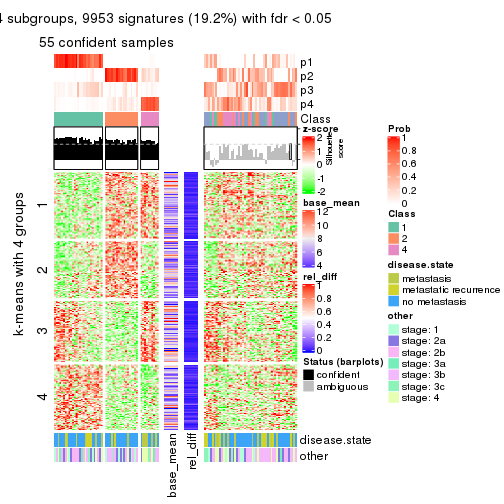</p>

</div>
<div id='tab-MAD-skmeans-get-signatures-4'>
<pre><code class="r">get_signatures(res, k = 5)
</code></pre>

<p></p>

</div>
<div id='tab-MAD-skmeans-get-signatures-5'>
<pre><code class="r">get_signatures(res, k = 6)
</code></pre>

<p></p>

</div>
</div>


Signature heatmaps where rows are not scaled:


<script>
$( function() {
	$( '#tabs-MAD-skmeans-get-signatures-no-scale' ).tabs();
} );
</script>
<div id='tabs-MAD-skmeans-get-signatures-no-scale'>
<ul>
<li><a href='#tab-MAD-skmeans-get-signatures-no-scale-1'>k = 2</a></li>
<li><a href='#tab-MAD-skmeans-get-signatures-no-scale-2'>k = 3</a></li>
<li><a href='#tab-MAD-skmeans-get-signatures-no-scale-3'>k = 4</a></li>
<li><a href='#tab-MAD-skmeans-get-signatures-no-scale-4'>k = 5</a></li>
<li><a href='#tab-MAD-skmeans-get-signatures-no-scale-5'>k = 6</a></li>
</ul>
<div id='tab-MAD-skmeans-get-signatures-no-scale-1'>
<pre><code class="r">get_signatures(res, k = 2, scale_rows = FALSE)
</code></pre>

<p></p>

</div>
<div id='tab-MAD-skmeans-get-signatures-no-scale-2'>
<pre><code class="r">get_signatures(res, k = 3, scale_rows = FALSE)
</code></pre>

<p></p>

</div>
<div id='tab-MAD-skmeans-get-signatures-no-scale-3'>
<pre><code class="r">get_signatures(res, k = 4, scale_rows = FALSE)
</code></pre>

<p></p>

</div>
<div id='tab-MAD-skmeans-get-signatures-no-scale-4'>
<pre><code class="r">get_signatures(res, k = 5, scale_rows = FALSE)
</code></pre>

<p>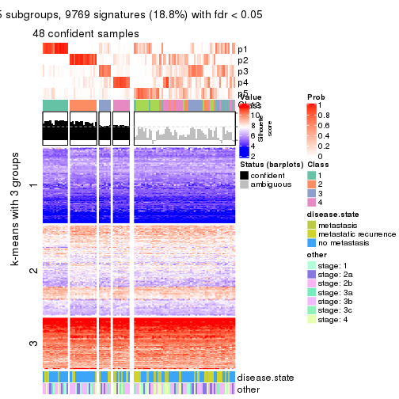</p>

</div>
<div id='tab-MAD-skmeans-get-signatures-no-scale-5'>
<pre><code class="r">get_signatures(res, k = 6, scale_rows = FALSE)
</code></pre>

<p></p>

</div>
</div>


Compare the overlap of signatures from different k:

```r
compare_signatures(res)
```


`get_signature()` returns a data frame invisibly. TO get the list of signatures, the function
call should be assigned to a variable explicitly. In following code, if `plot` argument is set
to `FALSE`, no heatmap is plotted while only the differential analysis is performed.

```r
# code only for demonstration
tb = get_signature(res, k = ..., plot = FALSE)
```

An example of the output of `tb` is:

```
#>   which_row         fdr    mean_1    mean_2 scaled_mean_1 scaled_mean_2 km
#> 1        38 0.042760348  8.373488  9.131774    -0.5533452     0.5164555  1
#> 2        40 0.018707592  7.106213  8.469186    -0.6173731     0.5762149  1
#> 3        55 0.019134737 10.221463 11.207825    -0.6159697     0.5749050  1
#> 4        59 0.006059896  5.921854  7.869574    -0.6899429     0.6439467  1
#> 5        60 0.018055526  8.928898 10.211722    -0.6204761     0.5791110  1
#> 6        98 0.009384629 15.714769 14.887706     0.6635654    -0.6193277  2
...
```

The columns in `tb` are:

1. `which_row`: row indices corresponding to the input matrix.
2. `fdr`: FDR for the differential test. 
3. `mean_x`: The mean value in group x.
4. `scaled_mean_x`: The mean value in group x after rows are scaled.
5. `km`: Row groups if k-means clustering is applied to rows.


UMAP plot which shows how samples are separated.


<script>
$( function() {
	$( '#tabs-MAD-skmeans-dimension-reduction' ).tabs();
} );
</script>
<div id='tabs-MAD-skmeans-dimension-reduction'>
<ul>
<li><a href='#tab-MAD-skmeans-dimension-reduction-1'>k = 2</a></li>
<li><a href='#tab-MAD-skmeans-dimension-reduction-2'>k = 3</a></li>
<li><a href='#tab-MAD-skmeans-dimension-reduction-3'>k = 4</a></li>
<li><a href='#tab-MAD-skmeans-dimension-reduction-4'>k = 5</a></li>
<li><a href='#tab-MAD-skmeans-dimension-reduction-5'>k = 6</a></li>
</ul>
<div id='tab-MAD-skmeans-dimension-reduction-1'>
<pre><code class="r">dimension_reduction(res, k = 2, method = &quot;UMAP&quot;)
</code></pre>

<p></p>

</div>
<div id='tab-MAD-skmeans-dimension-reduction-2'>
<pre><code class="r">dimension_reduction(res, k = 3, method = &quot;UMAP&quot;)
</code></pre>

<p></p>

</div>
<div id='tab-MAD-skmeans-dimension-reduction-3'>
<pre><code class="r">dimension_reduction(res, k = 4, method = &quot;UMAP&quot;)
</code></pre>

<p></p>

</div>
<div id='tab-MAD-skmeans-dimension-reduction-4'>
<pre><code class="r">dimension_reduction(res, k = 5, method = &quot;UMAP&quot;)
</code></pre>

<p></p>

</div>
<div id='tab-MAD-skmeans-dimension-reduction-5'>
<pre><code class="r">dimension_reduction(res, k = 6, method = &quot;UMAP&quot;)
</code></pre>

<p>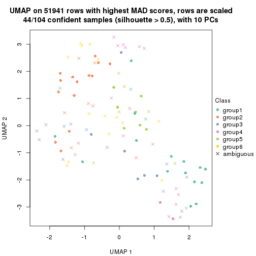</p>

</div>
</div>


Following heatmap shows how subgroups are split when increasing `k`:

```r
collect_classes(res)
```


Test correlation between subgroups and known annotations. If the known
annotation is numeric, one-way ANOVA test is applied, and if the known
annotation is discrete, chi-squared contingency table test is applied.

```r
test_to_known_factors(res)
```

```
#>               n disease.state(p) other(p) k
#> MAD:skmeans 101           0.2396    0.455 2
#> MAD:skmeans  30               NA       NA 3
#> MAD:skmeans  56           0.0782    0.292 4
#> MAD:skmeans  48           0.3557    0.359 5
#> MAD:skmeans  44           0.5242    0.371 6
```


If matrix rows can be associated to genes, consider to use `functional_enrichment(res,
...)` to perform function enrichment for the signature genes. See [this vignette](http://bioconductor.org/packages/devel/bioc/vignettes/cola/inst/doc/functional_enrichment.html) for more detailed explanations.


 

---------------------------------------------------


### MAD:pam


The object with results only for a single top-value method and a single partition method 
can be extracted as:

```r
res = res_list["MAD", "pam"]
# you can also extract it by
# res = res_list["MAD:pam"]
```

A summary of `res` and all the functions that can be applied to it:

```r
res
```

```
#> A 'ConsensusPartition' object with k = 2, 3, 4, 5, 6.
#>   On a matrix with 51941 rows and 104 columns.
#>   Top rows (1000, 2000, 3000, 4000, 5000) are extracted by 'MAD' method.
#>   Subgroups are detected by 'pam' method.
#>   Performed in total 1250 partitions by row resampling.
#>   Best k for subgroups seems to be 2.
#> 
#> Following methods can be applied to this 'ConsensusPartition' object:
#>  [1] "cola_report"             "collect_classes"         "collect_plots"          
#>  [4] "collect_stats"           "colnames"                "compare_signatures"     
#>  [7] "consensus_heatmap"       "dimension_reduction"     "functional_enrichment"  
#> [10] "get_anno_col"            "get_anno"                "get_classes"            
#> [13] "get_consensus"           "get_matrix"              "get_membership"         
#> [16] "get_param"               "get_signatures"          "get_stats"              
#> [19] "is_best_k"               "is_stable_k"             "membership_heatmap"     
#> [22] "ncol"                    "nrow"                    "plot_ecdf"              
#> [25] "rownames"                "select_partition_number" "show"                   
#> [28] "suggest_best_k"          "test_to_known_factors"
```

`collect_plots()` function collects all the plots made from `res` for all `k` (number of partitions)
into one single page to provide an easy and fast comparison between different `k`.

```r
collect_plots(res)
```


The plots are:

- The first row: a plot of the ECDF (empirical cumulative distribution
  function) curves of the consensus matrix for each `k` and the heatmap of
  predicted classes for each `k`.
- The second row: heatmaps of the consensus matrix for each `k`.
- The third row: heatmaps of the membership matrix for each `k`.
- The fouth row: heatmaps of the signatures for each `k`.

All the plots in panels can be made by individual functions and they are
plotted later in this section.

`select_partition_number()` produces several plots showing different
statistics for choosing "optimized" `k`. There are following statistics:

- ECDF curves of the consensus matrix for each `k`;
- 1-PAC. [The PAC
  score](https://en.wikipedia.org/wiki/Consensus_clustering#Over-interpretation_potential_of_consensus_clustering)
  measures the proportion of the ambiguous subgrouping.
- Mean silhouette score.
- Concordance. The mean probability of fiting the consensus class ids in all
  partitions.
- Area increased. Denote $A_k$ as the area under the ECDF curve for current
  `k`, the area increased is defined as $A_k - A_{k-1}$.
- Rand index. The percent of pairs of samples that are both in a same cluster
  or both are not in a same cluster in the partition of k and k-1.
- Jaccard index. The ratio of pairs of samples are both in a same cluster in
  the partition of k and k-1 and the pairs of samples are both in a same
  cluster in the partition k or k-1.

The detailed explanations of these statistics can be found in [the _cola_
vignette](http://bioconductor.org/packages/devel/bioc/vignettes/cola/inst/doc/cola.html#toc_13).

Generally speaking, lower PAC score, higher mean silhouette score or higher
concordance corresponds to better partition. Rand index and Jaccard index
measure how similar the current partition is compared to partition with `k-1`.
If they are too similar, we won't accept `k` is better than `k-1`.

```r
select_partition_number(res)
```


The numeric values for all these statistics can be obtained by `get_stats()`.

```r
get_stats(res)
```

```
#>   k 1-PAC mean_silhouette concordance area_increased  Rand Jaccard
#> 2 2 0.733           0.876       0.945         0.4988 0.498   0.498
#> 3 3 0.696           0.616       0.842         0.2833 0.825   0.666
#> 4 4 0.675           0.713       0.862         0.1429 0.753   0.443
#> 5 5 0.668           0.631       0.813         0.0580 0.961   0.855
#> 6 6 0.676           0.507       0.744         0.0452 0.941   0.760
```

`suggest_best_k()` suggests the best $k$ based on these statistics. The rules are as follows:

- All $k$ with Jaccard index larger than 0.95 are removed because increasing
  $k$ does not provide enough extra information. If all $k$ are removed, it is
  marked as no subgroup is detected.
- For all $k$ with 1-PAC score larger than 0.9, the maximal $k$ is taken as
  the best $k$, and other $k$ are marked as optional $k$.
- If it does not fit the second rule. The $k$ with the maximal vote of the
  highest 1-PAC score, highest mean silhouette, and highest concordance is
  taken as the best $k$.

```r
suggest_best_k(res)
```

```
#> [1] 2
```


Following shows the table of the partitions (You need to click the **show/hide
code output** link to see it). The membership matrix (columns with name `p*`)
is inferred by
[`clue::cl_consensus()`](https://www.rdocumentation.org/link/cl_consensus?package=clue)
function with the `SE` method. Basically the value in the membership matrix
represents the probability to belong to a certain group. The finall class
label for an item is determined with the group with highest probability it
belongs to.

In `get_classes()` function, the entropy is calculated from the membership
matrix and the silhouette score is calculated from the consensus matrix.


<script>
$( function() {
	$( '#tabs-MAD-pam-get-classes' ).tabs();
} );
</script>
<div id='tabs-MAD-pam-get-classes'>
<ul>
<li><a href='#tab-MAD-pam-get-classes-1'>k = 2</a></li>
<li><a href='#tab-MAD-pam-get-classes-2'>k = 3</a></li>
<li><a href='#tab-MAD-pam-get-classes-3'>k = 4</a></li>
<li><a href='#tab-MAD-pam-get-classes-4'>k = 5</a></li>
<li><a href='#tab-MAD-pam-get-classes-5'>k = 6</a></li>
</ul>

<div id='tab-MAD-pam-get-classes-1'>
<p><a id='tab-MAD-pam-get-classes-1-a' style='color:#0366d6' href='#'>show/hide code output</a></p>
<pre><code class="r">cbind(get_classes(res, k = 2), get_membership(res, k = 2))
</code></pre>

<pre><code>#&gt;           class entropy silhouette    p1    p2
#&gt; GSM537341     1  0.0000      0.948 1.000 0.000
#&gt; GSM537345     1  0.0000      0.948 1.000 0.000
#&gt; GSM537355     1  0.2603      0.921 0.956 0.044
#&gt; GSM537366     1  0.0000      0.948 1.000 0.000
#&gt; GSM537370     1  0.0000      0.948 1.000 0.000
#&gt; GSM537380     2  0.0000      0.929 0.000 1.000
#&gt; GSM537392     2  0.0000      0.929 0.000 1.000
#&gt; GSM537415     2  0.0000      0.929 0.000 1.000
#&gt; GSM537417     2  0.9732      0.365 0.404 0.596
#&gt; GSM537422     1  0.0000      0.948 1.000 0.000
#&gt; GSM537423     2  0.0000      0.929 0.000 1.000
#&gt; GSM537427     2  0.0000      0.929 0.000 1.000
#&gt; GSM537430     2  0.2603      0.901 0.044 0.956
#&gt; GSM537336     1  0.0000      0.948 1.000 0.000
#&gt; GSM537337     2  0.0000      0.929 0.000 1.000
#&gt; GSM537348     1  0.0000      0.948 1.000 0.000
#&gt; GSM537349     2  0.0000      0.929 0.000 1.000
#&gt; GSM537356     1  0.0000      0.948 1.000 0.000
#&gt; GSM537361     1  0.0000      0.948 1.000 0.000
#&gt; GSM537374     1  0.9635      0.379 0.612 0.388
#&gt; GSM537377     1  0.0000      0.948 1.000 0.000
#&gt; GSM537378     2  0.0000      0.929 0.000 1.000
#&gt; GSM537379     2  0.9881      0.276 0.436 0.564
#&gt; GSM537383     2  0.0000      0.929 0.000 1.000
#&gt; GSM537388     2  0.0672      0.925 0.008 0.992
#&gt; GSM537395     2  0.0000      0.929 0.000 1.000
#&gt; GSM537400     1  0.3114      0.912 0.944 0.056
#&gt; GSM537404     1  0.4431      0.885 0.908 0.092
#&gt; GSM537409     2  0.0000      0.929 0.000 1.000
#&gt; GSM537418     1  0.0000      0.948 1.000 0.000
#&gt; GSM537425     1  0.0376      0.946 0.996 0.004
#&gt; GSM537333     1  0.0000      0.948 1.000 0.000
#&gt; GSM537342     2  0.1633      0.914 0.024 0.976
#&gt; GSM537347     1  0.0000      0.948 1.000 0.000
#&gt; GSM537350     1  0.0000      0.948 1.000 0.000
#&gt; GSM537362     1  0.0000      0.948 1.000 0.000
#&gt; GSM537363     1  0.7139      0.761 0.804 0.196
#&gt; GSM537368     1  0.0000      0.948 1.000 0.000
#&gt; GSM537376     2  0.0000      0.929 0.000 1.000
#&gt; GSM537381     1  0.0000      0.948 1.000 0.000
#&gt; GSM537386     2  0.0000      0.929 0.000 1.000
#&gt; GSM537398     1  0.0000      0.948 1.000 0.000
#&gt; GSM537402     2  0.8763      0.595 0.296 0.704
#&gt; GSM537405     1  0.0000      0.948 1.000 0.000
#&gt; GSM537371     1  0.0000      0.948 1.000 0.000
#&gt; GSM537421     2  0.6712      0.774 0.176 0.824
#&gt; GSM537424     1  0.0000      0.948 1.000 0.000
#&gt; GSM537432     1  0.0000      0.948 1.000 0.000
#&gt; GSM537331     2  0.8763      0.595 0.296 0.704
#&gt; GSM537332     2  0.0000      0.929 0.000 1.000
#&gt; GSM537334     1  0.4939      0.870 0.892 0.108
#&gt; GSM537338     2  0.0672      0.925 0.008 0.992
#&gt; GSM537353     2  0.0000      0.929 0.000 1.000
#&gt; GSM537357     1  0.0000      0.948 1.000 0.000
#&gt; GSM537358     2  0.0000      0.929 0.000 1.000
#&gt; GSM537375     2  0.8081      0.678 0.248 0.752
#&gt; GSM537389     2  0.0000      0.929 0.000 1.000
#&gt; GSM537390     2  0.0000      0.929 0.000 1.000
#&gt; GSM537393     2  0.6712      0.777 0.176 0.824
#&gt; GSM537399     1  0.0000      0.948 1.000 0.000
#&gt; GSM537407     1  0.4939      0.863 0.892 0.108
#&gt; GSM537408     2  0.0000      0.929 0.000 1.000
#&gt; GSM537428     1  0.3584      0.904 0.932 0.068
#&gt; GSM537354     2  0.0000      0.929 0.000 1.000
#&gt; GSM537410     2  0.0000      0.929 0.000 1.000
#&gt; GSM537413     2  0.0000      0.929 0.000 1.000
#&gt; GSM537396     1  0.8763      0.585 0.704 0.296
#&gt; GSM537397     1  0.8763      0.550 0.704 0.296
#&gt; GSM537330     1  0.4431      0.878 0.908 0.092
#&gt; GSM537369     1  0.0000      0.948 1.000 0.000
#&gt; GSM537373     1  0.6343      0.812 0.840 0.160
#&gt; GSM537401     1  0.2236      0.927 0.964 0.036
#&gt; GSM537343     1  0.0000      0.948 1.000 0.000
#&gt; GSM537367     1  0.8386      0.647 0.732 0.268
#&gt; GSM537382     2  0.9775      0.316 0.412 0.588
#&gt; GSM537385     2  0.0376      0.927 0.004 0.996
#&gt; GSM537391     1  0.0000      0.948 1.000 0.000
#&gt; GSM537419     2  0.0000      0.929 0.000 1.000
#&gt; GSM537420     1  0.0000      0.948 1.000 0.000
#&gt; GSM537429     1  0.0000      0.948 1.000 0.000
#&gt; GSM537431     1  0.5737      0.840 0.864 0.136
#&gt; GSM537387     1  0.0000      0.948 1.000 0.000
#&gt; GSM537414     1  0.0000      0.948 1.000 0.000
#&gt; GSM537433     1  0.0672      0.944 0.992 0.008
#&gt; GSM537335     1  0.0376      0.946 0.996 0.004
#&gt; GSM537339     1  0.0000      0.948 1.000 0.000
#&gt; GSM537340     2  0.6438      0.787 0.164 0.836
#&gt; GSM537344     1  0.0000      0.948 1.000 0.000
#&gt; GSM537346     2  0.0672      0.925 0.008 0.992
#&gt; GSM537351     1  0.0000      0.948 1.000 0.000
#&gt; GSM537352     2  0.0000      0.929 0.000 1.000
#&gt; GSM537359     2  0.0000      0.929 0.000 1.000
#&gt; GSM537360     2  0.0000      0.929 0.000 1.000
#&gt; GSM537364     1  0.0000      0.948 1.000 0.000
#&gt; GSM537365     1  0.8081      0.655 0.752 0.248
#&gt; GSM537372     1  0.0000      0.948 1.000 0.000
#&gt; GSM537384     1  0.0000      0.948 1.000 0.000
#&gt; GSM537394     2  0.3114      0.888 0.056 0.944
#&gt; GSM537403     2  0.0000      0.929 0.000 1.000
#&gt; GSM537406     2  0.0000      0.929 0.000 1.000
#&gt; GSM537411     2  0.0000      0.929 0.000 1.000
#&gt; GSM537412     2  0.0000      0.929 0.000 1.000
#&gt; GSM537416     2  0.9393      0.450 0.356 0.644
#&gt; GSM537426     2  0.0000      0.929 0.000 1.000
</code></pre>

<script>
$('#tab-MAD-pam-get-classes-1-a').parent().next().next().hide();
$('#tab-MAD-pam-get-classes-1-a').click(function(){
  $('#tab-MAD-pam-get-classes-1-a').parent().next().next().toggle();
  return(false);
});
</script>
</div>

<div id='tab-MAD-pam-get-classes-2'>
<p><a id='tab-MAD-pam-get-classes-2-a' style='color:#0366d6' href='#'>show/hide code output</a></p>
<pre><code class="r">cbind(get_classes(res, k = 3), get_membership(res, k = 3))
</code></pre>

<pre><code>#&gt;           class entropy silhouette    p1    p2    p3
#&gt; GSM537341     1  0.2200     0.8761 0.940 0.056 0.004
#&gt; GSM537345     1  0.0000     0.9091 1.000 0.000 0.000
#&gt; GSM537355     1  0.9929    -0.2831 0.392 0.296 0.312
#&gt; GSM537366     1  0.0000     0.9091 1.000 0.000 0.000
#&gt; GSM537370     1  0.2703     0.8716 0.928 0.056 0.016
#&gt; GSM537380     2  0.6111     0.6664 0.000 0.604 0.396
#&gt; GSM537392     2  0.0237     0.3225 0.000 0.996 0.004
#&gt; GSM537415     2  0.6308     0.6410 0.000 0.508 0.492
#&gt; GSM537417     1  0.8494     0.4318 0.608 0.236 0.156
#&gt; GSM537422     1  0.0000     0.9091 1.000 0.000 0.000
#&gt; GSM537423     2  0.6225     0.6644 0.000 0.568 0.432
#&gt; GSM537427     3  0.6280     0.6857 0.000 0.460 0.540
#&gt; GSM537430     3  0.6309     0.6644 0.000 0.496 0.504
#&gt; GSM537336     1  0.0000     0.9091 1.000 0.000 0.000
#&gt; GSM537337     3  0.6252     0.6933 0.000 0.444 0.556
#&gt; GSM537348     1  0.0000     0.9091 1.000 0.000 0.000
#&gt; GSM537349     2  0.6126     0.6686 0.000 0.600 0.400
#&gt; GSM537356     1  0.0424     0.9065 0.992 0.000 0.008
#&gt; GSM537361     1  0.0000     0.9091 1.000 0.000 0.000
#&gt; GSM537374     3  0.7464     0.6770 0.040 0.400 0.560
#&gt; GSM537377     1  0.0000     0.9091 1.000 0.000 0.000
#&gt; GSM537378     2  0.6235     0.6644 0.000 0.564 0.436
#&gt; GSM537379     3  0.7487     0.6776 0.040 0.408 0.552
#&gt; GSM537383     2  0.6111     0.6691 0.000 0.604 0.396
#&gt; GSM537388     2  0.3192     0.1550 0.000 0.888 0.112
#&gt; GSM537395     2  0.6062    -0.5163 0.000 0.616 0.384
#&gt; GSM537400     3  0.6225     0.6935 0.000 0.432 0.568
#&gt; GSM537404     1  0.5722     0.7516 0.800 0.132 0.068
#&gt; GSM537409     3  0.6302    -0.6479 0.000 0.480 0.520
#&gt; GSM537418     1  0.0000     0.9091 1.000 0.000 0.000
#&gt; GSM537425     1  0.0747     0.9016 0.984 0.016 0.000
#&gt; GSM537333     1  0.0000     0.9091 1.000 0.000 0.000
#&gt; GSM537342     3  0.6225     0.6935 0.000 0.432 0.568
#&gt; GSM537347     1  0.0000     0.9091 1.000 0.000 0.000
#&gt; GSM537350     1  0.0424     0.9065 0.992 0.000 0.008
#&gt; GSM537362     1  0.0000     0.9091 1.000 0.000 0.000
#&gt; GSM537363     1  0.5423     0.7765 0.820 0.084 0.096
#&gt; GSM537368     1  0.0000     0.9091 1.000 0.000 0.000
#&gt; GSM537376     3  0.6235     0.6941 0.000 0.436 0.564
#&gt; GSM537381     1  0.0000     0.9091 1.000 0.000 0.000
#&gt; GSM537386     2  0.8000     0.6216 0.064 0.528 0.408
#&gt; GSM537398     1  0.0000     0.9091 1.000 0.000 0.000
#&gt; GSM537402     3  0.6168     0.6906 0.000 0.412 0.588
#&gt; GSM537405     1  0.0000     0.9091 1.000 0.000 0.000
#&gt; GSM537371     1  0.0000     0.9091 1.000 0.000 0.000
#&gt; GSM537421     3  0.1289     0.1484 0.000 0.032 0.968
#&gt; GSM537424     1  0.0000     0.9091 1.000 0.000 0.000
#&gt; GSM537432     1  0.2152     0.8825 0.948 0.036 0.016
#&gt; GSM537331     2  0.6143    -0.4088 0.012 0.684 0.304
#&gt; GSM537332     2  0.6225     0.6644 0.000 0.568 0.432
#&gt; GSM537334     1  0.6473     0.5715 0.668 0.312 0.020
#&gt; GSM537338     3  0.6244     0.6939 0.000 0.440 0.560
#&gt; GSM537353     3  0.6126    -0.5318 0.000 0.400 0.600
#&gt; GSM537357     1  0.0000     0.9091 1.000 0.000 0.000
#&gt; GSM537358     2  0.1411     0.2872 0.000 0.964 0.036
#&gt; GSM537375     3  0.7484     0.6615 0.036 0.460 0.504
#&gt; GSM537389     2  0.6168     0.6672 0.000 0.588 0.412
#&gt; GSM537390     2  0.6225     0.6644 0.000 0.568 0.432
#&gt; GSM537393     3  0.5882     0.6353 0.000 0.348 0.652
#&gt; GSM537399     1  0.0424     0.9065 0.992 0.000 0.008
#&gt; GSM537407     1  0.0237     0.9078 0.996 0.000 0.004
#&gt; GSM537408     2  0.3412     0.4566 0.000 0.876 0.124
#&gt; GSM537428     3  0.8328     0.6437 0.084 0.396 0.520
#&gt; GSM537354     3  0.6252     0.6933 0.000 0.444 0.556
#&gt; GSM537410     3  0.0747     0.1758 0.000 0.016 0.984
#&gt; GSM537413     2  0.6235     0.6635 0.000 0.564 0.436
#&gt; GSM537396     1  0.8652     0.1114 0.492 0.104 0.404
#&gt; GSM537397     3  0.8100     0.1454 0.420 0.068 0.512
#&gt; GSM537330     1  0.2165     0.8687 0.936 0.064 0.000
#&gt; GSM537369     1  0.0000     0.9091 1.000 0.000 0.000
#&gt; GSM537373     1  0.6442     0.3270 0.564 0.004 0.432
#&gt; GSM537401     1  0.7844     0.4722 0.624 0.292 0.084
#&gt; GSM537343     1  0.0000     0.9091 1.000 0.000 0.000
#&gt; GSM537367     1  0.7909     0.5774 0.664 0.148 0.188
#&gt; GSM537382     3  0.6442     0.6938 0.004 0.432 0.564
#&gt; GSM537385     2  0.0237     0.3208 0.000 0.996 0.004
#&gt; GSM537391     1  0.0000     0.9091 1.000 0.000 0.000
#&gt; GSM537419     2  0.6111     0.6691 0.000 0.604 0.396
#&gt; GSM537420     1  0.0000     0.9091 1.000 0.000 0.000
#&gt; GSM537429     1  0.1647     0.8869 0.960 0.036 0.004
#&gt; GSM537431     1  0.8983     0.0267 0.480 0.388 0.132
#&gt; GSM537387     1  0.1999     0.8840 0.952 0.036 0.012
#&gt; GSM537414     1  0.0000     0.9091 1.000 0.000 0.000
#&gt; GSM537433     1  0.0892     0.9001 0.980 0.000 0.020
#&gt; GSM537335     1  0.0848     0.9040 0.984 0.008 0.008
#&gt; GSM537339     1  0.0747     0.9018 0.984 0.016 0.000
#&gt; GSM537340     3  0.6111     0.6761 0.000 0.396 0.604
#&gt; GSM537344     1  0.0000     0.9091 1.000 0.000 0.000
#&gt; GSM537346     2  0.6026    -0.5433 0.000 0.624 0.376
#&gt; GSM537351     1  0.0000     0.9091 1.000 0.000 0.000
#&gt; GSM537352     3  0.6260     0.6925 0.000 0.448 0.552
#&gt; GSM537359     2  0.6045     0.6599 0.000 0.620 0.380
#&gt; GSM537360     3  0.6299    -0.6458 0.000 0.476 0.524
#&gt; GSM537364     1  0.0000     0.9091 1.000 0.000 0.000
#&gt; GSM537365     1  0.6663     0.6853 0.748 0.096 0.156
#&gt; GSM537372     1  0.0424     0.9065 0.992 0.000 0.008
#&gt; GSM537384     1  0.0000     0.9091 1.000 0.000 0.000
#&gt; GSM537394     2  0.8779     0.4315 0.260 0.576 0.164
#&gt; GSM537403     2  0.4002     0.1519 0.000 0.840 0.160
#&gt; GSM537406     2  0.6309     0.6370 0.000 0.504 0.496
#&gt; GSM537411     3  0.5560     0.1148 0.000 0.300 0.700
#&gt; GSM537412     2  0.6309     0.6382 0.000 0.504 0.496
#&gt; GSM537416     3  0.4128     0.4024 0.012 0.132 0.856
#&gt; GSM537426     2  0.6079     0.4513 0.000 0.612 0.388
</code></pre>

<script>
$('#tab-MAD-pam-get-classes-2-a').parent().next().next().hide();
$('#tab-MAD-pam-get-classes-2-a').click(function(){
  $('#tab-MAD-pam-get-classes-2-a').parent().next().next().toggle();
  return(false);
});
</script>
</div>

<div id='tab-MAD-pam-get-classes-3'>
<p><a id='tab-MAD-pam-get-classes-3-a' style='color:#0366d6' href='#'>show/hide code output</a></p>
<pre><code class="r">cbind(get_classes(res, k = 4), get_membership(res, k = 4))
</code></pre>

<pre><code>#&gt;           class entropy silhouette    p1    p2    p3    p4
#&gt; GSM537341     1  0.2197     0.8691 0.916 0.000 0.080 0.004
#&gt; GSM537345     1  0.0188     0.9063 0.996 0.000 0.004 0.000
#&gt; GSM537355     4  0.4830     0.3237 0.392 0.000 0.000 0.608
#&gt; GSM537366     1  0.0921     0.8993 0.972 0.000 0.028 0.000
#&gt; GSM537370     3  0.2999     0.7451 0.132 0.000 0.864 0.004
#&gt; GSM537380     3  0.3052     0.6594 0.000 0.136 0.860 0.004
#&gt; GSM537392     4  0.7070     0.3449 0.000 0.348 0.136 0.516
#&gt; GSM537415     2  0.0000     0.7551 0.000 1.000 0.000 0.000
#&gt; GSM537417     1  0.5698     0.4189 0.608 0.036 0.000 0.356
#&gt; GSM537422     1  0.0000     0.9070 1.000 0.000 0.000 0.000
#&gt; GSM537423     2  0.1022     0.7466 0.000 0.968 0.032 0.000
#&gt; GSM537427     4  0.0817     0.8397 0.000 0.000 0.024 0.976
#&gt; GSM537430     4  0.0000     0.8455 0.000 0.000 0.000 1.000
#&gt; GSM537336     1  0.1716     0.8749 0.936 0.000 0.064 0.000
#&gt; GSM537337     4  0.0000     0.8455 0.000 0.000 0.000 1.000
#&gt; GSM537348     1  0.1022     0.8979 0.968 0.000 0.032 0.000
#&gt; GSM537349     2  0.2714     0.7089 0.000 0.884 0.112 0.004
#&gt; GSM537356     3  0.4304     0.7011 0.284 0.000 0.716 0.000
#&gt; GSM537361     1  0.2760     0.8320 0.872 0.000 0.128 0.000
#&gt; GSM537374     4  0.0188     0.8445 0.004 0.000 0.000 0.996
#&gt; GSM537377     1  0.0000     0.9070 1.000 0.000 0.000 0.000
#&gt; GSM537378     2  0.0000     0.7551 0.000 1.000 0.000 0.000
#&gt; GSM537379     4  0.0188     0.8445 0.004 0.000 0.000 0.996
#&gt; GSM537383     2  0.2714     0.7089 0.000 0.884 0.112 0.004
#&gt; GSM537388     4  0.5186     0.5087 0.000 0.344 0.016 0.640
#&gt; GSM537395     4  0.4134     0.6381 0.000 0.260 0.000 0.740
#&gt; GSM537400     4  0.0921     0.8372 0.000 0.000 0.028 0.972
#&gt; GSM537404     3  0.3836     0.7424 0.128 0.004 0.840 0.028
#&gt; GSM537409     2  0.0000     0.7551 0.000 1.000 0.000 0.000
#&gt; GSM537418     1  0.0000     0.9070 1.000 0.000 0.000 0.000
#&gt; GSM537425     1  0.1297     0.8962 0.964 0.000 0.020 0.016
#&gt; GSM537333     1  0.0000     0.9070 1.000 0.000 0.000 0.000
#&gt; GSM537342     4  0.1118     0.8346 0.000 0.000 0.036 0.964
#&gt; GSM537347     1  0.0000     0.9070 1.000 0.000 0.000 0.000
#&gt; GSM537350     3  0.4222     0.7136 0.272 0.000 0.728 0.000
#&gt; GSM537362     1  0.0000     0.9070 1.000 0.000 0.000 0.000
#&gt; GSM537363     1  0.4419     0.7668 0.792 0.012 0.180 0.016
#&gt; GSM537368     1  0.0000     0.9070 1.000 0.000 0.000 0.000
#&gt; GSM537376     4  0.0000     0.8455 0.000 0.000 0.000 1.000
#&gt; GSM537381     1  0.0000     0.9070 1.000 0.000 0.000 0.000
#&gt; GSM537386     3  0.3626     0.6143 0.000 0.184 0.812 0.004
#&gt; GSM537398     1  0.0188     0.9062 0.996 0.000 0.004 0.000
#&gt; GSM537402     4  0.1297     0.8335 0.000 0.016 0.020 0.964
#&gt; GSM537405     1  0.0000     0.9070 1.000 0.000 0.000 0.000
#&gt; GSM537371     1  0.0188     0.9063 0.996 0.000 0.004 0.000
#&gt; GSM537421     2  0.5368     0.4311 0.000 0.636 0.024 0.340
#&gt; GSM537424     1  0.0000     0.9070 1.000 0.000 0.000 0.000
#&gt; GSM537432     3  0.3356     0.7374 0.176 0.000 0.824 0.000
#&gt; GSM537331     4  0.5462     0.6711 0.000 0.152 0.112 0.736
#&gt; GSM537332     2  0.2469     0.6987 0.000 0.892 0.108 0.000
#&gt; GSM537334     1  0.6178     0.5409 0.660 0.000 0.112 0.228
#&gt; GSM537338     4  0.0000     0.8455 0.000 0.000 0.000 1.000
#&gt; GSM537353     3  0.3636     0.6595 0.000 0.172 0.820 0.008
#&gt; GSM537357     1  0.0188     0.9063 0.996 0.000 0.004 0.000
#&gt; GSM537358     3  0.7180     0.1989 0.000 0.348 0.504 0.148
#&gt; GSM537375     4  0.0376     0.8449 0.004 0.004 0.000 0.992
#&gt; GSM537389     2  0.4920     0.3533 0.000 0.628 0.368 0.004
#&gt; GSM537390     2  0.0000     0.7551 0.000 1.000 0.000 0.000
#&gt; GSM537393     4  0.4361     0.6174 0.000 0.208 0.020 0.772
#&gt; GSM537399     3  0.3942     0.7281 0.236 0.000 0.764 0.000
#&gt; GSM537407     1  0.3649     0.7659 0.796 0.000 0.204 0.000
#&gt; GSM537408     3  0.5746     0.2846 0.000 0.348 0.612 0.040
#&gt; GSM537428     4  0.1118     0.8283 0.036 0.000 0.000 0.964
#&gt; GSM537354     4  0.0000     0.8455 0.000 0.000 0.000 1.000
#&gt; GSM537410     2  0.4819     0.4382 0.000 0.652 0.004 0.344
#&gt; GSM537413     2  0.2466     0.7193 0.000 0.900 0.096 0.004
#&gt; GSM537396     2  0.6209    -0.0971 0.052 0.492 0.456 0.000
#&gt; GSM537397     3  0.5006     0.7104 0.104 0.000 0.772 0.124
#&gt; GSM537330     1  0.2281     0.8339 0.904 0.000 0.096 0.000
#&gt; GSM537369     1  0.0592     0.9022 0.984 0.000 0.016 0.000
#&gt; GSM537373     2  0.5331     0.3806 0.332 0.644 0.024 0.000
#&gt; GSM537401     3  0.5593     0.7057 0.212 0.000 0.708 0.080
#&gt; GSM537343     1  0.3569     0.7698 0.804 0.000 0.196 0.000
#&gt; GSM537367     2  0.8385     0.0798 0.384 0.400 0.180 0.036
#&gt; GSM537382     4  0.0000     0.8455 0.000 0.000 0.000 1.000
#&gt; GSM537385     4  0.6819     0.3795 0.000 0.348 0.112 0.540
#&gt; GSM537391     1  0.0707     0.9006 0.980 0.000 0.020 0.000
#&gt; GSM537419     2  0.2714     0.7089 0.000 0.884 0.112 0.004
#&gt; GSM537420     1  0.0188     0.9063 0.996 0.000 0.004 0.000
#&gt; GSM537429     1  0.1305     0.8919 0.960 0.000 0.036 0.004
#&gt; GSM537431     1  0.6700     0.0833 0.480 0.000 0.088 0.432
#&gt; GSM537387     3  0.4584     0.6835 0.300 0.000 0.696 0.004
#&gt; GSM537414     1  0.0000     0.9070 1.000 0.000 0.000 0.000
#&gt; GSM537433     1  0.2973     0.7807 0.856 0.144 0.000 0.000
#&gt; GSM537335     1  0.5040     0.2110 0.628 0.000 0.364 0.008
#&gt; GSM537339     1  0.1474     0.8899 0.948 0.000 0.052 0.000
#&gt; GSM537340     4  0.2111     0.8164 0.000 0.044 0.024 0.932
#&gt; GSM537344     1  0.0000     0.9070 1.000 0.000 0.000 0.000
#&gt; GSM537346     4  0.2843     0.7952 0.000 0.020 0.088 0.892
#&gt; GSM537351     1  0.2281     0.8516 0.904 0.000 0.096 0.000
#&gt; GSM537352     4  0.0000     0.8455 0.000 0.000 0.000 1.000
#&gt; GSM537359     3  0.5132     0.1646 0.000 0.448 0.548 0.004
#&gt; GSM537360     2  0.0000     0.7551 0.000 1.000 0.000 0.000
#&gt; GSM537364     1  0.0000     0.9070 1.000 0.000 0.000 0.000
#&gt; GSM537365     3  0.2871     0.7107 0.032 0.072 0.896 0.000
#&gt; GSM537372     3  0.4222     0.7136 0.272 0.000 0.728 0.000
#&gt; GSM537384     1  0.0000     0.9070 1.000 0.000 0.000 0.000
#&gt; GSM537394     3  0.1109     0.7048 0.004 0.028 0.968 0.000
#&gt; GSM537403     4  0.4781     0.5321 0.000 0.336 0.004 0.660
#&gt; GSM537406     2  0.0000     0.7551 0.000 1.000 0.000 0.000
#&gt; GSM537411     3  0.1297     0.7026 0.000 0.020 0.964 0.016
#&gt; GSM537412     2  0.0000     0.7551 0.000 1.000 0.000 0.000
#&gt; GSM537416     2  0.5493     0.1847 0.000 0.528 0.016 0.456
#&gt; GSM537426     2  0.3356     0.6153 0.000 0.824 0.000 0.176
</code></pre>

<script>
$('#tab-MAD-pam-get-classes-3-a').parent().next().next().hide();
$('#tab-MAD-pam-get-classes-3-a').click(function(){
  $('#tab-MAD-pam-get-classes-3-a').parent().next().next().toggle();
  return(false);
});
</script>
</div>

<div id='tab-MAD-pam-get-classes-4'>
<p><a id='tab-MAD-pam-get-classes-4-a' style='color:#0366d6' href='#'>show/hide code output</a></p>
<pre><code class="r">cbind(get_classes(res, k = 5), get_membership(res, k = 5))
</code></pre>

<pre><code>#&gt;           class entropy silhouette    p1    p2    p3    p4    p5
#&gt; GSM537341     1  0.3102     0.7199 0.860 0.000 0.056 0.000 0.084
#&gt; GSM537345     3  0.3816     0.9169 0.304 0.000 0.696 0.000 0.000
#&gt; GSM537355     4  0.4161     0.2447 0.392 0.000 0.000 0.608 0.000
#&gt; GSM537366     1  0.1484     0.7704 0.944 0.000 0.008 0.000 0.048
#&gt; GSM537370     5  0.2054     0.7313 0.052 0.000 0.028 0.000 0.920
#&gt; GSM537380     5  0.5232     0.6000 0.000 0.084 0.268 0.000 0.648
#&gt; GSM537392     4  0.7359     0.1041 0.000 0.316 0.268 0.388 0.028
#&gt; GSM537415     2  0.0000     0.7333 0.000 1.000 0.000 0.000 0.000
#&gt; GSM537417     1  0.5202     0.1842 0.596 0.056 0.000 0.348 0.000
#&gt; GSM537422     1  0.0000     0.7812 1.000 0.000 0.000 0.000 0.000
#&gt; GSM537423     2  0.2377     0.6934 0.000 0.872 0.128 0.000 0.000
#&gt; GSM537427     4  0.1671     0.7987 0.000 0.000 0.076 0.924 0.000
#&gt; GSM537430     4  0.0290     0.8238 0.000 0.008 0.000 0.992 0.000
#&gt; GSM537336     3  0.3796     0.9136 0.300 0.000 0.700 0.000 0.000
#&gt; GSM537337     4  0.0000     0.8247 0.000 0.000 0.000 1.000 0.000
#&gt; GSM537348     1  0.1484     0.7716 0.944 0.000 0.008 0.000 0.048
#&gt; GSM537349     2  0.3885     0.6082 0.000 0.724 0.268 0.000 0.008
#&gt; GSM537356     5  0.3602     0.6724 0.180 0.000 0.024 0.000 0.796
#&gt; GSM537361     1  0.2488     0.7157 0.872 0.000 0.004 0.000 0.124
#&gt; GSM537374     4  0.0000     0.8247 0.000 0.000 0.000 1.000 0.000
#&gt; GSM537377     1  0.0000     0.7812 1.000 0.000 0.000 0.000 0.000
#&gt; GSM537378     2  0.0000     0.7333 0.000 1.000 0.000 0.000 0.000
#&gt; GSM537379     4  0.0000     0.8247 0.000 0.000 0.000 1.000 0.000
#&gt; GSM537383     2  0.3885     0.6082 0.000 0.724 0.268 0.000 0.008
#&gt; GSM537388     4  0.4713     0.5473 0.000 0.280 0.044 0.676 0.000
#&gt; GSM537395     4  0.3366     0.6454 0.000 0.232 0.000 0.768 0.000
#&gt; GSM537400     4  0.0703     0.8190 0.000 0.000 0.000 0.976 0.024
#&gt; GSM537404     5  0.1836     0.7305 0.032 0.000 0.000 0.036 0.932
#&gt; GSM537409     2  0.0000     0.7333 0.000 1.000 0.000 0.000 0.000
#&gt; GSM537418     1  0.0000     0.7812 1.000 0.000 0.000 0.000 0.000
#&gt; GSM537425     1  0.1469     0.7707 0.948 0.000 0.000 0.016 0.036
#&gt; GSM537333     1  0.0000     0.7812 1.000 0.000 0.000 0.000 0.000
#&gt; GSM537342     4  0.2079     0.7945 0.000 0.000 0.020 0.916 0.064
#&gt; GSM537347     1  0.0000     0.7812 1.000 0.000 0.000 0.000 0.000
#&gt; GSM537350     5  0.2891     0.6801 0.176 0.000 0.000 0.000 0.824
#&gt; GSM537362     1  0.0000     0.7812 1.000 0.000 0.000 0.000 0.000
#&gt; GSM537363     1  0.5373     0.4832 0.712 0.012 0.084 0.012 0.180
#&gt; GSM537368     1  0.2563     0.6645 0.872 0.000 0.120 0.000 0.008
#&gt; GSM537376     4  0.0000     0.8247 0.000 0.000 0.000 1.000 0.000
#&gt; GSM537381     1  0.0000     0.7812 1.000 0.000 0.000 0.000 0.000
#&gt; GSM537386     5  0.6133     0.5004 0.000 0.164 0.292 0.000 0.544
#&gt; GSM537398     1  0.0771     0.7779 0.976 0.000 0.020 0.000 0.004
#&gt; GSM537402     4  0.1522     0.8030 0.000 0.012 0.000 0.944 0.044
#&gt; GSM537405     1  0.0162     0.7804 0.996 0.000 0.004 0.000 0.000
#&gt; GSM537371     3  0.3837     0.9146 0.308 0.000 0.692 0.000 0.000
#&gt; GSM537421     2  0.5045     0.4376 0.000 0.636 0.000 0.308 0.056
#&gt; GSM537424     1  0.0000     0.7812 1.000 0.000 0.000 0.000 0.000
#&gt; GSM537432     5  0.2286     0.7192 0.108 0.000 0.004 0.000 0.888
#&gt; GSM537331     4  0.6017     0.4799 0.000 0.120 0.292 0.580 0.008
#&gt; GSM537332     2  0.2011     0.6960 0.000 0.908 0.004 0.000 0.088
#&gt; GSM537334     1  0.6594     0.1237 0.516 0.000 0.260 0.216 0.008
#&gt; GSM537338     4  0.0000     0.8247 0.000 0.000 0.000 1.000 0.000
#&gt; GSM537353     5  0.2608     0.7257 0.000 0.088 0.020 0.004 0.888
#&gt; GSM537357     3  0.3816     0.9169 0.304 0.000 0.696 0.000 0.000
#&gt; GSM537358     5  0.6485     0.3518 0.000 0.308 0.016 0.144 0.532
#&gt; GSM537375     4  0.0290     0.8238 0.000 0.008 0.000 0.992 0.000
#&gt; GSM537389     2  0.6314     0.1812 0.000 0.512 0.184 0.000 0.304
#&gt; GSM537390     2  0.0000     0.7333 0.000 1.000 0.000 0.000 0.000
#&gt; GSM537393     4  0.4453     0.5947 0.000 0.212 0.020 0.744 0.024
#&gt; GSM537399     5  0.2074     0.7199 0.104 0.000 0.000 0.000 0.896
#&gt; GSM537407     1  0.3579     0.5792 0.756 0.000 0.004 0.000 0.240
#&gt; GSM537408     5  0.5918     0.4247 0.000 0.308 0.044 0.048 0.600
#&gt; GSM537428     4  0.0880     0.8123 0.032 0.000 0.000 0.968 0.000
#&gt; GSM537354     4  0.0000     0.8247 0.000 0.000 0.000 1.000 0.000
#&gt; GSM537410     2  0.4535     0.4899 0.000 0.684 0.024 0.288 0.004
#&gt; GSM537413     2  0.3756     0.6221 0.000 0.744 0.248 0.000 0.008
#&gt; GSM537396     5  0.5677     0.1886 0.020 0.432 0.040 0.000 0.508
#&gt; GSM537397     5  0.3553     0.7283 0.072 0.000 0.048 0.028 0.852
#&gt; GSM537330     1  0.3750     0.4836 0.756 0.000 0.232 0.000 0.012
#&gt; GSM537369     1  0.0794     0.7752 0.972 0.000 0.000 0.000 0.028
#&gt; GSM537373     2  0.5181     0.3516 0.272 0.668 0.032 0.000 0.028
#&gt; GSM537401     5  0.5282     0.6810 0.132 0.000 0.056 0.076 0.736
#&gt; GSM537343     1  0.3876     0.6065 0.776 0.000 0.032 0.000 0.192
#&gt; GSM537367     2  0.9023    -0.1041 0.232 0.348 0.184 0.032 0.204
#&gt; GSM537382     4  0.0000     0.8247 0.000 0.000 0.000 1.000 0.000
#&gt; GSM537385     4  0.6979     0.1621 0.000 0.292 0.292 0.408 0.008
#&gt; GSM537391     1  0.2707     0.7172 0.876 0.000 0.100 0.000 0.024
#&gt; GSM537419     2  0.3835     0.6146 0.000 0.732 0.260 0.000 0.008
#&gt; GSM537420     1  0.4138    -0.1891 0.616 0.000 0.384 0.000 0.000
#&gt; GSM537429     1  0.1493     0.7687 0.948 0.000 0.028 0.000 0.024
#&gt; GSM537431     1  0.5912    -0.0246 0.480 0.000 0.004 0.428 0.088
#&gt; GSM537387     5  0.4616     0.5939 0.036 0.000 0.288 0.000 0.676
#&gt; GSM537414     1  0.0000     0.7812 1.000 0.000 0.000 0.000 0.000
#&gt; GSM537433     1  0.2732     0.6128 0.840 0.160 0.000 0.000 0.000
#&gt; GSM537335     1  0.4473     0.0968 0.580 0.000 0.000 0.008 0.412
#&gt; GSM537339     1  0.2278     0.7545 0.908 0.000 0.032 0.000 0.060
#&gt; GSM537340     4  0.2291     0.7852 0.000 0.036 0.000 0.908 0.056
#&gt; GSM537344     1  0.2020     0.7114 0.900 0.000 0.100 0.000 0.000
#&gt; GSM537346     4  0.3943     0.7132 0.000 0.028 0.156 0.800 0.016
#&gt; GSM537351     3  0.4826     0.5726 0.472 0.000 0.508 0.000 0.020
#&gt; GSM537352     4  0.0000     0.8247 0.000 0.000 0.000 1.000 0.000
#&gt; GSM537359     5  0.6321     0.2295 0.000 0.376 0.160 0.000 0.464
#&gt; GSM537360     2  0.0162     0.7326 0.000 0.996 0.000 0.004 0.000
#&gt; GSM537364     1  0.2074     0.6962 0.896 0.000 0.104 0.000 0.000
#&gt; GSM537365     5  0.0833     0.7260 0.016 0.004 0.004 0.000 0.976
#&gt; GSM537372     5  0.2929     0.6775 0.180 0.000 0.000 0.000 0.820
#&gt; GSM537384     1  0.0000     0.7812 1.000 0.000 0.000 0.000 0.000
#&gt; GSM537394     5  0.4453     0.6234 0.000 0.048 0.228 0.000 0.724
#&gt; GSM537403     4  0.4220     0.5446 0.000 0.300 0.008 0.688 0.004
#&gt; GSM537406     2  0.0290     0.7311 0.000 0.992 0.008 0.000 0.000
#&gt; GSM537411     5  0.3627     0.7084 0.000 0.032 0.120 0.016 0.832
#&gt; GSM537412     2  0.0000     0.7333 0.000 1.000 0.000 0.000 0.000
#&gt; GSM537416     2  0.4982     0.2429 0.000 0.556 0.000 0.412 0.032
#&gt; GSM537426     2  0.3003     0.5985 0.000 0.812 0.000 0.188 0.000
</code></pre>

<script>
$('#tab-MAD-pam-get-classes-4-a').parent().next().next().hide();
$('#tab-MAD-pam-get-classes-4-a').click(function(){
  $('#tab-MAD-pam-get-classes-4-a').parent().next().next().toggle();
  return(false);
});
</script>
</div>

<div id='tab-MAD-pam-get-classes-5'>
<p><a id='tab-MAD-pam-get-classes-5-a' style='color:#0366d6' href='#'>show/hide code output</a></p>
<pre><code class="r">cbind(get_classes(res, k = 6), get_membership(res, k = 6))
</code></pre>

<pre><code>#&gt;           class entropy silhouette    p1    p2    p3    p4    p5    p6
#&gt; GSM537341     5  0.5103     0.5234 0.000 0.120 0.276 0.000 0.604 0.000
#&gt; GSM537345     1  0.0000     0.8638 1.000 0.000 0.000 0.000 0.000 0.000
#&gt; GSM537355     6  0.3737     0.3304 0.000 0.000 0.000 0.000 0.392 0.608
#&gt; GSM537366     5  0.3104     0.7135 0.000 0.016 0.184 0.000 0.800 0.000
#&gt; GSM537370     2  0.5104     0.0862 0.000 0.540 0.372 0.000 0.088 0.000
#&gt; GSM537380     2  0.2019     0.2359 0.000 0.900 0.012 0.088 0.000 0.000
#&gt; GSM537392     2  0.5906    -0.1225 0.000 0.424 0.000 0.208 0.000 0.368
#&gt; GSM537415     4  0.0000     0.7176 0.000 0.000 0.000 1.000 0.000 0.000
#&gt; GSM537417     5  0.5832     0.2876 0.000 0.000 0.004 0.196 0.508 0.292
#&gt; GSM537422     5  0.0146     0.7923 0.000 0.000 0.004 0.000 0.996 0.000
#&gt; GSM537423     4  0.2454     0.6638 0.000 0.160 0.000 0.840 0.000 0.000
#&gt; GSM537427     6  0.1610     0.8233 0.000 0.084 0.000 0.000 0.000 0.916
#&gt; GSM537430     6  0.1957     0.8033 0.000 0.000 0.000 0.112 0.000 0.888
#&gt; GSM537336     1  0.0000     0.8638 1.000 0.000 0.000 0.000 0.000 0.000
#&gt; GSM537337     6  0.0000     0.8532 0.000 0.000 0.000 0.000 0.000 1.000
#&gt; GSM537348     5  0.3150     0.7329 0.000 0.052 0.120 0.000 0.828 0.000
#&gt; GSM537349     4  0.4010     0.4556 0.000 0.408 0.008 0.584 0.000 0.000
#&gt; GSM537356     2  0.5657     0.0462 0.000 0.436 0.412 0.000 0.152 0.000
#&gt; GSM537361     5  0.3634     0.4303 0.000 0.000 0.356 0.000 0.644 0.000
#&gt; GSM537374     6  0.0260     0.8532 0.000 0.008 0.000 0.000 0.000 0.992
#&gt; GSM537377     5  0.0000     0.7928 0.000 0.000 0.000 0.000 1.000 0.000
#&gt; GSM537378     4  0.0000     0.7176 0.000 0.000 0.000 1.000 0.000 0.000
#&gt; GSM537379     6  0.0146     0.8533 0.000 0.000 0.004 0.000 0.000 0.996
#&gt; GSM537383     4  0.3789     0.4543 0.000 0.416 0.000 0.584 0.000 0.000
#&gt; GSM537388     6  0.3364     0.7834 0.000 0.068 0.012 0.088 0.000 0.832
#&gt; GSM537395     6  0.1387     0.8292 0.000 0.000 0.000 0.068 0.000 0.932
#&gt; GSM537400     6  0.0458     0.8511 0.000 0.000 0.016 0.000 0.000 0.984
#&gt; GSM537404     3  0.4268    -0.0238 0.000 0.428 0.556 0.000 0.012 0.004
#&gt; GSM537409     4  0.0000     0.7176 0.000 0.000 0.000 1.000 0.000 0.000
#&gt; GSM537418     5  0.0000     0.7928 0.000 0.000 0.000 0.000 1.000 0.000
#&gt; GSM537425     5  0.1773     0.7812 0.000 0.016 0.036 0.000 0.932 0.016
#&gt; GSM537333     5  0.0260     0.7913 0.000 0.008 0.000 0.000 0.992 0.000
#&gt; GSM537342     6  0.4011     0.6812 0.000 0.060 0.204 0.000 0.000 0.736
#&gt; GSM537347     5  0.0000     0.7928 0.000 0.000 0.000 0.000 1.000 0.000
#&gt; GSM537350     2  0.5842     0.0878 0.000 0.448 0.356 0.000 0.196 0.000
#&gt; GSM537362     5  0.0000     0.7928 0.000 0.000 0.000 0.000 1.000 0.000
#&gt; GSM537363     5  0.6503     0.2587 0.072 0.088 0.364 0.000 0.468 0.008
#&gt; GSM537368     5  0.3349     0.6098 0.244 0.008 0.000 0.000 0.748 0.000
#&gt; GSM537376     6  0.0000     0.8532 0.000 0.000 0.000 0.000 0.000 1.000
#&gt; GSM537381     5  0.0000     0.7928 0.000 0.000 0.000 0.000 1.000 0.000
#&gt; GSM537386     2  0.3563     0.1779 0.000 0.796 0.132 0.072 0.000 0.000
#&gt; GSM537398     5  0.1757     0.7689 0.000 0.076 0.008 0.000 0.916 0.000
#&gt; GSM537402     6  0.1820     0.8304 0.000 0.044 0.012 0.016 0.000 0.928
#&gt; GSM537405     5  0.0000     0.7928 0.000 0.000 0.000 0.000 1.000 0.000
#&gt; GSM537371     1  0.0000     0.8638 1.000 0.000 0.000 0.000 0.000 0.000
#&gt; GSM537421     4  0.3432     0.6324 0.000 0.052 0.000 0.800 0.000 0.148
#&gt; GSM537424     5  0.0000     0.7928 0.000 0.000 0.000 0.000 1.000 0.000
#&gt; GSM537432     3  0.4503     0.1341 0.000 0.232 0.684 0.000 0.084 0.000
#&gt; GSM537331     6  0.4542     0.2573 0.000 0.480 0.008 0.012 0.004 0.496
#&gt; GSM537332     4  0.3965     0.3367 0.000 0.008 0.388 0.604 0.000 0.000
#&gt; GSM537334     2  0.5949    -0.0161 0.000 0.416 0.000 0.000 0.364 0.220
#&gt; GSM537338     6  0.0000     0.8532 0.000 0.000 0.000 0.000 0.000 1.000
#&gt; GSM537353     3  0.5723    -0.1070 0.000 0.392 0.460 0.144 0.000 0.004
#&gt; GSM537357     1  0.0000     0.8638 1.000 0.000 0.000 0.000 0.000 0.000
#&gt; GSM537358     2  0.6655     0.1633 0.000 0.448 0.348 0.096 0.000 0.108
#&gt; GSM537375     6  0.2100     0.8026 0.000 0.000 0.004 0.112 0.000 0.884
#&gt; GSM537389     4  0.5503     0.3620 0.000 0.276 0.172 0.552 0.000 0.000
#&gt; GSM537390     4  0.0000     0.7176 0.000 0.000 0.000 1.000 0.000 0.000
#&gt; GSM537393     6  0.3960     0.6163 0.000 0.040 0.004 0.220 0.000 0.736
#&gt; GSM537399     3  0.4882    -0.0806 0.000 0.428 0.512 0.000 0.060 0.000
#&gt; GSM537407     3  0.4338    -0.3032 0.000 0.020 0.496 0.000 0.484 0.000
#&gt; GSM537408     2  0.5495     0.1332 0.000 0.524 0.368 0.096 0.000 0.012
#&gt; GSM537428     6  0.0790     0.8443 0.000 0.000 0.000 0.000 0.032 0.968
#&gt; GSM537354     6  0.0000     0.8532 0.000 0.000 0.000 0.000 0.000 1.000
#&gt; GSM537410     4  0.4168     0.6177 0.000 0.016 0.144 0.764 0.000 0.076
#&gt; GSM537413     4  0.3695     0.4966 0.000 0.376 0.000 0.624 0.000 0.000
#&gt; GSM537396     3  0.5617    -0.0188 0.000 0.096 0.532 0.352 0.020 0.000
#&gt; GSM537397     2  0.4764     0.0893 0.000 0.548 0.408 0.000 0.008 0.036
#&gt; GSM537330     5  0.4932     0.3239 0.000 0.372 0.072 0.000 0.556 0.000
#&gt; GSM537369     5  0.0520     0.7903 0.000 0.008 0.008 0.000 0.984 0.000
#&gt; GSM537373     4  0.5179     0.4454 0.000 0.076 0.284 0.620 0.020 0.000
#&gt; GSM537401     3  0.5587    -0.1464 0.000 0.416 0.488 0.000 0.064 0.032
#&gt; GSM537343     3  0.4037    -0.1095 0.000 0.012 0.608 0.000 0.380 0.000
#&gt; GSM537367     3  0.4897    -0.0797 0.004 0.048 0.604 0.336 0.008 0.000
#&gt; GSM537382     6  0.0458     0.8519 0.000 0.000 0.016 0.000 0.000 0.984
#&gt; GSM537385     2  0.6279    -0.1096 0.000 0.468 0.036 0.148 0.000 0.348
#&gt; GSM537391     5  0.4327     0.6960 0.040 0.072 0.120 0.000 0.768 0.000
#&gt; GSM537419     4  0.3695     0.4985 0.000 0.376 0.000 0.624 0.000 0.000
#&gt; GSM537420     5  0.3756     0.3500 0.400 0.000 0.000 0.000 0.600 0.000
#&gt; GSM537429     5  0.2867     0.7435 0.000 0.040 0.112 0.000 0.848 0.000
#&gt; GSM537431     5  0.6481     0.2418 0.000 0.064 0.128 0.000 0.468 0.340
#&gt; GSM537387     2  0.6889     0.0454 0.248 0.352 0.348 0.000 0.052 0.000
#&gt; GSM537414     5  0.0000     0.7928 0.000 0.000 0.000 0.000 1.000 0.000
#&gt; GSM537433     5  0.3738     0.6047 0.000 0.000 0.040 0.208 0.752 0.000
#&gt; GSM537335     5  0.5099     0.3043 0.000 0.120 0.228 0.000 0.644 0.008
#&gt; GSM537339     5  0.4014     0.6855 0.000 0.096 0.148 0.000 0.756 0.000
#&gt; GSM537340     6  0.2265     0.8155 0.000 0.052 0.000 0.052 0.000 0.896
#&gt; GSM537344     5  0.1863     0.7613 0.104 0.000 0.000 0.000 0.896 0.000
#&gt; GSM537346     6  0.5378     0.4784 0.000 0.264 0.012 0.120 0.000 0.604
#&gt; GSM537351     1  0.5442     0.3497 0.556 0.004 0.128 0.000 0.312 0.000
#&gt; GSM537352     6  0.0000     0.8532 0.000 0.000 0.000 0.000 0.000 1.000
#&gt; GSM537359     2  0.4737     0.2172 0.000 0.676 0.192 0.132 0.000 0.000
#&gt; GSM537360     4  0.0790     0.7114 0.000 0.000 0.000 0.968 0.000 0.032
#&gt; GSM537364     5  0.2048     0.7424 0.120 0.000 0.000 0.000 0.880 0.000
#&gt; GSM537365     3  0.3428     0.1069 0.000 0.304 0.696 0.000 0.000 0.000
#&gt; GSM537372     2  0.5799     0.0898 0.000 0.448 0.368 0.000 0.184 0.000
#&gt; GSM537384     5  0.0000     0.7928 0.000 0.000 0.000 0.000 1.000 0.000
#&gt; GSM537394     2  0.5294     0.0194 0.000 0.532 0.356 0.112 0.000 0.000
#&gt; GSM537403     6  0.3875     0.7398 0.000 0.004 0.124 0.092 0.000 0.780
#&gt; GSM537406     4  0.1957     0.6670 0.000 0.000 0.112 0.888 0.000 0.000
#&gt; GSM537411     2  0.3620     0.0668 0.000 0.648 0.352 0.000 0.000 0.000
#&gt; GSM537412     4  0.0000     0.7176 0.000 0.000 0.000 1.000 0.000 0.000
#&gt; GSM537416     4  0.4832     0.4916 0.000 0.036 0.028 0.640 0.000 0.296
#&gt; GSM537426     4  0.3390     0.5107 0.000 0.000 0.000 0.704 0.000 0.296
</code></pre>

<script>
$('#tab-MAD-pam-get-classes-5-a').parent().next().next().hide();
$('#tab-MAD-pam-get-classes-5-a').click(function(){
  $('#tab-MAD-pam-get-classes-5-a').parent().next().next().toggle();
  return(false);
});
</script>
</div>
</div>

Heatmaps for the consensus matrix. It visualizes the probability of two
samples to be in a same group.


<script>
$( function() {
	$( '#tabs-MAD-pam-consensus-heatmap' ).tabs();
} );
</script>
<div id='tabs-MAD-pam-consensus-heatmap'>
<ul>
<li><a href='#tab-MAD-pam-consensus-heatmap-1'>k = 2</a></li>
<li><a href='#tab-MAD-pam-consensus-heatmap-2'>k = 3</a></li>
<li><a href='#tab-MAD-pam-consensus-heatmap-3'>k = 4</a></li>
<li><a href='#tab-MAD-pam-consensus-heatmap-4'>k = 5</a></li>
<li><a href='#tab-MAD-pam-consensus-heatmap-5'>k = 6</a></li>
</ul>
<div id='tab-MAD-pam-consensus-heatmap-1'>
<pre><code class="r">consensus_heatmap(res, k = 2)
</code></pre>

<p></p>

</div>
<div id='tab-MAD-pam-consensus-heatmap-2'>
<pre><code class="r">consensus_heatmap(res, k = 3)
</code></pre>

<p></p>

</div>
<div id='tab-MAD-pam-consensus-heatmap-3'>
<pre><code class="r">consensus_heatmap(res, k = 4)
</code></pre>

<p></p>

</div>
<div id='tab-MAD-pam-consensus-heatmap-4'>
<pre><code class="r">consensus_heatmap(res, k = 5)
</code></pre>

<p></p>

</div>
<div id='tab-MAD-pam-consensus-heatmap-5'>
<pre><code class="r">consensus_heatmap(res, k = 6)
</code></pre>

<p></p>

</div>
</div>

Heatmaps for the membership of samples in all partitions to see how consistent they are:


<script>
$( function() {
	$( '#tabs-MAD-pam-membership-heatmap' ).tabs();
} );
</script>
<div id='tabs-MAD-pam-membership-heatmap'>
<ul>
<li><a href='#tab-MAD-pam-membership-heatmap-1'>k = 2</a></li>
<li><a href='#tab-MAD-pam-membership-heatmap-2'>k = 3</a></li>
<li><a href='#tab-MAD-pam-membership-heatmap-3'>k = 4</a></li>
<li><a href='#tab-MAD-pam-membership-heatmap-4'>k = 5</a></li>
<li><a href='#tab-MAD-pam-membership-heatmap-5'>k = 6</a></li>
</ul>
<div id='tab-MAD-pam-membership-heatmap-1'>
<pre><code class="r">membership_heatmap(res, k = 2)
</code></pre>

<p></p>

</div>
<div id='tab-MAD-pam-membership-heatmap-2'>
<pre><code class="r">membership_heatmap(res, k = 3)
</code></pre>

<p></p>

</div>
<div id='tab-MAD-pam-membership-heatmap-3'>
<pre><code class="r">membership_heatmap(res, k = 4)
</code></pre>

<p></p>

</div>
<div id='tab-MAD-pam-membership-heatmap-4'>
<pre><code class="r">membership_heatmap(res, k = 5)
</code></pre>

<p>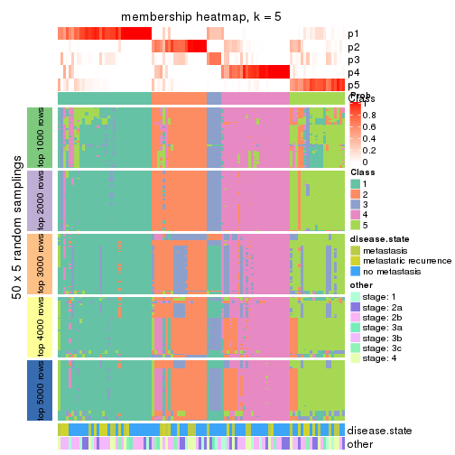</p>

</div>
<div id='tab-MAD-pam-membership-heatmap-5'>
<pre><code class="r">membership_heatmap(res, k = 6)
</code></pre>

<p>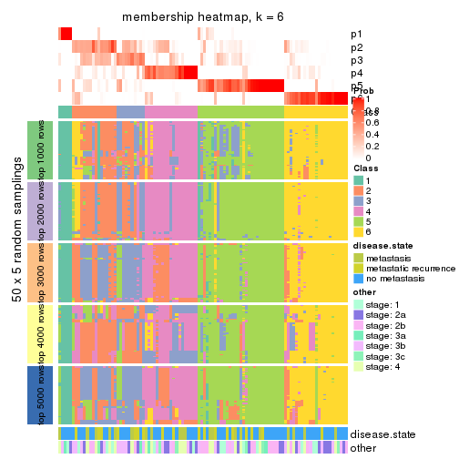</p>

</div>
</div>

As soon as we have had the classes for columns, we can look for signatures
which are significantly different between classes which can be candidate marks
for certain classes. Following are the heatmaps for signatures.


Signature heatmaps where rows are scaled:


<script>
$( function() {
	$( '#tabs-MAD-pam-get-signatures' ).tabs();
} );
</script>
<div id='tabs-MAD-pam-get-signatures'>
<ul>
<li><a href='#tab-MAD-pam-get-signatures-1'>k = 2</a></li>
<li><a href='#tab-MAD-pam-get-signatures-2'>k = 3</a></li>
<li><a href='#tab-MAD-pam-get-signatures-3'>k = 4</a></li>
<li><a href='#tab-MAD-pam-get-signatures-4'>k = 5</a></li>
<li><a href='#tab-MAD-pam-get-signatures-5'>k = 6</a></li>
</ul>
<div id='tab-MAD-pam-get-signatures-1'>
<pre><code class="r">get_signatures(res, k = 2)
</code></pre>

<p></p>

</div>
<div id='tab-MAD-pam-get-signatures-2'>
<pre><code class="r">get_signatures(res, k = 3)
</code></pre>

<p></p>

</div>
<div id='tab-MAD-pam-get-signatures-3'>
<pre><code class="r">get_signatures(res, k = 4)
</code></pre>

<p></p>

</div>
<div id='tab-MAD-pam-get-signatures-4'>
<pre><code class="r">get_signatures(res, k = 5)
</code></pre>

<p></p>

</div>
<div id='tab-MAD-pam-get-signatures-5'>
<pre><code class="r">get_signatures(res, k = 6)
</code></pre>

<p></p>

</div>
</div>


Signature heatmaps where rows are not scaled:


<script>
$( function() {
	$( '#tabs-MAD-pam-get-signatures-no-scale' ).tabs();
} );
</script>
<div id='tabs-MAD-pam-get-signatures-no-scale'>
<ul>
<li><a href='#tab-MAD-pam-get-signatures-no-scale-1'>k = 2</a></li>
<li><a href='#tab-MAD-pam-get-signatures-no-scale-2'>k = 3</a></li>
<li><a href='#tab-MAD-pam-get-signatures-no-scale-3'>k = 4</a></li>
<li><a href='#tab-MAD-pam-get-signatures-no-scale-4'>k = 5</a></li>
<li><a href='#tab-MAD-pam-get-signatures-no-scale-5'>k = 6</a></li>
</ul>
<div id='tab-MAD-pam-get-signatures-no-scale-1'>
<pre><code class="r">get_signatures(res, k = 2, scale_rows = FALSE)
</code></pre>

<p></p>

</div>
<div id='tab-MAD-pam-get-signatures-no-scale-2'>
<pre><code class="r">get_signatures(res, k = 3, scale_rows = FALSE)
</code></pre>

<p></p>

</div>
<div id='tab-MAD-pam-get-signatures-no-scale-3'>
<pre><code class="r">get_signatures(res, k = 4, scale_rows = FALSE)
</code></pre>

<p></p>

</div>
<div id='tab-MAD-pam-get-signatures-no-scale-4'>
<pre><code class="r">get_signatures(res, k = 5, scale_rows = FALSE)
</code></pre>

<p></p>

</div>
<div id='tab-MAD-pam-get-signatures-no-scale-5'>
<pre><code class="r">get_signatures(res, k = 6, scale_rows = FALSE)
</code></pre>

<p></p>

</div>
</div>


Compare the overlap of signatures from different k:

```r
compare_signatures(res)
```


`get_signature()` returns a data frame invisibly. TO get the list of signatures, the function
call should be assigned to a variable explicitly. In following code, if `plot` argument is set
to `FALSE`, no heatmap is plotted while only the differential analysis is performed.

```r
# code only for demonstration
tb = get_signature(res, k = ..., plot = FALSE)
```

An example of the output of `tb` is:

```
#>   which_row         fdr    mean_1    mean_2 scaled_mean_1 scaled_mean_2 km
#> 1        38 0.042760348  8.373488  9.131774    -0.5533452     0.5164555  1
#> 2        40 0.018707592  7.106213  8.469186    -0.6173731     0.5762149  1
#> 3        55 0.019134737 10.221463 11.207825    -0.6159697     0.5749050  1
#> 4        59 0.006059896  5.921854  7.869574    -0.6899429     0.6439467  1
#> 5        60 0.018055526  8.928898 10.211722    -0.6204761     0.5791110  1
#> 6        98 0.009384629 15.714769 14.887706     0.6635654    -0.6193277  2
...
```

The columns in `tb` are:

1. `which_row`: row indices corresponding to the input matrix.
2. `fdr`: FDR for the differential test. 
3. `mean_x`: The mean value in group x.
4. `scaled_mean_x`: The mean value in group x after rows are scaled.
5. `km`: Row groups if k-means clustering is applied to rows.


UMAP plot which shows how samples are separated.


<script>
$( function() {
	$( '#tabs-MAD-pam-dimension-reduction' ).tabs();
} );
</script>
<div id='tabs-MAD-pam-dimension-reduction'>
<ul>
<li><a href='#tab-MAD-pam-dimension-reduction-1'>k = 2</a></li>
<li><a href='#tab-MAD-pam-dimension-reduction-2'>k = 3</a></li>
<li><a href='#tab-MAD-pam-dimension-reduction-3'>k = 4</a></li>
<li><a href='#tab-MAD-pam-dimension-reduction-4'>k = 5</a></li>
<li><a href='#tab-MAD-pam-dimension-reduction-5'>k = 6</a></li>
</ul>
<div id='tab-MAD-pam-dimension-reduction-1'>
<pre><code class="r">dimension_reduction(res, k = 2, method = &quot;UMAP&quot;)
</code></pre>

<p></p>

</div>
<div id='tab-MAD-pam-dimension-reduction-2'>
<pre><code class="r">dimension_reduction(res, k = 3, method = &quot;UMAP&quot;)
</code></pre>

<p></p>

</div>
<div id='tab-MAD-pam-dimension-reduction-3'>
<pre><code class="r">dimension_reduction(res, k = 4, method = &quot;UMAP&quot;)
</code></pre>

<p></p>

</div>
<div id='tab-MAD-pam-dimension-reduction-4'>
<pre><code class="r">dimension_reduction(res, k = 5, method = &quot;UMAP&quot;)
</code></pre>

<p></p>

</div>
<div id='tab-MAD-pam-dimension-reduction-5'>
<pre><code class="r">dimension_reduction(res, k = 6, method = &quot;UMAP&quot;)
</code></pre>

<p></p>

</div>
</div>


Following heatmap shows how subgroups are split when increasing `k`:

```r
collect_classes(res)
```


Test correlation between subgroups and known annotations. If the known
annotation is numeric, one-way ANOVA test is applied, and if the known
annotation is discrete, chi-squared contingency table test is applied.

```r
test_to_known_factors(res)
```

```
#>          n disease.state(p) other(p) k
#> MAD:pam 99          0.00945    0.421 2
#> MAD:pam 79          0.40193    0.922 3
#> MAD:pam 88          0.44939    0.909 4
#> MAD:pam 83          0.64674    0.922 5
#> MAD:pam 59          0.20032    0.466 6
```


If matrix rows can be associated to genes, consider to use `functional_enrichment(res,
...)` to perform function enrichment for the signature genes. See [this vignette](http://bioconductor.org/packages/devel/bioc/vignettes/cola/inst/doc/functional_enrichment.html) for more detailed explanations.


 

---------------------------------------------------


### MAD:mclust


The object with results only for a single top-value method and a single partition method 
can be extracted as:

```r
res = res_list["MAD", "mclust"]
# you can also extract it by
# res = res_list["MAD:mclust"]
```

A summary of `res` and all the functions that can be applied to it:

```r
res
```

```
#> A 'ConsensusPartition' object with k = 2, 3, 4, 5, 6.
#>   On a matrix with 51941 rows and 104 columns.
#>   Top rows (1000, 2000, 3000, 4000, 5000) are extracted by 'MAD' method.
#>   Subgroups are detected by 'mclust' method.
#>   Performed in total 1250 partitions by row resampling.
#>   Best k for subgroups seems to be 3.
#> 
#> Following methods can be applied to this 'ConsensusPartition' object:
#>  [1] "cola_report"             "collect_classes"         "collect_plots"          
#>  [4] "collect_stats"           "colnames"                "compare_signatures"     
#>  [7] "consensus_heatmap"       "dimension_reduction"     "functional_enrichment"  
#> [10] "get_anno_col"            "get_anno"                "get_classes"            
#> [13] "get_consensus"           "get_matrix"              "get_membership"         
#> [16] "get_param"               "get_signatures"          "get_stats"              
#> [19] "is_best_k"               "is_stable_k"             "membership_heatmap"     
#> [22] "ncol"                    "nrow"                    "plot_ecdf"              
#> [25] "rownames"                "select_partition_number" "show"                   
#> [28] "suggest_best_k"          "test_to_known_factors"
```

`collect_plots()` function collects all the plots made from `res` for all `k` (number of partitions)
into one single page to provide an easy and fast comparison between different `k`.

```r
collect_plots(res)
```


The plots are:

- The first row: a plot of the ECDF (empirical cumulative distribution
  function) curves of the consensus matrix for each `k` and the heatmap of
  predicted classes for each `k`.
- The second row: heatmaps of the consensus matrix for each `k`.
- The third row: heatmaps of the membership matrix for each `k`.
- The fouth row: heatmaps of the signatures for each `k`.

All the plots in panels can be made by individual functions and they are
plotted later in this section.

`select_partition_number()` produces several plots showing different
statistics for choosing "optimized" `k`. There are following statistics:

- ECDF curves of the consensus matrix for each `k`;
- 1-PAC. [The PAC
  score](https://en.wikipedia.org/wiki/Consensus_clustering#Over-interpretation_potential_of_consensus_clustering)
  measures the proportion of the ambiguous subgrouping.
- Mean silhouette score.
- Concordance. The mean probability of fiting the consensus class ids in all
  partitions.
- Area increased. Denote $A_k$ as the area under the ECDF curve for current
  `k`, the area increased is defined as $A_k - A_{k-1}$.
- Rand index. The percent of pairs of samples that are both in a same cluster
  or both are not in a same cluster in the partition of k and k-1.
- Jaccard index. The ratio of pairs of samples are both in a same cluster in
  the partition of k and k-1 and the pairs of samples are both in a same
  cluster in the partition k or k-1.

The detailed explanations of these statistics can be found in [the _cola_
vignette](http://bioconductor.org/packages/devel/bioc/vignettes/cola/inst/doc/cola.html#toc_13).

Generally speaking, lower PAC score, higher mean silhouette score or higher
concordance corresponds to better partition. Rand index and Jaccard index
measure how similar the current partition is compared to partition with `k-1`.
If they are too similar, we won't accept `k` is better than `k-1`.

```r
select_partition_number(res)
```


The numeric values for all these statistics can be obtained by `get_stats()`.

```r
get_stats(res)
```

```
#>   k 1-PAC mean_silhouette concordance area_increased  Rand Jaccard
#> 2 2 0.844           0.892       0.954         0.3298 0.652   0.652
#> 3 3 0.275           0.535       0.745         0.7629 0.647   0.480
#> 4 4 0.285           0.446       0.645         0.1771 0.742   0.407
#> 5 5 0.442           0.430       0.681         0.1075 0.868   0.558
#> 6 6 0.517           0.434       0.662         0.0399 0.924   0.665
```

`suggest_best_k()` suggests the best $k$ based on these statistics. The rules are as follows:

- All $k$ with Jaccard index larger than 0.95 are removed because increasing
  $k$ does not provide enough extra information. If all $k$ are removed, it is
  marked as no subgroup is detected.
- For all $k$ with 1-PAC score larger than 0.9, the maximal $k$ is taken as
  the best $k$, and other $k$ are marked as optional $k$.
- If it does not fit the second rule. The $k$ with the maximal vote of the
  highest 1-PAC score, highest mean silhouette, and highest concordance is
  taken as the best $k$.

```r
suggest_best_k(res)
```

```
#> [1] 3
```


Following shows the table of the partitions (You need to click the **show/hide
code output** link to see it). The membership matrix (columns with name `p*`)
is inferred by
[`clue::cl_consensus()`](https://www.rdocumentation.org/link/cl_consensus?package=clue)
function with the `SE` method. Basically the value in the membership matrix
represents the probability to belong to a certain group. The finall class
label for an item is determined with the group with highest probability it
belongs to.

In `get_classes()` function, the entropy is calculated from the membership
matrix and the silhouette score is calculated from the consensus matrix.


<script>
$( function() {
	$( '#tabs-MAD-mclust-get-classes' ).tabs();
} );
</script>
<div id='tabs-MAD-mclust-get-classes'>
<ul>
<li><a href='#tab-MAD-mclust-get-classes-1'>k = 2</a></li>
<li><a href='#tab-MAD-mclust-get-classes-2'>k = 3</a></li>
<li><a href='#tab-MAD-mclust-get-classes-3'>k = 4</a></li>
<li><a href='#tab-MAD-mclust-get-classes-4'>k = 5</a></li>
<li><a href='#tab-MAD-mclust-get-classes-5'>k = 6</a></li>
</ul>

<div id='tab-MAD-mclust-get-classes-1'>
<p><a id='tab-MAD-mclust-get-classes-1-a' style='color:#0366d6' href='#'>show/hide code output</a></p>
<pre><code class="r">cbind(get_classes(res, k = 2), get_membership(res, k = 2))
</code></pre>

<pre><code>#&gt;           class entropy silhouette    p1    p2
#&gt; GSM537341     2  0.0000     0.9762 0.000 1.000
#&gt; GSM537345     1  0.0000     0.8490 1.000 0.000
#&gt; GSM537355     2  0.0000     0.9762 0.000 1.000
#&gt; GSM537366     2  0.0938     0.9643 0.012 0.988
#&gt; GSM537370     2  0.0000     0.9762 0.000 1.000
#&gt; GSM537380     2  0.0000     0.9762 0.000 1.000
#&gt; GSM537392     2  0.0000     0.9762 0.000 1.000
#&gt; GSM537415     2  0.0000     0.9762 0.000 1.000
#&gt; GSM537417     2  0.0000     0.9762 0.000 1.000
#&gt; GSM537422     1  0.9710     0.4426 0.600 0.400
#&gt; GSM537423     2  0.0000     0.9762 0.000 1.000
#&gt; GSM537427     2  0.0000     0.9762 0.000 1.000
#&gt; GSM537430     2  0.0000     0.9762 0.000 1.000
#&gt; GSM537336     1  0.0000     0.8490 1.000 0.000
#&gt; GSM537337     2  0.0000     0.9762 0.000 1.000
#&gt; GSM537348     2  0.9881     0.0578 0.436 0.564
#&gt; GSM537349     2  0.0000     0.9762 0.000 1.000
#&gt; GSM537356     2  0.5737     0.8110 0.136 0.864
#&gt; GSM537361     1  0.2423     0.8362 0.960 0.040
#&gt; GSM537374     2  0.0000     0.9762 0.000 1.000
#&gt; GSM537377     1  0.0000     0.8490 1.000 0.000
#&gt; GSM537378     2  0.0000     0.9762 0.000 1.000
#&gt; GSM537379     2  0.0000     0.9762 0.000 1.000
#&gt; GSM537383     2  0.0000     0.9762 0.000 1.000
#&gt; GSM537388     2  0.0000     0.9762 0.000 1.000
#&gt; GSM537395     2  0.0000     0.9762 0.000 1.000
#&gt; GSM537400     2  0.0376     0.9725 0.004 0.996
#&gt; GSM537404     2  0.0000     0.9762 0.000 1.000
#&gt; GSM537409     2  0.0000     0.9762 0.000 1.000
#&gt; GSM537418     1  0.9881     0.3704 0.564 0.436
#&gt; GSM537425     1  0.9850     0.3826 0.572 0.428
#&gt; GSM537333     2  0.0000     0.9762 0.000 1.000
#&gt; GSM537342     2  0.0000     0.9762 0.000 1.000
#&gt; GSM537347     2  0.0000     0.9762 0.000 1.000
#&gt; GSM537350     2  0.8327     0.5727 0.264 0.736
#&gt; GSM537362     2  0.0672     0.9686 0.008 0.992
#&gt; GSM537363     1  0.9732     0.4348 0.596 0.404
#&gt; GSM537368     1  0.0000     0.8490 1.000 0.000
#&gt; GSM537376     2  0.0000     0.9762 0.000 1.000
#&gt; GSM537381     1  0.0672     0.8474 0.992 0.008
#&gt; GSM537386     2  0.0000     0.9762 0.000 1.000
#&gt; GSM537398     1  0.9909     0.3299 0.556 0.444
#&gt; GSM537402     2  0.0000     0.9762 0.000 1.000
#&gt; GSM537405     1  0.0376     0.8484 0.996 0.004
#&gt; GSM537371     1  0.0000     0.8490 1.000 0.000
#&gt; GSM537421     2  0.0000     0.9762 0.000 1.000
#&gt; GSM537424     1  0.9896     0.3414 0.560 0.440
#&gt; GSM537432     2  0.0000     0.9762 0.000 1.000
#&gt; GSM537331     2  0.0000     0.9762 0.000 1.000
#&gt; GSM537332     2  0.0000     0.9762 0.000 1.000
#&gt; GSM537334     2  0.0000     0.9762 0.000 1.000
#&gt; GSM537338     2  0.0000     0.9762 0.000 1.000
#&gt; GSM537353     2  0.0000     0.9762 0.000 1.000
#&gt; GSM537357     1  0.0000     0.8490 1.000 0.000
#&gt; GSM537358     2  0.0000     0.9762 0.000 1.000
#&gt; GSM537375     2  0.0000     0.9762 0.000 1.000
#&gt; GSM537389     2  0.0000     0.9762 0.000 1.000
#&gt; GSM537390     2  0.0000     0.9762 0.000 1.000
#&gt; GSM537393     2  0.0000     0.9762 0.000 1.000
#&gt; GSM537399     2  0.1184     0.9603 0.016 0.984
#&gt; GSM537407     2  0.0376     0.9725 0.004 0.996
#&gt; GSM537408     2  0.0000     0.9762 0.000 1.000
#&gt; GSM537428     2  0.0000     0.9762 0.000 1.000
#&gt; GSM537354     2  0.0000     0.9762 0.000 1.000
#&gt; GSM537410     2  0.0000     0.9762 0.000 1.000
#&gt; GSM537413     2  0.0000     0.9762 0.000 1.000
#&gt; GSM537396     2  0.0000     0.9762 0.000 1.000
#&gt; GSM537397     2  0.5842     0.8008 0.140 0.860
#&gt; GSM537330     2  0.0000     0.9762 0.000 1.000
#&gt; GSM537369     1  0.0000     0.8490 1.000 0.000
#&gt; GSM537373     2  0.0000     0.9762 0.000 1.000
#&gt; GSM537401     2  0.0000     0.9762 0.000 1.000
#&gt; GSM537343     2  0.6973     0.7226 0.188 0.812
#&gt; GSM537367     2  0.0000     0.9762 0.000 1.000
#&gt; GSM537382     2  0.0000     0.9762 0.000 1.000
#&gt; GSM537385     2  0.0000     0.9762 0.000 1.000
#&gt; GSM537391     2  0.9427     0.3233 0.360 0.640
#&gt; GSM537419     2  0.0000     0.9762 0.000 1.000
#&gt; GSM537420     1  0.0000     0.8490 1.000 0.000
#&gt; GSM537429     2  0.0000     0.9762 0.000 1.000
#&gt; GSM537431     2  0.0000     0.9762 0.000 1.000
#&gt; GSM537387     1  0.4690     0.8041 0.900 0.100
#&gt; GSM537414     2  0.0000     0.9762 0.000 1.000
#&gt; GSM537433     2  0.0000     0.9762 0.000 1.000
#&gt; GSM537335     2  0.0000     0.9762 0.000 1.000
#&gt; GSM537339     2  0.0000     0.9762 0.000 1.000
#&gt; GSM537340     2  0.1633     0.9511 0.024 0.976
#&gt; GSM537344     1  0.0000     0.8490 1.000 0.000
#&gt; GSM537346     2  0.0000     0.9762 0.000 1.000
#&gt; GSM537351     1  0.0000     0.8490 1.000 0.000
#&gt; GSM537352     2  0.0000     0.9762 0.000 1.000
#&gt; GSM537359     2  0.0000     0.9762 0.000 1.000
#&gt; GSM537360     2  0.0000     0.9762 0.000 1.000
#&gt; GSM537364     1  0.0000     0.8490 1.000 0.000
#&gt; GSM537365     2  0.0000     0.9762 0.000 1.000
#&gt; GSM537372     1  0.9460     0.5047 0.636 0.364
#&gt; GSM537384     1  0.4022     0.8167 0.920 0.080
#&gt; GSM537394     2  0.0000     0.9762 0.000 1.000
#&gt; GSM537403     2  0.0000     0.9762 0.000 1.000
#&gt; GSM537406     2  0.0000     0.9762 0.000 1.000
#&gt; GSM537411     2  0.0000     0.9762 0.000 1.000
#&gt; GSM537412     2  0.0000     0.9762 0.000 1.000
#&gt; GSM537416     2  0.0000     0.9762 0.000 1.000
#&gt; GSM537426     2  0.0000     0.9762 0.000 1.000
</code></pre>

<script>
$('#tab-MAD-mclust-get-classes-1-a').parent().next().next().hide();
$('#tab-MAD-mclust-get-classes-1-a').click(function(){
  $('#tab-MAD-mclust-get-classes-1-a').parent().next().next().toggle();
  return(false);
});
</script>
</div>

<div id='tab-MAD-mclust-get-classes-2'>
<p><a id='tab-MAD-mclust-get-classes-2-a' style='color:#0366d6' href='#'>show/hide code output</a></p>
<pre><code class="r">cbind(get_classes(res, k = 3), get_membership(res, k = 3))
</code></pre>

<pre><code>#&gt;           class entropy silhouette    p1    p2    p3
#&gt; GSM537341     2  0.5377     0.6041 0.112 0.820 0.068
#&gt; GSM537345     1  0.1170     0.8479 0.976 0.016 0.008
#&gt; GSM537355     2  0.6682    -0.1070 0.008 0.504 0.488
#&gt; GSM537366     1  0.8895     0.1775 0.484 0.124 0.392
#&gt; GSM537370     2  0.5731     0.6162 0.108 0.804 0.088
#&gt; GSM537380     2  0.5690     0.5947 0.004 0.708 0.288
#&gt; GSM537392     2  0.5591     0.5809 0.000 0.696 0.304
#&gt; GSM537415     3  0.1411     0.6519 0.000 0.036 0.964
#&gt; GSM537417     3  0.2301     0.6189 0.060 0.004 0.936
#&gt; GSM537422     3  0.6735    -0.0626 0.424 0.012 0.564
#&gt; GSM537423     3  0.5591     0.5191 0.000 0.304 0.696
#&gt; GSM537427     2  0.4178     0.6336 0.000 0.828 0.172
#&gt; GSM537430     2  0.6026     0.4868 0.000 0.624 0.376
#&gt; GSM537336     1  0.0848     0.8486 0.984 0.008 0.008
#&gt; GSM537337     2  0.6553     0.2577 0.008 0.580 0.412
#&gt; GSM537348     2  0.6339     0.0588 0.360 0.632 0.008
#&gt; GSM537349     2  0.6302     0.2020 0.000 0.520 0.480
#&gt; GSM537356     1  0.5974     0.7312 0.784 0.148 0.068
#&gt; GSM537361     1  0.1015     0.8482 0.980 0.008 0.012
#&gt; GSM537374     2  0.4121     0.6402 0.000 0.832 0.168
#&gt; GSM537377     1  0.1170     0.8479 0.976 0.016 0.008
#&gt; GSM537378     3  0.5465     0.5399 0.000 0.288 0.712
#&gt; GSM537379     3  0.5582     0.6324 0.088 0.100 0.812
#&gt; GSM537383     2  0.6095     0.4637 0.000 0.608 0.392
#&gt; GSM537388     2  0.5859     0.4739 0.000 0.656 0.344
#&gt; GSM537395     3  0.6018     0.4979 0.008 0.308 0.684
#&gt; GSM537400     3  0.8996     0.0942 0.140 0.356 0.504
#&gt; GSM537404     3  0.4602     0.6542 0.016 0.152 0.832
#&gt; GSM537409     3  0.0237     0.6360 0.000 0.004 0.996
#&gt; GSM537418     1  0.4058     0.7865 0.880 0.044 0.076
#&gt; GSM537425     1  0.6910     0.3424 0.584 0.020 0.396
#&gt; GSM537333     3  0.7918     0.3548 0.104 0.256 0.640
#&gt; GSM537342     3  0.3918     0.6559 0.004 0.140 0.856
#&gt; GSM537347     2  0.8375     0.3836 0.092 0.540 0.368
#&gt; GSM537350     1  0.9718    -0.0494 0.452 0.288 0.260
#&gt; GSM537362     2  0.8576     0.5255 0.160 0.600 0.240
#&gt; GSM537363     1  0.6750     0.4582 0.640 0.024 0.336
#&gt; GSM537368     1  0.0661     0.8490 0.988 0.004 0.008
#&gt; GSM537376     3  0.5864     0.5275 0.008 0.288 0.704
#&gt; GSM537381     1  0.0848     0.8486 0.984 0.008 0.008
#&gt; GSM537386     2  0.5835     0.5464 0.000 0.660 0.340
#&gt; GSM537398     2  0.6608    -0.0420 0.432 0.560 0.008
#&gt; GSM537402     3  0.6527     0.2159 0.008 0.404 0.588
#&gt; GSM537405     1  0.1015     0.8486 0.980 0.012 0.008
#&gt; GSM537371     1  0.0661     0.8490 0.988 0.004 0.008
#&gt; GSM537421     3  0.1170     0.6489 0.008 0.016 0.976
#&gt; GSM537424     1  0.6264     0.6652 0.716 0.256 0.028
#&gt; GSM537432     3  0.8586     0.1338 0.104 0.376 0.520
#&gt; GSM537331     2  0.3715     0.6336 0.004 0.868 0.128
#&gt; GSM537332     3  0.2261     0.6615 0.000 0.068 0.932
#&gt; GSM537334     2  0.3551     0.6302 0.000 0.868 0.132
#&gt; GSM537338     2  0.3816     0.6345 0.000 0.852 0.148
#&gt; GSM537353     3  0.4121     0.6445 0.000 0.168 0.832
#&gt; GSM537357     1  0.0661     0.8490 0.988 0.004 0.008
#&gt; GSM537358     3  0.5948     0.3981 0.000 0.360 0.640
#&gt; GSM537375     3  0.6404     0.4854 0.012 0.344 0.644
#&gt; GSM537389     3  0.6302    -0.0760 0.000 0.480 0.520
#&gt; GSM537390     3  0.2625     0.6621 0.000 0.084 0.916
#&gt; GSM537393     3  0.5247     0.6055 0.008 0.224 0.768
#&gt; GSM537399     2  0.7361     0.5826 0.124 0.704 0.172
#&gt; GSM537407     3  0.8112     0.4967 0.160 0.192 0.648
#&gt; GSM537408     3  0.5859     0.4365 0.000 0.344 0.656
#&gt; GSM537428     2  0.4452     0.6297 0.000 0.808 0.192
#&gt; GSM537354     3  0.6434     0.4445 0.008 0.380 0.612
#&gt; GSM537410     3  0.1163     0.6522 0.000 0.028 0.972
#&gt; GSM537413     3  0.4974     0.5969 0.000 0.236 0.764
#&gt; GSM537396     2  0.8474     0.2442 0.092 0.504 0.404
#&gt; GSM537397     2  0.4744     0.5740 0.136 0.836 0.028
#&gt; GSM537330     3  0.5835     0.4534 0.000 0.340 0.660
#&gt; GSM537369     1  0.1711     0.8442 0.960 0.032 0.008
#&gt; GSM537373     3  0.5216     0.5754 0.000 0.260 0.740
#&gt; GSM537401     2  0.6322     0.6273 0.108 0.772 0.120
#&gt; GSM537343     3  0.8287     0.4056 0.256 0.128 0.616
#&gt; GSM537367     3  0.4280     0.5673 0.124 0.020 0.856
#&gt; GSM537382     3  0.5760     0.4681 0.000 0.328 0.672
#&gt; GSM537385     2  0.6062     0.4582 0.000 0.616 0.384
#&gt; GSM537391     2  0.5896     0.3210 0.292 0.700 0.008
#&gt; GSM537419     3  0.6154     0.2432 0.000 0.408 0.592
#&gt; GSM537420     1  0.2280     0.8380 0.940 0.052 0.008
#&gt; GSM537429     2  0.8372     0.4553 0.100 0.564 0.336
#&gt; GSM537431     3  0.6726     0.5305 0.120 0.132 0.748
#&gt; GSM537387     1  0.5541     0.6954 0.740 0.252 0.008
#&gt; GSM537414     3  0.4059     0.5620 0.128 0.012 0.860
#&gt; GSM537433     3  0.4636     0.5877 0.116 0.036 0.848
#&gt; GSM537335     2  0.4139     0.6367 0.016 0.860 0.124
#&gt; GSM537339     2  0.4609     0.5738 0.128 0.844 0.028
#&gt; GSM537340     3  0.1832     0.6242 0.036 0.008 0.956
#&gt; GSM537344     1  0.0848     0.8488 0.984 0.008 0.008
#&gt; GSM537346     3  0.5733     0.4975 0.000 0.324 0.676
#&gt; GSM537351     1  0.0848     0.8486 0.984 0.008 0.008
#&gt; GSM537352     2  0.6625     0.2012 0.008 0.552 0.440
#&gt; GSM537359     2  0.6260     0.3209 0.000 0.552 0.448
#&gt; GSM537360     3  0.1031     0.6500 0.000 0.024 0.976
#&gt; GSM537364     1  0.0848     0.8486 0.984 0.008 0.008
#&gt; GSM537365     3  0.7345     0.5645 0.108 0.192 0.700
#&gt; GSM537372     1  0.6510     0.5731 0.624 0.364 0.012
#&gt; GSM537384     1  0.3784     0.8097 0.864 0.132 0.004
#&gt; GSM537394     3  0.6111     0.3101 0.000 0.396 0.604
#&gt; GSM537403     3  0.0000     0.6389 0.000 0.000 1.000
#&gt; GSM537406     3  0.3551     0.6576 0.000 0.132 0.868
#&gt; GSM537411     2  0.6008     0.5074 0.000 0.628 0.372
#&gt; GSM537412     3  0.0000     0.6389 0.000 0.000 1.000
#&gt; GSM537416     3  0.0661     0.6376 0.008 0.004 0.988
#&gt; GSM537426     3  0.1411     0.6541 0.000 0.036 0.964
</code></pre>

<script>
$('#tab-MAD-mclust-get-classes-2-a').parent().next().next().hide();
$('#tab-MAD-mclust-get-classes-2-a').click(function(){
  $('#tab-MAD-mclust-get-classes-2-a').parent().next().next().toggle();
  return(false);
});
</script>
</div>

<div id='tab-MAD-mclust-get-classes-3'>
<p><a id='tab-MAD-mclust-get-classes-3-a' style='color:#0366d6' href='#'>show/hide code output</a></p>
<pre><code class="r">cbind(get_classes(res, k = 4), get_membership(res, k = 4))
</code></pre>

<pre><code>#&gt;           class entropy silhouette    p1    p2    p3    p4
#&gt; GSM537341     4  0.7536    0.45392 0.140 0.276 0.024 0.560
#&gt; GSM537345     1  0.1792    0.69770 0.932 0.000 0.000 0.068
#&gt; GSM537355     2  0.7870    0.17244 0.000 0.392 0.308 0.300
#&gt; GSM537366     1  0.7396    0.49676 0.560 0.024 0.116 0.300
#&gt; GSM537370     4  0.7260    0.54553 0.140 0.196 0.036 0.628
#&gt; GSM537380     2  0.1042    0.66047 0.000 0.972 0.008 0.020
#&gt; GSM537392     2  0.0779    0.66237 0.000 0.980 0.004 0.016
#&gt; GSM537415     3  0.5190    0.41635 0.004 0.396 0.596 0.004
#&gt; GSM537417     3  0.5511    0.63195 0.084 0.196 0.720 0.000
#&gt; GSM537422     3  0.6307    0.32846 0.312 0.012 0.620 0.056
#&gt; GSM537423     2  0.1042    0.65886 0.000 0.972 0.020 0.008
#&gt; GSM537427     2  0.8115    0.24292 0.024 0.492 0.236 0.248
#&gt; GSM537430     2  0.5661    0.57522 0.000 0.700 0.080 0.220
#&gt; GSM537336     1  0.0804    0.71567 0.980 0.000 0.008 0.012
#&gt; GSM537337     2  0.7836    0.17467 0.000 0.408 0.288 0.304
#&gt; GSM537348     4  0.4944    0.34971 0.220 0.032 0.004 0.744
#&gt; GSM537349     2  0.0188    0.65859 0.000 0.996 0.000 0.004
#&gt; GSM537356     1  0.5069    0.56011 0.664 0.000 0.016 0.320
#&gt; GSM537361     1  0.5767    0.57630 0.712 0.000 0.136 0.152
#&gt; GSM537374     4  0.7613    0.36268 0.012 0.212 0.236 0.540
#&gt; GSM537377     1  0.1940    0.69721 0.924 0.000 0.000 0.076
#&gt; GSM537378     2  0.3285    0.65895 0.020 0.884 0.080 0.016
#&gt; GSM537379     3  0.7199    0.57318 0.060 0.228 0.632 0.080
#&gt; GSM537383     2  0.1488    0.66991 0.000 0.956 0.012 0.032
#&gt; GSM537388     2  0.5480    0.50230 0.000 0.736 0.124 0.140
#&gt; GSM537395     2  0.5423    0.62685 0.000 0.740 0.116 0.144
#&gt; GSM537400     3  0.9014   -0.07463 0.292 0.056 0.352 0.300
#&gt; GSM537404     3  0.8574    0.49255 0.100 0.292 0.492 0.116
#&gt; GSM537409     3  0.4737    0.54615 0.004 0.296 0.696 0.004
#&gt; GSM537418     1  0.4471    0.64064 0.768 0.004 0.016 0.212
#&gt; GSM537425     1  0.8786   -0.18676 0.392 0.140 0.384 0.084
#&gt; GSM537333     3  0.8736    0.32234 0.176 0.100 0.508 0.216
#&gt; GSM537342     2  0.6615    0.04791 0.084 0.512 0.404 0.000
#&gt; GSM537347     4  0.8883    0.11857 0.060 0.324 0.216 0.400
#&gt; GSM537350     1  0.7850    0.17423 0.484 0.324 0.016 0.176
#&gt; GSM537362     4  0.8548    0.39272 0.284 0.076 0.148 0.492
#&gt; GSM537363     1  0.7755    0.38573 0.612 0.168 0.144 0.076
#&gt; GSM537368     1  0.0524    0.71964 0.988 0.000 0.008 0.004
#&gt; GSM537376     2  0.6216    0.54038 0.000 0.652 0.240 0.108
#&gt; GSM537381     1  0.1151    0.72183 0.968 0.000 0.008 0.024
#&gt; GSM537386     2  0.3653    0.58625 0.000 0.844 0.028 0.128
#&gt; GSM537398     4  0.6302    0.23822 0.348 0.036 0.020 0.596
#&gt; GSM537402     2  0.5812    0.61287 0.000 0.708 0.136 0.156
#&gt; GSM537405     1  0.3271    0.69566 0.856 0.000 0.012 0.132
#&gt; GSM537371     1  0.0672    0.71672 0.984 0.000 0.008 0.008
#&gt; GSM537421     3  0.5783    0.62358 0.088 0.220 0.692 0.000
#&gt; GSM537424     4  0.5679   -0.18327 0.488 0.004 0.016 0.492
#&gt; GSM537432     3  0.9361   -0.05160 0.236 0.096 0.348 0.320
#&gt; GSM537331     4  0.8965    0.35315 0.072 0.288 0.216 0.424
#&gt; GSM537332     2  0.6276   -0.13729 0.040 0.520 0.432 0.008
#&gt; GSM537334     4  0.8670    0.45751 0.076 0.176 0.260 0.488
#&gt; GSM537338     4  0.7921    0.34282 0.016 0.224 0.260 0.500
#&gt; GSM537353     2  0.6235    0.30218 0.048 0.588 0.356 0.008
#&gt; GSM537357     1  0.1151    0.71390 0.968 0.000 0.008 0.024
#&gt; GSM537358     2  0.1305    0.66089 0.000 0.960 0.036 0.004
#&gt; GSM537375     4  0.8268   -0.13623 0.012 0.288 0.340 0.360
#&gt; GSM537389     2  0.0657    0.66188 0.000 0.984 0.004 0.012
#&gt; GSM537390     2  0.4884    0.44188 0.008 0.708 0.276 0.008
#&gt; GSM537393     3  0.8136    0.26798 0.020 0.328 0.448 0.204
#&gt; GSM537399     4  0.7827    0.43206 0.164 0.272 0.028 0.536
#&gt; GSM537407     1  0.9766   -0.06473 0.364 0.204 0.208 0.224
#&gt; GSM537408     2  0.3607    0.62260 0.096 0.864 0.032 0.008
#&gt; GSM537428     4  0.7808    0.00948 0.000 0.360 0.252 0.388
#&gt; GSM537354     2  0.7760    0.30209 0.000 0.408 0.352 0.240
#&gt; GSM537410     3  0.6014    0.57640 0.060 0.292 0.644 0.004
#&gt; GSM537413     2  0.2777    0.64657 0.004 0.888 0.104 0.004
#&gt; GSM537396     2  0.3892    0.61457 0.104 0.852 0.020 0.024
#&gt; GSM537397     4  0.6749    0.47159 0.172 0.180 0.008 0.640
#&gt; GSM537330     2  0.7529    0.42235 0.016 0.564 0.224 0.196
#&gt; GSM537369     1  0.1867    0.71735 0.928 0.000 0.000 0.072
#&gt; GSM537373     2  0.6439    0.48754 0.100 0.680 0.200 0.020
#&gt; GSM537401     4  0.8158    0.54409 0.128 0.184 0.108 0.580
#&gt; GSM537343     1  0.8853    0.24818 0.468 0.104 0.284 0.144
#&gt; GSM537367     3  0.7715    0.51779 0.212 0.108 0.604 0.076
#&gt; GSM537382     2  0.6785    0.55705 0.012 0.640 0.208 0.140
#&gt; GSM537385     2  0.2125    0.66256 0.000 0.920 0.004 0.076
#&gt; GSM537391     4  0.5624    0.32766 0.280 0.052 0.000 0.668
#&gt; GSM537419     2  0.0921    0.66206 0.000 0.972 0.028 0.000
#&gt; GSM537420     1  0.3498    0.68474 0.832 0.000 0.008 0.160
#&gt; GSM537429     2  0.8731    0.19128 0.100 0.476 0.132 0.292
#&gt; GSM537431     3  0.8669    0.34034 0.240 0.064 0.480 0.216
#&gt; GSM537387     1  0.5127    0.52364 0.668 0.008 0.008 0.316
#&gt; GSM537414     3  0.6394    0.39589 0.284 0.024 0.640 0.052
#&gt; GSM537433     3  0.8991    0.46246 0.244 0.184 0.468 0.104
#&gt; GSM537335     4  0.8583    0.52214 0.104 0.124 0.264 0.508
#&gt; GSM537339     4  0.4807    0.46035 0.152 0.052 0.008 0.788
#&gt; GSM537340     3  0.5705    0.63288 0.108 0.180 0.712 0.000
#&gt; GSM537344     1  0.1867    0.71735 0.928 0.000 0.000 0.072
#&gt; GSM537346     2  0.5998    0.60494 0.052 0.740 0.144 0.064
#&gt; GSM537351     1  0.1661    0.71108 0.944 0.000 0.052 0.004
#&gt; GSM537352     2  0.7430    0.38115 0.000 0.512 0.228 0.260
#&gt; GSM537359     2  0.0844    0.65444 0.004 0.980 0.012 0.004
#&gt; GSM537360     3  0.4917    0.50958 0.004 0.328 0.664 0.004
#&gt; GSM537364     1  0.0672    0.71672 0.984 0.000 0.008 0.008
#&gt; GSM537365     2  0.9669   -0.33616 0.152 0.344 0.296 0.208
#&gt; GSM537372     4  0.5178   -0.08519 0.392 0.004 0.004 0.600
#&gt; GSM537384     1  0.5500    0.44512 0.564 0.004 0.012 0.420
#&gt; GSM537394     2  0.4715    0.63628 0.040 0.824 0.064 0.072
#&gt; GSM537403     3  0.4462    0.55889 0.004 0.256 0.736 0.004
#&gt; GSM537406     2  0.4275    0.61371 0.064 0.836 0.088 0.012
#&gt; GSM537411     2  0.7218    0.15347 0.000 0.444 0.140 0.416
#&gt; GSM537412     3  0.4809    0.53619 0.004 0.308 0.684 0.004
#&gt; GSM537416     3  0.5219    0.61993 0.056 0.216 0.728 0.000
#&gt; GSM537426     3  0.5284    0.28338 0.004 0.436 0.556 0.004
</code></pre>

<script>
$('#tab-MAD-mclust-get-classes-3-a').parent().next().next().hide();
$('#tab-MAD-mclust-get-classes-3-a').click(function(){
  $('#tab-MAD-mclust-get-classes-3-a').parent().next().next().toggle();
  return(false);
});
</script>
</div>

<div id='tab-MAD-mclust-get-classes-4'>
<p><a id='tab-MAD-mclust-get-classes-4-a' style='color:#0366d6' href='#'>show/hide code output</a></p>
<pre><code class="r">cbind(get_classes(res, k = 5), get_membership(res, k = 5))
</code></pre>

<pre><code>#&gt;           class entropy silhouette    p1    p2    p3    p4    p5
#&gt; GSM537341     5  0.4043    0.60581 0.016 0.064 0.072 0.016 0.832
#&gt; GSM537345     1  0.4998    0.41941 0.716 0.000 0.108 0.004 0.172
#&gt; GSM537355     3  0.6030    0.39437 0.000 0.340 0.568 0.052 0.040
#&gt; GSM537366     1  0.7795    0.14891 0.372 0.024 0.020 0.292 0.292
#&gt; GSM537370     5  0.6444    0.28546 0.032 0.260 0.084 0.016 0.608
#&gt; GSM537380     2  0.1908    0.65221 0.000 0.908 0.092 0.000 0.000
#&gt; GSM537392     2  0.2230    0.63910 0.000 0.884 0.116 0.000 0.000
#&gt; GSM537415     4  0.4367    0.36653 0.000 0.372 0.008 0.620 0.000
#&gt; GSM537417     4  0.2967    0.60208 0.012 0.016 0.104 0.868 0.000
#&gt; GSM537422     4  0.3623    0.60066 0.072 0.052 0.028 0.848 0.000
#&gt; GSM537423     2  0.2017    0.65658 0.000 0.912 0.080 0.008 0.000
#&gt; GSM537427     3  0.5824    0.35141 0.000 0.392 0.520 0.004 0.084
#&gt; GSM537430     2  0.4576    0.07321 0.000 0.536 0.456 0.004 0.004
#&gt; GSM537336     1  0.0771    0.61617 0.976 0.000 0.020 0.000 0.004
#&gt; GSM537337     3  0.6031    0.41364 0.000 0.336 0.568 0.028 0.068
#&gt; GSM537348     5  0.1943    0.64252 0.056 0.000 0.020 0.000 0.924
#&gt; GSM537349     2  0.1792    0.65299 0.000 0.916 0.084 0.000 0.000
#&gt; GSM537356     5  0.4931    0.20879 0.372 0.012 0.000 0.016 0.600
#&gt; GSM537361     1  0.6326    0.43985 0.652 0.020 0.200 0.092 0.036
#&gt; GSM537374     3  0.4335    0.56249 0.000 0.072 0.760 0.000 0.168
#&gt; GSM537377     1  0.5258    0.41209 0.704 0.000 0.108 0.012 0.176
#&gt; GSM537378     2  0.3370    0.63757 0.000 0.824 0.148 0.028 0.000
#&gt; GSM537379     4  0.5842    0.20745 0.008 0.072 0.428 0.492 0.000
#&gt; GSM537383     2  0.1965    0.65122 0.000 0.904 0.096 0.000 0.000
#&gt; GSM537388     2  0.4135    0.32433 0.000 0.656 0.340 0.004 0.000
#&gt; GSM537395     2  0.6292    0.29316 0.000 0.532 0.260 0.208 0.000
#&gt; GSM537400     4  0.7451    0.37398 0.060 0.108 0.272 0.532 0.028
#&gt; GSM537404     4  0.8259    0.49289 0.096 0.208 0.188 0.476 0.032
#&gt; GSM537409     4  0.3370    0.60091 0.000 0.148 0.028 0.824 0.000
#&gt; GSM537418     5  0.6237    0.00324 0.448 0.024 0.028 0.028 0.472
#&gt; GSM537425     4  0.7542    0.24008 0.312 0.132 0.020 0.484 0.052
#&gt; GSM537333     4  0.5796    0.37257 0.020 0.056 0.320 0.600 0.004
#&gt; GSM537342     4  0.7561    0.35314 0.068 0.296 0.148 0.480 0.008
#&gt; GSM537347     3  0.7140    0.45147 0.008 0.168 0.588 0.144 0.092
#&gt; GSM537350     5  0.6261    0.05228 0.424 0.056 0.016 0.016 0.488
#&gt; GSM537362     3  0.8886    0.10413 0.076 0.076 0.364 0.304 0.180
#&gt; GSM537363     1  0.6953    0.30688 0.584 0.144 0.016 0.216 0.040
#&gt; GSM537368     1  0.0609    0.61926 0.980 0.000 0.000 0.000 0.020
#&gt; GSM537376     2  0.6710    0.06757 0.000 0.424 0.272 0.304 0.000
#&gt; GSM537381     1  0.1732    0.59900 0.920 0.000 0.000 0.000 0.080
#&gt; GSM537386     2  0.1267    0.64588 0.000 0.960 0.024 0.012 0.004
#&gt; GSM537398     5  0.5006    0.53622 0.180 0.000 0.116 0.000 0.704
#&gt; GSM537402     2  0.6289    0.32363 0.000 0.584 0.272 0.120 0.024
#&gt; GSM537405     1  0.4264    0.23233 0.620 0.004 0.000 0.000 0.376
#&gt; GSM537371     1  0.0771    0.61617 0.976 0.000 0.020 0.000 0.004
#&gt; GSM537421     4  0.4207    0.60464 0.020 0.056 0.124 0.800 0.000
#&gt; GSM537424     5  0.4701    0.53459 0.236 0.000 0.060 0.000 0.704
#&gt; GSM537432     4  0.6983    0.31712 0.020 0.108 0.324 0.520 0.028
#&gt; GSM537331     3  0.6217    0.43463 0.004 0.272 0.572 0.004 0.148
#&gt; GSM537332     2  0.5365   -0.03491 0.004 0.512 0.044 0.440 0.000
#&gt; GSM537334     3  0.4269    0.54498 0.004 0.044 0.772 0.004 0.176
#&gt; GSM537338     3  0.4714    0.56593 0.000 0.100 0.744 0.004 0.152
#&gt; GSM537353     2  0.6519    0.19726 0.000 0.456 0.204 0.340 0.000
#&gt; GSM537357     1  0.2278    0.58281 0.908 0.000 0.060 0.000 0.032
#&gt; GSM537358     2  0.3051    0.65731 0.000 0.864 0.060 0.076 0.000
#&gt; GSM537375     3  0.5706    0.29365 0.012 0.096 0.632 0.260 0.000
#&gt; GSM537389     2  0.1892    0.65536 0.000 0.916 0.080 0.004 0.000
#&gt; GSM537390     2  0.4527    0.54873 0.000 0.692 0.036 0.272 0.000
#&gt; GSM537393     3  0.6113    0.04519 0.008 0.108 0.528 0.356 0.000
#&gt; GSM537399     5  0.8868    0.24706 0.156 0.208 0.160 0.052 0.424
#&gt; GSM537407     1  0.9366    0.09828 0.364 0.120 0.176 0.232 0.108
#&gt; GSM537408     2  0.3403    0.59171 0.064 0.868 0.028 0.032 0.008
#&gt; GSM537428     3  0.5867    0.40519 0.000 0.352 0.548 0.004 0.096
#&gt; GSM537354     3  0.6402    0.39154 0.000 0.252 0.536 0.208 0.004
#&gt; GSM537410     4  0.6401    0.56318 0.052 0.248 0.084 0.612 0.004
#&gt; GSM537413     2  0.3010    0.62987 0.000 0.824 0.004 0.172 0.000
#&gt; GSM537396     2  0.4930    0.55114 0.068 0.792 0.060 0.036 0.044
#&gt; GSM537397     5  0.2450    0.64291 0.032 0.028 0.028 0.000 0.912
#&gt; GSM537330     3  0.6511    0.01733 0.004 0.404 0.428 0.164 0.000
#&gt; GSM537369     1  0.4088    0.25022 0.632 0.000 0.000 0.000 0.368
#&gt; GSM537373     2  0.7033    0.39648 0.072 0.620 0.100 0.176 0.032
#&gt; GSM537401     5  0.6699    0.07488 0.016 0.216 0.196 0.008 0.564
#&gt; GSM537343     1  0.7606    0.27858 0.428 0.028 0.032 0.364 0.148
#&gt; GSM537367     4  0.6434    0.50699 0.160 0.140 0.016 0.648 0.036
#&gt; GSM537382     2  0.7318    0.05220 0.004 0.436 0.288 0.248 0.024
#&gt; GSM537385     2  0.2536    0.63146 0.000 0.868 0.128 0.000 0.004
#&gt; GSM537391     5  0.2828    0.63987 0.104 0.004 0.020 0.000 0.872
#&gt; GSM537419     2  0.2569    0.66140 0.000 0.892 0.068 0.040 0.000
#&gt; GSM537420     1  0.4291    0.01420 0.536 0.000 0.000 0.000 0.464
#&gt; GSM537429     2  0.7583   -0.23191 0.004 0.400 0.392 0.112 0.092
#&gt; GSM537431     4  0.7377    0.48615 0.056 0.148 0.212 0.560 0.024
#&gt; GSM537387     5  0.3849    0.54781 0.232 0.000 0.016 0.000 0.752
#&gt; GSM537414     4  0.5969    0.55241 0.072 0.080 0.156 0.688 0.004
#&gt; GSM537433     4  0.7608    0.09352 0.316 0.076 0.024 0.488 0.096
#&gt; GSM537335     3  0.4106    0.51166 0.004 0.028 0.772 0.004 0.192
#&gt; GSM537339     5  0.1772    0.64158 0.032 0.008 0.020 0.000 0.940
#&gt; GSM537340     4  0.2529    0.62276 0.024 0.032 0.036 0.908 0.000
#&gt; GSM537344     1  0.3177    0.49918 0.792 0.000 0.000 0.000 0.208
#&gt; GSM537346     2  0.5506    0.39855 0.004 0.648 0.240 0.108 0.000
#&gt; GSM537351     1  0.1220    0.62043 0.964 0.004 0.008 0.020 0.004
#&gt; GSM537352     3  0.5975    0.39502 0.000 0.352 0.556 0.020 0.072
#&gt; GSM537359     2  0.1117    0.64294 0.000 0.964 0.020 0.016 0.000
#&gt; GSM537360     4  0.4134    0.55716 0.000 0.224 0.032 0.744 0.000
#&gt; GSM537364     1  0.0000    0.61964 1.000 0.000 0.000 0.000 0.000
#&gt; GSM537365     4  0.9346    0.32813 0.156 0.228 0.248 0.308 0.060
#&gt; GSM537372     5  0.2929    0.57961 0.180 0.000 0.000 0.000 0.820
#&gt; GSM537384     5  0.2625    0.63178 0.108 0.000 0.016 0.000 0.876
#&gt; GSM537394     2  0.3464    0.61435 0.000 0.836 0.096 0.068 0.000
#&gt; GSM537403     4  0.4166    0.59399 0.004 0.116 0.088 0.792 0.000
#&gt; GSM537406     2  0.3503    0.58691 0.060 0.864 0.020 0.044 0.012
#&gt; GSM537411     3  0.7111    0.31304 0.004 0.312 0.512 0.108 0.064
#&gt; GSM537412     4  0.4024    0.56068 0.000 0.220 0.028 0.752 0.000
#&gt; GSM537416     4  0.3033    0.61551 0.016 0.032 0.076 0.876 0.000
#&gt; GSM537426     4  0.4712    0.49223 0.000 0.268 0.048 0.684 0.000
</code></pre>

<script>
$('#tab-MAD-mclust-get-classes-4-a').parent().next().next().hide();
$('#tab-MAD-mclust-get-classes-4-a').click(function(){
  $('#tab-MAD-mclust-get-classes-4-a').parent().next().next().toggle();
  return(false);
});
</script>
</div>

<div id='tab-MAD-mclust-get-classes-5'>
<p><a id='tab-MAD-mclust-get-classes-5-a' style='color:#0366d6' href='#'>show/hide code output</a></p>
<pre><code class="r">cbind(get_classes(res, k = 6), get_membership(res, k = 6))
</code></pre>

<pre><code>#&gt;           class entropy silhouette    p1    p2    p3    p4    p5    p6
#&gt; GSM537341     5  0.2100     0.6336 0.000 0.008 0.048 0.004 0.916 0.024
#&gt; GSM537345     1  0.3183     0.5728 0.828 0.000 0.060 0.000 0.112 0.000
#&gt; GSM537355     6  0.3903     0.5482 0.000 0.304 0.012 0.004 0.000 0.680
#&gt; GSM537366     3  0.7277     0.3792 0.100 0.000 0.360 0.252 0.288 0.000
#&gt; GSM537370     5  0.4853     0.4561 0.008 0.172 0.068 0.004 0.724 0.024
#&gt; GSM537380     2  0.1296     0.6625 0.000 0.952 0.012 0.004 0.000 0.032
#&gt; GSM537392     2  0.1584     0.6465 0.000 0.928 0.008 0.000 0.000 0.064
#&gt; GSM537415     4  0.3390     0.4512 0.000 0.296 0.000 0.704 0.000 0.000
#&gt; GSM537417     4  0.4386     0.5359 0.012 0.032 0.116 0.776 0.000 0.064
#&gt; GSM537422     4  0.4838     0.4168 0.064 0.032 0.172 0.724 0.004 0.004
#&gt; GSM537423     2  0.1477     0.6590 0.000 0.940 0.004 0.008 0.000 0.048
#&gt; GSM537427     6  0.3942     0.4841 0.000 0.368 0.004 0.000 0.004 0.624
#&gt; GSM537430     6  0.3789     0.4073 0.000 0.416 0.000 0.000 0.000 0.584
#&gt; GSM537336     1  0.1152     0.6697 0.952 0.000 0.044 0.000 0.004 0.000
#&gt; GSM537337     6  0.3928     0.5492 0.000 0.300 0.008 0.004 0.004 0.684
#&gt; GSM537348     5  0.0000     0.6636 0.000 0.000 0.000 0.000 1.000 0.000
#&gt; GSM537349     2  0.1285     0.6549 0.000 0.944 0.004 0.000 0.000 0.052
#&gt; GSM537356     5  0.5185     0.2079 0.104 0.000 0.300 0.004 0.592 0.000
#&gt; GSM537361     3  0.6855     0.0593 0.388 0.000 0.428 0.072 0.028 0.084
#&gt; GSM537374     6  0.2004     0.5531 0.004 0.036 0.028 0.004 0.004 0.924
#&gt; GSM537377     1  0.3270     0.5671 0.820 0.000 0.060 0.000 0.120 0.000
#&gt; GSM537378     2  0.3313     0.6039 0.000 0.812 0.004 0.036 0.000 0.148
#&gt; GSM537379     6  0.7074    -0.0144 0.012 0.056 0.212 0.296 0.000 0.424
#&gt; GSM537383     2  0.1444     0.6498 0.000 0.928 0.000 0.000 0.000 0.072
#&gt; GSM537388     2  0.3944    -0.0392 0.000 0.568 0.004 0.000 0.000 0.428
#&gt; GSM537395     6  0.5714     0.1718 0.000 0.424 0.004 0.140 0.000 0.432
#&gt; GSM537400     4  0.7612     0.2259 0.036 0.080 0.312 0.388 0.000 0.184
#&gt; GSM537404     3  0.7612     0.1486 0.020 0.104 0.436 0.312 0.024 0.104
#&gt; GSM537409     4  0.2442     0.5625 0.000 0.144 0.004 0.852 0.000 0.000
#&gt; GSM537418     5  0.6561    -0.1147 0.188 0.000 0.368 0.024 0.412 0.008
#&gt; GSM537425     3  0.6779     0.4740 0.160 0.012 0.428 0.356 0.044 0.000
#&gt; GSM537333     4  0.7241     0.2970 0.012 0.076 0.284 0.420 0.000 0.208
#&gt; GSM537342     4  0.7769     0.3882 0.028 0.168 0.104 0.520 0.052 0.128
#&gt; GSM537347     6  0.5942     0.4871 0.000 0.108 0.136 0.112 0.004 0.640
#&gt; GSM537350     3  0.6271    -0.0502 0.248 0.004 0.400 0.004 0.344 0.000
#&gt; GSM537362     6  0.8629     0.0574 0.068 0.088 0.240 0.196 0.036 0.372
#&gt; GSM537363     3  0.7376     0.3256 0.360 0.032 0.380 0.160 0.068 0.000
#&gt; GSM537368     1  0.3807     0.5997 0.756 0.000 0.192 0.000 0.052 0.000
#&gt; GSM537376     2  0.6303    -0.2246 0.000 0.400 0.016 0.212 0.000 0.372
#&gt; GSM537381     1  0.5042     0.5021 0.648 0.000 0.212 0.004 0.136 0.000
#&gt; GSM537386     2  0.1890     0.6623 0.000 0.924 0.008 0.024 0.000 0.044
#&gt; GSM537398     5  0.4541     0.5717 0.156 0.000 0.016 0.024 0.752 0.052
#&gt; GSM537402     2  0.6158    -0.0996 0.000 0.464 0.028 0.144 0.000 0.364
#&gt; GSM537405     5  0.5974     0.0112 0.316 0.000 0.212 0.004 0.468 0.000
#&gt; GSM537371     1  0.1010     0.6689 0.960 0.000 0.036 0.000 0.004 0.000
#&gt; GSM537421     4  0.4245     0.5655 0.012 0.068 0.052 0.796 0.000 0.072
#&gt; GSM537424     5  0.4176     0.5739 0.164 0.000 0.020 0.048 0.764 0.004
#&gt; GSM537432     4  0.7801     0.1930 0.040 0.092 0.208 0.384 0.000 0.276
#&gt; GSM537331     6  0.4120     0.5234 0.004 0.152 0.068 0.004 0.004 0.768
#&gt; GSM537332     2  0.4697     0.3640 0.000 0.584 0.044 0.368 0.000 0.004
#&gt; GSM537334     6  0.2075     0.5124 0.004 0.004 0.076 0.004 0.004 0.908
#&gt; GSM537338     6  0.3878     0.5737 0.004 0.220 0.020 0.004 0.004 0.748
#&gt; GSM537353     2  0.6324     0.1242 0.000 0.436 0.032 0.372 0.000 0.160
#&gt; GSM537357     1  0.0405     0.6490 0.988 0.000 0.004 0.000 0.008 0.000
#&gt; GSM537358     2  0.2794     0.6543 0.000 0.840 0.004 0.144 0.000 0.012
#&gt; GSM537375     6  0.5440     0.5051 0.012 0.056 0.140 0.100 0.000 0.692
#&gt; GSM537389     2  0.1075     0.6565 0.000 0.952 0.000 0.000 0.000 0.048
#&gt; GSM537390     2  0.3774     0.5601 0.000 0.664 0.008 0.328 0.000 0.000
#&gt; GSM537393     6  0.6187     0.4072 0.012 0.056 0.140 0.188 0.000 0.604
#&gt; GSM537399     5  0.7472    -0.0523 0.048 0.292 0.272 0.004 0.360 0.024
#&gt; GSM537407     3  0.7678     0.5215 0.156 0.024 0.532 0.124 0.108 0.056
#&gt; GSM537408     2  0.4703     0.6007 0.028 0.732 0.168 0.064 0.008 0.000
#&gt; GSM537428     6  0.3892     0.5010 0.000 0.352 0.000 0.004 0.004 0.640
#&gt; GSM537354     6  0.4852     0.5681 0.000 0.244 0.016 0.072 0.000 0.668
#&gt; GSM537410     4  0.5712     0.5159 0.028 0.164 0.052 0.692 0.040 0.024
#&gt; GSM537413     2  0.3271     0.6302 0.000 0.760 0.008 0.232 0.000 0.000
#&gt; GSM537396     2  0.5546     0.5619 0.028 0.668 0.212 0.064 0.016 0.012
#&gt; GSM537397     5  0.0146     0.6650 0.000 0.000 0.000 0.004 0.996 0.000
#&gt; GSM537330     6  0.7079     0.1201 0.000 0.364 0.116 0.148 0.000 0.372
#&gt; GSM537369     1  0.6030     0.1766 0.424 0.000 0.208 0.004 0.364 0.000
#&gt; GSM537373     2  0.8349     0.3001 0.036 0.448 0.172 0.184 0.068 0.092
#&gt; GSM537401     5  0.5031     0.3757 0.000 0.144 0.004 0.004 0.668 0.180
#&gt; GSM537343     3  0.7094     0.5023 0.196 0.008 0.516 0.172 0.100 0.008
#&gt; GSM537367     4  0.6188    -0.0554 0.048 0.024 0.308 0.552 0.068 0.000
#&gt; GSM537382     2  0.6391    -0.2044 0.000 0.416 0.016 0.204 0.004 0.360
#&gt; GSM537385     2  0.2266     0.6205 0.000 0.880 0.012 0.000 0.000 0.108
#&gt; GSM537391     5  0.1588     0.6539 0.072 0.000 0.000 0.004 0.924 0.000
#&gt; GSM537419     2  0.2126     0.6689 0.000 0.904 0.004 0.072 0.000 0.020
#&gt; GSM537420     5  0.5874     0.1069 0.292 0.000 0.204 0.004 0.500 0.000
#&gt; GSM537429     6  0.5582     0.3700 0.000 0.388 0.000 0.112 0.008 0.492
#&gt; GSM537431     4  0.7306     0.2177 0.048 0.072 0.268 0.492 0.004 0.116
#&gt; GSM537387     5  0.2738     0.5775 0.176 0.000 0.004 0.000 0.820 0.000
#&gt; GSM537414     4  0.6917     0.1970 0.032 0.064 0.364 0.444 0.000 0.096
#&gt; GSM537433     3  0.7152     0.4695 0.128 0.012 0.392 0.368 0.100 0.000
#&gt; GSM537335     6  0.3731     0.4101 0.004 0.000 0.076 0.004 0.116 0.800
#&gt; GSM537339     5  0.0291     0.6647 0.000 0.000 0.004 0.004 0.992 0.000
#&gt; GSM537340     4  0.3010     0.5387 0.020 0.040 0.060 0.872 0.004 0.004
#&gt; GSM537344     1  0.5465     0.4314 0.572 0.000 0.208 0.000 0.220 0.000
#&gt; GSM537346     2  0.5212     0.4836 0.000 0.672 0.036 0.100 0.000 0.192
#&gt; GSM537351     1  0.3411     0.5928 0.756 0.000 0.232 0.008 0.004 0.000
#&gt; GSM537352     6  0.4119     0.5181 0.000 0.336 0.000 0.016 0.004 0.644
#&gt; GSM537359     2  0.2594     0.6693 0.000 0.880 0.060 0.056 0.004 0.000
#&gt; GSM537360     4  0.3250     0.5474 0.000 0.196 0.012 0.788 0.000 0.004
#&gt; GSM537364     1  0.2595     0.6450 0.836 0.000 0.160 0.000 0.004 0.000
#&gt; GSM537365     3  0.7556     0.3815 0.040 0.088 0.536 0.192 0.036 0.108
#&gt; GSM537372     5  0.0260     0.6661 0.008 0.000 0.000 0.000 0.992 0.000
#&gt; GSM537384     5  0.0777     0.6648 0.024 0.000 0.000 0.004 0.972 0.000
#&gt; GSM537394     2  0.3475     0.6436 0.000 0.812 0.028 0.140 0.000 0.020
#&gt; GSM537403     4  0.3020     0.5624 0.000 0.080 0.000 0.844 0.000 0.076
#&gt; GSM537406     2  0.5128     0.5485 0.028 0.692 0.184 0.088 0.008 0.000
#&gt; GSM537411     6  0.6245     0.4178 0.000 0.264 0.060 0.132 0.000 0.544
#&gt; GSM537412     4  0.2882     0.5493 0.000 0.180 0.008 0.812 0.000 0.000
#&gt; GSM537416     4  0.3037     0.5644 0.012 0.032 0.028 0.872 0.000 0.056
#&gt; GSM537426     4  0.3215     0.5181 0.000 0.240 0.004 0.756 0.000 0.000
</code></pre>

<script>
$('#tab-MAD-mclust-get-classes-5-a').parent().next().next().hide();
$('#tab-MAD-mclust-get-classes-5-a').click(function(){
  $('#tab-MAD-mclust-get-classes-5-a').parent().next().next().toggle();
  return(false);
});
</script>
</div>
</div>

Heatmaps for the consensus matrix. It visualizes the probability of two
samples to be in a same group.


<script>
$( function() {
	$( '#tabs-MAD-mclust-consensus-heatmap' ).tabs();
} );
</script>
<div id='tabs-MAD-mclust-consensus-heatmap'>
<ul>
<li><a href='#tab-MAD-mclust-consensus-heatmap-1'>k = 2</a></li>
<li><a href='#tab-MAD-mclust-consensus-heatmap-2'>k = 3</a></li>
<li><a href='#tab-MAD-mclust-consensus-heatmap-3'>k = 4</a></li>
<li><a href='#tab-MAD-mclust-consensus-heatmap-4'>k = 5</a></li>
<li><a href='#tab-MAD-mclust-consensus-heatmap-5'>k = 6</a></li>
</ul>
<div id='tab-MAD-mclust-consensus-heatmap-1'>
<pre><code class="r">consensus_heatmap(res, k = 2)
</code></pre>

<p></p>

</div>
<div id='tab-MAD-mclust-consensus-heatmap-2'>
<pre><code class="r">consensus_heatmap(res, k = 3)
</code></pre>

<p></p>

</div>
<div id='tab-MAD-mclust-consensus-heatmap-3'>
<pre><code class="r">consensus_heatmap(res, k = 4)
</code></pre>

<p></p>

</div>
<div id='tab-MAD-mclust-consensus-heatmap-4'>
<pre><code class="r">consensus_heatmap(res, k = 5)
</code></pre>

<p></p>

</div>
<div id='tab-MAD-mclust-consensus-heatmap-5'>
<pre><code class="r">consensus_heatmap(res, k = 6)
</code></pre>

<p></p>

</div>
</div>

Heatmaps for the membership of samples in all partitions to see how consistent they are:


<script>
$( function() {
	$( '#tabs-MAD-mclust-membership-heatmap' ).tabs();
} );
</script>
<div id='tabs-MAD-mclust-membership-heatmap'>
<ul>
<li><a href='#tab-MAD-mclust-membership-heatmap-1'>k = 2</a></li>
<li><a href='#tab-MAD-mclust-membership-heatmap-2'>k = 3</a></li>
<li><a href='#tab-MAD-mclust-membership-heatmap-3'>k = 4</a></li>
<li><a href='#tab-MAD-mclust-membership-heatmap-4'>k = 5</a></li>
<li><a href='#tab-MAD-mclust-membership-heatmap-5'>k = 6</a></li>
</ul>
<div id='tab-MAD-mclust-membership-heatmap-1'>
<pre><code class="r">membership_heatmap(res, k = 2)
</code></pre>

<p></p>

</div>
<div id='tab-MAD-mclust-membership-heatmap-2'>
<pre><code class="r">membership_heatmap(res, k = 3)
</code></pre>

<p></p>

</div>
<div id='tab-MAD-mclust-membership-heatmap-3'>
<pre><code class="r">membership_heatmap(res, k = 4)
</code></pre>

<p></p>

</div>
<div id='tab-MAD-mclust-membership-heatmap-4'>
<pre><code class="r">membership_heatmap(res, k = 5)
</code></pre>

<p></p>

</div>
<div id='tab-MAD-mclust-membership-heatmap-5'>
<pre><code class="r">membership_heatmap(res, k = 6)
</code></pre>

<p></p>

</div>
</div>

As soon as we have had the classes for columns, we can look for signatures
which are significantly different between classes which can be candidate marks
for certain classes. Following are the heatmaps for signatures.


Signature heatmaps where rows are scaled:


<script>
$( function() {
	$( '#tabs-MAD-mclust-get-signatures' ).tabs();
} );
</script>
<div id='tabs-MAD-mclust-get-signatures'>
<ul>
<li><a href='#tab-MAD-mclust-get-signatures-1'>k = 2</a></li>
<li><a href='#tab-MAD-mclust-get-signatures-2'>k = 3</a></li>
<li><a href='#tab-MAD-mclust-get-signatures-3'>k = 4</a></li>
<li><a href='#tab-MAD-mclust-get-signatures-4'>k = 5</a></li>
<li><a href='#tab-MAD-mclust-get-signatures-5'>k = 6</a></li>
</ul>
<div id='tab-MAD-mclust-get-signatures-1'>
<pre><code class="r">get_signatures(res, k = 2)
</code></pre>

<p></p>

</div>
<div id='tab-MAD-mclust-get-signatures-2'>
<pre><code class="r">get_signatures(res, k = 3)
</code></pre>

<p></p>

</div>
<div id='tab-MAD-mclust-get-signatures-3'>
<pre><code class="r">get_signatures(res, k = 4)
</code></pre>

<p></p>

</div>
<div id='tab-MAD-mclust-get-signatures-4'>
<pre><code class="r">get_signatures(res, k = 5)
</code></pre>

<p></p>

</div>
<div id='tab-MAD-mclust-get-signatures-5'>
<pre><code class="r">get_signatures(res, k = 6)
</code></pre>

<p></p>

</div>
</div>


Signature heatmaps where rows are not scaled:


<script>
$( function() {
	$( '#tabs-MAD-mclust-get-signatures-no-scale' ).tabs();
} );
</script>
<div id='tabs-MAD-mclust-get-signatures-no-scale'>
<ul>
<li><a href='#tab-MAD-mclust-get-signatures-no-scale-1'>k = 2</a></li>
<li><a href='#tab-MAD-mclust-get-signatures-no-scale-2'>k = 3</a></li>
<li><a href='#tab-MAD-mclust-get-signatures-no-scale-3'>k = 4</a></li>
<li><a href='#tab-MAD-mclust-get-signatures-no-scale-4'>k = 5</a></li>
<li><a href='#tab-MAD-mclust-get-signatures-no-scale-5'>k = 6</a></li>
</ul>
<div id='tab-MAD-mclust-get-signatures-no-scale-1'>
<pre><code class="r">get_signatures(res, k = 2, scale_rows = FALSE)
</code></pre>

<p></p>

</div>
<div id='tab-MAD-mclust-get-signatures-no-scale-2'>
<pre><code class="r">get_signatures(res, k = 3, scale_rows = FALSE)
</code></pre>

<p></p>

</div>
<div id='tab-MAD-mclust-get-signatures-no-scale-3'>
<pre><code class="r">get_signatures(res, k = 4, scale_rows = FALSE)
</code></pre>

<p></p>

</div>
<div id='tab-MAD-mclust-get-signatures-no-scale-4'>
<pre><code class="r">get_signatures(res, k = 5, scale_rows = FALSE)
</code></pre>

<p></p>

</div>
<div id='tab-MAD-mclust-get-signatures-no-scale-5'>
<pre><code class="r">get_signatures(res, k = 6, scale_rows = FALSE)
</code></pre>

<p></p>

</div>
</div>


Compare the overlap of signatures from different k:

```r
compare_signatures(res)
```

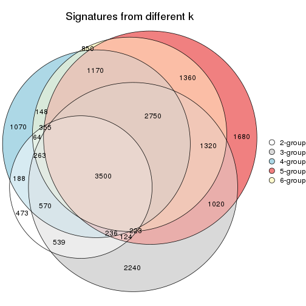

`get_signature()` returns a data frame invisibly. TO get the list of signatures, the function
call should be assigned to a variable explicitly. In following code, if `plot` argument is set
to `FALSE`, no heatmap is plotted while only the differential analysis is performed.

```r
# code only for demonstration
tb = get_signature(res, k = ..., plot = FALSE)
```

An example of the output of `tb` is:

```
#>   which_row         fdr    mean_1    mean_2 scaled_mean_1 scaled_mean_2 km
#> 1        38 0.042760348  8.373488  9.131774    -0.5533452     0.5164555  1
#> 2        40 0.018707592  7.106213  8.469186    -0.6173731     0.5762149  1
#> 3        55 0.019134737 10.221463 11.207825    -0.6159697     0.5749050  1
#> 4        59 0.006059896  5.921854  7.869574    -0.6899429     0.6439467  1
#> 5        60 0.018055526  8.928898 10.211722    -0.6204761     0.5791110  1
#> 6        98 0.009384629 15.714769 14.887706     0.6635654    -0.6193277  2
...
```

The columns in `tb` are:

1. `which_row`: row indices corresponding to the input matrix.
2. `fdr`: FDR for the differential test. 
3. `mean_x`: The mean value in group x.
4. `scaled_mean_x`: The mean value in group x after rows are scaled.
5. `km`: Row groups if k-means clustering is applied to rows.


UMAP plot which shows how samples are separated.


<script>
$( function() {
	$( '#tabs-MAD-mclust-dimension-reduction' ).tabs();
} );
</script>
<div id='tabs-MAD-mclust-dimension-reduction'>
<ul>
<li><a href='#tab-MAD-mclust-dimension-reduction-1'>k = 2</a></li>
<li><a href='#tab-MAD-mclust-dimension-reduction-2'>k = 3</a></li>
<li><a href='#tab-MAD-mclust-dimension-reduction-3'>k = 4</a></li>
<li><a href='#tab-MAD-mclust-dimension-reduction-4'>k = 5</a></li>
<li><a href='#tab-MAD-mclust-dimension-reduction-5'>k = 6</a></li>
</ul>
<div id='tab-MAD-mclust-dimension-reduction-1'>
<pre><code class="r">dimension_reduction(res, k = 2, method = &quot;UMAP&quot;)
</code></pre>

<p></p>

</div>
<div id='tab-MAD-mclust-dimension-reduction-2'>
<pre><code class="r">dimension_reduction(res, k = 3, method = &quot;UMAP&quot;)
</code></pre>

<p></p>

</div>
<div id='tab-MAD-mclust-dimension-reduction-3'>
<pre><code class="r">dimension_reduction(res, k = 4, method = &quot;UMAP&quot;)
</code></pre>

<p>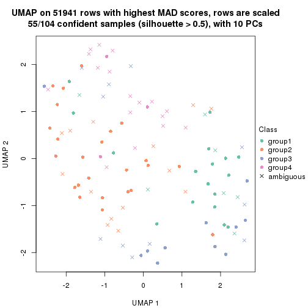</p>

</div>
<div id='tab-MAD-mclust-dimension-reduction-4'>
<pre><code class="r">dimension_reduction(res, k = 5, method = &quot;UMAP&quot;)
</code></pre>

<p></p>

</div>
<div id='tab-MAD-mclust-dimension-reduction-5'>
<pre><code class="r">dimension_reduction(res, k = 6, method = &quot;UMAP&quot;)
</code></pre>

<p></p>

</div>
</div>


Following heatmap shows how subgroups are split when increasing `k`:

```r
collect_classes(res)
```


Test correlation between subgroups and known annotations. If the known
annotation is numeric, one-way ANOVA test is applied, and if the known
annotation is discrete, chi-squared contingency table test is applied.

```r
test_to_known_factors(res)
```

```
#>             n disease.state(p) other(p) k
#> MAD:mclust 96           0.6146    0.667 2
#> MAD:mclust 67           0.8471    0.327 3
#> MAD:mclust 55           0.5474    0.706 4
#> MAD:mclust 51           0.5896    0.747 5
#> MAD:mclust 59           0.0393    0.514 6
```


If matrix rows can be associated to genes, consider to use `functional_enrichment(res,
...)` to perform function enrichment for the signature genes. See [this vignette](http://bioconductor.org/packages/devel/bioc/vignettes/cola/inst/doc/functional_enrichment.html) for more detailed explanations.


 

---------------------------------------------------


### MAD:NMF


The object with results only for a single top-value method and a single partition method 
can be extracted as:

```r
res = res_list["MAD", "NMF"]
# you can also extract it by
# res = res_list["MAD:NMF"]
```

A summary of `res` and all the functions that can be applied to it:

```r
res
```

```
#> A 'ConsensusPartition' object with k = 2, 3, 4, 5, 6.
#>   On a matrix with 51941 rows and 104 columns.
#>   Top rows (1000, 2000, 3000, 4000, 5000) are extracted by 'MAD' method.
#>   Subgroups are detected by 'NMF' method.
#>   Performed in total 1250 partitions by row resampling.
#>   Best k for subgroups seems to be 2.
#> 
#> Following methods can be applied to this 'ConsensusPartition' object:
#>  [1] "cola_report"             "collect_classes"         "collect_plots"          
#>  [4] "collect_stats"           "colnames"                "compare_signatures"     
#>  [7] "consensus_heatmap"       "dimension_reduction"     "functional_enrichment"  
#> [10] "get_anno_col"            "get_anno"                "get_classes"            
#> [13] "get_consensus"           "get_matrix"              "get_membership"         
#> [16] "get_param"               "get_signatures"          "get_stats"              
#> [19] "is_best_k"               "is_stable_k"             "membership_heatmap"     
#> [22] "ncol"                    "nrow"                    "plot_ecdf"              
#> [25] "rownames"                "select_partition_number" "show"                   
#> [28] "suggest_best_k"          "test_to_known_factors"
```

`collect_plots()` function collects all the plots made from `res` for all `k` (number of partitions)
into one single page to provide an easy and fast comparison between different `k`.

```r
collect_plots(res)
```


The plots are:

- The first row: a plot of the ECDF (empirical cumulative distribution
  function) curves of the consensus matrix for each `k` and the heatmap of
  predicted classes for each `k`.
- The second row: heatmaps of the consensus matrix for each `k`.
- The third row: heatmaps of the membership matrix for each `k`.
- The fouth row: heatmaps of the signatures for each `k`.

All the plots in panels can be made by individual functions and they are
plotted later in this section.

`select_partition_number()` produces several plots showing different
statistics for choosing "optimized" `k`. There are following statistics:

- ECDF curves of the consensus matrix for each `k`;
- 1-PAC. [The PAC
  score](https://en.wikipedia.org/wiki/Consensus_clustering#Over-interpretation_potential_of_consensus_clustering)
  measures the proportion of the ambiguous subgrouping.
- Mean silhouette score.
- Concordance. The mean probability of fiting the consensus class ids in all
  partitions.
- Area increased. Denote $A_k$ as the area under the ECDF curve for current
  `k`, the area increased is defined as $A_k - A_{k-1}$.
- Rand index. The percent of pairs of samples that are both in a same cluster
  or both are not in a same cluster in the partition of k and k-1.
- Jaccard index. The ratio of pairs of samples are both in a same cluster in
  the partition of k and k-1 and the pairs of samples are both in a same
  cluster in the partition k or k-1.

The detailed explanations of these statistics can be found in [the _cola_
vignette](http://bioconductor.org/packages/devel/bioc/vignettes/cola/inst/doc/cola.html#toc_13).

Generally speaking, lower PAC score, higher mean silhouette score or higher
concordance corresponds to better partition. Rand index and Jaccard index
measure how similar the current partition is compared to partition with `k-1`.
If they are too similar, we won't accept `k` is better than `k-1`.

```r
select_partition_number(res)
```


The numeric values for all these statistics can be obtained by `get_stats()`.

```r
get_stats(res)
```

```
#>   k 1-PAC mean_silhouette concordance area_increased  Rand Jaccard
#> 2 2 0.861           0.906       0.961         0.4804 0.522   0.522
#> 3 3 0.369           0.519       0.729         0.3614 0.713   0.496
#> 4 4 0.428           0.502       0.717         0.1327 0.788   0.467
#> 5 5 0.523           0.520       0.731         0.0678 0.860   0.528
#> 6 6 0.536           0.348       0.604         0.0472 0.864   0.474
```

`suggest_best_k()` suggests the best $k$ based on these statistics. The rules are as follows:

- All $k$ with Jaccard index larger than 0.95 are removed because increasing
  $k$ does not provide enough extra information. If all $k$ are removed, it is
  marked as no subgroup is detected.
- For all $k$ with 1-PAC score larger than 0.9, the maximal $k$ is taken as
  the best $k$, and other $k$ are marked as optional $k$.
- If it does not fit the second rule. The $k$ with the maximal vote of the
  highest 1-PAC score, highest mean silhouette, and highest concordance is
  taken as the best $k$.

```r
suggest_best_k(res)
```

```
#> [1] 2
```


Following shows the table of the partitions (You need to click the **show/hide
code output** link to see it). The membership matrix (columns with name `p*`)
is inferred by
[`clue::cl_consensus()`](https://www.rdocumentation.org/link/cl_consensus?package=clue)
function with the `SE` method. Basically the value in the membership matrix
represents the probability to belong to a certain group. The finall class
label for an item is determined with the group with highest probability it
belongs to.

In `get_classes()` function, the entropy is calculated from the membership
matrix and the silhouette score is calculated from the consensus matrix.


<script>
$( function() {
	$( '#tabs-MAD-NMF-get-classes' ).tabs();
} );
</script>
<div id='tabs-MAD-NMF-get-classes'>
<ul>
<li><a href='#tab-MAD-NMF-get-classes-1'>k = 2</a></li>
<li><a href='#tab-MAD-NMF-get-classes-2'>k = 3</a></li>
<li><a href='#tab-MAD-NMF-get-classes-3'>k = 4</a></li>
<li><a href='#tab-MAD-NMF-get-classes-4'>k = 5</a></li>
<li><a href='#tab-MAD-NMF-get-classes-5'>k = 6</a></li>
</ul>

<div id='tab-MAD-NMF-get-classes-1'>
<p><a id='tab-MAD-NMF-get-classes-1-a' style='color:#0366d6' href='#'>show/hide code output</a></p>
<pre><code class="r">cbind(get_classes(res, k = 2), get_membership(res, k = 2))
</code></pre>

<pre><code>#&gt;           class entropy silhouette    p1    p2
#&gt; GSM537341     2   0.671      0.781 0.176 0.824
#&gt; GSM537345     1   0.000      0.955 1.000 0.000
#&gt; GSM537355     2   0.000      0.960 0.000 1.000
#&gt; GSM537366     1   0.000      0.955 1.000 0.000
#&gt; GSM537370     2   0.184      0.938 0.028 0.972
#&gt; GSM537380     2   0.000      0.960 0.000 1.000
#&gt; GSM537392     2   0.000      0.960 0.000 1.000
#&gt; GSM537415     2   0.000      0.960 0.000 1.000
#&gt; GSM537417     2   0.000      0.960 0.000 1.000
#&gt; GSM537422     1   0.000      0.955 1.000 0.000
#&gt; GSM537423     2   0.000      0.960 0.000 1.000
#&gt; GSM537427     2   0.000      0.960 0.000 1.000
#&gt; GSM537430     2   0.000      0.960 0.000 1.000
#&gt; GSM537336     1   0.000      0.955 1.000 0.000
#&gt; GSM537337     2   0.000      0.960 0.000 1.000
#&gt; GSM537348     1   0.000      0.955 1.000 0.000
#&gt; GSM537349     2   0.000      0.960 0.000 1.000
#&gt; GSM537356     1   0.000      0.955 1.000 0.000
#&gt; GSM537361     1   0.000      0.955 1.000 0.000
#&gt; GSM537374     2   0.000      0.960 0.000 1.000
#&gt; GSM537377     1   0.000      0.955 1.000 0.000
#&gt; GSM537378     2   0.000      0.960 0.000 1.000
#&gt; GSM537379     2   0.000      0.960 0.000 1.000
#&gt; GSM537383     2   0.000      0.960 0.000 1.000
#&gt; GSM537388     2   0.000      0.960 0.000 1.000
#&gt; GSM537395     2   0.000      0.960 0.000 1.000
#&gt; GSM537400     1   0.373      0.897 0.928 0.072
#&gt; GSM537404     2   0.295      0.917 0.052 0.948
#&gt; GSM537409     2   0.000      0.960 0.000 1.000
#&gt; GSM537418     1   0.000      0.955 1.000 0.000
#&gt; GSM537425     1   0.000      0.955 1.000 0.000
#&gt; GSM537333     2   0.975      0.297 0.408 0.592
#&gt; GSM537342     2   0.541      0.839 0.124 0.876
#&gt; GSM537347     2   0.552      0.838 0.128 0.872
#&gt; GSM537350     1   0.000      0.955 1.000 0.000
#&gt; GSM537362     1   0.000      0.955 1.000 0.000
#&gt; GSM537363     1   0.722      0.739 0.800 0.200
#&gt; GSM537368     1   0.000      0.955 1.000 0.000
#&gt; GSM537376     2   0.000      0.960 0.000 1.000
#&gt; GSM537381     1   0.000      0.955 1.000 0.000
#&gt; GSM537386     2   0.000      0.960 0.000 1.000
#&gt; GSM537398     1   0.000      0.955 1.000 0.000
#&gt; GSM537402     2   0.000      0.960 0.000 1.000
#&gt; GSM537405     1   0.000      0.955 1.000 0.000
#&gt; GSM537371     1   0.000      0.955 1.000 0.000
#&gt; GSM537421     2   0.961      0.363 0.384 0.616
#&gt; GSM537424     1   0.000      0.955 1.000 0.000
#&gt; GSM537432     1   0.958      0.382 0.620 0.380
#&gt; GSM537331     2   0.000      0.960 0.000 1.000
#&gt; GSM537332     2   0.000      0.960 0.000 1.000
#&gt; GSM537334     2   0.000      0.960 0.000 1.000
#&gt; GSM537338     2   0.000      0.960 0.000 1.000
#&gt; GSM537353     2   0.000      0.960 0.000 1.000
#&gt; GSM537357     1   0.000      0.955 1.000 0.000
#&gt; GSM537358     2   0.000      0.960 0.000 1.000
#&gt; GSM537375     2   0.000      0.960 0.000 1.000
#&gt; GSM537389     2   0.000      0.960 0.000 1.000
#&gt; GSM537390     2   0.000      0.960 0.000 1.000
#&gt; GSM537393     2   0.000      0.960 0.000 1.000
#&gt; GSM537399     2   0.991      0.200 0.444 0.556
#&gt; GSM537407     1   0.469      0.868 0.900 0.100
#&gt; GSM537408     2   0.000      0.960 0.000 1.000
#&gt; GSM537428     2   0.000      0.960 0.000 1.000
#&gt; GSM537354     2   0.000      0.960 0.000 1.000
#&gt; GSM537410     2   0.000      0.960 0.000 1.000
#&gt; GSM537413     2   0.000      0.960 0.000 1.000
#&gt; GSM537396     2   0.000      0.960 0.000 1.000
#&gt; GSM537397     1   0.311      0.912 0.944 0.056
#&gt; GSM537330     2   0.000      0.960 0.000 1.000
#&gt; GSM537369     1   0.000      0.955 1.000 0.000
#&gt; GSM537373     2   0.000      0.960 0.000 1.000
#&gt; GSM537401     2   0.204      0.935 0.032 0.968
#&gt; GSM537343     1   0.118      0.945 0.984 0.016
#&gt; GSM537367     1   0.184      0.936 0.972 0.028
#&gt; GSM537382     2   0.000      0.960 0.000 1.000
#&gt; GSM537385     2   0.000      0.960 0.000 1.000
#&gt; GSM537391     1   0.000      0.955 1.000 0.000
#&gt; GSM537419     2   0.000      0.960 0.000 1.000
#&gt; GSM537420     1   0.000      0.955 1.000 0.000
#&gt; GSM537429     2   0.775      0.700 0.228 0.772
#&gt; GSM537431     1   0.955      0.393 0.624 0.376
#&gt; GSM537387     1   0.000      0.955 1.000 0.000
#&gt; GSM537414     1   0.000      0.955 1.000 0.000
#&gt; GSM537433     1   0.184      0.936 0.972 0.028
#&gt; GSM537335     2   0.373      0.899 0.072 0.928
#&gt; GSM537339     1   0.000      0.955 1.000 0.000
#&gt; GSM537340     1   0.973      0.326 0.596 0.404
#&gt; GSM537344     1   0.000      0.955 1.000 0.000
#&gt; GSM537346     2   0.000      0.960 0.000 1.000
#&gt; GSM537351     1   0.000      0.955 1.000 0.000
#&gt; GSM537352     2   0.000      0.960 0.000 1.000
#&gt; GSM537359     2   0.000      0.960 0.000 1.000
#&gt; GSM537360     2   0.000      0.960 0.000 1.000
#&gt; GSM537364     1   0.000      0.955 1.000 0.000
#&gt; GSM537365     2   0.871      0.588 0.292 0.708
#&gt; GSM537372     1   0.000      0.955 1.000 0.000
#&gt; GSM537384     1   0.000      0.955 1.000 0.000
#&gt; GSM537394     2   0.000      0.960 0.000 1.000
#&gt; GSM537403     2   0.000      0.960 0.000 1.000
#&gt; GSM537406     2   0.000      0.960 0.000 1.000
#&gt; GSM537411     2   0.000      0.960 0.000 1.000
#&gt; GSM537412     2   0.000      0.960 0.000 1.000
#&gt; GSM537416     2   0.000      0.960 0.000 1.000
#&gt; GSM537426     2   0.000      0.960 0.000 1.000
</code></pre>

<script>
$('#tab-MAD-NMF-get-classes-1-a').parent().next().next().hide();
$('#tab-MAD-NMF-get-classes-1-a').click(function(){
  $('#tab-MAD-NMF-get-classes-1-a').parent().next().next().toggle();
  return(false);
});
</script>
</div>

<div id='tab-MAD-NMF-get-classes-2'>
<p><a id='tab-MAD-NMF-get-classes-2-a' style='color:#0366d6' href='#'>show/hide code output</a></p>
<pre><code class="r">cbind(get_classes(res, k = 3), get_membership(res, k = 3))
</code></pre>

<pre><code>#&gt;           class entropy silhouette    p1    p2    p3
#&gt; GSM537341     3  0.5105     0.5508 0.048 0.124 0.828
#&gt; GSM537345     1  0.4605     0.7173 0.796 0.000 0.204
#&gt; GSM537355     2  0.4796     0.6231 0.000 0.780 0.220
#&gt; GSM537366     1  0.6148     0.7116 0.776 0.076 0.148
#&gt; GSM537370     3  0.5331     0.5292 0.024 0.184 0.792
#&gt; GSM537380     3  0.5363     0.4765 0.000 0.276 0.724
#&gt; GSM537392     3  0.5650     0.4451 0.000 0.312 0.688
#&gt; GSM537415     2  0.3267     0.6834 0.000 0.884 0.116
#&gt; GSM537417     2  0.3377     0.6677 0.012 0.896 0.092
#&gt; GSM537422     1  0.7616     0.5166 0.636 0.292 0.072
#&gt; GSM537423     2  0.4178     0.6673 0.000 0.828 0.172
#&gt; GSM537427     3  0.6244     0.3627 0.000 0.440 0.560
#&gt; GSM537430     2  0.6305    -0.2926 0.000 0.516 0.484
#&gt; GSM537336     1  0.0237     0.8112 0.996 0.000 0.004
#&gt; GSM537337     2  0.4399     0.6456 0.000 0.812 0.188
#&gt; GSM537348     3  0.6309    -0.1822 0.496 0.000 0.504
#&gt; GSM537349     2  0.6291     0.0909 0.000 0.532 0.468
#&gt; GSM537356     1  0.3500     0.7848 0.880 0.004 0.116
#&gt; GSM537361     1  0.2301     0.8032 0.936 0.004 0.060
#&gt; GSM537374     3  0.5016     0.5161 0.000 0.240 0.760
#&gt; GSM537377     1  0.5216     0.6658 0.740 0.000 0.260
#&gt; GSM537378     2  0.2356     0.7081 0.000 0.928 0.072
#&gt; GSM537379     2  0.4931     0.6208 0.004 0.784 0.212
#&gt; GSM537383     3  0.6291     0.2894 0.000 0.468 0.532
#&gt; GSM537388     2  0.6079     0.0657 0.000 0.612 0.388
#&gt; GSM537395     2  0.3116     0.6827 0.000 0.892 0.108
#&gt; GSM537400     1  0.8465     0.2348 0.528 0.096 0.376
#&gt; GSM537404     3  0.8505     0.4327 0.144 0.256 0.600
#&gt; GSM537409     2  0.0237     0.7083 0.000 0.996 0.004
#&gt; GSM537418     1  0.1289     0.8121 0.968 0.000 0.032
#&gt; GSM537425     1  0.1482     0.8107 0.968 0.020 0.012
#&gt; GSM537333     3  0.9077     0.3408 0.152 0.340 0.508
#&gt; GSM537342     2  0.3481     0.6939 0.052 0.904 0.044
#&gt; GSM537347     3  0.7091     0.5076 0.040 0.320 0.640
#&gt; GSM537350     1  0.5517     0.6527 0.728 0.004 0.268
#&gt; GSM537362     3  0.6704     0.1306 0.376 0.016 0.608
#&gt; GSM537363     1  0.6922     0.6531 0.720 0.080 0.200
#&gt; GSM537368     1  0.0000     0.8113 1.000 0.000 0.000
#&gt; GSM537376     2  0.4504     0.6714 0.000 0.804 0.196
#&gt; GSM537381     1  0.1129     0.8111 0.976 0.004 0.020
#&gt; GSM537386     3  0.5431     0.4634 0.000 0.284 0.716
#&gt; GSM537398     3  0.6204     0.0117 0.424 0.000 0.576
#&gt; GSM537402     2  0.6079     0.3601 0.000 0.612 0.388
#&gt; GSM537405     1  0.1643     0.8095 0.956 0.000 0.044
#&gt; GSM537371     1  0.1031     0.8096 0.976 0.000 0.024
#&gt; GSM537421     2  0.5075     0.6161 0.068 0.836 0.096
#&gt; GSM537424     1  0.4346     0.7354 0.816 0.000 0.184
#&gt; GSM537432     3  0.8690     0.1459 0.440 0.104 0.456
#&gt; GSM537331     3  0.5291     0.5112 0.000 0.268 0.732
#&gt; GSM537332     2  0.1832     0.7145 0.008 0.956 0.036
#&gt; GSM537334     3  0.4931     0.4956 0.000 0.232 0.768
#&gt; GSM537338     3  0.5016     0.5057 0.000 0.240 0.760
#&gt; GSM537353     2  0.1753     0.7154 0.000 0.952 0.048
#&gt; GSM537357     1  0.0424     0.8110 0.992 0.000 0.008
#&gt; GSM537358     2  0.5859     0.4116 0.000 0.656 0.344
#&gt; GSM537375     2  0.6680     0.0540 0.008 0.508 0.484
#&gt; GSM537389     2  0.6079     0.4219 0.000 0.612 0.388
#&gt; GSM537390     2  0.2356     0.7124 0.000 0.928 0.072
#&gt; GSM537393     2  0.3879     0.6604 0.000 0.848 0.152
#&gt; GSM537399     3  0.6217     0.4355 0.264 0.024 0.712
#&gt; GSM537407     1  0.6476     0.3132 0.548 0.004 0.448
#&gt; GSM537408     2  0.6664     0.2610 0.008 0.528 0.464
#&gt; GSM537428     3  0.5905     0.4682 0.000 0.352 0.648
#&gt; GSM537354     2  0.4121     0.6218 0.000 0.832 0.168
#&gt; GSM537410     2  0.3370     0.6988 0.024 0.904 0.072
#&gt; GSM537413     2  0.4605     0.6534 0.000 0.796 0.204
#&gt; GSM537396     3  0.6570     0.3952 0.024 0.308 0.668
#&gt; GSM537397     3  0.5397     0.3756 0.280 0.000 0.720
#&gt; GSM537330     2  0.6252    -0.2012 0.000 0.556 0.444
#&gt; GSM537369     1  0.1964     0.8091 0.944 0.000 0.056
#&gt; GSM537373     2  0.5506     0.5798 0.016 0.764 0.220
#&gt; GSM537401     3  0.3896     0.5545 0.008 0.128 0.864
#&gt; GSM537343     1  0.4784     0.7121 0.796 0.004 0.200
#&gt; GSM537367     2  0.9129     0.0249 0.372 0.480 0.148
#&gt; GSM537382     2  0.1529     0.7063 0.000 0.960 0.040
#&gt; GSM537385     3  0.6260     0.2469 0.000 0.448 0.552
#&gt; GSM537391     3  0.6154     0.0897 0.408 0.000 0.592
#&gt; GSM537419     2  0.6302     0.1962 0.000 0.520 0.480
#&gt; GSM537420     1  0.2165     0.8053 0.936 0.000 0.064
#&gt; GSM537429     3  0.8608     0.3544 0.100 0.412 0.488
#&gt; GSM537431     1  0.9103     0.0132 0.476 0.144 0.380
#&gt; GSM537387     1  0.3816     0.7509 0.852 0.000 0.148
#&gt; GSM537414     1  0.6007     0.6447 0.764 0.192 0.044
#&gt; GSM537433     1  0.9458     0.2018 0.448 0.368 0.184
#&gt; GSM537335     3  0.4912     0.5161 0.008 0.196 0.796
#&gt; GSM537339     3  0.5810     0.2945 0.336 0.000 0.664
#&gt; GSM537340     2  0.6984     0.4786 0.192 0.720 0.088
#&gt; GSM537344     1  0.1643     0.8097 0.956 0.000 0.044
#&gt; GSM537346     3  0.6521     0.2864 0.004 0.496 0.500
#&gt; GSM537351     1  0.1337     0.8110 0.972 0.012 0.016
#&gt; GSM537352     2  0.1964     0.7022 0.000 0.944 0.056
#&gt; GSM537359     3  0.5465     0.4526 0.000 0.288 0.712
#&gt; GSM537360     2  0.2066     0.7114 0.000 0.940 0.060
#&gt; GSM537364     1  0.0747     0.8094 0.984 0.000 0.016
#&gt; GSM537365     3  0.8665     0.3140 0.384 0.108 0.508
#&gt; GSM537372     1  0.5291     0.6476 0.732 0.000 0.268
#&gt; GSM537384     1  0.3340     0.7811 0.880 0.000 0.120
#&gt; GSM537394     3  0.5690     0.4470 0.004 0.288 0.708
#&gt; GSM537403     2  0.1337     0.7040 0.016 0.972 0.012
#&gt; GSM537406     2  0.5201     0.5717 0.004 0.760 0.236
#&gt; GSM537411     3  0.6062     0.4099 0.000 0.384 0.616
#&gt; GSM537412     2  0.2200     0.7097 0.004 0.940 0.056
#&gt; GSM537416     2  0.1999     0.6986 0.036 0.952 0.012
#&gt; GSM537426     2  0.1643     0.7127 0.000 0.956 0.044
</code></pre>

<script>
$('#tab-MAD-NMF-get-classes-2-a').parent().next().next().hide();
$('#tab-MAD-NMF-get-classes-2-a').click(function(){
  $('#tab-MAD-NMF-get-classes-2-a').parent().next().next().toggle();
  return(false);
});
</script>
</div>

<div id='tab-MAD-NMF-get-classes-3'>
<p><a id='tab-MAD-NMF-get-classes-3-a' style='color:#0366d6' href='#'>show/hide code output</a></p>
<pre><code class="r">cbind(get_classes(res, k = 4), get_membership(res, k = 4))
</code></pre>

<pre><code>#&gt;           class entropy silhouette    p1    p2    p3    p4
#&gt; GSM537341     2  0.2909    0.55776 0.036 0.904 0.008 0.052
#&gt; GSM537345     1  0.5721    0.16259 0.548 0.004 0.020 0.428
#&gt; GSM537355     3  0.6412    0.52539 0.000 0.088 0.592 0.320
#&gt; GSM537366     1  0.4370    0.70244 0.772 0.212 0.008 0.008
#&gt; GSM537370     2  0.4008    0.55349 0.020 0.832 0.012 0.136
#&gt; GSM537380     2  0.4274    0.61902 0.000 0.820 0.072 0.108
#&gt; GSM537392     2  0.4764    0.61550 0.000 0.788 0.088 0.124
#&gt; GSM537415     3  0.3428    0.67030 0.000 0.144 0.844 0.012
#&gt; GSM537417     3  0.5531    0.64783 0.024 0.048 0.744 0.184
#&gt; GSM537422     3  0.6043    0.38417 0.312 0.008 0.632 0.048
#&gt; GSM537423     2  0.6449    0.10382 0.000 0.480 0.452 0.068
#&gt; GSM537427     4  0.7469   -0.00113 0.000 0.368 0.180 0.452
#&gt; GSM537430     2  0.7823    0.16642 0.000 0.408 0.272 0.320
#&gt; GSM537336     1  0.1182    0.74294 0.968 0.000 0.016 0.016
#&gt; GSM537337     3  0.5792    0.38619 0.000 0.032 0.552 0.416
#&gt; GSM537348     4  0.7281    0.11593 0.380 0.152 0.000 0.468
#&gt; GSM537349     2  0.4737    0.60147 0.000 0.728 0.252 0.020
#&gt; GSM537356     1  0.3870    0.70955 0.788 0.208 0.000 0.004
#&gt; GSM537361     1  0.4841    0.67843 0.792 0.044 0.016 0.148
#&gt; GSM537374     4  0.4322    0.53334 0.000 0.152 0.044 0.804
#&gt; GSM537377     4  0.5636    0.10191 0.424 0.000 0.024 0.552
#&gt; GSM537378     3  0.4989    0.64162 0.000 0.164 0.764 0.072
#&gt; GSM537379     3  0.6023    0.53534 0.000 0.060 0.612 0.328
#&gt; GSM537383     2  0.6885    0.46591 0.000 0.596 0.196 0.208
#&gt; GSM537388     2  0.7102    0.40049 0.000 0.548 0.288 0.164
#&gt; GSM537395     3  0.5767    0.62914 0.000 0.152 0.712 0.136
#&gt; GSM537400     4  0.9312    0.27748 0.304 0.088 0.252 0.356
#&gt; GSM537404     2  0.7712    0.21235 0.248 0.552 0.024 0.176
#&gt; GSM537409     3  0.2002    0.70966 0.000 0.044 0.936 0.020
#&gt; GSM537418     1  0.1610    0.75515 0.952 0.032 0.000 0.016
#&gt; GSM537425     1  0.3048    0.74392 0.900 0.028 0.016 0.056
#&gt; GSM537333     3  0.7375    0.00328 0.080 0.028 0.452 0.440
#&gt; GSM537342     3  0.4292    0.65754 0.072 0.088 0.832 0.008
#&gt; GSM537347     4  0.7336    0.27246 0.024 0.332 0.100 0.544
#&gt; GSM537350     2  0.6021    0.00702 0.368 0.592 0.020 0.020
#&gt; GSM537362     4  0.4008    0.56184 0.136 0.020 0.012 0.832
#&gt; GSM537363     1  0.6339    0.60302 0.688 0.140 0.160 0.012
#&gt; GSM537368     1  0.0804    0.75365 0.980 0.012 0.000 0.008
#&gt; GSM537376     3  0.5527    0.60740 0.000 0.168 0.728 0.104
#&gt; GSM537381     1  0.2542    0.75508 0.904 0.084 0.000 0.012
#&gt; GSM537386     2  0.4401    0.59617 0.000 0.812 0.076 0.112
#&gt; GSM537398     4  0.5076    0.54467 0.172 0.072 0.000 0.756
#&gt; GSM537402     2  0.6626    0.38905 0.000 0.544 0.364 0.092
#&gt; GSM537405     1  0.1811    0.75208 0.948 0.028 0.004 0.020
#&gt; GSM537371     1  0.1635    0.73560 0.948 0.000 0.008 0.044
#&gt; GSM537421     3  0.3411    0.67511 0.048 0.008 0.880 0.064
#&gt; GSM537424     1  0.4567    0.61133 0.740 0.016 0.000 0.244
#&gt; GSM537432     4  0.8877    0.23688 0.232 0.060 0.288 0.420
#&gt; GSM537331     4  0.5383    0.39976 0.000 0.292 0.036 0.672
#&gt; GSM537332     3  0.5830    0.63647 0.008 0.172 0.720 0.100
#&gt; GSM537334     4  0.3873    0.56553 0.000 0.096 0.060 0.844
#&gt; GSM537338     4  0.3099    0.56728 0.000 0.104 0.020 0.876
#&gt; GSM537353     3  0.4037    0.69110 0.000 0.112 0.832 0.056
#&gt; GSM537357     1  0.2644    0.71398 0.908 0.000 0.032 0.060
#&gt; GSM537358     2  0.5833    0.58635 0.000 0.692 0.212 0.096
#&gt; GSM537375     4  0.4220    0.34500 0.000 0.004 0.248 0.748
#&gt; GSM537389     2  0.4808    0.60616 0.000 0.736 0.236 0.028
#&gt; GSM537390     3  0.5272    0.64157 0.000 0.172 0.744 0.084
#&gt; GSM537393     3  0.5851    0.62234 0.000 0.084 0.680 0.236
#&gt; GSM537399     2  0.5361    0.37366 0.208 0.724 0.000 0.068
#&gt; GSM537407     1  0.5427    0.48974 0.568 0.416 0.000 0.016
#&gt; GSM537408     2  0.3225    0.62257 0.016 0.892 0.060 0.032
#&gt; GSM537428     4  0.6156    0.28274 0.000 0.344 0.064 0.592
#&gt; GSM537354     3  0.5033    0.53488 0.004 0.008 0.664 0.324
#&gt; GSM537410     3  0.2164    0.69817 0.004 0.068 0.924 0.004
#&gt; GSM537413     3  0.5097    0.14724 0.000 0.428 0.568 0.004
#&gt; GSM537396     2  0.2613    0.60789 0.024 0.916 0.052 0.008
#&gt; GSM537397     2  0.5228    0.43183 0.124 0.756 0.000 0.120
#&gt; GSM537330     3  0.7884    0.03633 0.000 0.312 0.384 0.304
#&gt; GSM537369     1  0.2546    0.75237 0.900 0.092 0.000 0.008
#&gt; GSM537373     2  0.6109    0.29765 0.032 0.580 0.376 0.012
#&gt; GSM537401     2  0.5415    0.32241 0.012 0.668 0.016 0.304
#&gt; GSM537343     1  0.4889    0.58591 0.636 0.360 0.000 0.004
#&gt; GSM537367     3  0.7501    0.12843 0.344 0.152 0.496 0.008
#&gt; GSM537382     3  0.3344    0.68433 0.004 0.108 0.868 0.020
#&gt; GSM537385     2  0.4746    0.63051 0.000 0.776 0.168 0.056
#&gt; GSM537391     4  0.7202    0.34115 0.296 0.152 0.004 0.548
#&gt; GSM537419     2  0.4224    0.63876 0.000 0.812 0.144 0.044
#&gt; GSM537420     1  0.3658    0.74068 0.836 0.144 0.000 0.020
#&gt; GSM537429     3  0.8975   -0.06289 0.064 0.348 0.368 0.220
#&gt; GSM537431     1  0.9625   -0.19908 0.336 0.152 0.320 0.192
#&gt; GSM537387     1  0.5076    0.52773 0.712 0.024 0.004 0.260
#&gt; GSM537414     1  0.8354   -0.08507 0.380 0.024 0.376 0.220
#&gt; GSM537433     1  0.5835    0.64975 0.688 0.244 0.060 0.008
#&gt; GSM537335     4  0.3677    0.56178 0.008 0.148 0.008 0.836
#&gt; GSM537339     4  0.7197    0.26761 0.140 0.392 0.000 0.468
#&gt; GSM537340     3  0.4553    0.66560 0.076 0.012 0.820 0.092
#&gt; GSM537344     1  0.2266    0.75338 0.912 0.084 0.000 0.004
#&gt; GSM537346     2  0.7655    0.34949 0.024 0.560 0.172 0.244
#&gt; GSM537351     1  0.1059    0.74507 0.972 0.000 0.016 0.012
#&gt; GSM537352     3  0.3581    0.70931 0.000 0.032 0.852 0.116
#&gt; GSM537359     2  0.2943    0.63395 0.000 0.892 0.076 0.032
#&gt; GSM537360     3  0.4022    0.69205 0.000 0.096 0.836 0.068
#&gt; GSM537364     1  0.1042    0.74312 0.972 0.000 0.008 0.020
#&gt; GSM537365     1  0.7913    0.31588 0.484 0.336 0.024 0.156
#&gt; GSM537372     1  0.4642    0.68472 0.740 0.240 0.000 0.020
#&gt; GSM537384     1  0.3820    0.74658 0.848 0.088 0.000 0.064
#&gt; GSM537394     2  0.3774    0.58834 0.008 0.844 0.020 0.128
#&gt; GSM537403     3  0.1362    0.70680 0.004 0.020 0.964 0.012
#&gt; GSM537406     2  0.5148    0.38143 0.004 0.640 0.348 0.008
#&gt; GSM537411     2  0.7314    0.27263 0.000 0.496 0.168 0.336
#&gt; GSM537412     3  0.1807    0.70574 0.000 0.052 0.940 0.008
#&gt; GSM537416     3  0.1677    0.69286 0.040 0.000 0.948 0.012
#&gt; GSM537426     3  0.1970    0.70427 0.000 0.060 0.932 0.008
</code></pre>

<script>
$('#tab-MAD-NMF-get-classes-3-a').parent().next().next().hide();
$('#tab-MAD-NMF-get-classes-3-a').click(function(){
  $('#tab-MAD-NMF-get-classes-3-a').parent().next().next().toggle();
  return(false);
});
</script>
</div>

<div id='tab-MAD-NMF-get-classes-4'>
<p><a id='tab-MAD-NMF-get-classes-4-a' style='color:#0366d6' href='#'>show/hide code output</a></p>
<pre><code class="r">cbind(get_classes(res, k = 5), get_membership(res, k = 5))
</code></pre>

<pre><code>#&gt;           class entropy silhouette    p1    p2    p3    p4    p5
#&gt; GSM537341     2  0.3584    0.62418 0.104 0.840 0.000 0.040 0.016
#&gt; GSM537345     5  0.4703    0.35710 0.340 0.000 0.000 0.028 0.632
#&gt; GSM537355     3  0.6021    0.22101 0.000 0.024 0.584 0.312 0.080
#&gt; GSM537366     1  0.2736    0.80541 0.888 0.084 0.016 0.008 0.004
#&gt; GSM537370     2  0.3006    0.65395 0.040 0.884 0.060 0.008 0.008
#&gt; GSM537380     2  0.2688    0.68119 0.000 0.896 0.056 0.036 0.012
#&gt; GSM537392     2  0.2995    0.67400 0.000 0.872 0.088 0.032 0.008
#&gt; GSM537415     4  0.4587    0.65495 0.000 0.160 0.096 0.744 0.000
#&gt; GSM537417     3  0.3821    0.52280 0.008 0.004 0.780 0.200 0.008
#&gt; GSM537422     4  0.6828    0.18090 0.356 0.000 0.152 0.468 0.024
#&gt; GSM537423     2  0.5532    0.38796 0.000 0.616 0.104 0.280 0.000
#&gt; GSM537427     5  0.7599    0.13984 0.000 0.272 0.260 0.052 0.416
#&gt; GSM537430     3  0.5380    0.48343 0.000 0.188 0.708 0.056 0.048
#&gt; GSM537336     1  0.2726    0.78531 0.884 0.000 0.000 0.064 0.052
#&gt; GSM537337     4  0.7457    0.33951 0.000 0.064 0.176 0.460 0.300
#&gt; GSM537348     5  0.5746    0.47899 0.280 0.076 0.020 0.000 0.624
#&gt; GSM537349     2  0.3495    0.66625 0.000 0.816 0.032 0.152 0.000
#&gt; GSM537356     1  0.2392    0.79945 0.888 0.104 0.004 0.000 0.004
#&gt; GSM537361     1  0.4273    0.31393 0.552 0.000 0.448 0.000 0.000
#&gt; GSM537374     5  0.5741    0.23847 0.000 0.096 0.360 0.000 0.544
#&gt; GSM537377     5  0.3060    0.56377 0.128 0.000 0.000 0.024 0.848
#&gt; GSM537378     4  0.6361    0.36375 0.000 0.176 0.340 0.484 0.000
#&gt; GSM537379     3  0.2037    0.60432 0.000 0.004 0.920 0.064 0.012
#&gt; GSM537383     2  0.6089    0.16488 0.000 0.504 0.408 0.060 0.028
#&gt; GSM537388     2  0.6351    0.41855 0.000 0.548 0.296 0.144 0.012
#&gt; GSM537395     4  0.6426    0.31167 0.000 0.156 0.368 0.472 0.004
#&gt; GSM537400     3  0.6077    0.42787 0.196 0.004 0.656 0.108 0.036
#&gt; GSM537404     3  0.6920    0.14088 0.328 0.236 0.428 0.004 0.004
#&gt; GSM537409     4  0.4106    0.56040 0.000 0.020 0.256 0.724 0.000
#&gt; GSM537418     1  0.1875    0.81895 0.940 0.008 0.008 0.016 0.028
#&gt; GSM537425     1  0.3238    0.78681 0.848 0.004 0.124 0.020 0.004
#&gt; GSM537333     3  0.3669    0.57687 0.012 0.000 0.800 0.176 0.012
#&gt; GSM537342     4  0.2774    0.68351 0.020 0.080 0.008 0.888 0.004
#&gt; GSM537347     3  0.1580    0.59389 0.016 0.016 0.952 0.004 0.012
#&gt; GSM537350     2  0.3521    0.51632 0.232 0.764 0.000 0.004 0.000
#&gt; GSM537362     5  0.4194    0.41880 0.012 0.000 0.276 0.004 0.708
#&gt; GSM537363     4  0.5947   -0.00720 0.420 0.092 0.000 0.484 0.004
#&gt; GSM537368     1  0.1522    0.81002 0.944 0.000 0.000 0.012 0.044
#&gt; GSM537376     4  0.3995    0.65671 0.000 0.152 0.000 0.788 0.060
#&gt; GSM537381     1  0.1668    0.81843 0.940 0.028 0.032 0.000 0.000
#&gt; GSM537386     2  0.5632    0.34682 0.016 0.600 0.336 0.040 0.008
#&gt; GSM537398     5  0.4724    0.54898 0.080 0.008 0.168 0.000 0.744
#&gt; GSM537402     4  0.4870   -0.02431 0.000 0.448 0.004 0.532 0.016
#&gt; GSM537405     1  0.2705    0.81216 0.900 0.012 0.036 0.004 0.048
#&gt; GSM537371     1  0.2325    0.79494 0.904 0.000 0.000 0.028 0.068
#&gt; GSM537421     4  0.1917    0.67132 0.016 0.008 0.004 0.936 0.036
#&gt; GSM537424     1  0.4281    0.71529 0.768 0.004 0.172 0.000 0.056
#&gt; GSM537432     3  0.6491    0.43871 0.056 0.000 0.588 0.264 0.092
#&gt; GSM537331     5  0.6059    0.39533 0.000 0.184 0.244 0.000 0.572
#&gt; GSM537332     3  0.1282    0.61060 0.000 0.000 0.952 0.044 0.004
#&gt; GSM537334     3  0.5190    0.00376 0.000 0.028 0.540 0.008 0.424
#&gt; GSM537338     5  0.3281    0.54922 0.000 0.060 0.092 0.000 0.848
#&gt; GSM537353     4  0.5731    0.56789 0.000 0.180 0.196 0.624 0.000
#&gt; GSM537357     1  0.3346    0.75762 0.844 0.000 0.000 0.092 0.064
#&gt; GSM537358     2  0.4643    0.59021 0.000 0.736 0.192 0.068 0.004
#&gt; GSM537375     5  0.5812    0.32427 0.004 0.028 0.064 0.264 0.640
#&gt; GSM537389     2  0.3209    0.63810 0.000 0.812 0.008 0.180 0.000
#&gt; GSM537390     3  0.5339    0.47169 0.000 0.152 0.672 0.176 0.000
#&gt; GSM537393     3  0.5584    0.44840 0.000 0.060 0.668 0.236 0.036
#&gt; GSM537399     2  0.6879    0.05005 0.328 0.400 0.268 0.000 0.004
#&gt; GSM537407     1  0.4932    0.70711 0.744 0.116 0.128 0.008 0.004
#&gt; GSM537408     2  0.1617    0.68161 0.020 0.948 0.020 0.012 0.000
#&gt; GSM537428     3  0.6672    0.01866 0.000 0.288 0.440 0.000 0.272
#&gt; GSM537354     4  0.5980    0.49911 0.000 0.052 0.052 0.616 0.280
#&gt; GSM537410     4  0.1956    0.69168 0.000 0.076 0.008 0.916 0.000
#&gt; GSM537413     2  0.5733    0.12680 0.000 0.476 0.084 0.440 0.000
#&gt; GSM537396     2  0.2529    0.66048 0.056 0.900 0.000 0.040 0.004
#&gt; GSM537397     2  0.3771    0.57761 0.156 0.804 0.004 0.000 0.036
#&gt; GSM537330     3  0.0963    0.60826 0.000 0.000 0.964 0.036 0.000
#&gt; GSM537369     1  0.1731    0.81371 0.932 0.060 0.004 0.000 0.004
#&gt; GSM537373     2  0.4973    0.23608 0.024 0.564 0.000 0.408 0.004
#&gt; GSM537401     2  0.5556    0.43162 0.036 0.660 0.008 0.032 0.264
#&gt; GSM537343     1  0.4490    0.61373 0.692 0.284 0.016 0.004 0.004
#&gt; GSM537367     4  0.5572    0.47319 0.220 0.112 0.004 0.660 0.004
#&gt; GSM537382     4  0.3115    0.67815 0.000 0.108 0.012 0.860 0.020
#&gt; GSM537385     2  0.3332    0.67958 0.000 0.844 0.028 0.120 0.008
#&gt; GSM537391     5  0.3184    0.58225 0.068 0.052 0.000 0.012 0.868
#&gt; GSM537419     2  0.2046    0.68772 0.000 0.916 0.016 0.068 0.000
#&gt; GSM537420     1  0.3530    0.69723 0.784 0.204 0.000 0.012 0.000
#&gt; GSM537429     3  0.5233    0.56458 0.020 0.068 0.724 0.180 0.008
#&gt; GSM537431     3  0.6964    0.36725 0.188 0.012 0.508 0.280 0.012
#&gt; GSM537387     5  0.4907   -0.03077 0.484 0.000 0.000 0.024 0.492
#&gt; GSM537414     3  0.3106    0.53048 0.140 0.000 0.840 0.020 0.000
#&gt; GSM537433     1  0.3413    0.79053 0.844 0.100 0.052 0.000 0.004
#&gt; GSM537335     5  0.4961    0.32363 0.004 0.028 0.372 0.000 0.596
#&gt; GSM537339     5  0.6817    0.44693 0.136 0.252 0.052 0.000 0.560
#&gt; GSM537340     4  0.3775    0.66394 0.032 0.044 0.024 0.856 0.044
#&gt; GSM537344     1  0.1041    0.81663 0.964 0.032 0.000 0.000 0.004
#&gt; GSM537346     3  0.1251    0.59836 0.008 0.036 0.956 0.000 0.000
#&gt; GSM537351     1  0.2578    0.80260 0.904 0.000 0.016 0.040 0.040
#&gt; GSM537352     4  0.5605    0.64251 0.000 0.128 0.128 0.704 0.040
#&gt; GSM537359     2  0.1469    0.68783 0.000 0.948 0.016 0.036 0.000
#&gt; GSM537360     4  0.5978    0.58507 0.000 0.188 0.172 0.628 0.012
#&gt; GSM537364     1  0.2696    0.79367 0.892 0.000 0.012 0.024 0.072
#&gt; GSM537365     1  0.5114    0.07197 0.488 0.036 0.476 0.000 0.000
#&gt; GSM537372     1  0.2806    0.77173 0.844 0.152 0.004 0.000 0.000
#&gt; GSM537384     1  0.2740    0.80454 0.888 0.044 0.004 0.000 0.064
#&gt; GSM537394     2  0.4895    0.07514 0.012 0.528 0.452 0.008 0.000
#&gt; GSM537403     4  0.1960    0.68215 0.000 0.020 0.048 0.928 0.004
#&gt; GSM537406     2  0.4015    0.52653 0.008 0.724 0.000 0.264 0.004
#&gt; GSM537411     3  0.8158    0.10831 0.000 0.320 0.356 0.124 0.200
#&gt; GSM537412     4  0.2659    0.68995 0.000 0.052 0.060 0.888 0.000
#&gt; GSM537416     4  0.1942    0.66503 0.012 0.000 0.068 0.920 0.000
#&gt; GSM537426     4  0.2694    0.69208 0.000 0.076 0.040 0.884 0.000
</code></pre>

<script>
$('#tab-MAD-NMF-get-classes-4-a').parent().next().next().hide();
$('#tab-MAD-NMF-get-classes-4-a').click(function(){
  $('#tab-MAD-NMF-get-classes-4-a').parent().next().next().toggle();
  return(false);
});
</script>
</div>

<div id='tab-MAD-NMF-get-classes-5'>
<p><a id='tab-MAD-NMF-get-classes-5-a' style='color:#0366d6' href='#'>show/hide code output</a></p>
<pre><code class="r">cbind(get_classes(res, k = 6), get_membership(res, k = 6))
</code></pre>

<pre><code>#&gt;           class entropy silhouette    p1    p2    p3    p4    p5    p6
#&gt; GSM537341     6   0.849   -0.17217 0.236 0.276 0.004 0.120 0.072 0.292
#&gt; GSM537345     5   0.605    0.04012 0.288 0.000 0.004 0.000 0.460 0.248
#&gt; GSM537355     3   0.670    0.06865 0.000 0.028 0.428 0.404 0.080 0.060
#&gt; GSM537366     1   0.501    0.55683 0.720 0.004 0.036 0.088 0.004 0.148
#&gt; GSM537370     2   0.277    0.54864 0.044 0.884 0.004 0.000 0.024 0.044
#&gt; GSM537380     2   0.226    0.57233 0.000 0.912 0.012 0.008 0.040 0.028
#&gt; GSM537392     2   0.152    0.57335 0.000 0.948 0.020 0.008 0.016 0.008
#&gt; GSM537415     4   0.327    0.45081 0.000 0.076 0.060 0.844 0.000 0.020
#&gt; GSM537417     3   0.520    0.37934 0.000 0.008 0.636 0.280 0.040 0.036
#&gt; GSM537422     4   0.761   -0.04386 0.180 0.000 0.184 0.364 0.004 0.268
#&gt; GSM537423     2   0.383    0.48289 0.000 0.752 0.012 0.216 0.004 0.016
#&gt; GSM537427     2   0.605    0.33352 0.000 0.584 0.108 0.024 0.260 0.024
#&gt; GSM537430     3   0.615    0.00237 0.000 0.404 0.452 0.060 0.084 0.000
#&gt; GSM537336     1   0.397    0.64998 0.708 0.000 0.004 0.012 0.008 0.268
#&gt; GSM537337     5   0.761   -0.05117 0.000 0.080 0.064 0.352 0.388 0.116
#&gt; GSM537348     5   0.627    0.32609 0.308 0.016 0.020 0.000 0.516 0.140
#&gt; GSM537349     2   0.623    0.15754 0.000 0.512 0.028 0.316 0.008 0.136
#&gt; GSM537356     1   0.242    0.67321 0.888 0.008 0.012 0.000 0.004 0.088
#&gt; GSM537361     3   0.467    0.20217 0.324 0.000 0.620 0.000 0.004 0.052
#&gt; GSM537374     5   0.536    0.38322 0.000 0.136 0.272 0.004 0.588 0.000
#&gt; GSM537377     5   0.420    0.42187 0.084 0.000 0.000 0.000 0.728 0.188
#&gt; GSM537378     4   0.576    0.30287 0.000 0.220 0.188 0.576 0.000 0.016
#&gt; GSM537379     3   0.468    0.46811 0.000 0.028 0.740 0.164 0.052 0.016
#&gt; GSM537383     2   0.387    0.55769 0.000 0.808 0.116 0.040 0.024 0.012
#&gt; GSM537388     4   0.790    0.09634 0.000 0.280 0.204 0.328 0.016 0.172
#&gt; GSM537395     2   0.650    0.31646 0.000 0.540 0.148 0.256 0.024 0.032
#&gt; GSM537400     3   0.650   -0.13011 0.076 0.032 0.444 0.032 0.004 0.412
#&gt; GSM537404     1   0.753    0.26935 0.496 0.136 0.248 0.044 0.032 0.044
#&gt; GSM537409     4   0.287    0.43051 0.000 0.008 0.140 0.840 0.000 0.012
#&gt; GSM537418     1   0.390    0.70207 0.804 0.000 0.036 0.016 0.020 0.124
#&gt; GSM537425     1   0.495    0.65018 0.700 0.000 0.164 0.028 0.000 0.108
#&gt; GSM537333     3   0.422    0.38009 0.004 0.004 0.744 0.068 0.000 0.180
#&gt; GSM537342     4   0.409    0.30944 0.008 0.012 0.000 0.656 0.000 0.324
#&gt; GSM537347     3   0.276    0.50266 0.008 0.024 0.888 0.008 0.060 0.012
#&gt; GSM537350     2   0.600    0.09775 0.412 0.444 0.000 0.028 0.000 0.116
#&gt; GSM537362     5   0.430    0.47450 0.008 0.004 0.216 0.000 0.724 0.048
#&gt; GSM537363     4   0.606    0.05097 0.388 0.004 0.000 0.396 0.000 0.212
#&gt; GSM537368     1   0.299    0.69747 0.824 0.000 0.004 0.004 0.008 0.160
#&gt; GSM537376     6   0.677   -0.03747 0.000 0.208 0.004 0.292 0.048 0.448
#&gt; GSM537381     1   0.288    0.71143 0.860 0.000 0.080 0.004 0.000 0.056
#&gt; GSM537386     2   0.728    0.10926 0.032 0.420 0.344 0.036 0.012 0.156
#&gt; GSM537398     5   0.388    0.52101 0.056 0.004 0.148 0.000 0.784 0.008
#&gt; GSM537402     4   0.628    0.23584 0.000 0.192 0.000 0.528 0.040 0.240
#&gt; GSM537405     1   0.393    0.67722 0.760 0.000 0.040 0.000 0.012 0.188
#&gt; GSM537371     1   0.373    0.67504 0.748 0.000 0.008 0.000 0.020 0.224
#&gt; GSM537421     4   0.463    0.20068 0.000 0.004 0.008 0.588 0.024 0.376
#&gt; GSM537424     1   0.582    0.37785 0.536 0.000 0.320 0.000 0.120 0.024
#&gt; GSM537432     6   0.692   -0.02484 0.036 0.032 0.396 0.088 0.016 0.432
#&gt; GSM537331     5   0.528    0.45758 0.000 0.188 0.160 0.000 0.640 0.012
#&gt; GSM537332     3   0.243    0.51908 0.004 0.004 0.892 0.072 0.000 0.028
#&gt; GSM537334     5   0.427    0.27771 0.000 0.012 0.428 0.004 0.556 0.000
#&gt; GSM537338     5   0.332    0.52575 0.000 0.072 0.056 0.000 0.844 0.028
#&gt; GSM537353     2   0.632    0.15116 0.000 0.484 0.076 0.360 0.004 0.076
#&gt; GSM537357     1   0.448    0.61689 0.660 0.000 0.004 0.016 0.020 0.300
#&gt; GSM537358     2   0.289    0.56600 0.000 0.876 0.056 0.040 0.004 0.024
#&gt; GSM537375     5   0.605    0.31419 0.000 0.012 0.068 0.188 0.624 0.108
#&gt; GSM537389     4   0.634    0.04266 0.004 0.384 0.008 0.404 0.004 0.196
#&gt; GSM537390     2   0.652    0.08442 0.000 0.408 0.308 0.264 0.004 0.016
#&gt; GSM537393     3   0.712    0.18837 0.000 0.204 0.428 0.296 0.056 0.016
#&gt; GSM537399     1   0.699    0.07502 0.416 0.108 0.360 0.000 0.008 0.108
#&gt; GSM537407     1   0.606    0.43408 0.568 0.048 0.244 0.000 0.000 0.140
#&gt; GSM537408     2   0.199    0.56742 0.016 0.920 0.008 0.004 0.000 0.052
#&gt; GSM537428     5   0.619    0.28786 0.000 0.240 0.284 0.000 0.464 0.012
#&gt; GSM537354     4   0.727    0.16605 0.000 0.076 0.032 0.456 0.292 0.144
#&gt; GSM537410     4   0.299    0.41833 0.000 0.024 0.000 0.824 0.000 0.152
#&gt; GSM537413     2   0.609    0.32300 0.000 0.568 0.052 0.244 0.000 0.136
#&gt; GSM537396     2   0.762    0.01860 0.192 0.344 0.000 0.168 0.004 0.292
#&gt; GSM537397     2   0.700    0.15733 0.316 0.468 0.004 0.012 0.108 0.092
#&gt; GSM537330     3   0.442    0.49303 0.008 0.012 0.776 0.128 0.020 0.056
#&gt; GSM537369     1   0.122    0.70970 0.956 0.004 0.004 0.000 0.004 0.032
#&gt; GSM537373     4   0.695    0.19283 0.096 0.168 0.000 0.444 0.000 0.292
#&gt; GSM537401     5   0.836    0.10617 0.132 0.248 0.000 0.084 0.356 0.180
#&gt; GSM537343     1   0.333    0.68059 0.844 0.084 0.008 0.012 0.000 0.052
#&gt; GSM537367     4   0.570    0.21624 0.284 0.004 0.008 0.560 0.000 0.144
#&gt; GSM537382     6   0.551   -0.13276 0.000 0.048 0.016 0.412 0.016 0.508
#&gt; GSM537385     2   0.753   -0.05153 0.044 0.360 0.028 0.328 0.008 0.232
#&gt; GSM537391     5   0.555    0.42634 0.112 0.048 0.000 0.012 0.676 0.152
#&gt; GSM537419     2   0.266    0.56698 0.008 0.888 0.004 0.060 0.004 0.036
#&gt; GSM537420     1   0.417    0.59623 0.768 0.064 0.000 0.024 0.000 0.144
#&gt; GSM537429     3   0.668    0.25238 0.008 0.032 0.536 0.220 0.016 0.188
#&gt; GSM537431     6   0.715   -0.02719 0.064 0.068 0.392 0.072 0.000 0.404
#&gt; GSM537387     1   0.609    0.18682 0.384 0.000 0.000 0.000 0.332 0.284
#&gt; GSM537414     3   0.326    0.49782 0.088 0.000 0.852 0.024 0.016 0.020
#&gt; GSM537433     1   0.275    0.70263 0.868 0.000 0.080 0.004 0.000 0.048
#&gt; GSM537335     5   0.432    0.39771 0.000 0.016 0.336 0.000 0.636 0.012
#&gt; GSM537339     5   0.694    0.42603 0.252 0.068 0.076 0.000 0.536 0.068
#&gt; GSM537340     4   0.600    0.14370 0.000 0.100 0.012 0.504 0.020 0.364
#&gt; GSM537344     1   0.147    0.70981 0.932 0.000 0.000 0.000 0.004 0.064
#&gt; GSM537346     3   0.306    0.48787 0.004 0.120 0.844 0.000 0.008 0.024
#&gt; GSM537351     1   0.477    0.57433 0.608 0.004 0.036 0.004 0.004 0.344
#&gt; GSM537352     4   0.763    0.02650 0.000 0.244 0.032 0.344 0.068 0.312
#&gt; GSM537359     2   0.220    0.56009 0.004 0.904 0.012 0.008 0.000 0.072
#&gt; GSM537360     4   0.487    0.37407 0.000 0.208 0.068 0.696 0.004 0.024
#&gt; GSM537364     1   0.464    0.62261 0.664 0.000 0.024 0.004 0.024 0.284
#&gt; GSM537365     3   0.612    0.10432 0.352 0.056 0.508 0.000 0.004 0.080
#&gt; GSM537372     1   0.240    0.68312 0.892 0.028 0.000 0.000 0.008 0.072
#&gt; GSM537384     1   0.449    0.60259 0.752 0.000 0.032 0.000 0.104 0.112
#&gt; GSM537394     2   0.339    0.49321 0.000 0.784 0.192 0.000 0.004 0.020
#&gt; GSM537403     4   0.444    0.37390 0.000 0.020 0.052 0.720 0.000 0.208
#&gt; GSM537406     4   0.693    0.19405 0.072 0.236 0.000 0.436 0.000 0.256
#&gt; GSM537411     2   0.670    0.36922 0.000 0.580 0.196 0.052 0.116 0.056
#&gt; GSM537412     4   0.252    0.45295 0.000 0.016 0.048 0.892 0.000 0.044
#&gt; GSM537416     4   0.401    0.34341 0.000 0.004 0.040 0.728 0.000 0.228
#&gt; GSM537426     4   0.235    0.44803 0.000 0.028 0.028 0.904 0.000 0.040
</code></pre>

<script>
$('#tab-MAD-NMF-get-classes-5-a').parent().next().next().hide();
$('#tab-MAD-NMF-get-classes-5-a').click(function(){
  $('#tab-MAD-NMF-get-classes-5-a').parent().next().next().toggle();
  return(false);
});
</script>
</div>
</div>

Heatmaps for the consensus matrix. It visualizes the probability of two
samples to be in a same group.


<script>
$( function() {
	$( '#tabs-MAD-NMF-consensus-heatmap' ).tabs();
} );
</script>
<div id='tabs-MAD-NMF-consensus-heatmap'>
<ul>
<li><a href='#tab-MAD-NMF-consensus-heatmap-1'>k = 2</a></li>
<li><a href='#tab-MAD-NMF-consensus-heatmap-2'>k = 3</a></li>
<li><a href='#tab-MAD-NMF-consensus-heatmap-3'>k = 4</a></li>
<li><a href='#tab-MAD-NMF-consensus-heatmap-4'>k = 5</a></li>
<li><a href='#tab-MAD-NMF-consensus-heatmap-5'>k = 6</a></li>
</ul>
<div id='tab-MAD-NMF-consensus-heatmap-1'>
<pre><code class="r">consensus_heatmap(res, k = 2)
</code></pre>

<p></p>

</div>
<div id='tab-MAD-NMF-consensus-heatmap-2'>
<pre><code class="r">consensus_heatmap(res, k = 3)
</code></pre>

<p></p>

</div>
<div id='tab-MAD-NMF-consensus-heatmap-3'>
<pre><code class="r">consensus_heatmap(res, k = 4)
</code></pre>

<p></p>

</div>
<div id='tab-MAD-NMF-consensus-heatmap-4'>
<pre><code class="r">consensus_heatmap(res, k = 5)
</code></pre>

<p></p>

</div>
<div id='tab-MAD-NMF-consensus-heatmap-5'>
<pre><code class="r">consensus_heatmap(res, k = 6)
</code></pre>

<p></p>

</div>
</div>

Heatmaps for the membership of samples in all partitions to see how consistent they are:


<script>
$( function() {
	$( '#tabs-MAD-NMF-membership-heatmap' ).tabs();
} );
</script>
<div id='tabs-MAD-NMF-membership-heatmap'>
<ul>
<li><a href='#tab-MAD-NMF-membership-heatmap-1'>k = 2</a></li>
<li><a href='#tab-MAD-NMF-membership-heatmap-2'>k = 3</a></li>
<li><a href='#tab-MAD-NMF-membership-heatmap-3'>k = 4</a></li>
<li><a href='#tab-MAD-NMF-membership-heatmap-4'>k = 5</a></li>
<li><a href='#tab-MAD-NMF-membership-heatmap-5'>k = 6</a></li>
</ul>
<div id='tab-MAD-NMF-membership-heatmap-1'>
<pre><code class="r">membership_heatmap(res, k = 2)
</code></pre>

<p></p>

</div>
<div id='tab-MAD-NMF-membership-heatmap-2'>
<pre><code class="r">membership_heatmap(res, k = 3)
</code></pre>

<p></p>

</div>
<div id='tab-MAD-NMF-membership-heatmap-3'>
<pre><code class="r">membership_heatmap(res, k = 4)
</code></pre>

<p></p>

</div>
<div id='tab-MAD-NMF-membership-heatmap-4'>
<pre><code class="r">membership_heatmap(res, k = 5)
</code></pre>

<p></p>

</div>
<div id='tab-MAD-NMF-membership-heatmap-5'>
<pre><code class="r">membership_heatmap(res, k = 6)
</code></pre>

<p></p>

</div>
</div>

As soon as we have had the classes for columns, we can look for signatures
which are significantly different between classes which can be candidate marks
for certain classes. Following are the heatmaps for signatures.


Signature heatmaps where rows are scaled:


<script>
$( function() {
	$( '#tabs-MAD-NMF-get-signatures' ).tabs();
} );
</script>
<div id='tabs-MAD-NMF-get-signatures'>
<ul>
<li><a href='#tab-MAD-NMF-get-signatures-1'>k = 2</a></li>
<li><a href='#tab-MAD-NMF-get-signatures-2'>k = 3</a></li>
<li><a href='#tab-MAD-NMF-get-signatures-3'>k = 4</a></li>
<li><a href='#tab-MAD-NMF-get-signatures-4'>k = 5</a></li>
<li><a href='#tab-MAD-NMF-get-signatures-5'>k = 6</a></li>
</ul>
<div id='tab-MAD-NMF-get-signatures-1'>
<pre><code class="r">get_signatures(res, k = 2)
</code></pre>

<p></p>

</div>
<div id='tab-MAD-NMF-get-signatures-2'>
<pre><code class="r">get_signatures(res, k = 3)
</code></pre>

<p></p>

</div>
<div id='tab-MAD-NMF-get-signatures-3'>
<pre><code class="r">get_signatures(res, k = 4)
</code></pre>

<p></p>

</div>
<div id='tab-MAD-NMF-get-signatures-4'>
<pre><code class="r">get_signatures(res, k = 5)
</code></pre>

<p></p>

</div>
<div id='tab-MAD-NMF-get-signatures-5'>
<pre><code class="r">get_signatures(res, k = 6)
</code></pre>

<p></p>

</div>
</div>


Signature heatmaps where rows are not scaled:


<script>
$( function() {
	$( '#tabs-MAD-NMF-get-signatures-no-scale' ).tabs();
} );
</script>
<div id='tabs-MAD-NMF-get-signatures-no-scale'>
<ul>
<li><a href='#tab-MAD-NMF-get-signatures-no-scale-1'>k = 2</a></li>
<li><a href='#tab-MAD-NMF-get-signatures-no-scale-2'>k = 3</a></li>
<li><a href='#tab-MAD-NMF-get-signatures-no-scale-3'>k = 4</a></li>
<li><a href='#tab-MAD-NMF-get-signatures-no-scale-4'>k = 5</a></li>
<li><a href='#tab-MAD-NMF-get-signatures-no-scale-5'>k = 6</a></li>
</ul>
<div id='tab-MAD-NMF-get-signatures-no-scale-1'>
<pre><code class="r">get_signatures(res, k = 2, scale_rows = FALSE)
</code></pre>

<p></p>

</div>
<div id='tab-MAD-NMF-get-signatures-no-scale-2'>
<pre><code class="r">get_signatures(res, k = 3, scale_rows = FALSE)
</code></pre>

<p></p>

</div>
<div id='tab-MAD-NMF-get-signatures-no-scale-3'>
<pre><code class="r">get_signatures(res, k = 4, scale_rows = FALSE)
</code></pre>

<p></p>

</div>
<div id='tab-MAD-NMF-get-signatures-no-scale-4'>
<pre><code class="r">get_signatures(res, k = 5, scale_rows = FALSE)
</code></pre>

<p></p>

</div>
<div id='tab-MAD-NMF-get-signatures-no-scale-5'>
<pre><code class="r">get_signatures(res, k = 6, scale_rows = FALSE)
</code></pre>

<p></p>

</div>
</div>


Compare the overlap of signatures from different k:

```r
compare_signatures(res)
```


`get_signature()` returns a data frame invisibly. TO get the list of signatures, the function
call should be assigned to a variable explicitly. In following code, if `plot` argument is set
to `FALSE`, no heatmap is plotted while only the differential analysis is performed.

```r
# code only for demonstration
tb = get_signature(res, k = ..., plot = FALSE)
```

An example of the output of `tb` is:

```
#>   which_row         fdr    mean_1    mean_2 scaled_mean_1 scaled_mean_2 km
#> 1        38 0.042760348  8.373488  9.131774    -0.5533452     0.5164555  1
#> 2        40 0.018707592  7.106213  8.469186    -0.6173731     0.5762149  1
#> 3        55 0.019134737 10.221463 11.207825    -0.6159697     0.5749050  1
#> 4        59 0.006059896  5.921854  7.869574    -0.6899429     0.6439467  1
#> 5        60 0.018055526  8.928898 10.211722    -0.6204761     0.5791110  1
#> 6        98 0.009384629 15.714769 14.887706     0.6635654    -0.6193277  2
...
```

The columns in `tb` are:

1. `which_row`: row indices corresponding to the input matrix.
2. `fdr`: FDR for the differential test. 
3. `mean_x`: The mean value in group x.
4. `scaled_mean_x`: The mean value in group x after rows are scaled.
5. `km`: Row groups if k-means clustering is applied to rows.


UMAP plot which shows how samples are separated.


<script>
$( function() {
	$( '#tabs-MAD-NMF-dimension-reduction' ).tabs();
} );
</script>
<div id='tabs-MAD-NMF-dimension-reduction'>
<ul>
<li><a href='#tab-MAD-NMF-dimension-reduction-1'>k = 2</a></li>
<li><a href='#tab-MAD-NMF-dimension-reduction-2'>k = 3</a></li>
<li><a href='#tab-MAD-NMF-dimension-reduction-3'>k = 4</a></li>
<li><a href='#tab-MAD-NMF-dimension-reduction-4'>k = 5</a></li>
<li><a href='#tab-MAD-NMF-dimension-reduction-5'>k = 6</a></li>
</ul>
<div id='tab-MAD-NMF-dimension-reduction-1'>
<pre><code class="r">dimension_reduction(res, k = 2, method = &quot;UMAP&quot;)
</code></pre>

<p></p>

</div>
<div id='tab-MAD-NMF-dimension-reduction-2'>
<pre><code class="r">dimension_reduction(res, k = 3, method = &quot;UMAP&quot;)
</code></pre>

<p></p>

</div>
<div id='tab-MAD-NMF-dimension-reduction-3'>
<pre><code class="r">dimension_reduction(res, k = 4, method = &quot;UMAP&quot;)
</code></pre>

<p></p>

</div>
<div id='tab-MAD-NMF-dimension-reduction-4'>
<pre><code class="r">dimension_reduction(res, k = 5, method = &quot;UMAP&quot;)
</code></pre>

<p></p>

</div>
<div id='tab-MAD-NMF-dimension-reduction-5'>
<pre><code class="r">dimension_reduction(res, k = 6, method = &quot;UMAP&quot;)
</code></pre>

<p></p>

</div>
</div>


Following heatmap shows how subgroups are split when increasing `k`:

```r
collect_classes(res)
```


Test correlation between subgroups and known annotations. If the known
annotation is numeric, one-way ANOVA test is applied, and if the known
annotation is discrete, chi-squared contingency table test is applied.

```r
test_to_known_factors(res)
```

```
#>          n disease.state(p) other(p) k
#> MAD:NMF 98            0.348    0.263 2
#> MAD:NMF 63            0.714    0.928 3
#> MAD:NMF 67            0.451    0.620 4
#> MAD:NMF 64            0.373    0.609 5
#> MAD:NMF 31            0.707    0.702 6
```


If matrix rows can be associated to genes, consider to use `functional_enrichment(res,
...)` to perform function enrichment for the signature genes. See [this vignette](http://bioconductor.org/packages/devel/bioc/vignettes/cola/inst/doc/functional_enrichment.html) for more detailed explanations.


 

---------------------------------------------------


### ATC:hclust


The object with results only for a single top-value method and a single partition method 
can be extracted as:

```r
res = res_list["ATC", "hclust"]
# you can also extract it by
# res = res_list["ATC:hclust"]
```

A summary of `res` and all the functions that can be applied to it:

```r
res
```

```
#> A 'ConsensusPartition' object with k = 2, 3, 4, 5, 6.
#>   On a matrix with 51941 rows and 104 columns.
#>   Top rows (1000, 2000, 3000, 4000, 5000) are extracted by 'ATC' method.
#>   Subgroups are detected by 'hclust' method.
#>   Performed in total 1250 partitions by row resampling.
#>   Best k for subgroups seems to be 2.
#> 
#> Following methods can be applied to this 'ConsensusPartition' object:
#>  [1] "cola_report"             "collect_classes"         "collect_plots"          
#>  [4] "collect_stats"           "colnames"                "compare_signatures"     
#>  [7] "consensus_heatmap"       "dimension_reduction"     "functional_enrichment"  
#> [10] "get_anno_col"            "get_anno"                "get_classes"            
#> [13] "get_consensus"           "get_matrix"              "get_membership"         
#> [16] "get_param"               "get_signatures"          "get_stats"              
#> [19] "is_best_k"               "is_stable_k"             "membership_heatmap"     
#> [22] "ncol"                    "nrow"                    "plot_ecdf"              
#> [25] "rownames"                "select_partition_number" "show"                   
#> [28] "suggest_best_k"          "test_to_known_factors"
```

`collect_plots()` function collects all the plots made from `res` for all `k` (number of partitions)
into one single page to provide an easy and fast comparison between different `k`.

```r
collect_plots(res)
```


The plots are:

- The first row: a plot of the ECDF (empirical cumulative distribution
  function) curves of the consensus matrix for each `k` and the heatmap of
  predicted classes for each `k`.
- The second row: heatmaps of the consensus matrix for each `k`.
- The third row: heatmaps of the membership matrix for each `k`.
- The fouth row: heatmaps of the signatures for each `k`.

All the plots in panels can be made by individual functions and they are
plotted later in this section.

`select_partition_number()` produces several plots showing different
statistics for choosing "optimized" `k`. There are following statistics:

- ECDF curves of the consensus matrix for each `k`;
- 1-PAC. [The PAC
  score](https://en.wikipedia.org/wiki/Consensus_clustering#Over-interpretation_potential_of_consensus_clustering)
  measures the proportion of the ambiguous subgrouping.
- Mean silhouette score.
- Concordance. The mean probability of fiting the consensus class ids in all
  partitions.
- Area increased. Denote $A_k$ as the area under the ECDF curve for current
  `k`, the area increased is defined as $A_k - A_{k-1}$.
- Rand index. The percent of pairs of samples that are both in a same cluster
  or both are not in a same cluster in the partition of k and k-1.
- Jaccard index. The ratio of pairs of samples are both in a same cluster in
  the partition of k and k-1 and the pairs of samples are both in a same
  cluster in the partition k or k-1.

The detailed explanations of these statistics can be found in [the _cola_
vignette](http://bioconductor.org/packages/devel/bioc/vignettes/cola/inst/doc/cola.html#toc_13).

Generally speaking, lower PAC score, higher mean silhouette score or higher
concordance corresponds to better partition. Rand index and Jaccard index
measure how similar the current partition is compared to partition with `k-1`.
If they are too similar, we won't accept `k` is better than `k-1`.

```r
select_partition_number(res)
```


The numeric values for all these statistics can be obtained by `get_stats()`.

```r
get_stats(res)
```

```
#>   k 1-PAC mean_silhouette concordance area_increased  Rand Jaccard
#> 2 2 0.641           0.901       0.941         0.4787 0.514   0.514
#> 3 3 0.502           0.491       0.782         0.2898 0.911   0.827
#> 4 4 0.522           0.556       0.639         0.1395 0.825   0.626
#> 5 5 0.637           0.735       0.804         0.0854 0.815   0.492
#> 6 6 0.680           0.722       0.815         0.0354 0.980   0.903
```

`suggest_best_k()` suggests the best $k$ based on these statistics. The rules are as follows:

- All $k$ with Jaccard index larger than 0.95 are removed because increasing
  $k$ does not provide enough extra information. If all $k$ are removed, it is
  marked as no subgroup is detected.
- For all $k$ with 1-PAC score larger than 0.9, the maximal $k$ is taken as
  the best $k$, and other $k$ are marked as optional $k$.
- If it does not fit the second rule. The $k$ with the maximal vote of the
  highest 1-PAC score, highest mean silhouette, and highest concordance is
  taken as the best $k$.

```r
suggest_best_k(res)
```

```
#> [1] 2
```


Following shows the table of the partitions (You need to click the **show/hide
code output** link to see it). The membership matrix (columns with name `p*`)
is inferred by
[`clue::cl_consensus()`](https://www.rdocumentation.org/link/cl_consensus?package=clue)
function with the `SE` method. Basically the value in the membership matrix
represents the probability to belong to a certain group. The finall class
label for an item is determined with the group with highest probability it
belongs to.

In `get_classes()` function, the entropy is calculated from the membership
matrix and the silhouette score is calculated from the consensus matrix.


<script>
$( function() {
	$( '#tabs-ATC-hclust-get-classes' ).tabs();
} );
</script>
<div id='tabs-ATC-hclust-get-classes'>
<ul>
<li><a href='#tab-ATC-hclust-get-classes-1'>k = 2</a></li>
<li><a href='#tab-ATC-hclust-get-classes-2'>k = 3</a></li>
<li><a href='#tab-ATC-hclust-get-classes-3'>k = 4</a></li>
<li><a href='#tab-ATC-hclust-get-classes-4'>k = 5</a></li>
<li><a href='#tab-ATC-hclust-get-classes-5'>k = 6</a></li>
</ul>

<div id='tab-ATC-hclust-get-classes-1'>
<p><a id='tab-ATC-hclust-get-classes-1-a' style='color:#0366d6' href='#'>show/hide code output</a></p>
<pre><code class="r">cbind(get_classes(res, k = 2), get_membership(res, k = 2))
</code></pre>

<pre><code>#&gt;           class entropy silhouette    p1    p2
#&gt; GSM537341     2  0.2423      0.925 0.040 0.960
#&gt; GSM537345     1  0.0000      0.948 1.000 0.000
#&gt; GSM537355     2  0.6048      0.862 0.148 0.852
#&gt; GSM537366     1  0.0000      0.948 1.000 0.000
#&gt; GSM537370     2  0.0376      0.931 0.004 0.996
#&gt; GSM537380     2  0.1633      0.930 0.024 0.976
#&gt; GSM537392     2  0.1633      0.930 0.024 0.976
#&gt; GSM537415     1  0.3431      0.929 0.936 0.064
#&gt; GSM537417     1  0.0672      0.947 0.992 0.008
#&gt; GSM537422     1  0.0000      0.948 1.000 0.000
#&gt; GSM537423     1  0.6048      0.855 0.852 0.148
#&gt; GSM537427     2  0.0376      0.931 0.004 0.996
#&gt; GSM537430     2  0.0000      0.929 0.000 1.000
#&gt; GSM537336     1  0.0000      0.948 1.000 0.000
#&gt; GSM537337     1  0.6048      0.855 0.852 0.148
#&gt; GSM537348     2  0.1633      0.930 0.024 0.976
#&gt; GSM537349     2  0.1633      0.930 0.024 0.976
#&gt; GSM537356     2  0.8763      0.652 0.296 0.704
#&gt; GSM537361     2  0.7376      0.781 0.208 0.792
#&gt; GSM537374     2  0.0000      0.929 0.000 1.000
#&gt; GSM537377     2  0.5059      0.893 0.112 0.888
#&gt; GSM537378     2  0.4939      0.897 0.108 0.892
#&gt; GSM537379     2  0.4690      0.901 0.100 0.900
#&gt; GSM537383     2  0.0000      0.929 0.000 1.000
#&gt; GSM537388     2  0.0376      0.931 0.004 0.996
#&gt; GSM537395     1  0.6048      0.855 0.852 0.148
#&gt; GSM537400     2  0.0376      0.931 0.004 0.996
#&gt; GSM537404     1  0.0672      0.947 0.992 0.008
#&gt; GSM537409     1  0.3431      0.929 0.936 0.064
#&gt; GSM537418     1  0.3584      0.927 0.932 0.068
#&gt; GSM537425     1  0.0000      0.948 1.000 0.000
#&gt; GSM537333     2  0.0000      0.929 0.000 1.000
#&gt; GSM537342     1  0.1633      0.944 0.976 0.024
#&gt; GSM537347     2  0.4562      0.903 0.096 0.904
#&gt; GSM537350     1  0.0376      0.947 0.996 0.004
#&gt; GSM537362     2  0.4562      0.903 0.096 0.904
#&gt; GSM537363     1  0.0000      0.948 1.000 0.000
#&gt; GSM537368     1  0.0000      0.948 1.000 0.000
#&gt; GSM537376     2  0.4815      0.898 0.104 0.896
#&gt; GSM537381     2  0.2603      0.926 0.044 0.956
#&gt; GSM537386     2  0.0000      0.929 0.000 1.000
#&gt; GSM537398     2  0.0000      0.929 0.000 1.000
#&gt; GSM537402     2  0.8763      0.651 0.296 0.704
#&gt; GSM537405     1  0.0672      0.947 0.992 0.008
#&gt; GSM537371     1  0.0000      0.948 1.000 0.000
#&gt; GSM537421     1  0.0000      0.948 1.000 0.000
#&gt; GSM537424     2  0.6048      0.862 0.148 0.852
#&gt; GSM537432     2  0.0376      0.931 0.004 0.996
#&gt; GSM537331     2  0.0000      0.929 0.000 1.000
#&gt; GSM537332     2  0.0376      0.931 0.004 0.996
#&gt; GSM537334     2  0.0000      0.929 0.000 1.000
#&gt; GSM537338     2  0.1633      0.930 0.024 0.976
#&gt; GSM537353     1  0.7602      0.748 0.780 0.220
#&gt; GSM537357     1  0.0000      0.948 1.000 0.000
#&gt; GSM537358     2  0.7602      0.760 0.220 0.780
#&gt; GSM537375     2  0.4690      0.901 0.100 0.900
#&gt; GSM537389     2  0.0376      0.931 0.004 0.996
#&gt; GSM537390     2  0.0376      0.931 0.004 0.996
#&gt; GSM537393     2  0.0376      0.931 0.004 0.996
#&gt; GSM537399     2  0.0000      0.929 0.000 1.000
#&gt; GSM537407     2  0.3274      0.918 0.060 0.940
#&gt; GSM537408     1  0.0672      0.947 0.992 0.008
#&gt; GSM537428     2  0.7602      0.760 0.220 0.780
#&gt; GSM537354     1  0.4815      0.899 0.896 0.104
#&gt; GSM537410     1  0.1633      0.944 0.976 0.024
#&gt; GSM537413     2  0.0376      0.931 0.004 0.996
#&gt; GSM537396     2  0.0376      0.931 0.004 0.996
#&gt; GSM537397     2  0.2948      0.923 0.052 0.948
#&gt; GSM537330     2  0.0000      0.929 0.000 1.000
#&gt; GSM537369     2  0.9983      0.148 0.476 0.524
#&gt; GSM537373     1  0.7376      0.766 0.792 0.208
#&gt; GSM537401     2  0.1633      0.930 0.024 0.976
#&gt; GSM537343     1  0.4562      0.907 0.904 0.096
#&gt; GSM537367     1  0.0000      0.948 1.000 0.000
#&gt; GSM537382     2  0.4815      0.898 0.104 0.896
#&gt; GSM537385     2  0.2603      0.924 0.044 0.956
#&gt; GSM537391     2  0.1633      0.930 0.024 0.976
#&gt; GSM537419     2  0.7453      0.787 0.212 0.788
#&gt; GSM537420     1  0.4939      0.879 0.892 0.108
#&gt; GSM537429     2  0.0376      0.931 0.004 0.996
#&gt; GSM537431     2  0.0672      0.931 0.008 0.992
#&gt; GSM537387     2  0.0938      0.930 0.012 0.988
#&gt; GSM537414     1  0.3431      0.929 0.936 0.064
#&gt; GSM537433     1  0.0000      0.948 1.000 0.000
#&gt; GSM537335     2  0.0000      0.929 0.000 1.000
#&gt; GSM537339     2  0.0376      0.931 0.004 0.996
#&gt; GSM537340     1  0.0000      0.948 1.000 0.000
#&gt; GSM537344     1  0.4562      0.907 0.904 0.096
#&gt; GSM537346     2  0.0376      0.931 0.004 0.996
#&gt; GSM537351     1  0.0000      0.948 1.000 0.000
#&gt; GSM537352     1  0.6247      0.845 0.844 0.156
#&gt; GSM537359     2  0.6623      0.822 0.172 0.828
#&gt; GSM537360     1  0.1633      0.944 0.976 0.024
#&gt; GSM537364     1  0.0000      0.948 1.000 0.000
#&gt; GSM537365     2  0.7139      0.796 0.196 0.804
#&gt; GSM537372     2  0.4939      0.896 0.108 0.892
#&gt; GSM537384     2  0.5059      0.893 0.112 0.888
#&gt; GSM537394     2  0.0376      0.931 0.004 0.996
#&gt; GSM537403     1  0.0000      0.948 1.000 0.000
#&gt; GSM537406     1  0.0000      0.948 1.000 0.000
#&gt; GSM537411     2  0.3274      0.918 0.060 0.940
#&gt; GSM537412     1  0.0000      0.948 1.000 0.000
#&gt; GSM537416     1  0.3431      0.929 0.936 0.064
#&gt; GSM537426     1  0.3431      0.929 0.936 0.064
</code></pre>

<script>
$('#tab-ATC-hclust-get-classes-1-a').parent().next().next().hide();
$('#tab-ATC-hclust-get-classes-1-a').click(function(){
  $('#tab-ATC-hclust-get-classes-1-a').parent().next().next().toggle();
  return(false);
});
</script>
</div>

<div id='tab-ATC-hclust-get-classes-2'>
<p><a id='tab-ATC-hclust-get-classes-2-a' style='color:#0366d6' href='#'>show/hide code output</a></p>
<pre><code class="r">cbind(get_classes(res, k = 3), get_membership(res, k = 3))
</code></pre>

<pre><code>#&gt;           class entropy silhouette    p1    p2    p3
#&gt; GSM537341     2  0.2261    0.51168 0.068 0.932 0.000
#&gt; GSM537345     3  0.0237    0.88870 0.004 0.000 0.996
#&gt; GSM537355     2  0.7274   -0.11422 0.452 0.520 0.028
#&gt; GSM537366     3  0.0000    0.88824 0.000 0.000 1.000
#&gt; GSM537370     2  0.0424    0.52798 0.008 0.992 0.000
#&gt; GSM537380     2  0.1643    0.52068 0.044 0.956 0.000
#&gt; GSM537392     2  0.1753    0.52035 0.048 0.952 0.000
#&gt; GSM537415     3  0.5285    0.85310 0.112 0.064 0.824
#&gt; GSM537417     3  0.2625    0.88130 0.084 0.000 0.916
#&gt; GSM537422     3  0.0000    0.88824 0.000 0.000 1.000
#&gt; GSM537423     3  0.6856    0.76418 0.132 0.128 0.740
#&gt; GSM537427     2  0.0000    0.52862 0.000 1.000 0.000
#&gt; GSM537430     2  0.6291    0.02905 0.468 0.532 0.000
#&gt; GSM537336     3  0.0000    0.88824 0.000 0.000 1.000
#&gt; GSM537337     3  0.6856    0.76418 0.132 0.128 0.740
#&gt; GSM537348     2  0.3619    0.46745 0.136 0.864 0.000
#&gt; GSM537349     2  0.1643    0.52068 0.044 0.956 0.000
#&gt; GSM537356     2  0.9357   -0.26825 0.392 0.440 0.168
#&gt; GSM537361     1  0.8925    0.35207 0.464 0.412 0.124
#&gt; GSM537374     1  0.5968    0.13890 0.636 0.364 0.000
#&gt; GSM537377     2  0.6763   -0.02561 0.436 0.552 0.012
#&gt; GSM537378     2  0.6129    0.16466 0.324 0.668 0.008
#&gt; GSM537379     2  0.6330    0.06330 0.396 0.600 0.004
#&gt; GSM537383     2  0.2711    0.45194 0.088 0.912 0.000
#&gt; GSM537388     2  0.0000    0.52862 0.000 1.000 0.000
#&gt; GSM537395     3  0.6856    0.76418 0.132 0.128 0.740
#&gt; GSM537400     2  0.6225    0.02455 0.432 0.568 0.000
#&gt; GSM537404     3  0.2625    0.88130 0.084 0.000 0.916
#&gt; GSM537409     3  0.5285    0.85310 0.112 0.064 0.824
#&gt; GSM537418     3  0.5153    0.85513 0.100 0.068 0.832
#&gt; GSM537425     3  0.0000    0.88824 0.000 0.000 1.000
#&gt; GSM537333     2  0.6291    0.02905 0.468 0.532 0.000
#&gt; GSM537342     3  0.3637    0.87884 0.084 0.024 0.892
#&gt; GSM537347     2  0.6468   -0.02627 0.444 0.552 0.004
#&gt; GSM537350     3  0.2486    0.88691 0.060 0.008 0.932
#&gt; GSM537362     2  0.6460   -0.02001 0.440 0.556 0.004
#&gt; GSM537363     3  0.0000    0.88824 0.000 0.000 1.000
#&gt; GSM537368     3  0.0000    0.88824 0.000 0.000 1.000
#&gt; GSM537376     2  0.6451   -0.00617 0.436 0.560 0.004
#&gt; GSM537381     2  0.4452    0.39238 0.192 0.808 0.000
#&gt; GSM537386     2  0.6295    0.02581 0.472 0.528 0.000
#&gt; GSM537398     2  0.6286    0.03133 0.464 0.536 0.000
#&gt; GSM537402     2  0.9460   -0.29126 0.396 0.424 0.180
#&gt; GSM537405     3  0.2796    0.87915 0.092 0.000 0.908
#&gt; GSM537371     3  0.0000    0.88824 0.000 0.000 1.000
#&gt; GSM537421     3  0.0592    0.88919 0.012 0.000 0.988
#&gt; GSM537424     2  0.7274   -0.11422 0.452 0.520 0.028
#&gt; GSM537432     2  0.3879    0.44777 0.152 0.848 0.000
#&gt; GSM537331     2  0.6295    0.02581 0.472 0.528 0.000
#&gt; GSM537332     2  0.0424    0.52795 0.008 0.992 0.000
#&gt; GSM537334     2  0.6295    0.02581 0.472 0.528 0.000
#&gt; GSM537338     2  0.3482    0.47443 0.128 0.872 0.000
#&gt; GSM537353     3  0.7963    0.62837 0.152 0.188 0.660
#&gt; GSM537357     3  0.0000    0.88824 0.000 0.000 1.000
#&gt; GSM537358     2  0.9144   -0.35787 0.408 0.448 0.144
#&gt; GSM537375     2  0.6330    0.06330 0.396 0.600 0.004
#&gt; GSM537389     2  0.0000    0.52862 0.000 1.000 0.000
#&gt; GSM537390     2  0.0000    0.52862 0.000 1.000 0.000
#&gt; GSM537393     2  0.0000    0.52862 0.000 1.000 0.000
#&gt; GSM537399     1  0.5968    0.13890 0.636 0.364 0.000
#&gt; GSM537407     1  0.6476    0.28136 0.548 0.448 0.004
#&gt; GSM537408     3  0.2651    0.88660 0.060 0.012 0.928
#&gt; GSM537428     2  0.9144   -0.35787 0.408 0.448 0.144
#&gt; GSM537354     3  0.5944    0.82217 0.120 0.088 0.792
#&gt; GSM537410     3  0.3637    0.87884 0.084 0.024 0.892
#&gt; GSM537413     2  0.0000    0.52862 0.000 1.000 0.000
#&gt; GSM537396     2  0.1411    0.52116 0.036 0.964 0.000
#&gt; GSM537397     2  0.4475    0.43265 0.144 0.840 0.016
#&gt; GSM537330     2  0.2711    0.45194 0.088 0.912 0.000
#&gt; GSM537369     1  0.9938    0.21831 0.368 0.280 0.352
#&gt; GSM537373     3  0.7633    0.66095 0.132 0.184 0.684
#&gt; GSM537401     2  0.3752    0.45943 0.144 0.856 0.000
#&gt; GSM537343     3  0.5793    0.83336 0.116 0.084 0.800
#&gt; GSM537367     3  0.0000    0.88824 0.000 0.000 1.000
#&gt; GSM537382     2  0.6247    0.09120 0.376 0.620 0.004
#&gt; GSM537385     2  0.2356    0.50872 0.072 0.928 0.000
#&gt; GSM537391     2  0.3686    0.46332 0.140 0.860 0.000
#&gt; GSM537419     2  0.8556   -0.21499 0.416 0.488 0.096
#&gt; GSM537420     3  0.5008    0.79838 0.180 0.016 0.804
#&gt; GSM537429     2  0.0000    0.52862 0.000 1.000 0.000
#&gt; GSM537431     1  0.4974    0.32088 0.764 0.236 0.000
#&gt; GSM537387     2  0.1399    0.52341 0.028 0.968 0.004
#&gt; GSM537414     3  0.5060    0.85747 0.100 0.064 0.836
#&gt; GSM537433     3  0.0000    0.88824 0.000 0.000 1.000
#&gt; GSM537335     2  0.6295    0.02581 0.472 0.528 0.000
#&gt; GSM537339     2  0.0424    0.52798 0.008 0.992 0.000
#&gt; GSM537340     3  0.0000    0.88824 0.000 0.000 1.000
#&gt; GSM537344     3  0.5793    0.83336 0.116 0.084 0.800
#&gt; GSM537346     2  0.0000    0.52862 0.000 1.000 0.000
#&gt; GSM537351     3  0.0000    0.88824 0.000 0.000 1.000
#&gt; GSM537352     3  0.6981    0.75366 0.136 0.132 0.732
#&gt; GSM537359     1  0.8628    0.32014 0.472 0.428 0.100
#&gt; GSM537360     3  0.3550    0.88072 0.080 0.024 0.896
#&gt; GSM537364     3  0.0000    0.88824 0.000 0.000 1.000
#&gt; GSM537365     1  0.8786    0.34049 0.464 0.424 0.112
#&gt; GSM537372     2  0.6659   -0.06212 0.460 0.532 0.008
#&gt; GSM537384     2  0.6529    0.08923 0.368 0.620 0.012
#&gt; GSM537394     2  0.0000    0.52862 0.000 1.000 0.000
#&gt; GSM537403     3  0.0000    0.88824 0.000 0.000 1.000
#&gt; GSM537406     3  0.1163    0.88768 0.028 0.000 0.972
#&gt; GSM537411     1  0.6483    0.27428 0.544 0.452 0.004
#&gt; GSM537412     3  0.0000    0.88824 0.000 0.000 1.000
#&gt; GSM537416     3  0.5285    0.85310 0.112 0.064 0.824
#&gt; GSM537426     3  0.5285    0.85310 0.112 0.064 0.824
</code></pre>

<script>
$('#tab-ATC-hclust-get-classes-2-a').parent().next().next().hide();
$('#tab-ATC-hclust-get-classes-2-a').click(function(){
  $('#tab-ATC-hclust-get-classes-2-a').parent().next().next().toggle();
  return(false);
});
</script>
</div>

<div id='tab-ATC-hclust-get-classes-3'>
<p><a id='tab-ATC-hclust-get-classes-3-a' style='color:#0366d6' href='#'>show/hide code output</a></p>
<pre><code class="r">cbind(get_classes(res, k = 4), get_membership(res, k = 4))
</code></pre>

<pre><code>#&gt;           class entropy silhouette    p1    p2    p3 p4
#&gt; GSM537341     2  0.7784     0.5936 0.364 0.392 0.000 NA
#&gt; GSM537345     3  0.0524     0.7575 0.004 0.000 0.988 NA
#&gt; GSM537355     1  0.2048     0.6157 0.928 0.008 0.000 NA
#&gt; GSM537366     3  0.0336     0.7539 0.000 0.000 0.992 NA
#&gt; GSM537370     2  0.7640     0.6678 0.296 0.464 0.000 NA
#&gt; GSM537380     2  0.7761     0.6278 0.340 0.416 0.000 NA
#&gt; GSM537392     2  0.7766     0.6247 0.344 0.412 0.000 NA
#&gt; GSM537415     3  0.6946     0.6754 0.116 0.000 0.504 NA
#&gt; GSM537417     3  0.4746     0.7390 0.056 0.000 0.776 NA
#&gt; GSM537422     3  0.0469     0.7571 0.000 0.000 0.988 NA
#&gt; GSM537423     3  0.7583     0.5880 0.196 0.000 0.420 NA
#&gt; GSM537427     2  0.7659     0.6693 0.296 0.460 0.000 NA
#&gt; GSM537430     2  0.0336     0.4278 0.008 0.992 0.000 NA
#&gt; GSM537336     3  0.0188     0.7563 0.000 0.000 0.996 NA
#&gt; GSM537337     3  0.7583     0.5880 0.196 0.000 0.420 NA
#&gt; GSM537348     1  0.7490    -0.2563 0.476 0.328 0.000 NA
#&gt; GSM537349     2  0.7761     0.6278 0.340 0.416 0.000 NA
#&gt; GSM537356     1  0.4289     0.5694 0.796 0.000 0.032 NA
#&gt; GSM537361     1  0.5649     0.5464 0.620 0.000 0.036 NA
#&gt; GSM537374     2  0.5630     0.1014 0.136 0.724 0.000 NA
#&gt; GSM537377     1  0.1724     0.6071 0.948 0.032 0.000 NA
#&gt; GSM537378     1  0.4824     0.4411 0.780 0.144 0.000 NA
#&gt; GSM537379     1  0.3392     0.5546 0.872 0.072 0.000 NA
#&gt; GSM537383     2  0.7039     0.6269 0.256 0.568 0.000 NA
#&gt; GSM537388     2  0.7659     0.6693 0.296 0.460 0.000 NA
#&gt; GSM537395     3  0.7583     0.5880 0.196 0.000 0.420 NA
#&gt; GSM537400     2  0.5731     0.3679 0.116 0.712 0.000 NA
#&gt; GSM537404     3  0.4874     0.7377 0.056 0.000 0.764 NA
#&gt; GSM537409     3  0.6946     0.6754 0.116 0.000 0.504 NA
#&gt; GSM537418     3  0.6859     0.6785 0.108 0.000 0.512 NA
#&gt; GSM537425     3  0.0469     0.7577 0.000 0.000 0.988 NA
#&gt; GSM537333     2  0.0336     0.4278 0.008 0.992 0.000 NA
#&gt; GSM537342     3  0.5998     0.7275 0.088 0.000 0.664 NA
#&gt; GSM537347     1  0.1820     0.6090 0.944 0.036 0.000 NA
#&gt; GSM537350     3  0.5172     0.7176 0.036 0.000 0.704 NA
#&gt; GSM537362     1  0.2919     0.5911 0.896 0.044 0.000 NA
#&gt; GSM537363     3  0.0000     0.7558 0.000 0.000 1.000 NA
#&gt; GSM537368     3  0.0336     0.7539 0.000 0.000 0.992 NA
#&gt; GSM537376     1  0.1798     0.6009 0.944 0.040 0.000 NA
#&gt; GSM537381     1  0.6548    -0.0109 0.608 0.276 0.000 NA
#&gt; GSM537386     2  0.0000     0.4232 0.000 1.000 0.000 NA
#&gt; GSM537398     2  0.0469     0.4287 0.012 0.988 0.000 NA
#&gt; GSM537402     1  0.5583     0.5655 0.664 0.004 0.036 NA
#&gt; GSM537405     3  0.5030     0.7348 0.060 0.000 0.752 NA
#&gt; GSM537371     3  0.0188     0.7563 0.000 0.000 0.996 NA
#&gt; GSM537421     3  0.3052     0.7607 0.004 0.000 0.860 NA
#&gt; GSM537424     1  0.2048     0.6157 0.928 0.008 0.000 NA
#&gt; GSM537432     1  0.7895    -0.4609 0.376 0.316 0.000 NA
#&gt; GSM537331     2  0.0000     0.4232 0.000 1.000 0.000 NA
#&gt; GSM537332     2  0.7694     0.6613 0.308 0.448 0.000 NA
#&gt; GSM537334     2  0.0000     0.4232 0.000 1.000 0.000 NA
#&gt; GSM537338     1  0.7485    -0.2807 0.472 0.336 0.000 NA
#&gt; GSM537353     3  0.7862     0.4953 0.280 0.000 0.388 NA
#&gt; GSM537357     3  0.0188     0.7563 0.000 0.000 0.996 NA
#&gt; GSM537358     1  0.5535     0.5395 0.560 0.020 0.000 NA
#&gt; GSM537375     1  0.3392     0.5546 0.872 0.072 0.000 NA
#&gt; GSM537389     2  0.7659     0.6693 0.296 0.460 0.000 NA
#&gt; GSM537390     2  0.7659     0.6693 0.296 0.460 0.000 NA
#&gt; GSM537393     2  0.7659     0.6693 0.296 0.460 0.000 NA
#&gt; GSM537399     2  0.5630     0.1014 0.136 0.724 0.000 NA
#&gt; GSM537407     1  0.5693     0.5406 0.688 0.072 0.000 NA
#&gt; GSM537408     3  0.5200     0.7153 0.036 0.000 0.700 NA
#&gt; GSM537428     1  0.5526     0.5413 0.564 0.020 0.000 NA
#&gt; GSM537354     3  0.7215     0.6601 0.152 0.000 0.500 NA
#&gt; GSM537410     3  0.5998     0.7275 0.088 0.000 0.664 NA
#&gt; GSM537413     2  0.7659     0.6693 0.296 0.460 0.000 NA
#&gt; GSM537396     2  0.7761     0.6267 0.340 0.416 0.000 NA
#&gt; GSM537397     1  0.7299    -0.2520 0.512 0.312 0.000 NA
#&gt; GSM537330     2  0.7039     0.6269 0.256 0.568 0.000 NA
#&gt; GSM537369     1  0.6756     0.2768 0.612 0.000 0.188 NA
#&gt; GSM537373     3  0.7812     0.5248 0.264 0.000 0.408 NA
#&gt; GSM537401     1  0.7490    -0.2383 0.476 0.328 0.000 NA
#&gt; GSM537343     3  0.7228     0.6637 0.156 0.000 0.504 NA
#&gt; GSM537367     3  0.0336     0.7539 0.000 0.000 0.992 NA
#&gt; GSM537382     1  0.2805     0.5620 0.888 0.100 0.000 NA
#&gt; GSM537385     2  0.7786     0.5867 0.368 0.388 0.000 NA
#&gt; GSM537391     1  0.7479    -0.2451 0.480 0.324 0.000 NA
#&gt; GSM537419     1  0.4188     0.5907 0.752 0.004 0.000 NA
#&gt; GSM537420     3  0.6746     0.6151 0.124 0.000 0.580 NA
#&gt; GSM537429     2  0.7659     0.6693 0.296 0.460 0.000 NA
#&gt; GSM537431     1  0.7901     0.2879 0.356 0.348 0.000 NA
#&gt; GSM537387     2  0.7634     0.5985 0.352 0.436 0.000 NA
#&gt; GSM537414     3  0.6813     0.6806 0.104 0.000 0.516 NA
#&gt; GSM537433     3  0.0336     0.7539 0.000 0.000 0.992 NA
#&gt; GSM537335     2  0.0000     0.4232 0.000 1.000 0.000 NA
#&gt; GSM537339     2  0.7640     0.6678 0.296 0.464 0.000 NA
#&gt; GSM537340     3  0.0336     0.7539 0.000 0.000 0.992 NA
#&gt; GSM537344     3  0.7228     0.6637 0.156 0.000 0.504 NA
#&gt; GSM537346     2  0.7659     0.6693 0.296 0.460 0.000 NA
#&gt; GSM537351     3  0.0000     0.7558 0.000 0.000 1.000 NA
#&gt; GSM537352     3  0.7621     0.5816 0.204 0.000 0.420 NA
#&gt; GSM537359     1  0.6042     0.5188 0.560 0.048 0.000 NA
#&gt; GSM537360     3  0.5609     0.7396 0.088 0.000 0.712 NA
#&gt; GSM537364     3  0.0336     0.7539 0.000 0.000 0.992 NA
#&gt; GSM537365     1  0.5220     0.5545 0.632 0.000 0.016 NA
#&gt; GSM537372     1  0.1820     0.6142 0.944 0.036 0.000 NA
#&gt; GSM537384     1  0.3935     0.5224 0.840 0.100 0.000 NA
#&gt; GSM537394     2  0.7659     0.6693 0.296 0.460 0.000 NA
#&gt; GSM537403     3  0.0336     0.7539 0.000 0.000 0.992 NA
#&gt; GSM537406     3  0.2814     0.7591 0.000 0.000 0.868 NA
#&gt; GSM537411     1  0.5662     0.5423 0.692 0.072 0.000 NA
#&gt; GSM537412     3  0.0336     0.7539 0.000 0.000 0.992 NA
#&gt; GSM537416     3  0.6946     0.6754 0.116 0.000 0.504 NA
#&gt; GSM537426     3  0.6946     0.6754 0.116 0.000 0.504 NA
</code></pre>

<script>
$('#tab-ATC-hclust-get-classes-3-a').parent().next().next().hide();
$('#tab-ATC-hclust-get-classes-3-a').click(function(){
  $('#tab-ATC-hclust-get-classes-3-a').parent().next().next().toggle();
  return(false);
});
</script>
</div>

<div id='tab-ATC-hclust-get-classes-4'>
<p><a id='tab-ATC-hclust-get-classes-4-a' style='color:#0366d6' href='#'>show/hide code output</a></p>
<pre><code class="r">cbind(get_classes(res, k = 5), get_membership(res, k = 5))
</code></pre>

<pre><code>#&gt;           class entropy silhouette    p1    p2    p3    p4    p5
#&gt; GSM537341     2  0.1544     0.8350 0.000 0.932 0.000 0.000 0.068
#&gt; GSM537345     1  0.1270     0.8699 0.948 0.000 0.000 0.052 0.000
#&gt; GSM537355     5  0.4782     0.6959 0.000 0.236 0.008 0.048 0.708
#&gt; GSM537366     1  0.0290     0.8785 0.992 0.000 0.000 0.008 0.000
#&gt; GSM537370     2  0.0451     0.8551 0.000 0.988 0.004 0.000 0.008
#&gt; GSM537380     2  0.1121     0.8449 0.000 0.956 0.000 0.000 0.044
#&gt; GSM537392     2  0.1197     0.8446 0.000 0.952 0.000 0.000 0.048
#&gt; GSM537415     4  0.1153     0.8725 0.024 0.004 0.008 0.964 0.000
#&gt; GSM537417     1  0.5034     0.7422 0.752 0.000 0.048 0.132 0.068
#&gt; GSM537422     1  0.0794     0.8782 0.972 0.000 0.000 0.028 0.000
#&gt; GSM537423     4  0.3268     0.8475 0.020 0.060 0.004 0.872 0.044
#&gt; GSM537427     2  0.0000     0.8555 0.000 1.000 0.000 0.000 0.000
#&gt; GSM537430     3  0.4150     0.7926 0.000 0.388 0.612 0.000 0.000
#&gt; GSM537336     1  0.1121     0.8732 0.956 0.000 0.000 0.044 0.000
#&gt; GSM537337     4  0.3201     0.8502 0.020 0.056 0.004 0.876 0.044
#&gt; GSM537348     2  0.3684     0.6103 0.000 0.720 0.000 0.000 0.280
#&gt; GSM537349     2  0.1121     0.8449 0.000 0.956 0.000 0.000 0.044
#&gt; GSM537356     5  0.6662     0.6549 0.012 0.180 0.028 0.176 0.604
#&gt; GSM537361     5  0.4463     0.5738 0.024 0.000 0.076 0.112 0.788
#&gt; GSM537374     3  0.4541     0.6439 0.000 0.140 0.760 0.004 0.096
#&gt; GSM537377     5  0.4524     0.6724 0.000 0.280 0.020 0.008 0.692
#&gt; GSM537378     5  0.5098     0.3704 0.000 0.480 0.012 0.016 0.492
#&gt; GSM537379     5  0.4781     0.5580 0.000 0.388 0.012 0.008 0.592
#&gt; GSM537383     2  0.2230     0.7221 0.000 0.884 0.116 0.000 0.000
#&gt; GSM537388     2  0.0290     0.8525 0.000 0.992 0.008 0.000 0.000
#&gt; GSM537395     4  0.3268     0.8475 0.020 0.060 0.004 0.872 0.044
#&gt; GSM537400     3  0.4930     0.5784 0.000 0.424 0.548 0.000 0.028
#&gt; GSM537404     1  0.5200     0.7274 0.736 0.000 0.048 0.148 0.068
#&gt; GSM537409     4  0.1153     0.8725 0.024 0.004 0.008 0.964 0.000
#&gt; GSM537418     4  0.1573     0.8738 0.036 0.004 0.008 0.948 0.004
#&gt; GSM537425     1  0.1341     0.8688 0.944 0.000 0.000 0.056 0.000
#&gt; GSM537333     3  0.4161     0.7884 0.000 0.392 0.608 0.000 0.000
#&gt; GSM537342     4  0.3817     0.7162 0.252 0.004 0.000 0.740 0.004
#&gt; GSM537347     5  0.4134     0.6782 0.000 0.264 0.008 0.008 0.720
#&gt; GSM537350     1  0.5908     0.6461 0.644 0.000 0.100 0.228 0.028
#&gt; GSM537362     5  0.4557     0.6305 0.000 0.324 0.012 0.008 0.656
#&gt; GSM537363     1  0.0609     0.8785 0.980 0.000 0.000 0.020 0.000
#&gt; GSM537368     1  0.0290     0.8785 0.992 0.000 0.000 0.008 0.000
#&gt; GSM537376     5  0.4443     0.6569 0.000 0.300 0.012 0.008 0.680
#&gt; GSM537381     2  0.4236     0.3558 0.000 0.664 0.004 0.004 0.328
#&gt; GSM537386     3  0.4126     0.7986 0.000 0.380 0.620 0.000 0.000
#&gt; GSM537398     3  0.4299     0.7904 0.000 0.388 0.608 0.000 0.004
#&gt; GSM537402     5  0.7289     0.5937 0.016 0.128 0.144 0.120 0.592
#&gt; GSM537405     1  0.5477     0.7088 0.712 0.000 0.052 0.164 0.072
#&gt; GSM537371     1  0.1121     0.8732 0.956 0.000 0.000 0.044 0.000
#&gt; GSM537421     1  0.4251     0.3854 0.624 0.000 0.004 0.372 0.000
#&gt; GSM537424     5  0.4782     0.6959 0.000 0.236 0.008 0.048 0.708
#&gt; GSM537432     2  0.3994     0.6810 0.000 0.792 0.140 0.000 0.068
#&gt; GSM537331     3  0.4126     0.7986 0.000 0.380 0.620 0.000 0.000
#&gt; GSM537332     2  0.0404     0.8545 0.000 0.988 0.000 0.000 0.012
#&gt; GSM537334     3  0.4126     0.7986 0.000 0.380 0.620 0.000 0.000
#&gt; GSM537338     2  0.3586     0.6321 0.000 0.736 0.000 0.000 0.264
#&gt; GSM537353     4  0.5257     0.7643 0.052 0.072 0.008 0.752 0.116
#&gt; GSM537357     1  0.1121     0.8732 0.956 0.000 0.000 0.044 0.000
#&gt; GSM537358     5  0.6505     0.5091 0.008 0.056 0.220 0.092 0.624
#&gt; GSM537375     5  0.4781     0.5580 0.000 0.388 0.012 0.008 0.592
#&gt; GSM537389     2  0.0000     0.8555 0.000 1.000 0.000 0.000 0.000
#&gt; GSM537390     2  0.0000     0.8555 0.000 1.000 0.000 0.000 0.000
#&gt; GSM537393     2  0.0000     0.8555 0.000 1.000 0.000 0.000 0.000
#&gt; GSM537399     3  0.4541     0.6439 0.000 0.140 0.760 0.004 0.096
#&gt; GSM537407     5  0.2352     0.5751 0.000 0.004 0.092 0.008 0.896
#&gt; GSM537408     1  0.5984     0.6423 0.640 0.000 0.100 0.228 0.032
#&gt; GSM537428     5  0.6564     0.5123 0.008 0.060 0.220 0.092 0.620
#&gt; GSM537354     4  0.3191     0.8685 0.064 0.024 0.004 0.876 0.032
#&gt; GSM537410     4  0.3817     0.7162 0.252 0.004 0.000 0.740 0.004
#&gt; GSM537413     2  0.0000     0.8555 0.000 1.000 0.000 0.000 0.000
#&gt; GSM537396     2  0.1251     0.8437 0.000 0.956 0.008 0.000 0.036
#&gt; GSM537397     2  0.4193     0.6100 0.000 0.748 0.000 0.040 0.212
#&gt; GSM537330     2  0.2230     0.7221 0.000 0.884 0.116 0.000 0.000
#&gt; GSM537369     5  0.7674     0.3627 0.060 0.120 0.024 0.332 0.464
#&gt; GSM537373     4  0.5280     0.7725 0.068 0.060 0.008 0.752 0.112
#&gt; GSM537401     2  0.3861     0.5951 0.000 0.712 0.004 0.000 0.284
#&gt; GSM537343     4  0.3967     0.8488 0.100 0.032 0.004 0.828 0.036
#&gt; GSM537367     1  0.0290     0.8785 0.992 0.000 0.000 0.008 0.000
#&gt; GSM537382     5  0.4710     0.5972 0.000 0.364 0.012 0.008 0.616
#&gt; GSM537385     2  0.1608     0.8317 0.000 0.928 0.000 0.000 0.072
#&gt; GSM537391     2  0.3707     0.6024 0.000 0.716 0.000 0.000 0.284
#&gt; GSM537419     5  0.6511     0.6274 0.008 0.172 0.144 0.044 0.632
#&gt; GSM537420     1  0.7211     0.5345 0.548 0.000 0.184 0.184 0.084
#&gt; GSM537429     2  0.0000     0.8555 0.000 1.000 0.000 0.000 0.000
#&gt; GSM537431     3  0.4425     0.0703 0.000 0.000 0.544 0.004 0.452
#&gt; GSM537387     2  0.1830     0.8239 0.000 0.924 0.000 0.008 0.068
#&gt; GSM537414     4  0.1412     0.8723 0.036 0.004 0.008 0.952 0.000
#&gt; GSM537433     1  0.0290     0.8785 0.992 0.000 0.000 0.008 0.000
#&gt; GSM537335     3  0.4126     0.7986 0.000 0.380 0.620 0.000 0.000
#&gt; GSM537339     2  0.0451     0.8551 0.000 0.988 0.004 0.000 0.008
#&gt; GSM537340     1  0.0290     0.8785 0.992 0.000 0.000 0.008 0.000
#&gt; GSM537344     4  0.3967     0.8488 0.100 0.032 0.004 0.828 0.036
#&gt; GSM537346     2  0.0290     0.8525 0.000 0.992 0.008 0.000 0.000
#&gt; GSM537351     1  0.0794     0.8774 0.972 0.000 0.000 0.028 0.000
#&gt; GSM537352     4  0.3412     0.8449 0.020 0.060 0.004 0.864 0.052
#&gt; GSM537359     5  0.5226     0.4758 0.008 0.024 0.216 0.044 0.708
#&gt; GSM537360     4  0.3969     0.5904 0.304 0.004 0.000 0.692 0.000
#&gt; GSM537364     1  0.0290     0.8785 0.992 0.000 0.000 0.008 0.000
#&gt; GSM537365     5  0.4553     0.5869 0.008 0.012 0.076 0.120 0.784
#&gt; GSM537372     5  0.4549     0.6882 0.000 0.244 0.032 0.008 0.716
#&gt; GSM537384     5  0.5006     0.5221 0.000 0.408 0.020 0.008 0.564
#&gt; GSM537394     2  0.0000     0.8555 0.000 1.000 0.000 0.000 0.000
#&gt; GSM537403     1  0.0404     0.8782 0.988 0.000 0.000 0.012 0.000
#&gt; GSM537406     1  0.3497     0.7977 0.828 0.000 0.020 0.140 0.012
#&gt; GSM537411     5  0.2477     0.5783 0.000 0.008 0.092 0.008 0.892
#&gt; GSM537412     1  0.0404     0.8782 0.988 0.000 0.000 0.012 0.000
#&gt; GSM537416     4  0.1153     0.8725 0.024 0.004 0.008 0.964 0.000
#&gt; GSM537426     4  0.1153     0.8725 0.024 0.004 0.008 0.964 0.000
</code></pre>

<script>
$('#tab-ATC-hclust-get-classes-4-a').parent().next().next().hide();
$('#tab-ATC-hclust-get-classes-4-a').click(function(){
  $('#tab-ATC-hclust-get-classes-4-a').parent().next().next().toggle();
  return(false);
});
</script>
</div>

<div id='tab-ATC-hclust-get-classes-5'>
<p><a id='tab-ATC-hclust-get-classes-5-a' style='color:#0366d6' href='#'>show/hide code output</a></p>
<pre><code class="r">cbind(get_classes(res, k = 6), get_membership(res, k = 6))
</code></pre>

<pre><code>#&gt;           class entropy silhouette    p1    p2    p3    p4    p5    p6
#&gt; GSM537341     2  0.1387      0.845 0.000 0.932 0.000 0.000 0.068 0.000
#&gt; GSM537345     4  0.1152      0.891 0.044 0.000 0.000 0.952 0.000 0.004
#&gt; GSM537355     5  0.4467      0.689 0.016 0.232 0.040 0.000 0.708 0.004
#&gt; GSM537366     4  0.0000      0.906 0.000 0.000 0.000 1.000 0.000 0.000
#&gt; GSM537370     2  0.0520      0.862 0.000 0.984 0.000 0.000 0.008 0.008
#&gt; GSM537380     2  0.1007      0.854 0.000 0.956 0.000 0.000 0.044 0.000
#&gt; GSM537392     2  0.1075      0.854 0.000 0.952 0.000 0.000 0.048 0.000
#&gt; GSM537415     1  0.0000      0.839 1.000 0.000 0.000 0.000 0.000 0.000
#&gt; GSM537417     3  0.3975      0.658 0.008 0.000 0.600 0.392 0.000 0.000
#&gt; GSM537422     4  0.1088      0.890 0.016 0.000 0.024 0.960 0.000 0.000
#&gt; GSM537423     1  0.3306      0.824 0.848 0.056 0.052 0.000 0.044 0.000
#&gt; GSM537427     2  0.0000      0.864 0.000 1.000 0.000 0.000 0.000 0.000
#&gt; GSM537430     6  0.3446      0.813 0.000 0.308 0.000 0.000 0.000 0.692
#&gt; GSM537336     4  0.1010      0.897 0.036 0.000 0.000 0.960 0.000 0.004
#&gt; GSM537337     1  0.3245      0.826 0.852 0.052 0.052 0.000 0.044 0.000
#&gt; GSM537348     2  0.3426      0.613 0.000 0.720 0.000 0.000 0.276 0.004
#&gt; GSM537349     2  0.1007      0.854 0.000 0.956 0.000 0.000 0.044 0.000
#&gt; GSM537356     5  0.5859      0.633 0.112 0.144 0.084 0.000 0.652 0.008
#&gt; GSM537361     5  0.4218      0.506 0.008 0.000 0.184 0.000 0.740 0.068
#&gt; GSM537374     6  0.3575      0.629 0.000 0.092 0.056 0.000 0.028 0.824
#&gt; GSM537377     5  0.3596      0.678 0.000 0.244 0.008 0.000 0.740 0.008
#&gt; GSM537378     5  0.4308      0.396 0.008 0.452 0.000 0.000 0.532 0.008
#&gt; GSM537379     5  0.3861      0.580 0.000 0.352 0.000 0.000 0.640 0.008
#&gt; GSM537383     2  0.2416      0.698 0.000 0.844 0.000 0.000 0.000 0.156
#&gt; GSM537388     2  0.0260      0.861 0.000 0.992 0.000 0.000 0.000 0.008
#&gt; GSM537395     1  0.3306      0.824 0.848 0.056 0.052 0.000 0.044 0.000
#&gt; GSM537400     6  0.4176      0.533 0.000 0.404 0.016 0.000 0.000 0.580
#&gt; GSM537404     3  0.3934      0.685 0.008 0.000 0.616 0.376 0.000 0.000
#&gt; GSM537409     1  0.0000      0.839 1.000 0.000 0.000 0.000 0.000 0.000
#&gt; GSM537418     1  0.0767      0.842 0.976 0.000 0.008 0.012 0.004 0.000
#&gt; GSM537425     4  0.1219      0.886 0.048 0.000 0.000 0.948 0.000 0.004
#&gt; GSM537333     6  0.3464      0.809 0.000 0.312 0.000 0.000 0.000 0.688
#&gt; GSM537342     1  0.4233      0.700 0.736 0.000 0.080 0.180 0.000 0.004
#&gt; GSM537347     5  0.3445      0.669 0.000 0.260 0.000 0.000 0.732 0.008
#&gt; GSM537350     3  0.3542      0.771 0.052 0.000 0.788 0.160 0.000 0.000
#&gt; GSM537362     5  0.3741      0.614 0.000 0.320 0.000 0.000 0.672 0.008
#&gt; GSM537363     4  0.0405      0.906 0.008 0.000 0.000 0.988 0.000 0.004
#&gt; GSM537368     4  0.0000      0.906 0.000 0.000 0.000 1.000 0.000 0.000
#&gt; GSM537376     5  0.3468      0.665 0.000 0.264 0.000 0.000 0.728 0.008
#&gt; GSM537381     2  0.3833      0.340 0.000 0.648 0.000 0.000 0.344 0.008
#&gt; GSM537386     6  0.3371      0.823 0.000 0.292 0.000 0.000 0.000 0.708
#&gt; GSM537398     6  0.3547      0.817 0.000 0.300 0.000 0.000 0.004 0.696
#&gt; GSM537402     5  0.6810      0.485 0.064 0.128 0.284 0.000 0.504 0.020
#&gt; GSM537405     3  0.3827      0.741 0.008 0.000 0.680 0.308 0.000 0.004
#&gt; GSM537371     4  0.1010      0.897 0.036 0.000 0.000 0.960 0.000 0.004
#&gt; GSM537421     4  0.3717      0.299 0.384 0.000 0.000 0.616 0.000 0.000
#&gt; GSM537424     5  0.4467      0.689 0.016 0.232 0.040 0.000 0.708 0.004
#&gt; GSM537432     2  0.3572      0.700 0.000 0.792 0.016 0.000 0.024 0.168
#&gt; GSM537331     6  0.3371      0.823 0.000 0.292 0.000 0.000 0.000 0.708
#&gt; GSM537332     2  0.0363      0.863 0.000 0.988 0.000 0.000 0.012 0.000
#&gt; GSM537334     6  0.3371      0.823 0.000 0.292 0.000 0.000 0.000 0.708
#&gt; GSM537338     2  0.3337      0.635 0.000 0.736 0.000 0.000 0.260 0.004
#&gt; GSM537353     1  0.4907      0.738 0.728 0.068 0.096 0.000 0.108 0.000
#&gt; GSM537357     4  0.1010      0.897 0.036 0.000 0.000 0.960 0.000 0.004
#&gt; GSM537358     5  0.6580      0.382 0.032 0.056 0.316 0.000 0.516 0.080
#&gt; GSM537375     5  0.3861      0.580 0.000 0.352 0.000 0.000 0.640 0.008
#&gt; GSM537389     2  0.0000      0.864 0.000 1.000 0.000 0.000 0.000 0.000
#&gt; GSM537390     2  0.0000      0.864 0.000 1.000 0.000 0.000 0.000 0.000
#&gt; GSM537393     2  0.0000      0.864 0.000 1.000 0.000 0.000 0.000 0.000
#&gt; GSM537399     6  0.3575      0.629 0.000 0.092 0.056 0.000 0.028 0.824
#&gt; GSM537407     5  0.2575      0.555 0.000 0.004 0.044 0.000 0.880 0.072
#&gt; GSM537408     3  0.3506      0.770 0.052 0.000 0.792 0.156 0.000 0.000
#&gt; GSM537428     5  0.6618      0.388 0.032 0.060 0.312 0.000 0.516 0.080
#&gt; GSM537354     1  0.2878      0.840 0.884 0.020 0.024 0.040 0.032 0.000
#&gt; GSM537410     1  0.4233      0.700 0.736 0.000 0.080 0.180 0.000 0.004
#&gt; GSM537413     2  0.0000      0.864 0.000 1.000 0.000 0.000 0.000 0.000
#&gt; GSM537396     2  0.1176      0.852 0.000 0.956 0.000 0.000 0.020 0.024
#&gt; GSM537397     2  0.3794      0.607 0.040 0.744 0.000 0.000 0.216 0.000
#&gt; GSM537330     2  0.2416      0.698 0.000 0.844 0.000 0.000 0.000 0.156
#&gt; GSM537369     5  0.6801      0.384 0.264 0.084 0.128 0.000 0.512 0.012
#&gt; GSM537373     1  0.5130      0.739 0.724 0.056 0.104 0.012 0.104 0.000
#&gt; GSM537401     2  0.3468      0.597 0.000 0.712 0.000 0.000 0.284 0.004
#&gt; GSM537343     1  0.4365      0.803 0.784 0.028 0.124 0.032 0.028 0.004
#&gt; GSM537367     4  0.0000      0.906 0.000 0.000 0.000 1.000 0.000 0.000
#&gt; GSM537382     5  0.3774      0.614 0.000 0.328 0.000 0.000 0.664 0.008
#&gt; GSM537385     2  0.1444      0.842 0.000 0.928 0.000 0.000 0.072 0.000
#&gt; GSM537391     2  0.3448      0.606 0.000 0.716 0.000 0.000 0.280 0.004
#&gt; GSM537419     5  0.5937      0.552 0.000 0.172 0.264 0.000 0.544 0.020
#&gt; GSM537420     3  0.0713      0.663 0.000 0.000 0.972 0.028 0.000 0.000
#&gt; GSM537429     2  0.0000      0.864 0.000 1.000 0.000 0.000 0.000 0.000
#&gt; GSM537431     6  0.5166      0.135 0.000 0.000 0.100 0.000 0.348 0.552
#&gt; GSM537387     2  0.1787      0.834 0.008 0.920 0.000 0.000 0.068 0.004
#&gt; GSM537414     1  0.0508      0.839 0.984 0.000 0.004 0.012 0.000 0.000
#&gt; GSM537433     4  0.0000      0.906 0.000 0.000 0.000 1.000 0.000 0.000
#&gt; GSM537335     6  0.3371      0.823 0.000 0.292 0.000 0.000 0.000 0.708
#&gt; GSM537339     2  0.0520      0.862 0.000 0.984 0.000 0.000 0.008 0.008
#&gt; GSM537340     4  0.0000      0.906 0.000 0.000 0.000 1.000 0.000 0.000
#&gt; GSM537344     1  0.4365      0.803 0.784 0.028 0.124 0.032 0.028 0.004
#&gt; GSM537346     2  0.0260      0.861 0.000 0.992 0.000 0.000 0.000 0.008
#&gt; GSM537351     4  0.0632      0.903 0.024 0.000 0.000 0.976 0.000 0.000
#&gt; GSM537352     1  0.3433      0.821 0.840 0.056 0.056 0.000 0.048 0.000
#&gt; GSM537359     5  0.5380      0.339 0.000 0.024 0.304 0.000 0.592 0.080
#&gt; GSM537360     1  0.3309      0.556 0.720 0.000 0.000 0.280 0.000 0.000
#&gt; GSM537364     4  0.0000      0.906 0.000 0.000 0.000 1.000 0.000 0.000
#&gt; GSM537365     5  0.4717      0.533 0.028 0.012 0.152 0.000 0.740 0.068
#&gt; GSM537372     5  0.3510      0.692 0.000 0.204 0.008 0.000 0.772 0.016
#&gt; GSM537384     5  0.4193      0.528 0.000 0.384 0.008 0.000 0.600 0.008
#&gt; GSM537394     2  0.0000      0.864 0.000 1.000 0.000 0.000 0.000 0.000
#&gt; GSM537403     4  0.0146      0.905 0.004 0.000 0.000 0.996 0.000 0.000
#&gt; GSM537406     4  0.4032     -0.221 0.008 0.000 0.420 0.572 0.000 0.000
#&gt; GSM537411     5  0.2687      0.559 0.000 0.008 0.044 0.000 0.876 0.072
#&gt; GSM537412     4  0.0146      0.905 0.004 0.000 0.000 0.996 0.000 0.000
#&gt; GSM537416     1  0.0000      0.839 1.000 0.000 0.000 0.000 0.000 0.000
#&gt; GSM537426     1  0.0000      0.839 1.000 0.000 0.000 0.000 0.000 0.000
</code></pre>

<script>
$('#tab-ATC-hclust-get-classes-5-a').parent().next().next().hide();
$('#tab-ATC-hclust-get-classes-5-a').click(function(){
  $('#tab-ATC-hclust-get-classes-5-a').parent().next().next().toggle();
  return(false);
});
</script>
</div>
</div>

Heatmaps for the consensus matrix. It visualizes the probability of two
samples to be in a same group.


<script>
$( function() {
	$( '#tabs-ATC-hclust-consensus-heatmap' ).tabs();
} );
</script>
<div id='tabs-ATC-hclust-consensus-heatmap'>
<ul>
<li><a href='#tab-ATC-hclust-consensus-heatmap-1'>k = 2</a></li>
<li><a href='#tab-ATC-hclust-consensus-heatmap-2'>k = 3</a></li>
<li><a href='#tab-ATC-hclust-consensus-heatmap-3'>k = 4</a></li>
<li><a href='#tab-ATC-hclust-consensus-heatmap-4'>k = 5</a></li>
<li><a href='#tab-ATC-hclust-consensus-heatmap-5'>k = 6</a></li>
</ul>
<div id='tab-ATC-hclust-consensus-heatmap-1'>
<pre><code class="r">consensus_heatmap(res, k = 2)
</code></pre>

<p></p>

</div>
<div id='tab-ATC-hclust-consensus-heatmap-2'>
<pre><code class="r">consensus_heatmap(res, k = 3)
</code></pre>

<p></p>

</div>
<div id='tab-ATC-hclust-consensus-heatmap-3'>
<pre><code class="r">consensus_heatmap(res, k = 4)
</code></pre>

<p></p>

</div>
<div id='tab-ATC-hclust-consensus-heatmap-4'>
<pre><code class="r">consensus_heatmap(res, k = 5)
</code></pre>

<p></p>

</div>
<div id='tab-ATC-hclust-consensus-heatmap-5'>
<pre><code class="r">consensus_heatmap(res, k = 6)
</code></pre>

<p></p>

</div>
</div>

Heatmaps for the membership of samples in all partitions to see how consistent they are:


<script>
$( function() {
	$( '#tabs-ATC-hclust-membership-heatmap' ).tabs();
} );
</script>
<div id='tabs-ATC-hclust-membership-heatmap'>
<ul>
<li><a href='#tab-ATC-hclust-membership-heatmap-1'>k = 2</a></li>
<li><a href='#tab-ATC-hclust-membership-heatmap-2'>k = 3</a></li>
<li><a href='#tab-ATC-hclust-membership-heatmap-3'>k = 4</a></li>
<li><a href='#tab-ATC-hclust-membership-heatmap-4'>k = 5</a></li>
<li><a href='#tab-ATC-hclust-membership-heatmap-5'>k = 6</a></li>
</ul>
<div id='tab-ATC-hclust-membership-heatmap-1'>
<pre><code class="r">membership_heatmap(res, k = 2)
</code></pre>

<p></p>

</div>
<div id='tab-ATC-hclust-membership-heatmap-2'>
<pre><code class="r">membership_heatmap(res, k = 3)
</code></pre>

<p></p>

</div>
<div id='tab-ATC-hclust-membership-heatmap-3'>
<pre><code class="r">membership_heatmap(res, k = 4)
</code></pre>

<p>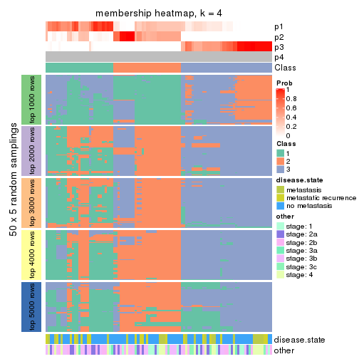</p>

</div>
<div id='tab-ATC-hclust-membership-heatmap-4'>
<pre><code class="r">membership_heatmap(res, k = 5)
</code></pre>

<p></p>

</div>
<div id='tab-ATC-hclust-membership-heatmap-5'>
<pre><code class="r">membership_heatmap(res, k = 6)
</code></pre>

<p></p>

</div>
</div>

As soon as we have had the classes for columns, we can look for signatures
which are significantly different between classes which can be candidate marks
for certain classes. Following are the heatmaps for signatures.


Signature heatmaps where rows are scaled:


<script>
$( function() {
	$( '#tabs-ATC-hclust-get-signatures' ).tabs();
} );
</script>
<div id='tabs-ATC-hclust-get-signatures'>
<ul>
<li><a href='#tab-ATC-hclust-get-signatures-1'>k = 2</a></li>
<li><a href='#tab-ATC-hclust-get-signatures-2'>k = 3</a></li>
<li><a href='#tab-ATC-hclust-get-signatures-3'>k = 4</a></li>
<li><a href='#tab-ATC-hclust-get-signatures-4'>k = 5</a></li>
<li><a href='#tab-ATC-hclust-get-signatures-5'>k = 6</a></li>
</ul>
<div id='tab-ATC-hclust-get-signatures-1'>
<pre><code class="r">get_signatures(res, k = 2)
</code></pre>

<p></p>

</div>
<div id='tab-ATC-hclust-get-signatures-2'>
<pre><code class="r">get_signatures(res, k = 3)
</code></pre>

<p></p>

</div>
<div id='tab-ATC-hclust-get-signatures-3'>
<pre><code class="r">get_signatures(res, k = 4)
</code></pre>

<p></p>

</div>
<div id='tab-ATC-hclust-get-signatures-4'>
<pre><code class="r">get_signatures(res, k = 5)
</code></pre>

<p></p>

</div>
<div id='tab-ATC-hclust-get-signatures-5'>
<pre><code class="r">get_signatures(res, k = 6)
</code></pre>

<p>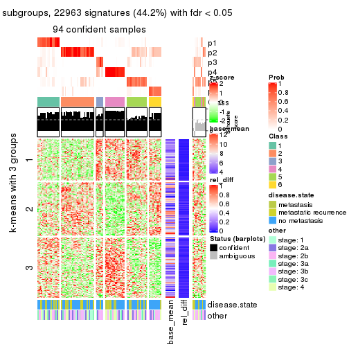</p>

</div>
</div>


Signature heatmaps where rows are not scaled:


<script>
$( function() {
	$( '#tabs-ATC-hclust-get-signatures-no-scale' ).tabs();
} );
</script>
<div id='tabs-ATC-hclust-get-signatures-no-scale'>
<ul>
<li><a href='#tab-ATC-hclust-get-signatures-no-scale-1'>k = 2</a></li>
<li><a href='#tab-ATC-hclust-get-signatures-no-scale-2'>k = 3</a></li>
<li><a href='#tab-ATC-hclust-get-signatures-no-scale-3'>k = 4</a></li>
<li><a href='#tab-ATC-hclust-get-signatures-no-scale-4'>k = 5</a></li>
<li><a href='#tab-ATC-hclust-get-signatures-no-scale-5'>k = 6</a></li>
</ul>
<div id='tab-ATC-hclust-get-signatures-no-scale-1'>
<pre><code class="r">get_signatures(res, k = 2, scale_rows = FALSE)
</code></pre>

<p></p>

</div>
<div id='tab-ATC-hclust-get-signatures-no-scale-2'>
<pre><code class="r">get_signatures(res, k = 3, scale_rows = FALSE)
</code></pre>

<p></p>

</div>
<div id='tab-ATC-hclust-get-signatures-no-scale-3'>
<pre><code class="r">get_signatures(res, k = 4, scale_rows = FALSE)
</code></pre>

<p></p>

</div>
<div id='tab-ATC-hclust-get-signatures-no-scale-4'>
<pre><code class="r">get_signatures(res, k = 5, scale_rows = FALSE)
</code></pre>

<p></p>

</div>
<div id='tab-ATC-hclust-get-signatures-no-scale-5'>
<pre><code class="r">get_signatures(res, k = 6, scale_rows = FALSE)
</code></pre>

<p></p>

</div>
</div>


Compare the overlap of signatures from different k:

```r
compare_signatures(res)
```


`get_signature()` returns a data frame invisibly. TO get the list of signatures, the function
call should be assigned to a variable explicitly. In following code, if `plot` argument is set
to `FALSE`, no heatmap is plotted while only the differential analysis is performed.

```r
# code only for demonstration
tb = get_signature(res, k = ..., plot = FALSE)
```

An example of the output of `tb` is:

```
#>   which_row         fdr    mean_1    mean_2 scaled_mean_1 scaled_mean_2 km
#> 1        38 0.042760348  8.373488  9.131774    -0.5533452     0.5164555  1
#> 2        40 0.018707592  7.106213  8.469186    -0.6173731     0.5762149  1
#> 3        55 0.019134737 10.221463 11.207825    -0.6159697     0.5749050  1
#> 4        59 0.006059896  5.921854  7.869574    -0.6899429     0.6439467  1
#> 5        60 0.018055526  8.928898 10.211722    -0.6204761     0.5791110  1
#> 6        98 0.009384629 15.714769 14.887706     0.6635654    -0.6193277  2
...
```

The columns in `tb` are:

1. `which_row`: row indices corresponding to the input matrix.
2. `fdr`: FDR for the differential test. 
3. `mean_x`: The mean value in group x.
4. `scaled_mean_x`: The mean value in group x after rows are scaled.
5. `km`: Row groups if k-means clustering is applied to rows.


UMAP plot which shows how samples are separated.


<script>
$( function() {
	$( '#tabs-ATC-hclust-dimension-reduction' ).tabs();
} );
</script>
<div id='tabs-ATC-hclust-dimension-reduction'>
<ul>
<li><a href='#tab-ATC-hclust-dimension-reduction-1'>k = 2</a></li>
<li><a href='#tab-ATC-hclust-dimension-reduction-2'>k = 3</a></li>
<li><a href='#tab-ATC-hclust-dimension-reduction-3'>k = 4</a></li>
<li><a href='#tab-ATC-hclust-dimension-reduction-4'>k = 5</a></li>
<li><a href='#tab-ATC-hclust-dimension-reduction-5'>k = 6</a></li>
</ul>
<div id='tab-ATC-hclust-dimension-reduction-1'>
<pre><code class="r">dimension_reduction(res, k = 2, method = &quot;UMAP&quot;)
</code></pre>

<p></p>

</div>
<div id='tab-ATC-hclust-dimension-reduction-2'>
<pre><code class="r">dimension_reduction(res, k = 3, method = &quot;UMAP&quot;)
</code></pre>

<p></p>

</div>
<div id='tab-ATC-hclust-dimension-reduction-3'>
<pre><code class="r">dimension_reduction(res, k = 4, method = &quot;UMAP&quot;)
</code></pre>

<p></p>

</div>
<div id='tab-ATC-hclust-dimension-reduction-4'>
<pre><code class="r">dimension_reduction(res, k = 5, method = &quot;UMAP&quot;)
</code></pre>

<p></p>

</div>
<div id='tab-ATC-hclust-dimension-reduction-5'>
<pre><code class="r">dimension_reduction(res, k = 6, method = &quot;UMAP&quot;)
</code></pre>

<p></p>

</div>
</div>


Following heatmap shows how subgroups are split when increasing `k`:

```r
collect_classes(res)
```


Test correlation between subgroups and known annotations. If the known
annotation is numeric, one-way ANOVA test is applied, and if the known
annotation is discrete, chi-squared contingency table test is applied.

```r
test_to_known_factors(res)
```

```
#>              n disease.state(p) other(p) k
#> ATC:hclust 103            0.347    0.374 2
#> ATC:hclust  61            0.603    0.295 3
#> ATC:hclust  83            0.638    0.516 4
#> ATC:hclust  98            0.318    0.829 5
#> ATC:hclust  94            0.347    0.879 6
```


If matrix rows can be associated to genes, consider to use `functional_enrichment(res,
...)` to perform function enrichment for the signature genes. See [this vignette](http://bioconductor.org/packages/devel/bioc/vignettes/cola/inst/doc/functional_enrichment.html) for more detailed explanations.


 

---------------------------------------------------


### ATC:kmeans**


The object with results only for a single top-value method and a single partition method 
can be extracted as:

```r
res = res_list["ATC", "kmeans"]
# you can also extract it by
# res = res_list["ATC:kmeans"]
```

A summary of `res` and all the functions that can be applied to it:

```r
res
```

```
#> A 'ConsensusPartition' object with k = 2, 3, 4, 5, 6.
#>   On a matrix with 51941 rows and 104 columns.
#>   Top rows (1000, 2000, 3000, 4000, 5000) are extracted by 'ATC' method.
#>   Subgroups are detected by 'kmeans' method.
#>   Performed in total 1250 partitions by row resampling.
#>   Best k for subgroups seems to be 2.
#> 
#> Following methods can be applied to this 'ConsensusPartition' object:
#>  [1] "cola_report"             "collect_classes"         "collect_plots"          
#>  [4] "collect_stats"           "colnames"                "compare_signatures"     
#>  [7] "consensus_heatmap"       "dimension_reduction"     "functional_enrichment"  
#> [10] "get_anno_col"            "get_anno"                "get_classes"            
#> [13] "get_consensus"           "get_matrix"              "get_membership"         
#> [16] "get_param"               "get_signatures"          "get_stats"              
#> [19] "is_best_k"               "is_stable_k"             "membership_heatmap"     
#> [22] "ncol"                    "nrow"                    "plot_ecdf"              
#> [25] "rownames"                "select_partition_number" "show"                   
#> [28] "suggest_best_k"          "test_to_known_factors"
```

`collect_plots()` function collects all the plots made from `res` for all `k` (number of partitions)
into one single page to provide an easy and fast comparison between different `k`.

```r
collect_plots(res)
```


The plots are:

- The first row: a plot of the ECDF (empirical cumulative distribution
  function) curves of the consensus matrix for each `k` and the heatmap of
  predicted classes for each `k`.
- The second row: heatmaps of the consensus matrix for each `k`.
- The third row: heatmaps of the membership matrix for each `k`.
- The fouth row: heatmaps of the signatures for each `k`.

All the plots in panels can be made by individual functions and they are
plotted later in this section.

`select_partition_number()` produces several plots showing different
statistics for choosing "optimized" `k`. There are following statistics:

- ECDF curves of the consensus matrix for each `k`;
- 1-PAC. [The PAC
  score](https://en.wikipedia.org/wiki/Consensus_clustering#Over-interpretation_potential_of_consensus_clustering)
  measures the proportion of the ambiguous subgrouping.
- Mean silhouette score.
- Concordance. The mean probability of fiting the consensus class ids in all
  partitions.
- Area increased. Denote $A_k$ as the area under the ECDF curve for current
  `k`, the area increased is defined as $A_k - A_{k-1}$.
- Rand index. The percent of pairs of samples that are both in a same cluster
  or both are not in a same cluster in the partition of k and k-1.
- Jaccard index. The ratio of pairs of samples are both in a same cluster in
  the partition of k and k-1 and the pairs of samples are both in a same
  cluster in the partition k or k-1.

The detailed explanations of these statistics can be found in [the _cola_
vignette](http://bioconductor.org/packages/devel/bioc/vignettes/cola/inst/doc/cola.html#toc_13).

Generally speaking, lower PAC score, higher mean silhouette score or higher
concordance corresponds to better partition. Rand index and Jaccard index
measure how similar the current partition is compared to partition with `k-1`.
If they are too similar, we won't accept `k` is better than `k-1`.

```r
select_partition_number(res)
```


The numeric values for all these statistics can be obtained by `get_stats()`.

```r
get_stats(res)
```

```
#>   k 1-PAC mean_silhouette concordance area_increased  Rand Jaccard
#> 2 2 1.000           0.998       0.999         0.4960 0.504   0.504
#> 3 3 0.631           0.740       0.856         0.2921 0.751   0.550
#> 4 4 0.595           0.641       0.753         0.1443 0.839   0.582
#> 5 5 0.718           0.733       0.847         0.0742 0.856   0.529
#> 6 6 0.742           0.694       0.813         0.0453 0.902   0.587
```

`suggest_best_k()` suggests the best $k$ based on these statistics. The rules are as follows:

- All $k$ with Jaccard index larger than 0.95 are removed because increasing
  $k$ does not provide enough extra information. If all $k$ are removed, it is
  marked as no subgroup is detected.
- For all $k$ with 1-PAC score larger than 0.9, the maximal $k$ is taken as
  the best $k$, and other $k$ are marked as optional $k$.
- If it does not fit the second rule. The $k$ with the maximal vote of the
  highest 1-PAC score, highest mean silhouette, and highest concordance is
  taken as the best $k$.

```r
suggest_best_k(res)
```

```
#> [1] 2
```


Following shows the table of the partitions (You need to click the **show/hide
code output** link to see it). The membership matrix (columns with name `p*`)
is inferred by
[`clue::cl_consensus()`](https://www.rdocumentation.org/link/cl_consensus?package=clue)
function with the `SE` method. Basically the value in the membership matrix
represents the probability to belong to a certain group. The finall class
label for an item is determined with the group with highest probability it
belongs to.

In `get_classes()` function, the entropy is calculated from the membership
matrix and the silhouette score is calculated from the consensus matrix.


<script>
$( function() {
	$( '#tabs-ATC-kmeans-get-classes' ).tabs();
} );
</script>
<div id='tabs-ATC-kmeans-get-classes'>
<ul>
<li><a href='#tab-ATC-kmeans-get-classes-1'>k = 2</a></li>
<li><a href='#tab-ATC-kmeans-get-classes-2'>k = 3</a></li>
<li><a href='#tab-ATC-kmeans-get-classes-3'>k = 4</a></li>
<li><a href='#tab-ATC-kmeans-get-classes-4'>k = 5</a></li>
<li><a href='#tab-ATC-kmeans-get-classes-5'>k = 6</a></li>
</ul>

<div id='tab-ATC-kmeans-get-classes-1'>
<p><a id='tab-ATC-kmeans-get-classes-1-a' style='color:#0366d6' href='#'>show/hide code output</a></p>
<pre><code class="r">cbind(get_classes(res, k = 2), get_membership(res, k = 2))
</code></pre>

<pre><code>#&gt;           class entropy silhouette    p1    p2
#&gt; GSM537341     2  0.0000      1.000 0.000 1.000
#&gt; GSM537345     1  0.0000      0.998 1.000 0.000
#&gt; GSM537355     1  0.0000      0.998 1.000 0.000
#&gt; GSM537366     1  0.0000      0.998 1.000 0.000
#&gt; GSM537370     2  0.0000      1.000 0.000 1.000
#&gt; GSM537380     2  0.0000      1.000 0.000 1.000
#&gt; GSM537392     2  0.0000      1.000 0.000 1.000
#&gt; GSM537415     1  0.0000      0.998 1.000 0.000
#&gt; GSM537417     1  0.0000      0.998 1.000 0.000
#&gt; GSM537422     1  0.0000      0.998 1.000 0.000
#&gt; GSM537423     1  0.3879      0.918 0.924 0.076
#&gt; GSM537427     2  0.0000      1.000 0.000 1.000
#&gt; GSM537430     2  0.0000      1.000 0.000 1.000
#&gt; GSM537336     1  0.0000      0.998 1.000 0.000
#&gt; GSM537337     2  0.0000      1.000 0.000 1.000
#&gt; GSM537348     2  0.0000      1.000 0.000 1.000
#&gt; GSM537349     2  0.0000      1.000 0.000 1.000
#&gt; GSM537356     1  0.0000      0.998 1.000 0.000
#&gt; GSM537361     1  0.0000      0.998 1.000 0.000
#&gt; GSM537374     2  0.0000      1.000 0.000 1.000
#&gt; GSM537377     2  0.0000      1.000 0.000 1.000
#&gt; GSM537378     2  0.0000      1.000 0.000 1.000
#&gt; GSM537379     2  0.0000      1.000 0.000 1.000
#&gt; GSM537383     2  0.0000      1.000 0.000 1.000
#&gt; GSM537388     2  0.0000      1.000 0.000 1.000
#&gt; GSM537395     2  0.0000      1.000 0.000 1.000
#&gt; GSM537400     2  0.0000      1.000 0.000 1.000
#&gt; GSM537404     1  0.0000      0.998 1.000 0.000
#&gt; GSM537409     1  0.0000      0.998 1.000 0.000
#&gt; GSM537418     1  0.0000      0.998 1.000 0.000
#&gt; GSM537425     1  0.0000      0.998 1.000 0.000
#&gt; GSM537333     2  0.0000      1.000 0.000 1.000
#&gt; GSM537342     1  0.0000      0.998 1.000 0.000
#&gt; GSM537347     2  0.0000      1.000 0.000 1.000
#&gt; GSM537350     1  0.0000      0.998 1.000 0.000
#&gt; GSM537362     2  0.0000      1.000 0.000 1.000
#&gt; GSM537363     1  0.0000      0.998 1.000 0.000
#&gt; GSM537368     1  0.0000      0.998 1.000 0.000
#&gt; GSM537376     2  0.0000      1.000 0.000 1.000
#&gt; GSM537381     2  0.0000      1.000 0.000 1.000
#&gt; GSM537386     2  0.0000      1.000 0.000 1.000
#&gt; GSM537398     2  0.0000      1.000 0.000 1.000
#&gt; GSM537402     2  0.0000      1.000 0.000 1.000
#&gt; GSM537405     1  0.0000      0.998 1.000 0.000
#&gt; GSM537371     1  0.0000      0.998 1.000 0.000
#&gt; GSM537421     1  0.0000      0.998 1.000 0.000
#&gt; GSM537424     2  0.0000      1.000 0.000 1.000
#&gt; GSM537432     2  0.0000      1.000 0.000 1.000
#&gt; GSM537331     2  0.0000      1.000 0.000 1.000
#&gt; GSM537332     2  0.0000      1.000 0.000 1.000
#&gt; GSM537334     2  0.0000      1.000 0.000 1.000
#&gt; GSM537338     2  0.0000      1.000 0.000 1.000
#&gt; GSM537353     1  0.0376      0.995 0.996 0.004
#&gt; GSM537357     1  0.0000      0.998 1.000 0.000
#&gt; GSM537358     2  0.0000      1.000 0.000 1.000
#&gt; GSM537375     2  0.0000      1.000 0.000 1.000
#&gt; GSM537389     2  0.0000      1.000 0.000 1.000
#&gt; GSM537390     2  0.0000      1.000 0.000 1.000
#&gt; GSM537393     2  0.0000      1.000 0.000 1.000
#&gt; GSM537399     2  0.0000      1.000 0.000 1.000
#&gt; GSM537407     2  0.0000      1.000 0.000 1.000
#&gt; GSM537408     1  0.0000      0.998 1.000 0.000
#&gt; GSM537428     2  0.0000      1.000 0.000 1.000
#&gt; GSM537354     1  0.0000      0.998 1.000 0.000
#&gt; GSM537410     1  0.0000      0.998 1.000 0.000
#&gt; GSM537413     2  0.0000      1.000 0.000 1.000
#&gt; GSM537396     2  0.0000      1.000 0.000 1.000
#&gt; GSM537397     2  0.0000      1.000 0.000 1.000
#&gt; GSM537330     2  0.0000      1.000 0.000 1.000
#&gt; GSM537369     1  0.0000      0.998 1.000 0.000
#&gt; GSM537373     1  0.0000      0.998 1.000 0.000
#&gt; GSM537401     2  0.0000      1.000 0.000 1.000
#&gt; GSM537343     1  0.0000      0.998 1.000 0.000
#&gt; GSM537367     1  0.0000      0.998 1.000 0.000
#&gt; GSM537382     2  0.0000      1.000 0.000 1.000
#&gt; GSM537385     2  0.0000      1.000 0.000 1.000
#&gt; GSM537391     2  0.0000      1.000 0.000 1.000
#&gt; GSM537419     2  0.0000      1.000 0.000 1.000
#&gt; GSM537420     1  0.0000      0.998 1.000 0.000
#&gt; GSM537429     2  0.0000      1.000 0.000 1.000
#&gt; GSM537431     2  0.0000      1.000 0.000 1.000
#&gt; GSM537387     2  0.0000      1.000 0.000 1.000
#&gt; GSM537414     1  0.0000      0.998 1.000 0.000
#&gt; GSM537433     1  0.0000      0.998 1.000 0.000
#&gt; GSM537335     2  0.0000      1.000 0.000 1.000
#&gt; GSM537339     2  0.0000      1.000 0.000 1.000
#&gt; GSM537340     1  0.0000      0.998 1.000 0.000
#&gt; GSM537344     1  0.0000      0.998 1.000 0.000
#&gt; GSM537346     2  0.0000      1.000 0.000 1.000
#&gt; GSM537351     1  0.0000      0.998 1.000 0.000
#&gt; GSM537352     1  0.0000      0.998 1.000 0.000
#&gt; GSM537359     2  0.0000      1.000 0.000 1.000
#&gt; GSM537360     1  0.0000      0.998 1.000 0.000
#&gt; GSM537364     1  0.0000      0.998 1.000 0.000
#&gt; GSM537365     1  0.0376      0.995 0.996 0.004
#&gt; GSM537372     2  0.0000      1.000 0.000 1.000
#&gt; GSM537384     2  0.0000      1.000 0.000 1.000
#&gt; GSM537394     2  0.0000      1.000 0.000 1.000
#&gt; GSM537403     1  0.0000      0.998 1.000 0.000
#&gt; GSM537406     1  0.0000      0.998 1.000 0.000
#&gt; GSM537411     2  0.0000      1.000 0.000 1.000
#&gt; GSM537412     1  0.0000      0.998 1.000 0.000
#&gt; GSM537416     1  0.0000      0.998 1.000 0.000
#&gt; GSM537426     1  0.0000      0.998 1.000 0.000
</code></pre>

<script>
$('#tab-ATC-kmeans-get-classes-1-a').parent().next().next().hide();
$('#tab-ATC-kmeans-get-classes-1-a').click(function(){
  $('#tab-ATC-kmeans-get-classes-1-a').parent().next().next().toggle();
  return(false);
});
</script>
</div>

<div id='tab-ATC-kmeans-get-classes-2'>
<p><a id='tab-ATC-kmeans-get-classes-2-a' style='color:#0366d6' href='#'>show/hide code output</a></p>
<pre><code class="r">cbind(get_classes(res, k = 3), get_membership(res, k = 3))
</code></pre>

<pre><code>#&gt;           class entropy silhouette    p1    p2    p3
#&gt; GSM537341     1  0.5591    0.76624 0.696 0.304 0.000
#&gt; GSM537345     3  0.0000    0.99682 0.000 0.000 1.000
#&gt; GSM537355     2  0.1163    0.77602 0.000 0.972 0.028
#&gt; GSM537366     3  0.0000    0.99682 0.000 0.000 1.000
#&gt; GSM537370     1  0.2261    0.78932 0.932 0.068 0.000
#&gt; GSM537380     1  0.5397    0.77138 0.720 0.280 0.000
#&gt; GSM537392     1  0.5529    0.76063 0.704 0.296 0.000
#&gt; GSM537415     2  0.5859    0.46811 0.000 0.656 0.344
#&gt; GSM537417     3  0.0424    0.99022 0.000 0.008 0.992
#&gt; GSM537422     3  0.0000    0.99682 0.000 0.000 1.000
#&gt; GSM537423     2  0.0829    0.77039 0.004 0.984 0.012
#&gt; GSM537427     1  0.5529    0.76063 0.704 0.296 0.000
#&gt; GSM537430     1  0.0237    0.77637 0.996 0.004 0.000
#&gt; GSM537336     3  0.0000    0.99682 0.000 0.000 1.000
#&gt; GSM537337     2  0.0892    0.76160 0.020 0.980 0.000
#&gt; GSM537348     1  0.5882    0.74247 0.652 0.348 0.000
#&gt; GSM537349     1  0.5882    0.72325 0.652 0.348 0.000
#&gt; GSM537356     2  0.1411    0.77683 0.000 0.964 0.036
#&gt; GSM537361     2  0.6252    0.25105 0.000 0.556 0.444
#&gt; GSM537374     1  0.0892    0.77636 0.980 0.020 0.000
#&gt; GSM537377     1  0.5835    0.74801 0.660 0.340 0.000
#&gt; GSM537378     2  0.6274   -0.30369 0.456 0.544 0.000
#&gt; GSM537379     1  0.5560    0.77507 0.700 0.300 0.000
#&gt; GSM537383     1  0.0892    0.78195 0.980 0.020 0.000
#&gt; GSM537388     1  0.0892    0.78195 0.980 0.020 0.000
#&gt; GSM537395     2  0.0892    0.76160 0.020 0.980 0.000
#&gt; GSM537400     1  0.0237    0.77637 0.996 0.004 0.000
#&gt; GSM537404     3  0.0892    0.97849 0.000 0.020 0.980
#&gt; GSM537409     2  0.1753    0.77540 0.000 0.952 0.048
#&gt; GSM537418     2  0.1753    0.77540 0.000 0.952 0.048
#&gt; GSM537425     3  0.0000    0.99682 0.000 0.000 1.000
#&gt; GSM537333     1  0.0892    0.77636 0.980 0.020 0.000
#&gt; GSM537342     2  0.6062    0.39172 0.000 0.616 0.384
#&gt; GSM537347     1  0.5785    0.75312 0.668 0.332 0.000
#&gt; GSM537350     3  0.0592    0.98665 0.000 0.012 0.988
#&gt; GSM537362     1  0.5733    0.75874 0.676 0.324 0.000
#&gt; GSM537363     3  0.0000    0.99682 0.000 0.000 1.000
#&gt; GSM537368     3  0.0000    0.99682 0.000 0.000 1.000
#&gt; GSM537376     1  0.5529    0.77671 0.704 0.296 0.000
#&gt; GSM537381     1  0.6204    0.64857 0.576 0.424 0.000
#&gt; GSM537386     1  0.0000    0.77590 1.000 0.000 0.000
#&gt; GSM537398     1  0.0892    0.77636 0.980 0.020 0.000
#&gt; GSM537402     2  0.0000    0.76495 0.000 1.000 0.000
#&gt; GSM537405     3  0.0892    0.97849 0.000 0.020 0.980
#&gt; GSM537371     3  0.0000    0.99682 0.000 0.000 1.000
#&gt; GSM537421     3  0.0000    0.99682 0.000 0.000 1.000
#&gt; GSM537424     2  0.0000    0.76495 0.000 1.000 0.000
#&gt; GSM537432     1  0.0892    0.77636 0.980 0.020 0.000
#&gt; GSM537331     1  0.0000    0.77590 1.000 0.000 0.000
#&gt; GSM537332     1  0.3038    0.79267 0.896 0.104 0.000
#&gt; GSM537334     1  0.0237    0.77637 0.996 0.004 0.000
#&gt; GSM537338     1  0.4346    0.79405 0.816 0.184 0.000
#&gt; GSM537353     2  0.0592    0.77076 0.000 0.988 0.012
#&gt; GSM537357     3  0.0000    0.99682 0.000 0.000 1.000
#&gt; GSM537358     2  0.0000    0.76495 0.000 1.000 0.000
#&gt; GSM537375     1  0.5560    0.77507 0.700 0.300 0.000
#&gt; GSM537389     2  0.6215   -0.20438 0.428 0.572 0.000
#&gt; GSM537390     2  0.6260   -0.26919 0.448 0.552 0.000
#&gt; GSM537393     2  0.4750    0.49128 0.216 0.784 0.000
#&gt; GSM537399     1  0.0892    0.77636 0.980 0.020 0.000
#&gt; GSM537407     1  0.5926    0.72198 0.644 0.356 0.000
#&gt; GSM537408     2  0.1289    0.77664 0.000 0.968 0.032
#&gt; GSM537428     2  0.0000    0.76495 0.000 1.000 0.000
#&gt; GSM537354     2  0.5859    0.46811 0.000 0.656 0.344
#&gt; GSM537410     3  0.0000    0.99682 0.000 0.000 1.000
#&gt; GSM537413     1  0.5465    0.76397 0.712 0.288 0.000
#&gt; GSM537396     1  0.6252    0.59344 0.556 0.444 0.000
#&gt; GSM537397     1  0.6267    0.57455 0.548 0.452 0.000
#&gt; GSM537330     1  0.0892    0.78195 0.980 0.020 0.000
#&gt; GSM537369     2  0.1529    0.77672 0.000 0.960 0.040
#&gt; GSM537373     2  0.1289    0.77664 0.000 0.968 0.032
#&gt; GSM537401     1  0.5785    0.75427 0.668 0.332 0.000
#&gt; GSM537343     2  0.4178    0.69394 0.000 0.828 0.172
#&gt; GSM537367     3  0.0000    0.99682 0.000 0.000 1.000
#&gt; GSM537382     1  0.5591    0.76365 0.696 0.304 0.000
#&gt; GSM537385     1  0.5785    0.74189 0.668 0.332 0.000
#&gt; GSM537391     1  0.6235    0.62622 0.564 0.436 0.000
#&gt; GSM537419     2  0.0237    0.76231 0.004 0.996 0.000
#&gt; GSM537420     2  0.6260    0.24415 0.000 0.552 0.448
#&gt; GSM537429     1  0.2625    0.79115 0.916 0.084 0.000
#&gt; GSM537431     1  0.1031    0.77706 0.976 0.024 0.000
#&gt; GSM537387     1  0.6126    0.66661 0.600 0.400 0.000
#&gt; GSM537414     2  0.5810    0.48199 0.000 0.664 0.336
#&gt; GSM537433     3  0.0000    0.99682 0.000 0.000 1.000
#&gt; GSM537335     1  0.0000    0.77590 1.000 0.000 0.000
#&gt; GSM537339     1  0.4974    0.78617 0.764 0.236 0.000
#&gt; GSM537340     3  0.0000    0.99682 0.000 0.000 1.000
#&gt; GSM537344     2  0.4504    0.67370 0.000 0.804 0.196
#&gt; GSM537346     1  0.0892    0.78195 0.980 0.020 0.000
#&gt; GSM537351     3  0.0000    0.99682 0.000 0.000 1.000
#&gt; GSM537352     2  0.1289    0.77664 0.000 0.968 0.032
#&gt; GSM537359     2  0.5926    0.00921 0.356 0.644 0.000
#&gt; GSM537360     2  0.6305    0.15034 0.000 0.516 0.484
#&gt; GSM537364     3  0.0000    0.99682 0.000 0.000 1.000
#&gt; GSM537365     2  0.0424    0.76938 0.000 0.992 0.008
#&gt; GSM537372     1  0.5810    0.75079 0.664 0.336 0.000
#&gt; GSM537384     1  0.5810    0.75412 0.664 0.336 0.000
#&gt; GSM537394     1  0.0592    0.78049 0.988 0.012 0.000
#&gt; GSM537403     3  0.0000    0.99682 0.000 0.000 1.000
#&gt; GSM537406     3  0.0000    0.99682 0.000 0.000 1.000
#&gt; GSM537411     1  0.1031    0.77706 0.976 0.024 0.000
#&gt; GSM537412     3  0.0000    0.99682 0.000 0.000 1.000
#&gt; GSM537416     2  0.5859    0.46811 0.000 0.656 0.344
#&gt; GSM537426     2  0.1753    0.77540 0.000 0.952 0.048
</code></pre>

<script>
$('#tab-ATC-kmeans-get-classes-2-a').parent().next().next().hide();
$('#tab-ATC-kmeans-get-classes-2-a').click(function(){
  $('#tab-ATC-kmeans-get-classes-2-a').parent().next().next().toggle();
  return(false);
});
</script>
</div>

<div id='tab-ATC-kmeans-get-classes-3'>
<p><a id='tab-ATC-kmeans-get-classes-3-a' style='color:#0366d6' href='#'>show/hide code output</a></p>
<pre><code class="r">cbind(get_classes(res, k = 4), get_membership(res, k = 4))
</code></pre>

<pre><code>#&gt;           class entropy silhouette    p1    p2    p3    p4
#&gt; GSM537341     2  0.5093     0.5537 0.012 0.640 0.000 0.348
#&gt; GSM537345     3  0.1388     0.9560 0.012 0.028 0.960 0.000
#&gt; GSM537355     1  0.4072     0.7655 0.748 0.252 0.000 0.000
#&gt; GSM537366     3  0.0000     0.9621 0.000 0.000 1.000 0.000
#&gt; GSM537370     2  0.5147     0.3560 0.004 0.536 0.000 0.460
#&gt; GSM537380     2  0.5980     0.4533 0.044 0.560 0.000 0.396
#&gt; GSM537392     2  0.6296     0.4463 0.064 0.548 0.000 0.388
#&gt; GSM537415     1  0.2469     0.7309 0.892 0.000 0.108 0.000
#&gt; GSM537417     3  0.2021     0.9344 0.040 0.024 0.936 0.000
#&gt; GSM537422     3  0.0000     0.9621 0.000 0.000 1.000 0.000
#&gt; GSM537423     1  0.2704     0.7534 0.876 0.124 0.000 0.000
#&gt; GSM537427     2  0.6296     0.4463 0.064 0.548 0.000 0.388
#&gt; GSM537430     4  0.0000     0.7188 0.000 0.000 0.000 1.000
#&gt; GSM537336     3  0.0592     0.9587 0.000 0.016 0.984 0.000
#&gt; GSM537337     1  0.3172     0.7299 0.840 0.160 0.000 0.000
#&gt; GSM537348     2  0.5532     0.5098 0.068 0.704 0.000 0.228
#&gt; GSM537349     2  0.6156     0.5058 0.064 0.592 0.000 0.344
#&gt; GSM537356     1  0.4730     0.7087 0.636 0.364 0.000 0.000
#&gt; GSM537361     1  0.6219     0.6182 0.520 0.432 0.044 0.004
#&gt; GSM537374     4  0.1792     0.6954 0.000 0.068 0.000 0.932
#&gt; GSM537377     2  0.5042     0.4461 0.096 0.768 0.000 0.136
#&gt; GSM537378     2  0.7114     0.4549 0.232 0.564 0.000 0.204
#&gt; GSM537379     2  0.4957     0.5459 0.016 0.684 0.000 0.300
#&gt; GSM537383     4  0.4730     0.2096 0.000 0.364 0.000 0.636
#&gt; GSM537388     4  0.4746     0.1900 0.000 0.368 0.000 0.632
#&gt; GSM537395     1  0.3266     0.7242 0.832 0.168 0.000 0.000
#&gt; GSM537400     4  0.0000     0.7188 0.000 0.000 0.000 1.000
#&gt; GSM537404     3  0.5476     0.7006 0.120 0.144 0.736 0.000
#&gt; GSM537409     1  0.2473     0.7284 0.908 0.080 0.012 0.000
#&gt; GSM537418     1  0.1452     0.7577 0.956 0.036 0.008 0.000
#&gt; GSM537425     3  0.1388     0.9560 0.012 0.028 0.960 0.000
#&gt; GSM537333     4  0.1474     0.7042 0.000 0.052 0.000 0.948
#&gt; GSM537342     1  0.4562     0.7080 0.792 0.056 0.152 0.000
#&gt; GSM537347     2  0.5265     0.4514 0.092 0.748 0.000 0.160
#&gt; GSM537350     3  0.2197     0.9274 0.048 0.024 0.928 0.000
#&gt; GSM537362     2  0.5744     0.5088 0.068 0.676 0.000 0.256
#&gt; GSM537363     3  0.0336     0.9607 0.000 0.008 0.992 0.000
#&gt; GSM537368     3  0.0000     0.9621 0.000 0.000 1.000 0.000
#&gt; GSM537376     2  0.5062     0.5457 0.020 0.680 0.000 0.300
#&gt; GSM537381     2  0.4500     0.5604 0.032 0.776 0.000 0.192
#&gt; GSM537386     4  0.0188     0.7175 0.000 0.004 0.000 0.996
#&gt; GSM537398     4  0.1716     0.6979 0.000 0.064 0.000 0.936
#&gt; GSM537402     1  0.4454     0.7379 0.692 0.308 0.000 0.000
#&gt; GSM537405     3  0.4906     0.7605 0.084 0.140 0.776 0.000
#&gt; GSM537371     3  0.1284     0.9570 0.012 0.024 0.964 0.000
#&gt; GSM537421     3  0.2222     0.9288 0.060 0.016 0.924 0.000
#&gt; GSM537424     1  0.4999     0.5591 0.508 0.492 0.000 0.000
#&gt; GSM537432     4  0.4040     0.4889 0.000 0.248 0.000 0.752
#&gt; GSM537331     4  0.0188     0.7175 0.000 0.004 0.000 0.996
#&gt; GSM537332     2  0.5158     0.3281 0.004 0.524 0.000 0.472
#&gt; GSM537334     4  0.0000     0.7188 0.000 0.000 0.000 1.000
#&gt; GSM537338     2  0.5253     0.4890 0.016 0.624 0.000 0.360
#&gt; GSM537353     1  0.2469     0.7807 0.892 0.108 0.000 0.000
#&gt; GSM537357     3  0.1059     0.9578 0.012 0.016 0.972 0.000
#&gt; GSM537358     1  0.4843     0.6696 0.604 0.396 0.000 0.000
#&gt; GSM537375     2  0.5308     0.5500 0.036 0.684 0.000 0.280
#&gt; GSM537389     2  0.7031     0.4171 0.288 0.556 0.000 0.156
#&gt; GSM537390     2  0.7137     0.4372 0.256 0.556 0.000 0.188
#&gt; GSM537393     2  0.6264     0.3689 0.376 0.560 0.000 0.064
#&gt; GSM537399     4  0.1792     0.6954 0.000 0.068 0.000 0.932
#&gt; GSM537407     2  0.6170     0.2729 0.136 0.672 0.000 0.192
#&gt; GSM537408     1  0.3975     0.7700 0.760 0.240 0.000 0.000
#&gt; GSM537428     1  0.4972     0.6106 0.544 0.456 0.000 0.000
#&gt; GSM537354     1  0.2408     0.7340 0.896 0.000 0.104 0.000
#&gt; GSM537410     3  0.1610     0.9446 0.032 0.016 0.952 0.000
#&gt; GSM537413     2  0.6296     0.4463 0.064 0.548 0.000 0.388
#&gt; GSM537396     2  0.4988     0.5791 0.036 0.728 0.000 0.236
#&gt; GSM537397     2  0.5387     0.5711 0.048 0.696 0.000 0.256
#&gt; GSM537330     4  0.4713     0.2165 0.000 0.360 0.000 0.640
#&gt; GSM537369     1  0.4193     0.7624 0.732 0.268 0.000 0.000
#&gt; GSM537373     1  0.2704     0.7812 0.876 0.124 0.000 0.000
#&gt; GSM537401     2  0.5596     0.5118 0.068 0.696 0.000 0.236
#&gt; GSM537343     1  0.3945     0.7737 0.780 0.216 0.004 0.000
#&gt; GSM537367     3  0.0000     0.9621 0.000 0.000 1.000 0.000
#&gt; GSM537382     2  0.5423     0.5389 0.028 0.640 0.000 0.332
#&gt; GSM537385     2  0.5453     0.5477 0.032 0.648 0.000 0.320
#&gt; GSM537391     2  0.5091     0.5138 0.068 0.752 0.000 0.180
#&gt; GSM537419     2  0.4877    -0.0501 0.328 0.664 0.000 0.008
#&gt; GSM537420     1  0.6114     0.6254 0.524 0.428 0.048 0.000
#&gt; GSM537429     2  0.5288     0.3286 0.008 0.520 0.000 0.472
#&gt; GSM537431     4  0.3942     0.5002 0.000 0.236 0.000 0.764
#&gt; GSM537387     2  0.5021     0.5817 0.036 0.724 0.000 0.240
#&gt; GSM537414     1  0.2408     0.7340 0.896 0.000 0.104 0.000
#&gt; GSM537433     3  0.0000     0.9621 0.000 0.000 1.000 0.000
#&gt; GSM537335     4  0.0469     0.7118 0.000 0.012 0.000 0.988
#&gt; GSM537339     2  0.5257     0.3878 0.008 0.548 0.000 0.444
#&gt; GSM537340     3  0.0000     0.9621 0.000 0.000 1.000 0.000
#&gt; GSM537344     1  0.4792     0.7406 0.680 0.312 0.008 0.000
#&gt; GSM537346     4  0.4477     0.3361 0.000 0.312 0.000 0.688
#&gt; GSM537351     3  0.0937     0.9589 0.012 0.012 0.976 0.000
#&gt; GSM537352     1  0.1474     0.7776 0.948 0.052 0.000 0.000
#&gt; GSM537359     2  0.5851     0.1632 0.236 0.680 0.000 0.084
#&gt; GSM537360     1  0.3400     0.6704 0.820 0.000 0.180 0.000
#&gt; GSM537364     3  0.0000     0.9621 0.000 0.000 1.000 0.000
#&gt; GSM537365     1  0.4804     0.6919 0.616 0.384 0.000 0.000
#&gt; GSM537372     2  0.4834     0.4314 0.096 0.784 0.000 0.120
#&gt; GSM537384     2  0.5358     0.5535 0.048 0.700 0.000 0.252
#&gt; GSM537394     4  0.4925    -0.0978 0.000 0.428 0.000 0.572
#&gt; GSM537403     3  0.0000     0.9621 0.000 0.000 1.000 0.000
#&gt; GSM537406     3  0.0188     0.9613 0.000 0.004 0.996 0.000
#&gt; GSM537411     4  0.4978     0.3738 0.012 0.324 0.000 0.664
#&gt; GSM537412     3  0.0000     0.9621 0.000 0.000 1.000 0.000
#&gt; GSM537416     1  0.2469     0.7309 0.892 0.000 0.108 0.000
#&gt; GSM537426     1  0.2473     0.7284 0.908 0.080 0.012 0.000
</code></pre>

<script>
$('#tab-ATC-kmeans-get-classes-3-a').parent().next().next().hide();
$('#tab-ATC-kmeans-get-classes-3-a').click(function(){
  $('#tab-ATC-kmeans-get-classes-3-a').parent().next().next().toggle();
  return(false);
});
</script>
</div>

<div id='tab-ATC-kmeans-get-classes-4'>
<p><a id='tab-ATC-kmeans-get-classes-4-a' style='color:#0366d6' href='#'>show/hide code output</a></p>
<pre><code class="r">cbind(get_classes(res, k = 5), get_membership(res, k = 5))
</code></pre>

<pre><code>#&gt;           class entropy silhouette    p1    p2    p3    p4    p5
#&gt; GSM537341     2  0.4031     0.6957 0.000 0.788 0.048 0.004 0.160
#&gt; GSM537345     1  0.2941     0.8776 0.884 0.000 0.020 0.032 0.064
#&gt; GSM537355     5  0.4118     0.2894 0.000 0.000 0.004 0.336 0.660
#&gt; GSM537366     1  0.0510     0.9081 0.984 0.000 0.016 0.000 0.000
#&gt; GSM537370     2  0.1788     0.8193 0.000 0.932 0.056 0.004 0.008
#&gt; GSM537380     2  0.1408     0.8248 0.000 0.948 0.044 0.008 0.000
#&gt; GSM537392     2  0.1725     0.8230 0.000 0.936 0.044 0.020 0.000
#&gt; GSM537415     4  0.0794     0.8583 0.028 0.000 0.000 0.972 0.000
#&gt; GSM537417     1  0.4037     0.7816 0.784 0.000 0.012 0.028 0.176
#&gt; GSM537422     1  0.0000     0.9071 1.000 0.000 0.000 0.000 0.000
#&gt; GSM537423     4  0.1981     0.8468 0.000 0.016 0.000 0.920 0.064
#&gt; GSM537427     2  0.1725     0.8230 0.000 0.936 0.044 0.020 0.000
#&gt; GSM537430     3  0.1410     0.9292 0.000 0.060 0.940 0.000 0.000
#&gt; GSM537336     1  0.0290     0.9062 0.992 0.000 0.008 0.000 0.000
#&gt; GSM537337     4  0.2104     0.8352 0.000 0.060 0.000 0.916 0.024
#&gt; GSM537348     5  0.5808     0.4199 0.000 0.320 0.100 0.004 0.576
#&gt; GSM537349     2  0.1646     0.8257 0.000 0.944 0.032 0.020 0.004
#&gt; GSM537356     5  0.3354     0.5713 0.004 0.004 0.012 0.152 0.828
#&gt; GSM537361     5  0.2032     0.6596 0.004 0.000 0.020 0.052 0.924
#&gt; GSM537374     3  0.1282     0.9251 0.000 0.044 0.952 0.004 0.000
#&gt; GSM537377     5  0.5030     0.6100 0.000 0.220 0.080 0.004 0.696
#&gt; GSM537378     2  0.2102     0.8122 0.000 0.916 0.004 0.068 0.012
#&gt; GSM537379     2  0.5287     0.4926 0.000 0.656 0.068 0.008 0.268
#&gt; GSM537383     2  0.2605     0.7602 0.000 0.852 0.148 0.000 0.000
#&gt; GSM537388     2  0.2911     0.7558 0.000 0.852 0.136 0.004 0.008
#&gt; GSM537395     4  0.2208     0.8268 0.000 0.072 0.000 0.908 0.020
#&gt; GSM537400     3  0.2116     0.9178 0.000 0.076 0.912 0.004 0.008
#&gt; GSM537404     1  0.5651     0.3488 0.512 0.000 0.016 0.044 0.428
#&gt; GSM537409     4  0.0771     0.8580 0.004 0.020 0.000 0.976 0.000
#&gt; GSM537418     4  0.0854     0.8592 0.004 0.012 0.000 0.976 0.008
#&gt; GSM537425     1  0.2507     0.8873 0.908 0.000 0.020 0.028 0.044
#&gt; GSM537333     3  0.1430     0.9281 0.000 0.052 0.944 0.000 0.004
#&gt; GSM537342     4  0.3456     0.8054 0.036 0.000 0.012 0.844 0.108
#&gt; GSM537347     5  0.5036     0.6196 0.000 0.200 0.092 0.004 0.704
#&gt; GSM537350     1  0.3928     0.7817 0.788 0.000 0.008 0.028 0.176
#&gt; GSM537362     5  0.5778     0.4235 0.000 0.324 0.096 0.004 0.576
#&gt; GSM537363     1  0.0510     0.9081 0.984 0.000 0.016 0.000 0.000
#&gt; GSM537368     1  0.0510     0.9081 0.984 0.000 0.016 0.000 0.000
#&gt; GSM537376     2  0.5514     0.4308 0.000 0.620 0.064 0.012 0.304
#&gt; GSM537381     2  0.5624     0.3494 0.000 0.580 0.060 0.012 0.348
#&gt; GSM537386     3  0.1792     0.9191 0.000 0.084 0.916 0.000 0.000
#&gt; GSM537398     3  0.1197     0.9267 0.000 0.048 0.952 0.000 0.000
#&gt; GSM537402     5  0.4301     0.4907 0.000 0.028 0.000 0.260 0.712
#&gt; GSM537405     1  0.5511     0.4298 0.548 0.000 0.012 0.044 0.396
#&gt; GSM537371     1  0.1725     0.8942 0.936 0.000 0.020 0.000 0.044
#&gt; GSM537421     1  0.2439     0.8438 0.876 0.000 0.004 0.120 0.000
#&gt; GSM537424     5  0.3553     0.7092 0.000 0.084 0.020 0.048 0.848
#&gt; GSM537432     3  0.5295     0.5427 0.000 0.280 0.648 0.008 0.064
#&gt; GSM537331     3  0.1851     0.9162 0.000 0.088 0.912 0.000 0.000
#&gt; GSM537332     2  0.1983     0.8144 0.000 0.924 0.060 0.008 0.008
#&gt; GSM537334     3  0.1410     0.9292 0.000 0.060 0.940 0.000 0.000
#&gt; GSM537338     2  0.6030     0.2994 0.000 0.548 0.104 0.008 0.340
#&gt; GSM537353     4  0.3366     0.7183 0.000 0.000 0.000 0.768 0.232
#&gt; GSM537357     1  0.1168     0.8995 0.960 0.000 0.008 0.032 0.000
#&gt; GSM537358     5  0.3248     0.6807 0.000 0.040 0.004 0.104 0.852
#&gt; GSM537375     2  0.5590     0.4126 0.000 0.608 0.076 0.008 0.308
#&gt; GSM537389     2  0.2127     0.7910 0.000 0.892 0.000 0.108 0.000
#&gt; GSM537390     2  0.2020     0.7961 0.000 0.900 0.000 0.100 0.000
#&gt; GSM537393     2  0.3010     0.7401 0.000 0.824 0.000 0.172 0.004
#&gt; GSM537399     3  0.1571     0.9203 0.000 0.060 0.936 0.004 0.000
#&gt; GSM537407     5  0.3197     0.7062 0.000 0.052 0.076 0.008 0.864
#&gt; GSM537408     5  0.4425     0.0939 0.000 0.000 0.008 0.392 0.600
#&gt; GSM537428     5  0.2696     0.7030 0.000 0.040 0.012 0.052 0.896
#&gt; GSM537354     4  0.0865     0.8605 0.024 0.000 0.000 0.972 0.004
#&gt; GSM537410     1  0.3053     0.8642 0.872 0.000 0.008 0.044 0.076
#&gt; GSM537413     2  0.1725     0.8230 0.000 0.936 0.044 0.020 0.000
#&gt; GSM537396     2  0.2312     0.8064 0.000 0.912 0.016 0.012 0.060
#&gt; GSM537397     2  0.1731     0.8156 0.000 0.940 0.008 0.012 0.040
#&gt; GSM537330     2  0.2911     0.7563 0.000 0.852 0.136 0.004 0.008
#&gt; GSM537369     4  0.5148     0.3209 0.004 0.012 0.012 0.508 0.464
#&gt; GSM537373     4  0.3521     0.7228 0.000 0.000 0.004 0.764 0.232
#&gt; GSM537401     5  0.5808     0.4199 0.000 0.320 0.100 0.004 0.576
#&gt; GSM537343     4  0.4779     0.3685 0.004 0.000 0.012 0.536 0.448
#&gt; GSM537367     1  0.0510     0.9081 0.984 0.000 0.016 0.000 0.000
#&gt; GSM537382     2  0.0693     0.8235 0.000 0.980 0.000 0.008 0.012
#&gt; GSM537385     2  0.1419     0.8222 0.000 0.956 0.016 0.012 0.016
#&gt; GSM537391     5  0.5468     0.4212 0.000 0.332 0.060 0.008 0.600
#&gt; GSM537419     5  0.3142     0.7082 0.000 0.076 0.004 0.056 0.864
#&gt; GSM537420     5  0.1857     0.6601 0.004 0.000 0.008 0.060 0.928
#&gt; GSM537429     2  0.1983     0.8144 0.000 0.924 0.060 0.008 0.008
#&gt; GSM537431     3  0.3663     0.7662 0.000 0.044 0.820 0.004 0.132
#&gt; GSM537387     2  0.2444     0.7975 0.000 0.904 0.016 0.012 0.068
#&gt; GSM537414     4  0.0865     0.8605 0.024 0.000 0.000 0.972 0.004
#&gt; GSM537433     1  0.0510     0.9081 0.984 0.000 0.016 0.000 0.000
#&gt; GSM537335     3  0.1851     0.9162 0.000 0.088 0.912 0.000 0.000
#&gt; GSM537339     2  0.1341     0.8226 0.000 0.944 0.056 0.000 0.000
#&gt; GSM537340     1  0.0510     0.9081 0.984 0.000 0.016 0.000 0.000
#&gt; GSM537344     5  0.3962     0.4363 0.004 0.000 0.012 0.240 0.744
#&gt; GSM537346     2  0.3328     0.7084 0.000 0.812 0.176 0.004 0.008
#&gt; GSM537351     1  0.1281     0.8993 0.956 0.000 0.012 0.032 0.000
#&gt; GSM537352     4  0.1908     0.8393 0.000 0.000 0.000 0.908 0.092
#&gt; GSM537359     5  0.2804     0.7091 0.000 0.048 0.044 0.016 0.892
#&gt; GSM537360     4  0.1518     0.8465 0.048 0.000 0.004 0.944 0.004
#&gt; GSM537364     1  0.0510     0.9081 0.984 0.000 0.016 0.000 0.000
#&gt; GSM537365     5  0.3177     0.5551 0.000 0.000 0.000 0.208 0.792
#&gt; GSM537372     5  0.4219     0.6699 0.000 0.156 0.072 0.000 0.772
#&gt; GSM537384     2  0.5654     0.3797 0.000 0.592 0.076 0.008 0.324
#&gt; GSM537394     2  0.2408     0.7973 0.000 0.892 0.096 0.004 0.008
#&gt; GSM537403     1  0.0609     0.9074 0.980 0.000 0.020 0.000 0.000
#&gt; GSM537406     1  0.1648     0.8976 0.940 0.000 0.020 0.000 0.040
#&gt; GSM537411     5  0.5471     0.2031 0.000 0.052 0.428 0.004 0.516
#&gt; GSM537412     1  0.0510     0.9081 0.984 0.000 0.016 0.000 0.000
#&gt; GSM537416     4  0.0794     0.8583 0.028 0.000 0.000 0.972 0.000
#&gt; GSM537426     4  0.0771     0.8580 0.004 0.020 0.000 0.976 0.000
</code></pre>

<script>
$('#tab-ATC-kmeans-get-classes-4-a').parent().next().next().hide();
$('#tab-ATC-kmeans-get-classes-4-a').click(function(){
  $('#tab-ATC-kmeans-get-classes-4-a').parent().next().next().toggle();
  return(false);
});
</script>
</div>

<div id='tab-ATC-kmeans-get-classes-5'>
<p><a id='tab-ATC-kmeans-get-classes-5-a' style='color:#0366d6' href='#'>show/hide code output</a></p>
<pre><code class="r">cbind(get_classes(res, k = 6), get_membership(res, k = 6))
</code></pre>

<pre><code>#&gt;           class entropy silhouette    p1    p2    p3    p4    p5    p6
#&gt; GSM537341     5  0.4264     0.1259 0.000 0.492 0.000 0.000 0.492 0.016
#&gt; GSM537345     4  0.5057     0.6586 0.012 0.004 0.304 0.632 0.024 0.024
#&gt; GSM537355     3  0.5769     0.5894 0.188 0.004 0.552 0.000 0.252 0.004
#&gt; GSM537366     4  0.0000     0.8663 0.000 0.000 0.000 1.000 0.000 0.000
#&gt; GSM537370     2  0.1798     0.8875 0.000 0.932 0.020 0.000 0.020 0.028
#&gt; GSM537380     2  0.0748     0.8916 0.004 0.976 0.000 0.000 0.016 0.004
#&gt; GSM537392     2  0.0551     0.8924 0.008 0.984 0.000 0.000 0.004 0.004
#&gt; GSM537415     1  0.0363     0.8545 0.988 0.000 0.012 0.000 0.000 0.000
#&gt; GSM537417     3  0.4364     0.0604 0.012 0.000 0.556 0.424 0.008 0.000
#&gt; GSM537422     4  0.2422     0.8498 0.000 0.004 0.056 0.900 0.016 0.024
#&gt; GSM537423     1  0.2705     0.8081 0.872 0.004 0.072 0.000 0.052 0.000
#&gt; GSM537427     2  0.0551     0.8924 0.008 0.984 0.000 0.000 0.004 0.004
#&gt; GSM537430     6  0.1471     0.9249 0.000 0.064 0.000 0.000 0.004 0.932
#&gt; GSM537336     4  0.3090     0.8379 0.000 0.004 0.092 0.856 0.024 0.024
#&gt; GSM537337     1  0.2767     0.8155 0.880 0.028 0.044 0.000 0.048 0.000
#&gt; GSM537348     5  0.2728     0.6569 0.000 0.100 0.004 0.000 0.864 0.032
#&gt; GSM537349     2  0.0806     0.8891 0.008 0.972 0.000 0.000 0.020 0.000
#&gt; GSM537356     3  0.3975     0.6582 0.040 0.000 0.716 0.000 0.244 0.000
#&gt; GSM537361     3  0.3547     0.6048 0.000 0.000 0.696 0.000 0.300 0.004
#&gt; GSM537374     6  0.1320     0.9212 0.000 0.036 0.000 0.000 0.016 0.948
#&gt; GSM537377     5  0.4411     0.6175 0.000 0.084 0.160 0.000 0.740 0.016
#&gt; GSM537378     2  0.2911     0.8516 0.036 0.876 0.052 0.000 0.032 0.004
#&gt; GSM537379     5  0.5770     0.2355 0.000 0.412 0.112 0.000 0.460 0.016
#&gt; GSM537383     2  0.1075     0.8811 0.000 0.952 0.000 0.000 0.000 0.048
#&gt; GSM537388     2  0.3467     0.8527 0.000 0.832 0.068 0.000 0.024 0.076
#&gt; GSM537395     1  0.3568     0.7756 0.828 0.084 0.044 0.000 0.044 0.000
#&gt; GSM537400     6  0.1760     0.9120 0.000 0.048 0.020 0.000 0.004 0.928
#&gt; GSM537404     3  0.4260     0.6023 0.012 0.000 0.740 0.184 0.064 0.000
#&gt; GSM537409     1  0.0146     0.8521 0.996 0.000 0.004 0.000 0.000 0.000
#&gt; GSM537418     1  0.0363     0.8545 0.988 0.000 0.012 0.000 0.000 0.000
#&gt; GSM537425     4  0.4738     0.7365 0.012 0.004 0.240 0.696 0.024 0.024
#&gt; GSM537333     6  0.1549     0.9206 0.000 0.044 0.000 0.000 0.020 0.936
#&gt; GSM537342     1  0.4166     0.3194 0.584 0.000 0.404 0.004 0.004 0.004
#&gt; GSM537347     5  0.3152     0.6463 0.000 0.084 0.032 0.000 0.852 0.032
#&gt; GSM537350     3  0.4543    -0.0885 0.012 0.000 0.492 0.484 0.008 0.004
#&gt; GSM537362     5  0.2586     0.6569 0.000 0.100 0.000 0.000 0.868 0.032
#&gt; GSM537363     4  0.0291     0.8656 0.000 0.000 0.004 0.992 0.000 0.004
#&gt; GSM537368     4  0.0000     0.8663 0.000 0.000 0.000 1.000 0.000 0.000
#&gt; GSM537376     5  0.5743     0.2983 0.000 0.384 0.112 0.000 0.488 0.016
#&gt; GSM537381     5  0.6056     0.4025 0.000 0.284 0.140 0.000 0.540 0.036
#&gt; GSM537386     6  0.1845     0.9235 0.000 0.072 0.008 0.000 0.004 0.916
#&gt; GSM537398     6  0.1564     0.9188 0.000 0.040 0.000 0.000 0.024 0.936
#&gt; GSM537402     5  0.5853    -0.3177 0.108 0.016 0.396 0.000 0.476 0.004
#&gt; GSM537405     3  0.3958     0.5497 0.012 0.000 0.740 0.220 0.028 0.000
#&gt; GSM537371     4  0.4560     0.7379 0.004 0.004 0.244 0.700 0.024 0.024
#&gt; GSM537421     4  0.5724     0.6522 0.220 0.004 0.084 0.644 0.024 0.024
#&gt; GSM537424     5  0.2236     0.5863 0.016 0.016 0.048 0.000 0.912 0.008
#&gt; GSM537432     6  0.5949     0.5445 0.000 0.200 0.084 0.000 0.104 0.612
#&gt; GSM537331     6  0.1845     0.9235 0.000 0.072 0.008 0.000 0.004 0.916
#&gt; GSM537332     2  0.3444     0.8582 0.000 0.836 0.076 0.000 0.032 0.056
#&gt; GSM537334     6  0.1787     0.9246 0.000 0.068 0.008 0.000 0.004 0.920
#&gt; GSM537338     5  0.4239     0.6336 0.000 0.176 0.036 0.000 0.752 0.036
#&gt; GSM537353     1  0.4686     0.5499 0.676 0.004 0.232 0.000 0.088 0.000
#&gt; GSM537357     4  0.3631     0.8306 0.016 0.004 0.100 0.832 0.024 0.024
#&gt; GSM537358     5  0.4958     0.1399 0.040 0.016 0.308 0.000 0.628 0.008
#&gt; GSM537375     5  0.5588     0.3046 0.000 0.400 0.092 0.000 0.492 0.016
#&gt; GSM537389     2  0.1327     0.8726 0.064 0.936 0.000 0.000 0.000 0.000
#&gt; GSM537390     2  0.1267     0.8756 0.060 0.940 0.000 0.000 0.000 0.000
#&gt; GSM537393     2  0.1814     0.8478 0.100 0.900 0.000 0.000 0.000 0.000
#&gt; GSM537399     6  0.1226     0.9203 0.000 0.040 0.004 0.000 0.004 0.952
#&gt; GSM537407     5  0.2904     0.5478 0.000 0.008 0.112 0.000 0.852 0.028
#&gt; GSM537408     3  0.5914     0.5504 0.232 0.004 0.544 0.000 0.212 0.008
#&gt; GSM537428     5  0.4306     0.3197 0.024 0.012 0.248 0.000 0.708 0.008
#&gt; GSM537354     1  0.0363     0.8545 0.988 0.000 0.012 0.000 0.000 0.000
#&gt; GSM537410     4  0.4788     0.4279 0.024 0.000 0.368 0.588 0.016 0.004
#&gt; GSM537413     2  0.0551     0.8924 0.008 0.984 0.000 0.000 0.004 0.004
#&gt; GSM537396     2  0.5031     0.7245 0.008 0.712 0.084 0.000 0.160 0.036
#&gt; GSM537397     2  0.2999     0.8674 0.000 0.860 0.032 0.000 0.084 0.024
#&gt; GSM537330     2  0.3246     0.8562 0.000 0.844 0.068 0.000 0.016 0.072
#&gt; GSM537369     3  0.4354     0.5570 0.216 0.000 0.704 0.000 0.080 0.000
#&gt; GSM537373     1  0.4913     0.2871 0.564 0.000 0.364 0.000 0.072 0.000
#&gt; GSM537401     5  0.2839     0.6569 0.000 0.100 0.008 0.000 0.860 0.032
#&gt; GSM537343     3  0.4728     0.5224 0.256 0.000 0.652 0.000 0.092 0.000
#&gt; GSM537367     4  0.0000     0.8663 0.000 0.000 0.000 1.000 0.000 0.000
#&gt; GSM537382     2  0.3857     0.8048 0.000 0.792 0.112 0.000 0.084 0.012
#&gt; GSM537385     2  0.1531     0.8677 0.000 0.928 0.000 0.000 0.068 0.004
#&gt; GSM537391     5  0.3114     0.6382 0.008 0.068 0.032 0.000 0.864 0.028
#&gt; GSM537419     5  0.4040     0.4226 0.024 0.024 0.188 0.000 0.760 0.004
#&gt; GSM537420     3  0.4067     0.5991 0.012 0.000 0.680 0.000 0.296 0.012
#&gt; GSM537429     2  0.3145     0.8653 0.000 0.856 0.068 0.000 0.032 0.044
#&gt; GSM537431     6  0.3582     0.7009 0.000 0.008 0.024 0.000 0.192 0.776
#&gt; GSM537387     2  0.2700     0.7951 0.000 0.836 0.004 0.000 0.156 0.004
#&gt; GSM537414     1  0.0363     0.8545 0.988 0.000 0.012 0.000 0.000 0.000
#&gt; GSM537433     4  0.0000     0.8663 0.000 0.000 0.000 1.000 0.000 0.000
#&gt; GSM537335     6  0.1845     0.9235 0.000 0.072 0.008 0.000 0.004 0.916
#&gt; GSM537339     2  0.0993     0.8931 0.000 0.964 0.000 0.000 0.024 0.012
#&gt; GSM537340     4  0.0000     0.8663 0.000 0.000 0.000 1.000 0.000 0.000
#&gt; GSM537344     3  0.4293     0.6764 0.084 0.000 0.716 0.000 0.200 0.000
#&gt; GSM537346     2  0.3809     0.8119 0.000 0.796 0.064 0.000 0.016 0.124
#&gt; GSM537351     4  0.3721     0.8295 0.012 0.004 0.116 0.820 0.024 0.024
#&gt; GSM537352     1  0.2499     0.8131 0.880 0.000 0.072 0.000 0.048 0.000
#&gt; GSM537359     5  0.4374     0.3234 0.008 0.012 0.260 0.000 0.696 0.024
#&gt; GSM537360     1  0.0837     0.8474 0.972 0.000 0.020 0.004 0.000 0.004
#&gt; GSM537364     4  0.0000     0.8663 0.000 0.000 0.000 1.000 0.000 0.000
#&gt; GSM537365     3  0.5582     0.4720 0.100 0.004 0.516 0.000 0.372 0.008
#&gt; GSM537372     5  0.2944     0.6277 0.000 0.056 0.052 0.000 0.868 0.024
#&gt; GSM537384     5  0.5577     0.3083 0.000 0.392 0.092 0.000 0.500 0.016
#&gt; GSM537394     2  0.3744     0.8467 0.000 0.816 0.076 0.000 0.036 0.072
#&gt; GSM537403     4  0.0260     0.8637 0.000 0.000 0.008 0.992 0.000 0.000
#&gt; GSM537406     4  0.2668     0.7191 0.000 0.000 0.168 0.828 0.000 0.004
#&gt; GSM537411     5  0.3424     0.5524 0.000 0.004 0.020 0.000 0.780 0.196
#&gt; GSM537412     4  0.0000     0.8663 0.000 0.000 0.000 1.000 0.000 0.000
#&gt; GSM537416     1  0.0363     0.8545 0.988 0.000 0.012 0.000 0.000 0.000
#&gt; GSM537426     1  0.0000     0.8508 1.000 0.000 0.000 0.000 0.000 0.000
</code></pre>

<script>
$('#tab-ATC-kmeans-get-classes-5-a').parent().next().next().hide();
$('#tab-ATC-kmeans-get-classes-5-a').click(function(){
  $('#tab-ATC-kmeans-get-classes-5-a').parent().next().next().toggle();
  return(false);
});
</script>
</div>
</div>

Heatmaps for the consensus matrix. It visualizes the probability of two
samples to be in a same group.


<script>
$( function() {
	$( '#tabs-ATC-kmeans-consensus-heatmap' ).tabs();
} );
</script>
<div id='tabs-ATC-kmeans-consensus-heatmap'>
<ul>
<li><a href='#tab-ATC-kmeans-consensus-heatmap-1'>k = 2</a></li>
<li><a href='#tab-ATC-kmeans-consensus-heatmap-2'>k = 3</a></li>
<li><a href='#tab-ATC-kmeans-consensus-heatmap-3'>k = 4</a></li>
<li><a href='#tab-ATC-kmeans-consensus-heatmap-4'>k = 5</a></li>
<li><a href='#tab-ATC-kmeans-consensus-heatmap-5'>k = 6</a></li>
</ul>
<div id='tab-ATC-kmeans-consensus-heatmap-1'>
<pre><code class="r">consensus_heatmap(res, k = 2)
</code></pre>

<p></p>

</div>
<div id='tab-ATC-kmeans-consensus-heatmap-2'>
<pre><code class="r">consensus_heatmap(res, k = 3)
</code></pre>

<p></p>

</div>
<div id='tab-ATC-kmeans-consensus-heatmap-3'>
<pre><code class="r">consensus_heatmap(res, k = 4)
</code></pre>

<p></p>

</div>
<div id='tab-ATC-kmeans-consensus-heatmap-4'>
<pre><code class="r">consensus_heatmap(res, k = 5)
</code></pre>

<p></p>

</div>
<div id='tab-ATC-kmeans-consensus-heatmap-5'>
<pre><code class="r">consensus_heatmap(res, k = 6)
</code></pre>

<p></p>

</div>
</div>

Heatmaps for the membership of samples in all partitions to see how consistent they are:


<script>
$( function() {
	$( '#tabs-ATC-kmeans-membership-heatmap' ).tabs();
} );
</script>
<div id='tabs-ATC-kmeans-membership-heatmap'>
<ul>
<li><a href='#tab-ATC-kmeans-membership-heatmap-1'>k = 2</a></li>
<li><a href='#tab-ATC-kmeans-membership-heatmap-2'>k = 3</a></li>
<li><a href='#tab-ATC-kmeans-membership-heatmap-3'>k = 4</a></li>
<li><a href='#tab-ATC-kmeans-membership-heatmap-4'>k = 5</a></li>
<li><a href='#tab-ATC-kmeans-membership-heatmap-5'>k = 6</a></li>
</ul>
<div id='tab-ATC-kmeans-membership-heatmap-1'>
<pre><code class="r">membership_heatmap(res, k = 2)
</code></pre>

<p></p>

</div>
<div id='tab-ATC-kmeans-membership-heatmap-2'>
<pre><code class="r">membership_heatmap(res, k = 3)
</code></pre>

<p></p>

</div>
<div id='tab-ATC-kmeans-membership-heatmap-3'>
<pre><code class="r">membership_heatmap(res, k = 4)
</code></pre>

<p></p>

</div>
<div id='tab-ATC-kmeans-membership-heatmap-4'>
<pre><code class="r">membership_heatmap(res, k = 5)
</code></pre>

<p></p>

</div>
<div id='tab-ATC-kmeans-membership-heatmap-5'>
<pre><code class="r">membership_heatmap(res, k = 6)
</code></pre>

<p></p>

</div>
</div>

As soon as we have had the classes for columns, we can look for signatures
which are significantly different between classes which can be candidate marks
for certain classes. Following are the heatmaps for signatures.


Signature heatmaps where rows are scaled:


<script>
$( function() {
	$( '#tabs-ATC-kmeans-get-signatures' ).tabs();
} );
</script>
<div id='tabs-ATC-kmeans-get-signatures'>
<ul>
<li><a href='#tab-ATC-kmeans-get-signatures-1'>k = 2</a></li>
<li><a href='#tab-ATC-kmeans-get-signatures-2'>k = 3</a></li>
<li><a href='#tab-ATC-kmeans-get-signatures-3'>k = 4</a></li>
<li><a href='#tab-ATC-kmeans-get-signatures-4'>k = 5</a></li>
<li><a href='#tab-ATC-kmeans-get-signatures-5'>k = 6</a></li>
</ul>
<div id='tab-ATC-kmeans-get-signatures-1'>
<pre><code class="r">get_signatures(res, k = 2)
</code></pre>

<p></p>

</div>
<div id='tab-ATC-kmeans-get-signatures-2'>
<pre><code class="r">get_signatures(res, k = 3)
</code></pre>

<p></p>

</div>
<div id='tab-ATC-kmeans-get-signatures-3'>
<pre><code class="r">get_signatures(res, k = 4)
</code></pre>

<p></p>

</div>
<div id='tab-ATC-kmeans-get-signatures-4'>
<pre><code class="r">get_signatures(res, k = 5)
</code></pre>

<p></p>

</div>
<div id='tab-ATC-kmeans-get-signatures-5'>
<pre><code class="r">get_signatures(res, k = 6)
</code></pre>

<p></p>

</div>
</div>


Signature heatmaps where rows are not scaled:


<script>
$( function() {
	$( '#tabs-ATC-kmeans-get-signatures-no-scale' ).tabs();
} );
</script>
<div id='tabs-ATC-kmeans-get-signatures-no-scale'>
<ul>
<li><a href='#tab-ATC-kmeans-get-signatures-no-scale-1'>k = 2</a></li>
<li><a href='#tab-ATC-kmeans-get-signatures-no-scale-2'>k = 3</a></li>
<li><a href='#tab-ATC-kmeans-get-signatures-no-scale-3'>k = 4</a></li>
<li><a href='#tab-ATC-kmeans-get-signatures-no-scale-4'>k = 5</a></li>
<li><a href='#tab-ATC-kmeans-get-signatures-no-scale-5'>k = 6</a></li>
</ul>
<div id='tab-ATC-kmeans-get-signatures-no-scale-1'>
<pre><code class="r">get_signatures(res, k = 2, scale_rows = FALSE)
</code></pre>

<p></p>

</div>
<div id='tab-ATC-kmeans-get-signatures-no-scale-2'>
<pre><code class="r">get_signatures(res, k = 3, scale_rows = FALSE)
</code></pre>

<p></p>

</div>
<div id='tab-ATC-kmeans-get-signatures-no-scale-3'>
<pre><code class="r">get_signatures(res, k = 4, scale_rows = FALSE)
</code></pre>

<p></p>

</div>
<div id='tab-ATC-kmeans-get-signatures-no-scale-4'>
<pre><code class="r">get_signatures(res, k = 5, scale_rows = FALSE)
</code></pre>

<p></p>

</div>
<div id='tab-ATC-kmeans-get-signatures-no-scale-5'>
<pre><code class="r">get_signatures(res, k = 6, scale_rows = FALSE)
</code></pre>

<p></p>

</div>
</div>


Compare the overlap of signatures from different k:

```r
compare_signatures(res)
```


`get_signature()` returns a data frame invisibly. TO get the list of signatures, the function
call should be assigned to a variable explicitly. In following code, if `plot` argument is set
to `FALSE`, no heatmap is plotted while only the differential analysis is performed.

```r
# code only for demonstration
tb = get_signature(res, k = ..., plot = FALSE)
```

An example of the output of `tb` is:

```
#>   which_row         fdr    mean_1    mean_2 scaled_mean_1 scaled_mean_2 km
#> 1        38 0.042760348  8.373488  9.131774    -0.5533452     0.5164555  1
#> 2        40 0.018707592  7.106213  8.469186    -0.6173731     0.5762149  1
#> 3        55 0.019134737 10.221463 11.207825    -0.6159697     0.5749050  1
#> 4        59 0.006059896  5.921854  7.869574    -0.6899429     0.6439467  1
#> 5        60 0.018055526  8.928898 10.211722    -0.6204761     0.5791110  1
#> 6        98 0.009384629 15.714769 14.887706     0.6635654    -0.6193277  2
...
```

The columns in `tb` are:

1. `which_row`: row indices corresponding to the input matrix.
2. `fdr`: FDR for the differential test. 
3. `mean_x`: The mean value in group x.
4. `scaled_mean_x`: The mean value in group x after rows are scaled.
5. `km`: Row groups if k-means clustering is applied to rows.


UMAP plot which shows how samples are separated.


<script>
$( function() {
	$( '#tabs-ATC-kmeans-dimension-reduction' ).tabs();
} );
</script>
<div id='tabs-ATC-kmeans-dimension-reduction'>
<ul>
<li><a href='#tab-ATC-kmeans-dimension-reduction-1'>k = 2</a></li>
<li><a href='#tab-ATC-kmeans-dimension-reduction-2'>k = 3</a></li>
<li><a href='#tab-ATC-kmeans-dimension-reduction-3'>k = 4</a></li>
<li><a href='#tab-ATC-kmeans-dimension-reduction-4'>k = 5</a></li>
<li><a href='#tab-ATC-kmeans-dimension-reduction-5'>k = 6</a></li>
</ul>
<div id='tab-ATC-kmeans-dimension-reduction-1'>
<pre><code class="r">dimension_reduction(res, k = 2, method = &quot;UMAP&quot;)
</code></pre>

<p></p>

</div>
<div id='tab-ATC-kmeans-dimension-reduction-2'>
<pre><code class="r">dimension_reduction(res, k = 3, method = &quot;UMAP&quot;)
</code></pre>

<p></p>

</div>
<div id='tab-ATC-kmeans-dimension-reduction-3'>
<pre><code class="r">dimension_reduction(res, k = 4, method = &quot;UMAP&quot;)
</code></pre>

<p></p>

</div>
<div id='tab-ATC-kmeans-dimension-reduction-4'>
<pre><code class="r">dimension_reduction(res, k = 5, method = &quot;UMAP&quot;)
</code></pre>

<p></p>

</div>
<div id='tab-ATC-kmeans-dimension-reduction-5'>
<pre><code class="r">dimension_reduction(res, k = 6, method = &quot;UMAP&quot;)
</code></pre>

<p></p>

</div>
</div>


Following heatmap shows how subgroups are split when increasing `k`:

```r
collect_classes(res)
```


Test correlation between subgroups and known annotations. If the known
annotation is numeric, one-way ANOVA test is applied, and if the known
annotation is discrete, chi-squared contingency table test is applied.

```r
test_to_known_factors(res)
```

```
#>              n disease.state(p) other(p) k
#> ATC:kmeans 104           0.2435    0.228 2
#> ATC:kmeans  91           0.6482    0.748 3
#> ATC:kmeans  78           0.0956    0.795 4
#> ATC:kmeans  85           0.5267    0.504 5
#> ATC:kmeans  87           0.4410    0.555 6
```


If matrix rows can be associated to genes, consider to use `functional_enrichment(res,
...)` to perform function enrichment for the signature genes. See [this vignette](http://bioconductor.org/packages/devel/bioc/vignettes/cola/inst/doc/functional_enrichment.html) for more detailed explanations.


 

---------------------------------------------------


### ATC:skmeans**


The object with results only for a single top-value method and a single partition method 
can be extracted as:

```r
res = res_list["ATC", "skmeans"]
# you can also extract it by
# res = res_list["ATC:skmeans"]
```

A summary of `res` and all the functions that can be applied to it:

```r
res
```

```
#> A 'ConsensusPartition' object with k = 2, 3, 4, 5, 6.
#>   On a matrix with 51941 rows and 104 columns.
#>   Top rows (1000, 2000, 3000, 4000, 5000) are extracted by 'ATC' method.
#>   Subgroups are detected by 'skmeans' method.
#>   Performed in total 1250 partitions by row resampling.
#>   Best k for subgroups seems to be 2.
#> 
#> Following methods can be applied to this 'ConsensusPartition' object:
#>  [1] "cola_report"             "collect_classes"         "collect_plots"          
#>  [4] "collect_stats"           "colnames"                "compare_signatures"     
#>  [7] "consensus_heatmap"       "dimension_reduction"     "functional_enrichment"  
#> [10] "get_anno_col"            "get_anno"                "get_classes"            
#> [13] "get_consensus"           "get_matrix"              "get_membership"         
#> [16] "get_param"               "get_signatures"          "get_stats"              
#> [19] "is_best_k"               "is_stable_k"             "membership_heatmap"     
#> [22] "ncol"                    "nrow"                    "plot_ecdf"              
#> [25] "rownames"                "select_partition_number" "show"                   
#> [28] "suggest_best_k"          "test_to_known_factors"
```

`collect_plots()` function collects all the plots made from `res` for all `k` (number of partitions)
into one single page to provide an easy and fast comparison between different `k`.

```r
collect_plots(res)
```


The plots are:

- The first row: a plot of the ECDF (empirical cumulative distribution
  function) curves of the consensus matrix for each `k` and the heatmap of
  predicted classes for each `k`.
- The second row: heatmaps of the consensus matrix for each `k`.
- The third row: heatmaps of the membership matrix for each `k`.
- The fouth row: heatmaps of the signatures for each `k`.

All the plots in panels can be made by individual functions and they are
plotted later in this section.

`select_partition_number()` produces several plots showing different
statistics for choosing "optimized" `k`. There are following statistics:

- ECDF curves of the consensus matrix for each `k`;
- 1-PAC. [The PAC
  score](https://en.wikipedia.org/wiki/Consensus_clustering#Over-interpretation_potential_of_consensus_clustering)
  measures the proportion of the ambiguous subgrouping.
- Mean silhouette score.
- Concordance. The mean probability of fiting the consensus class ids in all
  partitions.
- Area increased. Denote $A_k$ as the area under the ECDF curve for current
  `k`, the area increased is defined as $A_k - A_{k-1}$.
- Rand index. The percent of pairs of samples that are both in a same cluster
  or both are not in a same cluster in the partition of k and k-1.
- Jaccard index. The ratio of pairs of samples are both in a same cluster in
  the partition of k and k-1 and the pairs of samples are both in a same
  cluster in the partition k or k-1.

The detailed explanations of these statistics can be found in [the _cola_
vignette](http://bioconductor.org/packages/devel/bioc/vignettes/cola/inst/doc/cola.html#toc_13).

Generally speaking, lower PAC score, higher mean silhouette score or higher
concordance corresponds to better partition. Rand index and Jaccard index
measure how similar the current partition is compared to partition with `k-1`.
If they are too similar, we won't accept `k` is better than `k-1`.

```r
select_partition_number(res)
```


The numeric values for all these statistics can be obtained by `get_stats()`.

```r
get_stats(res)
```

```
#>   k 1-PAC mean_silhouette concordance area_increased  Rand Jaccard
#> 2 2 1.000           0.994       0.997         0.5011 0.500   0.500
#> 3 3 0.735           0.856       0.873         0.2898 0.814   0.638
#> 4 4 0.817           0.839       0.899         0.1267 0.892   0.698
#> 5 5 0.798           0.824       0.894         0.0583 0.952   0.825
#> 6 6 0.776           0.636       0.835         0.0377 0.972   0.883
```

`suggest_best_k()` suggests the best $k$ based on these statistics. The rules are as follows:

- All $k$ with Jaccard index larger than 0.95 are removed because increasing
  $k$ does not provide enough extra information. If all $k$ are removed, it is
  marked as no subgroup is detected.
- For all $k$ with 1-PAC score larger than 0.9, the maximal $k$ is taken as
  the best $k$, and other $k$ are marked as optional $k$.
- If it does not fit the second rule. The $k$ with the maximal vote of the
  highest 1-PAC score, highest mean silhouette, and highest concordance is
  taken as the best $k$.

```r
suggest_best_k(res)
```

```
#> [1] 2
```


Following shows the table of the partitions (You need to click the **show/hide
code output** link to see it). The membership matrix (columns with name `p*`)
is inferred by
[`clue::cl_consensus()`](https://www.rdocumentation.org/link/cl_consensus?package=clue)
function with the `SE` method. Basically the value in the membership matrix
represents the probability to belong to a certain group. The finall class
label for an item is determined with the group with highest probability it
belongs to.

In `get_classes()` function, the entropy is calculated from the membership
matrix and the silhouette score is calculated from the consensus matrix.


<script>
$( function() {
	$( '#tabs-ATC-skmeans-get-classes' ).tabs();
} );
</script>
<div id='tabs-ATC-skmeans-get-classes'>
<ul>
<li><a href='#tab-ATC-skmeans-get-classes-1'>k = 2</a></li>
<li><a href='#tab-ATC-skmeans-get-classes-2'>k = 3</a></li>
<li><a href='#tab-ATC-skmeans-get-classes-3'>k = 4</a></li>
<li><a href='#tab-ATC-skmeans-get-classes-4'>k = 5</a></li>
<li><a href='#tab-ATC-skmeans-get-classes-5'>k = 6</a></li>
</ul>

<div id='tab-ATC-skmeans-get-classes-1'>
<p><a id='tab-ATC-skmeans-get-classes-1-a' style='color:#0366d6' href='#'>show/hide code output</a></p>
<pre><code class="r">cbind(get_classes(res, k = 2), get_membership(res, k = 2))
</code></pre>

<pre><code>#&gt;           class entropy silhouette    p1    p2
#&gt; GSM537341     2  0.0000      0.995 0.000 1.000
#&gt; GSM537345     1  0.0000      0.999 1.000 0.000
#&gt; GSM537355     1  0.0000      0.999 1.000 0.000
#&gt; GSM537366     1  0.0000      0.999 1.000 0.000
#&gt; GSM537370     2  0.0000      0.995 0.000 1.000
#&gt; GSM537380     2  0.0000      0.995 0.000 1.000
#&gt; GSM537392     2  0.0000      0.995 0.000 1.000
#&gt; GSM537415     1  0.0000      0.999 1.000 0.000
#&gt; GSM537417     1  0.0000      0.999 1.000 0.000
#&gt; GSM537422     1  0.0000      0.999 1.000 0.000
#&gt; GSM537423     1  0.0000      0.999 1.000 0.000
#&gt; GSM537427     2  0.0000      0.995 0.000 1.000
#&gt; GSM537430     2  0.0000      0.995 0.000 1.000
#&gt; GSM537336     1  0.0000      0.999 1.000 0.000
#&gt; GSM537337     1  0.0376      0.995 0.996 0.004
#&gt; GSM537348     2  0.0000      0.995 0.000 1.000
#&gt; GSM537349     2  0.0000      0.995 0.000 1.000
#&gt; GSM537356     1  0.0000      0.999 1.000 0.000
#&gt; GSM537361     1  0.0000      0.999 1.000 0.000
#&gt; GSM537374     2  0.0000      0.995 0.000 1.000
#&gt; GSM537377     2  0.0000      0.995 0.000 1.000
#&gt; GSM537378     2  0.0000      0.995 0.000 1.000
#&gt; GSM537379     2  0.0000      0.995 0.000 1.000
#&gt; GSM537383     2  0.0000      0.995 0.000 1.000
#&gt; GSM537388     2  0.0000      0.995 0.000 1.000
#&gt; GSM537395     2  0.5294      0.868 0.120 0.880
#&gt; GSM537400     2  0.0000      0.995 0.000 1.000
#&gt; GSM537404     1  0.0000      0.999 1.000 0.000
#&gt; GSM537409     1  0.0000      0.999 1.000 0.000
#&gt; GSM537418     1  0.0000      0.999 1.000 0.000
#&gt; GSM537425     1  0.0000      0.999 1.000 0.000
#&gt; GSM537333     2  0.0000      0.995 0.000 1.000
#&gt; GSM537342     1  0.0000      0.999 1.000 0.000
#&gt; GSM537347     2  0.0000      0.995 0.000 1.000
#&gt; GSM537350     1  0.0000      0.999 1.000 0.000
#&gt; GSM537362     2  0.0000      0.995 0.000 1.000
#&gt; GSM537363     1  0.0000      0.999 1.000 0.000
#&gt; GSM537368     1  0.0000      0.999 1.000 0.000
#&gt; GSM537376     2  0.0000      0.995 0.000 1.000
#&gt; GSM537381     2  0.0000      0.995 0.000 1.000
#&gt; GSM537386     2  0.0000      0.995 0.000 1.000
#&gt; GSM537398     2  0.0000      0.995 0.000 1.000
#&gt; GSM537402     1  0.2043      0.967 0.968 0.032
#&gt; GSM537405     1  0.0000      0.999 1.000 0.000
#&gt; GSM537371     1  0.0000      0.999 1.000 0.000
#&gt; GSM537421     1  0.0000      0.999 1.000 0.000
#&gt; GSM537424     2  0.4161      0.911 0.084 0.916
#&gt; GSM537432     2  0.0000      0.995 0.000 1.000
#&gt; GSM537331     2  0.0000      0.995 0.000 1.000
#&gt; GSM537332     2  0.0000      0.995 0.000 1.000
#&gt; GSM537334     2  0.0000      0.995 0.000 1.000
#&gt; GSM537338     2  0.0000      0.995 0.000 1.000
#&gt; GSM537353     1  0.0000      0.999 1.000 0.000
#&gt; GSM537357     1  0.0000      0.999 1.000 0.000
#&gt; GSM537358     2  0.4022      0.915 0.080 0.920
#&gt; GSM537375     2  0.0000      0.995 0.000 1.000
#&gt; GSM537389     2  0.0000      0.995 0.000 1.000
#&gt; GSM537390     2  0.0000      0.995 0.000 1.000
#&gt; GSM537393     2  0.0000      0.995 0.000 1.000
#&gt; GSM537399     2  0.0000      0.995 0.000 1.000
#&gt; GSM537407     2  0.0000      0.995 0.000 1.000
#&gt; GSM537408     1  0.0000      0.999 1.000 0.000
#&gt; GSM537428     2  0.0000      0.995 0.000 1.000
#&gt; GSM537354     1  0.0000      0.999 1.000 0.000
#&gt; GSM537410     1  0.0000      0.999 1.000 0.000
#&gt; GSM537413     2  0.0000      0.995 0.000 1.000
#&gt; GSM537396     2  0.0000      0.995 0.000 1.000
#&gt; GSM537397     2  0.0000      0.995 0.000 1.000
#&gt; GSM537330     2  0.0000      0.995 0.000 1.000
#&gt; GSM537369     1  0.0000      0.999 1.000 0.000
#&gt; GSM537373     1  0.0000      0.999 1.000 0.000
#&gt; GSM537401     2  0.0000      0.995 0.000 1.000
#&gt; GSM537343     1  0.0000      0.999 1.000 0.000
#&gt; GSM537367     1  0.0000      0.999 1.000 0.000
#&gt; GSM537382     2  0.0000      0.995 0.000 1.000
#&gt; GSM537385     2  0.0000      0.995 0.000 1.000
#&gt; GSM537391     2  0.0000      0.995 0.000 1.000
#&gt; GSM537419     2  0.0000      0.995 0.000 1.000
#&gt; GSM537420     1  0.0000      0.999 1.000 0.000
#&gt; GSM537429     2  0.0000      0.995 0.000 1.000
#&gt; GSM537431     2  0.0000      0.995 0.000 1.000
#&gt; GSM537387     2  0.0000      0.995 0.000 1.000
#&gt; GSM537414     1  0.0000      0.999 1.000 0.000
#&gt; GSM537433     1  0.0000      0.999 1.000 0.000
#&gt; GSM537335     2  0.0000      0.995 0.000 1.000
#&gt; GSM537339     2  0.0000      0.995 0.000 1.000
#&gt; GSM537340     1  0.0000      0.999 1.000 0.000
#&gt; GSM537344     1  0.0000      0.999 1.000 0.000
#&gt; GSM537346     2  0.0000      0.995 0.000 1.000
#&gt; GSM537351     1  0.0000      0.999 1.000 0.000
#&gt; GSM537352     1  0.0000      0.999 1.000 0.000
#&gt; GSM537359     2  0.0000      0.995 0.000 1.000
#&gt; GSM537360     1  0.0000      0.999 1.000 0.000
#&gt; GSM537364     1  0.0000      0.999 1.000 0.000
#&gt; GSM537365     1  0.0000      0.999 1.000 0.000
#&gt; GSM537372     2  0.0000      0.995 0.000 1.000
#&gt; GSM537384     2  0.0000      0.995 0.000 1.000
#&gt; GSM537394     2  0.0000      0.995 0.000 1.000
#&gt; GSM537403     1  0.0000      0.999 1.000 0.000
#&gt; GSM537406     1  0.0000      0.999 1.000 0.000
#&gt; GSM537411     2  0.0000      0.995 0.000 1.000
#&gt; GSM537412     1  0.0000      0.999 1.000 0.000
#&gt; GSM537416     1  0.0000      0.999 1.000 0.000
#&gt; GSM537426     1  0.0000      0.999 1.000 0.000
</code></pre>

<script>
$('#tab-ATC-skmeans-get-classes-1-a').parent().next().next().hide();
$('#tab-ATC-skmeans-get-classes-1-a').click(function(){
  $('#tab-ATC-skmeans-get-classes-1-a').parent().next().next().toggle();
  return(false);
});
</script>
</div>

<div id='tab-ATC-skmeans-get-classes-2'>
<p><a id='tab-ATC-skmeans-get-classes-2-a' style='color:#0366d6' href='#'>show/hide code output</a></p>
<pre><code class="r">cbind(get_classes(res, k = 3), get_membership(res, k = 3))
</code></pre>

<pre><code>#&gt;           class entropy silhouette    p1    p2    p3
#&gt; GSM537341     1  0.2165     0.8944 0.936 0.064 0.000
#&gt; GSM537345     3  0.0000     0.9406 0.000 0.000 1.000
#&gt; GSM537355     3  0.0000     0.9406 0.000 0.000 1.000
#&gt; GSM537366     3  0.0000     0.9406 0.000 0.000 1.000
#&gt; GSM537370     2  0.5363     0.8218 0.276 0.724 0.000
#&gt; GSM537380     2  0.5138     0.8320 0.252 0.748 0.000
#&gt; GSM537392     2  0.5058     0.8327 0.244 0.756 0.000
#&gt; GSM537415     3  0.5138     0.7850 0.000 0.252 0.748
#&gt; GSM537417     3  0.0000     0.9406 0.000 0.000 1.000
#&gt; GSM537422     3  0.0000     0.9406 0.000 0.000 1.000
#&gt; GSM537423     2  0.5905     0.0786 0.000 0.648 0.352
#&gt; GSM537427     2  0.5016     0.8321 0.240 0.760 0.000
#&gt; GSM537430     1  0.0237     0.9485 0.996 0.004 0.000
#&gt; GSM537336     3  0.0000     0.9406 0.000 0.000 1.000
#&gt; GSM537337     2  0.0000     0.6903 0.000 1.000 0.000
#&gt; GSM537348     1  0.0000     0.9499 1.000 0.000 0.000
#&gt; GSM537349     2  0.5058     0.8327 0.244 0.756 0.000
#&gt; GSM537356     3  0.0000     0.9406 0.000 0.000 1.000
#&gt; GSM537361     3  0.0237     0.9382 0.004 0.000 0.996
#&gt; GSM537374     1  0.0000     0.9499 1.000 0.000 0.000
#&gt; GSM537377     1  0.0000     0.9499 1.000 0.000 0.000
#&gt; GSM537378     2  0.3482     0.7809 0.128 0.872 0.000
#&gt; GSM537379     1  0.3686     0.7933 0.860 0.140 0.000
#&gt; GSM537383     2  0.5291     0.8274 0.268 0.732 0.000
#&gt; GSM537388     2  0.5882     0.7447 0.348 0.652 0.000
#&gt; GSM537395     2  0.0000     0.6903 0.000 1.000 0.000
#&gt; GSM537400     1  0.0237     0.9485 0.996 0.004 0.000
#&gt; GSM537404     3  0.0000     0.9406 0.000 0.000 1.000
#&gt; GSM537409     3  0.6140     0.5722 0.000 0.404 0.596
#&gt; GSM537418     3  0.5138     0.7850 0.000 0.252 0.748
#&gt; GSM537425     3  0.0000     0.9406 0.000 0.000 1.000
#&gt; GSM537333     1  0.0237     0.9485 0.996 0.004 0.000
#&gt; GSM537342     3  0.0000     0.9406 0.000 0.000 1.000
#&gt; GSM537347     1  0.0000     0.9499 1.000 0.000 0.000
#&gt; GSM537350     3  0.0000     0.9406 0.000 0.000 1.000
#&gt; GSM537362     1  0.0000     0.9499 1.000 0.000 0.000
#&gt; GSM537363     3  0.0000     0.9406 0.000 0.000 1.000
#&gt; GSM537368     3  0.0000     0.9406 0.000 0.000 1.000
#&gt; GSM537376     1  0.0747     0.9394 0.984 0.016 0.000
#&gt; GSM537381     1  0.3267     0.8279 0.884 0.116 0.000
#&gt; GSM537386     1  0.0237     0.9485 0.996 0.004 0.000
#&gt; GSM537398     1  0.0000     0.9499 1.000 0.000 0.000
#&gt; GSM537402     2  0.7153     0.3309 0.048 0.652 0.300
#&gt; GSM537405     3  0.0000     0.9406 0.000 0.000 1.000
#&gt; GSM537371     3  0.0000     0.9406 0.000 0.000 1.000
#&gt; GSM537421     3  0.0424     0.9372 0.000 0.008 0.992
#&gt; GSM537424     1  0.3481     0.8364 0.904 0.052 0.044
#&gt; GSM537432     1  0.0000     0.9499 1.000 0.000 0.000
#&gt; GSM537331     1  0.0237     0.9485 0.996 0.004 0.000
#&gt; GSM537332     2  0.5859     0.7497 0.344 0.656 0.000
#&gt; GSM537334     1  0.0000     0.9499 1.000 0.000 0.000
#&gt; GSM537338     1  0.0000     0.9499 1.000 0.000 0.000
#&gt; GSM537353     3  0.5178     0.7812 0.000 0.256 0.744
#&gt; GSM537357     3  0.0237     0.9390 0.000 0.004 0.996
#&gt; GSM537358     2  0.6629     0.5545 0.360 0.624 0.016
#&gt; GSM537375     1  0.3412     0.8172 0.876 0.124 0.000
#&gt; GSM537389     2  0.2959     0.7631 0.100 0.900 0.000
#&gt; GSM537390     2  0.3482     0.7809 0.128 0.872 0.000
#&gt; GSM537393     2  0.1643     0.7241 0.044 0.956 0.000
#&gt; GSM537399     1  0.0000     0.9499 1.000 0.000 0.000
#&gt; GSM537407     1  0.0000     0.9499 1.000 0.000 0.000
#&gt; GSM537408     3  0.0000     0.9406 0.000 0.000 1.000
#&gt; GSM537428     1  0.0000     0.9499 1.000 0.000 0.000
#&gt; GSM537354     3  0.5138     0.7850 0.000 0.252 0.748
#&gt; GSM537410     3  0.0000     0.9406 0.000 0.000 1.000
#&gt; GSM537413     2  0.5016     0.8321 0.240 0.760 0.000
#&gt; GSM537396     2  0.5465     0.8137 0.288 0.712 0.000
#&gt; GSM537397     2  0.5098     0.8326 0.248 0.752 0.000
#&gt; GSM537330     2  0.6062     0.6776 0.384 0.616 0.000
#&gt; GSM537369     3  0.0000     0.9406 0.000 0.000 1.000
#&gt; GSM537373     3  0.1964     0.9125 0.000 0.056 0.944
#&gt; GSM537401     1  0.0000     0.9499 1.000 0.000 0.000
#&gt; GSM537343     3  0.0000     0.9406 0.000 0.000 1.000
#&gt; GSM537367     3  0.0000     0.9406 0.000 0.000 1.000
#&gt; GSM537382     2  0.5327     0.8246 0.272 0.728 0.000
#&gt; GSM537385     2  0.5138     0.8320 0.252 0.748 0.000
#&gt; GSM537391     1  0.0000     0.9499 1.000 0.000 0.000
#&gt; GSM537419     1  0.5905     0.1437 0.648 0.352 0.000
#&gt; GSM537420     3  0.0237     0.9382 0.004 0.000 0.996
#&gt; GSM537429     2  0.5291     0.8271 0.268 0.732 0.000
#&gt; GSM537431     1  0.0000     0.9499 1.000 0.000 0.000
#&gt; GSM537387     2  0.5254     0.8289 0.264 0.736 0.000
#&gt; GSM537414     3  0.5058     0.7913 0.000 0.244 0.756
#&gt; GSM537433     3  0.0000     0.9406 0.000 0.000 1.000
#&gt; GSM537335     1  0.0237     0.9485 0.996 0.004 0.000
#&gt; GSM537339     2  0.5254     0.8289 0.264 0.736 0.000
#&gt; GSM537340     3  0.0000     0.9406 0.000 0.000 1.000
#&gt; GSM537344     3  0.0000     0.9406 0.000 0.000 1.000
#&gt; GSM537346     2  0.5785     0.7635 0.332 0.668 0.000
#&gt; GSM537351     3  0.0000     0.9406 0.000 0.000 1.000
#&gt; GSM537352     3  0.5138     0.7850 0.000 0.252 0.748
#&gt; GSM537359     1  0.0000     0.9499 1.000 0.000 0.000
#&gt; GSM537360     3  0.4291     0.8363 0.000 0.180 0.820
#&gt; GSM537364     3  0.0000     0.9406 0.000 0.000 1.000
#&gt; GSM537365     3  0.0475     0.9374 0.004 0.004 0.992
#&gt; GSM537372     1  0.0000     0.9499 1.000 0.000 0.000
#&gt; GSM537384     1  0.3686     0.7941 0.860 0.140 0.000
#&gt; GSM537394     1  0.2796     0.8530 0.908 0.092 0.000
#&gt; GSM537403     3  0.0000     0.9406 0.000 0.000 1.000
#&gt; GSM537406     3  0.0000     0.9406 0.000 0.000 1.000
#&gt; GSM537411     1  0.0000     0.9499 1.000 0.000 0.000
#&gt; GSM537412     3  0.0000     0.9406 0.000 0.000 1.000
#&gt; GSM537416     3  0.5138     0.7850 0.000 0.252 0.748
#&gt; GSM537426     3  0.6140     0.5722 0.000 0.404 0.596
</code></pre>

<script>
$('#tab-ATC-skmeans-get-classes-2-a').parent().next().next().hide();
$('#tab-ATC-skmeans-get-classes-2-a').click(function(){
  $('#tab-ATC-skmeans-get-classes-2-a').parent().next().next().toggle();
  return(false);
});
</script>
</div>

<div id='tab-ATC-skmeans-get-classes-3'>
<p><a id='tab-ATC-skmeans-get-classes-3-a' style='color:#0366d6' href='#'>show/hide code output</a></p>
<pre><code class="r">cbind(get_classes(res, k = 4), get_membership(res, k = 4))
</code></pre>

<pre><code>#&gt;           class entropy silhouette    p1    p2    p3    p4
#&gt; GSM537341     1  0.5000    0.39701 0.500 0.500 0.000 0.000
#&gt; GSM537345     3  0.0000    0.96939 0.000 0.000 1.000 0.000
#&gt; GSM537355     3  0.1388    0.94613 0.012 0.000 0.960 0.028
#&gt; GSM537366     3  0.0000    0.96939 0.000 0.000 1.000 0.000
#&gt; GSM537370     2  0.0336    0.94057 0.008 0.992 0.000 0.000
#&gt; GSM537380     2  0.0188    0.94168 0.004 0.996 0.000 0.000
#&gt; GSM537392     2  0.0188    0.94145 0.000 0.996 0.000 0.004
#&gt; GSM537415     4  0.1211    0.95014 0.000 0.000 0.040 0.960
#&gt; GSM537417     3  0.0336    0.96609 0.000 0.000 0.992 0.008
#&gt; GSM537422     3  0.0000    0.96939 0.000 0.000 1.000 0.000
#&gt; GSM537423     4  0.1042    0.93770 0.000 0.008 0.020 0.972
#&gt; GSM537427     2  0.0188    0.94145 0.000 0.996 0.000 0.004
#&gt; GSM537430     1  0.4331    0.73557 0.712 0.288 0.000 0.000
#&gt; GSM537336     3  0.0000    0.96939 0.000 0.000 1.000 0.000
#&gt; GSM537337     4  0.1211    0.91664 0.000 0.040 0.000 0.960
#&gt; GSM537348     1  0.1867    0.78088 0.928 0.072 0.000 0.000
#&gt; GSM537349     2  0.0188    0.94145 0.000 0.996 0.000 0.004
#&gt; GSM537356     3  0.0336    0.96609 0.000 0.000 0.992 0.008
#&gt; GSM537361     3  0.1733    0.93582 0.024 0.000 0.948 0.028
#&gt; GSM537374     1  0.3172    0.78846 0.840 0.160 0.000 0.000
#&gt; GSM537377     1  0.3356    0.78644 0.824 0.176 0.000 0.000
#&gt; GSM537378     2  0.0779    0.93150 0.004 0.980 0.000 0.016
#&gt; GSM537379     1  0.4981    0.47600 0.536 0.464 0.000 0.000
#&gt; GSM537383     2  0.0469    0.94000 0.012 0.988 0.000 0.000
#&gt; GSM537388     2  0.1211    0.91713 0.040 0.960 0.000 0.000
#&gt; GSM537395     4  0.1940    0.88947 0.000 0.076 0.000 0.924
#&gt; GSM537400     1  0.4277    0.74338 0.720 0.280 0.000 0.000
#&gt; GSM537404     3  0.0469    0.96371 0.000 0.000 0.988 0.012
#&gt; GSM537409     4  0.1211    0.95014 0.000 0.000 0.040 0.960
#&gt; GSM537418     4  0.1211    0.95014 0.000 0.000 0.040 0.960
#&gt; GSM537425     3  0.0000    0.96939 0.000 0.000 1.000 0.000
#&gt; GSM537333     1  0.4164    0.75029 0.736 0.264 0.000 0.000
#&gt; GSM537342     3  0.0000    0.96939 0.000 0.000 1.000 0.000
#&gt; GSM537347     1  0.1824    0.77721 0.936 0.060 0.000 0.004
#&gt; GSM537350     3  0.0000    0.96939 0.000 0.000 1.000 0.000
#&gt; GSM537362     1  0.2011    0.78224 0.920 0.080 0.000 0.000
#&gt; GSM537363     3  0.0000    0.96939 0.000 0.000 1.000 0.000
#&gt; GSM537368     3  0.0000    0.96939 0.000 0.000 1.000 0.000
#&gt; GSM537376     1  0.4643    0.67810 0.656 0.344 0.000 0.000
#&gt; GSM537381     1  0.4933    0.54749 0.568 0.432 0.000 0.000
#&gt; GSM537386     1  0.4331    0.73557 0.712 0.288 0.000 0.000
#&gt; GSM537398     1  0.3311    0.78688 0.828 0.172 0.000 0.000
#&gt; GSM537402     4  0.9419    0.39332 0.228 0.168 0.176 0.428
#&gt; GSM537405     3  0.0336    0.96609 0.000 0.000 0.992 0.008
#&gt; GSM537371     3  0.0000    0.96939 0.000 0.000 1.000 0.000
#&gt; GSM537421     3  0.4454    0.53402 0.000 0.000 0.692 0.308
#&gt; GSM537424     1  0.2894    0.73731 0.900 0.020 0.008 0.072
#&gt; GSM537432     1  0.4193    0.75140 0.732 0.268 0.000 0.000
#&gt; GSM537331     1  0.4661    0.67897 0.652 0.348 0.000 0.000
#&gt; GSM537332     2  0.1716    0.89278 0.064 0.936 0.000 0.000
#&gt; GSM537334     1  0.3649    0.77783 0.796 0.204 0.000 0.000
#&gt; GSM537338     1  0.3172    0.78846 0.840 0.160 0.000 0.000
#&gt; GSM537353     4  0.1211    0.95014 0.000 0.000 0.040 0.960
#&gt; GSM537357     3  0.0000    0.96939 0.000 0.000 1.000 0.000
#&gt; GSM537358     1  0.7065   -0.00842 0.472 0.404 0.000 0.124
#&gt; GSM537375     1  0.4916    0.55561 0.576 0.424 0.000 0.000
#&gt; GSM537389     2  0.1211    0.91107 0.000 0.960 0.000 0.040
#&gt; GSM537390     2  0.0707    0.93017 0.000 0.980 0.000 0.020
#&gt; GSM537393     2  0.3610    0.71477 0.000 0.800 0.000 0.200
#&gt; GSM537399     1  0.3356    0.78715 0.824 0.176 0.000 0.000
#&gt; GSM537407     1  0.0895    0.73990 0.976 0.004 0.000 0.020
#&gt; GSM537408     3  0.2500    0.91221 0.040 0.000 0.916 0.044
#&gt; GSM537428     1  0.1452    0.72955 0.956 0.008 0.000 0.036
#&gt; GSM537354     4  0.1211    0.95014 0.000 0.000 0.040 0.960
#&gt; GSM537410     3  0.0000    0.96939 0.000 0.000 1.000 0.000
#&gt; GSM537413     2  0.0188    0.94145 0.000 0.996 0.000 0.004
#&gt; GSM537396     2  0.2216    0.87324 0.092 0.908 0.000 0.000
#&gt; GSM537397     2  0.0000    0.94129 0.000 1.000 0.000 0.000
#&gt; GSM537330     2  0.1557    0.90391 0.056 0.944 0.000 0.000
#&gt; GSM537369     3  0.0188    0.96792 0.000 0.000 0.996 0.004
#&gt; GSM537373     3  0.4222    0.61276 0.000 0.000 0.728 0.272
#&gt; GSM537401     1  0.1716    0.77890 0.936 0.064 0.000 0.000
#&gt; GSM537343     3  0.0000    0.96939 0.000 0.000 1.000 0.000
#&gt; GSM537367     3  0.0000    0.96939 0.000 0.000 1.000 0.000
#&gt; GSM537382     2  0.0592    0.93863 0.016 0.984 0.000 0.000
#&gt; GSM537385     2  0.0336    0.94145 0.008 0.992 0.000 0.000
#&gt; GSM537391     1  0.1474    0.77329 0.948 0.052 0.000 0.000
#&gt; GSM537419     1  0.5535    0.38728 0.656 0.304 0.000 0.040
#&gt; GSM537420     3  0.2983    0.88884 0.068 0.000 0.892 0.040
#&gt; GSM537429     2  0.0188    0.94142 0.004 0.996 0.000 0.000
#&gt; GSM537431     1  0.1109    0.75930 0.968 0.028 0.000 0.004
#&gt; GSM537387     2  0.0188    0.94168 0.004 0.996 0.000 0.000
#&gt; GSM537414     4  0.1557    0.93893 0.000 0.000 0.056 0.944
#&gt; GSM537433     3  0.0000    0.96939 0.000 0.000 1.000 0.000
#&gt; GSM537335     1  0.4967    0.50391 0.548 0.452 0.000 0.000
#&gt; GSM537339     2  0.0336    0.94153 0.008 0.992 0.000 0.000
#&gt; GSM537340     3  0.0000    0.96939 0.000 0.000 1.000 0.000
#&gt; GSM537344     3  0.0188    0.96792 0.000 0.000 0.996 0.004
#&gt; GSM537346     2  0.1389    0.90964 0.048 0.952 0.000 0.000
#&gt; GSM537351     3  0.0000    0.96939 0.000 0.000 1.000 0.000
#&gt; GSM537352     4  0.1302    0.94827 0.000 0.000 0.044 0.956
#&gt; GSM537359     1  0.1452    0.72955 0.956 0.008 0.000 0.036
#&gt; GSM537360     4  0.1389    0.94523 0.000 0.000 0.048 0.952
#&gt; GSM537364     3  0.0000    0.96939 0.000 0.000 1.000 0.000
#&gt; GSM537365     3  0.2385    0.91716 0.028 0.000 0.920 0.052
#&gt; GSM537372     1  0.1576    0.77245 0.948 0.048 0.000 0.004
#&gt; GSM537384     1  0.4961    0.50955 0.552 0.448 0.000 0.000
#&gt; GSM537394     2  0.4585    0.26960 0.332 0.668 0.000 0.000
#&gt; GSM537403     3  0.0000    0.96939 0.000 0.000 1.000 0.000
#&gt; GSM537406     3  0.0188    0.96789 0.000 0.000 0.996 0.004
#&gt; GSM537411     1  0.1576    0.77245 0.948 0.048 0.000 0.004
#&gt; GSM537412     3  0.0000    0.96939 0.000 0.000 1.000 0.000
#&gt; GSM537416     4  0.1211    0.95014 0.000 0.000 0.040 0.960
#&gt; GSM537426     4  0.1211    0.95014 0.000 0.000 0.040 0.960
</code></pre>

<script>
$('#tab-ATC-skmeans-get-classes-3-a').parent().next().next().hide();
$('#tab-ATC-skmeans-get-classes-3-a').click(function(){
  $('#tab-ATC-skmeans-get-classes-3-a').parent().next().next().toggle();
  return(false);
});
</script>
</div>

<div id='tab-ATC-skmeans-get-classes-4'>
<p><a id='tab-ATC-skmeans-get-classes-4-a' style='color:#0366d6' href='#'>show/hide code output</a></p>
<pre><code class="r">cbind(get_classes(res, k = 5), get_membership(res, k = 5))
</code></pre>

<pre><code>#&gt;           class entropy silhouette    p1    p2    p3    p4    p5
#&gt; GSM537341     3  0.4268     0.5055 0.000 0.344 0.648 0.000 0.008
#&gt; GSM537345     1  0.0162     0.9448 0.996 0.000 0.000 0.000 0.004
#&gt; GSM537355     1  0.3750     0.6380 0.756 0.000 0.000 0.012 0.232
#&gt; GSM537366     1  0.0000     0.9460 1.000 0.000 0.000 0.000 0.000
#&gt; GSM537370     2  0.2540     0.8481 0.000 0.888 0.088 0.000 0.024
#&gt; GSM537380     2  0.0290     0.8732 0.000 0.992 0.008 0.000 0.000
#&gt; GSM537392     2  0.0290     0.8732 0.000 0.992 0.008 0.000 0.000
#&gt; GSM537415     4  0.0609     0.9708 0.020 0.000 0.000 0.980 0.000
#&gt; GSM537417     1  0.0404     0.9403 0.988 0.000 0.000 0.012 0.000
#&gt; GSM537422     1  0.0000     0.9460 1.000 0.000 0.000 0.000 0.000
#&gt; GSM537423     4  0.1492     0.9411 0.008 0.004 0.000 0.948 0.040
#&gt; GSM537427     2  0.0290     0.8732 0.000 0.992 0.008 0.000 0.000
#&gt; GSM537430     3  0.2304     0.8247 0.000 0.100 0.892 0.000 0.008
#&gt; GSM537336     1  0.0000     0.9460 1.000 0.000 0.000 0.000 0.000
#&gt; GSM537337     4  0.1410     0.9183 0.000 0.060 0.000 0.940 0.000
#&gt; GSM537348     3  0.1670     0.8221 0.000 0.012 0.936 0.000 0.052
#&gt; GSM537349     2  0.0290     0.8732 0.000 0.992 0.008 0.000 0.000
#&gt; GSM537356     1  0.0671     0.9367 0.980 0.000 0.000 0.016 0.004
#&gt; GSM537361     1  0.2953     0.7878 0.844 0.000 0.000 0.012 0.144
#&gt; GSM537374     3  0.1281     0.8328 0.000 0.032 0.956 0.000 0.012
#&gt; GSM537377     3  0.2848     0.7875 0.000 0.004 0.840 0.000 0.156
#&gt; GSM537378     2  0.1682     0.8436 0.000 0.944 0.012 0.012 0.032
#&gt; GSM537379     3  0.4889     0.7366 0.000 0.136 0.720 0.000 0.144
#&gt; GSM537383     2  0.1121     0.8715 0.000 0.956 0.044 0.000 0.000
#&gt; GSM537388     2  0.4607     0.7025 0.000 0.720 0.228 0.004 0.048
#&gt; GSM537395     4  0.2848     0.7995 0.000 0.156 0.000 0.840 0.004
#&gt; GSM537400     3  0.3413     0.8083 0.000 0.100 0.844 0.004 0.052
#&gt; GSM537404     1  0.0798     0.9348 0.976 0.000 0.000 0.016 0.008
#&gt; GSM537409     4  0.0609     0.9708 0.020 0.000 0.000 0.980 0.000
#&gt; GSM537418     4  0.0609     0.9708 0.020 0.000 0.000 0.980 0.000
#&gt; GSM537425     1  0.0000     0.9460 1.000 0.000 0.000 0.000 0.000
#&gt; GSM537333     3  0.1981     0.8343 0.000 0.048 0.924 0.000 0.028
#&gt; GSM537342     1  0.0162     0.9440 0.996 0.000 0.000 0.004 0.000
#&gt; GSM537347     3  0.2124     0.8016 0.000 0.004 0.900 0.000 0.096
#&gt; GSM537350     1  0.0451     0.9413 0.988 0.000 0.000 0.008 0.004
#&gt; GSM537362     3  0.1764     0.8172 0.000 0.008 0.928 0.000 0.064
#&gt; GSM537363     1  0.0000     0.9460 1.000 0.000 0.000 0.000 0.000
#&gt; GSM537368     1  0.0000     0.9460 1.000 0.000 0.000 0.000 0.000
#&gt; GSM537376     3  0.4569     0.7620 0.000 0.104 0.748 0.000 0.148
#&gt; GSM537381     3  0.4837     0.7376 0.000 0.092 0.728 0.004 0.176
#&gt; GSM537386     3  0.2286     0.8191 0.000 0.108 0.888 0.000 0.004
#&gt; GSM537398     3  0.1281     0.8328 0.000 0.032 0.956 0.000 0.012
#&gt; GSM537402     5  0.4766     0.6834 0.028 0.100 0.016 0.068 0.788
#&gt; GSM537405     1  0.0671     0.9367 0.980 0.000 0.000 0.016 0.004
#&gt; GSM537371     1  0.0000     0.9460 1.000 0.000 0.000 0.000 0.000
#&gt; GSM537421     1  0.3274     0.6770 0.780 0.000 0.000 0.220 0.000
#&gt; GSM537424     3  0.5157     0.6813 0.012 0.008 0.724 0.076 0.180
#&gt; GSM537432     3  0.3133     0.8174 0.000 0.080 0.864 0.004 0.052
#&gt; GSM537331     3  0.2763     0.7970 0.000 0.148 0.848 0.000 0.004
#&gt; GSM537332     2  0.4952     0.6279 0.000 0.672 0.272 0.004 0.052
#&gt; GSM537334     3  0.1205     0.8338 0.000 0.040 0.956 0.000 0.004
#&gt; GSM537338     3  0.1331     0.8339 0.000 0.040 0.952 0.000 0.008
#&gt; GSM537353     4  0.0898     0.9673 0.020 0.000 0.000 0.972 0.008
#&gt; GSM537357     1  0.0162     0.9440 0.996 0.000 0.000 0.004 0.000
#&gt; GSM537358     5  0.3523     0.7581 0.000 0.032 0.140 0.004 0.824
#&gt; GSM537375     3  0.4364     0.7623 0.000 0.088 0.764 0.000 0.148
#&gt; GSM537389     2  0.0703     0.8568 0.000 0.976 0.000 0.024 0.000
#&gt; GSM537390     2  0.0451     0.8699 0.000 0.988 0.004 0.008 0.000
#&gt; GSM537393     2  0.2424     0.7544 0.000 0.868 0.000 0.132 0.000
#&gt; GSM537399     3  0.1205     0.8342 0.000 0.040 0.956 0.000 0.004
#&gt; GSM537407     3  0.3534     0.6283 0.000 0.000 0.744 0.000 0.256
#&gt; GSM537408     5  0.4147     0.5380 0.316 0.000 0.000 0.008 0.676
#&gt; GSM537428     5  0.2891     0.7433 0.000 0.000 0.176 0.000 0.824
#&gt; GSM537354     4  0.0609     0.9708 0.020 0.000 0.000 0.980 0.000
#&gt; GSM537410     1  0.0000     0.9460 1.000 0.000 0.000 0.000 0.000
#&gt; GSM537413     2  0.0162     0.8725 0.000 0.996 0.004 0.000 0.000
#&gt; GSM537396     2  0.5769     0.6268 0.000 0.628 0.144 0.004 0.224
#&gt; GSM537397     2  0.1646     0.8680 0.000 0.944 0.020 0.004 0.032
#&gt; GSM537330     2  0.4578     0.6806 0.000 0.712 0.244 0.004 0.040
#&gt; GSM537369     1  0.0854     0.9348 0.976 0.000 0.004 0.008 0.012
#&gt; GSM537373     1  0.3838     0.5693 0.716 0.000 0.000 0.280 0.004
#&gt; GSM537401     3  0.1740     0.8203 0.000 0.012 0.932 0.000 0.056
#&gt; GSM537343     1  0.0162     0.9448 0.996 0.000 0.000 0.000 0.004
#&gt; GSM537367     1  0.0000     0.9460 1.000 0.000 0.000 0.000 0.000
#&gt; GSM537382     2  0.4417     0.7789 0.000 0.772 0.100 0.004 0.124
#&gt; GSM537385     2  0.0404     0.8737 0.000 0.988 0.012 0.000 0.000
#&gt; GSM537391     3  0.4846     0.6415 0.000 0.056 0.696 0.004 0.244
#&gt; GSM537419     5  0.4069     0.7482 0.000 0.076 0.136 0.000 0.788
#&gt; GSM537420     5  0.4682     0.2942 0.420 0.000 0.000 0.016 0.564
#&gt; GSM537429     2  0.2878     0.8440 0.000 0.880 0.068 0.004 0.048
#&gt; GSM537431     3  0.1892     0.8085 0.000 0.004 0.916 0.000 0.080
#&gt; GSM537387     2  0.1195     0.8722 0.000 0.960 0.028 0.000 0.012
#&gt; GSM537414     4  0.0609     0.9708 0.020 0.000 0.000 0.980 0.000
#&gt; GSM537433     1  0.0000     0.9460 1.000 0.000 0.000 0.000 0.000
#&gt; GSM537335     3  0.3171     0.7726 0.000 0.176 0.816 0.000 0.008
#&gt; GSM537339     2  0.1205     0.8689 0.000 0.956 0.040 0.000 0.004
#&gt; GSM537340     1  0.0000     0.9460 1.000 0.000 0.000 0.000 0.000
#&gt; GSM537344     1  0.0671     0.9367 0.980 0.000 0.000 0.016 0.004
#&gt; GSM537346     2  0.4567     0.6961 0.000 0.720 0.232 0.004 0.044
#&gt; GSM537351     1  0.0000     0.9460 1.000 0.000 0.000 0.000 0.000
#&gt; GSM537352     4  0.0865     0.9673 0.024 0.000 0.000 0.972 0.004
#&gt; GSM537359     5  0.2929     0.7433 0.000 0.000 0.180 0.000 0.820
#&gt; GSM537360     4  0.0880     0.9591 0.032 0.000 0.000 0.968 0.000
#&gt; GSM537364     1  0.0000     0.9460 1.000 0.000 0.000 0.000 0.000
#&gt; GSM537365     1  0.4449     0.3530 0.636 0.000 0.004 0.008 0.352
#&gt; GSM537372     3  0.2136     0.8046 0.000 0.008 0.904 0.000 0.088
#&gt; GSM537384     3  0.4170     0.7609 0.000 0.080 0.780 0.000 0.140
#&gt; GSM537394     3  0.5439    -0.0337 0.000 0.464 0.484 0.004 0.048
#&gt; GSM537403     1  0.0000     0.9460 1.000 0.000 0.000 0.000 0.000
#&gt; GSM537406     1  0.0290     0.9424 0.992 0.000 0.000 0.000 0.008
#&gt; GSM537411     3  0.2286     0.7926 0.000 0.004 0.888 0.000 0.108
#&gt; GSM537412     1  0.0000     0.9460 1.000 0.000 0.000 0.000 0.000
#&gt; GSM537416     4  0.0609     0.9708 0.020 0.000 0.000 0.980 0.000
#&gt; GSM537426     4  0.0609     0.9708 0.020 0.000 0.000 0.980 0.000
</code></pre>

<script>
$('#tab-ATC-skmeans-get-classes-4-a').parent().next().next().hide();
$('#tab-ATC-skmeans-get-classes-4-a').click(function(){
  $('#tab-ATC-skmeans-get-classes-4-a').parent().next().next().toggle();
  return(false);
});
</script>
</div>

<div id='tab-ATC-skmeans-get-classes-5'>
<p><a id='tab-ATC-skmeans-get-classes-5-a' style='color:#0366d6' href='#'>show/hide code output</a></p>
<pre><code class="r">cbind(get_classes(res, k = 6), get_membership(res, k = 6))
</code></pre>

<pre><code>#&gt;           class entropy silhouette    p1    p2    p3    p4    p5    p6
#&gt; GSM537341     5  0.4077     0.3574 0.044 0.228 0.004 0.000 0.724 0.000
#&gt; GSM537345     4  0.1333     0.8920 0.048 0.000 0.008 0.944 0.000 0.000
#&gt; GSM537355     4  0.4708     0.4921 0.068 0.000 0.260 0.664 0.000 0.008
#&gt; GSM537366     4  0.0000     0.9031 0.000 0.000 0.000 1.000 0.000 0.000
#&gt; GSM537370     2  0.4791     0.6152 0.080 0.664 0.008 0.000 0.248 0.000
#&gt; GSM537380     2  0.0000     0.7715 0.000 1.000 0.000 0.000 0.000 0.000
#&gt; GSM537392     2  0.0000     0.7715 0.000 1.000 0.000 0.000 0.000 0.000
#&gt; GSM537415     6  0.0260     0.9342 0.000 0.000 0.000 0.008 0.000 0.992
#&gt; GSM537417     4  0.0862     0.8950 0.016 0.000 0.004 0.972 0.000 0.008
#&gt; GSM537422     4  0.0000     0.9031 0.000 0.000 0.000 1.000 0.000 0.000
#&gt; GSM537423     6  0.2658     0.8454 0.016 0.000 0.112 0.008 0.000 0.864
#&gt; GSM537427     2  0.0000     0.7715 0.000 1.000 0.000 0.000 0.000 0.000
#&gt; GSM537430     5  0.1584     0.5556 0.008 0.064 0.000 0.000 0.928 0.000
#&gt; GSM537336     4  0.0858     0.8980 0.028 0.000 0.004 0.968 0.000 0.000
#&gt; GSM537337     6  0.1461     0.9012 0.016 0.044 0.000 0.000 0.000 0.940
#&gt; GSM537348     5  0.3385     0.4495 0.172 0.004 0.028 0.000 0.796 0.000
#&gt; GSM537349     2  0.0000     0.7715 0.000 1.000 0.000 0.000 0.000 0.000
#&gt; GSM537356     4  0.3353     0.8092 0.156 0.000 0.028 0.808 0.000 0.008
#&gt; GSM537361     4  0.5262     0.4987 0.156 0.000 0.204 0.632 0.000 0.008
#&gt; GSM537374     5  0.1167     0.5571 0.020 0.008 0.012 0.000 0.960 0.000
#&gt; GSM537377     1  0.3955     0.6008 0.560 0.000 0.004 0.000 0.436 0.000
#&gt; GSM537378     2  0.1958     0.7180 0.100 0.896 0.000 0.000 0.004 0.000
#&gt; GSM537379     5  0.5270    -0.4841 0.404 0.100 0.000 0.000 0.496 0.000
#&gt; GSM537383     2  0.1500     0.7628 0.012 0.936 0.000 0.000 0.052 0.000
#&gt; GSM537388     2  0.5941     0.3497 0.140 0.468 0.016 0.000 0.376 0.000
#&gt; GSM537395     6  0.4304     0.5067 0.020 0.336 0.008 0.000 0.000 0.636
#&gt; GSM537400     5  0.3105     0.5032 0.108 0.036 0.012 0.000 0.844 0.000
#&gt; GSM537404     4  0.2177     0.8676 0.052 0.000 0.032 0.908 0.000 0.008
#&gt; GSM537409     6  0.0260     0.9342 0.000 0.000 0.000 0.008 0.000 0.992
#&gt; GSM537418     6  0.0260     0.9342 0.000 0.000 0.000 0.008 0.000 0.992
#&gt; GSM537425     4  0.0858     0.8999 0.028 0.000 0.004 0.968 0.000 0.000
#&gt; GSM537333     5  0.1549     0.5461 0.044 0.020 0.000 0.000 0.936 0.000
#&gt; GSM537342     4  0.0806     0.8994 0.020 0.000 0.000 0.972 0.000 0.008
#&gt; GSM537347     5  0.4215     0.2556 0.196 0.000 0.080 0.000 0.724 0.000
#&gt; GSM537350     4  0.0520     0.8999 0.008 0.000 0.000 0.984 0.000 0.008
#&gt; GSM537362     5  0.3642     0.3378 0.204 0.000 0.036 0.000 0.760 0.000
#&gt; GSM537363     4  0.0508     0.9015 0.012 0.000 0.004 0.984 0.000 0.000
#&gt; GSM537368     4  0.0000     0.9031 0.000 0.000 0.000 1.000 0.000 0.000
#&gt; GSM537376     5  0.4905    -0.4528 0.408 0.064 0.000 0.000 0.528 0.000
#&gt; GSM537381     1  0.4821     0.3146 0.540 0.028 0.016 0.000 0.416 0.000
#&gt; GSM537386     5  0.1625     0.5570 0.012 0.060 0.000 0.000 0.928 0.000
#&gt; GSM537398     5  0.1353     0.5588 0.024 0.012 0.012 0.000 0.952 0.000
#&gt; GSM537402     3  0.2813     0.7623 0.024 0.068 0.880 0.012 0.000 0.016
#&gt; GSM537405     4  0.1901     0.8799 0.040 0.000 0.028 0.924 0.000 0.008
#&gt; GSM537371     4  0.1049     0.8967 0.032 0.000 0.008 0.960 0.000 0.000
#&gt; GSM537421     4  0.3482     0.5359 0.000 0.000 0.000 0.684 0.000 0.316
#&gt; GSM537424     1  0.5424     0.5085 0.552 0.004 0.052 0.000 0.364 0.028
#&gt; GSM537432     5  0.3476     0.4610 0.148 0.020 0.024 0.000 0.808 0.000
#&gt; GSM537331     5  0.2209     0.5462 0.024 0.072 0.004 0.000 0.900 0.000
#&gt; GSM537332     5  0.6149    -0.2317 0.148 0.396 0.024 0.000 0.432 0.000
#&gt; GSM537334     5  0.0914     0.5625 0.016 0.016 0.000 0.000 0.968 0.000
#&gt; GSM537338     5  0.1458     0.5649 0.020 0.016 0.016 0.000 0.948 0.000
#&gt; GSM537353     6  0.1605     0.9163 0.016 0.000 0.032 0.012 0.000 0.940
#&gt; GSM537357     4  0.1116     0.8965 0.028 0.000 0.004 0.960 0.000 0.008
#&gt; GSM537358     3  0.1406     0.7799 0.016 0.008 0.952 0.000 0.020 0.004
#&gt; GSM537375     5  0.5151    -0.5918 0.444 0.084 0.000 0.000 0.472 0.000
#&gt; GSM537389     2  0.0405     0.7682 0.008 0.988 0.000 0.000 0.000 0.004
#&gt; GSM537390     2  0.0405     0.7696 0.008 0.988 0.000 0.000 0.000 0.004
#&gt; GSM537393     2  0.1549     0.7371 0.020 0.936 0.000 0.000 0.000 0.044
#&gt; GSM537399     5  0.1409     0.5597 0.032 0.012 0.008 0.000 0.948 0.000
#&gt; GSM537407     5  0.5643    -0.0581 0.216 0.000 0.248 0.000 0.536 0.000
#&gt; GSM537408     3  0.3624     0.6499 0.016 0.000 0.756 0.220 0.000 0.008
#&gt; GSM537428     3  0.2680     0.7452 0.056 0.000 0.868 0.000 0.076 0.000
#&gt; GSM537354     6  0.0405     0.9334 0.004 0.000 0.000 0.008 0.000 0.988
#&gt; GSM537410     4  0.0000     0.9031 0.000 0.000 0.000 1.000 0.000 0.000
#&gt; GSM537413     2  0.0146     0.7712 0.004 0.996 0.000 0.000 0.000 0.000
#&gt; GSM537396     2  0.7206     0.3337 0.156 0.408 0.140 0.000 0.296 0.000
#&gt; GSM537397     2  0.4559     0.6877 0.128 0.736 0.020 0.000 0.116 0.000
#&gt; GSM537330     2  0.5312     0.3502 0.080 0.504 0.008 0.000 0.408 0.000
#&gt; GSM537369     4  0.2971     0.8247 0.144 0.000 0.020 0.832 0.000 0.004
#&gt; GSM537373     4  0.4623     0.5588 0.068 0.000 0.004 0.664 0.000 0.264
#&gt; GSM537401     5  0.3090     0.4541 0.140 0.004 0.028 0.000 0.828 0.000
#&gt; GSM537343     4  0.2152     0.8732 0.068 0.000 0.024 0.904 0.000 0.004
#&gt; GSM537367     4  0.0000     0.9031 0.000 0.000 0.000 1.000 0.000 0.000
#&gt; GSM537382     2  0.5520     0.4424 0.312 0.532 0.000 0.000 0.156 0.000
#&gt; GSM537385     2  0.0891     0.7698 0.008 0.968 0.000 0.000 0.024 0.000
#&gt; GSM537391     5  0.5041     0.3152 0.160 0.012 0.156 0.000 0.672 0.000
#&gt; GSM537419     3  0.3662     0.7399 0.056 0.072 0.824 0.000 0.048 0.000
#&gt; GSM537420     3  0.5333     0.5120 0.112 0.000 0.588 0.292 0.000 0.008
#&gt; GSM537429     2  0.5580     0.5696 0.148 0.596 0.016 0.000 0.240 0.000
#&gt; GSM537431     5  0.3072     0.4824 0.076 0.000 0.084 0.000 0.840 0.000
#&gt; GSM537387     2  0.2772     0.7452 0.040 0.864 0.004 0.000 0.092 0.000
#&gt; GSM537414     6  0.0806     0.9257 0.008 0.000 0.000 0.020 0.000 0.972
#&gt; GSM537433     4  0.0000     0.9031 0.000 0.000 0.000 1.000 0.000 0.000
#&gt; GSM537335     5  0.2344     0.5400 0.028 0.076 0.004 0.000 0.892 0.000
#&gt; GSM537339     2  0.2776     0.7418 0.032 0.860 0.004 0.000 0.104 0.000
#&gt; GSM537340     4  0.0000     0.9031 0.000 0.000 0.000 1.000 0.000 0.000
#&gt; GSM537344     4  0.2699     0.8499 0.108 0.000 0.020 0.864 0.000 0.008
#&gt; GSM537346     2  0.5391     0.4036 0.092 0.520 0.008 0.000 0.380 0.000
#&gt; GSM537351     4  0.0000     0.9031 0.000 0.000 0.000 1.000 0.000 0.000
#&gt; GSM537352     6  0.1364     0.9248 0.020 0.000 0.016 0.012 0.000 0.952
#&gt; GSM537359     3  0.1930     0.7701 0.036 0.000 0.916 0.000 0.048 0.000
#&gt; GSM537360     6  0.1285     0.8985 0.004 0.000 0.000 0.052 0.000 0.944
#&gt; GSM537364     4  0.0000     0.9031 0.000 0.000 0.000 1.000 0.000 0.000
#&gt; GSM537365     4  0.5961    -0.0660 0.120 0.000 0.396 0.460 0.000 0.024
#&gt; GSM537372     5  0.4771     0.1045 0.248 0.000 0.100 0.000 0.652 0.000
#&gt; GSM537384     1  0.4819     0.6150 0.528 0.056 0.000 0.000 0.416 0.000
#&gt; GSM537394     5  0.5616     0.2267 0.144 0.224 0.024 0.000 0.608 0.000
#&gt; GSM537403     4  0.0000     0.9031 0.000 0.000 0.000 1.000 0.000 0.000
#&gt; GSM537406     4  0.0146     0.9025 0.000 0.000 0.004 0.996 0.000 0.000
#&gt; GSM537411     5  0.4001     0.3307 0.128 0.000 0.112 0.000 0.760 0.000
#&gt; GSM537412     4  0.0000     0.9031 0.000 0.000 0.000 1.000 0.000 0.000
#&gt; GSM537416     6  0.0260     0.9342 0.000 0.000 0.000 0.008 0.000 0.992
#&gt; GSM537426     6  0.0260     0.9342 0.000 0.000 0.000 0.008 0.000 0.992
</code></pre>

<script>
$('#tab-ATC-skmeans-get-classes-5-a').parent().next().next().hide();
$('#tab-ATC-skmeans-get-classes-5-a').click(function(){
  $('#tab-ATC-skmeans-get-classes-5-a').parent().next().next().toggle();
  return(false);
});
</script>
</div>
</div>

Heatmaps for the consensus matrix. It visualizes the probability of two
samples to be in a same group.


<script>
$( function() {
	$( '#tabs-ATC-skmeans-consensus-heatmap' ).tabs();
} );
</script>
<div id='tabs-ATC-skmeans-consensus-heatmap'>
<ul>
<li><a href='#tab-ATC-skmeans-consensus-heatmap-1'>k = 2</a></li>
<li><a href='#tab-ATC-skmeans-consensus-heatmap-2'>k = 3</a></li>
<li><a href='#tab-ATC-skmeans-consensus-heatmap-3'>k = 4</a></li>
<li><a href='#tab-ATC-skmeans-consensus-heatmap-4'>k = 5</a></li>
<li><a href='#tab-ATC-skmeans-consensus-heatmap-5'>k = 6</a></li>
</ul>
<div id='tab-ATC-skmeans-consensus-heatmap-1'>
<pre><code class="r">consensus_heatmap(res, k = 2)
</code></pre>

<p></p>

</div>
<div id='tab-ATC-skmeans-consensus-heatmap-2'>
<pre><code class="r">consensus_heatmap(res, k = 3)
</code></pre>

<p></p>

</div>
<div id='tab-ATC-skmeans-consensus-heatmap-3'>
<pre><code class="r">consensus_heatmap(res, k = 4)
</code></pre>

<p></p>

</div>
<div id='tab-ATC-skmeans-consensus-heatmap-4'>
<pre><code class="r">consensus_heatmap(res, k = 5)
</code></pre>

<p></p>

</div>
<div id='tab-ATC-skmeans-consensus-heatmap-5'>
<pre><code class="r">consensus_heatmap(res, k = 6)
</code></pre>

<p></p>

</div>
</div>

Heatmaps for the membership of samples in all partitions to see how consistent they are:


<script>
$( function() {
	$( '#tabs-ATC-skmeans-membership-heatmap' ).tabs();
} );
</script>
<div id='tabs-ATC-skmeans-membership-heatmap'>
<ul>
<li><a href='#tab-ATC-skmeans-membership-heatmap-1'>k = 2</a></li>
<li><a href='#tab-ATC-skmeans-membership-heatmap-2'>k = 3</a></li>
<li><a href='#tab-ATC-skmeans-membership-heatmap-3'>k = 4</a></li>
<li><a href='#tab-ATC-skmeans-membership-heatmap-4'>k = 5</a></li>
<li><a href='#tab-ATC-skmeans-membership-heatmap-5'>k = 6</a></li>
</ul>
<div id='tab-ATC-skmeans-membership-heatmap-1'>
<pre><code class="r">membership_heatmap(res, k = 2)
</code></pre>

<p></p>

</div>
<div id='tab-ATC-skmeans-membership-heatmap-2'>
<pre><code class="r">membership_heatmap(res, k = 3)
</code></pre>

<p></p>

</div>
<div id='tab-ATC-skmeans-membership-heatmap-3'>
<pre><code class="r">membership_heatmap(res, k = 4)
</code></pre>

<p></p>

</div>
<div id='tab-ATC-skmeans-membership-heatmap-4'>
<pre><code class="r">membership_heatmap(res, k = 5)
</code></pre>

<p></p>

</div>
<div id='tab-ATC-skmeans-membership-heatmap-5'>
<pre><code class="r">membership_heatmap(res, k = 6)
</code></pre>

<p></p>

</div>
</div>

As soon as we have had the classes for columns, we can look for signatures
which are significantly different between classes which can be candidate marks
for certain classes. Following are the heatmaps for signatures.


Signature heatmaps where rows are scaled:


<script>
$( function() {
	$( '#tabs-ATC-skmeans-get-signatures' ).tabs();
} );
</script>
<div id='tabs-ATC-skmeans-get-signatures'>
<ul>
<li><a href='#tab-ATC-skmeans-get-signatures-1'>k = 2</a></li>
<li><a href='#tab-ATC-skmeans-get-signatures-2'>k = 3</a></li>
<li><a href='#tab-ATC-skmeans-get-signatures-3'>k = 4</a></li>
<li><a href='#tab-ATC-skmeans-get-signatures-4'>k = 5</a></li>
<li><a href='#tab-ATC-skmeans-get-signatures-5'>k = 6</a></li>
</ul>
<div id='tab-ATC-skmeans-get-signatures-1'>
<pre><code class="r">get_signatures(res, k = 2)
</code></pre>

<p></p>

</div>
<div id='tab-ATC-skmeans-get-signatures-2'>
<pre><code class="r">get_signatures(res, k = 3)
</code></pre>

<p></p>

</div>
<div id='tab-ATC-skmeans-get-signatures-3'>
<pre><code class="r">get_signatures(res, k = 4)
</code></pre>

<p></p>

</div>
<div id='tab-ATC-skmeans-get-signatures-4'>
<pre><code class="r">get_signatures(res, k = 5)
</code></pre>

<p></p>

</div>
<div id='tab-ATC-skmeans-get-signatures-5'>
<pre><code class="r">get_signatures(res, k = 6)
</code></pre>

<p></p>

</div>
</div>


Signature heatmaps where rows are not scaled:


<script>
$( function() {
	$( '#tabs-ATC-skmeans-get-signatures-no-scale' ).tabs();
} );
</script>
<div id='tabs-ATC-skmeans-get-signatures-no-scale'>
<ul>
<li><a href='#tab-ATC-skmeans-get-signatures-no-scale-1'>k = 2</a></li>
<li><a href='#tab-ATC-skmeans-get-signatures-no-scale-2'>k = 3</a></li>
<li><a href='#tab-ATC-skmeans-get-signatures-no-scale-3'>k = 4</a></li>
<li><a href='#tab-ATC-skmeans-get-signatures-no-scale-4'>k = 5</a></li>
<li><a href='#tab-ATC-skmeans-get-signatures-no-scale-5'>k = 6</a></li>
</ul>
<div id='tab-ATC-skmeans-get-signatures-no-scale-1'>
<pre><code class="r">get_signatures(res, k = 2, scale_rows = FALSE)
</code></pre>

<p></p>

</div>
<div id='tab-ATC-skmeans-get-signatures-no-scale-2'>
<pre><code class="r">get_signatures(res, k = 3, scale_rows = FALSE)
</code></pre>

<p></p>

</div>
<div id='tab-ATC-skmeans-get-signatures-no-scale-3'>
<pre><code class="r">get_signatures(res, k = 4, scale_rows = FALSE)
</code></pre>

<p></p>

</div>
<div id='tab-ATC-skmeans-get-signatures-no-scale-4'>
<pre><code class="r">get_signatures(res, k = 5, scale_rows = FALSE)
</code></pre>

<p></p>

</div>
<div id='tab-ATC-skmeans-get-signatures-no-scale-5'>
<pre><code class="r">get_signatures(res, k = 6, scale_rows = FALSE)
</code></pre>

<p></p>

</div>
</div>


Compare the overlap of signatures from different k:

```r
compare_signatures(res)
```

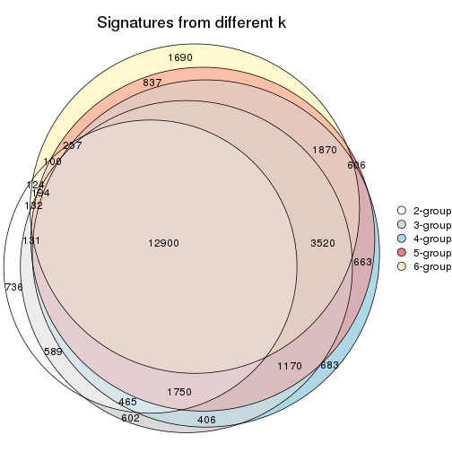

`get_signature()` returns a data frame invisibly. TO get the list of signatures, the function
call should be assigned to a variable explicitly. In following code, if `plot` argument is set
to `FALSE`, no heatmap is plotted while only the differential analysis is performed.

```r
# code only for demonstration
tb = get_signature(res, k = ..., plot = FALSE)
```

An example of the output of `tb` is:

```
#>   which_row         fdr    mean_1    mean_2 scaled_mean_1 scaled_mean_2 km
#> 1        38 0.042760348  8.373488  9.131774    -0.5533452     0.5164555  1
#> 2        40 0.018707592  7.106213  8.469186    -0.6173731     0.5762149  1
#> 3        55 0.019134737 10.221463 11.207825    -0.6159697     0.5749050  1
#> 4        59 0.006059896  5.921854  7.869574    -0.6899429     0.6439467  1
#> 5        60 0.018055526  8.928898 10.211722    -0.6204761     0.5791110  1
#> 6        98 0.009384629 15.714769 14.887706     0.6635654    -0.6193277  2
...
```

The columns in `tb` are:

1. `which_row`: row indices corresponding to the input matrix.
2. `fdr`: FDR for the differential test. 
3. `mean_x`: The mean value in group x.
4. `scaled_mean_x`: The mean value in group x after rows are scaled.
5. `km`: Row groups if k-means clustering is applied to rows.


UMAP plot which shows how samples are separated.


<script>
$( function() {
	$( '#tabs-ATC-skmeans-dimension-reduction' ).tabs();
} );
</script>
<div id='tabs-ATC-skmeans-dimension-reduction'>
<ul>
<li><a href='#tab-ATC-skmeans-dimension-reduction-1'>k = 2</a></li>
<li><a href='#tab-ATC-skmeans-dimension-reduction-2'>k = 3</a></li>
<li><a href='#tab-ATC-skmeans-dimension-reduction-3'>k = 4</a></li>
<li><a href='#tab-ATC-skmeans-dimension-reduction-4'>k = 5</a></li>
<li><a href='#tab-ATC-skmeans-dimension-reduction-5'>k = 6</a></li>
</ul>
<div id='tab-ATC-skmeans-dimension-reduction-1'>
<pre><code class="r">dimension_reduction(res, k = 2, method = &quot;UMAP&quot;)
</code></pre>

<p></p>

</div>
<div id='tab-ATC-skmeans-dimension-reduction-2'>
<pre><code class="r">dimension_reduction(res, k = 3, method = &quot;UMAP&quot;)
</code></pre>

<p></p>

</div>
<div id='tab-ATC-skmeans-dimension-reduction-3'>
<pre><code class="r">dimension_reduction(res, k = 4, method = &quot;UMAP&quot;)
</code></pre>

<p></p>

</div>
<div id='tab-ATC-skmeans-dimension-reduction-4'>
<pre><code class="r">dimension_reduction(res, k = 5, method = &quot;UMAP&quot;)
</code></pre>

<p></p>

</div>
<div id='tab-ATC-skmeans-dimension-reduction-5'>
<pre><code class="r">dimension_reduction(res, k = 6, method = &quot;UMAP&quot;)
</code></pre>

<p></p>

</div>
</div>


Following heatmap shows how subgroups are split when increasing `k`:

```r
collect_classes(res)
```


Test correlation between subgroups and known annotations. If the known
annotation is numeric, one-way ANOVA test is applied, and if the known
annotation is discrete, chi-squared contingency table test is applied.

```r
test_to_known_factors(res)
```

```
#>               n disease.state(p) other(p) k
#> ATC:skmeans 104            0.322   0.2762 2
#> ATC:skmeans 101            0.158   0.1168 3
#> ATC:skmeans  98            0.305   0.1427 4
#> ATC:skmeans 101            0.446   0.1315 5
#> ATC:skmeans  79            0.472   0.0557 6
```


If matrix rows can be associated to genes, consider to use `functional_enrichment(res,
...)` to perform function enrichment for the signature genes. See [this vignette](http://bioconductor.org/packages/devel/bioc/vignettes/cola/inst/doc/functional_enrichment.html) for more detailed explanations.


 

---------------------------------------------------


### ATC:pam


The object with results only for a single top-value method and a single partition method 
can be extracted as:

```r
res = res_list["ATC", "pam"]
# you can also extract it by
# res = res_list["ATC:pam"]
```

A summary of `res` and all the functions that can be applied to it:

```r
res
```

```
#> A 'ConsensusPartition' object with k = 2, 3, 4, 5, 6.
#>   On a matrix with 51941 rows and 104 columns.
#>   Top rows (1000, 2000, 3000, 4000, 5000) are extracted by 'ATC' method.
#>   Subgroups are detected by 'pam' method.
#>   Performed in total 1250 partitions by row resampling.
#>   Best k for subgroups seems to be 2.
#> 
#> Following methods can be applied to this 'ConsensusPartition' object:
#>  [1] "cola_report"             "collect_classes"         "collect_plots"          
#>  [4] "collect_stats"           "colnames"                "compare_signatures"     
#>  [7] "consensus_heatmap"       "dimension_reduction"     "functional_enrichment"  
#> [10] "get_anno_col"            "get_anno"                "get_classes"            
#> [13] "get_consensus"           "get_matrix"              "get_membership"         
#> [16] "get_param"               "get_signatures"          "get_stats"              
#> [19] "is_best_k"               "is_stable_k"             "membership_heatmap"     
#> [22] "ncol"                    "nrow"                    "plot_ecdf"              
#> [25] "rownames"                "select_partition_number" "show"                   
#> [28] "suggest_best_k"          "test_to_known_factors"
```

`collect_plots()` function collects all the plots made from `res` for all `k` (number of partitions)
into one single page to provide an easy and fast comparison between different `k`.

```r
collect_plots(res)
```


The plots are:

- The first row: a plot of the ECDF (empirical cumulative distribution
  function) curves of the consensus matrix for each `k` and the heatmap of
  predicted classes for each `k`.
- The second row: heatmaps of the consensus matrix for each `k`.
- The third row: heatmaps of the membership matrix for each `k`.
- The fouth row: heatmaps of the signatures for each `k`.

All the plots in panels can be made by individual functions and they are
plotted later in this section.

`select_partition_number()` produces several plots showing different
statistics for choosing "optimized" `k`. There are following statistics:

- ECDF curves of the consensus matrix for each `k`;
- 1-PAC. [The PAC
  score](https://en.wikipedia.org/wiki/Consensus_clustering#Over-interpretation_potential_of_consensus_clustering)
  measures the proportion of the ambiguous subgrouping.
- Mean silhouette score.
- Concordance. The mean probability of fiting the consensus class ids in all
  partitions.
- Area increased. Denote $A_k$ as the area under the ECDF curve for current
  `k`, the area increased is defined as $A_k - A_{k-1}$.
- Rand index. The percent of pairs of samples that are both in a same cluster
  or both are not in a same cluster in the partition of k and k-1.
- Jaccard index. The ratio of pairs of samples are both in a same cluster in
  the partition of k and k-1 and the pairs of samples are both in a same
  cluster in the partition k or k-1.

The detailed explanations of these statistics can be found in [the _cola_
vignette](http://bioconductor.org/packages/devel/bioc/vignettes/cola/inst/doc/cola.html#toc_13).

Generally speaking, lower PAC score, higher mean silhouette score or higher
concordance corresponds to better partition. Rand index and Jaccard index
measure how similar the current partition is compared to partition with `k-1`.
If they are too similar, we won't accept `k` is better than `k-1`.

```r
select_partition_number(res)
```


The numeric values for all these statistics can be obtained by `get_stats()`.

```r
get_stats(res)
```

```
#>   k 1-PAC mean_silhouette concordance area_increased  Rand Jaccard
#> 2 2 0.812           0.920       0.960         0.4634 0.518   0.518
#> 3 3 0.883           0.893       0.956         0.3723 0.728   0.529
#> 4 4 0.785           0.738       0.871         0.1375 0.872   0.673
#> 5 5 0.793           0.865       0.906         0.0747 0.893   0.654
#> 6 6 0.886           0.862       0.939         0.0480 0.958   0.812
```

`suggest_best_k()` suggests the best $k$ based on these statistics. The rules are as follows:

- All $k$ with Jaccard index larger than 0.95 are removed because increasing
  $k$ does not provide enough extra information. If all $k$ are removed, it is
  marked as no subgroup is detected.
- For all $k$ with 1-PAC score larger than 0.9, the maximal $k$ is taken as
  the best $k$, and other $k$ are marked as optional $k$.
- If it does not fit the second rule. The $k$ with the maximal vote of the
  highest 1-PAC score, highest mean silhouette, and highest concordance is
  taken as the best $k$.

```r
suggest_best_k(res)
```

```
#> [1] 2
```


Following shows the table of the partitions (You need to click the **show/hide
code output** link to see it). The membership matrix (columns with name `p*`)
is inferred by
[`clue::cl_consensus()`](https://www.rdocumentation.org/link/cl_consensus?package=clue)
function with the `SE` method. Basically the value in the membership matrix
represents the probability to belong to a certain group. The finall class
label for an item is determined with the group with highest probability it
belongs to.

In `get_classes()` function, the entropy is calculated from the membership
matrix and the silhouette score is calculated from the consensus matrix.


<script>
$( function() {
	$( '#tabs-ATC-pam-get-classes' ).tabs();
} );
</script>
<div id='tabs-ATC-pam-get-classes'>
<ul>
<li><a href='#tab-ATC-pam-get-classes-1'>k = 2</a></li>
<li><a href='#tab-ATC-pam-get-classes-2'>k = 3</a></li>
<li><a href='#tab-ATC-pam-get-classes-3'>k = 4</a></li>
<li><a href='#tab-ATC-pam-get-classes-4'>k = 5</a></li>
<li><a href='#tab-ATC-pam-get-classes-5'>k = 6</a></li>
</ul>

<div id='tab-ATC-pam-get-classes-1'>
<p><a id='tab-ATC-pam-get-classes-1-a' style='color:#0366d6' href='#'>show/hide code output</a></p>
<pre><code class="r">cbind(get_classes(res, k = 2), get_membership(res, k = 2))
</code></pre>

<pre><code>#&gt;           class entropy silhouette    p1    p2
#&gt; GSM537341     2   0.000      0.989 0.000 1.000
#&gt; GSM537345     1   0.000      0.907 1.000 0.000
#&gt; GSM537355     2   0.584      0.820 0.140 0.860
#&gt; GSM537366     1   0.000      0.907 1.000 0.000
#&gt; GSM537370     2   0.000      0.989 0.000 1.000
#&gt; GSM537380     2   0.000      0.989 0.000 1.000
#&gt; GSM537392     2   0.000      0.989 0.000 1.000
#&gt; GSM537415     1   0.000      0.907 1.000 0.000
#&gt; GSM537417     1   0.000      0.907 1.000 0.000
#&gt; GSM537422     1   0.000      0.907 1.000 0.000
#&gt; GSM537423     2   0.000      0.989 0.000 1.000
#&gt; GSM537427     2   0.000      0.989 0.000 1.000
#&gt; GSM537430     2   0.000      0.989 0.000 1.000
#&gt; GSM537336     1   0.000      0.907 1.000 0.000
#&gt; GSM537337     2   0.000      0.989 0.000 1.000
#&gt; GSM537348     2   0.000      0.989 0.000 1.000
#&gt; GSM537349     2   0.000      0.989 0.000 1.000
#&gt; GSM537356     2   0.563      0.831 0.132 0.868
#&gt; GSM537361     1   0.775      0.761 0.772 0.228
#&gt; GSM537374     2   0.000      0.989 0.000 1.000
#&gt; GSM537377     2   0.000      0.989 0.000 1.000
#&gt; GSM537378     2   0.000      0.989 0.000 1.000
#&gt; GSM537379     2   0.000      0.989 0.000 1.000
#&gt; GSM537383     2   0.000      0.989 0.000 1.000
#&gt; GSM537388     2   0.000      0.989 0.000 1.000
#&gt; GSM537395     2   0.000      0.989 0.000 1.000
#&gt; GSM537400     2   0.000      0.989 0.000 1.000
#&gt; GSM537404     1   0.000      0.907 1.000 0.000
#&gt; GSM537409     1   0.775      0.761 0.772 0.228
#&gt; GSM537418     1   0.775      0.761 0.772 0.228
#&gt; GSM537425     1   0.000      0.907 1.000 0.000
#&gt; GSM537333     2   0.000      0.989 0.000 1.000
#&gt; GSM537342     1   0.615      0.820 0.848 0.152
#&gt; GSM537347     2   0.000      0.989 0.000 1.000
#&gt; GSM537350     1   0.000      0.907 1.000 0.000
#&gt; GSM537362     2   0.000      0.989 0.000 1.000
#&gt; GSM537363     1   0.000      0.907 1.000 0.000
#&gt; GSM537368     1   0.000      0.907 1.000 0.000
#&gt; GSM537376     2   0.000      0.989 0.000 1.000
#&gt; GSM537381     2   0.000      0.989 0.000 1.000
#&gt; GSM537386     2   0.000      0.989 0.000 1.000
#&gt; GSM537398     2   0.000      0.989 0.000 1.000
#&gt; GSM537402     2   0.456      0.879 0.096 0.904
#&gt; GSM537405     1   0.000      0.907 1.000 0.000
#&gt; GSM537371     1   0.000      0.907 1.000 0.000
#&gt; GSM537421     1   0.000      0.907 1.000 0.000
#&gt; GSM537424     2   0.000      0.989 0.000 1.000
#&gt; GSM537432     2   0.000      0.989 0.000 1.000
#&gt; GSM537331     2   0.000      0.989 0.000 1.000
#&gt; GSM537332     2   0.000      0.989 0.000 1.000
#&gt; GSM537334     2   0.000      0.989 0.000 1.000
#&gt; GSM537338     2   0.000      0.989 0.000 1.000
#&gt; GSM537353     2   0.738      0.709 0.208 0.792
#&gt; GSM537357     1   0.000      0.907 1.000 0.000
#&gt; GSM537358     2   0.000      0.989 0.000 1.000
#&gt; GSM537375     2   0.000      0.989 0.000 1.000
#&gt; GSM537389     2   0.000      0.989 0.000 1.000
#&gt; GSM537390     2   0.000      0.989 0.000 1.000
#&gt; GSM537393     2   0.000      0.989 0.000 1.000
#&gt; GSM537399     2   0.000      0.989 0.000 1.000
#&gt; GSM537407     2   0.000      0.989 0.000 1.000
#&gt; GSM537408     1   0.795      0.747 0.760 0.240
#&gt; GSM537428     2   0.000      0.989 0.000 1.000
#&gt; GSM537354     1   0.000      0.907 1.000 0.000
#&gt; GSM537410     1   0.000      0.907 1.000 0.000
#&gt; GSM537413     2   0.000      0.989 0.000 1.000
#&gt; GSM537396     2   0.000      0.989 0.000 1.000
#&gt; GSM537397     2   0.000      0.989 0.000 1.000
#&gt; GSM537330     2   0.000      0.989 0.000 1.000
#&gt; GSM537369     1   0.999      0.219 0.516 0.484
#&gt; GSM537373     1   0.983      0.400 0.576 0.424
#&gt; GSM537401     2   0.000      0.989 0.000 1.000
#&gt; GSM537343     1   0.775      0.761 0.772 0.228
#&gt; GSM537367     1   0.000      0.907 1.000 0.000
#&gt; GSM537382     2   0.000      0.989 0.000 1.000
#&gt; GSM537385     2   0.000      0.989 0.000 1.000
#&gt; GSM537391     2   0.000      0.989 0.000 1.000
#&gt; GSM537419     2   0.000      0.989 0.000 1.000
#&gt; GSM537420     1   0.775      0.761 0.772 0.228
#&gt; GSM537429     2   0.000      0.989 0.000 1.000
#&gt; GSM537431     2   0.000      0.989 0.000 1.000
#&gt; GSM537387     2   0.000      0.989 0.000 1.000
#&gt; GSM537414     1   0.000      0.907 1.000 0.000
#&gt; GSM537433     1   0.000      0.907 1.000 0.000
#&gt; GSM537335     2   0.000      0.989 0.000 1.000
#&gt; GSM537339     2   0.000      0.989 0.000 1.000
#&gt; GSM537340     1   0.000      0.907 1.000 0.000
#&gt; GSM537344     1   0.781      0.756 0.768 0.232
#&gt; GSM537346     2   0.000      0.989 0.000 1.000
#&gt; GSM537351     1   0.000      0.907 1.000 0.000
#&gt; GSM537352     1   0.921      0.609 0.664 0.336
#&gt; GSM537359     2   0.000      0.989 0.000 1.000
#&gt; GSM537360     1   0.000      0.907 1.000 0.000
#&gt; GSM537364     1   0.000      0.907 1.000 0.000
#&gt; GSM537365     1   0.929      0.595 0.656 0.344
#&gt; GSM537372     2   0.000      0.989 0.000 1.000
#&gt; GSM537384     2   0.000      0.989 0.000 1.000
#&gt; GSM537394     2   0.000      0.989 0.000 1.000
#&gt; GSM537403     1   0.000      0.907 1.000 0.000
#&gt; GSM537406     1   0.000      0.907 1.000 0.000
#&gt; GSM537411     2   0.000      0.989 0.000 1.000
#&gt; GSM537412     1   0.000      0.907 1.000 0.000
#&gt; GSM537416     1   0.000      0.907 1.000 0.000
#&gt; GSM537426     1   0.775      0.761 0.772 0.228
</code></pre>

<script>
$('#tab-ATC-pam-get-classes-1-a').parent().next().next().hide();
$('#tab-ATC-pam-get-classes-1-a').click(function(){
  $('#tab-ATC-pam-get-classes-1-a').parent().next().next().toggle();
  return(false);
});
</script>
</div>

<div id='tab-ATC-pam-get-classes-2'>
<p><a id='tab-ATC-pam-get-classes-2-a' style='color:#0366d6' href='#'>show/hide code output</a></p>
<pre><code class="r">cbind(get_classes(res, k = 3), get_membership(res, k = 3))
</code></pre>

<pre><code>#&gt;           class entropy silhouette    p1    p2    p3
#&gt; GSM537341     1  0.0000      0.951 1.000 0.000 0.000
#&gt; GSM537345     3  0.2625      0.894 0.000 0.084 0.916
#&gt; GSM537355     2  0.1643      0.900 0.044 0.956 0.000
#&gt; GSM537366     3  0.0000      0.970 0.000 0.000 1.000
#&gt; GSM537370     1  0.0000      0.951 1.000 0.000 0.000
#&gt; GSM537380     1  0.1289      0.926 0.968 0.032 0.000
#&gt; GSM537392     1  0.0000      0.951 1.000 0.000 0.000
#&gt; GSM537415     2  0.0000      0.932 0.000 1.000 0.000
#&gt; GSM537417     3  0.2625      0.896 0.000 0.084 0.916
#&gt; GSM537422     3  0.0000      0.970 0.000 0.000 1.000
#&gt; GSM537423     2  0.0000      0.932 0.000 1.000 0.000
#&gt; GSM537427     1  0.3192      0.848 0.888 0.112 0.000
#&gt; GSM537430     1  0.0000      0.951 1.000 0.000 0.000
#&gt; GSM537336     3  0.0000      0.970 0.000 0.000 1.000
#&gt; GSM537337     2  0.0000      0.932 0.000 1.000 0.000
#&gt; GSM537348     1  0.0000      0.951 1.000 0.000 0.000
#&gt; GSM537349     1  0.5859      0.471 0.656 0.344 0.000
#&gt; GSM537356     2  0.0592      0.925 0.012 0.988 0.000
#&gt; GSM537361     2  0.0000      0.932 0.000 1.000 0.000
#&gt; GSM537374     1  0.0000      0.951 1.000 0.000 0.000
#&gt; GSM537377     1  0.0000      0.951 1.000 0.000 0.000
#&gt; GSM537378     2  0.5835      0.485 0.340 0.660 0.000
#&gt; GSM537379     1  0.5810      0.471 0.664 0.336 0.000
#&gt; GSM537383     1  0.0000      0.951 1.000 0.000 0.000
#&gt; GSM537388     1  0.0000      0.951 1.000 0.000 0.000
#&gt; GSM537395     2  0.0000      0.932 0.000 1.000 0.000
#&gt; GSM537400     1  0.0000      0.951 1.000 0.000 0.000
#&gt; GSM537404     2  0.2356      0.878 0.000 0.928 0.072
#&gt; GSM537409     2  0.0000      0.932 0.000 1.000 0.000
#&gt; GSM537418     2  0.0000      0.932 0.000 1.000 0.000
#&gt; GSM537425     3  0.0000      0.970 0.000 0.000 1.000
#&gt; GSM537333     1  0.0000      0.951 1.000 0.000 0.000
#&gt; GSM537342     2  0.0000      0.932 0.000 1.000 0.000
#&gt; GSM537347     1  0.0000      0.951 1.000 0.000 0.000
#&gt; GSM537350     2  0.3482      0.815 0.000 0.872 0.128
#&gt; GSM537362     1  0.0000      0.951 1.000 0.000 0.000
#&gt; GSM537363     3  0.0000      0.970 0.000 0.000 1.000
#&gt; GSM537368     3  0.0000      0.970 0.000 0.000 1.000
#&gt; GSM537376     1  0.0000      0.951 1.000 0.000 0.000
#&gt; GSM537381     1  0.0000      0.951 1.000 0.000 0.000
#&gt; GSM537386     1  0.0000      0.951 1.000 0.000 0.000
#&gt; GSM537398     1  0.0000      0.951 1.000 0.000 0.000
#&gt; GSM537402     2  0.0237      0.930 0.004 0.996 0.000
#&gt; GSM537405     3  0.6079      0.389 0.000 0.388 0.612
#&gt; GSM537371     3  0.0000      0.970 0.000 0.000 1.000
#&gt; GSM537421     3  0.0000      0.970 0.000 0.000 1.000
#&gt; GSM537424     2  0.4842      0.702 0.224 0.776 0.000
#&gt; GSM537432     1  0.0000      0.951 1.000 0.000 0.000
#&gt; GSM537331     1  0.0000      0.951 1.000 0.000 0.000
#&gt; GSM537332     1  0.0000      0.951 1.000 0.000 0.000
#&gt; GSM537334     1  0.0000      0.951 1.000 0.000 0.000
#&gt; GSM537338     1  0.0000      0.951 1.000 0.000 0.000
#&gt; GSM537353     2  0.0000      0.932 0.000 1.000 0.000
#&gt; GSM537357     3  0.0000      0.970 0.000 0.000 1.000
#&gt; GSM537358     2  0.0747      0.922 0.016 0.984 0.000
#&gt; GSM537375     1  0.6026      0.373 0.624 0.376 0.000
#&gt; GSM537389     2  0.4399      0.752 0.188 0.812 0.000
#&gt; GSM537390     2  0.4842      0.705 0.224 0.776 0.000
#&gt; GSM537393     2  0.0000      0.932 0.000 1.000 0.000
#&gt; GSM537399     1  0.0000      0.951 1.000 0.000 0.000
#&gt; GSM537407     1  0.2356      0.890 0.928 0.072 0.000
#&gt; GSM537408     2  0.0000      0.932 0.000 1.000 0.000
#&gt; GSM537428     2  0.2625      0.861 0.084 0.916 0.000
#&gt; GSM537354     2  0.0000      0.932 0.000 1.000 0.000
#&gt; GSM537410     2  0.4235      0.751 0.000 0.824 0.176
#&gt; GSM537413     1  0.2261      0.895 0.932 0.068 0.000
#&gt; GSM537396     1  0.0424      0.945 0.992 0.008 0.000
#&gt; GSM537397     1  0.5882      0.462 0.652 0.348 0.000
#&gt; GSM537330     1  0.0000      0.951 1.000 0.000 0.000
#&gt; GSM537369     2  0.0000      0.932 0.000 1.000 0.000
#&gt; GSM537373     2  0.0000      0.932 0.000 1.000 0.000
#&gt; GSM537401     1  0.0000      0.951 1.000 0.000 0.000
#&gt; GSM537343     2  0.0000      0.932 0.000 1.000 0.000
#&gt; GSM537367     3  0.0000      0.970 0.000 0.000 1.000
#&gt; GSM537382     1  0.1031      0.933 0.976 0.024 0.000
#&gt; GSM537385     1  0.0000      0.951 1.000 0.000 0.000
#&gt; GSM537391     1  0.0000      0.951 1.000 0.000 0.000
#&gt; GSM537419     2  0.6126      0.329 0.400 0.600 0.000
#&gt; GSM537420     2  0.0000      0.932 0.000 1.000 0.000
#&gt; GSM537429     1  0.0000      0.951 1.000 0.000 0.000
#&gt; GSM537431     1  0.0000      0.951 1.000 0.000 0.000
#&gt; GSM537387     1  0.5882      0.462 0.652 0.348 0.000
#&gt; GSM537414     2  0.0000      0.932 0.000 1.000 0.000
#&gt; GSM537433     3  0.0000      0.970 0.000 0.000 1.000
#&gt; GSM537335     1  0.0000      0.951 1.000 0.000 0.000
#&gt; GSM537339     1  0.0000      0.951 1.000 0.000 0.000
#&gt; GSM537340     3  0.0000      0.970 0.000 0.000 1.000
#&gt; GSM537344     2  0.0000      0.932 0.000 1.000 0.000
#&gt; GSM537346     1  0.0000      0.951 1.000 0.000 0.000
#&gt; GSM537351     3  0.0000      0.970 0.000 0.000 1.000
#&gt; GSM537352     2  0.0000      0.932 0.000 1.000 0.000
#&gt; GSM537359     1  0.0000      0.951 1.000 0.000 0.000
#&gt; GSM537360     2  0.0892      0.920 0.000 0.980 0.020
#&gt; GSM537364     3  0.0000      0.970 0.000 0.000 1.000
#&gt; GSM537365     2  0.0000      0.932 0.000 1.000 0.000
#&gt; GSM537372     1  0.0000      0.951 1.000 0.000 0.000
#&gt; GSM537384     1  0.0000      0.951 1.000 0.000 0.000
#&gt; GSM537394     1  0.0000      0.951 1.000 0.000 0.000
#&gt; GSM537403     3  0.0000      0.970 0.000 0.000 1.000
#&gt; GSM537406     3  0.0000      0.970 0.000 0.000 1.000
#&gt; GSM537411     1  0.0000      0.951 1.000 0.000 0.000
#&gt; GSM537412     3  0.0000      0.970 0.000 0.000 1.000
#&gt; GSM537416     2  0.0000      0.932 0.000 1.000 0.000
#&gt; GSM537426     2  0.0000      0.932 0.000 1.000 0.000
</code></pre>

<script>
$('#tab-ATC-pam-get-classes-2-a').parent().next().next().hide();
$('#tab-ATC-pam-get-classes-2-a').click(function(){
  $('#tab-ATC-pam-get-classes-2-a').parent().next().next().toggle();
  return(false);
});
</script>
</div>

<div id='tab-ATC-pam-get-classes-3'>
<p><a id='tab-ATC-pam-get-classes-3-a' style='color:#0366d6' href='#'>show/hide code output</a></p>
<pre><code class="r">cbind(get_classes(res, k = 4), get_membership(res, k = 4))
</code></pre>

<pre><code>#&gt;           class entropy silhouette    p1    p2    p3    p4
#&gt; GSM537341     2  0.4543     0.6300 0.000 0.676 0.000 0.324
#&gt; GSM537345     3  0.2081     0.8778 0.084 0.000 0.916 0.000
#&gt; GSM537355     1  0.1389     0.8901 0.952 0.048 0.000 0.000
#&gt; GSM537366     3  0.0000     0.9636 0.000 0.000 1.000 0.000
#&gt; GSM537370     2  0.4948     0.4549 0.000 0.560 0.000 0.440
#&gt; GSM537380     2  0.0000     0.6247 0.000 1.000 0.000 0.000
#&gt; GSM537392     2  0.0000     0.6247 0.000 1.000 0.000 0.000
#&gt; GSM537415     1  0.0000     0.9263 1.000 0.000 0.000 0.000
#&gt; GSM537417     3  0.2081     0.8790 0.084 0.000 0.916 0.000
#&gt; GSM537422     3  0.0000     0.9636 0.000 0.000 1.000 0.000
#&gt; GSM537423     1  0.0000     0.9263 1.000 0.000 0.000 0.000
#&gt; GSM537427     2  0.0000     0.6247 0.000 1.000 0.000 0.000
#&gt; GSM537430     4  0.0000     0.9227 0.000 0.000 0.000 1.000
#&gt; GSM537336     3  0.0000     0.9636 0.000 0.000 1.000 0.000
#&gt; GSM537337     1  0.0000     0.9263 1.000 0.000 0.000 0.000
#&gt; GSM537348     2  0.4720     0.6299 0.004 0.672 0.000 0.324
#&gt; GSM537349     2  0.0000     0.6247 0.000 1.000 0.000 0.000
#&gt; GSM537356     1  0.0469     0.9190 0.988 0.012 0.000 0.000
#&gt; GSM537361     1  0.0000     0.9263 1.000 0.000 0.000 0.000
#&gt; GSM537374     4  0.0000     0.9227 0.000 0.000 0.000 1.000
#&gt; GSM537377     2  0.4720     0.6299 0.004 0.672 0.000 0.324
#&gt; GSM537378     2  0.4730     0.1722 0.364 0.636 0.000 0.000
#&gt; GSM537379     2  0.7923     0.1538 0.336 0.340 0.000 0.324
#&gt; GSM537383     2  0.1867     0.5800 0.000 0.928 0.000 0.072
#&gt; GSM537388     2  0.2704     0.5535 0.000 0.876 0.000 0.124
#&gt; GSM537395     1  0.0000     0.9263 1.000 0.000 0.000 0.000
#&gt; GSM537400     4  0.4304     0.3318 0.000 0.284 0.000 0.716
#&gt; GSM537404     1  0.1867     0.8748 0.928 0.000 0.072 0.000
#&gt; GSM537409     1  0.0000     0.9263 1.000 0.000 0.000 0.000
#&gt; GSM537418     1  0.0000     0.9263 1.000 0.000 0.000 0.000
#&gt; GSM537425     3  0.0000     0.9636 0.000 0.000 1.000 0.000
#&gt; GSM537333     4  0.0000     0.9227 0.000 0.000 0.000 1.000
#&gt; GSM537342     1  0.0000     0.9263 1.000 0.000 0.000 0.000
#&gt; GSM537347     2  0.4720     0.6299 0.004 0.672 0.000 0.324
#&gt; GSM537350     1  0.2760     0.8126 0.872 0.000 0.128 0.000
#&gt; GSM537362     2  0.4720     0.6299 0.004 0.672 0.000 0.324
#&gt; GSM537363     3  0.0000     0.9636 0.000 0.000 1.000 0.000
#&gt; GSM537368     3  0.0000     0.9636 0.000 0.000 1.000 0.000
#&gt; GSM537376     2  0.4543     0.6300 0.000 0.676 0.000 0.324
#&gt; GSM537381     2  0.4720     0.6299 0.004 0.672 0.000 0.324
#&gt; GSM537386     4  0.0000     0.9227 0.000 0.000 0.000 1.000
#&gt; GSM537398     4  0.0000     0.9227 0.000 0.000 0.000 1.000
#&gt; GSM537402     1  0.0188     0.9241 0.996 0.004 0.000 0.000
#&gt; GSM537405     3  0.4817     0.3685 0.388 0.000 0.612 0.000
#&gt; GSM537371     3  0.0000     0.9636 0.000 0.000 1.000 0.000
#&gt; GSM537421     3  0.0000     0.9636 0.000 0.000 1.000 0.000
#&gt; GSM537424     1  0.3764     0.6677 0.784 0.216 0.000 0.000
#&gt; GSM537432     2  0.4994     0.4193 0.000 0.520 0.000 0.480
#&gt; GSM537331     4  0.0188     0.9180 0.000 0.004 0.000 0.996
#&gt; GSM537332     2  0.4661     0.6104 0.000 0.652 0.000 0.348
#&gt; GSM537334     4  0.0000     0.9227 0.000 0.000 0.000 1.000
#&gt; GSM537338     2  0.4543     0.6300 0.000 0.676 0.000 0.324
#&gt; GSM537353     1  0.0000     0.9263 1.000 0.000 0.000 0.000
#&gt; GSM537357     3  0.0000     0.9636 0.000 0.000 1.000 0.000
#&gt; GSM537358     1  0.0707     0.9130 0.980 0.000 0.000 0.020
#&gt; GSM537375     1  0.7878    -0.2837 0.384 0.292 0.000 0.324
#&gt; GSM537389     2  0.4994    -0.1962 0.480 0.520 0.000 0.000
#&gt; GSM537390     2  0.4955    -0.0871 0.444 0.556 0.000 0.000
#&gt; GSM537393     1  0.4564     0.5792 0.672 0.328 0.000 0.000
#&gt; GSM537399     4  0.0000     0.9227 0.000 0.000 0.000 1.000
#&gt; GSM537407     2  0.6316     0.5555 0.080 0.596 0.000 0.324
#&gt; GSM537408     1  0.0000     0.9263 1.000 0.000 0.000 0.000
#&gt; GSM537428     1  0.2216     0.8412 0.908 0.000 0.000 0.092
#&gt; GSM537354     1  0.0000     0.9263 1.000 0.000 0.000 0.000
#&gt; GSM537410     1  0.3356     0.7529 0.824 0.000 0.176 0.000
#&gt; GSM537413     2  0.0000     0.6247 0.000 1.000 0.000 0.000
#&gt; GSM537396     2  0.4978     0.6247 0.012 0.664 0.000 0.324
#&gt; GSM537397     2  0.2973     0.5799 0.144 0.856 0.000 0.000
#&gt; GSM537330     2  0.3356     0.4946 0.000 0.824 0.000 0.176
#&gt; GSM537369     1  0.0000     0.9263 1.000 0.000 0.000 0.000
#&gt; GSM537373     1  0.0000     0.9263 1.000 0.000 0.000 0.000
#&gt; GSM537401     2  0.4720     0.6299 0.004 0.672 0.000 0.324
#&gt; GSM537343     1  0.0000     0.9263 1.000 0.000 0.000 0.000
#&gt; GSM537367     3  0.0000     0.9636 0.000 0.000 1.000 0.000
#&gt; GSM537382     2  0.0000     0.6247 0.000 1.000 0.000 0.000
#&gt; GSM537385     2  0.0000     0.6247 0.000 1.000 0.000 0.000
#&gt; GSM537391     2  0.4720     0.6299 0.004 0.672 0.000 0.324
#&gt; GSM537419     1  0.4866     0.2494 0.596 0.404 0.000 0.000
#&gt; GSM537420     1  0.0000     0.9263 1.000 0.000 0.000 0.000
#&gt; GSM537429     2  0.3123     0.5175 0.000 0.844 0.000 0.156
#&gt; GSM537431     2  0.4996     0.4121 0.000 0.516 0.000 0.484
#&gt; GSM537387     2  0.0000     0.6247 0.000 1.000 0.000 0.000
#&gt; GSM537414     1  0.0000     0.9263 1.000 0.000 0.000 0.000
#&gt; GSM537433     3  0.0000     0.9636 0.000 0.000 1.000 0.000
#&gt; GSM537335     4  0.0000     0.9227 0.000 0.000 0.000 1.000
#&gt; GSM537339     2  0.1302     0.6331 0.000 0.956 0.000 0.044
#&gt; GSM537340     3  0.0000     0.9636 0.000 0.000 1.000 0.000
#&gt; GSM537344     1  0.0000     0.9263 1.000 0.000 0.000 0.000
#&gt; GSM537346     2  0.4522     0.4641 0.000 0.680 0.000 0.320
#&gt; GSM537351     3  0.0000     0.9636 0.000 0.000 1.000 0.000
#&gt; GSM537352     1  0.0000     0.9263 1.000 0.000 0.000 0.000
#&gt; GSM537359     2  0.4720     0.6299 0.004 0.672 0.000 0.324
#&gt; GSM537360     1  0.0707     0.9152 0.980 0.000 0.020 0.000
#&gt; GSM537364     3  0.0000     0.9636 0.000 0.000 1.000 0.000
#&gt; GSM537365     1  0.0000     0.9263 1.000 0.000 0.000 0.000
#&gt; GSM537372     2  0.4720     0.6299 0.004 0.672 0.000 0.324
#&gt; GSM537384     2  0.4543     0.6300 0.000 0.676 0.000 0.324
#&gt; GSM537394     2  0.4994     0.4193 0.000 0.520 0.000 0.480
#&gt; GSM537403     3  0.0000     0.9636 0.000 0.000 1.000 0.000
#&gt; GSM537406     3  0.0000     0.9636 0.000 0.000 1.000 0.000
#&gt; GSM537411     4  0.3688     0.5877 0.000 0.208 0.000 0.792
#&gt; GSM537412     3  0.0000     0.9636 0.000 0.000 1.000 0.000
#&gt; GSM537416     1  0.0000     0.9263 1.000 0.000 0.000 0.000
#&gt; GSM537426     1  0.0000     0.9263 1.000 0.000 0.000 0.000
</code></pre>

<script>
$('#tab-ATC-pam-get-classes-3-a').parent().next().next().hide();
$('#tab-ATC-pam-get-classes-3-a').click(function(){
  $('#tab-ATC-pam-get-classes-3-a').parent().next().next().toggle();
  return(false);
});
</script>
</div>

<div id='tab-ATC-pam-get-classes-4'>
<p><a id='tab-ATC-pam-get-classes-4-a' style='color:#0366d6' href='#'>show/hide code output</a></p>
<pre><code class="r">cbind(get_classes(res, k = 5), get_membership(res, k = 5))
</code></pre>

<pre><code>#&gt;           class entropy silhouette    p1    p2    p3    p4    p5
#&gt; GSM537341     5  0.0290      0.899 0.000 0.008 0.000 0.000 0.992
#&gt; GSM537345     1  0.2017      0.870 0.912 0.008 0.000 0.080 0.000
#&gt; GSM537355     4  0.1270      0.905 0.000 0.000 0.000 0.948 0.052
#&gt; GSM537366     1  0.0000      0.944 1.000 0.000 0.000 0.000 0.000
#&gt; GSM537370     5  0.5422      0.597 0.000 0.212 0.132 0.000 0.656
#&gt; GSM537380     2  0.3534      0.822 0.000 0.744 0.000 0.000 0.256
#&gt; GSM537392     2  0.2732      0.872 0.000 0.840 0.000 0.000 0.160
#&gt; GSM537415     4  0.2732      0.862 0.000 0.160 0.000 0.840 0.000
#&gt; GSM537417     1  0.2505      0.862 0.888 0.020 0.000 0.092 0.000
#&gt; GSM537422     1  0.0000      0.944 1.000 0.000 0.000 0.000 0.000
#&gt; GSM537423     4  0.0579      0.923 0.000 0.008 0.000 0.984 0.008
#&gt; GSM537427     2  0.2732      0.872 0.000 0.840 0.000 0.000 0.160
#&gt; GSM537430     3  0.0794      0.968 0.000 0.000 0.972 0.000 0.028
#&gt; GSM537336     1  0.0000      0.944 1.000 0.000 0.000 0.000 0.000
#&gt; GSM537337     4  0.0000      0.923 0.000 0.000 0.000 1.000 0.000
#&gt; GSM537348     5  0.0000      0.903 0.000 0.000 0.000 0.000 1.000
#&gt; GSM537349     2  0.2732      0.872 0.000 0.840 0.000 0.000 0.160
#&gt; GSM537356     4  0.0609      0.920 0.000 0.000 0.000 0.980 0.020
#&gt; GSM537361     4  0.0290      0.922 0.000 0.000 0.000 0.992 0.008
#&gt; GSM537374     3  0.0000      0.991 0.000 0.000 1.000 0.000 0.000
#&gt; GSM537377     5  0.0000      0.903 0.000 0.000 0.000 0.000 1.000
#&gt; GSM537378     2  0.2732      0.872 0.000 0.840 0.000 0.000 0.160
#&gt; GSM537379     5  0.1892      0.838 0.000 0.004 0.000 0.080 0.916
#&gt; GSM537383     2  0.3152      0.857 0.000 0.840 0.024 0.000 0.136
#&gt; GSM537388     2  0.5167      0.736 0.000 0.684 0.116 0.000 0.200
#&gt; GSM537395     4  0.0000      0.923 0.000 0.000 0.000 1.000 0.000
#&gt; GSM537400     5  0.3796      0.606 0.000 0.000 0.300 0.000 0.700
#&gt; GSM537404     4  0.2228      0.879 0.076 0.012 0.000 0.908 0.004
#&gt; GSM537409     4  0.2605      0.866 0.000 0.148 0.000 0.852 0.000
#&gt; GSM537418     4  0.2605      0.866 0.000 0.148 0.000 0.852 0.000
#&gt; GSM537425     1  0.0771      0.934 0.976 0.020 0.000 0.004 0.000
#&gt; GSM537333     3  0.0162      0.989 0.000 0.000 0.996 0.000 0.004
#&gt; GSM537342     4  0.0609      0.920 0.000 0.020 0.000 0.980 0.000
#&gt; GSM537347     5  0.0000      0.903 0.000 0.000 0.000 0.000 1.000
#&gt; GSM537350     4  0.2969      0.823 0.128 0.020 0.000 0.852 0.000
#&gt; GSM537362     5  0.0000      0.903 0.000 0.000 0.000 0.000 1.000
#&gt; GSM537363     1  0.0000      0.944 1.000 0.000 0.000 0.000 0.000
#&gt; GSM537368     1  0.0000      0.944 1.000 0.000 0.000 0.000 0.000
#&gt; GSM537376     5  0.0880      0.886 0.000 0.032 0.000 0.000 0.968
#&gt; GSM537381     5  0.0000      0.903 0.000 0.000 0.000 0.000 1.000
#&gt; GSM537386     3  0.0000      0.991 0.000 0.000 1.000 0.000 0.000
#&gt; GSM537398     3  0.0609      0.977 0.000 0.000 0.980 0.000 0.020
#&gt; GSM537402     4  0.0404      0.922 0.000 0.000 0.000 0.988 0.012
#&gt; GSM537405     1  0.4607      0.437 0.616 0.012 0.000 0.368 0.004
#&gt; GSM537371     1  0.0000      0.944 1.000 0.000 0.000 0.000 0.000
#&gt; GSM537421     1  0.3013      0.831 0.832 0.160 0.000 0.008 0.000
#&gt; GSM537424     4  0.1965      0.872 0.000 0.000 0.000 0.904 0.096
#&gt; GSM537432     5  0.2471      0.808 0.000 0.000 0.136 0.000 0.864
#&gt; GSM537331     3  0.0000      0.991 0.000 0.000 1.000 0.000 0.000
#&gt; GSM537332     5  0.0510      0.899 0.000 0.000 0.016 0.000 0.984
#&gt; GSM537334     3  0.0000      0.991 0.000 0.000 1.000 0.000 0.000
#&gt; GSM537338     5  0.0290      0.901 0.000 0.000 0.008 0.000 0.992
#&gt; GSM537353     4  0.0000      0.923 0.000 0.000 0.000 1.000 0.000
#&gt; GSM537357     1  0.2629      0.848 0.860 0.136 0.000 0.004 0.000
#&gt; GSM537358     4  0.1341      0.898 0.000 0.000 0.000 0.944 0.056
#&gt; GSM537375     5  0.2305      0.823 0.000 0.012 0.000 0.092 0.896
#&gt; GSM537389     2  0.2848      0.870 0.000 0.840 0.000 0.004 0.156
#&gt; GSM537390     2  0.2732      0.872 0.000 0.840 0.000 0.000 0.160
#&gt; GSM537393     2  0.2732      0.698 0.000 0.840 0.000 0.160 0.000
#&gt; GSM537399     5  0.4256      0.333 0.000 0.000 0.436 0.000 0.564
#&gt; GSM537407     5  0.0609      0.894 0.000 0.000 0.000 0.020 0.980
#&gt; GSM537408     4  0.0000      0.923 0.000 0.000 0.000 1.000 0.000
#&gt; GSM537428     4  0.3242      0.710 0.000 0.000 0.000 0.784 0.216
#&gt; GSM537354     4  0.0404      0.922 0.000 0.012 0.000 0.988 0.000
#&gt; GSM537410     4  0.3488      0.768 0.168 0.024 0.000 0.808 0.000
#&gt; GSM537413     2  0.2732      0.872 0.000 0.840 0.000 0.000 0.160
#&gt; GSM537396     5  0.0671      0.895 0.000 0.004 0.000 0.016 0.980
#&gt; GSM537397     2  0.6724      0.442 0.000 0.420 0.000 0.284 0.296
#&gt; GSM537330     2  0.3193      0.749 0.000 0.840 0.132 0.000 0.028
#&gt; GSM537369     4  0.0290      0.922 0.000 0.000 0.000 0.992 0.008
#&gt; GSM537373     4  0.0290      0.922 0.000 0.000 0.000 0.992 0.008
#&gt; GSM537401     5  0.0000      0.903 0.000 0.000 0.000 0.000 1.000
#&gt; GSM537343     4  0.0290      0.922 0.000 0.000 0.000 0.992 0.008
#&gt; GSM537367     1  0.0000      0.944 1.000 0.000 0.000 0.000 0.000
#&gt; GSM537382     2  0.2891      0.868 0.000 0.824 0.000 0.000 0.176
#&gt; GSM537385     2  0.3774      0.781 0.000 0.704 0.000 0.000 0.296
#&gt; GSM537391     5  0.0000      0.903 0.000 0.000 0.000 0.000 1.000
#&gt; GSM537419     4  0.3586      0.666 0.000 0.000 0.000 0.736 0.264
#&gt; GSM537420     4  0.0693      0.921 0.000 0.012 0.000 0.980 0.008
#&gt; GSM537429     2  0.3229      0.754 0.000 0.840 0.128 0.000 0.032
#&gt; GSM537431     5  0.2471      0.808 0.000 0.000 0.136 0.000 0.864
#&gt; GSM537387     2  0.3366      0.842 0.000 0.768 0.000 0.000 0.232
#&gt; GSM537414     4  0.2605      0.866 0.000 0.148 0.000 0.852 0.000
#&gt; GSM537433     1  0.0000      0.944 1.000 0.000 0.000 0.000 0.000
#&gt; GSM537335     3  0.0000      0.991 0.000 0.000 1.000 0.000 0.000
#&gt; GSM537339     2  0.3612      0.796 0.000 0.732 0.000 0.000 0.268
#&gt; GSM537340     1  0.0000      0.944 1.000 0.000 0.000 0.000 0.000
#&gt; GSM537344     4  0.0290      0.922 0.000 0.000 0.000 0.992 0.008
#&gt; GSM537346     2  0.5854      0.530 0.000 0.596 0.152 0.000 0.252
#&gt; GSM537351     1  0.0898      0.933 0.972 0.020 0.000 0.008 0.000
#&gt; GSM537352     4  0.0000      0.923 0.000 0.000 0.000 1.000 0.000
#&gt; GSM537359     5  0.0000      0.903 0.000 0.000 0.000 0.000 1.000
#&gt; GSM537360     4  0.3123      0.855 0.012 0.160 0.000 0.828 0.000
#&gt; GSM537364     1  0.0000      0.944 1.000 0.000 0.000 0.000 0.000
#&gt; GSM537365     4  0.0000      0.923 0.000 0.000 0.000 1.000 0.000
#&gt; GSM537372     5  0.0000      0.903 0.000 0.000 0.000 0.000 1.000
#&gt; GSM537384     5  0.0290      0.900 0.000 0.008 0.000 0.000 0.992
#&gt; GSM537394     5  0.2966      0.802 0.000 0.016 0.136 0.000 0.848
#&gt; GSM537403     1  0.0000      0.944 1.000 0.000 0.000 0.000 0.000
#&gt; GSM537406     1  0.0404      0.939 0.988 0.012 0.000 0.000 0.000
#&gt; GSM537411     5  0.2424      0.827 0.000 0.000 0.132 0.000 0.868
#&gt; GSM537412     1  0.0000      0.944 1.000 0.000 0.000 0.000 0.000
#&gt; GSM537416     4  0.2732      0.862 0.000 0.160 0.000 0.840 0.000
#&gt; GSM537426     4  0.2605      0.866 0.000 0.148 0.000 0.852 0.000
</code></pre>

<script>
$('#tab-ATC-pam-get-classes-4-a').parent().next().next().hide();
$('#tab-ATC-pam-get-classes-4-a').click(function(){
  $('#tab-ATC-pam-get-classes-4-a').parent().next().next().toggle();
  return(false);
});
</script>
</div>

<div id='tab-ATC-pam-get-classes-5'>
<p><a id='tab-ATC-pam-get-classes-5-a' style='color:#0366d6' href='#'>show/hide code output</a></p>
<pre><code class="r">cbind(get_classes(res, k = 6), get_membership(res, k = 6))
</code></pre>

<pre><code>#&gt;           class entropy silhouette    p1    p2    p3    p4    p5    p6
#&gt; GSM537341     5  0.0000    0.92537 0.000 0.000 0.000 0.000 1.000 0.000
#&gt; GSM537345     4  0.2778    0.74604 0.008 0.000 0.168 0.824 0.000 0.000
#&gt; GSM537355     3  0.1007    0.91484 0.000 0.000 0.956 0.000 0.044 0.000
#&gt; GSM537366     4  0.0000    0.93931 0.000 0.000 0.000 1.000 0.000 0.000
#&gt; GSM537370     5  0.3672    0.43637 0.000 0.368 0.000 0.000 0.632 0.000
#&gt; GSM537380     2  0.3175    0.71273 0.000 0.744 0.000 0.000 0.256 0.000
#&gt; GSM537392     2  0.0000    0.86345 0.000 1.000 0.000 0.000 0.000 0.000
#&gt; GSM537415     1  0.0000    0.91343 1.000 0.000 0.000 0.000 0.000 0.000
#&gt; GSM537417     4  0.2309    0.83879 0.028 0.000 0.084 0.888 0.000 0.000
#&gt; GSM537422     4  0.0000    0.93931 0.000 0.000 0.000 1.000 0.000 0.000
#&gt; GSM537423     3  0.0458    0.93618 0.016 0.000 0.984 0.000 0.000 0.000
#&gt; GSM537427     2  0.0000    0.86345 0.000 1.000 0.000 0.000 0.000 0.000
#&gt; GSM537430     6  0.0713    0.96334 0.000 0.000 0.000 0.000 0.028 0.972
#&gt; GSM537336     4  0.0000    0.93931 0.000 0.000 0.000 1.000 0.000 0.000
#&gt; GSM537337     3  0.0146    0.94033 0.004 0.000 0.996 0.000 0.000 0.000
#&gt; GSM537348     5  0.0000    0.92537 0.000 0.000 0.000 0.000 1.000 0.000
#&gt; GSM537349     2  0.0000    0.86345 0.000 1.000 0.000 0.000 0.000 0.000
#&gt; GSM537356     3  0.0260    0.93804 0.000 0.000 0.992 0.000 0.008 0.000
#&gt; GSM537361     3  0.0000    0.94028 0.000 0.000 1.000 0.000 0.000 0.000
#&gt; GSM537374     6  0.0000    0.98947 0.000 0.000 0.000 0.000 0.000 1.000
#&gt; GSM537377     5  0.0000    0.92537 0.000 0.000 0.000 0.000 1.000 0.000
#&gt; GSM537378     2  0.0000    0.86345 0.000 1.000 0.000 0.000 0.000 0.000
#&gt; GSM537379     5  0.1556    0.86445 0.000 0.000 0.080 0.000 0.920 0.000
#&gt; GSM537383     2  0.0000    0.86345 0.000 1.000 0.000 0.000 0.000 0.000
#&gt; GSM537388     2  0.3468    0.70100 0.000 0.728 0.000 0.000 0.264 0.008
#&gt; GSM537395     3  0.0146    0.94033 0.004 0.000 0.996 0.000 0.000 0.000
#&gt; GSM537400     5  0.3409    0.58336 0.000 0.000 0.000 0.000 0.700 0.300
#&gt; GSM537404     3  0.3141    0.73041 0.012 0.000 0.788 0.200 0.000 0.000
#&gt; GSM537409     1  0.0363    0.91301 0.988 0.000 0.012 0.000 0.000 0.000
#&gt; GSM537418     1  0.0363    0.91301 0.988 0.000 0.012 0.000 0.000 0.000
#&gt; GSM537425     4  0.0713    0.92270 0.028 0.000 0.000 0.972 0.000 0.000
#&gt; GSM537333     6  0.0146    0.98745 0.000 0.000 0.000 0.000 0.004 0.996
#&gt; GSM537342     3  0.0713    0.93193 0.028 0.000 0.972 0.000 0.000 0.000
#&gt; GSM537347     5  0.0000    0.92537 0.000 0.000 0.000 0.000 1.000 0.000
#&gt; GSM537350     3  0.2748    0.81772 0.024 0.000 0.848 0.128 0.000 0.000
#&gt; GSM537362     5  0.0000    0.92537 0.000 0.000 0.000 0.000 1.000 0.000
#&gt; GSM537363     4  0.0000    0.93931 0.000 0.000 0.000 1.000 0.000 0.000
#&gt; GSM537368     4  0.0000    0.93931 0.000 0.000 0.000 1.000 0.000 0.000
#&gt; GSM537376     5  0.0865    0.90731 0.000 0.036 0.000 0.000 0.964 0.000
#&gt; GSM537381     5  0.0000    0.92537 0.000 0.000 0.000 0.000 1.000 0.000
#&gt; GSM537386     6  0.0000    0.98947 0.000 0.000 0.000 0.000 0.000 1.000
#&gt; GSM537398     6  0.0547    0.97407 0.000 0.000 0.000 0.000 0.020 0.980
#&gt; GSM537402     3  0.0146    0.93984 0.000 0.000 0.996 0.000 0.004 0.000
#&gt; GSM537405     4  0.4152    0.21209 0.012 0.000 0.440 0.548 0.000 0.000
#&gt; GSM537371     4  0.0000    0.93931 0.000 0.000 0.000 1.000 0.000 0.000
#&gt; GSM537421     1  0.0000    0.91343 1.000 0.000 0.000 0.000 0.000 0.000
#&gt; GSM537424     3  0.1663    0.87633 0.000 0.000 0.912 0.000 0.088 0.000
#&gt; GSM537432     5  0.0260    0.92295 0.000 0.000 0.000 0.000 0.992 0.008
#&gt; GSM537331     6  0.0000    0.98947 0.000 0.000 0.000 0.000 0.000 1.000
#&gt; GSM537332     5  0.0146    0.92440 0.000 0.000 0.000 0.000 0.996 0.004
#&gt; GSM537334     6  0.0000    0.98947 0.000 0.000 0.000 0.000 0.000 1.000
#&gt; GSM537338     5  0.0000    0.92537 0.000 0.000 0.000 0.000 1.000 0.000
#&gt; GSM537353     3  0.0146    0.94033 0.004 0.000 0.996 0.000 0.000 0.000
#&gt; GSM537357     1  0.3868    0.00269 0.508 0.000 0.000 0.492 0.000 0.000
#&gt; GSM537358     3  0.1141    0.90817 0.000 0.000 0.948 0.000 0.052 0.000
#&gt; GSM537375     5  0.1858    0.85128 0.000 0.004 0.092 0.000 0.904 0.000
#&gt; GSM537389     2  0.0000    0.86345 0.000 1.000 0.000 0.000 0.000 0.000
#&gt; GSM537390     2  0.0000    0.86345 0.000 1.000 0.000 0.000 0.000 0.000
#&gt; GSM537393     2  0.0000    0.86345 0.000 1.000 0.000 0.000 0.000 0.000
#&gt; GSM537399     5  0.3823    0.29317 0.000 0.000 0.000 0.000 0.564 0.436
#&gt; GSM537407     5  0.0547    0.91582 0.000 0.000 0.020 0.000 0.980 0.000
#&gt; GSM537408     3  0.0000    0.94028 0.000 0.000 1.000 0.000 0.000 0.000
#&gt; GSM537428     3  0.2883    0.71538 0.000 0.000 0.788 0.000 0.212 0.000
#&gt; GSM537354     3  0.0547    0.93477 0.020 0.000 0.980 0.000 0.000 0.000
#&gt; GSM537410     3  0.2331    0.86724 0.032 0.000 0.888 0.080 0.000 0.000
#&gt; GSM537413     2  0.0000    0.86345 0.000 1.000 0.000 0.000 0.000 0.000
#&gt; GSM537396     5  0.0603    0.91660 0.000 0.004 0.016 0.000 0.980 0.000
#&gt; GSM537397     2  0.6040    0.33760 0.000 0.420 0.284 0.000 0.296 0.000
#&gt; GSM537330     2  0.0260    0.85973 0.000 0.992 0.000 0.000 0.000 0.008
#&gt; GSM537369     3  0.0000    0.94028 0.000 0.000 1.000 0.000 0.000 0.000
#&gt; GSM537373     3  0.0000    0.94028 0.000 0.000 1.000 0.000 0.000 0.000
#&gt; GSM537401     5  0.0000    0.92537 0.000 0.000 0.000 0.000 1.000 0.000
#&gt; GSM537343     3  0.0000    0.94028 0.000 0.000 1.000 0.000 0.000 0.000
#&gt; GSM537367     4  0.0000    0.93931 0.000 0.000 0.000 1.000 0.000 0.000
#&gt; GSM537382     2  0.0790    0.85296 0.000 0.968 0.000 0.000 0.032 0.000
#&gt; GSM537385     2  0.3390    0.66190 0.000 0.704 0.000 0.000 0.296 0.000
#&gt; GSM537391     5  0.0000    0.92537 0.000 0.000 0.000 0.000 1.000 0.000
#&gt; GSM537419     3  0.3198    0.65463 0.000 0.000 0.740 0.000 0.260 0.000
#&gt; GSM537420     3  0.0363    0.93648 0.012 0.000 0.988 0.000 0.000 0.000
#&gt; GSM537429     2  0.0000    0.86345 0.000 1.000 0.000 0.000 0.000 0.000
#&gt; GSM537431     5  0.0260    0.92295 0.000 0.000 0.000 0.000 0.992 0.008
#&gt; GSM537387     2  0.2883    0.75044 0.000 0.788 0.000 0.000 0.212 0.000
#&gt; GSM537414     1  0.0363    0.91301 0.988 0.000 0.012 0.000 0.000 0.000
#&gt; GSM537433     4  0.0000    0.93931 0.000 0.000 0.000 1.000 0.000 0.000
#&gt; GSM537335     6  0.0000    0.98947 0.000 0.000 0.000 0.000 0.000 1.000
#&gt; GSM537339     2  0.2491    0.77488 0.000 0.836 0.000 0.000 0.164 0.000
#&gt; GSM537340     4  0.0000    0.93931 0.000 0.000 0.000 1.000 0.000 0.000
#&gt; GSM537344     3  0.0000    0.94028 0.000 0.000 1.000 0.000 0.000 0.000
#&gt; GSM537346     2  0.3323    0.64992 0.000 0.752 0.000 0.000 0.240 0.008
#&gt; GSM537351     4  0.0713    0.92270 0.028 0.000 0.000 0.972 0.000 0.000
#&gt; GSM537352     3  0.0146    0.94033 0.004 0.000 0.996 0.000 0.000 0.000
#&gt; GSM537359     5  0.0000    0.92537 0.000 0.000 0.000 0.000 1.000 0.000
#&gt; GSM537360     1  0.0000    0.91343 1.000 0.000 0.000 0.000 0.000 0.000
#&gt; GSM537364     4  0.0000    0.93931 0.000 0.000 0.000 1.000 0.000 0.000
#&gt; GSM537365     3  0.0146    0.94033 0.004 0.000 0.996 0.000 0.000 0.000
#&gt; GSM537372     5  0.0000    0.92537 0.000 0.000 0.000 0.000 1.000 0.000
#&gt; GSM537384     5  0.0260    0.92209 0.000 0.008 0.000 0.000 0.992 0.000
#&gt; GSM537394     5  0.2302    0.82115 0.000 0.120 0.000 0.000 0.872 0.008
#&gt; GSM537403     4  0.0000    0.93931 0.000 0.000 0.000 1.000 0.000 0.000
#&gt; GSM537406     4  0.0363    0.93272 0.012 0.000 0.000 0.988 0.000 0.000
#&gt; GSM537411     5  0.2178    0.82583 0.000 0.000 0.000 0.000 0.868 0.132
#&gt; GSM537412     4  0.0000    0.93931 0.000 0.000 0.000 1.000 0.000 0.000
#&gt; GSM537416     1  0.0000    0.91343 1.000 0.000 0.000 0.000 0.000 0.000
#&gt; GSM537426     1  0.0363    0.91301 0.988 0.000 0.012 0.000 0.000 0.000
</code></pre>

<script>
$('#tab-ATC-pam-get-classes-5-a').parent().next().next().hide();
$('#tab-ATC-pam-get-classes-5-a').click(function(){
  $('#tab-ATC-pam-get-classes-5-a').parent().next().next().toggle();
  return(false);
});
</script>
</div>
</div>

Heatmaps for the consensus matrix. It visualizes the probability of two
samples to be in a same group.


<script>
$( function() {
	$( '#tabs-ATC-pam-consensus-heatmap' ).tabs();
} );
</script>
<div id='tabs-ATC-pam-consensus-heatmap'>
<ul>
<li><a href='#tab-ATC-pam-consensus-heatmap-1'>k = 2</a></li>
<li><a href='#tab-ATC-pam-consensus-heatmap-2'>k = 3</a></li>
<li><a href='#tab-ATC-pam-consensus-heatmap-3'>k = 4</a></li>
<li><a href='#tab-ATC-pam-consensus-heatmap-4'>k = 5</a></li>
<li><a href='#tab-ATC-pam-consensus-heatmap-5'>k = 6</a></li>
</ul>
<div id='tab-ATC-pam-consensus-heatmap-1'>
<pre><code class="r">consensus_heatmap(res, k = 2)
</code></pre>

<p></p>

</div>
<div id='tab-ATC-pam-consensus-heatmap-2'>
<pre><code class="r">consensus_heatmap(res, k = 3)
</code></pre>

<p></p>

</div>
<div id='tab-ATC-pam-consensus-heatmap-3'>
<pre><code class="r">consensus_heatmap(res, k = 4)
</code></pre>

<p></p>

</div>
<div id='tab-ATC-pam-consensus-heatmap-4'>
<pre><code class="r">consensus_heatmap(res, k = 5)
</code></pre>

<p>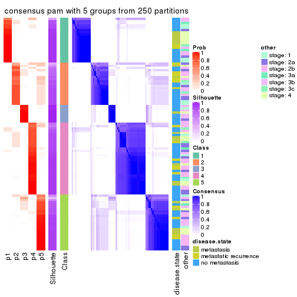</p>

</div>
<div id='tab-ATC-pam-consensus-heatmap-5'>
<pre><code class="r">consensus_heatmap(res, k = 6)
</code></pre>

<p></p>

</div>
</div>

Heatmaps for the membership of samples in all partitions to see how consistent they are:


<script>
$( function() {
	$( '#tabs-ATC-pam-membership-heatmap' ).tabs();
} );
</script>
<div id='tabs-ATC-pam-membership-heatmap'>
<ul>
<li><a href='#tab-ATC-pam-membership-heatmap-1'>k = 2</a></li>
<li><a href='#tab-ATC-pam-membership-heatmap-2'>k = 3</a></li>
<li><a href='#tab-ATC-pam-membership-heatmap-3'>k = 4</a></li>
<li><a href='#tab-ATC-pam-membership-heatmap-4'>k = 5</a></li>
<li><a href='#tab-ATC-pam-membership-heatmap-5'>k = 6</a></li>
</ul>
<div id='tab-ATC-pam-membership-heatmap-1'>
<pre><code class="r">membership_heatmap(res, k = 2)
</code></pre>

<p></p>

</div>
<div id='tab-ATC-pam-membership-heatmap-2'>
<pre><code class="r">membership_heatmap(res, k = 3)
</code></pre>

<p></p>

</div>
<div id='tab-ATC-pam-membership-heatmap-3'>
<pre><code class="r">membership_heatmap(res, k = 4)
</code></pre>

<p></p>

</div>
<div id='tab-ATC-pam-membership-heatmap-4'>
<pre><code class="r">membership_heatmap(res, k = 5)
</code></pre>

<p></p>

</div>
<div id='tab-ATC-pam-membership-heatmap-5'>
<pre><code class="r">membership_heatmap(res, k = 6)
</code></pre>

<p></p>

</div>
</div>

As soon as we have had the classes for columns, we can look for signatures
which are significantly different between classes which can be candidate marks
for certain classes. Following are the heatmaps for signatures.


Signature heatmaps where rows are scaled:


<script>
$( function() {
	$( '#tabs-ATC-pam-get-signatures' ).tabs();
} );
</script>
<div id='tabs-ATC-pam-get-signatures'>
<ul>
<li><a href='#tab-ATC-pam-get-signatures-1'>k = 2</a></li>
<li><a href='#tab-ATC-pam-get-signatures-2'>k = 3</a></li>
<li><a href='#tab-ATC-pam-get-signatures-3'>k = 4</a></li>
<li><a href='#tab-ATC-pam-get-signatures-4'>k = 5</a></li>
<li><a href='#tab-ATC-pam-get-signatures-5'>k = 6</a></li>
</ul>
<div id='tab-ATC-pam-get-signatures-1'>
<pre><code class="r">get_signatures(res, k = 2)
</code></pre>

<p></p>

</div>
<div id='tab-ATC-pam-get-signatures-2'>
<pre><code class="r">get_signatures(res, k = 3)
</code></pre>

<p></p>

</div>
<div id='tab-ATC-pam-get-signatures-3'>
<pre><code class="r">get_signatures(res, k = 4)
</code></pre>

<p></p>

</div>
<div id='tab-ATC-pam-get-signatures-4'>
<pre><code class="r">get_signatures(res, k = 5)
</code></pre>

<p></p>

</div>
<div id='tab-ATC-pam-get-signatures-5'>
<pre><code class="r">get_signatures(res, k = 6)
</code></pre>

<p></p>

</div>
</div>


Signature heatmaps where rows are not scaled:


<script>
$( function() {
	$( '#tabs-ATC-pam-get-signatures-no-scale' ).tabs();
} );
</script>
<div id='tabs-ATC-pam-get-signatures-no-scale'>
<ul>
<li><a href='#tab-ATC-pam-get-signatures-no-scale-1'>k = 2</a></li>
<li><a href='#tab-ATC-pam-get-signatures-no-scale-2'>k = 3</a></li>
<li><a href='#tab-ATC-pam-get-signatures-no-scale-3'>k = 4</a></li>
<li><a href='#tab-ATC-pam-get-signatures-no-scale-4'>k = 5</a></li>
<li><a href='#tab-ATC-pam-get-signatures-no-scale-5'>k = 6</a></li>
</ul>
<div id='tab-ATC-pam-get-signatures-no-scale-1'>
<pre><code class="r">get_signatures(res, k = 2, scale_rows = FALSE)
</code></pre>

<p></p>

</div>
<div id='tab-ATC-pam-get-signatures-no-scale-2'>
<pre><code class="r">get_signatures(res, k = 3, scale_rows = FALSE)
</code></pre>

<p></p>

</div>
<div id='tab-ATC-pam-get-signatures-no-scale-3'>
<pre><code class="r">get_signatures(res, k = 4, scale_rows = FALSE)
</code></pre>

<p></p>

</div>
<div id='tab-ATC-pam-get-signatures-no-scale-4'>
<pre><code class="r">get_signatures(res, k = 5, scale_rows = FALSE)
</code></pre>

<p></p>

</div>
<div id='tab-ATC-pam-get-signatures-no-scale-5'>
<pre><code class="r">get_signatures(res, k = 6, scale_rows = FALSE)
</code></pre>

<p></p>

</div>
</div>


Compare the overlap of signatures from different k:

```r
compare_signatures(res)
```

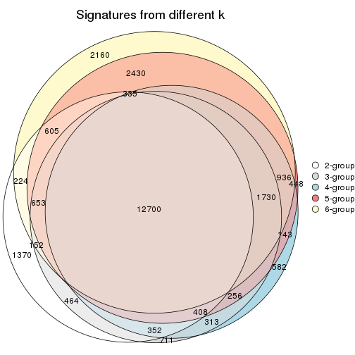

`get_signature()` returns a data frame invisibly. TO get the list of signatures, the function
call should be assigned to a variable explicitly. In following code, if `plot` argument is set
to `FALSE`, no heatmap is plotted while only the differential analysis is performed.

```r
# code only for demonstration
tb = get_signature(res, k = ..., plot = FALSE)
```

An example of the output of `tb` is:

```
#>   which_row         fdr    mean_1    mean_2 scaled_mean_1 scaled_mean_2 km
#> 1        38 0.042760348  8.373488  9.131774    -0.5533452     0.5164555  1
#> 2        40 0.018707592  7.106213  8.469186    -0.6173731     0.5762149  1
#> 3        55 0.019134737 10.221463 11.207825    -0.6159697     0.5749050  1
#> 4        59 0.006059896  5.921854  7.869574    -0.6899429     0.6439467  1
#> 5        60 0.018055526  8.928898 10.211722    -0.6204761     0.5791110  1
#> 6        98 0.009384629 15.714769 14.887706     0.6635654    -0.6193277  2
...
```

The columns in `tb` are:

1. `which_row`: row indices corresponding to the input matrix.
2. `fdr`: FDR for the differential test. 
3. `mean_x`: The mean value in group x.
4. `scaled_mean_x`: The mean value in group x after rows are scaled.
5. `km`: Row groups if k-means clustering is applied to rows.


UMAP plot which shows how samples are separated.


<script>
$( function() {
	$( '#tabs-ATC-pam-dimension-reduction' ).tabs();
} );
</script>
<div id='tabs-ATC-pam-dimension-reduction'>
<ul>
<li><a href='#tab-ATC-pam-dimension-reduction-1'>k = 2</a></li>
<li><a href='#tab-ATC-pam-dimension-reduction-2'>k = 3</a></li>
<li><a href='#tab-ATC-pam-dimension-reduction-3'>k = 4</a></li>
<li><a href='#tab-ATC-pam-dimension-reduction-4'>k = 5</a></li>
<li><a href='#tab-ATC-pam-dimension-reduction-5'>k = 6</a></li>
</ul>
<div id='tab-ATC-pam-dimension-reduction-1'>
<pre><code class="r">dimension_reduction(res, k = 2, method = &quot;UMAP&quot;)
</code></pre>

<p></p>

</div>
<div id='tab-ATC-pam-dimension-reduction-2'>
<pre><code class="r">dimension_reduction(res, k = 3, method = &quot;UMAP&quot;)
</code></pre>

<p>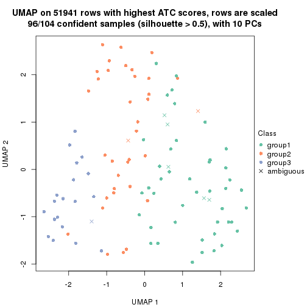</p>

</div>
<div id='tab-ATC-pam-dimension-reduction-3'>
<pre><code class="r">dimension_reduction(res, k = 4, method = &quot;UMAP&quot;)
</code></pre>

<p></p>

</div>
<div id='tab-ATC-pam-dimension-reduction-4'>
<pre><code class="r">dimension_reduction(res, k = 5, method = &quot;UMAP&quot;)
</code></pre>

<p></p>

</div>
<div id='tab-ATC-pam-dimension-reduction-5'>
<pre><code class="r">dimension_reduction(res, k = 6, method = &quot;UMAP&quot;)
</code></pre>

<p></p>

</div>
</div>


Following heatmap shows how subgroups are split when increasing `k`:

```r
collect_classes(res)
```


Test correlation between subgroups and known annotations. If the known
annotation is numeric, one-way ANOVA test is applied, and if the known
annotation is discrete, chi-squared contingency table test is applied.

```r
test_to_known_factors(res)
```

```
#>           n disease.state(p) other(p) k
#> ATC:pam 102           0.0815    0.120 2
#> ATC:pam  96           0.7193    0.629 3
#> ATC:pam  90           0.3490    0.777 4
#> ATC:pam 101           0.6185    0.786 5
#> ATC:pam  99           0.4969    0.646 6
```


If matrix rows can be associated to genes, consider to use `functional_enrichment(res,
...)` to perform function enrichment for the signature genes. See [this vignette](http://bioconductor.org/packages/devel/bioc/vignettes/cola/inst/doc/functional_enrichment.html) for more detailed explanations.


 

---------------------------------------------------


### ATC:mclust


The object with results only for a single top-value method and a single partition method 
can be extracted as:

```r
res = res_list["ATC", "mclust"]
# you can also extract it by
# res = res_list["ATC:mclust"]
```

A summary of `res` and all the functions that can be applied to it:

```r
res
```

```
#> A 'ConsensusPartition' object with k = 2, 3, 4, 5, 6.
#>   On a matrix with 51941 rows and 104 columns.
#>   Top rows (1000, 2000, 3000, 4000, 5000) are extracted by 'ATC' method.
#>   Subgroups are detected by 'mclust' method.
#>   Performed in total 1250 partitions by row resampling.
#>   Best k for subgroups seems to be 3.
#> 
#> Following methods can be applied to this 'ConsensusPartition' object:
#>  [1] "cola_report"             "collect_classes"         "collect_plots"          
#>  [4] "collect_stats"           "colnames"                "compare_signatures"     
#>  [7] "consensus_heatmap"       "dimension_reduction"     "functional_enrichment"  
#> [10] "get_anno_col"            "get_anno"                "get_classes"            
#> [13] "get_consensus"           "get_matrix"              "get_membership"         
#> [16] "get_param"               "get_signatures"          "get_stats"              
#> [19] "is_best_k"               "is_stable_k"             "membership_heatmap"     
#> [22] "ncol"                    "nrow"                    "plot_ecdf"              
#> [25] "rownames"                "select_partition_number" "show"                   
#> [28] "suggest_best_k"          "test_to_known_factors"
```

`collect_plots()` function collects all the plots made from `res` for all `k` (number of partitions)
into one single page to provide an easy and fast comparison between different `k`.

```r
collect_plots(res)
```


The plots are:

- The first row: a plot of the ECDF (empirical cumulative distribution
  function) curves of the consensus matrix for each `k` and the heatmap of
  predicted classes for each `k`.
- The second row: heatmaps of the consensus matrix for each `k`.
- The third row: heatmaps of the membership matrix for each `k`.
- The fouth row: heatmaps of the signatures for each `k`.

All the plots in panels can be made by individual functions and they are
plotted later in this section.

`select_partition_number()` produces several plots showing different
statistics for choosing "optimized" `k`. There are following statistics:

- ECDF curves of the consensus matrix for each `k`;
- 1-PAC. [The PAC
  score](https://en.wikipedia.org/wiki/Consensus_clustering#Over-interpretation_potential_of_consensus_clustering)
  measures the proportion of the ambiguous subgrouping.
- Mean silhouette score.
- Concordance. The mean probability of fiting the consensus class ids in all
  partitions.
- Area increased. Denote $A_k$ as the area under the ECDF curve for current
  `k`, the area increased is defined as $A_k - A_{k-1}$.
- Rand index. The percent of pairs of samples that are both in a same cluster
  or both are not in a same cluster in the partition of k and k-1.
- Jaccard index. The ratio of pairs of samples are both in a same cluster in
  the partition of k and k-1 and the pairs of samples are both in a same
  cluster in the partition k or k-1.

The detailed explanations of these statistics can be found in [the _cola_
vignette](http://bioconductor.org/packages/devel/bioc/vignettes/cola/inst/doc/cola.html#toc_13).

Generally speaking, lower PAC score, higher mean silhouette score or higher
concordance corresponds to better partition. Rand index and Jaccard index
measure how similar the current partition is compared to partition with `k-1`.
If they are too similar, we won't accept `k` is better than `k-1`.

```r
select_partition_number(res)
```


The numeric values for all these statistics can be obtained by `get_stats()`.

```r
get_stats(res)
```

```
#>   k 1-PAC mean_silhouette concordance area_increased  Rand Jaccard
#> 2 2 0.355           0.394       0.806         0.3212 0.779   0.779
#> 3 3 0.530           0.707       0.805         0.7614 0.586   0.496
#> 4 4 0.642           0.807       0.891         0.0719 0.940   0.871
#> 5 5 0.682           0.623       0.764         0.1411 0.827   0.607
#> 6 6 0.636           0.423       0.713         0.1115 0.834   0.512
```

`suggest_best_k()` suggests the best $k$ based on these statistics. The rules are as follows:

- All $k$ with Jaccard index larger than 0.95 are removed because increasing
  $k$ does not provide enough extra information. If all $k$ are removed, it is
  marked as no subgroup is detected.
- For all $k$ with 1-PAC score larger than 0.9, the maximal $k$ is taken as
  the best $k$, and other $k$ are marked as optional $k$.
- If it does not fit the second rule. The $k$ with the maximal vote of the
  highest 1-PAC score, highest mean silhouette, and highest concordance is
  taken as the best $k$.

```r
suggest_best_k(res)
```

```
#> [1] 3
```


Following shows the table of the partitions (You need to click the **show/hide
code output** link to see it). The membership matrix (columns with name `p*`)
is inferred by
[`clue::cl_consensus()`](https://www.rdocumentation.org/link/cl_consensus?package=clue)
function with the `SE` method. Basically the value in the membership matrix
represents the probability to belong to a certain group. The finall class
label for an item is determined with the group with highest probability it
belongs to.

In `get_classes()` function, the entropy is calculated from the membership
matrix and the silhouette score is calculated from the consensus matrix.


<script>
$( function() {
	$( '#tabs-ATC-mclust-get-classes' ).tabs();
} );
</script>
<div id='tabs-ATC-mclust-get-classes'>
<ul>
<li><a href='#tab-ATC-mclust-get-classes-1'>k = 2</a></li>
<li><a href='#tab-ATC-mclust-get-classes-2'>k = 3</a></li>
<li><a href='#tab-ATC-mclust-get-classes-3'>k = 4</a></li>
<li><a href='#tab-ATC-mclust-get-classes-4'>k = 5</a></li>
<li><a href='#tab-ATC-mclust-get-classes-5'>k = 6</a></li>
</ul>

<div id='tab-ATC-mclust-get-classes-1'>
<p><a id='tab-ATC-mclust-get-classes-1-a' style='color:#0366d6' href='#'>show/hide code output</a></p>
<pre><code class="r">cbind(get_classes(res, k = 2), get_membership(res, k = 2))
</code></pre>

<pre><code>#&gt;           class entropy silhouette    p1    p2
#&gt; GSM537341     2  0.1184     0.6839 0.016 0.984
#&gt; GSM537345     2  0.9933    -0.2889 0.452 0.548
#&gt; GSM537355     2  0.0672     0.6878 0.008 0.992
#&gt; GSM537366     1  0.9993     0.4167 0.516 0.484
#&gt; GSM537370     2  0.2043     0.6761 0.032 0.968
#&gt; GSM537380     2  0.1414     0.6809 0.020 0.980
#&gt; GSM537392     2  0.9552     0.0683 0.376 0.624
#&gt; GSM537415     1  0.8327     0.4527 0.736 0.264
#&gt; GSM537417     2  0.9850    -0.2254 0.428 0.572
#&gt; GSM537422     1  0.9996     0.4085 0.512 0.488
#&gt; GSM537423     2  0.1414     0.6860 0.020 0.980
#&gt; GSM537427     2  0.9909    -0.0601 0.444 0.556
#&gt; GSM537430     2  0.0672     0.6883 0.008 0.992
#&gt; GSM537336     2  0.9933    -0.2889 0.452 0.548
#&gt; GSM537337     2  0.9896    -0.0606 0.440 0.560
#&gt; GSM537348     2  0.0376     0.6885 0.004 0.996
#&gt; GSM537349     2  0.2948     0.6550 0.052 0.948
#&gt; GSM537356     2  0.5629     0.5309 0.132 0.868
#&gt; GSM537361     2  0.7139     0.4152 0.196 0.804
#&gt; GSM537374     2  0.0938     0.6886 0.012 0.988
#&gt; GSM537377     2  0.0376     0.6875 0.004 0.996
#&gt; GSM537378     2  0.8016     0.3069 0.244 0.756
#&gt; GSM537379     2  0.0376     0.6889 0.004 0.996
#&gt; GSM537383     2  0.0672     0.6881 0.008 0.992
#&gt; GSM537388     2  0.1184     0.6871 0.016 0.984
#&gt; GSM537395     2  0.9896    -0.0546 0.440 0.560
#&gt; GSM537400     2  0.1184     0.6871 0.016 0.984
#&gt; GSM537404     2  0.9580    -0.0917 0.380 0.620
#&gt; GSM537409     1  0.9896     0.2228 0.560 0.440
#&gt; GSM537418     1  0.9129     0.4032 0.672 0.328
#&gt; GSM537425     2  0.9933    -0.2889 0.452 0.548
#&gt; GSM537333     2  0.0376     0.6885 0.004 0.996
#&gt; GSM537342     2  0.8813     0.1769 0.300 0.700
#&gt; GSM537347     2  0.0376     0.6885 0.004 0.996
#&gt; GSM537350     2  0.9963    -0.2973 0.464 0.536
#&gt; GSM537362     2  0.0672     0.6883 0.008 0.992
#&gt; GSM537363     2  0.9954    -0.3128 0.460 0.540
#&gt; GSM537368     1  0.9993     0.4167 0.516 0.484
#&gt; GSM537376     2  0.0672     0.6883 0.008 0.992
#&gt; GSM537381     2  0.0938     0.6858 0.012 0.988
#&gt; GSM537386     2  0.1184     0.6871 0.016 0.984
#&gt; GSM537398     2  0.0376     0.6885 0.004 0.996
#&gt; GSM537402     2  0.0672     0.6878 0.008 0.992
#&gt; GSM537405     2  0.9850    -0.2254 0.428 0.572
#&gt; GSM537371     2  0.9933    -0.2889 0.452 0.548
#&gt; GSM537421     2  0.9866    -0.2314 0.432 0.568
#&gt; GSM537424     2  0.0376     0.6875 0.004 0.996
#&gt; GSM537432     2  0.1414     0.6859 0.020 0.980
#&gt; GSM537331     2  0.1184     0.6871 0.016 0.984
#&gt; GSM537332     2  0.1843     0.6809 0.028 0.972
#&gt; GSM537334     2  0.0938     0.6867 0.012 0.988
#&gt; GSM537338     2  0.0672     0.6887 0.008 0.992
#&gt; GSM537353     2  0.0672     0.6878 0.008 0.992
#&gt; GSM537357     2  0.9866    -0.2314 0.432 0.568
#&gt; GSM537358     2  0.1184     0.6867 0.016 0.984
#&gt; GSM537375     2  0.0376     0.6875 0.004 0.996
#&gt; GSM537389     2  0.9933    -0.0700 0.452 0.548
#&gt; GSM537390     2  0.9933    -0.0708 0.452 0.548
#&gt; GSM537393     2  0.9909    -0.0664 0.444 0.556
#&gt; GSM537399     2  0.1184     0.6871 0.016 0.984
#&gt; GSM537407     2  0.0672     0.6878 0.008 0.992
#&gt; GSM537408     2  0.6712     0.4735 0.176 0.824
#&gt; GSM537428     2  0.1184     0.6867 0.016 0.984
#&gt; GSM537354     1  0.8386     0.4529 0.732 0.268
#&gt; GSM537410     2  0.9933    -0.2661 0.452 0.548
#&gt; GSM537413     2  0.9909    -0.0634 0.444 0.556
#&gt; GSM537396     2  0.1414     0.6860 0.020 0.980
#&gt; GSM537397     2  0.1414     0.6833 0.020 0.980
#&gt; GSM537330     2  0.1414     0.6809 0.020 0.980
#&gt; GSM537369     2  0.6148     0.4973 0.152 0.848
#&gt; GSM537373     2  0.0376     0.6875 0.004 0.996
#&gt; GSM537401     2  0.0938     0.6886 0.012 0.988
#&gt; GSM537343     2  0.8713     0.1869 0.292 0.708
#&gt; GSM537367     1  0.9988     0.4145 0.520 0.480
#&gt; GSM537382     2  0.2043     0.6724 0.032 0.968
#&gt; GSM537385     2  0.1633     0.6778 0.024 0.976
#&gt; GSM537391     2  0.1184     0.6867 0.016 0.984
#&gt; GSM537419     2  0.1184     0.6867 0.016 0.984
#&gt; GSM537420     2  0.8861     0.1798 0.304 0.696
#&gt; GSM537429     2  0.9922    -0.0639 0.448 0.552
#&gt; GSM537431     2  0.1184     0.6867 0.016 0.984
#&gt; GSM537387     2  0.0000     0.6884 0.000 1.000
#&gt; GSM537414     2  0.9000     0.1454 0.316 0.684
#&gt; GSM537433     1  0.9993     0.4167 0.516 0.484
#&gt; GSM537335     2  0.0376     0.6885 0.004 0.996
#&gt; GSM537339     2  0.0938     0.6865 0.012 0.988
#&gt; GSM537340     1  0.9993     0.4167 0.516 0.484
#&gt; GSM537344     2  0.8713     0.1869 0.292 0.708
#&gt; GSM537346     2  0.1843     0.6791 0.028 0.972
#&gt; GSM537351     2  0.9963    -0.2973 0.464 0.536
#&gt; GSM537352     2  0.4815     0.5773 0.104 0.896
#&gt; GSM537359     2  0.1184     0.6867 0.016 0.984
#&gt; GSM537360     2  0.9922    -0.2504 0.448 0.552
#&gt; GSM537364     1  0.9983     0.4068 0.524 0.476
#&gt; GSM537365     2  0.1184     0.6867 0.016 0.984
#&gt; GSM537372     2  0.0376     0.6875 0.004 0.996
#&gt; GSM537384     2  0.0376     0.6875 0.004 0.996
#&gt; GSM537394     2  0.1184     0.6871 0.016 0.984
#&gt; GSM537403     2  0.9963    -0.2973 0.464 0.536
#&gt; GSM537406     2  0.9963    -0.2973 0.464 0.536
#&gt; GSM537411     2  0.0000     0.6884 0.000 1.000
#&gt; GSM537412     2  0.9963    -0.2973 0.464 0.536
#&gt; GSM537416     1  0.8386     0.4528 0.732 0.268
#&gt; GSM537426     1  0.9815     0.2687 0.580 0.420
</code></pre>

<script>
$('#tab-ATC-mclust-get-classes-1-a').parent().next().next().hide();
$('#tab-ATC-mclust-get-classes-1-a').click(function(){
  $('#tab-ATC-mclust-get-classes-1-a').parent().next().next().toggle();
  return(false);
});
</script>
</div>

<div id='tab-ATC-mclust-get-classes-2'>
<p><a id='tab-ATC-mclust-get-classes-2-a' style='color:#0366d6' href='#'>show/hide code output</a></p>
<pre><code class="r">cbind(get_classes(res, k = 3), get_membership(res, k = 3))
</code></pre>

<pre><code>#&gt;           class entropy silhouette    p1    p2    p3
#&gt; GSM537341     2  0.0000     0.8846 0.000 1.000 0.000
#&gt; GSM537345     1  0.2537     0.6134 0.920 0.080 0.000
#&gt; GSM537355     1  0.9292     0.5033 0.516 0.284 0.200
#&gt; GSM537366     3  0.6678     0.7752 0.480 0.008 0.512
#&gt; GSM537370     2  0.3686     0.8511 0.000 0.860 0.140
#&gt; GSM537380     2  0.2066     0.8820 0.000 0.940 0.060
#&gt; GSM537392     2  0.4974     0.7921 0.000 0.764 0.236
#&gt; GSM537415     1  0.6879     0.5455 0.556 0.016 0.428
#&gt; GSM537417     1  0.2356     0.6105 0.928 0.072 0.000
#&gt; GSM537422     1  0.5156    -0.0842 0.776 0.008 0.216
#&gt; GSM537423     1  0.8812     0.5671 0.516 0.124 0.360
#&gt; GSM537427     2  0.5678     0.7183 0.000 0.684 0.316
#&gt; GSM537430     2  0.1015     0.8803 0.008 0.980 0.012
#&gt; GSM537336     1  0.3550     0.5893 0.896 0.080 0.024
#&gt; GSM537337     3  0.9716    -0.2383 0.228 0.344 0.428
#&gt; GSM537348     2  0.0237     0.8841 0.004 0.996 0.000
#&gt; GSM537349     2  0.4291     0.8289 0.000 0.820 0.180
#&gt; GSM537356     1  0.8034     0.4908 0.584 0.336 0.080
#&gt; GSM537361     1  0.4994     0.5980 0.816 0.160 0.024
#&gt; GSM537374     2  0.1015     0.8803 0.008 0.980 0.012
#&gt; GSM537377     2  0.2050     0.8814 0.020 0.952 0.028
#&gt; GSM537378     2  0.5728     0.7576 0.008 0.720 0.272
#&gt; GSM537379     2  0.2200     0.8848 0.004 0.940 0.056
#&gt; GSM537383     2  0.2537     0.8766 0.000 0.920 0.080
#&gt; GSM537388     2  0.1411     0.8860 0.000 0.964 0.036
#&gt; GSM537395     2  0.7232     0.5376 0.028 0.544 0.428
#&gt; GSM537400     2  0.0661     0.8821 0.004 0.988 0.008
#&gt; GSM537404     1  0.2356     0.6105 0.928 0.072 0.000
#&gt; GSM537409     1  0.7438     0.5395 0.536 0.036 0.428
#&gt; GSM537418     1  0.7337     0.5414 0.540 0.032 0.428
#&gt; GSM537425     1  0.2537     0.6134 0.920 0.080 0.000
#&gt; GSM537333     2  0.0661     0.8821 0.004 0.988 0.008
#&gt; GSM537342     1  0.6372     0.6391 0.764 0.084 0.152
#&gt; GSM537347     2  0.0661     0.8821 0.004 0.988 0.008
#&gt; GSM537350     1  0.2590     0.6123 0.924 0.072 0.004
#&gt; GSM537362     2  0.0237     0.8841 0.004 0.996 0.000
#&gt; GSM537363     1  0.7509    -0.1962 0.636 0.064 0.300
#&gt; GSM537368     3  0.6678     0.7752 0.480 0.008 0.512
#&gt; GSM537376     2  0.0475     0.8833 0.004 0.992 0.004
#&gt; GSM537381     2  0.3851     0.8535 0.004 0.860 0.136
#&gt; GSM537386     2  0.2200     0.8577 0.004 0.940 0.056
#&gt; GSM537398     2  0.0848     0.8818 0.008 0.984 0.008
#&gt; GSM537402     2  0.7966     0.6046 0.128 0.652 0.220
#&gt; GSM537405     1  0.2356     0.6105 0.928 0.072 0.000
#&gt; GSM537371     1  0.2537     0.6134 0.920 0.080 0.000
#&gt; GSM537421     1  0.2902     0.6126 0.920 0.064 0.016
#&gt; GSM537424     2  0.4280     0.8472 0.020 0.856 0.124
#&gt; GSM537432     2  0.0237     0.8852 0.000 0.996 0.004
#&gt; GSM537331     2  0.2200     0.8577 0.004 0.940 0.056
#&gt; GSM537332     2  0.3686     0.8488 0.000 0.860 0.140
#&gt; GSM537334     2  0.2384     0.8560 0.008 0.936 0.056
#&gt; GSM537338     2  0.0475     0.8833 0.004 0.992 0.004
#&gt; GSM537353     1  0.9268     0.5509 0.512 0.188 0.300
#&gt; GSM537357     1  0.2902     0.6131 0.920 0.064 0.016
#&gt; GSM537358     2  0.3572     0.8716 0.040 0.900 0.060
#&gt; GSM537375     2  0.1267     0.8862 0.004 0.972 0.024
#&gt; GSM537389     2  0.6264     0.6401 0.004 0.616 0.380
#&gt; GSM537390     2  0.6189     0.6593 0.004 0.632 0.364
#&gt; GSM537393     2  0.6298     0.6302 0.004 0.608 0.388
#&gt; GSM537399     2  0.1015     0.8820 0.012 0.980 0.008
#&gt; GSM537407     2  0.1482     0.8803 0.020 0.968 0.012
#&gt; GSM537408     1  0.9048     0.5258 0.548 0.268 0.184
#&gt; GSM537428     2  0.1919     0.8833 0.020 0.956 0.024
#&gt; GSM537354     1  0.6994     0.5480 0.556 0.020 0.424
#&gt; GSM537410     1  0.2590     0.6135 0.924 0.072 0.004
#&gt; GSM537413     2  0.5968     0.6618 0.000 0.636 0.364
#&gt; GSM537396     2  0.6180     0.7495 0.024 0.716 0.260
#&gt; GSM537397     2  0.4235     0.8301 0.000 0.824 0.176
#&gt; GSM537330     2  0.1964     0.8829 0.000 0.944 0.056
#&gt; GSM537369     1  0.9111     0.5602 0.548 0.212 0.240
#&gt; GSM537373     1  0.8875     0.5768 0.528 0.136 0.336
#&gt; GSM537401     2  0.0475     0.8833 0.004 0.992 0.004
#&gt; GSM537343     1  0.5944     0.6400 0.792 0.088 0.120
#&gt; GSM537367     3  0.6518     0.7711 0.484 0.004 0.512
#&gt; GSM537382     2  0.4555     0.8158 0.000 0.800 0.200
#&gt; GSM537385     2  0.2448     0.8788 0.000 0.924 0.076
#&gt; GSM537391     2  0.1182     0.8867 0.012 0.976 0.012
#&gt; GSM537419     2  0.1585     0.8854 0.008 0.964 0.028
#&gt; GSM537420     1  0.4526     0.6223 0.856 0.104 0.040
#&gt; GSM537429     2  0.5785     0.6871 0.000 0.668 0.332
#&gt; GSM537431     2  0.1482     0.8803 0.020 0.968 0.012
#&gt; GSM537387     2  0.3619     0.8532 0.000 0.864 0.136
#&gt; GSM537414     1  0.7919     0.5851 0.556 0.064 0.380
#&gt; GSM537433     3  0.6678     0.7752 0.480 0.008 0.512
#&gt; GSM537335     2  0.2301     0.8578 0.004 0.936 0.060
#&gt; GSM537339     2  0.4062     0.8376 0.000 0.836 0.164
#&gt; GSM537340     3  0.6678     0.7752 0.480 0.008 0.512
#&gt; GSM537344     1  0.5096     0.6352 0.836 0.084 0.080
#&gt; GSM537346     2  0.2711     0.8736 0.000 0.912 0.088
#&gt; GSM537351     1  0.2590     0.6123 0.924 0.072 0.004
#&gt; GSM537352     1  0.8635     0.5804 0.532 0.112 0.356
#&gt; GSM537359     2  0.1999     0.8785 0.036 0.952 0.012
#&gt; GSM537360     1  0.8073     0.6008 0.576 0.080 0.344
#&gt; GSM537364     3  0.7476     0.7179 0.452 0.036 0.512
#&gt; GSM537365     1  0.8538     0.4459 0.520 0.380 0.100
#&gt; GSM537372     2  0.1015     0.8805 0.012 0.980 0.008
#&gt; GSM537384     2  0.1832     0.8860 0.008 0.956 0.036
#&gt; GSM537394     2  0.0892     0.8870 0.000 0.980 0.020
#&gt; GSM537403     1  0.3370     0.5919 0.904 0.072 0.024
#&gt; GSM537406     1  0.2590     0.6123 0.924 0.072 0.004
#&gt; GSM537411     2  0.0848     0.8818 0.008 0.984 0.008
#&gt; GSM537412     1  0.6982     0.1477 0.708 0.072 0.220
#&gt; GSM537416     1  0.6879     0.5455 0.556 0.016 0.428
#&gt; GSM537426     1  0.7517     0.5493 0.540 0.040 0.420
</code></pre>

<script>
$('#tab-ATC-mclust-get-classes-2-a').parent().next().next().hide();
$('#tab-ATC-mclust-get-classes-2-a').click(function(){
  $('#tab-ATC-mclust-get-classes-2-a').parent().next().next().toggle();
  return(false);
});
</script>
</div>

<div id='tab-ATC-mclust-get-classes-3'>
<p><a id='tab-ATC-mclust-get-classes-3-a' style='color:#0366d6' href='#'>show/hide code output</a></p>
<pre><code class="r">cbind(get_classes(res, k = 4), get_membership(res, k = 4))
</code></pre>

<pre><code>#&gt;           class entropy silhouette    p1    p2    p3    p4
#&gt; GSM537341     2  0.0188     0.9164 0.000 0.996 0.000 0.004
#&gt; GSM537345     3  0.3787     0.8048 0.124 0.000 0.840 0.036
#&gt; GSM537355     3  0.3448     0.7343 0.000 0.168 0.828 0.004
#&gt; GSM537366     1  0.0000     0.8504 1.000 0.000 0.000 0.000
#&gt; GSM537370     2  0.0524     0.9164 0.000 0.988 0.008 0.004
#&gt; GSM537380     2  0.0376     0.9167 0.000 0.992 0.004 0.004
#&gt; GSM537392     2  0.1488     0.9062 0.000 0.956 0.032 0.012
#&gt; GSM537415     3  0.1211     0.7917 0.000 0.000 0.960 0.040
#&gt; GSM537417     3  0.3547     0.8092 0.144 0.016 0.840 0.000
#&gt; GSM537422     3  0.5334     0.4295 0.400 0.008 0.588 0.004
#&gt; GSM537423     3  0.5188     0.4726 0.000 0.240 0.716 0.044
#&gt; GSM537427     2  0.2730     0.8660 0.000 0.896 0.088 0.016
#&gt; GSM537430     2  0.2999     0.8174 0.000 0.864 0.004 0.132
#&gt; GSM537336     3  0.5085     0.6795 0.256 0.008 0.716 0.020
#&gt; GSM537337     2  0.5267     0.6159 0.000 0.712 0.240 0.048
#&gt; GSM537348     2  0.0000     0.9164 0.000 1.000 0.000 0.000
#&gt; GSM537349     2  0.0804     0.9147 0.000 0.980 0.008 0.012
#&gt; GSM537356     3  0.3157     0.7654 0.004 0.144 0.852 0.000
#&gt; GSM537361     3  0.4286     0.8125 0.072 0.056 0.844 0.028
#&gt; GSM537374     2  0.4655     0.5137 0.000 0.684 0.004 0.312
#&gt; GSM537377     2  0.2845     0.8469 0.000 0.896 0.076 0.028
#&gt; GSM537378     2  0.2222     0.8874 0.000 0.924 0.060 0.016
#&gt; GSM537379     2  0.0000     0.9164 0.000 1.000 0.000 0.000
#&gt; GSM537383     2  0.0376     0.9167 0.000 0.992 0.004 0.004
#&gt; GSM537388     2  0.0188     0.9164 0.000 0.996 0.000 0.004
#&gt; GSM537395     2  0.4100     0.7871 0.000 0.824 0.128 0.048
#&gt; GSM537400     2  0.2888     0.8288 0.000 0.872 0.004 0.124
#&gt; GSM537404     3  0.4038     0.8163 0.108 0.016 0.844 0.032
#&gt; GSM537409     3  0.1474     0.7851 0.000 0.000 0.948 0.052
#&gt; GSM537418     3  0.1807     0.7887 0.000 0.008 0.940 0.052
#&gt; GSM537425     3  0.3932     0.8042 0.128 0.004 0.836 0.032
#&gt; GSM537333     2  0.0779     0.9123 0.000 0.980 0.004 0.016
#&gt; GSM537342     3  0.1724     0.8206 0.032 0.020 0.948 0.000
#&gt; GSM537347     2  0.1398     0.9009 0.000 0.956 0.004 0.040
#&gt; GSM537350     3  0.4185     0.8159 0.080 0.016 0.844 0.060
#&gt; GSM537362     2  0.0000     0.9164 0.000 1.000 0.000 0.000
#&gt; GSM537363     1  0.5704    -0.2314 0.496 0.008 0.484 0.012
#&gt; GSM537368     1  0.0000     0.8504 1.000 0.000 0.000 0.000
#&gt; GSM537376     2  0.0188     0.9157 0.000 0.996 0.004 0.000
#&gt; GSM537381     2  0.0376     0.9166 0.000 0.992 0.004 0.004
#&gt; GSM537386     4  0.3539     0.9605 0.000 0.176 0.004 0.820
#&gt; GSM537398     2  0.3831     0.7277 0.000 0.792 0.004 0.204
#&gt; GSM537402     2  0.1767     0.8936 0.000 0.944 0.044 0.012
#&gt; GSM537405     3  0.4001     0.8160 0.112 0.016 0.844 0.028
#&gt; GSM537371     3  0.3842     0.8028 0.128 0.000 0.836 0.036
#&gt; GSM537421     3  0.3263     0.8201 0.100 0.012 0.876 0.012
#&gt; GSM537424     2  0.0804     0.9137 0.000 0.980 0.008 0.012
#&gt; GSM537432     2  0.0188     0.9164 0.000 0.996 0.000 0.004
#&gt; GSM537331     4  0.3539     0.9605 0.000 0.176 0.004 0.820
#&gt; GSM537332     2  0.0376     0.9170 0.000 0.992 0.004 0.004
#&gt; GSM537334     4  0.3870     0.8846 0.000 0.208 0.004 0.788
#&gt; GSM537338     2  0.0188     0.9164 0.000 0.996 0.000 0.004
#&gt; GSM537353     3  0.5778     0.0328 0.000 0.472 0.500 0.028
#&gt; GSM537357     3  0.3601     0.8189 0.100 0.012 0.864 0.024
#&gt; GSM537358     2  0.2908     0.8630 0.000 0.896 0.040 0.064
#&gt; GSM537375     2  0.0188     0.9157 0.000 0.996 0.004 0.000
#&gt; GSM537389     2  0.3280     0.8291 0.000 0.860 0.124 0.016
#&gt; GSM537390     2  0.3280     0.8291 0.000 0.860 0.124 0.016
#&gt; GSM537393     2  0.3280     0.8291 0.000 0.860 0.124 0.016
#&gt; GSM537399     2  0.4655     0.5137 0.000 0.684 0.004 0.312
#&gt; GSM537407     2  0.3885     0.7878 0.000 0.844 0.092 0.064
#&gt; GSM537408     3  0.3665     0.8131 0.016 0.052 0.872 0.060
#&gt; GSM537428     2  0.0657     0.9149 0.000 0.984 0.004 0.012
#&gt; GSM537354     3  0.1545     0.7952 0.000 0.008 0.952 0.040
#&gt; GSM537410     3  0.3547     0.8092 0.144 0.016 0.840 0.000
#&gt; GSM537413     2  0.3224     0.8348 0.000 0.864 0.120 0.016
#&gt; GSM537396     2  0.2412     0.8719 0.000 0.908 0.084 0.008
#&gt; GSM537397     2  0.0937     0.9123 0.000 0.976 0.012 0.012
#&gt; GSM537330     2  0.0376     0.9167 0.000 0.992 0.004 0.004
#&gt; GSM537369     3  0.2999     0.7748 0.000 0.132 0.864 0.004
#&gt; GSM537373     3  0.2751     0.7981 0.000 0.056 0.904 0.040
#&gt; GSM537401     2  0.0000     0.9164 0.000 1.000 0.000 0.000
#&gt; GSM537343     3  0.3574     0.8196 0.064 0.056 0.872 0.008
#&gt; GSM537367     1  0.0000     0.8504 1.000 0.000 0.000 0.000
#&gt; GSM537382     2  0.0672     0.9156 0.000 0.984 0.008 0.008
#&gt; GSM537385     2  0.0000     0.9164 0.000 1.000 0.000 0.000
#&gt; GSM537391     2  0.0188     0.9157 0.000 0.996 0.004 0.000
#&gt; GSM537419     2  0.0376     0.9163 0.000 0.992 0.004 0.004
#&gt; GSM537420     3  0.4172     0.8127 0.044 0.020 0.844 0.092
#&gt; GSM537429     2  0.2976     0.8403 0.000 0.872 0.120 0.008
#&gt; GSM537431     2  0.3791     0.7398 0.000 0.796 0.004 0.200
#&gt; GSM537387     2  0.0376     0.9167 0.000 0.992 0.004 0.004
#&gt; GSM537414     3  0.1356     0.7981 0.000 0.008 0.960 0.032
#&gt; GSM537433     1  0.0000     0.8504 1.000 0.000 0.000 0.000
#&gt; GSM537335     4  0.3539     0.9605 0.000 0.176 0.004 0.820
#&gt; GSM537339     2  0.0524     0.9164 0.000 0.988 0.008 0.004
#&gt; GSM537340     1  0.0188     0.8474 0.996 0.000 0.000 0.004
#&gt; GSM537344     3  0.3781     0.8200 0.104 0.024 0.856 0.016
#&gt; GSM537346     2  0.0376     0.9167 0.000 0.992 0.004 0.004
#&gt; GSM537351     3  0.3730     0.8084 0.144 0.016 0.836 0.004
#&gt; GSM537352     3  0.2589     0.7965 0.000 0.044 0.912 0.044
#&gt; GSM537359     2  0.2737     0.8657 0.000 0.888 0.008 0.104
#&gt; GSM537360     3  0.0657     0.8089 0.000 0.012 0.984 0.004
#&gt; GSM537364     1  0.0376     0.8398 0.992 0.004 0.004 0.000
#&gt; GSM537365     3  0.4872     0.3998 0.000 0.356 0.640 0.004
#&gt; GSM537372     2  0.1576     0.8966 0.000 0.948 0.004 0.048
#&gt; GSM537384     2  0.0188     0.9157 0.000 0.996 0.004 0.000
#&gt; GSM537394     2  0.0188     0.9164 0.000 0.996 0.000 0.004
#&gt; GSM537403     3  0.5306     0.6872 0.236 0.008 0.720 0.036
#&gt; GSM537406     3  0.4327     0.8134 0.084 0.016 0.836 0.064
#&gt; GSM537411     2  0.3157     0.8067 0.000 0.852 0.004 0.144
#&gt; GSM537412     3  0.5463     0.1373 0.488 0.008 0.500 0.004
#&gt; GSM537416     3  0.1211     0.7917 0.000 0.000 0.960 0.040
#&gt; GSM537426     3  0.1389     0.7873 0.000 0.000 0.952 0.048
</code></pre>

<script>
$('#tab-ATC-mclust-get-classes-3-a').parent().next().next().hide();
$('#tab-ATC-mclust-get-classes-3-a').click(function(){
  $('#tab-ATC-mclust-get-classes-3-a').parent().next().next().toggle();
  return(false);
});
</script>
</div>

<div id='tab-ATC-mclust-get-classes-4'>
<p><a id='tab-ATC-mclust-get-classes-4-a' style='color:#0366d6' href='#'>show/hide code output</a></p>
<pre><code class="r">cbind(get_classes(res, k = 5), get_membership(res, k = 5))
</code></pre>

<pre><code>#&gt;           class entropy silhouette    p1    p2    p3    p4    p5
#&gt; GSM537341     2  0.1211    0.85331 0.000 0.960 0.016 0.024 0.000
#&gt; GSM537345     1  0.4192    0.80531 0.596 0.000 0.000 0.000 0.404
#&gt; GSM537355     5  0.5844    0.23916 0.000 0.244 0.000 0.156 0.600
#&gt; GSM537366     1  0.0000    0.62566 1.000 0.000 0.000 0.000 0.000
#&gt; GSM537370     2  0.0880    0.86053 0.000 0.968 0.000 0.032 0.000
#&gt; GSM537380     2  0.1202    0.86068 0.000 0.960 0.004 0.032 0.004
#&gt; GSM537392     2  0.0880    0.86053 0.000 0.968 0.000 0.032 0.000
#&gt; GSM537415     4  0.2006    0.72031 0.000 0.012 0.000 0.916 0.072
#&gt; GSM537417     5  0.4305   -0.65794 0.488 0.000 0.000 0.000 0.512
#&gt; GSM537422     1  0.4138    0.80975 0.616 0.000 0.000 0.000 0.384
#&gt; GSM537423     4  0.6486    0.21497 0.000 0.236 0.000 0.492 0.272
#&gt; GSM537427     2  0.0880    0.86053 0.000 0.968 0.000 0.032 0.000
#&gt; GSM537430     2  0.4384    0.39162 0.000 0.660 0.324 0.016 0.000
#&gt; GSM537336     1  0.4182    0.80769 0.600 0.000 0.000 0.000 0.400
#&gt; GSM537337     2  0.5111    0.01937 0.000 0.500 0.000 0.464 0.036
#&gt; GSM537348     2  0.1997    0.84211 0.000 0.932 0.016 0.028 0.024
#&gt; GSM537349     2  0.0880    0.86053 0.000 0.968 0.000 0.032 0.000
#&gt; GSM537356     5  0.0771    0.43204 0.000 0.004 0.000 0.020 0.976
#&gt; GSM537361     5  0.1012    0.42967 0.000 0.000 0.012 0.020 0.968
#&gt; GSM537374     3  0.4538    0.52247 0.000 0.364 0.620 0.016 0.000
#&gt; GSM537377     2  0.4598    0.53867 0.000 0.664 0.008 0.016 0.312
#&gt; GSM537378     2  0.1281    0.85963 0.000 0.956 0.000 0.032 0.012
#&gt; GSM537379     2  0.0566    0.85959 0.000 0.984 0.012 0.004 0.000
#&gt; GSM537383     2  0.1168    0.86058 0.000 0.960 0.008 0.032 0.000
#&gt; GSM537388     2  0.0880    0.86137 0.000 0.968 0.000 0.032 0.000
#&gt; GSM537395     2  0.1851    0.82545 0.000 0.912 0.000 0.088 0.000
#&gt; GSM537400     2  0.4522    0.39664 0.000 0.660 0.316 0.024 0.000
#&gt; GSM537404     5  0.3048    0.17243 0.176 0.000 0.004 0.000 0.820
#&gt; GSM537409     4  0.2006    0.72031 0.000 0.012 0.000 0.916 0.072
#&gt; GSM537418     4  0.2069    0.71991 0.000 0.012 0.000 0.912 0.076
#&gt; GSM537425     1  0.4182    0.80769 0.600 0.000 0.000 0.000 0.400
#&gt; GSM537333     2  0.1314    0.85195 0.000 0.960 0.012 0.016 0.012
#&gt; GSM537342     4  0.4387    0.53456 0.000 0.012 0.000 0.640 0.348
#&gt; GSM537347     2  0.3849    0.72281 0.000 0.800 0.020 0.016 0.164
#&gt; GSM537350     1  0.4622    0.73980 0.548 0.000 0.000 0.012 0.440
#&gt; GSM537362     2  0.2875    0.81361 0.000 0.888 0.020 0.032 0.060
#&gt; GSM537363     1  0.4114    0.80614 0.624 0.000 0.000 0.000 0.376
#&gt; GSM537368     1  0.0000    0.62566 1.000 0.000 0.000 0.000 0.000
#&gt; GSM537376     2  0.1386    0.85011 0.000 0.952 0.016 0.032 0.000
#&gt; GSM537381     2  0.0404    0.85952 0.000 0.988 0.000 0.000 0.012
#&gt; GSM537386     3  0.0290    0.61401 0.000 0.000 0.992 0.008 0.000
#&gt; GSM537398     3  0.4538    0.52247 0.000 0.364 0.620 0.016 0.000
#&gt; GSM537402     2  0.4718    0.12567 0.000 0.540 0.000 0.016 0.444
#&gt; GSM537405     5  0.3274    0.04781 0.220 0.000 0.000 0.000 0.780
#&gt; GSM537371     1  0.4182    0.80769 0.600 0.000 0.000 0.000 0.400
#&gt; GSM537421     1  0.4517    0.80325 0.600 0.012 0.000 0.000 0.388
#&gt; GSM537424     2  0.5049    0.22035 0.000 0.548 0.012 0.016 0.424
#&gt; GSM537432     2  0.0955    0.85308 0.000 0.968 0.004 0.028 0.000
#&gt; GSM537331     3  0.0290    0.61401 0.000 0.000 0.992 0.008 0.000
#&gt; GSM537332     2  0.0880    0.86137 0.000 0.968 0.000 0.032 0.000
#&gt; GSM537334     3  0.1544    0.63130 0.000 0.068 0.932 0.000 0.000
#&gt; GSM537338     2  0.1300    0.85124 0.000 0.956 0.016 0.028 0.000
#&gt; GSM537353     5  0.6804    0.03598 0.000 0.332 0.000 0.300 0.368
#&gt; GSM537357     1  0.4182    0.80769 0.600 0.000 0.000 0.000 0.400
#&gt; GSM537358     2  0.4806    0.42506 0.000 0.640 0.004 0.028 0.328
#&gt; GSM537375     2  0.1372    0.85080 0.000 0.956 0.004 0.016 0.024
#&gt; GSM537389     2  0.0880    0.86053 0.000 0.968 0.000 0.032 0.000
#&gt; GSM537390     2  0.0880    0.86053 0.000 0.968 0.000 0.032 0.000
#&gt; GSM537393     2  0.0880    0.86053 0.000 0.968 0.000 0.032 0.000
#&gt; GSM537399     3  0.4787    0.51760 0.000 0.364 0.608 0.028 0.000
#&gt; GSM537407     5  0.5219    0.09469 0.000 0.420 0.020 0.016 0.544
#&gt; GSM537408     5  0.4192    0.22043 0.000 0.032 0.000 0.232 0.736
#&gt; GSM537428     5  0.5124   -0.09532 0.000 0.484 0.004 0.028 0.484
#&gt; GSM537354     4  0.2006    0.72031 0.000 0.012 0.000 0.916 0.072
#&gt; GSM537410     1  0.4150    0.80930 0.612 0.000 0.000 0.000 0.388
#&gt; GSM537413     2  0.0880    0.86053 0.000 0.968 0.000 0.032 0.000
#&gt; GSM537396     2  0.0703    0.85605 0.000 0.976 0.000 0.024 0.000
#&gt; GSM537397     2  0.0880    0.86053 0.000 0.968 0.000 0.032 0.000
#&gt; GSM537330     2  0.0880    0.86053 0.000 0.968 0.000 0.032 0.000
#&gt; GSM537369     5  0.2966    0.28021 0.000 0.000 0.000 0.184 0.816
#&gt; GSM537373     4  0.6504    0.23361 0.000 0.196 0.000 0.448 0.356
#&gt; GSM537401     2  0.1891    0.84459 0.000 0.936 0.016 0.032 0.016
#&gt; GSM537343     5  0.3177    0.23086 0.000 0.000 0.000 0.208 0.792
#&gt; GSM537367     1  0.0000    0.62566 1.000 0.000 0.000 0.000 0.000
#&gt; GSM537382     2  0.0880    0.86053 0.000 0.968 0.000 0.032 0.000
#&gt; GSM537385     2  0.0771    0.86208 0.000 0.976 0.004 0.020 0.000
#&gt; GSM537391     2  0.1461    0.84870 0.000 0.952 0.004 0.028 0.016
#&gt; GSM537419     2  0.4295    0.62043 0.000 0.724 0.004 0.024 0.248
#&gt; GSM537420     5  0.0880    0.42932 0.000 0.000 0.000 0.032 0.968
#&gt; GSM537429     2  0.1043    0.86038 0.000 0.960 0.000 0.040 0.000
#&gt; GSM537431     2  0.6722    0.09633 0.000 0.520 0.308 0.028 0.144
#&gt; GSM537387     2  0.1012    0.86164 0.000 0.968 0.000 0.020 0.012
#&gt; GSM537414     4  0.3949    0.55748 0.000 0.000 0.000 0.668 0.332
#&gt; GSM537433     1  0.0000    0.62566 1.000 0.000 0.000 0.000 0.000
#&gt; GSM537335     3  0.0290    0.61401 0.000 0.000 0.992 0.008 0.000
#&gt; GSM537339     2  0.1281    0.85963 0.000 0.956 0.000 0.032 0.012
#&gt; GSM537340     1  0.0000    0.62566 1.000 0.000 0.000 0.000 0.000
#&gt; GSM537344     5  0.0703    0.42850 0.000 0.000 0.000 0.024 0.976
#&gt; GSM537346     2  0.0880    0.86053 0.000 0.968 0.000 0.032 0.000
#&gt; GSM537351     1  0.4517    0.80604 0.600 0.000 0.000 0.012 0.388
#&gt; GSM537352     4  0.6425    0.28719 0.000 0.188 0.000 0.476 0.336
#&gt; GSM537359     5  0.5225   -0.00676 0.000 0.456 0.008 0.028 0.508
#&gt; GSM537360     4  0.4088    0.49790 0.000 0.000 0.000 0.632 0.368
#&gt; GSM537364     1  0.0290    0.62907 0.992 0.000 0.000 0.000 0.008
#&gt; GSM537365     5  0.4583    0.33037 0.000 0.296 0.000 0.032 0.672
#&gt; GSM537372     2  0.4658    0.57358 0.000 0.684 0.016 0.016 0.284
#&gt; GSM537384     2  0.1710    0.84424 0.000 0.940 0.004 0.016 0.040
#&gt; GSM537394     2  0.0510    0.85985 0.000 0.984 0.000 0.016 0.000
#&gt; GSM537403     1  0.4517    0.80604 0.600 0.000 0.000 0.012 0.388
#&gt; GSM537406     1  0.4517    0.80604 0.600 0.000 0.000 0.012 0.388
#&gt; GSM537411     2  0.3768    0.73145 0.000 0.808 0.020 0.016 0.156
#&gt; GSM537412     1  0.4101    0.80739 0.628 0.000 0.000 0.000 0.372
#&gt; GSM537416     4  0.2006    0.72031 0.000 0.012 0.000 0.916 0.072
#&gt; GSM537426     4  0.1608    0.71328 0.000 0.000 0.000 0.928 0.072
</code></pre>

<script>
$('#tab-ATC-mclust-get-classes-4-a').parent().next().next().hide();
$('#tab-ATC-mclust-get-classes-4-a').click(function(){
  $('#tab-ATC-mclust-get-classes-4-a').parent().next().next().toggle();
  return(false);
});
</script>
</div>

<div id='tab-ATC-mclust-get-classes-5'>
<p><a id='tab-ATC-mclust-get-classes-5-a' style='color:#0366d6' href='#'>show/hide code output</a></p>
<pre><code class="r">cbind(get_classes(res, k = 6), get_membership(res, k = 6))
</code></pre>

<pre><code>#&gt;           class entropy silhouette    p1    p2    p3    p4    p5    p6
#&gt; GSM537341     2  0.3758     0.6157 0.016 0.700 0.000 0.000 0.284 0.000
#&gt; GSM537345     4  0.3804    -0.5763 0.000 0.000 0.424 0.576 0.000 0.000
#&gt; GSM537355     5  0.7024     0.0855 0.236 0.036 0.068 0.140 0.520 0.000
#&gt; GSM537366     4  0.3823     0.3889 0.000 0.000 0.436 0.564 0.000 0.000
#&gt; GSM537370     2  0.0000     0.7451 0.000 1.000 0.000 0.000 0.000 0.000
#&gt; GSM537380     2  0.0000     0.7451 0.000 1.000 0.000 0.000 0.000 0.000
#&gt; GSM537392     2  0.0000     0.7451 0.000 1.000 0.000 0.000 0.000 0.000
#&gt; GSM537415     1  0.0713     0.7870 0.972 0.000 0.000 0.028 0.000 0.000
#&gt; GSM537417     4  0.4465    -0.7753 0.000 0.000 0.460 0.512 0.028 0.000
#&gt; GSM537422     4  0.0260     0.4289 0.000 0.000 0.008 0.992 0.000 0.000
#&gt; GSM537423     1  0.4327     0.7290 0.764 0.016 0.032 0.028 0.160 0.000
#&gt; GSM537427     2  0.0146     0.7436 0.000 0.996 0.004 0.000 0.000 0.000
#&gt; GSM537430     6  0.6015    -0.0205 0.000 0.240 0.000 0.000 0.376 0.384
#&gt; GSM537336     4  0.0260     0.4289 0.000 0.000 0.008 0.992 0.000 0.000
#&gt; GSM537337     1  0.4512     0.6815 0.756 0.116 0.008 0.020 0.100 0.000
#&gt; GSM537348     2  0.4262     0.1601 0.016 0.508 0.000 0.000 0.476 0.000
#&gt; GSM537349     2  0.0000     0.7451 0.000 1.000 0.000 0.000 0.000 0.000
#&gt; GSM537356     4  0.6167    -0.7486 0.004 0.004 0.392 0.392 0.208 0.000
#&gt; GSM537361     4  0.6062    -0.6635 0.000 0.000 0.320 0.404 0.276 0.000
#&gt; GSM537374     6  0.4685     0.2904 0.004 0.040 0.000 0.000 0.388 0.568
#&gt; GSM537377     5  0.3686     0.5611 0.000 0.220 0.032 0.000 0.748 0.000
#&gt; GSM537378     2  0.0146     0.7436 0.000 0.996 0.004 0.000 0.000 0.000
#&gt; GSM537379     2  0.3175     0.6528 0.000 0.744 0.000 0.000 0.256 0.000
#&gt; GSM537383     2  0.0000     0.7451 0.000 1.000 0.000 0.000 0.000 0.000
#&gt; GSM537388     2  0.2697     0.6957 0.000 0.812 0.000 0.000 0.188 0.000
#&gt; GSM537395     2  0.5190     0.2207 0.392 0.524 0.004 0.000 0.080 0.000
#&gt; GSM537400     6  0.6001     0.0438 0.000 0.240 0.000 0.000 0.348 0.412
#&gt; GSM537404     3  0.4978     0.9289 0.000 0.000 0.500 0.432 0.068 0.000
#&gt; GSM537409     1  0.0713     0.7870 0.972 0.000 0.000 0.028 0.000 0.000
#&gt; GSM537418     1  0.0713     0.7870 0.972 0.000 0.000 0.028 0.000 0.000
#&gt; GSM537425     4  0.3578    -0.3445 0.000 0.000 0.340 0.660 0.000 0.000
#&gt; GSM537333     2  0.3950     0.3363 0.000 0.564 0.000 0.000 0.432 0.004
#&gt; GSM537342     1  0.4974     0.0652 0.528 0.000 0.024 0.420 0.028 0.000
#&gt; GSM537347     5  0.3426     0.5144 0.000 0.276 0.004 0.000 0.720 0.000
#&gt; GSM537350     4  0.3354     0.1777 0.000 0.000 0.168 0.796 0.036 0.000
#&gt; GSM537362     5  0.4181    -0.1035 0.012 0.476 0.000 0.000 0.512 0.000
#&gt; GSM537363     4  0.0260     0.4289 0.000 0.000 0.008 0.992 0.000 0.000
#&gt; GSM537368     4  0.3823     0.3889 0.000 0.000 0.436 0.564 0.000 0.000
#&gt; GSM537376     2  0.3998     0.5334 0.016 0.644 0.000 0.000 0.340 0.000
#&gt; GSM537381     2  0.3464     0.5886 0.000 0.688 0.000 0.000 0.312 0.000
#&gt; GSM537386     6  0.0260     0.5591 0.008 0.000 0.000 0.000 0.000 0.992
#&gt; GSM537398     5  0.4779    -0.2418 0.000 0.040 0.004 0.000 0.488 0.468
#&gt; GSM537402     5  0.4770     0.5302 0.064 0.156 0.032 0.012 0.736 0.000
#&gt; GSM537405     3  0.4936     0.9252 0.000 0.000 0.500 0.436 0.064 0.000
#&gt; GSM537371     4  0.3747    -0.5024 0.000 0.000 0.396 0.604 0.000 0.000
#&gt; GSM537421     4  0.1007     0.4001 0.044 0.000 0.000 0.956 0.000 0.000
#&gt; GSM537424     5  0.3139     0.5961 0.000 0.160 0.028 0.000 0.812 0.000
#&gt; GSM537432     2  0.3620     0.5236 0.000 0.648 0.000 0.000 0.352 0.000
#&gt; GSM537331     6  0.0260     0.5591 0.008 0.000 0.000 0.000 0.000 0.992
#&gt; GSM537332     2  0.2996     0.6744 0.000 0.772 0.000 0.000 0.228 0.000
#&gt; GSM537334     6  0.1442     0.5780 0.004 0.012 0.000 0.000 0.040 0.944
#&gt; GSM537338     2  0.4076     0.4879 0.016 0.620 0.000 0.000 0.364 0.000
#&gt; GSM537353     1  0.5774     0.5783 0.604 0.036 0.052 0.028 0.280 0.000
#&gt; GSM537357     4  0.0291     0.4223 0.004 0.000 0.004 0.992 0.000 0.000
#&gt; GSM537358     5  0.2949     0.5964 0.000 0.140 0.028 0.000 0.832 0.000
#&gt; GSM537375     2  0.3717     0.4640 0.000 0.616 0.000 0.000 0.384 0.000
#&gt; GSM537389     2  0.0146     0.7430 0.004 0.996 0.000 0.000 0.000 0.000
#&gt; GSM537390     2  0.0146     0.7436 0.000 0.996 0.004 0.000 0.000 0.000
#&gt; GSM537393     2  0.0146     0.7436 0.000 0.996 0.004 0.000 0.000 0.000
#&gt; GSM537399     6  0.4746     0.2374 0.004 0.040 0.000 0.000 0.424 0.532
#&gt; GSM537407     5  0.2333     0.5461 0.000 0.040 0.060 0.000 0.896 0.004
#&gt; GSM537408     4  0.7534    -0.2848 0.260 0.028 0.060 0.332 0.320 0.000
#&gt; GSM537428     5  0.2088     0.5780 0.000 0.068 0.028 0.000 0.904 0.000
#&gt; GSM537354     1  0.0713     0.7870 0.972 0.000 0.000 0.028 0.000 0.000
#&gt; GSM537410     4  0.1141     0.3848 0.000 0.000 0.052 0.948 0.000 0.000
#&gt; GSM537413     2  0.0146     0.7436 0.000 0.996 0.004 0.000 0.000 0.000
#&gt; GSM537396     2  0.3699     0.5505 0.000 0.660 0.004 0.000 0.336 0.000
#&gt; GSM537397     2  0.2491     0.7046 0.000 0.836 0.000 0.000 0.164 0.000
#&gt; GSM537330     2  0.0000     0.7451 0.000 1.000 0.000 0.000 0.000 0.000
#&gt; GSM537369     4  0.7371    -0.6206 0.132 0.004 0.280 0.404 0.180 0.000
#&gt; GSM537373     1  0.4952     0.7126 0.728 0.024 0.036 0.052 0.160 0.000
#&gt; GSM537401     5  0.4250    -0.0197 0.016 0.456 0.000 0.000 0.528 0.000
#&gt; GSM537343     4  0.6650    -0.7866 0.052 0.004 0.384 0.412 0.148 0.000
#&gt; GSM537367     4  0.3823     0.3889 0.000 0.000 0.436 0.564 0.000 0.000
#&gt; GSM537382     2  0.0000     0.7451 0.000 1.000 0.000 0.000 0.000 0.000
#&gt; GSM537385     2  0.3136     0.6734 0.004 0.768 0.000 0.000 0.228 0.000
#&gt; GSM537391     5  0.3747     0.2514 0.000 0.396 0.000 0.000 0.604 0.000
#&gt; GSM537419     5  0.2595     0.6030 0.000 0.160 0.004 0.000 0.836 0.000
#&gt; GSM537420     5  0.5784    -0.6336 0.000 0.000 0.176 0.408 0.416 0.000
#&gt; GSM537429     2  0.0146     0.7436 0.000 0.996 0.004 0.000 0.000 0.000
#&gt; GSM537431     5  0.4392     0.4447 0.004 0.052 0.056 0.000 0.772 0.116
#&gt; GSM537387     2  0.3101     0.6633 0.000 0.756 0.000 0.000 0.244 0.000
#&gt; GSM537414     1  0.3052     0.6340 0.780 0.000 0.000 0.216 0.004 0.000
#&gt; GSM537433     4  0.3823     0.3889 0.000 0.000 0.436 0.564 0.000 0.000
#&gt; GSM537335     6  0.0260     0.5591 0.008 0.000 0.000 0.000 0.000 0.992
#&gt; GSM537339     2  0.0000     0.7451 0.000 1.000 0.000 0.000 0.000 0.000
#&gt; GSM537340     4  0.3823     0.3889 0.000 0.000 0.436 0.564 0.000 0.000
#&gt; GSM537344     3  0.5573     0.8664 0.000 0.004 0.460 0.416 0.120 0.000
#&gt; GSM537346     2  0.0000     0.7451 0.000 1.000 0.000 0.000 0.000 0.000
#&gt; GSM537351     4  0.1003     0.4247 0.000 0.000 0.016 0.964 0.020 0.000
#&gt; GSM537352     1  0.4469     0.7270 0.756 0.016 0.036 0.032 0.160 0.000
#&gt; GSM537359     5  0.1367     0.5616 0.000 0.044 0.012 0.000 0.944 0.000
#&gt; GSM537360     1  0.3774     0.1880 0.592 0.000 0.000 0.408 0.000 0.000
#&gt; GSM537364     4  0.3797     0.3909 0.000 0.000 0.420 0.580 0.000 0.000
#&gt; GSM537365     5  0.2867     0.5199 0.004 0.032 0.076 0.016 0.872 0.000
#&gt; GSM537372     5  0.3417     0.5667 0.000 0.132 0.052 0.000 0.812 0.004
#&gt; GSM537384     2  0.3765     0.4174 0.000 0.596 0.000 0.000 0.404 0.000
#&gt; GSM537394     2  0.3101     0.6629 0.000 0.756 0.000 0.000 0.244 0.000
#&gt; GSM537403     4  0.0891     0.4341 0.000 0.000 0.008 0.968 0.024 0.000
#&gt; GSM537406     4  0.1088     0.4269 0.000 0.000 0.016 0.960 0.024 0.000
#&gt; GSM537411     5  0.3851     0.5579 0.000 0.160 0.056 0.000 0.776 0.008
#&gt; GSM537412     4  0.0993     0.4347 0.000 0.000 0.012 0.964 0.024 0.000
#&gt; GSM537416     1  0.0713     0.7870 0.972 0.000 0.000 0.028 0.000 0.000
#&gt; GSM537426     1  0.0713     0.7870 0.972 0.000 0.000 0.028 0.000 0.000
</code></pre>

<script>
$('#tab-ATC-mclust-get-classes-5-a').parent().next().next().hide();
$('#tab-ATC-mclust-get-classes-5-a').click(function(){
  $('#tab-ATC-mclust-get-classes-5-a').parent().next().next().toggle();
  return(false);
});
</script>
</div>
</div>

Heatmaps for the consensus matrix. It visualizes the probability of two
samples to be in a same group.


<script>
$( function() {
	$( '#tabs-ATC-mclust-consensus-heatmap' ).tabs();
} );
</script>
<div id='tabs-ATC-mclust-consensus-heatmap'>
<ul>
<li><a href='#tab-ATC-mclust-consensus-heatmap-1'>k = 2</a></li>
<li><a href='#tab-ATC-mclust-consensus-heatmap-2'>k = 3</a></li>
<li><a href='#tab-ATC-mclust-consensus-heatmap-3'>k = 4</a></li>
<li><a href='#tab-ATC-mclust-consensus-heatmap-4'>k = 5</a></li>
<li><a href='#tab-ATC-mclust-consensus-heatmap-5'>k = 6</a></li>
</ul>
<div id='tab-ATC-mclust-consensus-heatmap-1'>
<pre><code class="r">consensus_heatmap(res, k = 2)
</code></pre>

<p></p>

</div>
<div id='tab-ATC-mclust-consensus-heatmap-2'>
<pre><code class="r">consensus_heatmap(res, k = 3)
</code></pre>

<p></p>

</div>
<div id='tab-ATC-mclust-consensus-heatmap-3'>
<pre><code class="r">consensus_heatmap(res, k = 4)
</code></pre>

<p></p>

</div>
<div id='tab-ATC-mclust-consensus-heatmap-4'>
<pre><code class="r">consensus_heatmap(res, k = 5)
</code></pre>

<p></p>

</div>
<div id='tab-ATC-mclust-consensus-heatmap-5'>
<pre><code class="r">consensus_heatmap(res, k = 6)
</code></pre>

<p></p>

</div>
</div>

Heatmaps for the membership of samples in all partitions to see how consistent they are:


<script>
$( function() {
	$( '#tabs-ATC-mclust-membership-heatmap' ).tabs();
} );
</script>
<div id='tabs-ATC-mclust-membership-heatmap'>
<ul>
<li><a href='#tab-ATC-mclust-membership-heatmap-1'>k = 2</a></li>
<li><a href='#tab-ATC-mclust-membership-heatmap-2'>k = 3</a></li>
<li><a href='#tab-ATC-mclust-membership-heatmap-3'>k = 4</a></li>
<li><a href='#tab-ATC-mclust-membership-heatmap-4'>k = 5</a></li>
<li><a href='#tab-ATC-mclust-membership-heatmap-5'>k = 6</a></li>
</ul>
<div id='tab-ATC-mclust-membership-heatmap-1'>
<pre><code class="r">membership_heatmap(res, k = 2)
</code></pre>

<p></p>

</div>
<div id='tab-ATC-mclust-membership-heatmap-2'>
<pre><code class="r">membership_heatmap(res, k = 3)
</code></pre>

<p>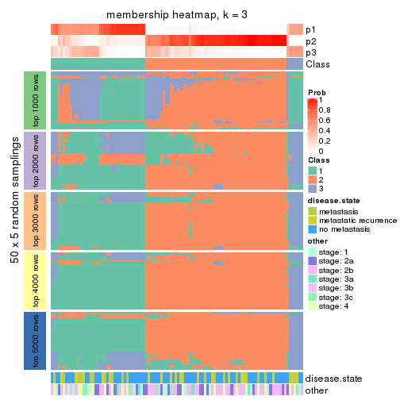</p>

</div>
<div id='tab-ATC-mclust-membership-heatmap-3'>
<pre><code class="r">membership_heatmap(res, k = 4)
</code></pre>

<p></p>

</div>
<div id='tab-ATC-mclust-membership-heatmap-4'>
<pre><code class="r">membership_heatmap(res, k = 5)
</code></pre>

<p></p>

</div>
<div id='tab-ATC-mclust-membership-heatmap-5'>
<pre><code class="r">membership_heatmap(res, k = 6)
</code></pre>

<p></p>

</div>
</div>

As soon as we have had the classes for columns, we can look for signatures
which are significantly different between classes which can be candidate marks
for certain classes. Following are the heatmaps for signatures.


Signature heatmaps where rows are scaled:


<script>
$( function() {
	$( '#tabs-ATC-mclust-get-signatures' ).tabs();
} );
</script>
<div id='tabs-ATC-mclust-get-signatures'>
<ul>
<li><a href='#tab-ATC-mclust-get-signatures-1'>k = 2</a></li>
<li><a href='#tab-ATC-mclust-get-signatures-2'>k = 3</a></li>
<li><a href='#tab-ATC-mclust-get-signatures-3'>k = 4</a></li>
<li><a href='#tab-ATC-mclust-get-signatures-4'>k = 5</a></li>
<li><a href='#tab-ATC-mclust-get-signatures-5'>k = 6</a></li>
</ul>
<div id='tab-ATC-mclust-get-signatures-1'>
<pre><code class="r">get_signatures(res, k = 2)
</code></pre>

<p></p>

</div>
<div id='tab-ATC-mclust-get-signatures-2'>
<pre><code class="r">get_signatures(res, k = 3)
</code></pre>

<p></p>

</div>
<div id='tab-ATC-mclust-get-signatures-3'>
<pre><code class="r">get_signatures(res, k = 4)
</code></pre>

<p></p>

</div>
<div id='tab-ATC-mclust-get-signatures-4'>
<pre><code class="r">get_signatures(res, k = 5)
</code></pre>

<p></p>

</div>
<div id='tab-ATC-mclust-get-signatures-5'>
<pre><code class="r">get_signatures(res, k = 6)
</code></pre>

<p></p>

</div>
</div>


Signature heatmaps where rows are not scaled:


<script>
$( function() {
	$( '#tabs-ATC-mclust-get-signatures-no-scale' ).tabs();
} );
</script>
<div id='tabs-ATC-mclust-get-signatures-no-scale'>
<ul>
<li><a href='#tab-ATC-mclust-get-signatures-no-scale-1'>k = 2</a></li>
<li><a href='#tab-ATC-mclust-get-signatures-no-scale-2'>k = 3</a></li>
<li><a href='#tab-ATC-mclust-get-signatures-no-scale-3'>k = 4</a></li>
<li><a href='#tab-ATC-mclust-get-signatures-no-scale-4'>k = 5</a></li>
<li><a href='#tab-ATC-mclust-get-signatures-no-scale-5'>k = 6</a></li>
</ul>
<div id='tab-ATC-mclust-get-signatures-no-scale-1'>
<pre><code class="r">get_signatures(res, k = 2, scale_rows = FALSE)
</code></pre>

<p></p>

</div>
<div id='tab-ATC-mclust-get-signatures-no-scale-2'>
<pre><code class="r">get_signatures(res, k = 3, scale_rows = FALSE)
</code></pre>

<p></p>

</div>
<div id='tab-ATC-mclust-get-signatures-no-scale-3'>
<pre><code class="r">get_signatures(res, k = 4, scale_rows = FALSE)
</code></pre>

<p></p>

</div>
<div id='tab-ATC-mclust-get-signatures-no-scale-4'>
<pre><code class="r">get_signatures(res, k = 5, scale_rows = FALSE)
</code></pre>

<p></p>

</div>
<div id='tab-ATC-mclust-get-signatures-no-scale-5'>
<pre><code class="r">get_signatures(res, k = 6, scale_rows = FALSE)
</code></pre>

<p></p>

</div>
</div>


Compare the overlap of signatures from different k:

```r
compare_signatures(res)
```


`get_signature()` returns a data frame invisibly. TO get the list of signatures, the function
call should be assigned to a variable explicitly. In following code, if `plot` argument is set
to `FALSE`, no heatmap is plotted while only the differential analysis is performed.

```r
# code only for demonstration
tb = get_signature(res, k = ..., plot = FALSE)
```

An example of the output of `tb` is:

```
#>   which_row         fdr    mean_1    mean_2 scaled_mean_1 scaled_mean_2 km
#> 1        38 0.042760348  8.373488  9.131774    -0.5533452     0.5164555  1
#> 2        40 0.018707592  7.106213  8.469186    -0.6173731     0.5762149  1
#> 3        55 0.019134737 10.221463 11.207825    -0.6159697     0.5749050  1
#> 4        59 0.006059896  5.921854  7.869574    -0.6899429     0.6439467  1
#> 5        60 0.018055526  8.928898 10.211722    -0.6204761     0.5791110  1
#> 6        98 0.009384629 15.714769 14.887706     0.6635654    -0.6193277  2
...
```

The columns in `tb` are:

1. `which_row`: row indices corresponding to the input matrix.
2. `fdr`: FDR for the differential test. 
3. `mean_x`: The mean value in group x.
4. `scaled_mean_x`: The mean value in group x after rows are scaled.
5. `km`: Row groups if k-means clustering is applied to rows.


UMAP plot which shows how samples are separated.


<script>
$( function() {
	$( '#tabs-ATC-mclust-dimension-reduction' ).tabs();
} );
</script>
<div id='tabs-ATC-mclust-dimension-reduction'>
<ul>
<li><a href='#tab-ATC-mclust-dimension-reduction-1'>k = 2</a></li>
<li><a href='#tab-ATC-mclust-dimension-reduction-2'>k = 3</a></li>
<li><a href='#tab-ATC-mclust-dimension-reduction-3'>k = 4</a></li>
<li><a href='#tab-ATC-mclust-dimension-reduction-4'>k = 5</a></li>
<li><a href='#tab-ATC-mclust-dimension-reduction-5'>k = 6</a></li>
</ul>
<div id='tab-ATC-mclust-dimension-reduction-1'>
<pre><code class="r">dimension_reduction(res, k = 2, method = &quot;UMAP&quot;)
</code></pre>

<p></p>

</div>
<div id='tab-ATC-mclust-dimension-reduction-2'>
<pre><code class="r">dimension_reduction(res, k = 3, method = &quot;UMAP&quot;)
</code></pre>

<p></p>

</div>
<div id='tab-ATC-mclust-dimension-reduction-3'>
<pre><code class="r">dimension_reduction(res, k = 4, method = &quot;UMAP&quot;)
</code></pre>

<p></p>

</div>
<div id='tab-ATC-mclust-dimension-reduction-4'>
<pre><code class="r">dimension_reduction(res, k = 5, method = &quot;UMAP&quot;)
</code></pre>

<p></p>

</div>
<div id='tab-ATC-mclust-dimension-reduction-5'>
<pre><code class="r">dimension_reduction(res, k = 6, method = &quot;UMAP&quot;)
</code></pre>

<p></p>

</div>
</div>


Following heatmap shows how subgroups are split when increasing `k`:

```r
collect_classes(res)
```


Test correlation between subgroups and known annotations. If the known
annotation is numeric, one-way ANOVA test is applied, and if the known
annotation is discrete, chi-squared contingency table test is applied.

```r
test_to_known_factors(res)
```

```
#>             n disease.state(p) other(p) k
#> ATC:mclust 56               NA       NA 2
#> ATC:mclust 98            0.422    0.709 3
#> ATC:mclust 98            0.513    0.817 4
#> ATC:mclust 77            0.473    0.512 5
#> ATC:mclust 59            0.685    0.793 6
```


If matrix rows can be associated to genes, consider to use `functional_enrichment(res,
...)` to perform function enrichment for the signature genes. See [this vignette](http://bioconductor.org/packages/devel/bioc/vignettes/cola/inst/doc/functional_enrichment.html) for more detailed explanations.


 

---------------------------------------------------


### ATC:NMF


The object with results only for a single top-value method and a single partition method 
can be extracted as:

```r
res = res_list["ATC", "NMF"]
# you can also extract it by
# res = res_list["ATC:NMF"]
```

A summary of `res` and all the functions that can be applied to it:

```r
res
```

```
#> A 'ConsensusPartition' object with k = 2, 3, 4, 5, 6.
#>   On a matrix with 51941 rows and 104 columns.
#>   Top rows (1000, 2000, 3000, 4000, 5000) are extracted by 'ATC' method.
#>   Subgroups are detected by 'NMF' method.
#>   Performed in total 1250 partitions by row resampling.
#>   Best k for subgroups seems to be 2.
#> 
#> Following methods can be applied to this 'ConsensusPartition' object:
#>  [1] "cola_report"             "collect_classes"         "collect_plots"          
#>  [4] "collect_stats"           "colnames"                "compare_signatures"     
#>  [7] "consensus_heatmap"       "dimension_reduction"     "functional_enrichment"  
#> [10] "get_anno_col"            "get_anno"                "get_classes"            
#> [13] "get_consensus"           "get_matrix"              "get_membership"         
#> [16] "get_param"               "get_signatures"          "get_stats"              
#> [19] "is_best_k"               "is_stable_k"             "membership_heatmap"     
#> [22] "ncol"                    "nrow"                    "plot_ecdf"              
#> [25] "rownames"                "select_partition_number" "show"                   
#> [28] "suggest_best_k"          "test_to_known_factors"
```

`collect_plots()` function collects all the plots made from `res` for all `k` (number of partitions)
into one single page to provide an easy and fast comparison between different `k`.

```r
collect_plots(res)
```


The plots are:

- The first row: a plot of the ECDF (empirical cumulative distribution
  function) curves of the consensus matrix for each `k` and the heatmap of
  predicted classes for each `k`.
- The second row: heatmaps of the consensus matrix for each `k`.
- The third row: heatmaps of the membership matrix for each `k`.
- The fouth row: heatmaps of the signatures for each `k`.

All the plots in panels can be made by individual functions and they are
plotted later in this section.

`select_partition_number()` produces several plots showing different
statistics for choosing "optimized" `k`. There are following statistics:

- ECDF curves of the consensus matrix for each `k`;
- 1-PAC. [The PAC
  score](https://en.wikipedia.org/wiki/Consensus_clustering#Over-interpretation_potential_of_consensus_clustering)
  measures the proportion of the ambiguous subgrouping.
- Mean silhouette score.
- Concordance. The mean probability of fiting the consensus class ids in all
  partitions.
- Area increased. Denote $A_k$ as the area under the ECDF curve for current
  `k`, the area increased is defined as $A_k - A_{k-1}$.
- Rand index. The percent of pairs of samples that are both in a same cluster
  or both are not in a same cluster in the partition of k and k-1.
- Jaccard index. The ratio of pairs of samples are both in a same cluster in
  the partition of k and k-1 and the pairs of samples are both in a same
  cluster in the partition k or k-1.

The detailed explanations of these statistics can be found in [the _cola_
vignette](http://bioconductor.org/packages/devel/bioc/vignettes/cola/inst/doc/cola.html#toc_13).

Generally speaking, lower PAC score, higher mean silhouette score or higher
concordance corresponds to better partition. Rand index and Jaccard index
measure how similar the current partition is compared to partition with `k-1`.
If they are too similar, we won't accept `k` is better than `k-1`.

```r
select_partition_number(res)
```


The numeric values for all these statistics can be obtained by `get_stats()`.

```r
get_stats(res)
```

```
#>   k 1-PAC mean_silhouette concordance area_increased  Rand Jaccard
#> 2 2 0.756           0.875       0.947         0.4848 0.507   0.507
#> 3 3 0.476           0.532       0.790         0.3521 0.662   0.423
#> 4 4 0.446           0.491       0.722         0.1314 0.739   0.373
#> 5 5 0.545           0.479       0.699         0.0668 0.868   0.544
#> 6 6 0.570           0.373       0.632         0.0402 0.904   0.593
```

`suggest_best_k()` suggests the best $k$ based on these statistics. The rules are as follows:

- All $k$ with Jaccard index larger than 0.95 are removed because increasing
  $k$ does not provide enough extra information. If all $k$ are removed, it is
  marked as no subgroup is detected.
- For all $k$ with 1-PAC score larger than 0.9, the maximal $k$ is taken as
  the best $k$, and other $k$ are marked as optional $k$.
- If it does not fit the second rule. The $k$ with the maximal vote of the
  highest 1-PAC score, highest mean silhouette, and highest concordance is
  taken as the best $k$.

```r
suggest_best_k(res)
```

```
#> [1] 2
```


Following shows the table of the partitions (You need to click the **show/hide
code output** link to see it). The membership matrix (columns with name `p*`)
is inferred by
[`clue::cl_consensus()`](https://www.rdocumentation.org/link/cl_consensus?package=clue)
function with the `SE` method. Basically the value in the membership matrix
represents the probability to belong to a certain group. The finall class
label for an item is determined with the group with highest probability it
belongs to.

In `get_classes()` function, the entropy is calculated from the membership
matrix and the silhouette score is calculated from the consensus matrix.


<script>
$( function() {
	$( '#tabs-ATC-NMF-get-classes' ).tabs();
} );
</script>
<div id='tabs-ATC-NMF-get-classes'>
<ul>
<li><a href='#tab-ATC-NMF-get-classes-1'>k = 2</a></li>
<li><a href='#tab-ATC-NMF-get-classes-2'>k = 3</a></li>
<li><a href='#tab-ATC-NMF-get-classes-3'>k = 4</a></li>
<li><a href='#tab-ATC-NMF-get-classes-4'>k = 5</a></li>
<li><a href='#tab-ATC-NMF-get-classes-5'>k = 6</a></li>
</ul>

<div id='tab-ATC-NMF-get-classes-1'>
<p><a id='tab-ATC-NMF-get-classes-1-a' style='color:#0366d6' href='#'>show/hide code output</a></p>
<pre><code class="r">cbind(get_classes(res, k = 2), get_membership(res, k = 2))
</code></pre>

<pre><code>#&gt;           class entropy silhouette    p1    p2
#&gt; GSM537341     2   0.482     0.8624 0.104 0.896
#&gt; GSM537345     1   0.000     0.9502 1.000 0.000
#&gt; GSM537355     1   0.000     0.9502 1.000 0.000
#&gt; GSM537366     1   0.000     0.9502 1.000 0.000
#&gt; GSM537370     2   0.000     0.9277 0.000 1.000
#&gt; GSM537380     2   0.000     0.9277 0.000 1.000
#&gt; GSM537392     2   0.000     0.9277 0.000 1.000
#&gt; GSM537415     1   0.000     0.9502 1.000 0.000
#&gt; GSM537417     1   0.000     0.9502 1.000 0.000
#&gt; GSM537422     1   0.000     0.9502 1.000 0.000
#&gt; GSM537423     1   0.000     0.9502 1.000 0.000
#&gt; GSM537427     2   0.000     0.9277 0.000 1.000
#&gt; GSM537430     2   0.000     0.9277 0.000 1.000
#&gt; GSM537336     1   0.000     0.9502 1.000 0.000
#&gt; GSM537337     1   0.000     0.9502 1.000 0.000
#&gt; GSM537348     2   0.917     0.5343 0.332 0.668
#&gt; GSM537349     2   0.184     0.9157 0.028 0.972
#&gt; GSM537356     1   0.000     0.9502 1.000 0.000
#&gt; GSM537361     1   0.000     0.9502 1.000 0.000
#&gt; GSM537374     2   0.000     0.9277 0.000 1.000
#&gt; GSM537377     1   0.000     0.9502 1.000 0.000
#&gt; GSM537378     1   0.808     0.6574 0.752 0.248
#&gt; GSM537379     2   0.260     0.9071 0.044 0.956
#&gt; GSM537383     2   0.000     0.9277 0.000 1.000
#&gt; GSM537388     2   0.000     0.9277 0.000 1.000
#&gt; GSM537395     1   0.000     0.9502 1.000 0.000
#&gt; GSM537400     2   0.000     0.9277 0.000 1.000
#&gt; GSM537404     1   0.000     0.9502 1.000 0.000
#&gt; GSM537409     1   0.000     0.9502 1.000 0.000
#&gt; GSM537418     1   0.000     0.9502 1.000 0.000
#&gt; GSM537425     1   0.000     0.9502 1.000 0.000
#&gt; GSM537333     2   0.000     0.9277 0.000 1.000
#&gt; GSM537342     1   0.000     0.9502 1.000 0.000
#&gt; GSM537347     2   0.343     0.8941 0.064 0.936
#&gt; GSM537350     1   0.000     0.9502 1.000 0.000
#&gt; GSM537362     2   0.118     0.9211 0.016 0.984
#&gt; GSM537363     1   0.000     0.9502 1.000 0.000
#&gt; GSM537368     1   0.000     0.9502 1.000 0.000
#&gt; GSM537376     2   0.000     0.9277 0.000 1.000
#&gt; GSM537381     2   0.999     0.0926 0.484 0.516
#&gt; GSM537386     2   0.000     0.9277 0.000 1.000
#&gt; GSM537398     2   0.000     0.9277 0.000 1.000
#&gt; GSM537402     1   0.000     0.9502 1.000 0.000
#&gt; GSM537405     1   0.000     0.9502 1.000 0.000
#&gt; GSM537371     1   0.000     0.9502 1.000 0.000
#&gt; GSM537421     1   0.000     0.9502 1.000 0.000
#&gt; GSM537424     1   0.000     0.9502 1.000 0.000
#&gt; GSM537432     2   0.000     0.9277 0.000 1.000
#&gt; GSM537331     2   0.000     0.9277 0.000 1.000
#&gt; GSM537332     2   0.000     0.9277 0.000 1.000
#&gt; GSM537334     2   0.000     0.9277 0.000 1.000
#&gt; GSM537338     2   0.000     0.9277 0.000 1.000
#&gt; GSM537353     1   0.000     0.9502 1.000 0.000
#&gt; GSM537357     1   0.000     0.9502 1.000 0.000
#&gt; GSM537358     1   0.936     0.4462 0.648 0.352
#&gt; GSM537375     2   0.552     0.8381 0.128 0.872
#&gt; GSM537389     2   0.971     0.3719 0.400 0.600
#&gt; GSM537390     2   0.327     0.8970 0.060 0.940
#&gt; GSM537393     1   0.943     0.4262 0.640 0.360
#&gt; GSM537399     2   0.000     0.9277 0.000 1.000
#&gt; GSM537407     1   0.913     0.5029 0.672 0.328
#&gt; GSM537408     1   0.000     0.9502 1.000 0.000
#&gt; GSM537428     1   0.327     0.8968 0.940 0.060
#&gt; GSM537354     1   0.000     0.9502 1.000 0.000
#&gt; GSM537410     1   0.000     0.9502 1.000 0.000
#&gt; GSM537413     2   0.000     0.9277 0.000 1.000
#&gt; GSM537396     2   0.730     0.7477 0.204 0.796
#&gt; GSM537397     2   0.925     0.5179 0.340 0.660
#&gt; GSM537330     2   0.000     0.9277 0.000 1.000
#&gt; GSM537369     1   0.000     0.9502 1.000 0.000
#&gt; GSM537373     1   0.000     0.9502 1.000 0.000
#&gt; GSM537401     2   0.552     0.8392 0.128 0.872
#&gt; GSM537343     1   0.000     0.9502 1.000 0.000
#&gt; GSM537367     1   0.000     0.9502 1.000 0.000
#&gt; GSM537382     2   0.242     0.9094 0.040 0.960
#&gt; GSM537385     2   0.494     0.8588 0.108 0.892
#&gt; GSM537391     2   0.961     0.4147 0.384 0.616
#&gt; GSM537419     1   0.541     0.8302 0.876 0.124
#&gt; GSM537420     1   0.000     0.9502 1.000 0.000
#&gt; GSM537429     2   0.000     0.9277 0.000 1.000
#&gt; GSM537431     2   0.000     0.9277 0.000 1.000
#&gt; GSM537387     1   0.943     0.4262 0.640 0.360
#&gt; GSM537414     1   0.000     0.9502 1.000 0.000
#&gt; GSM537433     1   0.000     0.9502 1.000 0.000
#&gt; GSM537335     2   0.000     0.9277 0.000 1.000
#&gt; GSM537339     2   0.000     0.9277 0.000 1.000
#&gt; GSM537340     1   0.000     0.9502 1.000 0.000
#&gt; GSM537344     1   0.000     0.9502 1.000 0.000
#&gt; GSM537346     2   0.000     0.9277 0.000 1.000
#&gt; GSM537351     1   0.000     0.9502 1.000 0.000
#&gt; GSM537352     1   0.000     0.9502 1.000 0.000
#&gt; GSM537359     1   0.961     0.3608 0.616 0.384
#&gt; GSM537360     1   0.000     0.9502 1.000 0.000
#&gt; GSM537364     1   0.000     0.9502 1.000 0.000
#&gt; GSM537365     1   0.000     0.9502 1.000 0.000
#&gt; GSM537372     1   0.615     0.7962 0.848 0.152
#&gt; GSM537384     1   0.802     0.6649 0.756 0.244
#&gt; GSM537394     2   0.000     0.9277 0.000 1.000
#&gt; GSM537403     1   0.000     0.9502 1.000 0.000
#&gt; GSM537406     1   0.000     0.9502 1.000 0.000
#&gt; GSM537411     2   0.000     0.9277 0.000 1.000
#&gt; GSM537412     1   0.000     0.9502 1.000 0.000
#&gt; GSM537416     1   0.000     0.9502 1.000 0.000
#&gt; GSM537426     1   0.000     0.9502 1.000 0.000
</code></pre>

<script>
$('#tab-ATC-NMF-get-classes-1-a').parent().next().next().hide();
$('#tab-ATC-NMF-get-classes-1-a').click(function(){
  $('#tab-ATC-NMF-get-classes-1-a').parent().next().next().toggle();
  return(false);
});
</script>
</div>

<div id='tab-ATC-NMF-get-classes-2'>
<p><a id='tab-ATC-NMF-get-classes-2-a' style='color:#0366d6' href='#'>show/hide code output</a></p>
<pre><code class="r">cbind(get_classes(res, k = 3), get_membership(res, k = 3))
</code></pre>

<pre><code>#&gt;           class entropy silhouette    p1    p2    p3
#&gt; GSM537341     1  0.0000    0.84588 1.000 0.000 0.000
#&gt; GSM537345     3  0.5733    0.56476 0.000 0.324 0.676
#&gt; GSM537355     3  0.6180    0.48644 0.000 0.416 0.584
#&gt; GSM537366     3  0.6260    0.41891 0.000 0.448 0.552
#&gt; GSM537370     1  0.5497    0.58345 0.708 0.292 0.000
#&gt; GSM537380     1  0.2959    0.79613 0.900 0.100 0.000
#&gt; GSM537392     1  0.5785    0.52209 0.668 0.332 0.000
#&gt; GSM537415     2  0.0237    0.67065 0.000 0.996 0.004
#&gt; GSM537417     3  0.0237    0.64418 0.000 0.004 0.996
#&gt; GSM537422     3  0.5905    0.56516 0.000 0.352 0.648
#&gt; GSM537423     2  0.0000    0.67153 0.000 1.000 0.000
#&gt; GSM537427     2  0.5968    0.23347 0.364 0.636 0.000
#&gt; GSM537430     1  0.0000    0.84588 1.000 0.000 0.000
#&gt; GSM537336     2  0.6026    0.08701 0.000 0.624 0.376
#&gt; GSM537337     2  0.0000    0.67153 0.000 1.000 0.000
#&gt; GSM537348     1  0.3973    0.80304 0.880 0.032 0.088
#&gt; GSM537349     1  0.5810    0.51639 0.664 0.336 0.000
#&gt; GSM537356     3  0.1163    0.64742 0.000 0.028 0.972
#&gt; GSM537361     3  0.0237    0.64248 0.004 0.000 0.996
#&gt; GSM537374     1  0.4178    0.74948 0.828 0.000 0.172
#&gt; GSM537377     3  0.0237    0.64248 0.004 0.000 0.996
#&gt; GSM537378     2  0.0000    0.67153 0.000 1.000 0.000
#&gt; GSM537379     1  0.1289    0.84007 0.968 0.032 0.000
#&gt; GSM537383     1  0.1643    0.83398 0.956 0.044 0.000
#&gt; GSM537388     1  0.1753    0.83149 0.952 0.048 0.000
#&gt; GSM537395     2  0.0000    0.67153 0.000 1.000 0.000
#&gt; GSM537400     1  0.0000    0.84588 1.000 0.000 0.000
#&gt; GSM537404     3  0.0000    0.64331 0.000 0.000 1.000
#&gt; GSM537409     2  0.0000    0.67153 0.000 1.000 0.000
#&gt; GSM537418     2  0.0000    0.67153 0.000 1.000 0.000
#&gt; GSM537425     3  0.6126    0.50617 0.000 0.400 0.600
#&gt; GSM537333     1  0.1753    0.83175 0.952 0.000 0.048
#&gt; GSM537342     2  0.5706    0.23641 0.000 0.680 0.320
#&gt; GSM537347     3  0.5785    0.22190 0.332 0.000 0.668
#&gt; GSM537350     3  0.6126    0.51149 0.000 0.400 0.600
#&gt; GSM537362     1  0.3192    0.79709 0.888 0.000 0.112
#&gt; GSM537363     3  0.5706    0.59155 0.000 0.320 0.680
#&gt; GSM537368     3  0.5760    0.58659 0.000 0.328 0.672
#&gt; GSM537376     1  0.0000    0.84588 1.000 0.000 0.000
#&gt; GSM537381     2  0.6309   -0.00688 0.496 0.504 0.000
#&gt; GSM537386     1  0.0000    0.84588 1.000 0.000 0.000
#&gt; GSM537398     1  0.6168    0.41968 0.588 0.000 0.412
#&gt; GSM537402     2  0.6168   -0.07336 0.000 0.588 0.412
#&gt; GSM537405     3  0.0000    0.64331 0.000 0.000 1.000
#&gt; GSM537371     3  0.5859    0.57267 0.000 0.344 0.656
#&gt; GSM537421     2  0.5098    0.38617 0.000 0.752 0.248
#&gt; GSM537424     3  0.6309    0.25971 0.000 0.496 0.504
#&gt; GSM537432     1  0.0000    0.84588 1.000 0.000 0.000
#&gt; GSM537331     1  0.0000    0.84588 1.000 0.000 0.000
#&gt; GSM537332     1  0.5650    0.55498 0.688 0.312 0.000
#&gt; GSM537334     1  0.0000    0.84588 1.000 0.000 0.000
#&gt; GSM537338     1  0.0000    0.84588 1.000 0.000 0.000
#&gt; GSM537353     2  0.0592    0.66612 0.000 0.988 0.012
#&gt; GSM537357     2  0.5529    0.29154 0.000 0.704 0.296
#&gt; GSM537358     1  0.9457    0.12525 0.484 0.204 0.312
#&gt; GSM537375     1  0.4411    0.77163 0.844 0.016 0.140
#&gt; GSM537389     2  0.1411    0.65726 0.036 0.964 0.000
#&gt; GSM537390     2  0.3482    0.60929 0.128 0.872 0.000
#&gt; GSM537393     2  0.0000    0.67153 0.000 1.000 0.000
#&gt; GSM537399     1  0.1753    0.83241 0.952 0.000 0.048
#&gt; GSM537407     3  0.3752    0.55793 0.144 0.000 0.856
#&gt; GSM537408     3  0.6252    0.43093 0.000 0.444 0.556
#&gt; GSM537428     3  0.4289    0.61925 0.092 0.040 0.868
#&gt; GSM537354     2  0.0237    0.67065 0.000 0.996 0.004
#&gt; GSM537410     2  0.6305   -0.27013 0.000 0.516 0.484
#&gt; GSM537413     2  0.6291   -0.07324 0.468 0.532 0.000
#&gt; GSM537396     2  0.5529    0.38832 0.296 0.704 0.000
#&gt; GSM537397     2  0.5058    0.49065 0.244 0.756 0.000
#&gt; GSM537330     1  0.1411    0.83742 0.964 0.036 0.000
#&gt; GSM537369     2  0.6095    0.04776 0.000 0.608 0.392
#&gt; GSM537373     2  0.3941    0.52412 0.000 0.844 0.156
#&gt; GSM537401     1  0.5098    0.66907 0.752 0.000 0.248
#&gt; GSM537343     2  0.6286   -0.20091 0.000 0.536 0.464
#&gt; GSM537367     3  0.6154    0.50006 0.000 0.408 0.592
#&gt; GSM537382     2  0.6225    0.06228 0.432 0.568 0.000
#&gt; GSM537385     1  0.1643    0.83501 0.956 0.044 0.000
#&gt; GSM537391     1  0.5236    0.69507 0.804 0.028 0.168
#&gt; GSM537419     3  0.7381    0.50929 0.244 0.080 0.676
#&gt; GSM537420     3  0.0237    0.64248 0.004 0.000 0.996
#&gt; GSM537429     2  0.6295   -0.08237 0.472 0.528 0.000
#&gt; GSM537431     3  0.6126    0.01315 0.400 0.000 0.600
#&gt; GSM537387     2  0.4974    0.54922 0.236 0.764 0.000
#&gt; GSM537414     2  0.0237    0.67065 0.000 0.996 0.004
#&gt; GSM537433     3  0.6045    0.53949 0.000 0.380 0.620
#&gt; GSM537335     1  0.0237    0.84523 0.996 0.004 0.000
#&gt; GSM537339     2  0.6204    0.08768 0.424 0.576 0.000
#&gt; GSM537340     3  0.6204    0.47072 0.000 0.424 0.576
#&gt; GSM537344     3  0.4062    0.64327 0.000 0.164 0.836
#&gt; GSM537346     1  0.4750    0.68052 0.784 0.216 0.000
#&gt; GSM537351     2  0.6280   -0.19566 0.000 0.540 0.460
#&gt; GSM537352     2  0.0747    0.66342 0.000 0.984 0.016
#&gt; GSM537359     3  0.4452    0.49056 0.192 0.000 0.808
#&gt; GSM537360     2  0.0237    0.67065 0.000 0.996 0.004
#&gt; GSM537364     3  0.4931    0.62736 0.000 0.232 0.768
#&gt; GSM537365     3  0.3941    0.64320 0.000 0.156 0.844
#&gt; GSM537372     3  0.2261    0.61492 0.068 0.000 0.932
#&gt; GSM537384     1  0.9980    0.02037 0.364 0.324 0.312
#&gt; GSM537394     1  0.0424    0.84467 0.992 0.008 0.000
#&gt; GSM537403     3  0.6026    0.54245 0.000 0.376 0.624
#&gt; GSM537406     3  0.5905    0.56667 0.000 0.352 0.648
#&gt; GSM537411     3  0.5785    0.21235 0.332 0.000 0.668
#&gt; GSM537412     2  0.6215   -0.09864 0.000 0.572 0.428
#&gt; GSM537416     2  0.0237    0.67065 0.000 0.996 0.004
#&gt; GSM537426     2  0.0000    0.67153 0.000 1.000 0.000
</code></pre>

<script>
$('#tab-ATC-NMF-get-classes-2-a').parent().next().next().hide();
$('#tab-ATC-NMF-get-classes-2-a').click(function(){
  $('#tab-ATC-NMF-get-classes-2-a').parent().next().next().toggle();
  return(false);
});
</script>
</div>

<div id='tab-ATC-NMF-get-classes-3'>
<p><a id='tab-ATC-NMF-get-classes-3-a' style='color:#0366d6' href='#'>show/hide code output</a></p>
<pre><code class="r">cbind(get_classes(res, k = 4), get_membership(res, k = 4))
</code></pre>

<pre><code>#&gt;           class entropy silhouette    p1    p2    p3    p4
#&gt; GSM537341     4  0.4957    0.55903 0.000 0.320 0.012 0.668
#&gt; GSM537345     1  0.2926    0.61505 0.888 0.012 0.096 0.004
#&gt; GSM537355     3  0.5757    0.60128 0.076 0.240 0.684 0.000
#&gt; GSM537366     3  0.6454    0.46931 0.344 0.084 0.572 0.000
#&gt; GSM537370     2  0.5959    0.15469 0.044 0.568 0.000 0.388
#&gt; GSM537380     2  0.5928    0.07987 0.032 0.564 0.004 0.400
#&gt; GSM537392     2  0.3616    0.62547 0.036 0.852 0.000 0.112
#&gt; GSM537415     1  0.3975    0.53662 0.760 0.240 0.000 0.000
#&gt; GSM537417     3  0.2546    0.64656 0.060 0.000 0.912 0.028
#&gt; GSM537422     1  0.4452    0.42242 0.732 0.008 0.260 0.000
#&gt; GSM537423     2  0.5407    0.50474 0.108 0.740 0.152 0.000
#&gt; GSM537427     2  0.4130    0.63031 0.064 0.828 0.000 0.108
#&gt; GSM537430     4  0.2706    0.73674 0.000 0.080 0.020 0.900
#&gt; GSM537336     1  0.3215    0.62442 0.876 0.032 0.092 0.000
#&gt; GSM537337     2  0.4925    0.16027 0.428 0.572 0.000 0.000
#&gt; GSM537348     4  0.4321    0.67474 0.144 0.040 0.004 0.812
#&gt; GSM537349     2  0.3734    0.63458 0.044 0.856 0.004 0.096
#&gt; GSM537356     3  0.6133    0.50915 0.268 0.000 0.644 0.088
#&gt; GSM537361     3  0.5136    0.52773 0.056 0.004 0.752 0.188
#&gt; GSM537374     4  0.0804    0.73043 0.000 0.008 0.012 0.980
#&gt; GSM537377     4  0.7950    0.12216 0.324 0.008 0.228 0.440
#&gt; GSM537378     1  0.4399    0.51456 0.760 0.224 0.000 0.016
#&gt; GSM537379     4  0.4436    0.65129 0.148 0.052 0.000 0.800
#&gt; GSM537383     4  0.4891    0.60448 0.012 0.308 0.000 0.680
#&gt; GSM537388     2  0.4049    0.50205 0.000 0.780 0.008 0.212
#&gt; GSM537395     2  0.4585    0.35408 0.332 0.668 0.000 0.000
#&gt; GSM537400     4  0.3837    0.68945 0.000 0.224 0.000 0.776
#&gt; GSM537404     3  0.4948    0.57847 0.100 0.000 0.776 0.124
#&gt; GSM537409     1  0.4998    0.00863 0.512 0.488 0.000 0.000
#&gt; GSM537418     1  0.2281    0.64310 0.904 0.096 0.000 0.000
#&gt; GSM537425     1  0.3494    0.55359 0.824 0.004 0.172 0.000
#&gt; GSM537333     4  0.2262    0.71672 0.040 0.012 0.016 0.932
#&gt; GSM537342     1  0.7599   -0.08725 0.424 0.200 0.376 0.000
#&gt; GSM537347     4  0.5425    0.58378 0.052 0.004 0.228 0.716
#&gt; GSM537350     3  0.5941    0.59174 0.072 0.276 0.652 0.000
#&gt; GSM537362     4  0.3289    0.68089 0.120 0.004 0.012 0.864
#&gt; GSM537363     3  0.6137    0.31465 0.448 0.048 0.504 0.000
#&gt; GSM537368     3  0.5646    0.59311 0.272 0.056 0.672 0.000
#&gt; GSM537376     4  0.3504    0.72759 0.012 0.116 0.012 0.860
#&gt; GSM537381     1  0.6602    0.17635 0.552 0.092 0.000 0.356
#&gt; GSM537386     4  0.3266    0.71364 0.000 0.168 0.000 0.832
#&gt; GSM537398     4  0.1545    0.72223 0.000 0.008 0.040 0.952
#&gt; GSM537402     2  0.5827    0.02636 0.036 0.568 0.396 0.000
#&gt; GSM537405     3  0.2675    0.63786 0.048 0.000 0.908 0.044
#&gt; GSM537371     1  0.3208    0.58364 0.848 0.004 0.148 0.000
#&gt; GSM537421     1  0.3525    0.63555 0.860 0.100 0.040 0.000
#&gt; GSM537424     1  0.3547    0.60375 0.864 0.000 0.072 0.064
#&gt; GSM537432     4  0.4283    0.67299 0.000 0.256 0.004 0.740
#&gt; GSM537331     4  0.3486    0.70113 0.000 0.188 0.000 0.812
#&gt; GSM537332     2  0.5154    0.32077 0.012 0.660 0.004 0.324
#&gt; GSM537334     4  0.0469    0.73161 0.000 0.012 0.000 0.988
#&gt; GSM537338     4  0.3219    0.71517 0.000 0.164 0.000 0.836
#&gt; GSM537353     1  0.6212    0.34889 0.560 0.380 0.060 0.000
#&gt; GSM537357     1  0.2282    0.63940 0.924 0.024 0.052 0.000
#&gt; GSM537358     2  0.5560    0.39086 0.016 0.684 0.276 0.024
#&gt; GSM537375     4  0.6524    0.42191 0.308 0.052 0.024 0.616
#&gt; GSM537389     2  0.4567    0.44811 0.276 0.716 0.000 0.008
#&gt; GSM537390     2  0.4951    0.54395 0.212 0.744 0.000 0.044
#&gt; GSM537393     1  0.4844    0.44584 0.688 0.300 0.000 0.012
#&gt; GSM537399     4  0.2814    0.72995 0.000 0.132 0.000 0.868
#&gt; GSM537407     3  0.4360    0.47809 0.008 0.000 0.744 0.248
#&gt; GSM537408     2  0.5750   -0.04334 0.028 0.532 0.440 0.000
#&gt; GSM537428     3  0.4734    0.64826 0.028 0.160 0.792 0.020
#&gt; GSM537354     1  0.4855    0.36638 0.644 0.352 0.004 0.000
#&gt; GSM537410     3  0.6330    0.61087 0.144 0.200 0.656 0.000
#&gt; GSM537413     2  0.3796    0.63557 0.056 0.848 0.000 0.096
#&gt; GSM537396     2  0.3421    0.62239 0.020 0.876 0.016 0.088
#&gt; GSM537397     2  0.4530    0.61036 0.048 0.808 0.008 0.136
#&gt; GSM537330     4  0.3870    0.69435 0.004 0.208 0.000 0.788
#&gt; GSM537369     1  0.2402    0.62547 0.912 0.012 0.076 0.000
#&gt; GSM537373     1  0.4093    0.63409 0.832 0.096 0.072 0.000
#&gt; GSM537401     4  0.4022    0.72531 0.000 0.096 0.068 0.836
#&gt; GSM537343     1  0.3196    0.59508 0.856 0.008 0.136 0.000
#&gt; GSM537367     3  0.5850    0.60585 0.244 0.080 0.676 0.000
#&gt; GSM537382     2  0.6921    0.50033 0.160 0.580 0.000 0.260
#&gt; GSM537385     2  0.3870    0.59520 0.008 0.820 0.008 0.164
#&gt; GSM537391     2  0.7670    0.14452 0.000 0.420 0.216 0.364
#&gt; GSM537419     3  0.6140    0.26797 0.008 0.400 0.556 0.036
#&gt; GSM537420     3  0.1256    0.65412 0.008 0.028 0.964 0.000
#&gt; GSM537429     2  0.4508    0.55566 0.036 0.780 0.000 0.184
#&gt; GSM537431     4  0.5560    0.39274 0.000 0.024 0.392 0.584
#&gt; GSM537387     1  0.5376    0.53801 0.736 0.176 0.000 0.088
#&gt; GSM537414     1  0.1661    0.64369 0.944 0.052 0.004 0.000
#&gt; GSM537433     3  0.5859    0.57489 0.284 0.064 0.652 0.000
#&gt; GSM537335     4  0.3569    0.69878 0.000 0.196 0.000 0.804
#&gt; GSM537339     1  0.7663   -0.15899 0.408 0.212 0.000 0.380
#&gt; GSM537340     1  0.6334   -0.21855 0.484 0.060 0.456 0.000
#&gt; GSM537344     1  0.6240    0.00877 0.568 0.000 0.368 0.064
#&gt; GSM537346     4  0.5126    0.27304 0.004 0.444 0.000 0.552
#&gt; GSM537351     3  0.7188    0.23120 0.428 0.136 0.436 0.000
#&gt; GSM537352     1  0.7108    0.30381 0.512 0.348 0.140 0.000
#&gt; GSM537359     3  0.2300    0.63959 0.000 0.048 0.924 0.028
#&gt; GSM537360     2  0.6222    0.06087 0.412 0.532 0.056 0.000
#&gt; GSM537364     3  0.4149    0.66249 0.152 0.036 0.812 0.000
#&gt; GSM537365     3  0.6040    0.60301 0.240 0.060 0.684 0.016
#&gt; GSM537372     3  0.5619    0.32855 0.040 0.000 0.640 0.320
#&gt; GSM537384     1  0.6122    0.25507 0.576 0.012 0.032 0.380
#&gt; GSM537394     4  0.4866    0.42905 0.000 0.404 0.000 0.596
#&gt; GSM537403     3  0.5208    0.65272 0.080 0.172 0.748 0.000
#&gt; GSM537406     3  0.5599    0.57191 0.048 0.288 0.664 0.000
#&gt; GSM537411     4  0.5064    0.45798 0.004 0.004 0.360 0.632
#&gt; GSM537412     3  0.6823    0.56064 0.196 0.200 0.604 0.000
#&gt; GSM537416     1  0.3266    0.60196 0.832 0.168 0.000 0.000
#&gt; GSM537426     2  0.4655    0.38797 0.312 0.684 0.004 0.000
</code></pre>

<script>
$('#tab-ATC-NMF-get-classes-3-a').parent().next().next().hide();
$('#tab-ATC-NMF-get-classes-3-a').click(function(){
  $('#tab-ATC-NMF-get-classes-3-a').parent().next().next().toggle();
  return(false);
});
</script>
</div>

<div id='tab-ATC-NMF-get-classes-4'>
<p><a id='tab-ATC-NMF-get-classes-4-a' style='color:#0366d6' href='#'>show/hide code output</a></p>
<pre><code class="r">cbind(get_classes(res, k = 5), get_membership(res, k = 5))
</code></pre>

<pre><code>#&gt;           class entropy silhouette    p1    p2    p3    p4    p5
#&gt; GSM537341     2  0.7100   -0.02176 0.012 0.472 0.308 0.012 0.196
#&gt; GSM537345     1  0.1518    0.71934 0.952 0.000 0.020 0.012 0.016
#&gt; GSM537355     4  0.4892    0.00385 0.016 0.484 0.000 0.496 0.004
#&gt; GSM537366     4  0.5846    0.28320 0.380 0.004 0.000 0.528 0.088
#&gt; GSM537370     5  0.6251    0.12830 0.008 0.152 0.280 0.000 0.560
#&gt; GSM537380     2  0.2549    0.68649 0.008 0.904 0.060 0.004 0.024
#&gt; GSM537392     2  0.1365    0.69245 0.000 0.952 0.004 0.004 0.040
#&gt; GSM537415     1  0.4723    0.61877 0.736 0.136 0.000 0.000 0.128
#&gt; GSM537417     4  0.1872    0.61751 0.020 0.000 0.052 0.928 0.000
#&gt; GSM537422     1  0.4612    0.65772 0.756 0.004 0.000 0.124 0.116
#&gt; GSM537423     2  0.3976    0.66969 0.024 0.824 0.000 0.084 0.068
#&gt; GSM537427     2  0.1117    0.69759 0.000 0.964 0.016 0.000 0.020
#&gt; GSM537430     3  0.3550    0.61505 0.000 0.064 0.848 0.016 0.072
#&gt; GSM537336     1  0.2361    0.71966 0.892 0.000 0.000 0.012 0.096
#&gt; GSM537337     2  0.4141    0.61833 0.236 0.736 0.000 0.000 0.028
#&gt; GSM537348     3  0.5521    0.53282 0.124 0.004 0.656 0.000 0.216
#&gt; GSM537349     2  0.0867    0.69862 0.000 0.976 0.008 0.008 0.008
#&gt; GSM537356     4  0.6818    0.41470 0.252 0.000 0.200 0.524 0.024
#&gt; GSM537361     4  0.4297    0.47621 0.036 0.000 0.236 0.728 0.000
#&gt; GSM537374     3  0.3317    0.60839 0.000 0.004 0.804 0.004 0.188
#&gt; GSM537377     3  0.6088    0.03557 0.396 0.004 0.520 0.056 0.024
#&gt; GSM537378     2  0.5905    0.35383 0.392 0.532 0.044 0.000 0.032
#&gt; GSM537379     3  0.3870    0.50179 0.148 0.024 0.808 0.000 0.020
#&gt; GSM537383     2  0.5071    0.42382 0.008 0.660 0.284 0.000 0.048
#&gt; GSM537388     2  0.4974    0.48102 0.000 0.696 0.092 0.000 0.212
#&gt; GSM537395     2  0.2505    0.69441 0.092 0.888 0.000 0.000 0.020
#&gt; GSM537400     3  0.4696    0.50184 0.000 0.024 0.616 0.000 0.360
#&gt; GSM537404     4  0.4369    0.52660 0.052 0.000 0.208 0.740 0.000
#&gt; GSM537409     1  0.6477    0.13440 0.464 0.340 0.000 0.000 0.196
#&gt; GSM537418     1  0.2574    0.70974 0.876 0.012 0.000 0.000 0.112
#&gt; GSM537425     1  0.2728    0.72149 0.896 0.008 0.012 0.068 0.016
#&gt; GSM537333     3  0.1059    0.59263 0.020 0.004 0.968 0.008 0.000
#&gt; GSM537342     1  0.6561    0.27306 0.520 0.016 0.000 0.312 0.152
#&gt; GSM537347     3  0.4676    0.45474 0.028 0.004 0.720 0.236 0.012
#&gt; GSM537350     4  0.4592    0.59345 0.028 0.016 0.000 0.724 0.232
#&gt; GSM537362     3  0.2593    0.59704 0.048 0.004 0.904 0.008 0.036
#&gt; GSM537363     1  0.5284    0.19678 0.568 0.000 0.000 0.376 0.056
#&gt; GSM537368     4  0.5658    0.40224 0.332 0.000 0.000 0.572 0.096
#&gt; GSM537376     3  0.4865    0.52967 0.020 0.160 0.756 0.008 0.056
#&gt; GSM537381     5  0.6355   -0.00436 0.140 0.004 0.408 0.000 0.448
#&gt; GSM537386     3  0.4987    0.57335 0.000 0.080 0.684 0.000 0.236
#&gt; GSM537398     3  0.2408    0.61626 0.000 0.004 0.892 0.008 0.096
#&gt; GSM537402     2  0.4142    0.53392 0.004 0.728 0.000 0.252 0.016
#&gt; GSM537405     4  0.2313    0.61919 0.040 0.000 0.044 0.912 0.004
#&gt; GSM537371     1  0.2625    0.71824 0.900 0.000 0.028 0.056 0.016
#&gt; GSM537421     1  0.3292    0.69699 0.836 0.016 0.000 0.008 0.140
#&gt; GSM537424     1  0.3592    0.65772 0.832 0.012 0.132 0.008 0.016
#&gt; GSM537432     5  0.3707    0.40065 0.008 0.004 0.220 0.000 0.768
#&gt; GSM537331     3  0.5447    0.54696 0.000 0.112 0.640 0.000 0.248
#&gt; GSM537332     5  0.3190    0.50942 0.008 0.012 0.140 0.000 0.840
#&gt; GSM537334     3  0.2305    0.62087 0.000 0.012 0.896 0.000 0.092
#&gt; GSM537338     3  0.4597    0.57568 0.000 0.044 0.696 0.000 0.260
#&gt; GSM537353     2  0.5808    0.47744 0.272 0.624 0.000 0.084 0.020
#&gt; GSM537357     1  0.1571    0.72489 0.936 0.000 0.000 0.004 0.060
#&gt; GSM537358     2  0.6425    0.04862 0.004 0.448 0.008 0.424 0.116
#&gt; GSM537375     3  0.5175    0.38121 0.252 0.028 0.688 0.008 0.024
#&gt; GSM537389     2  0.2616    0.69468 0.100 0.880 0.000 0.000 0.020
#&gt; GSM537390     2  0.1717    0.70298 0.052 0.936 0.004 0.000 0.008
#&gt; GSM537393     2  0.5343    0.47500 0.344 0.604 0.032 0.000 0.020
#&gt; GSM537399     3  0.3876    0.55507 0.000 0.000 0.684 0.000 0.316
#&gt; GSM537407     4  0.4045    0.15955 0.000 0.000 0.356 0.644 0.000
#&gt; GSM537408     4  0.5032    0.06570 0.000 0.448 0.000 0.520 0.032
#&gt; GSM537428     4  0.4851    0.45333 0.020 0.000 0.008 0.620 0.352
#&gt; GSM537354     2  0.5631    0.18254 0.424 0.500 0.000 0.000 0.076
#&gt; GSM537410     4  0.4997    0.62459 0.156 0.024 0.000 0.740 0.080
#&gt; GSM537413     2  0.1211    0.69760 0.000 0.960 0.016 0.000 0.024
#&gt; GSM537396     5  0.2581    0.56295 0.028 0.048 0.020 0.000 0.904
#&gt; GSM537397     2  0.5677    0.14090 0.008 0.516 0.060 0.000 0.416
#&gt; GSM537330     3  0.5274    0.54674 0.000 0.192 0.676 0.000 0.132
#&gt; GSM537369     1  0.2032    0.71667 0.924 0.004 0.020 0.000 0.052
#&gt; GSM537373     1  0.3566    0.72238 0.852 0.064 0.000 0.056 0.028
#&gt; GSM537401     3  0.5358    0.57637 0.004 0.060 0.668 0.012 0.256
#&gt; GSM537343     1  0.2165    0.72677 0.920 0.004 0.016 0.056 0.004
#&gt; GSM537367     4  0.5320    0.52499 0.264 0.008 0.000 0.656 0.072
#&gt; GSM537382     2  0.6344    0.56779 0.084 0.652 0.140 0.000 0.124
#&gt; GSM537385     2  0.1967    0.69995 0.000 0.932 0.020 0.036 0.012
#&gt; GSM537391     5  0.4195    0.53343 0.020 0.016 0.112 0.036 0.816
#&gt; GSM537419     2  0.4130    0.48739 0.000 0.696 0.000 0.292 0.012
#&gt; GSM537420     4  0.2674    0.62327 0.012 0.000 0.000 0.868 0.120
#&gt; GSM537429     5  0.4248    0.48711 0.008 0.096 0.104 0.000 0.792
#&gt; GSM537431     3  0.6006    0.45673 0.000 0.000 0.584 0.220 0.196
#&gt; GSM537387     1  0.6129    0.46879 0.668 0.156 0.096 0.000 0.080
#&gt; GSM537414     1  0.2228    0.70250 0.920 0.044 0.020 0.000 0.016
#&gt; GSM537433     4  0.5509    0.46397 0.304 0.004 0.000 0.612 0.080
#&gt; GSM537335     3  0.5447    0.54186 0.000 0.112 0.640 0.000 0.248
#&gt; GSM537339     3  0.8327    0.17719 0.240 0.176 0.380 0.000 0.204
#&gt; GSM537340     1  0.5623    0.16820 0.540 0.004 0.000 0.388 0.068
#&gt; GSM537344     1  0.4718    0.56816 0.736 0.000 0.048 0.200 0.016
#&gt; GSM537346     3  0.6742    0.23906 0.000 0.296 0.412 0.000 0.292
#&gt; GSM537351     5  0.5594    0.21282 0.284 0.000 0.000 0.108 0.608
#&gt; GSM537352     1  0.6292    0.33925 0.516 0.024 0.000 0.088 0.372
#&gt; GSM537359     4  0.1701    0.62029 0.000 0.016 0.012 0.944 0.028
#&gt; GSM537360     5  0.5990    0.27849 0.264 0.072 0.000 0.040 0.624
#&gt; GSM537364     4  0.4934    0.60093 0.188 0.000 0.000 0.708 0.104
#&gt; GSM537365     5  0.8189   -0.04426 0.252 0.000 0.116 0.268 0.364
#&gt; GSM537372     3  0.5368   -0.00440 0.036 0.000 0.480 0.476 0.008
#&gt; GSM537384     1  0.5170    0.13955 0.512 0.012 0.456 0.000 0.020
#&gt; GSM537394     3  0.5757    0.34779 0.000 0.088 0.496 0.000 0.416
#&gt; GSM537403     4  0.4605    0.62814 0.048 0.020 0.000 0.756 0.176
#&gt; GSM537406     4  0.4492    0.59908 0.004 0.056 0.000 0.744 0.196
#&gt; GSM537411     3  0.4507    0.38761 0.000 0.004 0.644 0.340 0.012
#&gt; GSM537412     4  0.6761    0.50695 0.228 0.096 0.000 0.588 0.088
#&gt; GSM537416     1  0.3705    0.68645 0.816 0.064 0.000 0.000 0.120
#&gt; GSM537426     5  0.5864    0.29452 0.236 0.164 0.000 0.000 0.600
</code></pre>

<script>
$('#tab-ATC-NMF-get-classes-4-a').parent().next().next().hide();
$('#tab-ATC-NMF-get-classes-4-a').click(function(){
  $('#tab-ATC-NMF-get-classes-4-a').parent().next().next().toggle();
  return(false);
});
</script>
</div>

<div id='tab-ATC-NMF-get-classes-5'>
<p><a id='tab-ATC-NMF-get-classes-5-a' style='color:#0366d6' href='#'>show/hide code output</a></p>
<pre><code class="r">cbind(get_classes(res, k = 6), get_membership(res, k = 6))
</code></pre>

<pre><code>#&gt;           class entropy silhouette    p1    p2    p3    p4    p5    p6
#&gt; GSM537341     2   0.530     0.4176 0.024 0.736 0.040 0.020 0.068 0.112
#&gt; GSM537345     5   0.204     0.5776 0.004 0.000 0.016 0.072 0.908 0.000
#&gt; GSM537355     1   0.624     0.2084 0.488 0.260 0.008 0.236 0.008 0.000
#&gt; GSM537366     1   0.655     0.1286 0.388 0.000 0.024 0.324 0.264 0.000
#&gt; GSM537370     2   0.748    -0.0580 0.004 0.448 0.240 0.016 0.104 0.188
#&gt; GSM537380     2   0.168     0.5952 0.000 0.940 0.004 0.020 0.012 0.024
#&gt; GSM537392     2   0.219     0.6423 0.004 0.892 0.004 0.096 0.000 0.004
#&gt; GSM537415     4   0.376     0.4820 0.000 0.036 0.016 0.784 0.164 0.000
#&gt; GSM537417     1   0.455     0.5152 0.740 0.000 0.004 0.144 0.016 0.096
#&gt; GSM537422     4   0.545    -0.0252 0.052 0.000 0.032 0.496 0.420 0.000
#&gt; GSM537423     2   0.546     0.5350 0.068 0.600 0.040 0.292 0.000 0.000
#&gt; GSM537427     2   0.223     0.6423 0.000 0.872 0.000 0.124 0.000 0.004
#&gt; GSM537430     6   0.259     0.6107 0.016 0.024 0.024 0.024 0.008 0.904
#&gt; GSM537336     5   0.385     0.5477 0.016 0.000 0.044 0.160 0.780 0.000
#&gt; GSM537337     2   0.532     0.3454 0.000 0.508 0.012 0.408 0.072 0.000
#&gt; GSM537348     5   0.604     0.3160 0.008 0.104 0.024 0.024 0.620 0.220
#&gt; GSM537349     2   0.312     0.6400 0.020 0.816 0.004 0.160 0.000 0.000
#&gt; GSM537356     5   0.423     0.4276 0.224 0.012 0.004 0.016 0.732 0.012
#&gt; GSM537361     1   0.497     0.2468 0.596 0.000 0.000 0.020 0.044 0.340
#&gt; GSM537374     6   0.173     0.6143 0.008 0.000 0.064 0.000 0.004 0.924
#&gt; GSM537377     6   0.670     0.2373 0.052 0.000 0.024 0.112 0.316 0.496
#&gt; GSM537378     4   0.541     0.2318 0.000 0.184 0.016 0.672 0.104 0.024
#&gt; GSM537379     6   0.505     0.4808 0.000 0.004 0.024 0.228 0.072 0.672
#&gt; GSM537383     2   0.663     0.2652 0.004 0.464 0.004 0.212 0.028 0.288
#&gt; GSM537388     2   0.468     0.5172 0.008 0.724 0.192 0.040 0.000 0.036
#&gt; GSM537395     2   0.361     0.5883 0.004 0.708 0.004 0.284 0.000 0.000
#&gt; GSM537400     6   0.438     0.4108 0.000 0.024 0.368 0.004 0.000 0.604
#&gt; GSM537404     1   0.375     0.5151 0.816 0.000 0.004 0.024 0.060 0.096
#&gt; GSM537409     4   0.292     0.4841 0.000 0.096 0.024 0.860 0.020 0.000
#&gt; GSM537418     5   0.435     0.1752 0.000 0.000 0.024 0.420 0.556 0.000
#&gt; GSM537425     5   0.491     0.4079 0.036 0.000 0.016 0.312 0.628 0.008
#&gt; GSM537333     6   0.210     0.5974 0.000 0.004 0.012 0.052 0.016 0.916
#&gt; GSM537342     5   0.743     0.0306 0.328 0.020 0.100 0.156 0.396 0.000
#&gt; GSM537347     6   0.475     0.5082 0.168 0.012 0.008 0.044 0.028 0.740
#&gt; GSM537350     1   0.536     0.4535 0.624 0.032 0.284 0.012 0.048 0.000
#&gt; GSM537362     6   0.368     0.6129 0.008 0.104 0.024 0.008 0.028 0.828
#&gt; GSM537363     5   0.595     0.3716 0.244 0.000 0.032 0.156 0.568 0.000
#&gt; GSM537368     1   0.668     0.1847 0.452 0.000 0.060 0.176 0.312 0.000
#&gt; GSM537376     6   0.562     0.5079 0.024 0.012 0.052 0.100 0.104 0.708
#&gt; GSM537381     3   0.625     0.0647 0.000 0.000 0.508 0.056 0.116 0.320
#&gt; GSM537386     6   0.531     0.5292 0.004 0.264 0.108 0.008 0.000 0.616
#&gt; GSM537398     6   0.338     0.6169 0.004 0.080 0.044 0.016 0.008 0.848
#&gt; GSM537402     2   0.432     0.2426 0.384 0.596 0.012 0.004 0.004 0.000
#&gt; GSM537405     1   0.292     0.5369 0.860 0.000 0.008 0.012 0.104 0.016
#&gt; GSM537371     5   0.282     0.5737 0.016 0.000 0.004 0.124 0.852 0.004
#&gt; GSM537421     4   0.414     0.3467 0.004 0.000 0.032 0.692 0.272 0.000
#&gt; GSM537424     5   0.682     0.0761 0.008 0.000 0.032 0.356 0.376 0.228
#&gt; GSM537432     3   0.277     0.5072 0.000 0.000 0.816 0.000 0.004 0.180
#&gt; GSM537331     6   0.546     0.4873 0.004 0.324 0.100 0.008 0.000 0.564
#&gt; GSM537332     3   0.336     0.4988 0.000 0.000 0.780 0.024 0.000 0.196
#&gt; GSM537334     6   0.251     0.6222 0.000 0.092 0.020 0.008 0.000 0.880
#&gt; GSM537338     6   0.603     0.5272 0.008 0.232 0.120 0.016 0.020 0.604
#&gt; GSM537353     2   0.717    -0.0450 0.148 0.432 0.000 0.152 0.268 0.000
#&gt; GSM537357     5   0.349     0.5160 0.000 0.000 0.020 0.224 0.756 0.000
#&gt; GSM537358     1   0.557    -0.0282 0.468 0.428 0.088 0.016 0.000 0.000
#&gt; GSM537375     6   0.550     0.4421 0.000 0.012 0.016 0.216 0.116 0.640
#&gt; GSM537389     2   0.387     0.5721 0.000 0.688 0.004 0.296 0.012 0.000
#&gt; GSM537390     4   0.409    -0.3083 0.000 0.464 0.000 0.528 0.000 0.008
#&gt; GSM537393     4   0.411     0.3378 0.000 0.196 0.008 0.752 0.032 0.012
#&gt; GSM537399     6   0.337     0.5080 0.000 0.000 0.292 0.000 0.000 0.708
#&gt; GSM537407     1   0.399    -0.1344 0.532 0.000 0.000 0.004 0.000 0.464
#&gt; GSM537408     1   0.491    -0.0463 0.496 0.460 0.028 0.012 0.004 0.000
#&gt; GSM537428     1   0.519     0.4563 0.636 0.004 0.284 0.048 0.020 0.008
#&gt; GSM537354     4   0.423     0.4842 0.004 0.076 0.008 0.756 0.156 0.000
#&gt; GSM537410     1   0.559     0.4566 0.628 0.000 0.040 0.216 0.116 0.000
#&gt; GSM537413     2   0.335     0.6117 0.000 0.748 0.008 0.244 0.000 0.000
#&gt; GSM537396     3   0.170     0.5957 0.004 0.040 0.936 0.012 0.000 0.008
#&gt; GSM537397     2   0.582     0.3283 0.008 0.648 0.208 0.016 0.080 0.040
#&gt; GSM537330     6   0.584     0.5090 0.004 0.040 0.080 0.244 0.012 0.620
#&gt; GSM537369     5   0.155     0.5633 0.004 0.000 0.020 0.036 0.940 0.000
#&gt; GSM537373     5   0.550     0.4343 0.072 0.052 0.004 0.228 0.644 0.000
#&gt; GSM537401     6   0.717     0.4064 0.020 0.304 0.084 0.016 0.092 0.484
#&gt; GSM537343     5   0.353     0.5505 0.032 0.000 0.000 0.180 0.784 0.004
#&gt; GSM537367     1   0.618     0.3277 0.512 0.000 0.024 0.256 0.208 0.000
#&gt; GSM537382     4   0.845    -0.1318 0.000 0.164 0.116 0.368 0.132 0.220
#&gt; GSM537385     2   0.401     0.6322 0.076 0.772 0.004 0.144 0.000 0.004
#&gt; GSM537391     3   0.404     0.5712 0.028 0.064 0.820 0.004 0.032 0.052
#&gt; GSM537419     2   0.524     0.3664 0.332 0.580 0.008 0.076 0.000 0.004
#&gt; GSM537420     1   0.343     0.4962 0.764 0.000 0.216 0.000 0.020 0.000
#&gt; GSM537429     3   0.356     0.5557 0.000 0.076 0.824 0.012 0.004 0.084
#&gt; GSM537431     6   0.469     0.5359 0.100 0.000 0.196 0.000 0.008 0.696
#&gt; GSM537387     5   0.474     0.4891 0.004 0.120 0.044 0.032 0.764 0.036
#&gt; GSM537414     4   0.409     0.2348 0.000 0.004 0.012 0.632 0.352 0.000
#&gt; GSM537433     1   0.642     0.2582 0.464 0.000 0.028 0.276 0.232 0.000
#&gt; GSM537335     6   0.550     0.4869 0.004 0.324 0.104 0.008 0.000 0.560
#&gt; GSM537339     5   0.672     0.1788 0.004 0.292 0.028 0.024 0.500 0.152
#&gt; GSM537340     4   0.637    -0.0135 0.264 0.000 0.016 0.424 0.296 0.000
#&gt; GSM537344     5   0.176     0.5760 0.052 0.000 0.008 0.012 0.928 0.000
#&gt; GSM537346     6   0.742     0.2397 0.004 0.228 0.280 0.096 0.004 0.388
#&gt; GSM537351     3   0.564     0.3399 0.060 0.000 0.644 0.180 0.116 0.000
#&gt; GSM537352     5   0.717     0.2624 0.084 0.020 0.248 0.168 0.480 0.000
#&gt; GSM537359     1   0.171     0.5288 0.932 0.024 0.040 0.000 0.004 0.000
#&gt; GSM537360     4   0.516     0.2076 0.004 0.008 0.352 0.572 0.064 0.000
#&gt; GSM537364     1   0.605     0.3950 0.584 0.000 0.088 0.088 0.240 0.000
#&gt; GSM537365     3   0.880    -0.2058 0.204 0.000 0.248 0.212 0.228 0.108
#&gt; GSM537372     1   0.627     0.2170 0.456 0.008 0.000 0.004 0.256 0.276
#&gt; GSM537384     5   0.581     0.1020 0.000 0.000 0.020 0.124 0.524 0.332
#&gt; GSM537394     6   0.600     0.2374 0.000 0.176 0.384 0.008 0.000 0.432
#&gt; GSM537403     1   0.530     0.5248 0.680 0.000 0.100 0.164 0.056 0.000
#&gt; GSM537406     1   0.471     0.5026 0.708 0.036 0.216 0.032 0.008 0.000
#&gt; GSM537411     6   0.471     0.3338 0.396 0.024 0.004 0.004 0.004 0.568
#&gt; GSM537412     4   0.607     0.0660 0.328 0.016 0.020 0.528 0.108 0.000
#&gt; GSM537416     4   0.362     0.4334 0.000 0.012 0.008 0.748 0.232 0.000
#&gt; GSM537426     3   0.531     0.1969 0.000 0.064 0.548 0.368 0.020 0.000
</code></pre>

<script>
$('#tab-ATC-NMF-get-classes-5-a').parent().next().next().hide();
$('#tab-ATC-NMF-get-classes-5-a').click(function(){
  $('#tab-ATC-NMF-get-classes-5-a').parent().next().next().toggle();
  return(false);
});
</script>
</div>
</div>

Heatmaps for the consensus matrix. It visualizes the probability of two
samples to be in a same group.


<script>
$( function() {
	$( '#tabs-ATC-NMF-consensus-heatmap' ).tabs();
} );
</script>
<div id='tabs-ATC-NMF-consensus-heatmap'>
<ul>
<li><a href='#tab-ATC-NMF-consensus-heatmap-1'>k = 2</a></li>
<li><a href='#tab-ATC-NMF-consensus-heatmap-2'>k = 3</a></li>
<li><a href='#tab-ATC-NMF-consensus-heatmap-3'>k = 4</a></li>
<li><a href='#tab-ATC-NMF-consensus-heatmap-4'>k = 5</a></li>
<li><a href='#tab-ATC-NMF-consensus-heatmap-5'>k = 6</a></li>
</ul>
<div id='tab-ATC-NMF-consensus-heatmap-1'>
<pre><code class="r">consensus_heatmap(res, k = 2)
</code></pre>

<p>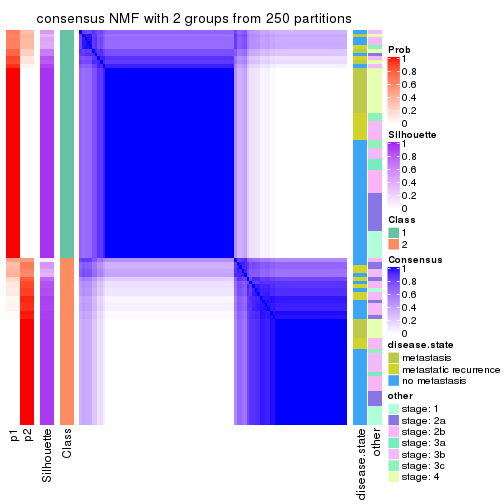</p>

</div>
<div id='tab-ATC-NMF-consensus-heatmap-2'>
<pre><code class="r">consensus_heatmap(res, k = 3)
</code></pre>

<p></p>

</div>
<div id='tab-ATC-NMF-consensus-heatmap-3'>
<pre><code class="r">consensus_heatmap(res, k = 4)
</code></pre>

<p></p>

</div>
<div id='tab-ATC-NMF-consensus-heatmap-4'>
<pre><code class="r">consensus_heatmap(res, k = 5)
</code></pre>

<p></p>

</div>
<div id='tab-ATC-NMF-consensus-heatmap-5'>
<pre><code class="r">consensus_heatmap(res, k = 6)
</code></pre>

<p></p>

</div>
</div>

Heatmaps for the membership of samples in all partitions to see how consistent they are:


<script>
$( function() {
	$( '#tabs-ATC-NMF-membership-heatmap' ).tabs();
} );
</script>
<div id='tabs-ATC-NMF-membership-heatmap'>
<ul>
<li><a href='#tab-ATC-NMF-membership-heatmap-1'>k = 2</a></li>
<li><a href='#tab-ATC-NMF-membership-heatmap-2'>k = 3</a></li>
<li><a href='#tab-ATC-NMF-membership-heatmap-3'>k = 4</a></li>
<li><a href='#tab-ATC-NMF-membership-heatmap-4'>k = 5</a></li>
<li><a href='#tab-ATC-NMF-membership-heatmap-5'>k = 6</a></li>
</ul>
<div id='tab-ATC-NMF-membership-heatmap-1'>
<pre><code class="r">membership_heatmap(res, k = 2)
</code></pre>

<p></p>

</div>
<div id='tab-ATC-NMF-membership-heatmap-2'>
<pre><code class="r">membership_heatmap(res, k = 3)
</code></pre>

<p></p>

</div>
<div id='tab-ATC-NMF-membership-heatmap-3'>
<pre><code class="r">membership_heatmap(res, k = 4)
</code></pre>

<p></p>

</div>
<div id='tab-ATC-NMF-membership-heatmap-4'>
<pre><code class="r">membership_heatmap(res, k = 5)
</code></pre>

<p></p>

</div>
<div id='tab-ATC-NMF-membership-heatmap-5'>
<pre><code class="r">membership_heatmap(res, k = 6)
</code></pre>

<p></p>

</div>
</div>

As soon as we have had the classes for columns, we can look for signatures
which are significantly different between classes which can be candidate marks
for certain classes. Following are the heatmaps for signatures.


Signature heatmaps where rows are scaled:


<script>
$( function() {
	$( '#tabs-ATC-NMF-get-signatures' ).tabs();
} );
</script>
<div id='tabs-ATC-NMF-get-signatures'>
<ul>
<li><a href='#tab-ATC-NMF-get-signatures-1'>k = 2</a></li>
<li><a href='#tab-ATC-NMF-get-signatures-2'>k = 3</a></li>
<li><a href='#tab-ATC-NMF-get-signatures-3'>k = 4</a></li>
<li><a href='#tab-ATC-NMF-get-signatures-4'>k = 5</a></li>
<li><a href='#tab-ATC-NMF-get-signatures-5'>k = 6</a></li>
</ul>
<div id='tab-ATC-NMF-get-signatures-1'>
<pre><code class="r">get_signatures(res, k = 2)
</code></pre>

<p></p>

</div>
<div id='tab-ATC-NMF-get-signatures-2'>
<pre><code class="r">get_signatures(res, k = 3)
</code></pre>

<p></p>

</div>
<div id='tab-ATC-NMF-get-signatures-3'>
<pre><code class="r">get_signatures(res, k = 4)
</code></pre>

<p></p>

</div>
<div id='tab-ATC-NMF-get-signatures-4'>
<pre><code class="r">get_signatures(res, k = 5)
</code></pre>

<p></p>

</div>
<div id='tab-ATC-NMF-get-signatures-5'>
<pre><code class="r">get_signatures(res, k = 6)
</code></pre>

<p></p>

</div>
</div>


Signature heatmaps where rows are not scaled:


<script>
$( function() {
	$( '#tabs-ATC-NMF-get-signatures-no-scale' ).tabs();
} );
</script>
<div id='tabs-ATC-NMF-get-signatures-no-scale'>
<ul>
<li><a href='#tab-ATC-NMF-get-signatures-no-scale-1'>k = 2</a></li>
<li><a href='#tab-ATC-NMF-get-signatures-no-scale-2'>k = 3</a></li>
<li><a href='#tab-ATC-NMF-get-signatures-no-scale-3'>k = 4</a></li>
<li><a href='#tab-ATC-NMF-get-signatures-no-scale-4'>k = 5</a></li>
<li><a href='#tab-ATC-NMF-get-signatures-no-scale-5'>k = 6</a></li>
</ul>
<div id='tab-ATC-NMF-get-signatures-no-scale-1'>
<pre><code class="r">get_signatures(res, k = 2, scale_rows = FALSE)
</code></pre>

<p>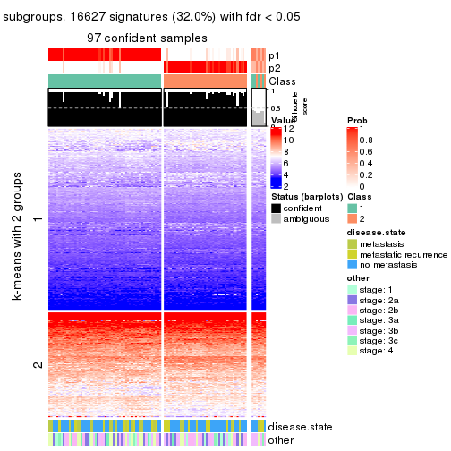</p>

</div>
<div id='tab-ATC-NMF-get-signatures-no-scale-2'>
<pre><code class="r">get_signatures(res, k = 3, scale_rows = FALSE)
</code></pre>

<p></p>

</div>
<div id='tab-ATC-NMF-get-signatures-no-scale-3'>
<pre><code class="r">get_signatures(res, k = 4, scale_rows = FALSE)
</code></pre>

<p></p>

</div>
<div id='tab-ATC-NMF-get-signatures-no-scale-4'>
<pre><code class="r">get_signatures(res, k = 5, scale_rows = FALSE)
</code></pre>

<p></p>

</div>
<div id='tab-ATC-NMF-get-signatures-no-scale-5'>
<pre><code class="r">get_signatures(res, k = 6, scale_rows = FALSE)
</code></pre>

<p></p>

</div>
</div>


Compare the overlap of signatures from different k:

```r
compare_signatures(res)
```


`get_signature()` returns a data frame invisibly. TO get the list of signatures, the function
call should be assigned to a variable explicitly. In following code, if `plot` argument is set
to `FALSE`, no heatmap is plotted while only the differential analysis is performed.

```r
# code only for demonstration
tb = get_signature(res, k = ..., plot = FALSE)
```

An example of the output of `tb` is:

```
#>   which_row         fdr    mean_1    mean_2 scaled_mean_1 scaled_mean_2 km
#> 1        38 0.042760348  8.373488  9.131774    -0.5533452     0.5164555  1
#> 2        40 0.018707592  7.106213  8.469186    -0.6173731     0.5762149  1
#> 3        55 0.019134737 10.221463 11.207825    -0.6159697     0.5749050  1
#> 4        59 0.006059896  5.921854  7.869574    -0.6899429     0.6439467  1
#> 5        60 0.018055526  8.928898 10.211722    -0.6204761     0.5791110  1
#> 6        98 0.009384629 15.714769 14.887706     0.6635654    -0.6193277  2
...
```

The columns in `tb` are:

1. `which_row`: row indices corresponding to the input matrix.
2. `fdr`: FDR for the differential test. 
3. `mean_x`: The mean value in group x.
4. `scaled_mean_x`: The mean value in group x after rows are scaled.
5. `km`: Row groups if k-means clustering is applied to rows.


UMAP plot which shows how samples are separated.


<script>
$( function() {
	$( '#tabs-ATC-NMF-dimension-reduction' ).tabs();
} );
</script>
<div id='tabs-ATC-NMF-dimension-reduction'>
<ul>
<li><a href='#tab-ATC-NMF-dimension-reduction-1'>k = 2</a></li>
<li><a href='#tab-ATC-NMF-dimension-reduction-2'>k = 3</a></li>
<li><a href='#tab-ATC-NMF-dimension-reduction-3'>k = 4</a></li>
<li><a href='#tab-ATC-NMF-dimension-reduction-4'>k = 5</a></li>
<li><a href='#tab-ATC-NMF-dimension-reduction-5'>k = 6</a></li>
</ul>
<div id='tab-ATC-NMF-dimension-reduction-1'>
<pre><code class="r">dimension_reduction(res, k = 2, method = &quot;UMAP&quot;)
</code></pre>

<p></p>

</div>
<div id='tab-ATC-NMF-dimension-reduction-2'>
<pre><code class="r">dimension_reduction(res, k = 3, method = &quot;UMAP&quot;)
</code></pre>

<p></p>

</div>
<div id='tab-ATC-NMF-dimension-reduction-3'>
<pre><code class="r">dimension_reduction(res, k = 4, method = &quot;UMAP&quot;)
</code></pre>

<p></p>

</div>
<div id='tab-ATC-NMF-dimension-reduction-4'>
<pre><code class="r">dimension_reduction(res, k = 5, method = &quot;UMAP&quot;)
</code></pre>

<p></p>

</div>
<div id='tab-ATC-NMF-dimension-reduction-5'>
<pre><code class="r">dimension_reduction(res, k = 6, method = &quot;UMAP&quot;)
</code></pre>

<p></p>

</div>
</div>


Following heatmap shows how subgroups are split when increasing `k`:

```r
collect_classes(res)
```


Test correlation between subgroups and known annotations. If the known
annotation is numeric, one-way ANOVA test is applied, and if the known
annotation is discrete, chi-squared contingency table test is applied.

```r
test_to_known_factors(res)
```

```
#>          n disease.state(p) other(p) k
#> ATC:NMF 97          0.27444   0.5000 2
#> ATC:NMF 74          0.66041   0.5695 3
#> ATC:NMF 68          0.01695   0.0502 4
#> ATC:NMF 61          0.02573   0.0623 5
#> ATC:NMF 40          0.00311   0.0251 6
```


If matrix rows can be associated to genes, consider to use `functional_enrichment(res,
...)` to perform function enrichment for the signature genes. See [this vignette](http://bioconductor.org/packages/devel/bioc/vignettes/cola/inst/doc/functional_enrichment.html) for more detailed explanations.


 

## Session info


```r
sessionInfo()
```

```
#> R version 3.6.0 (2019-04-26)
#> Platform: x86_64-pc-linux-gnu (64-bit)
#> Running under: CentOS Linux 7 (Core)
#> 
#> Matrix products: default
#> BLAS:   /usr/lib64/libblas.so.3.4.2
#> LAPACK: /usr/lib64/liblapack.so.3.4.2
#> 
#> locale:
#>  [1] LC_CTYPE=en_GB.UTF-8       LC_NUMERIC=C               LC_TIME=en_GB.UTF-8       
#>  [4] LC_COLLATE=en_GB.UTF-8     LC_MONETARY=en_GB.UTF-8    LC_MESSAGES=en_GB.UTF-8   
#>  [7] LC_PAPER=en_GB.UTF-8       LC_NAME=C                  LC_ADDRESS=C              
#> [10] LC_TELEPHONE=C             LC_MEASUREMENT=en_GB.UTF-8 LC_IDENTIFICATION=C       
#> 
#> attached base packages:
#> [1] grid      stats     graphics  grDevices utils     datasets  methods   base     
#> 
#> other attached packages:
#> [1] genefilter_1.66.0    ComplexHeatmap_2.3.1 markdown_1.1         knitr_1.26          
#> [5] GetoptLong_0.1.7     cola_1.3.2          
#> 
#> loaded via a namespace (and not attached):
#>  [1] circlize_0.4.8       shape_1.4.4          xfun_0.11            slam_0.1-46         
#>  [5] lattice_0.20-38      splines_3.6.0        colorspace_1.4-1     vctrs_0.2.0         
#>  [9] stats4_3.6.0         blob_1.2.0           XML_3.98-1.20        survival_2.44-1.1   
#> [13] rlang_0.4.2          pillar_1.4.2         DBI_1.0.0            BiocGenerics_0.30.0 
#> [17] bit64_0.9-7          RColorBrewer_1.1-2   matrixStats_0.55.0   stringr_1.4.0       
#> [21] GlobalOptions_0.1.1  evaluate_0.14        memoise_1.1.0        Biobase_2.44.0      
#> [25] IRanges_2.18.3       parallel_3.6.0       AnnotationDbi_1.46.1 highr_0.8           
#> [29] Rcpp_1.0.3           xtable_1.8-4         backports_1.1.5      S4Vectors_0.22.1    
#> [33] annotate_1.62.0      skmeans_0.2-11       bit_1.1-14           microbenchmark_1.4-7
#> [37] brew_1.0-6           impute_1.58.0        rjson_0.2.20         png_0.1-7           
#> [41] digest_0.6.23        stringi_1.4.3        polyclip_1.10-0      clue_0.3-57         
#> [45] tools_3.6.0          bitops_1.0-6         magrittr_1.5         eulerr_6.0.0        
#> [49] RCurl_1.95-4.12      RSQLite_2.1.4        tibble_2.1.3         cluster_2.1.0       
#> [53] crayon_1.3.4         pkgconfig_2.0.3      zeallot_0.1.0        Matrix_1.2-17       
#> [57] xml2_1.2.2           httr_1.4.1           R6_2.4.1             mclust_5.4.5        
#> [61] compiler_3.6.0
```


